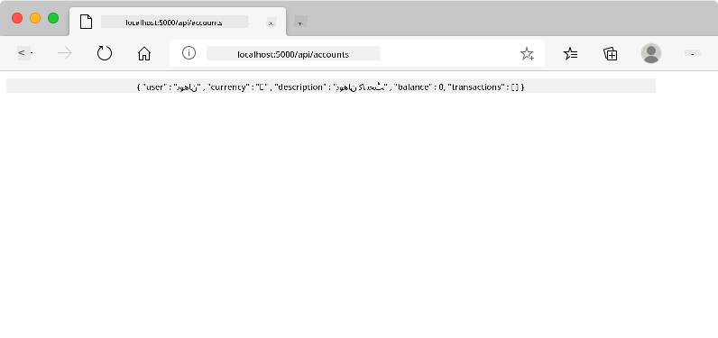
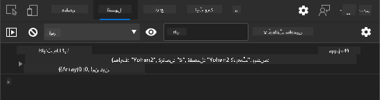
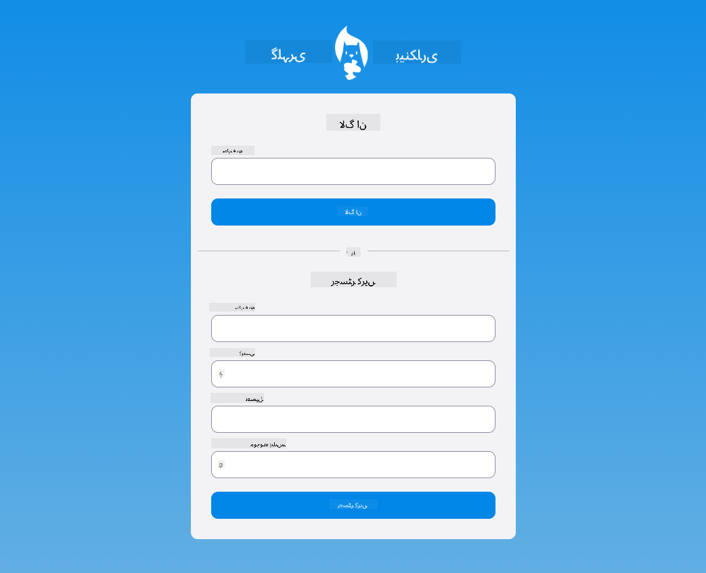

<!--
CO_OP_TRANSLATOR_METADATA:
{
  "original_hash": "b667b7d601e2ee19acb5aa9d102dc9f3",
  "translation_date": "2025-08-26T00:07:31+00:00",
  "source_file": "7-bank-project/2-forms/README.md",
  "language_code": "ur"
}
-->
# بینکنگ ایپ بنائیں حصہ 2: لاگ ان اور رجسٹریشن فارم بنائیں

## لیکچر سے پہلے کا کوئز

[لیکچر سے پہلے کا کوئز](https://ashy-river-0debb7803.1.azurestaticapps.net/quiz/43)

### تعارف

تقریباً تمام جدید ویب ایپس میں آپ اپنا اکاؤنٹ بنا سکتے ہیں تاکہ آپ کے پاس اپنی ذاتی جگہ ہو۔ چونکہ ایک وقت میں کئی صارفین ویب ایپ تک رسائی حاصل کر سکتے ہیں، آپ کو ایک ایسا طریقہ کار درکار ہوتا ہے جو ہر صارف کا ذاتی ڈیٹا الگ سے محفوظ کرے اور یہ منتخب کرے کہ کون سی معلومات دکھانی ہیں۔ ہم [صارف کی شناخت کو محفوظ طریقے سے](https://en.wikipedia.org/wiki/Authentication) منظم کرنے کا احاطہ نہیں کریں گے کیونکہ یہ خود ایک وسیع موضوع ہے، لیکن ہم یہ یقینی بنائیں گے کہ ہر صارف ہماری ایپ پر ایک (یا زیادہ) بینک اکاؤنٹ بنا سکے۔

اس حصے میں ہم HTML فارم استعمال کریں گے تاکہ اپنی ویب ایپ میں لاگ ان اور رجسٹریشن شامل کریں۔ ہم دیکھیں گے کہ ڈیٹا کو سرور API پر پروگرام کے ذریعے کیسے بھیجا جائے، اور آخر میں صارف کے ان پٹ کے لیے بنیادی توثیق کے اصول کیسے متعین کیے جائیں۔

### پیشگی شرط

آپ کو ویب ایپ کے [HTML ٹیمپلیٹس اور روٹنگ](../1-template-route/README.md) مکمل کرنے کی ضرورت ہے۔ آپ کو [Node.js](https://nodejs.org) انسٹال کرنے اور [سرور API](../api/README.md) کو مقامی طور پر چلانے کی ضرورت ہے تاکہ آپ اکاؤنٹس بنانے کے لیے ڈیٹا بھیج سکیں۔

**نوٹ کریں**
آپ کے پاس ایک وقت میں دو ٹرمینلز چل رہے ہوں گے جیسا کہ نیچے درج ہے:
1. مرکزی بینک ایپ کے لیے جو ہم نے [HTML ٹیمپلیٹس اور روٹنگ](../1-template-route/README.md) سبق میں بنائی تھی۔
2. [بینک ایپ سرور API](../api/README.md) کے لیے جو ہم نے ابھی اوپر سیٹ اپ کیا۔

آپ کو سبق کے باقی حصے کے ساتھ چلنے کے لیے دونوں سرورز کو چلانا ہوگا۔ وہ مختلف پورٹس (پورٹ `3000` اور پورٹ `5000`) پر سن رہے ہیں، لہذا سب کچھ ٹھیک کام کرنا چاہیے۔

آپ یہ کمانڈ ٹرمینل میں چلا کر چیک کر سکتے ہیں کہ سرور صحیح طریقے سے چل رہا ہے:

```sh
curl http://localhost:5000/api
# -> should return "Bank API v1.0.0" as a result
```

---

## فارم اور کنٹرولز

`<form>` عنصر HTML دستاویز کے ایک حصے کو گھیرتا ہے جہاں صارف انٹرایکٹو کنٹرولز کے ساتھ ڈیٹا داخل اور جمع کر سکتا ہے۔ فارم کے اندر استعمال ہونے والے صارف انٹرفیس (UI) کنٹرولز کی تمام اقسام موجود ہیں، جن میں سب سے عام `<input>` اور `<button>` عناصر ہیں۔

`<input>` کے مختلف [اقسام](https://developer.mozilla.org/docs/Web/HTML/Element/input) ہیں، مثال کے طور پر صارف کا یوزر نیم داخل کرنے کے لیے آپ یہ استعمال کر سکتے ہیں:

```html
<input id="username" name="username" type="text">
```

`name` ایٹریبیوٹ اس پراپرٹی کا نام ہوگا جب فارم ڈیٹا بھیجا جائے گا۔ `id` ایٹریبیوٹ `<label>` کو فارم کنٹرول کے ساتھ منسلک کرنے کے لیے استعمال ہوتا ہے۔

> [`<input>` اقسام](https://developer.mozilla.org/docs/Web/HTML/Element/input) اور [دیگر فارم کنٹرولز](https://developer.mozilla.org/docs/Learn/Forms/Other_form_controls) کی پوری فہرست دیکھیں تاکہ ان تمام نیٹو UI عناصر کا اندازہ لگایا جا سکے جو آپ اپنے UI بناتے وقت استعمال کر سکتے ہیں۔

✅ نوٹ کریں کہ `<input>` ایک [خالی عنصر](https://developer.mozilla.org/docs/Glossary/Empty_element) ہے جس پر آپ کو *مماثل اختتامی ٹیگ* شامل نہیں کرنا چاہیے۔ آپ خود بند ہونے والے `<input/>` نوٹیشن استعمال کر سکتے ہیں، لیکن یہ ضروری نہیں ہے۔

فارم کے اندر `<button>` عنصر تھوڑا خاص ہے۔ اگر آپ اس کا `type` ایٹریبیوٹ مخصوص نہیں کرتے ہیں، تو یہ دبائے جانے پر خود بخود فارم ڈیٹا کو سرور پر جمع کر دے گا۔ یہاں ممکنہ `type` اقدار ہیں:

- `submit`: فارم کے اندر ڈیفالٹ، بٹن فارم جمع کرانے کی کارروائی کو متحرک کرتا ہے۔
- `reset`: بٹن تمام فارم کنٹرولز کو ان کی ابتدائی اقدار پر ری سیٹ کرتا ہے۔
- `button`: بٹن دبائے جانے پر کوئی ڈیفالٹ رویہ تفویض نہ کریں۔ آپ پھر جاوا اسکرپٹ کا استعمال کرتے ہوئے اس پر حسب ضرورت کارروائیاں تفویض کر سکتے ہیں۔

### کام

آئیے `login` ٹیمپلیٹ میں ایک فارم شامل کرکے شروع کرتے ہیں۔ ہمیں ایک *یوزر نیم* فیلڈ اور ایک *لاگ ان* بٹن کی ضرورت ہوگی۔

```html
<template id="login">
  <h1>Bank App</h1>
  <section>
    <h2>Login</h2>
    <form id="loginForm">
      <label for="username">Username</label>
      <input id="username" name="user" type="text">
      <button>Login</button>
    </form>
  </section>
</template>
```

اگر آپ قریب سے دیکھیں تو آپ دیکھ سکتے ہیں کہ ہم نے یہاں ایک `<label>` عنصر بھی شامل کیا ہے۔ `<label>` عناصر UI کنٹرولز کو نام دینے کے لیے استعمال ہوتے ہیں، جیسے ہمارا یوزر نیم فیلڈ۔ لیبلز آپ کے فارم کی پڑھنے کی صلاحیت کے لیے اہم ہیں، لیکن اضافی فوائد کے ساتھ بھی آتے ہیں:

- فارم کنٹرول کے ساتھ لیبل کو منسلک کرکے، یہ معاون ٹیکنالوجیز استعمال کرنے والے صارفین (جیسے اسکرین ریڈر) کو یہ سمجھنے میں مدد کرتا ہے کہ ان سے کس ڈیٹا کی توقع کی جا رہی ہے۔
- آپ لیبل پر کلک کر سکتے ہیں تاکہ متعلقہ ان پٹ پر براہ راست فوکس ڈال سکیں، جس سے ٹچ اسکرین والے آلات پر پہنچنا آسان ہو جاتا ہے۔

> [ویب پر رسائی](https://developer.mozilla.org/docs/Learn/Accessibility/What_is_accessibility) ایک بہت اہم موضوع ہے جسے اکثر نظر انداز کیا جاتا ہے۔ [سیمینٹک HTML عناصر](https://developer.mozilla.org/docs/Learn/Accessibility/HTML) کی بدولت، اگر آپ انہیں صحیح طریقے سے استعمال کریں تو قابل رسائی مواد بنانا مشکل نہیں ہے۔ آپ [رسائی کے بارے میں مزید پڑھ سکتے ہیں](https://developer.mozilla.org/docs/Web/Accessibility) تاکہ عام غلطیوں سے بچ سکیں اور ایک ذمہ دار ڈویلپر بن سکیں۔

اب ہم رجسٹریشن کے لیے دوسرا فارم شامل کریں گے، بالکل پچھلے والے کے نیچے:

```html
<hr/>
<h2>Register</h2>
<form id="registerForm">
  <label for="user">Username</label>
  <input id="user" name="user" type="text">
  <label for="currency">Currency</label>
  <input id="currency" name="currency" type="text" value="$">
  <label for="description">Description</label>
  <input id="description" name="description" type="text">
  <label for="balance">Current balance</label>
  <input id="balance" name="balance" type="number" value="0">
  <button>Register</button>
</form>
```

`value` ایٹریبیوٹ کا استعمال کرتے ہوئے ہم کسی دیے گئے ان پٹ کے لیے ڈیفالٹ ویلیو کی وضاحت کر سکتے ہیں۔
نوٹ کریں کہ `balance` کے لیے ان پٹ میں `number` قسم ہے۔ کیا یہ دوسرے ان پٹس سے مختلف نظر آتا ہے؟ اس کے ساتھ تعامل کرنے کی کوشش کریں۔

✅ کیا آپ صرف کی بورڈ کا استعمال کرتے ہوئے فارم کو نیویگیٹ اور ان کے ساتھ تعامل کر سکتے ہیں؟ آپ یہ کیسے کریں گے؟

## ڈیٹا کو سرور پر جمع کرانا

اب جب کہ ہمارے پاس ایک فعال UI ہے، اگلا مرحلہ ڈیٹا کو سرور پر بھیجنا ہے۔ آئیے اپنے موجودہ کوڈ کا استعمال کرتے ہوئے ایک فوری ٹیسٹ کرتے ہیں: کیا ہوتا ہے اگر آپ *لاگ ان* یا *رجسٹر* بٹن پر کلک کریں؟

کیا آپ نے اپنے براؤزر کے URL سیکشن میں تبدیلی دیکھی؟


`<form>` کے لیے ڈیفالٹ ایکشن موجودہ سرور URL پر فارم کو [GET طریقہ](https://www.w3.org/Protocols/rfc2616/rfc2616-sec9.html#sec9.3) کا استعمال کرتے ہوئے جمع کرانا ہے، فارم ڈیٹا کو براہ راست URL میں شامل کرتے ہوئے۔ تاہم، اس طریقے میں کچھ خامیاں ہیں:

- بھیجے گئے ڈیٹا کا سائز بہت محدود ہے (تقریباً 2000 حروف)
- ڈیٹا URL میں براہ راست نظر آتا ہے (پاس ورڈز کے لیے اچھا نہیں)
- یہ فائل اپلوڈز کے ساتھ کام نہیں کرتا

اسی لیے آپ اسے [POST طریقہ](https://www.w3.org/Protocols/rfc2616/rfc2616-sec9.html#sec9.5) استعمال کرنے کے لیے تبدیل کر سکتے ہیں، جو فارم ڈیٹا کو HTTP درخواست کے باڈی میں سرور پر بھیجتا ہے، بغیر پچھلی حدود کے۔

> اگرچہ POST ڈیٹا بھیجنے کے لیے سب سے زیادہ استعمال ہونے والا طریقہ ہے، [کچھ مخصوص منظرناموں میں](https://www.w3.org/2001/tag/doc/whenToUseGet.html) GET طریقہ استعمال کرنا بہتر ہوتا ہے، جیسے سرچ فیلڈ کو نافذ کرتے وقت۔

### کام

رجسٹریشن فارم میں `action` اور `method` پراپرٹیز شامل کریں:

```html
<form id="registerForm" action="//localhost:5000/api/accounts" method="POST">
```

اب اپنے نام کے ساتھ نیا اکاؤنٹ رجسٹر کرنے کی کوشش کریں۔ *رجسٹر* بٹن پر کلک کرنے کے بعد آپ کو کچھ ایسا نظر آنا چاہیے:



اگر سب کچھ ٹھیک ہو جائے، تو سرور آپ کی درخواست کا جواب ایک [JSON](https://www.json.org/json-en.html) جواب کے ساتھ دے گا جس میں وہ اکاؤنٹ ڈیٹا ہوگا جو بنایا گیا تھا۔

✅ دوبارہ اسی نام کے ساتھ رجسٹر کرنے کی کوشش کریں۔ کیا ہوتا ہے؟

## صفحہ ری لوڈ کیے بغیر ڈیٹا جمع کرانا

جیسا کہ آپ نے شاید محسوس کیا، اس طریقہ کار کے ساتھ ایک معمولی مسئلہ ہے جو ہم نے ابھی استعمال کیا: فارم جمع کراتے وقت، ہم اپنی ایپ سے باہر نکل جاتے ہیں اور براؤزر سرور URL پر ری ڈائریکٹ ہو جاتا ہے۔ ہم اپنی ویب ایپ کے ساتھ تمام صفحہ ری لوڈز سے بچنے کی کوشش کر رہے ہیں، کیونکہ ہم ایک [سنگل پیج ایپلیکیشن (SPA)](https://en.wikipedia.org/wiki/Single-page_application) بنا رہے ہیں۔

فارم ڈیٹا کو سرور پر بھیجنے کے لیے بغیر صفحہ ری لوڈ کیے، ہمیں جاوا اسکرپٹ کوڈ استعمال کرنا ہوگا۔ `<form>` عنصر کے `action` پراپرٹی میں URL ڈالنے کے بجائے، آپ کسی بھی جاوا اسکرپٹ کوڈ کو `javascript:` سٹرنگ کے ساتھ شروع کر سکتے ہیں تاکہ حسب ضرورت کارروائی انجام دی جا سکے۔ اس کا استعمال کرتے ہوئے آپ کو کچھ کام انجام دینے ہوں گے جو پہلے براؤزر خود بخود کرتا تھا:

- فارم ڈیٹا حاصل کریں
- فارم ڈیٹا کو مناسب فارمیٹ میں تبدیل اور انکوڈ کریں
- HTTP درخواست بنائیں اور اسے سرور پر بھیجیں

### کام

رجسٹریشن فارم کے `action` کو تبدیل کریں:

```html
<form id="registerForm" action="javascript:register()">
```

`app.js` کھولیں اور ایک نیا فنکشن `register` کے نام سے شامل کریں:

```js
function register() {
  const registerForm = document.getElementById('registerForm');
  const formData = new FormData(registerForm);
  const data = Object.fromEntries(formData);
  const jsonData = JSON.stringify(data);
}
```

یہاں ہم فارم عنصر کو `getElementById()` کا استعمال کرتے ہوئے حاصل کرتے ہیں اور [`FormData`](https://developer.mozilla.org/docs/Web/API/FormData) ہیلپر کا استعمال کرتے ہوئے فارم کنٹرولز سے اقدار کو کلیدی/ویلیو جوڑوں کے سیٹ کے طور پر نکالتے ہیں۔ پھر ہم ڈیٹا کو ایک باقاعدہ آبجیکٹ میں تبدیل کرتے ہیں [`Object.fromEntries()`](https://developer.mozilla.org/docs/Web/JavaScript/Reference/Global_Objects/Object/fromEntries) کا استعمال کرتے ہوئے اور آخر میں ڈیٹا کو [JSON](https://www.json.org/json-en.html) میں سیریلائز کرتے ہیں، جو ویب پر ڈیٹا کے تبادلے کے لیے عام طور پر استعمال ہونے والا فارمیٹ ہے۔

ڈیٹا اب سرور پر بھیجنے کے لیے تیار ہے۔ ایک نیا فنکشن `createAccount` کے نام سے بنائیں:

```js
async function createAccount(account) {
  try {
    const response = await fetch('//localhost:5000/api/accounts', {
      method: 'POST',
      headers: { 'Content-Type': 'application/json' },
      body: account
    });
    return await response.json();
  } catch (error) {
    return { error: error.message || 'Unknown error' };
  }
}
```

یہ فنکشن کیا کر رہا ہے؟ پہلے، یہاں `async` کلیدی لفظ پر توجہ دیں۔ اس کا مطلب ہے کہ فنکشن میں ایسا کوڈ شامل ہے جو [**غیر متزامن**](https://developer.mozilla.org/docs/Web/JavaScript/Reference/Statements/async_function) طور پر عمل کرے گا۔ جب `await` کلیدی لفظ کے ساتھ استعمال کیا جاتا ہے، تو یہ غیر متزامن کوڈ کے عمل کا انتظار کرنے کی اجازت دیتا ہے - جیسے یہاں سرور کے جواب کا انتظار کرنا - اس سے پہلے کہ آگے بڑھا جائے۔

`fetch()` API کا استعمال کرتے ہوئے ہم JSON ڈیٹا کو سرور پر بھیجتے ہیں۔ یہ طریقہ 2 پیرامیٹرز لیتا ہے:

- سرور کا URL، لہذا ہم یہاں `//localhost:5000/api/accounts` واپس ڈال دیتے ہیں۔
- درخواست کی ترتیبات۔ یہ وہ جگہ ہے جہاں ہم طریقہ کو `POST` پر سیٹ کرتے ہیں اور درخواست کے لیے `body` فراہم کرتے ہیں۔ چونکہ ہم JSON ڈیٹا کو سرور پر بھیج رہے ہیں، ہمیں `Content-Type` ہیڈر کو `application/json` پر بھی سیٹ کرنا ہوگا تاکہ سرور کو معلوم ہو کہ مواد کو کیسے سمجھنا ہے۔

چونکہ سرور درخواست کا جواب JSON کے ساتھ دے گا، ہم `await response.json()` کا استعمال کرتے ہوئے JSON مواد کو پارس کر سکتے ہیں اور نتیجے میں آنے والے آبجیکٹ کو واپس کر سکتے ہیں۔ نوٹ کریں کہ یہ طریقہ غیر متزامن ہے، لہذا ہم یہاں واپس آنے سے پہلے `await` کلیدی لفظ استعمال کرتے ہیں تاکہ یہ یقینی بنایا جا سکے کہ پارسنگ کے دوران کوئی بھی غلطی بھی پکڑی جائے۔

اب `register` فنکشن میں کچھ کوڈ شامل کریں تاکہ `createAccount()` کو کال کریں:

```js
const result = await createAccount(jsonData);
```

چونکہ ہم یہاں `await` کلیدی لفظ استعمال کرتے ہیں، ہمیں `register` فنکشن سے پہلے `async` کلیدی لفظ شامل کرنا ہوگا:

```js
async function register() {
```

آخر میں، نتیجہ چیک کرنے کے لیے کچھ لاگز شامل کریں۔ حتمی فنکشن اس طرح نظر آنا چاہیے:

```js
async function register() {
  const registerForm = document.getElementById('registerForm');
  const formData = new FormData(registerForm);
  const jsonData = JSON.stringify(Object.fromEntries(formData));
  const result = await createAccount(jsonData);

  if (result.error) {
    return console.log('An error occurred:', result.error);
  }

  console.log('Account created!', result);
}
```

یہ تھوڑا طویل تھا لیکن ہم وہاں پہنچ گئے! اگر آپ اپنے [براؤزر ڈویلپر ٹولز](https://developer.mozilla.org/docs/Learn/Common_questions/What_are_browser_developer_tools) کھولیں، اور نیا اکاؤنٹ رجسٹر کرنے کی کوشش کریں، تو آپ کو ویب صفحہ پر کوئی تبدیلی نظر نہیں آئے گی لیکن کنسول میں ایک پیغام ظاہر ہوگا جو اس بات کی تصدیق کرے گا کہ سب کچھ کام کر رہا ہے۔



✅ کیا آپ کو لگتا ہے کہ ڈیٹا سرور پر محفوظ طریقے سے بھیجا گیا ہے؟ اگر کوئی درخواست کو روکنے میں کامیاب ہو جائے تو کیا ہوگا؟ آپ [HTTPS](https://en.wikipedia.org/wiki/HTTPS) کے بارے میں پڑھ سکتے ہیں تاکہ محفوظ ڈیٹا کمیونیکیشن کے بارے میں مزید جان سکیں۔

## ڈیٹا کی توثیق

اگر آپ یوزر نیم سیٹ کیے بغیر نیا اکاؤنٹ رجسٹر کرنے کی کوشش کریں، تو آپ دیکھ سکتے ہیں کہ سرور [400 (خراب درخواست)](https://developer.mozilla.org/docs/Web/HTTP/Status/400#:~:text=The%20HyperText%20Transfer%20Protocol%20(HTTP,%2C%20or%20deceptive%20request%20routing).) اسٹیٹس کوڈ کے ساتھ ایک غلطی واپس کرتا ہے۔

سرور پر ڈیٹا بھیجنے سے پہلے یہ ایک اچھا عمل ہے کہ [فارم ڈیٹا کی توثیق](https://developer.mozilla.org/docs/Learn/Forms/Form_validation) پہلے سے کی جائے جب ممکن ہو، تاکہ یہ یقینی بنایا جا سکے کہ آپ ایک درست درخواست بھیج رہے ہیں۔ HTML5 فارم کنٹرولز مختلف ایٹریبیوٹس کا استعمال کرتے ہوئے بلٹ ان توثیق فراہم کرتے ہیں:

- `required`: فیلڈ کو بھرنا ضروری ہے ورنہ فارم جمع نہیں کیا جا سکتا۔
- `minlength` اور `maxlength`: ٹیکسٹ فیلڈز میں حروف کی کم از کم اور زیادہ سے زیادہ تعداد کی وضاحت کرتا ہے۔
- `min` اور `max`: عددی فیلڈ کی کم از کم اور زیادہ سے زیادہ ویلیو کی وضاحت کرتا ہے۔
- `type`: متوقع ڈیٹا کی قسم کی وضاحت کرتا ہے، جیسے `number`, `email`, `file` یا [دیگر بلٹ ان اقسام](https://developer.mozilla.org/docs/Web/HTML/Element/input)۔ یہ ایٹریبیوٹ فارم کنٹرول کی بصری رینڈرنگ کو بھی تبدیل کر سکتا ہے۔
- `pattern`: ایک [ریگولر ایکسپریشن](https://developer.mozilla.org/docs/Web/JavaScript/Guide/Regular_Expressions) پیٹرن کی وضاحت کرنے کی اجازت دیتا ہے تاکہ یہ جانچا جا سکے کہ داخل کردہ ڈیٹا درست ہے یا نہیں۔
آپ اپنے فارم کنٹرولز کی ظاہری شکل کو اس بات پر منحصر کرتے ہوئے حسب ضرورت بنا سکتے ہیں کہ وہ درست ہیں یا نہیں، `:valid` اور `:invalid` CSS پیسوڈو-کلاسز کا استعمال کرتے ہوئے۔
### کام

ایک نیا اکاؤنٹ بنانے کے لیے دو ضروری فیلڈز ہیں: یوزر نیم اور کرنسی۔ باقی فیلڈز اختیاری ہیں۔ فارم کے HTML کو اپ ڈیٹ کریں، `required` ایٹریبیوٹ اور فیلڈ کے لیبل میں متن استعمال کرتے ہوئے تاکہ:

```html
<label for="user">Username (required)</label>
<input id="user" name="user" type="text" required>
...
<label for="currency">Currency (required)</label>
<input id="currency" name="currency" type="text" value="$" required>
```

اگرچہ اس خاص سرور امپلیمنٹیشن میں فیلڈز کی زیادہ سے زیادہ لمبائی پر کوئی خاص حد مقرر نہیں کی گئی ہے، لیکن یہ ہمیشہ ایک اچھا عمل ہے کہ یوزر کے متن کے اندراج کے لیے مناسب حد مقرر کی جائے۔

ٹیکسٹ فیلڈز میں `maxlength` ایٹریبیوٹ شامل کریں:

```html
<input id="user" name="user" type="text" maxlength="20" required>
...
<input id="currency" name="currency" type="text" value="$" maxlength="5" required>
...
<input id="description" name="description" type="text" maxlength="100">
```

اب اگر آپ *Register* بٹن دبائیں اور کوئی فیلڈ ہماری مقرر کردہ ویلیڈیشن رولز کا احترام نہ کرے، تو آپ کو کچھ ایسا نظر آئے گا:


ایسی ویلیڈیشن جو ڈیٹا سرور کو بھیجنے سے *پہلے* کی جاتی ہے، اسے **کلائنٹ سائیڈ** ویلیڈیشن کہا جاتا ہے۔ لیکن نوٹ کریں کہ تمام چیکس ڈیٹا بھیجے بغیر کرنا ہمیشہ ممکن نہیں ہوتا۔ مثال کے طور پر، ہم یہاں یہ چیک نہیں کر سکتے کہ آیا پہلے سے ہی اسی یوزر نیم کے ساتھ کوئی اکاؤنٹ موجود ہے یا نہیں، بغیر سرور کو درخواست بھیجے۔ اضافی ویلیڈیشن جو سرور پر کی جاتی ہے، اسے **سرور سائیڈ** ویلیڈیشن کہا جاتا ہے۔

عام طور پر دونوں کو نافذ کرنا ضروری ہوتا ہے، اور کلائنٹ سائیڈ ویلیڈیشن یوزر کو فوری فیڈبیک دے کر یوزر کے تجربے کو بہتر بناتی ہے، جبکہ سرور سائیڈ ویلیڈیشن یہ یقینی بناتی ہے کہ آپ جو یوزر ڈیٹا استعمال کر رہے ہیں وہ درست اور محفوظ ہے۔

---

## 🚀 چیلنج

HTML میں ایک ایرر میسج دکھائیں اگر یوزر پہلے سے موجود ہو۔

یہاں ایک مثال ہے کہ تھوڑی سی اسٹائلنگ کے بعد حتمی لاگ ان صفحہ کیسا نظر آ سکتا ہے:



## لیکچر کے بعد کا کوئز

[لیکچر کے بعد کا کوئز](https://ashy-river-0debb7803.1.azurestaticapps.net/quiz/44)

## جائزہ اور خود مطالعہ

ڈیولپرز فارم بنانے کے حوالے سے بہت تخلیقی ہو گئے ہیں، خاص طور پر ویلیڈیشن حکمت عملیوں کے بارے میں۔ مختلف فارم فلو کے بارے میں جاننے کے لیے [CodePen](https://codepen.com) دیکھیں؛ کیا آپ کچھ دلچسپ اور متاثر کن فارم تلاش کر سکتے ہیں؟

## اسائنمنٹ

[اپنے بینک ایپ کو اسٹائل کریں](assignment.md)

**ڈسکلیمر**:  
یہ دستاویز AI ترجمہ سروس [Co-op Translator](https://github.com/Azure/co-op-translator) کا استعمال کرتے ہوئے ترجمہ کی گئی ہے۔ ہم درستگی کے لیے پوری کوشش کرتے ہیں، لیکن براہ کرم آگاہ رہیں کہ خودکار ترجمے میں غلطیاں یا خامیاں ہو سکتی ہیں۔ اصل دستاویز کو اس کی اصل زبان میں مستند ذریعہ سمجھا جانا چاہیے۔ اہم معلومات کے لیے، پیشہ ور انسانی ترجمہ کی سفارش کی جاتی ہے۔ اس ترجمے کے استعمال سے پیدا ہونے والی کسی بھی غلط فہمی یا غلط تشریح کے لیے ہم ذمہ دار نہیں ہیں۔