# بینکنگ ایپ بنائیں حصہ 2: لاگ ان اور رجسٹریشن فارم بنائیں

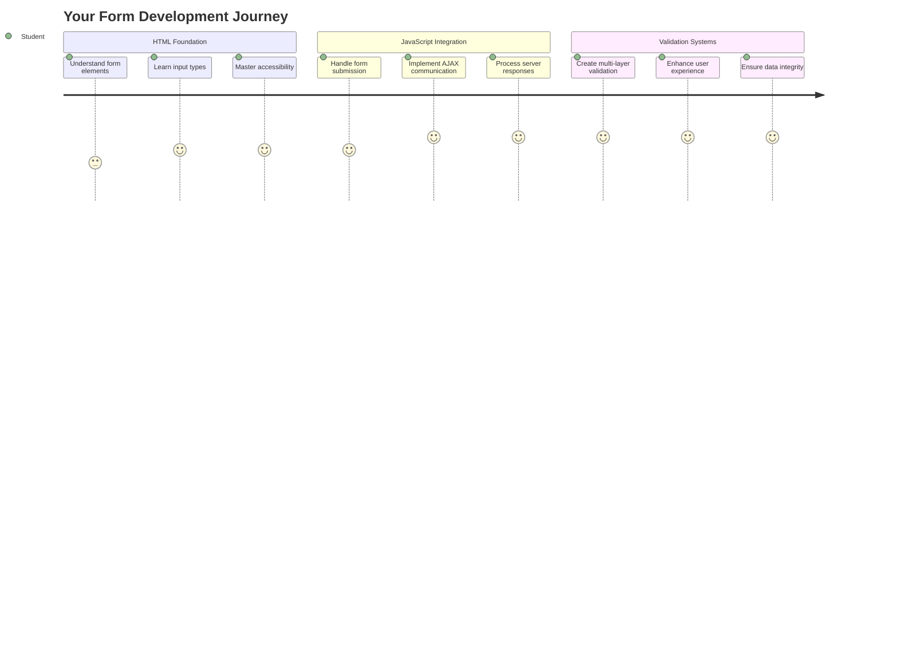

## لیکچر سے پہلے کا کوئز

[لیکچر سے پہلے کا کوئز](https://ff-quizzes.netlify.app/web/quiz/43)

کبھی آن لائن فارم بھرنے کے بعد ای میل فارمیٹ کی غلطی کا سامنا کیا؟ یا سبمٹ پر کلک کرنے کے بعد تمام معلومات کھو دی؟ ہم سب نے ان پریشان کن تجربات کا سامنا کیا ہے۔

فارمز آپ کے صارفین اور آپ کی ایپلیکیشن کی فعالیت کے درمیان پل کا کام کرتے ہیں۔ جیسے ہوائی جہازوں کو محفوظ طریقے سے منزل تک پہنچانے کے لیے ایئر ٹریفک کنٹرولرز کے محتاط پروٹوکول ہوتے ہیں، ویسے ہی اچھے ڈیزائن کردہ فارمز واضح فیڈبیک فراہم کرتے ہیں اور مہنگی غلطیوں کو روکتے ہیں۔ خراب فارمز، دوسری طرف، صارفین کو جلدی دور کر سکتے ہیں۔

اس سبق میں، ہم آپ کی جامد بینکنگ ایپ کو ایک انٹرایکٹو ایپلیکیشن میں تبدیل کریں گے۔ آپ سیکھیں گے کہ صارف کے ان پٹ کی تصدیق کرنے، سرورز کے ساتھ بات چیت کرنے، اور مددگار فیڈبیک فراہم کرنے والے فارمز کیسے بنائیں۔ اسے ایسے سمجھیں جیسے آپ ایپلیکیشن کی خصوصیات کو نیویگیٹ کرنے کے لیے کنٹرول انٹرفیس بنا رہے ہیں۔

آخر میں، آپ کے پاس ایک مکمل لاگ ان اور رجسٹریشن سسٹم ہوگا جو صارفین کو مایوسی کے بجائے کامیابی کی طرف رہنمائی کرے گا۔

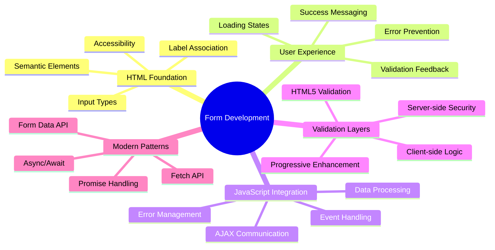

## ضروریات

فارمز بنانے سے پہلے، آئیے یقینی بنائیں کہ آپ نے سب کچھ صحیح طریقے سے سیٹ اپ کیا ہے۔ یہ سبق وہیں سے شروع ہوتا ہے جہاں ہم نے پچھلے سبق میں چھوڑا تھا، لہذا اگر آپ نے آگے بڑھنے کی کوشش کی ہے، تو آپ کو پہلے بنیادی چیزیں کام کرنے کے لیے واپس جانا پڑ سکتا ہے۔

### مطلوبہ سیٹ اپ

| جزو | حیثیت | تفصیل |
|------|-------|--------|
| [HTML ٹیمپلیٹس](../1-template-route/README.md) | ✅ ضروری | آپ کی بنیادی بینکنگ ایپ کی ساخت |
| [Node.js](https://nodejs.org) | ✅ ضروری | سرور کے لیے جاوا اسکرپٹ رن ٹائم |
| [بینک API سرور](../api/README.md) | ✅ ضروری | ڈیٹا اسٹوریج کے لیے بیک اینڈ سروس |

> 💡 **ترقیاتی ٹپ**: آپ دو الگ الگ سرورز کو ایک ساتھ چلائیں گے – ایک آپ کی فرنٹ اینڈ بینکنگ ایپ کے لیے اور دوسرا بیک اینڈ API کے لیے۔ یہ سیٹ اپ حقیقی دنیا کی ترقی کی عکاسی کرتا ہے جہاں فرنٹ اینڈ اور بیک اینڈ سروسز آزادانہ طور پر کام کرتی ہیں۔

### سرور کنفیگریشن

**آپ کے ترقیاتی ماحول میں شامل ہوگا:**
- **فرنٹ اینڈ سرور**: آپ کی بینکنگ ایپ کو فراہم کرتا ہے (عام طور پر پورٹ `3000`)
- **بیک اینڈ API سرور**: ڈیٹا اسٹوریج اور بازیافت کو ہینڈل کرتا ہے (پورٹ `5000`)
- **دونوں سرورز** بغیر کسی تنازع کے ایک ساتھ چل سکتے ہیں

**اپنے API کنکشن کی جانچ:**
```bash
curl http://localhost:5000/api
# Expected response: "Bank API v1.0.0"
```

**اگر آپ API ورژن کا جواب دیکھتے ہیں، تو آپ آگے بڑھنے کے لیے تیار ہیں!**

---

## HTML فارمز اور کنٹرولز کو سمجھنا

HTML فارمز وہ طریقہ ہیں جس کے ذریعے صارفین آپ کی ویب ایپلیکیشن کے ساتھ بات چیت کرتے ہیں۔ انہیں 19ویں صدی میں دور دراز جگہوں کو جوڑنے والے ٹیلی گراف سسٹم کے طور پر سوچیں – یہ صارف کے ارادے اور ایپلیکیشن کے جواب کے درمیان مواصلاتی پروٹوکول ہیں۔ جب سوچ سمجھ کر ڈیزائن کیا جائے، تو یہ غلطیوں کو پکڑتے ہیں، ان پٹ فارمیٹنگ کی رہنمائی کرتے ہیں، اور مددگار تجاویز فراہم کرتے ہیں۔

جدید فارمز بنیادی ٹیکسٹ ان پٹس سے نمایاں طور پر زیادہ نفیس ہیں۔ HTML5 نے خصوصی ان پٹ اقسام متعارف کروائیں جو ای میل کی تصدیق، نمبر فارمیٹنگ، اور تاریخ کے انتخاب کو خود بخود ہینڈل کرتی ہیں۔ یہ بہتریاں رسائی اور موبائل صارف کے تجربات دونوں کے لیے فائدہ مند ہیں۔

### ضروری فارم عناصر

**ہر فارم کو درکار بلڈنگ بلاکس:**

```html
<!-- Basic form structure -->
<form id="userForm" method="POST">
  <label for="username">Username</label>
  <input id="username" name="username" type="text" required>
  
  <button type="submit">Submit</button>
</form>
```

**یہ کوڈ کیا کرتا ہے:**
- **ایک فارم کنٹینر** منفرد شناخت کنندہ کے ساتھ بناتا ہے
- **ڈیٹا جمع کرانے کے لیے HTTP طریقہ** کی وضاحت کرتا ہے
- **لیبلز کو ان پٹس کے ساتھ** رسائی کے لیے منسلک کرتا ہے
- **فارم کو پروسیس کرنے کے لیے سبمٹ بٹن** کی وضاحت کرتا ہے

### جدید ان پٹ اقسام اور خصوصیات

| ان پٹ قسم | مقصد | مثال استعمال |
|-----------|-------|---------------|
| `text` | عمومی ٹیکسٹ ان پٹ | `<input type="text" name="username">` |
| `email` | ای میل کی تصدیق | `<input type="email" name="email">` |
| `password` | چھپے ہوئے ٹیکسٹ انٹری | `<input type="password" name="password">` |
| `number` | عددی ان پٹ | `<input type="number" name="balance" min="0">` |
| `tel` | فون نمبر | `<input type="tel" name="phone">` |

> 💡 **جدید HTML5 فائدہ**: مخصوص ان پٹ اقسام کا استعمال خودکار تصدیق، مناسب موبائل کی بورڈز، اور اضافی جاوا اسکرپٹ کے بغیر بہتر رسائی کی حمایت فراہم کرتا ہے!

### بٹن کی اقسام اور رویہ

```html
<!-- Different button behaviors -->
<button type="submit">Save Data</button>     <!-- Submits the form -->
<button type="reset">Clear Form</button>    <!-- Resets all fields -->
<button type="button">Custom Action</button> <!-- No default behavior -->
```

**ہر بٹن کی قسم کیا کرتی ہے:**
- **سبمٹ بٹن**: فارم جمع کرانے کو متحرک کرتا ہے اور ڈیٹا کو مخصوص اینڈ پوائنٹ پر بھیجتا ہے
- **ری سیٹ بٹن**: تمام فارم فیلڈز کو ان کی ابتدائی حالت میں بحال کرتا ہے
- **عام بٹن**: کوئی ڈیفالٹ رویہ فراہم نہیں کرتا، فعالیت کے لیے حسب ضرورت جاوا اسکرپٹ کی ضرورت ہوتی ہے

> ⚠️ **اہم نوٹ**: `<input>` عنصر خود بند ہونے والا ہے اور بند کرنے والے ٹیگ کی ضرورت نہیں ہے۔ جدید بہترین عمل `<input>` کو بغیر سلیش کے لکھنا ہے۔

### اپنا لاگ ان فارم بنانا

اب ہم ایک عملی لاگ ان فارم بناتے ہیں جو جدید HTML فارم کے طریقوں کو ظاہر کرتا ہے۔ ہم بنیادی ڈھانچے سے شروع کریں گے اور اسے رسائی کی خصوصیات اور تصدیق کے ساتھ بتدریج بہتر کریں گے۔

```html
<template id="login">
  <h1>Bank App</h1>
  <section>
    <h2>Login</h2>
    <form id="loginForm" novalidate>
      <div class="form-group">
        <label for="username">Username</label>
        <input id="username" name="user" type="text" required 
               autocomplete="username" placeholder="Enter your username">
      </div>
      <button type="submit">Login</button>
    </form>
  </section>
</template>
```

**یہاں کیا ہوتا ہے:**
- **فارم کو** سیمینٹک HTML5 عناصر کے ساتھ تشکیل دیتا ہے
- **متعلقہ عناصر کو** `div` کنٹینرز کے ذریعے گروپ کرتا ہے
- **لیبلز کو ان پٹس کے ساتھ** `for` اور `id` خصوصیات کے ذریعے منسلک کرتا ہے
- **بہتر UX کے لیے** جدید خصوصیات جیسے `autocomplete` اور `placeholder` شامل کرتا ہے
- **تصدیق کو** براؤزر ڈیفالٹس کے بجائے جاوا اسکرپٹ کے ساتھ ہینڈل کرنے کے لیے `novalidate` شامل کرتا ہے

### مناسب لیبلز کی طاقت

**جدید ویب ڈویلپمنٹ کے لیے لیبلز کیوں اہم ہیں:**

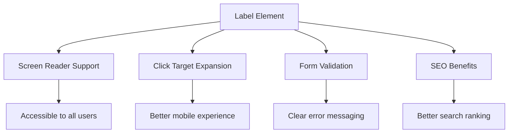

**مناسب لیبلز کیا حاصل کرتے ہیں:**
- **اسکرین ریڈرز کو** فارم فیلڈز کو واضح طور پر اعلان کرنے کے قابل بناتے ہیں
- **کلک ایریا کو** بڑھاتے ہیں (لیبل پر کلک کرنے سے ان پٹ فوکس ہوتا ہے)
- **موبائل استعمال کو** بڑے ٹچ ٹارگٹس کے ساتھ بہتر بناتے ہیں
- **فارم کی تصدیق کو** بامعنی غلطی کے پیغامات کے ساتھ سپورٹ کرتے ہیں
- **SEO کو** فارم عناصر کو سیمینٹک معنی فراہم کرکے بہتر بناتے ہیں

> 🎯 **رسائی کا مقصد**: ہر فارم ان پٹ کے ساتھ ایک منسلک لیبل ہونا چاہیے۔ یہ سادہ عمل آپ کے فارمز کو ہر کسی کے لیے قابل استعمال بناتا ہے، بشمول معذوری والے صارفین، اور تمام صارفین کے لیے تجربہ بہتر بناتا ہے۔

### رجسٹریشن فارم بنانا

رجسٹریشن فارم کو مکمل صارف اکاؤنٹ بنانے کے لیے زیادہ تفصیلی معلومات کی ضرورت ہوتی ہے۔ آئیے اسے جدید HTML5 خصوصیات اور بہتر رسائی کے ساتھ بنائیں۔

```html
<hr/>
<h2>Register</h2>
<form id="registerForm" novalidate>
  <div class="form-group">
    <label for="user">Username</label>
    <input id="user" name="user" type="text" required 
           autocomplete="username" placeholder="Choose a username">
  </div>
  
  <div class="form-group">
    <label for="currency">Currency</label>
    <input id="currency" name="currency" type="text" value="$" 
           required maxlength="3" placeholder="USD, EUR, etc.">
  </div>
  
  <div class="form-group">
    <label for="description">Account Description</label>
    <input id="description" name="description" type="text" 
           maxlength="100" placeholder="Personal savings, checking, etc.">
  </div>
  
  <div class="form-group">
    <label for="balance">Starting Balance</label>
    <input id="balance" name="balance" type="number" value="0" 
           min="0" step="0.01" placeholder="0.00">
  </div>
  
  <button type="submit">Create Account</button>
</form>
```

**اوپر، ہم نے:**
- **ہر فیلڈ کو** بہتر اسٹائلنگ اور لے آؤٹ کے لیے کنٹینر divs میں منظم کیا
- **مناسب `autocomplete` خصوصیات** شامل کیں تاکہ براؤزر آٹو فل سپورٹ فراہم کرے
- **مددگار پلیس ہولڈر ٹیکسٹ** شامل کیا تاکہ صارف کے ان پٹ کی رہنمائی ہو
- **معقول ڈیفالٹس** `value` خصوصیت کے ذریعے سیٹ کیے
- **تصدیق کی خصوصیات** جیسے `required`, `maxlength`, اور `min` کا اطلاق کیا
- **بیلنس فیلڈ کے لیے `type="number"`** استعمال کیا جس میں اعشاریہ کی حمایت ہو

### ان پٹ اقسام اور رویے کو دریافت کرنا

**جدید ان پٹ اقسام بہتر فعالیت فراہم کرتی ہیں:**

| خصوصیت | فائدہ | مثال |
|--------|-------|-------|
| `type="number"` | موبائل پر عددی کیپیڈ | بیلنس انٹری آسان بناتا ہے |
| `step="0.01"` | اعشاریہ کی درستگی کا کنٹرول | کرنسی میں سینٹس کی اجازت دیتا ہے |
| `autocomplete` | براؤزر آٹو فل | فارم مکمل کرنے میں تیزی |
| `placeholder` | سیاق و سباق کے اشارے | صارف کی توقعات کی رہنمائی کرتا ہے |

> 🎯 **رسائی کا چیلنج**: صرف اپنے کی بورڈ کا استعمال کرتے ہوئے فارمز کو نیویگیٹ کرنے کی کوشش کریں! `Tab` کا استعمال کریں فیلڈز کے درمیان منتقل ہونے کے لیے، `Space` چیک باکسز کو چیک کرنے کے لیے، اور `Enter` فارم جمع کرانے کے لیے۔ یہ تجربہ آپ کو سمجھنے میں مدد دیتا ہے کہ اسکرین ریڈر صارفین آپ کے فارمز کے ساتھ کیسے تعامل کرتے ہیں۔

### 🔄 **تعلیمی جائزہ**
**فارم کی بنیاد کو سمجھنا**: جاوا اسکرپٹ نافذ کرنے سے پہلے، یقینی بنائیں کہ آپ سمجھتے ہیں:
- ✅ سیمینٹک HTML کیسے قابل رسائی فارم ڈھانچے بناتا ہے
- ✅ موبائل کی بورڈز اور تصدیق کے لیے ان پٹ اقسام کیوں اہم ہیں
- ✅ لیبلز اور فارم کنٹرولز کے درمیان تعلق
- ✅ فارم کی خصوصیات براؤزر کے ڈیفالٹ رویے کو کیسے متاثر کرتی ہیں

**خود سے جلدی ٹیسٹ**: اگر آپ جاوا اسکرپٹ ہینڈلنگ کے بغیر فارم جمع کراتے ہیں تو کیا ہوتا ہے؟
*جواب: براؤزر ڈیفالٹ جمع کرانے کو انجام دیتا ہے، عام طور پر ایکشن URL پر ری ڈائریکٹ کرتا ہے*

**HTML5 فارم کے فوائد**: جدید فارمز فراہم کرتے ہیں:
- **بلٹ ان تصدیق**: ای میل اور نمبر فارمیٹ کی خودکار جانچ
- **موبائل آپٹیمائزیشن**: مختلف ان پٹ اقسام کے لیے مناسب کی بورڈز
- **رسائی**: اسکرین ریڈر سپورٹ اور کی بورڈ نیویگیشن
- **پروگریسو انحانسمنٹ**: جاوا اسکرپٹ غیر فعال ہونے پر بھی کام کرتا ہے

## فارم جمع کرانے کے طریقوں کو سمجھنا

جب کوئی آپ کا فارم بھر کر سبمٹ کرتا ہے، تو وہ ڈیٹا کہیں جانا چاہیے – عام طور پر ایک سرور پر جو اسے محفوظ کر سکتا ہے۔ یہ مختلف طریقوں سے ہو سکتا ہے، اور یہ جاننا کہ کون سا استعمال کرنا ہے، آپ کو بعد میں کچھ پریشانیوں سے بچا سکتا ہے۔

آئیے دیکھتے ہیں کہ جب کوئی سبمٹ بٹن پر کلک کرتا ہے تو اصل میں کیا ہوتا ہے۔

### ڈیفالٹ فارم رویہ

سب سے پہلے، آئیے بنیادی فارم جمع کرانے کے ساتھ کیا ہوتا ہے، اس کا مشاہدہ کریں:

**اپنے موجودہ فارمز کی جانچ کریں:**
1. اپنے فارم میں *رجسٹر* بٹن پر کلک کریں
2. اپنے براؤزر کے ایڈریس بار میں تبدیلیوں کا مشاہدہ کریں
3. دیکھیں کہ صفحہ کیسے ری لوڈ ہوتا ہے اور ڈیٹا URL میں ظاہر ہوتا ہے


### HTTP طریقوں کا موازنہ

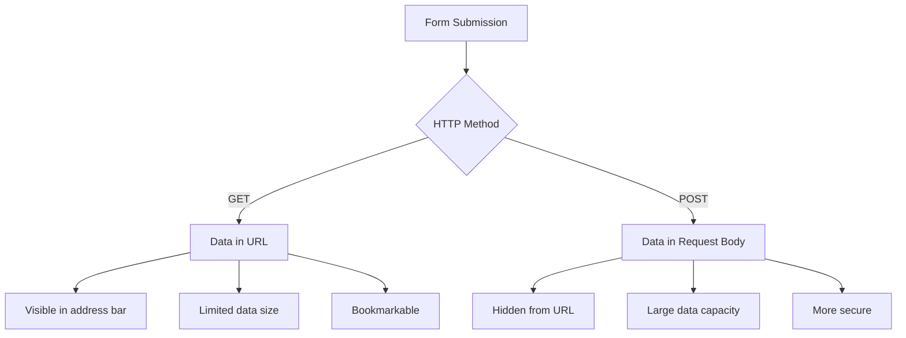

**فرق کو سمجھنا:**

| طریقہ | استعمال کا کیس | ڈیٹا کا مقام | سیکیورٹی کی سطح | سائز کی حد |
|-------|---------------|-------------|----------------|------------|
| `GET` | تلاش کے سوالات، فلٹرز | URL پیرامیٹرز | کم (ظاہر) | ~2000 حروف |
| `POST` | صارف اکاؤنٹس، حساس ڈیٹا | درخواست کا جسم | زیادہ (چھپا ہوا) | کوئی عملی حد نہیں |

**بنیادی فرق کو سمجھنا:**
- **GET**: فارم ڈیٹا کو URL میں کوئری پیرامیٹرز کے طور پر شامل کرتا ہے (تلاش کے آپریشنز کے لیے موزوں)
- **POST**: ڈیٹا کو درخواست کے جسم میں شامل کرتا ہے (حساس معلومات کے لیے ضروری)
- **GET کی حدود**: سائز کی پابندیاں، ظاہر ڈیٹا، مستقل براؤزر ہسٹری
- **POST کے فوائد**: بڑی ڈیٹا کی صلاحیت، پرائیویسی تحفظ، فائل اپلوڈ سپورٹ

> 💡 **بہترین عمل**: تلاش فارمز اور فلٹرز (ڈیٹا بازیافت) کے لیے `GET` استعمال کریں، صارف رجسٹریشن، لاگ ان، اور ڈیٹا تخلیق کے لیے `POST` استعمال کریں۔

### فارم جمع کرانے کی ترتیب

آئیے اپنے رجسٹریشن فارم کو صحیح طریقے سے بیک اینڈ API کے ساتھ بات چیت کرنے کے لیے POST طریقہ استعمال کرتے ہوئے ترتیب دیں:

```html
<form id="registerForm" action="//localhost:5000/api/accounts" 
      method="POST" novalidate>
```

**یہ ترتیب کیا کرتی ہے:**
- **فارم جمع کرانے کو** آپ کے API اینڈ پوائنٹ پر ہدایت دیتا ہے
- **محفوظ ڈیٹا ٹرانسمیشن کے لیے** POST طریقہ استعمال کرتا ہے
- **تصدیق کو** جاوا اسکرپٹ کے ساتھ ہینڈل کرنے کے لیے `novalidate` شامل کرتا ہے

### فارم جمع کرانے کی جانچ

**اپنے فارم کی جانچ کے لیے ان اقدامات پر عمل کریں:**
1. **رجسٹریشن فارم کو** اپنی معلومات کے ساتھ بھریں
2. **"اکاؤنٹ بنائیں" بٹن پر کلک کریں**
3. **اپنے براؤزر میں سرور کے جواب کا مشاہدہ کریں**

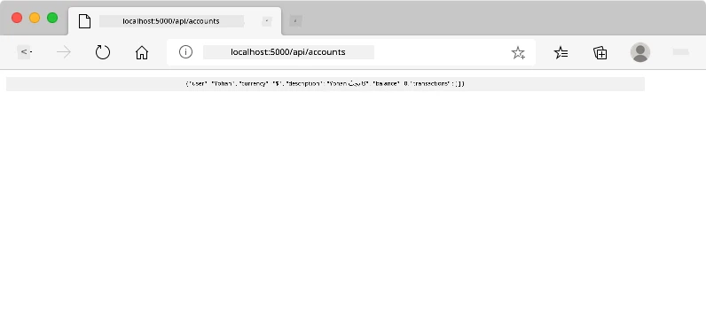

**آپ کو کیا دیکھنا چاہیے:**
- **براؤزر ری ڈائریکٹ** API اینڈ پوائنٹ URL پر
- **JSON جواب** جس میں آپ کے نئے بنائے گئے اکاؤنٹ کا ڈیٹا شامل ہے
- **سرور کی تصدیق** کہ اکاؤنٹ کامیابی سے بنایا گیا ہے

> 🧪 **تجربہ کا وقت**: دوبارہ رجسٹر کرنے کی کوشش کریں، لیکن اسی صارف نام کے ساتھ۔ آپ کو کیا جواب ملتا ہے؟ یہ آپ کو سمجھنے میں مدد دیتا ہے کہ سرور ڈپلیکیٹ ڈیٹا اور غلطی کی شرائط کو کیسے ہینڈل کرتا ہے۔

### JSON جوابات کو سمجھنا

**جب سرور آپ کے فارم کو کامیابی سے پروسیس کرتا ہے:**
```json
{
  "user": "john_doe",
  "currency": "$",
  "description": "Personal savings",
  "balance": 100,
  "id": "unique_account_id"
}
```

**یہ جواب تصدیق کرتا ہے:**
- **آپ کے مخصوص ڈیٹا کے ساتھ** نیا اکاؤنٹ بناتا ہے
- **مستقبل کے حوالہ کے لیے** منفرد شناخت کنندہ تفویض کرتا ہے
- **تمام اکاؤنٹ معلومات** تصدیق کے لیے واپس کرتا ہے
- **ڈیٹا بیس اسٹوریج کی کامیابی** کی نشاندہی کرتا ہے

## جاوا اسکرپٹ کے ساتھ جدید فارم ہینڈلنگ

روایتی فارم جمع کرانے سے پورے صفحے کی ری لوڈنگ ہوتی ہے، جیسے ابتدائی خلائی مشنوں کو کورس کی اصلاح کے لیے مکمل سسٹم ری سیٹ کی ضرورت ہوتی تھی۔ یہ طریقہ صارف کے تجربے میں خلل ڈالتا ہے اور ایپلیکیشن کی حالت کو کھو دیتا ہے۔

جاوا اسکرپٹ فارم ہینڈلنگ جدید خلائی جہازوں کے مسلسل رہنمائی کے نظام کی طرح کام کرتی ہے – نیویگیشن کے سیاق و سباق کو کھوئے بغیر حقیقی وقت میں ایڈجسٹمنٹ کرتی ہے۔ ہم فارم جمع کرانے کو روک سکتے ہیں، فوری فیڈبیک فراہم کر سکتے ہیں، غلطیوں کو خوش اسلوبی سے ہینڈل کر سکتے ہیں، اور صارف کی ایپلیکیشن میں پوزیشن کو برقرار رکھتے ہوئے سرور کے جوابات کی بنیاد پر انٹرفیس کو اپ ڈیٹ کر سکتے ہیں۔

### صفحہ ری لوڈنگ سے بچنے کی وجوہات

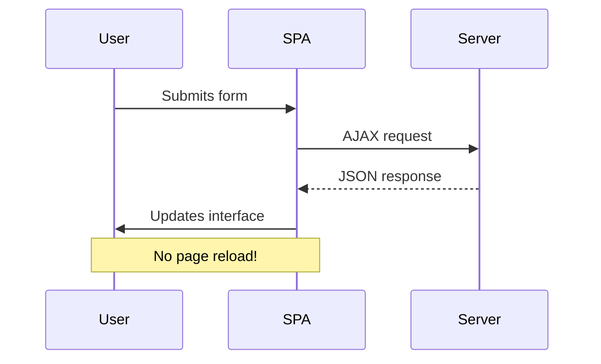

**جاوا اسکرپٹ فارم ہینڈلنگ کے فوائد:**
- **ایپلیکیشن کی حالت اور صارف کے سیاق و سباق کو برقرار رکھتا ہے**
- **فوری فیڈبیک اور لو
```javascript
// Example of what FormData captures
const formData = new FormData(registerForm);

// FormData automatically captures:
// {
//   "user": "john_doe",
//   "currency": "$", 
//   "description": "Personal account",
//   "balance": "100"
// }
```

**FormData API کے فوائد:**
- **جامع مجموعہ**: تمام فارم عناصر کو پکڑتا ہے، بشمول متن، فائلیں، اور پیچیدہ ان پٹ
- **قسم کی آگاہی**: مختلف ان پٹ اقسام کو خود بخود سنبھالتا ہے بغیر کسی حسب ضرورت کوڈنگ کے
- **موثر**: ایک ہی API کال کے ساتھ دستی فیلڈ جمع کرنے کو ختم کرتا ہے
- **مطابقت**: فارم کی ساخت کے ارتقاء کے ساتھ فعالیت کو برقرار رکھتا ہے

### سرور کے ساتھ مواصلت کے فنکشن کی تخلیق

اب جدید جاوا اسکرپٹ پیٹرنز کا استعمال کرتے ہوئے آپ کے API سرور کے ساتھ مواصلت کے لیے ایک مضبوط فنکشن بناتے ہیں:

```javascript
async function createAccount(account) {
  try {
    const response = await fetch('//localhost:5000/api/accounts', {
      method: 'POST',
      headers: { 
        'Content-Type': 'application/json',
        'Accept': 'application/json'
      },
      body: account
    });
    
    // Check if the response was successful
    if (!response.ok) {
      throw new Error(`HTTP error! status: ${response.status}`);
    }
    
    return await response.json();
  } catch (error) {
    console.error('Account creation failed:', error);
    return { error: error.message || 'Network error occurred' };
  }
}
```

**غیر متزامن جاوا اسکرپٹ کو سمجھنا:**

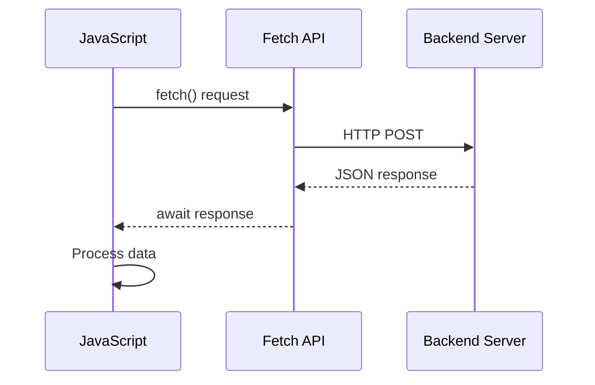

**یہ جدید نفاذ کیا حاصل کرتا ہے:**
- **استعمال کرتا ہے** `async/await` کو قابل پڑھ غیر متزامن کوڈ کے لیے
- **شامل کرتا ہے** مناسب خرابی ہینڈلنگ try/catch بلاکس کے ساتھ
- **چیک کرتا ہے** جواب کی حیثیت ڈیٹا پر کارروائی کرنے سے پہلے
- **مقرر کرتا ہے** JSON مواصلت کے لیے مناسب ہیڈرز
- **فراہم کرتا ہے** خرابیوں کو ڈیبگ کرنے کے لیے تفصیلی پیغامات
- **واپس کرتا ہے** کامیابی اور خرابی کے معاملات کے لیے مستقل ڈیٹا ڈھانچہ

### جدید Fetch API کی طاقت

**پرانے طریقوں کے مقابلے میں Fetch API کے فوائد:**

| خصوصیت | فائدہ | نفاذ |
|---------|---------|----------------|
| وعدہ پر مبنی | صاف غیر متزامن کوڈ | `await fetch()` |
| درخواست حسب ضرورت | مکمل HTTP کنٹرول | ہیڈرز، طریقے، باڈی |
| جواب ہینڈلنگ | لچکدار ڈیٹا پارسنگ | `.json()`, `.text()`, `.blob()` |
| خرابی ہینڈلنگ | جامع خرابی پکڑنا | Try/catch بلاکس |

> 🎥 **مزید سیکھیں**: [Async/Await Tutorial](https://youtube.com/watch?v=YwmlRkrxvkk) - جدید ویب ڈویلپمنٹ کے لیے غیر متزامن جاوا اسکرپٹ پیٹرنز کو سمجھنا۔

**سرور مواصلت کے کلیدی تصورات:**
- **غیر متزامن فنکشنز** سرور کے جوابات کا انتظار کرنے کے لیے عمل کو روکنے کی اجازت دیتے ہیں
- **Await کلیدی لفظ** غیر متزامن کوڈ کو ہم وقت ساز کوڈ کی طرح پڑھنے کے قابل بناتا ہے
- **Fetch API** جدید، وعدہ پر مبنی HTTP درخواستیں فراہم کرتا ہے
- **خرابی ہینڈلنگ** یقینی بناتی ہے کہ آپ کی ایپ نیٹ ورک کے مسائل پر خوش اسلوبی سے جواب دے

### رجسٹریشن فنکشن مکمل کرنا

آئیے سب کچھ ایک مکمل، پروڈکشن کے لیے تیار رجسٹریشن فنکشن کے ساتھ اکٹھا کریں:

```javascript
async function register() {
  const registerForm = document.getElementById('registerForm');
  const submitButton = registerForm.querySelector('button[type="submit"]');
  
  try {
    // Show loading state
    submitButton.disabled = true;
    submitButton.textContent = 'Creating Account...';
    
    // Process form data
    const formData = new FormData(registerForm);
    const jsonData = JSON.stringify(Object.fromEntries(formData));
    
    // Send to server
    const result = await createAccount(jsonData);
    
    if (result.error) {
      console.error('Registration failed:', result.error);
      alert(`Registration failed: ${result.error}`);
      return;
    }
    
    console.log('Account created successfully!', result);
    alert(`Welcome, ${result.user}! Your account has been created.`);
    
    // Reset form after successful registration
    registerForm.reset();
    
  } catch (error) {
    console.error('Unexpected error:', error);
    alert('An unexpected error occurred. Please try again.');
  } finally {
    // Restore button state
    submitButton.disabled = false;
    submitButton.textContent = 'Create Account';
  }
}
```

**یہ بہتر نفاذ شامل کرتا ہے:**
- **فراہم کرتا ہے** فارم جمع کرانے کے دوران بصری تاثرات
- **غیر فعال کرتا ہے** جمع کرانے کے بٹن کو ڈپلیکیٹ جمع کرانے سے روکنے کے لیے
- **خوش اسلوبی سے ہینڈل کرتا ہے** متوقع اور غیر متوقع خرابیوں کو
- **دکھاتا ہے** صارف دوست کامیابی اور خرابی کے پیغامات
- **ری سیٹ کرتا ہے** کامیاب رجسٹریشن کے بعد فارم
- **بحال کرتا ہے** UI حالت کو قطع نظر نتیجہ کے

### اپنے نفاذ کی جانچ کرنا

**اپنے براؤزر کے ڈویلپر ٹولز کھولیں اور رجسٹریشن کی جانچ کریں:**

1. **کھولیں** براؤزر کنسول (F12 → Console tab)
2. **رجسٹریشن فارم کو پُر کریں**
3. **"اکاؤنٹ بنائیں" پر کلک کریں**
4. **کنسول پیغامات اور صارف تاثرات کا مشاہدہ کریں**

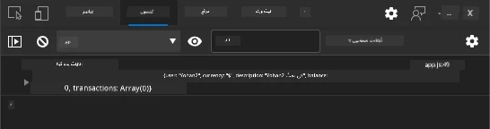

**آپ کو کیا دیکھنا چاہیے:**
- **لوڈنگ اسٹیٹ** جمع کرانے کے بٹن پر ظاہر ہوتا ہے
- **کنسول لاگز** عمل کے بارے میں تفصیلی معلومات دکھاتے ہیں
- **کامیابی کا پیغام** اکاؤنٹ کی تخلیق کامیاب ہونے پر ظاہر ہوتا ہے
- **فارم خود بخود ری سیٹ ہوتا ہے** کامیاب جمع کرانے کے بعد

> 🔒 **سیکیورٹی غور و فکر**: فی الحال، ڈیٹا HTTP پر سفر کرتا ہے، جو پروڈکشن کے لیے محفوظ نہیں ہے۔ حقیقی ایپلیکیشنز میں، ہمیشہ HTTPS استعمال کریں تاکہ ڈیٹا کی ترسیل کو انکرپٹ کیا جا سکے۔ مزید جانیں [HTTPS سیکیورٹی](https://en.wikipedia.org/wiki/HTTPS) کے بارے میں اور یہ صارف کے ڈیٹا کی حفاظت کے لیے کیوں ضروری ہے۔

### 🔄 **تعلیمی جائزہ**
**جدید جاوا اسکرپٹ انضمام**: غیر متزامن فارم ہینڈلنگ کی اپنی سمجھ کی تصدیق کریں:
- ✅ `event.preventDefault()` ڈیفالٹ فارم کے رویے کو کیسے تبدیل کرتا ہے؟
- ✅ FormData API دستی فیلڈ جمع کرنے سے زیادہ موثر کیوں ہے؟
- ✅ async/await پیٹرنز کوڈ کی پڑھنے کی صلاحیت کو کیسے بہتر بناتے ہیں؟
- ✅ خرابی ہینڈلنگ صارف کے تجربے میں کیا کردار ادا کرتی ہے؟

**سسٹم آرکیٹیکچر**: آپ کا فارم ہینڈلنگ ظاہر کرتا ہے:
- **ایونٹ پر مبنی پروگرامنگ**: فارم صفحہ دوبارہ لوڈ کیے بغیر صارف کے اعمال کا جواب دیتے ہیں
- **غیر متزامن مواصلت**: سرور کی درخواستیں صارف کے انٹرفیس کو بلاک نہیں کرتی ہیں
- **خرابی ہینڈلنگ**: نیٹ ورک کی درخواستیں ناکام ہونے پر خوش اسلوبی سے کمی
- **حالت کا انتظام**: UI اپ ڈیٹس سرور کے جوابات کو مناسب طریقے سے ظاہر کرتے ہیں
- **ترقی پسند اضافہ**: بنیادی فعالیت کام کرتی ہے، جاوا اسکرپٹ اسے بڑھاتا ہے

**پیشہ ورانہ پیٹرنز**: آپ نے نافذ کیا:
- **واحد ذمہ داری**: فنکشنز کے واضح، مرکوز مقاصد ہیں
- **خرابی کی حدود**: Try/catch بلاکس ایپلیکیشن کریش کو روکتے ہیں
- **صارف تاثرات**: لوڈنگ اسٹیٹس اور کامیابی/خرابی کے پیغامات
- **ڈیٹا کی تبدیلی**: FormData سے JSON سرور مواصلت کے لیے

## جامع فارم کی توثیق

فارم کی توثیق اس مایوس کن تجربے کو روکتی ہے کہ غلطیاں صرف جمع کرانے کے بعد دریافت ہوتی ہیں۔ جیسے انٹرنیشنل اسپیس اسٹیشن پر متعدد اضافی نظام، مؤثر توثیق حفاظتی چیکوں کی متعدد تہوں کو استعمال کرتی ہے۔

مثالی نقطہ نظر فوری تاثرات کے لیے براؤزر کی سطح کی توثیق، بہتر صارف کے تجربے کے لیے جاوا اسکرپٹ کی توثیق، اور سیکیورٹی اور ڈیٹا کی سالمیت کے لیے سرور کی طرف کی توثیق کو یکجا کرتا ہے۔ یہ اضافی نظام صارف کی اطمینان اور نظام کے تحفظ کو یقینی بناتا ہے۔

### توثیق کی تہوں کو سمجھنا

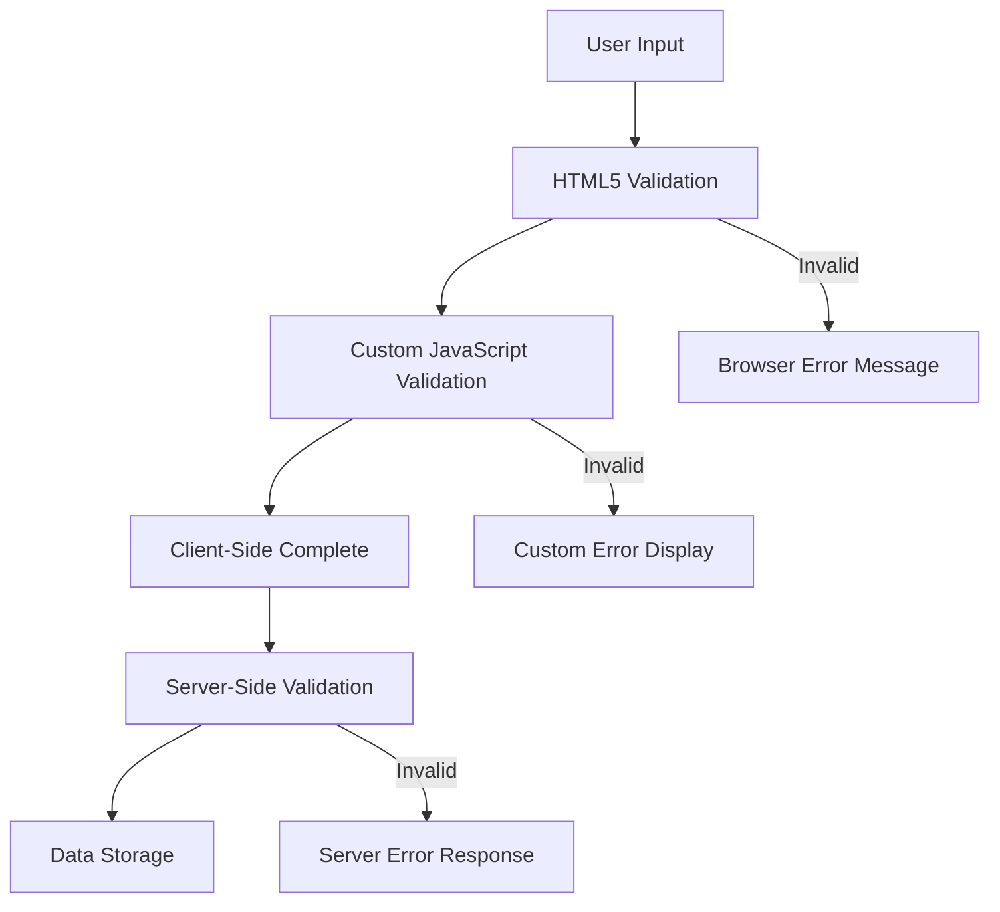

**کثیر پرت توثیق کی حکمت عملی:**
- **HTML5 توثیق**: فوری براؤزر پر مبنی چیک
- **جاوا اسکرپٹ توثیق**: حسب ضرورت منطق اور صارف کا تجربہ
- **سرور توثیق**: حتمی سیکیورٹی اور ڈیٹا کی سالمیت کے چیک
- **ترقی پسند اضافہ**: کام کرتا ہے یہاں تک کہ اگر جاوا اسکرپٹ غیر فعال ہو

### HTML5 توثیق کی خصوصیات

**جدید توثیق کے اوزار آپ کے اختیار میں:**

| خصوصیت | مقصد | مثال استعمال | براؤزر کا رویہ |
|-----------|---------|---------------|------------------|
| `required` | لازمی فیلڈز | `<input required>` | خالی جمع کرانے کو روکتا ہے |
| `minlength`/`maxlength` | متن کی لمبائی کی حدود | `<input maxlength="20">` | کردار کی حدود نافذ کرتا ہے |
| `min`/`max` | عددی حدود | `<input min="0" max="1000">` | نمبر کی حدود کی توثیق کرتا ہے |
| `pattern` | حسب ضرورت regex قواعد | `<input pattern="[A-Za-z]+">` | مخصوص فارمیٹس سے میل کھاتا ہے |
| `type` | ڈیٹا کی قسم کی توثیق | `<input type="email">` | فارمیٹ مخصوص توثیق |

### CSS توثیق اسٹائلنگ

**توثیق کی حالتوں کے لیے بصری تاثرات بنائیں:**

```css
/* Valid input styling */
input:valid {
  border-color: #28a745;
  background-color: #f8fff9;
}

/* Invalid input styling */
input:invalid {
  border-color: #dc3545;
  background-color: #fff5f5;
}

/* Focus states for better accessibility */
input:focus:valid {
  box-shadow: 0 0 0 0.2rem rgba(40, 167, 69, 0.25);
}

input:focus:invalid {
  box-shadow: 0 0 0 0.2rem rgba(220, 53, 69, 0.25);
}
```

**یہ بصری اشارے کیا حاصل کرتے ہیں:**
- **سبز سرحدیں**: کامیاب توثیق کی نشاندہی کرتی ہیں، جیسے مشن کنٹرول میں سبز روشنی
- **سرخ سرحدیں**: توثیق کی غلطیوں کی نشاندہی کرتی ہیں جن پر توجہ دینے کی ضرورت ہے
- **فوکس ہائی لائٹس**: موجودہ ان پٹ مقام کے لیے واضح بصری سیاق و سباق فراہم کرتے ہیں
- **مستقل اسٹائلنگ**: پیش گوئی کے قابل انٹرفیس پیٹرنز قائم کریں جنہیں صارفین سیکھ سکتے ہیں

> 💡 **پرو ٹپ**: فوری بصری تاثرات فراہم کرنے کے لیے `:valid` اور `:invalid` CSS پیسڈو کلاسز کا استعمال کریں جیسے صارفین ٹائپ کرتے ہیں، ایک جوابدہ اور مددگار انٹرفیس بنائیں۔

### جامع توثیق کا نفاذ

آئیے آپ کے رجسٹریشن فارم کو مضبوط توثیق کے ساتھ بہتر بنائیں جو بہترین صارف کے تجربے اور ڈیٹا کے معیار فراہم کرتا ہے:

```html
<form id="registerForm" method="POST" novalidate>
  <div class="form-group">
    <label for="user">Username <span class="required">*</span></label>
    <input id="user" name="user" type="text" required 
           minlength="3" maxlength="20" 
           pattern="[a-zA-Z0-9_]+" 
           autocomplete="username"
           title="Username must be 3-20 characters, letters, numbers, and underscores only">
    <small class="form-text">Choose a unique username (3-20 characters)</small>
  </div>
  
  <div class="form-group">
    <label for="currency">Currency <span class="required">*</span></label>
    <input id="currency" name="currency" type="text" required 
           value="$" maxlength="3" 
           pattern="[A-Z$€£¥₹]+" 
           title="Enter a valid currency symbol or code">
    <small class="form-text">Currency symbol (e.g., $, €, £)</small>
  </div>
  
  <div class="form-group">
    <label for="description">Account Description</label>
    <input id="description" name="description" type="text" 
           maxlength="100" 
           placeholder="Personal savings, checking, etc.">
    <small class="form-text">Optional description (up to 100 characters)</small>
  </div>
  
  <div class="form-group">
    <label for="balance">Starting Balance</label>
    <input id="balance" name="balance" type="number" 
           value="0" min="0" step="0.01" 
           title="Enter a positive number for your starting balance">
    <small class="form-text">Initial account balance (minimum $0.00)</small>
  </div>
  
  <button type="submit">Create Account</button>
</form>
```

**بہتر توثیق کو سمجھنا:**
- **لازمی فیلڈ اشارے کو مددگار وضاحتوں کے ساتھ یکجا کرتا ہے**
- **فارمیٹ کی توثیق کے لیے `pattern` خصوصیات شامل کرتا ہے**
- **رسائی اور ٹول ٹپس کے لیے `title` خصوصیات فراہم کرتا ہے**
- **صارف کے ان پٹ کی رہنمائی کے لیے مددگار متن شامل کرتا ہے**
- **بہتر رسائی کے لیے سیمینٹک HTML ڈھانچہ استعمال کرتا ہے**

### اعلی درجے کی توثیق کے قواعد

**ہر توثیق کے اصول کیا حاصل کرتے ہیں:**

| فیلڈ | توثیق کے قواعد | صارف کا فائدہ |
|-------|------------------|--------------|
| صارف نام | `required`, `minlength="3"`, `maxlength="20"`, `pattern="[a-zA-Z0-9_]+"` | درست، منفرد شناخت کنندگان کو یقینی بناتا ہے |
| کرنسی | `required`, `maxlength="3"`, `pattern="[A-Z$€£¥₹]+"` | عام کرنسی کے نشانات قبول کرتا ہے |
| بیلنس | `min="0"`, `step="0.01"`, `type="number"` | منفی بیلنس کو روکتا ہے |
| تفصیل | `maxlength="100"` | معقول لمبائی کی حدود |

### توثیق کے رویے کی جانچ

**ان توثیق کے منظرناموں کو آزمائیں:**
1. **فارم جمع کرائیں** خالی لازمی فیلڈز کے ساتھ
2. **صارف نام درج کریں** 3 حروف سے کم
3. **صارف نام کے فیلڈ میں خصوصی کردار آزمائیں**
4. **منفی بیلنس کی رقم درج کریں**

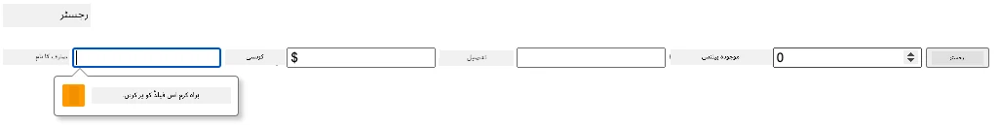

**آپ کیا مشاہدہ کریں گے:**
- **براؤزر دکھاتا ہے** مقامی توثیق کے پیغامات
- **اسٹائلنگ تبدیلیاں** `:valid` اور `:invalid` ریاستوں کی بنیاد پر
- **فارم جمع کرانا** تمام توثیق پاس ہونے تک روکا جاتا ہے
- **فوکس خود بخود** پہلے غلط فیلڈ پر منتقل ہوتا ہے

### کلائنٹ سائیڈ بمقابلہ سرور سائیڈ توثیق

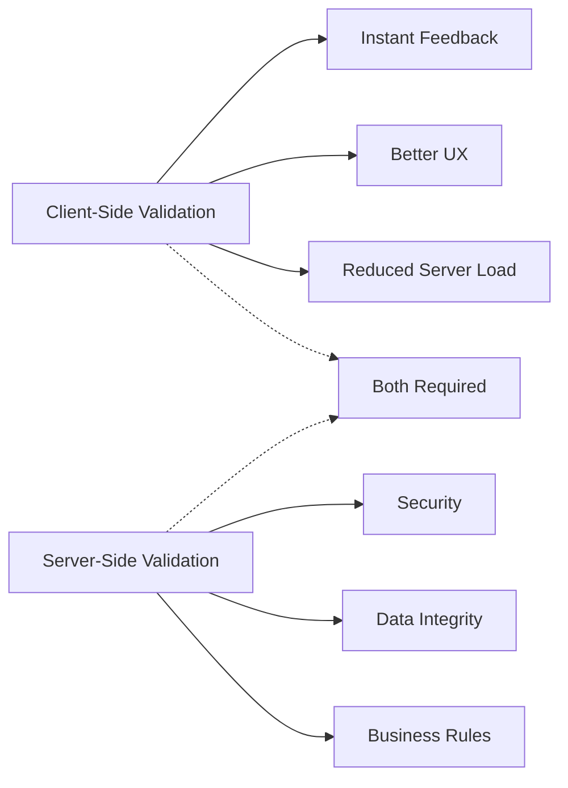

**آپ کو دونوں تہوں کی ضرورت کیوں ہے:**
- **کلائنٹ سائیڈ توثیق**: فوری تاثرات فراہم کرتی ہے اور صارف کے تجربے کو بہتر بناتی ہے
- **سرور سائیڈ توثیق**: سیکیورٹی کو یقینی بناتی ہے اور پیچیدہ کاروباری اصولوں کو سنبھالتی ہے
- **مشترکہ نقطہ نظر**: مضبوط، صارف دوست، اور محفوظ ایپلیکیشنز بناتا ہے
- **ترقی پسند اضافہ**: کام کرتا ہے یہاں تک کہ جب جاوا اسکرپٹ غیر فعال ہو

> 🛡️ **سیکیورٹی یاد دہانی**: کلائنٹ سائیڈ توثیق پر کبھی بھروسہ نہ کریں! بدنیتی پر مبنی صارفین کلائنٹ سائیڈ چیکوں کو نظرانداز کر سکتے ہیں، اس لیے سیکیورٹی اور ڈیٹا کی سالمیت کے لیے سرور سائیڈ توثیق ضروری ہے۔

### ⚡ **اگلے 5 منٹ میں آپ کیا کر سکتے ہیں**
- [ ] اپنے فارم کو غلط ڈیٹا کے ساتھ آزمائیں تاکہ توثیق کے پیغامات دیکھ سکیں
- [ ] HTML5 توثیق دیکھنے کے لیے جاوا اسکرپٹ کو غیر فعال کر کے فارم جمع کرانے کی کوشش کریں
- [ ] براؤزر DevTools کھولیں اور سرور کو بھیجے گئے فارم ڈیٹا کا معائنہ کریں
- [ ] مختلف ان پٹ اقسام کے ساتھ تجربہ کریں تاکہ موبائل کی بورڈ میں تبدیلیاں دیکھ سکیں

### 🎯 **آپ اس گھنٹے میں کیا حاصل کر سکتے ہیں**
- [ ] سبق کے بعد کا کوئز مکمل کریں اور فارم ہینڈلنگ کے تصورات کو سمجھیں
- [ ] حقیقی وقت کے تاثرات کے ساتھ جامع توثیق کا چیلنج نافذ کریں
- [ ] CSS اسٹائلنگ شامل کریں تاکہ پیشہ ورانہ نظر آنے والے فارم بن سکیں
- [ ] ڈپلیکیٹ صارف ناموں اور سرور کی خرابیوں کے لیے خرابی ہینڈلنگ بنائیں
- [ ] پاس ورڈ کی تصدیق کے فیلڈز شامل کریں جن میں مماثلت کی توثیق ہو

### 📅 **آپ کا ہفتہ بھر کا فارم مہارت کا سفر**
- [ ] جدید فارم کی خصوصیات کے ساتھ مکمل بینکنگ ایپ مکمل کریں
- [ ] پروفائل تصاویر یا دستاویزات کے لیے فائل اپ لوڈ کی صلاحیتیں نافذ کریں
- [ ] ترقی کے اشارے اور حالت کے انتظام کے ساتھ ملٹی اسٹیپ فارم شامل کریں
- [ ] متحرک فارم بنائیں جو صارف کے انتخاب کی بنیاد پر اپناتے ہیں
- [ ] بہتر صارف کے تجربے کے لیے فارم آٹو سیو اور ریکوری شامل کریں
- [ ] ای میل کی تصدیق اور فون نمبر فارمیٹنگ جیسے اعلی درجے کی توثیق شامل کریں

### 🌟 **آپ کا مہینہ بھر کا فرنٹ اینڈ ڈویلپمنٹ ماسٹری**
- [ ] مشروط منطق اور ورک فلو کے ساتھ پیچیدہ فارم ایپلیکیشنز بنائیں
- [ ] تیز رفتار ترقی کے لیے فارم لائبریریاں اور فریم ورک سیکھیں
- [ ] رسائی کے رہنما خطوط اور جامع ڈیزائن اصولوں میں مہارت حاصل کریں
- [ ] عالمی فارم کے لیے بین الاقوامی کاری اور مقامی کاری کو نافذ کریں
- [ ] دوبارہ استعمال کے قابل فارم جزو لائبریریاں اور ڈیزائن سسٹمز بنائیں
- [ ] اوپن سورس فارم پروجیکٹس میں تعاون کریں اور بہترین طریقے شیئر کریں

## 🎯 آپ کا فارم ڈویلپمنٹ ماسٹری ٹائم لائن

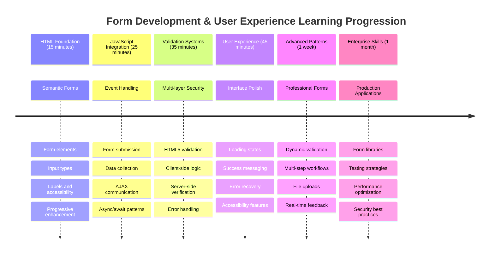

### 🛠️ آپ کے فارم ڈویلپمنٹ ٹول کٹ کا خلاصہ

اس سبق کو مکمل کرنے کے بعد، آپ نے مہارت حاصل کر لی ہے:
- **HTML5 فارم**: سیمینٹک ڈھانچہ، انپٹ اقسام، اور رسائی کی خصوصیات
- **جاوا اسکرپٹ فارم ہینڈلنگ**: ایونٹ مینجمنٹ، ڈیٹا جمع کرنا، اور AJAX مواصلت
- **توثیق آرکیٹیکچر**: سیکیورٹی اور صارف کے تجربے کے لیے کثیر پرت توثیق
- **غیر متزامن پروگرامنگ**: جدید Fetch API اور async/await پیٹرنز
- **خرابی کا انتظام**: جامع خرابی ہینڈلنگ اور صارف تاثرات کے نظام
- **صارف کے تجربے کا ڈیزائن**: لوڈنگ اسٹیٹس، کامیابی کے پیغامات، اور خرابی کی بازیابی
- **ترقی پسند اضافہ**: تمام براؤزرز اور صلاحیتوں میں کام کرنے والے فارم

**حقیقی دنیا کی ایپلیکیشنز**: آپ کی فارم ڈویلپمنٹ کی مہارتیں براہ راست لاگو ہوتی ہیں:
- **ای کامرس ایپلیکیشنز**: چیک آؤٹ کے عمل، اکاؤنٹ رجسٹریشن، اور ادائیگی کے فارم
- **انٹرپرائز سافٹ ویئر**: ڈیٹا انٹری سسٹمز، رپورٹنگ انٹرفیس، اور ورک فلو ایپلیکیشنز
- **مواد کا انتظام**: پبلشنگ پلیٹ فارمز، صارف
**پرامپٹ:** رجسٹریشن فارم کے لیے ایک مکمل فارم ویلیڈیشن سسٹم بنائیں جس میں شامل ہو: 1) ہر فیلڈ کے لیے حقیقی وقت میں ویلیڈیشن فیڈبیک جب صارف ٹائپ کرے، 2) ہر ان پٹ فیلڈ کے نیچے کسٹم ویلیڈیشن پیغامات ظاہر ہوں، 3) پاس ورڈ کی تصدیق کا فیلڈ جس میں مماثلت کی ویلیڈیشن ہو، 4) بصری اشارے (جیسے درست فیلڈز کے لیے سبز چیک مارکس اور غلط فیلڈز کے لیے سرخ انتباہات)، 5) ایک سبمٹ بٹن جو صرف اس وقت فعال ہو جب تمام ویلیڈیشنز پاس ہوں۔ HTML5 ویلیڈیشن ایٹریبیوٹس، CSS ویلیڈیشن اسٹیٹس کے لیے اسٹائلنگ، اور انٹرایکٹو بیہیویر کے لیے جاوا اسکرپٹ استعمال کریں۔

[agent mode](https://code.visualstudio.com/blogs/2025/02/24/introducing-copilot-agent-mode) کے بارے میں مزید جانیں۔

## 🚀 چیلنج

اگر صارف پہلے سے موجود ہو تو HTML میں ایک ایرر میسج دکھائیں۔

یہاں ایک مثال ہے کہ CSS اسٹائلز شامل کرنے کے بعد حتمی لاگ ان صفحہ کیسا نظر آ سکتا ہے:

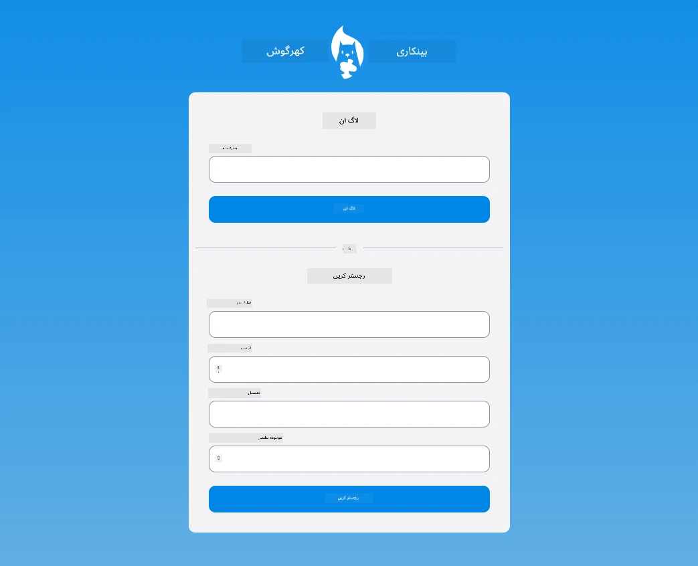

## لیکچر کے بعد کا کوئز

[لیکچر کے بعد کا کوئز](https://ff-quizzes.netlify.app/web/quiz/44)

## جائزہ اور خود مطالعہ

ڈویلپرز فارم بنانے کی کوششوں میں بہت تخلیقی ہو گئے ہیں، خاص طور پر ویلیڈیشن حکمت عملیوں کے حوالے سے۔ مختلف فارم فلو کے بارے میں جاننے کے لیے [CodePen](https://codepen.com) دیکھیں؛ کیا آپ کچھ دلچسپ اور متاثر کن فارم تلاش کر سکتے ہیں؟

## اسائنمنٹ

[اپنے بینک ایپ کو اسٹائل کریں](assignment.md)

---

**ڈسکلیمر**:  
یہ دستاویز AI ترجمہ سروس [Co-op Translator](https://github.com/Azure/co-op-translator) کا استعمال کرتے ہوئے ترجمہ کی گئی ہے۔ ہم درستگی کے لیے کوشش کرتے ہیں، لیکن براہ کرم آگاہ رہیں کہ خودکار ترجمے میں غلطیاں یا غیر درستیاں ہو سکتی ہیں۔ اصل دستاویز کو اس کی اصل زبان میں مستند ذریعہ سمجھا جانا چاہیے۔ اہم معلومات کے لیے، پیشہ ور انسانی ترجمہ کی سفارش کی جاتی ہے۔ ہم اس ترجمے کے استعمال سے پیدا ہونے والی کسی بھی غلط فہمی یا غلط تشریح کے ذمہ دار نہیں ہیں۔