<!--
CO_OP_TRANSLATOR_METADATA:
{
  "original_hash": "86ee5069f27ea3151389d8687c95fac9",
  "translation_date": "2025-11-03T13:21:06+00:00",
  "source_file": "7-bank-project/3-data/README.md",
  "language_code": "ur"
}
-->
# بینکنگ ایپ بنائیں حصہ 3: ڈیٹا حاصل کرنے اور استعمال کرنے کے طریقے

اسٹار ٹریک میں انٹرپرائز کے کمپیوٹر کے بارے میں سوچیں - جب کیپٹن پیکارڈ جہاز کی حالت کے بارے میں پوچھتے ہیں، تو معلومات فوراً ظاہر ہوتی ہیں بغیر پورے انٹرفیس کو بند کیے اور دوبارہ تعمیر کیے۔ معلومات کا یہ ہموار بہاؤ بالکل وہی ہے جو ہم یہاں متحرک ڈیٹا حاصل کرنے کے ساتھ بنا رہے ہیں۔

اس وقت، آپ کی بینکنگ ایپ ایک چھپی ہوئی اخبار کی طرح ہے - معلوماتی لیکن جامد۔ ہم اسے ناسا کے مشن کنٹرول کی طرح کچھ میں تبدیل کرنے جا رہے ہیں، جہاں ڈیٹا مسلسل بہتا ہے اور حقیقی وقت میں اپ ڈیٹ ہوتا ہے بغیر صارف کے ورک فلو میں خلل ڈالے۔

آپ سیکھیں گے کہ سرورز کے ساتھ غیر متزامن طور پر کیسے بات چیت کی جائے، مختلف وقتوں پر پہنچنے والے ڈیٹا کو کیسے ہینڈل کیا جائے، اور خام معلومات کو صارفین کے لیے معنی خیز چیز میں کیسے تبدیل کیا جائے۔ یہ ایک ڈیمو اور پروڈکشن کے لیے تیار سافٹ ویئر کے درمیان فرق ہے۔

## ⚡ اگلے 5 منٹ میں آپ کیا کر سکتے ہیں؟

**مصروف ڈویلپرز کے لیے فوری آغاز کا راستہ**

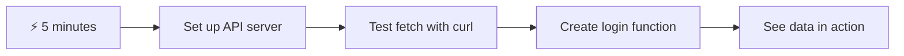

- **منٹ 1-2**: اپنا API سرور شروع کریں (`cd api && npm start`) اور کنکشن کو ٹیسٹ کریں
- **منٹ 3**: `getAccount()` فنکشن کو fetch کے ذریعے بنائیں
- **منٹ 4**: لاگ ان فارم کو `action="javascript:login()"` کے ساتھ جوڑیں
- **منٹ 5**: لاگ ان کو ٹیسٹ کریں اور اکاؤنٹ ڈیٹا کو کنسول میں ظاہر ہوتا دیکھیں

**فوری ٹیسٹ کمانڈز**:
```bash
# Verify API is running
curl http://localhost:5000/api

# Test account data fetch
curl http://localhost:5000/api/accounts/test
```

**یہ کیوں اہم ہے**: 5 منٹ میں، آپ غیر متزامن ڈیٹا حاصل کرنے کا جادو دیکھیں گے جو ہر جدید ویب ایپلیکیشن کو طاقت دیتا ہے۔ یہ وہ بنیاد ہے جو ایپس کو جوابدہ اور زندہ محسوس کراتی ہے۔

## 🗺️ ڈیٹا سے چلنے والی ویب ایپلیکیشنز کے ذریعے آپ کا سیکھنے کا سفر

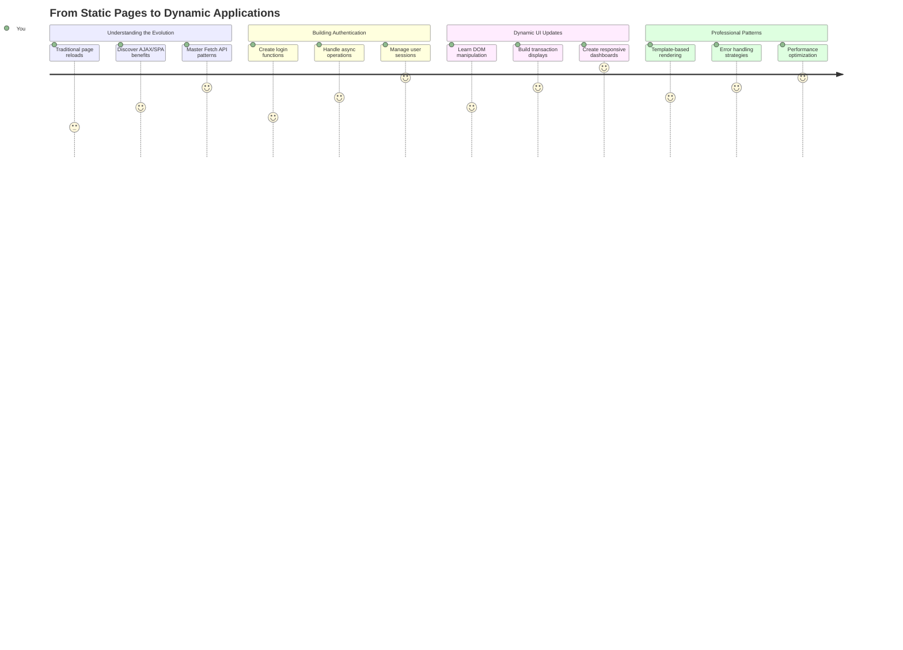

**آپ کے سفر کا مقصد**: اس سبق کے اختتام تک، آپ سمجھ جائیں گے کہ جدید ویب ایپلیکیشنز ڈیٹا کو متحرک طور پر کیسے حاصل کرتی ہیں، پروسیس کرتی ہیں، اور ظاہر کرتی ہیں، پیشہ ورانہ ایپلیکیشنز سے توقع کی جانے والی ہموار صارف تجربات تخلیق کرتی ہیں۔

## لیکچر سے پہلے کا کوئز

[لیکچر سے پہلے کا کوئز](https://ff-quizzes.netlify.app/web/quiz/45)

### ضروریات

ڈیٹا حاصل کرنے میں غوطہ لگانے سے پہلے، یقینی بنائیں کہ آپ کے پاس یہ اجزاء تیار ہیں:

- **پچھلا سبق**: [لاگ ان اور رجسٹریشن فارم](../2-forms/README.md) مکمل کریں - ہم اس بنیاد پر تعمیر کریں گے
- **لوکل سرور**: [Node.js](https://nodejs.org) انسٹال کریں اور [سرور API چلائیں](../api/README.md) تاکہ اکاؤنٹ ڈیٹا فراہم کیا جا سکے
- **API کنکشن**: اس کمانڈ کے ساتھ اپنے سرور کنکشن کو ٹیسٹ کریں:

```bash
curl http://localhost:5000/api
# Expected response: "Bank API v1.0.0"
```

یہ فوری ٹیسٹ یقینی بناتا ہے کہ تمام اجزاء صحیح طریقے سے بات چیت کر رہے ہیں:
- تصدیق کرتا ہے کہ Node.js آپ کے سسٹم پر صحیح طریقے سے چل رہا ہے
- آپ کے API سرور کے فعال اور جواب دینے کی تصدیق کرتا ہے
- تصدیق کرتا ہے کہ آپ کی ایپ سرور تک پہنچ سکتی ہے (جیسے مشن سے پہلے ریڈیو رابطے کی جانچ)

## 🧠 ڈیٹا مینجمنٹ ایکو سسٹم کا جائزہ

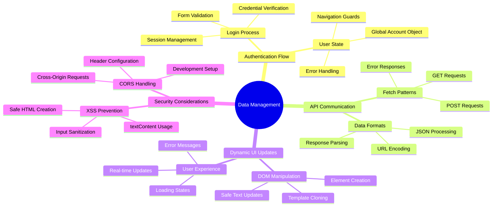

**بنیادی اصول**: جدید ویب ایپلیکیشنز ڈیٹا آرکسٹریشن سسٹمز ہیں - وہ صارف انٹرفیس، سرور APIs، اور براؤزر سیکیورٹی ماڈلز کے درمیان ہم آہنگی پیدا کرتے ہیں تاکہ ہموار، جوابدہ تجربات تخلیق کیے جا سکیں۔

---

## جدید ویب ایپس میں ڈیٹا حاصل کرنے کو سمجھنا

ویب ایپلیکیشنز کے ڈیٹا کو ہینڈل کرنے کا طریقہ گزشتہ دو دہائیوں میں ڈرامائی طور پر تبدیل ہوا ہے۔ اس ارتقاء کو سمجھنا آپ کو یہ سمجھنے میں مدد دے گا کہ جدید تکنیکیں جیسے AJAX اور Fetch API کیوں اتنی طاقتور ہیں اور کیوں وہ ویب ڈویلپرز کے لیے ضروری ٹولز بن چکی ہیں۔

آئیے دیکھتے ہیں کہ روایتی ویب سائٹس کیسے کام کرتی تھیں اور آج ہم جو متحرک، جوابدہ ایپلیکیشنز بناتے ہیں ان کے مقابلے میں۔

### روایتی ملٹی پیج ایپلیکیشنز (MPA)

ویب کے ابتدائی دنوں میں، ہر کلک ایک پرانے ٹیلی ویژن پر چینلز تبدیل کرنے جیسا تھا - اسکرین خالی ہو جاتی تھی، پھر آہستہ آہستہ نئے مواد میں ٹیون کرتی تھی۔ یہ ابتدائی ویب ایپلیکیشنز کی حقیقت تھی، جہاں ہر تعامل کا مطلب پورے صفحے کو شروع سے دوبارہ تعمیر کرنا تھا۔

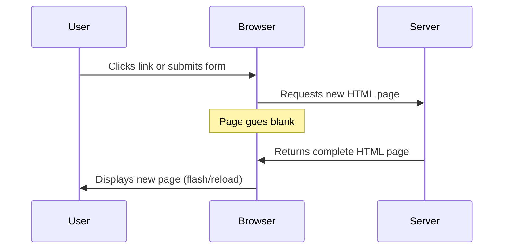


**یہ طریقہ کیوں بھاری محسوس ہوتا تھا:**
- ہر کلک کا مطلب پورے صفحے کو شروع سے دوبارہ تعمیر کرنا تھا
- صارفین کو ان پریشان کن صفحہ فلیشز کے ذریعے سوچ کے درمیان میں خلل پڑتا تھا
- آپ کا انٹرنیٹ کنکشن بار بار وہی ہیڈر اور فوٹر ڈاؤن لوڈ کرنے میں زیادہ کام کرتا تھا
- ایپس زیادہ فائلنگ کابینہ کے ذریعے کلک کرنے جیسی محسوس ہوتی تھیں بجائے سافٹ ویئر استعمال کرنے کے

### جدید سنگل پیج ایپلیکیشنز (SPA)

AJAX (Asynchronous JavaScript and XML) نے اس پیراڈائم کو مکمل طور پر تبدیل کر دیا۔ جیسے انٹرنیشنل اسپیس اسٹیشن کے ماڈیولر ڈیزائن میں، جہاں خلا باز پورے ڈھانچے کو دوبارہ تعمیر کیے بغیر انفرادی اجزاء کو تبدیل کر سکتے ہیں، AJAX ہمیں ویب پیج کے مخصوص حصوں کو اپ ڈیٹ کرنے کی اجازت دیتا ہے بغیر سب کچھ دوبارہ لوڈ کیے۔ XML کا ذکر ہونے کے باوجود، ہم آج زیادہ تر JSON استعمال کرتے ہیں، لیکن بنیادی اصول وہی رہتا ہے: صرف وہی اپ ڈیٹ کریں جو تبدیل کرنے کی ضرورت ہے۔

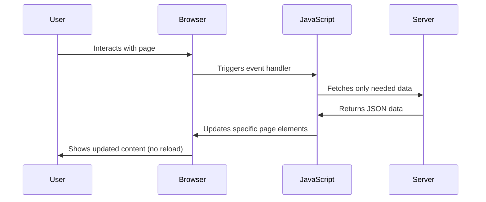


**SPA کیوں بہتر محسوس ہوتی ہیں:**
- صرف وہ حصے جو واقعی تبدیل ہوئے ہیں اپ ڈیٹ ہوتے ہیں (سمارٹ، ہے نا؟)
- مزید جھٹکے دار خلل نہیں - آپ کے صارفین اپنی روانی میں رہتے ہیں
- تار پر کم ڈیٹا سفر کرتا ہے جس کا مطلب ہے تیز لوڈنگ
- سب کچھ تیز اور جوابدہ محسوس ہوتا ہے، جیسے آپ کے فون پر ایپس

### جدید Fetch API کی طرف ارتقاء

جدید براؤزر [`Fetch` API](https://developer.mozilla.org/docs/Web/API/Fetch_API) فراہم کرتے ہیں، جو پرانے [`XMLHttpRequest`](https://developer.mozilla.org/docs/Web/API/XMLHttpRequest/Using_XMLHttpRequest) کی جگہ لیتا ہے۔ جیسے ٹیلی گراف چلانے اور ای میل استعمال کرنے کے فرق کے درمیان، Fetch API وعدوں کا استعمال کرتا ہے صاف غیر متزامن کوڈ کے لیے اور JSON کو قدرتی طور پر ہینڈل کرتا ہے۔

| خصوصیت | XMLHttpRequest | Fetch API |
|---------|----------------|----------|
| **سینٹیکس** | پیچیدہ کال بیک پر مبنی | صاف وعدہ پر مبنی |
| **JSON ہینڈلنگ** | دستی پارسنگ کی ضرورت | بلٹ ان `.json()` طریقہ |
| **ایرر ہینڈلنگ** | محدود ایرر معلومات | جامع ایرر تفصیلات |
| **جدید سپورٹ** | پرانی مطابقت | ES6+ وعدے اور async/await |

> 💡 **براؤزر مطابقت**: اچھی خبر - Fetch API تمام جدید براؤزرز میں کام کرتا ہے! اگر آپ مخصوص ورژنز کے بارے میں متجسس ہیں، [caniuse.com](https://caniuse.com/fetch) کے پاس مکمل مطابقت کی کہانی ہے۔
> 
**خلاصہ:**
- کروم، فائر فاکس، سفاری، اور ایج میں بہترین کام کرتا ہے (بنیادی طور پر جہاں آپ کے صارفین ہیں)
- صرف انٹرنیٹ ایکسپلورر کو اضافی مدد کی ضرورت ہے (اور ایمانداری سے، اب وقت آ گیا ہے کہ IE کو الوداع کہا جائے)
- آپ کو بعد میں استعمال ہونے والے خوبصورت async/await پیٹرنز کے لیے بالکل تیار کرتا ہے

### صارف لاگ ان اور ڈیٹا کی بازیابی کو نافذ کرنا

اب آئیے لاگ ان سسٹم کو نافذ کریں جو آپ کی بینکنگ ایپ کو جامد ڈسپلے سے ایک فعال ایپلیکیشن میں تبدیل کرتا ہے۔ جیسے محفوظ فوجی سہولیات میں استعمال ہونے والے تصدیقی پروٹوکول، ہم صارف کی اسناد کی تصدیق کریں گے اور پھر ان کے مخصوص ڈیٹا تک رسائی فراہم کریں گے۔

ہم اسے بتدریج بنائیں گے، بنیادی تصدیق سے شروع کرتے ہوئے اور پھر ڈیٹا حاصل کرنے کی صلاحیتوں کو شامل کریں گے۔

#### مرحلہ 1: لاگ ان فنکشن کی بنیاد بنائیں

اپنی `app.js` فائل کھولیں اور ایک نیا `login` فنکشن شامل کریں۔ یہ صارف کی تصدیق کے عمل کو ہینڈل کرے گا:

```javascript
async function login() {
  const loginForm = document.getElementById('loginForm');
  const user = loginForm.user.value;
}
```

**آئیے اسے توڑ کر دیکھتے ہیں:**
- وہ `async` کلیدی لفظ؟ یہ جاوا اسکرپٹ کو بتا رہا ہے "ارے، اس فنکشن کو چیزوں کے انتظار کی ضرورت ہو سکتی ہے"
- ہم اپنے صفحے سے فارم کو پکڑ رہے ہیں (کچھ خاص نہیں، بس اسے اس کے ID کے ذریعے تلاش کر رہے ہیں)
- پھر ہم جو کچھ بھی صارف نے اپنا یوزر نیم کے طور پر ٹائپ کیا ہے اسے نکال رہے ہیں
- یہاں ایک زبردست چال ہے: آپ کسی بھی فارم ان پٹ کو اس کے `name` ایٹریبیوٹ کے ذریعے رسائی حاصل کر سکتے ہیں - اضافی getElementById کالز کی ضرورت نہیں!

> 💡 **فارم رسائی کا پیٹرن**: ہر فارم کنٹرول کو اس کے نام (HTML میں `name` ایٹریبیوٹ کے ذریعے سیٹ کیا گیا) کے ذریعے فارم ایلیمنٹ کی پراپرٹی کے طور پر رسائی حاصل کی جا سکتی ہے۔ یہ فارم ڈیٹا حاصل کرنے کا ایک صاف، قابل پڑھائی طریقہ فراہم کرتا ہے۔

#### مرحلہ 2: اکاؤنٹ ڈیٹا حاصل کرنے کا فنکشن بنائیں

اگلے مرحلے میں، ہم سرور سے اکاؤنٹ ڈیٹا حاصل کرنے کے لیے ایک مخصوص فنکشن بنائیں گے۔ یہ آپ کے رجسٹریشن فنکشن کے جیسے ہی پیٹرن کی پیروی کرتا ہے لیکن ڈیٹا حاصل کرنے پر توجہ مرکوز کرتا ہے:

```javascript
async function getAccount(user) {
  try {
    const response = await fetch('//localhost:5000/api/accounts/' + encodeURIComponent(user));
    return await response.json();
  } catch (error) {
    return { error: error.message || 'Unknown error' };
  }
}
```

**یہ کوڈ کیا حاصل کرتا ہے:**
- **استعمال کرتا ہے** جدید `fetch` API کو ڈیٹا کو غیر متزامن طور پر درخواست کرنے کے لیے
- **تشکیل دیتا ہے** ایک GET درخواست URL یوزر نیم پیرامیٹر کے ساتھ
- **لاگو کرتا ہے** `encodeURIComponent()` خاص کرداروں کو URLs میں محفوظ طریقے سے ہینڈل کرنے کے لیے
- **تبدیل کرتا ہے** جواب کو JSON فارمیٹ میں آسان ڈیٹا ہیرا پھیری کے لیے
- **ایررز کو ہینڈل کرتا ہے** گریس فلی طور پر ایرر آبجیکٹ واپس کر کے بجائے کریش ہونے کے

> ⚠️ **سیکیورٹی نوٹ**: `encodeURIComponent()` فنکشن URLs میں خاص کرداروں کو ہینڈل کرتا ہے۔ جیسے بحری مواصلات میں استعمال ہونے والے انکوڈنگ سسٹمز، یہ یقینی بناتا ہے کہ آپ کا پیغام بالکل اسی طرح پہنچے جیسا کہ ارادہ کیا گیا تھا، "#" یا "&" جیسے کرداروں کو غلط تشریح سے روکنا۔
> 
**یہ کیوں اہم ہے:**
- خاص کرداروں کو URLs کو توڑنے سے روکتا ہے
- URL ہیرا پھیری کے حملوں سے بچاتا ہے
- یقینی بناتا ہے کہ آپ کا سرور مطلوبہ ڈیٹا وصول کرے
- محفوظ کوڈنگ کے طریقوں کی پیروی کرتا ہے

#### HTTP GET درخواستوں کو سمجھنا

یہ آپ کو حیران کر سکتا ہے: جب آپ `fetch` کو بغیر کسی اضافی آپشنز کے استعمال کرتے ہیں، تو یہ خود بخود ایک [`GET`](https://developer.mozilla.org/docs/Web/HTTP/Methods/GET) درخواست بناتا ہے۔ یہ اس کے لیے بہترین ہے جو ہم کر رہے ہیں - سرور سے پوچھنا "ارے، کیا میں اس صارف کے اکاؤنٹ ڈیٹا کو دیکھ سکتا ہوں؟"

GET درخواستوں کے بارے میں سوچیں جیسے لائبریری سے کتاب ادھار لینے کے لیے شائستگی سے پوچھنا - آپ موجودہ چیز کو دیکھنے کی درخواست کر رہے ہیں۔ POST درخواستیں (جو ہم نے رجسٹریشن کے لیے استعمال کیں) زیادہ نئی کتاب جمع کرانے جیسی ہیں تاکہ مجموعہ میں شامل کی جا سکے۔

| GET درخواست | POST درخواست |
|-------------|-------------|
| **مقصد** | موجودہ ڈیٹا حاصل کریں | سرور کو نیا ڈیٹا بھیجیں |
| **پیرامیٹرز** | URL پاتھ/کوئری سٹرنگ میں | درخواست کے باڈی میں |
| **کیچنگ** | براؤزرز کے ذریعے کیچ ہو سکتی ہے | عام طور پر کیچ نہیں ہوتی |
| **سیکیورٹی** | URL/لاگز میں نظر آتی ہے | درخواست کے باڈی میں چھپی ہوتی ہے |

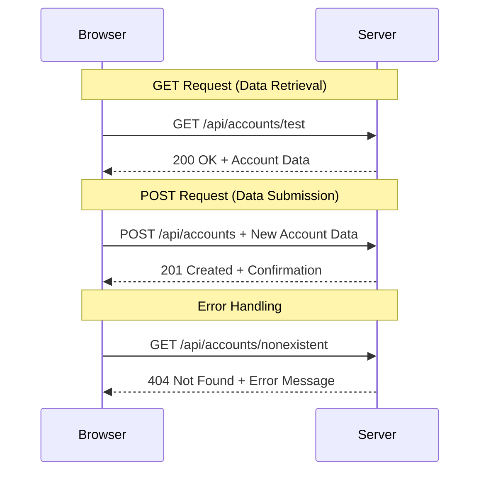

#### مرحلہ 3: سب کچھ ایک ساتھ لانا

اب سب سے اطمینان بخش حصہ - آئیے اپنے اکاؤنٹ حاصل کرنے کے فنکشن کو لاگ ان کے عمل سے جوڑتے ہیں۔ یہ وہ جگہ ہے جہاں سب کچھ اپنی جگہ پر آتا ہے:

```javascript
async function login() {
  const loginForm = document.getElementById('loginForm');
  const user = loginForm.user.value;
  const data = await getAccount(user);

  if (data.error) {
    return console.log('loginError', data.error);
  }

  account = data;
  navigate('/dashboard');
}
```

یہ فنکشن ایک واضح ترتیب کی پیروی کرتا ہے:
- فارم ان پٹ سے یوزر نیم نکالیں
- سرور سے صارف کے اکاؤنٹ ڈیٹا کی درخواست کریں
- عمل کے دوران ہونے والے کسی بھی ایرر کو ہینڈل کریں
- اکاؤنٹ ڈیٹا کو اسٹور کریں اور کامیابی پر ڈیش بورڈ پر جائیں

> 🎯 **Async/Await پیٹرن**: چونکہ `getAccount` ایک غیر متزامن فنکشن ہے، ہم `await` کلیدی لفظ استعمال کرتے ہیں تاکہ سرور کے جواب تک عمل کو روک سکیں۔ یہ کوڈ کو غیر متعین ڈیٹا کے ساتھ جاری رکھنے سے روکتا ہے۔

#### مرحلہ 4: اپنے ڈیٹا کے لیے ایک گھر بنانا

آپ کی ایپ کو کہیں اکاؤنٹ کی معلومات کو یاد رکھنے کی ضرورت ہے جب یہ لوڈ ہو جائے۔ اس کے بارے میں سوچیں جیسے آپ کی ایپ کی قلیل مدتی یادداشت - موجودہ صارف کے ڈیٹا کو آسانی سے رکھنے کی جگہ۔ اپنی `app.js` فائل کے اوپر یہ لائن شامل کریں:

```javascript
// This holds the current user's account data
let account = null;
```

**ہمیں اس کی ضرورت کیوں ہے:**
- اکاؤنٹ ڈیٹا کو آپ کی ایپ کے کسی بھی جگہ سے قابل رسائی رکھتا ہے
- `null` کے ساتھ شروع کرنا مطلب ہے "ابھی تک کوئی لاگ ان نہیں ہوا"
- جب کوئی کامیابی سے لاگ ان یا رجسٹر کرتا ہے تو اپ ڈیٹ ہوتا ہے
- سچائی کا واحد ذریعہ کے طور پر کام کرتا ہے - لاگ ان ہونے والے شخص کے بارے میں کوئی الجھن نہیں

#### مرحلہ 5: اپنے فارم کو جوڑیں

اب آئیے اپنے نئے چمکدار لاگ ان فنکشن کو اپنے HTML فارم سے جوڑتے ہیں۔ اپنے فارم ٹیگ کو اس طرح اپ ڈیٹ کریں:

```html
<form id="loginForm" action="javascript:login()">
  <!-- Your existing form inputs -->
</form>
```

**یہ چھوٹی تبدیلی کیا کرتی ہے:**
- فارم کو اس کے ڈیفالٹ "پورے صفحے کو دوبارہ لوڈ کریں" رویے سے روکتی ہے
- آپ کے کسٹم جاوا اسکرپٹ فنکشن کو کال کرتی ہے
- سب کچھ ہموار اور سنگل پیج ایپ جیسا رکھتی ہے
- صارفین کے "لاگ ان" دبانے پر کیا ہوتا ہے اس پر مکمل کنٹرول دیتی ہے

#### مرحلہ 6: اپنے رجسٹریشن فنکشن کو بہتر بنائیں

تسلسل کے لیے، اپنے `register` فنکشن کو بھی اپ ڈیٹ کریں تاکہ اکاؤنٹ ڈیٹا کو اسٹور کرے اور ڈیش بورڈ پر جائے:

```javascript
// Add these lines at the end of your register function
account = result;
navigate('/dashboard');
```

**یہ بہتری فراہم کرتی ہے:**
- **ہموار** رجسٹریشن سے ڈیش بورڈ تک منتقلی
- **مطابقت پذیر** صارف تجربہ لاگ ان اور رجسٹریشن کے بہاؤ کے درمیان
- **فوری** کامیاب رجسٹریشن کے بعد اکاؤنٹ ڈیٹا تک رسائی

#### اپنی عملدرآمد کی جانچ کرنا

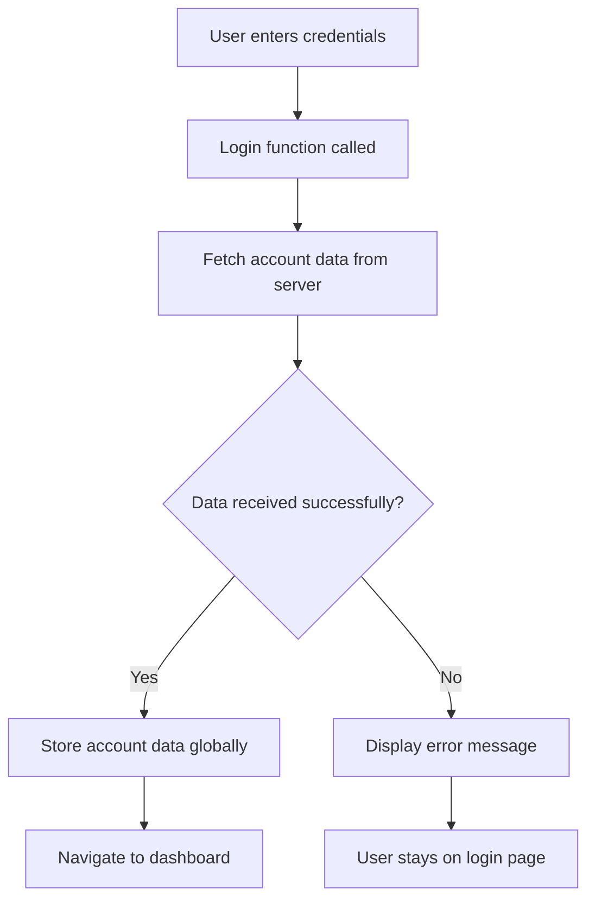

**اب اسے آزمائیں:**
1. نیا اکاؤنٹ بنائیں تاکہ یہ یقینی بنایا جا سکے کہ سب کچھ کام کر رہا ہے
2. انہی اسناد کے ساتھ لاگ ان کرنے کی کوشش کریں
3. اگر کچھ غلط لگے تو اپنے براؤزر کے کنسول (F12) پر جھانکیں
4. کامیاب لاگ ان کے بعد ڈیش بورڈ پر پہنچنے کو یقینی بنائیں

اگر کچھ کام نہیں کر رہا ہے، تو گھبرائیں نہیں! زیادہ تر مسائل آسان اصلاحات ہیں جیسے ٹائپوز یا API سرور شروع کرنا بھول جانا۔

#### کراس-اورجن جادو کے بارے میں ایک مختصر بات

آپ سوچ رہے ہوں گے: "میری ویب ایپ اس API سرور سے کیسے بات کر رہی ہے جب وہ مختلف پورٹس پر چل رہے ہیں؟" زبرد
ڈوم مینپولیشن وہ تکنیک ہے جو جامد ویب صفحات کو متحرک ایپلیکیشنز میں تبدیل کرتی ہے، جو صارف کی تعاملات اور سرور کے جوابات کی بنیاد پر اپنے مواد کو اپ ڈیٹ کرتی ہیں۔

### کام کے لیے صحیح ٹول کا انتخاب

جب جاوا اسکرپٹ کے ذریعے اپنے HTML کو اپ ڈیٹ کرنے کی بات آتی ہے، تو آپ کے پاس کئی اختیارات ہوتے ہیں۔ ان کو ایک ٹول باکس میں مختلف ٹولز کی طرح سمجھیں - ہر ایک مخصوص کام کے لیے بہترین ہے:

| طریقہ | کس کے لیے بہترین ہے | کب استعمال کریں | حفاظت کی سطح |
|-------|---------------------|------------------|--------------|
| `textContent` | صارف کے ڈیٹا کو محفوظ طریقے سے دکھانا | جب بھی آپ متن دکھا رہے ہوں | ✅ بالکل محفوظ |
| `createElement()` + `append()` | پیچیدہ لے آؤٹ بنانا | نئے سیکشنز/لسٹ بنانا | ✅ انتہائی محفوظ |
| `innerHTML` | HTML مواد سیٹ کرنا | ⚠️ اس سے بچنے کی کوشش کریں | ❌ خطرناک کام |

#### متن کو محفوظ طریقے سے دکھانے کا طریقہ: textContent

[`textContent`](https://developer.mozilla.org/docs/Web/API/Node/textContent) پراپرٹی آپ کا بہترین دوست ہے جب صارف کے ڈیٹا کو دکھانے کی بات ہو۔ یہ آپ کے ویب صفحے کے لیے ایک محافظ کی طرح ہے - کوئی نقصان دہ چیز اندر نہیں آتی:

```javascript
// The safe, reliable way to update text
const balanceElement = document.getElementById('balance');
balanceElement.textContent = account.balance;
```

**textContent کے فوائد:**
- ہر چیز کو سادہ متن کے طور پر لیتا ہے (اسکرپٹ کے عمل کو روکتا ہے)
- موجودہ مواد کو خود بخود صاف کرتا ہے
- سادہ متن اپ ڈیٹس کے لیے مؤثر
- نقصان دہ مواد کے خلاف بلٹ ان سیکیورٹی فراہم کرتا ہے

#### متحرک HTML عناصر بنانا

زیادہ پیچیدہ مواد کے لیے، [`document.createElement()`](https://developer.mozilla.org/docs/Web/API/Document/createElement) کو [`append()`](https://developer.mozilla.org/docs/Web/API/ParentNode/append) کے ساتھ ملا کر استعمال کریں:

```javascript
// Safe way to create new elements
const transactionItem = document.createElement('div');
transactionItem.className = 'transaction-item';
transactionItem.textContent = `${transaction.date}: ${transaction.description}`;
container.append(transactionItem);
```

**اس طریقے کو سمجھنا:**
- **پروگرام کے ذریعے** نئے ڈوم عناصر بناتا ہے
- **عنصر کی خصوصیات اور مواد** پر مکمل کنٹرول برقرار رکھتا ہے
- **پیچیدہ، گھنے عنصر کے ڈھانچے** کی اجازت دیتا ہے
- **سیکیورٹی کو برقرار رکھتا ہے** ساخت کو مواد سے الگ کر کے

> ⚠️ **سیکیورٹی پر غور کریں**: حالانکہ [`innerHTML`](https://developer.mozilla.org/docs/Web/API/Element/innerHTML) بہت سے ٹیوٹوریلز میں ظاہر ہوتا ہے، یہ شامل اسکرپٹس کو چلا سکتا ہے۔ جیسے CERN کے سیکیورٹی پروٹوکول غیر مجاز کوڈ کے عمل کو روکنے کے لیے کام کرتے ہیں، `textContent` اور `createElement` کا استعمال محفوظ متبادل فراہم کرتا ہے۔
> 
**innerHTML کے خطرات:**
- صارف کے ڈیٹا میں موجود کسی بھی `<script>` ٹیگ کو چلاتا ہے
- کوڈ انجیکشن حملوں کے لیے حساس
- ممکنہ سیکیورٹی خطرات پیدا کرتا ہے
- محفوظ متبادل جو ہم استعمال کر رہے ہیں، مساوی فعالیت فراہم کرتے ہیں

### غلطیوں کو صارف کے لیے دوستانہ بنانا

فی الحال، لاگ ان کی غلطیاں صرف براؤزر کنسول میں ظاہر ہوتی ہیں، جو صارفین کے لیے نظر نہیں آتی۔ جیسے ایک پائلٹ کے اندرونی تشخیصی نظام اور مسافروں کے معلوماتی نظام کے درمیان فرق ہوتا ہے، ہمیں اہم معلومات کو مناسب چینل کے ذریعے پہنچانے کی ضرورت ہے۔

نظر آنے والے غلطی کے پیغامات کو نافذ کرنا صارفین کو فوری طور پر یہ بتانے میں مدد فراہم کرتا ہے کہ کیا غلط ہوا اور آگے کیسے بڑھنا ہے۔

#### مرحلہ 1: غلطی کے پیغامات کے لیے جگہ شامل کریں

سب سے پہلے، اپنے HTML میں غلطی کے پیغامات کے لیے جگہ بنائیں۔ اسے اپنے لاگ ان بٹن سے پہلے شامل کریں تاکہ صارفین اسے قدرتی طور پر دیکھ سکیں:

```html
<!-- This is where error messages will appear -->
<div id="loginError" role="alert"></div>
<button>Login</button>
```

**یہاں کیا ہو رہا ہے:**
- ہم ایک خالی کنٹینر بنا رہے ہیں جو ضرورت پڑنے تک نظر نہیں آتا
- یہ وہاں رکھا گیا ہے جہاں صارفین "لاگ ان" پر کلک کرنے کے بعد قدرتی طور پر دیکھتے ہیں
- وہ `role="alert"` اسکرین ریڈرز کے لیے ایک اچھا اضافہ ہے - یہ معاون ٹیکنالوجی کو بتاتا ہے "ارے، یہ اہم ہے!"
- منفرد `id` ہمارے جاوا اسکرپٹ کو ایک آسان ہدف فراہم کرتا ہے

#### مرحلہ 2: ایک مددگار فنکشن بنائیں

آئیے ایک چھوٹا سا یوٹیلیٹی فنکشن بناتے ہیں جو کسی بھی عنصر کے متن کو اپ ڈیٹ کر سکتا ہے۔ یہ ان "ایک بار لکھیں، ہر جگہ استعمال کریں" فنکشنز میں سے ایک ہے جو آپ کا وقت بچائے گا:

```javascript
function updateElement(id, text) {
  const element = document.getElementById(id);
  element.textContent = text;
}
```

**فنکشن کے فوائد:**
- صرف ایک عنصر ID اور متن کے مواد کی ضرورت ہوتی ہے
- محفوظ طریقے سے DOM عناصر کو تلاش کرتا ہے اور اپ ڈیٹ کرتا ہے
- کوڈ کی نقل کو کم کرنے والا دوبارہ استعمال ہونے والا پیٹرن
- ایپلیکیشن میں مستقل اپ ڈیٹنگ کے رویے کو برقرار رکھتا ہے

#### مرحلہ 3: غلطیاں صارفین کو دکھائیں

اب اس چھپے ہوئے کنسول پیغام کو کسی ایسی چیز سے بدل دیں جو صارفین واقعی دیکھ سکیں۔ اپنی لاگ ان فنکشن کو اپ ڈیٹ کریں:

```javascript
// Instead of just logging to console, show the user what's wrong
if (data.error) {
  return updateElement('loginError', data.error);
}
```

**یہ چھوٹا سا تبدیلی بڑا فرق پیدا کرتی ہے:**
- غلطی کے پیغامات وہیں ظاہر ہوتے ہیں جہاں صارفین دیکھ رہے ہیں
- مزید پراسرار خاموش ناکامیاں نہیں
- صارفین کو فوری، قابل عمل فیڈبیک ملتا ہے
- آپ کی ایپ پیشہ ورانہ اور سوچ سمجھ کر محسوس ہوتی ہے

اب جب آپ کسی غلط اکاؤنٹ کے ساتھ ٹیسٹ کریں گے، تو آپ صفحے پر ایک مددگار غلطی کا پیغام دیکھیں گے!


#### مرحلہ 4: رسائی کے ساتھ شامل ہونا

یہاں ایک دلچسپ بات ہے جو ہم نے پہلے `role="alert"` شامل کیا تھا - یہ صرف سجاوٹ نہیں ہے! یہ چھوٹا سا ایٹریبیوٹ ایک [Live Region](https://developer.mozilla.org/docs/Web/Accessibility/ARIA/ARIA_Live_Regions) بناتا ہے جو اسکرین ریڈرز کو فوری طور پر تبدیلیوں کا اعلان کرتا ہے:

```html
<div id="loginError" role="alert"></div>
```

**یہ کیوں اہم ہے:**
- اسکرین ریڈر صارفین غلطی کا پیغام سنتے ہیں جیسے ہی یہ ظاہر ہوتا ہے
- ہر کوئی اہم معلومات حاصل کرتا ہے، چاہے وہ کیسے نیویگیٹ کرے
- یہ آپ کی ایپ کو زیادہ لوگوں کے لیے کام کرنے کا ایک آسان طریقہ ہے
- یہ ظاہر کرتا ہے کہ آپ شامل تجربات بنانے کی پرواہ کرتے ہیں

ایسی چھوٹی چھوٹی چیزیں اچھے ڈویلپرز کو عظیم ڈویلپرز سے الگ کرتی ہیں!

### 🎯 تعلیمی جائزہ: تصدیقی پیٹرنز

**رکیں اور غور کریں**: آپ نے ابھی ایک مکمل تصدیقی فلو نافذ کیا ہے۔ یہ ویب ڈویلپمنٹ میں ایک بنیادی پیٹرن ہے۔

**خود تشخیص کے لیے فوری سوالات**:
- کیا آپ وضاحت کر سکتے ہیں کہ ہم API کالز کے لیے async/await کیوں استعمال کرتے ہیں؟
- اگر ہم `encodeURIComponent()` فنکشن کو بھول جائیں تو کیا ہوگا؟
- ہماری غلطی کا ہینڈلنگ صارف کے تجربے کو کیسے بہتر بناتی ہے؟

**حقیقی دنیا کا تعلق**: جو پیٹرنز آپ نے یہاں سیکھے ہیں (async ڈیٹا فچنگ، غلطی کا ہینڈلنگ، صارف کا فیڈبیک) ہر بڑی ویب ایپلیکیشن میں استعمال ہوتے ہیں، جیسے سوشل میڈیا پلیٹ فارمز سے لے کر ای کامرس سائٹس تک۔ آپ پروڈکشن لیول کی مہارتیں بنا رہے ہیں!

**چیلنج سوال**: آپ اس تصدیقی نظام کو متعدد صارف رولز (کسٹمر، ایڈمن، ٹیلر) کو ہینڈل کرنے کے لیے کیسے تبدیل کریں گے؟ ڈیٹا اسٹرکچر اور UI میں ضروری تبدیلیوں کے بارے میں سوچیں۔

#### مرحلہ 5: رجسٹریشن پر وہی پیٹرن لاگو کریں

مطابقت کے لیے، اپنے رجسٹریشن فارم میں ایک جیسا غلطی کا ہینڈلنگ نافذ کریں:

1. **شامل کریں** ایک غلطی ڈسپلے عنصر اپنے رجسٹریشن HTML میں:
```html
<div id="registerError" role="alert"></div>
```

2. **اپ ڈیٹ کریں** اپنی رجسٹر فنکشن کو وہی غلطی ڈسپلے پیٹرن استعمال کرنے کے لیے:
```javascript
if (data.error) {
  return updateElement('registerError', data.error);
}
```

**مطابقت کے فوائد:**
- **یکساں** صارف کا تجربہ تمام فارمز میں فراہم کرتا ہے
- **ذہنی دباؤ کو کم کرتا ہے** مانوس پیٹرنز استعمال کر کے
- **بحالی کو آسان بناتا ہے** دوبارہ استعمال ہونے والے کوڈ کے ساتھ
- **رسائی کے معیار کو یقینی بناتا ہے** ایپ کے تمام حصوں میں

## اپنا متحرک ڈیش بورڈ بنانا

اب ہم آپ کے جامد ڈیش بورڈ کو ایک متحرک انٹرفیس میں تبدیل کریں گے جو حقیقی اکاؤنٹ ڈیٹا دکھاتا ہے۔ جیسے ایک پرنٹ شدہ فلائٹ شیڈول اور ایئرپورٹس کے لائیو ڈیپارچر بورڈز کے درمیان فرق ہوتا ہے، ہم جامد معلومات سے حقیقی وقت کے، جوابدہ ڈسپلے کی طرف بڑھ رہے ہیں۔

ڈوم مینپولیشن تکنیکوں کا استعمال کرتے ہوئے جو آپ نے سیکھا ہے، ہم ایک ایسا ڈیش بورڈ بنائیں گے جو موجودہ اکاؤنٹ کی معلومات کے ساتھ خود بخود اپ ڈیٹ ہوتا ہے۔

### اپنے ڈیٹا کو جاننا

شروع کرنے سے پہلے، آئیے دیکھتے ہیں کہ آپ کے سرور کی طرف سے کس قسم کا ڈیٹا واپس آتا ہے۔ جب کوئی کامیابی سے لاگ ان کرتا ہے، تو یہ معلومات کا خزانہ ہے جو آپ کے پاس کام کرنے کے لیے موجود ہوتا ہے:

```json
{
  "user": "test",
  "currency": "$",
  "description": "Test account",
  "balance": 75,
  "transactions": [
    { "id": "1", "date": "2020-10-01", "object": "Pocket money", "amount": 50 },
    { "id": "2", "date": "2020-10-03", "object": "Book", "amount": -10 },
    { "id": "3", "date": "2020-10-04", "object": "Sandwich", "amount": -5 }
  ]
}
```

**یہ ڈیٹا اسٹرکچر فراہم کرتا ہے:**
- **`user`**: تجربے کو ذاتی بنانے کے لیے بہترین ("خوش آمدید، سارہ!")
- **`currency`**: یقینی بناتا ہے کہ ہم رقم کی مقدار کو صحیح طریقے سے دکھائیں
- **`description`**: اکاؤنٹ کے لیے ایک دوستانہ نام
- **`balance`**: سب سے اہم موجودہ بیلنس
- **`transactions`**: مکمل ٹرانزیکشن ہسٹری تمام تفصیلات کے ساتھ

پیشہ ورانہ نظر آنے والا بینکنگ ڈیش بورڈ بنانے کے لیے آپ کو ہر چیز فراہم کرتا ہے!

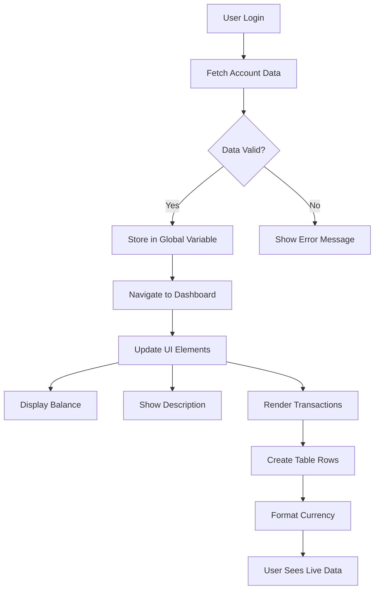

> 💡 **پرو ٹپ**: کیا آپ اپنا ڈیش بورڈ فوراً ایکشن میں دیکھنا چاہتے ہیں؟ لاگ ان کرتے وقت `test` یوزر نیم استعمال کریں - یہ پہلے سے لوڈ شدہ نمونہ ڈیٹا کے ساتھ آتا ہے تاکہ آپ سب کچھ کام کرتے ہوئے دیکھ سکیں بغیر پہلے ٹرانزیکشنز بنائے۔
> 
**ٹیسٹ اکاؤنٹ کیوں مفید ہے:**
- پہلے سے لوڈ شدہ حقیقی نمونہ ڈیٹا کے ساتھ آتا ہے
- ٹرانزیکشنز کو دکھانے کا طریقہ دیکھنے کے لیے بہترین
- آپ کی ڈیش بورڈ کی خصوصیات کو ٹیسٹ کرنے کے لیے بہترین
- آپ کو دستی طور پر فرضی ڈیٹا بنانے سے بچاتا ہے

### ڈیش بورڈ ڈسپلے عناصر بنانا

آئیے آپ کے ڈیش بورڈ انٹرفیس کو مرحلہ وار بناتے ہیں، اکاؤنٹ کے خلاصے کی معلومات سے شروع کرتے ہوئے اور پھر مزید پیچیدہ خصوصیات جیسے ٹرانزیکشن لسٹس کی طرف بڑھتے ہوئے۔

#### مرحلہ 1: اپنے HTML اسٹرکچر کو اپ ڈیٹ کریں

سب سے پہلے، جامد "بیلنس" سیکشن کو متحرک پلیس ہولڈر عناصر کے ساتھ تبدیل کریں جنہیں آپ کا جاوا اسکرپٹ بھر سکتا ہے:

```html
<section>
  Balance: <span id="balance"></span><span id="currency"></span>
</section>
```

پھر، اکاؤنٹ کی تفصیل کے لیے ایک سیکشن شامل کریں۔ چونکہ یہ ڈیش بورڈ مواد کے لیے ایک عنوان کے طور پر کام کرتا ہے، اس لیے سیمینٹک HTML استعمال کریں:

```html
<h2 id="description"></h2>
```

**HTML اسٹرکچر کو سمجھنا:**
- **الگ الگ** `<span>` عناصر کا استعمال بیلنس اور کرنسی کے لیے انفرادی کنٹرول کے لیے
- **منفرد IDs** کو ہر عنصر پر لاگو کرتا ہے تاکہ جاوا اسکرپٹ کے ذریعے ہدف بنایا جا سکے
- **سیمینٹک HTML** کا استعمال کرتے ہوئے `<h2>` کو اکاؤنٹ کی تفصیل کے لیے استعمال کرتا ہے
- **اسکرین ریڈرز اور SEO** کے لیے منطقی درجہ بندی بناتا ہے

> ✅ **رسائی کی بصیرت**: اکاؤنٹ کی تفصیل ڈیش بورڈ مواد کے لیے ایک عنوان کے طور پر کام کرتی ہے، اس لیے اسے سیمینٹک طور پر ہیڈنگ کے طور پر نشان زد کیا گیا ہے۔ مزید جانیں کہ [ہیڈنگ اسٹرکچر](https://www.nomensa.com/blog/2017/how-structure-headings-web-accessibility) رسائی کو کیسے متاثر کرتا ہے۔ کیا آپ اپنے صفحے پر دوسرے عناصر کی شناخت کر سکتے ہیں جو ہیڈنگ ٹیگز سے فائدہ اٹھا سکتے ہیں؟

#### مرحلہ 2: ڈیش بورڈ اپ ڈیٹ فنکشن بنائیں

اب ایک فنکشن بنائیں جو حقیقی اکاؤنٹ ڈیٹا کے ساتھ آپ کے ڈیش بورڈ کو بھرے:

```javascript
function updateDashboard() {
  if (!account) {
    return navigate('/login');
  }

  updateElement('description', account.description);
  updateElement('balance', account.balance.toFixed(2));
  updateElement('currency', account.currency);
}
```

**یہ فنکشن کیا کرتا ہے:**
- **تصدیق کرتا ہے** کہ اکاؤنٹ ڈیٹا موجود ہے یا نہیں
- **غیر تصدیق شدہ صارفین کو** لاگ ان صفحے پر واپس بھیجتا ہے
- **اکاؤنٹ کی تفصیل کو اپ ڈیٹ کرتا ہے** دوبارہ استعمال ہونے والے `updateElement` فنکشن کا استعمال کرتے ہوئے
- **بیلنس کو فارمیٹ کرتا ہے** تاکہ ہمیشہ دو اعشاریہ مقامات دکھائے
- **مناسب کرنسی علامت دکھاتا ہے**

> 💰 **رقم کی فارمیٹنگ**: وہ [`toFixed(2)`](https://developer.mozilla.org/docs/Web/JavaScript/Reference/Global_Objects/Number/toFixed) میتھڈ ایک زندگی بچانے والا ہے! یہ یقینی بناتا ہے کہ آپ کا بیلنس ہمیشہ حقیقی رقم کی طرح نظر آئے - "75.00" بجائے صرف "75"۔ آپ کے صارفین کو مانوس کرنسی فارمیٹنگ دیکھ کر خوشی ہوگی۔

#### مرحلہ 3: یقینی بنائیں کہ آپ کا ڈیش بورڈ اپ ڈیٹ ہوتا ہے

یہ یقینی بنانے کے لیے کہ آپ کا ڈیش بورڈ ہر بار تازہ ڈیٹا کے ساتھ ریفریش ہوتا ہے جب کوئی اسے دیکھتا ہے، ہمیں آپ کے نیویگیشن سسٹم میں ہک کرنا ہوگا۔ اگر آپ نے [سبق 1 کا اسائنمنٹ](../1-template-route/assignment.md) مکمل کیا ہے، تو یہ مانوس محسوس ہونا چاہیے۔ اگر نہیں، تو فکر نہ کریں - آپ کو یہ چاہیے:

اپنے `updateRoute()` فنکشن کے آخر میں یہ شامل کریں:

```javascript
if (typeof route.init === 'function') {
  route.init();
}
```

پھر اپنے روٹس کو ڈیش بورڈ انیشیالائزیشن شامل کرنے کے لیے اپ ڈیٹ کریں:

```javascript
const routes = {
  '/login': { templateId: 'login' },
  '/dashboard': { templateId: 'dashboard', init: updateDashboard }
};
```

**یہ ہوشیار سیٹ اپ کیا کرتا ہے:**
- چیک کرتا ہے کہ آیا کسی روٹ میں خاص انیشیالائزیشن کوڈ ہے
- وہ کوڈ خود بخود چلاتا ہے جب روٹ لوڈ ہوتا ہے
- یقینی بناتا ہے کہ آپ کا ڈیش بورڈ ہمیشہ تازہ، موجودہ ڈیٹا دکھاتا ہے
- آپ کے روٹنگ لاجک کو صاف اور منظم رکھتا ہے

#### اپنے ڈیش بورڈ کی جانچ

ان تبدیلیوں کو نافذ کرنے کے بعد، اپنے ڈیش بورڈ کی جانچ کریں:

1. **لاگ ان کریں** ایک ٹیسٹ اکاؤنٹ کے ساتھ
2. **تصدیق کریں** کہ آپ کو ڈیش بورڈ پر ری ڈائریکٹ کیا گیا ہے
3. **چیک کریں** کہ اکاؤنٹ کی تفصیل، بیلنس، اور کرنسی صحیح طریقے سے دکھائی دے رہے ہیں
4. **لاگ آؤٹ اور دوبارہ لاگ ان کرنے کی کوشش کریں** تاکہ ڈیٹا کو صحیح طریقے سے ریفریش کیا جا سکے

آپ کا ڈیش بورڈ اب متحرک اکاؤنٹ کی معلومات دکھائے گا جو لاگ ان صارف کے ڈیٹا کی بنیاد پر اپ ڈیٹ ہوتا ہے!

## ٹیمپلیٹس کے ساتھ سمارٹ ٹرانزیکشن لسٹس بنانا

ہر ٹرانزیکشن کے لیے دستی طور پر HTML بنانے کے بجائے، ہم ٹیمپلیٹس کا استعمال کریں گے تاکہ خود بخود مستقل فارمیٹنگ پیدا کی جا سکے۔ جیسے خلائی جہاز کی تیاری میں استعمال ہونے والے معیاری اجزاء، ٹیمپلیٹس یقینی بناتے ہیں کہ ہر ٹرانزیکشن رو ایک ہی ساخت اور ظاہری شکل کی پیروی کرے۔

یہ تکنیک چند ٹرانزیکشنز سے لے کر ہزاروں تک مؤثر طریقے سے اسکیل کرتی ہے، مستقل کارکردگی اور پیشکش کو برقرار رکھتے ہوئے۔

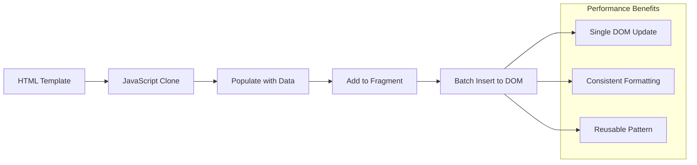

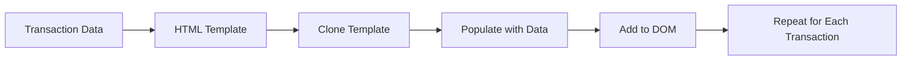

### مرحلہ 1: ٹرانزیکشن ٹیمپلیٹ بنائیں

سب سے پہلے، اپنے HTML `<body>` میں ٹرانزیکشن رو کے لیے ایک دوبارہ استعمال ہونے والا ٹیمپلیٹ شامل کریں:

```html
<template id="transaction">
  <tr>
    <td></td>
    <td></td>
    <td></td>
  </tr>
</template>
```

**HTML ٹیمپلیٹس کو سمجھنا:**
- **ایک ٹیبل رو کے لیے ساخت کی وضاحت کرتا ہے**
- **جب تک جاوا اسکرپٹ کے ذریعے کلون اور بھر نہ جائے، نظر نہیں آتا**
- **تین سیلز شامل کرتا ہے** تاریخ، تفصیل، اور مقدار کے لیے
- **مستقل فارمیٹنگ کے لیے ایک دوبارہ استعمال ہونے والا پیٹرن فراہم کرتا ہے**

### مرحلہ
> ⚡ **کارکرد کی بہتری**: [`document.createDocumentFragment()`](https://developer.mozilla.org/docs/Web/API/Document/createDocumentFragment) بوئنگ کے اسمبلی عمل کی طرح کام کرتا ہے - اجزاء مرکزی لائن سے باہر تیار کیے جاتے ہیں، پھر مکمل یونٹ کے طور پر نصب کیے جاتے ہیں۔ یہ بیچنگ طریقہ کار DOM ریفلو کو کم سے کم کرتا ہے کیونکہ یہ متعدد انفرادی آپریشنز کے بجائے ایک ہی بار داخلہ انجام دیتا ہے۔

### مرحلہ 5: مخلوط مواد کے لیے اپڈیٹ فنکشن کو بہتر بنائیں

آپ کا `updateElement()` فنکشن فی الحال صرف ٹیکسٹ مواد کو ہینڈل کرتا ہے۔ اسے ٹیکسٹ اور DOM نوڈز دونوں کے ساتھ کام کرنے کے لیے اپڈیٹ کریں:

```javascript
function updateElement(id, textOrNode) {
  const element = document.getElementById(id);
  element.textContent = ''; // Removes all children
  element.append(textOrNode);
}
```

**اس اپڈیٹ میں اہم بہتریاں:**
- **موجودہ مواد کو صاف کرتا ہے** نئے مواد شامل کرنے سے پہلے
- **ٹیکسٹ اسٹرنگز یا DOM نوڈز کو بطور پیرامیٹر قبول کرتا ہے**
- **لچک کے لیے [`append()`](https://developer.mozilla.org/docs/Web/API/ParentNode/append) طریقہ استعمال کرتا ہے**
- **موجودہ ٹیکسٹ پر مبنی استعمال کے ساتھ پسماندہ مطابقت برقرار رکھتا ہے**

### اپنے ڈیش بورڈ کو آزمائیں

اب وقت ہے حقیقت کا سامنا کرنے کا! آئیے آپ کے ڈائنامک ڈیش بورڈ کو ایکشن میں دیکھتے ہیں:

1. `test` اکاؤنٹ کے ساتھ لاگ ان کریں (اس میں نمونہ ڈیٹا پہلے سے موجود ہے)
2. اپنے ڈیش بورڈ پر جائیں
3. چیک کریں کہ ٹرانزیکشن کی قطاریں صحیح فارمیٹنگ کے ساتھ ظاہر ہو رہی ہیں
4. یقینی بنائیں کہ تاریخیں، تفصیلات، اور رقمیں سب ٹھیک نظر آ رہی ہیں

اگر سب کچھ ٹھیک کام کر رہا ہے، تو آپ کو اپنے ڈیش بورڈ پر مکمل طور پر فعال ٹرانزیکشن لسٹ نظر آئے گی! 🎉

**آپ نے کیا حاصل کیا:**
- ایسا ڈیش بورڈ بنایا جو کسی بھی مقدار کے ڈیٹا کے ساتھ اسکیل کر سکتا ہے
- مستقل فارمیٹنگ کے لیے دوبارہ استعمال کے قابل ٹیمپلیٹس بنائے
- موثر DOM ہیرا پھیری کی تکنیکیں نافذ کیں
- پروڈکشن بینکنگ ایپلیکیشنز کے برابر فعالیت تیار کی

آپ نے ایک جامد ویب صفحہ کو ایک ڈائنامک ویب ایپلیکیشن میں کامیابی سے تبدیل کر دیا ہے۔

### 🎯 تعلیمی جائزہ: ڈائنامک مواد کی تخلیق

**آرکیٹیکچر کی سمجھ**: آپ نے ایک پیچیدہ ڈیٹا سے UI پائپ لائن نافذ کی ہے جو React، Vue، اور Angular جیسے فریم ورک میں استعمال ہونے والے پیٹرنز کی عکاسی کرتی ہے۔

**اہم تصورات میں مہارت حاصل کی**:
- **ٹیمپلیٹ پر مبنی رینڈرنگ**: دوبارہ استعمال کے قابل UI اجزاء بنانا
- **ڈاکیومنٹ فریگمنٹس**: DOM کارکردگی کو بہتر بنانا
- **محفوظ DOM ہیرا پھیری**: سیکیورٹی کے خطرات کو روکنا
- **ڈیٹا کی تبدیلی**: سرور ڈیٹا کو یوزر انٹرفیس میں تبدیل کرنا

**صنعتی تعلق**: یہ تکنیکیں جدید فرنٹ اینڈ فریم ورک کی بنیاد بناتی ہیں۔ React کا ورچوئل DOM، Vue کا ٹیمپلیٹ سسٹم، اور Angular کا کمپوننٹ آرکیٹیکچر ان بنیادی تصورات پر مبنی ہیں۔

**عکاسی کا سوال**: آپ اس نظام کو حقیقی وقت کی اپڈیٹس (جیسے نئے ٹرانزیکشنز خود بخود ظاہر ہونا) کو ہینڈل کرنے کے لیے کیسے بڑھائیں گے؟ WebSockets یا Server-Sent Events پر غور کریں۔

---

## 📈 آپ کی ڈیٹا مینجمنٹ مہارت کا ٹائم لائن

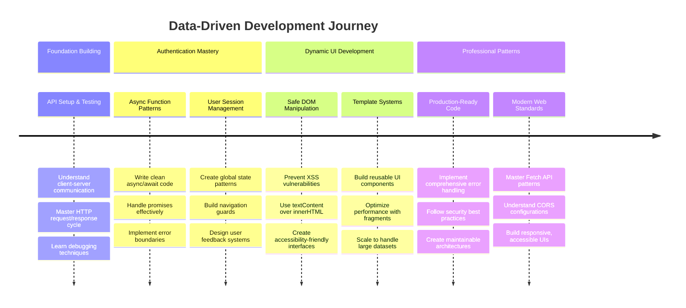

**🎓 گریجویشن سنگ میل**: آپ نے جدید جاوا اسکرپٹ پیٹرنز کا استعمال کرتے ہوئے مکمل ڈیٹا سے چلنے والی ویب ایپلیکیشن کامیابی سے بنائی ہے۔ یہ مہارتیں React، Vue، یا Angular جیسے فریم ورک کے ساتھ کام کرنے کے لیے براہ راست ترجمہ کرتی ہیں۔

**🔄 اگلے درجے کی صلاحیتیں**:
- ان تصورات پر مبنی فرنٹ اینڈ فریم ورک کو دریافت کرنے کے لیے تیار
- WebSockets کے ساتھ حقیقی وقت کی خصوصیات نافذ کرنے کے لیے تیار
- آف لائن صلاحیتوں کے ساتھ پروگریسو ویب ایپس بنانے کے لیے تیار
- جدید اسٹیٹ مینجمنٹ پیٹرنز سیکھنے کے لیے بنیاد تیار

## GitHub Copilot Agent Challenge 🚀

Agent موڈ کا استعمال کرتے ہوئے درج ذیل چیلنج مکمل کریں:

**تفصیل:** بینکنگ ایپ میں ٹرانزیکشن سرچ اور فلٹر فیچر نافذ کریں جو صارفین کو تاریخ کی حد، رقم، یا تفصیل کے کلیدی الفاظ کے ذریعے مخصوص ٹرانزیکشنز تلاش کرنے کی اجازت دیتا ہے۔

**پرومپٹ:** بینکنگ ایپ کے لیے سرچ فنکشنلٹی بنائیں جس میں شامل ہو: 1) تاریخ کی حد (سے/تک)، کم از کم/زیادہ سے زیادہ رقم، اور ٹرانزیکشن تفصیل کے کلیدی الفاظ کے لیے ان پٹ فیلڈز کے ساتھ ایک سرچ فارم، 2) ایک `filterTransactions()` فنکشن جو سرچ کے معیار کی بنیاد پر account.transactions array کو فلٹر کرے، 3) `updateDashboard()` فنکشن کو اپڈیٹ کریں تاکہ فلٹر شدہ نتائج دکھائے، اور 4) "Clear Filters" بٹن شامل کریں تاکہ ویو کو ری سیٹ کیا جا سکے۔ جدید جاوا اسکرپٹ array طریقے جیسے `filter()` استعمال کریں اور خالی سرچ معیار کے لیے edge cases کو ہینڈل کریں۔

Agent موڈ کے بارے میں مزید جانیں [یہاں](https://code.visualstudio.com/blogs/2025/02/24/introducing-copilot-agent-mode)۔

## 🚀 چیلنج

اپنی بینکنگ ایپ کو اگلے درجے پر لے جانے کے لیے تیار ہیں؟ آئیے اسے ایسا بنائیں کہ آپ واقعی اسے استعمال کرنا چاہیں۔ یہاں کچھ خیالات ہیں جو آپ کی تخلیقی صلاحیت کو بڑھا سکتے ہیں:

**اسے خوبصورت بنائیں**: CSS اسٹائلنگ شامل کریں تاکہ آپ کے فنکشنل ڈیش بورڈ کو بصری طور پر دلکش بنایا جا سکے۔ صاف لائنیں، اچھا اسپیسنگ، اور شاید کچھ ہلکی اینیمیشنز شامل کریں۔

**اسے ریسپانسیو بنائیں**: [میڈیا کوئریز](https://developer.mozilla.org/docs/Web/CSS/Media_Queries) استعمال کرنے کی کوشش کریں تاکہ ایک [ریسپانسیو ڈیزائن](https://developer.mozilla.org/docs/Web/Progressive_web_apps/Responsive/responsive_design_building_blocks) بنایا جا سکے جو فونز، ٹیبلٹس، اور ڈیسک ٹاپس پر بہترین کام کرے۔ آپ کے صارفین آپ کا شکریہ ادا کریں گے!

**کچھ دلکشی شامل کریں**: ٹرانزیکشنز کو رنگوں سے کوڈ کریں (آمدنی کے لیے سبز، اخراجات کے لیے سرخ)، آئیکنز شامل کریں، یا ایسے ہوور ایفیکٹس بنائیں جو انٹرفیس کو انٹرایکٹو محسوس کرائیں۔

یہاں ایک پالش شدہ ڈیش بورڈ کی مثال کی طرح نظر آ سکتا ہے:


ایسا محسوس نہ کریں کہ آپ کو اسے بالکل اسی طرح سے ملانا ہے - اسے بطور تحریک استعمال کریں اور اسے اپنا بنائیں!

## لیکچر کے بعد کا کوئز

[لیکچر کے بعد کا کوئز](https://ff-quizzes.netlify.app/web/quiz/46)

## اسائنمنٹ

[اپنے کوڈ کو ریفیکٹر کریں اور اس پر تبصرہ کریں](assignment.md)

---

**ڈسکلیمر**:  
یہ دستاویز AI ترجمہ سروس [Co-op Translator](https://github.com/Azure/co-op-translator) کا استعمال کرتے ہوئے ترجمہ کی گئی ہے۔ ہم درستگی کے لیے کوشش کرتے ہیں، لیکن براہ کرم آگاہ رہیں کہ خودکار ترجمے میں غلطیاں یا غیر درستیاں ہو سکتی ہیں۔ اصل دستاویز کو اس کی اصل زبان میں مستند ذریعہ سمجھا جانا چاہیے۔ اہم معلومات کے لیے، پیشہ ور انسانی ترجمہ کی سفارش کی جاتی ہے۔ ہم اس ترجمے کے استعمال سے پیدا ہونے والی کسی بھی غلط فہمی یا غلط تشریح کے ذمہ دار نہیں ہیں۔