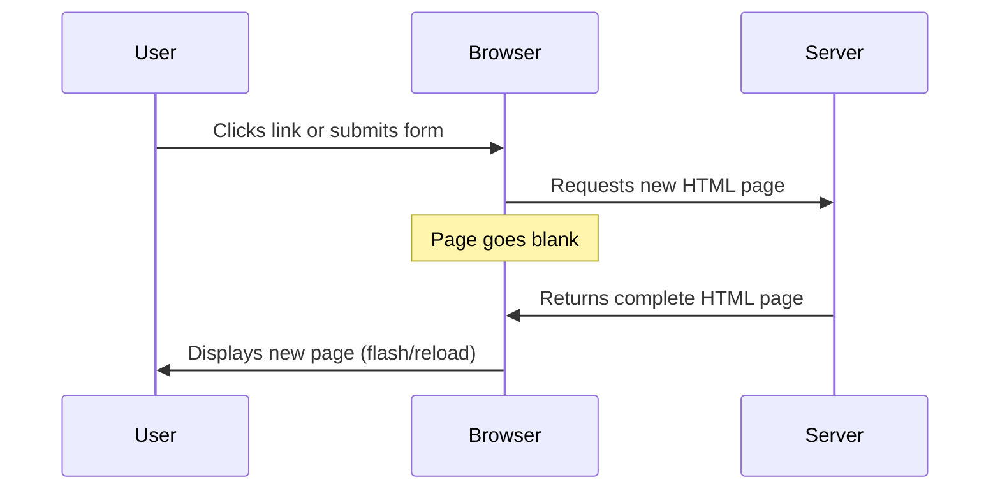
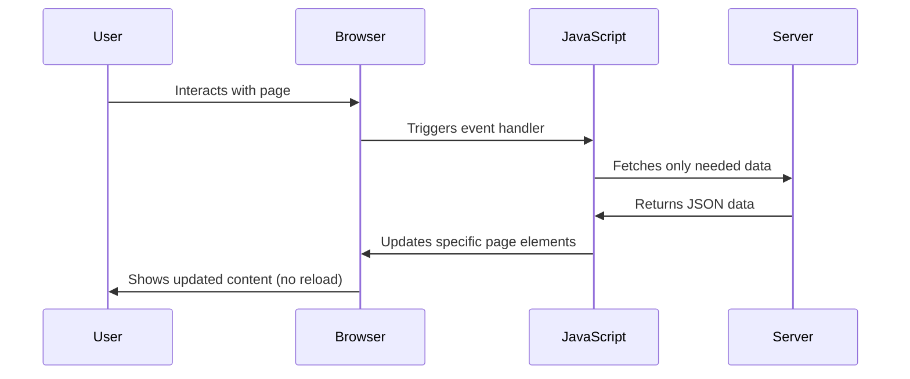
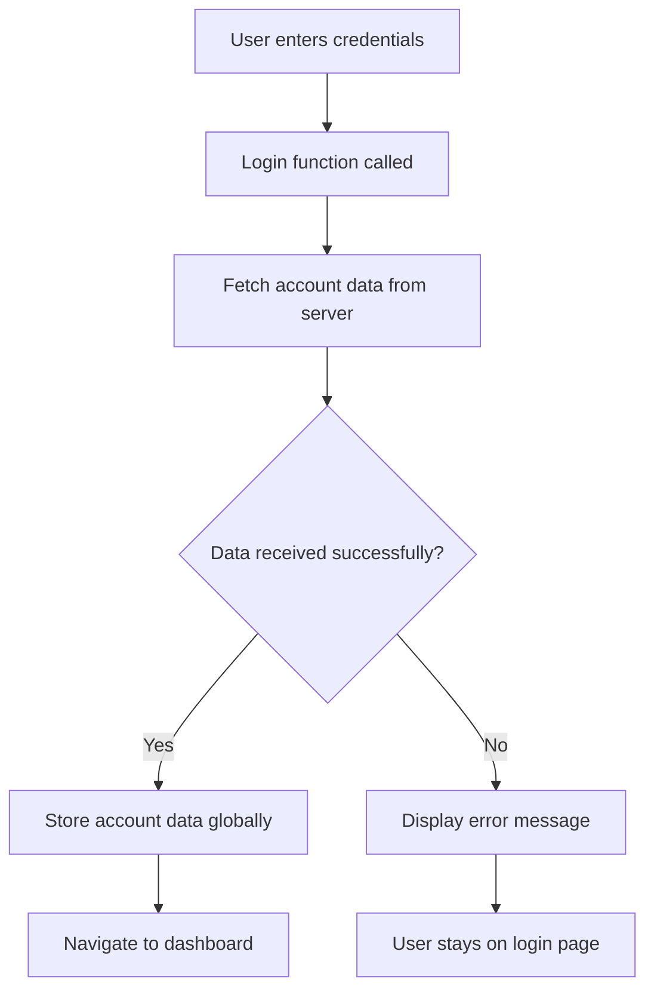
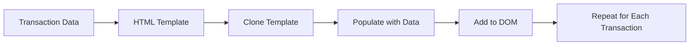

<!--
CO_OP_TRANSLATOR_METADATA:
{
  "original_hash": "2c1164912414820c8efd699b43f64954",
  "translation_date": "2025-10-22T14:59:46+00:00",
  "source_file": "7-bank-project/3-data/README.md",
  "language_code": "ur"
}
-->
# بینکنگ ایپ بنائیں حصہ 3: ڈیٹا حاصل کرنے اور استعمال کرنے کے طریقے

اسٹار ٹریک میں انٹرپرائز کے کمپیوٹر کے بارے میں سوچیں - جب کیپٹن پیکارڈ جہاز کی حالت کے بارے میں پوچھتے ہیں، تو معلومات فوراً ظاہر ہوتی ہیں بغیر پورے انٹرفیس کو بند کیے اور دوبارہ تعمیر کیے۔ معلومات کا یہ ہموار بہاؤ بالکل وہی ہے جو ہم یہاں متحرک ڈیٹا حاصل کرنے کے ساتھ بنا رہے ہیں۔

اس وقت، آپ کی بینکنگ ایپ ایک چھپے ہوئے اخبار کی طرح ہے - معلوماتی لیکن جامد۔ ہم اسے ناسا کے مشن کنٹرول کی طرح کچھ میں تبدیل کرنے جا رہے ہیں، جہاں ڈیٹا مسلسل بہتا ہے اور حقیقی وقت میں اپ ڈیٹ ہوتا ہے بغیر صارف کے ورک فلو میں خلل ڈالے۔

آپ سیکھیں گے کہ سرورز کے ساتھ غیر متزامن طور پر کیسے بات چیت کی جائے، مختلف اوقات میں آنے والے ڈیٹا کو کیسے ہینڈل کیا جائے، اور خام معلومات کو صارفین کے لیے معنی خیز چیز میں کیسے تبدیل کیا جائے۔ یہ ایک ڈیمو اور پروڈکشن کے لیے تیار سافٹ ویئر کے درمیان فرق ہے۔

## لیکچر سے پہلے کا کوئز

[لیکچر سے پہلے کا کوئز](https://ff-quizzes.netlify.app/web/quiz/45)

### ضروریات

ڈیٹا حاصل کرنے میں غوطہ لگانے سے پہلے، یقینی بنائیں کہ آپ کے پاس یہ اجزاء تیار ہیں:

- **پچھلا سبق**: [لاگ ان اور رجسٹریشن فارم](../2-forms/README.md) مکمل کریں - ہم اس بنیاد پر تعمیر کریں گے۔
- **لوکل سرور**: [Node.js](https://nodejs.org) انسٹال کریں اور [سرور API چلائیں](../api/README.md) تاکہ اکاؤنٹ ڈیٹا فراہم کیا جا سکے۔
- **API کنکشن**: اپنے سرور کنکشن کو اس کمانڈ کے ساتھ ٹیسٹ کریں:

```bash
curl http://localhost:5000/api
# Expected response: "Bank API v1.0.0"
```

یہ فوری ٹیسٹ یقینی بناتا ہے کہ تمام اجزاء صحیح طریقے سے بات چیت کر رہے ہیں:
- تصدیق کرتا ہے کہ Node.js آپ کے سسٹم پر صحیح طریقے سے چل رہا ہے۔
- اس بات کی تصدیق کرتا ہے کہ آپ کا API سرور فعال ہے اور جواب دے رہا ہے۔
- اس بات کی توثیق کرتا ہے کہ آپ کی ایپ سرور تک پہنچ سکتی ہے (جیسے مشن سے پہلے ریڈیو رابطہ چیک کرنا)۔

---

## جدید ویب ایپس میں ڈیٹا حاصل کرنے کو سمجھنا

ویب ایپلیکیشنز کے ڈیٹا کو ہینڈل کرنے کا طریقہ پچھلے دو دہائیوں میں ڈرامائی طور پر تبدیل ہوا ہے۔ اس ارتقاء کو سمجھنا آپ کو یہ سمجھنے میں مدد دے گا کہ جدید تکنیک جیسے AJAX اور Fetch API کیوں طاقتور ہیں اور کیوں وہ ویب ڈویلپرز کے لیے ضروری ٹولز بن چکے ہیں۔

آئیے دریافت کریں کہ روایتی ویب سائٹس کیسے کام کرتی تھیں اس کے مقابلے میں ہم آج جو متحرک، جوابدہ ایپلیکیشنز بناتے ہیں۔

### روایتی ملٹی پیج ایپلیکیشنز (MPA)

ویب کے ابتدائی دنوں میں، ہر کلک پرانے ٹیلی ویژن پر چینلز تبدیل کرنے جیسا تھا - اسکرین خالی ہو جاتی، پھر آہستہ آہستہ نئے مواد میں ٹیون ہو جاتی۔ یہ ابتدائی ویب ایپلیکیشنز کی حقیقت تھی، جہاں ہر تعامل کا مطلب پورے صفحے کو شروع سے دوبارہ تعمیر کرنا تھا۔




**یہ طریقہ کیوں بھاری محسوس ہوتا تھا:**
- ہر کلک کا مطلب پورے صفحے کو شروع سے دوبارہ تعمیر کرنا تھا۔
- صارفین کو ان پریشان کن صفحہ فلیشز کے ذریعے سوچ کے درمیان میں خلل پڑتا تھا۔
- آپ کا انٹرنیٹ کنکشن بار بار وہی ہیڈر اور فوٹر ڈاؤن لوڈ کرنے میں زیادہ کام کرتا تھا۔
- ایپس زیادہ فائلنگ کابینہ کے ذریعے کلک کرنے جیسی محسوس ہوتی تھیں بجائے سافٹ ویئر استعمال کرنے کے۔

### جدید سنگل پیج ایپلیکیشنز (SPA)

AJAX (Asynchronous JavaScript and XML) نے اس پیراڈائم کو مکمل طور پر تبدیل کر دیا۔ جیسے انٹرنیشنل اسپیس اسٹیشن کا ماڈیولر ڈیزائن، جہاں خلا باز پورے ڈھانچے کو دوبارہ تعمیر کیے بغیر انفرادی اجزاء کو تبدیل کر سکتے ہیں، AJAX ہمیں ویب صفحہ کے مخصوص حصوں کو اپ ڈیٹ کرنے کی اجازت دیتا ہے بغیر سب کچھ دوبارہ لوڈ کیے۔ حالانکہ نام میں XML کا ذکر ہے، ہم آج زیادہ تر JSON استعمال کرتے ہیں، لیکن بنیادی اصول وہی رہتا ہے: صرف وہی اپ ڈیٹ کریں جسے تبدیل کرنے کی ضرورت ہے۔




**کیوں SPAs بہت بہتر محسوس ہوتے ہیں:**
- صرف وہ حصے جو واقعی تبدیل ہوئے ہیں اپ ڈیٹ ہوتے ہیں (سمارٹ، ہے نا؟)
- مزید جھٹکے دار خلل نہیں - آپ کے صارفین اپنے بہاؤ میں رہتے ہیں۔
- تار پر کم ڈیٹا سفر کرنے کا مطلب ہے تیز لوڈنگ۔
- سب کچھ تیز اور جوابدہ محسوس ہوتا ہے، جیسے آپ کے فون پر ایپس۔

### جدید Fetch API کی طرف ارتقاء

جدید براؤزر [`Fetch` API](https://developer.mozilla.org/docs/Web/API/Fetch_API) فراہم کرتے ہیں، جو پرانے [`XMLHttpRequest`](https://developer.mozilla.org/docs/Web/API/XMLHttpRequest/Using_XMLHttpRequest) کی جگہ لیتا ہے۔ جیسے ٹیلی گراف چلانے اور ای میل استعمال کرنے کے درمیان فرق، Fetch API وعدوں کا استعمال کرتا ہے صاف غیر متزامن کوڈ کے لیے اور JSON کو قدرتی طور پر ہینڈل کرتا ہے۔

| خصوصیت | XMLHttpRequest | Fetch API |
|---------|----------------|----------|
| **سینٹیکس** | پیچیدہ کال بیک پر مبنی | صاف وعدہ پر مبنی |
| **JSON ہینڈلنگ** | دستی تجزیہ کی ضرورت | بلٹ ان `.json()` طریقہ |
| **غلطی ہینڈلنگ** | محدود غلطی کی معلومات | جامع غلطی کی تفصیلات |
| **جدید سپورٹ** | پرانی مطابقت | ES6+ وعدے اور async/await |

> 💡 **براؤزر مطابقت**: اچھی خبر - Fetch API تمام جدید براؤزرز میں کام کرتا ہے! اگر آپ مخصوص ورژنز کے بارے میں متجسس ہیں، [caniuse.com](https://caniuse.com/fetch) کے پاس مکمل مطابقت کی کہانی ہے۔
> 
**خلاصہ:**
- کروم، فائر فاکس، سفاری، اور ایج میں بہترین کام کرتا ہے (بنیادی طور پر جہاں آپ کے صارفین ہیں)
- صرف انٹرنیٹ ایکسپلورر کو اضافی مدد کی ضرورت ہے (اور ایمانداری سے، IE کو جانے دینا وقت ہے)
- آپ کو ان خوبصورت async/await پیٹرنز کے لیے بالکل تیار کرتا ہے جنہیں ہم بعد میں استعمال کریں گے۔

### صارف لاگ ان اور ڈیٹا حاصل کرنے کا نفاذ

اب آئیے لاگ ان سسٹم کو نافذ کریں جو آپ کی بینکنگ ایپ کو جامد ڈسپلے سے فعال ایپلیکیشن میں تبدیل کرتا ہے۔ جیسے محفوظ فوجی سہولیات میں استعمال ہونے والے تصدیقی پروٹوکول، ہم صارف کی اسناد کی تصدیق کریں گے اور پھر ان کے مخصوص ڈیٹا تک رسائی فراہم کریں گے۔

ہم اسے بتدریج بنائیں گے، بنیادی تصدیق سے شروع کرتے ہوئے اور پھر ڈیٹا حاصل کرنے کی صلاحیتیں شامل کریں گے۔

#### مرحلہ 1: لاگ ان فنکشن کی بنیاد بنائیں

اپنے `app.js` فائل کو کھولیں اور ایک نیا `login` فنکشن شامل کریں۔ یہ صارف کی تصدیق کے عمل کو ہینڈل کرے گا:

```javascript
async function login() {
  const loginForm = document.getElementById('loginForm');
  const user = loginForm.user.value;
}
```

**آئیے اسے توڑتے ہیں:**
- وہ `async` کلیدی لفظ؟ یہ جاوا اسکرپٹ کو بتا رہا ہے "ارے، اس فنکشن کو چیزوں کے انتظار کی ضرورت ہو سکتی ہے"
- ہم اپنے صفحے سے فارم کو پکڑ رہے ہیں (کچھ خاص نہیں، بس اسے اس کے ID کے ذریعے تلاش کر رہے ہیں)
- پھر ہم جو کچھ بھی صارف نے اپنا یوزر نیم کے طور پر ٹائپ کیا ہے اسے نکال رہے ہیں۔
- یہاں ایک زبردست چال ہے: آپ کسی بھی فارم ان پٹ کو اس کے `name` ایٹریبیوٹ کے ذریعے رسائی حاصل کر سکتے ہیں - اضافی getElementById کالز کی ضرورت نہیں!

> 💡 **فارم رسائی کا پیٹرن**: ہر فارم کنٹرول کو اس کے نام (HTML میں `name` ایٹریبیوٹ کا استعمال کرتے ہوئے سیٹ کیا گیا) کے ذریعے فارم عنصر کی پراپرٹی کے طور پر رسائی حاصل کی جا سکتی ہے۔ یہ فارم ڈیٹا حاصل کرنے کا ایک صاف، قابل پڑھنے طریقہ فراہم کرتا ہے۔

#### مرحلہ 2: اکاؤنٹ ڈیٹا حاصل کرنے کا فنکشن بنائیں

اگلے، ہم سرور سے اکاؤنٹ ڈیٹا حاصل کرنے کے لیے ایک مخصوص فنکشن بنائیں گے۔ یہ آپ کے رجسٹریشن فنکشن کے اسی پیٹرن کی پیروی کرتا ہے لیکن ڈیٹا حاصل کرنے پر مرکوز ہے:

```javascript
async function getAccount(user) {
  try {
    const response = await fetch('//localhost:5000/api/accounts/' + encodeURIComponent(user));
    return await response.json();
  } catch (error) {
    return { error: error.message || 'Unknown error' };
  }
}
```

**یہ کوڈ کیا حاصل کرتا ہے:**
- **استعمال کرتا ہے** جدید `fetch` API ڈیٹا کو غیر متزامن طور پر درخواست کرنے کے لیے۔
- **تعمیر کرتا ہے** GET درخواست URL یوزر نیم پیرامیٹر کے ساتھ۔
- **لاگو کرتا ہے** `encodeURIComponent()` خاص کرداروں کو URLs میں محفوظ طریقے سے ہینڈل کرنے کے لیے۔
- **تبدیل کرتا ہے** جواب کو JSON فارمیٹ میں آسان ڈیٹا ہیرا پھیری کے لیے۔
- **ہینڈل کرتا ہے** غلطیوں کو خوبصورتی سے غلطی کے آبجیکٹ کو واپس کرکے بجائے کریش ہونے کے۔

> ⚠️ **سیکیورٹی نوٹ**: `encodeURIComponent()` فنکشن URLs میں خاص کرداروں کو ہینڈل کرتا ہے۔ جیسے بحری مواصلات میں استعمال ہونے والے انکوڈنگ سسٹمز، یہ یقینی بناتا ہے کہ آپ کا پیغام بالکل اسی طرح پہنچے جیسا کہ ارادہ کیا گیا تھا، جیسے "#" یا "&" جیسے کرداروں کو غلط تشریح سے روکنا۔
> 
**یہ کیوں اہم ہے:**
- خاص کرداروں کو URLs کو توڑنے سے روکتا ہے۔
- URL ہیرا پھیری کے حملوں سے بچاتا ہے۔
- یقینی بناتا ہے کہ آپ کا سرور مطلوبہ ڈیٹا وصول کرے۔
- محفوظ کوڈنگ کے طریقوں کی پیروی کرتا ہے۔

#### HTTP GET درخواستوں کو سمجھنا

یہ آپ کو حیران کر سکتا ہے: جب آپ `fetch` کو بغیر کسی اضافی آپشن کے استعمال کرتے ہیں، تو یہ خود بخود [`GET`](https://developer.mozilla.org/docs/Web/HTTP/Methods/GET) درخواست بناتا ہے۔ یہ اس کے لیے بہترین ہے جو ہم کر رہے ہیں - سرور سے پوچھنا "ارے، کیا میں اس صارف کے اکاؤنٹ ڈیٹا کو دیکھ سکتا ہوں؟"

GET درخواستوں کے بارے میں سوچیں جیسے لائبریری سے کتاب ادھار لینے کے لیے شائستگی سے پوچھنا - آپ موجودہ چیز کو دیکھنے کی درخواست کر رہے ہیں۔ POST درخواستیں (جو ہم نے رجسٹریشن کے لیے استعمال کیں) زیادہ نئی کتاب جمع کرانے جیسی ہیں تاکہ مجموعہ میں شامل کی جا سکے۔

| GET درخواست | POST درخواست |
|-------------|-------------|
| **مقصد** | موجودہ ڈیٹا حاصل کریں | سرور کو نیا ڈیٹا بھیجیں |
| **پیرامیٹرز** | URL راستہ/کوئری سٹرنگ میں | درخواست کے جسم میں |
| **کیچنگ** | براؤزرز کے ذریعے کیچ کیا جا سکتا ہے | عام طور پر کیچ نہیں کیا جاتا |
| **سیکیورٹی** | URL/لاگز میں نظر آتا ہے | درخواست کے جسم میں چھپا ہوا |

#### مرحلہ 3: سب کچھ ایک ساتھ لانا

اب اطمینان بخش حصہ - آئیے آپ کے اکاؤنٹ حاصل کرنے کے فنکشن کو لاگ ان عمل سے جوڑتے ہیں۔ یہ وہ جگہ ہے جہاں سب کچھ اپنی جگہ پر آتا ہے:

```javascript
async function login() {
  const loginForm = document.getElementById('loginForm');
  const user = loginForm.user.value;
  const data = await getAccount(user);

  if (data.error) {
    return console.log('loginError', data.error);
  }

  account = data;
  navigate('/dashboard');
}
```

یہ فنکشن ایک واضح ترتیب کی پیروی کرتا ہے:
- فارم ان پٹ سے یوزر نیم نکالیں۔
- سرور سے صارف کے اکاؤنٹ ڈیٹا کی درخواست کریں۔
- عمل کے دوران ہونے والی کسی بھی غلطی کو ہینڈل کریں۔
- اکاؤنٹ ڈیٹا کو اسٹور کریں اور کامیابی پر ڈیش بورڈ پر جائیں۔

> 🎯 **Async/Await پیٹرن**: چونکہ `getAccount` ایک غیر متزامن فنکشن ہے، ہم `await` کلیدی لفظ استعمال کرتے ہیں تاکہ عمل کو اس وقت تک روک دیا جائے جب تک کہ سرور جواب نہ دے۔ یہ کوڈ کو غیر متعین ڈیٹا کے ساتھ جاری رکھنے سے روکتا ہے۔

#### مرحلہ 4: آپ کے ڈیٹا کے لیے ایک گھر بنانا

آپ کی ایپ کو کہیں نہ کہیں اکاؤنٹ کی معلومات کو یاد رکھنے کی ضرورت ہے جب یہ لوڈ ہو جائے۔ اس کے بارے میں سوچیں جیسے آپ کی ایپ کی قلیل مدتی یادداشت - موجودہ صارف کے ڈیٹا کو آسانی سے رکھنے کی جگہ۔ اپنے `app.js` فائل کے اوپر یہ لائن شامل کریں:

```javascript
// This holds the current user's account data
let account = null;
```

**ہمیں اس کی ضرورت کیوں ہے:**
- اکاؤنٹ ڈیٹا کو آپ کی ایپ کے کسی بھی جگہ سے قابل رسائی رکھتا ہے۔
- `null` کے ساتھ شروع کرنا مطلب ہے "ابھی تک کوئی لاگ ان نہیں ہوا ہے"
- جب کوئی کامیابی سے لاگ ان یا رجسٹر کرتا ہے تو اپ ڈیٹ ہو جاتا ہے۔
- سچائی کا واحد ذریعہ کی طرح کام کرتا ہے - اس بات پر کوئی الجھن نہیں کہ کون لاگ ان ہے۔

#### مرحلہ 5: اپنے فارم کو وائر کریں

اب آئیے آپ کے چمکدار نئے لاگ ان فنکشن کو آپ کے HTML فارم سے جوڑتے ہیں۔ اپنے فارم ٹیگ کو اس طرح اپ ڈیٹ کریں:

```html
<form id="loginForm" action="javascript:login()">
  <!-- Your existing form inputs -->
</form>
```

**یہ چھوٹی سی تبدیلی کیا کرتی ہے:**
- فارم کو اس کے ڈیفالٹ "پورے صفحے کو دوبارہ لوڈ کریں" رویے کو روک دیتی ہے۔
- آپ کے کسٹم جاوا اسکرپٹ فنکشن کو کال کرتی ہے۔
- سب کچھ ہموار اور سنگل پیج ایپ جیسا رکھتی ہے۔
- صارفین کے "لاگ ان" دبانے پر کیا ہوتا ہے اس پر آپ کو مکمل کنٹرول دیتی ہے۔

#### مرحلہ 6: اپنے رجسٹریشن فنکشن کو بہتر بنائیں

مطابقت کے لیے، اپنے `register` فنکشن کو بھی اپ ڈیٹ کریں تاکہ اکاؤنٹ ڈیٹا کو اسٹور کریں اور ڈیش بورڈ پر جائیں:

```javascript
// Add these lines at the end of your register function
account = result;
navigate('/dashboard');
```

**یہ بہتری فراہم کرتی ہے:**
- **ہموار** رجسٹریشن سے ڈیش بورڈ تک منتقلی۔
- **مطابقت پذیر** صارف کے تجربے کو لاگ ان اور رجسٹریشن کے بہاؤ کے درمیان۔
- **فوری** کامیاب رجسٹریشن کے بعد اکاؤنٹ ڈیٹا تک رسائی۔

#### اپنے نفاذ کی جانچ



**اب اسے آزمائیں:**
1. یہ یقینی بنانے کے لیے ایک نیا اکاؤنٹ بنائیں کہ سب کچھ کام کر رہا ہے۔
2. انہی اسناد کے ساتھ لاگ ان کرنے کی کوشش کریں۔
3. اگر کچھ غلط لگے تو اپنے براؤزر کے کنسول (F12) پر جھانکیں۔
4. کامیاب لاگ ان کے بعد ڈیش بورڈ پر پہنچنے کو یقینی بنائیں۔

اگر کچھ کام نہیں کر رہا ہے، تو گھبرائیں نہیں! زیادہ تر مسائل آسان اصلاحات ہیں جیسے ٹائپوز یا API سرور شروع کرنا بھول جانا۔

#### کراس-اورجن جادو کے بارے میں ایک مختصر بات

آپ سوچ رہے ہوں گے: "میری ویب ایپ اس API سرور سے کیسے بات کر رہی ہے جب وہ مختلف پورٹس پر چل رہے ہیں؟" زبردست سوال! یہ ایسی چیز کو چھوتا ہے جس کا ہر ویب ڈویلپر آخرکار سامنا کرتا ہے۔

> 🔒 **کراس-اورجن سیکیورٹی**: براؤزرز "سیم-اورجن پالیسی" نافذ کرتے ہیں تاکہ مختلف ڈومینز کے درمیان غیر مجاز مواصلات کو روکا جا سکے۔ جیسے پینٹاگون میں چیک پوائنٹ سسٹم، وہ ڈیٹا ٹرانسفر کی اجازت دینے سے پہلے مواصلات کی تصدیق کرتے ہیں۔
> 
**ہمارے سیٹ اپ میں:**
- آپ کی ویب ایپ `localhost:3000` پر چلتی ہے (ڈیولپمنٹ سرور)
- آپ کا API سرور `localhost:5000` پر چلتا ہے (بیک اینڈ سرور)
- API سرور میں [CORS ہیڈرز](https://developer.mozilla.org/docs/Web/HTTP/CORS) شامل ہیں جو آپ کی ویب ایپ سے مواصلات کی واضح طور پر اجازت دیتے ہیں۔

یہ ترتیب حقیقی دنیا کی ترقی کی عکاسی کرتی ہے جہاں فرنٹ اینڈ اور بیک اینڈ ایپلیکیشنز عام طور پر الگ الگ سرورز پر چلتی ہیں۔

> 📚 **مزید سیکھیں**: APIs اور ڈیٹا حاصل کرنے کے بارے میں مزید گہرائی سے جاننے کے لیے یہ جامع [Microsoft Learn ماڈیول](https://docs.microsoft.com/learn/modules/use-apis-discover-museum-art/?WT.mc_id=academic-77807-sagibbon) دیکھیں۔

## آپ کے ڈیٹا کو HTML میں زندہ کرنا

اب ہم حاصل کردہ ڈیٹا کو DOM ہیرا پھیری کے ذریعے صارفین کے لیے مرئی بنائیں گے۔ جیسے ایک تاریک کمرے میں فوٹوگراف تیار کرنے کا عمل، ہم پوشیدہ ڈیٹا لے رہے ہیں اور اسے کچھ ایسا پیش کر رہے ہیں جسے صارفین دیکھ اور تعامل کر سکیں۔

DOM ہیرا پھیری وہ تکنیک ہے جو جامد ویب صفحات کو متحرک ایپلیکیشنز میں تبدیل
زیادہ پیچیدہ مواد کے لیے، [`document.createElement()`](https://developer.mozilla.org/docs/Web/API/Document/createElement) کو [`append()`](https://developer.mozilla.org/docs/Web/API/ParentNode/append) کے ساتھ ملا کر استعمال کریں:

```javascript
// Safe way to create new elements
const transactionItem = document.createElement('div');
transactionItem.className = 'transaction-item';
transactionItem.textContent = `${transaction.date}: ${transaction.description}`;
container.append(transactionItem);
```

**اس طریقہ کو سمجھنا:**
- **نئے** DOM عناصر کو پروگرام کے ذریعے تخلیق کرتا ہے
- **عنصر کی خصوصیات اور مواد** پر مکمل کنٹرول برقرار رکھتا ہے
- **پیچیدہ، nested عنصر ڈھانچے** کی اجازت دیتا ہے
- **سیکیورٹی کو محفوظ رکھتا ہے** مواد کو ساخت سے الگ کر کے

> ⚠️ **سیکیورٹی پر غور کریں**: اگرچہ [`innerHTML`](https://developer.mozilla.org/docs/Web/API/Element/innerHTML) بہت سے ٹیوٹوریلز میں ظاہر ہوتا ہے، یہ embedded scripts کو چلا سکتا ہے۔ جیسے CERN کے سیکیورٹی پروٹوکول غیر مجاز کوڈ کے نفاذ کو روکتے ہیں، `textContent` اور `createElement` کا استعمال محفوظ متبادل فراہم کرتا ہے۔
> 
**innerHTML کے خطرات:**
- صارف کے ڈیٹا میں موجود کسی بھی `<script>` ٹیگ کو چلاتا ہے
- کوڈ انجیکشن حملوں کے لیے حساس
- ممکنہ سیکیورٹی خطرات پیدا کرتا ہے
- محفوظ متبادل جو ہم استعمال کر رہے ہیں، مساوی فعالیت فراہم کرتے ہیں

### غلطیوں کو صارف کے لیے دوستانہ بنانا

فی الحال، لاگ ان کی غلطیاں صرف براؤزر کنسول میں ظاہر ہوتی ہیں، جو صارفین کے لیے نظر نہیں آتی۔ جیسے ایک پائلٹ کے اندرونی تشخیصی نظام اور مسافر معلوماتی نظام کے درمیان فرق ہوتا ہے، ہمیں اہم معلومات کو مناسب چینل کے ذریعے پہنچانا ہوگا۔

نظر آنے والے غلطی کے پیغامات کو نافذ کرنا صارفین کو فوری طور پر بتاتا ہے کہ کیا غلط ہوا اور آگے کیسے بڑھنا ہے۔

#### مرحلہ 1: غلطی کے پیغامات کے لیے جگہ شامل کریں

سب سے پہلے، اپنے HTML میں غلطی کے پیغامات کے لیے جگہ دیں۔ اسے اپنے لاگ ان بٹن سے پہلے شامل کریں تاکہ صارفین اسے قدرتی طور پر دیکھ سکیں:

```html
<!-- This is where error messages will appear -->
<div id="loginError" role="alert"></div>
<button>Login</button>
```

**یہاں کیا ہو رہا ہے:**
- ہم ایک خالی کنٹینر بنا رہے ہیں جو ضرورت پڑنے تک پوشیدہ رہتا ہے
- یہ وہاں رکھا گیا ہے جہاں صارفین "لاگ ان" پر کلک کرنے کے بعد قدرتی طور پر دیکھتے ہیں
- وہ `role="alert"` اسکرین ریڈرز کے لیے ایک اچھا اضافہ ہے - یہ معاون ٹیکنالوجی کو بتاتا ہے "یہ اہم ہے!"
- منفرد `id` ہمارے جاوا اسکرپٹ کو آسان ہدف فراہم کرتا ہے

#### مرحلہ 2: ایک مددگار فنکشن بنائیں

آئیے ایک چھوٹا سا utility function بناتے ہیں جو کسی بھی عنصر کے متن کو اپ ڈیٹ کر سکتا ہے۔ یہ ان "ایک بار لکھیں، ہر جگہ استعمال کریں" فنکشنز میں سے ایک ہوگا جو آپ کا وقت بچائے گا:

```javascript
function updateElement(id, text) {
  const element = document.getElementById(id);
  element.textContent = text;
}
```

**فنکشن کے فوائد:**
- صرف ایک عنصر ID اور متن کی ضرورت ہوتی ہے
- DOM عناصر کو محفوظ طریقے سے تلاش کرتا ہے اور اپ ڈیٹ کرتا ہے
- کوڈ کی نقل کو کم کرنے والا دوبارہ قابل استعمال پیٹرن
- ایپلیکیشن میں مستقل اپ ڈیٹ کرنے کا رویہ برقرار رکھتا ہے

#### مرحلہ 3: غلطیاں صارفین کے سامنے دکھائیں

اب اس پوشیدہ کنسول پیغام کو کسی ایسی چیز سے بدل دیں جو صارفین واقعی دیکھ سکیں۔ اپنے لاگ ان فنکشن کو اپ ڈیٹ کریں:

```javascript
// Instead of just logging to console, show the user what's wrong
if (data.error) {
  return updateElement('loginError', data.error);
}
```

**یہ چھوٹا سا تبدیلی بڑا فرق پیدا کرتی ہے:**
- غلطی کے پیغامات وہیں ظاہر ہوتے ہیں جہاں صارفین دیکھ رہے ہیں
- مزید پراسرار خاموش ناکامیاں نہیں
- صارفین کو فوری، قابل عمل فیڈبیک ملتا ہے
- آپ کی ایپ پیشہ ورانہ اور سوچ سمجھ کر محسوس ہوتی ہے

اب جب آپ کسی غلط اکاؤنٹ کے ساتھ ٹیسٹ کریں گے، تو آپ کو صفحے پر ایک مددگار غلطی کا پیغام نظر آئے گا!


#### مرحلہ 4: رسائی کے ساتھ شامل ہونا

یہاں ایک دلچسپ بات ہے جو ہم نے پہلے `role="alert"` شامل کیا تھا - یہ صرف سجاوٹ نہیں ہے! یہ چھوٹا سا attribute ایک [Live Region](https://developer.mozilla.org/docs/Web/Accessibility/ARIA/ARIA_Live_Regions) بناتا ہے جو اسکرین ریڈرز کو فوری طور پر تبدیلیوں کا اعلان کرتا ہے:

```html
<div id="loginError" role="alert"></div>
```

**یہ کیوں اہم ہے:**
- اسکرین ریڈر صارفین غلطی کا پیغام سنتے ہیں جیسے ہی یہ ظاہر ہوتا ہے
- ہر کوئی وہی اہم معلومات حاصل کرتا ہے، چاہے وہ کیسے نیویگیٹ کرے
- یہ آپ کی ایپ کو زیادہ لوگوں کے لیے کام کرنے کا ایک آسان طریقہ ہے
- ظاہر کرتا ہے کہ آپ شامل تجربات بنانے کی پرواہ کرتے ہیں

ایسی چھوٹی چھوٹی چیزیں اچھے ڈویلپرز کو عظیم ڈویلپرز سے الگ کرتی ہیں!

#### مرحلہ 5: رجسٹریشن پر وہی پیٹرن لاگو کریں

مطابقت کے لیے، اپنے رجسٹریشن فارم میں ایک جیسا غلطی ہینڈلنگ نافذ کریں:

1. **شامل کریں** ایک غلطی ڈسپلے عنصر اپنے رجسٹریشن HTML میں:
```html
<div id="registerError" role="alert"></div>
```

2. **اپ ڈیٹ کریں** اپنے رجسٹر فنکشن کو وہی غلطی ڈسپلے پیٹرن استعمال کرنے کے لیے:
```javascript
if (data.error) {
  return updateElement('registerError', data.error);
}
```

**مطابقت پذیر غلطی ہینڈلنگ کے فوائد:**
- **یکساں صارف تجربہ فراہم کرتا ہے** تمام فارمز میں
- **مانوس پیٹرن استعمال کر کے** علمی بوجھ کو کم کرتا ہے
- **دوبارہ قابل استعمال کوڈ کے ساتھ** دیکھ بھال کو آسان بناتا ہے
- **ایپلیکیشن میں رسائی کے معیار کو یقینی بناتا ہے**

## اپنا متحرک ڈیش بورڈ بنانا

اب ہم آپ کے جامد ڈیش بورڈ کو ایک متحرک انٹرفیس میں تبدیل کریں گے جو حقیقی اکاؤنٹ ڈیٹا دکھاتا ہے۔ جیسے پرنٹ شدہ فلائٹ شیڈول اور ایئرپورٹس پر لائیو روانگی بورڈز کے درمیان فرق ہوتا ہے، ہم جامد معلومات سے حقیقی وقت، جوابدہ ڈسپلے کی طرف بڑھ رہے ہیں۔

آپ نے جو DOM manipulation تکنیکیں سیکھی ہیں، ان کا استعمال کرتے ہوئے، ہم ایک ڈیش بورڈ بنائیں گے جو موجودہ اکاؤنٹ کی معلومات کے ساتھ خود بخود اپ ڈیٹ ہوتا ہے۔

### اپنے ڈیٹا کو جاننا

شروع کرنے سے پہلے، آئیے دیکھتے ہیں کہ آپ کے سرور کی طرف سے کس قسم کا ڈیٹا واپس بھیجا جاتا ہے۔ جب کوئی کامیابی سے لاگ ان کرتا ہے، تو یہ ہے معلومات کا خزانہ جو آپ کے ساتھ کام کرنے کے لیے دستیاب ہوتا ہے:

```json
{
  "user": "test",
  "currency": "$",
  "description": "Test account",
  "balance": 75,
  "transactions": [
    { "id": "1", "date": "2020-10-01", "object": "Pocket money", "amount": 50 },
    { "id": "2", "date": "2020-10-03", "object": "Book", "amount": -10 },
    { "id": "3", "date": "2020-10-04", "object": "Sandwich", "amount": -5 }
  ]
}
```

**یہ ڈیٹا اسٹرکچر فراہم کرتا ہے:**
- **`user`**: تجربے کو ذاتی بنانے کے لیے بہترین ("واپس خوش آمدید، سارہ!")
- **`currency`**: یقینی بناتا ہے کہ ہم رقم کی مقدار کو صحیح طریقے سے دکھائیں
- **`description`**: اکاؤنٹ کے لیے ایک دوستانہ نام
- **`balance`**: سب سے اہم موجودہ بیلنس
- **`transactions`**: مکمل ٹرانزیکشن ہسٹری تمام تفصیلات کے ساتھ

پیشہ ورانہ نظر آنے والے بینکنگ ڈیش بورڈ بنانے کے لیے آپ کو ہر چیز فراہم کرتا ہے!

> 💡 **پرو ٹپ**: کیا آپ اپنا ڈیش بورڈ فوراً ایکشن میں دیکھنا چاہتے ہیں؟ لاگ ان کرتے وقت `test` یوزر نیم استعمال کریں - یہ پہلے سے لوڈ شدہ نمونہ ڈیٹا کے ساتھ آتا ہے تاکہ آپ سب کچھ کام کرتے ہوئے دیکھ سکیں بغیر پہلے ٹرانزیکشنز بنائے۔
> 
**ٹیسٹ اکاؤنٹ کیوں مفید ہے:**
- پہلے سے لوڈ شدہ حقیقت پسندانہ نمونہ ڈیٹا کے ساتھ آتا ہے
- دیکھنے کے لیے بہترین کہ ٹرانزیکشنز کیسے ظاہر ہوتی ہیں
- آپ کے ڈیش بورڈ کی خصوصیات کو جانچنے کے لیے بہترین
- آپ کو دستی طور پر dummy data بنانے سے بچاتا ہے

### ڈیش بورڈ ڈسپلے عناصر بنانا

آئیے آپ کے ڈیش بورڈ انٹرفیس کو مرحلہ وار بناتے ہیں، اکاؤنٹ کے خلاصے کی معلومات سے شروع کرتے ہوئے اور پھر مزید پیچیدہ خصوصیات جیسے ٹرانزیکشن لسٹس کی طرف بڑھتے ہیں۔

#### مرحلہ 1: اپنے HTML ڈھانچے کو اپ ڈیٹ کریں

سب سے پہلے، جامد "بیلنس" سیکشن کو متحرک placeholder عناصر کے ساتھ تبدیل کریں جنہیں آپ کا جاوا اسکرپٹ بھر سکتا ہے:

```html
<section>
  Balance: <span id="balance"></span><span id="currency"></span>
</section>
```

پھر، اکاؤنٹ کی تفصیل کے لیے ایک سیکشن شامل کریں۔ چونکہ یہ ڈیش بورڈ مواد کے لیے ایک عنوان کے طور پر کام کرتا ہے، semantic HTML استعمال کریں:

```html
<h2 id="description"></h2>
```

**HTML ڈھانچے کو سمجھنا:**
- **الگ الگ `<span>` عناصر استعمال کرتا ہے** بیلنس اور کرنسی کے لیے انفرادی کنٹرول کے لیے
- **ہر عنصر کو منفرد IDs دیتا ہے** جاوا اسکرپٹ کے ہدف کے لیے
- **semantic HTML کی پیروی کرتا ہے** اکاؤنٹ کی تفصیل کے لیے `<h2>` استعمال کر کے
- **اسکرین ریڈرز اور SEO کے لیے منطقی درجہ بندی بناتا ہے**

> ✅ **رسائی بصیرت**: اکاؤنٹ کی تفصیل ڈیش بورڈ مواد کے لیے ایک عنوان کے طور پر کام کرتی ہے، اس لیے اسے semantically ایک heading کے طور پر نشان زد کیا گیا ہے۔ مزید جانیں کہ [heading structure](https://www.nomensa.com/blog/2017/how-structure-headings-web-accessibility) رسائی پر کیسے اثر ڈالتی ہے۔ کیا آپ اپنے صفحے پر دیگر عناصر کی شناخت کر سکتے ہیں جو heading tags سے فائدہ اٹھا سکتے ہیں؟

#### مرحلہ 2: ڈیش بورڈ اپ ڈیٹ فنکشن بنائیں

اب ایک فنکشن بنائیں جو آپ کے ڈیش بورڈ کو حقیقی اکاؤنٹ ڈیٹا کے ساتھ بھر دے:

```javascript
function updateDashboard() {
  if (!account) {
    return navigate('/login');
  }

  updateElement('description', account.description);
  updateElement('balance', account.balance.toFixed(2));
  updateElement('currency', account.currency);
}
```

**مرحلہ وار، یہ فنکشن کیا کرتا ہے:**
- **تصدیق کرتا ہے** کہ اکاؤنٹ ڈیٹا موجود ہے اس سے پہلے کہ آگے بڑھے
- **غیر تصدیق شدہ صارفین کو** لاگ ان صفحے پر واپس بھیجتا ہے
- **اکاؤنٹ کی تفصیل کو اپ ڈیٹ کرتا ہے** دوبارہ قابل استعمال `updateElement` فنکشن کا استعمال کرتے ہوئے
- **بیلنس کو فارمیٹ کرتا ہے** تاکہ ہمیشہ دو اعشاریہ مقامات دکھائے
- **مناسب کرنسی کا نشان دکھاتا ہے**

> 💰 **پیسوں کی فارمیٹنگ**: وہ [`toFixed(2)`](https://developer.mozilla.org/docs/Web/JavaScript/Reference/Global_Objects/Number/toFixed) طریقہ ایک lifesaver ہے! یہ یقینی بناتا ہے کہ آپ کا بیلنس ہمیشہ حقیقی پیسوں کی طرح نظر آئے - "75.00" بجائے صرف "75"۔ آپ کے صارفین کو مانوس کرنسی فارمیٹنگ دیکھ کر خوشی ہوگی۔

#### مرحلہ 3: یقینی بنائیں کہ آپ کا ڈیش بورڈ اپ ڈیٹ ہوتا ہے

یہ یقینی بنانے کے لیے کہ آپ کا ڈیش بورڈ ہر بار کسی کے وزٹ کرنے پر تازہ ڈیٹا کے ساتھ ریفریش ہوتا ہے، ہمیں آپ کے navigation system میں hook کرنا ہوگا۔ اگر آپ نے [سبق 1 کا assignment](../1-template-route/assignment.md) مکمل کیا ہے، تو یہ آپ کو مانوس محسوس ہونا چاہیے۔ اگر نہیں، تو پریشان نہ ہوں - یہاں آپ کو کیا ضرورت ہے:

اپنے `updateRoute()` فنکشن کے آخر میں یہ شامل کریں:

```javascript
if (typeof route.init === 'function') {
  route.init();
}
```

پھر اپنے routes کو اپ ڈیٹ کریں تاکہ ڈیش بورڈ initialization شامل ہو:

```javascript
const routes = {
  '/login': { templateId: 'login' },
  '/dashboard': { templateId: 'dashboard', init: updateDashboard }
};
```

**یہ ہوشیار سیٹ اپ کیا کرتا ہے:**
- چیک کرتا ہے کہ آیا route کے پاس خاص initialization کوڈ ہے
- وہ کوڈ خود بخود route کے لوڈ ہونے پر چلاتا ہے
- یقینی بناتا ہے کہ آپ کا ڈیش بورڈ ہمیشہ تازہ، موجودہ ڈیٹا دکھاتا ہے
- آپ کے routing logic کو صاف اور منظم رکھتا ہے

#### اپنے ڈیش بورڈ کی جانچ کرنا

ان تبدیلیوں کو نافذ کرنے کے بعد، اپنے ڈیش بورڈ کی جانچ کریں:

1. **لاگ ان کریں** ایک test account کے ساتھ
2. **تصدیق کریں** کہ آپ کو ڈیش بورڈ پر ری ڈائریکٹ کیا گیا ہے
3. **چیک کریں** کہ اکاؤنٹ کی تفصیل، بیلنس، اور کرنسی صحیح طریقے سے ظاہر ہو رہے ہیں
4. **لاگ آؤٹ کریں اور دوبارہ لاگ ان کریں** یہ یقینی بنانے کے لیے کہ ڈیٹا صحیح طریقے سے ریفریش ہو رہا ہے

آپ کا ڈیش بورڈ اب متحرک اکاؤنٹ کی معلومات دکھائے گا جو لاگ ان صارف کے ڈیٹا کی بنیاد پر اپ ڈیٹ ہوتا ہے!

## ٹیمپلیٹس کے ساتھ سمارٹ ٹرانزیکشن لسٹس بنانا

ہر ٹرانزیکشن کے لیے دستی طور پر HTML بنانے کے بجائے، ہم ٹیمپلیٹس کا استعمال کریں گے تاکہ خود بخود مستقل فارمیٹنگ پیدا کی جا سکے۔ جیسے خلائی جہاز کی تیاری میں استعمال ہونے والے معیاری اجزاء، ٹیمپلیٹس اس بات کو یقینی بناتے ہیں کہ ہر ٹرانزیکشن row ایک ہی ڈھانچے اور ظاہری شکل کی پیروی کرے۔

یہ تکنیک چند ٹرانزیکشنز سے لے کر ہزاروں تک مؤثر طریقے سے scale کرتی ہے، مستقل کارکردگی اور پیشکش کو برقرار رکھتے ہوئے۔



### مرحلہ 1: ٹرانزیکشن ٹیمپلیٹ بنائیں

سب سے پہلے، اپنے HTML `<body>` میں ٹرانزیکشن rows کے لیے ایک reusable template شامل کریں:

```html
<template id="transaction">
  <tr>
    <td></td>
    <td></td>
    <td></td>
  </tr>
</template>
```

**HTML ٹیمپلیٹس کو سمجھنا:**
- **ایک ٹیبل row کے ڈھانچے کی وضاحت کرتا ہے**
- **جب تک جاوا اسکرپٹ کے ذریعے کلون اور populate نہ کیا جائے، پوشیدہ رہتا ہے**
- **تین cells شامل کرتا ہے** تاریخ، تفصیل، اور مقدار کے لیے
- **مستقل فارمیٹنگ کے لیے ایک reusable پیٹرن فراہم کرتا ہے**

### مرحلہ 2: اپنے ٹیبل کو متحرک مواد کے لیے تیار کریں

اگلا، اپنے ٹیبل body کو ایک `id` دیں تاکہ جاوا اسکرپٹ آسانی سے اسے ہدف بنا سکے:

```html
<tbody id="transactions"></tbody>
```

**یہ کیا حاصل کرتا ہے:**
- **ایک واضح ہدف بناتا ہے** ٹرانزیکشن rows داخل کرنے کے لیے
- **ٹیبل ڈھانچے کو متحرک مواد سے الگ کرتا ہے**
- **ٹرانزیکشن ڈیٹا کو صاف کرنے اور دوبارہ بھرنے کو آسان بناتا ہے**

### مرحلہ 3: ٹرانزیکشن row factory فنکشن بنائیں

اب ایک فنکشن بنائیں جو ٹرانزیکشن ڈیٹا کو HTML عناصر میں تبدیل کرے:

```javascript
function createTransactionRow(transaction) {
  const template = document.getElementById('transaction');
  const transactionRow = template.content.cloneNode(true);
  const tr = transactionRow.querySelector('tr');
  tr.children[0].textContent = transaction.date;
  tr.children[1].textContent = transaction.object;
  tr.children[2].textContent = transaction.amount.toFixed(2);
  return transactionRow;
}
```

**اس factory فنکشن کو توڑ کر سمجھنا:**
- **ٹیمپلیٹ عنصر کو اس کے ID کے ذریعے حاصل کرتا ہے**
- **کلون کرتا ہے** ٹیمپلیٹ مواد کو محفوظ manipulation کے لیے
- **ٹیبل row کو منتخب کرتا ہے** کلون شدہ مواد کے اندر
- **ہر cell کو ٹرانزیکشن ڈیٹا کے ساتھ populate کرتا ہے**
- **مقدار کو فارمیٹ کرتا ہے** تاکہ مناسب اعشاریہ مقامات دکھائے
- **مکمل row واپس کرتا ہے** insertion کے لیے تیار

### مرحلہ 4: متعدد ٹرانزیکشن rows مؤثر طریقے سے پیدا کریں

اپنے `updateDashboard()` فنکشن میں یہ کوڈ شامل کریں تاکہ تمام ٹرانزیکشنز ظاہر ہوں:

```javascript
const transactionsRows = document.createDocumentFragment();
for (const transaction of account.transactions) {
  const transactionRow = createTransactionRow(transaction);
  transactionsRows.appendChild(transactionRow);
}
updateElement('transactions', transactionsRows);
```

**اس مؤثر طریقے کو سمجھنا:**
- **ایک document fragment بناتا ہے** تاکہ DOM operations کو batch کیا جا سکے
- **تمام ٹرانزیکشنز کے ذریعے iterate کرتا ہے** اکاؤنٹ ڈیٹا میں
- **ہر ٹرانزیکشن کے لیے ایک row پیدا کرتا ہے** factory فنکشن کا استعمال کرتے ہوئے
- **تمام rows کو fragment میں جمع کرتا ہے** DOM میں شامل کرنے سے پہلے
- **ایک واحد DOM اپ ڈیٹ انجام دیتا ہے** بجائے متعدد انفرادی insertions کے

> ⚡ **کارکردگی کی اصلاح**: [`document.createDocumentFragment()`](https://developer.mozilla.org/docs/Web/API/Document/createDocumentFragment) بوئنگ کے اسمبلی عمل کی طرح کام کرتا ہے - components کو مین لائن سے باہر تیار کیا جاتا ہے، پھر مکمل یونٹ کے طور پر نصب کیا جاتا ہے۔ یہ batching طریقہ DOM reflows کو کم سے کم کرتا ہے ایک واحد insertion انجام دے کر بجائے متعدد انفرادی operations کے۔

### مرحلہ 5: مخلوط مواد کے لیے اپ ڈیٹ فنکشن کو بہتر بنائیں

آپ کا `updateElement()` فنکشن فی الحال صرف text content کو ہینڈل کرتا ہے۔ اسے text اور DOM nodes دونوں کے ساتھ کام کرنے کے لیے اپ ڈیٹ کریں:

```javascript
function updateElement(id, textOrNode) {
  const element = document.getElementById(id);
  element.textContent = ''; // Removes all children
  element.append(textOrNode);
}
```

**اس اپ ڈیٹ میں کلیدی بہتری:**
- **موجودہ مواد کو صاف کرتا ہے** نئے مواد شامل کرنے سے پہلے
- **text strings یا DOM nodes کو قبول کرتا ہے** بطور parameters
- **[`append()`](https://developer.mozilla.org/docs/Web/API/ParentNode/append) طریقہ استعمال کرتا ہے** لچک کے لیے
- **موجودہ text-based استعمال کے ساتھ** backward compatibility برقرار رکھتا ہے

### اپنے ڈیش بورڈ کو ٹیسٹ ڈرائیو پر لے جانا

سچائی کا لمحہ آ گیا! آئیے آپ کے متحرک ڈیش بورڈ کو ایکشن میں دیکھتے ہیں:

1. `test` اکاؤنٹ کا استعمال کرتے ہوئے لاگ ان کریں (یہ نمونہ ڈیٹا کے ساتھ تیار
**پرامپٹ:** بینکنگ ایپ کے لیے سرچ فنکشنلٹی بنائیں جس میں شامل ہو: 1) ایک سرچ فارم جس میں تاریخ کی حد (سے/تک)، کم سے کم/زیادہ سے زیادہ رقم، اور ٹرانزیکشن کی تفصیل کے کلیدی الفاظ کے لیے ان پٹ فیلڈز ہوں، 2) ایک `filterTransactions()` فنکشن جو اکاؤنٹ.transactions array کو سرچ کے معیار کے مطابق فلٹر کرے، 3) `updateDashboard()` فنکشن کو اپ ڈیٹ کریں تاکہ فلٹر شدہ نتائج دکھائے جا سکیں، اور 4) "Clear Filters" بٹن شامل کریں تاکہ ویو کو ری سیٹ کیا جا سکے۔ جدید جاوا اسکرپٹ array methods جیسے `filter()` استعمال کریں اور خالی سرچ معیار کے لیے edge cases کو ہینڈل کریں۔

[agent mode](https://code.visualstudio.com/blogs/2025/02/24/introducing-copilot-agent-mode) کے بارے میں مزید جانیں۔

## 🚀 چیلنج

اپنی بینکنگ ایپ کو اگلے درجے پر لے جانے کے لیے تیار ہیں؟ آئیے اسے ایسا بنائیں کہ آپ واقعی اسے استعمال کرنا چاہیں۔ یہاں کچھ خیالات ہیں جو آپ کی تخلیقی صلاحیت کو بڑھا سکتے ہیں:

**خوبصورت بنائیں**: CSS اسٹائلنگ شامل کریں تاکہ آپ کے فنکشنل ڈیش بورڈ کو بصری طور پر دلکش بنایا جا سکے۔ صاف لائنیں، اچھا اسپیسنگ، اور شاید کچھ ہلکی اینیمیشنز بھی۔

**ریسپانسیو بنائیں**: [میڈیا کوئریز](https://developer.mozilla.org/docs/Web/CSS/Media_Queries) استعمال کرنے کی کوشش کریں تاکہ ایک [ریسپانسیو ڈیزائن](https://developer.mozilla.org/docs/Web/Progressive_web_apps/Responsive/responsive_design_building_blocks) بنایا جا سکے جو فونز، ٹیبلٹس، اور ڈیسک ٹاپس پر بہترین کام کرے۔ آپ کے صارفین آپ کا شکریہ ادا کریں گے!

**کچھ دلکشی شامل کریں**: ٹرانزیکشنز کو رنگوں سے کوڈ کریں (آمدنی کے لیے سبز، اخراجات کے لیے سرخ)، آئیکنز شامل کریں، یا ایسے hover effects بنائیں جو انٹرفیس کو انٹرایکٹو محسوس کرائیں۔

ایک پالش شدہ ڈیش بورڈ ایسا دکھائی دے سکتا ہے:


ایسا محسوس نہ کریں کہ آپ کو بالکل یہی میچ کرنا ہے - اسے بطور تحریک استعمال کریں اور اسے اپنا بنائیں!

## لیکچر کے بعد کا کوئز

[لیکچر کے بعد کا کوئز](https://ff-quizzes.netlify.app/web/quiz/46)

## اسائنمنٹ

[اپنے کوڈ کو ریفیکٹر کریں اور اس پر تبصرہ کریں](assignment.md)

---

**ڈسکلیمر**:  
یہ دستاویز AI ترجمہ سروس [Co-op Translator](https://github.com/Azure/co-op-translator) کا استعمال کرتے ہوئے ترجمہ کی گئی ہے۔ ہم درستگی کے لیے کوشش کرتے ہیں، لیکن براہ کرم آگاہ رہیں کہ خودکار ترجمے میں غلطیاں یا غیر درستیاں ہو سکتی ہیں۔ اصل دستاویز کو اس کی اصل زبان میں مستند ذریعہ سمجھا جانا چاہیے۔ اہم معلومات کے لیے، پیشہ ور انسانی ترجمہ کی سفارش کی جاتی ہے۔ ہم اس ترجمے کے استعمال سے پیدا ہونے والی کسی بھی غلط فہمی یا غلط تشریح کے ذمہ دار نہیں ہیں۔