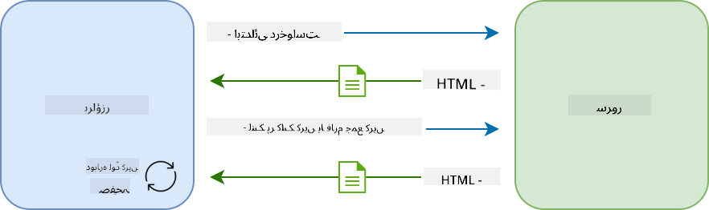
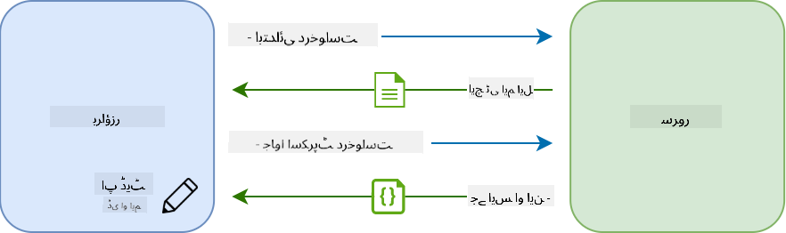
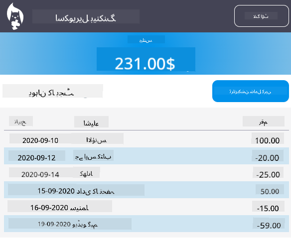

<!--
CO_OP_TRANSLATOR_METADATA:
{
  "original_hash": "f587e913e3f7c0b1c549a05dd74ee8e5",
  "translation_date": "2025-08-26T00:19:28+00:00",
  "source_file": "7-bank-project/3-data/README.md",
  "language_code": "ur"
}
-->
# بینکنگ ایپ بنائیں حصہ 3: ڈیٹا حاصل کرنے اور استعمال کرنے کے طریقے

## لیکچر سے پہلے کا کوئز

[لیکچر سے پہلے کا کوئز](https://ff-quizzes.netlify.app/web/quiz/45)

### تعارف

ہر ویب ایپلیکیشن کے مرکز میں *ڈیٹا* ہوتا ہے۔ ڈیٹا مختلف شکلیں اختیار کر سکتا ہے، لیکن اس کا بنیادی مقصد ہمیشہ صارف کو معلومات فراہم کرنا ہوتا ہے۔ جیسے جیسے ویب ایپس زیادہ انٹرایکٹو اور پیچیدہ ہوتی جا رہی ہیں، صارف کے معلومات تک رسائی اور ان کے ساتھ تعامل کا طریقہ ویب ڈویلپمنٹ کا ایک اہم حصہ بن گیا ہے۔

اس سبق میں، ہم دیکھیں گے کہ کس طرح سرور سے ڈیٹا کو غیر متزامن طور پر حاصل کیا جائے، اور اس ڈیٹا کو HTML کو دوبارہ لوڈ کیے بغیر ویب صفحے پر معلومات ظاہر کرنے کے لیے استعمال کیا جائے۔

### پیشگی ضروریات

آپ کو اس سبق کے لیے ویب ایپ کا [لاگ ان اور رجسٹریشن فارم](../2-forms/README.md) حصہ بنانا ہوگا۔ آپ کو [Node.js](https://nodejs.org) انسٹال کرنا ہوگا اور [سرور API](../api/README.md) کو مقامی طور پر چلانا ہوگا تاکہ آپ کو اکاؤنٹ ڈیٹا مل سکے۔

آپ یہ کمانڈ ٹرمینل میں چلا کر چیک کر سکتے ہیں کہ سرور صحیح طریقے سے چل رہا ہے:

```sh
curl http://localhost:5000/api
# -> should return "Bank API v1.0.0" as a result
```

---

## AJAX اور ڈیٹا حاصل کرنا

روایتی ویب سائٹس صارف کے لنک منتخب کرنے یا فارم کے ذریعے ڈیٹا جمع کرانے پر ظاہر کردہ مواد کو اپ ڈیٹ کرتی ہیں، مکمل HTML صفحہ دوبارہ لوڈ کر کے۔ جب بھی نیا ڈیٹا لوڈ کرنے کی ضرورت ہوتی ہے، ویب سرور ایک نیا HTML صفحہ واپس کرتا ہے جسے براؤزر کے ذریعے پروسیس کرنا پڑتا ہے، موجودہ صارف کی کارروائی میں خلل ڈال کر اور ری لوڈ کے دوران تعامل کو محدود کر دیتا ہے۔ اس ورک فلو کو *ملٹی پیج ایپلیکیشن* یا *MPA* بھی کہا جاتا ہے۔



جب ویب ایپلیکیشنز زیادہ پیچیدہ اور انٹرایکٹو ہونے لگیں، تو ایک نئی تکنیک [AJAX (Asynchronous JavaScript and XML)](https://en.wikipedia.org/wiki/Ajax_(programming)) سامنے آئی۔ یہ تکنیک ویب ایپس کو جاوا اسکرپٹ کا استعمال کرتے ہوئے سرور سے غیر متزامن طور پر ڈیٹا بھیجنے اور حاصل کرنے کی اجازت دیتی ہے، HTML صفحہ دوبارہ لوڈ کیے بغیر، جس کے نتیجے میں تیز اپ ڈیٹس اور ہموار صارف تعاملات ہوتے ہیں۔ جب سرور سے نیا ڈیٹا موصول ہوتا ہے، تو موجودہ HTML صفحہ کو جاوا اسکرپٹ کے ذریعے [DOM](https://developer.mozilla.org/docs/Web/API/Document_Object_Model) API کا استعمال کرتے ہوئے بھی اپ ڈیٹ کیا جا سکتا ہے۔ وقت کے ساتھ، یہ طریقہ اب [*سنگل پیج ایپلیکیشن* یا *SPA*](https://en.wikipedia.org/wiki/Single-page_application) کے طور پر جانا جاتا ہے۔



جب AJAX پہلی بار متعارف کرایا گیا تھا، تو غیر متزامن طور پر ڈیٹا حاصل کرنے کے لیے دستیاب واحد API [`XMLHttpRequest`](https://developer.mozilla.org/docs/Web/API/XMLHttpRequest/Using_XMLHttpRequest) تھا۔ لیکن جدید براؤزرز اب زیادہ آسان اور طاقتور [`Fetch` API](https://developer.mozilla.org/docs/Web/API/Fetch_API) کو نافذ کرتے ہیں، جو وعدے استعمال کرتا ہے اور JSON ڈیٹا کو جوڑنے کے لیے زیادہ موزوں ہے۔

> حالانکہ تمام جدید براؤزرز `Fetch API` کو سپورٹ کرتے ہیں، اگر آپ چاہتے ہیں کہ آپ کی ویب ایپلیکیشن پرانے یا پرانی براؤزرز پر کام کرے تو ہمیشہ [caniuse.com پر مطابقت کی جدول](https://caniuse.com/fetch) کو پہلے چیک کرنا اچھا خیال ہے۔

### کام

[پچھلے سبق](../2-forms/README.md) میں ہم نے اکاؤنٹ بنانے کے لیے رجسٹریشن فارم نافذ کیا۔ اب ہم موجودہ اکاؤنٹ کا استعمال کرتے ہوئے لاگ ان کرنے اور اس کا ڈیٹا حاصل کرنے کے لیے کوڈ شامل کریں گے۔ `app.js` فائل کھولیں اور ایک نیا `login` فنکشن شامل کریں:

```js
async function login() {
  const loginForm = document.getElementById('loginForm')
  const user = loginForm.user.value;
}
```

یہاں ہم `getElementById()` کے ساتھ فارم عنصر حاصل کرنے سے شروع کرتے ہیں، اور پھر ہم `loginForm.user.value` کے ساتھ ان پٹ سے صارف نام حاصل کرتے ہیں۔ ہر فارم کنٹرول کو اس کے نام (HTML میں `name` ایٹریبیوٹ کا استعمال کرتے ہوئے سیٹ کیا گیا) کے ذریعے فارم کی پراپرٹی کے طور پر حاصل کیا جا سکتا ہے۔

اسی طرح جیسے ہم نے رجسٹریشن کے لیے کیا تھا، ہم سرور درخواست انجام دینے کے لیے ایک اور فنکشن بنائیں گے، لیکن اس بار اکاؤنٹ ڈیٹا حاصل کرنے کے لیے:

```js
async function getAccount(user) {
  try {
    const response = await fetch('//localhost:5000/api/accounts/' + encodeURIComponent(user));
    return await response.json();
  } catch (error) {
    return { error: error.message || 'Unknown error' };
  }
}
```

ہم `fetch` API کا استعمال کرتے ہوئے سرور سے ڈیٹا کو غیر متزامن طور پر حاصل کرنے کی درخواست کرتے ہیں، لیکن اس بار ہمیں صرف URL کے علاوہ کوئی اضافی پیرامیٹرز کی ضرورت نہیں ہے، کیونکہ ہم صرف ڈیٹا کو کوئری کر رہے ہیں۔ ڈیفالٹ کے طور پر، `fetch` ایک [`GET`](https://developer.mozilla.org/docs/Web/HTTP/Methods/GET) HTTP درخواست بناتا ہے، جو ہم یہاں چاہتے ہیں۔

✅ `encodeURIComponent()` ایک فنکشن ہے جو URL کے لیے خاص کرداروں کو فرار کرتا ہے۔ اگر ہم اس فنکشن کو کال نہ کریں اور براہ راست `user` ویلیو کو URL میں استعمال کریں تو ہمیں ممکنہ طور پر کیا مسائل ہو سکتے ہیں؟

اب ہم اپنے `login` فنکشن کو `getAccount` استعمال کرنے کے لیے اپ ڈیٹ کرتے ہیں:

```js
async function login() {
  const loginForm = document.getElementById('loginForm')
  const user = loginForm.user.value;
  const data = await getAccount(user);

  if (data.error) {
    return console.log('loginError', data.error);
  }

  account = data;
  navigate('/dashboard');
}
```

سب سے پہلے، چونکہ `getAccount` ایک غیر متزامن فنکشن ہے، ہمیں سرور کے نتیجے کا انتظار کرنے کے لیے اسے `await` کلیدی لفظ کے ساتھ ملانا ہوگا۔ کسی بھی سرور درخواست کے ساتھ، ہمیں غلطی کے معاملات سے بھی نمٹنا ہوگا۔ فی الحال ہم صرف ایک لاگ پیغام شامل کریں گے تاکہ غلطی ظاہر ہو، اور بعد میں اس پر واپس آئیں گے۔

پھر ہمیں ڈیٹا کو کہیں محفوظ کرنا ہوگا تاکہ ہم بعد میں اسے ڈیش بورڈ کی معلومات ظاہر کرنے کے لیے استعمال کر سکیں۔ چونکہ `account` ویریبل ابھی موجود نہیں ہے، ہم اپنی فائل کے اوپر ایک گلوبل ویریبل بنائیں گے:

```js
let account = null;
```

جب صارف کا ڈیٹا ایک ویریبل میں محفوظ ہو جاتا ہے، تو ہم *لاگ ان* صفحے سے *ڈیش بورڈ* پر موجودہ `navigate()` فنکشن کا استعمال کرتے ہوئے جا سکتے ہیں۔

آخر میں، ہمیں لاگ ان فارم جمع کرانے پر اپنے `login` فنکشن کو کال کرنے کی ضرورت ہے، HTML میں ترمیم کر کے:

```html
<form id="loginForm" action="javascript:login()">
```

نیا اکاؤنٹ رجسٹر کر کے اور اسی اکاؤنٹ کا استعمال کرتے ہوئے لاگ ان کرنے کی کوشش کر کے چیک کریں کہ سب کچھ صحیح طریقے سے کام کر رہا ہے۔

اگلے حصے پر جانے سے پہلے، ہم اپنے `register` فنکشن کو مکمل کر سکتے ہیں، فنکشن کے آخر میں یہ شامل کر کے:

```js
account = result;
navigate('/dashboard');
```

✅ کیا آپ جانتے ہیں کہ ڈیفالٹ کے طور پر، آپ صرف *اسی ڈومین اور پورٹ* سے سرور APIs کو کال کر سکتے ہیں جس ویب صفحے کو آپ دیکھ رہے ہیں؟ یہ براؤزرز کے ذریعے نافذ کردہ سیکیورٹی میکانزم ہے۔ لیکن ٹھہریں، ہماری ویب ایپ `localhost:3000` پر چل رہی ہے جبکہ سرور API `localhost:5000` پر چل رہا ہے، یہ کیوں کام کرتا ہے؟ [Cross-Origin Resource Sharing (CORS)](https://developer.mozilla.org/docs/Web/HTTP/CORS) نامی تکنیک کا استعمال کرتے ہوئے، اگر سرور جواب میں مخصوص ڈومینز کے لیے استثنیٰ کی اجازت دینے والے خاص ہیڈرز شامل کرے، تو کراس-اورجن HTTP درخواستیں انجام دینا ممکن ہے۔

> APIs کے بارے میں مزید جاننے کے لیے یہ [سبق](https://docs.microsoft.com/learn/modules/use-apis-discover-museum-art/?WT.mc_id=academic-77807-sagibbon) لیں۔

## HTML کو ڈیٹا ظاہر کرنے کے لیے اپ ڈیٹ کریں

اب جب کہ ہمارے پاس صارف کا ڈیٹا موجود ہے، ہمیں موجودہ HTML کو اپ ڈیٹ کرنا ہوگا تاکہ اسے ظاہر کیا جا سکے۔ ہم پہلے ہی جانتے ہیں کہ DOM سے عنصر کو کیسے حاصل کیا جائے، مثال کے طور پر `document.getElementById()` کا استعمال کرتے ہوئے۔ جب آپ کے پاس ایک بنیادی عنصر ہو، تو یہاں کچھ APIs ہیں جنہیں آپ اسے تبدیل کرنے یا اس میں بچے عناصر شامل کرنے کے لیے استعمال کر سکتے ہیں:

- [`textContent`](https://developer.mozilla.org/docs/Web/API/Node/textContent) پراپرٹی کا استعمال کرتے ہوئے آپ کسی عنصر کے متن کو تبدیل کر سکتے ہیں۔ نوٹ کریں کہ اس ویلیو کو تبدیل کرنے سے عنصر کے تمام بچے (اگر کوئی موجود ہو) ہٹا دیے جاتے ہیں اور اسے فراہم کردہ متن سے بدل دیا جاتا ہے۔ اس طرح، یہ کسی دیے گئے عنصر کے تمام بچوں کو ہٹانے کا ایک مؤثر طریقہ بھی ہے، خالی سٹرنگ `''` تفویض کر کے۔

- [`document.createElement()`](https://developer.mozilla.org/docs/Web/API/Document/createElement) کے ساتھ [`append()`](https://developer.mozilla.org/docs/Web/API/ParentNode/append) طریقہ استعمال کرتے ہوئے آپ ایک یا زیادہ نئے بچے عناصر بنا اور منسلک کر سکتے ہیں۔

✅ کسی عنصر کے [`innerHTML`](https://developer.mozilla.org/docs/Web/API/Element/innerHTML) پراپرٹی کا استعمال کرتے ہوئے اس کے HTML مواد کو تبدیل کرنا بھی ممکن ہے، لیکن اس سے گریز کیا جانا چاہیے کیونکہ یہ [کراس سائٹ اسکرپٹنگ (XSS)](https://developer.mozilla.org/docs/Glossary/Cross-site_scripting) حملوں کے لیے حساس ہے۔

### کام

ڈیش بورڈ اسکرین پر جانے سے پہلے، ہمیں *لاگ ان* صفحے پر ایک اور کام کرنا چاہیے۔ فی الحال، اگر آپ کسی ایسے صارف نام کے ساتھ لاگ ان کرنے کی کوشش کرتے ہیں جو موجود نہیں ہے، تو کنسول میں ایک پیغام دکھایا جاتا ہے لیکن ایک عام صارف کے لیے کچھ بھی تبدیل نہیں ہوتا اور آپ کو معلوم نہیں ہوتا کہ کیا ہو رہا ہے۔

آئیے لاگ ان `<button>` سے پہلے لاگ ان فارم میں ایک پلیس ہولڈر عنصر شامل کریں جہاں ضرورت پڑنے پر ہم ایک غلطی کا پیغام ظاہر کر سکیں:

```html
...
<div id="loginError"></div>
<button>Login</button>
...
```

یہ `<div>` عنصر خالی ہے، مطلب یہ کہ جب تک ہم اس میں کچھ مواد شامل نہ کریں، اسکرین پر کچھ ظاہر نہیں ہوگا۔ ہم اسے `id` بھی دیتے ہیں تاکہ ہم اسے جاوا اسکرپٹ کے ساتھ آسانی سے حاصل کر سکیں۔

`app.js` فائل پر واپس جائیں اور ایک نیا ہیلپر فنکشن `updateElement` بنائیں:

```js
function updateElement(id, text) {
  const element = document.getElementById(id);
  element.textContent = text;
}
```

یہ فنکشن کافی سیدھا ہے: دیے گئے عنصر *id* اور *text* کے ساتھ، یہ DOM عنصر کے متن کو اپ ڈیٹ کرے گا جس کا `id` مماثل ہوگا۔ آئیے اس طریقہ کو `login` فنکشن میں پچھلے غلطی کے پیغام کی جگہ استعمال کریں:

```js
if (data.error) {
  return updateElement('loginError', data.error);
}
```

اب اگر آپ کسی غلط اکاؤنٹ کے ساتھ لاگ ان کرنے کی کوشش کرتے ہیں، تو آپ کو کچھ ایسا نظر آنا چاہیے:


اب ہمارے پاس ایک غلطی کا متن ہے جو بصری طور پر ظاہر ہوتا ہے، لیکن اگر آپ اسے اسکرین ریڈر کے ساتھ آزمائیں تو آپ دیکھیں گے کہ کچھ بھی اعلان نہیں کیا جاتا۔ صفحے پر متحرک طور پر شامل کیے گئے متن کو اسکرین ریڈرز کے ذریعے اعلان کرنے کے لیے، اسے [Live Region](https://developer.mozilla.org/docs/Web/Accessibility/ARIA/ARIA_Live_Regions) کا استعمال کرنا ہوگا۔ یہاں ہم ایک مخصوص قسم کے لائیو ریجن کا استعمال کریں گے جسے الرٹ کہا جاتا ہے:

```html
<div id="loginError" role="alert"></div>
```

رجسٹر فنکشن کی غلطیوں کے لیے بھی یہی رویہ نافذ کریں (HTML کو اپ ڈیٹ کرنا نہ بھولیں)۔

## ڈیش بورڈ پر معلومات ظاہر کریں

ہم نے ابھی جو تکنیکیں دیکھی ہیں ان کا استعمال کرتے ہوئے، ہم ڈیش بورڈ صفحے پر اکاؤنٹ کی معلومات ظاہر کرنے کا بھی خیال رکھیں گے۔

یہ وہ ہے جو سرور سے موصول ہونے والا اکاؤنٹ آبجیکٹ دکھائی دیتا ہے:

```json
{
  "user": "test",
  "currency": "$",
  "description": "Test account",
  "balance": 75,
  "transactions": [
    { "id": "1", "date": "2020-10-01", "object": "Pocket money", "amount": 50 },
    { "id": "2", "date": "2020-10-03", "object": "Book", "amount": -10 },
    { "id": "3", "date": "2020-10-04", "object": "Sandwich", "amount": -5 }
  ],
}
```

> نوٹ: آپ کی زندگی کو آسان بنانے کے لیے، آپ پہلے سے موجود `test` اکاؤنٹ استعمال کر سکتے ہیں جو پہلے ہی ڈیٹا سے بھرا ہوا ہے۔

### کام

آئیے HTML میں "Balance" سیکشن کو پلیس ہولڈر عناصر شامل کرنے کے لیے تبدیل کریں:

```html
<section>
  Balance: <span id="balance"></span><span id="currency"></span>
</section>
```

ہم اکاؤنٹ کی تفصیل ظاہر کرنے کے لیے اس کے نیچے ایک نیا سیکشن بھی شامل کریں گے:

```html
<h2 id="description"></h2>
```

✅ چونکہ اکاؤنٹ کی تفصیل اس کے نیچے موجود مواد کے لیے عنوان کے طور پر کام کرتی ہے، اسے سیمینٹک طور پر ایک ہیڈنگ کے طور پر نشان زد کیا گیا ہے۔ جانیں کہ کس طرح [ہیڈنگ اسٹرکچر](https://www.nomensa.com/blog/2017/how-structure-headings-web-accessibility) رسائی کے لیے اہم ہے، اور صفحے پر تنقیدی نظر ڈالیں تاکہ یہ معلوم کیا جا سکے کہ اور کیا ہیڈنگ ہو سکتی ہے۔

اگلا، ہم `app.js` میں ایک نیا فنکشن بنائیں گے تاکہ پلیس ہولڈر کو بھر سکیں:

```js
function updateDashboard() {
  if (!account) {
    return navigate('/login');
  }

  updateElement('description', account.description);
  updateElement('balance', account.balance.toFixed(2));
  updateElement('currency', account.currency);
}
```

سب سے پہلے، ہم چیک کرتے ہیں کہ ہمارے پاس مطلوبہ اکاؤنٹ ڈیٹا موجود ہے یا نہیں، اس سے آگے بڑھنے سے پہلے۔ پھر ہم نے HTML کو اپ ڈیٹ کرنے کے لیے پہلے سے بنائے گئے `updateElement()` فنکشن کا استعمال کیا۔

> بیلنس ڈسپلے کو خوبصورت بنانے کے لیے، ہم [`toFixed(2)`](https://developer.mozilla.org/docs/Web/JavaScript/Reference/Global_Objects/Number/toFixed) طریقہ استعمال کرتے ہیں تاکہ ویلیو کو اعشاریہ کے بعد 2 ہندسوں کے ساتھ ظاہر کرنے پر مجبور کیا جا سکے۔

اب ہمیں ہر بار جب ڈیش بورڈ لوڈ ہوتا ہے تو اپنے `updateDashboard()` فنکشن کو کال کرنے کی ضرورت ہے۔ اگر آپ نے پہلے سبق 1 کا اسائنمنٹ مکمل کر لیا ہے تو یہ سیدھا ہونا چاہیے، ورنہ آپ درج ذیل نفاذ استعمال کر سکتے ہیں۔

یہ کوڈ `updateRoute()` فنکشن کے آخر میں شامل کریں:

```js
if (typeof route.init === 'function') {
  route.init();
}
```

اور روٹس کی تعریف کو اپ ڈیٹ کریں:

```js
const routes = {
  '/login': { templateId: 'login' },
  '/dashboard': { templateId: 'dashboard', init: updateDashboard }
};
```

اس تبدیلی کے ساتھ، ہر بار جب ڈیش بورڈ صفحہ ظاہر ہوتا ہے، `updateDashboard()` فنکشن کال کیا جاتا ہے۔ لاگ ان کے بعد، آپ کو اکاؤنٹ بیلنس، کرنسی اور تفصیل دیکھنے کے قابل ہونا چاہیے۔

## HTML ٹیمپلیٹس کے ساتھ ٹیبل کی قطاریں متحرک طور پر بنائیں

پہلے سبق میں ہم نے اپنی ایپ میں نیویگیشن کو نافذ کرنے کے لیے HTML ٹیمپلیٹس کے ساتھ [`appendChild()`](https://developer.mozilla.org/docs/Web/API/Node/appendChild) طریقہ استعمال کیا۔ ٹیمپلیٹس چھوٹے بھی ہو سکتے ہیں اور صفحے کے بار بار آنے والے حصے کو متحرک طور پر بھرنے کے لیے استعمال کیے جا سکتے ہیں۔

ہم HTML ٹیبل میں لین دین کی فہرست ظاہر کرنے کے لیے اسی طریقہ کار کا استعمال کریں گے۔

### کام

HTML `<body>` میں ایک نیا ٹیمپلیٹ شامل کریں:

```html
<template id="transaction">
  <tr>
    <td></td>
    <td></td>
    <td></td>
  </tr>
</template>
```

یہ ٹیمپلیٹ ایک واحد ٹیبل قطار کی نمائندگی کرتا ہے، جس میں وہ 3 کالم ہیں جنہیں ہم بھرنا چاہتے ہیں: لین دین کی *تاریخ*، *آبجیکٹ* اور *رقم*۔

پھر، ٹیبل کے `<tbody>` عنصر میں یہ `id` پراپرٹی شامل کریں تاکہ جاوا اسکرپٹ کا استعمال کرتے ہوئے اسے تلاش کرنا آسان ہو:

```html
<tbody id="transactions"></tbody>
```

ہمارا HTML تیار ہے، آئیے جاوا اسکرپٹ کوڈ پر سوئچ کریں اور ایک نیا فنکشن `createTransactionRow` بنائیں:

```js
function createTransactionRow(transaction) {
  const template = document.getElementById('transaction');
  const transactionRow = template.content.cloneNode(true);
  const tr = transactionRow.querySelector('tr');
  tr.children[0].textContent = transaction.date;
  tr.children[1].textContent = transaction.object;
  tr.children[2].textContent = transaction.amount.toFixed(2);
  return transactionRow;
}
```

یہ فنکشن بالکل وہی کرتا ہے جو اس کا نام ظاہر کرتا ہے: ہم نے پہلے بنائے گئے ٹیمپلیٹ کا استعمال کرتے ہوئے، یہ ایک نئی ٹیبل قطار بناتا ہے اور لین دین کے ڈیٹا کا استعمال کرتے ہوئے اس کے مواد کو بھرتا ہے۔ ہم اپنے `updateDashboard()` فنکشن میں ٹیبل کو بھرنے کے لیے اس کا استعمال کریں گے:

```js
const transactionsRows = document.createDocumentFragment();
for (const transaction of account.transactions) {
  const transactionRow = createTransactionRow(transaction);
  transactionsRows.appendChild(transactionRow);
}
updateElement('transactions', transactionsRows);
```

یہاں ہم [`document.createDocumentFragment()`](https://developer.mozilla.org/docs/Web/API/Document/createDocumentFragment) طریقہ استعمال کرتے ہیں جو ایک نیا DOM فریگمنٹ بناتا ہے جس پر ہم کام کر سکتے ہیں، آخر میں اسے اپنی HTML ٹیبل سے منسلک کرنے سے پہلے۔

اس کوڈ کے کام کرنے سے پہلے، ہمیں ایک اور چیز کرنی ہوگی، کیونکہ ہمارا `updateElement()` فنکشن فی الحال صرف ٹیکسٹ مواد کو سپورٹ کرتا ہے۔ آئیے اس کے کوڈ کو تھوڑا سا تبدیل کریں:

```js
function updateElement(id, textOrNode) {
  const element = document.getElementById(id);
  element.textContent = ''; // Removes all children
  element.append(textOrNode);
}
```

ہم [`append()`](https://developer.mozilla.org/docs/Web/API/ParentNode/append) طریقہ استعمال کرتے ہیں کیونکہ یہ کسی پیرنٹ عنصر سے ٹیکسٹ یا [DOM Nodes](https://developer.mozilla.org/docs/Web/API/Node) کو منسلک کرنے کی اجازت دیتا ہے، جو ہمارے تمام استعمال کے معاملات کے لیے بہترین ہے۔
اگر آپ `test` اکاؤنٹ کا استعمال کرکے لاگ ان کرنے کی کوشش کریں، تو اب آپ کو ڈیش بورڈ پر ٹرانزیکشن لسٹ نظر آنی چاہیے 🎉۔

---

## 🚀 چیلنج

مل کر کام کریں تاکہ ڈیش بورڈ صفحہ ایک حقیقی بینکنگ ایپ کی طرح نظر آئے۔ اگر آپ نے پہلے ہی اپنی ایپ کو اسٹائل کیا ہے، تو [میڈیا کوئریز](https://developer.mozilla.org/docs/Web/CSS/Media_Queries) استعمال کرنے کی کوشش کریں تاکہ ایک [ریسپانسیو ڈیزائن](https://developer.mozilla.org/docs/Web/Progressive_web_apps/Responsive/responsive_design_building_blocks) بنایا جا سکے جو ڈیسک ٹاپ اور موبائل دونوں ڈیوائسز پر اچھے سے کام کرے۔

یہاں ایک اسٹائل شدہ ڈیش بورڈ صفحے کی مثال دی گئی ہے:



## لیکچر کے بعد کا کوئز

[لیکچر کے بعد کا کوئز](https://ff-quizzes.netlify.app/web/quiz/46)

## اسائنمنٹ

[اپنے کوڈ کو ریفیکٹر کریں اور اس پر تبصرے کریں](assignment.md)

**ڈسکلیمر**:  
یہ دستاویز AI ترجمہ سروس [Co-op Translator](https://github.com/Azure/co-op-translator) کا استعمال کرتے ہوئے ترجمہ کی گئی ہے۔ ہم درستگی کے لیے کوشش کرتے ہیں، لیکن براہ کرم آگاہ رہیں کہ خودکار ترجمے میں غلطیاں یا غیر درستیاں ہو سکتی ہیں۔ اصل دستاویز کو اس کی اصل زبان میں مستند ذریعہ سمجھا جانا چاہیے۔ اہم معلومات کے لیے، پیشہ ور انسانی ترجمہ کی سفارش کی جاتی ہے۔ ہم اس ترجمے کے استعمال سے پیدا ہونے والی کسی بھی غلط فہمی یا غلط تشریح کے ذمہ دار نہیں ہیں۔