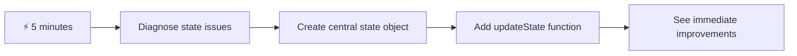
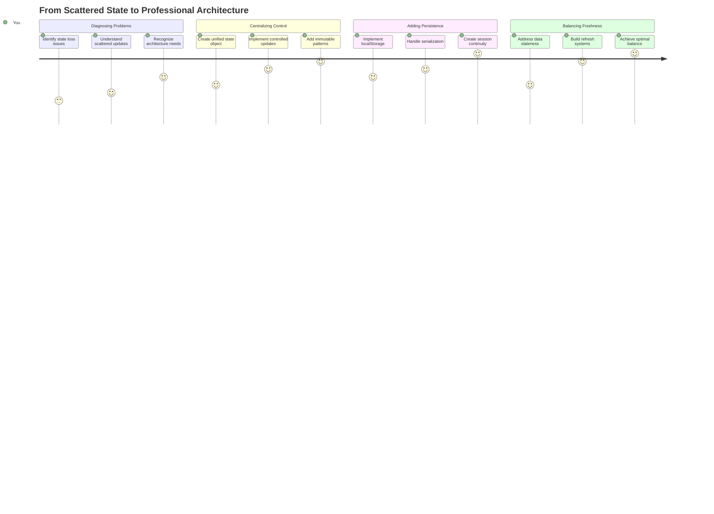
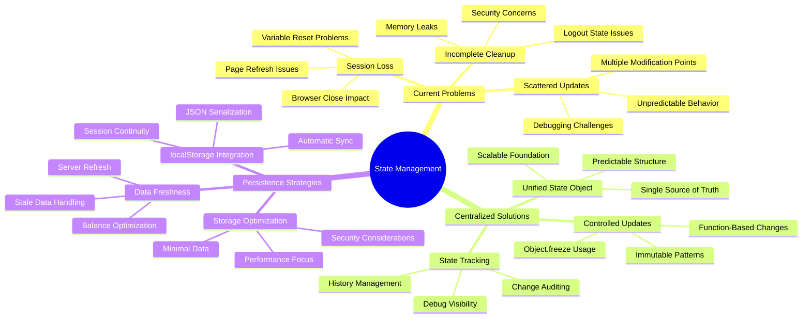
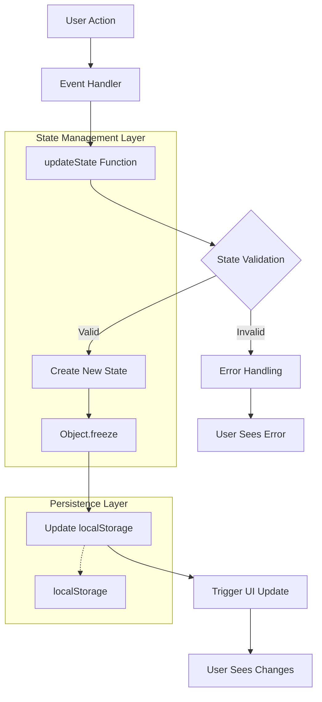
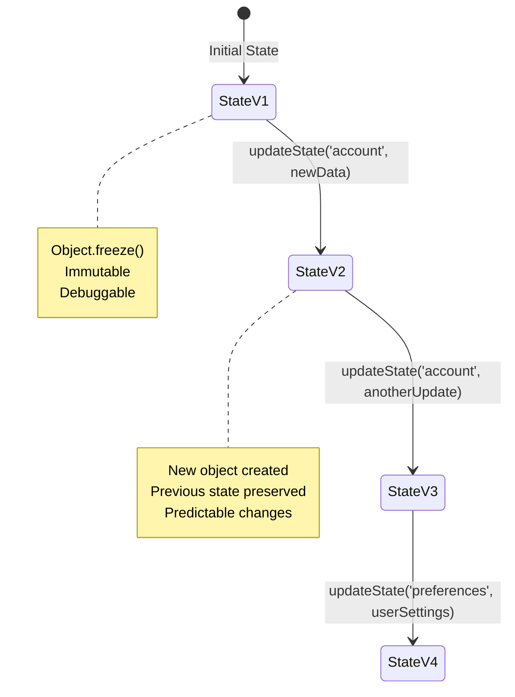
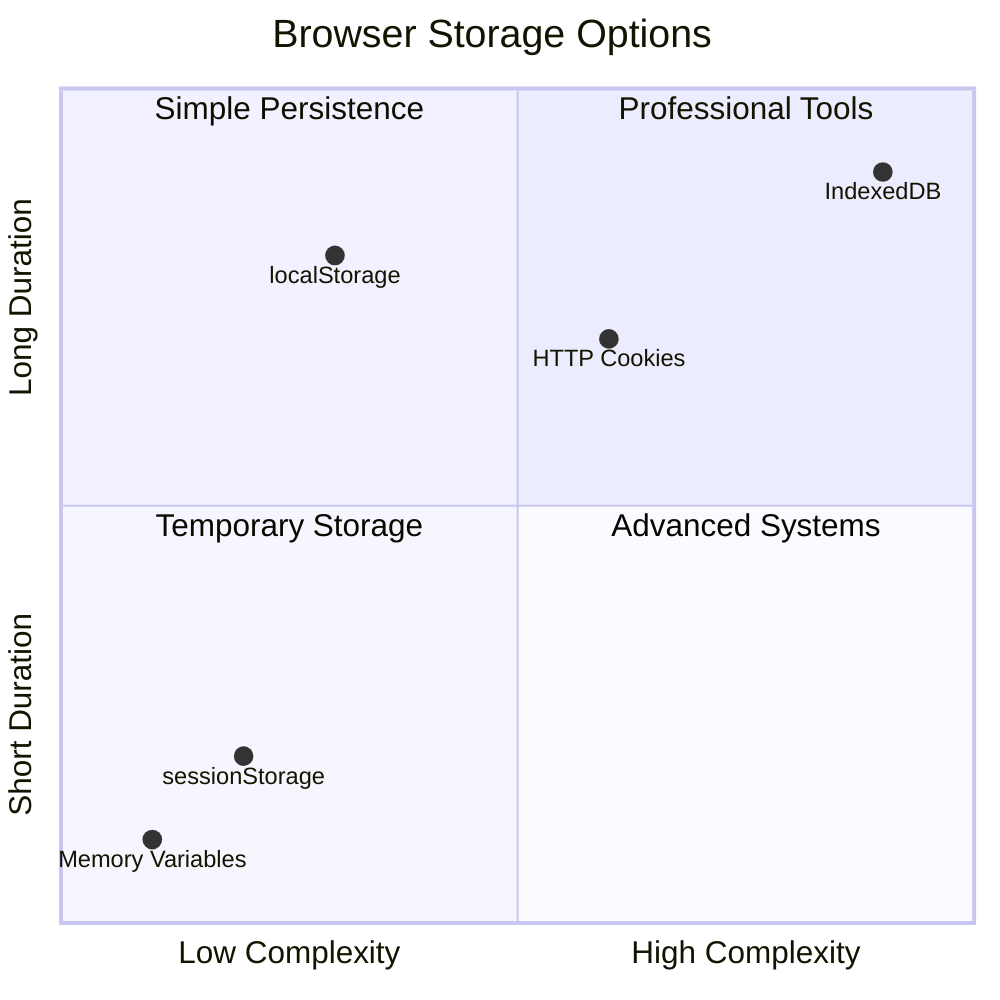
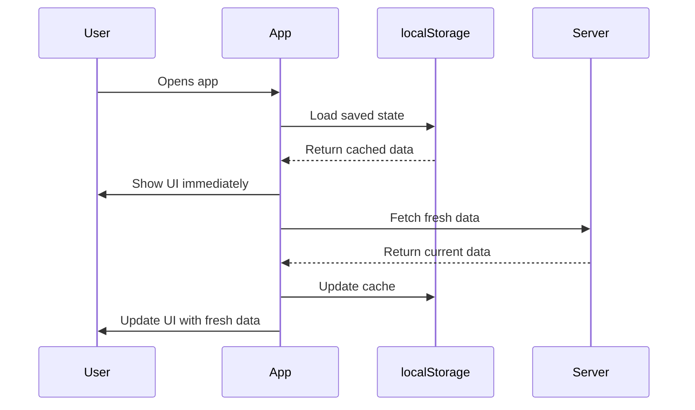
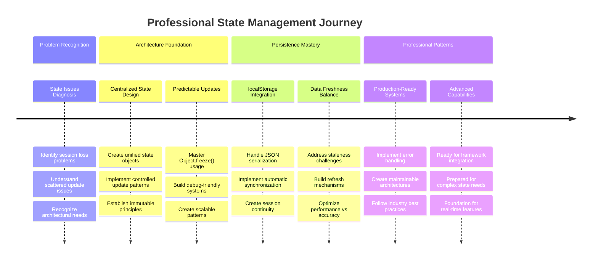

<!--
CO_OP_TRANSLATOR_METADATA:
{
  "original_hash": "b807b09df716dc48a2b750835bf8e933",
  "translation_date": "2025-11-03T13:18:39+00:00",
  "source_file": "7-bank-project/4-state-management/README.md",
  "language_code": "ur"
}
-->
# بینکنگ ایپ بنائیں حصہ 4: اسٹیٹ مینجمنٹ کے تصورات

## ⚡ اگلے 5 منٹ میں آپ کیا کر سکتے ہیں؟

**مصروف ڈویلپرز کے لیے فوری آغاز کا راستہ**



- **پہلا منٹ**: موجودہ اسٹیٹ کے مسئلے کو ٹیسٹ کریں - لاگ ان کریں، صفحہ ریفریش کریں، لاگ آؤٹ کا مشاہدہ کریں۔
- **دوسرا منٹ**: `let account = null` کو `let state = { account: null }` سے تبدیل کریں۔
- **تیسرا منٹ**: کنٹرولڈ اپڈیٹس کے لیے ایک سادہ `updateState()` فنکشن بنائیں۔
- **چوتھا منٹ**: ایک فنکشن کو نئے پیٹرن کے مطابق اپڈیٹ کریں۔
- **پانچواں منٹ**: بہتر پیش بینی اور ڈیبگنگ کی صلاحیت کا ٹیسٹ کریں۔

**فوری تشخیصی ٹیسٹ**:
```javascript
// Before: Scattered state
let account = null; // Lost on refresh!

// After: Centralized state
let state = Object.freeze({ account: null }); // Controlled and trackable!
```

**یہ کیوں اہم ہے**: 5 منٹ میں، آپ بے ترتیب اسٹیٹ مینجمنٹ سے پیش بینی اور ڈیبگنگ کے قابل پیٹرنز میں تبدیلی کا تجربہ کریں گے۔ یہ وہ بنیاد ہے جو پیچیدہ ایپلیکیشنز کو قابلِ انتظام بناتی ہے۔

## 🗺️ اسٹیٹ مینجمنٹ کی مہارت کے ذریعے آپ کا تعلیمی سفر



**آپ کا سفر کا مقصد**: اس سبق کے اختتام تک، آپ ایک پروفیشنل گریڈ اسٹیٹ مینجمنٹ سسٹم بنا چکے ہوں گے جو پائیداری، ڈیٹا کی تازگی، اور پیش بینی اپڈیٹس کو سنبھالتا ہے - وہی پیٹرنز جو پروڈکشن ایپلیکیشنز میں استعمال ہوتے ہیں۔

## پری لیکچر کوئز

[پری لیکچر کوئز](https://ff-quizzes.netlify.app/web/quiz/47)

## تعارف

اسٹیٹ مینجمنٹ Voyager خلائی جہاز کے نیویگیشن سسٹم کی طرح ہے – جب سب کچھ ہموار طریقے سے کام کر رہا ہو، تو آپ کو اس کی موجودگی کا احساس بھی نہیں ہوتا۔ لیکن جب کچھ غلط ہو جائے، تو یہ انٹر اسٹیلر اسپیس تک پہنچنے اور کائناتی خلا میں کھو جانے کے درمیان فرق بن جاتا ہے۔ ویب ڈیولپمنٹ میں، اسٹیٹ وہ سب کچھ ظاہر کرتا ہے جو آپ کی ایپلیکیشن کو یاد رکھنے کی ضرورت ہے: صارف کے لاگ ان کی حیثیت، فارم ڈیٹا، نیویگیشن کی تاریخ، اور عارضی انٹرفیس اسٹیٹس۔

جب آپ کی بینکنگ ایپ ایک سادہ لاگ ان فارم سے زیادہ پیچیدہ ایپلیکیشن میں تبدیل ہوئی ہے، تو آپ نے ممکنہ طور پر کچھ عام چیلنجز کا سامنا کیا ہوگا۔ صفحہ ریفریش کریں اور صارفین غیر متوقع طور پر لاگ آؤٹ ہو جاتے ہیں۔ براؤزر بند کریں اور تمام پیش رفت ختم ہو جاتی ہے۔ مسئلے کو ڈیبگ کریں اور آپ متعدد فنکشنز کے ذریعے شکار کر رہے ہیں جو سب ایک ہی ڈیٹا کو مختلف طریقوں سے تبدیل کرتے ہیں۔

یہ خراب کوڈنگ کی علامات نہیں ہیں – یہ قدرتی بڑھتے ہوئے مسائل ہیں جو اس وقت پیدا ہوتے ہیں جب ایپلیکیشنز ایک خاص پیچیدگی کی حد تک پہنچ جاتی ہیں۔ ہر ڈویلپر ان چیلنجز کا سامنا کرتا ہے جب ان کی ایپس "پروف آف کانسیپٹ" سے "پروڈکشن ریڈی" میں تبدیل ہوتی ہیں۔

اس سبق میں، ہم ایک مرکزی اسٹیٹ مینجمنٹ سسٹم نافذ کریں گے جو آپ کی بینکنگ ایپ کو ایک قابل اعتماد، پیشہ ورانہ ایپلیکیشن میں تبدیل کرے گا۔ آپ ڈیٹا کے بہاؤ کو پیش بینی کے ساتھ منظم کرنا، صارف سیشنز کو مناسب طریقے سے برقرار رکھنا، اور جدید ویب ایپلیکیشنز کے لیے مطلوبہ ہموار صارف تجربہ تخلیق کرنا سیکھیں گے۔

## ضروریات

اسٹیٹ مینجمنٹ کے تصورات میں غوطہ لگانے سے پہلے، آپ کو اپنا ڈیولپمنٹ ماحول مناسب طریقے سے سیٹ اپ کرنا ہوگا اور اپنی بینکنگ ایپ کی بنیاد تیار کرنی ہوگی۔ یہ سبق اس سیریز کے پچھلے حصوں کے تصورات اور کوڈ پر براہ راست تعمیر کرتا ہے۔

پیش رفت سے پہلے درج ذیل اجزاء کو تیار رکھیں:

**ضروری سیٹ اپ:**
- [ڈیٹا فیچنگ سبق](../3-data/README.md) مکمل کریں - آپ کی ایپ کو کامیابی سے اکاؤنٹ ڈیٹا لوڈ اور ظاہر کرنا چاہیے۔
- اپنے سسٹم پر [Node.js](https://nodejs.org) انسٹال کریں تاکہ بیک اینڈ API چلایا جا سکے۔
- اکاؤنٹ ڈیٹا آپریشنز کو ہینڈل کرنے کے لیے [سرور API](../api/README.md) کو مقامی طور پر شروع کریں۔

**اپنے ماحول کی جانچ:**

اپنے API سرور کو درست طریقے سے چلانے کی تصدیق کریں، اس کمانڈ کو ٹرمینل میں چلائیں:

```sh
curl http://localhost:5000/api
# -> should return "Bank API v1.0.0" as a result
```

**یہ کمانڈ کیا کرتی ہے:**
- **بھیجتی ہے** ایک GET درخواست آپ کے مقامی API سرور کو
- **جانچتی ہے** کنکشن اور تصدیق کرتی ہے کہ سرور جواب دے رہا ہے
- **واپس کرتی ہے** API ورژن کی معلومات اگر سب کچھ درست کام کر رہا ہو

## 🧠 اسٹیٹ مینجمنٹ آرکیٹیکچر کا جائزہ



**بنیادی اصول**: پیشہ ورانہ اسٹیٹ مینجمنٹ پیش بینی، پائیداری، اور کارکردگی کو متوازن کرتی ہے تاکہ قابل اعتماد صارف تجربات تخلیق کیے جا سکیں جو سادہ تعاملات سے لے کر پیچیدہ ایپلیکیشن ورک فلو تک بڑھ سکیں۔

---

## موجودہ اسٹیٹ کے مسائل کی تشخیص

جیسے شرلاک ہومز جرم کے منظر کا معائنہ کرتا ہے، ہمیں اپنی موجودہ عمل درآمد میں بالکل سمجھنا ہوگا کہ کیا ہو رہا ہے تاکہ صارف سیشنز کے غائب ہونے کے مسئلے کو حل کیا جا سکے۔

آئیے ایک سادہ تجربہ کریں جو اسٹیٹ مینجمنٹ کے بنیادی چیلنجز کو ظاہر کرتا ہے:

**🧪 یہ تشخیصی ٹیسٹ کریں:**
1. اپنی بینکنگ ایپ میں لاگ ان کریں اور ڈیش بورڈ پر جائیں۔
2. براؤزر کا صفحہ ریفریش کریں۔
3. مشاہدہ کریں کہ آپ کے لاگ ان اسٹیٹس کے ساتھ کیا ہوتا ہے۔

اگر آپ کو دوبارہ لاگ ان اسکرین پر بھیج دیا جاتا ہے، تو آپ نے کلاسک اسٹیٹ پائیداری کے مسئلے کو دریافت کیا ہے۔ یہ رویہ اس لیے ہوتا ہے کیونکہ ہمارا موجودہ عمل درآمد صارف کا ڈیٹا جاوا اسکرپٹ ویریبلز میں اسٹور کرتا ہے جو ہر صفحہ لوڈ کے ساتھ ری سیٹ ہو جاتے ہیں۔

**موجودہ عمل درآمد کے مسائل:**

ہمارے [پچھلے سبق](../3-data/README.md) سے سادہ `account` ویریبل تین اہم مسائل پیدا کرتا ہے جو صارف کے تجربے اور کوڈ کی برقرار رکھنے کی صلاحیت دونوں کو متاثر کرتے ہیں:

| مسئلہ | تکنیکی وجہ | صارف پر اثر |
|---------|--------|----------------|
| **سیشن کا نقصان** | صفحہ ریفریش جاوا اسکرپٹ ویریبلز کو صاف کرتا ہے | صارفین کو بار بار دوبارہ تصدیق کرنی پڑتی ہے |
| **بکھری اپڈیٹس** | متعدد فنکشنز اسٹیٹ کو براہ راست تبدیل کرتے ہیں | ڈیبگنگ زیادہ مشکل ہو جاتی ہے |
| **نامکمل صفائی** | لاگ آؤٹ تمام اسٹیٹ حوالوں کو صاف نہیں کرتا | ممکنہ سیکیورٹی اور پرائیویسی خدشات |

**آرکیٹیکچرل چیلنج:**

جیسے ٹائٹینک کے کمپارٹمنٹلائزڈ ڈیزائن جو مضبوط لگتا تھا جب تک کہ متعدد کمپارٹمنٹس ایک ساتھ بھر گئے، ان مسائل کو انفرادی طور پر ٹھیک کرنا بنیادی آرکیٹیکچرل مسئلے کو حل نہیں کرے گا۔ ہمیں ایک جامع اسٹیٹ مینجمنٹ حل کی ضرورت ہے۔

> 💡 **ہم یہاں اصل میں کیا حاصل کرنے کی کوشش کر رہے ہیں؟**

[اسٹیٹ مینجمنٹ](https://en.wikipedia.org/wiki/State_management) واقعی دو بنیادی پہیلیوں کو حل کرنے کے بارے میں ہے:

1. **میرا ڈیٹا کہاں ہے؟**: یہ معلوم کرنا کہ ہمارے پاس کون سی معلومات ہیں اور وہ کہاں سے آ رہی ہیں۔
2. **کیا سب ایک ہی صفحے پر ہیں؟**: یہ یقینی بنانا کہ صارفین جو دیکھتے ہیں وہ اصل میں ہو رہا ہے۔

**ہمارا گیم پلان:**

اپنے دماغ کو الجھانے کے بجائے، ہم ایک **مرکزی اسٹیٹ مینجمنٹ** سسٹم بنائیں گے۔ اسے ایسے سمجھیں جیسے ایک بہت ہی منظم شخص تمام اہم چیزوں کا انچارج ہو:




**اس ڈیٹا فلو کو سمجھنا:**
- **مرکزی بناتا ہے** تمام ایپلیکیشن اسٹیٹ کو ایک جگہ پر
- **روٹ کرتا ہے** تمام اسٹیٹ تبدیلیوں کو کنٹرولڈ فنکشنز کے ذریعے
- **یقینی بناتا ہے** کہ UI موجودہ اسٹیٹ کے ساتھ ہم آہنگ رہے
- **فراہم کرتا ہے** ڈیٹا مینجمنٹ کے لیے ایک واضح، پیش بینی پیٹرن

> 💡 **پیشہ ورانہ بصیرت**: یہ سبق بنیادی تصورات پر مرکوز ہے۔ پیچیدہ ایپلیکیشنز کے لیے، [Redux](https://redux.js.org) جیسی لائبریریاں زیادہ جدید اسٹیٹ مینجمنٹ فیچرز فراہم کرتی ہیں۔ ان بنیادی اصولوں کو سمجھنا آپ کو کسی بھی اسٹیٹ مینجمنٹ لائبریری میں مہارت حاصل کرنے میں مدد دے گا۔

> ⚠️ **اعلی درجے کا موضوع**: ہم اس سبق میں اسٹیٹ تبدیلیوں کے ذریعے خودکار UI اپڈیٹس کا احاطہ نہیں کریں گے، کیونکہ اس میں [ری ایکٹیو پروگرامنگ](https://en.wikipedia.org/wiki/Reactive_programming) کے تصورات شامل ہیں۔ اسے اپنے تعلیمی سفر کے لیے ایک بہترین اگلا قدم سمجھیں!

### کام: اسٹیٹ اسٹرکچر کو مرکزی بنائیں

آئیے اپنی بکھری ہوئی اسٹیٹ مینجمنٹ کو ایک مرکزی سسٹم میں تبدیل کرنا شروع کریں۔ یہ پہلا قدم ان تمام بہتریوں کے لیے بنیاد قائم کرتا ہے جو اس کے بعد آئیں گی۔

**مرحلہ 1: ایک مرکزی اسٹیٹ آبجیکٹ بنائیں**

سادہ `account` ڈیکلریشن کو تبدیل کریں:

```js
let account = null;
```

ایک منظم اسٹیٹ آبجیکٹ کے ساتھ:

```js
let state = {
  account: null
};
```

**یہ تبدیلی کیوں اہم ہے:**
- **مرکزی بناتا ہے** تمام ایپلیکیشن ڈیٹا کو ایک جگہ پر
- **تیار کرتا ہے** اسٹرکچر کو بعد میں مزید اسٹیٹ پراپرٹیز شامل کرنے کے لیے
- **تخلیق کرتا ہے** اسٹیٹ اور دیگر ویریبلز کے درمیان ایک واضح حد
- **قائم کرتا ہے** ایک پیٹرن جو آپ کی ایپ کے بڑھنے کے ساتھ اسکیل کرتا ہے

**مرحلہ 2: اسٹیٹ تک رسائی کے پیٹرنز کو اپڈیٹ کریں**

اپنے فنکشنز کو نئے اسٹیٹ اسٹرکچر استعمال کرنے کے لیے اپڈیٹ کریں:

**`register()` اور `login()` فنکشنز میں**، تبدیل کریں:
```js
account = ...
```

کے ساتھ:
```js
state.account = ...
```

**`updateDashboard()` فنکشن میں**، اوپر یہ لائن شامل کریں:
```js
const account = state.account;
```

**یہ اپڈیٹس کیا حاصل کرتے ہیں:**
- **موجودہ فعالیت کو برقرار رکھتا ہے** جبکہ اسٹرکچر کو بہتر بناتا ہے
- **آپ کے کوڈ کو مزید پیچیدہ اسٹیٹ مینجمنٹ کے لیے تیار کرتا ہے**
- **اسٹیٹ ڈیٹا تک رسائی کے لیے مستقل پیٹرنز تخلیق کرتا ہے**
- **مرکزی اسٹیٹ اپڈیٹس کے لیے بنیاد قائم کرتا ہے**

> 💡 **نوٹ**: یہ ریفیکٹرنگ فوری طور پر ہمارے مسائل کو حل نہیں کرتی، لیکن یہ طاقتور بہتریوں کے لیے ضروری بنیاد قائم کرتی ہے!

### 🎯 تعلیمی جائزہ: مرکزی اصول

**رکیں اور غور کریں**: آپ نے ابھی مرکزی اسٹیٹ مینجمنٹ کی بنیاد نافذ کی ہے۔ یہ ایک اہم آرکیٹیکچرل فیصلہ ہے۔

**خود تشخیص**:
- کیا آپ وضاحت کر سکتے ہیں کہ اسٹیٹ کو ایک آبجیکٹ میں مرکزی بنانا بکھرے ہوئے ویریبلز سے کیوں بہتر ہے؟
- اگر آپ کسی فنکشن کو `state.account` استعمال کرنے کے لیے اپڈیٹ کرنا بھول جائیں تو کیا ہوگا؟
- یہ پیٹرن آپ کے کوڈ کو مزید جدید فیچرز کے لیے کیسے تیار کرتا ہے؟

**حقیقی دنیا کا تعلق**: آپ نے جو مرکزی پیٹرن سیکھا ہے وہ جدید فریم ورک جیسے Redux، Vuex، اور React Context کی بنیاد ہے۔ آپ وہی آرکیٹیکچرل سوچ بنا رہے ہیں جو بڑے ایپلیکیشنز میں استعمال ہوتی ہے۔

**چیلنج سوال**: اگر آپ کو اپنی ایپ میں صارف کی ترجیحات (تھیم، زبان) شامل کرنے کی ضرورت ہو، تو آپ انہیں اسٹیٹ اسٹرکچر میں کہاں شامل کریں گے؟ یہ کیسے اسکیل کرے گا؟

## کنٹرولڈ اسٹیٹ اپڈیٹس کا نفاذ

ہمارے اسٹیٹ کو مرکزی بنانے کے ساتھ، اگلا قدم ڈیٹا میں ترمیم کے لیے کنٹرولڈ میکانزم قائم کرنا ہے۔ یہ طریقہ پیش بینی اسٹیٹ تبدیلیوں اور آسان ڈیبگنگ کو یقینی بناتا ہے۔

بنیادی اصول ایئر ٹریفک کنٹرول سے مشابہت رکھتا ہے: متعدد فنکشنز کو اسٹیٹ کو آزادانہ طور پر تبدیل کرنے کی اجازت دینے کے بجائے، ہم تمام تبدیلیوں کو ایک واحد، کنٹرولڈ فنکشن کے ذریعے چینل کریں گے۔ یہ پیٹرن واضح نگرانی فراہم کرتا ہے کہ کب اور کیسے ڈیٹا تبدیل ہوتا ہے۔

**غیر تبدیل شدہ اسٹیٹ مینجمنٹ:**

ہم اپنے `state` آبجیکٹ کو [*غیر تبدیل شدہ*](https://en.wikipedia.org/wiki/Immutable_object) سمجھیں گے، یعنی ہم اسے براہ راست تبدیل نہیں کریں گے۔ اس کے بجائے، ہر تبدیلی ایک نیا اسٹیٹ آبجیکٹ تخلیق کرتی ہے جس میں اپڈیٹ شدہ ڈیٹا ہوتا ہے۔

جبکہ یہ طریقہ براہ راست ترمیم کے مقابلے میں ابتدائی طور پر غیر موثر لگ سکتا ہے، یہ ڈیبگنگ، ٹیسٹنگ، اور ایپلیکیشن کی پیش بینی کو برقرار رکھنے کے لیے اہم فوائد فراہم کرتا ہے۔

**غیر تبدیل شدہ اسٹیٹ مینجمنٹ کے فوائد:**

| فائدہ | وضاحت | اثر |
|---------|-------------|--------|
| **پیش بینی** | تبدیلیاں صرف کنٹرولڈ فنکشنز کے ذریعے ہوتی ہیں | ڈیبگنگ اور ٹیسٹنگ آسان |
| **تاریخ کا ٹریکنگ** | ہر اسٹیٹ تبدیلی ایک نیا آبجیکٹ تخلیق کرتی ہے | انڈو/ریڈو فعالیت کو فعال کرتا ہے |
| **سائیڈ ایفیکٹ کی روک تھام** | کوئی حادثاتی ترمیم نہیں | پراسرار بگز کو روکتا ہے |
| **کارکردگی کی اصلاح** | آسانی سے پتہ چلتا ہے کہ اسٹیٹ واقعی تبدیل ہوا | موثر UI اپڈیٹس کو فعال کرتا ہے |

**جاوا اسکرپٹ میں `Object.freeze()` کے ساتھ غیر تبدیل شدہ اسٹیٹ:**

جاوا اسکرپٹ [`Object.freeze()`](https://developer.mozilla.org/docs/Web/JavaScript/Reference/Global_Objects/Object/freeze) فراہم کرتا ہے تاکہ آبجیکٹ کی ترمیم کو روکا جا سکے:

```js
const immutableState = Object.freeze({ account: userData });
// Any attempt to modify immutableState will throw an error
```

**یہاں کیا ہوتا ہے:**
- **روکتا ہے** براہ راست پراپرٹی اسائنمنٹس یا ڈیلیشنز
- **استثنیٰ پھینکتا ہے** اگر ترمیم کی کوشش کی جائے
- **یقینی بناتا ہے** کہ اسٹیٹ تبدیلیاں کنٹرولڈ فنکشنز کے ذریعے ہونی چاہئیں
- **تخلیق کرتا ہے** اسٹیٹ کو اپڈیٹ کرنے کے لیے ایک واضح معاہدہ

> 💡 **گہرائی میں جائیں**: [MDN دستاویزات](https://developer.mozilla.org/docs/Web/JavaScript/Reference/Global_Objects/Object/freeze#What_is_shallow_freeze) میں *شالو* اور *ڈیپ* غیر تبدیل شدہ آبجیکٹس کے درمیان فرق کے بارے میں جانیں۔ پیچیدہ اسٹیٹ اسٹرکچرز کے لیے اس فرق کو سمجھنا ضروری ہے۔



### کام

آئیے ایک نیا `updateState()` فنکشن بنائیں:

```js
function updateState(property, newData) {
  state = Object.freeze({
    ...state,
    [property]: newData
  });
}
```

اس فنکشن میں، ہم ایک نیا اسٹیٹ آبجیکٹ تخلیق کر رہے ہیں اور پچھلے اسٹیٹ سے ڈیٹا کو [*اسپریڈ (`...`) آپریٹر*](https://developer.mozilla.org/docs/Web/JavaScript/Reference/Operators/Spread_syntax#Spread_in_object_literals) کا استعمال کرتے ہوئے کاپی کر رہے ہیں۔ پھر ہم اسٹیٹ آبجیکٹ کی ایک خاص پراپرٹی کو نئے ڈیٹا کے ساتھ [بریکٹ نوٹیشن](https://developer.mozilla.org/docs/Web/JavaScript/Guide/Working_with_Objects#Objects_and_properties) `[property]` کے ذریعے اسائنمنٹ کے ذریعے اووررائیڈ کرتے ہیں۔ آخر میں، ہم `Object.freeze()` کا استعمال کرتے ہوئے آبجیکٹ کو لاک کرتے ہیں تاکہ ترمیم کو روکا جا سکے۔ فی الحال ہمارے پاس اسٹیٹ میں صرف `account` پراپرٹی اسٹور ہے، لیکن اس طریقے کے ساتھ آپ اسٹیٹ میں جتنی پراپرٹیز چاہیں شامل کر سکتے ہیں۔


| **یہ کتنی دیر تک برقرار رہنی چاہیے؟** | لاگ ان حالت بمقابلہ عارضی UI ترجیحات | مناسب اسٹوریج کی مدت کا انتخاب کریں |
| **کیا سرور کو اس کی ضرورت ہے؟** | تصدیقی ٹوکن بمقابلہ UI سیٹنگز | شیئرنگ کی ضروریات کا تعین کریں |

**براؤزر اسٹوریج کے اختیارات:**

جدید براؤزر مختلف اسٹوریج میکانزم فراہم کرتے ہیں، ہر ایک مختلف استعمال کے لیے ڈیزائن کیا گیا ہے:

**پرائمری اسٹوریج APIs:**

1. **[`localStorage`](https://developer.mozilla.org/docs/Web/API/Window/localStorage)**: مستقل [Key/Value storage](https://en.wikipedia.org/wiki/Key%E2%80%93value_database)
   - **ڈیٹا** کو براؤزر سیشنز کے دوران غیر معینہ مدت تک برقرار رکھتا ہے  
   - **براؤزر ری اسٹارٹ** اور کمپیوٹر ریبوٹس کے بعد بھی برقرار رہتا ہے
   - **ویب سائٹ کے مخصوص ڈومین** تک محدود
   - **صارف کی ترجیحات** اور لاگ ان حالت کے لیے بہترین

2. **[`sessionStorage`](https://developer.mozilla.org/docs/Web/API/Window/sessionStorage)**: عارضی سیشن اسٹوریج
   - **فعال سیشنز کے دوران** localStorage کی طرح کام کرتا ہے
   - **خودکار طور پر** براؤزر ٹیب بند ہونے پر صاف ہو جاتا ہے
   - **عارضی ڈیٹا** کے لیے مثالی جو برقرار نہیں رہنا چاہیے

3. **[HTTP Cookies](https://developer.mozilla.org/docs/Web/HTTP/Cookies)**: سرور کے ساتھ شیئرڈ اسٹوریج
   - **ہر سرور درخواست کے ساتھ خودکار طور پر** بھیجا جاتا ہے
   - **تصدیقی ٹوکنز** کے لیے بہترین
   - **سائز میں محدود** اور کارکردگی پر اثر ڈال سکتا ہے

**ڈیٹا سیریلائزیشن کی ضرورت:**

`localStorage` اور `sessionStorage` صرف [strings](https://developer.mozilla.org/docs/Web/JavaScript/Reference/Global_Objects/String) کو اسٹور کرتے ہیں:

```js
// Convert objects to JSON strings for storage
const accountData = { user: 'john', balance: 150 };
localStorage.setItem('account', JSON.stringify(accountData));

// Parse JSON strings back to objects when retrieving
const savedAccount = JSON.parse(localStorage.getItem('account'));
```

**سیریلائزیشن کو سمجھنا:**
- **JavaScript objects کو JSON strings میں تبدیل کرتا ہے** [`JSON.stringify()`](https://developer.mozilla.org/docs/Web/JavaScript/Reference/Global_Objects/JSON/stringify) کا استعمال کرتے ہوئے
- **JSON سے objects کو دوبارہ بناتا ہے** [`JSON.parse()`](https://developer.mozilla.org/docs/Web/JavaScript/Reference/Global_Objects/JSON/parse) کا استعمال کرتے ہوئے
- **خودکار طور پر پیچیدہ nested objects اور arrays کو ہینڈل کرتا ہے**
- **functions، undefined values، اور circular references پر ناکام ہوتا ہے**

> 💡 **ایڈوانسڈ آپشن**: پیچیدہ آف لائن ایپلیکیشنز کے لیے جن میں بڑے ڈیٹا سیٹس ہوں، [`IndexedDB` API](https://developer.mozilla.org/docs/Web/API/IndexedDB_API) پر غور کریں۔ یہ مکمل کلائنٹ سائیڈ ڈیٹا بیس فراہم کرتا ہے لیکن زیادہ پیچیدہ عمل درآمد کی ضرورت ہوتی ہے۔



### ٹاسک: localStorage پرسسٹنس کو نافذ کریں

آئیے مستقل اسٹوریج کو نافذ کریں تاکہ صارفین لاگ آؤٹ کرنے تک لاگ ان رہیں۔ ہم `localStorage` کا استعمال کریں گے تاکہ اکاؤنٹ ڈیٹا کو براؤزر سیشنز کے دوران محفوظ رکھا جا سکے۔

**مرحلہ 1: اسٹوریج کنفیگریشن کی وضاحت کریں**

```js
const storageKey = 'savedAccount';
```

**یہ مستقل کیا فراہم کرتا ہے:**
- **ہمارے اسٹورڈ ڈیٹا کے لیے ایک مستقل شناخت کنندہ بناتا ہے**
- **اسٹوریج کی کلید کے حوالہ جات میں ٹائپوز کو روکتا ہے**
- **اسٹوریج کی کلید کو آسانی سے تبدیل کرنے کی اجازت دیتا ہے**
- **قابل دیکھ بھال کوڈ کے لیے بہترین طریقوں کی پیروی کرتا ہے**

**مرحلہ 2: خودکار پرسسٹنس شامل کریں**

`updateState()` فنکشن کے آخر میں یہ لائن شامل کریں:

```js
localStorage.setItem(storageKey, JSON.stringify(state.account));
```

**یہاں کیا ہوتا ہے:**
- **اکاؤنٹ object کو JSON string میں تبدیل کرتا ہے** اسٹوریج کے لیے
- **ڈیٹا کو ہماری مستقل اسٹوریج کلید کا استعمال کرتے ہوئے محفوظ کرتا ہے**
- **خودکار طور پر** جب بھی اسٹیٹ میں تبدیلی ہوتی ہے عمل درآمد کرتا ہے
- **یقینی بناتا ہے** کہ محفوظ شدہ ڈیٹا ہمیشہ موجودہ اسٹیٹ کے ساتھ ہم آہنگ ہوتا ہے

> 💡 **آرکیٹیکچر کا فائدہ**: چونکہ ہم نے تمام اسٹیٹ اپڈیٹس کو `updateState()` کے ذریعے مرکزی بنایا، پرسسٹنس شامل کرنے کے لیے صرف ایک لائن کوڈ کی ضرورت تھی۔ یہ اچھے آرکیٹیکچرل فیصلوں کی طاقت کو ظاہر کرتا ہے!

**مرحلہ 3: ایپ لوڈ پر اسٹیٹ کو بحال کریں**

محفوظ شدہ ڈیٹا کو بحال کرنے کے لیے ایک initialization فنکشن بنائیں:

```js
function init() {
  const savedAccount = localStorage.getItem(storageKey);
  if (savedAccount) {
    updateState('account', JSON.parse(savedAccount));
  }

  // Our previous initialization code
  window.onpopstate = () => updateRoute();
  updateRoute();
}

init();
```

**initialization کے عمل کو سمجھنا:**
- **پہلے سے محفوظ شدہ اکاؤنٹ ڈیٹا کو localStorage سے حاصل کرتا ہے**
- **JSON string کو دوبارہ JavaScript object میں تبدیل کرتا ہے**
- **ہمارے کنٹرولڈ اپڈیٹ فنکشن کا استعمال کرتے ہوئے اسٹیٹ کو اپڈیٹ کرتا ہے**
- **صارف کے سیشن کو خودکار طور پر صفحہ لوڈ پر بحال کرتا ہے**
- **روٹ اپڈیٹس سے پہلے عمل درآمد کرتا ہے تاکہ اسٹیٹ دستیاب ہو**

**مرحلہ 4: ڈیفالٹ روٹ کو بہتر بنائیں**

پرسسٹنس کا فائدہ اٹھانے کے لیے ڈیفالٹ روٹ کو اپڈیٹ کریں:

`updateRoute()` میں، تبدیل کریں:
```js
// Replace: return navigate('/login');
return navigate('/dashboard');
```

**یہ تبدیلی کیوں معنی رکھتی ہے:**
- **ہمارے نئے پرسسٹنس سسٹم کا مؤثر طریقے سے فائدہ اٹھاتا ہے**
- **ڈیش بورڈ کو تصدیقی چیکز کو ہینڈل کرنے کی اجازت دیتا ہے**
- **اگر کوئی محفوظ شدہ سیشن موجود نہ ہو تو خودکار طور پر لاگ ان پر ری ڈائریکٹ کرتا ہے**
- **صارف کے لیے زیادہ ہموار تجربہ تخلیق کرتا ہے**

**اپنے نفاذ کی جانچ کریں:**

1. اپنے بینکنگ ایپ میں لاگ ان کریں
2. براؤزر صفحہ کو ریفریش کریں
3. تصدیق کریں کہ آپ لاگ ان رہتے ہیں اور ڈیش بورڈ پر ہیں
4. اپنا براؤزر بند کریں اور دوبارہ کھولیں
5. اپنی ایپ پر واپس جائیں اور تصدیق کریں کہ آپ اب بھی لاگ ان ہیں

🎉 **کامیابی حاصل کی گئی**: آپ نے کامیابی کے ساتھ مستقل اسٹیٹ مینجمنٹ کو نافذ کیا! آپ کی ایپ اب ایک پیشہ ور ویب ایپلیکیشن کی طرح کام کرتی ہے۔

### 🎯 تعلیمی جائزہ: پرسسٹنس آرکیٹیکچر

**آرکیٹیکچر کو سمجھنا**: آپ نے ایک پیچیدہ پرسسٹنس لیئر نافذ کی ہے جو صارف کے تجربے کو ڈیٹا مینجمنٹ کی پیچیدگی کے ساتھ متوازن کرتی ہے۔

**کلیدی تصورات میں مہارت حاصل کی**:
- **JSON سیریلائزیشن**: پیچیدہ objects کو اسٹور کرنے کے قابل strings میں تبدیل کرنا
- **خودکار ہم آہنگی**: اسٹیٹ میں تبدیلیاں پرسسٹنس اسٹوریج کو متحرک کرتی ہیں
- **سیشن کی بحالی**: ایپس انٹروپشنز کے بعد صارف کے سیاق و سباق کو بحال کر سکتی ہیں
- **مرکزی پرسسٹنس**: ایک اپڈیٹ فنکشن تمام اسٹوریج کو ہینڈل کرتا ہے

**صنعتی تعلق**: یہ پرسسٹنس پیٹرن Progressive Web Apps (PWAs)، آف لائن فرسٹ ایپلیکیشنز، اور جدید موبائل ویب تجربات کے لیے بنیادی ہے۔ آپ پروڈکشن لیول کی صلاحیتیں بنا رہے ہیں۔

**عکاسی کا سوال**: آپ اس سسٹم کو ایک ہی ڈیوائس پر متعدد صارف اکاؤنٹس کو ہینڈل کرنے کے لیے کیسے تبدیل کریں گے؟ پرائیویسی اور سیکیورٹی کے مضمرات پر غور کریں۔

## پرسسٹنس کو ڈیٹا کی تازگی کے ساتھ متوازن کرنا

ہمارا پرسسٹنس سسٹم کامیابی سے صارف کے سیشنز کو برقرار رکھتا ہے، لیکن ایک نیا چیلنج پیش کرتا ہے: ڈیٹا کی تازگی۔ جب متعدد صارفین یا ایپلیکیشنز ایک ہی سرور ڈیٹا کو تبدیل کرتے ہیں، تو لوکل کیشڈ معلومات پرانی ہو جاتی ہیں۔

یہ صورتحال ان وائکنگ نیویگیٹرز کی طرح ہے جو محفوظ شدہ اسٹار چارٹس اور موجودہ آسمانی مشاہدات دونوں پر انحصار کرتے تھے۔ چارٹس مستقل مزاجی فراہم کرتے تھے، لیکن نیویگیٹرز کو بدلتے حالات کے لیے تازہ مشاہدات کی ضرورت ہوتی تھی۔ اسی طرح، ہماری ایپلیکیشن کو صارف کے مستقل اسٹیٹ اور موجودہ سرور ڈیٹا دونوں کی ضرورت ہے۔

**🧪 ڈیٹا کی تازگی کے مسئلے کو دریافت کرنا:**

1. `test` اکاؤنٹ کا استعمال کرتے ہوئے ڈیش بورڈ میں لاگ ان کریں
2. دوسرے ذریعہ سے ٹرانزیکشن کی نقل کرنے کے لیے ٹرمینل میں یہ کمانڈ چلائیں:

```sh
curl --request POST \
     --header "Content-Type: application/json" \
     --data "{ \"date\": \"2020-07-24\", \"object\": \"Bought book\", \"amount\": -20 }" \
     http://localhost:5000/api/accounts/test/transactions
```

3. اپنے براؤزر میں ڈیش بورڈ صفحہ کو ریفریش کریں
4. دیکھیں کہ آیا آپ کو نیا ٹرانزیکشن نظر آتا ہے

**یہ ٹیسٹ کیا ظاہر کرتا ہے:**
- **دکھاتا ہے** کہ لوکل اسٹوریج "پرانی" (outdated) ہو سکتی ہے
- **حقیقی دنیا کے منظرنامے کی نقل کرتا ہے** جہاں ڈیٹا تبدیلیاں آپ کی ایپ کے باہر ہوتی ہیں
- **پرسسٹنس اور ڈیٹا کی تازگی کے درمیان تناؤ کو ظاہر کرتا ہے**

**ڈیٹا کی تازگی کا چیلنج:**

| مسئلہ | وجہ | صارف پر اثر |
|-------|-----|-------------|
| **پرانی ڈیٹا** | localStorage خودکار طور پر ختم نہیں ہوتا | صارفین پرانی معلومات دیکھتے ہیں |
| **سرور تبدیلیاں** | دیگر ایپس/صارفین ایک ہی ڈیٹا کو تبدیل کرتے ہیں | پلیٹ فارمز کے درمیان غیر مستقل نظارے |
| **کیش بمقابلہ حقیقت** | لوکل کیش سرور اسٹیٹ سے میل نہیں کھاتا | خراب صارف تجربہ اور الجھن |

**حل کی حکمت عملی:**

ہم "ریفریش آن لوڈ" پیٹرن نافذ کریں گے جو پرسسٹنس کے فوائد کو ڈیٹا کی درستگی کی ضرورت کے ساتھ متوازن کرتا ہے۔ یہ طریقہ ہموار صارف تجربہ برقرار رکھتا ہے جبکہ ڈیٹا کی درستگی کو یقینی بناتا ہے۔



### ٹاسک: ڈیٹا ریفریش سسٹم نافذ کریں

ہم ایک ایسا سسٹم بنائیں گے جو سرور سے تازہ ڈیٹا خودکار طور پر حاصل کرے جبکہ ہمارے پرسسٹنس اسٹیٹ مینجمنٹ کے فوائد کو برقرار رکھے۔

**مرحلہ 1: اکاؤنٹ ڈیٹا اپڈیٹر بنائیں**

```js
async function updateAccountData() {
  const account = state.account;
  if (!account) {
    return logout();
  }

  const data = await getAccount(account.user);
  if (data.error) {
    return logout();
  }

  updateState('account', data);
}
```

**اس فنکشن کی منطق کو سمجھنا:**
- **چیک کرتا ہے** کہ آیا صارف فی الحال لاگ ان ہے (state.account موجود ہے)
- **اگر کوئی درست سیشن نہ ہو تو لاگ آؤٹ پر ری ڈائریکٹ کرتا ہے**
- **سرور سے تازہ اکاؤنٹ ڈیٹا حاصل کرتا ہے** موجودہ `getAccount()` فنکشن کا استعمال کرتے ہوئے
- **سرور کی غلطیوں کو ہینڈل کرتا ہے** غیر درست سیشنز کو لاگ آؤٹ کر کے
- **ہمارے کنٹرولڈ اپڈیٹ سسٹم کا استعمال کرتے ہوئے اسٹیٹ کو اپڈیٹ کرتا ہے**
- **updateState() فنکشن کے ذریعے خودکار localStorage پرسسٹنس کو متحرک کرتا ہے**

**مرحلہ 2: ڈیش بورڈ ریفریش ہینڈلر بنائیں**

```js
async function refresh() {
  await updateAccountData();
  updateDashboard();
}
```

**یہ ریفریش فنکشن کیا حاصل کرتا ہے:**
- **ڈیٹا ریفریش اور UI اپڈیٹ کے عمل کو مربوط کرتا ہے**
- **تازہ ڈیٹا لوڈ ہونے کا انتظار کرتا ہے** ڈسپلے کو اپڈیٹ کرنے سے پہلے
- **یقینی بناتا ہے** کہ ڈیش بورڈ سب سے تازہ معلومات دکھاتا ہے
- **ڈیٹا مینجمنٹ اور UI اپڈیٹس کے درمیان صاف علیحدگی برقرار رکھتا ہے**

**مرحلہ 3: روٹ سسٹم کے ساتھ انضمام کریں**

اپنے روٹ کنفیگریشن کو اپڈیٹ کریں تاکہ ریفریش خودکار طور پر متحرک ہو:

```js
const routes = {
  '/login': { templateId: 'login' },
  '/dashboard': { templateId: 'dashboard', init: refresh }
};
```

**یہ انضمام کیسے کام کرتا ہے:**
- **ہر بار جب ڈیش بورڈ روٹ لوڈ ہوتا ہے** ریفریش فنکشن کو عمل درآمد کرتا ہے
- **یقینی بناتا ہے** کہ تازہ ڈیٹا ہمیشہ دکھایا جاتا ہے جب صارفین ڈیش بورڈ پر جاتے ہیں
- **موجودہ روٹ اسٹرکچر کو برقرار رکھتا ہے** جبکہ ڈیٹا کی تازگی شامل کرتا ہے
- **روٹ مخصوص initialization کے لیے ایک مستقل پیٹرن فراہم کرتا ہے**

**اپنے ڈیٹا ریفریش سسٹم کی جانچ کریں:**

1. اپنے بینکنگ ایپ میں لاگ ان کریں
2. پہلے چلائی گئی curl کمانڈ کا استعمال کرتے ہوئے نیا ٹرانزیکشن بنائیں
3. اپنے ڈیش بورڈ صفحہ کو ریفریش کریں یا کہیں اور جائیں اور واپس آئیں
4. تصدیق کریں کہ نیا ٹرانزیکشن فوراً ظاہر ہوتا ہے

🎉 **کامل توازن حاصل کیا گیا**: آپ کی ایپ اب پرسسٹنس اسٹیٹ کے ہموار تجربے کو تازہ سرور ڈیٹا کی درستگی کے ساتھ جوڑتی ہے!

## 📈 آپ کی اسٹیٹ مینجمنٹ مہارت کا ٹائم لائن



**🎓 گریجویشن سنگ میل**: آپ نے کامیابی کے ساتھ ایک مکمل اسٹیٹ مینجمنٹ سسٹم بنایا ہے جو وہی اصول استعمال کرتا ہے جو Redux، Vuex، اور دیگر پیشہ ورانہ اسٹیٹ لائبریریوں کو طاقت دیتا ہے۔ یہ پیٹرنز سادہ ایپس سے لے کر انٹرپرائز ایپلیکیشنز تک اسکیل کرتے ہیں۔

**🔄 اگلے درجے کی صلاحیتیں**:
- اسٹیٹ مینجمنٹ فریم ورک (Redux, Zustand, Pinia) میں مہارت حاصل کرنے کے لیے تیار
- WebSockets کے ساتھ ریئل ٹائم فیچرز نافذ کرنے کے لیے تیار
- آف لائن فرسٹ Progressive Web Apps بنانے کے لیے لیس
- اسٹیٹ مشینز اور آبزرورز جیسے ایڈوانسڈ پیٹرنز کے لیے بنیاد تیار

## GitHub Copilot Agent Challenge 🚀

Agent mode کا استعمال کرتے ہوئے درج ذیل چیلنج مکمل کریں:

**تفصیل:** بینکنگ ایپ کے لیے ایک جامع اسٹیٹ مینجمنٹ سسٹم نافذ کریں جس میں undo/redo فعالیت شامل ہو۔ یہ چیلنج آپ کو ایڈوانسڈ اسٹیٹ مینجمنٹ تصورات جیسے اسٹیٹ ہسٹری ٹریکنگ، غیر متغیر اپڈیٹس، اور صارف انٹرفیس ہم آہنگی کی مشق کرنے میں مدد کرے گا۔

**پرومپٹ:** ایک بہتر اسٹیٹ مینجمنٹ سسٹم بنائیں جس میں شامل ہو: 1) ایک اسٹیٹ ہسٹری array جو تمام پچھلے اسٹیٹس کو ٹریک کرے، 2) undo اور redo فنکشنز جو پچھلے اسٹیٹس پر واپس جا سکیں، 3) ڈیش بورڈ پر undo/redo آپریشنز کے لیے UI بٹن، 4) میموری مسائل سے بچنے کے لیے 10 اسٹیٹس کی زیادہ سے زیادہ ہسٹری حد، اور 5) صارف کے لاگ آؤٹ ہونے پر ہسٹری کی مناسب صفائی۔ تصدیق کریں کہ undo/redo فعالیت اکاؤنٹ بیلنس تبدیلیوں کے ساتھ کام کرتی ہے اور براؤزر ریفریشز کے دوران برقرار رہتی ہے۔

مزید جانیں [agent mode](https://code.visualstudio.com/blogs/2025/02/24/introducing-copilot-agent-mode) کے بارے میں یہاں۔

## 🚀 چیلنج: اسٹوریج کی اصلاح

آپ کا نفاذ اب صارف سیشنز، ڈیٹا ریفریش، اور اسٹیٹ مینجمنٹ کو مؤثر طریقے سے ہینڈل کرتا ہے۔ تاہم، غور کریں کہ آیا ہمارا موجودہ طریقہ اسٹوریج کی کارکردگی کو فعالیت کے ساتھ بہترین طور پر متوازن کرتا ہے۔

جیسے شطرنج کے ماہرین جو ضروری ٹکڑوں اور قابل قربانی پیادوں کے درمیان فرق کرتے ہیں، مؤثر اسٹیٹ مینجمنٹ کے لیے یہ شناخت کرنا ضروری ہے کہ کون سا ڈیٹا برقرار رہنا چاہیے اور کون سا ہمیشہ سرور سے تازہ ہونا چاہیے۔

**اصلاحی تجزیہ:**

اپنے موجودہ localStorage نفاذ کا جائزہ لیں اور ان اسٹریٹجک سوالات پر غور کریں:
- صارف کی تصدیق کو برقرار رکھنے کے لیے کم سے کم معلومات کیا ہیں؟
- کون سا ڈیٹا اتنی بار تبدیل ہوتا ہے کہ لوکل کیشنگ کا فائدہ کم ہو؟
- اسٹوریج کی اصلاح کارکردگی کو صارف کے تجربے کو خراب کیے بغیر کیسے بہتر بنا سکتی ہے؟

**نفاذ کی حکمت عملی:**
- **ضروری ڈیٹا کی شناخت کریں** جو برقرار رہنا چاہیے (ممکنہ طور پر صرف صارف کی شناخت)
- **اپنے localStorage نفاذ کو تبدیل کریں** تاکہ صرف اہم سیشن ڈیٹا محفوظ ہو
- **یقینی بنائیں** کہ تازہ ڈیٹا ہمیشہ ڈیش بورڈ وزٹ پر سرور سے لوڈ ہو
- **جانچ کریں** کہ آپ کا بہتر طریقہ کار وہی صارف تجربہ برقرار رکھتا ہے

**ایڈوانسڈ غور و فکر:**
-

---

**ڈسکلیمر**:  
یہ دستاویز AI ترجمہ سروس [Co-op Translator](https://github.com/Azure/co-op-translator) کا استعمال کرتے ہوئے ترجمہ کی گئی ہے۔ ہم درستگی کے لیے کوشش کرتے ہیں، لیکن براہ کرم آگاہ رہیں کہ خودکار ترجمے میں غلطیاں یا غیر درستیاں ہو سکتی ہیں۔ اصل دستاویز کو اس کی اصل زبان میں مستند ذریعہ سمجھا جانا چاہیے۔ اہم معلومات کے لیے، پیشہ ور انسانی ترجمہ کی سفارش کی جاتی ہے۔ ہم اس ترجمے کے استعمال سے پیدا ہونے والی کسی بھی غلط فہمی یا غلط تشریح کے ذمہ دار نہیں ہیں۔