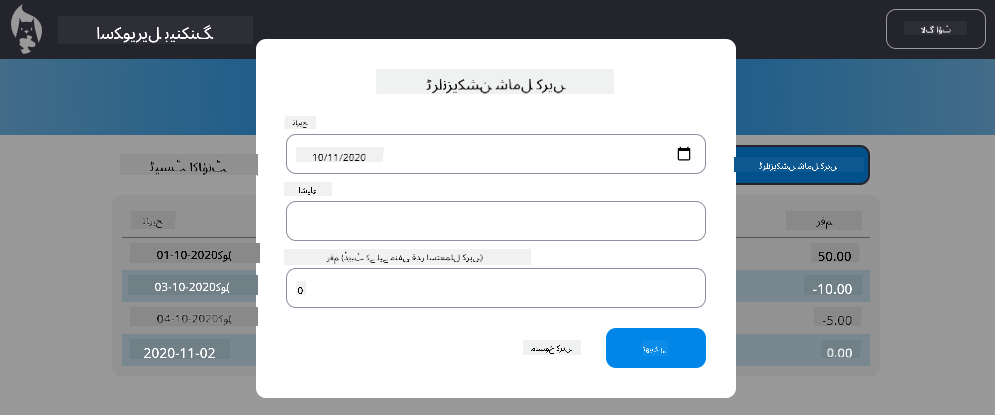

<!--
CO_OP_TRANSLATOR_METADATA:
{
  "original_hash": "b46acf79da8550d76445eed00b06c878",
  "translation_date": "2025-10-03T12:48:01+00:00",
  "source_file": "7-bank-project/4-state-management/README.md",
  "language_code": "ur"
}
-->
# بینکنگ ایپ بنائیں حصہ 4: اسٹیٹ مینجمنٹ کے تصورات

## لیکچر سے پہلے کا کوئز

[لیکچر سے پہلے کا کوئز](https://ff-quizzes.netlify.app/web/quiz/47)

### تعارف

جب ایک ویب ایپلیکیشن بڑھتی ہے، تو تمام ڈیٹا فلو کو ٹریک کرنا ایک چیلنج بن جاتا ہے۔ کون سا کوڈ ڈیٹا حاصل کرتا ہے، کون سا صفحہ اسے استعمال کرتا ہے، کہاں اور کب اسے اپ ڈیٹ کرنے کی ضرورت ہے... آسانی سے ایسا کوڈ بن سکتا ہے جو برقرار رکھنا مشکل ہو۔ یہ خاص طور پر اس وقت ہوتا ہے جب آپ کو اپنی ایپ کے مختلف صفحات کے درمیان ڈیٹا شیئر کرنے کی ضرورت ہوتی ہے، جیسے صارف کا ڈیٹا۔ *اسٹیٹ مینجمنٹ* کا تصور ہمیشہ سے ہر قسم کے پروگراموں میں موجود رہا ہے، لیکن جیسے جیسے ویب ایپس پیچیدہ ہوتی جا رہی ہیں، یہ ترقی کے دوران سوچنے کا ایک اہم نقطہ بن گیا ہے۔

اس آخری حصے میں، ہم اس ایپ پر نظر ڈالیں گے جو ہم نے بنائی ہے تاکہ اسٹیٹ کو دوبارہ سوچا جا سکے، براؤزر ریفریش کو کسی بھی وقت سپورٹ کرنے کی اجازت دی جا سکے، اور صارف کے سیشنز کے دوران ڈیٹا کو برقرار رکھا جا سکے۔

### پیشگی شرط

آپ کو اس سبق کے لیے ویب ایپ کے [ڈیٹا فچنگ](../3-data/README.md) حصے کو مکمل کرنا ہوگا۔ آپ کو [Node.js](https://nodejs.org) انسٹال کرنے اور [سرور API](../api/README.md) کو مقامی طور پر چلانے کی بھی ضرورت ہے تاکہ آپ اکاؤنٹ ڈیٹا کو منظم کر سکیں۔

آپ یہ کمانڈ ٹرمینل میں چلا کر چیک کر سکتے ہیں کہ سرور صحیح طریقے سے چل رہا ہے:

```sh
curl http://localhost:5000/api
# -> should return "Bank API v1.0.0" as a result
```

---

## اسٹیٹ مینجمنٹ کو دوبارہ سوچیں

[پچھلے سبق](../3-data/README.md) میں، ہم نے اپنی ایپ میں اسٹیٹ کے بنیادی تصور کو متعارف کرایا تھا جس میں عالمی `account` ویریبل شامل تھا جو موجودہ لاگ ان صارف کے بینک ڈیٹا کو رکھتا ہے۔ تاہم، ہماری موجودہ عمل درآمد میں کچھ خامیاں ہیں۔ ڈیش بورڈ پر ہونے کے دوران صفحہ کو ریفریش کرنے کی کوشش کریں۔ کیا ہوتا ہے؟

موجودہ کوڈ میں 3 مسائل ہیں:

- اسٹیٹ برقرار نہیں رہتا، کیونکہ براؤزر ریفریش آپ کو لاگ ان صفحے پر واپس لے جاتا ہے۔
- اسٹیٹ کو تبدیل کرنے والے متعدد فنکشنز ہیں۔ جیسے جیسے ایپ بڑھتی ہے، اس سے تبدیلیوں کو ٹریک کرنا مشکل ہو سکتا ہے اور ایک کو اپ ڈیٹ کرنا بھولنا آسان ہو جاتا ہے۔
- اسٹیٹ صاف نہیں ہوتا، لہذا جب آپ *Logout* پر کلک کرتے ہیں تو اکاؤنٹ کا ڈیٹا اب بھی موجود ہوتا ہے حالانکہ آپ لاگ ان صفحے پر ہیں۔

ہم اپنے کوڈ کو ان مسائل کو ایک ایک کرکے حل کرنے کے لیے اپ ڈیٹ کر سکتے ہیں، لیکن اس سے کوڈ کی نقل پیدا ہوگی اور ایپ کو زیادہ پیچیدہ اور برقرار رکھنے میں مشکل ہو جائے گی۔ یا ہم چند منٹ کے لیے رک سکتے ہیں اور اپنی حکمت عملی پر دوبارہ غور کر سکتے ہیں۔

> ہم یہاں واقعی کون سے مسائل حل کرنے کی کوشش کر رہے ہیں؟

[اسٹیٹ مینجمنٹ](https://en.wikipedia.org/wiki/State_management) ان دو خاص مسائل کو حل کرنے کے لیے ایک اچھا طریقہ تلاش کرنے کے بارے میں ہے:

- ایپ میں ڈیٹا فلو کو سمجھنے کے قابل کیسے رکھا جائے؟
- اسٹیٹ ڈیٹا کو ہمیشہ صارف کے انٹرفیس کے ساتھ (اور اس کے برعکس) ہم آہنگ کیسے رکھا جائے؟

ایک بار جب آپ ان کا خیال رکھ لیں، تو آپ کے پاس موجود کوئی بھی دیگر مسائل یا تو پہلے ہی حل ہو چکے ہوں گے یا انہیں حل کرنا آسان ہو گیا ہوگا۔ ان مسائل کو حل کرنے کے لیے بہت سے ممکنہ طریقے ہیں، لیکن ہم ایک عام حل کے ساتھ جائیں گے جس میں **ڈیٹا اور اسے تبدیل کرنے کے طریقے کو مرکزی بنانا** شامل ہے۔ ڈیٹا فلو اس طرح ہوگا:


> ہم یہاں اس حصے کا احاطہ نہیں کریں گے جہاں ڈیٹا خود بخود ویو اپ ڈیٹ کو متحرک کرتا ہے، کیونکہ یہ [Reactive Programming](https://en.wikipedia.org/wiki/Reactive_programming) کے زیادہ جدید تصورات سے جڑا ہوا ہے۔ اگر آپ گہرائی میں جانے کے لیے تیار ہیں تو یہ ایک اچھا فالو اپ موضوع ہے۔

✅ اسٹیٹ مینجمنٹ کے مختلف طریقوں کے ساتھ بہت سی لائبریریاں موجود ہیں، [Redux](https://redux.js.org) ایک مقبول آپشن ہے۔ استعمال شدہ تصورات اور پیٹرنز پر ایک نظر ڈالیں کیونکہ یہ اکثر یہ سیکھنے کا ایک اچھا طریقہ ہوتا ہے کہ آپ کو بڑی ویب ایپس میں کن ممکنہ مسائل کا سامنا ہو سکتا ہے اور اسے کیسے حل کیا جا سکتا ہے۔

### کام

ہم تھوڑا سا ریفیکٹرنگ کے ساتھ شروع کریں گے۔ `account` ڈیکلریشن کو تبدیل کریں:

```js
let account = null;
```

اس کے ساتھ:

```js
let state = {
  account: null
};
```

خیال یہ ہے کہ ہمارے ایپ ڈیٹا کو ایک واحد اسٹیٹ آبجیکٹ میں *مرکزی بنانا* ہے۔ ہمارے پاس فی الحال اسٹیٹ میں صرف `account` ہے لہذا اس سے زیادہ فرق نہیں پڑتا، لیکن یہ ارتقاء کے لیے ایک راستہ بناتا ہے۔

ہمیں اسے استعمال کرنے والے فنکشنز کو بھی اپ ڈیٹ کرنا ہوگا۔ `register()` اور `login()` فنکشنز میں، `account = ...` کو `state.account = ...` سے تبدیل کریں؛

`updateDashboard()` فنکشن کے آغاز میں، یہ لائن شامل کریں:

```js
const account = state.account;
```

یہ ریفیکٹرنگ بذات خود زیادہ بہتری نہیں لائی، لیکن خیال اگلے تبدیلیوں کے لیے بنیاد رکھنا تھا۔

## ڈیٹا تبدیلیوں کو ٹریک کریں

اب جب کہ ہم نے اپنا ڈیٹا اسٹور کرنے کے لیے `state` آبجیکٹ کو جگہ دی ہے، اگلا قدم اپ ڈیٹس کو مرکزی بنانا ہے۔ مقصد یہ ہے کہ کسی بھی تبدیلی اور ان کے ہونے کے وقت کو ٹریک کرنا آسان بنایا جائے۔

`state` آبجیکٹ میں تبدیلیاں کرنے سے بچنے کے لیے، اسے [*immutable*](https://en.wikipedia.org/wiki/Immutable_object) سمجھنا بھی ایک اچھا عمل ہے، یعنی اسے بالکل بھی تبدیل نہیں کیا جا سکتا۔ اس کا مطلب یہ بھی ہے کہ اگر آپ اس میں کچھ بھی تبدیل کرنا چاہتے ہیں تو آپ کو ایک نیا اسٹیٹ آبجیکٹ بنانا ہوگا۔ ایسا کرنے سے، آپ ممکنہ طور پر ناپسندیدہ [side effects](https://en.wikipedia.org/wiki/Side_effect_(computer_science)) کے بارے میں تحفظ پیدا کرتے ہیں، اور اپنی ایپ میں نئی خصوصیات کے امکانات کھولتے ہیں جیسے undo/redo کو نافذ کرنا، جبکہ اسے ڈیبگ کرنا بھی آسان بناتے ہیں۔ مثال کے طور پر، آپ اسٹیٹ میں کی گئی ہر تبدیلی کو لاگ کر سکتے ہیں اور کسی بگ کے ماخذ کو سمجھنے کے لیے تبدیلیوں کی تاریخ رکھ سکتے ہیں۔

جاوا اسکرپٹ میں، آپ [`Object.freeze()`](https://developer.mozilla.org/docs/Web/JavaScript/Reference/Global_Objects/Object/freeze) کا استعمال کر سکتے ہیں تاکہ کسی آبجیکٹ کا ناقابل تبدیل ورژن بنایا جا سکے۔ اگر آپ کسی ناقابل تبدیل آبجیکٹ میں تبدیلیاں کرنے کی کوشش کرتے ہیں، تو ایک استثنا پیدا ہوگا۔

✅ کیا آپ جانتے ہیں کہ *shallow* اور *deep* ناقابل تبدیل آبجیکٹ میں کیا فرق ہے؟ آپ اس کے بارے میں [یہاں](https://developer.mozilla.org/docs/Web/JavaScript/Reference/Global_Objects/Object/freeze#What_is_shallow_freeze) پڑھ سکتے ہیں۔

### کام

آئیے ایک نیا `updateState()` فنکشن بناتے ہیں:

```js
function updateState(property, newData) {
  state = Object.freeze({
    ...state,
    [property]: newData
  });
}
```

اس فنکشن میں، ہم ایک نیا اسٹیٹ آبجیکٹ بنا رہے ہیں اور پچھلے اسٹیٹ سے ڈیٹا کو [*spread (`...`) operator*](https://developer.mozilla.org/docs/Web/JavaScript/Reference/Operators/Spread_syntax#Spread_in_object_literals) کا استعمال کرتے ہوئے کاپی کر رہے ہیں۔ پھر ہم اسٹیٹ آبجیکٹ کی ایک خاص پراپرٹی کو [bracket notation](https://developer.mozilla.org/docs/Web/JavaScript/Guide/Working_with_Objects#Objects_and_properties) `[property]` کے ذریعے نئے ڈیٹا کے ساتھ اوور رائیڈ کرتے ہیں۔ آخر میں، ہم `Object.freeze()` کا استعمال کرتے ہوئے آبجیکٹ کو لاک کرتے ہیں تاکہ ترمیمات کو روکا جا سکے۔ فی الحال ہمارے پاس اسٹیٹ میں صرف `account` پراپرٹی محفوظ ہے، لیکن اس طریقے سے آپ اسٹیٹ میں جتنی پراپرٹیز چاہیں شامل کر سکتے ہیں۔

ہم اسٹیٹ کی ابتدائی حالت کو بھی اپ ڈیٹ کریں گے تاکہ یہ یقینی بنایا جا سکے کہ ابتدائی اسٹیٹ بھی فریز ہو:

```js
let state = Object.freeze({
  account: null
});
```

اس کے بعد، `register` فنکشن کو اپ ڈیٹ کریں اور `state.account = result;` اسائنمنٹ کو تبدیل کریں:

```js
updateState('account', result);
```

`login` فنکشن کے ساتھ بھی ایسا ہی کریں، `state.account = data;` کو تبدیل کریں:

```js
updateState('account', data);
```

اب ہم موقع سے فائدہ اٹھاتے ہوئے اس مسئلے کو حل کریں گے کہ جب صارف *Logout* پر کلک کرتا ہے تو اکاؤنٹ کا ڈیٹا صاف نہیں ہوتا۔

ایک نیا فنکشن `logout()` بنائیں:

```js
function logout() {
  updateState('account', null);
  navigate('/login');
}
```

`updateDashboard()` میں، ری ڈائریکشن `return navigate('/login');` کو `return logout();` سے تبدیل کریں؛

ایک نیا اکاؤنٹ رجسٹر کرنے، لاگ آؤٹ کرنے اور دوبارہ لاگ ان کرنے کی کوشش کریں تاکہ یہ چیک کیا جا سکے کہ سب کچھ صحیح طریقے سے کام کر رہا ہے۔

> ٹپ: آپ براؤزر کے ڈیولپمنٹ ٹولز میں کنسول کھول کر اور `updateState()` کے نیچے `console.log(state)` شامل کر کے تمام اسٹیٹ تبدیلیوں کو دیکھ سکتے ہیں۔

## اسٹیٹ کو برقرار رکھیں

زیادہ تر ویب ایپس کو صحیح طریقے سے کام کرنے کے لیے ڈیٹا کو برقرار رکھنے کی ضرورت ہوتی ہے۔ تمام اہم ڈیٹا عام طور پر ڈیٹا بیس میں محفوظ کیا جاتا ہے اور سرور API کے ذریعے رسائی حاصل کی جاتی ہے، جیسے کہ ہمارے معاملے میں صارف اکاؤنٹ ڈیٹا۔ لیکن بعض اوقات، کلائنٹ ایپ میں کچھ ڈیٹا کو برقرار رکھنا بھی دلچسپ ہوتا ہے جو آپ کے براؤزر میں چل رہی ہے، بہتر صارف کے تجربے یا لوڈنگ کی کارکردگی کو بہتر بنانے کے لیے۔

جب آپ اپنے براؤزر میں ڈیٹا کو برقرار رکھنا چاہتے ہیں، تو آپ کو چند اہم سوالات خود سے پوچھنے چاہئیں:

- *کیا ڈیٹا حساس ہے؟* آپ کو کلائنٹ پر کوئی حساس ڈیٹا محفوظ کرنے سے گریز کرنا چاہیے، جیسے صارف کے پاس ورڈز۔
- *آپ کو یہ ڈیٹا کتنے عرصے تک رکھنے کی ضرورت ہے؟* کیا آپ اس ڈیٹا تک صرف موجودہ سیشن کے لیے رسائی حاصل کرنے کا ارادہ رکھتے ہیں یا آپ چاہتے ہیں کہ یہ ہمیشہ کے لیے محفوظ رہے؟

ویب ایپ کے اندر معلومات کو ذخیرہ کرنے کے کئی طریقے ہیں، اس پر منحصر ہے کہ آپ کیا حاصل کرنا چاہتے ہیں۔ مثال کے طور پر، آپ تلاش کے سوال کو محفوظ کرنے کے لیے URLs کا استعمال کر سکتے ہیں، اور اسے صارفین کے درمیان شیئر کرنے کے قابل بنا سکتے ہیں۔ آپ [HTTP کوکیز](https://developer.mozilla.org/docs/Web/HTTP/Cookies) کا بھی استعمال کر سکتے ہیں اگر ڈیٹا کو سرور کے ساتھ شیئر کرنے کی ضرورت ہو، جیسے [authentication](https://en.wikipedia.org/wiki/Authentication) کی معلومات۔

ایک اور آپشن یہ ہے کہ ڈیٹا کو اسٹور کرنے کے لیے براؤزر APIs میں سے ایک کا استعمال کریں۔ ان میں سے دو خاص طور پر دلچسپ ہیں:

- [`localStorage`](https://developer.mozilla.org/docs/Web/API/Window/localStorage): ایک [Key/Value store](https://en.wikipedia.org/wiki/Key%E2%80%93value_database) جو مختلف سیشنز کے دوران موجودہ ویب سائٹ کے لیے مخصوص ڈیٹا کو برقرار رکھنے کی اجازت دیتا ہے۔ اس میں محفوظ کردہ ڈیٹا کبھی ختم نہیں ہوتا۔
- [`sessionStorage`](https://developer.mozilla.org/docs/Web/API/Window/sessionStorage): یہ `localStorage` کی طرح کام کرتا ہے سوائے اس کے کہ اس میں محفوظ کردہ ڈیٹا سیشن ختم ہونے پر (جب براؤزر بند ہو جاتا ہے) صاف ہو جاتا ہے۔

نوٹ کریں کہ یہ دونوں APIs صرف [strings](https://developer.mozilla.org/docs/Web/JavaScript/Reference/Global_Objects/String) کو اسٹور کرنے کی اجازت دیتے ہیں۔ اگر آپ پیچیدہ آبجیکٹس کو اسٹور کرنا چاہتے ہیں، تو آپ کو اسے [JSON](https://developer.mozilla.org/docs/Web/JavaScript/Reference/Global_Objects/JSON) فارمیٹ میں سیریلائز کرنے کی ضرورت ہوگی [`JSON.stringify()`](https://developer.mozilla.org/docs/Web/JavaScript/Reference/Global_Objects/JSON/stringify) کا استعمال کرتے ہوئے۔

✅ اگر آپ ایک ویب ایپ بنانا چاہتے ہیں جو سرور کے ساتھ کام نہ کرے، تو یہ بھی ممکن ہے کہ [`IndexedDB` API](https://developer.mozilla.org/docs/Web/API/IndexedDB_API) کا استعمال کرتے ہوئے کلائنٹ پر ڈیٹا بیس بنایا جائے۔ یہ ایک پیچیدہ استعمال کے معاملات کے لیے محفوظ ہے یا اگر آپ کو ڈیٹا کی نمایاں مقدار کو اسٹور کرنے کی ضرورت ہو، کیونکہ اس کا استعمال زیادہ پیچیدہ ہے۔

### کام

ہم چاہتے ہیں کہ ہمارے صارفین لاگ آؤٹ بٹن پر واضح طور پر کلک کرنے تک لاگ ان رہیں، لہذا ہم `localStorage` کا استعمال کریں گے تاکہ اکاؤنٹ ڈیٹا کو اسٹور کیا جا سکے۔ پہلے، آئیے ایک کلید کی وضاحت کریں جسے ہم اپنے ڈیٹا کو اسٹور کرنے کے لیے استعمال کریں گے۔

```js
const storageKey = 'savedAccount';
```

پھر `updateState()` فنکشن کے آخر میں یہ لائن شامل کریں:

```js
localStorage.setItem(storageKey, JSON.stringify(state.account));
```

اس کے ساتھ، صارف اکاؤنٹ ڈیٹا برقرار رہے گا اور ہمیشہ اپ ڈیٹ رہے گا کیونکہ ہم نے پہلے اپنے تمام اسٹیٹ اپ ڈیٹس کو مرکزی بنایا تھا۔ یہ وہ جگہ ہے جہاں ہم اپنے تمام پچھلے ریفیکٹرز سے فائدہ اٹھانا شروع کرتے ہیں 🙂۔

چونکہ ڈیٹا محفوظ ہے، ہمیں اسے ایپ لوڈ ہونے پر بحال کرنے کا بھی خیال رکھنا ہوگا۔ چونکہ ہم زیادہ ابتدائی کوڈ رکھنے لگیں گے، یہ ایک نیا `init` فنکشن بنانے کا اچھا خیال ہو سکتا ہے، جس میں `app.js` کے نیچے ہمارا پچھلا کوڈ بھی شامل ہو:

```js
function init() {
  const savedAccount = localStorage.getItem(storageKey);
  if (savedAccount) {
    updateState('account', JSON.parse(savedAccount));
  }

  // Our previous initialization code
  window.onpopstate = () => updateRoute();
  updateRoute();
}

init();
```

یہاں ہم محفوظ کردہ ڈیٹا کو بازیافت کرتے ہیں، اور اگر کوئی موجود ہے تو ہم اسٹیٹ کو اسی کے مطابق اپ ڈیٹ کرتے ہیں۔ صفحہ اپ ڈیٹ کے دوران اسٹیٹ پر انحصار کرنے والے کوڈ کے ہونے کے امکان کے پیش نظر، یہ *route* کو اپ ڈیٹ کرنے سے پہلے کرنا ضروری ہے۔

ہم اپنی ایپلیکیشن کا ڈیفالٹ صفحہ *Dashboard* بھی بنا سکتے ہیں، کیونکہ ہم اب اکاؤنٹ ڈیٹا کو برقرار رکھ رہے ہیں۔ اگر کوئی ڈیٹا نہیں ملا، تو ڈیش بورڈ ویسے بھی *Login* صفحے پر ری ڈائریکٹ کرنے کا خیال رکھتا ہے۔ `updateRoute()` میں، fallback `return navigate('/login');` کو `return navigate('/dashboard');` سے تبدیل کریں۔

اب ایپ میں لاگ ان کریں اور صفحہ کو ریفریش کرنے کی کوشش کریں۔ آپ کو ڈیش بورڈ پر رہنا چاہیے۔ اس اپ ڈیٹ کے ساتھ ہم نے اپنے تمام ابتدائی مسائل کا خیال رکھا ہے...

## ڈیٹا کو ریفریش کریں

...لیکن ہم نے شاید ایک نیا مسئلہ بھی پیدا کر دیا ہے۔ اوہ!

`test` اکاؤنٹ کا استعمال کرتے ہوئے ڈیش بورڈ پر جائیں، پھر ایک نیا ٹرانزیکشن بنانے کے لیے ٹرمینل پر یہ کمانڈ چلائیں:

```sh
curl --request POST \
     --header "Content-Type: application/json" \
     --data "{ \"date\": \"2020-07-24\", \"object\": \"Bought book\", \"amount\": -20 }" \
     http://localhost:5000/api/accounts/test/transactions
```

اب اپنے براؤزر میں ڈیش بورڈ صفحہ کو ریفریش کرنے کی کوشش کریں۔ کیا ہوتا ہے؟ کیا آپ کو نیا ٹرانزیکشن نظر آتا ہے؟

اسٹیٹ `localStorage` کی بدولت غیر معینہ مدت تک برقرار رہتا ہے، لیکن اس کا مطلب یہ بھی ہے کہ یہ کبھی اپ ڈیٹ نہیں ہوتا جب تک کہ آپ ایپ سے لاگ آؤٹ نہ کریں اور دوبارہ لاگ ان نہ کریں!

اسے ٹھیک کرنے کے لیے ایک ممکنہ حکمت عملی یہ ہے کہ ڈیش بورڈ ہر بار لوڈ ہونے پر اکاؤنٹ ڈیٹا کو دوبارہ لوڈ کیا جائے، تاکہ ڈیٹا اسٹال نہ ہو۔

### کام

ایک نیا فنکشن `updateAccountData` بنائیں:

```js
async function updateAccountData() {
  const account = state.account;
  if (!account) {
    return logout();
  }

  const data = await getAccount(account.user);
  if (data.error) {
    return logout();
  }

  updateState('account', data);
}
```

یہ طریقہ چیک کرتا ہے کہ ہم فی الحال لاگ ان ہیں پھر سرور سے اکاؤنٹ ڈیٹا کو دوبارہ لوڈ کرتا ہے۔

ایک اور فنکشن بنائیں جس کا نام `refresh` ہو:

```js
async function refresh() {
  await updateAccountData();
  updateDashboard();
}
```

یہ اکاؤنٹ ڈیٹا کو اپ ڈیٹ کرتا ہے، پھر ڈیش بورڈ صفحے کے HTML کو اپ ڈیٹ کرنے کا خیال رکھتا ہے۔ یہ وہی ہے جسے ہمیں ڈیش بورڈ روٹ لوڈ ہونے پر کال کرنے کی ضرورت ہے۔ روٹ تعریف کو اپ ڈیٹ کریں:

```js
const routes = {
  '/login': { templateId: 'login' },
  '/dashboard': { templateId: 'dashboard', init: refresh }
};
```

اب ڈیش بورڈ کو دوبارہ لوڈ کرنے کی کوشش کریں، اسے اپ ڈیٹ شدہ اکاؤنٹ ڈیٹا دکھانا چاہیے۔

---

## 🚀 چیلنج

اب جب کہ ہم ہر بار ڈیش بورڈ لوڈ ہونے پر اکاؤنٹ ڈیٹا کو دوبارہ لوڈ کرتے ہیں، کیا آپ کو لگتا ہے کہ ہمیں *تمام اکاؤنٹ* ڈیٹا کو برقرار رکھنے کی ضرورت ہے؟

مل کر کام کرنے کی کوشش کریں تاکہ `localStorage` سے محفوظ اور لوڈ ہونے والے ڈیٹا کو تبدیل کیا جا سکے تاکہ صرف وہی شامل ہو جو ایپ کے کام کرنے کے لیے بالکل ضروری ہے۔

## لیکچر کے بعد کا کوئز
[لیکچر کے بعد کا کوئز](https://ff-quizzes.netlify.app/web/quiz/48)

## اسائنمنٹ

["Add transaction" ڈائیلاگ کو نافذ کریں](assignment.md)

یہاں اسائنمنٹ مکمل کرنے کے بعد کا ایک مثال نتیجہ ہے:



---

**ڈسکلیمر**:  
یہ دستاویز AI ترجمہ سروس [Co-op Translator](https://github.com/Azure/co-op-translator) کا استعمال کرتے ہوئے ترجمہ کی گئی ہے۔ ہم درستگی کے لیے کوشش کرتے ہیں، لیکن براہ کرم آگاہ رہیں کہ خودکار ترجمے میں غلطیاں یا غیر درستیاں ہو سکتی ہیں۔ اصل دستاویز کو اس کی اصل زبان میں مستند ذریعہ سمجھا جانا چاہیے۔ اہم معلومات کے لیے، پیشہ ور انسانی ترجمہ کی سفارش کی جاتی ہے۔ اس ترجمے کے استعمال سے پیدا ہونے والی کسی بھی غلط فہمی یا غلط تشریح کے لیے ہم ذمہ دار نہیں ہیں۔