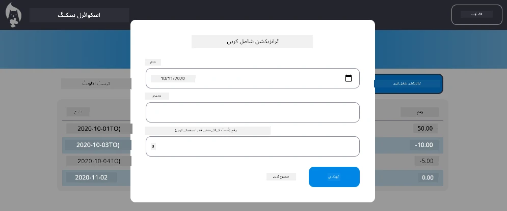

# "ٹرانزیکشن شامل کریں" ڈائیلاگ نافذ کریں

## جائزہ

آپ کی بینکنگ ایپ میں اب مضبوط اسٹیٹ مینجمنٹ اور ڈیٹا پرسیسٹنس موجود ہے، لیکن اس میں ایک اہم فیچر کی کمی ہے جو حقیقی بینکنگ ایپس میں ضروری ہوتا ہے: صارفین کو اپنی ٹرانزیکشنز شامل کرنے کی صلاحیت۔ اس اسائنمنٹ میں، آپ ایک مکمل "ٹرانزیکشن شامل کریں" ڈائیلاگ نافذ کریں گے جو آپ کے موجودہ اسٹیٹ مینجمنٹ سسٹم کے ساتھ بغیر کسی رکاوٹ کے کام کرے گا۔

یہ اسائنمنٹ آپ کے بینکنگ کے چار اسباق میں سیکھے گئے تمام چیزوں کو یکجا کرتا ہے: HTML ٹیمپلیٹنگ، فارم ہینڈلنگ، API انٹیگریشن، اور اسٹیٹ مینجمنٹ۔

## سیکھنے کے مقاصد

اس اسائنمنٹ کو مکمل کرکے، آپ:
- **ایک صارف دوست ڈائیلاگ انٹرفیس** ڈیٹا انٹری کے لیے تخلیق کریں گے
- **قابل رسائی فارم ڈیزائن** کو کی بورڈ اور اسکرین ریڈر سپورٹ کے ساتھ نافذ کریں گے
- **اپنے موجودہ اسٹیٹ مینجمنٹ سسٹم کے ساتھ نئے فیچرز کو انٹیگریٹ کریں گے**
- **API کمیونیکیشن اور ایرر ہینڈلنگ کی مشق کریں گے**
- **جدید ویب ڈویلپمنٹ پیٹرنز** کو حقیقی دنیا کے فیچر پر لاگو کریں گے

## ہدایات

### مرحلہ 1: ٹرانزیکشن شامل کریں بٹن

**ڈیش بورڈ پیج** پر ایک "ٹرانزیکشن شامل کریں" بٹن بنائیں جو صارفین آسانی سے تلاش اور استعمال کر سکیں۔

**ضروریات:**
- **بٹن کو ڈیش بورڈ پر منطقی جگہ پر رکھیں**
- **واضح، ایکشن پر مبنی بٹن ٹیکسٹ استعمال کریں**
- **بٹن کو اپنے موجودہ UI ڈیزائن سے ہم آہنگ کریں**
- **یقینی بنائیں کہ بٹن کی بورڈ کے ذریعے قابل رسائی ہو**

### مرحلہ 2: ڈائیلاگ نافذ کریں

اپنے ڈائیلاگ کو نافذ کرنے کے لیے درج ذیل دو طریقوں میں سے ایک کا انتخاب کریں:

**آپشن A: علیحدہ صفحہ**
- **ٹرانزیکشن فارم کے لیے ایک نیا HTML ٹیمپلیٹ بنائیں**
- **اپنے روٹنگ سسٹم میں ایک نیا روٹ شامل کریں**
- **فارم پیج پر نیویگیشن اور واپسی نافذ کریں**

**آپشن B: موڈل ڈائیلاگ (تجویز کردہ)**
- **جاوا اسکرپٹ استعمال کریں** تاکہ ڈیش بورڈ چھوڑے بغیر ڈائیلاگ کو دکھایا/چھپایا جا سکے
- **[`hidden` پراپرٹی](https://developer.mozilla.org/docs/Web/HTML/Global_attributes/hidden)** یا CSS کلاسز استعمال کریں
- **فوکس مینجمنٹ کے ساتھ ایک ہموار صارف تجربہ تخلیق کریں**

### مرحلہ 3: قابل رسائی ڈائیلاگ نافذ کریں

یقینی بنائیں کہ آپ کا ڈائیلاگ [موڈل ڈائیلاگ کے قابل رسائی معیارات](https://developer.paciellogroup.com/blog/2018/06/the-current-state-of-modal-dialog-accessibility/) پر پورا اترتا ہے:

**کی بورڈ نیویگیشن:**
- **ایسکیپ کی** کے ذریعے ڈائیلاگ بند کرنے کی سپورٹ فراہم کریں
- **فوکس کو ڈائیلاگ کے اندر محدود کریں** جب یہ کھلا ہو
- **فوکس کو ٹرگر بٹن پر واپس کریں** جب یہ بند ہو

**اسکرین ریڈر سپورٹ:**
- **مناسب ARIA لیبلز اور رولز شامل کریں**
- **ڈائیلاگ کے کھلنے/بند ہونے کا اعلان اسکرین ریڈرز کو کریں**
- **فارم فیلڈز کے واضح لیبلز اور ایرر میسیجز فراہم کریں**

### مرحلہ 4: فارم تخلیق کریں

ایک HTML فارم ڈیزائن کریں جو ٹرانزیکشن ڈیٹا جمع کرے:

**ضروری فیلڈز:**
- **تاریخ**: جب ٹرانزیکشن ہوئی
- **تفصیل**: ٹرانزیکشن کس مقصد کے لیے تھی
- **رقم**: ٹرانزیکشن کی قیمت (آمدنی کے لیے مثبت، اخراجات کے لیے منفی)

**فارم فیچرز:**
- **صارف کے ان پٹ کی تصدیق کریں** جمع کرانے سے پہلے
- **غلط ڈیٹا کے لیے واضح ایرر میسیجز فراہم کریں**
- **مددگار پلیس ہولڈر ٹیکسٹ اور لیبلز شامل کریں**
- **اپنے موجودہ ڈیزائن کے ساتھ مستقل طور پر اسٹائل کریں**

### مرحلہ 5: API انٹیگریشن

اپنے فارم کو بیک اینڈ API سے منسلک کریں:

**نافذ کرنے کے مراحل:**
- [سرور API کی وضاحتیں](../api/README.md) کا جائزہ لیں تاکہ درست اینڈ پوائنٹ اور ڈیٹا فارمیٹ معلوم ہو
- **اپنے فارم ان پٹس سے JSON ڈیٹا تخلیق کریں**
- **مناسب ایرر ہینڈلنگ کے ساتھ ڈیٹا کو API پر بھیجیں**
- **صارف کو کامیابی/ناکامی کے میسیجز دکھائیں**
- **نیٹ ورک ایررز کو خوش اسلوبی سے ہینڈل کریں**

### مرحلہ 6: اسٹیٹ مینجمنٹ انٹیگریشن

اپنے ڈیش بورڈ کو نئی ٹرانزیکشن کے ساتھ اپ ڈیٹ کریں:

**انٹیگریشن کی ضروریات:**
- **کامیاب ٹرانزیکشن شامل کرنے کے بعد اکاؤنٹ ڈیٹا کو ریفریش کریں**
- **ڈیش بورڈ ڈسپلے کو صفحہ ری لوڈ کیے بغیر اپ ڈیٹ کریں**
- **یقینی بنائیں کہ نئی ٹرانزیکشن فوراً ظاہر ہو**
- **پوری پروسیس کے دوران اسٹیٹ کی مستقل مزاجی برقرار رکھیں**

## تکنیکی وضاحتیں

**API اینڈ پوائنٹ کی تفصیلات:**
[سرور API دستاویزات](../api/README.md) کا حوالہ دیں:
- ٹرانزیکشن ڈیٹا کے لیے مطلوبہ JSON فارمیٹ
- HTTP میتھڈ اور اینڈ پوائنٹ URL
- متوقع رسپانس فارمیٹ
- ایرر رسپانس ہینڈلنگ

**متوقع نتیجہ:**
اس اسائنمنٹ کو مکمل کرنے کے بعد، آپ کی بینکنگ ایپ میں ایک مکمل طور پر فعال "ٹرانزیکشن شامل کریں" فیچر ہونا چاہیے جو پیشہ ورانہ نظر آئے اور کام کرے:

## اپنی نافذ کردہ چیز کی جانچ

**فنکشنل ٹیسٹنگ:**
1. **تصدیق کریں** کہ "ٹرانزیکشن شامل کریں" بٹن واضح طور پر نظر آتا ہے اور قابل رسائی ہے
2. **ٹیسٹ کریں** کہ ڈائیلاگ صحیح طریقے سے کھلتا اور بند ہوتا ہے
3. **تصدیق کریں** کہ فارم کی تصدیق تمام مطلوبہ فیلڈز کے لیے کام کرتی ہے
4. **چیک کریں** کہ کامیاب ٹرانزیکشنز فوراً ڈیش بورڈ پر ظاہر ہوتی ہیں
5. **یقینی بنائیں** کہ غلط ڈیٹا اور نیٹ ورک مسائل کے لیے ایرر ہینڈلنگ کام کرتی ہے

**قابل رسائی ٹیسٹنگ:**
1. **پورے فلو کو صرف کی بورڈ استعمال کرتے ہوئے نیویگیٹ کریں**
2. **اسکرین ریڈر کے ساتھ ٹیسٹ کریں** تاکہ مناسب اعلانات یقینی بنائے جا سکیں
3. **تصدیق کریں** کہ فوکس مینجمنٹ صحیح طریقے سے کام کرتا ہے
4. **چیک کریں** کہ تمام فارم عناصر کے مناسب لیبلز موجود ہیں

## تشخیصی معیار

| معیار | بہترین | مناسب | بہتری کی ضرورت |
| -------- | --------- | -------- | ----------------- |
| **فنکشنلٹی** | ٹرانزیکشن شامل کرنے کا فیچر بہترین طریقے سے کام کرتا ہے، بہترین صارف تجربہ فراہم کرتا ہے، اور تمام بہترین طریقوں پر عمل کرتا ہے | ٹرانزیکشن شامل کرنے کا فیچر درست کام کرتا ہے لیکن کچھ بہترین طریقوں پر عمل نہیں کرتا یا معمولی استعمال کے مسائل ہیں | ٹرانزیکشن شامل کرنے کا فیچر جزوی طور پر کام کرتا ہے یا اس میں اہم استعمال کے مسائل ہیں |
| **کوڈ کا معیار** | کوڈ اچھی طرح منظم ہے، قائم کردہ پیٹرنز پر عمل کرتا ہے، مناسب ایرر ہینڈلنگ شامل ہے، اور موجودہ اسٹیٹ مینجمنٹ کے ساتھ بغیر کسی رکاوٹ کے انٹیگریٹ ہوتا ہے | کوڈ کام کرتا ہے لیکن اس میں کچھ تنظیمی مسائل یا موجودہ کوڈ بیس کے ساتھ غیر مستقل پیٹرنز ہو سکتے ہیں | کوڈ میں اہم ساختی مسائل ہیں یا یہ موجودہ پیٹرنز کے ساتھ اچھی طرح انٹیگریٹ نہیں ہوتا |
| **قابل رسائی** | مکمل کی بورڈ نیویگیشن سپورٹ، اسکرین ریڈر مطابقت، اور WCAG گائیڈ لائنز کے ساتھ بہترین فوکس مینجمنٹ | بنیادی قابل رسائی فیچرز نافذ کیے گئے ہیں لیکن کچھ کی بورڈ نیویگیشن یا اسکرین ریڈر فیچرز غائب ہو سکتے ہیں | محدود یا کوئی قابل رسائی غور و فکر نافذ نہیں کیا گیا |
| **صارف تجربہ** | بدیہی، پالش شدہ انٹرفیس واضح فیڈبیک، ہموار تعاملات، اور پیشہ ورانہ ظاہری شکل کے ساتھ | اچھا صارف تجربہ لیکن فیڈبیک یا بصری ڈیزائن میں معمولی بہتری کی گنجائش ہے | خراب صارف تجربہ، الجھن پیدا کرنے والا انٹرفیس یا صارف فیڈبیک کی کمی |

## اضافی چیلنجز (اختیاری)

بنیادی ضروریات مکمل کرنے کے بعد، ان اضافی بہتریوں پر غور کریں:

**بہتر فیچرز:**
- **ٹرانزیکشن کیٹیگریز شامل کریں** (خوراک، ٹرانسپورٹ، تفریح وغیرہ)
- **ریئل ٹائم فیڈبیک کے ساتھ ان پٹ کی تصدیق نافذ کریں**
- **پاور یوزرز کے لیے کی بورڈ شارٹ کٹس تخلیق کریں**
- **ٹرانزیکشن ایڈیٹنگ اور ڈیلیٹ کرنے کی صلاحیت شامل کریں**

**اعلیٰ درجے کی انٹیگریشن:**
- **حال ہی میں شامل کی گئی ٹرانزیکشنز کے لیے انڈو فیچر نافذ کریں**
- **CSV فائلز سے بلک ٹرانزیکشن امپورٹ کریں**
- **ٹرانزیکشن سرچ اور فلٹرنگ کی صلاحیت تخلیق کریں**
- **ڈیٹا ایکسپورٹ کی صلاحیت نافذ کریں**

یہ اختیاری فیچرز آپ کو مزید جدید ویب ڈویلپمنٹ تصورات کی مشق کرنے اور ایک زیادہ مکمل بینکنگ ایپ تخلیق کرنے میں مدد دیں گے!

---

**ڈسکلیمر**:  
یہ دستاویز AI ترجمہ سروس [Co-op Translator](https://github.com/Azure/co-op-translator) کا استعمال کرتے ہوئے ترجمہ کی گئی ہے۔ ہم درستگی کے لیے کوشش کرتے ہیں، لیکن براہ کرم آگاہ رہیں کہ خودکار ترجمے میں غلطیاں یا غیر درستیاں ہو سکتی ہیں۔ اصل دستاویز کو اس کی اصل زبان میں مستند ذریعہ سمجھا جانا چاہیے۔ اہم معلومات کے لیے، پیشہ ور انسانی ترجمہ کی سفارش کی جاتی ہے۔ ہم اس ترجمے کے استعمال سے پیدا ہونے والی کسی بھی غلط فہمی یا غلط تشریح کے ذمہ دار نہیں ہیں۔