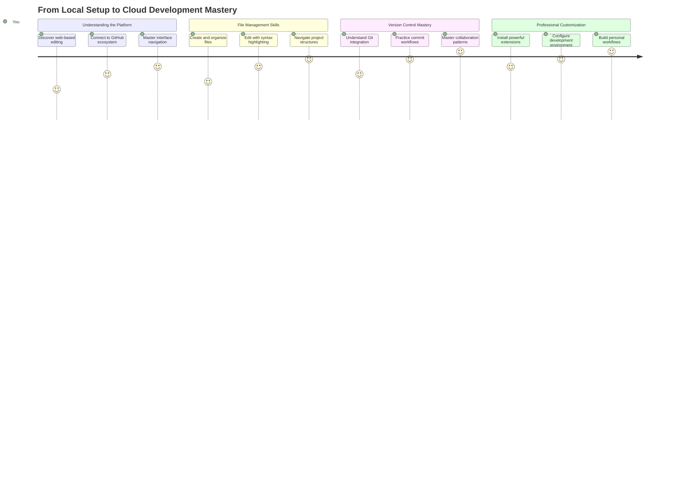
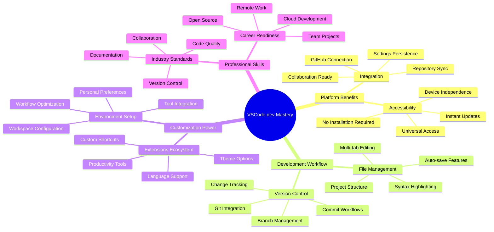
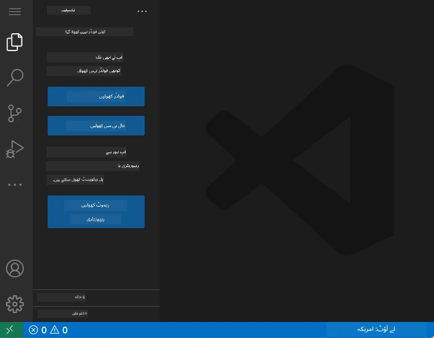
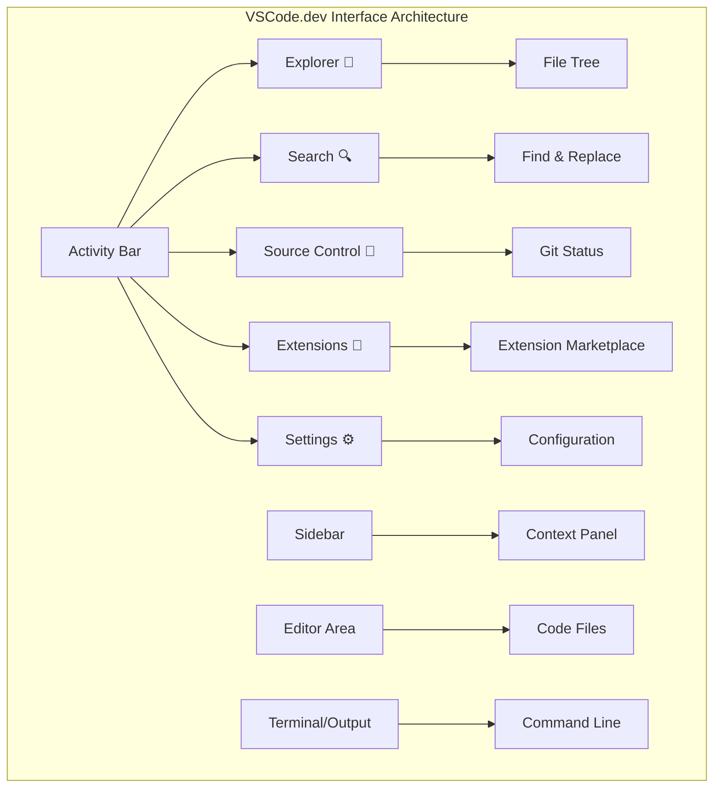
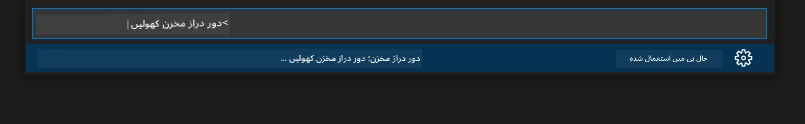
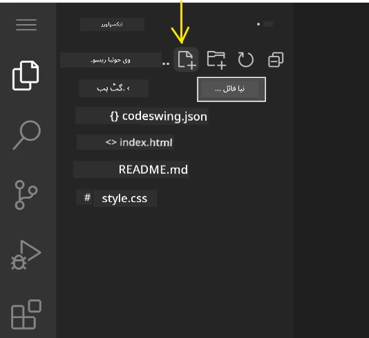
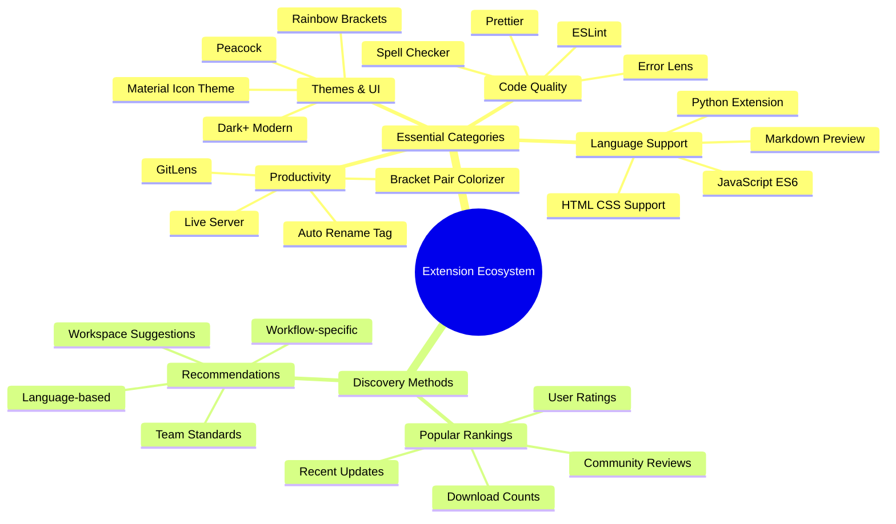
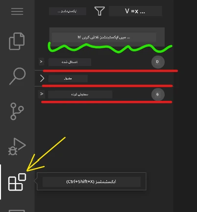
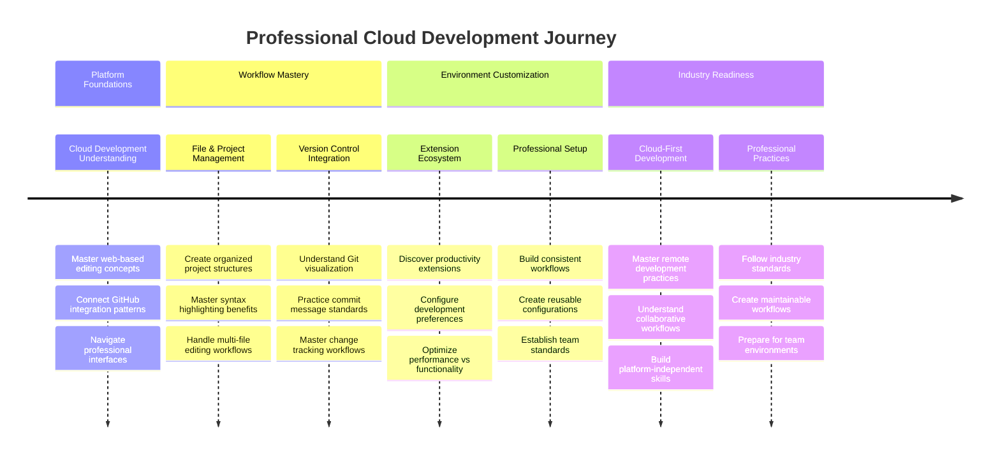

<!--
CO_OP_TRANSLATOR_METADATA:
{
  "original_hash": "a9a3bcc037a447e2d8994d99e871cd9f",
  "translation_date": "2025-11-03T12:56:53+00:00",
  "source_file": "8-code-editor/1-using-a-code-editor/README.md",
  "language_code": "ur"
}
-->
# کوڈ ایڈیٹر کا استعمال: VSCode.dev میں مہارت حاصل کریں

یاد کریں *دی میٹرکس* میں جب نیو کو ڈیجیٹل دنیا تک رسائی کے لیے ایک بڑے کمپیوٹر ٹرمینل میں پلگ ان کرنا پڑا تھا؟ آج کے ویب ڈیولپمنٹ ٹولز اس کے بالکل برعکس ہیں – ناقابل یقین حد تک طاقتور صلاحیتیں جو کہیں بھی دستیاب ہیں۔ VSCode.dev ایک براؤزر پر مبنی کوڈ ایڈیٹر ہے جو پیشہ ورانہ ترقی کے ٹولز کو کسی بھی انٹرنیٹ کنکشن والے ڈیوائس پر لے آتا ہے۔

جیسے پرنٹنگ پریس نے کتابوں کو سب کے لیے قابل رسائی بنایا، نہ کہ صرف خانقاہوں میں لکھنے والوں کے لیے، VSCode.dev کوڈنگ کو جمہوری بناتا ہے۔ آپ لائبریری کمپیوٹر، اسکول لیب، یا کہیں بھی جہاں براؤزر تک رسائی ہو، پر پروجیکٹس پر کام کر سکتے ہیں۔ کوئی انسٹالیشن نہیں، کوئی "مجھے اپنی مخصوص سیٹ اپ کی ضرورت ہے" کی پابندیاں نہیں۔

اس سبق کے اختتام تک، آپ سمجھ جائیں گے کہ VSCode.dev کو کیسے نیویگیٹ کرنا ہے، GitHub ریپوزیٹریز کو براہ راست اپنے براؤزر میں کھولنا ہے، اور Git کو ورژن کنٹرول کے لیے استعمال کرنا ہے – وہ تمام مہارتیں جن پر پیشہ ورانہ ڈویلپرز روزانہ انحصار کرتے ہیں۔

## ⚡ اگلے 5 منٹ میں آپ کیا کر سکتے ہیں

**مصروف ڈویلپرز کے لیے فوری آغاز کا راستہ**


- **پہلا منٹ**: [vscode.dev](https://vscode.dev) پر جائیں - کوئی انسٹالیشن کی ضرورت نہیں
- **دوسرا منٹ**: اپنے ریپوزیٹریز کو کنیکٹ کرنے کے لیے GitHub کے ساتھ سائن ان کریں
- **تیسرا منٹ**: URL ٹرک آزمائیں: کسی بھی ریپو URL میں `github.com` کو `vscode.dev/github` میں تبدیل کریں
- **چوتھا منٹ**: ایک نئی فائل بنائیں اور دیکھیں کہ syntax highlighting خود بخود کام کرتا ہے
- **پانچواں منٹ**: ایک تبدیلی کریں اور اسے سورس کنٹرول پینل کے ذریعے کمیٹ کریں

**فوری ٹیسٹ URL**:
```
# Transform this:
github.com/microsoft/Web-Dev-For-Beginners

# Into this:
vscode.dev/github/microsoft/Web-Dev-For-Beginners
```

**یہ کیوں اہم ہے**: 5 منٹ میں، آپ پیشہ ورانہ ٹولز کے ساتھ کہیں بھی کوڈنگ کی آزادی کا تجربہ کریں گے۔ یہ ترقی کا مستقبل ہے - قابل رسائی، طاقتور، اور فوری۔

## 🗺️ کلاؤڈ پر مبنی ترقی کے ذریعے آپ کا سیکھنے کا سفر



**آپ کے سفر کا مقصد**: اس سبق کے اختتام تک، آپ کسی بھی ڈیوائس سے کام کرنے والے پیشہ ورانہ کلاؤڈ ڈیولپمنٹ ماحول میں مہارت حاصل کر لیں گے، جو آپ کو بڑے ٹیک کمپنیوں کے ڈویلپرز کے استعمال کردہ ٹولز کے ساتھ کوڈ کرنے کے قابل بنائے گا۔

## آپ کیا سیکھیں گے

جب ہم اس کے ذریعے چلیں گے، آپ یہ کرنے کے قابل ہوں گے:

- VSCode.dev کو ایسے نیویگیٹ کریں جیسے یہ آپ کا دوسرا گھر ہو – بغیر گم ہوئے وہ سب کچھ تلاش کریں جس کی آپ کو ضرورت ہو
- کسی بھی GitHub ریپوزیٹری کو اپنے براؤزر میں کھولیں اور فوراً ایڈیٹنگ شروع کریں (یہ واقعی جادوئی ہے!)
- Git کا استعمال کرتے ہوئے اپنی تبدیلیوں کو ٹریک کریں اور اپنی پیشرفت کو پرو کی طرح محفوظ کریں
- اپنے ایڈیٹر کو ایکسٹینشنز کے ساتھ سپرچارج کریں جو کوڈنگ کو تیز اور مزیدار بناتے ہیں
- پروجیکٹ فائلز کو اعتماد کے ساتھ بنائیں اور منظم کریں

## آپ کو کیا ضرورت ہوگی

ضروریات سیدھی ہیں:

- ایک مفت [GitHub اکاؤنٹ](https://github.com) (اگر ضرورت ہو تو ہم آپ کو تخلیق کے ذریعے رہنمائی کریں گے)
- ویب براؤزرز کی بنیادی واقفیت
- GitHub Basics سبق مفید پس منظر فراہم کرتا ہے، حالانکہ یہ ضروری نہیں ہے

> 💡 **GitHub میں نئے ہیں؟** اکاؤنٹ بنانا مفت ہے اور چند منٹ لگتے ہیں۔ جیسے لائبریری کارڈ آپ کو دنیا بھر کی کتابوں تک رسائی دیتا ہے، ویسے ہی GitHub اکاؤنٹ آپ کو انٹرنیٹ پر کوڈ ریپوزیٹریز کے دروازے کھول دیتا ہے۔

## 🧠 کلاؤڈ ڈیولپمنٹ ایکو سسٹم کا جائزہ



**بنیادی اصول**: کلاؤڈ پر مبنی ترقی کے ماحول کوڈنگ کا مستقبل ہیں - پیشہ ورانہ گریڈ کے ٹولز فراہم کرتے ہیں جو قابل رسائی، تعاون پر مبنی، اور پلیٹ فارم سے آزاد ہیں۔

## ویب پر مبنی کوڈ ایڈیٹرز کیوں اہم ہیں

انٹرنیٹ سے پہلے، مختلف یونیورسٹیوں کے سائنسدان آسانی سے تحقیق کا تبادلہ نہیں کر سکتے تھے۔ پھر 1960 کی دہائی میں ARPANET آیا، جو فاصلے پر کمپیوٹرز کو جوڑتا تھا۔ ویب پر مبنی کوڈ ایڈیٹرز اسی اصول پر عمل کرتے ہیں – طاقتور ٹولز کو قابل رسائی بناتے ہیں چاہے آپ کی جسمانی جگہ یا ڈیوائس کچھ بھی ہو۔

کوڈ ایڈیٹر آپ کی ترقی کا ورک اسپیس ہے، جہاں آپ کوڈ فائلز لکھتے، ایڈٹ کرتے اور منظم کرتے ہیں۔ سادہ ٹیکسٹ ایڈیٹرز کے برعکس، پیشہ ورانہ کوڈ ایڈیٹرز syntax highlighting، error detection، اور پروجیکٹ مینجمنٹ کی خصوصیات فراہم کرتے ہیں۔

VSCode.dev یہ صلاحیتیں آپ کے براؤزر میں لاتا ہے:

**ویب پر مبنی ایڈیٹنگ کے فوائد:**

| خصوصیت | وضاحت | عملی فائدہ |
|---------|-------------|----------|
| **پلیٹ فارم کی آزادی** | کسی بھی براؤزر والے ڈیوائس پر چلتا ہے | مختلف کمپیوٹرز سے بغیر کسی رکاوٹ کے کام کریں |
| **انسٹالیشن کی ضرورت نہیں** | ویب URL کے ذریعے رسائی | سافٹ ویئر انسٹالیشن کی پابندیوں کو نظرانداز کریں |
| **خودکار اپڈیٹس** | ہمیشہ تازہ ترین ورژن پر چلتا ہے | دستی اپڈیٹس کے بغیر نئی خصوصیات تک رسائی |
| **ریپوزیٹری انٹیگریشن** | GitHub سے براہ راست کنکشن | مقامی فائل مینجمنٹ کے بغیر کوڈ ایڈٹ کریں |

**عملی اثرات:**
- مختلف ماحول میں کام کرنے کا تسلسل
- آپریٹنگ سسٹم سے قطع نظر مستقل انٹرفیس
- فوری تعاون کی صلاحیتیں
- مقامی اسٹوریج کی ضروریات میں کمی

## VSCode.dev کو دریافت کرنا

جیسے میری کیوری کی لیبارٹری میں ایک نسبتاً سادہ جگہ میں نفیس آلات موجود تھے، VSCode.dev پیشہ ورانہ ترقی کے ٹولز کو ایک براؤزر انٹرفیس میں پیک کرتا ہے۔ یہ ویب ایپلیکیشن ڈیسک ٹاپ کوڈ ایڈیٹرز کی طرح بنیادی فعالیت فراہم کرتی ہے۔

شروع کریں [vscode.dev](https://vscode.dev) پر اپنے براؤزر میں جا کر۔ انٹرفیس بغیر کسی ڈاؤن لوڈ یا سسٹم انسٹالیشن کے لوڈ ہوتا ہے – کلاؤڈ کمپیوٹنگ اصولوں کا براہ راست اطلاق۔

### اپنے GitHub اکاؤنٹ کو کنیکٹ کرنا

جیسے الیگزینڈر گراہم بیل کا ٹیلیفون دور دراز مقامات کو جوڑتا تھا، آپ کے GitHub اکاؤنٹ کو لنک کرنا VSCode.dev کو آپ کے کوڈ ریپوزیٹریز کے ساتھ جوڑتا ہے۔ جب آپ کو GitHub کے ساتھ سائن ان کرنے کا کہا جائے، تو اس کنکشن کو قبول کرنا تجویز کیا جاتا ہے۔

**GitHub انٹیگریشن فراہم کرتا ہے:**
- ایڈیٹر کے اندر آپ کے ریپوزیٹریز تک براہ راست رسائی
- مختلف ڈیوائسز پر سیٹنگز اور ایکسٹینشنز کی ہم آہنگی
- GitHub پر محفوظ کرنے کا آسان ورک فلو
- ذاتی نوعیت کا ترقیاتی ماحول

### اپنے نئے ورک اسپیس کو جاننا

جب سب کچھ لوڈ ہو جائے، تو آپ ایک خوبصورت صاف ورک اسپیس دیکھیں گے جو آپ کو اس پر مرکوز رکھنے کے لیے ڈیزائن کیا گیا ہے جو اہم ہے – آپ کا کوڈ!



**یہاں آپ کے علاقے کا دورہ ہے:**
- **ایکٹیویٹی بار** (بائیں طرف کی پٹی): آپ کی مرکزی نیویگیشن جس میں ایکسپلورر 📁، سرچ 🔍، سورس کنٹرول 🌿، ایکسٹینشنز 🧩، اور سیٹنگز ⚙️ شامل ہیں
- **سائیڈبار** (اس کے ساتھ والا پینل): آپ کے منتخب کردہ کے مطابق متعلقہ معلومات دکھانے کے لیے تبدیل ہوتا ہے
- **ایڈیٹر ایریا** (درمیان میں بڑی جگہ): یہ وہ جگہ ہے جہاں جادو ہوتا ہے – آپ کا مرکزی کوڈنگ ایریا

**ایک لمحہ نکال کر دریافت کریں:**
- ان ایکٹیویٹی بار آئیکنز پر کلک کریں اور دیکھیں کہ ہر ایک کیا کرتا ہے
- نوٹ کریں کہ سائیڈبار مختلف معلومات دکھانے کے لیے کیسے اپ ڈیٹ ہوتا ہے – کافی دلچسپ، ہے نا؟
- ایکسپلورر ویو (📁) شاید وہ جگہ ہے جہاں آپ اپنا زیادہ وقت گزاریں گے، اس لیے اس کے ساتھ آرام دہ ہو جائیں



## GitHub ریپوزیٹریز کھولنا

انٹرنیٹ سے پہلے، محققین کو دستاویزات تک رسائی کے لیے لائبریریوں کا جسمانی سفر کرنا پڑتا تھا۔ GitHub ریپوزیٹریز اسی طرح کام کرتے ہیں – یہ دور سے محفوظ کوڈ کے مجموعے ہیں۔ VSCode.dev روایتی مرحلے کو ختم کرتا ہے جس میں ایڈیٹنگ سے پہلے ریپوزیٹریز کو اپنے مقامی مشین پر ڈاؤن لوڈ کرنا شامل ہوتا ہے۔

یہ صلاحیت کسی بھی عوامی ریپوزیٹری تک فوری رسائی کو دیکھنے، ایڈیٹنگ، یا تعاون کے لیے فعال کرتی ہے۔ ریپوزیٹریز کھولنے کے دو طریقے ہیں:

### طریقہ 1: پوائنٹ اینڈ کلک کا طریقہ

یہ اس وقت بہترین ہے جب آپ VSCode.dev میں تازہ آغاز کر رہے ہوں اور کسی مخصوص ریپوزیٹری کو کھولنا چاہتے ہوں۔ یہ سیدھا اور ابتدائی دوستانہ ہے:

**یہ کرنے کا طریقہ:**

1. [vscode.dev](https://vscode.dev) پر جائیں اگر آپ پہلے سے وہاں نہیں ہیں
2. ویلکم اسکرین پر "اوپن ریموٹ ریپوزیٹری" بٹن تلاش کریں اور اس پر کلک کریں

   

3. کسی بھی GitHub ریپوزیٹری URL کو پیسٹ کریں (اسے آزمائیں: `https://github.com/microsoft/Web-Dev-For-Beginners`)
4. انٹر دبائیں اور جادو دیکھیں!

**پرو ٹپ - کمانڈ پیلیٹ شارٹ کٹ:**

کیا آپ کوڈنگ کے جادوگر کی طرح محسوس کرنا چاہتے ہیں؟ یہ کی بورڈ شارٹ کٹ آزمائیں: Ctrl+Shift+P (یا Mac پر Cmd+Shift+P) کمانڈ پیلیٹ کھولنے کے لیے:



**کمانڈ پیلیٹ ایسا ہے جیسے آپ کے پاس ہر چیز کے لیے سرچ انجن ہو:**
- "اوپن ریموٹ" ٹائپ کریں اور یہ آپ کے لیے ریپوزیٹری اوپنر تلاش کرے گا
- یہ حال ہی میں کھولی گئی ریپوزیٹریز کو یاد رکھتا ہے (بہت مفید!)
- ایک بار جب آپ اس کے عادی ہو جائیں، تو آپ کو لگے گا کہ آپ روشنی کی رفتار سے کوڈنگ کر رہے ہیں
- یہ بنیادی طور پر VSCode.dev کا "ہیے سری، لیکن کوڈنگ کے لیے" ورژن ہے

### طریقہ 2: URL موڈیفیکیشن تکنیک

جیسے HTTP اور HTTPS مختلف پروٹوکول استعمال کرتے ہیں جبکہ ایک ہی ڈومین ڈھانچے کو برقرار رکھتے ہیں، VSCode.dev ایک URL پیٹرن استعمال کرتا ہے جو GitHub کے ایڈریسنگ سسٹم کی عکاسی کرتا ہے۔ کسی بھی GitHub ریپوزیٹری URL کو براہ راست VSCode.dev میں کھولنے کے لیے تبدیل کیا جا سکتا ہے۔

**URL تبدیلی کا پیٹرن:**

| ریپوزیٹری کی قسم | GitHub URL | VSCode.dev URL |
|----------------|---------------------|----------------|
| **عوامی ریپوزیٹری** | `github.com/microsoft/Web-Dev-For-Beginners` | `vscode.dev/github/microsoft/Web-Dev-For-Beginners` |
| **ذاتی پروجیکٹ** | `github.com/your-username/my-project` | `vscode.dev/github/your-username/my-project` |
| **کوئی بھی قابل رسائی ریپو** | `github.com/their-username/awesome-repo` | `vscode.dev/github/their-username/awesome-repo` |

**عملدرآمد:**
- `github.com` کو `vscode.dev/github` سے تبدیل کریں
- تمام دیگر URL اجزاء کو بغیر تبدیلی کے برقرار رکھیں
- کسی بھی عوامی طور پر قابل رسائی ریپوزیٹری کے ساتھ کام کرتا ہے
- فوری ایڈیٹنگ تک رسائی فراہم کرتا ہے

> 💡 **زندگی بدلنے والی ٹپ**: اپنے پسندیدہ ریپوزیٹریز کے VSCode.dev ورژنز کو بک مارک کریں۔ میرے پاس "ایڈٹ مائی پورٹ فولیو" اور "فکس ڈاکیومینٹیشن" جیسے بک مارکس ہیں جو مجھے سیدھے ایڈیٹنگ موڈ میں لے جاتے ہیں!

**آپ کو کون سا طریقہ استعمال کرنا چاہیے؟**
- **انٹرفیس کا طریقہ**: جب آپ دریافت کر رہے ہوں یا ریپوزیٹری کے ناموں کو یاد نہ کر سکیں تو بہترین ہے
- **URL ٹرک**: جب آپ کو بالکل معلوم ہو کہ آپ کہاں جا رہے ہیں تو بجلی کی رفتار سے رسائی کے لیے بہترین ہے

### 🎯 تعلیمی جائزہ: کلاؤڈ ڈیولپمنٹ تک رسائی

**رکیں اور غور کریں**: آپ نے ابھی ویب براؤزر کے ذریعے کوڈ ریپوزیٹریز تک رسائی کے دو طریقے سیکھے ہیں۔ یہ ترقی کے کام کرنے کے طریقے میں ایک بنیادی تبدیلی کی نمائندگی کرتا ہے۔

**فوری خود تشخیص**:
- کیا آپ وضاحت کر سکتے ہیں کہ ویب پر مبنی ایڈیٹنگ روایتی "ترقیاتی ماحول کی سیٹ اپ" کو کیوں ختم کرتی ہے؟
- URL موڈیفیکیشن تکنیک مقامی git کلوننگ کے مقابلے میں کیا فوائد فراہم کرتی ہے؟
- یہ نقطہ نظر آپ کو اوپن سورس پروجیکٹس میں تعاون کرنے کے طریقے کو کیسے بدل سکتا ہے؟

**حقیقی دنیا کا تعلق**: GitHub، GitLab، اور Replit جیسی بڑی کمپنیاں ان کلاؤڈ فرسٹ اصولوں کے ارد گرد اپنے ترقیاتی پلیٹ فارمز بنائی ہیں۔ آپ وہی ورک فلو سیکھ رہے ہیں جو دنیا بھر کی پیشہ ورانہ ترقیاتی ٹیمیں استعمال کرتی ہیں۔

**چیلنج سوال**: کلاؤڈ پر مبنی ترقی کوڈنگ کو اسکولوں میں سکھانے کے طریقے کو کیسے بدل سکتی ہے؟ ڈیوائس کی ضروریات، سافٹ ویئر مینجمنٹ، اور تعاون کے امکانات پر غور کریں۔

## فائلز اور پروجیکٹس کے ساتھ کام کرنا

اب جب کہ آپ نے ایک ریپوزیٹری کھول لی ہے، آئیے تعمیر شروع کریں! VSCode.dev آپ کو کوڈ فائلز بنانے، ایڈٹ کرنے، اور منظم کرنے کے لیے ہر چیز فراہم کرتا ہے۔ اسے اپنے ڈیجیٹل ورکشاپ کے طور پر سوچیں – ہر ٹول وہیں ہے جہاں آپ کو اس کی ضرورت ہے۔

آئیے روزمرہ کے کاموں میں غوطہ لگائیں جو آپ کے کوڈنگ ورک فلو کا زیادہ تر حصہ بنائیں گے۔

### نئی فائلز بنانا

جیسے کسی معمار کے دفتر میں بلیو پرنٹس کو منظم کرنا، VSCode.dev میں فائل بنانا ایک منظم طریقہ کار کی پیروی کرتا ہے۔ یہ نظام تمام معیاری ویب ڈیولپمنٹ فائل اقسام کی حمایت کرتا ہے۔

**فائل بنانے کا عمل:**

1. ایکسپلورر سائیڈبار میں ہدف فولڈر پر جائیں
2. فولڈر کے نام پر ہوور کریں تاکہ "نئی فائل" آئیکن (📄+) ظاہر ہو
3. مناسب ایکسٹینشن سمیت فائل کا نام درج کریں (`style.css`, `script.js`, `index.html`)
4. فائل بنانے کے لیے انٹر دبائیں



**نام رکھنے کے اصول:**
- وضاحتی نام استعمال کریں جو فائل کے مقصد کی نشاندہی کریں
- مناسب syntax highlighting کے لیے فائل ایکسٹینشنز شامل کریں
- پروجیکٹس کے دوران مستقل نام رکھنے کے نمونوں پر عمل کریں
- اسپیسز کے بجائے چھوٹے حروف اور ہائفنز استعمال کریں

### فائلز کو ایڈٹ اور محفوظ کرنا

یہ وہ جگہ ہے جہاں اصل مزہ شروع ہوتا ہے! VSCode.dev کا ایڈیٹر مددگار خصوصیات سے بھرا ہوا ہے جو کوڈنگ کو ہموار اور بدیہی بناتا ہے۔ یہ ایسا ہے جیسے آپ کے پاس کوڈ کے لیے ایک بہت ہی ہوشیار لکھنے والا معاون ہو۔

**آپ کا ایڈیٹنگ ورک فلو:**

1. ایکسپلورر میں کسی بھی فائل پر کلک کریں تاکہ اسے مین ایریا میں کھولا جا سکے
2. ٹائپ کرنا شروع کریں اور دیکھیں کہ VSCode.dev آپ کی مدد کیسے کرتا ہے رنگوں، تجاویز، اور غلطیوں کی نشاندہی کے ساتھ

- اس بات کو یقینی بنائیں کہ آپ اپنے تمام مرحلہ وار تبدیلیوں سے مطمئن ہیں  
- ایک مختصر نوٹ لکھیں جس میں وضاحت کریں کہ آپ نے کیا کیا (یہ آپ کا "commit message" ہے)  
- سب کچھ GitHub پر محفوظ کرنے کے لیے چیک مارک بٹن پر کلک کریں  
- اگر آپ کسی چیز کے بارے میں اپنا ارادہ بدلتے ہیں، تو انڈو آئیکن آپ کو تبدیلیاں ختم کرنے دیتا ہے  

**اچھے commit messages لکھنا (یہ اتنا آسان ہے جتنا آپ سوچتے ہیں!):**  
- بس وضاحت کریں کہ آپ نے کیا کیا، جیسے "رابطہ فارم شامل کریں" یا "خراب نیویگیشن درست کریں"  
- اسے مختصر اور جامع رکھیں – ٹویٹ کی لمبائی سوچیں، مضمون نہیں  
- ایکشن الفاظ سے شروع کریں جیسے "شامل کریں"، "درست کریں"، "اپ ڈیٹ کریں"، یا "ہٹائیں"  
- **اچھے مثالیں**: "ریسپانسیو نیویگیشن مینو شامل کریں"، "موبائل لے آؤٹ کے مسائل درست کریں"، "بہتر رسائی کے لیے رنگ اپ ڈیٹ کریں"  

> 💡 **جلدی نیویگیشن کا مشورہ**: اوپر بائیں جانب ہیمبرگر مینو (☰) استعمال کریں تاکہ آپ اپنے GitHub ریپوزیٹری پر واپس جا سکیں اور اپنی محفوظ کردہ تبدیلیاں آن لائن دیکھ سکیں۔ یہ آپ کے ایڈیٹنگ ماحول اور آپ کے پروجیکٹ کے GitHub ہوم کے درمیان ایک پورٹل کی طرح ہے!  

## ایکسٹینشنز کے ساتھ فعالیت کو بہتر بنانا  

جیسے کسی کاریگر کی ورکشاپ میں مختلف کاموں کے لیے خصوصی آلات ہوتے ہیں، VSCode.dev کو ایکسٹینشنز کے ذریعے اپنی مرضی کے مطابق بنایا جا سکتا ہے جو مخصوص صلاحیتیں شامل کرتے ہیں۔ یہ کمیونٹی کے تیار کردہ پلگ ان عام ترقیاتی ضروریات جیسے کوڈ فارمیٹنگ، لائیو پریویو، اور بہتر Git انٹیگریشن کو حل کرتے ہیں۔  

ایکسٹینشن مارکیٹ پلیس میں دنیا بھر کے ڈویلپرز کے بنائے گئے ہزاروں مفت ٹولز موجود ہیں۔ ہر ایکسٹینشن خاص ورک فلو چیلنجز کو حل کرتی ہے، جس سے آپ اپنی مخصوص ضروریات اور ترجیحات کے مطابق ایک ذاتی ترقیاتی ماحول بنا سکتے ہیں۔  


  
### اپنی بہترین ایکسٹینشنز تلاش کرنا  

ایکسٹینشن مارکیٹ پلیس واقعی اچھی طرح سے منظم ہے، لہذا آپ کو اپنی ضرورت کی چیز تلاش کرنے میں مشکل نہیں ہوگی۔ یہ آپ کو مخصوص ٹولز اور وہ دلچسپ چیزیں دریافت کرنے میں مدد دینے کے لیے ڈیزائن کیا گیا ہے جن کے بارے میں آپ کو معلوم بھی نہیں تھا!  

**مارکیٹ پلیس تک پہنچنا:**  

1. ایکٹیویٹی بار میں ایکسٹینشنز آئیکن (🧩) پر کلک کریں  
2. ارد گرد براؤز کریں یا کسی خاص چیز کی تلاش کریں  
3. جو دلچسپ لگے اس پر کلک کریں تاکہ اس کے بارے میں مزید جان سکیں  

  

**آپ کو وہاں کیا نظر آئے گا:**  

| سیکشن | اندر کیا ہے | کیوں مددگار ہے |  
|----------|---------|----------|  
| **انسٹال شدہ** | وہ ایکسٹینشنز جو آپ نے پہلے ہی شامل کی ہیں | آپ کا ذاتی کوڈنگ ٹول کٹ |  
| **مقبول** | سب سے زیادہ پسندیدہ | وہ جو زیادہ تر ڈویلپرز پسند کرتے ہیں |  
| **تجویز کردہ** | آپ کے پروجیکٹ کے لیے ہوشیار تجاویز | VSCode.dev کی مددگار تجاویز |  

**براؤزنگ کو آسان بنانے والی چیزیں:**  
- ہر ایکسٹینشن ریٹنگز، ڈاؤن لوڈ کی تعداد، اور حقیقی صارف کے جائزے دکھاتی ہے  
- آپ کو اس کے کام کرنے کی وضاحت اور اسکرین شاٹس ملتے ہیں  
- سب کچھ مطابقت کی معلومات کے ساتھ واضح طور پر نشان زد ہوتا ہے  
- اسی طرح کی ایکسٹینشنز تجویز کی جاتی ہیں تاکہ آپ اختیارات کا موازنہ کر سکیں  

### ایکسٹینشنز انسٹال کرنا (یہ بہت آسان ہے!)  

اپنے ایڈیٹر میں نئی صلاحیتیں شامل کرنا ایک بٹن پر کلک کرنے جتنا آسان ہے۔ ایکسٹینشنز سیکنڈوں میں انسٹال ہو جاتی ہیں اور فوراً کام شروع کر دیتی ہیں – کوئی ری اسٹارٹ نہیں، کوئی انتظار نہیں۔  

**یہ کرنے کے لیے آپ کو بس یہ کرنا ہے:**  

1. جو آپ چاہتے ہیں اس کی تلاش کریں (جیسے "لائیو سرور" یا "پریٹیر" تلاش کریں)  
2. جو اچھا لگے اس پر کلک کریں تاکہ مزید تفصیلات دیکھ سکیں  
3. اس کے کام کرنے کی وضاحت پڑھیں اور ریٹنگز چیک کریں  
4. نیلے "انسٹال" بٹن پر کلک کریں اور آپ کا کام ہو گیا!  

  

**پس پردہ کیا ہوتا ہے:**  
- ایکسٹینشن خود بخود ڈاؤن لوڈ اور سیٹ اپ ہو جاتی ہے  
- نئی خصوصیات فوراً آپ کے انٹرفیس میں ظاہر ہوتی ہیں  
- سب کچھ فوراً کام کرنا شروع کر دیتا ہے (واقعی، یہ اتنا تیز ہے!)  
- اگر آپ سائن ان ہیں، تو ایکسٹینشن آپ کے تمام ڈیوائسز پر ہم آہنگ ہو جاتی ہے  

**کچھ ایکسٹینشنز جو میں شروع کرنے کے لیے تجویز کروں گا:**  
- **لائیو سرور**: اپنی ویب سائٹ کو حقیقی وقت میں اپ ڈیٹ ہوتے دیکھیں جب آپ کوڈ لکھتے ہیں (یہ جادوئی ہے!)  
- **پریٹیر**: آپ کے کوڈ کو خود بخود صاف اور پیشہ ورانہ بناتا ہے  
- **آٹو رینیم ٹیگ**: ایک HTML ٹیگ تبدیل کریں اور اس کا ساتھی بھی اپ ڈیٹ ہو جائے  
- **بریکٹ پیر کلرائزر**: آپ کے بریکٹس کو رنگین کوڈ کرتا ہے تاکہ آپ کبھی نہ بھٹکیں  
- **GitLens**: آپ کے Git خصوصیات کو بہت زیادہ معلومات کے ساتھ طاقتور بناتا ہے  

### اپنی ایکسٹینشنز کو حسب ضرورت بنانا  

زیادہ تر ایکسٹینشنز کے ساتھ سیٹنگز آتی ہیں جنہیں آپ اپنی پسند کے مطابق ایڈجسٹ کر سکتے ہیں۔ اسے ایک کار میں سیٹ اور آئینے کو ایڈجسٹ کرنے کی طرح سمجھیں – ہر کسی کی اپنی ترجیحات ہوتی ہیں!  

**ایکسٹینشن سیٹنگز کو ایڈجسٹ کرنا:**  

1. ایکسٹینشنز پینل میں اپنی انسٹال شدہ ایکسٹینشن تلاش کریں  
2. اس کے نام کے ساتھ چھوٹے گیئر آئیکن (⚙️) کو دیکھیں اور اس پر کلک کریں  
3. ڈراپ ڈاؤن سے "ایکسٹینشن سیٹنگز" منتخب کریں  
4. چیزوں کو ایڈجسٹ کریں جب تک کہ وہ آپ کے ورک فلو کے لیے بالکل صحیح محسوس نہ ہوں  

  

**عام چیزیں جو آپ ایڈجسٹ کرنا چاہیں گے:**  
- آپ کا کوڈ کیسے فارمیٹ ہوتا ہے (ٹیبز بمقابلہ اسپیسز، لائن کی لمبائی، وغیرہ)  
- کون سے کی بورڈ شارٹ کٹس مختلف اعمال کو متحرک کرتے ہیں  
- کون سے فائل ٹائپس کے ساتھ ایکسٹینشن کام کرے  
- مخصوص خصوصیات کو آن یا آف کرنا تاکہ چیزیں صاف رہیں  

### اپنی ایکسٹینشنز کو منظم رکھنا  

جب آپ مزید دلچسپ ایکسٹینشنز دریافت کرتے ہیں، تو آپ اپنی کلیکشن کو صاف ستھرا اور ہموار رکھنا چاہیں گے۔ VSCode.dev اسے منظم کرنے میں واقعی آسان بناتا ہے۔  

**آپ کی ایکسٹینشن مینجمنٹ کے اختیارات:**  

| آپ کیا کر سکتے ہیں | کب مددگار ہے | پرو ٹپ |  
|--------|---------|----------|  
| **غیر فعال کریں** | جانچنا کہ آیا کوئی ایکسٹینشن مسائل پیدا کر رہی ہے | اسے ان انسٹال کرنے سے بہتر ہے اگر آپ اسے واپس چاہتے ہیں |  
| **ان انسٹال کریں** | وہ ایکسٹینشنز مکمل طور پر ہٹانا جو آپ کو ضرورت نہیں | اپنے ماحول کو صاف اور تیز رکھتا ہے |  
| **اپ ڈیٹ کریں** | تازہ ترین خصوصیات اور بگ فکسز حاصل کرنا | عام طور پر خود بخود ہوتا ہے، لیکن چیک کرنا اچھا ہے |  

**میں اپنی ایکسٹینشنز کو کیسے منظم کرتا ہوں:**  
- ہر چند مہینے میں، میں نے جو انسٹال کیا ہے اس کا جائزہ لیتا ہوں اور وہ ہٹا دیتا ہوں جو میں استعمال نہیں کر رہا  
- میں ایکسٹینشنز کو اپ ڈیٹ رکھتا ہوں تاکہ مجھے تازہ ترین بہتری اور سیکیورٹی فکسز ملیں  
- اگر کچھ سست لگتا ہے، تو میں عارضی طور پر ایکسٹینشنز کو غیر فعال کرتا ہوں تاکہ دیکھ سکوں کہ آیا ان میں سے کوئی مسئلہ پیدا کر رہا ہے  
- جب ایکسٹینشنز کو بڑے اپ ڈیٹس ملتے ہیں، تو میں اپ ڈیٹ نوٹس پڑھتا ہوں – کبھی کبھی وہاں کچھ زبردست نئی خصوصیات ہوتی ہیں!  

> ⚠️ **کارکردگی کا مشورہ**: ایکسٹینشنز زبردست ہیں، لیکن بہت زیادہ ہونے سے چیزیں سست ہو سکتی ہیں۔ ان پر توجہ مرکوز کریں جو واقعی آپ کی زندگی کو آسان بناتے ہیں اور ان انسٹال کرنے سے نہ گھبرائیں جنہیں آپ کبھی استعمال نہیں کرتے۔  

### 🎯 تعلیمی جائزہ: ترقیاتی ماحول کی حسب ضرورت  

**معماری کی سمجھ**: آپ نے کمیونٹی کے تیار کردہ ایکسٹینشنز کا استعمال کرتے ہوئے ایک پیشہ ور ترقیاتی ماحول کو اپنی مرضی کے مطابق بنانا سیکھا۔ یہ آئینہ دار ہے کہ کس طرح انٹرپرائز ترقیاتی ٹیمیں معیاری ٹول چینز بناتی ہیں۔  

**کلیدی تصورات میں مہارت حاصل کی گئی:**  
- **ایکسٹینشن دریافت**: ایسے ٹولز تلاش کرنا جو مخصوص ترقیاتی چیلنجز کو حل کرتے ہیں  
- **ماحول کی ترتیب**: ذاتی یا ٹیم کی ترجیحات کے مطابق ٹولز کو اپنی مرضی کے مطابق بنانا  
- **کارکردگی کی اصلاح**: فعالیت اور نظام کی کارکردگی کے درمیان توازن قائم کرنا  
- **کمیونٹی تعاون**: عالمی ڈویلپر کمیونٹی کے بنائے گئے ٹولز کا فائدہ اٹھانا  

**صنعتی تعلق**: ایکسٹینشن ایکوسسٹمز بڑے ترقیاتی پلیٹ فارمز جیسے VS Code، Chrome DevTools، اور جدید IDEs کو طاقت دیتے ہیں۔ ایکسٹینشنز کا جائزہ لینا، انسٹال کرنا، اور ترتیب دینا پیشہ ورانہ ترقیاتی ورک فلو کے لیے ضروری ہے۔  

**عکاسی کا سوال**: آپ 10 ڈویلپرز کی ٹیم کے لیے ایک معیاری ترقیاتی ماحول قائم کرنے کے لیے کس طرح رجوع کریں گے؟ مستقل مزاجی، کارکردگی، اور انفرادی ترجیحات پر غور کریں۔  

## 📈 آپ کی کلاؤڈ ترقیاتی مہارت کا ٹائم لائن  


  
**🎓 گریجویشن سنگ میل**: آپ نے کامیابی سے کلاؤڈ پر مبنی ترقی میں مہارت حاصل کر لی ہے، وہی ٹولز اور ورک فلو استعمال کرتے ہوئے جو بڑے ٹیک کمپنیوں کے پیشہ ور ڈویلپرز استعمال کرتے ہیں۔ یہ مہارتیں سافٹ ویئر ترقی کے مستقبل کی نمائندگی کرتی ہیں۔  

**🔄 اگلے درجے کی صلاحیتیں:**  
- جدید کلاؤڈ ترقیاتی پلیٹ فارمز (Codespaces، GitPod) کو دریافت کرنے کے لیے تیار  
- تقسیم شدہ ترقیاتی ٹیموں میں کام کرنے کے لیے تیار  
- عالمی سطح پر اوپن سورس پروجیکٹس میں تعاون کرنے کے لیے تیار  
- جدید DevOps اور مسلسل انٹیگریشن کے طریقوں کے لیے بنیاد قائم  

## GitHub Copilot ایجنٹ چیلنج 🚀  

جیسے NASA خلائی مشن کے لیے منظم طریقہ کار استعمال کرتا ہے، یہ چیلنج VSCode.dev مہارتوں کو مکمل ورک فلو منظرنامے میں منظم طریقے سے لاگو کرنے پر مشتمل ہے۔  

**مقصد:** VSCode.dev کے ساتھ مہارت کا مظاہرہ کرتے ہوئے ایک جامع ویب ترقیاتی ورک فلو قائم کریں۔  

**پروجیکٹ کی ضروریات:** ایجنٹ موڈ کی مدد سے، یہ کام مکمل کریں:  
1. موجودہ ریپوزیٹری کو فورک کریں یا نیا بنائیں  
2. HTML، CSS، اور JavaScript فائلوں کے ساتھ ایک فعال پروجیکٹ ڈھانچہ قائم کریں  
3. تین ترقیاتی صلاحیتوں کو بڑھانے والی ایکسٹینشنز انسٹال اور ترتیب دیں  
4. وضاحتی commit messages کے ساتھ ورژن کنٹرول کی مشق کریں  
5. فیچر برانچ کی تخلیق اور ترمیم کے ساتھ تجربہ کریں  
6. README.md فائل میں عمل اور سیکھنے کو دستاویز کریں  

یہ مشق تمام VSCode.dev تصورات کو ایک عملی ورک فلو میں یکجا کرتی ہے جو مستقبل کے ترقیاتی پروجیکٹس پر لاگو کی جا سکتی ہے۔  

مزید جانیں [ایجنٹ موڈ](https://code.visualstudio.com/blogs/2025/02/24/introducing-copilot-agent-mode) کے بارے میں یہاں۔  

## اسائنمنٹ  

وقت آگیا ہے کہ ان مہارتوں کو حقیقی آزمائش کے لیے لے جائیں! میرے پاس ایک عملی پروجیکٹ ہے جو آپ کو سب کچھ مشق کرنے دے گا: [VSCode.dev کا استعمال کرتے ہوئے ایک ریزیومے ویب سائٹ بنائیں](./assignment.md)  

یہ اسائنمنٹ آپ کو مکمل طور پر اپنے براؤزر میں ایک پیشہ ورانہ ریزیومے ویب سائٹ بنانے کے عمل سے گزرتا ہے۔ آپ ان تمام VSCode.dev خصوصیات کا استعمال کریں گے جن کا ہم نے جائزہ لیا ہے، اور آخر میں، آپ کے پاس ایک شاندار نظر آنے والی ویب سائٹ اور اپنے نئے ورک فلو میں مضبوط اعتماد ہوگا۔  

## اپنی مہارتوں کو دریافت کرتے رہیں اور بڑھائیں  

آپ کے پاس اب ایک مضبوط بنیاد ہے، لیکن دریافت کرنے کے لیے ابھی بہت کچھ دلچسپ چیزیں ہیں! یہاں کچھ وسائل اور خیالات ہیں جو آپ کی VSCode.dev مہارتوں کو اگلے درجے تک لے جانے کے لیے ہیں:  

**بک مارک کرنے کے قابل سرکاری دستاویزات:**  
- [VSCode ویب دستاویزات](https://code.visualstudio.com/docs/editor/vscode-web?WT.mc_id=academic-0000-alfredodeza) – براؤزر پر مبنی ایڈیٹنگ کے لیے مکمل گائیڈ  
- [GitHub Codespaces](https://docs.github.com/en/codespaces) – جب آپ کلاؤڈ میں مزید طاقت چاہتے ہیں  

**اگلے تجربے کے لیے دلچسپ خصوصیات:**  
- **کی بورڈ شارٹ کٹس**: وہ کلیدی کومبوز سیکھیں جو آپ کو کوڈنگ ننجا کی طرح محسوس کریں گے  
- **ورک اسپیس سیٹنگز**: مختلف قسم کے پروجیکٹس کے لیے مختلف ماحول ترتیب دیں  
- **ملٹی روٹ ورک اسپیسز**: ایک ہی وقت میں متعدد ریپوزیٹریز پر کام کریں (بہت مددگار!)  
- **ٹرمینل انٹیگریشن**: اپنے براؤزر میں کمانڈ لائن ٹولز تک رسائی حاصل کریں  

**مشق کے لیے خیالات:**  
- کچھ اوپن سورس پروجیکٹس میں شامل ہوں اور VSCode.dev کا استعمال کرتے ہوئے تعاون کریں – یہ واپس دینے کا ایک بہترین طریقہ ہے!  
- مختلف ایکسٹینشنز آزمائیں تاکہ اپنی بہترین سیٹ اپ تلاش کریں  
- ان قسم کی سائٹس کے لیے پروجیکٹ ٹیمپلیٹس بنائیں جو آپ اکثر بناتے ہیں  
- Git ورک فلو جیسے برانچنگ اور مرجنگ کی مشق کریں – یہ مہارتیں ٹیم پروجیکٹس میں سونے کی طرح ہیں  

---

**آپ نے براؤزر پر مبنی ترقی میں مہارت حاصل کر لی ہے!** 🎉 جیسے پورٹیبل آلات کی ایجاد نے سائنسدانوں کو دور دراز مقامات پر تحقیق کرنے کی اجازت دی، VSCode.dev کسی بھی انٹرنیٹ سے منسلک ڈیوائس سے پیشہ ورانہ کوڈنگ کو ممکن بناتا ہے۔  

یہ مہارتیں موجودہ صنعت کے طریقوں کی عکاسی کرتی ہیں – بہت سے پیشہ ور ڈویلپرز کلاؤڈ پر مبنی ترقیاتی ماحول کو ان کی لچک اور رسائی کے لیے استعمال کرتے ہیں۔ آپ نے ایک ایسا ورک فلو سیکھا ہے جو انفرادی پروجیکٹس سے لے کر بڑی ٹیم کے تعاون تک بڑھتا ہے۔  

اپنی اگلی ترقیاتی پروجیکٹ پر ان تکنیکوں کا اطلاق کریں! 🚀  

---

**ڈسکلیمر**:  
یہ دستاویز AI ترجمہ سروس [Co-op Translator](https://github.com/Azure/co-op-translator) کا استعمال کرتے ہوئے ترجمہ کی گئی ہے۔ ہم درستگی کے لیے کوشش کرتے ہیں، لیکن براہ کرم آگاہ رہیں کہ خودکار ترجمے میں غلطیاں یا غیر درستیاں ہو سکتی ہیں۔ اصل دستاویز کو اس کی اصل زبان میں مستند ذریعہ سمجھا جانا چاہیے۔ اہم معلومات کے لیے، پیشہ ور انسانی ترجمہ کی سفارش کی جاتی ہے۔ ہم اس ترجمے کے استعمال سے پیدا ہونے والی کسی بھی غلط فہمی یا غلط تشریح کے ذمہ دار نہیں ہیں۔