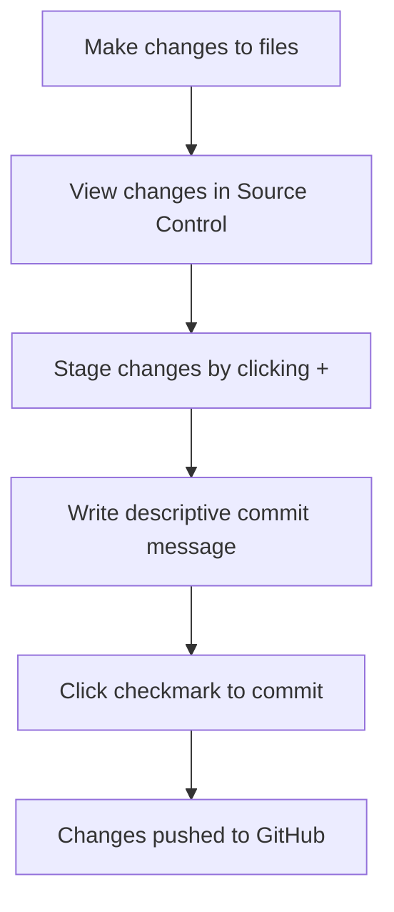

<!--
CO_OP_TRANSLATOR_METADATA:
{
  "original_hash": "cfd4a15974168ca426d50c67682ab9d4",
  "translation_date": "2025-10-22T14:35:27+00:00",
  "source_file": "8-code-editor/1-using-a-code-editor/README.md",
  "language_code": "ur"
}
-->
# کوڈ ایڈیٹر کا استعمال: VSCode.dev میں مہارت حاصل کریں

یاد ہے *دی میٹرکس* میں جب نیو کو ڈیجیٹل دنیا تک رسائی کے لیے ایک بڑے کمپیوٹر ٹرمینل میں پلگ ان کرنا پڑتا تھا؟ آج کے ویب ڈیولپمنٹ ٹولز بالکل مختلف کہانی ہیں – انتہائی طاقتور صلاحیتیں جو کہیں بھی دستیاب ہیں۔ VSCode.dev ایک براؤزر پر مبنی کوڈ ایڈیٹر ہے جو پیشہ ورانہ ترقی کے ٹولز کو کسی بھی انٹرنیٹ کنکشن والے ڈیوائس پر لاتا ہے۔

جیسے پرنٹنگ پریس نے کتابوں کو سب کے لیے قابل رسائی بنایا، نہ کہ صرف خانقاہوں میں رہنے والے لکھاریوں کے لیے، وی ایس کوڈ ڈاٹ ڈی وی کوڈنگ کو جمہوری بناتا ہے۔ آپ لائبریری کمپیوٹر، اسکول لیب، یا کہیں بھی براؤزر تک رسائی کے ساتھ پروجیکٹس پر کام کر سکتے ہیں۔ کوئی انسٹالیشن نہیں، کوئی "مجھے اپنی مخصوص سیٹ اپ کی ضرورت ہے" کی پابندیاں نہیں۔

اس سبق کے اختتام تک، آپ سمجھ جائیں گے کہ VSCode.dev کو کیسے نیویگیٹ کرنا ہے، GitHub ریپوزیٹریز کو براہ راست اپنے براؤزر میں کھولنا ہے، اور Git کو ورژن کنٹرول کے لیے استعمال کرنا ہے – وہ تمام مہارتیں جن پر پیشہ ورانہ ڈویلپرز روزانہ انحصار کرتے ہیں۔

## آپ کیا سیکھیں گے

جب ہم اس کے ذریعے چلیں گے، آپ قابل ہوں گے:

- VSCode.dev کو ایسے نیویگیٹ کریں جیسے یہ آپ کا دوسرا گھر ہو – بغیر گم ہوئے ہر چیز تلاش کریں
- کسی بھی GitHub ریپوزیٹری کو اپنے براؤزر میں کھولیں اور فوراً ایڈیٹنگ شروع کریں (یہ واقعی جادوئی ہے!)
- Git کا استعمال کریں تاکہ اپنی تبدیلیوں کو ٹریک کریں اور اپنی پیشرفت کو پرو کی طرح محفوظ کریں
- اپنے ایڈیٹر کو ایکسٹینشنز کے ساتھ سپرچارج کریں جو کوڈنگ کو تیز اور مزید دلچسپ بناتے ہیں
- پروجیکٹ فائلز کو اعتماد کے ساتھ بنائیں اور منظم کریں

## آپ کو کیا ضرورت ہوگی

ضروریات سیدھی ہیں:

- ایک مفت [GitHub اکاؤنٹ](https://github.com) (اگر ضرورت ہو تو ہم آپ کو تخلیق کے ذریعے رہنمائی کریں گے)
- ویب براؤزرز کی بنیادی واقفیت
- GitHub Basics سبق مفید پس منظر فراہم کرتا ہے، حالانکہ یہ ضروری نہیں ہے

> 💡 **GitHub میں نئے ہیں؟** اکاؤنٹ بنانا مفت ہے اور چند منٹ لگتے ہیں۔ جیسے لائبریری کارڈ آپ کو دنیا بھر کی کتابوں تک رسائی دیتا ہے، GitHub اکاؤنٹ آپ کو انٹرنیٹ پر کوڈ ریپوزیٹریز کے دروازے کھولتا ہے۔

## ویب پر مبنی کوڈ ایڈیٹرز کیوں اہم ہیں

انٹرنیٹ سے پہلے، مختلف یونیورسٹیوں کے سائنسدان آسانی سے تحقیق کا اشتراک نہیں کر سکتے تھے۔ پھر 1960 کی دہائی میں ARPANET آیا، جو فاصلے پر کمپیوٹرز کو جوڑتا تھا۔ ویب پر مبنی کوڈ ایڈیٹرز اسی اصول کی پیروی کرتے ہیں – طاقتور ٹولز کو قابل رسائی بنانا، چاہے آپ کی جسمانی جگہ یا ڈیوائس کچھ بھی ہو۔

ایک کوڈ ایڈیٹر آپ کی ترقی کی ورک اسپیس کے طور پر کام کرتا ہے، جہاں آپ کوڈ فائلز لکھتے، ایڈٹ کرتے، اور منظم کرتے ہیں۔ سادہ ٹیکسٹ ایڈیٹرز کے برعکس، پیشہ ورانہ کوڈ ایڈیٹرز سنٹیکس ہائی لائٹنگ، ایرر ڈیٹیکشن، اور پروجیکٹ مینجمنٹ فیچرز فراہم کرتے ہیں۔

VSCode.dev ان صلاحیتوں کو آپ کے براؤزر میں لاتا ہے:

**ویب پر مبنی ایڈیٹنگ کے فوائد:**

| فیچر | تفصیل | عملی فائدہ |
|---------|-------------|----------|
| **پلیٹ فارم انڈیپینڈنس** | کسی بھی ڈیوائس پر براؤزر کے ساتھ چلتا ہے | مختلف کمپیوٹرز سے بغیر کسی رکاوٹ کے کام کریں |
| **کوئی انسٹالیشن کی ضرورت نہیں** | ویب یو آر ایل کے ذریعے رسائی | سافٹ ویئر انسٹالیشن کی پابندیوں کو نظرانداز کریں |
| **خودکار اپ ڈیٹس** | ہمیشہ تازہ ترین ورژن پر چلتا ہے | دستی اپ ڈیٹس کے بغیر نئے فیچرز تک رسائی |
| **ریپوزیٹری انٹیگریشن** | GitHub کے ساتھ براہ راست کنکشن | مقامی فائل مینجمنٹ کے بغیر کوڈ ایڈٹ کریں |

**عملی اثرات:**
- مختلف ماحول میں کام کی تسلسل
- آپریٹنگ سسٹم سے قطع نظر مستقل انٹرفیس
- فوری تعاون کی صلاحیتیں
- مقامی اسٹوریج کی ضروریات میں کمی

## VSCode.dev کو دریافت کرنا

جیسے میری کیوری کی لیبارٹری میں ایک نسبتاً سادہ جگہ میں نفیس آلات موجود تھے، VSCode.dev پیشہ ورانہ ترقی کے ٹولز کو ایک براؤزر انٹرفیس میں پیک کرتا ہے۔ یہ ویب ایپلیکیشن ڈیسک ٹاپ کوڈ ایڈیٹرز کی وہی بنیادی فعالیت فراہم کرتی ہے۔

شروع کریں [vscode.dev](https://vscode.dev) پر اپنے براؤزر میں نیویگیٹ کر کے۔ انٹرفیس بغیر ڈاؤن لوڈز یا سسٹم انسٹالیشنز کے لوڈ ہوتا ہے – کلاؤڈ کمپیوٹنگ اصولوں کا براہ راست اطلاق۔

### اپنے GitHub اکاؤنٹ کو جوڑنا

جیسے الیگزینڈر گراہم بیل کا ٹیلیفون دور دراز مقامات کو جوڑتا تھا، آپ کے GitHub اکاؤنٹ کو جوڑنا VSCode.dev کو آپ کے کوڈ ریپوزیٹریز کے ساتھ جوڑتا ہے۔ جب GitHub کے ساتھ سائن ان کرنے کا اشارہ دیا جائے، اس کنکشن کو قبول کرنا تجویز کیا جاتا ہے۔

**GitHub انٹیگریشن فراہم کرتا ہے:**
- ایڈیٹر کے اندر آپ کے ریپوزیٹریز تک براہ راست رسائی
- مختلف ڈیوائسز پر ہم آہنگ سیٹنگز اور ایکسٹینشنز
- GitHub پر محفوظ کرنے کے ورک فلو کو آسان بنانا
- ذاتی ترقیاتی ماحول

### اپنے نئے ورک اسپیس کو جاننا

جب سب کچھ لوڈ ہو جائے، آپ ایک خوبصورت صاف ورک اسپیس دیکھیں گے جو آپ کو اس پر توجہ مرکوز رکھنے کے لیے ڈیزائن کیا گیا ہے – آپ کا کوڈ!

**یہاں آپ کے علاقے کا دورہ ہے:**
- **ایکٹیویٹی بار** (بائیں طرف کی پٹی): آپ کی مین نیویگیشن ایکسپلورر 📁، سرچ 🔍، سورس کنٹرول 🌿، ایکسٹینشنز 🧩، اور سیٹنگز ⚙️ کے ساتھ
- **سائیڈ بار** (اس کے ساتھ والا پینل): آپ کے منتخب کردہ کے مطابق متعلقہ معلومات دکھانے کے لیے تبدیل ہوتا ہے
- **ایڈیٹر ایریا** (درمیان میں بڑی جگہ): یہ وہ جگہ ہے جہاں جادو ہوتا ہے – آپ کا مین کوڈنگ ایریا

**ایک لمحہ نکال کر دریافت کریں:**
- ان ایکٹیویٹی بار آئیکنز پر کلک کریں اور دیکھیں کہ ہر ایک کیا کرتا ہے
- نوٹ کریں کہ سائیڈ بار مختلف معلومات دکھانے کے لیے کیسے اپ ڈیٹ ہوتا ہے – کافی دلچسپ، ہے نا؟
- ایکسپلورر ویو (📁) شاید وہ جگہ ہے جہاں آپ زیادہ وقت گزاریں گے، اس لیے اس کے ساتھ آرام دہ ہو جائیں

## GitHub ریپوزیٹریز کھولنا

انٹرنیٹ سے پہلے، محققین کو دستاویزات تک رسائی کے لیے لائبریریوں کا جسمانی سفر کرنا پڑتا تھا۔ GitHub ریپوزیٹریز اسی طرح کام کرتی ہیں – یہ کوڈ کے مجموعے ہیں جو دور سے محفوظ کیے گئے ہیں۔ VSCode.dev روایتی مرحلے کو ختم کرتا ہے جس میں ریپوزیٹریز کو ایڈٹ کرنے سے پہلے آپ کی مقامی مشین پر ڈاؤن لوڈ کرنا شامل ہوتا ہے۔

یہ صلاحیت کسی بھی عوامی ریپوزیٹری تک فوری رسائی کو دیکھنے، ایڈٹ کرنے، یا تعاون کرنے کے لیے فعال کرتی ہے۔ ریپوزیٹریز کھولنے کے دو طریقے ہیں:

### طریقہ 1: پوائنٹ اینڈ کلک کا طریقہ

یہ اس وقت بہترین ہے جب آپ VSCode.dev میں تازہ شروع کر رہے ہوں اور کسی مخصوص ریپوزیٹری کو کھولنا چاہتے ہوں۔ یہ سیدھا اور ابتدائی دوستانہ ہے:

**یہ کرنے کا طریقہ:**

1. [vscode.dev](https://vscode.dev) پر جائیں اگر آپ پہلے سے وہاں نہیں ہیں
2. ویلکم اسکرین پر "اوپن ریموٹ ریپوزیٹری" بٹن تلاش کریں اور اس پر کلک کریں

   

3. کسی بھی GitHub ریپوزیٹری یو آر ایل کو پیسٹ کریں (اسے آزمائیں: `https://github.com/microsoft/Web-Dev-For-Beginners`)
4. انٹر دبائیں اور جادو دیکھیں!

**پرو ٹپ - کمانڈ پیلیٹ شارٹ کٹ:**

کیا آپ کوڈنگ کے جادوگر کی طرح محسوس کرنا چاہتے ہیں؟ یہ کی بورڈ شارٹ کٹ آزمائیں: Ctrl+Shift+P (یا Mac پر Cmd+Shift+P) کمانڈ پیلیٹ کھولنے کے لیے:

**کمانڈ پیلیٹ ایسا ہے جیسے آپ کے پاس ہر چیز کے لیے سرچ انجن ہو:**
- "اوپن ریموٹ" ٹائپ کریں اور یہ آپ کے لیے ریپوزیٹری اوپنر تلاش کرے گا
- یہ حال ہی میں کھولی گئی ریپوزیٹریز کو یاد رکھتا ہے (بہت مفید!)
- ایک بار جب آپ اس کے عادی ہو جائیں، تو آپ کو لگے گا کہ آپ روشنی کی رفتار سے کوڈنگ کر رہے ہیں
- یہ بنیادی طور پر VSCode.dev کا "ہیے سری، لیکن کوڈنگ کے لیے" ورژن ہے

### طریقہ 2: یو آر ایل موڈیفیکیشن تکنیک

جیسے HTTP اور HTTPS مختلف پروٹوکول استعمال کرتے ہیں جبکہ ایک ہی ڈومین اسٹرکچر کو برقرار رکھتے ہیں، VSCode.dev ایک یو آر ایل پیٹرن استعمال کرتا ہے جو GitHub کے ایڈریسنگ سسٹم کی عکاسی کرتا ہے۔ کسی بھی GitHub ریپوزیٹری یو آر ایل کو براہ راست VSCode.dev میں کھولنے کے لیے تبدیل کیا جا سکتا ہے۔

**یو آر ایل ٹرانسفارمیشن پیٹرن:**

| ریپوزیٹری کی قسم | GitHub یو آر ایل | VSCode.dev یو آر ایل |
|----------------|---------------------|----------------|
| **پبلک ریپوزیٹری** | `github.com/microsoft/Web-Dev-For-Beginners` | `vscode.dev/github/microsoft/Web-Dev-For-Beginners` |
| **ذاتی پروجیکٹ** | `github.com/your-username/my-project` | `vscode.dev/github/your-username/my-project` |
| **کوئی بھی قابل رسائی ریپو** | `github.com/their-username/awesome-repo` | `vscode.dev/github/their-username/awesome-repo` |

**عملدرآمد:**
- `github.com` کو `vscode.dev/github` سے تبدیل کریں
- یو آر ایل کے تمام دیگر اجزاء کو بغیر تبدیلی کے برقرار رکھیں
- کسی بھی عوامی طور پر قابل رسائی ریپوزیٹری کے ساتھ کام کرتا ہے
- فوری ایڈیٹنگ تک رسائی فراہم کرتا ہے

> 💡 **زندگی بدلنے والی ٹپ**: اپنے پسندیدہ ریپوزیٹریز کے VSCode.dev ورژنز کو بک مارک کریں۔ میرے پاس بک مارکس ہیں جیسے "میرا پورٹ فولیو ایڈٹ کریں" اور "دستاویزات ٹھیک کریں" جو مجھے سیدھے ایڈیٹنگ موڈ میں لے جاتے ہیں!

**آپ کو کون سا طریقہ استعمال کرنا چاہیے؟**
- **انٹرفیس کا طریقہ**: بہترین جب آپ تلاش کر رہے ہوں یا بالکل ریپوزیٹری نام یاد نہ ہو
- **یو آر ایل ٹرک**: جب آپ کو بالکل معلوم ہو کہ آپ کہاں جا رہے ہیں تو بجلی کی رفتار سے رسائی کے لیے بہترین

## فائلز اور پروجیکٹس کے ساتھ کام کرنا

اب جب کہ آپ نے ایک ریپوزیٹری کھول لی ہے، آئیے تعمیر شروع کریں! VSCode.dev آپ کو وہ سب کچھ دیتا ہے جس کی آپ کو کوڈ فائلز بنانے، ایڈٹ کرنے، اور منظم کرنے کی ضرورت ہوتی ہے۔ اسے اپنے ڈیجیٹل ورکشاپ کے طور پر سوچیں – ہر ٹول وہیں ہے جہاں آپ کو اس کی ضرورت ہے۔

آئیے روزمرہ کے کاموں میں غوطہ لگائیں جو آپ کے کوڈنگ ورک فلو کا زیادہ تر حصہ بنائیں گے۔

### نئی فائلز بنانا

جیسے کسی معمار کے دفتر میں بلیو پرنٹس کو منظم کرنا، VSCode.dev میں فائل بنانا ایک منظم طریقہ کی پیروی کرتا ہے۔ یہ سسٹم تمام معیاری ویب ڈیولپمنٹ فائل اقسام کو سپورٹ کرتا ہے۔

**فائل بنانے کا عمل:**

1. ایکسپلورر سائیڈ بار میں ہدف فولڈر پر نیویگیٹ کریں
2. فولڈر کے نام پر ہوور کریں تاکہ "نئی فائل" آئیکن (📄+) ظاہر ہو
3. مناسب ایکسٹینشن سمیت فائل کا نام درج کریں (`style.css`, `script.js`, `index.html`)
4. فائل بنانے کے لیے انٹر دبائیں

**نام رکھنے کے اصول:**
- وضاحتی نام استعمال کریں جو فائل کے مقصد کی نشاندہی کریں
- مناسب سنٹیکس ہائی لائٹنگ کے لیے فائل ایکسٹینشنز شامل کریں
- پروجیکٹس میں مستقل نام رکھنے کے نمونوں پر عمل کریں
- اسپیسز کے بجائے چھوٹے حروف اور ہائفنز استعمال کریں

### فائلز کو ایڈٹ اور محفوظ کرنا

یہ وہ جگہ ہے جہاں اصل مزہ شروع ہوتا ہے! VSCode.dev کا ایڈیٹر مددگار خصوصیات سے بھرا ہوا ہے جو کوڈنگ کو ہموار اور بدیہی بناتا ہے۔ یہ ایسا ہے جیسے آپ کے پاس کوڈ کے لیے واقعی ایک ہوشیار لکھنے والا معاون ہو۔

**آپ کا ایڈیٹنگ ورک فلو:**

1. ایکسپلورر میں کسی بھی فائل پر کلک کریں تاکہ اسے مین ایریا میں کھولا جا سکے
2. ٹائپ کرنا شروع کریں اور دیکھیں کہ VSCode.dev آپ کی مدد کیسے کرتا ہے رنگوں، تجاویز، اور ایرر اسپاٹنگ کے ساتھ
3. اپنے کام کو Ctrl+S (Windows/Linux) یا Cmd+S (Mac) کے ساتھ محفوظ کریں – حالانکہ یہ خود بخود بھی محفوظ کرتا ہے!

**جب آپ کوڈ کرتے ہیں تو جو زبردست چیزیں ہوتی ہیں:**
- آپ کا کوڈ خوبصورتی سے رنگین کوڈ کیا جاتا ہے تاکہ اسے پڑھنا آسان ہو
- VSCode.dev آپ کے ٹائپ کرتے وقت تکمیل کی تجاویز دیتا ہے (جیسے آٹو کریکٹ، لیکن بہت زیادہ ہوشیار)
- یہ ٹائپوز اور ایررز کو پکڑتا ہے اس سے پہلے کہ آپ محفوظ کریں
- آپ کے پاس براؤزر کی طرح ٹیبز میں ایک ساتھ کئی فائلز کھلی ہو سکتی ہیں
- سب کچھ پس منظر میں خود بخود محفوظ ہو جاتا ہے

> ⚠️ **فوری ٹپ**: حالانکہ آٹو سیو آپ کا خیال رکھتا ہے، Ctrl+S یا Cmd+S دبانا اب بھی ایک اچھا عادت ہے۔ یہ فوری طور پر سب کچھ محفوظ کرتا ہے اور کچھ اضافی مددگار خصوصیات کو متحرک کرتا ہے جیسے ایرر چیکنگ۔

### Git کے ساتھ ورژن کنٹرول

جیسے آثار قدیمہ کے ماہرین کھدائی کی تہوں کے تفصیلی ریکارڈ بناتے ہیں، Git وقت کے ساتھ آپ کے کوڈ میں تبدیلیوں کو ٹریک کرتا ہے۔ یہ نظام پروجیکٹ کی تاریخ کو محفوظ رکھتا ہے اور آپ کو ضرورت پڑنے پر پچھلے ورژنز پر واپس جانے کی اجازت دیتا ہے۔ VSCode.dev میں مربوط Git فعالیت شامل ہے۔

**سورس کنٹرول انٹرفیس:**

1. ایکٹیویٹی بار میں 🌿 آئیکن کے ذریعے سورس کنٹرول پینل تک رسائی حاصل کریں
2. تبدیل شدہ فائلز "چینجز" سیکشن میں ظاہر ہوتی ہیں
3. رنگ کوڈنگ تبدیلی کی اقسام کی نشاندہی کرتی ہے: اضافے کے لیے سبز، حذف کے لیے سرخ

**اپنے کام کو محفوظ کرنا (کمیٹ ورک فلو):**

**یہاں آپ کا مرحلہ وار عمل ہے:**
- ان فائلز کے ساتھ والے "+" آئیکن پر کلک کریں جنہیں آپ محفوظ کرنا چاہتے ہیں (یہ انہیں "اسٹیج" کرتا ہے)
- اس بات کو یقینی بنائیں کہ آپ اپنی تمام اسٹیجڈ تبدیلیوں سے خوش ہیں
- ایک مختصر نوٹ لکھیں جس میں وضاحت کریں کہ آپ نے کیا کیا (یہ آپ کا "کمیٹ میسج" ہے)
- سب کچھ GitHub پر محفوظ کرنے کے لیے چیک مارک بٹن پر کلک کریں
- اگر آپ کسی چیز کے بارے میں اپنا ذہن بدلتے ہیں، تو انڈو آئیکن آپ کو تبدیلیاں ختم کرنے دیتا ہے

**اچھے کمیٹ میسجز لکھنا (یہ اتنا آسان ہے جتنا آپ سوچتے ہیں!):**
- بس وضاحت کریں کہ آپ نے کیا کیا، جیسے "کانٹیکٹ فارم شامل کریں" یا "ٹوٹا ہوا نیویگیشن ٹھیک کریں"

- ہر ایک ایکسٹینشن کی ریٹنگز، ڈاؤنلوڈز کی تعداد، اور حقیقی صارفین کے جائزے دکھائے جاتے ہیں۔
- آپ کو اس کے اسکرین شاٹس اور واضح وضاحتیں ملتی ہیں کہ ہر ایکسٹینشن کیا کرتی ہے۔
- ہر چیز کے ساتھ مطابقت کی معلومات واضح طور پر دی گئی ہیں۔
- مشابہ ایکسٹینشنز کی تجویز دی جاتی ہے تاکہ آپ مختلف آپشنز کا موازنہ کر سکیں۔

### ایکسٹینشنز انسٹال کرنا (یہ بہت آسان ہے!)

اپنے ایڈیٹر میں نئے فیچرز شامل کرنا بس ایک بٹن پر کلک کرنے جتنا آسان ہے۔ ایکسٹینشنز چند سیکنڈز میں انسٹال ہو جاتی ہیں اور فوراً کام کرنا شروع کر دیتی ہیں – نہ کوئی ری اسٹارٹ، نہ کوئی انتظار۔

**یہ ہے جو آپ کو کرنا ہے:**

1. وہ تلاش کریں جو آپ چاہتے ہیں (مثال کے طور پر "live server" یا "prettier" تلاش کریں)
2. جو اچھا لگے اس پر کلک کریں تاکہ مزید تفصیلات دیکھ سکیں
3. پڑھیں کہ یہ کیا کرتا ہے اور ریٹنگز چیک کریں
4. نیلے "Install" بٹن پر کلک کریں اور کام ختم!

**پردے کے پیچھے کیا ہوتا ہے:**
- ایکسٹینشن خودکار طور پر ڈاؤنلوڈ اور سیٹ اپ ہو جاتی ہے
- نئے فیچرز فوراً آپ کے انٹرفیس میں ظاہر ہوتے ہیں
- سب کچھ فوراً کام کرنا شروع کر دیتا ہے (واقعی، یہ اتنا ہی تیز ہے!)
- اگر آپ سائن ان ہیں، تو ایکسٹینشن آپ کے تمام ڈیوائسز پر سنک ہو جاتی ہے

**کچھ ایکسٹینشنز جو میں شروع کرنے کے لیے تجویز کرتا ہوں:**
- **Live Server**: جیسے ہی آپ کوڈ کریں، اپنی ویب سائٹ کو حقیقی وقت میں اپ ڈیٹ ہوتے دیکھیں (یہ جادوئی ہے!)
- **Prettier**: آپ کے کوڈ کو خودکار طور پر صاف اور پروفیشنل بناتا ہے
- **Auto Rename Tag**: ایک HTML ٹیگ کو تبدیل کریں اور اس کا پارٹنر بھی اپ ڈیٹ ہو جائے گا
- **Bracket Pair Colorizer**: آپ کے بریکٹس کو رنگین کوڈ کرتا ہے تاکہ آپ کبھی گم نہ ہوں
- **GitLens**: آپ کے Git فیچرز کو بہت ساری مددگار معلومات کے ساتھ سپرچارج کرتا ہے

### اپنی ایکسٹینشنز کو حسب ضرورت بنانا

زیادہ تر ایکسٹینشنز کے ساتھ سیٹنگز آتی ہیں جنہیں آپ اپنی پسند کے مطابق ایڈجسٹ کر سکتے ہیں۔ اسے ایسے سمجھیں جیسے گاڑی میں سیٹ اور آئینے کو ایڈجسٹ کرنا – ہر کسی کی اپنی ترجیحات ہوتی ہیں!

**ایکسٹینشن سیٹنگز کو ایڈجسٹ کرنا:**

1. اپنی انسٹال شدہ ایکسٹینشن کو Extensions پینل میں تلاش کریں
2. اس کے نام کے ساتھ چھوٹے گیئر آئیکن (⚙️) کو دیکھیں اور اس پر کلک کریں
3. ڈراپ ڈاؤن سے "Extension Settings" منتخب کریں
4. چیزوں کو اپنی ورک فلو کے مطابق ایڈجسٹ کریں

**عام چیزیں جو آپ ایڈجسٹ کرنا چاہیں گے:**
- آپ کا کوڈ کیسے فارمیٹ ہوتا ہے (tabs vs spaces، لائن کی لمبائی وغیرہ)
- کون سے کی بورڈ شارٹ کٹس مختلف ایکشنز کو ٹرگر کرتے ہیں
- کون سے فائل ٹائپس پر ایکسٹینشن کام کرے
- مخصوص فیچرز کو آن یا آف کرنا تاکہ چیزیں صاف رہیں

### اپنی ایکسٹینشنز کو منظم رکھنا

جب آپ مزید زبردست ایکسٹینشنز دریافت کریں گے، تو آپ اپنی کلیکشن کو صاف ستھرا اور آسانی سے چلانے کے قابل بنانا چاہیں گے۔ VSCode.dev اسے منظم کرنا واقعی آسان بناتا ہے۔

**آپ کی ایکسٹینشن مینجمنٹ کے آپشنز:**

| آپ کیا کر سکتے ہیں | کب یہ مددگار ہے | پرو ٹپ |
|--------|---------|----------|
| **Disable** | چیک کرنا کہ آیا کوئی ایکسٹینشن مسائل پیدا کر رہی ہے | اگر آپ اسے واپس چاہتے ہیں تو ان انسٹال کرنے سے بہتر ہے |
| **Uninstall** | وہ ایکسٹینشنز مکمل طور پر ہٹانا جو آپ کو ضرورت نہیں | آپ کے ماحول کو صاف اور تیز رکھتا ہے |
| **Update** | تازہ ترین فیچرز اور بگ فکسز حاصل کرنا | عام طور پر خودکار ہوتا ہے، لیکن چیک کرنا فائدہ مند ہے |

**میں اپنی ایکسٹینشنز کو کیسے منظم کرتا ہوں:**
- ہر چند مہینے میں، میں جو انسٹال کیا ہے اس کا جائزہ لیتا ہوں اور جو استعمال نہیں کر رہا ہوں اسے ہٹا دیتا ہوں
- میں ایکسٹینشنز کو اپ ڈیٹ رکھتا ہوں تاکہ تازہ ترین بہتری اور سیکیورٹی فکسز حاصل کر سکوں
- اگر کچھ سست لگے، تو میں عارضی طور پر ایکسٹینشنز کو ڈس ایبل کرتا ہوں تاکہ دیکھ سکوں کہ آیا ان میں سے کوئی مسئلہ پیدا کر رہا ہے
- جب ایکسٹینشنز کو بڑے اپ ڈیٹس ملتے ہیں تو میں اپ ڈیٹ نوٹس پڑھتا ہوں – کبھی کبھار زبردست نئے فیچرز ہوتے ہیں!

> ⚠️ **پرفارمنس ٹپ**: ایکسٹینشنز زبردست ہیں، لیکن بہت زیادہ ہونے سے چیزیں سست ہو سکتی ہیں۔ ان پر توجہ دیں جو واقعی آپ کی زندگی کو آسان بناتے ہیں اور ان انسٹال کرنے سے نہ گھبرائیں جو آپ کبھی استعمال نہیں کرتے۔

## GitHub Copilot Agent Challenge 🚀

جیسے ناسا خلائی مشنز کے لیے منظم طریقہ کار استعمال کرتی ہے، یہ چیلنج VSCode.dev کی مہارتوں کو مکمل ورک فلو منظرنامے میں منظم طریقے سے لاگو کرنے پر مشتمل ہے۔

**مقصد:** VSCode.dev میں مہارت کا مظاہرہ کرتے ہوئے ایک جامع ویب ڈیولپمنٹ ورک فلو قائم کریں۔

**پروجیکٹ کی ضروریات:** Agent mode کی مدد سے یہ کام مکمل کریں:
1. موجودہ ریپوزٹری کو فورک کریں یا نیا بنائیں
2. HTML، CSS، اور JavaScript فائلز کے ساتھ ایک فعال پروجیکٹ اسٹرکچر قائم کریں
3. تین ڈیولپمنٹ کو بہتر بنانے والی ایکسٹینشنز انسٹال اور کنفیگر کریں
4. ورژن کنٹرول کی مشق کریں اور وضاحتی کمیٹ میسیجز لکھیں
5. فیچر برانچز بنانے اور ان میں ترمیم کرنے کا تجربہ کریں
6. README.md فائل میں عمل اور سیکھنے کو دستاویز کریں

یہ مشق تمام VSCode.dev تصورات کو ایک عملی ورک فلو میں یکجا کرتی ہے جو مستقبل کے ڈیولپمنٹ پروجیکٹس میں لاگو کی جا سکتی ہے۔

مزید جانیں [agent mode](https://code.visualstudio.com/blogs/2025/02/24/introducing-copilot-agent-mode) کے بارے میں۔

## اسائنمنٹ

اب ان مہارتوں کو حقیقی طور پر آزمانے کا وقت ہے! میرے پاس ایک عملی پروجیکٹ ہے جو آپ کو سب کچھ آزمانے دے گا: [VSCode.dev کا استعمال کرتے ہوئے ایک ریزیوم ویب سائٹ بنائیں](./assignment.md)

یہ اسائنمنٹ آپ کو مکمل طور پر اپنے براؤزر میں ایک پروفیشنل ریزیوم ویب سائٹ بنانے کے عمل سے گزارتی ہے۔ آپ ان تمام VSCode.dev فیچرز کا استعمال کریں گے جنہیں ہم نے دریافت کیا ہے، اور آخر میں، آپ کے پاس ایک خوبصورت ویب سائٹ اور اپنے نئے ورک فلو پر مضبوط اعتماد ہوگا۔

## اپنی مہارتوں کو مزید دریافت کریں اور بڑھائیں

آپ کے پاس اب ایک مضبوط بنیاد ہے، لیکن دریافت کرنے کے لیے بہت کچھ زبردست چیزیں ہیں! یہاں کچھ وسائل اور خیالات ہیں جو آپ کی VSCode.dev مہارتوں کو اگلے درجے تک لے جانے کے لیے ہیں:

**بک مارک کرنے کے قابل آفیشل ڈاکس:**
- [VSCode Web Documentation](https://code.visualstudio.com/docs/editor/vscode-web?WT.mc_id=academic-0000-alfredodeza) – براؤزر پر مبنی ایڈیٹنگ کے لیے مکمل گائیڈ
- [GitHub Codespaces](https://docs.github.com/en/codespaces) – جب آپ کلاؤڈ میں مزید طاقت چاہتے ہیں

**اگلے تجربات کے لیے زبردست فیچرز:**
- **Keyboard Shortcuts**: وہ کی بورڈ کومبوز سیکھیں جو آپ کو کوڈنگ ننجا کی طرح محسوس کرائیں گے
- **Workspace Settings**: مختلف قسم کے پروجیکٹس کے لیے مختلف ماحول قائم کریں
- **Multi-root Workspaces**: ایک ہی وقت میں متعدد ریپوزٹریز پر کام کریں (بہت مفید!)
- **Terminal Integration**: اپنے براؤزر میں کمانڈ لائن ٹولز تک رسائی حاصل کریں

**پریکٹس کے لیے خیالات:**
- کچھ اوپن سورس پروجیکٹس میں شامل ہوں اور VSCode.dev کا استعمال کرتے ہوئے تعاون کریں – یہ واپس دینے کا ایک زبردست طریقہ ہے!
- مختلف ایکسٹینشنز آزمائیں تاکہ اپنی بہترین سیٹ اپ تلاش کریں
- ان قسم کی سائٹس کے لیے پروجیکٹ ٹیمپلیٹس بنائیں جو آپ اکثر بناتے ہیں
- Git ورک فلو جیسے برانچنگ اور مرجنگ کی مشق کریں – یہ مہارتیں ٹیم پروجیکٹس میں سونے کی طرح ہیں

---

**آپ نے براؤزر پر مبنی ڈیولپمنٹ میں مہارت حاصل کر لی ہے!** 🎉 جیسے پورٹیبل آلات کی ایجاد نے سائنسدانوں کو دور دراز مقامات پر تحقیق کرنے کی اجازت دی، VSCode.dev آپ کو کسی بھی انٹرنیٹ سے جڑے ڈیوائس سے پروفیشنل کوڈنگ کرنے کی سہولت دیتا ہے۔

یہ مہارتیں موجودہ انڈسٹری کے طریقوں کی عکاسی کرتی ہیں – بہت سے پروفیشنل ڈیولپرز کلاؤڈ پر مبنی ڈیولپمنٹ ماحول استعمال کرتے ہیں ان کی لچک اور رسائی کے لیے۔ آپ نے ایک ایسا ورک فلو سیکھا ہے جو انفرادی پروجیکٹس سے لے کر بڑی ٹیم کے تعاون تک بڑھتا ہے۔

اپنے اگلے ڈیولپمنٹ پروجیکٹ میں ان تکنیکوں کو لاگو کریں! 🚀

---

**ڈسکلیمر**:  
یہ دستاویز AI ترجمہ سروس [Co-op Translator](https://github.com/Azure/co-op-translator) کا استعمال کرتے ہوئے ترجمہ کی گئی ہے۔ ہم درستگی کے لیے کوشش کرتے ہیں، لیکن براہ کرم آگاہ رہیں کہ خودکار ترجمے میں غلطیاں یا غیر درستیاں ہو سکتی ہیں۔ اصل دستاویز کو اس کی اصل زبان میں مستند ذریعہ سمجھا جانا چاہیے۔ اہم معلومات کے لیے، پیشہ ور انسانی ترجمہ کی سفارش کی جاتی ہے۔ ہم اس ترجمے کے استعمال سے پیدا ہونے والی کسی بھی غلط فہمی یا غلط تشریح کے ذمہ دار نہیں ہیں۔