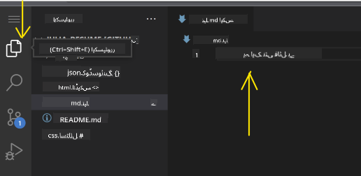
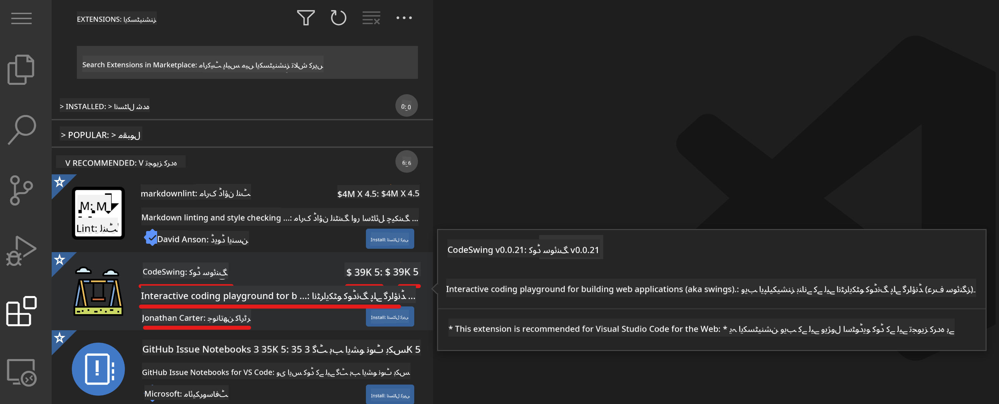
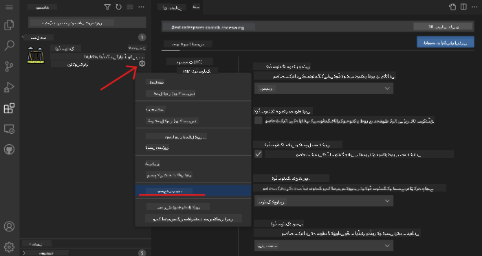

<!--
CO_OP_TRANSLATOR_METADATA:
{
  "original_hash": "7aa6e4f270d38d9cb17f2b5bd86b863d",
  "translation_date": "2025-08-25T23:15:56+00:00",
  "source_file": "8-code-editor/1-using-a-code-editor/README.md",
  "language_code": "ur"
}
-->
# کوڈ ایڈیٹر کا استعمال

یہ سبق [VSCode.dev](https://vscode.dev) کے بنیادی اصولوں کا احاطہ کرتا ہے، جو ایک ویب بیسڈ کوڈ ایڈیٹر ہے، تاکہ آپ اپنے کوڈ میں تبدیلیاں کر سکیں اور کسی پروجیکٹ میں تعاون کر سکیں بغیر اپنے کمپیوٹر پر کچھ انسٹال کیے۔

## سیکھنے کے مقاصد

اس سبق میں، آپ سیکھیں گے کہ:

- کوڈ پروجیکٹ میں کوڈ ایڈیٹر کا استعمال کیسے کریں  
- ورژن کنٹرول کے ذریعے تبدیلیوں کا ریکارڈ کیسے رکھیں  
- ڈیولپمنٹ کے لیے ایڈیٹر کو کسٹمائز کیسے کریں  

### پیشگی شرائط

شروع کرنے سے پہلے، آپ کو [GitHub](https://github.com) پر ایک اکاؤنٹ بنانا ہوگا۔ [GitHub](https://github.com/) پر جائیں اور اگر آپ کے پاس پہلے سے اکاؤنٹ نہیں ہے تو ایک نیا اکاؤنٹ بنائیں۔

### تعارف

کوڈ ایڈیٹر پروگرام لکھنے اور موجودہ کوڈنگ پروجیکٹس کے ساتھ تعاون کرنے کے لیے ایک ضروری ٹول ہے۔ ایک بار جب آپ ایڈیٹر کے بنیادی اصولوں کو سمجھ لیں اور اس کی خصوصیات کا استعمال کرنا سیکھ لیں، تو آپ انہیں کوڈ لکھنے میں لاگو کر سکیں گے۔

## VSCode.dev کے ساتھ شروعات

[VSCode.dev](https://vscode.dev) ایک ویب پر مبنی کوڈ ایڈیٹر ہے۔ اسے استعمال کرنے کے لیے آپ کو کچھ انسٹال کرنے کی ضرورت نہیں، بالکل کسی اور ویب سائٹ کو کھولنے کی طرح۔ ایڈیٹر کے ساتھ شروعات کرنے کے لیے، درج ذیل لنک کھولیں: [https://vscode.dev](https://vscode.dev)۔ اگر آپ [GitHub](https://github.com/) میں سائن ان نہیں ہیں، تو سائن ان کرنے یا نیا اکاؤنٹ بنانے کے لیے ہدایات پر عمل کریں اور پھر سائن ان کریں۔

جب یہ لوڈ ہو جائے، تو یہ کچھ اس تصویر کی طرح نظر آئے گا:


یہاں تین اہم حصے ہیں، بائیں سے دائیں کی طرف:

1. _ایکٹیویٹی بار_، جس میں کچھ آئیکنز شامل ہیں، جیسے میگنیفائنگ گلاس 🔎، گیئر ⚙️، اور کچھ دیگر  
2. ایکسپینڈڈ ایکٹیویٹی بار، جو ڈیفالٹ طور پر _ایکسپلورر_ پر سیٹ ہوتی ہے، جسے _سائیڈ بار_ کہا جاتا ہے  
3. اور آخر میں، دائیں طرف کوڈ ایریا  

ہر آئیکن پر کلک کریں تاکہ مختلف مینو ظاہر ہوں۔ جب ہو جائے، تو _ایکسپلورر_ پر کلک کریں تاکہ آپ وہیں واپس آ جائیں جہاں سے آپ نے شروع کیا تھا۔

جب آپ کوڈ بنانا شروع کریں گے یا موجودہ کوڈ میں ترمیم کریں گے، تو یہ سب سے بڑے ایریا میں ہوگا جو دائیں طرف ہے۔ آپ اس ایریا کو موجودہ کوڈ دیکھنے کے لیے بھی استعمال کریں گے، جو آپ اگلے مرحلے میں کریں گے۔

## GitHub ریپوزٹری کھولیں

پہلی چیز جو آپ کو کرنی ہوگی وہ ہے ایک GitHub ریپوزٹری کھولنا۔ ریپوزٹری کھولنے کے کئی طریقے ہیں۔ اس سیکشن میں آپ دو مختلف طریقے دیکھیں گے جن کے ذریعے آپ ریپوزٹری کھول سکتے ہیں تاکہ آپ تبدیلیوں پر کام شروع کر سکیں۔

### 1. ایڈیٹر کے ذریعے

ایڈیٹر کا استعمال کرتے ہوئے ایک ریموٹ ریپوزٹری کھولیں۔ اگر آپ [VSCode.dev](https://vscode.dev) پر جائیں گے تو آپ کو ایک _"Open Remote Repository"_ بٹن نظر آئے گا:


آپ کمانڈ پیلیٹ کا بھی استعمال کر سکتے ہیں۔ کمانڈ پیلیٹ ایک ان پٹ باکس ہے جہاں آپ کسی بھی کمانڈ یا ایکشن کا حصہ ٹائپ کر سکتے ہیں تاکہ صحیح کمانڈ تلاش کر سکیں۔ مینو کو اوپر بائیں سے کھولیں، پھر _View_ منتخب کریں، اور پھر _Command Palette_ کو منتخب کریں، یا درج ذیل کی بورڈ شارٹ کٹ استعمال کریں: Ctrl-Shift-P (MacOS پر یہ Command-Shift-P ہوگا)۔


جب مینو کھل جائے، تو _open remote repository_ ٹائپ کریں، اور پھر پہلا آپشن منتخب کریں۔ وہ ریپوزٹریز جن کا آپ حصہ ہیں یا جو آپ نے حال ہی میں کھولی ہیں، ظاہر ہوں گی۔ آپ ایک مکمل GitHub URL بھی استعمال کر سکتے ہیں۔ درج ذیل URL استعمال کریں اور باکس میں پیسٹ کریں:

```
https://github.com/microsoft/Web-Dev-For-Beginners
```

✅ اگر کامیاب ہو جائے، تو آپ اس ریپوزٹری کی تمام فائلیں ٹیکسٹ ایڈیٹر میں لوڈ ہوتی دیکھیں گے۔

### 2. URL کا استعمال

آپ براہ راست URL کا استعمال کرتے ہوئے بھی ریپوزٹری لوڈ کر سکتے ہیں۔ مثال کے طور پر، موجودہ ریپوزٹری کا مکمل URL [https://github.com/microsoft/Web-Dev-For-Beginners](https://github.com/microsoft/Web-Dev-For-Beginners) ہے، لیکن آپ GitHub ڈومین کو `VSCode.dev/github` سے تبدیل کر سکتے ہیں اور ریپوزٹری کو براہ راست لوڈ کر سکتے ہیں۔ نتیجے میں URL یہ ہوگا: [https://vscode.dev/github/microsoft/Web-Dev-For-Beginners](https://vscode.dev/github/microsoft/Web-Dev-For-Beginners)۔

## فائلز میں ترمیم کریں

جب آپ نے ریپوزٹری کو براؤزر/vscode.dev پر کھول لیا ہو، تو اگلا مرحلہ پروجیکٹ میں اپڈیٹس یا تبدیلیاں کرنا ہوگا۔

### 1. نئی فائل بنائیں

آپ یا تو کسی موجودہ فولڈر کے اندر فائل بنا سکتے ہیں، یا اسے روٹ ڈائریکٹری/فولڈر میں بنا سکتے ہیں۔ نئی فائل بنانے کے لیے، اس لوکیشن/ڈائریکٹری کو کھولیں جہاں آپ فائل کو محفوظ کرنا چاہتے ہیں اور _'New file ...'_ آئیکن کو ایکٹیویٹی بار _(بائیں)_ پر منتخب کریں، اسے ایک نام دیں اور انٹر دبائیں۔


### 2. فائل میں ترمیم کریں اور اسے محفوظ کریں

vscode.dev کا استعمال اس وقت مددگار ہوتا ہے جب آپ اپنے پروجیکٹ میں جلدی اپڈیٹس کرنا چاہتے ہیں بغیر کسی سافٹ ویئر کو لوڈ کیے۔  
اپنے کوڈ کو اپڈیٹ کرنے کے لیے، ایکٹیویٹی بار پر موجود 'Explorer' آئیکن پر کلک کریں تاکہ ریپوزٹری میں موجود فائلز اور فولڈرز کو دیکھ سکیں۔  
ایک فائل منتخب کریں تاکہ اسے کوڈ ایریا میں کھولا جا سکے، اپنی تبدیلیاں کریں اور محفوظ کریں۔



جب آپ اپنے پروجیکٹ کو اپڈیٹ کر لیں، تو _`source control`_ آئیکن منتخب کریں، جس میں آپ کی ریپوزٹری میں کی گئی تمام نئی تبدیلیاں شامل ہوں گی۔

تبدیلیوں کو دیکھنے کے لیے، ایکسپینڈڈ ایکٹیویٹی بار میں `Changes` فولڈر میں موجود فائلز کو منتخب کریں۔ یہ آپ کے لیے ایک 'Working Tree' کھولے گا تاکہ آپ بصری طور پر دیکھ سکیں کہ آپ نے فائل میں کیا تبدیلیاں کی ہیں۔ سرخ رنگ کسی چیز کو ہٹانے کو ظاہر کرتا ہے، جبکہ سبز رنگ کسی چیز کے اضافے کو ظاہر کرتا ہے۔


اگر آپ اپنی کی گئی تبدیلیوں سے مطمئن ہیں، تو `Changes` فولڈر پر ہوور کریں اور `+` بٹن پر کلک کریں تاکہ تبدیلیوں کو اسٹیج کیا جا سکے۔ اسٹیجنگ کا مطلب ہے کہ آپ اپنی تبدیلیوں کو GitHub پر کمیٹ کرنے کے لیے تیار کر رہے ہیں۔

اگر آپ کسی تبدیلی سے مطمئن نہیں ہیں اور اسے ختم کرنا چاہتے ہیں، تو `Changes` فولڈر پر ہوور کریں اور `undo` آئیکن منتخب کریں۔

پھر، ایک `commit message` ٹائپ کریں _(پروجیکٹ میں کی گئی تبدیلی کی وضاحت)_, اور کمیٹ اور پش کرنے کے لیے `check icon` پر کلک کریں۔

جب آپ اپنے پروجیکٹ پر کام مکمل کر لیں، تو اوپر بائیں جانب `hamburger menu icon` منتخب کریں تاکہ آپ GitHub.com پر ریپوزٹری پر واپس جا سکیں۔


## ایکسٹینشنز کا استعمال

VSCode پر ایکسٹینشنز انسٹال کرنے سے آپ اپنے ایڈیٹر میں نئی خصوصیات اور کسٹمائزڈ ڈیولپمنٹ ماحول کے اختیارات شامل کر سکتے ہیں تاکہ آپ کے ڈیولپمنٹ ورک فلو کو بہتر بنایا جا سکے۔ یہ ایکسٹینشنز مختلف پروگرامنگ زبانوں کے لیے سپورٹ شامل کرنے میں بھی مدد کرتی ہیں اور اکثر یا تو عمومی ایکسٹینشنز ہوتی ہیں یا زبان پر مبنی ایکسٹینشنز۔

تمام دستیاب ایکسٹینشنز کی فہرست دیکھنے کے لیے، ایکٹیویٹی بار پر _`Extensions icon`_ پر کلک کریں اور _'Search Extensions in Marketplace'_ کے لیبل والے ٹیکسٹ فیلڈ میں ایکسٹینشن کا نام ٹائپ کرنا شروع کریں۔  
آپ کو ایکسٹینشنز کی فہرست نظر آئے گی، جن میں شامل ہوں گے: **ایکسٹینشن کا نام، پبلشر کا نام، ایک جملے کی وضاحت، ڈاؤن لوڈز کی تعداد** اور **اسٹار ریٹنگ**۔



آپ پہلے سے انسٹال شدہ ایکسٹینشنز کو _`Installed folder`_ میں، زیادہ تر ڈیولپرز کے استعمال کردہ مقبول ایکسٹینشنز کو _`Popular folder`_ میں، اور آپ کے لیے تجویز کردہ ایکسٹینشنز کو _`recommended folder`_ میں دیکھ سکتے ہیں۔


### 1. ایکسٹینشنز انسٹال کریں

ایکسٹینشن انسٹال کرنے کے لیے، سرچ فیلڈ میں ایکسٹینشن کا نام ٹائپ کریں اور جب یہ ایکسپینڈڈ ایکٹیویٹی بار میں ظاہر ہو، تو اس پر کلک کریں تاکہ کوڈ ایریا میں ایکسٹینشن کے بارے میں اضافی معلومات ظاہر ہوں۔

آپ یا تو ایکسپینڈڈ ایکٹیویٹی بار میں _نیلے انسٹال بٹن_ پر کلک کر کے انسٹال کر سکتے ہیں یا کوڈ ایریا میں انسٹال بٹن استعمال کر سکتے ہیں جو ایکسٹینشن منتخب کرنے پر ظاہر ہوتا ہے۔


### 2. ایکسٹینشنز کو کسٹمائز کریں

ایکسٹینشن انسٹال کرنے کے بعد، آپ کو اس کے رویے کو تبدیل کرنے اور اپنی ترجیحات کے مطابق اسے کسٹمائز کرنے کی ضرورت ہو سکتی ہے۔ ایسا کرنے کے لیے، ایکسٹینشنز آئیکن منتخب کریں، اور اس بار، آپ کی ایکسٹینشن _Installed folder_ میں ظاہر ہوگی، _**Gear icon**_ پر کلک کریں اور _Extensions Setting_ پر جائیں۔



### 3. ایکسٹینشنز کو مینیج کریں

ایکسٹینشن انسٹال اور استعمال کرنے کے بعد، vscode.dev مختلف ضروریات کے مطابق آپ کی ایکسٹینشن کو مینیج کرنے کے اختیارات فراہم کرتا ہے۔ مثال کے طور پر، آپ یہ کر سکتے ہیں:

- **Disable:** _(آپ ایکسٹینشن کو عارضی طور پر غیر فعال کر سکتے ہیں جب آپ کو اس کی ضرورت نہ ہو لیکن اسے مکمل طور پر ان انسٹال نہیں کرنا چاہتے)_

    انسٹال شدہ ایکسٹینشن کو ایکسپینڈڈ ایکٹیویٹی بار میں منتخب کریں > گیئر آئیکن پر کلک کریں > 'Disable' یا 'Disable (Workspace)' منتخب کریں **یا** کوڈ ایریا میں ایکسٹینشن کھولیں اور نیلے Disable بٹن پر کلک کریں۔

- **Uninstall:** انسٹال شدہ ایکسٹینشن کو ایکسپینڈڈ ایکٹیویٹی بار میں منتخب کریں > گیئر آئیکن پر کلک کریں > 'Uninstall' منتخب کریں **یا** کوڈ ایریا میں ایکسٹینشن کھولیں اور نیلے Uninstall بٹن پر کلک کریں۔

---

## اسائنمنٹ

[VSCode.dev کا استعمال کرتے ہوئے ایک ریزیومے ویب سائٹ بنائیں](https://github.com/microsoft/Web-Dev-For-Beginners/blob/main/8-code-editor/1-using-a-code-editor/assignment.md)

## جائزہ اور خود مطالعہ

[VSCode.dev](https://code.visualstudio.com/docs/editor/vscode-web?WT.mc_id=academic-0000-alfredodeza) اور اس کی دیگر خصوصیات کے بارے میں مزید پڑھیں۔

**ڈسکلیمر**:  
یہ دستاویز AI ترجمہ سروس [Co-op Translator](https://github.com/Azure/co-op-translator) کا استعمال کرتے ہوئے ترجمہ کی گئی ہے۔ ہم درستگی کے لیے کوشش کرتے ہیں، لیکن براہ کرم آگاہ رہیں کہ خودکار ترجمے میں غلطیاں یا غیر درستیاں ہو سکتی ہیں۔ اصل دستاویز کو اس کی اصل زبان میں مستند ذریعہ سمجھا جانا چاہیے۔ اہم معلومات کے لیے، پیشہ ور انسانی ترجمہ کی سفارش کی جاتی ہے۔ ہم اس ترجمے کے استعمال سے پیدا ہونے والی کسی بھی غلط فہمی یا غلط تشریح کے ذمہ دار نہیں ہیں۔