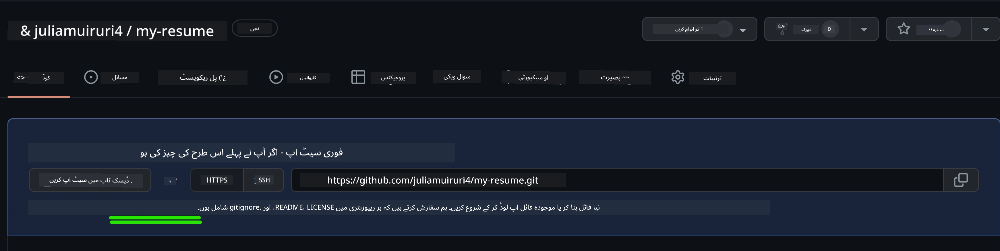
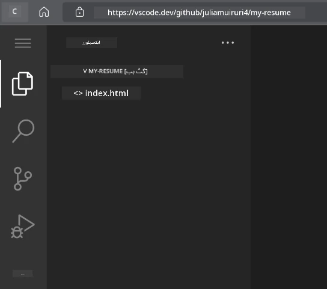

<!--
CO_OP_TRANSLATOR_METADATA:
{
  "original_hash": "effe56ba51c38d7bdfad1ea38288666b",
  "translation_date": "2025-10-22T14:36:54+00:00",
  "source_file": "8-code-editor/1-using-a-code-editor/assignment.md",
  "language_code": "ur"
}
-->
# وی ایس کوڈ ڈاٹ ڈی وی کا استعمال کرتے ہوئے ریزیوم ویب سائٹ بنائیں

اپنے کیریئر کے مواقع کو بہتر بنائیں اور ایک پروفیشنل ریزیوم ویب سائٹ بنائیں جو آپ کی مہارت اور تجربے کو ایک انٹرایکٹو اور جدید انداز میں پیش کرے۔ روایتی پی ڈی ایف بھیجنے کے بجائے، تصور کریں کہ آپ ریکروٹرز کو ایک خوبصورت، ریسپانسیو ویب سائٹ فراہم کر رہے ہیں جو آپ کی قابلیت اور ویب ڈیولپمنٹ کی صلاحیتوں کو ظاہر کرتی ہے۔

یہ عملی اسائنمنٹ آپ کے وی ایس کوڈ ڈاٹ ڈی وی کی مہارتوں کو عملی جامہ پہناتا ہے اور آپ کے کیریئر کے لیے واقعی مفید چیز بناتا ہے۔ آپ مکمل ویب ڈیولپمنٹ ورک فلو کا تجربہ کریں گے – ریپوزیٹری بنانے سے لے کر ڈیپلائمنٹ تک – سب کچھ اپنے براؤزر کے اندر۔

اس پروجیکٹ کو مکمل کرنے کے بعد، آپ کے پاس ایک پروفیشنل آن لائن موجودگی ہوگی جسے ممکنہ ملازمت دہندگان کے ساتھ آسانی سے شیئر کیا جا سکتا ہے، آپ کی مہارتوں کے بڑھنے کے ساتھ اپ ڈیٹ کیا جا سکتا ہے، اور آپ کے ذاتی برانڈ کے مطابق حسب ضرورت بنایا جا سکتا ہے۔ یہ بالکل وہی قسم کا عملی پروجیکٹ ہے جو حقیقی دنیا کی ویب ڈیولپمنٹ کی مہارتوں کو ظاہر کرتا ہے۔

## سیکھنے کے مقاصد

اس اسائنمنٹ کو مکمل کرنے کے بعد، آپ قابل ہوں گے:

- **بنائیں** اور وی ایس کوڈ ڈاٹ ڈی وی کا استعمال کرتے ہوئے ایک مکمل ویب ڈیولپمنٹ پروجیکٹ کا انتظام کریں
- **ساخت دیں** ایک پروفیشنل ویب سائٹ کو سیمینٹک ایچ ٹی ایم ایل عناصر کے ساتھ
- **اسٹائل کریں** ریسپانسیو لے آؤٹس کو جدید سی ایس ایس تکنیکوں کے ساتھ
- **عمل درآمد کریں** انٹرایکٹو فیچرز کو بنیادی ویب ٹیکنالوجیز کے ذریعے
- **ڈیپلائے کریں** ایک لائیو ویب سائٹ جو شیئر ایبل یو آر ایل کے ذریعے قابل رسائی ہو
- **ظاہر کریں** ورژن کنٹرول کے بہترین طریقے پورے ڈیولپمنٹ پروسیس میں

## ضروریات

اس اسائنمنٹ کو شروع کرنے سے پہلے، یقینی بنائیں کہ آپ کے پاس:

- ایک گٹ ہب اکاؤنٹ ([github.com](https://github.com/) پر ایک بنائیں اگر ضرورت ہو)
- وی ایس کوڈ ڈاٹ ڈی وی سبق مکمل کیا ہو جس میں انٹرفیس نیویگیشن اور بنیادی آپریشنز شامل ہوں
- ایچ ٹی ایم ایل ساخت اور سی ایس ایس اسٹائلنگ کے تصورات کی بنیادی سمجھ ہو

## پروجیکٹ سیٹ اپ اور ریپوزیٹری تخلیق

آئیے آپ کے پروجیکٹ کی بنیاد قائم کرنے سے شروع کرتے ہیں۔ یہ عمل حقیقی دنیا کے ڈیولپمنٹ ورک فلو کی عکاسی کرتا ہے جہاں پروجیکٹس مناسب ریپوزیٹری انیشیئلائزیشن اور ساخت کی منصوبہ بندی کے ساتھ شروع ہوتے ہیں۔

### مرحلہ 1: اپنا گٹ ہب ریپوزیٹری بنائیں

ایک مخصوص ریپوزیٹری قائم کرنا یقینی بناتا ہے کہ آپ کا پروجیکٹ شروع سے ہی مناسب طریقے سے منظم اور ورژن کنٹرولڈ ہے۔

1. [GitHub.com](https://github.com) پر جائیں اور اپنے اکاؤنٹ میں سائن ان کریں
2. سبز "New" بٹن یا اوپر دائیں کونے میں "+" آئیکن پر کلک کریں
3. اپنے ریپوزیٹری کا نام `my-resume` رکھیں (یا ایک ذاتی نام منتخب کریں جیسے `john-smith-resume`)
4. ایک مختصر تفصیل شامل کریں: "پروفیشنل ریزیوم ویب سائٹ ایچ ٹی ایم ایل اور سی ایس ایس کے ساتھ بنائی گئی"
5. "Public" منتخب کریں تاکہ آپ کا ریزیوم ممکنہ ملازمت دہندگان کے لیے قابل رسائی ہو
6. "Add a README file" چیک کریں تاکہ ابتدائی پروجیکٹ کی تفصیل بن سکے
7. "Create repository" پر کلک کریں تاکہ سیٹ اپ مکمل ہو

> 💡 **ریپوزیٹری نام دینے کا مشورہ**: وضاحتی، پروفیشنل نام استعمال کریں جو پروجیکٹ کے مقصد کو واضح طور پر ظاہر کریں۔ یہ ملازمت دہندگان کے ساتھ شیئر کرنے یا پورٹ فولیو جائزوں کے دوران مدد کرتا ہے۔

### مرحلہ 2: پروجیکٹ کی ساخت کو انیشیئلائز کریں

چونکہ وی ایس کوڈ ڈاٹ ڈی وی کو ریپوزیٹری کھولنے کے لیے کم از کم ایک فائل کی ضرورت ہوتی ہے، ہم اپنا مرکزی ایچ ٹی ایم ایل فائل براہ راست گٹ ہب پر بنائیں گے اس سے پہلے کہ ویب ایڈیٹر پر جائیں۔

1. اپنے نئے ریپوزیٹری میں "creating a new file" لنک پر کلک کریں
2. `index.html` کو فائل نام کے طور پر ٹائپ کریں
3. یہ ابتدائی ایچ ٹی ایم ایل ساخت شامل کریں:

```html
<!DOCTYPE html>
<html lang="en">
<head>
    <meta charset="UTF-8">
    <meta name="viewport" content="width=device-width, initial-scale=1.0">
    <title>Your Name - Professional Resume</title>
</head>
<body>
    <h1>Your Name</h1>
    <p>Professional Resume Website</p>
</body>
</html>
```

4. ایک کمیٹ میسج لکھیں: "Add initial HTML structure"
5. "Commit new file" پر کلک کریں تاکہ آپ کی تبدیلیاں محفوظ ہو جائیں



**یہ ابتدائی سیٹ اپ کیا حاصل کرتا ہے:**
- **مناسب ایچ ٹی ایم ایل 5 دستاویز کی ساخت قائم کرتا ہے** سیمینٹک عناصر کے ساتھ
- **ویو پورٹ میٹا ٹیگ شامل کرتا ہے** ریسپانسیو ڈیزائن کی مطابقت کے لیے
- **ایک وضاحتی صفحہ کا عنوان سیٹ کرتا ہے** جو براؤزر ٹیبز میں ظاہر ہوتا ہے
- **پروفیشنل مواد کی تنظیم کے لیے بنیاد بناتا ہے**

## وی ایس کوڈ ڈاٹ ڈی وی میں کام کرنا

اب جب کہ آپ کی ریپوزیٹری کی بنیاد قائم ہو گئی ہے، آئیے وی ایس کوڈ ڈاٹ ڈی وی پر منتقل ہوتے ہیں تاکہ مرکزی ڈیولپمنٹ کا کام کیا جا سکے۔ یہ ویب بیسڈ ایڈیٹر پروفیشنل ویب ڈیولپمنٹ کے لیے تمام ضروری ٹولز فراہم کرتا ہے۔

### مرحلہ 3: اپنا پروجیکٹ وی ایس کوڈ ڈاٹ ڈی وی میں کھولیں

1. [vscode.dev](https://vscode.dev) پر ایک نئے براؤزر ٹیب میں جائیں
2. ویلکم اسکرین پر "Open Remote Repository" پر کلک کریں
3. اپنے گٹ ہب ریپوزیٹری یو آر ایل کو کاپی کریں اور ان پٹ فیلڈ میں پیسٹ کریں

   فارمیٹ: `https://github.com/your-username/my-resume`
   
   *`your-username` کو اپنے اصل گٹ ہب یوزر نیم سے تبدیل کریں*

4. پروجیکٹ لوڈ کرنے کے لیے Enter دبائیں

✅ **کامیابی کا اشارہ**: آپ کو اپنے پروجیکٹ فائلز ایکسپلورر سائیڈ بار میں اور `index.html` کو مرکزی ایڈیٹر ایریا میں ایڈیٹنگ کے لیے دستیاب دیکھنا چاہیے۔



**انٹرفیس میں آپ کیا دیکھیں گے:**
- **ایکسپلورر سائیڈ بار**: **آپ کے ریپوزیٹری فائلز اور فولڈر کی ساخت دکھاتا ہے**
- **ایڈیٹر ایریا**: **منتخب فائلز کے مواد کو ایڈیٹنگ کے لیے دکھاتا ہے**
- **ایکٹیویٹی بار**: **سورس کنٹرول اور ایکسٹینشنز جیسے فیچرز تک رسائی فراہم کرتا ہے**
- **اسٹیٹس بار**: **کنکشن اسٹیٹس اور موجودہ برانچ کی معلومات ظاہر کرتا ہے**

### مرحلہ 4: اپنے ریزیوم مواد کو بنائیں

`index.html` میں موجود پلیس ہولڈر مواد کو ایک جامع ریزیوم ساخت کے ساتھ تبدیل کریں۔ یہ ایچ ٹی ایم ایل آپ کی قابلیت کی پروفیشنل پریزنٹیشن کے لیے بنیاد فراہم کرتا ہے۔

<details>
<summary><b>مکمل ایچ ٹی ایم ایل ریزیوم ساخت</b></summary>

```html
<!DOCTYPE html>
<html lang="en">
<head>
    <meta charset="UTF-8">
    <meta name="viewport" content="width=device-width, initial-scale=1.0">
    <link href="style.css" rel="stylesheet">
    <link rel="stylesheet" href="https://cdnjs.cloudflare.com/ajax/libs/font-awesome/5.15.4/css/all.min.css">
    <title>Your Name - Professional Resume</title>
</head>
<body>
    <header id="header">
        <h1>Your Full Name</h1>
        <hr>
        <p class="role">Your Professional Title</p>
        <hr>
    </header>
    
    <main>
        <article id="mainLeft">
            <section>
                <h2>CONTACT</h2>
                <p>
                    <i class="fa fa-envelope" aria-hidden="true"></i>
                    <a href="mailto:your.email@domain.com">your.email@domain.com</a>
                </p>
                <p>
                    <i class="fab fa-github" aria-hidden="true"></i>
                    <a href="https://github.com/your-username">github.com/your-username</a>
                </p>
                <p>
                    <i class="fab fa-linkedin" aria-hidden="true"></i>
                    <a href="https://linkedin.com/in/your-profile">linkedin.com/in/your-profile</a>
                </p>
            </section>
            
            <section>
                <h2>SKILLS</h2>
                <ul>
                    <li>HTML5 & CSS3</li>
                    <li>JavaScript (ES6+)</li>
                    <li>Responsive Web Design</li>
                    <li>Version Control (Git)</li>
                    <li>Problem Solving</li>
                </ul>
            </section>
            
            <section>
                <h2>EDUCATION</h2>
                <h3>Your Degree or Certification</h3>
                <p>Institution Name</p>
                <p>Start Date - End Date</p>
            </section>
        </article>
        
        <article id="mainRight">
            <section>
                <h2>ABOUT</h2>
                <p>Write a compelling summary that highlights your passion for web development, key achievements, and career goals. This section should give employers insight into your personality and professional approach.</p>
            </section>
            
            <section>
                <h2>WORK EXPERIENCE</h2>
                <div class="job">
                    <h3>Job Title</h3>
                    <p class="company">Company Name | Start Date – End Date</p>
                    <ul>
                        <li>Describe a key accomplishment or responsibility</li>
                        <li>Highlight specific skills or technologies used</li>
                        <li>Quantify impact where possible (e.g., "Improved efficiency by 25%")</li>
                    </ul>
                </div>
                
                <div class="job">
                    <h3>Previous Job Title</h3>
                    <p class="company">Previous Company | Start Date – End Date</p>
                    <ul>
                        <li>Focus on transferable skills and achievements</li>
                        <li>Demonstrate growth and learning progression</li>
                        <li>Include any leadership or collaboration experiences</li>
                    </ul>
                </div>
            </section>
            
            <section>
                <h2>PROJECTS</h2>
                <div class="project">
                    <h3>Project Name</h3>
                    <p>Brief description of what the project accomplishes and technologies used.</p>
                    <a href="#" target="_blank">View Project</a>
                </div>
            </section>
        </article>
    </main>
</body>
</html>
```
</details>

**حسب ضرورت کے رہنما خطوط:**
- **تمام پلیس ہولڈر متن کو اپنے اصل معلومات سے تبدیل کریں**
- **اپنے تجربے کی سطح اور کیریئر فوکس کے مطابق سیکشنز کو ایڈجسٹ کریں**
- **ضرورت کے مطابق سیکشنز شامل یا ہٹائیں** (جیسے، سرٹیفیکیشنز، رضاکارانہ کام، زبانیں)
- **اپنے اصل پروفائلز اور پروجیکٹس کے لنکس شامل کریں**

### مرحلہ 5: معاون فائلز بنائیں

پروفیشنل ویب سائٹس کو منظم فائل ساخت کی ضرورت ہوتی ہے۔ سی ایس ایس اسٹائل شیٹ اور کنفیگریشن فائلز بنائیں جو مکمل پروجیکٹ کے لیے ضروری ہیں۔

1. ایکسپلورر سائیڈ بار میں اپنے پروجیکٹ فولڈر کے نام پر ہوور کریں
2. ظاہر ہونے والے "New File" آئیکن (📄+) پر کلک کریں
3. ایک وقت میں یہ فائلز بنائیں:
   - `style.css` (اسٹائلنگ اور لے آؤٹ کے لیے)
   - `codeswing.json` (پریویو ایکسٹینشن کنفیگریشن کے لیے)

**سی ایس ایس فائل (`style.css`) بنانا:**

<details>
<summary><b>پروفیشنل سی ایس ایس اسٹائلنگ</b></summary>

```css
/* Modern Resume Styling */
body {
    font-family: 'Segoe UI', Tahoma, Geneva, Verdana, sans-serif;
    font-size: 16px;
    line-height: 1.6;
    max-width: 960px;
    margin: 0 auto;
    padding: 20px;
    color: #333;
    background-color: #f9f9f9;
}

/* Header Styling */
header {
    text-align: center;
    margin-bottom: 3em;
    padding: 2em;
    background: linear-gradient(135deg, #667eea 0%, #764ba2 100%);
    color: white;
    border-radius: 10px;
    box-shadow: 0 4px 6px rgba(0, 0, 0, 0.1);
}

h1 {
    font-size: 3em;
    letter-spacing: 0.1em;
    margin-bottom: 0.2em;
    font-weight: 300;
}

.role {
    font-size: 1.3em;
    font-weight: 300;
    margin: 1em 0;
}

/* Main Content Layout */
main {
    display: grid;
    grid-template-columns: 35% 65%;
    gap: 3em;
    margin-top: 3em;
    background: white;
    padding: 2em;
    border-radius: 10px;
    box-shadow: 0 2px 10px rgba(0, 0, 0, 0.1);
}

/* Typography */
h2 {
    font-size: 1.4em;
    font-weight: 600;
    margin-bottom: 1em;
    color: #667eea;
    border-bottom: 2px solid #667eea;
    padding-bottom: 0.3em;
}

h3 {
    font-size: 1.1em;
    font-weight: 600;
    margin-bottom: 0.5em;
    color: #444;
}

/* Section Styling */
section {
    margin-bottom: 2.5em;
}

#mainLeft {
    border-right: 1px solid #e0e0e0;
    padding-right: 2em;
}

/* Contact Links */
section a {
    color: #667eea;
    text-decoration: none;
    transition: color 0.3s ease;
}

section a:hover {
    color: #764ba2;
    text-decoration: underline;
}

/* Icons */
i {
    margin-right: 0.8em;
    width: 20px;
    text-align: center;
    color: #667eea;
}

/* Lists */
ul {
    list-style: none;
    padding-left: 0;
}

li {
    margin: 0.5em 0;
    padding: 0.3em 0;
    position: relative;
}

li:before {
    content: "▸";
    color: #667eea;
    margin-right: 0.5em;
}

/* Work Experience */
.job, .project {
    margin-bottom: 2em;
    padding-bottom: 1.5em;
    border-bottom: 1px solid #f0f0f0;
}

.company {
    font-style: italic;
    color: #666;
    margin-bottom: 0.5em;
}

/* Responsive Design */
@media (max-width: 768px) {
    main {
        grid-template-columns: 1fr;
        gap: 2em;
    }
    
    #mainLeft {
        border-right: none;
        border-bottom: 1px solid #e0e0e0;
        padding-right: 0;
        padding-bottom: 2em;
    }
    
    h1 {
        font-size: 2.2em;
    }
    
    body {
        padding: 10px;
    }
}

/* Print Styles */
@media print {
    body {
        background: white;
        color: black;
        font-size: 12pt;
    }
    
    header {
        background: none;
        color: black;
        box-shadow: none;
    }
    
    main {
        box-shadow: none;
    }
}
```
</details>

**کنفیگریشن فائل (`codeswing.json`) بنانا:**

```json
{
    "scripts": [],
    "styles": []
}
```

**سی ایس ایس فیچرز کو سمجھنا:**
- **سی ایس ایس گرڈ کا استعمال کرتا ہے** ریسپانسیو، پروفیشنل لے آؤٹ ساخت کے لیے
- **جدید کلر اسکیمز نافذ کرتا ہے** گریڈینٹ ہیڈرز کے ساتھ
- **ہوور ایفیکٹس اور اسموو ٹرانزیشنز شامل کرتا ہے** انٹرایکٹیویٹی کے لیے
- **ریسپانسیو ڈیزائن فراہم کرتا ہے** جو تمام ڈیوائس سائز پر کام کرتا ہے
- **پرنٹ فرینڈلی اسٹائلز شامل کرتا ہے** پی ڈی ایف جنریشن کے لیے

### مرحلہ 6: ایکسٹینشنز انسٹال اور کنفیگر کریں

ایکسٹینشنز آپ کے ڈیولپمنٹ کے تجربے کو بہتر بناتی ہیں، لائیو پریویو صلاحیتوں اور بہتر ورک فلو ٹولز فراہم کرتی ہیں۔ کوڈ سوئنگ ایکسٹینشن خاص طور پر ویب ڈیولپمنٹ پروجیکٹس کے لیے مفید ہے۔

**کوڈ سوئنگ ایکسٹینشن انسٹال کرنا:**

1. ایکٹیویٹی بار میں ایکسٹینشنز آئیکن (🧩) پر کلک کریں
2. مارکیٹ پلیس سرچ باکس میں "CodeSwing" تلاش کریں
3. سرچ نتائج سے کوڈ سوئنگ ایکسٹینشن منتخب کریں
4. نیلے "Install" بٹن پر کلک کریں


**کوڈ سوئنگ کیا فراہم کرتا ہے:**
- **آپ کی ویب سائٹ کا لائیو پریویو فعال کرتا ہے** جیسے آپ ایڈیٹ کرتے ہیں
- **تبدیلیاں ریئل ٹائم میں دکھاتا ہے** بغیر دستی ریفریش کے
- **متعدد فائل ٹائپس کو سپورٹ کرتا ہے** بشمول ایچ ٹی ایم ایل، سی ایس ایس، اور جاوا اسکرپٹ
- **ایک مربوط ڈیولپمنٹ ماحول فراہم کرتا ہے**

**انسٹالیشن کے بعد فوری نتائج:**
ایک بار کوڈ سوئنگ انسٹال ہو جائے، آپ کو اپنے ریزیوم ویب سائٹ کا لائیو پریویو ایڈیٹر میں نظر آئے گا۔ یہ آپ کو بالکل دکھاتا ہے کہ آپ کی سائٹ کیسی لگتی ہے جیسے آپ تبدیلیاں کرتے ہیں۔


**بہتر انٹرفیس کو سمجھنا:**
- **سپلٹ ویو**: **آپ کے کوڈ کو ایک طرف اور لائیو پریویو کو دوسری طرف دکھاتا ہے**
- **ریئل ٹائم اپڈیٹس**: **تبدیلیاں فوری طور پر ظاہر کرتا ہے جیسے آپ ٹائپ کرتے ہیں**
- **انٹرایکٹو پریویو**: **لنکس اور انٹرایکشنز کو ٹیسٹ کرنے کی اجازت دیتا ہے**
- **موبائل سیمولیشن**: **ریسپانسیو ڈیزائن ٹیسٹنگ کی صلاحیت فراہم کرتا ہے**

### مرحلہ 7: ورژن کنٹرول اور پبلشنگ

اب جب کہ آپ کی ریزیوم ویب سائٹ مکمل ہو گئی ہے، گٹ کا استعمال کریں تاکہ آپ کا کام محفوظ ہو اور آن لائن دستیاب ہو۔

**اپنی تبدیلیاں کمیٹ کرنا:**

1. ایکٹیویٹی بار میں سورس کنٹرول آئیکن (🌿) پر کلک کریں
2. "Changes" سیکشن میں آپ نے جو فائلز بنائی اور تبدیل کی ہیں ان سب کا جائزہ لیں
3. ہر فائل کے ساتھ "+" آئیکن پر کلک کر کے اپنی تبدیلیاں اسٹیج کریں
4. ایک وضاحتی کمیٹ میسج لکھیں، جیسے:
   - "Add complete resume website with responsive design"
   - "Implement professional styling and content structure"
5. چیک مارک (✓) پر کلک کریں تاکہ کمیٹ اور پش ہو جائے

**موثر کمیٹ میسج کی مثالیں:**
- "Add professional resume content and styling"
- "Implement responsive design for mobile compatibility"
- "Update contact information and project links"

> 💡 **پروفیشنل مشورہ**: اچھے کمیٹ میسجز آپ کے پروجیکٹ کی ارتقاء کو ٹریک کرنے میں مدد کرتے ہیں اور تفصیل پر توجہ دینے کی صلاحیت کو ظاہر کرتے ہیں – وہ خصوصیات جو ملازمت دہندگان کو پسند ہیں۔

**اپنی پبلشڈ سائٹ تک رسائی حاصل کرنا:**
ایک بار کمیٹ ہو جائے، آپ گٹ ہب ریپوزیٹری پر واپس جا سکتے ہیں ہیمبرگر مینو (☰) کا استعمال کرتے ہوئے اوپر بائیں کونے میں۔ آپ کی ریزیوم ویب سائٹ اب ورژن کنٹرولڈ ہے اور ڈیپلائمنٹ یا شیئرنگ کے لیے تیار ہے۔

## نتائج اور اگلے مراحل

**مبارک ہو! 🎉** آپ نے وی ایس کوڈ ڈاٹ ڈی وی کا استعمال کرتے ہوئے ایک پروفیشنل ریزیوم ویب سائٹ کامیابی سے بنائی۔ آپ کا پروجیکٹ ظاہر کرتا ہے:
**ظاہر کردہ تکنیکی مہارتیں:**
- **ریپوزیٹری مینجمنٹ**: ایک مکمل پروجیکٹ ساخت بنائی اور منظم کی
- **ویب ڈیولپمنٹ**: ایک ریسپانسیو ویب سائٹ جدید ایچ ٹی ایم ایل 5 اور سی ایس ایس 3 کا استعمال کرتے ہوئے بنائی
- **ورژن کنٹرول**: مناسب گٹ ورک فلو کو بامعنی کمیٹس کے ساتھ نافذ کیا
- **ٹول پروفیشینسی**: وی ایس کوڈ ڈاٹ ڈی وی کے انٹرفیس اور ایکسٹینشن سسٹم کو مؤثر طریقے سے استعمال کیا

**حاصل کردہ پروفیشنل نتائج:**
- **آن لائن موجودگی**: ایک شیئر ایبل یو آر ایل جو آپ کی قابلیت کو ظاہر کرتا ہے
- **جدید فارمیٹ**: روایتی پی ڈی ایف ریزیومز کا ایک انٹرایکٹو متبادل
- **ظاہر کردہ مہارتیں**: آپ کی ویب ڈیولپمنٹ کی صلاحیتوں کا ٹھوس ثبوت
- **آسان اپڈیٹس**: ایک بنیاد جسے آپ مسلسل بہتر اور حسب ضرورت بنا سکتے ہیں

### ڈیپلائمنٹ کے اختیارات

اپنے ریزیوم کو ملازمت دہندگان کے لیے قابل رسائی بنانے کے لیے، ان ہوسٹنگ آپشنز پر غور کریں:

**گٹ ہب پیجز (تجویز کردہ):**
1. گٹ ہب پر اپنے ریپوزیٹری سیٹنگز پر جائیں
2. "Pages" سیکشن تک اسکرول کریں
3. "Deploy from a branch" منتخب کریں اور "main" کو منتخب کریں
4. آپ کی سائٹ دستیاب ہوگی `https://your-username.github.io/my-resume`

**متبادل پلیٹ فارمز:**
- **Netlify**: خودکار ڈیپلائمنٹ کے ساتھ کسٹم ڈومینز
- **Vercel**: جدید ہوسٹنگ فیچرز کے ساتھ تیز ڈیپلائمنٹ
- **GitHub Codespaces**: بلٹ ان پریویو کے ساتھ ڈیولپمنٹ ماحول

### بہتری کے مشورے

اپنی مہارتوں کو مزید ترقی دینے کے لیے یہ فیچرز شامل کریں:

**تکنیکی بہتری:**
- **جاوا اسکرپٹ انٹرایکٹیویٹی**: اسموو اسکرولنگ یا انٹرایکٹو عناصر شامل کریں
- **ڈارک موڈ ٹوگل**: صارف کی ترجیح کے لیے تھیم سوئچنگ نافذ کریں
- **کانٹیکٹ فارم**: ممکنہ ملازمت دہندگان سے براہ راست رابطے کو فعال کریں
- **ایس ای او آپٹیمائزیشن**: بہتر سرچ ویزیبلٹی کے لیے میٹا ٹیگز اور اسٹرکچرڈ ڈیٹا شامل کریں

**مواد کی بہتری:**
- **پروجیکٹ پورٹ فولیو**: گٹ ہب ریپوزیٹریز اور لائیو ڈیمونسٹریشنز کے لنکس شامل کریں
- **مہارتوں کی بصری نمائندگی**: پروگریس بارز یا اسکل ریٹنگ سسٹمز بنائیں
- **تعریفوں کا سیکشن**: ساتھیوں یا انسٹرکٹرز کی سفارشات شامل کریں
- **بلاگ انٹیگریشن**: ایک بلاگ سیکشن شامل کریں تاکہ آپ کے سیکھنے
- **رسائی**: جامع ویب ڈیزائن کے لیے WCAG رہنما اصول سیکھیں  
- **کارکردگی**: بہتر بنانے کے لیے Lighthouse جیسے ٹولز کا جائزہ لیں  
- **SEO**: سرچ انجن آپٹیمائزیشن کی بنیادی باتیں سمجھیں  

**پیشہ ورانہ ترقی:**  
- **پورٹ فولیو بنانا**: مختلف مہارتوں کو ظاہر کرنے کے لیے اضافی پروجیکٹس بنائیں  
- **اوپن سورس**: تعاون کا تجربہ حاصل کرنے کے لیے موجودہ پروجیکٹس میں حصہ لیں  
- **نیٹ ورکنگ**: اپنی ریزیومے ویب سائٹ کو ڈویلپر کمیونٹیز میں شیئر کریں اور فیڈبیک حاصل کریں  
- **مسلسل سیکھنا**: ویب ڈویلپمنٹ کے رجحانات اور ٹیکنالوجیز سے باخبر رہیں  

---

**آپ کے اگلے اقدامات:** اپنی ریزیومے ویب سائٹ کو دوستوں، خاندان یا رہنماؤں کے ساتھ شیئر کریں تاکہ فیڈبیک حاصل ہو۔ ان کی تجاویز کا استعمال کرتے ہوئے اپنے ڈیزائن کو بہتر بنائیں۔ یاد رکھیں، یہ پروجیکٹ صرف ایک ریزیومے نہیں ہے – یہ آپ کی بطور ویب ڈویلپر ترقی کا مظاہرہ ہے!

---

**اعلانِ لاتعلقی**:  
یہ دستاویز AI ترجمہ سروس [Co-op Translator](https://github.com/Azure/co-op-translator) کا استعمال کرتے ہوئے ترجمہ کی گئی ہے۔ ہم درستگی کی بھرپور کوشش کرتے ہیں، لیکن براہ کرم آگاہ رہیں کہ خودکار ترجمے میں غلطیاں یا عدم درستگی ہو سکتی ہے۔ اصل دستاویز کو اس کی اصل زبان میں مستند ذریعہ سمجھا جانا چاہیے۔ اہم معلومات کے لیے، پیشہ ور انسانی ترجمہ کی سفارش کی جاتی ہے۔ اس ترجمے کے استعمال سے پیدا ہونے والی کسی بھی غلط فہمی یا غلط تشریح کے لیے ہم ذمہ دار نہیں ہیں۔