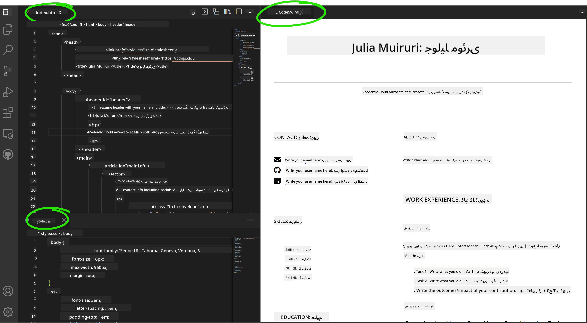

<!--
CO_OP_TRANSLATOR_METADATA:
{
  "original_hash": "2fcb983b8dbadadb1bc2e97f8c12dac5",
  "translation_date": "2025-08-25T23:21:35+00:00",
  "source_file": "8-code-editor/1-using-a-code-editor/assignment.md",
  "language_code": "ur"
}
-->
# وی ایس کوڈ ڈاٹ ڈیوی کے ذریعے ریزیوم ویب سائٹ بنائیں

_کتنا زبردست ہوگا اگر کوئی ریکروٹر آپ سے آپ کا ریزیوم مانگے اور آپ انہیں ایک یو آر ایل بھیج دیں؟_ 😎

## مقاصد

اس اسائنمنٹ کے بعد، آپ سیکھیں گے کہ:

- اپنی ریزیوم کو دکھانے کے لیے ایک ویب سائٹ کیسے بنائیں

### ضروریات

1. ایک گٹ ہب اکاؤنٹ۔ [گٹ ہب](https://github.com/) پر جائیں اور اگر آپ کے پاس پہلے سے اکاؤنٹ نہیں ہے تو ایک اکاؤنٹ بنائیں۔

## مراحل

**مرحلہ 1:** ایک نیا گٹ ہب ریپوزیٹری بنائیں اور اسے `my-resume` کا نام دیں۔

**مرحلہ 2:** اپنے ریپوزیٹری میں ایک `index.html` فائل بنائیں۔ ہم گٹ ہب ڈاٹ کام پر کم از کم ایک فائل شامل کریں گے کیونکہ آپ وی ایس کوڈ ڈاٹ ڈیوی پر خالی ریپوزیٹری نہیں کھول سکتے۔

`creating a new file` لنک پر کلک کریں، `index.html` کا نام ٹائپ کریں اور `Commit new file` بٹن منتخب کریں۔


**مرحلہ 3:** [وی ایس کوڈ ڈاٹ ڈیوی](https://vscode.dev) کھولیں اور `Open Remote Repository` بٹن منتخب کریں۔

اپنے ریزیوم سائٹ کے لیے ابھی بنائی گئی ریپوزیٹری کا یو آر ایل کاپی کریں اور ان پٹ باکس میں پیسٹ کریں:

_اپنے گٹ ہب یوزر نیم کے ساتھ `your-username` کو تبدیل کریں_

```
https://github.com/your-username/my-resume
```

✅ اگر کامیاب ہو جائے، تو آپ اپنے پروجیکٹ اور `index.html` فائل کو براؤزر کے ٹیکسٹ ایڈیٹر میں کھلا ہوا دیکھیں گے۔


**مرحلہ 4:** `index.html` فائل کھولیں، نیچے دیا گیا کوڈ اپنے کوڈ ایریا میں پیسٹ کریں اور محفوظ کریں۔

<details>
    <summary><b>ریزیوم ویب سائٹ کے مواد کے لیے HTML کوڈ۔</b></summary>
    
        <html>

            <head>
                <link href="style.css" rel="stylesheet">
                <link rel="stylesheet" href="https://cdnjs.cloudflare.com/ajax/libs/font-awesome/5.15.4/css/all.min.css">
                <title>یہاں اپنا نام لکھیں!</title>
            </head>
            <body>
                <header id="header">
                    <!-- ریزیوم ہیڈر آپ کے نام اور ٹائٹل کے ساتھ -->
                    <h1>یہاں اپنا نام لکھیں!</h1>
                    <hr>
                    آپ کا کردار!
                    <hr>
                </header>
                <main>
                    <article id="mainLeft">
                        <section>
                            <h2>رابطہ</h2>
                            <!-- رابطے کی معلومات بشمول سوشل میڈیا -->
                            <p>
                                <i class="fa fa-envelope" aria-hidden="true"></i>
                                <a href="mailto:username@domain.top-level domain">یہاں اپنا ای میل لکھیں</a>
                            </p>
                            <p>
                                <i class="fab fa-github" aria-hidden="true"></i>
                                <a href="github.com/yourGitHubUsername">یہاں اپنا یوزر نیم لکھیں!</a>
                            </p>
                            <p>
                                <i class="fab fa-linkedin" aria-hidden="true"></i>
                                <a href="linkedin.com/yourLinkedInUsername">یہاں اپنا یوزر نیم لکھیں!</a>
                            </p>
                        </section>
                        <section>
                            <h2>مہارتیں</h2>
                            <!-- آپ کی مہارتیں -->
                            <ul>
                                <li>مہارت 1!</li>
                                <li>مہارت 2!</li>
                                <li>مہارت 3!</li>
                                <li>مہارت 4!</li>
                            </ul>
                        </section>
                        <section>
                            <h2>تعلیم</h2>
                            <!-- آپ کی تعلیم -->
                            <h3>یہاں اپنا کورس لکھیں!</h3>
                            <p>
                                یہاں اپنا ادارہ لکھیں!
                            </p>
                            <p>
                                شروع - اختتام کی تاریخ
                            </p>
                        </section>            
                    </article>
                    <article id="mainRight">
                        <section>
                            <h2>میرے بارے میں</h2>
                            <!-- آپ کے بارے میں -->
                            <p>اپنے بارے میں کچھ لکھیں!</p>
                        </section>
                        <section>
                            <h2>کام کا تجربہ</h2>
                            <!-- آپ کا کام کا تجربہ -->
                            <h3>نوکری کا عنوان</h3>
                            <p>
                                یہاں تنظیم کا نام لکھیں | شروع کا مہینہ – اختتام کا مہینہ
                            </p>
                            <ul>
                                    <li>کام 1 - جو آپ نے کیا وہ لکھیں!</li>
                                    <li>کام 2 - جو آپ نے کیا وہ لکھیں!</li>
                                    <li>اپنے تعاون کے نتائج/اثر لکھیں</li>
                                    
                            </ul>
                            <h3>نوکری کا عنوان 2</h3>
                            <p>
                                یہاں تنظیم کا نام لکھیں | شروع کا مہینہ – اختتام کا مہینہ
                            </p>
                            <ul>
                                    <li>کام 1 - جو آپ نے کیا وہ لکھیں!</li>
                                    <li>کام 2 - جو آپ نے کیا وہ لکھیں!</li>
                                    <li>اپنے تعاون کے نتائج/اثر لکھیں</li>
                                    
                            </ul>
                        </section>
                    </article>
                </main>
            </body>
        </html>
</details>

اپنے ریزیوم کی تفصیلات شامل کریں تاکہ HTML کوڈ میں _پلیس ہولڈر ٹیکسٹ_ کی جگہ لے سکیں۔

**مرحلہ 5:** My-Resume فولڈر پر ہوور کریں، `New File ...` آئیکن پر کلک کریں اور اپنے پروجیکٹ میں 2 نئی فائلز بنائیں: `style.css` اور `codeswing.json` فائلز۔

**مرحلہ 6:** `style.css` فائل کھولیں، نیچے دیا گیا کوڈ پیسٹ کریں اور محفوظ کریں۔

<details>
        <summary><b>سائٹ کی ترتیب کو فارمیٹ کرنے کے لیے CSS کوڈ۔</b></summary>
            
            body {
                font-family: 'Segoe UI', Tahoma, Geneva, Verdana, sans-serif;
                font-size: 16px;
                max-width: 960px;
                margin: auto;
            }
            h1 {
                font-size: 3em;
                letter-spacing: .6em;
                padding-top: 1em;
                padding-bottom: 1em;
            }

            h2 {
                font-size: 1.5em;
                padding-bottom: 1em;
            }

            h3 {
                font-size: 1em;
                padding-bottom: 1em;
            }
            main { 
                display: grid;
                grid-template-columns: 40% 60%;
                margin-top: 3em;
            }
            header {
                text-align: center;
                margin: auto 2em;
            }

            section {
                margin: auto 1em 4em 2em;
            }

            i {
                margin-right: .5em;
            }

            p {
                margin: .2em auto
            }

            hr {
                border: none;
                background-color: lightgray;
                height: 1px;
            }

            h1, h2, h3 {
                font-weight: 100;
                margin-bottom: 0;
            }
            #mainLeft {
                border-right: 1px solid lightgray;
            }
            
</details>

**مرحلہ 6:** `codeswing.json` فائل کھولیں، نیچے دیا گیا کوڈ پیسٹ کریں اور محفوظ کریں۔

    {
    "scripts": [],
    "styles": []
    }

**مرحلہ 7:** `Codeswing extension` انسٹال کریں تاکہ کوڈ ایریا میں ریزیوم ویب سائٹ کو دیکھ سکیں۔

ایکٹیویٹی بار پر _`Extensions`_ آئیکن پر کلک کریں اور Codeswing ٹائپ کریں۔ یا تو ایکٹیویٹی بار پر _نیلے انسٹال بٹن_ پر کلک کریں یا کوڈ ایریا میں انسٹال بٹن استعمال کریں جو ایکسٹینشن منتخب کرنے پر اضافی معلومات لوڈ کرتا ہے۔ ایکسٹینشن انسٹال کرنے کے فوراً بعد، اپنے کوڈ ایریا میں اپنے پروجیکٹ میں تبدیلیاں دیکھیں 😃


یہ وہ چیز ہے جو آپ اپنی اسکرین پر دیکھیں گے جب آپ ایکسٹینشن انسٹال کریں گے۔



اگر آپ اپنی کی گئی تبدیلیوں سے مطمئن ہیں، تو `Changes` فولڈر پر ہوور کریں اور `+` بٹن پر کلک کریں تاکہ تبدیلیوں کو اسٹیج کریں۔

ایک کمیٹ میسج ٹائپ کریں _(پروجیکٹ میں کی گئی تبدیلی کی وضاحت)_ اور اپنی تبدیلیوں کو کمیٹ کرنے کے لیے `check` پر کلک کریں۔ جب آپ اپنے پروجیکٹ پر کام مکمل کر لیں، تو گٹ ہب پر ریپوزیٹری پر واپس جانے کے لیے اوپر بائیں جانب ہیمبرگر مینو آئیکن منتخب کریں۔

مبارک ہو 🎉 آپ نے چند مراحل میں وی ایس کوڈ ڈاٹ ڈیوی کے ذریعے اپنی ریزیوم ویب سائٹ بنا لی ہے۔

## 🚀 چیلنج

ایک ریموٹ ریپوزیٹری کھولیں جس پر آپ کو تبدیلیاں کرنے کی اجازت ہو اور کچھ فائلز اپ ڈیٹ کریں۔ اگلا، اپنی تبدیلیوں کے ساتھ ایک نئی برانچ بنانے کی کوشش کریں اور ایک پل ریکویسٹ کریں۔

## جائزہ اور خود مطالعہ

[وی ایس کوڈ ڈاٹ ڈیوی](https://code.visualstudio.com/docs/editor/vscode-web?WT.mc_id=academic-0000-alfredodeza) اور اس کی دیگر خصوصیات کے بارے میں مزید پڑھیں۔

**ڈسکلیمر**:  
یہ دستاویز AI ترجمہ سروس [Co-op Translator](https://github.com/Azure/co-op-translator) کا استعمال کرتے ہوئے ترجمہ کی گئی ہے۔ ہم درستگی کے لیے کوشش کرتے ہیں، لیکن براہ کرم آگاہ رہیں کہ خودکار ترجمے میں غلطیاں یا غیر درستیاں ہو سکتی ہیں۔ اصل دستاویز کو اس کی اصل زبان میں مستند ذریعہ سمجھا جانا چاہیے۔ اہم معلومات کے لیے، پیشہ ور انسانی ترجمہ کی سفارش کی جاتی ہے۔ ہم اس ترجمے کے استعمال سے پیدا ہونے والی کسی بھی غلط فہمی یا غلط تشریح کے ذمہ دار نہیں ہیں۔