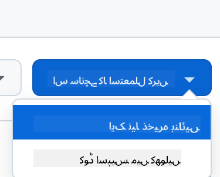

<!--
CO_OP_TRANSLATOR_METADATA:
{
  "original_hash": "cf15ff7770c5a484349383bb27d1131f",
  "translation_date": "2025-08-28T15:56:24+00:00",
  "source_file": "9-chat-project/README.md",
  "language_code": "ur"
}
-->
# چیٹ پروجیکٹ

یہ چیٹ پروجیکٹ دکھاتا ہے کہ GitHub Models کا استعمال کرتے ہوئے ایک چیٹ اسسٹنٹ کیسے بنایا جا سکتا ہے۔

یہاں مکمل پروجیکٹ کی شکل کچھ یوں ہوگی:

<div>
  
</div>

کچھ پس منظر: جنریٹو AI کا استعمال کرتے ہوئے چیٹ اسسٹنٹس بنانا AI کے بارے میں سیکھنے کا ایک بہترین طریقہ ہے۔ اس سبق میں آپ سیکھیں گے کہ جنریٹو AI کو ایک ویب ایپ میں کیسے شامل کیا جائے۔ تو آئیے شروع کرتے ہیں۔

## جنریٹو AI سے جڑنا

بیک اینڈ کے لیے، ہم GitHub Models استعمال کر رہے ہیں۔ یہ ایک بہترین سروس ہے جو آپ کو مفت میں AI استعمال کرنے کی سہولت دیتی ہے۔ اس کے پلے گراؤنڈ پر جائیں اور اپنی منتخب کردہ بیک اینڈ زبان کے مطابق کوڈ حاصل کریں۔ یہ کچھ یوں نظر آتا ہے: [GitHub Models Playground](https://github.com/marketplace/models/azure-openai/gpt-4o-mini/playground)

<div>
  
</div>

جیسا کہ ہم نے کہا، "Code" ٹیب اور اپنی منتخب کردہ رن ٹائم کو منتخب کریں۔

<div>
  
</div>

اس مثال میں ہم Python منتخب کرتے ہیں، جس کا مطلب ہے کہ ہم یہ کوڈ لیں گے:

```python
"""Run this model in Python

> pip install openai
"""
import os
from openai import OpenAI

# To authenticate with the model you will need to generate a personal access token (PAT) in your GitHub settings. 
# Create your PAT token by following instructions here: https://docs.github.com/en/authentication/keeping-your-account-and-data-secure/managing-your-personal-access-tokens
client = OpenAI(
    base_url="https://models.github.ai/inference",
    api_key=os.environ["GITHUB_TOKEN"],
)

response = client.chat.completions.create(
    messages=[
        {
            "role": "system",
            "content": "",
        },
        {
            "role": "user",
            "content": "What is the capital of France?",
        }
    ],
    model="openai/gpt-4o-mini",
    temperature=1,
    max_tokens=4096,
    top_p=1
)

print(response.choices[0].message.content)
```

آئیے اس کوڈ کو تھوڑا صاف کریں تاکہ یہ دوبارہ استعمال کے قابل ہو جائے:

```python
def call_llm(prompt: str, system_message: str):
    response = client.chat.completions.create(
        messages=[
            {
                "role": "system",
                "content": system_message,
            },
            {
                "role": "user",
                "content": prompt,
            }
        ],
        model="openai/gpt-4o-mini",
        temperature=1,
        max_tokens=4096,
        top_p=1
    )

    return response.choices[0].message.content
```

اس فنکشن `call_llm` کے ساتھ، ہم اب ایک پرامپٹ اور سسٹم پرامپٹ لے سکتے ہیں اور فنکشن نتیجہ واپس کرتا ہے۔

### AI اسسٹنٹ کو حسب ضرورت بنائیں

اگر آپ AI اسسٹنٹ کو حسب ضرورت بنانا چاہتے ہیں تو آپ سسٹم پرامپٹ کو اس طرح بھر کر اس کے رویے کو مخصوص کر سکتے ہیں:

```python
call_llm("Tell me about you", "You're Albert Einstein, you only know of things in the time you were alive")
```

## اسے ویب API کے ذریعے ظاہر کریں

زبردست، ہم نے AI کا حصہ مکمل کر لیا، آئیے دیکھتے ہیں کہ اسے ویب API میں کیسے شامل کیا جا سکتا ہے۔ ویب API کے لیے، ہم Flask استعمال کر رہے ہیں، لیکن کوئی بھی ویب فریم ورک اچھا ہوگا۔ آئیے اس کا کوڈ دیکھتے ہیں:

```python
# api.py
from flask import Flask, request, jsonify
from llm import call_llm
from flask_cors import CORS

app = Flask(__name__)
CORS(app)   # *   example.com

@app.route("/", methods=["GET"])
def index():
    return "Welcome to this API. Call POST /hello with 'message': 'my message' as JSON payload"


@app.route("/hello", methods=["POST"])
def hello():
    # get message from request body  { "message": "do this taks for me" }
    data = request.get_json()
    message = data.get("message", "")

    response = call_llm(message, "You are a helpful assistant.")
    return jsonify({
        "response": response
    })

if __name__ == "__main__":
    app.run(host="0.0.0.0", port=5000)
```

یہاں، ہم ایک Flask API بناتے ہیں اور ایک ڈیفالٹ روٹ "/" اور "/chat" کو ڈیفائن کرتے ہیں۔ دوسرا روٹ ہمارے فرنٹ اینڈ کے ذریعے سوالات پاس کرنے کے لیے استعمال ہوتا ہے۔

*llm.py* کو شامل کرنے کے لیے ہمیں یہ کرنا ہوگا:

- `call_llm` فنکشن کو امپورٹ کریں:

   ```python
   from llm import call_llm
   from flask import Flask, request
   ```

- اسے "/chat" روٹ سے کال کریں:

   ```python
   @app.route("/hello", methods=["POST"])
   def hello():
      # get message from request body  { "message": "do this taks for me" }
      data = request.get_json()
      message = data.get("message", "")

      response = call_llm(message, "You are a helpful assistant.")
      return jsonify({
         "response": response
      })
   ```

   یہاں ہم آنے والی درخواست کو پارس کرتے ہیں تاکہ JSON باڈی سے `message` پراپرٹی حاصل کی جا سکے۔ اس کے بعد ہم LLM کو اس کال کے ساتھ کال کرتے ہیں:

   ```python
   response = call_llm(message, "You are a helpful assistant")

   # return the response as JSON
   return jsonify({
      "response": response 
   })
   ```

زبردست، اب ہم نے وہ کر لیا جو ہمیں کرنا تھا۔

### Cors کو ترتیب دیں

ہمیں یہ بتانا چاہیے کہ ہم نے کچھ ایسا سیٹ اپ کیا ہے جیسے CORS، یعنی کراس اوریجن ریسورس شیئرنگ۔ اس کا مطلب یہ ہے کہ چونکہ ہمارا بیک اینڈ اور فرنٹ اینڈ مختلف پورٹس پر چلیں گے، ہمیں فرنٹ اینڈ کو بیک اینڈ کو کال کرنے کی اجازت دینی ہوگی۔ *api.py* میں ایک کوڈ کا حصہ ہے جو اسے سیٹ اپ کرتا ہے:

```python
from flask_cors import CORS

app = Flask(__name__)
CORS(app)   # *   example.com
```

فی الحال یہ "*" پر سیٹ کیا گیا ہے، جو تمام اوریجنز کو اجازت دیتا ہے اور یہ تھوڑا غیر محفوظ ہے۔ ہمیں پروڈکشن میں جانے کے بعد اسے محدود کرنا چاہیے۔

## اپنا پروجیکٹ چلائیں

ٹھیک ہے، ہمارے پاس *llm.py* اور *api.py* موجود ہیں، تو ہم اسے بیک اینڈ کے ساتھ کیسے کام کر سکتے ہیں؟ دو چیزیں ہیں جو ہمیں کرنی ہوں گی:

- ڈپینڈنسیز انسٹال کریں:

   ```sh
   cd backend
   python -m venv venv
   source ./venv/bin/activate

   pip install openai flask flask-cors openai
   ```

- API شروع کریں:

   ```sh
   python api.py
   ```

   اگر آپ Codespaces میں ہیں تو آپ کو ایڈیٹر کے نیچے والے حصے میں Ports پر جانا ہوگا، اس پر رائٹ کلک کریں اور "Port Visibility" پر کلک کریں اور "Public" منتخب کریں۔

### فرنٹ اینڈ پر کام کریں

اب جب کہ ہمارے پاس API چل رہا ہے، آئیے اس کے لیے ایک فرنٹ اینڈ بنائیں۔ ایک بالکل بنیادی فرنٹ اینڈ جسے ہم مرحلہ وار بہتر کریں گے۔ *frontend* فولڈر میں، درج ذیل بنائیں:

```text
backend/
frontend/
index.html
app.js
styles.css
```

آئیے **index.html** سے شروع کرتے ہیں:

```html
<html>
    <head>
        <link rel="stylesheet" href="styles.css">
    </head>
    <body>
      <form>
        <textarea id="messages"></textarea>
        <input id="input" type="text" />
        <button type="submit" id="sendBtn">Send</button>  
      </form>  
      <script src="app.js" />
    </body>
</html>    
```

یہ اوپر دی گئی چیز چیٹ ونڈو کو سپورٹ کرنے کے لیے بالکل ضروری ہے، کیونکہ اس میں ایک ٹیکسٹ ایریا شامل ہے جہاں پیغامات رینڈر ہوں گے، ایک ان پٹ جہاں پیغام ٹائپ کیا جائے گا اور ایک بٹن جو آپ کے پیغام کو بیک اینڈ پر بھیجے گا۔ آئیے اگلے *app.js* میں جاوا اسکرپٹ دیکھتے ہیں۔

**app.js**

```js
// app.js

(function(){
  // 1. set up elements  
  const messages = document.getElementById("messages");
  const form = document.getElementById("form");
  const input = document.getElementById("input");

  const BASE_URL = "change this";
  const API_ENDPOINT = `${BASE_URL}/hello`;

  // 2. create a function that talks to our backend
  async function callApi(text) {
    const response = await fetch(API_ENDPOINT, {
      method: "POST",
      headers: { "Content-Type": "application/json" },
      body: JSON.stringify({ message: text })
    });
    let json = await response.json();
    return json.response;
  }

  // 3. add response to our textarea
  function appendMessage(text, role) {
    const el = document.createElement("div");
    el.className = `message ${role}`;
    el.innerHTML = text;
    messages.appendChild(el);
  }

  // 4. listen to submit events
  form.addEventListener("submit", async(e) => {
    e.preventDefault();
   // someone clicked the button in the form
   
   // get input
   const text = input.value.trim();

   appendMessage(text, "user")

   // reset it
   input.value = '';

   const reply = await callApi(text);

   // add to messages
   appendMessage(reply, "assistant");

  })
})();
```

آئیے کوڈ کو سیکشن کے لحاظ سے دیکھتے ہیں:

- 1) یہاں ہم اپنے تمام عناصر کا حوالہ حاصل کرتے ہیں جن کا ہم کوڈ میں بعد میں حوالہ دیں گے۔
- 2) اس سیکشن میں، ہم ایک فنکشن بناتے ہیں جو بلٹ ان `fetch` میتھڈ کا استعمال کرتا ہے جو ہمارے بیک اینڈ کو کال کرتا ہے۔
- 3) `appendMessage` مدد کرتا ہے جوابات شامل کرنے میں اور وہ جو آپ بطور صارف ٹائپ کرتے ہیں۔
- 4) یہاں ہم سبمٹ ایونٹ کو سنتے ہیں اور ان پٹ فیلڈ کو پڑھتے ہیں، صارف کا پیغام ٹیکسٹ ایریا میں رکھتے ہیں، API کو کال کرتے ہیں، اور جواب کو ٹیکسٹ ایریا میں رینڈر کرتے ہیں۔

آئیے اگلے اسٹائلنگ کو دیکھتے ہیں، یہاں آپ واقعی تخلیقی ہو سکتے ہیں اور اسے اپنی مرضی کے مطابق بنا سکتے ہیں، لیکن یہاں کچھ تجاویز ہیں:

**styles.css**

```
.message {
    background: #222;
    box-shadow: 0 0 0 10px orange;
    padding: 10px:
    margin: 5px;
}

.message.user {
    background: blue;
}

.message.assistant {
    background: grey;
} 
```

ان تین کلاسز کے ساتھ، آپ پیغامات کو مختلف انداز میں اسٹائل کریں گے، اس بات پر منحصر ہے کہ وہ اسسٹنٹ سے آتے ہیں یا آپ بطور صارف۔ اگر آپ متاثر ہونا چاہتے ہیں تو `solution/frontend/styles.css` فولڈر کو دیکھیں۔

### بیس یو آر ایل تبدیل کریں

یہاں ایک چیز تھی جو ہم نے سیٹ نہیں کی اور وہ تھی `BASE_URL`، یہ اس وقت تک معلوم نہیں ہوتا جب تک کہ آپ کا بیک اینڈ شروع نہ ہو جائے۔ اسے سیٹ کرنے کے لیے:

- اگر آپ API کو لوکل طور پر چلاتے ہیں، تو اسے کچھ اس طرح سیٹ کیا جانا چاہیے: `http://localhost:5000`۔
- اگر Codespaces میں چلائیں، تو یہ کچھ اس طرح نظر آنا چاہیے: "[name]app.github.dev"۔

## اسائنمنٹ

اپنا فولڈر *project* بنائیں جس میں اس طرح کا مواد ہو:

```text
project/
  frontend/
    index.html
    app.js
    styles.css
  backend/
    api.py
    llm.py
```

اوپر دی گئی ہدایات سے مواد کو کاپی کریں لیکن اپنی پسند کے مطابق حسب ضرورت بنائیں۔

## حل

[حل](./solution/README.md)

## اضافی

AI اسسٹنٹ کی شخصیت کو تبدیل کرنے کی کوشش کریں۔ جب آپ *api.py* میں `call_llm` کو کال کرتے ہیں تو آپ دوسرے آرگومنٹ کو اپنی مرضی کے مطابق تبدیل کر سکتے ہیں، مثال کے طور پر:

```python
call_llm(message, "You are Captain Picard")
```

CSS اور متن کو بھی اپنی پسند کے مطابق تبدیل کریں، لہذا *index.html* اور *styles.css* میں تبدیلیاں کریں۔

## خلاصہ

زبردست، آپ نے شروع سے سیکھا کہ AI کا استعمال کرتے ہوئے ایک ذاتی اسسٹنٹ کیسے بنایا جائے۔ ہم نے یہ GitHub Models، Python میں بیک اینڈ اور HTML، CSS اور جاوا اسکرپٹ میں فرنٹ اینڈ کا استعمال کرتے ہوئے کیا۔

## Codespaces کے ساتھ سیٹ اپ کریں

- جائیں: [Web Dev For Beginners repo](https://github.com/microsoft/Web-Dev-For-Beginners)
- ایک ٹیمپلیٹ سے بنائیں (یقینی بنائیں کہ آپ GitHub میں لاگ ان ہیں) اوپر دائیں کونے میں:

    

- ایک بار جب آپ اپنے ریپو میں ہوں، ایک Codespace بنائیں:

    

    یہ ایک ماحول شروع کرنا چاہیے جس کے ساتھ آپ اب کام کر سکتے ہیں۔

---

**ڈسکلیمر**:  
یہ دستاویز AI ترجمہ سروس [Co-op Translator](https://github.com/Azure/co-op-translator) کا استعمال کرتے ہوئے ترجمہ کی گئی ہے۔ ہم درستگی کے لیے پوری کوشش کرتے ہیں، لیکن براہ کرم آگاہ رہیں کہ خودکار ترجمے میں غلطیاں یا خامیاں ہو سکتی ہیں۔ اصل دستاویز کو اس کی اصل زبان میں مستند ذریعہ سمجھا جانا چاہیے۔ اہم معلومات کے لیے، پیشہ ور انسانی ترجمہ کی سفارش کی جاتی ہے۔ اس ترجمے کے استعمال سے پیدا ہونے والی کسی بھی غلط فہمی یا غلط تشریح کے لیے ہم ذمہ دار نہیں ہیں۔