<!--
CO_OP_TRANSLATOR_METADATA:
{
  "original_hash": "2066c17078e9d18b5e309f31d8e8bc24",
  "translation_date": "2025-11-03T13:10:45+00:00",
  "source_file": "9-chat-project/README.md",
  "language_code": "ur"
}
-->
# چیٹ اسسٹنٹ بنائیں AI کے ساتھ

یاد کریں کہ اسٹار ٹریک میں جب عملہ آرام سے جہاز کے کمپیوٹر سے بات کرتا تھا، پیچیدہ سوالات پوچھتا تھا اور سوچ سمجھ کر جواب حاصل کرتا تھا؟ جو 1960 کی دہائی میں خالص سائنس فکشن لگتا تھا، وہ اب کچھ ایسا ہے جو آپ ویب ٹیکنالوجیز کے ذریعے بنا سکتے ہیں جو آپ پہلے ہی جانتے ہیں۔

اس سبق میں، ہم HTML، CSS، جاوا اسکرپٹ، اور کچھ بیک اینڈ انٹیگریشن کا استعمال کرتے ہوئے ایک AI چیٹ اسسٹنٹ بنائیں گے۔ آپ دریافت کریں گے کہ وہی مہارتیں جو آپ سیکھ رہے ہیں، کس طرح طاقتور AI سروسز سے جڑ سکتی ہیں جو سیاق و سباق کو سمجھ سکتی ہیں اور معنی خیز جوابات پیدا کر سکتی ہیں۔

AI کو ایک وسیع لائبریری تک رسائی حاصل کرنے جیسا سمجھیں جو نہ صرف معلومات تلاش کر سکتی ہے بلکہ اسے آپ کے مخصوص سوالات کے مطابق مربوط جوابات میں بھی تبدیل کر سکتی ہے۔ ہزاروں صفحات کے ذریعے تلاش کرنے کے بجائے، آپ کو براہ راست، سیاق و سباق کے مطابق جوابات ملتے ہیں۔

یہ انٹیگریشن مانوس ویب ٹیکنالوجیز کے ذریعے ہوتی ہے جو ایک ساتھ کام کرتی ہیں۔ HTML چیٹ انٹرفیس بناتا ہے، CSS بصری ڈیزائن کو سنبھالتا ہے، جاوا اسکرپٹ صارف کے تعاملات کا انتظام کرتا ہے، اور ایک بیک اینڈ API سب کچھ AI سروسز سے جوڑتا ہے۔ یہ بالکل ویسا ہی ہے جیسے ایک آرکسٹرا کے مختلف حصے مل کر ایک سمفنی بناتے ہیں۔

ہم بنیادی طور پر قدرتی انسانی مواصلات اور مشین پروسیسنگ کے درمیان ایک پل بنا رہے ہیں۔ آپ AI سروس انٹیگریشن کے تکنیکی نفاذ اور ڈیزائن پیٹرنز سیکھیں گے جو تعاملات کو بدیہی محسوس کرتے ہیں۔

اس سبق کے اختتام تک، AI انٹیگریشن ایک پراسرار عمل کی طرح کم اور ایک اور API کی طرح محسوس ہوگا جس کے ساتھ آپ کام کر سکتے ہیں۔ آپ ان بنیادی پیٹرنز کو سمجھیں گے جو ChatGPT اور Claude جیسے ایپلیکیشنز کو طاقت دیتے ہیں، وہی ویب ڈویلپمنٹ اصولوں کا استعمال کرتے ہوئے جو آپ سیکھ رہے ہیں۔

## ⚡ اگلے 5 منٹ میں آپ کیا کر سکتے ہیں؟

**مصروف ڈویلپرز کے لیے فوری آغاز کا راستہ**

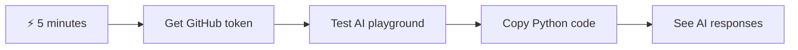

- **پہلا منٹ**: [GitHub Models Playground](https://github.com/marketplace/models/azure-openai/gpt-4o-mini/playground) پر جائیں اور ایک ذاتی رسائی ٹوکن بنائیں
- **دوسرا منٹ**: AI تعاملات کو براہ راست پلے گراؤنڈ انٹرفیس میں آزمائیں
- **تیسرا منٹ**: "کوڈ" ٹیب پر کلک کریں اور Python کا اسنیپٹ کاپی کریں
- **چوتھا منٹ**: اپنے ٹوکن کے ساتھ کوڈ کو مقامی طور پر چلائیں: `GITHUB_TOKEN=your_token python test.py`
- **پانچواں منٹ**: دیکھیں کہ آپ کا پہلا AI جواب آپ کے اپنے کوڈ سے پیدا ہوتا ہے

**فوری ٹیسٹ کوڈ**:
```python
import os
from openai import OpenAI

client = OpenAI(
    base_url="https://models.github.ai/inference",
    api_key="your_token_here"
)

response = client.chat.completions.create(
    messages=[{"role": "user", "content": "Hello AI!"}],
    model="openai/gpt-4o-mini"
)

print(response.choices[0].message.content)
```

**یہ کیوں اہم ہے**: 5 منٹ میں، آپ پروگراماتی AI تعامل کا جادو محسوس کریں گے۔ یہ وہ بنیادی تعمیراتی بلاک ہے جو ہر AI ایپلیکیشن کو طاقت دیتا ہے جسے آپ استعمال کرتے ہیں۔

یہ ہے کہ آپ کا مکمل شدہ پروجیکٹ کیسا نظر آئے گا:


## 🗺️ AI ایپلیکیشن ڈویلپمنٹ کے ذریعے آپ کا سیکھنے کا سفر

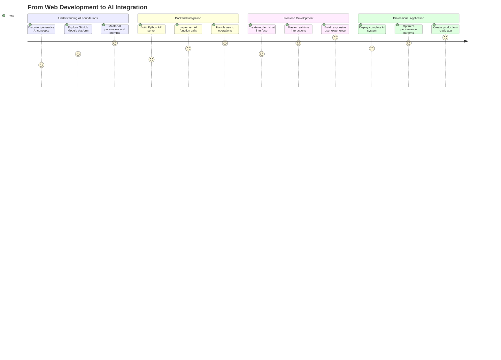

**آپ کے سفر کی منزل**: اس سبق کے اختتام تک، آپ نے ایک مکمل AI سے چلنے والی ایپلیکیشن بنائی ہوگی جو جدید AI اسسٹنٹس جیسے ChatGPT، Claude، اور Google Bard کو طاقت دینے والی وہی ٹیکنالوجیز اور پیٹرنز استعمال کرتی ہے۔

## AI کو سمجھنا: پراسرار سے مہارت تک

کوڈ میں غوطہ لگانے سے پہلے، آئیے سمجھتے ہیں کہ ہم کس کے ساتھ کام کر رہے ہیں۔ اگر آپ نے پہلے APIs استعمال کیے ہیں، تو آپ بنیادی پیٹرن کو جانتے ہیں: درخواست بھیجیں، جواب وصول کریں۔

AI APIs ایک جیسا ڈھانچہ رکھتے ہیں، لیکن ڈیٹا بیس سے پہلے سے ذخیرہ شدہ ڈیٹا کو بازیافت کرنے کے بجائے، وہ نئے جوابات پیدا کرتے ہیں جو وسیع مقدار میں متن سے سیکھے گئے پیٹرنز پر مبنی ہوتے ہیں۔ اسے اس فرق کی طرح سمجھیں جو ایک لائبریری کیٹلاگ سسٹم اور ایک جاننے والے لائبریرین کے درمیان ہوتا ہے جو متعدد ذرائع سے معلومات کو مربوط کر سکتا ہے۔

### "Generative AI" واقعی کیا ہے؟

سوچیں کہ Rosetta Stone نے اسکالرز کو مصری ہائروگلیفس کو سمجھنے کی اجازت دی تھی، معلوم اور نامعلوم زبانوں کے درمیان پیٹرنز تلاش کرکے۔ AI ماڈلز اسی طرح کام کرتے ہیں – وہ زبان کو سمجھنے کے لیے متن کی وسیع مقدار میں پیٹرنز تلاش کرتے ہیں، پھر ان پیٹرنز کا استعمال کرتے ہوئے نئے سوالات کے لیے مناسب جوابات پیدا کرتے ہیں۔

**آئیے اسے ایک سادہ موازنہ کے ساتھ توڑتے ہیں:**
- **روایتی ڈیٹا بیس**: جیسے آپ کے پیدائشی سرٹیفکیٹ کے لیے پوچھنا – آپ کو ہر بار بالکل وہی دستاویز ملتی ہے
- **سرچ انجن**: جیسے کسی لائبریرین سے بلیوں کے بارے میں کتابیں تلاش کرنے کے لیے کہنا – وہ آپ کو دستیاب چیزیں دکھاتے ہیں
- **Generative AI**: جیسے کسی جاننے والے دوست سے بلیوں کے بارے میں پوچھنا – وہ آپ کو دلچسپ چیزیں اپنے الفاظ میں بتاتے ہیں، جو آپ جاننا چاہتے ہیں اس کے مطابق

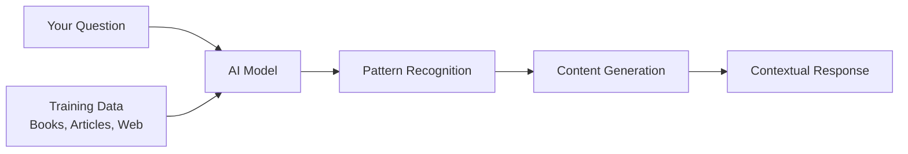

### AI ماڈلز کیسے سیکھتے ہیں (سادہ ورژن)

AI ماڈلز کتابوں، مضامین، اور گفتگو پر مشتمل بڑے ڈیٹا سیٹس کے سامنے آنے کے ذریعے سیکھتے ہیں۔ اس عمل کے ذریعے، وہ درج ذیل میں پیٹرنز کی شناخت کرتے ہیں:
- تحریری مواصلات میں خیالات کیسے ترتیب دیے جاتے ہیں
- کون سے الفاظ عام طور پر ایک ساتھ ظاہر ہوتے ہیں
- گفتگو عام طور پر کیسے بہتی ہے
- رسمی اور غیر رسمی مواصلات کے درمیان سیاق و سباق کے فرق

**یہ بالکل ویسا ہی ہے جیسے آثار قدیمہ کے ماہرین قدیم زبانوں کو ڈی کوڈ کرتے ہیں**: وہ گرامر، الفاظ، اور ثقافتی سیاق و سباق کو سمجھنے کے لیے ہزاروں مثالوں کا تجزیہ کرتے ہیں، آخر کار ان سیکھے گئے پیٹرنز کا استعمال کرتے ہوئے نئے متن کی تشریح کرنے کے قابل ہو جاتے ہیں۔

### GitHub Models کیوں؟

ہم GitHub Models استعمال کر رہے ہیں ایک عملی وجہ کے لیے – یہ ہمیں انٹرپرائز لیول AI تک رسائی فراہم کرتا ہے بغیر اپنی AI انفراسٹرکچر قائم کیے (جو، یقین کریں، آپ ابھی نہیں کرنا چاہتے!)۔ اسے موسم API استعمال کرنے جیسا سمجھیں بجائے اس کے کہ آپ خود موسم کی پیش گوئی کرنے کی کوشش کریں۔

یہ بنیادی طور پر "AI-as-a-Service" ہے، اور سب سے اچھی بات؟ شروع کرنے کے لیے یہ مفت ہے، لہذا آپ تجربہ کر سکتے ہیں بغیر کسی بڑے بل کی فکر کیے۔


ہم اپنے بیک اینڈ انٹیگریشن کے لیے GitHub Models استعمال کریں گے، جو ایک ڈویلپر دوستانہ انٹرفیس کے ذریعے پیشہ ورانہ گریڈ AI صلاحیتوں تک رسائی فراہم کرتا ہے۔ [GitHub Models Playground](https://github.com/marketplace/models/azure-openai/gpt-4o-mini/playground) ایک ٹیسٹنگ ماحول کے طور پر کام کرتا ہے جہاں آپ مختلف AI ماڈلز کے ساتھ تجربہ کر سکتے ہیں اور ان کی صلاحیتوں کو کوڈ میں نافذ کرنے سے پہلے سمجھ سکتے ہیں۔

## 🧠 AI ایپلیکیشن ڈویلپمنٹ ایکو سسٹم

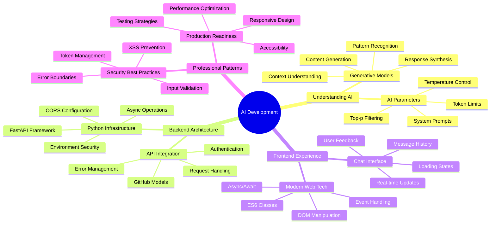

**بنیادی اصول**: AI ایپلیکیشن ڈویلپمنٹ روایتی ویب ڈویلپمنٹ کی مہارتوں کو AI سروس انٹیگریشن کے ساتھ جوڑتا ہے، ذہین ایپلیکیشنز تخلیق کرتا ہے جو صارفین کے لیے قدرتی اور جوابدہ محسوس ہوتی ہیں۔

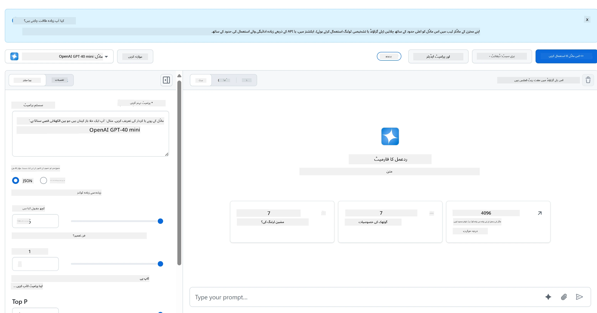

**یہاں ہے کہ پلے گراؤنڈ کو اتنا مفید کیا بناتا ہے:**
- **مختلف AI ماڈلز آزمائیں** جیسے GPT-4o-mini، Claude، اور دیگر (سب مفت!)
- **اپنے خیالات اور پرامپٹس کو ٹیسٹ کریں** کوڈ لکھنے سے پہلے
- **اپنی پسندیدہ پروگرامنگ زبان میں تیار کوڈ اسنیپٹس حاصل کریں**
- **تخلیقی سطح اور جواب کی لمبائی جیسی ترتیبات کو ایڈجسٹ کریں** تاکہ دیکھ سکیں کہ وہ آؤٹ پٹ کو کیسے متاثر کرتے ہیں

جب آپ تھوڑا سا کھیل چکے ہوں، تو بس "کوڈ" ٹیب پر کلک کریں اور اپنی پروگرامنگ زبان منتخب کریں تاکہ آپ کو وہ نفاذی کوڈ ملے جس کی آپ کو ضرورت ہے۔


## Python بیک اینڈ انٹیگریشن سیٹ اپ کرنا

اب آئیے Python کا استعمال کرتے ہوئے AI انٹیگریشن نافذ کریں۔ AI ایپلیکیشنز کے لیے Python بہترین ہے کیونکہ اس کی سادہ نحو اور طاقتور لائبریریاں ہیں۔ ہم GitHub Models پلے گراؤنڈ سے کوڈ کے ساتھ شروع کریں گے اور پھر اسے ایک قابل استعمال، پروڈکشن ریڈی فنکشن میں ریفیکٹر کریں گے۔

### بنیادی نفاذ کو سمجھنا

جب آپ پلے گراؤنڈ سے Python کوڈ حاصل کرتے ہیں، تو آپ کو کچھ ایسا ملے گا۔ اگر یہ پہلے تو بہت زیادہ لگے، تو فکر نہ کریں – آئیے اسے ٹکڑوں میں سمجھتے ہیں:

```python
"""Run this model in Python

> pip install openai
"""
import os
from openai import OpenAI

# To authenticate with the model you will need to generate a personal access token (PAT) in your GitHub settings. 
# Create your PAT token by following instructions here: https://docs.github.com/en/authentication/keeping-your-account-and-data-secure/managing-your-personal-access-tokens
client = OpenAI(
    base_url="https://models.github.ai/inference",
    api_key=os.environ["GITHUB_TOKEN"],
)

response = client.chat.completions.create(
    messages=[
        {
            "role": "system",
            "content": "",
        },
        {
            "role": "user",
            "content": "What is the capital of France?",
        }
    ],
    model="openai/gpt-4o-mini",
    temperature=1,
    max_tokens=4096,
    top_p=1
)

print(response.choices[0].message.content)
```

**اس کوڈ میں کیا ہو رہا ہے:**
- **ہم وہ ٹولز درآمد کرتے ہیں جن کی ہمیں ضرورت ہے**: `os` ماحول متغیرات کو پڑھنے کے لیے اور `OpenAI` AI سے بات کرنے کے لیے
- **ہم OpenAI کلائنٹ کو سیٹ اپ کرتے ہیں** تاکہ GitHub کے AI سرورز کی طرف اشارہ کریں بجائے OpenAI کے براہ راست
- **ہم ایک خاص GitHub ٹوکن کا استعمال کرتے ہوئے تصدیق کرتے ہیں** (اس پر بعد میں مزید!)
- **ہم اپنی گفتگو کو مختلف "کرداروں" کے ساتھ ترتیب دیتے ہیں** – اسے ایک کھیل کے منظر کے لیے ترتیب دینے جیسا سمجھیں
- **ہم اپنی درخواست AI کو بھیجتے ہیں** کچھ فائن ٹیوننگ پیرامیٹرز کے ساتھ
- **ہم اصل جواب کا متن نکالتے ہیں** تمام ڈیٹا سے جو واپس آتا ہے

### پیغام کے کرداروں کو سمجھنا: AI گفتگو کا فریم ورک

AI گفتگو ایک مخصوص ڈھانچے کا استعمال کرتی ہے جس میں مختلف "کردار" ہوتے ہیں جو الگ الگ مقاصد کی خدمت کرتے ہیں:

```python
messages=[
    {
        "role": "system",
        "content": "You are a helpful assistant who explains things simply."
    },
    {
        "role": "user", 
        "content": "What is machine learning?"
    }
]
```

**اسے ایک کھیل کی ہدایت کاری کی طرح سمجھیں:**
- **سسٹم کردار**: جیسے ایک اداکار کے لیے اسٹیج کی ہدایات – یہ AI کو بتاتا ہے کہ کیسے برتاؤ کرنا ہے، کس شخصیت کا ہونا ہے، اور کیسے جواب دینا ہے
- **صارف کردار**: ایپلیکیشن استعمال کرنے والے شخص کا اصل سوال یا پیغام
- **اسسٹنٹ کردار**: AI کا جواب (آپ یہ نہیں بھیجتے، لیکن یہ گفتگو کی تاریخ میں ظاہر ہوتا ہے)

**حقیقی دنیا کی مثال**: تصور کریں کہ آپ کسی دوست کو پارٹی میں کسی سے متعارف کروا رہے ہیں:
- **سسٹم پیغام**: "یہ میری دوست سارہ ہے، وہ ایک ڈاکٹر ہے جو طبی تصورات کو آسان الفاظ میں سمجھانے میں ماہر ہے"
- **صارف پیغام**: "کیا آپ وضاحت کر سکتی ہیں کہ ویکسین کیسے کام کرتی ہیں؟"
- **اسسٹنٹ جواب**: سارہ ایک دوستانہ ڈاکٹر کے طور پر جواب دیتی ہے، نہ کہ ایک وکیل یا شیف کے طور پر

### AI پیرامیٹرز کو سمجھنا: جواب کے رویے کو بہتر بنانا

AI API کالز میں عددی پیرامیٹرز ماڈل کے جوابات پیدا کرنے کے طریقے کو کنٹرول کرتے ہیں۔ یہ ترتیبات آپ کو مختلف استعمال کے معاملات کے لیے AI کے رویے کو ایڈجسٹ کرنے کی اجازت دیتی ہیں:

#### Temperature (0.0 سے 2.0): تخلیقی صلاحیت کا ڈائل

**یہ کیا کرتا ہے**: کنٹرول کرتا ہے کہ AI کے جوابات کتنے تخلیقی یا پیش گوئی کے قابل ہوں گے۔

**اسے جاز موسیقار کے ارتجاعی سطح کی طرح سمجھیں:**
- **Temperature = 0.1**: ہر بار بالکل وہی دھن بجانا (بہت پیش گوئی کے قابل)
- **Temperature = 0.7**: کچھ ذائقہ دار تغیرات شامل کرنا جبکہ قابل شناخت رہنا (متوازن تخلیقی صلاحیت)
- **Temperature = 1.5**: مکمل تجرباتی جاز غیر متوقع موڑ کے ساتھ (بہت غیر متوقع)

```python
# Very predictable responses (good for factual questions)
response = client.chat.completions.create(
    messages=[{"role": "user", "content": "What is 2+2?"}],
    temperature=0.1  # Will almost always say "4"
)

# Creative responses (good for brainstorming)
response = client.chat.completions.create(
    messages=[{"role": "user", "content": "Write a creative story opening"}],
    temperature=1.2  # Will generate unique, unexpected stories
)
```

#### Max Tokens (1 سے 4096+): جواب کی لمبائی کا کنٹرولر

**یہ کیا کرتا ہے**: AI کے جواب کی لمبائی پر حد مقرر کرتا ہے۔

**ٹوکنز کو الفاظ کے برابر سمجھیں** (انگریزی میں تقریباً 1 ٹوکن = 0.75 الفاظ):
- **max_tokens=50**: مختصر اور میٹھا (جیسے ایک ٹیکسٹ میسج)
- **max_tokens=500**: ایک اچھا پیراگراف یا دو
- **max_tokens=2000**: مثالوں کے ساتھ تفصیلی وضاحت

```python
# Short, concise answers
response = client.chat.completions.create(
    messages=[{"role": "user", "content": "Explain JavaScript"}],
    max_tokens=100  # Forces a brief explanation
)

# Detailed, comprehensive answers  
response = client.chat.completions.create(
    messages=[{"role": "user", "content": "Explain JavaScript"}],
    max_tokens=1500  # Allows for detailed explanations with examples
)
```

#### Top_p (0.0 سے 1.0): فوکس پیرامیٹر

**یہ کیا کرتا ہے**: کنٹرول کرتا ہے کہ AI سب سے زیادہ ممکنہ جوابات پر کتنا مرکوز رہتا ہے۔

**تصور کریں کہ AI کے پاس ایک بہت بڑا ذخیرہ الفاظ ہے، ہر لفظ کی درجہ بندی کے ساتھ کہ ہر لفظ کتنا ممکن ہے:**
- **top_p=0.1**: صرف سب سے زیادہ ممکنہ 10% الفاظ پر غور کرتا ہے (بہت مرکوز)
- **top_p=0.9**: ممکنہ الفاظ کے 90% پر غور کرتا ہے (زیادہ تخلیقی)
- **top_p=1.0**: ہر چیز پر غور کرتا ہے (زیادہ سے زیادہ تنوع)

**مثال کے طور پر**: اگر آپ پوچھیں "آسمان عام طور پر..."
- **کم top_p**: تقریباً یقینی طور پر کہے گا "نیلا"
- **زیادہ top_p**: کہہ سکتا ہے "نیلا"، "بادلوں سے بھرا ہوا"، "وسیع"، "بدلتا ہوا"، "خوبصورت"، وغیرہ۔

### سب کچھ ایک ساتھ رکھنا: مختلف استعمال کے معاملات کے لیے پیرامیٹر امتزاج

```python
# For factual, consistent answers (like a documentation bot)
factual_params = {
    "temperature": 0.2,
    "max_tokens": 300,
    "top_p": 0.3
}

# For creative writing assistance
creative_params = {
    "temperature": 1.1,
    "max_tokens": 1000,
    "top_p": 0.9
}

# For conversational, helpful responses (balanced)
conversational_params = {
    "temperature": 0.7,
    "max_tokens": 500,
    "top_p": 0.8
}
```

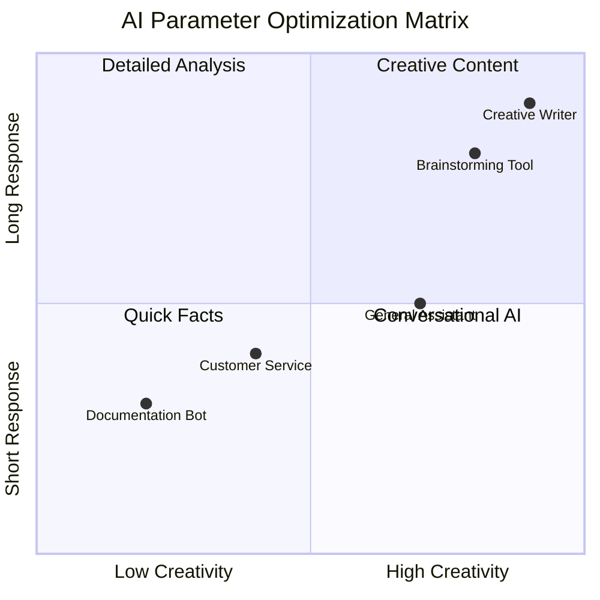

**یہ پیرامیٹرز کیوں اہم ہیں سمجھنا**: مختلف ایپلیکیشنز کو مختلف قسم کے جوابات کی ضرورت ہوتی ہے۔ ایک کسٹمر سروس بوٹ کو مستقل اور حقیقت پسندانہ ہونا چاہیے (کم Temperature)، جبکہ ایک تخلیقی تحریری اسسٹنٹ کو تخیلاتی اور متنوع ہونا چاہیے (زیادہ Temperature)۔ ان پیرامیٹرز کو سمجھنا آپ کو اپنے AI کی شخصیت اور جواب کے انداز پر کنٹرول دیتا ہے۔
```

**Here's what's happening in this code:**
- **We import** the tools we need: `os` for reading environment variables and `OpenAI` for talking to the AI
- **We set up** the OpenAI client to point to GitHub's AI servers instead of OpenAI directly
- **We authenticate** using a special GitHub token (more on that in a minute!)
- **We structure** our conversation with different "roles" – think of it like setting the scene for a play
- **We send** our request to the AI with some fine-tuning parameters
- **We extract** the actual response text from all the data that comes back

> 🔐 **Security Note**: Never hardcode API keys in your source code! Always use environment variables to store sensitive credentials like your `GITHUB_TOKEN`.

### Creating a Reusable AI Function

Let's refactor this code into a clean, reusable function that we can easily integrate into our web application:

```python
import asyncio
from openai import AsyncOpenAI

# Use AsyncOpenAI for better performance
client = AsyncOpenAI(
    base_url="https://models.github.ai/inference",
    api_key=os.environ["GITHUB_TOKEN"],
)

async def call_llm_async(prompt: str, system_message: str = "You are a helpful assistant."):
    """
    Sends a prompt to the AI model asynchronously and returns the response.
    
    Args:
        prompt: The user's question or message
        system_message: Instructions that define the AI's behavior and personality
    
    Returns:
        str: The AI's response to the prompt
    """
    try:
        response = await client.chat.completions.create(
            messages=[
                {
                    "role": "system",
                    "content": system_message,
                },
                {
                    "role": "user",
                    "content": prompt,
                }
            ],
            model="openai/gpt-4o-mini",
            temperature=1,
            max_tokens=4096,
            top_p=1
        )
        return response.choices[0].message.content
    except Exception as e:
        logger.error(f"AI API error: {str(e)}")
        return "I'm sorry, I'm having trouble processing your request right now."

# Backward compatibility function for synchronous calls
def call_llm(prompt: str, system_message: str = "You are a helpful assistant."):
    """Synchronous wrapper for async AI calls."""
    return asyncio.run(call_llm_async(prompt, system_message))
```

**اس بہتر فنکشن کو سمجھنا:**
- **دو پیرامیٹرز قبول کرتا ہے**: صارف کا پرامپٹ اور ایک اختیاری سسٹم پیغام
- **عام اسسٹنٹ رویے کے لیے ایک ڈیفالٹ سسٹم پیغام فراہم کرتا ہے**
- **بہتر کوڈ دستاویزات کے لیے مناسب Python قسم کے اشارے استعمال کرتا ہے**
- **فنکشن کے مقصد اور پیرامیٹرز کی وضاحت کرنے والا ایک تفصیلی ڈاکسٹرنگ شامل کرتا ہے**
- **صرف جواب کا مواد واپس کرتا ہے**، اسے ہمارے ویب API میں استعمال کرنا آسان بناتا ہے
- **ماڈل پیرامیٹرز کو مستقل AI رویے کے لیے برقرار رکھتا ہے**

### سسٹم پرامپٹس کا جادو: AI شخصیت کو پروگرام کرنا

اگر پیرامیٹرز AI کے سوچنے کے طریقے کو کنٹرول کرتے ہیں، تو سسٹم پرامپٹس کنٹرول کرتے ہیں کہ AI کون سمجھتا ہے کہ وہ ہے۔ یہ واقعی AI کے ساتھ کام کرنے کے سب سے دلچسپ حصوں میں سے ایک ہے – آپ بنیادی طور پر AI کو مکمل شخصیت، مہارت کی سطح، اور مواصلات کا انداز دے رہے ہیں۔

**سسٹم پرامپٹس کو مختلف کرداروں کے لیے مختلف اداکاروں کو کاسٹ کرنے جیسا سمجھیں**: ایک عام اسسٹنٹ رکھنے کے بجائے، آپ مختلف حالات کے لیے ماہرین تخلیق کر سکتے ہیں۔ ایک صبر کرنے والے استاد کی ضرورت ہے؟ ایک تخلیقی دماغی طوفان کا ساتھی؟ ایک سنجیدہ کاروباری مشیر؟ بس سسٹم پرامپٹ تبدیل کریں!

#### سسٹم پرامپٹس اتنے طاقتور کیوں ہیں؟

یہاں دلچسپ حصہ ہے: AI ماڈلز کو بے شمار گفتگو پر تربیت دی گئی ہے جہاں لوگ مختلف کرداروں اور مہارت کی سطح کو اپناتے ہیں۔ جب آپ AI کو ایک مخصوص کردار دیتے ہیں، تو یہ ایک سوئچ کو پلٹنے جیسا ہے جو ان تمام سیکھے گئے پیٹرنز کو فعال کرتا ہے۔

**یہ AI کے لیے طریقہ اداکاری کی طرح ہے**:
**2. آؤٹ پٹ فارمیٹنگ**: AI کو بتائیں کہ جوابات کو کیسے ترتیب دینا ہے  
```python
system_prompt = """
You are a technical mentor. Always structure your responses as:
1. Quick Answer (1-2 sentences)
2. Detailed Explanation 
3. Code Example
4. Common Pitfalls to Avoid
5. Next Steps for Learning
"""
```
  
**3. پابندیاں مقرر کرنا**: وضاحت کریں کہ AI کو کیا نہیں کرنا چاہیے  
```python
system_prompt = """
You are a coding tutor focused on teaching best practices. Never write complete 
solutions for the user - instead, guide them with hints and questions so they 
learn by doing. Always explain the 'why' behind coding decisions.
"""
```
  

#### آپ کے چیٹ اسسٹنٹ کے لیے یہ کیوں اہم ہے  

سسٹم پرامپٹس کو سمجھنا آپ کو خاص AI اسسٹنٹس بنانے کی زبردست طاقت دیتا ہے:  
- **کسٹمر سروس بوٹ**: مددگار، صبر کرنے والا، پالیسی سے آگاہ  
- **لرننگ ٹیوٹر**: حوصلہ افزا، مرحلہ وار، سمجھنے کی جانچ کرتا ہے  
- **تخلیقی ساتھی**: تخیلاتی، خیالات پر کام کرتا ہے، "کیا ہوگا اگر؟" پوچھتا ہے  
- **تکنیکی ماہر**: درست، تفصیلی، سیکیورٹی سے آگاہ  

**اہم بصیرت**: آپ صرف AI API کو کال نہیں کر رہے – آپ ایک حسب ضرورت AI شخصیت بنا رہے ہیں جو آپ کے مخصوص استعمال کے لیے کام کرتی ہے۔ یہی چیز جدید AI ایپلیکیشنز کو عام کے بجائے خاص اور مفید بناتی ہے۔  

### 🎯 تعلیمی جائزہ: AI شخصیت پروگرامنگ  

**رکیں اور غور کریں**: آپ نے ابھی سسٹم پرامپٹس کے ذریعے AI شخصیات کو پروگرام کرنا سیکھا ہے۔ یہ جدید AI ایپلیکیشن ڈیولپمنٹ میں ایک بنیادی مہارت ہے۔  

**جلدی خود تشخیص**:  
- کیا آپ وضاحت کر سکتے ہیں کہ سسٹم پرامپٹس عام صارف پیغامات سے کیسے مختلف ہیں؟  
- temperature اور top_p پیرامیٹرز میں کیا فرق ہے؟  
- آپ کسی خاص استعمال کے لیے (جیسے کوڈنگ ٹیوٹر) سسٹم پرامپٹ کیسے بنائیں گے؟  

**حقیقی دنیا کا تعلق**: سسٹم پرامپٹ تکنیکیں جو آپ نے سیکھی ہیں ہر بڑی AI ایپلیکیشن میں استعمال ہوتی ہیں - GitHub Copilot کی کوڈنگ مدد سے لے کر ChatGPT کی گفتگو انٹرفیس تک۔ آپ وہی پیٹرنز سیکھ رہے ہیں جو بڑے ٹیک کمپنیوں کی AI پروڈکٹ ٹیمیں استعمال کرتی ہیں۔  

**چیلنج سوال**: آپ مختلف صارف اقسام (ابتدائی بمقابلہ ماہر) کے لیے مختلف AI شخصیات کیسے ڈیزائن کریں گے؟ غور کریں کہ ایک ہی بنیادی AI ماڈل پرامپٹ انجینئرنگ کے ذریعے مختلف سامعین کی خدمت کیسے کر سکتا ہے۔  

## FastAPI کے ساتھ ویب API بنانا: آپ کا اعلیٰ کارکردگی AI مواصلاتی مرکز  

اب ہم وہ بیک اینڈ بنائیں گے جو آپ کے فرنٹ اینڈ کو AI سروسز سے جوڑتا ہے۔ ہم FastAPI استعمال کریں گے، ایک جدید Python فریم ورک جو AI ایپلیکیشنز کے لیے APIs بنانے میں بہترین ہے۔  

FastAPI اس قسم کے پروجیکٹ کے لیے کئی فوائد پیش کرتا ہے: ہم وقتی درخواستوں کو سنبھالنے کے لیے بلٹ ان async سپورٹ، خودکار API دستاویزات کی تخلیق، اور بہترین کارکردگی۔ آپ کا FastAPI سرور ایک درمیانی کردار ادا کرتا ہے جو فرنٹ اینڈ سے درخواستیں وصول کرتا ہے، AI سروسز سے بات چیت کرتا ہے، اور فارمیٹ شدہ جوابات واپس کرتا ہے۔  

### AI ایپلیکیشنز کے لیے FastAPI کیوں؟  

آپ سوچ سکتے ہیں: "کیا میں AI کو براہ راست اپنے فرنٹ اینڈ جاوا اسکرپٹ سے کال نہیں کر سکتا؟" یا "Flask یا Django کے بجائے FastAPI کیوں؟" زبردست سوالات!  

**یہاں وجہ ہے کہ FastAPI ہمارے منصوبے کے لیے بہترین ہے:**  
- **ڈیفالٹ async**: ایک ساتھ کئی AI درخواستوں کو سنبھال سکتا ہے بغیر پھنسے  
- **خودکار دستاویزات**: `/docs` پر جائیں اور مفت میں ایک خوبصورت، انٹرایکٹو API دستاویزات کا صفحہ حاصل کریں  
- **بلٹ ان توثیق**: مسائل پیدا ہونے سے پہلے غلطیوں کو پکڑتا ہے  
- **بہت تیز**: Python کے سب سے تیز فریم ورک میں سے ایک  
- **جدید Python**: Python کی تمام جدید خصوصیات استعمال کرتا ہے  

**اور یہاں وجہ ہے کہ ہمیں بیک اینڈ کی ضرورت ہے:**  

**سیکیورٹی**: آپ کی AI API کلید ایک پاس ورڈ کی طرح ہے – اگر آپ اسے فرنٹ اینڈ جاوا اسکرپٹ میں ڈالیں، تو کوئی بھی جو آپ کی ویب سائٹ کے سورس کوڈ کو دیکھے گا اسے چرا سکتا ہے اور آپ کے AI کریڈٹس استعمال کر سکتا ہے۔ بیک اینڈ حساس اسناد کو محفوظ رکھتا ہے۔  

**ریٹ لمیٹنگ اور کنٹرول**: بیک اینڈ آپ کو کنٹرول کرنے دیتا ہے کہ صارفین کتنی بار درخواستیں کر سکتے ہیں، صارف کی توثیق نافذ کر سکتے ہیں، اور استعمال کو ٹریک کرنے کے لیے لاگنگ شامل کر سکتے ہیں۔  

**ڈیٹا پروسیسنگ**: آپ گفتگو کو محفوظ کرنا، نامناسب مواد کو فلٹر کرنا، یا متعدد AI سروسز کو یکجا کرنا چاہ سکتے ہیں۔ بیک اینڈ وہ جگہ ہے جہاں یہ منطق رہتی ہے۔  

**آرکیٹیکچر کلائنٹ-سرور ماڈل جیسا ہے:**  
- **فرنٹ اینڈ**: تعامل کے لیے صارف انٹرفیس کی پرت  
- **بیک اینڈ API**: درخواست پروسیسنگ اور روٹنگ کی پرت  
- **AI سروس**: بیرونی حساب کتاب اور جواب کی تخلیق  
- **ماحولیاتی متغیرات**: محفوظ ترتیب اور اسناد کا ذخیرہ  

### درخواست-جواب کے بہاؤ کو سمجھنا  

آئیے دیکھتے ہیں کہ جب کوئی صارف پیغام بھیجتا ہے تو کیا ہوتا ہے:  

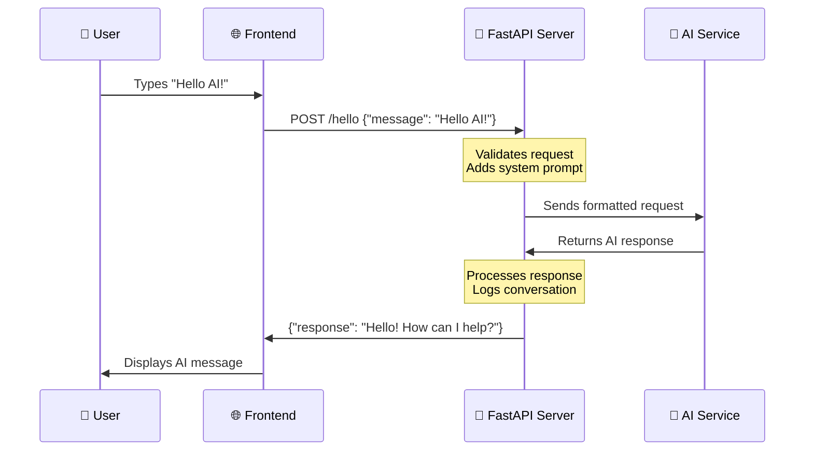
  
**ہر قدم کو سمجھنا:**  
1. **صارف کا تعامل**: شخص چیٹ انٹرفیس میں ٹائپ کرتا ہے  
2. **فرنٹ اینڈ پروسیسنگ**: جاوا اسکرپٹ ان پٹ کو کیپچر کرتا ہے اور اسے JSON کے طور پر فارمیٹ کرتا ہے  
3. **API توثیق**: FastAPI درخواست کو خودکار طور پر Pydantic ماڈلز کا استعمال کرتے ہوئے توثیق کرتا ہے  
4. **AI انضمام**: بیک اینڈ سیاق و سباق (سسٹم پرامپٹ) شامل کرتا ہے اور AI سروس کو کال کرتا ہے  
5. **جواب کی ہینڈلنگ**: API AI جواب وصول کرتا ہے اور اگر ضرورت ہو تو اسے تبدیل کر سکتا ہے  
6. **فرنٹ اینڈ ڈسپلے**: جاوا اسکرپٹ جواب کو چیٹ انٹرفیس میں دکھاتا ہے  

### API آرکیٹیکچر کو سمجھنا  

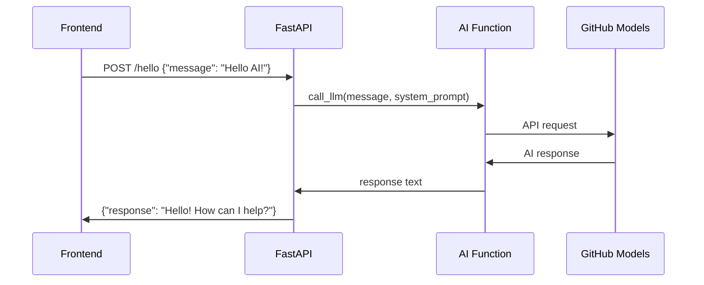
  
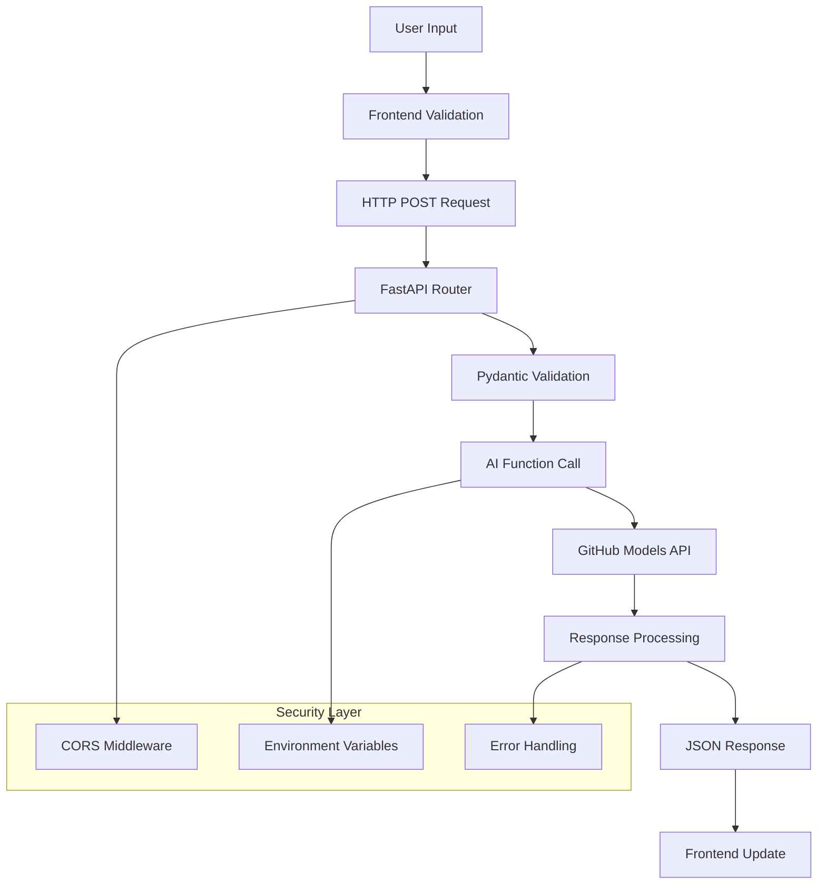
  

### FastAPI ایپلیکیشن بنانا  

آئیے اپنی API مرحلہ وار بنائیں۔ `api.py` نامی فائل بنائیں اور درج ذیل FastAPI کوڈ شامل کریں:  

```python
# api.py
from fastapi import FastAPI, HTTPException
from fastapi.middleware.cors import CORSMiddleware
from pydantic import BaseModel
from llm import call_llm
import logging

# Configure logging
logging.basicConfig(level=logging.INFO)
logger = logging.getLogger(__name__)

# Create FastAPI application
app = FastAPI(
    title="AI Chat API",
    description="A high-performance API for AI-powered chat applications",
    version="1.0.0"
)

# Configure CORS
app.add_middleware(
    CORSMiddleware,
    allow_origins=["*"],  # Configure appropriately for production
    allow_credentials=True,
    allow_methods=["*"],
    allow_headers=["*"],
)

# Pydantic models for request/response validation
class ChatMessage(BaseModel):
    message: str

class ChatResponse(BaseModel):
    response: str

@app.get("/")
async def root():
    """Root endpoint providing API information."""
    return {
        "message": "Welcome to the AI Chat API",
        "docs": "/docs",
        "health": "/health"
    }

@app.get("/health")
async def health_check():
    """Health check endpoint."""
    return {"status": "healthy", "service": "ai-chat-api"}

@app.post("/hello", response_model=ChatResponse)
async def chat_endpoint(chat_message: ChatMessage):
    """Main chat endpoint that processes messages and returns AI responses."""
    try:
        # Extract and validate message
        message = chat_message.message.strip()
        if not message:
            raise HTTPException(status_code=400, detail="Message cannot be empty")
        
        logger.info(f"Processing message: {message[:50]}...")
        
        # Call AI service (note: call_llm should be made async for better performance)
        ai_response = await call_llm_async(message, "You are a helpful and friendly assistant.")
        
        logger.info("AI response generated successfully")
        return ChatResponse(response=ai_response)
        
    except HTTPException:
        raise
    except Exception as e:
        logger.error(f"Error processing chat message: {str(e)}")
        raise HTTPException(status_code=500, detail="Internal server error")

if __name__ == "__main__":
    import uvicorn
    uvicorn.run(app, host="0.0.0.0", port=5000, reload=True)
```
  
**FastAPI کے نفاذ کو سمجھنا:**  
- **درآمد کرتا ہے** FastAPI جدید ویب فریم ورک کی فعالیت کے لیے اور Pydantic ڈیٹا کی توثیق کے لیے  
- **خودکار API دستاویزات تخلیق کرتا ہے** (جب سرور چلتا ہے تو `/docs` پر دستیاب ہوتا ہے)  
- **CORS مڈل ویئر کو فعال کرتا ہے** تاکہ مختلف اصل سے فرنٹ اینڈ درخواستوں کی اجازت دی جا سکے  
- **Pydantic ماڈلز کی وضاحت کرتا ہے** خودکار درخواست/جواب کی توثیق اور دستاویزات کے لیے  
- **بہتر کارکردگی کے لیے async اینڈ پوائنٹس استعمال کرتا ہے**  
- **مناسب HTTP اسٹیٹس کوڈز اور غلطی ہینڈلنگ نافذ کرتا ہے** HTTPException کے ساتھ  
- **ساختی لاگنگ شامل کرتا ہے** نگرانی اور ڈیبگنگ کے لیے  
- **سروس کی حیثیت کی نگرانی کے لیے ہیلتھ چیک اینڈ پوائنٹ فراہم کرتا ہے**  

**روایتی فریم ورک کے مقابلے میں FastAPI کے اہم فوائد:**  
- **خودکار توثیق**: Pydantic ماڈلز ڈیٹا کی سالمیت کو پروسیسنگ سے پہلے یقینی بناتے ہیں  
- **انٹرایکٹو دستاویزات**: `/docs` پر جائیں خودکار طور پر تیار کردہ، قابل آزمائش API دستاویزات کے لیے  
- **ٹائپ سیفٹی**: Python ٹائپ ہنٹس رن ٹائم کی غلطیوں کو روکتے ہیں اور کوڈ کے معیار کو بہتر بناتے ہیں  
- **async سپورٹ**: ایک ساتھ متعدد AI درخواستوں کو بلاک کیے بغیر سنبھالتا ہے  
- **کارکردگی**: حقیقی وقت کی ایپلیکیشنز کے لیے درخواست پروسیسنگ نمایاں طور پر تیز  

### CORS کو سمجھنا: ویب کا سیکیورٹی گارڈ  

CORS (Cross-Origin Resource Sharing) ایک سیکیورٹی گارڈ کی طرح ہے جو چیک کرتا ہے کہ آیا زائرین کو داخل ہونے کی اجازت ہے۔ آئیے سمجھتے ہیں کہ یہ کیوں اہم ہے اور یہ آپ کی ایپلیکیشن کو کیسے متاثر کرتا ہے۔  

#### CORS کیا ہے اور یہ کیوں موجود ہے؟  

**مسئلہ**: تصور کریں کہ اگر کوئی بھی ویب سائٹ آپ کی اجازت کے بغیر آپ کے بینک کی ویب سائٹ پر درخواستیں کر سکتی۔ یہ ایک سیکیورٹی ڈراؤنا خواب ہوگا! براؤزرز اسے "Same-Origin Policy" کے ذریعے ڈیفالٹ سے روکتے ہیں۔  

**Same-Origin Policy**: براؤزرز صرف ویب صفحات کو اسی ڈومین، پورٹ، اور پروٹوکول سے درخواستیں کرنے کی اجازت دیتے ہیں جس سے وہ لوڈ کیے گئے تھے۔  

**حقیقی دنیا کی مثال**: یہ اپارٹمنٹ بلڈنگ کی سیکیورٹی کی طرح ہے – صرف رہائشی (ایک ہی اصل) کو ڈیفالٹ سے عمارت تک رسائی حاصل ہے۔ اگر آپ کسی دوست (مختلف اصل) کو مدعو کرنا چاہتے ہیں، تو آپ کو سیکیورٹی کو واضح طور پر بتانا ہوگا کہ یہ ٹھیک ہے۔  

#### آپ کے ترقیاتی ماحول میں CORS  

ترقی کے دوران، آپ کا فرنٹ اینڈ اور بیک اینڈ مختلف پورٹس پر چلتا ہے:  
- فرنٹ اینڈ: `http://localhost:3000` (یا file:// اگر HTML کو براہ راست کھول رہے ہیں)  
- بیک اینڈ: `http://localhost:5000`  

یہ "مختلف اصل" سمجھے جاتے ہیں حالانکہ وہ ایک ہی کمپیوٹر پر ہیں!  

```python
from fastapi.middleware.cors import CORSMiddleware

app = FastAPI(__name__)
CORS(app)   # This tells browsers: "It's okay for other origins to make requests to this API"
```
  
**عملی طور پر CORS کنفیگریشن کیا کرتا ہے:**  
- **خاص HTTP ہیڈرز شامل کرتا ہے** API جوابات میں جو براؤزرز کو بتاتے ہیں "یہ کراس-اورجن درخواست کی اجازت ہے"  
- **"پری فلائٹ" درخواستوں کو ہینڈل کرتا ہے** (براؤزرز کبھی کبھار اصل درخواست بھیجنے سے پہلے اجازت چیک کرتے ہیں)  
- **براؤزر کنسول میں "CORS پالیسی کے ذریعے بلاک کیا گیا" کی خرابی کو روکتا ہے**  

#### CORS سیکیورٹی: ترقی بمقابلہ پروڈکشن  

```python
# 🚨 Development: Allows ALL origins (convenient but insecure)
CORS(app)

# ✅ Production: Only allow your specific frontend domain
CORS(app, origins=["https://yourdomain.com", "https://www.yourdomain.com"])

# 🔒 Advanced: Different origins for different environments
if app.debug:  # Development mode
    CORS(app, origins=["http://localhost:3000", "http://127.0.0.1:3000"])
else:  # Production mode
    CORS(app, origins=["https://yourdomain.com"])
```
  
**یہ کیوں اہم ہے**: ترقی میں، `CORS(app)` آپ کے سامنے کا دروازہ کھلا چھوڑنے جیسا ہے – آسان لیکن غیر محفوظ۔ پروڈکشن میں، آپ بالکل وضاحت کرنا چاہتے ہیں کہ کون سی ویب سائٹس آپ کی API سے بات کر سکتی ہیں۔  

#### عام CORS منظرنامے اور حل  

| منظرنامہ | مسئلہ | حل |  
|----------|---------|----------|  
| **مقامی ترقی** | فرنٹ اینڈ بیک اینڈ تک نہیں پہنچ سکتا | FastAPI میں CORSMiddleware شامل کریں |  
| **GitHub Pages + Heroku** | تعینات فرنٹ اینڈ API تک نہیں پہنچ سکتا | اپنے GitHub Pages URL کو CORS اصل میں شامل کریں |  
| **حسب ضرورت ڈومین** | پروڈکشن میں CORS کی غلطیاں | CORS اصل کو اپنے ڈومین سے ملانے کے لیے اپ ڈیٹ کریں |  
| **موبائل ایپ** | ایپ ویب API تک نہیں پہنچ سکتی | اپنی ایپ کے ڈومین کو شامل کریں یا احتیاط سے `*` استعمال کریں |  

**پرو ٹپ**: آپ اپنے براؤزر کے Developer Tools میں نیٹ ورک ٹیب کے تحت CORS ہیڈرز چیک کر سکتے ہیں۔ جواب میں `Access-Control-Allow-Origin` جیسے ہیڈرز تلاش کریں۔  

### غلطی ہینڈلنگ اور توثیق  

نوٹ کریں کہ ہماری API میں مناسب غلطی ہینڈلنگ شامل ہے:  

```python
# Validate that we received a message
if not message:
    return jsonify({"error": "Message field is required"}), 400
```
  
**اہم توثیق کے اصول:**  
- **ضروری فیلڈز کی جانچ کرتا ہے** درخواستوں کو پروسیس کرنے سے پہلے  
- **معنی خیز غلطی کے پیغامات واپس کرتا ہے** JSON فارمیٹ میں  
- **مناسب HTTP اسٹیٹس کوڈز استعمال کرتا ہے** (خراب درخواستوں کے لیے 400)  
- **واضح فیڈبیک فراہم کرتا ہے** فرنٹ اینڈ ڈیولپرز کو مسائل کو ڈیبگ کرنے میں مدد کرنے کے لیے  

## اپنا بیک اینڈ سیٹ اپ اور چلانا  

اب جب کہ ہمارے پاس AI انضمام اور FastAPI سرور تیار ہے، آئیے سب کچھ چلائیں۔ سیٹ اپ کے عمل میں Python کی ضروریات انسٹال کرنا، ماحولیاتی متغیرات کو ترتیب دینا، اور اپنا ترقیاتی سرور شروع کرنا شامل ہے۔  

### Python ماحول سیٹ اپ  

آئیے آپ کا Python ترقیاتی ماحول سیٹ کریں۔ ورچوئل ماحول مین ہٹن پروجیکٹ کے کمپارٹمنٹلائزڈ اپروچ کی طرح ہیں – ہر پروجیکٹ کو اپنے مخصوص ٹولز اور ضروریات کے ساتھ اپنا الگ تھلگ جگہ ملتا ہے، مختلف پروجیکٹس کے درمیان تنازعات کو روکنے کے لیے۔  

```bash
# Navigate to your backend directory
cd backend

# Create a virtual environment (like creating a clean room for your project)
python -m venv venv

# Activate it (Linux/Mac)
source ./venv/bin/activate

# On Windows, use:
# venv\Scripts\activate

# Install the good stuff
pip install openai fastapi uvicorn python-dotenv
```
  
**ہم نے ابھی کیا کیا:**  
- **اپنا Python کا چھوٹا سا بلبلہ بنایا** جہاں ہم پیکجز انسٹال کر سکتے ہیں بغیر کسی اور چیز کو متاثر کیے  
- **اسے فعال کیا** تاکہ ہمارا ٹرمینل جان سکے کہ اس مخصوص ماحول کو استعمال کرنا ہے  
- **ضروریات انسٹال کیں**: OpenAI AI جادو کے لیے، FastAPI ہمارے ویب API کے لیے، Uvicorn اسے چلانے کے لیے، اور python-dotenv محفوظ رازوں کے انتظام کے لیے  

**اہم ضروریات کی وضاحت:**  
- **FastAPI**: جدید، تیز ویب فریم ورک خودکار API دستاویزات کے ساتھ  
- **Uvicorn**: تیز ترین ASGI سرور جو FastAPI ایپلیکیشنز چلاتا ہے  
- **OpenAI**: GitHub ماڈلز اور OpenAI API انضمام کے لیے آفیشل لائبریری  
- **python-dotenv**: .env فائلوں سے محفوظ ماحولیاتی متغیرات لوڈ کرنا  

### ماحولیاتی ترتیب: رازوں کو محفوظ رکھنا  

اس سے پہلے کہ ہم اپنی API شروع کریں، ہمیں ویب ڈیولپمنٹ میں سب سے اہم سبق کے بارے میں بات کرنی ہوگی: اپنے رازوں کو واقعی خفیہ رکھنے کا طریقہ۔ ماحولیاتی متغیرات ایک محفوظ والٹ کی طرح ہیں جسے صرف آپ کی ایپلیکیشن تک رسائی حاصل ہے۔  

#### ماحولیاتی متغیرات کیا ہیں؟  

**ماحولیاتی متغیرات کو ایک محفوظ ڈپازٹ باکس کی طرح سمجھیں** – آپ اپنی قیمتی چیزیں وہاں رکھتے ہیں، اور صرف آپ (اور آپ کی ایپ) کے پاس اسے نکالنے کی چابی ہوتی ہے۔ حساس معلومات کو براہ راست اپنے کوڈ میں لکھنے کے بجائے (جہاں کوئی بھی اسے دیکھ سکتا ہے)، آپ اسے محفوظ طریقے سے ماحول میں ذخیرہ کرتے ہیں۔  

**یہاں فرق ہے:**  
- **غلط طریقہ**: اپنا پاس ورڈ ایک چپچپا نوٹ پر لکھ کر اپنے مانیٹر پر رکھنا  
- **صحیح طریقہ**: اپنا پاس ورڈ ایک محفوظ پاس ورڈ مینیجر میں رکھنا جس تک صرف آپ کو رسائی حاصل ہو  

#### ماحولیاتی متغیرات کیوں اہم ہیں  

```python
# 🚨 NEVER DO THIS - API key visible to everyone
client = OpenAI(
    api_key="ghp_1234567890abcdef...",  # Anyone can steal this!
    base_url="https://models.github.ai/inference"
)

# ✅ DO THIS - API key stored securely
client = OpenAI(
    api_key=os.environ["GITHUB_TOKEN"],  # Only your app can access this
    base_url="https://models.github.ai/inference"
)
```
  
**جب آپ رازوں کو ہارڈ کوڈ کرتے ہیں تو کیا ہوتا ہے:**  
1. **ورژن کنٹرول کی نمائش**: آپ کے Git ریپوزیٹری تک رسائی رکھنے والا کوئی بھی آپ کی API کلید دیکھتا ہے  
2. **عوامی ریپوزیٹریز**: اگر آپ GitHub پر اپ لوڈ کرتے ہیں، تو آپ کی کلید پورے انٹرنیٹ کے لیے نظر آتی ہے  
3. **ٹیم شیئرنگ**: آپ کے پروجیکٹ پر کام کرنے والے دوسرے ڈیولپرز کو آپ کی ذاتی API کلید تک رسائی حاصل ہوتی ہے  
4. **سیکیورٹی کی خلاف ورزیاں**: اگر کوئی آپ کی API کلید چوری کرتا ہے، تو وہ آپ کے AI کریڈٹس استعمال کر سکتا ہے  

#### آپ کی ماحولیاتی فائل ترتیب دینا  

اپنے بیک اینڈ ڈائریکٹری میں `.env` فائل بنائیں۔ یہ فائل آپ کے رازوں کو مقامی طور پر ذخیرہ کرتی ہے:  

```bash
# .env file - This should NEVER be committed to Git
GITHUB_TOKEN=your_github_personal_access_token_here
FASTAPI_DEBUG=True
ENVIRONMENT=development
```
  
**.env فائل کو سمجھنا:**  
- **ایک لائن میں ایک راز** `KEY=value` فارمیٹ میں  
- **برابر کے نشان کے ارد گرد کوئی جگہ نہیں**  
- **عام طور پر اقتباسات کی ضرورت نہیں**  
- **تبصرے** `#` سے شروع ہوتے ہیں  

#### اپنا GitHub پرسنل ایکسیس ٹوکن بنانا  

آپ کا GitHub ٹوکن ایک خاص پاس ورڈ کی طرح ہے جو آپ کی ایپلیکیشن کو GitHub کی AI سروسز استعمال کرنے کی اجازت دیتا ہے:  

**ٹوکن تخلیق کا مرحلہ وار عمل:**  
1. **GitHub سیٹنگز پر جائیں** →
اب آتا ہے وہ دلچسپ لمحہ – اپنا FastAPI ڈیولپمنٹ سرور شروع کریں اور اپنی AI انٹیگریشن کو زندہ دیکھیں! FastAPI Uvicorn استعمال کرتا ہے، ایک تیز رفتار ASGI سرور جو خاص طور پر async Python ایپلیکیشنز کے لیے ڈیزائن کیا گیا ہے۔

#### FastAPI سرور اسٹارٹ اپ پروسیس کو سمجھنا

```bash
# Method 1: Direct Python execution (includes auto-reload)
python api.py

# Method 2: Using Uvicorn directly (more control)
uvicorn api:app --host 0.0.0.0 --port 5000 --reload
```

جب آپ یہ کمانڈ چلاتے ہیں، تو پردے کے پیچھے یہ ہوتا ہے:

**1. Python آپ کی FastAPI ایپلیکیشن کو لوڈ کرتا ہے**:
- تمام ضروری لائبریریاں (FastAPI، Pydantic، OpenAI وغیرہ) امپورٹ کرتا ہے
- آپ کی `.env` فائل سے ماحولیات کے متغیرات لوڈ کرتا ہے
- خودکار دستاویزات کے ساتھ FastAPI ایپلیکیشن انسٹینس بناتا ہے

**2. Uvicorn ASGI سرور کو کنفیگر کرتا ہے**:
- async درخواستوں کو ہینڈل کرنے کی صلاحیت کے ساتھ پورٹ 5000 پر بائنڈ کرتا ہے
- خودکار تصدیق کے ساتھ درخواستوں کی روٹنگ سیٹ کرتا ہے
- ڈیولپمنٹ کے لیے ہاٹ ری لوڈ کو فعال کرتا ہے (فائل میں تبدیلیوں پر دوبارہ شروع ہوتا ہے)
- انٹرایکٹو API دستاویزات تیار کرتا ہے

**3. سرور سننے کے لیے شروع ہوتا ہے**:
- آپ کے ٹرمینل میں دکھائی دیتا ہے: `INFO: Uvicorn running on http://0.0.0.0:5000`
- سرور متعدد ہم وقتی AI درخواستوں کو ہینڈل کر سکتا ہے
- آپ کا API خودکار دستاویزات کے ساتھ `http://localhost:5000/docs` پر تیار ہے

#### جب سب کچھ کام کرے تو آپ کو کیا دیکھنا چاہیے

```bash
$ python api.py
INFO:     Will watch for changes in these directories: ['/your/project/path']
INFO:     Uvicorn running on http://0.0.0.0:5000 (Press CTRL+C to quit)
INFO:     Started reloader process [12345] using WatchFiles
INFO:     Started server process [12346]
INFO:     Waiting for application startup.
INFO:     Application startup complete.
```

**FastAPI آؤٹ پٹ کو سمجھنا**:
- **تبدیلیوں کے لیے دیکھے گا**: ڈیولپمنٹ کے لیے آٹو ری لوڈ فعال ہے
- **Uvicorn چل رہا ہے**: اعلی کارکردگی والا ASGI سرور فعال ہے
- **ری لوڈر پروسیس شروع ہوا**: فائل واچر خودکار ری اسٹارٹس کے لیے
- **ایپلیکیشن اسٹارٹ اپ مکمل**: FastAPI ایپ کامیابی سے انیشیلائز ہو گئی
- **انٹرایکٹو دستاویزات دستیاب ہیں**: خودکار API دستاویزات کے لیے `/docs` پر جائیں

#### اپنے FastAPI کی جانچ: طاقتور طریقے

FastAPI آپ کے API کی جانچ کے لیے کئی آسان طریقے فراہم کرتا ہے، بشمول خودکار انٹرایکٹو دستاویزات:

**طریقہ 1: انٹرایکٹو API دستاویزات (تجویز کردہ)**
1. اپنا براؤزر کھولیں اور `http://localhost:5000/docs` پر جائیں
2. آپ Swagger UI دیکھیں گے جس میں آپ کے تمام اینڈ پوائنٹس دستاویزی ہوں گے
3. `/hello` پر کلک کریں → "Try it out" → ایک ٹیسٹ میسج درج کریں → "Execute"
4. براؤزر میں مناسب فارمیٹنگ کے ساتھ جواب دیکھیں

**طریقہ 2: بنیادی براؤزر ٹیسٹ**
1. روٹ اینڈ پوائنٹ کے لیے `http://localhost:5000` پر جائیں
2. سرور کی صحت چیک کرنے کے لیے `http://localhost:5000/health` پر جائیں
3. یہ تصدیق کرتا ہے کہ آپ کا FastAPI سرور صحیح طریقے سے چل رہا ہے

**طریقہ 2: کمانڈ لائن ٹیسٹ (ایڈوانسڈ)**
```bash
# Test with curl (if available)
curl -X POST http://localhost:5000/hello \
  -H "Content-Type: application/json" \
  -d '{"message": "Hello AI!"}'

# Expected response:
# {"response": "Hello! I'm your AI assistant. How can I help you today?"}
```

**طریقہ 3: Python ٹیسٹ اسکرپٹ**
```python
# test_api.py - Create this file to test your API
import requests
import json

# Test the API endpoint
url = "http://localhost:5000/hello"
data = {"message": "Tell me a joke about programming"}

response = requests.post(url, json=data)
if response.status_code == 200:
    result = response.json()
    print("AI Response:", result['response'])
else:
    print("Error:", response.status_code, response.text)
```

#### عام اسٹارٹ اپ مسائل کا حل

| ایرر میسج | اس کا مطلب | حل |
|-----------|------------|-----|
| `ModuleNotFoundError: No module named 'fastapi'` | FastAPI انسٹال نہیں ہے | اپنی ورچوئل ماحول میں `pip install fastapi uvicorn` چلائیں |
| `ModuleNotFoundError: No module named 'uvicorn'` | ASGI سرور انسٹال نہیں ہے | اپنی ورچوئل ماحول میں `pip install uvicorn` چلائیں |
| `KeyError: 'GITHUB_TOKEN'` | ماحولیات کا متغیر نہیں ملا | اپنی `.env` فائل اور `load_dotenv()` کال چیک کریں |
| `Address already in use` | پورٹ 5000 مصروف ہے | دیگر پروسیسز کو ختم کریں جو پورٹ 5000 استعمال کر رہے ہیں یا پورٹ تبدیل کریں |
| `ValidationError` | درخواست کا ڈیٹا Pydantic ماڈل سے میل نہیں کھاتا | اپنی درخواست کا فارمیٹ چیک کریں کہ متوقع اسکیمہ سے میل کھاتا ہے |
| `HTTPException 422` | ناقابل عمل ادارہ | درخواست کی تصدیق ناکام ہوئی، `/docs` پر صحیح فارمیٹ چیک کریں |
| `OpenAI API error` | AI سروس کی تصدیق ناکام ہوئی | اپنے GitHub ٹوکن کی تصدیق کریں کہ یہ درست ہے اور مناسب اجازتیں رکھتا ہے |

#### ڈیولپمنٹ کے بہترین طریقے

**ہاٹ ری لوڈنگ**: FastAPI Uvicorn کے ساتھ خودکار ری لوڈنگ فراہم کرتا ہے جب آپ اپنی Python فائلز میں تبدیلیاں محفوظ کرتے ہیں۔ اس کا مطلب ہے کہ آپ کوڈ میں ترمیم کر سکتے ہیں اور فوری طور پر جانچ سکتے ہیں بغیر دستی طور پر دوبارہ شروع کیے۔

```python
# Enable hot reloading explicitly
if __name__ == "__main__":
    app.run(host="0.0.0.0", port=5000, debug=True)  # debug=True enables hot reload
```

**ڈیولپمنٹ کے لیے لاگنگ**: لاگنگ شامل کریں تاکہ معلوم ہو سکے کہ کیا ہو رہا ہے:

```python
import logging

# Set up logging
logging.basicConfig(level=logging.INFO)
logger = logging.getLogger(__name__)

@app.route("/hello", methods=["POST"])
def hello():
    data = request.get_json()
    message = data.get("message", "")
    
    logger.info(f"Received message: {message}")
    
    if not message:
        logger.warning("Empty message received")
        return jsonify({"error": "Message field is required"}), 400
    
    try:
        response = call_llm(message, "You are a helpful and friendly assistant.")
        logger.info(f"AI response generated successfully")
        return jsonify({"response": response})
    except Exception as e:
        logger.error(f"AI API error: {str(e)}")
        return jsonify({"error": "AI service temporarily unavailable"}), 500
```

**کیوں لاگنگ مددگار ہے**: ڈیولپمنٹ کے دوران، آپ دیکھ سکتے ہیں کہ کون سی درخواستیں آ رہی ہیں، AI کیا جواب دے رہا ہے، اور کہاں غلطیاں ہو رہی ہیں۔ یہ ڈیبگنگ کو بہت تیز بناتا ہے۔

### GitHub Codespaces کے لیے کنفیگر کرنا: کلاؤڈ ڈیولپمنٹ کو آسان بنانا

GitHub Codespaces ایسا ہے جیسے آپ کے پاس کلاؤڈ میں ایک طاقتور ڈیولپمنٹ کمپیوٹر ہو جسے آپ کسی بھی براؤزر سے رسائی حاصل کر سکتے ہیں۔ اگر آپ Codespaces میں کام کر رہے ہیں، تو اپنے بیک اینڈ کو فرنٹ اینڈ کے لیے قابل رسائی بنانے کے لیے کچھ اضافی اقدامات کرنے ہوں گے۔

#### Codespaces نیٹ ورکنگ کو سمجھنا

ایک مقامی ڈیولپمنٹ ماحول میں، سب کچھ ایک ہی کمپیوٹر پر چلتا ہے:
- بیک اینڈ: `http://localhost:5000`
- فرنٹ اینڈ: `http://localhost:3000` (یا file://)

Codespaces میں، آپ کا ڈیولپمنٹ ماحول GitHub کے سرورز پر چلتا ہے، لہذا "localhost" کا مطلب مختلف ہوتا ہے۔ GitHub خودکار طور پر آپ کی سروسز کے لیے عوامی URLs بناتا ہے، لیکن آپ کو انہیں صحیح طریقے سے کنفیگر کرنا ہوگا۔

#### Codespaces کنفیگریشن کے مرحلہ وار اقدامات

**1. اپنا بیک اینڈ سرور شروع کریں**:
```bash
cd backend
python api.py
```

آپ کو مانوس FastAPI/Uvicorn اسٹارٹ اپ میسج نظر آئے گا، لیکن نوٹ کریں کہ یہ Codespace ماحول کے اندر چل رہا ہے۔

**2. پورٹ کی مرئیت کو کنفیگر کریں**:
- VS Code کے نیچے والے پینل میں "Ports" ٹیب دیکھیں
- فہرست میں پورٹ 5000 تلاش کریں
- پورٹ 5000 پر دائیں کلک کریں
- "Port Visibility" → "Public" منتخب کریں

**کیوں اسے عوامی بنائیں؟** ڈیفالٹ کے طور پر، Codespace پورٹس نجی ہوتی ہیں (صرف آپ کے لیے قابل رسائی)۔ اسے عوامی بنانے سے آپ کے فرنٹ اینڈ (جو براؤزر میں چلتا ہے) کو آپ کے بیک اینڈ کے ساتھ بات چیت کرنے کی اجازت ملتی ہے۔

**3. اپنا عوامی URL حاصل کریں**:
پورٹ کو عوامی بنانے کے بعد، آپ کو ایک URL نظر آئے گا:
```
https://your-codespace-name-5000.app.github.dev
```

**4. اپنے فرنٹ اینڈ کنفیگریشن کو اپ ڈیٹ کریں**:
```javascript
// In your frontend app.js, update the BASE_URL:
this.BASE_URL = "https://your-codespace-name-5000.app.github.dev";
```

#### Codespace URLs کو سمجھنا

Codespace URLs ایک متوقع پیٹرن کی پیروی کرتے ہیں:
```
https://[codespace-name]-[port].app.github.dev
```

**اسے توڑ کر دیکھیں**:
- `codespace-name`: آپ کے Codespace کے لیے ایک منفرد شناخت کنندہ (عام طور پر آپ کے یوزر نیم کو شامل کرتا ہے)
- `port`: وہ پورٹ نمبر جس پر آپ کی سروس چل رہی ہے (ہمارے FastAPI ایپ کے لیے 5000)
- `app.github.dev`: Codespace ایپلیکیشنز کے لیے GitHub کا ڈومین

#### اپنے Codespace سیٹ اپ کی جانچ

**1. بیک اینڈ کو براہ راست جانچیں**:
اپنے عوامی URL کو ایک نئے براؤزر ٹیب میں کھولیں۔ آپ کو یہ دیکھنا چاہیے:
```
Welcome to the AI Chat API. Send POST requests to /hello with JSON payload containing 'message' field.
```

**2. براؤزر ڈیولپر ٹولز کے ساتھ جانچ کریں**:
```javascript
// Open browser console and test your API
fetch('https://your-codespace-name-5000.app.github.dev/hello', {
  method: 'POST',
  headers: {'Content-Type': 'application/json'},
  body: JSON.stringify({message: 'Hello from Codespaces!'})
})
.then(response => response.json())
.then(data => console.log(data));
```

#### Codespaces بمقابلہ مقامی ڈیولپمنٹ

| پہلو | مقامی ڈیولپمنٹ | GitHub Codespaces |
|------|----------------|-------------------|
| **سیٹ اپ کا وقت** | زیادہ (Python، ڈیپینڈنسیز انسٹال کریں) | فوری (پری کنفیگرڈ ماحول) |
| **URL رسائی** | `http://localhost:5000` | `https://xyz-5000.app.github.dev` |
| **پورٹ کنفیگریشن** | خودکار | دستی (پورٹس کو عوامی بنائیں) |
| **فائل کی مستقل مزاجی** | مقامی مشین | GitHub ریپوزیٹری |
| **تعاون** | ماحول کو شیئر کرنا مشکل | Codespace لنک شیئر کرنا آسان |
| **انٹرنیٹ انحصار** | صرف AI API کالز کے لیے | ہر چیز کے لیے ضروری |

#### Codespace ڈیولپمنٹ کے نکات

**Codespaces میں ماحولیات کے متغیرات**:
آپ کی `.env` فائل Codespaces میں اسی طرح کام کرتی ہے، لیکن آپ Codespace میں ماحولیات کے متغیرات براہ راست سیٹ کر سکتے ہیں:

```bash
# Set environment variable for the current session
export GITHUB_TOKEN="your_token_here"

# Or add to your .bashrc for persistence
echo 'export GITHUB_TOKEN="your_token_here"' >> ~/.bashrc
```

**پورٹ مینجمنٹ**:
- Codespaces خودکار طور پر پتہ لگاتا ہے جب آپ کی ایپلیکیشن کسی پورٹ پر سننا شروع کرتی ہے
- آپ بیک وقت متعدد پورٹس فارورڈ کر سکتے ہیں (اگر آپ بعد میں ڈیٹا بیس شامل کریں)
- پورٹس اس وقت تک قابل رسائی رہتی ہیں جب تک آپ کا Codespace چل رہا ہے

**ڈیولپمنٹ ورک فلو**:
1. VS Code میں کوڈ میں تبدیلی کریں
2. FastAPI خودکار طور پر ری لوڈ ہوتا ہے (Uvicorn کے ری لوڈ موڈ کی بدولت)
3. عوامی URL کے ذریعے فوری طور پر تبدیلیوں کی جانچ کریں
4. جب تیار ہو تو کمیٹ اور پش کریں

> 💡 **پرو ٹپ**: ڈیولپمنٹ کے دوران اپنے Codespace بیک اینڈ URL کو بک مارک کریں۔ چونکہ Codespace نام مستحکم ہیں، URL اس وقت تک نہیں بدلے گا جب تک آپ ایک ہی Codespace استعمال کر رہے ہیں۔

## فرنٹ اینڈ چیٹ انٹرفیس بنانا: جہاں انسان AI سے ملتے ہیں

اب ہم یوزر انٹرفیس بنائیں گے – وہ حصہ جو یہ طے کرتا ہے کہ لوگ آپ کے AI اسسٹنٹ کے ساتھ کیسے بات چیت کرتے ہیں۔ جیسے اصل آئی فون کے انٹرفیس کے ڈیزائن میں، ہم پیچیدہ ٹیکنالوجی کو استعمال میں آسان اور قدرتی بنانے پر توجہ دے رہے ہیں۔

### جدید فرنٹ اینڈ آرکیٹیکچر کو سمجھنا

ہمارا چیٹ انٹرفیس وہ ہوگا جسے ہم "سنگل پیج ایپلیکیشن" یا SPA کہتے ہیں۔ پرانے طریقے کے بجائے جہاں ہر کلک پر ایک نیا صفحہ لوڈ ہوتا ہے، ہمارا ایپ ہموار اور فوری طور پر اپ ڈیٹ ہوتا ہے:

**پرانے ویب سائٹس**: جیسے ایک کتاب پڑھنا – آپ مکمل طور پر نئے صفحات پلٹتے ہیں
**ہمارا چیٹ ایپ**: جیسے اپنے فون کا استعمال کرنا – سب کچھ بہتا ہے اور ہموار طریقے سے اپ ڈیٹ ہوتا ہے

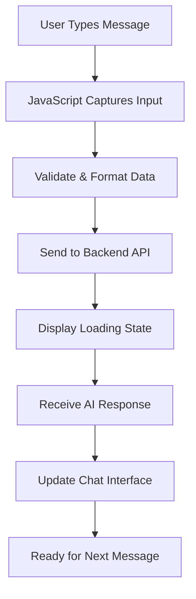

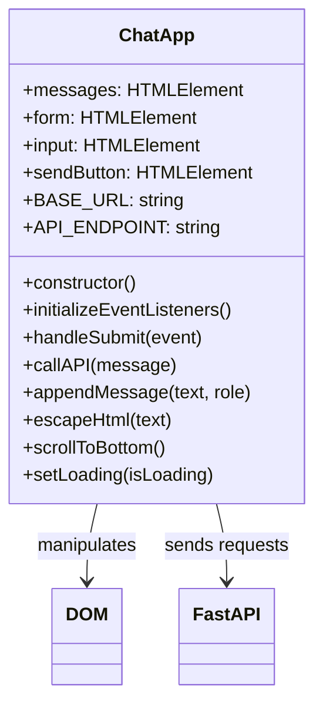

### فرنٹ اینڈ ڈیولپمنٹ کے تین ستون

ہر فرنٹ اینڈ ایپلیکیشن – سادہ ویب سائٹس سے لے کر پیچیدہ ایپس جیسے Discord یا Slack – تین بنیادی ٹیکنالوجیز پر مبنی ہوتی ہے۔ انہیں وہ بنیاد سمجھیں جس پر آپ ویب پر سب کچھ دیکھتے اور تعامل کرتے ہیں:

**HTML (ساخت)**: یہ آپ کی بنیاد ہے
- فیصلہ کرتا ہے کہ کون سے عناصر موجود ہیں (بٹن، ٹیکسٹ ایریاز، کنٹینرز)
- مواد کو معنی دیتا ہے (یہ ایک ہیڈر ہے، یہ ایک فارم ہے، وغیرہ)
- بنیادی ساخت بناتا ہے جس پر سب کچھ تعمیر ہوتا ہے

**CSS (پیشکش)**: یہ آپ کا اندرونی ڈیزائنر ہے
- سب کچھ خوبصورت بناتا ہے (رنگ، فونٹس، لے آؤٹ)
- مختلف اسکرین سائزز کو ہینڈل کرتا ہے (فون بمقابلہ لیپ ٹاپ بمقابلہ ٹیبلٹ)
- ہموار اینیمیشنز اور بصری تاثرات بناتا ہے

**JavaScript (رویہ)**: یہ آپ کا دماغ ہے
- صارفین کے اعمال پر ردعمل دیتا ہے (کلکس، ٹائپنگ، اسکرولنگ)
- آپ کے بیک اینڈ سے بات کرتا ہے اور صفحہ کو اپ ڈیٹ کرتا ہے
- سب کچھ انٹرایکٹو اور ڈائنامک بناتا ہے

**اسے آرکیٹیکچرل ڈیزائن کی طرح سمجھیں:**
- **HTML**: ساختی بلیو پرنٹ (جگہوں اور تعلقات کی وضاحت)
- **CSS**: جمالیاتی اور ماحولیاتی ڈیزائن (بصری انداز اور یوزر تجربہ)
- **JavaScript**: میکینیکل سسٹمز (فنکشنلٹی اور انٹرایکٹیویٹی)

### جدید JavaScript آرکیٹیکچر کیوں اہم ہے

ہمارا چیٹ ایپلیکیشن جدید JavaScript پیٹرنز استعمال کرے گا جو آپ پیشہ ورانہ ایپلیکیشنز میں دیکھیں گے۔ ان تصورات کو سمجھنا آپ کی ترقی کے ساتھ آپ کی مدد کرے گا:

**کلاس پر مبنی آرکیٹیکچر**: ہم اپنے کوڈ کو کلاسز میں منظم کریں گے، جو اشیاء کے لیے بلیو پرنٹس بنانے جیسا ہے
**Async/Await**: وقت لینے والے آپریشنز (جیسے API کالز) کو ہینڈل کرنے کا جدید طریقہ
**ایونٹ ڈرائیون پروگرامنگ**: ہمارا ایپ صارف کے اعمال (کلکس، کی پریسز) پر ردعمل دیتا ہے بجائے اس کے کہ لوپ میں چلتا رہے
**DOM Manipulation**: صارف کے تعاملات اور API جوابات کی بنیاد پر ویب پیج کے مواد کو ڈائنامک طور پر اپ ڈیٹ کرنا

### پروجیکٹ اسٹرکچر سیٹ اپ

ایک فرنٹ اینڈ ڈائریکٹری بنائیں اس منظم ساخت کے ساتھ:

```text
frontend/
├── index.html      # Main HTML structure
├── app.js          # JavaScript functionality
└── styles.css      # Visual styling
```

**آرکیٹیکچر کو سمجھنا**:
- **الگ کرتا ہے** ساخت (HTML)، رویہ (JavaScript)، اور پیشکش (CSS) کے درمیان خدشات
- **برقرار رکھتا ہے** ایک سادہ فائل اسٹرکچر جو نیویگیٹ اور ترمیم کرنے میں آسان ہے
- **پیروی کرتا ہے** ویب ڈیولپمنٹ کے بہترین طریقے تنظیم اور برقرار رکھنے کے لیے

### HTML بنیاد بنانا: قابل رسائی کے لیے سیمینٹک ساخت

آئیے HTML ساخت سے شروع کریں۔ جدید ویب ڈیولپمنٹ "سیمینٹک HTML" پر زور دیتا ہے – HTML عناصر کا استعمال جو واضح طور پر ان کے مقصد کو بیان کرتے ہیں، نہ کہ صرف ان کی ظاہری شکل۔ یہ آپ کی ایپلیکیشن کو اسکرین ریڈرز، سرچ انجنز، اور دیگر ٹولز کے لیے قابل رسائی بناتا ہے۔

**کیوں سیمینٹک HTML اہم ہے**: تصور کریں کہ آپ اپنے چیٹ ایپ کو کسی کو فون پر بیان کر رہے ہیں۔ آپ کہیں گے "یہاں ایک ہیڈر ہے جس میں عنوان ہے، ایک مین ایریا جہاں بات چیت ظاہر ہوتی ہے، اور نیچے ایک فارم ہے پیغامات ٹائپ کرنے کے لیے۔" سیمینٹک HTML ایسے عناصر استعمال کرتا ہے جو اس قدرتی وضاحت سے میل کھاتے ہیں۔

`index.html` بنائیں اس سوچے سمجھے مارک اپ کے ساتھ:

```html
<!DOCTYPE html>
<html lang="en">
<head>
    <meta charset="UTF-8">
    <meta name="viewport" content="width=device-width, initial-scale=1.0">
    <title>AI Chat Assistant</title>
    <link rel="stylesheet" href="styles.css">
</head>
<body>
    <div class="chat-container">
        <header class="chat-header">
            <h1>AI Chat Assistant</h1>
            <p>Ask me anything!</p>
        </header>
        
        <main class="chat-messages" id="messages" role="log" aria-live="polite">
            <!-- Messages will be dynamically added here -->
        </main>
        
        <form class="chat-form" id="chatForm">
            <div class="input-group">
                <input 
                    type="text" 
                    id="messageInput" 
                    placeholder="Type your message here..." 
                    required
                    aria-label="Chat message input"
                >
                <button type="submit" id="sendBtn" aria-label="Send message">
                    Send
                </button>
            </div>
        </form>
    </div>
    <script src="app.js"></script>
</body>
</html>
```

**ہر HTML عنصر اور اس کے مقصد کو سمجھنا**:

#### دستاویز کی ساخت
- **`<!DOCTYPE html>`**: براؤزر کو بتاتا ہے کہ یہ جدید HTML5 ہے
- **`<html lang="en">`**: صفحہ کی زبان اسکرین ریڈرز اور ترجمہ ٹولز کے لیے بتاتا ہے
- **`<meta charset="UTF-8">`**: بین الاقوامی متن کے لیے مناسب کریکٹر انکوڈنگ کو یقینی بناتا ہے
- **`<meta name="viewport"...>`**: صفحہ کو موبائل ریسپانسیو بناتا ہے زوم اور اسکیل کو کنٹرول کر کے

#### سیمینٹک عناصر
- **`<header>`**: واضح طور پر اوپر والے سیکشن کی شناخت کرتا ہے جس میں عنوان اور وضاحت ہے
- **`<main>`**: بنیادی مواد کے علاقے کو نامزد کرتا ہے (جہاں بات چیت ہوتی ہے)
- **`<form>`**: صارف کی ان پٹ کے لیے سیمینٹک طور پر درست، مناسب کی بورڈ نیویگیشن کو فعال کرتا ہے

#### قابل رسائی خصوصیات
- **`role="log"`**: اسکرین ریڈرز کو بتاتا ہے کہ یہ علاقہ پیغامات کی زمانی
اب ہم جاوا اسکرپٹ تیار کرتے ہیں جو ہمارے چیٹ انٹرفیس کو زندگی بخشتا ہے۔ ہم جدید جاوا اسکرپٹ پیٹرنز استعمال کریں گے جو آپ کو پیشہ ور ویب ڈیولپمنٹ میں ملیں گے، جیسے ES6 کلاسز، async/await، اور ایونٹ ڈرائیون پروگرامنگ۔

#### جدید جاوا اسکرپٹ آرکیٹیکچر کو سمجھنا

پروسیجرل کوڈ لکھنے کے بجائے (ایک ترتیب میں چلنے والے فنکشنز کی سیریز)، ہم **کلاس پر مبنی آرکیٹیکچر** بنائیں گے۔ کلاس کو ایک بلیو پرنٹ کے طور پر سوچیں جو آبجیکٹس بنانے کے لیے استعمال ہوتا ہے – جیسے ایک آرکیٹیکٹ کا بلیو پرنٹ کئی گھروں کی تعمیر کے لیے استعمال ہو سکتا ہے۔

**ویب ایپلیکیشنز کے لیے کلاسز کیوں استعمال کریں؟**
- **تنظیم**: تمام متعلقہ فنکشنلٹی ایک جگہ جمع ہوتی ہے
- **دوبارہ استعمال**: آپ ایک ہی صفحے پر کئی چیٹ انسٹینسز بنا سکتے ہیں
- **آسانی سے دیکھ بھال**: مخصوص فیچرز کو ڈیبگ اور تبدیل کرنا آسان ہوتا ہے
- **پیشہ ورانہ معیار**: یہ پیٹرن React، Vue، اور Angular جیسے فریم ورک میں استعمال ہوتا ہے

`app.js` کو جدید، اچھی طرح سے منظم جاوا اسکرپٹ کے ساتھ بنائیں:

```javascript
// app.js - Modern chat application logic

class ChatApp {
    constructor() {
        // Get references to DOM elements we'll need to manipulate
        this.messages = document.getElementById("messages");
        this.form = document.getElementById("chatForm");
        this.input = document.getElementById("messageInput");
        this.sendButton = document.getElementById("sendBtn");
        
        // Configure your backend URL here
        this.BASE_URL = "http://localhost:5000"; // Update this for your environment
        this.API_ENDPOINT = `${this.BASE_URL}/hello`;
        
        // Set up event listeners when the chat app is created
        this.initializeEventListeners();
    }
    
    initializeEventListeners() {
        // Listen for form submission (when user clicks Send or presses Enter)
        this.form.addEventListener("submit", (e) => this.handleSubmit(e));
        
        // Also listen for Enter key in the input field (better UX)
        this.input.addEventListener("keypress", (e) => {
            if (e.key === "Enter" && !e.shiftKey) {
                e.preventDefault();
                this.handleSubmit(e);
            }
        });
    }
    
    async handleSubmit(event) {
        event.preventDefault(); // Prevent form from refreshing the page
        
        const messageText = this.input.value.trim();
        if (!messageText) return; // Don't send empty messages
        
        // Provide user feedback that something is happening
        this.setLoading(true);
        
        // Add user message to chat immediately (optimistic UI)
        this.appendMessage(messageText, "user");
        
        // Clear input field so user can type next message
        this.input.value = '';
        
        try {
            // Call the AI API and wait for response
            const reply = await this.callAPI(messageText);
            
            // Add AI response to chat
            this.appendMessage(reply, "assistant");
        } catch (error) {
            console.error('API Error:', error);
            this.appendMessage("Sorry, I'm having trouble connecting right now. Please try again.", "error");
        } finally {
            // Re-enable the interface regardless of success or failure
            this.setLoading(false);
        }
    }
    
    async callAPI(message) {
        const response = await fetch(this.API_ENDPOINT, {
            method: "POST",
            headers: { 
                "Content-Type": "application/json" 
            },
            body: JSON.stringify({ message })
        });
        
        if (!response.ok) {
            throw new Error(`HTTP error! status: ${response.status}`);
        }
        
        const data = await response.json();
        return data.response;
    }
    
    appendMessage(text, role) {
        const messageElement = document.createElement("div");
        messageElement.className = `message ${role}`;
        messageElement.innerHTML = `
            <div class="message-content">
                <span class="message-text">${this.escapeHtml(text)}</span>
                <span class="message-time">${new Date().toLocaleTimeString()}</span>
            </div>
        `;
        
        this.messages.appendChild(messageElement);
        this.scrollToBottom();
    }
    
    escapeHtml(text) {
        const div = document.createElement('div');
        div.textContent = text;
        return div.innerHTML;
    }
    
    scrollToBottom() {
        this.messages.scrollTop = this.messages.scrollHeight;
    }
    
    setLoading(isLoading) {
        this.sendButton.disabled = isLoading;
        this.input.disabled = isLoading;
        this.sendButton.textContent = isLoading ? "Sending..." : "Send";
    }
}

// Initialize the chat application when the page loads
document.addEventListener("DOMContentLoaded", () => {
    new ChatApp();
});
```

#### ہر جاوا اسکرپٹ تصور کو سمجھنا

**ES6 کلاس اسٹرکچر**:
```javascript
class ChatApp {
    constructor() {
        // This runs when you create a new ChatApp instance
        // It's like the "setup" function for your chat
    }
    
    methodName() {
        // Methods are functions that belong to the class
        // They can access class properties using "this"
    }
}
```

**Async/Await پیٹرن**:
```javascript
// Old way (callback hell):
fetch(url)
  .then(response => response.json())
  .then(data => console.log(data))
  .catch(error => console.error(error));

// Modern way (async/await):
try {
    const response = await fetch(url);
    const data = await response.json();
    console.log(data);
} catch (error) {
    console.error(error);
}
```

**ایونٹ ڈرائیون پروگرامنگ**:
کسی چیز کے ہونے کا مسلسل انتظار کرنے کے بجائے، ہم ایونٹس "سن" سکتے ہیں:
```javascript
// When form is submitted, run handleSubmit
this.form.addEventListener("submit", (e) => this.handleSubmit(e));

// When Enter key is pressed, also run handleSubmit
this.input.addEventListener("keypress", (e) => { /* ... */ });
```

**DOM مینپولیشن**:
```javascript
// Create new elements
const messageElement = document.createElement("div");

// Modify their properties
messageElement.className = "message user";
messageElement.innerHTML = "Hello world!";

// Add to the page
this.messages.appendChild(messageElement);
```

#### سیکیورٹی اور بہترین طریقے

**XSS سے بچاؤ**:
```javascript
escapeHtml(text) {
    const div = document.createElement('div');
    div.textContent = text;  // This automatically escapes HTML
    return div.innerHTML;
}
```

**یہ کیوں اہم ہے**: اگر کوئی یوزر `<script>alert('hack')</script>` ٹائپ کرتا ہے، تو یہ فنکشن یقینی بناتا ہے کہ یہ کوڈ کے طور پر چلنے کے بجائے ٹیکسٹ کے طور پر ظاہر ہو۔

**ایرر ہینڈلنگ**:
```javascript
try {
    const reply = await this.callAPI(messageText);
    this.appendMessage(reply, "assistant");
} catch (error) {
    // Show user-friendly error instead of breaking the app
    this.appendMessage("Sorry, I'm having trouble...", "error");
}
```

**یوزر ایکسپیرینس کے خیالات**:
- **آپٹیمسٹک UI**: یوزر کا میسج فوراً شامل کریں، سرور کے جواب کا انتظار نہ کریں
- **لوڈنگ اسٹیٹس**: بٹن کو غیر فعال کریں اور "بھیج رہا ہے..." دکھائیں جب تک جواب نہ آئے
- **آٹو اسکرول**: نئے میسجز کو نظر میں رکھیں
- **ان پٹ ویلیڈیشن**: خالی میسجز نہ بھیجیں
- **کی بورڈ شارٹ کٹس**: انٹر کی میسجز بھیجنے کے لیے (جیسے حقیقی چیٹ ایپس)

#### ایپلیکیشن فلو کو سمجھنا

1. **صفحہ لوڈ ہوتا ہے** → `DOMContentLoaded` ایونٹ فائر ہوتا ہے → `new ChatApp()` بنایا جاتا ہے
2. **کنسٹرکٹر چلتا ہے** → DOM ایلیمنٹ ریفرنسز حاصل کرتا ہے → ایونٹ لسٹنرز سیٹ کرتا ہے
3. **یوزر میسج ٹائپ کرتا ہے** → انٹر پریس کرتا ہے یا بھیجنے پر کلک کرتا ہے → `handleSubmit` چلتا ہے
4. **handleSubmit** → ان پٹ ویلیڈیٹ کرتا ہے → لوڈنگ اسٹیٹ دکھاتا ہے → API کو کال کرتا ہے
5. **API جواب دیتا ہے** → AI میسج چیٹ میں شامل کرتا ہے → انٹرفیس کو دوبارہ فعال کرتا ہے
6. **اگلے میسج کے لیے تیار** → یوزر چیٹنگ جاری رکھ سکتا ہے

یہ آرکیٹیکچر قابل توسیع ہے – آپ آسانی سے فیچرز جیسے میسج ایڈیٹنگ، فائل اپلوڈز، یا متعدد گفتگو کے تھریڈز شامل کر سکتے ہیں بغیر بنیادی اسٹرکچر کو دوبارہ لکھے۔

### 🎯 تعلیمی جائزہ: جدید فرنٹ اینڈ آرکیٹیکچر

**آرکیٹیکچر کی سمجھ**: آپ نے جدید جاوا اسکرپٹ پیٹرنز کا استعمال کرتے ہوئے مکمل سنگل پیج ایپلیکیشن نافذ کی ہے۔ یہ پیشہ ورانہ سطح کی فرنٹ اینڈ ڈیولپمنٹ کی نمائندگی کرتا ہے۔

**کلیدی تصورات میں مہارت حاصل کی**:
- **ES6 کلاس آرکیٹیکچر**: منظم، دیکھ بھال کے قابل کوڈ اسٹرکچر
- **Async/Await پیٹرنز**: جدید غیر متزامن پروگرامنگ
- **ایونٹ ڈرائیون پروگرامنگ**: جوابدہ یوزر انٹرفیس ڈیزائن
- **سیکیورٹی بہترین طریقے**: XSS سے بچاؤ اور ان پٹ ویلیڈیشن

**صنعتی تعلق**: جو پیٹرنز آپ نے سیکھے ہیں (کلاس پر مبنی آرکیٹیکچر، async آپریشنز، DOM مینپولیشن) جدید فریم ورک جیسے React، Vue، اور Angular کی بنیاد ہیں۔ آپ وہی آرکیٹیکچرل سوچ کے ساتھ بنا رہے ہیں جو پروڈکشن ایپلیکیشنز میں استعمال ہوتی ہے۔

**عکاسی کا سوال**: آپ اس چیٹ ایپلیکیشن کو متعدد گفتگو یا یوزر آتھنٹیکیشن کو ہینڈل کرنے کے لیے کیسے بڑھائیں گے؟ ضروری آرکیٹیکچرل تبدیلیوں پر غور کریں اور کلاس اسٹرکچر کیسے ترقی کرے گا۔

### اپنے چیٹ انٹرفیس کو اسٹائل کرنا

اب ہم CSS کے ساتھ ایک جدید، بصری طور پر دلکش چیٹ انٹرفیس بناتے ہیں۔ اچھی اسٹائلنگ آپ کی ایپلیکیشن کو پیشہ ورانہ محسوس کراتی ہے اور مجموعی یوزر ایکسپیرینس کو بہتر بناتی ہے۔ ہم جدید CSS فیچرز جیسے Flexbox، CSS Grid، اور کسٹم پراپرٹیز کا استعمال کریں گے تاکہ ایک جوابدہ، قابل رسائی ڈیزائن بنایا جا سکے۔

`styles.css` بنائیں ان جامع اسٹائلز کے ساتھ:

```css
/* styles.css - Modern chat interface styling */

:root {
    --primary-color: #2563eb;
    --secondary-color: #f1f5f9;
    --user-color: #3b82f6;
    --assistant-color: #6b7280;
    --error-color: #ef4444;
    --text-primary: #1e293b;
    --text-secondary: #64748b;
    --border-radius: 12px;
    --shadow: 0 4px 6px -1px rgba(0, 0, 0, 0.1);
}

* {
    margin: 0;
    padding: 0;
    box-sizing: border-box;
}

body {
    font-family: -apple-system, BlinkMacSystemFont, 'Segoe UI', Roboto, sans-serif;
    background: linear-gradient(135deg, #667eea 0%, #764ba2 100%);
    min-height: 100vh;
    display: flex;
    align-items: center;
    justify-content: center;
    padding: 20px;
}

.chat-container {
    width: 100%;
    max-width: 800px;
    height: 600px;
    background: white;
    border-radius: var(--border-radius);
    box-shadow: var(--shadow);
    display: flex;
    flex-direction: column;
    overflow: hidden;
}

.chat-header {
    background: var(--primary-color);
    color: white;
    padding: 20px;
    text-align: center;
}

.chat-header h1 {
    font-size: 1.5rem;
    margin-bottom: 5px;
}

.chat-header p {
    opacity: 0.9;
    font-size: 0.9rem;
}

.chat-messages {
    flex: 1;
    padding: 20px;
    overflow-y: auto;
    display: flex;
    flex-direction: column;
    gap: 15px;
    background: var(--secondary-color);
}

.message {
    display: flex;
    max-width: 80%;
    animation: slideIn 0.3s ease-out;
}

.message.user {
    align-self: flex-end;
}

.message.user .message-content {
    background: var(--user-color);
    color: white;
    border-radius: var(--border-radius) var(--border-radius) 4px var(--border-radius);
}

.message.assistant {
    align-self: flex-start;
}

.message.assistant .message-content {
    background: white;
    color: var(--text-primary);
    border-radius: var(--border-radius) var(--border-radius) var(--border-radius) 4px;
    border: 1px solid #e2e8f0;
}

.message.error .message-content {
    background: var(--error-color);
    color: white;
    border-radius: var(--border-radius);
}

.message-content {
    padding: 12px 16px;
    box-shadow: var(--shadow);
    position: relative;
}

.message-text {
    display: block;
    line-height: 1.5;
    word-wrap: break-word;
}

.message-time {
    display: block;
    font-size: 0.75rem;
    opacity: 0.7;
    margin-top: 5px;
}

.chat-form {
    padding: 20px;
    border-top: 1px solid #e2e8f0;
    background: white;
}

.input-group {
    display: flex;
    gap: 10px;
    align-items: center;
}

#messageInput {
    flex: 1;
    padding: 12px 16px;
    border: 2px solid #e2e8f0;
    border-radius: var(--border-radius);
    font-size: 1rem;
    outline: none;
    transition: border-color 0.2s ease;
}

#messageInput:focus {
    border-color: var(--primary-color);
}

#messageInput:disabled {
    background: #f8fafc;
    opacity: 0.6;
    cursor: not-allowed;
}

#sendBtn {
    padding: 12px 24px;
    background: var(--primary-color);
    color: white;
    border: none;
    border-radius: var(--border-radius);
    font-size: 1rem;
    font-weight: 600;
    cursor: pointer;
    transition: background-color 0.2s ease;
    min-width: 80px;
}

#sendBtn:hover:not(:disabled) {
    background: #1d4ed8;
}

#sendBtn:disabled {
    background: #94a3b8;
    cursor: not-allowed;
}

@keyframes slideIn {
    from {
        opacity: 0;
        transform: translateY(10px);
    }
    to {
        opacity: 1;
        transform: translateY(0);
    }
}

/* Responsive design for mobile devices */
@media (max-width: 768px) {
    body {
        padding: 10px;
    }
    
    .chat-container {
        height: calc(100vh - 20px);
        border-radius: 8px;
    }
    
    .message {
        max-width: 90%;
    }
    
    .input-group {
        flex-direction: column;
        gap: 10px;
    }
    
    #messageInput {
        width: 100%;
    }
    
    #sendBtn {
        width: 100%;
    }
}

/* Accessibility improvements */
@media (prefers-reduced-motion: reduce) {
    .message {
        animation: none;
    }
    
    * {
        transition: none !important;
    }
}

/* Dark mode support */
@media (prefers-color-scheme: dark) {
    .chat-container {
        background: #1e293b;
        color: #f1f5f9;
    }
    
    .chat-messages {
        background: #0f172a;
    }
    
    .message.assistant .message-content {
        background: #334155;
        color: #f1f5f9;
        border-color: #475569;
    }
    
    .chat-form {
        background: #1e293b;
        border-color: #475569;
    }
    
    #messageInput {
        background: #334155;
        color: #f1f5f9;
        border-color: #475569;
    }
}
```

**CSS آرکیٹیکچر کو سمجھنا:**
- **استعمال کرتا ہے** CSS کسٹم پراپرٹیز (ویریبلز) مستقل تھیمنگ اور آسان دیکھ بھال کے لیے
- **نافذ کرتا ہے** Flexbox لے آؤٹ جوابدہ ڈیزائن اور مناسب سیدھ کے لیے
- **شامل کرتا ہے** ہموار اینیمیشنز میسج کی ظاہری شکل کے لیے بغیر کسی خلفشار کے
- **فراہم کرتا ہے** یوزر میسجز، AI جوابات، اور ایرر اسٹیٹس کے درمیان بصری فرق
- **سپورٹ کرتا ہے** جوابدہ ڈیزائن جو ڈیسک ٹاپ اور موبائل دونوں پر کام کرتا ہے
- **غور کرتا ہے** رسائی کے لیے کم حرکت کی ترجیحات اور مناسب کنٹراسٹ تناسب کے ساتھ
- **پیش کرتا ہے** یوزر کے سسٹم کی ترجیحات پر مبنی ڈارک موڈ سپورٹ

### اپنے بیک اینڈ URL کو کنفیگر کرنا

آخری مرحلہ آپ کے جاوا اسکرپٹ میں `BASE_URL` کو اپ ڈیٹ کرنا ہے تاکہ آپ کے بیک اینڈ سرور سے میل کھائے:

```javascript
// For local development
this.BASE_URL = "http://localhost:5000";

// For GitHub Codespaces (replace with your actual URL)
this.BASE_URL = "https://your-codespace-name-5000.app.github.dev";
```

**اپنے بیک اینڈ URL کا تعین کرنا:**
- **لوکل ڈیولپمنٹ**: `http://localhost:5000` استعمال کریں اگر فرنٹ اینڈ اور بیک اینڈ دونوں لوکل پر چل رہے ہیں
- **Codespaces**: اپنے بیک اینڈ URL کو Ports ٹیب میں تلاش کریں جب پورٹ 5000 کو پبلک بنایا جائے
- **پروڈکشن**: اصل ڈومین کے ساتھ تبدیل کریں جب کسی ہوسٹنگ سروس پر ڈیپلائی کریں

> 💡 **ٹیسٹنگ ٹپ**: آپ اپنے بیک اینڈ کو براہ راست ٹیسٹ کر سکتے ہیں اپنے براؤزر میں روٹ URL پر جا کر۔ آپ کو اپنے FastAPI سرور سے ویلکم میسج نظر آنا چاہیے۔
- **بات چیت کے موضوع** کی بنیاد پر ذہین تجاویز شامل کریں  
- **عام سوالات** کے لیے فوری جواب کے بٹن بنائیں  

> 🎯 **سیکھنے کا مقصد**: یہ اضافی چیلنجز آپ کو جدید ویب ڈیولپمنٹ کے طریقے اور AI انضمام کی تکنیکیں سمجھنے میں مدد دیتے ہیں جو پروڈکشن ایپلیکیشنز میں استعمال ہوتی ہیں۔

## خلاصہ اور اگلے مراحل  

مبارک ہو! آپ نے کامیابی سے ایک مکمل AI سے چلنے والا چیٹ اسسٹنٹ شروع سے بنایا ہے۔ اس پروجیکٹ نے آپ کو جدید ویب ڈیولپمنٹ ٹیکنالوجیز اور AI انضمام کے ساتھ عملی تجربہ فراہم کیا ہے – یہ مہارتیں آج کے ٹیکنالوجی کے میدان میں بہت قیمتی ہیں۔

### آپ نے کیا حاصل کیا  

اس سبق کے دوران، آپ نے کئی اہم ٹیکنالوجیز اور تصورات میں مہارت حاصل کی:  

**بیک اینڈ ڈیولپمنٹ:**  
- **GitHub Models API** کے ساتھ AI فعالیت کو مربوط کیا  
- **Flask** کے ذریعے ایک RESTful API بنایا، مناسب ایرر ہینڈلنگ کے ساتھ  
- **ماحول کے متغیرات** کا استعمال کرتے ہوئے محفوظ تصدیق نافذ کی  
- **CORS** کو فرنٹ اینڈ اور بیک اینڈ کے درمیان کراس-اورجن درخواستوں کے لیے ترتیب دیا  

**فرنٹ اینڈ ڈیولپمنٹ:**  
- **سمینٹک HTML** کا استعمال کرتے ہوئے ایک ذمہ دار چیٹ انٹرفیس بنایا  
- **جدید جاوا اسکرپٹ** async/await اور کلاس پر مبنی آرکیٹیکچر کے ساتھ نافذ کیا  
- **CSS Grid، Flexbox، اور اینیمیشنز** کے ساتھ ایک دلکش یوزر انٹرفیس ڈیزائن کیا  
- **رسائی کی خصوصیات** اور ذمہ دار ڈیزائن اصول شامل کیے  

**فل اسٹیک انضمام:**  
- **HTTP API کالز** کے ذریعے فرنٹ اینڈ اور بیک اینڈ کو مربوط کیا  
- **ریئل ٹائم یوزر انٹریکشنز** اور غیر متزامن ڈیٹا فلو کو سنبھالا  
- **ایرر ہینڈلنگ** اور ایپلیکیشن میں یوزر فیڈبیک نافذ کیا  
- **یوزر ان پٹ سے AI کے جواب تک** مکمل ایپلیکیشن ورک فلو کی جانچ کی  

### اہم سیکھنے کے نتائج  

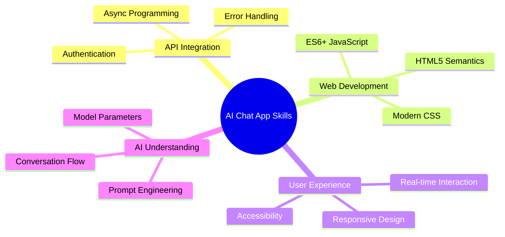
  
اس پروجیکٹ نے آپ کو AI سے چلنے والی ایپلیکیشنز بنانے کی بنیادی باتوں سے روشناس کرایا ہے، جو ویب ڈیولپمنٹ کا مستقبل ہے۔ آپ اب سمجھتے ہیں کہ روایتی ویب ایپلیکیشنز میں AI صلاحیتوں کو کیسے شامل کیا جائے، اور ایسے یوزر تجربات تخلیق کیے جائیں جو ذہین اور جوابدہ محسوس ہوں۔

### پیشہ ورانہ اطلاقات  

اس سبق میں آپ نے جو مہارتیں حاصل کی ہیں وہ جدید سافٹ ویئر ڈیولپمنٹ کیریئرز میں براہ راست قابل اطلاق ہیں:  

- **فل اسٹیک ویب ڈیولپمنٹ** جدید فریم ورک اور APIs کے ساتھ  
- **AI انضمام** ویب ایپلیکیشنز اور موبائل ایپس میں  
- **API ڈیزائن اور ڈیولپمنٹ** مائیکرو سروسز آرکیٹیکچرز کے لیے  
- **یوزر انٹرفیس ڈیولپمنٹ** رسائی اور ذمہ دار ڈیزائن پر توجہ کے ساتھ  
- **DevOps طریقے** بشمول ماحول کی ترتیب اور تعیناتی  

### AI ڈیولپمنٹ کے سفر کو جاری رکھنا  

**اگلے سیکھنے کے مراحل:**  
- **مزید جدید AI ماڈلز اور APIs** (GPT-4، Claude، Gemini) کو دریافت کریں  
- **بہتر AI جوابات کے لیے پرامپٹ انجینئرنگ تکنیکیں** سیکھیں  
- **بات چیت کے ڈیزائن** اور چیٹ بوٹ یوزر تجربہ کے اصولوں کا مطالعہ کریں  
- **AI کی حفاظت، اخلاقیات، اور ذمہ دار AI ڈیولپمنٹ** کے طریقوں کی تحقیق کریں  
- **زیادہ پیچیدہ ایپلیکیشنز بنائیں** بات چیت کی یادداشت اور سیاق و سباق کی آگاہی کے ساتھ  

**جدید پروجیکٹ آئیڈیاز:**  
- AI ماڈریشن کے ساتھ ملٹی یوزر چیٹ رومز  
- AI سے چلنے والے کسٹمر سروس چیٹ بوٹس  
- ذاتی سیکھنے کے ساتھ تعلیمی ٹیوٹرنگ اسسٹنٹس  
- مختلف AI شخصیات کے ساتھ تخلیقی تحریر کے ساتھی  
- ڈیولپرز کے لیے تکنیکی دستاویزات کے اسسٹنٹس  

## GitHub Codespaces کے ساتھ شروعات  

کیا آپ اس پروجیکٹ کو کلاؤڈ ڈیولپمنٹ ماحول میں آزمانا چاہتے ہیں؟ GitHub Codespaces آپ کے براؤزر میں مکمل ڈیولپمنٹ سیٹ اپ فراہم کرتا ہے، جو AI ایپلیکیشنز کے ساتھ تجربہ کرنے کے لیے بہترین ہے بغیر مقامی سیٹ اپ کی ضرورت کے۔

### اپنے ڈیولپمنٹ ماحول کو ترتیب دینا  

**مرحلہ 1: ٹیمپلیٹ سے بنائیں**  
- [Web Dev For Beginners repository](https://github.com/microsoft/Web-Dev-For-Beginners) پر جائیں  
- اوپر دائیں کونے میں "Use this template" پر کلک کریں (یقینی بنائیں کہ آپ GitHub میں لاگ ان ہیں)  

  

**مرحلہ 2: Codespaces لانچ کریں**  
- اپنی نئی بنائی گئی repository کھولیں  
- سبز "Code" بٹن پر کلک کریں اور "Codespaces" منتخب کریں  
- "Create codespace on main" منتخب کریں تاکہ آپ کا ڈیولپمنٹ ماحول شروع ہو سکے  

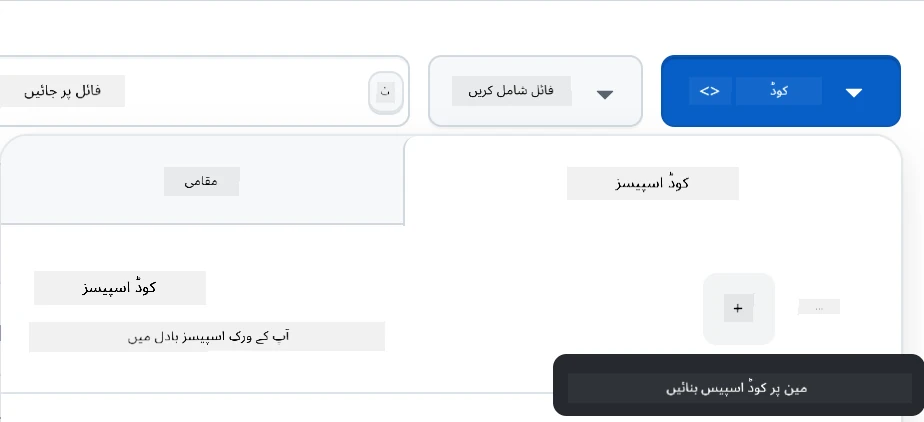  

**مرحلہ 3: ماحول کی ترتیب**  
جب آپ کا Codespace لوڈ ہو جائے، آپ کو رسائی حاصل ہوگی:  
- **پہلے سے انسٹال شدہ** Python، Node.js، اور تمام ضروری ڈیولپمنٹ ٹولز  
- **VS Code انٹرفیس** ویب ڈیولپمنٹ کے لیے ایکسٹینشنز کے ساتھ  
- **ٹرمینل رسائی** بیک اینڈ اور فرنٹ اینڈ سرورز چلانے کے لیے  
- **پورٹ فارورڈنگ** آپ کی ایپلیکیشنز کی جانچ کے لیے  

**Codespaces کیا فراہم کرتا ہے:**  
- **مقامی ماحول کی ترتیب اور کنفیگریشن کے مسائل ختم کرتا ہے**  
- **مختلف ڈیوائسز پر مستقل ڈیولپمنٹ ماحول فراہم کرتا ہے**  
- **ویب ڈیولپمنٹ کے لیے پہلے سے ترتیب شدہ ٹولز اور ایکسٹینشنز شامل کرتا ہے**  
- **GitHub کے ساتھ ورژن کنٹرول اور تعاون کے لیے ہموار انضمام پیش کرتا ہے**  

> 🚀 **پرو ٹپ**: Codespaces AI ایپلیکیشنز سیکھنے اور پروٹوٹائپنگ کے لیے بہترین ہے کیونکہ یہ تمام پیچیدہ ماحول کی ترتیب کو خود بخود سنبھالتا ہے، جس سے آپ کو تعمیر اور سیکھنے پر توجہ مرکوز کرنے کی اجازت ملتی ہے بجائے اس کے کہ کنفیگریشن کے مسائل میں الجھیں۔  

---

**ڈسکلیمر**:  
یہ دستاویز AI ترجمہ سروس [Co-op Translator](https://github.com/Azure/co-op-translator) کا استعمال کرتے ہوئے ترجمہ کی گئی ہے۔ ہم درستگی کے لیے کوشش کرتے ہیں، لیکن براہ کرم آگاہ رہیں کہ خودکار ترجمے میں غلطیاں یا غیر درستیاں ہو سکتی ہیں۔ اصل دستاویز کو اس کی اصل زبان میں مستند ذریعہ سمجھا جانا چاہیے۔ اہم معلومات کے لیے، پیشہ ور انسانی ترجمہ کی سفارش کی جاتی ہے۔ ہم اس ترجمے کے استعمال سے پیدا ہونے والی کسی بھی غلط فہمی یا غلط تشریح کے ذمہ دار نہیں ہیں۔