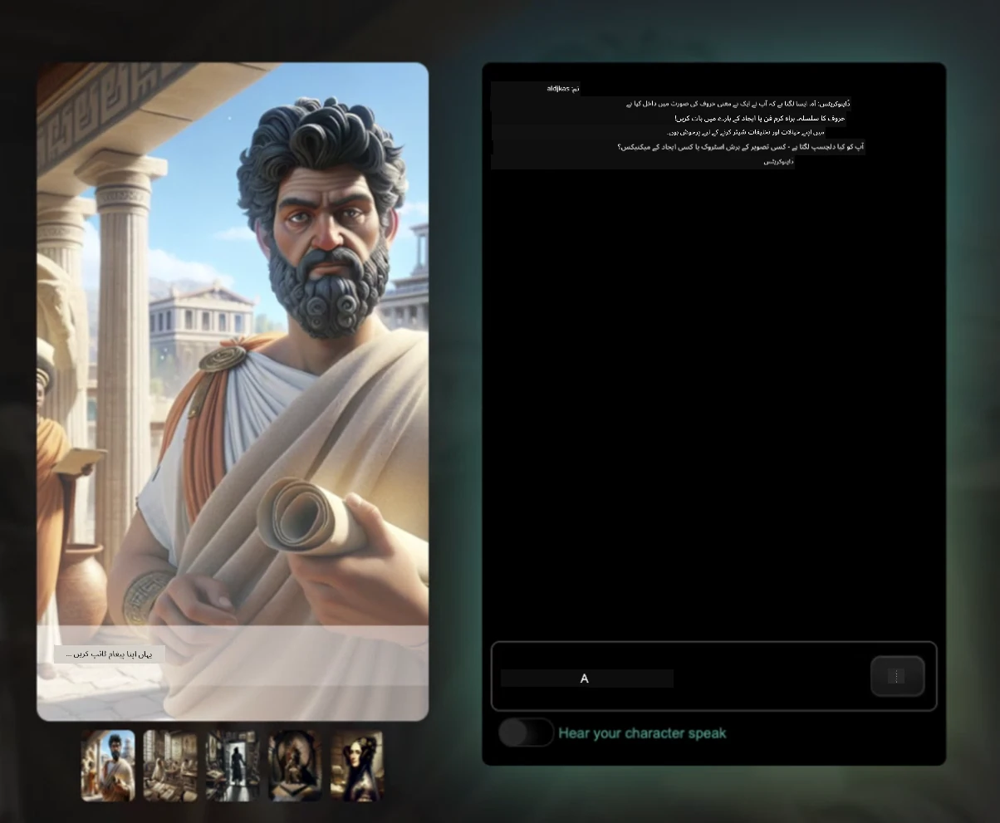
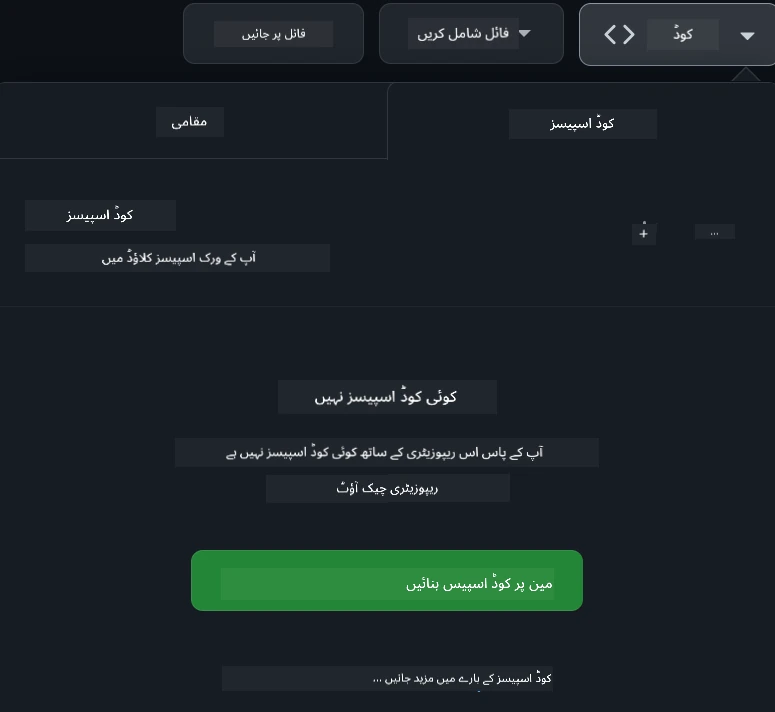

[](https://github.com/microsoft/Web-Dev-For-Beginners/blob/master/LICENSE)
[](https://GitHub.com/microsoft/Web-Dev-For-Beginners/graphs/contributors/)
[](https://GitHub.com/microsoft/Web-Dev-For-Beginners/issues/)
[](https://GitHub.com/microsoft/Web-Dev-For-Beginners/pulls/)
[](http://makeapullrequest.com)

[](https://GitHub.com/microsoft/Web-Dev-For-Beginners/watchers/)
[](https://GitHub.com/microsoft/Web-Dev-For-Beginners/network/)
[](https://GitHub.com/microsoft/Web-Dev-For-Beginners/stargazers/)

[](https://discord.gg/nTYy5BXMWG)

# ابتدائیوں کے لیے ویب ڈیولپمنٹ - ایک نصاب

مائیکروسافٹ کلاؤڈ ایڈووکیٹس کے ذریعے ہمارے 12 ہفتوں کے جامع کورس کے ساتھ ویب ڈیولپمنٹ کے بنیادی اصول سیکھیں۔ 24 اسباق میں سے ہر ایک جاوا اسکرپٹ، CSS، اور HTML کو ہاتھ سے کرنے والے پروجیکٹس جیسے تیریریمز، براؤزر ایکسٹینشنز، اور خلائی کھیل کے ذریعے گہرائی میں لے جاتا ہے۔ کوئزز، مباحثے، اور عملی اسائنمنٹس میں حصہ لیں۔ اپنی مہارتوں کو بہتر بنائیں اور ہماری مؤثر پروجیکٹ پر مبنی تدریسی طریقہ کار کے ساتھ اپنے علم کو بہتر طریقے سے محفوظ کریں۔ آج ہی اپنی کوڈنگ کا سفر شروع کریں!

ازور AI فاؤنڈری ڈسکارڈ کمیونٹی میں شامل ہوں

[](https://discord.gg/nTYy5BXMWG)

ان وسائل کو استعمال کرنے کے لیے یہ اقدامات کریں:
1. **ریپوزیٹری کو فورک کریں**: کلک کریں [](https://GitHub.com/microsoft/Web-Dev-For-Beginners/fork)
2. **ریپوزیٹری کلون کریں**:   `git clone https://github.com/microsoft/Web-Dev-For-Beginners.git`
3. [**Azure AI Foundry Discord میں شامل ہوں اور ماہرین و ساتھی ڈیولپرز سے ملیں**](https://discord.com/invite/ByRwuEEgH4)

### 🌐 کثیراللسانی حمایت

#### GitHub ایکشن کے ذریعے حمایت یافتہ (خودکار اور ہمیشہ تازہ ترین)

<!-- CO-OP TRANSLATOR LANGUAGES TABLE START -->
[Arabic](../ar/README.md) | [Bengali](../bn/README.md) | [Bulgarian](../bg/README.md) | [Burmese (Myanmar)](../my/README.md) | [چینی (سادہ)](../zh-CN/README.md) | [چینی (روایتی، ہانگ کانگ)](../zh-HK/README.md) | [چینی (روایتی، مکاو)](../zh-MO/README.md) | [چینی (روایتی، تائیوان)](../zh-TW/README.md) | [Croatian](../hr/README.md) | [Czech](../cs/README.md) | [Danish](../da/README.md) | [Dutch](../nl/README.md) | [Estonian](../et/README.md) | [Finnish](../fi/README.md) | [French](../fr/README.md) | [German](../de/README.md) | [Greek](../el/README.md) | [Hebrew](../he/README.md) | [Hindi](../hi/README.md) | [Hungarian](../hu/README.md) | [Indonesian](../id/README.md) | [Italian](../it/README.md) | [Japanese](../ja/README.md) | [Kannada](../kn/README.md) | [Korean](../ko/README.md) | [Lithuanian](../lt/README.md) | [Malay](../ms/README.md) | [Malayalam](../ml/README.md) | [Marathi](../mr/README.md) | [Nepali](../ne/README.md) | [نائیجیریائی پڈگن](../pcm/README.md) | [Norwegian](../no/README.md) | [Persian (Farsi)](../fa/README.md) | [Polish](../pl/README.md) | [Portuguese (Brazil)](../pt-BR/README.md) | [Portuguese (Portugal)](../pt-PT/README.md) | [Punjabi (Gurmukhi)](../pa/README.md) | [Romanian](../ro/README.md) | [Russian](../ru/README.md) | [Serbian (Cyrillic)](../sr/README.md) | [Slovak](../sk/README.md) | [Slovenian](../sl/README.md) | [Spanish](../es/README.md) | [Swahili](../sw/README.md) | [Swedish](../sv/README.md) | [Tagalog (Filipino)](../tl/README.md) | [Tamil](../ta/README.md) | [Telugu](../te/README.md) | [Thai](../th/README.md) | [Turkish](../tr/README.md) | [Ukrainian](../uk/README.md) | [اردو](./README.md) | [Vietnamese](../vi/README.md)

> **کیا آپ لوکل کلون کرنا پسند کریں گے؟**

> یہ ریپوزیٹری 50+ زبانوں کے تراجم شامل کرتی ہے جو ڈاؤن لوڈ سائز کو بہت بڑھاتی ہے۔ بغیر تراجم کے کلون کرنے کے لیے sparse checkout استعمال کریں:
> ```bash
> git clone --filter=blob:none --sparse https://github.com/microsoft/Web-Dev-For-Beginners.git
> cd Web-Dev-For-Beginners
> git sparse-checkout set --no-cone '/*' '!translations' '!translated_images'
> ```
> اس سے آپ کو کورس مکمل کرنے کے لیے درکار تمام مواد تیز ترین ڈاؤن لوڈ کے ساتھ مل جائے گا۔
<!-- CO-OP TRANSLATOR LANGUAGES TABLE END -->

**اگر آپ اضافی ترجمہ شدہ زبانوں کا اضافہ چاہتے ہیں تو وہ یہاں درج ہیں [یہاں](https://github.com/Azure/co-op-translator/blob/main/getting_started/supported-languages.md)**

[](https://open.vscode.dev/microsoft/Web-Dev-For-Beginners)

#### 🧑‍🎓 _کیا آپ طالب علم ہیں؟_

وزٹ کریں [**طالب علم ہب صفحہ**](https://docs.microsoft.com/learn/student-hub/?WT.mc_id=academic-77807-sagibbon) جہاں آپ کو ابتدائی وسائل، طالب علم پیکز اور یہاں تک کہ مفت سرٹیفیکیٹ ووچر حاصل کرنے کے طریقے ملیں گے۔ یہ وہ صفحہ ہے جس کا آپ کو وقتاً فوقتاً جائزہ لینا چاہیے کیونکہ ہم ہر ماہ مواد اپ ڈیٹ کرتے ہیں۔

### 📣 اعلان - نئے GitHub Copilot Agent موڈ چیلنجز مکمل کریں!

نیا چیلنج شامل کیا گیا ہے، زیادہ تر ابواب میں "GitHub Copilot Agent Challenge 🚀" تلاش کریں۔ یہ ایک نیا چیلنج ہے جو آپ GitHub Copilot اور Agent موڈ کے ذریعے مکمل کریں گے۔ اگر آپ نے Agent موڈ پہلے استعمال نہیں کیا تو یہ صرف متن تیار کرنے کے قابل نہیں بلکہ فائلیں تخلیق اور ترمیم، کمانڈز چلانے اور مزید کرنے کے قابل ہے۔

### 📣 اعلان - _جدید منصوبہ جنریٹیو AI کے ذریعے بنانے کے لیے_

نیا AI اسسٹنٹ پروجیکٹ ابھی شامل کیا گیا ہے، چیک کریں [پروجیکٹ](./9-chat-project/README.md)

### 📣 اعلان - _نیا نصاب_ جنریٹیو AI برائے جاوا اسکرپٹ ابھی جاری کیا گیا ہے

ہمارا نیا جنریٹیو AI نصاب مت چھوڑیں!

شروع کرنے کے لیے وزٹ کریں [https://aka.ms/genai-js-course](https://aka.ms/genai-js-course)!


- اسباق میں بنیادیات سے لے کر RAG تک سب شامل ہیں۔
- تاریخی کرداروں کے ساتھ GenAI اور ہمارے ہمراہ ایپ کے ذریعے بات چیت کریں۔
- لطف اندوز اور دلچسپ کہانی، آپ وقت میں سفر کریں گے!



ہر سبق میں ایک اسائنمنٹ، علم کی جانچ اور ایک چیلنج شامل ہے تاکہ آپ کو درج ذیل موضوعات پر رہنمائی کرے:
- پرامپٹنگ اور پرامپٹ انجینئرنگ
- ٹیکسٹ اور امیج ایپ جنریشن
- سرچ ایپس

شروع کرنے کے لیے وزٹ کریں [https://aka.ms/genai-js-course](https://aka.ms/genai-js-course)!

## 🌱 شروعات

> **اساتذہ**، ہم نے [کچھ تجاویز شامل کی ہیں](for-teachers.md) کہ اس نصاب کو کیسے استعمال کیا جائے۔ ہم آپ کی رائے کے منتظر ہیں [ہمارے مباحثہ فورم میں](https://github.com/microsoft/Web-Dev-For-Beginners/discussions/categories/teacher-corner)!

**[سیکھنے والے](https://aka.ms/student-page/?WT.mc_id=academic-77807-sagibbon)**، ہر سبق کے لیے، پہلے پری لیکچر کوئز سے شروع کریں اور لیکچر کے مواد کو پڑھیں، مختلف سرگرمیاں مکمل کریں اور اپنی سمجھ کو پوسٹ لیکچر کوئز کے ذریعے جانچیں۔

اپنے تعلیمی تجربے کو بہتر بنانے کے لیے، اپنے ساتھیوں سے مل کر پروجیکٹس پر کام کریں! مباحثے کی حوصلہ افزائی کی جاتی ہے ہمارے [مباحثہ فورم](https://github.com/microsoft/Web-Dev-For-Beginners/discussions) میں جہاں ہمارے موڈریٹرز آپ کے سوالات کے جواب کے لیے دستیاب ہوں گے۔

اپنی تعلیم کو مزید فروغ دینے کے لیے، ہم آپ کو [Microsoft Learn](https://learn.microsoft.com/users/wirelesslife/collections/p1ddcy5jwy0jkm?WT.mc_id=academic-77807-sagibbon) پر اضافی مطالعہ مواد دریافت کرنے کی زوردار سفارش کرتے ہیں۔

### 📋 اپنا ماحول سیٹ اپ کرنا

اس نصاب کے لیے ڈویلپمنٹ کا ماحول تیار ہے! جب آپ شروعات کریں تو آپ منتخب کر سکتے ہیں کہ نصاب کو [Codespace](https://github.com/features/codespaces/) میں چلایا جائے (_ایک براؤزر بیسڈ، بغیر انسٹالیشن کے ماحول_), یا اپنے کمپیوٹر پر مقامی طور پر کسی ٹیکسٹ ایڈیٹر مثلاً [Visual Studio Code](https://code.visualstudio.com/?WT.mc_id=academic-77807-sagibbon) کا استعمال کرتے ہوئے۔

#### اپنا ریپوزیٹری بنائیں
اپنے کام کو آسانی سے محفوظ کرنے کے لیے، آپ کو مشورہ دیا جاتا ہے کہ آپ اپنا ذاتی کاپی ریپوزیٹری بنائیں۔ یہ آپ اس صفحے کے اوپر "Use this template" بٹن کو کلک کر کے کر سکتے ہیں۔ اس سے آپ کے گٹ ہب اکاؤنٹ میں نصاب کی ایک کوپی کے ساتھ نیا ریپوزیٹری بن جائے گا۔

یہ اقدامات پر عمل کریں:
1. **ریپوزیٹری کو فورک کریں**: اس صفحے کے اوپری دائیں کونے میں "Fork" بٹن پر کلک کریں۔
2. **ریپوزیٹری کلون کریں**:   `git clone https://github.com/microsoft/Web-Dev-For-Beginners.git`

#### کورس کو Codespace میں چلانا

اپنے بنائے گئے ریپوزیٹری کی کاپی میں، **Code** بٹن پر کلک کریں اور **Open with Codespaces** کا انتخاب کریں۔ یہ آپ کے لیے نیا Codespace تخلیق کرے گا جس میں آپ کام کریں گے۔



#### کورس کو اپنے کمپیوٹر پر مقامی طور پر چلانا

اس نصاب کو اپنے کمپیوٹر پر چلانے کے لیے، آپ کو ٹیکسٹ ایڈیٹر، براؤزر، اور کمانڈ لائن ٹول کی ضرورت ہوگی۔ ہمارا پہلا سبق، [Introduction to Programming Languages and Tools of the Trade](../../1-getting-started-lessons/1-intro-to-programming-languages)، آپ کو ہر ایک کے مختلف آپشنز دکھائے گا تاکہ آپ منتخب کر سکیں کہ کون سا آپ کے لیے بہترین ہے۔

ہماری تجویز ہے کہ آپ [Visual Studio Code](https://code.visualstudio.com/?WT.mc_id=academic-77807-sagibbon) بطور ایڈیٹر استعمال کریں، جس میں بلٹ ان [ٹرمینل](https://code.visualstudio.com/docs/terminal/basics/?WT.mc_id=academic-77807-sagibbon) بھی موجود ہے۔ آپ Visual Studio Code یہاں سے ڈاؤن لوڈ کر سکتے ہیں: [یہاں](https://code.visualstudio.com/?WT.mc_id=academic-77807-sagibbon)۔

1. اپنی ریپوزیٹری کو اپنے کمپیوٹر پر کلون کریں۔ یہ آپ **Code** بٹن پر کلک کرکے اور URL کو کاپی کرکے کر سکتے ہیں:

    [CodeSpace](./images/createcodespace.png)
پھر، [ویژول اسٹوڈیو کوڈ](https://code.visualstudio.com/?WT.mc_id=academic-77807-sagibbon) کے اندر [ٹرمینل](https://code.visualstudio.com/docs/terminal/basics/?WT.mc_id=academic-77807-sagibbon) کھولیں اور مندرجہ ذیل کمانڈ چلائیں، `<your-repository-url>` کو اس یو آر ایل سے تبدیل کرتے ہوئے جو آپ نے ابھی کاپی کیا ہے:

    ```bash 
    git clone <your-repository-url>
    ```

2. فولڈر کو Visual Studio Code میں کھولیں۔ آپ یہ **File** > **Open Folder** پر کلک کر کے اور اسی فولڈر کو منتخب کر کے کر سکتے ہیں جسے آپ نے ابھی کلون کیا ہے۔

>  تجویز کردہ Visual Studio Code ایکسٹینشنز:
>
> * [Live Server](https://marketplace.visualstudio.com/items?itemName=ritwickdey.LiveServer&WT.mc_id=academic-77807-sagibbon) - Visual Studio Code کے اندر HTML صفحات کا پیش نظارہ کرنے کے لیے
> * [Copilot](https://marketplace.visualstudio.com/items?itemName=GitHub.copilot&WT.mc_id=academic-77807-sagibbon) - آپ کو کوڈ جلدی لکھنے میں مدد دینے کے لیے

## 📂 ہر سبق میں شامل ہے:

- اختیاری اسکیچنوٹ
- اختیاری اضافی ویڈیو
- سبق سے پہلے کی وارم اپ کوئز
- تحریری سبق
- پروجیکٹ پر مبنی اسباق کے لیے، پروجیکٹ بنانے کے لیے مرحلہ وار رہنمائی
- علم کے چیک
- ایک چیلنج
- اضافی مطالعہ
- اسباق کے بعد کوئز [post-lesson quiz](https://ff-quizzes.netlify.app/web/)

> **کوئزز کے بارے میں ایک نوٹ**: تمام کوئزز Quiz-app فولڈر میں موجود ہیں، کل 48 کوئزز جن میں سے ہر ایک میں تین سوالات ہیں۔ یہ کوئز [یہاں](https://ff-quizzes.netlify.app/web/) دستیاب ہیں اور کوئز ایپ کو مقامی طور پر چلایا جا سکتا ہے یا Azure پر تعینات کیا جا سکتا ہے؛ `quiz-app` فولڈر میں ہدایات پر عمل کریں۔

## 🗃️ اسباق

|     |                       پروجیکٹ کا نام                       |                            مفاہیم جو سکھائے گئے                             | سیکھنے کے مقاصد                                                                                                                 |                                                         متعلقہ سبق                                                          |         مصنف          |
| :-: | :------------------------------------------------------: | :--------------------------------------------------------------------: | ----------------------------------------------------------------------------------------------------------------------------------- | :----------------------------------------------------------------------------------------------------------------------------: | :---------------------: |
| 01  |                     شروع کرنا                      |           پروگرامنگ کا تعارف اور آلات کا تعارف           | زیادہ تر پروگرامنگ زبانوں کے بنیادی اصول سیکھیں اور اس سوفٹ ویئر کے بارے میں جانیں جو پیشہ ورانہ ڈویلپرز اپنے کام کے لیے استعمال کرتے ہیں | [پروگرامنگ زبانوں اور آلات کا تعارف](./1-getting-started-lessons/1-intro-to-programming-languages/README.md) |         Jasmine         |
| 02  |                     شروع کرنا                      |             GitHub کی بنیادی باتیں، ٹیم کے ساتھ کام کرنا             | اپنے پروجیکٹ میں GitHub کا استعمال کیسے کریں، اور دوسروں کے ساتھ کوڈ بیس پر تعاون کیسے کریں                                                    |                            [GitHub کا تعارف](./1-getting-started-lessons/2-github-basics/README.md)                             |          Floor          |
| 03  |                     شروع کرنا                      |                             قابل رسائی                              | ویب کی بنیادی رسائی کے بارے میں سیکھیں                                                                                               |                       [قابل رسائی کے بنیادی اصول](./1-getting-started-lessons/3-accessibility/README.md)                       |       Christopher       |
| 04  |                        JS بنیادیات                         |                         JavaScript ڈیٹا کی اقسام                          | JavaScript ڈیٹا کی اقسام کی بنیادی باتیں                                                                                                 |                                       [ڈیٹا کی اقسام](./2-js-basics/1-data-types/README.md)                                        |         Jasmine         |
| 05  |                        JS بنیادیات                         |                         فنکشنز اور طریقے                          | ایک ایپلیکیشن کے منطق کے بہاؤ کو منظم کرنے کے لیے فنکشنز اور طریقے سیکھیں                                                             |                              [فنکشنز اور طریقے](./2-js-basics/2-functions-methods/README.md)                               | Jasmine and Christopher |
| 06  |                        JS بنیادیات                         |                        JS کے ساتھ فیصلے کرنا                        | اپنے کوڈ میں فیصلہ سازی کے طریقے استعمال کرتے ہوئے شرائط بنانے کا طریقہ سیکھیں                                                           |                                 [فیصلے کرنا](./2-js-basics/3-making-decisions/README.md)                                  |         Jasmine         |
| 07  |                        JS بنیادیات                         |                            Arrays اور Loops                            | JavaScript میں Arrays اور Loops کے ساتھ ڈیٹا پر کام کریں                                                                                 |                                   [Arrays اور Loops](./2-js-basics/4-arrays-loops/README.md)                                    |         Jasmine         |
| 08  |       [Terrarium](./3-terrarium/solution/README.md)       |                            HTML پریکٹس میں                            | آن لائن ٹیریریم بنانے کے لیے HTML تیار کریں، خصوصاً لے آوٹ پر توجہ دیں                                                         |                                 [HTML کا تعارف](./3-terrarium/1-intro-to-html/README.md)                                 |           Jen           |
| 09  |       [Terrarium](./3-terrarium/solution/README.md)       |                            CSS پریکٹس میں                             | آن لائن ٹیریریم کو سٹائل کرنے کے لیے CSS تیار کریں، CSS کی بنیادی باتوں پر توجہ دیں بشمول صفحہ کو ریسپانسیو بنانا                     |                                  [CSS کا تعارف](./3-terrarium/2-intro-to-css/README.md)                                  |           Jen           |
| 10  |            [Terrarium](./3-terrarium/solution/README.md)            |                 JavaScript Closures، DOM میں ہیر پھیر                  | ٹیریریم کو drag/drop انٹرفیس بنانے کے لیے JavaScript تیار کریں، closures اور DOM میں ہیر پھیر پر توجہ دیں             |                  [JavaScript Closures، DOM میں ہیر پھیر](./3-terrarium/3-intro-to-DOM-and-closures/README.md)                   |           Jen           |
| 11  |          [Typing Game](./4-typing-game/solution/README.md)          |                          ٹائپنگ گیم بنائیں                           | اپنے JavaScript ایپ میں لاجک چلانے کے لیے کی بورڈ ایونٹس کا استعمال سیکھیں                                                          |                                [ایونٹ ڈریون پروگرامنگ](./4-typing-game/typing-game/README.md)                                |       Christopher       |
| 12  | [Green Browser Extension](./5-browser-extension/solution/README.md) |                         براؤزرز کے ساتھ کام کرنا                          | براؤزرز کام کیسے کرتے ہیں، ان کی تاریخ، اور براؤزر ایکسٹینشن کے پہلے عناصر کو ترتیب دینا سیکھیں                               |                               [براؤزرز کے بارے میں](./5-browser-extension/1-about-browsers/README.md)                                |           Jen           |
| 13  | [Green Browser Extension](./5-browser-extension/solution/README.md) | فارم بنانا، API کال کرنا اور variables کو مقامی اسٹوریج میں محفوظ کرنا | براؤزر ایکسٹینشن کے JavaScript عناصر بنائیں تاکہ API کال کرے، اس میں مقامی اسٹوریج میں محفوظ variables استعمال ہوں                      |                [APIs، فارمز، اور لوکل اسٹوریج](./5-browser-extension/2-forms-browsers-local-storage/README.md)                 |           Jen           |
| 14  | [Green Browser Extension](./5-browser-extension/solution/README.md) |          براؤزر میں پس منظر کے عمل، ویب کی کارکردگی          | ایکسٹینشن کے آئیکون کا انتظام کرنے کے لیے براؤزر کے پس منظر کے عمل استعمال کریں؛ ویب کی کارکردگی اور بہتری کے لیے طریقے سیکھیں   |             [پس منظر کے کام اور کارکردگی](./5-browser-extension/3-background-tasks-and-performance/README.md)              |           Jen           |
| 15  |           [Space Game](./6-space-game/solution/README.md)           |             جاوا اسکرپٹ کے ساتھ مزید جدید گیم کی ترقی             | Classes اور Composition دونوں کے ذریعے Inheritance اور Pub/Sub پیٹرن کے بارے میں سیکھیں، گیم بنانے کی تیاری کے لیے              |                      [جدید گیم کی ترقی کا تعارف](./6-space-game/1-introduction/README.md)                       |          Chris          |
| 16  |           [Space Game](./6-space-game/solution/README.md)           |                           کینوس پر ڈرائنگ                            | Canvas API کے بارے میں سیکھیں، جو اسکرین پر عناصر ڈرائنگ کے لیے استعمال ہوتا ہے                                                                       |                                [کینوس پر ڈرائنگ](./6-space-game/2-drawing-to-canvas/README.md)                                |          Chris          |
| 17  |           [Space Game](./6-space-game/solution/README.md)           |                   اسکرین پر عناصر کو حرکت دینا                    | دریافت کریں کہ عناصر کس طرح Cartesian coordinates اور Canvas API کا استعمال کرتے ہوئے حرکت پا سکتے ہیں                                            |                           [عناصر کو حرکت دینا](./6-space-game/3-moving-elements-around/README.md)                           |          Chris          |
| 18  |           [Space Game](./6-space-game/solution/README.md)           |                          ٹکراؤ کی شناخت                           | عنصر آپس میں ٹکرا جائیں اور ایک دوسرے کے ردعمل ظاہر کریں، keypresses استعمال کریں اور گیم کی کارکردگی کو یقینی بنانے کے لیے cooldown فنکشن فراہم کریں    |                              [ٹکراؤ کی شناخت](./6-space-game/4-collision-detection/README.md)                              |          Chris          |
| 19  |           [Space Game](./6-space-game/solution/README.md)           |                             اسکور رکھنا                              | گیم کی حالت اور کارکردگی کی بنیاد پر ریاضی کے حساب کتاب کریں                                                                |                                    [اسکور رکھنا](./6-space-game/5-keeping-score/README.md)                                    |          Chris          |
| 20  |           [Space Game](./6-space-game/solution/README.md)           |                     گیم کو ختم کرنا اور دوبارہ شروع کرنا                     | گیم کو ختم کرنے اور دوبارہ شروع کرنے کے بارے میں سیکھیں، جس میں اثاثے صاف کرنا اور متغیرات کی ویلیوز کو ری سیٹ کرنا شامل ہے                              |                                [اختتامی شرط](./6-space-game/6-end-condition/README.md)                                 |          Chris          |
| 21  |         [Banking App](./7-bank-project/solution/README.md)          |                 ویب ایپ میں HTML ٹیمپلیٹس اور راستے                 | ملٹی پیج ویب سائٹ کا اسکیفولڈ بنانا سیکھیں جس میں routing اور HTML ٹیمپلیٹس کا استعمال کیا گیا ہو                             |                            [HTML ٹیمپلیٹس اور راستے](./7-bank-project/1-template-route/README.md)                             |          Yohan          |
| 22  |         [Banking App](./7-bank-project/solution/README.md)          |                  لاگ ان اور رجسٹریشن فارم بنائیں                   | فارم بنانے اور ویلڈیٹیشن روتینز ہینڈل کرنے کے بارے میں سیکھیں                                                                          |                                           [فارمز](./7-bank-project/2-forms/README.md)                                           |          Yohan          |
| 23  |         [Banking App](./7-bank-project/solution/README.md)          |                   ڈیٹا حاصل کرنے اور استعمال کرنے کے طریقے                   | آپ کی ایپ میں ڈیٹا کا بہاؤ، اسے کیسے حاصل کریں، ذخیرہ کریں اور ضائع کریں                                                 |                                            [ڈیٹا](./7-bank-project/3-data/README.md)                                            |          Yohan          |
| 24  |         [Banking App](./7-bank-project/solution/README.md)          |                      ریاست کے نظم و نسق کے تصورات                      | اپنی ایپ میں ریاست کو کیسے برقرار رکھا جائے اور اسے پروگرام کے ذریعے کیسے منظم کیا جائے                                                              |                                [ریاست کا نظم و نسق](./7-bank-project/4-state-management/README.md)                                |          Yohan          |
| 25 | [Browser/VScode Code](../../8-code-editor) | VsCode کے ساتھ کام کرنا | کوڈ ایڈیٹر استعمال کرنا سیکھیں | [Use VScode Code Editor](./8-code-editor/1-using-a-code-editor/README.md) | Chris |
| 26 | [AI Assistants](./9-chat-project/README.md) | AI کے ساتھ کام کرنا | اپنا AI اسسٹنٹ بنانے کا طریقہ سیکھیں | [AI Assistant project](./9-chat-project/README.md) | Chris |

## 🏫 تدریسی اصول

ہمارا نصاب دو اہم تدریسی اصولوں کے ساتھ ڈیزائن کیا گیا ہے:
* پروجیکٹ کی بنیاد پر سیکھنا
* اکثر کوئزز

پروگرام JavaScript، HTML، اور CSS کی بنیادی باتیں سکھاتا ہے، نیز آج کے ویب ڈویلپرز کے استعمال کے جدید آلے اور تکنیک بھی۔ طلباء کو علاقوں میں عملی تجربہ حاصل کرنے کا موقع ملے گا جیسا کہ ٹائپنگ گیم، ورچوئل ٹیریریم، ماحول دوست براؤزر ایکسٹینشن، اسپیس-انوائڈر قسم کا گیم، اور کاروباری بینکنگ ایپ بنانے کے ذریعے۔ سیریز کے اختتام تک، طلباء کو ویب ڈیولپمنٹ کی مضبوط سمجھ حاصل ہو جائے گی۔

> 🎓 آپ اس نصاب کے پہلے چند اسباق کو مائیکروسافٹ لرن پر [Learn Path](https://docs.microsoft.com/learn/paths/web-development-101/?WT.mc_id=academic-77807-sagibbon) کے طور پر لے سکتے ہیں!

پروجیکٹس سے مواد کے ہم آہنگ رہنے سے، عمل طلباء کے لیے مزید پرکشش ہوتا ہے اور تصورات کے برقرار رہنے میں اضافہ ہوتا ہے۔ ہم نے JavaScript کے بنیادیات میں کئی ابتدائی اسباق لکھے ہیں تاکہ تصورات متعارف کروائے جا سکیں، جن کے ساتھ "[Beginners Series to: JavaScript](https://channel9.msdn.com/Series/Beginners-Series-to-JavaScript/?WT.mc_id=academic-77807-sagibbon)" کے ویڈیو ٹیوٹوریلز کی ایک ویڈیو منسلک ہے، جن کے بعض مصنفین نے اس نصاب میں حصہ ڈالا ہے۔

اس کے علاوہ، کلاس سے پہلے کم دباؤ والا کوئز طلباء کی سیکھنے کی نیت قائم کرتا ہے، اور کلاس کے بعد دوسرا کوئز مزید برقرار رکھنے کو یقینی بناتا ہے۔ یہ نصاب لچکدار اور مزے دار بنانے کے لیے ڈیزائن کیا گیا ہے اور اسے مکمل طور پر یا جزوی طور پر لیا جا سکتا ہے۔ پروجیکٹس چھوٹے شروع ہوتے ہیں اور 12 ہفتوں کے دوران پیچیدہ ہوتے جاتے ہیں۔

اگرچہ ہم نے جان بوجھ کر JavaScript فریم ورکس متعارف نہیں کرائے تاکہ ویب ڈویلپر کے بنیادی اسکلز پر توجہ دی جا سکے، اس نصاب کو مکمل کرنے کے لیے اگلا اچھا قدم Node.js کے بارے میں سیکھنا ہو گا جسے "[Beginner Series to: Node.js](https://channel9.msdn.com/Series/Beginners-Series-to-Nodejs/?WT.mc_id=academic-77807-sagibbon)" کے ویڈیو کلیکشن کے ذریعے سیکھا جا سکتا ہے۔

> ہمارے [Code of Conduct](CODE_OF_CONDUCT.md) اور [Contributing](CONTRIBUTING.md) رہنما اصول دیکھیں۔ ہم آپ کی تعمیری رائے کا خیرمقدم کرتے ہیں!


## 🧭 آف لائن رسائی

آپ [Docsify](https://docsify.js.org/#/) کا استعمال کرتے ہوئے اس دستاویز کو آف لائن چلا سکتے ہیں۔ اس ریپوزیٹری کو فورک کریں، اپنے مقامی کمپیوٹر پر [Docsify انسٹال کریں](https://docsify.js.org/#/quickstart)، اور پھر اس ریپوزیٹری کے روٹ فولڈر میں `docsify serve` ٹائپ کریں۔ ویب سائٹ آپ کے مقامی ہوسٹ پر پورٹ 3000 پر چلائی جائے گی: `localhost:3000`۔

## 📘 پی ڈی ایف

تمام اسباق کا پی ڈی ایف [یہاں](https://microsoft.github.io/Web-Dev-For-Beginners/pdf/readme.pdf) مل سکتا ہے۔

## 🎒 دیگر کورسز
ہماری ٹیم دیگر کورسز بھی تیار کرتی ہے! دیکھیں:

<!-- CO-OP TRANSLATOR OTHER COURSES START -->
### LangChain
[](https://aka.ms/langchain4j-for-beginners)
[](https://aka.ms/langchainjs-for-beginners?WT.mc_id=m365-94501-dwahlin)
[](https://github.com/microsoft/langchain-for-beginners?WT.mc_id=m365-94501-dwahlin)
---

### Azure / Edge / MCP / Agents
[](https://github.com/microsoft/AZD-for-beginners?WT.mc_id=academic-105485-koreyst)
[](https://github.com/microsoft/edgeai-for-beginners?WT.mc_id=academic-105485-koreyst)
[](https://github.com/microsoft/mcp-for-beginners?WT.mc_id=academic-105485-koreyst)
[](https://github.com/microsoft/ai-agents-for-beginners?WT.mc_id=academic-105485-koreyst)

---
 
### Generative AI Series
[](https://github.com/microsoft/generative-ai-for-beginners?WT.mc_id=academic-105485-koreyst)
[-9333EA?style=for-the-badge&labelColor=E5E7EB&color=9333EA)](https://github.com/microsoft/Generative-AI-for-beginners-dotnet?WT.mc_id=academic-105485-koreyst)
[-C084FC?style=for-the-badge&labelColor=E5E7EB&color=C084FC)](https://github.com/microsoft/generative-ai-for-beginners-java?WT.mc_id=academic-105485-koreyst)
[-E879F9?style=for-the-badge&labelColor=E5E7EB&color=E879F9)](https://github.com/microsoft/generative-ai-with-javascript?WT.mc_id=academic-105485-koreyst)

---
 
### Core Learning
[](https://aka.ms/ml-beginners?WT.mc_id=academic-105485-koreyst)
[](https://aka.ms/datascience-beginners?WT.mc_id=academic-105485-koreyst)
[](https://aka.ms/ai-beginners?WT.mc_id=academic-105485-koreyst)
[](https://github.com/microsoft/Security-101?WT.mc_id=academic-96948-sayoung)
[](https://aka.ms/webdev-beginners?WT.mc_id=academic-105485-koreyst)
[](https://aka.ms/iot-beginners?WT.mc_id=academic-105485-koreyst)
[](https://github.com/microsoft/xr-development-for-beginners?WT.mc_id=academic-105485-koreyst)

---
 
### Copilot Series
[](https://aka.ms/GitHubCopilotAI?WT.mc_id=academic-105485-koreyst)
[](https://github.com/microsoft/mastering-github-copilot-for-dotnet-csharp-developers?WT.mc_id=academic-105485-koreyst)
[](https://github.com/microsoft/CopilotAdventures?WT.mc_id=academic-105485-koreyst)
<!-- CO-OP TRANSLATOR OTHER COURSES END -->

## مدد حاصل کرنا

اگر آپ پھنس جائیں یا AI ایپس بنانے کے بارے میں کوئی سوال ہو تو شامل ہوں۔ MCP کے بارے میں گفتگو میں دوسرے سیکھنے والے اور تجربہ کار ڈویلپرز کے ساتھ شامل ہوں۔ یہ ایک معاون کمیونٹی ہے جہاں سوالات کا خیرمقدم کیا جاتا ہے اور علم آزادانہ طور پر شیئر کیا جاتا ہے۔

[](https://discord.gg/nTYy5BXMWG)

اگر آپ کے پاس مصنوعات کا فیڈبیک یا تعمیر کے دوران غلطیاں ہیں تو وزٹ کریں:

[](https://aka.ms/foundry/forum)

## لائسنس

یہ ریپوزٹری MIT لائسنس کے تحت لائسنس یافتہ ہے۔ مزید معلومات کے لیے [LICENSE](../../LICENSE) فائل دیکھیں۔

---

<!-- CO-OP TRANSLATOR DISCLAIMER START -->
**ڈس کلیمر**:  
یہ دستاویز AI ترجمہ سروس [Co-op Translator](https://github.com/Azure/co-op-translator) کے ذریعے ترجمہ کی گئی ہے۔ اگرچہ ہم درستگی کے لیے کوشاں ہیں، برائے مہربانی یاد رکھیں کہ خودکار ترجموں میں غلطیاں یا غیر یقینی باتیں ہو سکتی ہیں۔ اصل دستاویز اپنی مادری زبان میں معتبر ماخذ سمجھی جانی چاہیے۔ اہم معلومات کے لیے پیشہ ور انسانی ترجمہ تجویز کیا جاتا ہے۔ اس ترجمے کے استعمال سے پیدا ہونے والی کسی بھی غلط فہمی یا غلط تعبیر کے لیے ہم ذمہ دار نہیں ہیں۔
<!-- CO-OP TRANSLATOR DISCLAIMER END -->