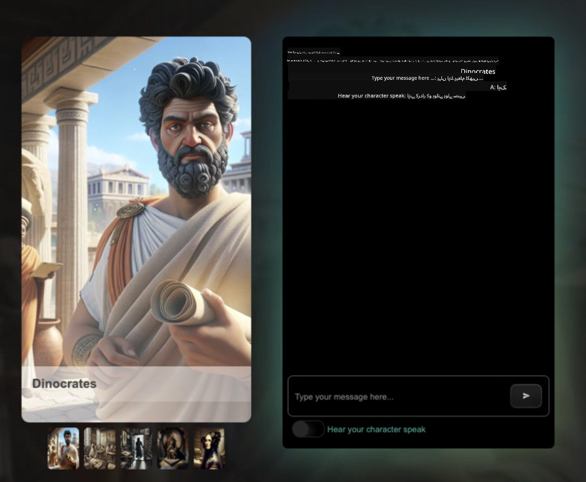

<!--
CO_OP_TRANSLATOR_METADATA:
{
  "original_hash": "1f45a6242179e3c001907339ab26af87",
  "translation_date": "2025-10-03T14:42:04+00:00",
  "source_file": "README.md",
  "language_code": "ur"
}
-->
[](https://github.com/microsoft/Web-Dev-For-Beginners/blob/master/LICENSE)  
[](https://GitHub.com/microsoft/Web-Dev-For-Beginners/graphs/contributors/)  
[](https://GitHub.com/microsoft/Web-Dev-For-Beginners/issues/)  
[](https://GitHub.com/microsoft/Web-Dev-For-Beginners/pulls/)  
[](http://makeapullrequest.com)  

[](https://GitHub.com/microsoft/Web-Dev-For-Beginners/watchers/)  
[](https://GitHub.com/microsoft/Web-Dev-For-Beginners/network/)  
[](https://GitHub.com/microsoft/Web-Dev-For-Beginners/stargazers/)  

[](https://discord.gg/zxKYvhSnVp?WT.mc_id=academic-000002-leestott)  

# ویب ڈیولپمنٹ برائے ابتدائی - ایک نصاب  

مائیکروسافٹ کلاؤڈ ایڈووکیٹس کے 12 ہفتوں کے جامع کورس کے ذریعے ویب ڈیولپمنٹ کی بنیادی باتیں سیکھیں۔ ہر ایک 24 اسباق جاوا اسکرپٹ، CSS، اور HTML کو عملی منصوبوں جیسے ٹیراریئم، براؤزر ایکسٹینشنز، اور اسپیس گیمز کے ذریعے سکھاتے ہیں۔ کوئزز، مباحثے، اور عملی اسائنمنٹس کے ذریعے مشغول ہوں۔ اپنی مہارت کو بہتر بنائیں اور ہمارے مؤثر پروجیکٹ پر مبنی تدریسی طریقہ کار کے ساتھ اپنے علم کو بہتر بنائیں۔ آج ہی اپنے کوڈنگ کے سفر کا آغاز کریں!  

Azure AI Foundry Discord کمیونٹی میں شامل ہوں  

[](https://discord.com/invite/ByRwuEEgH4)  

شروع کرنے کے لیے ان مراحل پر عمل کریں:  
1. **ریپوزیٹری کو فورک کریں**: کلک کریں [](https://GitHub.com/microsoft/Web-Dev-For-Beginners/fork)  
2. **ریپوزیٹری کو کلون کریں**: `git clone https://github.com/microsoft/Web-Dev-For-Beginners.git`  
3. [**Azure AI Foundry Discord میں شامل ہوں اور ماہرین اور دیگر ڈیولپرز سے ملاقات کریں**](https://discord.com/invite/ByRwuEEgH4)  

### 🌐 کثیر زبان کی حمایت  

#### GitHub ایکشن کے ذریعے سپورٹ (خودکار اور ہمیشہ اپ ڈیٹ)  

[فرانسیسی](../fr/README.md) | [ہسپانوی](../es/README.md) | [جرمن](../de/README.md) | [روسی](../ru/README.md) | [عربی](../ar/README.md) | [فارسی](../fa/README.md) | [اردو](./README.md) | [چینی (سادہ)](../zh/README.md) | [چینی (روایتی، مکاؤ)](../mo/README.md) | [چینی (روایتی، ہانگ کانگ)](../hk/README.md) | [چینی (روایتی، تائیوان)](../tw/README.md) | [جاپانی](../ja/README.md) | [کوریائی](../ko/README.md) | [ہندی](../hi/README.md) | [بنگالی](../bn/README.md) | [مراٹھی](../mr/README.md) | [نیپالی](../ne/README.md) | [پنجابی (گرمکھی)](../pa/README.md) | [پرتگالی (پرتگال)](../pt/README.md) | [پرتگالی (برازیل)](../br/README.md) | [اطالوی](../it/README.md) | [پولش](../pl/README.md) | [ترکی](../tr/README.md) | [یونانی](../el/README.md) | [تھائی](../th/README.md) | [سویڈش](../sv/README.md) | [ڈینش](../da/README.md) | [نارویجین](../no/README.md) | [فنش](../fi/README.md) | [ڈچ](../nl/README.md) | [عبرانی](../he/README.md) | [ویتنامی](../vi/README.md) | [انڈونیشیائی](../id/README.md) | [مالے](../ms/README.md) | [ٹیگالوگ (فلپائنی)](../tl/README.md) | [سواحلی](../sw/README.md) | [ہنگری](../hu/README.md) | [چیک](../cs/README.md) | [سلوواک](../sk/README.md) | [رومانیائی](../ro/README.md) | [بلغاریائی](../bg/README.md) | [سربین (سیریلک)](../sr/README.md) | [کروشین](../hr/README.md) | [سلووینین](../sl/README.md) | [یوکرینی](../uk/README.md) | [برمی (میانمار)](../my/README.md)  

**اگر آپ اضافی زبانوں کی ترجمہ کی حمایت چاہتے ہیں تو یہاں درج ہیں [یہاں](https://github.com/Azure/co-op-translator/blob/main/getting_started/supported-languages.md)**  

[](https://open.vscode.dev/microsoft/Web-Dev-For-Beginners)  

#### 🧑‍🎓 _کیا آپ طالب علم ہیں؟_  

[**طالب علم حب صفحہ**](https://docs.microsoft.com/learn/student-hub/?WT.mc_id=academic-77807-sagibbon) پر جائیں جہاں آپ کو ابتدائی وسائل، طالب علم پیک اور یہاں تک کہ مفت سرٹیفکیٹ واؤچر حاصل کرنے کے طریقے ملیں گے۔ یہ وہ صفحہ ہے جسے آپ بک مارک کریں اور وقتاً فوقتاً چیک کریں کیونکہ ہم ماہانہ مواد تبدیل کرتے ہیں۔  

### 📣 اعلان - _نیا پروجیکٹ جنریٹو AI کے ساتھ بنانے کے لیے_  

نیا AI اسسٹنٹ پروجیکٹ ابھی شامل کیا گیا ہے، اسے دیکھیں [پروجیکٹ](./09-chat-project/README.md)  

### 📣 اعلان - _نیا نصاب_ جنریٹو AI کے لیے جاوا اسکرپٹ پر ابھی جاری کیا گیا  

ہمارا نیا جنریٹو AI نصاب مت چھوڑیں!  

شروع کرنے کے لیے [https://aka.ms/genai-js-course](https://aka.ms/genai-js-course) پر جائیں!  

  

- اسباق جو بنیادی باتوں سے لے کر RAG تک سب کچھ شامل کرتے ہیں۔  
- تاریخی کرداروں کے ساتھ GenAI اور ہماری ساتھی ایپ کے ذریعے بات چیت کریں۔  
- دلچسپ اور مشغول بیانیہ، آپ وقت کے سفر پر ہوں گے!  

  

ہر سبق میں شامل ہے:  
- اسائنمنٹ مکمل کریں  
- علم کی جانچ  
- چیلنج  
- موضوعات سیکھنے کے لیے رہنمائی جیسے:  
  - پرامپٹنگ اور پرامپٹ انجینئرنگ  
  - متن اور تصویر ایپ جنریشن  
  - سرچ ایپس  

شروع کرنے کے لیے [https://aka.ms/genai-js-course](https://aka.ms/genai-js-course) پر جائیں!  

## 🌱 شروع کریں  

> **اساتذہ**، ہم نے [کچھ تجاویز شامل کی ہیں](for-teachers.md) کہ اس نصاب کو کیسے استعمال کریں۔ ہم آپ کی رائے [ہمارے مباحثہ فورم](https://github.com/microsoft/Web-Dev-For-Beginners/discussions/categories/teacher-corner) میں چاہتے ہیں!  

**[سیکھنے والے](https://aka.ms/student-page/?WT.mc_id=academic-77807-sagibbon)**، ہر سبق کے لیے، لیکچر سے پہلے کوئز سے شروع کریں اور لیکچر مواد کو پڑھنے، مختلف سرگرمیاں مکمل کرنے اور لیکچر کے بعد کوئز کے ذریعے اپنی سمجھ کو چیک کریں۔  

اپنے سیکھنے کے تجربے کو بہتر بنانے کے لیے، اپنے ساتھیوں کے ساتھ مل کر پروجیکٹس پر کام کریں! مباحثے ہمارے [مباحثہ فورم](https://github.com/microsoft/Web-Dev-For-Beginners/discussions) میں حوصلہ افزائی کی جاتی ہے جہاں ہمارے ماڈریٹرز کی ٹیم آپ کے سوالات کے جواب دینے کے لیے دستیاب ہوگی۔  

اپنی تعلیم کو مزید آگے بڑھانے کے لیے، ہم [Microsoft Learn](https://learn.microsoft.com/users/wirelesslife/collections/p1ddcy5jwy0jkm?WT.mc_id=academic-77807-sagibbon) کو اضافی مطالعہ مواد کے لیے دریافت کرنے کی سختی سے سفارش کرتے ہیں۔  

### 📋 اپنے ماحول کو ترتیب دینا  

یہ نصاب ایک تیار شدہ ترقیاتی ماحول کے ساتھ آتا ہے! شروع کرتے وقت آپ اس نصاب کو [Codespace](https://github.com/features/codespaces/) (_ایک براؤزر پر مبنی، انسٹال کی ضرورت نہیں_) یا اپنے کمپیوٹر پر مقامی طور پر ایک ٹیکسٹ ایڈیٹر جیسے [Visual Studio Code](https://code.visualstudio.com/?WT.mc_id=academic-77807-sagibbon) کے ذریعے چلا سکتے ہیں۔  

#### اپنی ریپوزیٹری بنائیں  
اپنا کام آسانی سے محفوظ کرنے کے لیے، یہ تجویز کیا جاتا ہے کہ آپ اس ریپوزیٹری کی اپنی کاپی بنائیں۔ آپ یہ صفحہ کے اوپر **Use this template** بٹن پر کلک کرکے کر سکتے ہیں۔ یہ آپ کے GitHub اکاؤنٹ میں نصاب کی ایک کاپی کے ساتھ ایک نئی ریپوزیٹری بنائے گا۔  

ان مراحل پر عمل کریں:  
1. **ریپوزیٹری کو فورک کریں**: اس صفحہ کے اوپر دائیں کونے میں "Fork" بٹن پر کلک کریں۔  
2. **ریپوزیٹری کو کلون کریں**: `git clone https://github.com/microsoft/Web-Dev-For-Beginners.git`  

#### نصاب کو Codespace میں چلانا  

اس ریپوزیٹری کی اپنی کاپی میں جو آپ نے بنائی، **Code** بٹن پر کلک کریں اور **Open with Codespaces** منتخب کریں۔ یہ آپ کے کام کے لیے ایک نیا Codespace بنائے گا۔  

  

#### نصاب کو اپنے کمپیوٹر پر مقامی طور پر چلانا  

اس نصاب کو اپنے کمپیوٹر پر مقامی طور پر چلانے کے لیے، آپ کو ایک ٹیکسٹ ایڈیٹر، ایک براؤزر اور ایک کمانڈ لائن ٹول کی ضرورت ہوگی۔ ہمارا پہلا سبق، [پروگرامنگ زبانوں اور ٹولز کا تعارف](../../1-getting-started-lessons/1-intro-to-programming-languages)، آپ کو ان ٹولز کے مختلف اختیارات کے ذریعے لے جائے گا تاکہ آپ وہ منتخب کریں جو آپ کے لیے بہترین کام کرے۔  

ہماری سفارش ہے کہ آپ [Visual Studio Code](https://code.visualstudio.com/?WT.mc_id=academic-77807-sagibbon) کو بطور ایڈیٹر استعمال کریں، جس میں ایک بلٹ ان [Terminal](https://code.visualstudio.com/docs/terminal/basics/?WT.mc_id=academic-77807-sagibbon) بھی شامل ہے۔ آپ [Visual Studio Code](https://code.visualstudio.com/?WT.mc_id=academic-77807-sagibbon) یہاں سے ڈاؤن لوڈ کر سکتے ہیں۔  

1. اپنی ریپوزیٹری کو اپنے کمپیوٹر پر کلون کریں۔ آپ یہ **Code** بٹن پر کلک کرکے اور URL کو کاپی کرکے کر سکتے ہیں:  

    [CodeSpace](./images/createcodespace.png)  

    پھر، [Visual Studio Code](https://code.visualstudio.com/?WT.mc_id=academic-77807-sagibbon) میں [Terminal](https://code.visualstudio.com/docs/terminal/basics/?WT.mc_id=academic-77807-sagibbon) کھولیں اور درج ذیل کمانڈ چلائیں، `<your-repository-url>` کو اس URL سے تبدیل کریں جو آپ نے ابھی کاپی کیا ہے:  

    ```bash 
    git clone <your-repository-url>
    ```
  
2. فولڈر کو Visual Studio Code میں کھولیں۔ آپ یہ **File** > **Open Folder** پر کلک کرکے اور وہ فولڈر منتخب کرکے کر سکتے ہیں جو آپ نے ابھی کلون کیا ہے۔  

>  تجویز کردہ Visual Studio Code ایکسٹینشنز:  
>  
> * [Live Server](https://marketplace.visualstudio.com/items?itemName=ritwickdey.LiveServer&WT.mc_id=academic-77807-sagibbon) - HTML صفحات کو Visual Studio Code کے اندر پیش نظارہ کرنے کے لیے  
> * [Copilot](https://marketplace.visualstudio.com/items?itemName=GitHub.copilot&WT.mc_id=academic-77807-sagibbon) - کوڈ لکھنے میں تیزی سے مدد کرنے کے لیے  

## 📂 ہر سبق میں شامل ہے:  

- اختیاری اسکیچ نوٹ  
- اختیاری اضافی ویڈیو  
- سبق سے پہلے وارم اپ کوئز  
- تحریری سبق  
- پروجیکٹ پر مبنی اسباق کے لیے، پروجیکٹ بنانے کے لیے مرحلہ وار رہنما  
- علم کی جانچ  
- ایک چیلنج  
- اضافی مطالعہ  
- اسائنمنٹ  
- [سبق کے بعد کوئز](https://ff-quizzes.netlify.app/web/)  
> **کوئز کے بارے میں ایک نوٹ**: تمام کوئز Quiz-app فولڈر میں موجود ہیں، کل 48 کوئز ہیں جن میں ہر ایک میں تین سوالات ہیں۔ یہ [یہاں](https://ff-quizzes.netlify.app/web/) دستیاب ہیں۔ کوئز ایپ کو مقامی طور پر چلایا جا سکتا ہے یا Azure پر ڈپلائی کیا جا سکتا ہے؛ `quiz-app` فولڈر میں دی گئی ہدایات پر عمل کریں۔

## 🗃️ اسباق

|     |                       پروجیکٹ کا نام                       |                            سکھائے گئے تصورات                             | سیکھنے کے مقاصد                                                                                                                 |                                                         منسلک سبق                                                          |         مصنف          |
| :-: | :------------------------------------------------------: | :--------------------------------------------------------------------: | ----------------------------------------------------------------------------------------------------------------------------------- | :----------------------------------------------------------------------------------------------------------------------------: | :---------------------: |
| 01  |                     شروعات                      |           پروگرامنگ کا تعارف اور پیشہ ورانہ آلات           | زیادہ تر پروگرامنگ زبانوں کے بنیادی اصولوں کو سیکھیں اور اس سافٹ ویئر کے بارے میں جانیں جو پیشہ ور ڈویلپرز کو ان کا کام کرنے میں مدد دیتا ہے | [پروگرامنگ زبانوں اور پیشہ ورانہ آلات کا تعارف](./1-getting-started-lessons/1-intro-to-programming-languages/README.md) |         جیسمن         |
| 02  |                     شروعات                      |             GitHub کی بنیادی باتیں، ٹیم کے ساتھ کام کرنا             | اپنے پروجیکٹ میں GitHub کا استعمال کیسے کریں، کوڈ بیس پر دوسروں کے ساتھ تعاون کیسے کریں                                                    |                            [GitHub کا تعارف](./1-getting-started-lessons/2-github-basics/README.md)                             |          فلور          |
| 03  |                     شروعات                      |                             رسائی                              | ویب رسائی کی بنیادی باتیں سیکھیں                                                                                               |                       [رسائی کے بنیادی اصول](./1-getting-started-lessons/3-accessibility/README.md)                       |       کرسٹوفر       |
| 04  |                        JS کی بنیادی باتیں                         |                         جاوا اسکرپٹ ڈیٹا کی اقسام                          | جاوا اسکرپٹ ڈیٹا کی اقسام کی بنیادی باتیں                                                                                                 |                                       [ڈیٹا کی اقسام](./2-js-basics/1-data-types/README.md)                                        |         جیسمن         |
| 05  |                        JS کی بنیادی باتیں                         |                         فنکشنز اور طریقے                          | ایپلیکیشن کے منطقی بہاؤ کو منظم کرنے کے لیے فنکشنز اور طریقوں کے بارے میں جانیں                                                             |                              [فنکشنز اور طریقے](./2-js-basics/2-functions-methods/README.md)                               | جیسمن اور کرسٹوفر |
| 06  |                        JS کی بنیادی باتیں                         |                        جاوا اسکرپٹ کے ساتھ فیصلے کرنا                        | فیصلہ سازی کے طریقوں کا استعمال کرتے ہوئے اپنے کوڈ میں شرائط بنانے کا طریقہ سیکھیں                                                           |                                 [فیصلے کرنا](./2-js-basics/3-making-decisions/README.md)                                  |         جیسمن         |
| 07  |                        JS کی بنیادی باتیں                         |                            Arrays اور Loops                            | جاوا اسکرپٹ میں Arrays اور Loops کا استعمال کرتے ہوئے ڈیٹا کے ساتھ کام کریں                                                                                 |                                   [Arrays اور Loops](./2-js-basics/4-arrays-loops/README.md)                                    |         جیسمن         |
| 08  |       [Terrarium](./3-terrarium/solution/README.md)       |                            HTML کی مشق                            | آن لائن Terrarium بنانے کے لیے HTML بنائیں، خاص طور پر لے آؤٹ بنانے پر توجہ دیں                                                         |                                 [HTML کا تعارف](./3-terrarium/1-intro-to-html/README.md)                                 |           جین           |
| 09  |       [Terrarium](./3-terrarium/solution/README.md)       |                            CSS کی مشق                             | آن لائن Terrarium کو اسٹائل کرنے کے لیے CSS بنائیں، خاص طور پر CSS کی بنیادی باتوں پر توجہ دیں، بشمول صفحہ کو Responsive بنانا                     |                                  [CSS کا تعارف](./3-terrarium/2-intro-to-css/README.md)                                  |           جین           |
| 10  |            [Terrarium](./3-terrarium/solution/README.md)            |                 جاوا اسکرپٹ Closures، DOM کی ہیرا پھیری                  | جاوا اسکرپٹ بنائیں تاکہ Terrarium کو Drag/Drop انٹرفیس کے طور پر کام کرنے کے قابل بنایا جا سکے، خاص طور پر Closures اور DOM کی ہیرا پھیری پر توجہ دیں             |                  [جاوا اسکرپٹ Closures، DOM کی ہیرا پھیری](./3-terrarium/3-intro-to-DOM-and-closures/README.md)                   |           جین           |
| 11  |          [Typing Game](./4-typing-game/solution/README.md)          |                          ایک Typing Game بنائیں                           | اپنے جاوا اسکرپٹ ایپ کی منطق کو چلانے کے لیے کی بورڈ ایونٹس کا استعمال کیسے کریں                                                          |                                [ایونٹ پر مبنی پروگرامنگ](./4-typing-game/typing-game/README.md)                                |       کرسٹوفر       |
| 12  | [Green Browser Extension](./5-browser-extension/solution/README.md) |                         براؤزرز کے ساتھ کام کرنا                          | براؤزرز کیسے کام کرتے ہیں، ان کی تاریخ، اور براؤزر ایکسٹینشن کے ابتدائی عناصر کو کیسے تیار کریں                               |                               [براؤزرز کے بارے میں](./5-browser-extension/1-about-browsers/README.md)                                |           جین           |
| 13  | [Green Browser Extension](./5-browser-extension/solution/README.md) | ایک فارم بنانا، API کو کال کرنا اور متغیرات کو لوکل اسٹوریج میں محفوظ کرنا | اپنے براؤزر ایکسٹینشن کے جاوا اسکرپٹ عناصر بنائیں تاکہ لوکل اسٹوریج میں محفوظ متغیرات کا استعمال کرتے ہوئے API کو کال کیا جا سکے                      |                [APIs، Forms، اور لوکل اسٹوریج](./5-browser-extension/2-forms-browsers-local-storage/README.md)                 |           جین           |
| 14  | [Green Browser Extension](./5-browser-extension/solution/README.md) |          براؤزر میں پس منظر کے عمل، ویب کی کارکردگی          | براؤزر کے پس منظر کے عمل کا استعمال کریں تاکہ ایکسٹینشن کے آئیکن کو منظم کیا جا سکے؛ ویب کی کارکردگی اور کچھ اصلاحات کے بارے میں جانیں   |             [پس منظر کے کام اور کارکردگی](./5-browser-extension/3-background-tasks-and-performance/README.md)              |           جین           |
| 15  |           [Space Game](./6-space-game/solution/README.md)           |             جاوا اسکرپٹ کے ساتھ مزید جدید گیم ڈویلپمنٹ             | گیم بنانے کی تیاری میں Classes اور Composition کا استعمال کرتے ہوئے Inheritance اور Pub/Sub پیٹرن کے بارے میں جانیں              |                      [جدید گیم ڈویلپمنٹ کا تعارف](./6-space-game/1-introduction/README.md)                       |          کرس          |
| 16  |           [Space Game](./6-space-game/solution/README.md)           |                           Canvas پر ڈرائنگ                            | Canvas API کے بارے میں جانیں، جو اسکرین پر عناصر کو ڈرائنگ کرنے کے لیے استعمال ہوتا ہے                                                                       |                                [Canvas پر ڈرائنگ](./6-space-game/2-drawing-to-canvas/README.md)                                |          کرس          |
| 17  |           [Space Game](./6-space-game/solution/README.md)           |                   اسکرین پر عناصر کو حرکت دینا                    | دریافت کریں کہ عناصر Cartesian Coordinates اور Canvas API کا استعمال کرتے ہوئے حرکت کیسے حاصل کر سکتے ہیں                                            |                           [عناصر کو حرکت دینا](./6-space-game/3-moving-elements-around/README.md)                           |          کرس          |
| 18  |           [Space Game](./6-space-game/solution/README.md)           |                          تصادم کا پتہ لگانا                           | عناصر کو ایک دوسرے سے ٹکرانے اور ردعمل دینے کے لیے Keypresses کا استعمال کریں اور گیم کی کارکردگی کو یقینی بنانے کے لیے Cooldown فنکشن فراہم کریں    |                              [تصادم کا پتہ لگانا](./6-space-game/4-collision-detection/README.md)                              |          کرس          |
| 19  |           [Space Game](./6-space-game/solution/README.md)           |                             اسکور رکھنا                              | گیم کی حیثیت اور کارکردگی کی بنیاد پر ریاضی کے حسابات انجام دیں                                                                |                                    [اسکور رکھنا](./6-space-game/5-keeping-score/README.md)                                    |          کرس          |
| 20  |           [Space Game](./6-space-game/solution/README.md)           |                     گیم کو ختم کرنا اور دوبارہ شروع کرنا                     | گیم کو ختم کرنے اور دوبارہ شروع کرنے کے بارے میں جانیں، بشمول اثاثوں کو صاف کرنا اور متغیرات کی قدروں کو دوبارہ ترتیب دینا                              |                                [ختم کرنے کی حالت](./6-space-game/6-end-condition/README.md)                                 |          کرس          |
| 21  |         [Banking App](./7-bank-project/solution/README.md)          |                 HTML ٹیمپلیٹس اور ویب ایپ میں روٹس                 | روٹنگ اور HTML ٹیمپلیٹس کا استعمال کرتے ہوئے ایک ملٹی پیج ویب سائٹ کی آرکیٹیکچر کا خاکہ تیار کرنے کا طریقہ سیکھیں                             |                            [HTML ٹیمپلیٹس اور روٹس](./7-bank-project/1-template-route/README.md)                             |          یوہان          |
| 22  |         [Banking App](./7-bank-project/solution/README.md)          |                  لاگ ان اور رجسٹریشن فارم بنائیں                   | فارم بنانے اور توثیق کے معمولات کو سنبھالنے کے بارے میں جانیں                                                                          |                                           [فارمز](./7-bank-project/2-forms/README.md)                                           |          یوہان          |
| 23  |         [Banking App](./7-bank-project/solution/README.md)          |                   ڈیٹا کو حاصل کرنے اور استعمال کرنے کے طریقے                   | ڈیٹا آپ کی ایپ میں کیسے بہتا ہے، اسے کیسے حاصل کریں، محفوظ کریں، اور ختم کریں                                                 |                                            [ڈیٹا](./7-bank-project/3-data/README.md)                                            |          یوہان          |
| 24  |         [Banking App](./7-bank-project/solution/README.md)          |                      اسٹیٹ مینجمنٹ کے تصورات                      | آپ کی ایپ اسٹیٹ کو کیسے برقرار رکھتی ہے اور اسے پروگرام کے ذریعے کیسے منظم کریں                                                              |                                [اسٹیٹ مینجمنٹ](./7-bank-project/4-state-management/README.md)                                |          یوہان          |
| 25 | [Browser/VScode Code](../../8-code-editor) | VScode کے ساتھ کام کرنا | کوڈ ایڈیٹر کا استعمال کیسے کریں سیکھیں | [VScode کوڈ ایڈیٹر کا استعمال کریں](./8-code-editor/1-using-a-code-editor/README.md) | کرس |
| 26 | [AI Assistants](./9-chat-project/README.md) | AI کے ساتھ کام کرنا | اپنا AI اسسٹنٹ بنانے کا طریقہ سیکھیں | [AI اسسٹنٹ پروجیکٹ](./9-chat-project/README.md) | کرس |

## 🏫 تدریسی اصول

ہمارا نصاب دو اہم تدریسی اصولوں پر مبنی ہے:
* پروجیکٹ پر مبنی سیکھنا
* بار بار کوئز لینا

یہ پروگرام جاوا اسکرپٹ، HTML، اور CSS کے بنیادی اصولوں کے ساتھ ساتھ آج کے ویب ڈویلپرز کے استعمال کردہ جدید ترین آلات اور تکنیکوں کو سکھاتا ہے۔ طلباء کو ٹائپنگ گیم، ورچوئل Terrarium، ماحول دوست براؤزر ایکسٹینشن، Space Invader طرز کا گیم، اور کاروباروں کے لیے بینکنگ ایپ بنانے کا عملی تجربہ حاصل کرنے کا موقع ملے گا۔ اس سیریز کے اختتام تک، طلباء ویب ڈویلپمنٹ کی ٹھوس سمجھ حاصل کر چکے ہوں گے۔

> 🎓 آپ اس نصاب کے ابتدائی چند اسباق کو Microsoft Learn پر [Learn Path](https://docs.microsoft.com/learn/paths/web-development-101/?WT.mc_id=academic-77807-sagibbon) کے طور پر لے سکتے ہیں!

یہ یقینی بنا کر کہ مواد پروجیکٹس کے ساتھ ہم آہنگ ہے، طلباء کے لیے عمل کو زیادہ دلچسپ بنایا گیا ہے اور تصورات کی یادداشت کو بڑھایا جائے گا۔ ہم نے جاوا اسکرپٹ کی بنیادی باتوں میں کئی ابتدائی اسباق بھی لکھے ہیں تاکہ تصورات کا تعارف کرایا جا سکے، جنہیں "[Beginners Series to: JavaScript](https://channel9.msdn.com/Series/Beginners-Series-to-JavaScript/?WT.mc_id=academic-77807-sagibbon)" ویڈیو ٹیوٹوریلز کے مجموعے کے ساتھ جوڑا گیا ہے، جن کے کچھ مصنفین نے اس نصاب میں تعاون کیا ہے۔

اس کے علاوہ، کلاس سے پہلے ایک کم دباؤ والا کوئز طالب علم کے ارادے کو کسی موضوع کو سیکھنے کی طرف متوجہ کرتا ہے، جبکہ کلاس کے بعد دوسرا کوئز مزید یادداشت کو یقینی بناتا ہے۔ یہ نصاب لچکدار اور دلچسپ ہونے کے لیے ڈیزائن کیا گیا تھا اور اسے مکمل یا جزوی طور پر لیا جا سکتا ہے۔ پروجیکٹس چھوٹے سے شروع ہوتے ہیں اور 12 ہفتے کے سائیکل کے اختتام تک بتدریج پیچیدہ ہو جاتے ہیں۔

جبکہ ہم نے جاوا اسکرپٹ فریم ورک کو متعارف کرانے سے جان بوجھ کر گریز کیا ہے تاکہ ویب ڈویلپر کے طور پر فریم ورک اپنانے سے پہلے درکار بنیادی مہارتوں پر توجہ مرکوز کی جا سکے، اس نصاب کو مکمل کرنے کے بعد اگلا اچھا قدم Node.js کے بارے میں سیکھنا ہوگا، ویڈیوز کے ایک اور مجموعے کے ذریعے: "[Beginner Series to: Node.js](https://channel9.msdn.com/Series/Beginners-Series-to-Nodejs/?WT.mc_id=academic-77807-sagibbon)".

> ہمارے [Code of Conduct](CODE_OF_CONDUCT.md) اور [Contributing](CONTRIBUTING.md) رہنما اصول دیکھیں۔ ہم آپ کی تعمیری رائے کا خیر مقدم کرتے ہیں!

## 🧭 آف لائن رسائی

آپ اس دستاویزات کو آف لائن [Docsify](https://docsify.js.org/#/) کا استعمال کرتے ہوئے چلا سکتے ہیں۔ اس ریپو کو فورک کریں، [Docsify انسٹال کریں](https://docsify.js.org/#/quickstart) اپنی مقامی مشین پر، اور پھر اس ریپو کے روٹ فولڈر میں `docsify serve` ٹائپ کریں۔ ویب سائٹ آپ کے localhost پر پورٹ 3000 پر پیش کی جائے گی: `localhost:3000`.

## 📘 PDF

تمام اسباق کا PDF [یہاں](https://microsoft.github.io/Web-Dev-For-Beginners/pdf/readme.pdf) پایا جا سکتا ہے۔

## 🎒 دیگر کورسز

ہماری ٹیم دیگر کورسز بھی تیار کرتی ہے! دیکھیں:

- [MCP for Beginners](https://aka.ms/mcp-for-beginners)
- [Edge AI for Beginners](https://aka.ms/edgeai-for-beginners)
- [AI Agents for Beginners](https://aka.ms/ai-agents-beginners)
- [Generative AI for Beginners .NET](https://github.com/microsoft/Generative-AI-for-beginners-dotnet)
- [Generative AI with JavaScript](https://github.com/microsoft/generative-ai-with-javascript)
- [Generative AI with Java](https://github.com/microsoft/Generative-AI-for-beginners-java)
- [AI for Beginners](https://aka.ms/ai-beginners)
- [Data Science for Beginners](https://aka.ms/datascience-beginners)
- [ML for Beginners](https://aka.ms/ml-beginners)
- [Cybersecurity for Beginners](https://github.com/microsoft/Security-101)
- [Web Dev for Beginners](https://aka.ms/webdev-beginners)
- [IoT for Beginners](https://aka.ms/iot-beginners)
- [XR Development for Beginners](https://github.com/microsoft/xr-development-for-beginners)
- [Mastering GitHub Copilot for Agentic use](https://github.com/microsoft/Mastering-GitHub-Copilot-for-Paired-Programming)
- [C#/.NET ڈویلپرز کے لیے GitHub Copilot کو مہارت سے استعمال کرنا](https://github.com/microsoft/mastering-github-copilot-for-dotnet-csharp-developers)
- [اپنا Copilot ایڈونچر خود منتخب کریں](https://github.com/microsoft/CopilotAdventures)

## مدد حاصل کریں

اگر آپ کسی مسئلے میں پھنس جائیں یا AI ایپس بنانے کے بارے میں سوالات ہوں، تو شامل ہوں:

[](https://aka.ms/foundry/discord)

اگر آپ کو پروڈکٹ کے بارے میں رائے دینی ہو یا ایپس بنانے کے دوران کوئی خرابی ہو، تو یہاں جائیں:

[](https://aka.ms/foundry/forum)

## لائسنس

یہ ریپوزیٹری MIT لائسنس کے تحت لائسنس یافتہ ہے۔ مزید معلومات کے لیے [LICENSE](../../LICENSE) فائل دیکھیں۔

---

**ڈسکلیمر**:  
یہ دستاویز AI ترجمہ سروس [Co-op Translator](https://github.com/Azure/co-op-translator) کا استعمال کرتے ہوئے ترجمہ کی گئی ہے۔ ہم درستگی کے لیے کوشش کرتے ہیں، لیکن براہ کرم آگاہ رہیں کہ خودکار ترجمے میں غلطیاں یا غیر درستیاں ہو سکتی ہیں۔ اصل دستاویز کو اس کی اصل زبان میں مستند ذریعہ سمجھا جانا چاہیے۔ اہم معلومات کے لیے، پیشہ ور انسانی ترجمہ کی سفارش کی جاتی ہے۔ ہم اس ترجمے کے استعمال سے پیدا ہونے والی کسی بھی غلط فہمی یا غلط تشریح کے ذمہ دار نہیں ہیں۔