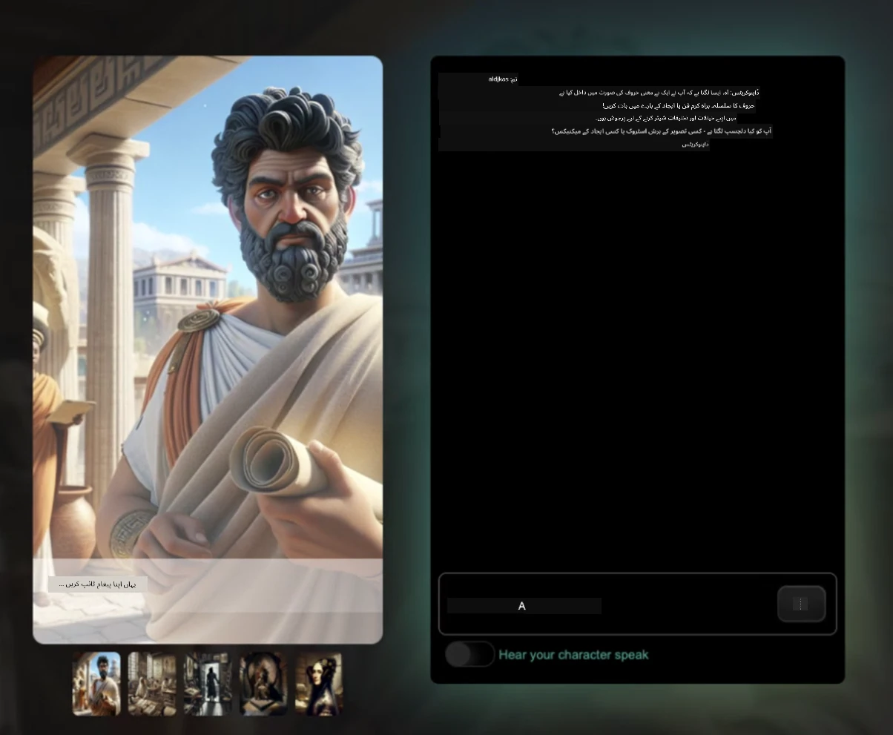
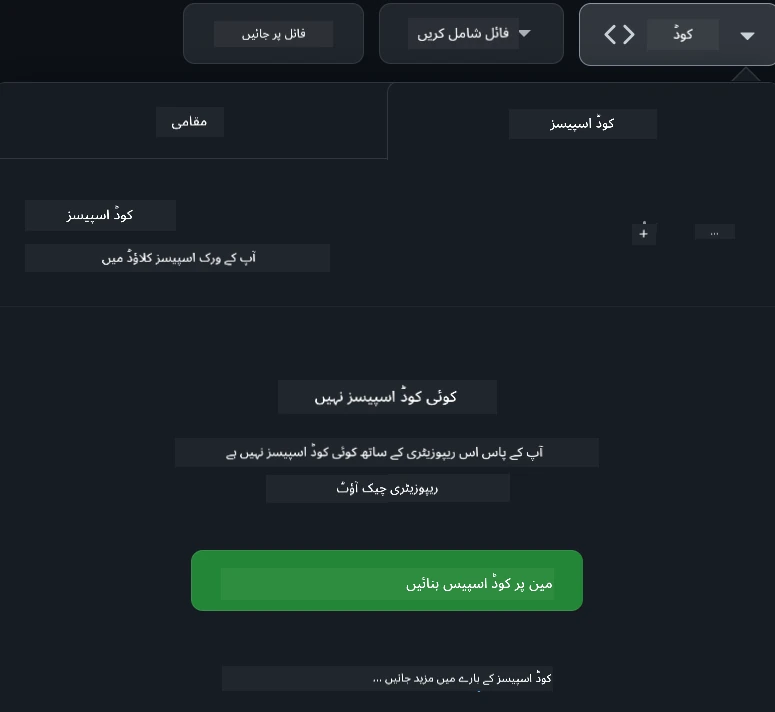

[](https://github.com/microsoft/Web-Dev-For-Beginners/blob/master/LICENSE)
[](https://GitHub.com/microsoft/Web-Dev-For-Beginners/graphs/contributors/)
[](https://GitHub.com/microsoft/Web-Dev-For-Beginners/issues/)
[](https://GitHub.com/microsoft/Web-Dev-For-Beginners/pulls/)
[](http://makeapullrequest.com) 

[](https://GitHub.com/microsoft/Web-Dev-For-Beginners/watchers/)
[](https://GitHub.com/microsoft/Web-Dev-For-Beginners/network/)
[](https://GitHub.com/microsoft/Web-Dev-For-Beginners/stargazers/)

[](https://discord.gg/nTYy5BXMWG)

# ویب ڈیولپمنٹ برائے ابتدائی افراد - ایک نصاب

مائیکروسافٹ کلاؤڈ ایڈووکیٹس کے ذریعہ ہمارے 12 ہفتوں کے جامع کورس کے ساتھ ویب ڈیولپمنٹ کی بنیادی باتیں سیکھیں۔ 24 اسباق میں سے ہر ایک جاوا اسکرپٹ، CSS، اور HTML کی گہرائی میں جا کر عملی منصوبوں جیسے ٹیراریمز، براؤزر ایکسٹینشنز، اور اسپیس گیمز پر کام کرتا ہے۔ کوئزز، مباحثوں، اور عملی اسائنمنٹس میں شامل ہوں۔ اپنی مہارتوں کو بہتر بنائیں اور ہمارے مؤثر پروجیکٹ پر مبنی تدریسی طریقہ کار کے ساتھ اپنی معلومات کو بہتر طور پر محفوظ کریں۔ آج ہی اپنی کوڈنگ کی سفر شروع کریں!

Azure AI Foundry Discord کمیونٹی میں شامل ہوں

[](https://discord.gg/nTYy5BXMWG)

ان وسائل کو استعمال کرنا شروع کرنے کے لیے یہ اقدامات کریں:
1. **ریپوزیٹری کو فورک کریں**: کلک کریں [](https://GitHub.com/microsoft/Web-Dev-For-Beginners/fork)
2. **ریپوزیٹری کو کلون کریں**:   `git clone https://github.com/microsoft/Web-Dev-For-Beginners.git`
3. [**Azure AI Foundry Discord میں شامل ہوں اور ماہرین اور دیگر ڈیولپرز سے ملیں**](https://discord.com/invite/ByRwuEEgH4)

### 🌐 کثیراللسانی حمایت

#### GitHub ایکشن کے ذریعے معاونت (خودکار اور ہمیشہ تازہ ترین)

<!-- CO-OP TRANSLATOR LANGUAGES TABLE START -->
[Arabic](../ar/README.md) | [Bengali](../bn/README.md) | [Bulgarian](../bg/README.md) | [Burmese (Myanmar)](../my/README.md) | [Chinese (Simplified)](../zh-CN/README.md) | [Chinese (Traditional, Hong Kong)](../zh-HK/README.md) | [Chinese (Traditional, Macau)](../zh-MO/README.md) | [Chinese (Traditional, Taiwan)](../zh-TW/README.md) | [Croatian](../hr/README.md) | [Czech](../cs/README.md) | [Danish](../da/README.md) | [Dutch](../nl/README.md) | [Estonian](../et/README.md) | [Finnish](../fi/README.md) | [French](../fr/README.md) | [German](../de/README.md) | [Greek](../el/README.md) | [Hebrew](../he/README.md) | [Hindi](../hi/README.md) | [Hungarian](../hu/README.md) | [Indonesian](../id/README.md) | [Italian](../it/README.md) | [Japanese](../ja/README.md) | [Kannada](../kn/README.md) | [Khmer](../km/README.md) | [Korean](../ko/README.md) | [Lithuanian](../lt/README.md) | [Malay](../ms/README.md) | [Malayalam](../ml/README.md) | [Marathi](../mr/README.md) | [Nepali](../ne/README.md) | [Nigerian Pidgin](../pcm/README.md) | [Norwegian](../no/README.md) | [Persian (Farsi)](../fa/README.md) | [Polish](../pl/README.md) | [Portuguese (Brazil)](../pt-BR/README.md) | [Portuguese (Portugal)](../pt-PT/README.md) | [Punjabi (Gurmukhi)](../pa/README.md) | [Romanian](../ro/README.md) | [Russian](../ru/README.md) | [Serbian (Cyrillic)](../sr/README.md) | [Slovak](../sk/README.md) | [Slovenian](../sl/README.md) | [Spanish](../es/README.md) | [Swahili](../sw/README.md) | [Swedish](../sv/README.md) | [Tagalog (Filipino)](../tl/README.md) | [Tamil](../ta/README.md) | [Telugu](../te/README.md) | [Thai](../th/README.md) | [Turkish](../tr/README.md) | [Ukrainian](../uk/README.md) | [Urdu](./README.md) | [Vietnamese](../vi/README.md)

> **کیا آپ لوکل طور پر کلون کرنا پسند کرتے ہیں؟**
>
> اس ریپوزیٹری میں 50+ زبانوں میں ترجمے شامل ہیں جو ڈاؤن لوڈ کے سائز کو کافی بڑھا دیتے ہیں۔ بغیر ترجموں کے کلون کرنے کے لیے sparse checkout استعمال کریں:
>
> **Bash / macOS / Linux:**
> ```bash
> git clone --filter=blob:none --sparse https://github.com/microsoft/Web-Dev-For-Beginners.git
> cd Web-Dev-For-Beginners
> git sparse-checkout set --no-cone '/*' '!translations' '!translated_images'
> ```
>
> **CMD (Windows):**
> ```cmd
> git clone --filter=blob:none --sparse https://github.com/microsoft/Web-Dev-For-Beginners.git
> cd Web-Dev-For-Beginners
> git sparse-checkout set --no-cone "/*" "!translations" "!translated_images"
> ```
>
> اس سے آپ کو کورس مکمل کرنے کے لیے درکار سب کچھ تیز تر ڈاؤن لوڈ کے ساتھ مل جائے گا۔
<!-- CO-OP TRANSLATOR LANGUAGES TABLE END -->

**اگر آپ چاہیں کہ اضافی ترجمہ شدہ زبانوں کی حمایت کی جائے تو وہ یہاں فہرست وار دستیاب ہیں [here](https://github.com/Azure/co-op-translator/blob/main/getting_started/supported-languages.md)**

[](https://open.vscode.dev/microsoft/Web-Dev-For-Beginners)

#### 🧑‍🎓 _کیا آپ طالب علم ہیں؟_

وزٹ کریں [**Student Hub page**](https://docs.microsoft.com/learn/student-hub/?WT.mc_id=academic-77807-sagibbon) جہاں آپ کو ابتدائی وسائل، طالب علم پیکس اور مفت سرٹیفکیٹ واؤچر حاصل کرنے کے طریقے ملیں گے۔ یہ وہ صفحہ ہے جسے آپ کو نشان زد کرنا چاہیے اور وقتاً فوقتاً جانچنا چاہیے کیونکہ ہم ماہانہ مواد تبدیل کرتے ہیں۔

### 📣 اعلان - نئے GitHub Copilot Agent موڈ چیلنجز مکمل کرنے کے لیے!

نیا چیلنج شامل کیا گیا ہے، زیادہ تر ابواب میں "GitHub Copilot Agent Challenge 🚀" دیکھیں۔ یہ آپ کے لیے GitHub Copilot اور Agent موڈ استعمال کرتے ہوئے مکمل کرنے کا نیا چیلنج ہے۔ اگر آپ نے پہلے Agent موڈ استعمال نہیں کیا ہے تو یہ صرف متن تیار کرنے کی صلاحیت نہیں رکھتا بلکہ فائلز بنانے، ترمیم کرنے، کمانڈز چلانے اور بہت کچھ کر سکتا ہے۔

### 📣 اعلان - _نیا پروجیکٹ جنریٹو AI استعمال کرتے ہوئے بنانے کے لیے_ 

نیا AI اسسٹنٹ پروجیکٹ ابھی شامل کیا گیا ہے، چیک کریں [project](./9-chat-project/README.md)

### 📣 اعلان - _جاوا اسکرپٹ کے لیے جنریٹو AI پر نیا نصاب جاری کیا گیا ہے_

ہمارا نیا جنریٹو AI نصاب مت چھوڑیں!

شروع کرنے کے لیے وزٹ کریں [https://aka.ms/genai-js-course](https://aka.ms/genai-js-course) !


- اسباق جو بنیادی باتوں سے لے کر RAG تک کور کرتے ہیں۔
- GenAI اور ہمارے کمپینین ایپ کے ساتھ تاریخی کرداروں سے بات چیت کریں۔
- مزے دار اور دلچسپ قصہ، آپ وقت میں سفر کریں گے!




ہر سبق میں مکمل کرنے کے لیے اسائنمنٹ، نالج چیک اور چیلنج شامل ہے تاکہ آپ کو درج ذیل موضوعات سیکھنے میں مدد ملے:
- پرامپٹنگ اور پرامپٹ انجینئرنگ
- ٹیکسٹ اور امیج ایپ جنریشن
- سرچ ایپس

شروع کرنے کے لیے وزٹ کریں [https://aka.ms/genai-js-course](https://aka.ms/genai-js-course) !


## 🌱 شروع کریں

> **اساتذہ**، ہم نے [کچھ تجاویز شامل کی ہیں](for-teachers.md) کہ اس نصاب کو کیسے استعمال کیا جائے۔ ہمیں آپ کی رائے کا انتظار رہے گا [ہماری مباحثہ فورم](https://github.com/microsoft/Web-Dev-For-Beginners/discussions/categories/teacher-corner) میں!

**[سیکھنے والے](https://aka.ms/student-page/?WT.mc_id=academic-77807-sagibbon)**، ہر سبق کے لیے، پری لیکچر کوئز سے شروع کریں اور لیکچر کے مواد کو پڑھیں، مختلف سرگرمیاں مکمل کریں اور پوسٹ لیکچر کوئز کے ذریعے اپنی سمجھ کو چیک کریں۔

اپنے تعلیمی تجربے کو بڑھانے کے لیے، اپنے ساتھیوں سے جڑیں اور منصوبوں پر مل کر کام کریں! مباحثے ہمارے [مباحثہ فورم](https://github.com/microsoft/Web-Dev-For-Beginners/discussions) میں خوش آئند ہیں جہاں ہمارے ماڈریٹرز آپ کے سوالات کے جواب دینے کے لیے دستیاب ہوں گے۔

اپنی تعلیم کو مزید آگے بڑھانے کے لیے، ہم تجویز کرتے ہیں کہ آپ [Microsoft Learn](https://learn.microsoft.com/users/wirelesslife/collections/p1ddcy5jwy0jkm?WT.mc_id=academic-77807-sagibbon) پر اضافی مطالعہ کے مواد کو دریافت کریں۔

### 📋 اپنا ماحول سیٹ اپ کریں

یہ نصاب ایک تیار ترقیاتی ماحول کے ساتھ آتا ہے! شروع کرتے وقت آپ انتخاب کر سکتے ہیں کہ آپ نصاب کو [Codespace](https://github.com/features/codespaces/) میں چلائیں (جو براؤزر بیسڈ، بغیر انسٹال کے چلنے والا ماحول ہے)، یا اپنے کمپیوٹر پر لوکل طور پر ایک متن کے ایڈیٹر جیسے کہ [Visual Studio Code](https://code.visualstudio.com/?WT.mc_id=academic-77807-sagibbon) استعمال کر کے چلائیں۔

#### اپنی ریپوزیٹری بنائیں
اپنا کام آسانی سے محفوظ کرنے کے لیے، یہ تجویز کیا جاتا ہے کہ آپ اس ریپوزیٹری کی اپنی کاپی بنائیں۔ یہ کرنے کے لیے صفحہ کے اوپر موجود **Use this template** بٹن پر کلک کریں۔ اس سے آپ کے GitHub اکاؤنٹ میں نصاب کی ایک کاپی کے ساتھ ایک نئی ریپوزیٹری بن جائے گی۔

یہ اقدامات کریں:
1. **ریپوزیٹری کو فورک کریں**: اس صفحہ کے اوپری دائیں کونے میں "Fork" بٹن پر کلک کریں۔
2. **ریپوزیٹری کو کلون کریں**:   `git clone https://github.com/microsoft/Web-Dev-For-Beginners.git`

#### نصاب کو Codespace میں چلانا

جو کاپی آپ نے بنائی ہے اس میں، **Code** بٹن پر کلک کریں اور **Open with Codespaces** منتخب کریں۔ یہ آپ کے لیے نیا Codespace بنائے گا جہاں آپ کام کر سکیں گے۔



#### نصاب کو اپنے کمپیوٹر پر لوکل چلانا

اپنے کمپیوٹر پر اس نصاب کو چلانے کے لیے، آپ کو ایک متن کا ایڈیٹر، ایک براؤزر، اور کمانڈ لائن ٹول درکار ہوں گے۔ ہمارا پہلا سبق، [Introduction to Programming Languages and Tools of the Trade](../../1-getting-started-lessons/1-intro-to-programming-languages)، آپ کو مختلف اختیارات سے گزرتا ہے تاکہ آپ کے لیے بہترین ٹول منتخب کیا جا سکے۔

ہماری تجویز ہے کہ آپ بطور ایڈیٹر [Visual Studio Code](https://code.visualstudio.com/?WT.mc_id=academic-77807-sagibbon) استعمال کریں، جس میں ایک بلٹ ان [Terminal](https://code.visualstudio.com/docs/terminal/basics/?WT.mc_id=academic-77807-sagibbon) بھی شامل ہے۔ آپ Visual Studio Code یہاں سے ڈاؤن لوڈ کر سکتے ہیں [here](https://code.visualstudio.com/?WT.mc_id=academic-77807-sagibbon)۔
1. اپنے ریپوزیٹری کو اپنے کمپیوٹر پر کلون کریں۔ آپ یہ کام **Code** بٹن پر کلک کر کے اور URL کو کاپی کر کے کر سکتے ہیں:

    [CodeSpace](./images/createcodespace.png)

    پھر، [Visual Studio Code](https://code.visualstudio.com/?WT.mc_id=academic-77807-sagibbon) کے اندر [Terminal](https://code.visualstudio.com/docs/terminal/basics/?WT.mc_id=academic-77807-sagibbon) کھولیں اور درج ذیل کمانڈ چلائیں، جہاں `<your-repository-url>` کی جگہ وہ URL ڈالیں جو آپ نے ابھی کاپی کیا ہے:

    ```bash 
    git clone <your-repository-url>
    ```

2. فولڈر کو Visual Studio Code میں کھولیں۔ یہ کام آپ **File** > **Open Folder** پر کلک کر کے اور اس فولڈر کو منتخب کر کے کر سکتے ہیں جسے آپ نے ابھی کلون کیا ہے۔

>  تجویز کردہ Visual Studio Code ایکسٹینشنز:
>
> * [Live Server](https://marketplace.visualstudio.com/items?itemName=ritwickdey.LiveServer&WT.mc_id=academic-77807-sagibbon) - Visual Studio Code میں HTML صفحات کا پیش نظارہ کرنے کے لیے
> * [Copilot](https://marketplace.visualstudio.com/items?itemName=GitHub.copilot&WT.mc_id=academic-77807-sagibbon) - کوڈ لکھنے میں تیزی کے لیے مددگار

## 📂 ہر سبق میں شامل ہیں:

- اختیاری خاکہ نوٹ
- اختیاری اضافی ویڈیو
- سبق سے پہلے وارم اپ کوئز
- تحریری سبق
- پروجیکٹ کی بنیاد پر اسباق کے لیے، پروجیکٹ بنانے کے لیے مرحلہ وار رہنمائی
- علم کی جانچ
- ایک چیلنج
- اضافی مطالعہ
- اسباق کے بعد کا کوئز [post-lesson quiz](https://ff-quizzes.netlify.app/web/)

> **کوئزز کے بارے میں ایک نوٹ**: تمام کوئزز Quiz-app فولڈر میں موجود ہیں، کل 48 کوئزز، ہر ایک میں تین سوالات ہیں۔ یہ [یہاں](https://ff-quizzes.netlify.app/web/) دستیاب ہیں۔ کوئز ایپ کو مقامی طور پر چلایا جا سکتا ہے یا Azure پر ڈیپلائے کیا جا سکتا ہے؛ `quiz-app` فولڈر میں ہدایات پر عمل کریں۔

## 🗃️ اسباق

|     |                       پروجیکٹ کا نام                       |                            پڑھائے گئے تصورات                             | تعلیمی مقاصد                                                                                                                 |                                                         منسلک سبق                                                          |         مصنف          |
| :-: | :------------------------------------------------------: | :--------------------------------------------------------------------: | ----------------------------------------------------------------------------------------------------------------------------------- | :----------------------------------------------------------------------------------------------------------------------------: | :---------------------: |
| 01  |                     شروع کرنا                      |           پروگرامنگ اور ٹولز کا تعارف           | بیشتر پروگرامنگ زبانوں کے بنیادی اصول اور ایسے سافٹ ویئر کے بارے میں جانیں جو پیشہ ور ڈویلپرز کو ان کے کام میں مدد دیتے ہیں | [پروگرامنگ زبانوں اور ٹولز کا تعارف](./1-getting-started-lessons/1-intro-to-programming-languages/README.md) |         Jasmine         |
| 02  |                     شروع کرنا                      |             GitHub کی بنیادی باتیں، ٹیم کے ساتھ کام کرنا             | اپنے پروجیکٹ میں GitHub کا استعمال کیسے کریں، اور دوسروں کے ساتھ کوڈ بیس پر تعاون کیسے کریں                                                    |                            [GitHub کا تعارف](./1-getting-started-lessons/2-github-basics/README.md)                             |          Floor          |
| 03  |                     شروع کرنا                      |                             رسائی (Accessibility)                              | ویب رسائی کی بنیادی باتیں سیکھیں                                                                                               |                       [Accessibility Fundamentals](./1-getting-started-lessons/3-accessibility/README.md)                       |       Christopher       |
| 04  |                        JS بنیادی باتیں                         |                         JavaScript کے ڈیٹا ٹائپس                          | جاوا اسکرپٹ کے ڈیٹا ٹائپس کی بنیادی باتیں                                                                                                 |                                       [ڈیٹا ٹائپس](./2-js-basics/1-data-types/README.md)                                        |         Jasmine         |
| 05  |                        JS بنیادی باتیں                         |                         فنکشنز اور طریقہ کار                          | ایپلیکیشن کے لاجک فلو کو منظم کرنے کے لیے فنکشنز اور طریقہ کار کے بارے میں جانیں                                                             |                              [فنکشنز اور طریقہ کار](./2-js-basics/2-functions-methods/README.md)                               | Jasmine اور Christopher |
| 06  |                        JS بنیادی باتیں                         |                        JS میں فیصلے کرنا                        | اپنے کوڈ میں فیصلے کرنے کے طریقے بنانا سیکھیں                                                           |                                 [فیصلے کرنا](./2-js-basics/3-making-decisions/README.md)                                  |         Jasmine         |
| 07  |                        JS بنیادی باتیں                         |                            Arrays اور Loops                            | جاوا اسکرپٹ میں ڈیٹا کو Arrays اور Loops کے ذریعے سنبھالنا                                                                                 |                                   [Arrays اور Loops](./2-js-basics/4-arrays-loops/README.md)                                    |         Jasmine         |
| 08  |       [Terrarium](./3-terrarium/solution/README.md)       |                            HTML کی مشق                            | آن لائن ٹیریریم بنانے کے لیے HTML بنائیں، خاص طور پر لے آؤٹ بنانے پر توجہ دیں                                                         |                                 [HTML کا تعارف](./3-terrarium/1-intro-to-html/README.md)                                 |           Jen           |
| 09  |       [Terrarium](./3-terrarium/solution/README.md)       |                            CSS کی مشق                             | آن لائن ٹیریریم کو اسٹائل کرنے کے لیے CSS بنائیں، CSS کی بنیادی باتوں پر توجہ دیں بشمول صفحہ کو ذمہ دار بنانا                     |                                  [CSS کا تعارف](./3-terrarium/2-intro-to-css/README.md)                                  |           Jen           |
| 10  |            [Terrarium](./3-terrarium/solution/README.md)            |                 JavaScript کلوزرز، DOM کی ترمیم                  | JavaScript بنائیں تاکہ ٹیریریم ڈریگ/ڈراپ انٹرفیس کے طور پر کام کرے، کلوزرز اور DOM ترمیم پر توجہ دیں             |                  [JavaScript کلوزرز، DOM کی ترمیم](./3-terrarium/3-intro-to-DOM-and-closures/README.md)                   |           Jen           |
| 11  |          [Typing Game](./4-typing-game/solution/README.md)          |                          ٹائپنگ گیم بنائیں                           | اپنے JavaScript ایپ کے لاجک کو چلانے کے لیے کی بورڈ ایونٹس کا استعمال سیکھیں                                                          |                                [ایونٹ ڈرائیون پروگرامنگ](./4-typing-game/typing-game/README.md)                                |       Christopher       |
| 12  | [Green Browser Extension](./5-browser-extension/solution/README.md) |                         براؤزرز کے ساتھ کام کرنا                          | براؤزرز کیسے کام کرتے ہیں، ان کی تاریخ، اور براؤزر ایکسٹینشن کے پہلے عناصر کو کیسے بنائیں                               |                               [براؤزرز کے بارے میں](./5-browser-extension/1-about-browsers/README.md)                                |           Jen           |
| 13  | [Green Browser Extension](./5-browser-extension/solution/README.md) | فارم بنانا، API کال کرنا اور لوکل اسٹوریج میں متغیرات محفوظ کرنا | اپنی براؤزر ایکسٹینشن کے JavaScript عناصر بنائیں تاکہ API کال کریں اور لوکل اسٹوریج میں ذخیرہ کیے گئے متغیرات کا استعمال کریں                      |                [APIs، فارم اور لوکل اسٹوریج](./5-browser-extension/2-forms-browsers-local-storage/README.md)                 |           Jen           |
| 14  | [Green Browser Extension](./5-browser-extension/solution/README.md) |          براؤزر میں پس منظر کے عمل، ویب کی کارکردگی          | ایکسٹینشن کے آئیکن کو منظم کرنے کے لیے براؤزر کے پس منظر کے عمل استعمال کریں؛ ویب کی کارکردگی اور بہتر بنانے کے لیے کچھ اصلاحات سیکھیں   |             [پس منظر کے کام اور کارکردگی](./5-browser-extension/3-background-tasks-and-performance/README.md)              |           Jen           |
| 15  |           [Space Game](./6-space-game/solution/README.md)           |             JavaScript کے ساتھ مزید اعلیٰ سطحی گیم ڈویلپمنٹ             | وراثت کے بارے میں جانیں، کلاسز اور کمپوزیشن دونوں کے استعمال سے، اور Pub/Sub نمونہ، گیم بنانے کی تیاری کے لیے              |                      [اعلیٰ سطحی گیم ڈویلپمنٹ کا تعارف](./6-space-game/1-introduction/README.md)                       |          Chris          |
| 16  |           [Space Game](./6-space-game/solution/README.md)           |                           کینوس پر ڈرائنگ                            | Canvas API کے بارے میں سیکھیں، جو اسکرین پر عناصر ڈرائنگ کے لیے استعمال ہوتی ہے                                                                       |                                [کینوس پر ڈرائنگ](./6-space-game/2-drawing-to-canvas/README.md)                                |          Chris          |
| 17  |           [Space Game](./6-space-game/solution/README.md)           |                   اسکرین پر عناصر کو حرکت دینا                    | دریافت کریں کہ عناصر کو کس طرح Cartesian کوآرڈینیٹس اور Canvas API استعمال کرتے ہوئے حرکت دی جا سکتی ہے                                            |                           [عناصر کو حرکت دینا](./6-space-game/3-moving-elements-around/README.md)                           |          Chris          |
| 18  |           [Space Game](./6-space-game/solution/README.md)           |                          ٹکراؤ کی شناخت                           | عناصر کو آپس میں ٹکرانے دیں اور Keypresses استعمال کرتے ہوئے رد عمل ظاہر کریں، اور گیم کی کارکردگی کو یقینی بنانے کے لیے ایک cooldown فنکشن فراہم کریں    |                              [ٹکراؤ کی شناخت](./6-space-game/4-collision-detection/README.md)                              |          Chris          |
| 19  |           [Space Game](./6-space-game/solution/README.md)           |                             اسکور رکھنا                              | گیم کی حالت اور کارکردگی کی بنیاد پر ریاضیاتی حسابات انجام دیں                                                                |                                    [اسکور رکھنا](./6-space-game/5-keeping-score/README.md)                                    |          Chris          |
| 20  |           [Space Game](./6-space-game/solution/README.md)           |                     گیم ختم کرنا اور دوبارہ شروع کرنا                     | گیم کو ختم کرنے اور دوبارہ شروع کرنے کے بارے میں جانیں، بشمول اثاثوں کی صفائی اور ویریبل قدروں کو ری سیٹ کرنا                              |                                [اختتامی حالت](./6-space-game/6-end-condition/README.md)                                 |          Chris          |
| 21  |         [Banking App](./7-bank-project/solution/README.md)          |                 ویب ایپ میں HTML ٹیمپلیٹس اور راستے                 | ملٹی پیج ویب سائٹ کی ساخت بنانے کے لیے روٹنگ اور HTML ٹیمپلیٹس کا استعمال سیکھیں                             |                            [HTML ٹیمپلیٹس اور راستے](./7-bank-project/1-template-route/README.md)                             |          Yohan          |
| 22  |         [Banking App](./7-bank-project/solution/README.md)          |                  لاگ ان اور رجسٹریشن فارم بنائیں                   | فارم بنانے اور ویلیڈیشن کی ہینڈلنگ کے بارے میں جانیں                                                                          |                                           [فارم](./7-bank-project/2-forms/README.md)                                           |          Yohan          |
| 23  |         [Banking App](./7-bank-project/solution/README.md)          |                   ڈیٹا حاصل کرنے اور استعمال کرنے کے طریقے                   | آپ کی ایپ میں ڈیٹا کے بہاؤ، اسے حاصل کرنے، ذخیرہ کرنے، اور خارج کرنے کے طریقے                                                 |                                            [ڈیٹا](./7-bank-project/3-data/README.md)                                            |          Yohan          |
| 24  |         [Banking App](./7-bank-project/solution/README.md)          |                      اسٹیٹ مینجمنٹ کے تصورات                      | اپنی ایپ میں اسٹیٹ کو برقرار رکھنے اور پروگرام کے ذریعے اسے سنبھالنے کے بارے میں سیکھیں                                                              |                                [اسٹیٹ مینجمنٹ](./7-bank-project/4-state-management/README.md)                                |          Yohan          |
| 25 | [Browser/VScode Code](../../8-code-editor) | VScode کے ساتھ کام کرنا | کوڈ ایڈیٹر استعمال کرنا سیکھیں| [VScode کوڈ ایڈیٹر استعمال کریں](./8-code-editor/1-using-a-code-editor/README.md) | Chris |
| 26 | [AI Assistants](./9-chat-project/README.md) | AI کے ساتھ کام کرنا | اپنا AI اسسٹنٹ بنانا سیکھیں | [AI اسسٹنٹ پروجیکٹ](./9-chat-project/README.md) | Chris |

## 🏫 تدریس کا طریقہ کار

ہمارا نصاب دو اہم تدریسی اصولوں پر مبنی ہے:
* پروجیکٹ کی بنیاد پر سیکھنا
* بار بار ہونے والے کوئزز

یہ پروگرام جاوا اسکرپٹ، HTML، اور CSS کی بنیادی باتیں سکھاتا ہے، نیز موجودہ دور کے ویب ڈویلپرز کے ذریعہ استعمال ہونے والے جدید ٹولز اور تکنیکیں بھی۔ طلباء کو موقع ملے گا کہ وہ ٹائپنگ گیم، ورچول ٹیریریم، ماحولیاتی دوست براؤزر ایکسٹینشن، اسپیس ایونڈر انداز کا گیم، اور کاروباری بینکاری ایپ بنا کر عملی تجربہ حاصل کریں۔ سلسلے کے آخر تک، طلباء کو ویب ڈویلپمنٹ کی مضبوط سمجھ حاصل ہوگی۔

> 🎓 آپ اس نصاب کے پہلے چند اسباق کو Microsoft Learn پر [Learn Path](https://docs.microsoft.com/learn/paths/web-development-101/?WT.mc_id=academic-77807-sagibbon) کے طور پر لے سکتے ہیں!

پروجیکٹس کے ساتھ مواد کے مطابقت کو یقینی بنا کر، طلباء کے لیے یہ عمل زیادہ دلچسپ بنایا گیا ہے اور تصورات کو یاد رکھنے میں مدد ملے گی۔ ہم نے جاوا اسکرپٹ کی بنیادیات کے کئی ابتدائی اسباق بھی لکھے ہیں تاکہ تصورات متعارف کروائے جا سکیں، اور انہیں "[Beginners Series to: JavaScript](https://channel9.msdn.com/Series/Beginners-Series-to-JavaScript/?WT.mc_id=academic-77807-sagibbon)" ویڈیو ٹیوٹوریلز کے مجموعہ کی ویڈیو کے ساتھ جوڑا گیا ہے، جن کے کچھ مصنفین نے اس نصاب میں تعاون بھی کیا ہے۔

اس کے علاوہ، کلاس کے شروع میں ایک کم دباؤ والا کوئز طالب علم کے لیے ایک موضوع سیکھنے کی نیت قائم کرتا ہے، جبکہ کلاس کے بعد دوسرا کوئز مزید یادداشت کو یقینی بناتا ہے۔ یہ نصاب لچکدار اور تفریحی ہے اور اسے مکمل یا جزوی طور پر لیا جا سکتا ہے۔ پروجیکٹس چھوٹے سے شروع ہوتے ہیں اور 12 ہفتوں کے آخر تک بتدریج پیچیدہ ہوتے جاتے ہیں۔

اگرچہ ہم نے جان بوجھ کر جاوا اسکرپٹ فریم ورکس متعارف نہیں کروائے تاکہ ایک ویب ڈویلپر کے لیے بنیادی مہارتوں پر توجہ دی جا سکے اس سے پہلے کہ کوئی فریم ورک اپنایا جائے، اس نصاب کو مکمل کرنے کا ایک اچھا اگلا قدم Node.js کے بارے میں سیکھنا ہوگا، جو ایک اور ویڈیو مجموعہ "[Beginner Series to: Node.js](https://channel9.msdn.com/Series/Beginners-Series-to-Nodejs/?WT.mc_id=academic-77807-sagibbon)" کے ذریعے ممکن ہے۔

> ہمارے [Code of Conduct](CODE_OF_CONDUCT.md) اور [Contributing](CONTRIBUTING.md) ہدایات ملاحظہ کریں۔ ہم آپ کی تعمیری آراء کا خیرمقدم کرتے ہیں!

## 🧭 آف لائن رسائی

آپ اس دستاویز کو آف لائن [Docsify](https://docsify.js.org/#/) کے ذریعے چلا سکتے ہیں۔ اس ریپو کو فورک کریں، اپنے مقامی مشین پر [Docsify انسٹال کریں](https://docsify.js.org/#/quickstart)، اور پھر اس ریپو کے روٹ فولڈر میں کمانڈ `docsify serve` چلائیں۔ ویب سائٹ آپ کے لوکل ہوسٹ پر پورٹ 3000 پر دستیاب ہوگی: `localhost:3000`۔

## 📘 PDF
تمام اسباق کا پی ڈی ایف یہاں مل سکتا ہے [here](https://microsoft.github.io/Web-Dev-For-Beginners/pdf/readme.pdf)۔

## 🎒 دیگر کورسز

ہماری ٹیم دوسرے کورسز بھی فراہم کرتی ہے! چیک کریں:

<!-- CO-OP TRANSLATOR OTHER COURSES START -->
### LangChain
[](https://aka.ms/langchain4j-for-beginners)
[](https://aka.ms/langchainjs-for-beginners?WT.mc_id=m365-94501-dwahlin)
[](https://github.com/microsoft/langchain-for-beginners?WT.mc_id=m365-94501-dwahlin)
---

### Azure / Edge / MCP / Agents
[](https://github.com/microsoft/AZD-for-beginners?WT.mc_id=academic-105485-koreyst)
[](https://github.com/microsoft/edgeai-for-beginners?WT.mc_id=academic-105485-koreyst)
[](https://github.com/microsoft/mcp-for-beginners?WT.mc_id=academic-105485-koreyst)
[](https://github.com/microsoft/ai-agents-for-beginners?WT.mc_id=academic-105485-koreyst)

---
 
### Generative AI Series
[](https://github.com/microsoft/generative-ai-for-beginners?WT.mc_id=academic-105485-koreyst)
[-9333EA?style=for-the-badge&labelColor=E5E7EB&color=9333EA)](https://github.com/microsoft/Generative-AI-for-beginners-dotnet?WT.mc_id=academic-105485-koreyst)
[-C084FC?style=for-the-badge&labelColor=E5E7EB&color=C084FC)](https://github.com/microsoft/generative-ai-for-beginners-java?WT.mc_id=academic-105485-koreyst)
[-E879F9?style=for-the-badge&labelColor=E5E7EB&color=E879F9)](https://github.com/microsoft/generative-ai-with-javascript?WT.mc_id=academic-105485-koreyst)

---
 
### بنیادی تعلیم
[](https://aka.ms/ml-beginners?WT.mc_id=academic-105485-koreyst)
[](https://aka.ms/datascience-beginners?WT.mc_id=academic-105485-koreyst)
[](https://aka.ms/ai-beginners?WT.mc_id=academic-105485-koreyst)
[](https://github.com/microsoft/Security-101?WT.mc_id=academic-96948-sayoung)
[](https://aka.ms/webdev-beginners?WT.mc_id=academic-105485-koreyst)
[](https://aka.ms/iot-beginners?WT.mc_id=academic-105485-koreyst)
[](https://github.com/microsoft/xr-development-for-beginners?WT.mc_id=academic-105485-koreyst)

---
 
### کوپائلٹ سیریز
[](https://aka.ms/GitHubCopilotAI?WT.mc_id=academic-105485-koreyst)
[](https://github.com/microsoft/mastering-github-copilot-for-dotnet-csharp-developers?WT.mc_id=academic-105485-koreyst)
[](https://github.com/microsoft/CopilotAdventures?WT.mc_id=academic-105485-koreyst)
<!-- CO-OP TRANSLATOR OTHER COURSES END -->

## مدد حاصل کریں

اگر آپ رکاوٹ کا سامنا کرتے ہیں یا AI ایپس بنانے کے حوالے سے کوئی سوال ہے تو MCP کے بارے میں بحث میں شامل ہوں۔ یہ ایک معاون کمیونٹی ہے جہاں سوالات خوش آمدید ہیں اور علم آزادانہ طور پر شیئر کیا جاتا ہے۔

[](https://discord.gg/nTYy5BXMWG)

اگر آپ کے پاس کوئی پروڈکٹ فیڈ بیک ہے یا آپ کو کام بناتے وقت کوئی غلطی پیش آتی ہے تو یہاں جائیں:

[](https://aka.ms/foundry/forum)

## لائسنس

یہ ذخیرہ MIT لائسنس کے تحت لائسنس یافتہ ہے۔ مزید معلومات کے لیے [LICENSE](../../LICENSE) فائل دیکھیں۔

---

<!-- CO-OP TRANSLATOR DISCLAIMER START -->
**ڈس کلیمر**:
اس دستاویز کا ترجمہ AI ترجمہ سروس [Co-op Translator](https://github.com/Azure/co-op-translator) کے ذریعے کیا گیا ہے۔ اگرچہ ہم درستگی کے لیے کوشاں ہیں، براہ کرم یہ بات ذہن میں رکھیں کہ خودکار تراجم میں غلطیاں یا کمی بیشی ہو سکتی ہے۔ اصل دستاویز اپنی مادری زبان میں ہی مستند ماخذ شمار کی جانی چاہیے۔ اہم معلومات کے لیے پیشہ ور انسانی ترجمہ کو ترجیح دی جانی چاہیے۔ ہم اس ترجمے کے استعمال سے پیدا ہونے والی کسی بھی غلط فہمی یا غلط تعبیر کے لیے ذمہ دار نہیں ہیں۔
<!-- CO-OP TRANSLATOR DISCLAIMER END -->