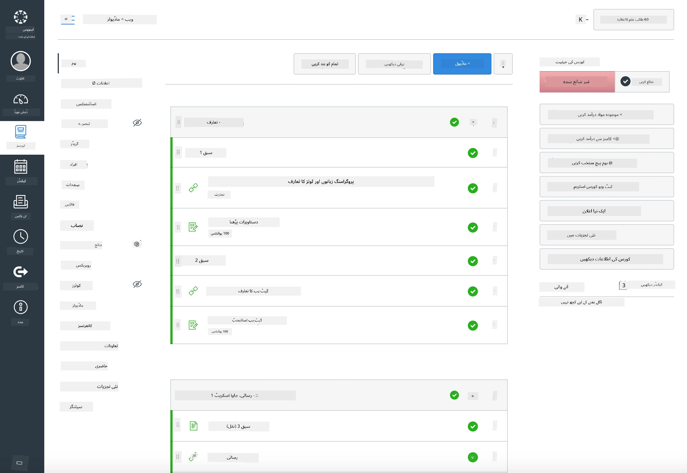

<!--
CO_OP_TRANSLATOR_METADATA:
{
  "original_hash": "71009af209f81cc01a1f2d324200375f",
  "translation_date": "2025-10-03T08:42:38+00:00",
  "source_file": "for-teachers.md",
  "language_code": "ur"
}
-->
### اساتذہ کے لیے

آپ اس نصاب کو اپنی کلاس میں استعمال کرنے کے لیے خوش آمدید ہیں۔ یہ GitHub Classroom اور معروف LMS پلیٹ فارمز کے ساتھ بخوبی کام کرتا ہے، اور اسے آپ اپنے طلباء کے ساتھ ایک علیحدہ ریپو کے طور پر بھی استعمال کر سکتے ہیں۔

### GitHub Classroom کے ساتھ استعمال کریں

ہر گروپ کے لیے اسباق اور اسائنمنٹس کو منظم کرنے کے لیے، ہر سبق کے لیے ایک ریپوزیٹری بنائیں تاکہ GitHub Classroom ہر اسائنمنٹ کو الگ سے منسلک کر سکے۔

- اس ریپو کو اپنی تنظیم میں فورک کریں۔
- ہر سبق کے لیے ایک علیحدہ ریپو بنائیں، ہر سبق کے فولڈر کو اس کی اپنی ریپوزیٹری میں نکال کر۔
  - آپشن A: خالی ریپوز بنائیں (ہر سبق کے لیے ایک) اور سبق کے فولڈر کے مواد کو ہر ایک میں کاپی کریں۔
  - آپشن B: Git کی تاریخ کو محفوظ رکھنے کا طریقہ استعمال کریں (مثلاً، فولڈر کو ایک نئے ریپو میں تقسیم کریں) اگر آپ کو اصل تاریخ کی ضرورت ہو۔
- GitHub Classroom میں، ہر سبق کے لیے ایک اسائنمنٹ بنائیں اور اسے متعلقہ سبق کے ریپو کی طرف اشارہ کریں۔
- تجویز کردہ ترتیبات:
  - ریپوزیٹری کی مرئیت: طلباء کے کام کے لیے نجی۔
  - سبق کے ریپو کی ڈیفالٹ برانچ سے اسٹارٹر کوڈ استعمال کریں۔
  - کوئزز اور سبمیشنز کے لیے ایشو اور پل ریکویسٹ ٹیمپلیٹس شامل کریں۔
  - اگر آپ کے اسباق میں آٹوگریڈنگ اور ٹیسٹ شامل ہیں تو انہیں اختیاری طور پر ترتیب دیں۔
- مددگار کنونشنز:
  - ریپوزیٹری کے نام جیسے lesson-01-intro، lesson-02-html، وغیرہ۔
  - لیبلز: quiz، assignment، needs-review، late، resubmission۔
  - ہر گروپ کے لیے ٹیگز/ریلیزز (مثلاً، v2025-term1)۔

ٹپ: Git تنازعات سے بچنے کے لیے ریپوزیٹریز کو ہم آہنگ فولڈرز (مثلاً، OneDrive/Google Drive) کے اندر ذخیرہ کرنے سے گریز کریں۔

### Moodle، Canvas، یا Blackboard کے ساتھ استعمال کریں

یہ نصاب عام LMS ورک فلو کے لیے درآمدی پیکجز شامل کرتا ہے۔

- Moodle: مکمل کورس کو لوڈ کرنے کے لیے Moodle اپلوڈ فائل [Moodle upload file](../../../../../../../teaching-files/webdev-moodle.mbz) استعمال کریں۔
- Common Cartridge: وسیع LMS مطابقت کے لیے Common Cartridge فائل [Common Cartridge file](../../../../../../../teaching-files/webdev-common-cartridge.imscc) استعمال کریں۔
- نوٹس:
  - Moodle Cloud میں Common Cartridge کی محدود حمایت ہے۔ اوپر دی گئی Moodle فائل کو ترجیح دیں، جسے Canvas میں بھی اپلوڈ کیا جا سکتا ہے۔
  - درآمد کے بعد، ماڈیولز، مقررہ تاریخیں، اور کوئز کی ترتیبات کو اپنے ٹرم شیڈول کے مطابق دیکھیں۔

> Moodle کلاس روم میں نصاب

> Canvas میں نصاب

### ریپو کو براہ راست استعمال کریں (بغیر Classroom کے)

اگر آپ GitHub Classroom استعمال نہیں کرنا چاہتے، تو آپ اس ریپو سے کورس براہ راست چلا سکتے ہیں۔

- ہم وقتی/آن لائن فارمیٹس (Zoom/Teams):
  - مختصر رہنمائی کے ساتھ وارم اپ کریں؛ کوئزز کے لیے بریک آؤٹ رومز استعمال کریں۔
  - کوئزز کے لیے وقت کی ونڈو کا اعلان کریں؛ طلباء جوابات GitHub Issues کے طور پر جمع کرائیں۔
  - مشترکہ اسائنمنٹس کے لیے، طلباء عوامی سبق ریپوز میں کام کریں اور پل ریکویسٹ کھولیں۔
- نجی/غیر ہم وقتی فارمیٹس:
  - طلباء ہر سبق کو اپنی **نجی** ریپوز میں فورک کریں اور آپ کو بطور کولیبارٹر شامل کریں۔
  - وہ آپ کے کلاس روم ریپو یا اپنی نجی فورکس پر ایشوز (کوئزز) اور پل ریکویسٹ (اسائنمنٹس) کے ذریعے جمع کرائیں۔

### بہترین طریقے

- Git/GitHub کی بنیادی باتوں، ایشوز، اور PRs پر ایک تعارفی سبق فراہم کریں۔
- کئی مراحل والے کوئزز/اسائنمنٹس کے لیے ایشوز میں چیک لسٹس استعمال کریں۔
- کلاس روم کے اصول قائم کرنے کے لیے CONTRIBUTING.md اور CODE_OF_CONDUCT.md شامل کریں۔
- رسائی کے نوٹس (alt text، کیپشنز) شامل کریں اور پرنٹ ایبل PDFs پیش کریں۔
- اپنے مواد کو ہر ٹرم کے مطابق ورژن کریں اور سبق کے ریپوز کو شائع کرنے کے بعد منجمد کریں۔

### رائے اور معاونت

ہم چاہتے ہیں کہ یہ نصاب آپ اور آپ کے طلباء کے لیے کارآمد ہو۔ براہ کرم اس ریپوزیٹری میں نئے ایشو کھولیں اگر کوئی بگ، درخواست، یا بہتری ہو، یا Teacher Corner میں ایک بحث شروع کریں۔

---

**ڈسکلیمر**:  
یہ دستاویز AI ترجمہ سروس [Co-op Translator](https://github.com/Azure/co-op-translator) کا استعمال کرتے ہوئے ترجمہ کی گئی ہے۔ ہم درستگی کے لیے کوشش کرتے ہیں، لیکن براہ کرم آگاہ رہیں کہ خودکار ترجمے میں غلطیاں یا غیر درستیاں ہو سکتی ہیں۔ اصل دستاویز کو اس کی اصل زبان میں مستند ذریعہ سمجھا جانا چاہیے۔ اہم معلومات کے لیے، پیشہ ور انسانی ترجمہ کی سفارش کی جاتی ہے۔ اس ترجمے کے استعمال سے پیدا ہونے والی کسی بھی غلط فہمی یا غلط تشریح کے لیے ہم ذمہ دار نہیں ہیں۔