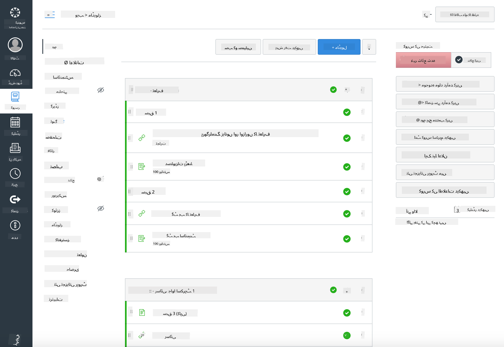

<!--
CO_OP_TRANSLATOR_METADATA:
{
  "original_hash": "75cb51f7ca9ea0b097ef4a1287e9290c",
  "translation_date": "2025-08-25T20:55:40+00:00",
  "source_file": "for-teachers.md",
  "language_code": "ur"
}
-->
## اساتذہ کے لیے

کیا آپ اپنی کلاس میں اس نصاب کو استعمال کرنا چاہتے ہیں؟ بلا جھجک استعمال کریں!

حقیقت میں، آپ اسے خود GitHub میں استعمال کر سکتے ہیں، GitHub Classroom کے ذریعے۔

اس کے لیے، اس ریپو کو فورک کریں۔ آپ کو ہر سبق کے لیے ایک الگ ریپو بنانا ہوگا، اس لیے آپ کو ہر فولڈر کو ایک الگ ریپو میں نکالنا ہوگا۔ اس طرح، [GitHub Classroom](https://classroom.github.com/classrooms) ہر سبق کو الگ سے اٹھا سکتا ہے۔

یہ [مکمل ہدایات](https://github.blog/2020-03-18-set-up-your-digital-classroom-with-github-classroom/) آپ کو کلاس روم سیٹ اپ کرنے کا طریقہ سمجھائیں گی۔

## Moodle، Canvas یا Blackboard میں استعمال کرنا

یہ نصاب ان لرننگ مینجمنٹ سسٹمز میں بہت اچھا کام کرتا ہے! مکمل مواد کے لیے [Moodle اپلوڈ فائل](../../../../../../../teaching-files/webdev-moodle.mbz) استعمال کریں، یا [Common Cartridge فائل](../../../../../../../teaching-files/webdev-common-cartridge.imscc) آزمائیں جس میں کچھ مواد شامل ہے۔ Moodle Cloud مکمل Common Cartridge ایکسپورٹس کو سپورٹ نہیں کرتا، اس لیے Moodle ڈاؤنلوڈ فائل استعمال کرنا بہتر ہے جسے Canvas میں اپلوڈ کیا جا سکتا ہے۔ براہ کرم ہمیں بتائیں کہ ہم اس تجربے کو کیسے بہتر بنا سکتے ہیں۔

> Moodle کلاس روم میں نصاب

> Canvas میں نصاب

## ریپو کو موجودہ حالت میں استعمال کرنا

اگر آپ اس ریپو کو موجودہ حالت میں استعمال کرنا چاہتے ہیں، بغیر GitHub Classroom کے، تو یہ بھی ممکن ہے۔ آپ کو اپنے طلباء کے ساتھ یہ بات چیت کرنی ہوگی کہ کون سا سبق مل کر مکمل کرنا ہے۔

آن لائن فارمیٹ (Zoom، Teams، یا دیگر) میں، آپ کوئز کے لیے بریک آؤٹ رومز بنا سکتے ہیں، اور طلباء کو سیکھنے کے لیے تیار کرنے میں مدد دے سکتے ہیں۔ پھر طلباء کو کوئز میں مدعو کریں اور ان کے جوابات ایک خاص وقت پر 'issues' کے طور پر جمع کروائیں۔ اگر آپ چاہتے ہیں کہ طلباء کھلے عام تعاون کریں، تو آپ اسی طرح اسائنمنٹس کے ساتھ بھی کر سکتے ہیں۔

اگر آپ زیادہ نجی فارمیٹ کو ترجیح دیتے ہیں، تو طلباء سے کہیں کہ وہ نصاب کو سبق بہ سبق اپنے GitHub ریپوز میں فورک کریں، جو کہ پرائیویٹ ریپوز ہوں، اور آپ کو رسائی دیں۔ پھر وہ کوئز اور اسائنمنٹس نجی طور پر مکمل کر سکتے ہیں اور آپ کو اپنے کلاس روم ریپو پر issues کے ذریعے جمع کروا سکتے ہیں۔

آن لائن کلاس روم فارمیٹ میں کام کرنے کے کئی طریقے ہیں۔ براہ کرم ہمیں بتائیں کہ آپ کے لیے کیا بہتر کام کرتا ہے!

## براہ کرم ہمیں اپنی رائے دیں!

ہم چاہتے ہیں کہ یہ نصاب آپ اور آپ کے طلباء کے لیے کام کرے۔ ہم سے [Teacher corner](https://github.com/microsoft/Web-Dev-For-Beginners/discussions/categories/teacher-corner) پر رابطہ کریں اور کسی بھی درخواست، مسائل اور فیڈبیک کے لیے ایک [**نیا issue**](https://github.com/microsoft/Web-Dev-For-Beginners/issues/new/choose) کھولیں۔

**ڈسکلیمر**:  
یہ دستاویز AI ترجمہ سروس [Co-op Translator](https://github.com/Azure/co-op-translator) کا استعمال کرتے ہوئے ترجمہ کی گئی ہے۔ ہم درستگی کے لیے کوشش کرتے ہیں، لیکن براہ کرم آگاہ رہیں کہ خودکار ترجمے میں غلطیاں یا غیر درستیاں ہو سکتی ہیں۔ اصل دستاویز کو اس کی اصل زبان میں مستند ذریعہ سمجھا جانا چاہیے۔ اہم معلومات کے لیے، پیشہ ور انسانی ترجمہ کی سفارش کی جاتی ہے۔ ہم اس ترجمے کے استعمال سے پیدا ہونے والی کسی بھی غلط فہمی یا غلط تشریح کے ذمہ دار نہیں ہیں۔