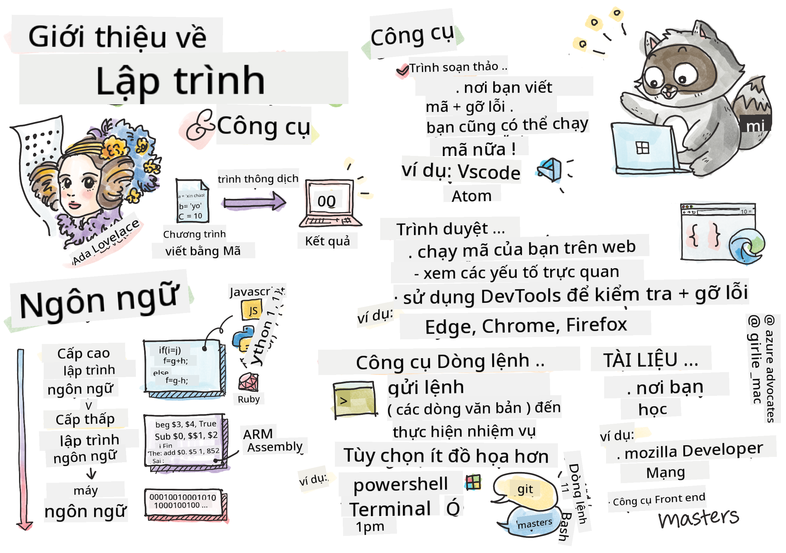

<!--
CO_OP_TRANSLATOR_METADATA:
{
  "original_hash": "c63675cfaf1d223b37bb9fecbfe7c252",
  "translation_date": "2025-08-27T23:13:01+00:00",
  "source_file": "1-getting-started-lessons/1-intro-to-programming-languages/README.md",
  "language_code": "vi"
}
-->
# Giới thiệu về Ngôn ngữ Lập trình và Công cụ Hỗ trợ

Bài học này bao quát những kiến thức cơ bản về ngôn ngữ lập trình. Các chủ đề được đề cập ở đây áp dụng cho hầu hết các ngôn ngữ lập trình hiện đại ngày nay. Trong phần "Công cụ Hỗ trợ", bạn sẽ tìm hiểu về các phần mềm hữu ích giúp bạn trong vai trò một nhà phát triển.

  
> Sketchnote bởi [Tomomi Imura](https://twitter.com/girlie_mac)

## Câu hỏi trước bài giảng  
[Câu hỏi trước bài giảng](https://forms.office.com/r/dru4TE0U9n?origin=lprLink)

## Giới thiệu

Trong bài học này, chúng ta sẽ tìm hiểu:

- Lập trình là gì?  
- Các loại ngôn ngữ lập trình  
- Các thành phần cơ bản của một chương trình  
- Phần mềm và công cụ hữu ích cho nhà phát triển chuyên nghiệp  

> Bạn có thể học bài này trên [Microsoft Learn](https://docs.microsoft.com/learn/modules/web-development-101/introduction-programming/?WT.mc_id=academic-77807-sagibbon)!

## Lập trình là gì?

Lập trình (còn được gọi là viết mã) là quá trình viết các chỉ dẫn cho một thiết bị như máy tính hoặc thiết bị di động. Chúng ta viết các chỉ dẫn này bằng một ngôn ngữ lập trình, sau đó thiết bị sẽ diễn giải chúng. Những tập hợp chỉ dẫn này có thể được gọi bằng nhiều tên khác nhau, nhưng *chương trình*, *chương trình máy tính*, *ứng dụng (app)* và *tệp thực thi* là một vài tên phổ biến.

Một *chương trình* có thể là bất cứ thứ gì được viết bằng mã; các trang web, trò chơi và ứng dụng điện thoại đều là chương trình. Mặc dù có thể tạo ra một chương trình mà không cần viết mã, nhưng logic cơ bản vẫn được thiết bị diễn giải và logic đó rất có thể được viết bằng mã. Một chương trình đang *chạy* hoặc *thực thi* mã là đang thực hiện các chỉ dẫn. Thiết bị mà bạn đang sử dụng để đọc bài học này đang chạy một chương trình để hiển thị nội dung lên màn hình của bạn.

✅ Hãy tìm hiểu một chút: Ai được coi là lập trình viên máy tính đầu tiên trên thế giới?

## Ngôn ngữ Lập trình

Ngôn ngữ lập trình cho phép các nhà phát triển viết chỉ dẫn cho thiết bị. Các thiết bị chỉ có thể hiểu được nhị phân (1 và 0), và đối với *hầu hết* các nhà phát triển, đó không phải là cách giao tiếp hiệu quả. Ngôn ngữ lập trình là phương tiện giao tiếp giữa con người và máy tính.

Ngôn ngữ lập trình có nhiều định dạng khác nhau và có thể phục vụ các mục đích khác nhau. Ví dụ, JavaScript chủ yếu được sử dụng cho các ứng dụng web, trong khi Bash chủ yếu được sử dụng cho hệ điều hành.

*Ngôn ngữ cấp thấp* thường yêu cầu ít bước hơn so với *ngôn ngữ cấp cao* để thiết bị diễn giải chỉ dẫn. Tuy nhiên, điều làm cho ngôn ngữ cấp cao trở nên phổ biến là tính dễ đọc và hỗ trợ của chúng. JavaScript được coi là một ngôn ngữ cấp cao.

Đoạn mã sau minh họa sự khác biệt giữa một ngôn ngữ cấp cao với JavaScript và một ngôn ngữ cấp thấp với mã lắp ráp ARM.

```javascript
let number = 10
let n1 = 0, n2 = 1, nextTerm;

for (let i = 1; i <= number; i++) {
    console.log(n1);
    nextTerm = n1 + n2;
    n1 = n2;
    n2 = nextTerm;
}
```

```c
 area ascen,code,readonly
 entry
 code32
 adr r0,thumb+1
 bx r0
 code16
thumb
 mov r0,#00
 sub r0,r0,#01
 mov r1,#01
 mov r4,#10
 ldr r2,=0x40000000
back add r0,r1
 str r0,[r2]
 add r2,#04
 mov r3,r0
 mov r0,r1
 mov r1,r3
 sub r4,#01
 cmp r4,#00
 bne back
 end
```

Tin hay không thì tùy, *cả hai đều làm cùng một việc*: in ra dãy Fibonacci đến số 10.

✅ Dãy Fibonacci được [định nghĩa](https://en.wikipedia.org/wiki/Fibonacci_number) là một tập hợp các số sao cho mỗi số là tổng của hai số liền trước, bắt đầu từ 0 và 1. 10 số đầu tiên trong dãy Fibonacci là 0, 1, 1, 2, 3, 5, 8, 13, 21 và 34.

## Các thành phần của một Chương trình

Một chỉ dẫn đơn lẻ trong một chương trình được gọi là một *câu lệnh* và thường sẽ có một ký tự hoặc khoảng cách dòng đánh dấu nơi câu lệnh kết thúc, hoặc *kết thúc*. Cách một chương trình kết thúc khác nhau tùy theo từng ngôn ngữ.

Các câu lệnh trong một chương trình có thể dựa vào dữ liệu do người dùng cung cấp hoặc từ nơi khác để thực hiện chỉ dẫn. Dữ liệu có thể thay đổi cách một chương trình hoạt động, vì vậy các ngôn ngữ lập trình đi kèm với cách để tạm thời lưu trữ dữ liệu để có thể sử dụng sau. Đây được gọi là *biến*. Biến là các câu lệnh hướng dẫn thiết bị lưu trữ dữ liệu trong bộ nhớ của nó. Biến trong chương trình tương tự như biến trong đại số, nơi chúng có một tên duy nhất và giá trị của chúng có thể thay đổi theo thời gian.

Có khả năng một số câu lệnh sẽ không được thiết bị thực thi. Điều này thường là do thiết kế của nhà phát triển hoặc do lỗi bất ngờ xảy ra. Loại kiểm soát này giúp ứng dụng trở nên mạnh mẽ và dễ bảo trì hơn. Thông thường, những thay đổi trong kiểm soát xảy ra khi các điều kiện nhất định được đáp ứng. Một câu lệnh phổ biến được sử dụng trong lập trình hiện đại để kiểm soát cách một chương trình chạy là câu lệnh `if..else`.

✅ Bạn sẽ học thêm về loại câu lệnh này trong các bài học tiếp theo.

## Công cụ Hỗ trợ

[](https://youtube.com/watch?v=69WJeXGBdxg "Công cụ Hỗ trợ")

> 🎥 Nhấp vào hình ảnh trên để xem video về công cụ

Trong phần này, bạn sẽ tìm hiểu về một số phần mềm mà bạn có thể thấy rất hữu ích khi bắt đầu hành trình phát triển chuyên nghiệp của mình.

Một **môi trường phát triển** là một tập hợp các công cụ và tính năng độc đáo mà một nhà phát triển thường sử dụng khi viết phần mềm. Một số công cụ này đã được tùy chỉnh cho nhu cầu cụ thể của nhà phát triển và có thể thay đổi theo thời gian nếu nhà phát triển thay đổi ưu tiên trong công việc, dự án cá nhân hoặc khi họ sử dụng một ngôn ngữ lập trình khác. Môi trường phát triển độc đáo như chính các nhà phát triển sử dụng chúng.

### Trình soạn thảo

Một trong những công cụ quan trọng nhất cho phát triển phần mềm là trình soạn thảo. Trình soạn thảo là nơi bạn viết mã và đôi khi là nơi bạn chạy mã.

Các nhà phát triển dựa vào trình soạn thảo vì một vài lý do bổ sung:

- *Gỡ lỗi* giúp phát hiện lỗi và sai sót bằng cách kiểm tra từng dòng mã. Một số trình soạn thảo có khả năng gỡ lỗi; chúng có thể được tùy chỉnh và thêm vào cho các ngôn ngữ lập trình cụ thể.  
- *Tô sáng cú pháp* thêm màu sắc và định dạng văn bản vào mã, giúp dễ đọc hơn. Hầu hết các trình soạn thảo cho phép tùy chỉnh tô sáng cú pháp.  
- *Tiện ích mở rộng và Tích hợp* là các công cụ chuyên biệt dành cho nhà phát triển, được tạo ra bởi các nhà phát triển. Những công cụ này không được tích hợp sẵn trong trình soạn thảo cơ bản. Ví dụ, nhiều nhà phát triển ghi chú mã của họ để giải thích cách nó hoạt động. Họ có thể cài đặt tiện ích kiểm tra chính tả để giúp tìm lỗi chính tả trong tài liệu. Hầu hết các tiện ích mở rộng được thiết kế để sử dụng trong một trình soạn thảo cụ thể, và hầu hết các trình soạn thảo đều có cách để tìm kiếm các tiện ích mở rộng có sẵn.  
- *Tùy chỉnh* cho phép các nhà phát triển tạo ra một môi trường phát triển độc đáo phù hợp với nhu cầu của họ. Hầu hết các trình soạn thảo đều cực kỳ tùy chỉnh và cũng có thể cho phép các nhà phát triển tạo tiện ích mở rộng tùy chỉnh.

#### Các trình soạn thảo phổ biến và Tiện ích mở rộng cho Phát triển Web

- [Visual Studio Code](https://code.visualstudio.com/?WT.mc_id=academic-77807-sagibbon)  
  - [Code Spell Checker](https://marketplace.visualstudio.com/items?itemName=streetsidesoftware.code-spell-checker)  
  - [Live Share](https://marketplace.visualstudio.com/items?itemName=MS-vsliveshare.vsliveshare)  
  - [Prettier - Code formatter](https://marketplace.visualstudio.com/items?itemName=esbenp.prettier-vscode)  
- [Atom](https://atom.io/)  
  - [spell-check](https://atom.io/packages/spell-check)  
  - [teletype](https://atom.io/packages/teletype)  
  - [atom-beautify](https://atom.io/packages/atom-beautify)  
- [Sublimetext](https://www.sublimetext.com/)  
  - [emmet](https://emmet.io/)  
  - [SublimeLinter](http://www.sublimelinter.com/en/stable/)  

### Trình duyệt

Một công cụ quan trọng khác là trình duyệt. Các nhà phát triển web dựa vào trình duyệt để xem cách mã của họ chạy trên web. Trình duyệt cũng được sử dụng để hiển thị các yếu tố trực quan của một trang web được viết trong trình soạn thảo, như HTML.

Nhiều trình duyệt đi kèm với *công cụ dành cho nhà phát triển* (DevTools) chứa một tập hợp các tính năng và thông tin hữu ích để giúp các nhà phát triển thu thập và nắm bắt thông tin quan trọng về ứng dụng của họ. Ví dụ: Nếu một trang web có lỗi, đôi khi rất hữu ích khi biết chúng xảy ra khi nào. DevTools trong trình duyệt có thể được cấu hình để thu thập thông tin này.

#### Các trình duyệt phổ biến và DevTools

- [Edge](https://docs.microsoft.com/microsoft-edge/devtools-guide-chromium/?WT.mc_id=academic-77807-sagibbon)  
- [Chrome](https://developers.google.com/web/tools/chrome-devtools/)  
- [Firefox](https://developer.mozilla.org/docs/Tools)  

### Công cụ Dòng lệnh

Một số nhà phát triển thích một giao diện ít đồ họa hơn cho các tác vụ hàng ngày của họ và dựa vào dòng lệnh để thực hiện điều này. Viết mã yêu cầu một lượng lớn thao tác gõ và một số nhà phát triển thích không làm gián đoạn luồng công việc trên bàn phím. Họ sẽ sử dụng phím tắt để chuyển đổi giữa các cửa sổ trên máy tính, làm việc trên các tệp khác nhau và sử dụng công cụ. Hầu hết các tác vụ có thể được thực hiện bằng chuột, nhưng một lợi ích của việc sử dụng dòng lệnh là rất nhiều việc có thể được thực hiện với các công cụ dòng lệnh mà không cần chuyển đổi giữa chuột và bàn phím. Một lợi ích khác của dòng lệnh là chúng có thể được cấu hình và bạn có thể lưu cấu hình tùy chỉnh, thay đổi nó sau và nhập nó vào các máy phát triển khác. Vì môi trường phát triển rất độc đáo đối với từng nhà phát triển, một số sẽ tránh sử dụng dòng lệnh, một số sẽ dựa hoàn toàn vào nó, và một số thích kết hợp cả hai.

### Các tùy chọn Dòng lệnh phổ biến

Các tùy chọn cho dòng lệnh sẽ khác nhau tùy thuộc vào hệ điều hành bạn sử dụng.

*💻 = được cài đặt sẵn trên hệ điều hành.*

#### Windows

- [Powershell](https://docs.microsoft.com/powershell/scripting/overview?view=powershell-7/?WT.mc_id=academic-77807-sagibbon) 💻  
- [Command Line](https://docs.microsoft.com/windows-server/administration/windows-commands/windows-commands/?WT.mc_id=academic-77807-sagibbon) (còn được gọi là CMD) 💻  
- [Windows Terminal](https://docs.microsoft.com/windows/terminal/?WT.mc_id=academic-77807-sagibbon)  
- [mintty](https://mintty.github.io/)  

#### MacOS

- [Terminal](https://support.apple.com/guide/terminal/open-or-quit-terminal-apd5265185d-f365-44cb-8b09-71a064a42125/mac) 💻  
- [iTerm](https://iterm2.com/)  
- [Powershell](https://docs.microsoft.com/powershell/scripting/install/installing-powershell-core-on-macos?view=powershell-7/?WT.mc_id=academic-77807-sagibbon)  

#### Linux

- [Bash](https://www.gnu.org/software/bash/manual/html_node/index.html) 💻  
- [KDE Konsole](https://docs.kde.org/trunk5/en/konsole/konsole/index.html)  
- [Powershell](https://docs.microsoft.com/powershell/scripting/install/installing-powershell-core-on-linux?view=powershell-7/?WT.mc_id=academic-77807-sagibbon)  

#### Các công cụ Dòng lệnh phổ biến

- [Git](https://git-scm.com/) (💻 trên hầu hết các hệ điều hành)  
- [NPM](https://www.npmjs.com/)  
- [Yarn](https://classic.yarnpkg.com/en/docs/cli/)  

### Tài liệu

Khi một nhà phát triển muốn học điều gì đó mới, họ thường sẽ tìm đến tài liệu để học cách sử dụng nó. Các nhà phát triển thường dựa vào tài liệu để hướng dẫn họ cách sử dụng công cụ và ngôn ngữ đúng cách, và cũng để hiểu sâu hơn về cách nó hoạt động.

#### Tài liệu phổ biến về Phát triển Web

- [Mozilla Developer Network (MDN)](https://developer.mozilla.org/docs/Web), từ Mozilla, nhà xuất bản của trình duyệt [Firefox](https://www.mozilla.org/firefox/)  
- [Frontend Masters](https://frontendmasters.com/learn/)  
- [Web.dev](https://web.dev), từ Google, nhà xuất bản của [Chrome](https://www.google.com/chrome/)  
- [Tài liệu dành cho nhà phát triển của Microsoft](https://docs.microsoft.com/microsoft-edge/#microsoft-edge-for-developers), cho [Microsoft Edge](https://www.microsoft.com/edge)  
- [W3 Schools](https://www.w3schools.com/where_to_start.asp)  

✅ Hãy nghiên cứu: Bây giờ bạn đã biết những điều cơ bản về môi trường của một nhà phát triển web, hãy so sánh và đối chiếu nó với môi trường của một nhà thiết kế web.

---

## 🚀 Thử thách

So sánh một số ngôn ngữ lập trình. Những đặc điểm độc đáo của JavaScript so với Java là gì? Còn COBOL so với Go thì sao?

## Câu hỏi sau bài giảng  
[Câu hỏi sau bài giảng](https://ff-quizzes.netlify.app/web/quiz/2)

## Ôn tập & Tự học

Học thêm về các ngôn ngữ khác nhau mà lập trình viên có thể sử dụng. Hãy thử viết một dòng mã trong một ngôn ngữ, sau đó viết lại nó trong hai ngôn ngữ khác. Bạn đã học được gì?

## Bài tập

[Đọc tài liệu](assignment.md)  

---

**Tuyên bố miễn trừ trách nhiệm**:  
Tài liệu này đã được dịch bằng dịch vụ dịch thuật AI [Co-op Translator](https://github.com/Azure/co-op-translator). Mặc dù chúng tôi cố gắng đảm bảo độ chính xác, xin lưu ý rằng các bản dịch tự động có thể chứa lỗi hoặc không chính xác. Tài liệu gốc bằng ngôn ngữ bản địa nên được coi là nguồn thông tin chính thức. Đối với các thông tin quan trọng, khuyến nghị sử dụng dịch vụ dịch thuật chuyên nghiệp từ con người. Chúng tôi không chịu trách nhiệm cho bất kỳ sự hiểu lầm hoặc diễn giải sai nào phát sinh từ việc sử dụng bản dịch này.