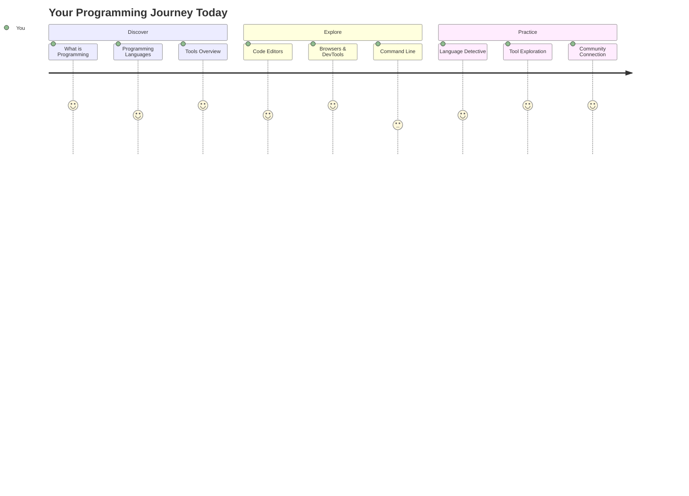
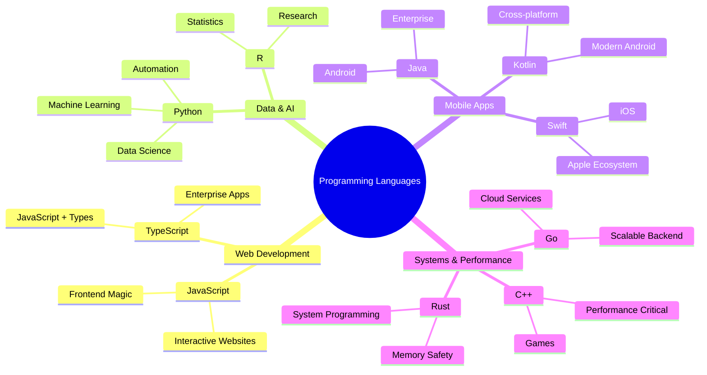
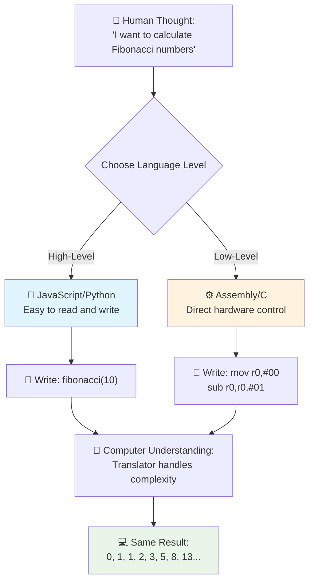
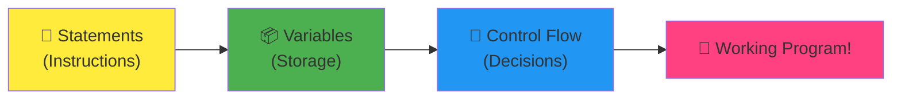
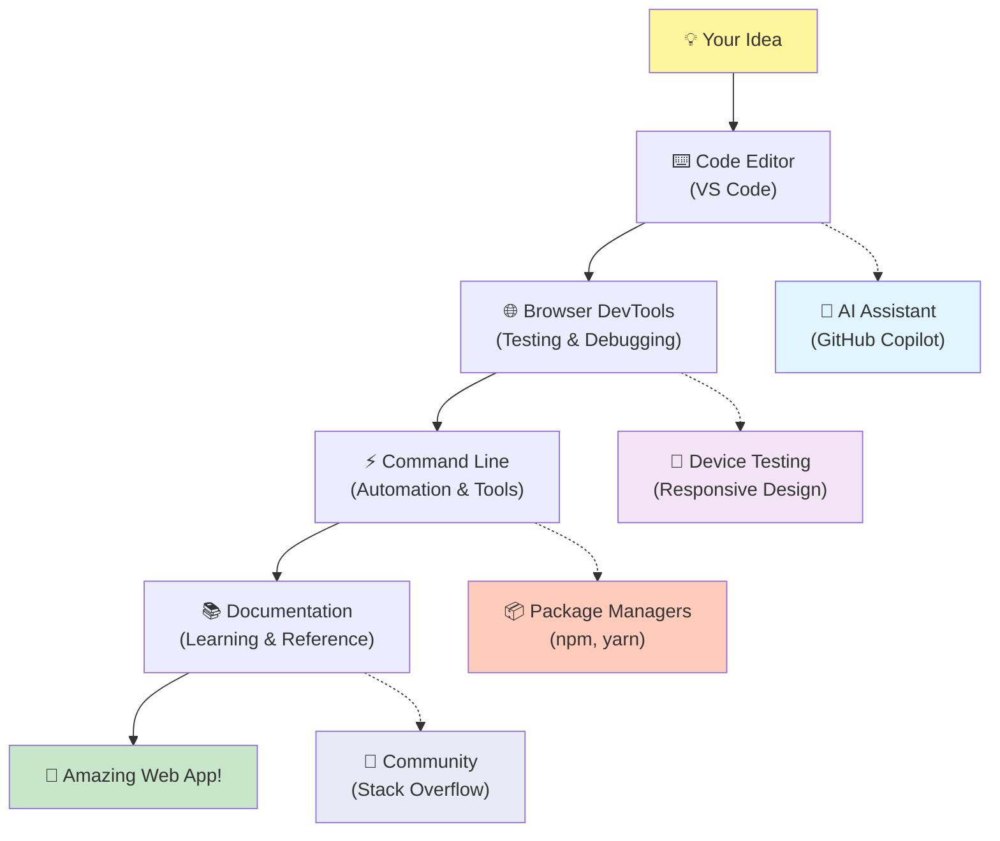
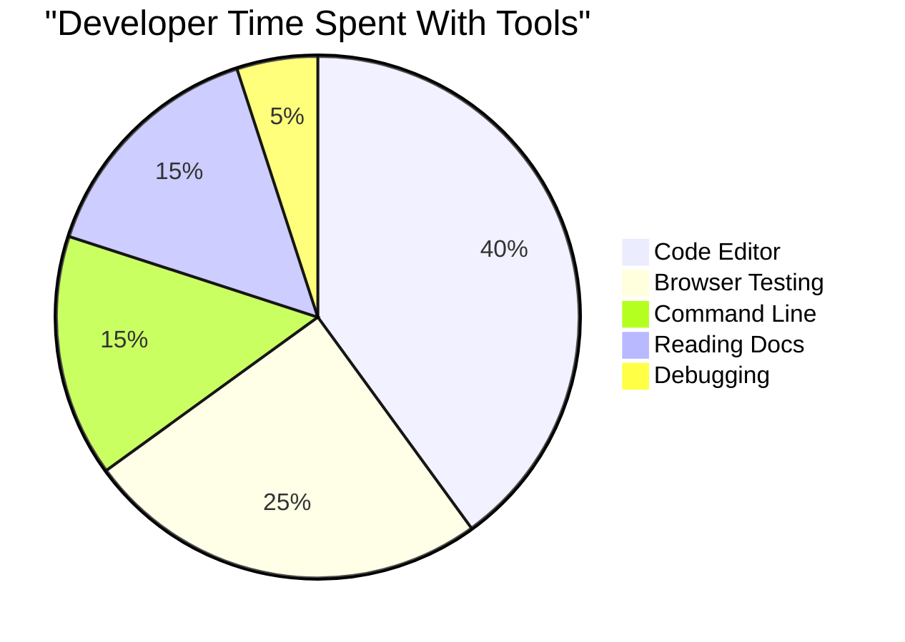
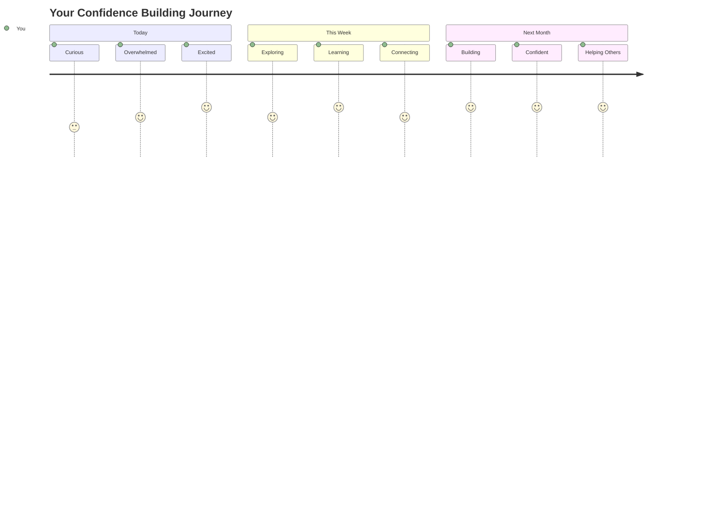

<!--
CO_OP_TRANSLATOR_METADATA:
{
  "original_hash": "d45ddcc54eb9232a76d08328b09d792e",
  "translation_date": "2025-11-06T11:14:44+00:00",
  "source_file": "1-getting-started-lessons/1-intro-to-programming-languages/README.md",
  "language_code": "vi"
}
-->
# Giới thiệu về Ngôn ngữ Lập trình và Công cụ Phát triển Hiện đại

Chào bạn, nhà phát triển tương lai! 👋 Tôi có thể nói với bạn điều gì đó khiến tôi vẫn còn nổi da gà mỗi ngày không? Bạn sắp khám phá ra rằng lập trình không chỉ là về máy tính – mà còn là siêu năng lực thực sự để biến những ý tưởng táo bạo nhất của bạn thành hiện thực!

Bạn có biết cảm giác khi sử dụng ứng dụng yêu thích của mình và mọi thứ hoạt động hoàn hảo? Khi bạn nhấn một nút và điều gì đó kỳ diệu xảy ra khiến bạn phải thốt lên "wow, họ đã LÀM điều đó như thế nào?" Thì đây, ai đó giống như bạn – có lẽ đang ngồi trong quán cà phê yêu thích lúc 2 giờ sáng với ly espresso thứ ba – đã viết mã tạo nên điều kỳ diệu đó. Và điều này sẽ khiến bạn ngạc nhiên: đến cuối bài học này, bạn không chỉ hiểu cách họ làm điều đó, mà bạn còn sẽ háo hức thử làm điều đó!

Nghe này, tôi hoàn toàn hiểu nếu lập trình có vẻ đáng sợ ngay bây giờ. Khi tôi mới bắt đầu, tôi thực sự nghĩ rằng bạn cần phải là một thiên tài toán học hoặc đã lập trình từ khi còn nhỏ. Nhưng đây là điều đã thay đổi hoàn toàn quan điểm của tôi: lập trình giống như học cách giao tiếp bằng một ngôn ngữ mới. Bạn bắt đầu với "xin chào" và "cảm ơn," sau đó tiến tới gọi cà phê, và trước khi bạn nhận ra, bạn đang có những cuộc thảo luận triết học sâu sắc! Ngoại trừ trong trường hợp này, bạn đang trò chuyện với máy tính, và thành thật mà nói? Chúng là những đối tác trò chuyện kiên nhẫn nhất mà bạn từng có – chúng không bao giờ phán xét lỗi của bạn và luôn sẵn sàng thử lại!

Hôm nay, chúng ta sẽ khám phá những công cụ tuyệt vời làm cho phát triển web hiện đại không chỉ khả thi mà còn thực sự gây nghiện. Tôi đang nói về chính những trình soạn thảo, trình duyệt và quy trình làm việc mà các nhà phát triển tại Netflix, Spotify, và studio ứng dụng indie yêu thích của bạn sử dụng mỗi ngày. Và đây là phần sẽ khiến bạn nhảy múa vui vẻ: hầu hết các công cụ chuyên nghiệp, tiêu chuẩn ngành này đều hoàn toàn miễn phí!


> Sketchnote bởi [Tomomi Imura](https://twitter.com/girlie_mac)



## Hãy Xem Bạn Đã Biết Những Gì!

Trước khi chúng ta bắt đầu phần thú vị, tôi tò mò – bạn đã biết gì về thế giới lập trình này? Và nghe này, nếu bạn nhìn vào những câu hỏi này và nghĩ "Tôi thực sự không biết gì về bất kỳ điều này," thì không chỉ là ổn, mà còn hoàn hảo! Điều đó có nghĩa là bạn đang ở đúng nơi. Hãy nghĩ về bài kiểm tra này như việc khởi động trước khi tập luyện – chúng ta chỉ đang làm nóng các cơ não thôi!

[Tham gia bài kiểm tra trước bài học](https://forms.office.com/r/dru4TE0U9n?origin=lprLink)

## Cuộc Phiêu Lưu Chúng Ta Sắp Đi Cùng Nhau

Được rồi, tôi thực sự rất phấn khích về những gì chúng ta sẽ khám phá hôm nay! Thật sự, tôi ước mình có thể thấy khuôn mặt của bạn khi một số khái niệm này trở nên rõ ràng. Đây là hành trình tuyệt vời mà chúng ta sẽ cùng nhau thực hiện:

- **Lập trình thực sự là gì (và tại sao nó là điều tuyệt vời nhất!)** – Chúng ta sẽ khám phá cách mã hóa thực sự là phép thuật vô hình vận hành mọi thứ xung quanh bạn, từ chiếc đồng hồ báo thức biết rằng hôm nay là thứ Hai đến thuật toán chọn lọc hoàn hảo các gợi ý Netflix của bạn
- **Ngôn ngữ lập trình và tính cách tuyệt vời của chúng** – Hãy tưởng tượng bạn bước vào một bữa tiệc nơi mỗi người có siêu năng lực hoàn toàn khác nhau và cách giải quyết vấn đề riêng biệt. Đó là thế giới của ngôn ngữ lập trình, và bạn sẽ thích gặp gỡ chúng!
- **Những khối xây dựng cơ bản tạo nên phép thuật số** – Hãy nghĩ về chúng như bộ LEGO sáng tạo tối thượng. Một khi bạn hiểu cách các mảnh ghép này kết hợp với nhau, bạn sẽ nhận ra rằng bạn có thể xây dựng bất cứ thứ gì mà trí tưởng tượng của bạn mơ ước
- **Công cụ chuyên nghiệp sẽ khiến bạn cảm thấy như vừa được trao cây đũa phép của phù thủy** – Tôi không nói quá đâu – những công cụ này thực sự sẽ khiến bạn cảm thấy như có siêu năng lực, và phần tuyệt vời nhất? Chúng là những công cụ mà các chuyên gia sử dụng!

> 💡 **Điều quan trọng**: Đừng nghĩ đến việc cố gắng ghi nhớ mọi thứ hôm nay! Ngay bây giờ, tôi chỉ muốn bạn cảm nhận được sự phấn khích về những gì có thể. Các chi tiết sẽ tự nhiên gắn bó khi chúng ta thực hành cùng nhau – đó là cách học thực sự diễn ra!

> Bạn có thể tham gia bài học này trên [Microsoft Learn](https://docs.microsoft.com/learn/modules/web-development-101/introduction-programming/?WT.mc_id=academic-77807-sagibbon)!

## Vậy Lập trình Thực sự Là Gì?

Được rồi, hãy giải quyết câu hỏi triệu đô: lập trình thực sự là gì?

Tôi sẽ kể cho bạn một câu chuyện đã hoàn toàn thay đổi cách tôi nghĩ về điều này. Tuần trước, tôi đang cố gắng giải thích cho mẹ tôi cách sử dụng điều khiển từ xa của TV thông minh mới. Tôi đã nói những câu như "Nhấn nút đỏ, nhưng không phải nút đỏ lớn, nút đỏ nhỏ ở bên trái... không, bên trái khác của mẹ... được rồi, giờ giữ nó trong hai giây, không phải một, không phải ba..." Nghe quen không? 😅

Đó chính là lập trình! Đó là nghệ thuật đưa ra các hướng dẫn chi tiết, từng bước cho một thứ rất mạnh mẽ nhưng cần mọi thứ được giải thích hoàn hảo. Ngoại trừ việc thay vì giải thích cho mẹ bạn (người có thể hỏi "nút đỏ nào?!"), bạn đang giải thích cho một máy tính (máy chỉ làm đúng những gì bạn nói, ngay cả khi điều bạn nói không hoàn toàn là điều bạn muốn).

Điều khiến tôi ngạc nhiên khi lần đầu tiên học điều này: máy tính thực sự khá đơn giản ở cốt lõi của chúng. Chúng chỉ hiểu hai điều – 1 và 0, về cơ bản chỉ là "có" và "không" hoặc "bật" và "tắt." Chỉ vậy thôi! Nhưng đây là nơi nó trở nên kỳ diệu – chúng ta không cần phải nói bằng 1 và 0 như trong The Matrix. Đó là nơi **ngôn ngữ lập trình** xuất hiện. Chúng giống như có người phiên dịch tốt nhất thế giới, người chuyển đổi suy nghĩ hoàn toàn bình thường của bạn thành ngôn ngữ máy tính.

Và đây là điều khiến tôi vẫn nổi da gà mỗi sáng khi thức dậy: mọi thứ kỹ thuật số trong cuộc sống của bạn đều bắt đầu với ai đó giống như bạn, có lẽ đang ngồi trong bộ đồ ngủ với một tách cà phê, gõ mã trên máy tính xách tay của họ. Bộ lọc Instagram làm bạn trông hoàn hảo? Ai đó đã mã hóa nó. Gợi ý dẫn bạn đến bài hát yêu thích mới của bạn? Một nhà phát triển đã xây dựng thuật toán đó. Ứng dụng giúp bạn chia hóa đơn bữa tối với bạn bè? Đúng vậy, ai đó đã nghĩ "điều này thật phiền phức, tôi cá là tôi có thể sửa điều này" và sau đó... họ đã làm được!

Khi bạn học lập trình, bạn không chỉ học một kỹ năng mới – bạn đang trở thành một phần của cộng đồng tuyệt vời này gồm những người giải quyết vấn đề, những người dành cả ngày để nghĩ, "Nếu tôi có thể xây dựng thứ gì đó làm cho ngày của ai đó tốt hơn một chút thì sao?" Thành thật mà nói, có điều gì tuyệt vời hơn thế không?

✅ **Săn Tìm Sự Thật Thú Vị**: Đây là điều siêu thú vị để tìm hiểu khi bạn có thời gian rảnh – bạn nghĩ ai là lập trình viên máy tính đầu tiên trên thế giới? Tôi sẽ gợi ý: có thể không phải là người bạn mong đợi! Câu chuyện về người này thực sự hấp dẫn và cho thấy rằng lập trình luôn là về giải quyết vấn đề sáng tạo và suy nghĩ vượt ra ngoài khuôn khổ.

### 🧠 **Thời gian Kiểm tra: Bạn Cảm Thấy Thế Nào?**

**Hãy dành một chút thời gian để suy ngẫm:**
- Ý tưởng "đưa ra hướng dẫn cho máy tính" có làm bạn cảm thấy dễ hiểu hơn không?
- Bạn có thể nghĩ đến một nhiệm vụ hàng ngày mà bạn muốn tự động hóa bằng lập trình không?
- Những câu hỏi nào đang nảy lên trong đầu bạn về toàn bộ chuyện lập trình này?

> **Nhớ nhé**: Hoàn toàn bình thường nếu một số khái niệm vẫn còn mơ hồ ngay bây giờ. Học lập trình giống như học một ngôn ngữ mới – cần thời gian để não bạn xây dựng các đường dẫn thần kinh đó. Bạn đang làm rất tốt!

## Ngôn ngữ Lập trình Giống Như Những Hương Vị Phép Thuật Khác Nhau

Được rồi, điều này nghe có vẻ kỳ lạ, nhưng hãy cùng tôi – ngôn ngữ lập trình rất giống các thể loại âm nhạc khác nhau. Hãy nghĩ về nó: bạn có jazz, mượt mà và ngẫu hứng, rock mạnh mẽ và trực tiếp, cổ điển thanh lịch và có cấu trúc, và hip-hop sáng tạo và biểu cảm. Mỗi phong cách có cảm giác riêng, cộng đồng người hâm mộ đam mê riêng, và mỗi phong cách đều hoàn hảo cho các tâm trạng và dịp khác nhau.

Ngôn ngữ lập trình hoạt động chính xác như vậy! Bạn sẽ không sử dụng cùng một ngôn ngữ để xây dựng một trò chơi di động vui nhộn mà bạn sẽ sử dụng để xử lý lượng lớn dữ liệu khí hậu, giống như bạn sẽ không chơi death metal trong một lớp yoga (chà, hầu hết các lớp yoga thôi! 😄).

Nhưng đây là điều khiến tôi ngạc nhiên mỗi khi nghĩ về nó: những ngôn ngữ này giống như có người phiên dịch kiên nhẫn và thông minh nhất thế giới ngồi ngay bên cạnh bạn. Bạn có thể diễn đạt ý tưởng của mình theo cách cảm thấy tự nhiên với bộ não con người, và họ xử lý tất cả công việc cực kỳ phức tạp để chuyển đổi điều đó thành 1 và 0 mà máy tính thực sự hiểu. Nó giống như có một người bạn hoàn toàn thông thạo cả "sáng tạo của con người" và "logic của máy tính" – và họ không bao giờ mệt mỏi, không bao giờ cần nghỉ uống cà phê, và không bao giờ phán xét bạn vì hỏi cùng một câu hỏi hai lần!

### Các Ngôn ngữ Lập trình Phổ biến và Ứng dụng của Chúng



| Ngôn ngữ | Tốt nhất cho | Tại sao nó phổ biến |
|----------|--------------|---------------------|
| **JavaScript** | Phát triển web, giao diện người dùng | Chạy trong trình duyệt và cung cấp sức mạnh cho các trang web tương tác |
| **Python** | Khoa học dữ liệu, tự động hóa, AI | Dễ đọc và học, thư viện mạnh mẽ |
| **Java** | Ứng dụng doanh nghiệp, ứng dụng Android | Độc lập nền tảng, mạnh mẽ cho hệ thống lớn |
| **C#** | Ứng dụng Windows, phát triển trò chơi | Hỗ trợ mạnh mẽ từ hệ sinh thái Microsoft |
| **Go** | Dịch vụ đám mây, hệ thống backend | Nhanh, đơn giản, được thiết kế cho tính toán hiện đại |

### Ngôn ngữ Cấp Cao vs. Cấp Thấp

Được rồi, đây thực sự là khái niệm đã làm tôi "đau đầu" khi tôi mới bắt đầu học, vì vậy tôi sẽ chia sẻ phép so sánh cuối cùng đã giúp tôi hiểu – và tôi thực sự hy vọng nó cũng giúp bạn!

Hãy tưởng tượng bạn đang đến một quốc gia mà bạn không nói được ngôn ngữ, và bạn rất cần tìm nhà vệ sinh gần nhất (chúng ta đều từng trải qua điều này, đúng không? 😅):

- **Lập trình cấp thấp** giống như học ngôn ngữ địa phương đến mức bạn có thể trò chuyện với bà cụ bán trái cây ở góc phố bằng các tham chiếu văn hóa, tiếng lóng địa phương, và những câu chuyện cười nội bộ mà chỉ người lớn lên ở đó mới hiểu. Rất ấn tượng và cực kỳ hiệu quả... nếu bạn tình cờ thông thạo! Nhưng khá áp lực khi bạn chỉ đang cố tìm nhà vệ sinh.

- **Lập trình cấp cao** giống như có người bạn địa phương tuyệt vời hiểu bạn. Bạn có thể nói "Tôi thực sự cần tìm nhà vệ sinh" bằng tiếng Anh đơn giản, và họ xử lý tất cả việc dịch thuật văn hóa và chỉ đường theo cách hoàn toàn dễ hiểu với bộ não không phải người địa phương của bạn.

Trong thuật ngữ lập trình:
- **Ngôn ngữ cấp thấp** (như Assembly hoặc C) cho phép bạn có các cuộc trò chuyện cực kỳ chi tiết với phần cứng thực tế của máy tính, nhưng bạn cần suy nghĩ như một cỗ máy, điều này... chà, hãy nói rằng đó là một sự thay đổi lớn về tư duy!
- **Ngôn ngữ cấp cao** (như JavaScript, Python, hoặc C#) cho phép bạn suy nghĩ như một con người trong khi chúng xử lý tất cả các ngôn ngữ máy móc phía sau. Thêm vào đó, chúng có những cộng đồng cực kỳ thân thiện đầy những người nhớ cảm giác khi mới bắt đầu và thực sự muốn giúp đỡ!

Bạn đoán xem tôi sẽ gợi ý bạn bắt đầu với loại nào? 😉 Ngôn ngữ cấp cao giống như có bánh xe tập đi mà bạn không bao giờ muốn tháo ra vì chúng làm cho toàn bộ trải nghiệm trở nên thú vị hơn rất nhiều!



### Để Tôi Cho Bạn Thấy Tại Sao Ngôn Ngữ Cấp Cao Thân Thiện Hơn Rất Nhiều

Được rồi, tôi sắp cho bạn thấy điều gì đó hoàn toàn minh họa tại sao tôi yêu thích ngôn ngữ cấp cao, nhưng trước tiên – tôi cần bạn hứa với tôi một điều. Khi bạn thấy ví dụ mã đầu tiên, đừng hoảng sợ! Nó được thiết kế để trông đáng sợ. Đó chính là điểm tôi muốn làm rõ!

Chúng ta sẽ xem cùng một nhiệm vụ được viết bằng hai phong cách hoàn toàn khác nhau. Cả hai đều tạo ra cái gọi là dãy Fibonacci – đó là một mẫu toán học đẹp mắt, trong đó mỗi số là tổng của hai số trước đó: 0, 1, 1, 2, 3, 5, 8, 13... (Sự thật thú vị: bạn sẽ tìm thấy mẫu này ở khắp mọi nơi trong tự nhiên – xoắn hạt hướng dương, mẫu hình quả thông, thậm chí cả cách các thiên hà hình thành!)

Sẵn sàng để thấy sự khác biệt chưa? Đi thôi!

**Ngôn ngữ cấp cao (JavaScript) – Thân thiện với con người:**

```javascript
// Step 1: Basic Fibonacci setup
const fibonacciCount = 10;
let current = 0;
let next = 1;

console.log('Fibonacci sequence:');
```

**Đây là những gì mã này làm:**
- **Khai báo** một hằng số để chỉ định số lượng số Fibonacci chúng ta muốn tạo
- **Khởi tạo** hai biến để theo dõi số hiện tại và số tiếp theo trong dãy
- **Thiết lập** các giá trị bắt đầu (0 và 1) xác định mẫu Fibonacci
- **Hiển thị** một thông báo tiêu đề để xác định đầu ra của chúng ta

```javascript
// Step 2: Generate the sequence with a loop
for (let i = 0; i < fibonacciCount; i++) {
  console.log(`Position ${i + 1}: ${current}`);
  
  // Calculate next number in sequence
  const sum = current + next;
  current = next;
  next = sum;
}
```

**Phân tích những gì xảy ra ở đây:**
- **Lặp lại** qua từng vị trí trong dãy bằng vòng lặp `for`
- **Hiển thị** từng số với vị trí của nó bằng cách định dạng chuỗi mẫu
- **Tính toán** số Fibonacci tiếp theo bằng cách cộng giá trị hiện tại và tiếp theo
- **Cập nhật** các biến theo dõi để chuyển sang lần lặp tiếp theo

```javascript
// Step 3: Modern functional approach
const generateFibonacci = (count) => {
  const sequence = [0, 1];
  
  for (let i = 2; i < count; i++) {
    sequence[i] = sequence[i - 1] + sequence[i - 2];
  }
  
  return sequence;
};

// Usage example
const fibSequence = generateFibonacci(10);
console.log(fibSequence);
```

**Trong đoạn mã trên, chúng ta đã:**
- **Tạo** một hàm có thể tái sử dụng bằng cú pháp hàm mũi tên hiện đại
- **Xây dựng** một mảng để lưu trữ toàn bộ dãy thay vì hiển thị từng số một
- **Sử dụng** chỉ số mảng để tính toán từng số mới từ các giá trị trước đó
- **Trả về** toàn bộ dãy để sử dụng linh hoạt trong các phần khác của chương trình

**Ngôn ngữ cấp thấp (ARM Assembly) – Thân thiện với máy tính:**

```assembly
 area ascen,code,readonly
 entry
 code32
 adr r0,thumb+1
 bx r0
 code16
thumb
 mov r0,#00
 sub r0,r0,#01
 mov r1,#01
 mov r4,#10
 ldr r2,=0x40000000
back add r0,r1
 str r0,[r2]
 add r2,#04
 mov r3,r0
 mov r0,r1
 mov r1,r3
 sub r4,#01
 cmp r4,#00
 bne back
 end
```

Hãy chú ý cách phiên bản JavaScript gần như đọc giống như hướng dẫn bằng tiếng Anh, trong khi phiên bản Assembly sử dụng các lệnh khó hiểu trực tiếp điều khiển bộ xử lý của máy tính. Cả hai đều hoàn thành cùng một nhiệm vụ, nhưng ngôn ngữ cấp cao dễ hiểu, viết và duy trì hơn rất nhiều.

**Những khác biệt chính bạn sẽ nhận thấy:**
- **Độ dễ đọc**: JavaScript sử dụng các tên mô tả như `fibonacciCount` trong khi Assembly sử dụng các nhãn khó hiểu như `r0`, `r1`
- **Bình luận**: Ngôn ngữ lập trình cấp cao khuyến khích việc sử dụng các bình luận giải thích, giúp mã nguồn tự giải thích.
- **Cấu trúc**: Dòng logic của JavaScript phù hợp với cách con người suy nghĩ về vấn đề từng bước một.
- **Bảo trì**: Việc cập nhật phiên bản JavaScript cho các yêu cầu khác nhau rất dễ dàng và rõ ràng.

✅ **Về dãy số Fibonacci**: Mẫu số tuyệt đẹp này (mỗi số bằng tổng của hai số trước đó: 0, 1, 1, 2, 3, 5, 8...) xuất hiện khắp nơi trong tự nhiên! Bạn sẽ thấy nó trong các vòng xoắn của hoa hướng dương, mẫu hình của quả thông, cách vỏ ốc nautilus uốn cong, và thậm chí trong cách các nhánh cây mọc. Thật đáng kinh ngạc khi toán học và lập trình có thể giúp chúng ta hiểu và tái tạo các mẫu mà tự nhiên sử dụng để tạo ra vẻ đẹp!

## Những khối xây dựng tạo nên điều kỳ diệu

Được rồi, bây giờ bạn đã thấy ngôn ngữ lập trình trông như thế nào khi hoạt động, hãy cùng phân tích các thành phần cơ bản tạo nên mọi chương trình từng được viết. Hãy nghĩ về chúng như những nguyên liệu thiết yếu trong công thức nấu ăn yêu thích của bạn – một khi bạn hiểu mỗi thành phần làm gì, bạn sẽ có thể đọc và viết mã trong hầu hết mọi ngôn ngữ!

Điều này giống như học ngữ pháp của lập trình. Nhớ lại hồi đi học, khi bạn học về danh từ, động từ và cách ghép câu lại với nhau? Lập trình có phiên bản ngữ pháp riêng của nó, và thành thật mà nói, nó logic và dễ chịu hơn ngữ pháp tiếng Anh rất nhiều! 😄

### Câu lệnh: Các hướng dẫn từng bước

Hãy bắt đầu với **câu lệnh** – chúng giống như các câu riêng lẻ trong một cuộc trò chuyện với máy tính của bạn. Mỗi câu lệnh nói với máy tính làm một việc cụ thể, giống như đưa ra chỉ dẫn: "Rẽ trái ở đây," "Dừng lại ở đèn đỏ," "Đỗ xe vào chỗ đó."

Điều tôi thích ở câu lệnh là chúng thường rất dễ đọc. Xem thử nhé:

```javascript
// Basic statements that perform single actions
const userName = "Alex";                    
console.log("Hello, world!");              
const sum = 5 + 3;                         
```

**Đây là những gì đoạn mã này làm:**
- **Khai báo** một biến hằng để lưu tên người dùng
- **Hiển thị** một thông báo chào mừng trên bảng điều khiển
- **Tính toán** và lưu kết quả của một phép toán

```javascript
// Statements that interact with web pages
document.title = "My Awesome Website";      
document.body.style.backgroundColor = "lightblue";
```

**Từng bước, đây là những gì đang xảy ra:**
- **Thay đổi** tiêu đề của trang web xuất hiện trên tab trình duyệt
- **Thay đổi** màu nền của toàn bộ phần thân trang

### Biến: Hệ thống bộ nhớ của chương trình

Được rồi, **biến** thực sự là một trong những khái niệm tôi yêu thích nhất để dạy vì chúng rất giống với những thứ bạn đã sử dụng hàng ngày!

Hãy nghĩ về danh bạ điện thoại của bạn. Bạn không nhớ số điện thoại của mọi người – thay vào đó, bạn lưu "Mẹ," "Bạn thân," hoặc "Quán pizza giao hàng đến 2 giờ sáng" và để điện thoại nhớ các số thực tế. Biến hoạt động chính xác như vậy! Chúng giống như những hộp được gắn nhãn nơi chương trình của bạn có thể lưu trữ thông tin và truy xuất sau đó bằng một cái tên thực sự có ý nghĩa.

Điều thú vị là: biến có thể thay đổi khi chương trình của bạn chạy (do đó có tên là "biến" – bạn thấy họ làm gì không?). Giống như bạn có thể cập nhật liên lạc của quán pizza khi tìm được nơi nào đó ngon hơn, các biến có thể được cập nhật khi chương trình của bạn học được thông tin mới hoặc khi tình huống thay đổi!

Hãy để tôi cho bạn thấy điều này đơn giản và đẹp đẽ như thế nào:

```javascript
// Step 1: Creating basic variables
const siteName = "Weather Dashboard";        
let currentWeather = "sunny";               
let temperature = 75;                       
let isRaining = false;                      
```

**Hiểu các khái niệm này:**
- **Lưu trữ** các giá trị không thay đổi trong biến `const` (như tên trang web)
- **Sử dụng** `let` cho các giá trị có thể thay đổi trong suốt chương trình
- **Gán** các kiểu dữ liệu khác nhau: chuỗi (văn bản), số, và boolean (đúng/sai)
- **Chọn** tên mô tả để giải thích mỗi biến chứa gì

```javascript
// Step 2: Working with objects to group related data
const weatherData = {                       
  location: "San Francisco",
  humidity: 65,
  windSpeed: 12
};
```

**Trong đoạn trên, chúng ta đã:**
- **Tạo** một đối tượng để nhóm thông tin thời tiết liên quan lại với nhau
- **Tổ chức** nhiều mẩu dữ liệu dưới một tên biến
- **Sử dụng** cặp khóa-giá trị để gắn nhãn rõ ràng từng mẩu thông tin

```javascript
// Step 3: Using and updating variables
console.log(`${siteName}: Today is ${currentWeather} and ${temperature}°F`);
console.log(`Wind speed: ${weatherData.windSpeed} mph`);

// Updating changeable variables
currentWeather = "cloudy";                  
temperature = 68;                          
```

**Hãy hiểu từng phần:**
- **Hiển thị** thông tin bằng cách sử dụng template literals với cú pháp `${}`
- **Truy cập** thuộc tính của đối tượng bằng cách sử dụng dot notation (`weatherData.windSpeed`)
- **Cập nhật** các biến được khai báo với `let` để phản ánh điều kiện thay đổi
- **Kết hợp** nhiều biến để tạo ra các thông điệp có ý nghĩa

```javascript
// Step 4: Modern destructuring for cleaner code
const { location, humidity } = weatherData; 
console.log(`${location} humidity: ${humidity}%`);
```

**Những gì bạn cần biết:**
- **Trích xuất** các thuộc tính cụ thể từ đối tượng bằng cách sử dụng destructuring assignment
- **Tạo** các biến mới tự động với cùng tên như các khóa của đối tượng
- **Đơn giản hóa** mã bằng cách tránh lặp lại dot notation

### Dòng điều khiển: Dạy chương trình của bạn cách suy nghĩ

Được rồi, đây là nơi lập trình trở nên cực kỳ thú vị! **Dòng điều khiển** về cơ bản là dạy chương trình của bạn cách đưa ra quyết định thông minh, giống như bạn làm mỗi ngày mà không cần suy nghĩ.

Hãy tưởng tượng điều này: sáng nay bạn có thể đã trải qua điều gì đó như "Nếu trời mưa, tôi sẽ mang ô. Nếu trời lạnh, tôi sẽ mặc áo khoác. Nếu tôi trễ giờ, tôi sẽ bỏ qua bữa sáng và mua cà phê trên đường đi." Bộ não của bạn tự nhiên tuân theo logic if-then hàng chục lần mỗi ngày!

Đây là điều làm cho các chương trình cảm thấy thông minh và sống động thay vì chỉ tuân theo một kịch bản nhàm chán, dễ đoán. Chúng thực sự có thể nhìn vào một tình huống, đánh giá những gì đang xảy ra, và phản ứng phù hợp. Nó giống như cho chương trình của bạn một bộ não có thể thích nghi và đưa ra lựa chọn!

Muốn thấy điều này hoạt động đẹp đẽ như thế nào? Để tôi cho bạn xem:

```javascript
// Step 1: Basic conditional logic
const userAge = 17;

if (userAge >= 18) {
  console.log("You can vote!");
} else {
  const yearsToWait = 18 - userAge;
  console.log(`You'll be able to vote in ${yearsToWait} year(s).`);
}
```

**Đây là những gì đoạn mã này làm:**
- **Kiểm tra** xem tuổi của người dùng có đáp ứng yêu cầu bầu cử không
- **Thực thi** các khối mã khác nhau dựa trên kết quả điều kiện
- **Tính toán** và hiển thị thời gian còn lại cho đến khi đủ tuổi bầu cử nếu dưới 18
- **Cung cấp** phản hồi cụ thể, hữu ích cho từng trường hợp

```javascript
// Step 2: Multiple conditions with logical operators
const userAge = 17;
const hasPermission = true;

if (userAge >= 18 && hasPermission) {
  console.log("Access granted: You can enter the venue.");
} else if (userAge >= 16) {
  console.log("You need parent permission to enter.");
} else {
  console.log("Sorry, you must be at least 16 years old.");
}
```

**Phân tích những gì xảy ra ở đây:**
- **Kết hợp** nhiều điều kiện bằng cách sử dụng toán tử `&&` (và)
- **Tạo** một hệ thống phân cấp điều kiện bằng cách sử dụng `else if` cho nhiều trường hợp
- **Xử lý** tất cả các trường hợp có thể với câu lệnh `else` cuối cùng
- **Cung cấp** phản hồi rõ ràng, có thể hành động cho từng tình huống khác nhau

```javascript
// Step 3: Concise conditional with ternary operator
const votingStatus = userAge >= 18 ? "Can vote" : "Cannot vote yet";
console.log(`Status: ${votingStatus}`);
```

**Những gì bạn cần nhớ:**
- **Sử dụng** toán tử ternary (`? :`) cho các điều kiện đơn giản hai tùy chọn
- **Viết** điều kiện trước, theo sau là `?`, sau đó kết quả đúng, sau đó `:`, sau đó kết quả sai
- **Áp dụng** mẫu này khi bạn cần gán giá trị dựa trên điều kiện

```javascript
// Step 4: Handling multiple specific cases
const dayOfWeek = "Tuesday";

switch (dayOfWeek) {
  case "Monday":
  case "Tuesday":
  case "Wednesday":
  case "Thursday":
  case "Friday":
    console.log("It's a weekday - time to work!");
    break;
  case "Saturday":
  case "Sunday":
    console.log("It's the weekend - time to relax!");
    break;
  default:
    console.log("Invalid day of the week");
}
```

**Đoạn mã này thực hiện các điều sau:**
- **So khớp** giá trị biến với nhiều trường hợp cụ thể
- **Nhóm** các trường hợp tương tự lại với nhau (ngày trong tuần so với cuối tuần)
- **Thực thi** khối mã phù hợp khi tìm thấy sự so khớp
- **Bao gồm** một trường hợp `default` để xử lý các giá trị không mong đợi
- **Sử dụng** câu lệnh `break` để ngăn mã tiếp tục đến trường hợp tiếp theo

> 💡 **Ví dụ thực tế**: Hãy nghĩ về dòng điều khiển như có GPS kiên nhẫn nhất thế giới đang chỉ đường cho bạn. Nó có thể nói "Nếu có kẹt xe trên đường Main, hãy đi đường cao tốc. Nếu có công trình xây dựng chặn đường cao tốc, hãy thử đi đường cảnh quan." Các chương trình sử dụng loại logic điều kiện này để phản ứng thông minh với các tình huống khác nhau và luôn mang lại trải nghiệm tốt nhất có thể cho người dùng.

### 🎯 **Kiểm tra khái niệm: Làm chủ các khối xây dựng**

**Hãy xem bạn đang làm thế nào với các nguyên tắc cơ bản:**
- Bạn có thể giải thích sự khác biệt giữa biến và câu lệnh bằng lời của mình không?
- Nghĩ về một tình huống thực tế nơi bạn sẽ sử dụng quyết định if-then (như ví dụ bầu cử của chúng ta)
- Điều gì về logic lập trình khiến bạn ngạc nhiên?

**Tăng cường sự tự tin nhanh chóng:**


✅ **Tiếp theo là gì**: Chúng ta sẽ có một khoảng thời gian tuyệt vời khám phá sâu hơn các khái niệm này khi tiếp tục hành trình tuyệt vời này cùng nhau! Ngay bây giờ, chỉ cần tập trung vào cảm giác phấn khích về tất cả những khả năng tuyệt vời phía trước. Các kỹ năng và kỹ thuật cụ thể sẽ tự nhiên gắn bó khi chúng ta thực hành cùng nhau – tôi hứa điều này sẽ thú vị hơn bạn mong đợi rất nhiều!

## Công cụ hỗ trợ

Được rồi, đây thực sự là nơi tôi cảm thấy phấn khích đến mức không thể kiềm chế được! 🚀 Chúng ta sắp nói về những công cụ tuyệt vời sẽ khiến bạn cảm thấy như vừa được trao chìa khóa của một con tàu vũ trụ kỹ thuật số.

Bạn biết cách một đầu bếp có những con dao hoàn hảo cân bằng, cảm giác như phần mở rộng của bàn tay họ? Hoặc cách một nhạc sĩ có cây đàn guitar dường như hát lên ngay khi họ chạm vào? Chà, các nhà phát triển có phiên bản riêng của những công cụ kỳ diệu này, và đây là điều sẽ khiến bạn kinh ngạc – hầu hết chúng hoàn toàn miễn phí!

Tôi gần như nhảy lên ghế khi nghĩ về việc chia sẻ những điều này với bạn vì chúng đã hoàn toàn cách mạng hóa cách chúng ta xây dựng phần mềm. Chúng ta đang nói về các trợ lý mã hóa được hỗ trợ bởi AI có thể giúp viết mã của bạn (tôi không đùa đâu!), môi trường đám mây nơi bạn có thể xây dựng toàn bộ ứng dụng từ bất kỳ đâu có Wi-Fi, và các công cụ gỡ lỗi tinh vi đến mức giống như có tầm nhìn X-quang cho chương trình của bạn.

Và đây là phần vẫn khiến tôi nổi da gà: đây không phải là "công cụ dành cho người mới bắt đầu" mà bạn sẽ vượt qua. Đây là những công cụ chuyên nghiệp chính xác mà các nhà phát triển tại Google, Netflix, và studio ứng dụng indie mà bạn yêu thích đang sử dụng ngay lúc này. Bạn sẽ cảm thấy như một chuyên gia thực thụ khi sử dụng chúng!



### Trình chỉnh sửa mã và IDE: Người bạn kỹ thuật số mới của bạn

Hãy nói về trình chỉnh sửa mã – chúng thực sự sắp trở thành nơi yêu thích mới của bạn để ghé thăm! Hãy nghĩ về chúng như nơi trú ẩn cá nhân của bạn để viết mã, nơi bạn sẽ dành phần lớn thời gian để tạo và hoàn thiện các sáng tạo kỹ thuật số của mình.

Nhưng đây là điều kỳ diệu về các trình chỉnh sửa hiện đại: chúng không chỉ là các trình soạn thảo văn bản đẹp mắt. Chúng giống như có một người cố vấn mã hóa thông minh nhất, hỗ trợ nhất ngồi cạnh bạn 24/7. Chúng bắt lỗi chính tả của bạn trước khi bạn nhận ra, gợi ý cải tiến khiến bạn trông như thiên tài, giúp bạn hiểu từng phần mã làm gì, và một số thậm chí có thể dự đoán bạn sắp gõ gì và đề nghị hoàn thành suy nghĩ của bạn!

Tôi nhớ lần đầu tiên tôi phát hiện ra tính năng tự động hoàn thành – tôi thực sự cảm thấy như mình đang sống trong tương lai. Bạn bắt đầu gõ một cái gì đó, và trình chỉnh sửa của bạn nói, "Này, bạn có đang nghĩ về hàm này làm chính xác những gì bạn cần không?" Nó giống như có một người đọc suy nghĩ làm bạn đồng hành mã hóa!

**Điều gì làm cho các trình chỉnh sửa này trở nên tuyệt vời?**

Các trình chỉnh sửa mã hiện đại cung cấp một loạt các tính năng ấn tượng được thiết kế để tăng năng suất của bạn:

| Tính năng | Nó làm gì | Tại sao nó hữu ích |
|-----------|-----------|--------------------|
| **Tô màu cú pháp** | Tô màu các phần khác nhau của mã | Giúp mã dễ đọc hơn và phát hiện lỗi |
| **Tự động hoàn thành** | Gợi ý mã khi bạn gõ | Tăng tốc độ viết mã và giảm lỗi chính tả |
| **Công cụ gỡ lỗi** | Giúp bạn tìm và sửa lỗi | Tiết kiệm hàng giờ thời gian khắc phục sự cố |
| **Tiện ích mở rộng** | Thêm các tính năng chuyên biệt | Tùy chỉnh trình chỉnh sửa của bạn cho bất kỳ công nghệ nào |
| **Trợ lý AI** | Gợi ý mã và giải thích | Tăng tốc học tập và năng suất |

> 🎥 **Tài nguyên video**: Muốn thấy các công cụ này hoạt động? Xem [video Công cụ hỗ trợ](https://youtube.com/watch?v=69WJeXGBdxg) để có cái nhìn tổng quan toàn diện.

#### Trình chỉnh sửa được khuyến nghị cho phát triển web

**[Visual Studio Code](https://code.visualstudio.com/?WT.mc_id=academic-77807-sagibbon)** (Miễn phí)
- Phổ biến nhất trong các nhà phát triển web
- Hệ sinh thái tiện ích mở rộng xuất sắc
- Tích hợp terminal và Git
- **Tiện ích mở rộng cần có**:
  - [GitHub Copilot](https://marketplace.visualstudio.com/items?itemName=GitHub.copilot) - Gợi ý mã được hỗ trợ bởi AI
  - [Live Share](https://marketplace.visualstudio.com/items?itemName=MS-vsliveshare.vsliveshare) - Cộng tác thời gian thực
  - [Prettier](https://marketplace.visualstudio.com/items?itemName=esbenp.prettier-vscode) - Định dạng mã tự động
  - [Code Spell Checker](https://marketplace.visualstudio.com/items?itemName=streetsidesoftware.code-spell-checker) - Bắt lỗi chính tả trong mã

**[JetBrains WebStorm](https://www.jetbrains.com/webstorm/)** (Trả phí, miễn phí cho sinh viên)
- Công cụ gỡ lỗi và kiểm tra nâng cao
- Hoàn thành mã thông minh
- Tích hợp kiểm soát phiên bản

**IDE dựa trên đám mây** (Các mức giá khác nhau)
- [GitHub Codespaces](https://github.com/features/codespaces) - VS Code đầy đủ trong trình duyệt của bạn
- [Replit](https://replit.com/) - Tuyệt vời để học và chia sẻ mã
- [StackBlitz](https://stackblitz.com/) - Phát triển web full-stack tức thì

> 💡 **Mẹo bắt đầu**: Bắt đầu với Visual Studio Code – nó miễn phí, được sử dụng rộng rãi trong ngành, và có một cộng đồng lớn tạo ra các hướng dẫn và tiện ích mở rộng hữu ích.

### Trình duyệt web: Phòng thí nghiệm phát triển bí mật của bạn

Được rồi, chuẩn bị để bị hoàn toàn kinh ngạc! Bạn biết cách bạn đã sử dụng trình duyệt để lướt mạng xã hội và xem video? Chà, hóa ra chúng đã giấu một phòng thí nghiệm phát triển bí mật tuyệt vời này suốt thời gian qua, chỉ chờ bạn khám phá! 

Mỗi lần bạn nhấp chuột phải vào một trang web và chọn "Inspect Element," bạn đang mở ra một thế giới ẩn của các công cụ dành cho nhà phát triển mà thực sự mạnh mẽ hơn một số phần mềm đắt tiền mà tôi từng trả hàng trăm đô la để sử dụng. Nó giống như phát hiện ra rằng nhà bếp bình thường của bạn đang che giấu một phòng thí nghiệm của đầu bếp chuyên nghiệp sau một tấm panel bí mật!
Lần đầu tiên có người chỉ cho tôi cách sử dụng DevTools của trình duyệt, tôi đã dành khoảng ba tiếng chỉ để nhấp chuột khắp nơi và thốt lên "CHỜ ĐÃ, NÓ CÓ THỂ LÀM ĐƯỢC CẢ ĐIỀU ĐÓ SAO?!" Bạn có thể chỉnh sửa bất kỳ trang web nào trong thời gian thực, xem chính xác tốc độ tải của mọi thứ, kiểm tra cách trang web của bạn hiển thị trên các thiết bị khác nhau, và thậm chí debug JavaScript như một chuyên gia thực thụ. Thật sự là quá tuyệt vời!

**Đây là lý do tại sao trình duyệt là vũ khí bí mật của bạn:**

Khi bạn tạo một trang web hoặc ứng dụng web, bạn cần xem nó trông như thế nào và hoạt động ra sao trong thế giới thực. Trình duyệt không chỉ hiển thị công việc của bạn mà còn cung cấp phản hồi chi tiết về hiệu suất, khả năng truy cập và các vấn đề tiềm ẩn.

#### Công cụ dành cho nhà phát triển của trình duyệt (DevTools)

Các trình duyệt hiện đại bao gồm các bộ công cụ phát triển toàn diện:

| Loại công cụ | Chức năng | Ví dụ sử dụng |
|--------------|-----------|---------------|
| **Element Inspector** | Xem và chỉnh sửa HTML/CSS trong thời gian thực | Điều chỉnh kiểu dáng để thấy kết quả ngay lập tức |
| **Console** | Xem thông báo lỗi và thử nghiệm JavaScript | Debug vấn đề và thử nghiệm mã |
| **Network Monitor** | Theo dõi cách tài nguyên được tải | Tối ưu hóa hiệu suất và thời gian tải |
| **Accessibility Checker** | Kiểm tra thiết kế toàn diện | Đảm bảo trang web của bạn hoạt động cho mọi người dùng |
| **Device Simulator** | Xem trước trên các kích thước màn hình khác nhau | Kiểm tra thiết kế đáp ứng mà không cần nhiều thiết bị |

#### Trình duyệt được khuyến nghị cho phát triển

- **[Chrome](https://developers.google.com/web/tools/chrome-devtools/)** - DevTools tiêu chuẩn ngành với tài liệu phong phú
- **[Firefox](https://developer.mozilla.org/docs/Tools)** - Công cụ CSS Grid và kiểm tra khả năng truy cập xuất sắc
- **[Edge](https://docs.microsoft.com/microsoft-edge/devtools-guide-chromium/?WT.mc_id=academic-77807-sagibbon)** - Dựa trên Chromium với tài nguyên dành cho nhà phát triển của Microsoft

> ⚠️ **Mẹo kiểm tra quan trọng**: Luôn kiểm tra trang web của bạn trên nhiều trình duyệt! Những gì hoạt động hoàn hảo trên Chrome có thể hiển thị khác trên Safari hoặc Firefox. Các nhà phát triển chuyên nghiệp kiểm tra trên tất cả các trình duyệt chính để đảm bảo trải nghiệm người dùng nhất quán.

### Công cụ dòng lệnh: Cánh cửa dẫn đến siêu năng lực của nhà phát triển

Được rồi, hãy có một khoảnh khắc hoàn toàn trung thực về dòng lệnh, vì tôi muốn bạn nghe điều này từ một người thực sự hiểu. Lần đầu tiên tôi nhìn thấy nó – chỉ là một màn hình đen đáng sợ với văn bản nhấp nháy – tôi thực sự nghĩ, "Không, chắc chắn không! Điều này trông giống như thứ gì đó trong một bộ phim hacker thập niên 1980, và tôi chắc chắn không đủ thông minh để làm điều này!" 😅

Nhưng đây là điều tôi ước ai đó đã nói với tôi lúc đó, và điều tôi đang nói với bạn ngay bây giờ: dòng lệnh không đáng sợ – thực ra nó giống như đang có một cuộc trò chuyện trực tiếp với máy tính của bạn. Hãy nghĩ về nó như sự khác biệt giữa việc đặt đồ ăn qua một ứng dụng sang trọng với hình ảnh và menu (rất tiện lợi) so với việc bước vào nhà hàng yêu thích của bạn, nơi đầu bếp biết chính xác bạn thích gì và có thể làm ra một món hoàn hảo chỉ bằng cách bạn nói "hãy làm tôi ngạc nhiên với một thứ gì đó tuyệt vời."

Dòng lệnh là nơi các nhà phát triển cảm thấy như những phù thủy thực thụ. Bạn gõ vài từ có vẻ như phép thuật (được rồi, chúng chỉ là các lệnh, nhưng chúng cảm giác như phép thuật!), nhấn enter, và BÙM – bạn đã tạo ra toàn bộ cấu trúc dự án, cài đặt các công cụ mạnh mẽ từ khắp nơi trên thế giới, hoặc triển khai ứng dụng của bạn lên internet cho hàng triệu người xem. Một khi bạn nếm thử sức mạnh đó lần đầu tiên, nó thực sự khá gây nghiện!

**Tại sao dòng lệnh sẽ trở thành công cụ yêu thích của bạn:**

Trong khi giao diện đồ họa rất tuyệt vời cho nhiều tác vụ, dòng lệnh vượt trội về tự động hóa, độ chính xác và tốc độ. Nhiều công cụ phát triển hoạt động chủ yếu thông qua giao diện dòng lệnh, và học cách sử dụng chúng hiệu quả có thể cải thiện đáng kể năng suất của bạn.

```bash
# Step 1: Create and navigate to project directory
mkdir my-awesome-website
cd my-awesome-website
```

**Đoạn mã này làm gì:**
- **Tạo** một thư mục mới có tên "my-awesome-website" cho dự án của bạn
- **Chuyển đến** thư mục vừa tạo để bắt đầu làm việc

```bash
# Step 2: Initialize project with package.json
npm init -y

# Install modern development tools
npm install --save-dev vite prettier eslint
npm install --save-dev @eslint/js
```

**Từng bước, đây là những gì đang diễn ra:**
- **Khởi tạo** một dự án Node.js mới với cài đặt mặc định bằng `npm init -y`
- **Cài đặt** Vite như một công cụ build hiện đại cho phát triển nhanh và build sản phẩm
- **Thêm** Prettier để định dạng mã tự động và ESLint để kiểm tra chất lượng mã
- **Sử dụng** cờ `--save-dev` để đánh dấu đây là các phụ thuộc chỉ dành cho phát triển

```bash
# Step 3: Create project structure and files
mkdir src assets
echo '<!DOCTYPE html><html><head><title>My Site</title></head><body><h1>Hello World</h1></body></html>' > index.html

# Start development server
npx vite
```

**Trong đoạn trên, chúng ta đã:**
- **Tổ chức** dự án bằng cách tạo các thư mục riêng biệt cho mã nguồn và tài nguyên
- **Tạo** một tệp HTML cơ bản với cấu trúc tài liệu đúng chuẩn
- **Khởi động** máy chủ phát triển Vite để tải lại trực tiếp và thay thế module nóng

#### Công cụ dòng lệnh thiết yếu cho phát triển web

| Công cụ | Mục đích | Tại sao bạn cần nó |
|---------|----------|---------------------|
| **[Git](https://git-scm.com/)** | Quản lý phiên bản | Theo dõi thay đổi, cộng tác với người khác, sao lưu công việc của bạn |
| **[Node.js & npm](https://nodejs.org/)** | Runtime JavaScript & quản lý gói | Chạy JavaScript ngoài trình duyệt, cài đặt các công cụ phát triển hiện đại |
| **[Vite](https://vitejs.dev/)** | Công cụ build & máy chủ phát triển | Phát triển nhanh với thay thế module nóng |
| **[ESLint](https://eslint.org/)** | Chất lượng mã | Tự động tìm và sửa lỗi trong JavaScript của bạn |
| **[Prettier](https://prettier.io/)** | Định dạng mã | Giữ mã của bạn được định dạng và dễ đọc một cách nhất quán |

#### Tùy chọn theo hệ điều hành

**Windows:**
- **[Windows Terminal](https://docs.microsoft.com/windows/terminal/?WT.mc_id=academic-77807-sagibbon)** - Terminal hiện đại, giàu tính năng
- **[PowerShell](https://docs.microsoft.com/powershell/?WT.mc_id=academic-77807-sagibbon)** 💻 - Môi trường scripting mạnh mẽ
- **[Command Prompt](https://docs.microsoft.com/windows-server/administration/windows-commands/?WT.mc_id=academic-77807-sagibbon)** 💻 - Dòng lệnh truyền thống của Windows

**macOS:**
- **[Terminal](https://support.apple.com/guide/terminal/)** 💻 - Ứng dụng terminal tích hợp sẵn
- **[iTerm2](https://iterm2.com/)** - Terminal nâng cao với các tính năng tiên tiến

**Linux:**
- **[Bash](https://www.gnu.org/software/bash/)** 💻 - Shell tiêu chuẩn của Linux
- **[KDE Konsole](https://docs.kde.org/trunk5/en/konsole/konsole/index.html)** - Trình giả lập terminal tiên tiến

> 💻 = Được cài đặt sẵn trên hệ điều hành

> 🎯 **Lộ trình học tập**: Bắt đầu với các lệnh cơ bản như `cd` (chuyển thư mục), `ls` hoặc `dir` (liệt kê tệp), và `mkdir` (tạo thư mục). Thực hành với các lệnh trong quy trình làm việc hiện đại như `npm install`, `git status`, và `code .` (mở thư mục hiện tại trong VS Code). Khi bạn trở nên thoải mái hơn, bạn sẽ tự nhiên học thêm các lệnh nâng cao và kỹ thuật tự động hóa.

### Tài liệu: Người thầy luôn sẵn sàng của bạn

Được rồi, để tôi chia sẻ một bí mật nhỏ sẽ khiến bạn cảm thấy tốt hơn khi là người mới bắt đầu: ngay cả những nhà phát triển có kinh nghiệm nhất cũng dành một phần lớn thời gian của họ để đọc tài liệu. Và đó không phải vì họ không biết mình đang làm gì – thực ra đó là dấu hiệu của sự khôn ngoan!

Hãy nghĩ về tài liệu như việc bạn có quyền truy cập vào những người thầy kiên nhẫn và hiểu biết nhất thế giới, luôn sẵn sàng 24/7. Gặp khó khăn vào lúc 2 giờ sáng? Tài liệu sẽ ở đó với một cái ôm ảo ấm áp và chính xác câu trả lời bạn cần. Muốn tìm hiểu về một tính năng mới thú vị mà mọi người đang nói đến? Tài liệu sẽ hỗ trợ bạn với các ví dụ từng bước. Đang cố gắng hiểu tại sao một thứ hoạt động theo cách nó hoạt động? Đúng vậy – tài liệu sẵn sàng giải thích theo cách khiến bạn cuối cùng hiểu ra!

Đây là điều đã hoàn toàn thay đổi quan điểm của tôi: thế giới phát triển web di chuyển cực kỳ nhanh, và không ai (ý tôi là hoàn toàn không ai!) ghi nhớ mọi thứ. Tôi đã thấy các nhà phát triển cấp cao với hơn 15 năm kinh nghiệm tra cứu cú pháp cơ bản, và bạn biết không? Điều đó không đáng xấu hổ – đó là thông minh! Không phải về việc có trí nhớ hoàn hảo; mà là biết nơi tìm câu trả lời đáng tin cậy nhanh chóng và hiểu cách áp dụng chúng.

**Đây là nơi phép thuật thực sự xảy ra:**

Các nhà phát triển chuyên nghiệp dành một phần đáng kể thời gian của họ để đọc tài liệu – không phải vì họ không biết mình đang làm gì, mà vì lĩnh vực phát triển web tiến hóa nhanh đến mức việc cập nhật đòi hỏi học tập liên tục. Tài liệu tuyệt vời giúp bạn hiểu không chỉ *cách* sử dụng một thứ, mà còn *tại sao* và *khi nào* nên sử dụng nó.

#### Tài nguyên tài liệu thiết yếu

**[Mozilla Developer Network (MDN)](https://developer.mozilla.org/docs/Web)**
- Tiêu chuẩn vàng cho tài liệu công nghệ web
- Hướng dẫn toàn diện về HTML, CSS và JavaScript
- Bao gồm thông tin tương thích trình duyệt
- Có các ví dụ thực tế và demo tương tác

**[Web.dev](https://web.dev)** (bởi Google)
- Các thực hành tốt nhất về phát triển web hiện đại
- Hướng dẫn tối ưu hóa hiệu suất
- Nguyên tắc thiết kế toàn diện và bao gồm
- Các nghiên cứu điển hình từ các dự án thực tế

**[Microsoft Developer Documentation](https://docs.microsoft.com/microsoft-edge/#microsoft-edge-for-developers)**
- Tài nguyên phát triển trình duyệt Edge
- Hướng dẫn về Progressive Web App
- Thông tin phát triển đa nền tảng

**[Frontend Masters Learning Paths](https://frontendmasters.com/learn/)**
- Chương trình học có cấu trúc
- Các khóa học video từ các chuyên gia trong ngành
- Bài tập mã hóa thực hành

> 📚 **Chiến lược học tập**: Đừng cố gắng ghi nhớ tài liệu – thay vào đó, hãy học cách điều hướng nó một cách hiệu quả. Đánh dấu các tài liệu tham khảo thường dùng và thực hành sử dụng chức năng tìm kiếm để tìm thông tin cụ thể nhanh chóng.

### 🔧 **Kiểm tra sự thành thạo công cụ: Điều gì khiến bạn hứng thú?**

**Hãy dành một chút thời gian để suy nghĩ:**
- Công cụ nào khiến bạn hào hứng muốn thử đầu tiên? (Không có câu trả lời sai!)
- Dòng lệnh vẫn còn cảm giác đáng sợ, hay bạn đã tò mò về nó?
- Bạn có thể tưởng tượng sử dụng DevTools của trình duyệt để khám phá phía sau màn hình của các trang web yêu thích của mình không?



> **Thông tin thú vị**: Hầu hết các nhà phát triển dành khoảng 40% thời gian của họ trong trình soạn thảo mã, nhưng hãy chú ý đến lượng thời gian dành cho việc kiểm tra, học tập và giải quyết vấn đề. Lập trình không chỉ là viết mã – mà còn là tạo ra những trải nghiệm!

✅ **Suy ngẫm**: Đây là một điều thú vị để suy nghĩ – bạn nghĩ các công cụ để xây dựng trang web (phát triển) khác với các công cụ để thiết kế giao diện của chúng (thiết kế) như thế nào? Nó giống như sự khác biệt giữa việc là một kiến trúc sư thiết kế một ngôi nhà đẹp và người thợ xây dựng thực sự ngôi nhà đó. Cả hai đều rất quan trọng, nhưng họ cần những bộ công cụ khác nhau! Kiểu suy nghĩ này sẽ thực sự giúp bạn nhìn thấy bức tranh lớn hơn về cách các trang web được tạo ra.

## Thử thách GitHub Copilot Agent 🚀

Sử dụng chế độ Agent để hoàn thành thử thách sau:

**Mô tả:** Khám phá các tính năng của một trình soạn thảo mã hoặc IDE hiện đại và chứng minh cách nó có thể cải thiện quy trình làm việc của bạn như một nhà phát triển web.

**Yêu cầu:** Chọn một trình soạn thảo mã hoặc IDE (như Visual Studio Code, WebStorm, hoặc một IDE dựa trên đám mây). Liệt kê ba tính năng hoặc tiện ích mở rộng giúp bạn viết, debug, hoặc duy trì mã hiệu quả hơn. Đối với mỗi tính năng, cung cấp một giải thích ngắn gọn về cách nó mang lại lợi ích cho quy trình làm việc của bạn.

---

## 🚀 Thử thách

**Được rồi, thám tử, sẵn sàng cho vụ án đầu tiên của bạn chưa?**

Bây giờ bạn đã có nền tảng tuyệt vời này, tôi có một cuộc phiêu lưu sẽ giúp bạn thấy thế giới lập trình đa dạng và hấp dẫn đến mức nào. Và nghe này – đây không phải là về việc viết mã ngay bây giờ, nên không có áp lực gì cả! Hãy nghĩ về mình như một thám tử ngôn ngữ lập trình trong vụ án thú vị đầu tiên của bạn!

**Nhiệm vụ của bạn, nếu bạn chọn chấp nhận:**
1. **Trở thành nhà thám hiểm ngôn ngữ**: Chọn ba ngôn ngữ lập trình từ ba lĩnh vực hoàn toàn khác nhau – có thể một ngôn ngữ xây dựng trang web, một ngôn ngữ tạo ứng dụng di động, và một ngôn ngữ xử lý dữ liệu cho các nhà khoa học. Tìm ví dụ về cùng một nhiệm vụ đơn giản được viết bằng mỗi ngôn ngữ. Tôi hứa bạn sẽ hoàn toàn ngạc nhiên về cách chúng có thể trông khác nhau trong khi làm cùng một việc!

2. **Khám phá câu chuyện nguồn gốc của chúng**: Điều gì làm cho mỗi ngôn ngữ trở nên đặc biệt? Đây là một sự thật thú vị – mỗi ngôn ngữ lập trình đều được tạo ra vì ai đó nghĩ, "Bạn biết không? Phải có cách tốt hơn để giải quyết vấn đề cụ thể này." Bạn có thể tìm ra những vấn đề đó là gì không? Một số câu chuyện này thực sự rất hấp dẫn!

3. **Gặp gỡ cộng đồng của chúng**: Tìm hiểu cách mỗi cộng đồng ngôn ngữ chào đón và đam mê. Một số có hàng triệu nhà phát triển chia sẻ kiến thức và giúp đỡ lẫn nhau, những cộng đồng khác nhỏ hơn nhưng cực kỳ gắn kết và hỗ trợ. Bạn sẽ thích thấy những tính cách khác nhau mà các cộng đồng này có!

4. **Lắng nghe cảm giác của bạn**: Ngôn ngữ nào cảm thấy dễ tiếp cận nhất với bạn ngay bây giờ? Đừng lo lắng về việc đưa ra lựa chọn "hoàn hảo" – chỉ cần lắng nghe bản năng của bạn! Thực sự không có câu trả lời sai ở đây, và bạn luôn có thể khám phá các ngôn ngữ khác sau này.

**Công việc thám tử bổ sung**: Xem liệu bạn có thể khám phá những trang web hoặc ứng dụng lớn nào được xây dựng bằng mỗi ngôn ngữ. Tôi đảm bảo bạn sẽ ngạc nhiên khi biết điều gì đang vận hành Instagram, Netflix, hoặc trò chơi di động mà bạn không thể ngừng chơi!

> 💡 **Nhớ rằng**: Bạn không cố gắng trở thành chuyên gia trong bất kỳ ngôn ngữ nào hôm nay. Bạn chỉ đang làm quen với khu vực trước khi quyết định nơi bạn muốn đặt chân. Hãy dành thời gian, tận hưởng nó, và để sự tò mò dẫn dắt bạn!

## Hãy ăn mừng những gì bạn đã khám phá!

Trời ơi, hôm nay bạn đã tiếp thu rất nhiều thông tin tuyệt vời! Tôi thực sự háo hức muốn thấy bạn đã học được bao nhiêu từ hành trình tuyệt vời này. Và nhớ rằng – đây không phải là một bài kiểm tra mà bạn cần phải làm mọi thứ hoàn hảo. Đây giống như một lễ kỷ niệm về tất cả những điều thú vị bạn đã học được về thế giới hấp dẫn mà bạn sắp bước vào!

[Tham gia bài kiểm tra sau bài học](https://ff-quizzes.netlify.app/web/)
## Ôn tập & Tự học

**Hãy dành thời gian khám phá và tận hưởng nhé!**

Bạn đã học được rất nhiều hôm nay, và đó là điều đáng tự hào! Bây giờ là phần thú vị – khám phá những chủ đề khiến bạn tò mò. Nhớ rằng, đây không phải là bài tập về nhà – mà là một cuộc phiêu lưu!

**Khám phá sâu hơn những gì khiến bạn hứng thú:**

**Thực hành với các ngôn ngữ lập trình:**
- Truy cập vào các trang web chính thức của 2-3 ngôn ngữ mà bạn thấy thú vị. Mỗi ngôn ngữ đều có cá tính và câu chuyện riêng!
- Thử các nền tảng lập trình trực tuyến như [CodePen](https://codepen.io/), [JSFiddle](https://jsfiddle.net/), hoặc [Replit](https://replit.com/). Đừng ngại thử nghiệm – bạn không thể làm hỏng gì đâu!
- Đọc về cách ngôn ngữ yêu thích của bạn ra đời. Thật sự, một số câu chuyện nguồn gốc rất thú vị và sẽ giúp bạn hiểu tại sao các ngôn ngữ hoạt động như vậy.

**Làm quen với các công cụ mới:**
- Tải xuống Visual Studio Code nếu bạn chưa làm – nó miễn phí và bạn sẽ thích nó!
- Dành vài phút duyệt qua thị trường Extensions. Nó giống như một cửa hàng ứng dụng cho trình chỉnh sửa mã của bạn!
- Mở công cụ Developer Tools của trình duyệt và chỉ cần nhấp xung quanh. Đừng lo lắng về việc hiểu hết – chỉ cần làm quen với những gì có ở đó.

**Tham gia cộng đồng:**
- Theo dõi một số cộng đồng lập trình trên [Dev.to](https://dev.to/), [Stack Overflow](https://stackoverflow.com/), hoặc [GitHub](https://github.com/). Cộng đồng lập trình rất chào đón người mới!
- Xem một số video lập trình dành cho người mới bắt đầu trên YouTube. Có rất nhiều nhà sáng tạo tuyệt vời ngoài kia, những người nhớ cảm giác khi mới bắt đầu.
- Cân nhắc tham gia các buổi gặp mặt địa phương hoặc cộng đồng trực tuyến. Tin tôi đi, các lập trình viên rất thích giúp đỡ người mới!

> 🎯 **Nghe này, đây là điều tôi muốn bạn nhớ**: Không ai mong đợi bạn trở thành một chuyên gia lập trình ngay lập tức! Hiện tại, bạn chỉ đang làm quen với thế giới tuyệt vời mà bạn sắp trở thành một phần của nó. Hãy dành thời gian, tận hưởng hành trình, và nhớ rằng – mọi lập trình viên mà bạn ngưỡng mộ đều từng ngồi đúng vị trí của bạn bây giờ, cảm thấy hào hứng và có thể hơi choáng ngợp. Điều đó hoàn toàn bình thường, và nó có nghĩa là bạn đang đi đúng hướng!


## Bài tập

[Đọc tài liệu](assignment.md)

> 💡 **Một chút gợi ý cho bài tập của bạn**: Tôi rất muốn thấy bạn khám phá một số công cụ mà chúng ta chưa đề cập đến! Bỏ qua các trình chỉnh sửa, trình duyệt, và công cụ dòng lệnh mà chúng ta đã nói – có cả một vũ trụ tuyệt vời của các công cụ phát triển đang chờ được khám phá. Hãy tìm những công cụ được duy trì tích cực và có cộng đồng sôi động, hữu ích (những công cụ này thường có hướng dẫn tốt nhất và những người hỗ trợ nhiệt tình khi bạn gặp khó khăn và cần một bàn tay thân thiện).

---

## 🚀 Lộ trình hành trình lập trình của bạn

### ⚡ **Những việc bạn có thể làm trong 5 phút tới**
- [ ] Đánh dấu trang 2-3 trang web ngôn ngữ lập trình mà bạn thấy thú vị
- [ ] Tải xuống Visual Studio Code nếu bạn chưa làm
- [ ] Mở DevTools của trình duyệt (F12) và nhấp xung quanh bất kỳ trang web nào
- [ ] Tham gia một cộng đồng lập trình (Dev.to, Reddit r/webdev, hoặc Stack Overflow)

### ⏰ **Những việc bạn có thể hoàn thành trong giờ tới**
- [ ] Hoàn thành bài kiểm tra sau bài học và suy ngẫm về câu trả lời của bạn
- [ ] Cài đặt VS Code với tiện ích GitHub Copilot
- [ ] Thử ví dụ "Hello World" trong 2 ngôn ngữ lập trình khác nhau trực tuyến
- [ ] Xem video "Một ngày của lập trình viên" trên YouTube
- [ ] Bắt đầu công việc thám tử ngôn ngữ lập trình của bạn (từ thử thách)

### 📅 **Cuộc phiêu lưu kéo dài một tuần của bạn**
- [ ] Hoàn thành bài tập và khám phá 3 công cụ phát triển mới
- [ ] Theo dõi 5 lập trình viên hoặc tài khoản lập trình trên mạng xã hội
- [ ] Thử xây dựng một thứ nhỏ trên CodePen hoặc Replit (thậm chí chỉ là "Hello, [Tên của bạn]!")
- [ ] Đọc một bài viết blog của lập trình viên về hành trình lập trình của họ
- [ ] Tham gia một buổi gặp mặt trực tuyến hoặc xem một buổi nói chuyện về lập trình
- [ ] Bắt đầu học ngôn ngữ bạn chọn với các hướng dẫn trực tuyến

### 🗓️ **Sự biến đổi kéo dài một tháng của bạn**
- [ ] Xây dựng dự án nhỏ đầu tiên của bạn (thậm chí một trang web đơn giản cũng được tính!)
- [ ] Đóng góp cho một dự án mã nguồn mở (bắt đầu với việc sửa tài liệu)
- [ ] Hướng dẫn ai đó vừa bắt đầu hành trình lập trình của họ
- [ ] Tạo trang web portfolio của bạn dành cho lập trình viên
- [ ] Kết nối với các cộng đồng lập trình viên địa phương hoặc nhóm học tập
- [ ] Bắt đầu lên kế hoạch cho cột mốc học tập tiếp theo của bạn

### 🎯 **Kiểm tra sự phản ánh cuối cùng**

**Trước khi bạn tiếp tục, hãy dành một chút thời gian để ăn mừng:**
- Điều gì về lập trình khiến bạn hào hứng hôm nay?
- Công cụ hoặc khái niệm nào bạn muốn khám phá đầu tiên?
- Bạn cảm thấy thế nào về việc bắt đầu hành trình lập trình này?
- Một câu hỏi bạn muốn hỏi một lập trình viên ngay bây giờ là gì?



> 🌟 **Nhớ nhé**: Mọi chuyên gia đều từng là người mới bắt đầu. Mọi lập trình viên cấp cao đều từng cảm thấy giống hệt như bạn bây giờ – hào hứng, có thể hơi choáng ngợp, và chắc chắn tò mò về những gì có thể. Bạn đang ở trong một cộng đồng tuyệt vời, và hành trình này sẽ rất tuyệt vời. Chào mừng bạn đến với thế giới lập trình tuyệt vời! 🎉

---

**Tuyên bố miễn trừ trách nhiệm**:  
Tài liệu này đã được dịch bằng dịch vụ dịch thuật AI [Co-op Translator](https://github.com/Azure/co-op-translator). Mặc dù chúng tôi cố gắng đảm bảo độ chính xác, xin lưu ý rằng các bản dịch tự động có thể chứa lỗi hoặc không chính xác. Tài liệu gốc bằng ngôn ngữ bản địa nên được coi là nguồn thông tin chính xác nhất. Đối với thông tin quan trọng, chúng tôi khuyến nghị sử dụng dịch vụ dịch thuật chuyên nghiệp từ con người. Chúng tôi không chịu trách nhiệm cho bất kỳ sự hiểu lầm hoặc diễn giải sai nào phát sinh từ việc sử dụng bản dịch này.