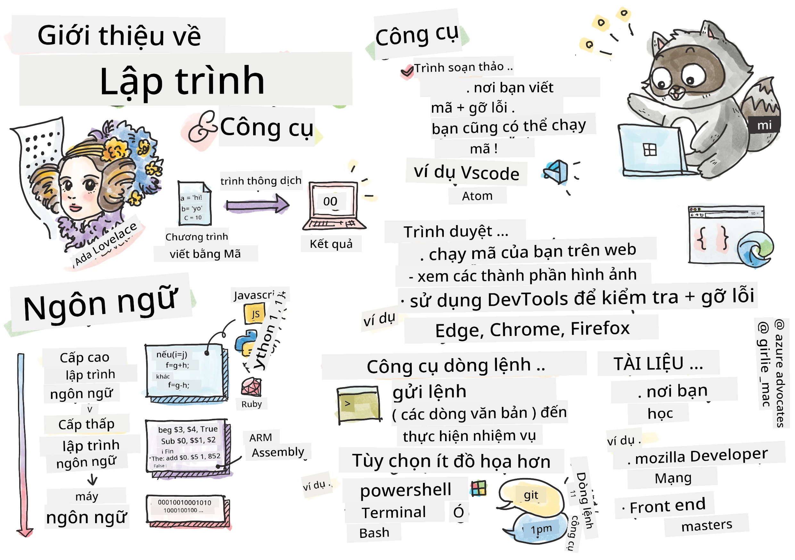
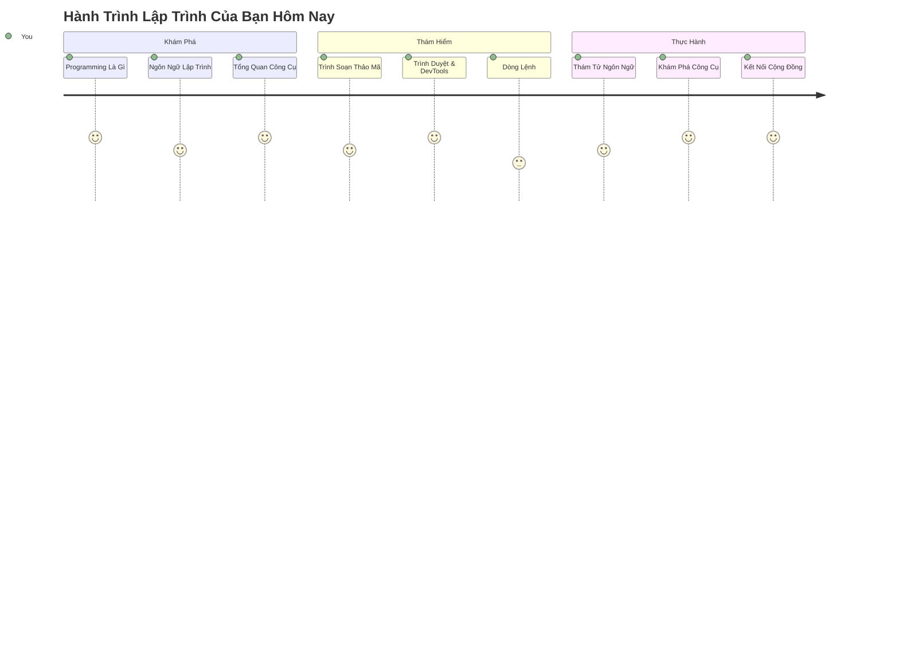
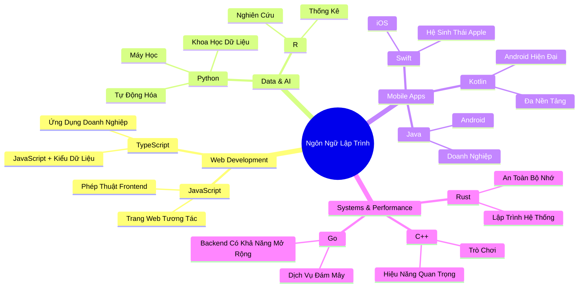
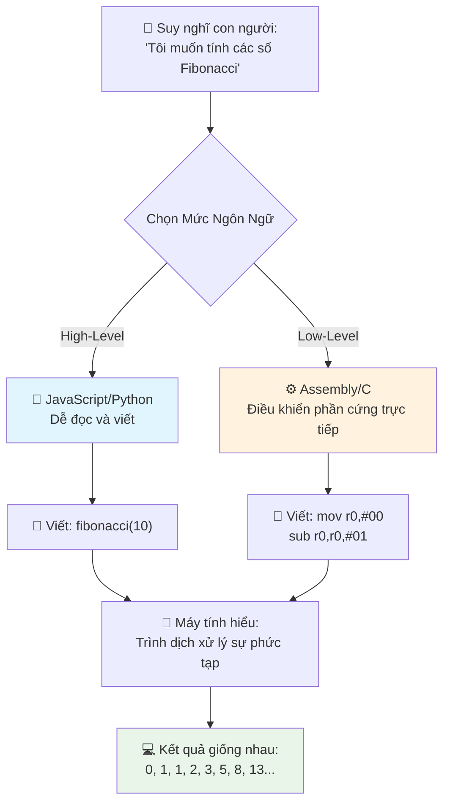
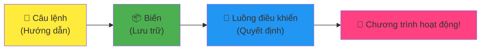
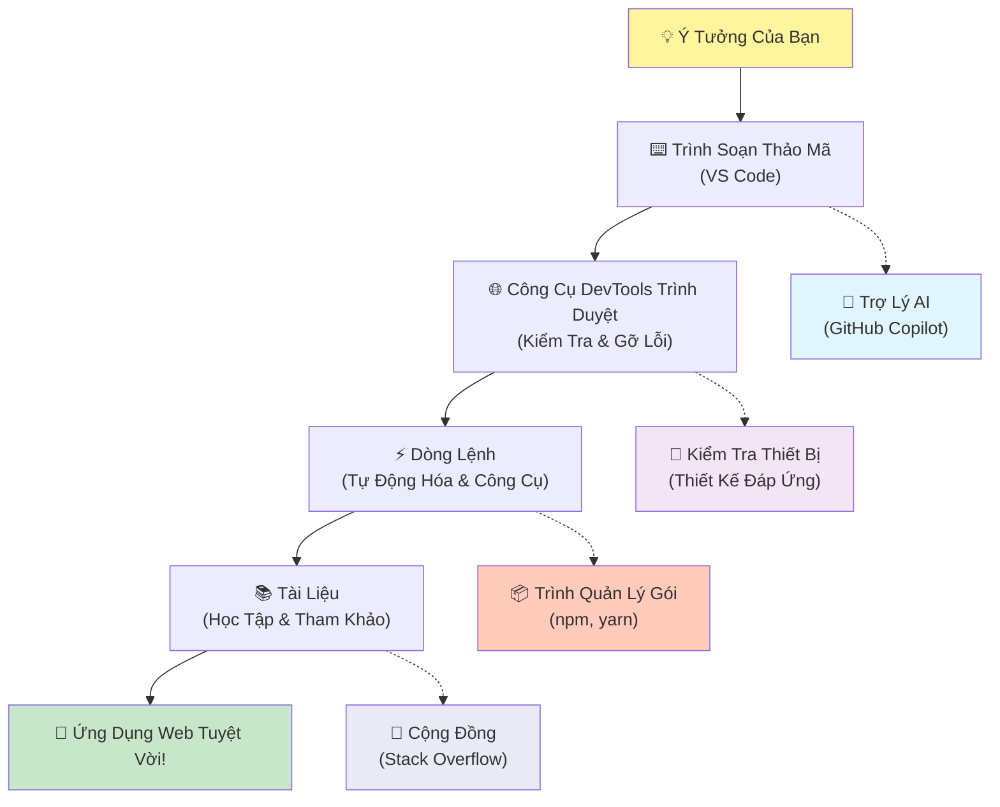
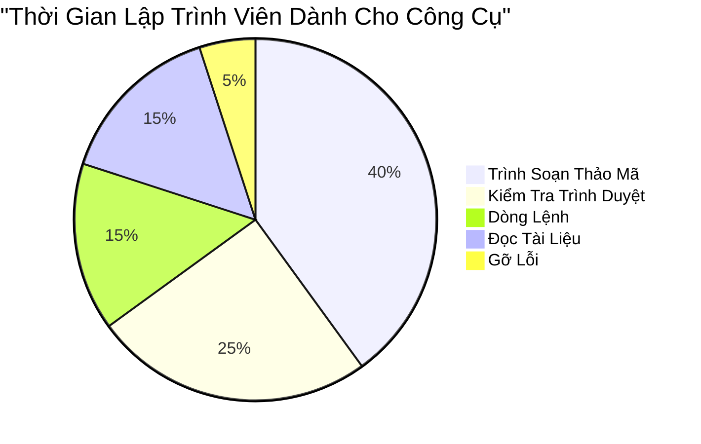
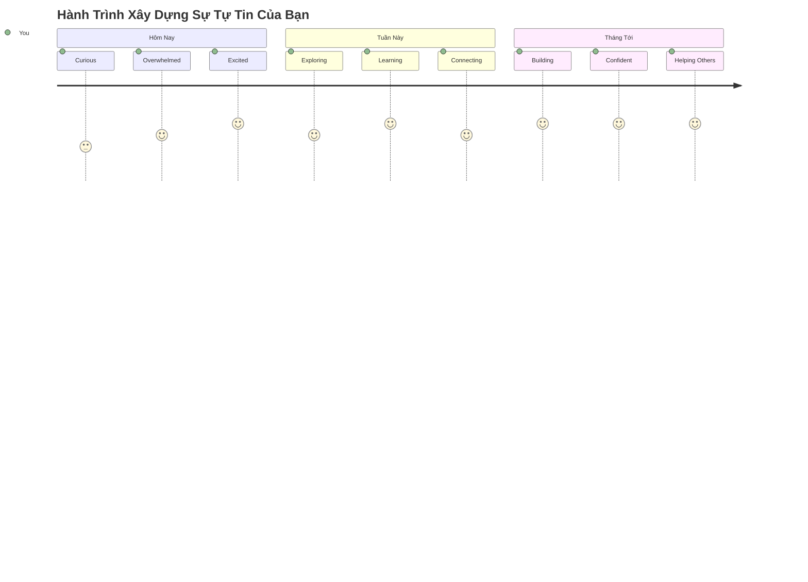

# Giới thiệu về Ngôn Ngữ Lập Trình và Công Cụ Phát Triển Hiện Đại

Chào bạn, nhà phát triển tương lai! 👋 Mình có thể kể cho bạn điều gì đó vẫn khiến mình rùng mình mỗi ngày không? Bạn sắp khám phá ra rằng lập trình không chỉ là về máy tính – mà là về việc có những siêu năng lực thực sự để biến những ý tưởng điên rồ nhất của bạn thành hiện thực!

Bạn biết khoảnh khắc khi bạn sử dụng ứng dụng yêu thích và mọi thứ chỉ vừa khớp hoàn hảo? Khi bạn nhấn một nút và điều gì đó hoàn toàn kỳ diệu xảy ra khiến bạn phải thốt lên "wow, làm sao họ LÀM được điều đó?" Vâng, ai đó giống như bạn – có thể đang ngồi ở quán cà phê yêu thích lúc 2 giờ sáng với cốc espresso thứ ba – đã viết đoạn mã tạo ra phép màu đó. Và đây là điều sẽ làm bạn ngạc nhiên: đến cuối bài học này, bạn không chỉ hiểu cách họ làm mà còn sẽ háo hức muốn thử chính mình!

Nghe này, mình hoàn toàn hiểu nếu lập trình hiện giờ cảm giác đáng sợ. Khi mình mới bắt đầu, mình thật sự nghĩ bạn cần phải là thiên tài toán học hoặc đã lập trình từ khi năm tuổi. Nhưng đây là điều hoàn toàn thay đổi góc nhìn của mình: lập trình chính xác như học cách trò chuyện bằng một ngôn ngữ mới. Bạn bắt đầu với “xin chào” và “cảm ơn,” rồi tiến tới gọi cà phê và trước khi bạn nhận ra, bạn đã có những cuộc thảo luận triết lý sâu sắc! Trừ trường hợp này, bạn đang trò chuyện với máy tính, và thật lòng mà nói? Họ là những đối tác trò chuyện kiên nhẫn nhất bạn từng gặp – họ không bao giờ phán xét lỗi của bạn và luôn háo hức thử lại!

Hôm nay, chúng ta sẽ khám phá những công cụ tuyệt vời làm cho phát triển web hiện đại không chỉ có thể mà còn cực kỳ gây nghiện. Mình đang nói về đúng những trình soạn thảo, trình duyệt và quy trình làm việc mà các nhà phát triển ở Netflix, Spotify và studio ứng dụng indie bạn yêu thích sử dụng mỗi ngày. Và đây là phần khiến bạn muốn nhảy múa vui sướng: hầu hết các công cụ chuẩn chuyên nghiệp, tiêu chuẩn ngành này đều hoàn toàn miễn phí!


> Sketchnote bởi [Tomomi Imura](https://twitter.com/girlie_mac)


```mermaid
journey
    title Hành Trình Lập Trình Của Bạn Hôm Nay
    section Khám Phá
      Programming Là Gì: 5: You
      Ngôn Ngữ Lập Trình: 4: You
      Tổng Quan Công Cụ: 5: You
    section Thám Hiểm
      Trình Soạn Thảo Mã: 4: You
      Trình Duyệt & DevTools: 5: You
      Dòng Lệnh: 3: You
    section Thực Hành
      Thám Tử Ngôn Ngữ: 4: You
      Khám Phá Công Cụ: 5: You
      Kết Nối Cộng Đồng: 5: You
```
## Hãy Xem Bạn Đã Biết Gì Rồi!

Trước khi chúng ta bắt đầu phần thú vị, mình tò mò – bạn đã biết gì về thế giới lập trình này? Và nghe này, nếu bạn đang nhìn những câu hỏi này và nghĩ "mình thực sự chẳng biết gì về chuyện này," thì điều đó không chỉ ổn, mà còn hoàn hảo! Điều đó có nghĩa bạn đang ở đúng nơi rồi đấy. Hãy coi bài kiểm tra này như việc khởi động trước khi tập luyện – chúng ta chỉ đang làm ấm các cơ não thôi!

[Tham gia bài quiz trước bài học](https://ff-quizzes.netlify.app/web/)


## Cuộc Phiêu Lưu Chúng Ta Sắp Cùng Đi

Được rồi, mình thực sự rất phấn khích về những gì chúng ta sẽ khám phá hôm nay! Thật lòng, mình ước có thể thấy mặt bạn khi một số khái niệm này vừa vặn và bạn hiểu ra. Dưới đây là hành trình tuyệt vời chúng ta cùng đi:

- **Lập trình thực sự là gì (và tại sao nó là điều tuyệt vời nhất!)** – Chúng ta sẽ khám phá mã thực sự là phép màu vô hình vận hành mọi thứ xung quanh bạn, từ cái báo thức mà kiểu gì cũng biết là thứ Hai sáng đến thuật toán chọn lọc hoàn hảo khuyến nghị phim trên Netflix
- **Ngôn ngữ lập trình và tính cách tuyệt vời của chúng** – Hãy tưởng tượng bạn bước vào một bữa tiệc mà mỗi người đều có những siêu năng lực và cách giải quyết vấn đề hoàn toàn khác nhau. Đó chính là thế giới ngôn ngữ lập trình, và bạn sẽ thích việc làm quen với chúng!
- **Những khối xây dựng cơ bản tạo nên phép màu kỹ thuật số** – Hãy coi đây như bộ LEGO sáng tạo tối thượng. Khi bạn hiểu cách các mảnh ghép này ghép lại với nhau, bạn sẽ nhận ra bạn có thể xây dựng bất cứ thứ gì trong trí tưởng tượng
- **Những công cụ chuyên nghiệp làm bạn như vừa nhận được cây đũa thần** – Mình không nói quá đâu – những công cụ này thực sự sẽ làm bạn cảm giác như có siêu năng lực, và phần tuyệt nhất? Chúng chính là những công cụ mà dân chuyên nghiệp sử dụng!

> 💡 **Điều bạn cần nhớ**: Đừng cố gắng ghi nhớ mọi thứ ngay hôm nay! Bây giờ, mình chỉ muốn bạn cảm nhận được tia sáng hứng thú về những gì có thể làm được. Chi tiết sẽ tự khắc bám dính khi chúng ta thực hành cùng nhau – đó mới là cách học thật sự!

> Bạn có thể học bài này trên [Microsoft Learn](https://learn.microsoft.com/en-us/learn/modules/web-development-101/introduction-programming/?WT.mc_id=academic-77807-sagibbon)!

## Vậy Chính Xác Lập Trình Là Gì?

Được rồi, cùng giải câu hỏi triệu đô: lập trình thực sự là gì?

Mình sẽ kể bạn nghe một câu chuyện đã hoàn toàn thay đổi cách mình nghĩ về chuyện này. Tuần trước, mình cố giải thích với mẹ cách dùng điều khiển TV thông minh mới. Mình bắt gặp mình nói kiểu như “Nhấn nút đỏ, nhưng không phải nút đỏ lớn, nút đỏ nhỏ bên trái... không, tay trái kia... được rồi, giữ nút trong hai giây, không phải một, cũng không phải ba...” Có quen không? 😅

Đó chính là lập trình! Nghệ thuật đưa ra những hướng dẫn chi tiết, từng bước cho một thứ rất mạnh mẽ nhưng cần mọi thứ được viết ra chính xác. Ngoại trừ thay vì giải thích với mẹ bạn (người có thể hỏi “nút đỏ nào?!”), bạn đang giải thích với máy tính (chỉ làm chính xác những gì bạn nói, dù điều bạn nói không hoàn toàn đúng ý bạn).

Điều làm mình rùng mình khi mới học là: máy tính thực ra khá đơn giản ở cốt lõi. Chúng chỉ hiểu hai thứ – 1 và 0, cơ bản chỉ là “đúng” và “sai” hoặc “bật” và “tắt.” Chỉ vậy thôi! Nhưng đây là phần kỳ diệu – chúng ta không cần nói bằng 1 và 0 như trong Ma Trận. Đó là lúc **ngôn ngữ lập trình** xuất hiện. Chúng giống như có bộ phiên dịch tuyệt vời nhất thế giới chuyển những suy nghĩ bình thường của bạn thành ngôn ngữ máy tính.

Và đây là điều vẫn làm mình rùng mình mỗi sáng thức dậy: thực sự *mọi thứ* kỹ thuật số trong cuộc sống của bạn đều bắt đầu từ một người giống bạn, có thể đang mặc đồ ngủ với một cốc cà phê, gõ mã trên laptop. Bộ lọc Instagram làm bạn trông hoàn hảo? Ai đó đã lập trình nó. Gợi ý dẫn bạn đến bài hát yêu thích mới? Một nhà phát triển xây dựng thuật toán đó. Ứng dụng giúp chia hóa đơn bữa tối với bạn bè? Ừm, ai đó nghĩ “chuyện này phiền phức, tớ có thể sửa được” rồi... họ đã làm!

Khi bạn học lập trình, bạn không đơn giản học một kỹ năng mới – bạn trở thành một phần của cộng đồng tuyệt vời gồm những người giải quyết vấn đề mà ngày ngày suy nghĩ, "Nếu tớ có thể tạo ra điều gì đó làm ngày ai đó tốt hơn một chút thì sao?" Thật sự, còn gì ngầu hơn thế?

✅ **Trò chơi tìm hiểu thú vị**: Đây là điều siêu thú vị để tra cứu khi bạn có thời gian rảnh – bạn nghĩ ai là lập trình viên máy tính đầu tiên trên thế giới? Mình sẽ gợi ý cho bạn: có thể không phải người bạn đang nghĩ đến đâu! Câu chuyện về người này vô cùng hấp dẫn và cho thấy lập trình luôn là về sáng tạo và suy nghĩ khác biệt.

### 🧠 **Thời Gian Kiểm Tra: Bạn Cảm Thấy Thế Nào?**

**Dành chút thời gian suy nghĩ:**
- Ý tưởng “đưa hướng dẫn cho máy tính” đã hiểu nổi chưa?
- Bạn có thể nghĩ ra một công việc hàng ngày nào đó bạn muốn tự động hóa với lập trình không?
- Có câu hỏi nào trong đầu bạn về chuyện lập trình này?

> **Nhớ kỹ**: Bình thường nếu có khái niệm nào vẫn chưa rõ ràng. Học lập trình giống như học một ngôn ngữ mới – não bạn cần thời gian xây dựng các kết nối thần kinh. Bạn đang làm rất tốt rồi!

## Ngôn Ngữ Lập Trình Giống Các Hương Vị Phép Thuật Khác Nhau

Được rồi, điều này nghe có vẻ lạ, nhưng giữ lấy tôi nhé – ngôn ngữ lập trình giống như các loại nhạc khác nhau. Nghĩ về nó: bạn có jazz, mượt mà và ngẫu hứng, rock mạnh mẽ và thẳng thắn, cổ điển thanh lịch và có cấu trúc, và hip-hop sáng tạo và biểu cảm. Mỗi thể loại có phong cách riêng, cộng đồng người hâm mộ cuồng nhiệt riêng, và phù hợp với tâm trạng và dịp khác nhau.

Ngôn ngữ lập trình hoạt động cũng y hệt! Bạn sẽ không dùng cùng một ngôn ngữ để xây dựng trò chơi di động vui nhộn với ngôn ngữ để xử lý lượng dữ liệu khí hậu khổng lồ, cũng như bạn sẽ không chơi death metal trong lớp yoga (dù phần lớn lớp yoga thì không vậy! 😄).

Nhưng điều luôn làm mình kinh ngạc mỗi lần nghĩ đến là: những ngôn ngữ này giống như có phiên dịch viên kiên nhẫn, thông minh nhất thế giới ngồi bên cạnh bạn. Bạn có thể diễn đạt ý tưởng theo cách tự nhiên với bộ não con người, còn chúng đảm nhận phần cực kỳ phức tạp là dịch sang 1 và 0 mà máy tính thực sự hiểu. Giống như có bạn thân thành thạo cả “sáng tạo của con người” và “lý lẽ của máy tính” – và họ không bao giờ mệt mỏi, không cần nghỉ cà phê, không bao giờ chê bạn hỏi lại cùng câu hai lần!

### Các Ngôn Ngữ Lập Trình Phổ Biến và Công Dụng Của Chúng


```mermaid
mindmap
  root((Ngôn Ngữ Lập Trình))
    Web Development
      JavaScript
        Phép Thuật Frontend
        Trang Web Tương Tác
      TypeScript
        JavaScript + Kiểu Dữ Liệu
        Ứng Dụng Doanh Nghiệp
    Data & AI
      Python
        Khoa Học Dữ Liệu
        Máy Học
        Tự Động Hóa
      R
        Thống Kê
        Nghiên Cứu
    Mobile Apps
      Java
        Android
        Doanh Nghiệp
      Swift
        iOS
        Hệ Sinh Thái Apple
      Kotlin
        Android Hiện Đại
        Đa Nền Tảng
    Systems & Performance
      C++
        Trò Chơi
        Hiệu Năng Quan Trọng
      Rust
        An Toàn Bộ Nhớ
        Lập Trình Hệ Thống
      Go
        Dịch Vụ Đám Mây
        Backend Có Khả Năng Mở Rộng
```
| Ngôn ngữ | Dùng tốt nhất cho | Vì sao phổ biến |
|----------|--------------------|-----------------|
| **JavaScript** | Phát triển web, giao diện người dùng | Chạy trên trình duyệt và điều khiển các trang web tương tác |
| **Python** | Khoa học dữ liệu, tự động hóa, AI | Dễ đọc, dễ học, có thư viện mạnh |
| **Java** | Ứng dụng doanh nghiệp, ứng dụng Android | Độc lập nền tảng, bền vững cho hệ thống lớn |
| **C#** | Ứng dụng Windows, phát triển game | Hỗ trợ mạnh từ hệ sinh thái Microsoft |
| **Go** | Dịch vụ đám mây, hệ thống backend | Nhanh, đơn giản, thiết kế cho điện toán hiện đại |

### Ngôn ngữ Cấp Cao vs. Cấp Thấp

Được rồi, thật lòng mà nói đây là khái niệm làm mình “vỡ đầu” khi mới học, nên mình sẽ chia sẻ phép ẩn dụ cuối cùng khiến mình hiểu – và hi vọng nó cũng giúp bạn!

Hãy tưởng tượng bạn đi đến một nước mà bạn không biết ngôn ngữ và rất cần tìm nhà vệ sinh gần nhất (ai cũng từng vậy, đúng không? 😅):

- **Lập trình cấp thấp** giống như học tiếng địa phương đến mức bạn có thể nói chuyện với bà cụ bán hoa quả ở góc phố dùng các tham chiếu văn hóa, tiếng lóng và chuyện nội bộ mà chỉ người bản xứ mới hiểu. Rất ấn tượng và cực kỳ hiệu quả… nếu bạn thành thạo! Nhưng khá rối khi bạn chỉ muốn tìm nhà vệ sinh thôi.

- **Lập trình cấp cao** giống như có người bạn địa phương tuyệt vời hiểu bạn ngay. Bạn chỉ cần nói “Mình thực sự cần tìm nhà vệ sinh” bằng tiếng Anh bình thường, họ lo phần dịch văn hóa và chỉ đường theo cách rất dễ hiểu với bạn.

Nói về lập trình:
- **Ngôn ngữ cấp thấp** (như Assembly hoặc C) cho bạn trò chuyện cực kỳ chi tiết với phần cứng máy tính thật, nhưng bạn phải nghĩ như máy – thì... nói thật là bạn cần chuyển đổi tư duy rất lớn!
- **Ngôn ngữ cấp cao** (như JavaScript, Python, C#) cho phép bạn nghĩ như con người trong khi chúng làm phần ngôn ngữ máy phía sau. Thêm nữa, các cộng đồng của chúng rất thân thiện, toàn những người từng là người mới và thực sự muốn giúp!

Bạn đoán mình sẽ đề nghị bạn bắt đầu với loại nào? 😉 Ngôn ngữ cấp cao như có bánh xe tập đi mà bạn không bao giờ muốn tháo ra vì chúng làm cho toàn bộ trải nghiệm rất thú vị!


```mermaid
flowchart TB
    A["👤 Suy nghĩ con người:<br/>'Tôi muốn tính các số Fibonacci'"] --> B{Chọn Mức Ngôn Ngữ}
    
    B -->|High-Level| C["🌟 JavaScript/Python<br/>Dễ đọc và viết"]
    B -->|Low-Level| D["⚙️ Assembly/C<br/>Điều khiển phần cứng trực tiếp"]
    
    C --> E["📝 Viết: fibonacci(10)"]
    D --> F["📝 Viết: mov r0,#00<br/>sub r0,r0,#01"]
    
    E --> G["🤖 Máy tính hiểu:<br/>Trình dịch xử lý sự phức tạp"]
    F --> G
    
    G --> H["💻 Kết quả giống nhau:<br/>0, 1, 1, 2, 3, 5, 8, 13..."]
    
    style C fill:#e1f5fe
    style D fill:#fff3e0
    style H fill:#e8f5e8
```
### Để Mình Cho Bạn Xem Tại Sao Ngôn Ngữ Cấp Cao Thân Thiện Hơn Nhiều

Được rồi, mình sắp cho bạn xem thứ chứng minh lý do tại sao mình yêu ngôn ngữ cấp cao, nhưng trước hết – mình cần bạn hứa một điều. Khi nhìn thấy ví dụ mã đầu tiên, đừng hoảng! Nó được thiết kế trông hơi “đánh đố” đó. Đó chính là điểm mình muốn nhấn mạnh!

Chúng ta sẽ xem cùng một tác vụ được viết theo hai phong cách hoàn toàn khác nhau. Cả hai tạo ra cái gọi là dãy Fibonacci – một mẫu toán học đẹp tuyệt mà mỗi số là tổng hai số trước: 0, 1, 1, 2, 3, 5, 8, 13... (Điều thú vị: bạn thấy mẫu này xuất hiện khắp nơi trong tự nhiên – xoắn hạt hướng dương, họa tiết quả tùng, thậm chí hình thành của các dải ngân hà!)

Sẵn sàng xem sự khác biệt? Bắt đầu thôi!

**Ngôn ngữ cấp cao (JavaScript) – Thân thiện với con người:**

```javascript
// Bước 1: Thiết lập Fibonacci cơ bản
const fibonacciCount = 10;
let current = 0;
let next = 1;

console.log('Fibonacci sequence:');
```

**Mã này làm gì:**
- **Khai báo** hằng số để chỉ số lượng số Fibonacci muốn tạo ra
- **Khởi tạo** hai biến để theo dõi số hiện tại và số tiếp theo trong chuỗi
- **Cài đặt** giá trị khởi đầu (0 và 1) định nghĩa mẫu Fibonacci
- **Hiển thị** tiêu đề để nhận diện đầu ra

```javascript
// Bước 2: Tạo chuỗi với vòng lặp
for (let i = 0; i < fibonacciCount; i++) {
  console.log(`Position ${i + 1}: ${current}`);
  
  // Tính số tiếp theo trong chuỗi
  const sum = current + next;
  current = next;
  next = sum;
}
```

**Phân tích các bước thực hiện:**
- **Vòng lặp** qua từng vị trí trong chuỗi dùng `for` loop
- **Hiển thị** mỗi số kèm vị trí bằng định dạng template literal
- **Tính toán** số Fibonacci tiếp theo bằng cách cộng số hiện tại và tiếp theo
- **Cập nhật** biến theo dõi để chuyển sang vòng lặp tiếp theo

```javascript
// Bước 3: Phương pháp chức năng hiện đại
const generateFibonacci = (count) => {
  const sequence = [0, 1];
  
  for (let i = 2; i < count; i++) {
    sequence[i] = sequence[i - 1] + sequence[i - 2];
  }
  
  return sequence;
};

// Ví dụ sử dụng
const fibSequence = generateFibonacci(10);
console.log(fibSequence);
```

**Trong đoạn trên, chúng ta đã:**
- **Tạo** một hàm tái sử dụng bằng cú pháp arrow function hiện đại
- **Xây dựng** mảng lưu toàn bộ chuỗi thay vì chỉ hiện từng số một
- **Dùng** chỉ số mảng để tính toán số mới từ giá trị trước đó
- **Trả về** chuỗi toàn bộ để dùng linh hoạt trong phần khác của chương trình

**Ngôn ngữ cấp thấp (ARM Assembly) – Thân thiện với máy:**

```assembly
 area ascen,code,readonly
 entry
 code32
 adr r0,thumb+1
 bx r0
 code16
thumb
 mov r0,#00
 sub r0,r0,#01
 mov r1,#01
 mov r4,#10
 ldr r2,=0x40000000
back add r0,r1
 str r0,[r2]
 add r2,#04
 mov r3,r0
 mov r0,r1
 mov r1,r3
 sub r4,#01
 cmp r4,#00
 bne back
 end
```

Chú ý cách bản JavaScript đọc gần giống câu lệnh tiếng Anh, trong khi bản Assembly dùng các lệnh khó hiểu điều khiển trực tiếp bộ xử lý máy tính. Cả hai đều làm cùng nhiệm vụ, nhưng ngôn ngữ cấp cao dễ hiểu, dễ viết và dễ bảo trì hơn nhiều cho con người.

**Điểm khác biệt chính bạn sẽ nhận thấy:**
- **Đọc hiểu**: JavaScript sử dụng những tên mô tả như `fibonacciCount` trong khi Assembly dùng các nhãn bí ẩn như `r0`, `r1`
- **Chú thích**: Ngôn ngữ cấp cao khuyến khích các chú thích giải thích giúp mã tự tài liệu hóa
- **Cấu trúc**: Luồng logic của JavaScript phù hợp với cách con người suy nghĩ về vấn đề theo từng bước
- **Bảo trì**: Cập nhật phiên bản JavaScript cho các yêu cầu khác nhau rất đơn giản và rõ ràng

✅ **Về dãy Fibonacci**: Mẫu số tuyệt đẹp này (nơi mỗi số bằng tổng của hai số trước nó: 0, 1, 1, 2, 3, 5, 8...) xuất hiện thực sự *mọi nơi* trong thiên nhiên! Bạn sẽ thấy nó trong các vòng xoắn của hoa hướng dương, mô hình quả thông, cách mai của vỏ nautilus cong, và thậm chí trong cách các nhánh cây mọc ra. Thật là kinh ngạc đến mức toán học và mã có thể giúp chúng ta hiểu và tái tạo các mẫu mà thiên nhiên dùng để tạo ra vẻ đẹp!


## Những Khối Tạo Nên Phép Thuật

Được rồi, giờ bạn đã thấy lập trình trông như thế nào trong thực tế, hãy cùng phân tích các mảnh cơ bản tạo nên hầu như mọi chương trình đã từng được viết ra. Hãy coi chúng như những thành phần thiết yếu trong công thức yêu thích của bạn – khi bạn hiểu mỗi thứ làm gì, bạn sẽ có thể đọc và viết mã gần như bất kỳ ngôn ngữ nào!

Điều này giống như học ngữ pháp của lập trình vậy. Nhớ lại khi bạn học ở trường về danh từ, động từ và cách nối câu? Lập trình cũng có phiên bản ngữ pháp riêng, và thật sự thì nó logic và dễ chịu hơn ngữ pháp tiếng Anh rất nhiều! 😄

### Câu lệnh: Hướng dẫn từng bước một

Hãy bắt đầu với **câu lệnh** – chúng giống như những câu đơn trong cuộc trò chuyện với máy tính của bạn. Mỗi câu lệnh bảo máy tính làm một việc cụ thể nào đó, giống như việc đưa chỉ dẫn: "Rẽ trái ở đây," "Dừng lại ở đèn đỏ," "Đỗ xe ở chỗ đó."

Điều tôi thích về câu lệnh là chúng thường rất dễ đọc. Xem này:

```javascript
// Các câu lệnh cơ bản thực hiện các hành động đơn lẻ
const userName = "Alex";                    
console.log("Hello, world!");              
const sum = 5 + 3;                         
```

**Đây là những gì đoạn mã này làm:**
- **Khai báo** một biến hằng để lưu tên người dùng
- **Hiển thị** một thông điệp chào đến bảng điều khiển
- **Tính toán** và lưu kết quả của một phép toán

```javascript
// Các câu lệnh tương tác với trang web
document.title = "My Awesome Website";      
document.body.style.backgroundColor = "lightblue";
```

**Từng bước, những gì đang diễn ra:**
- **Sửa đổi** tiêu đề trang web xuất hiện trên tab trình duyệt
- **Thay đổi** màu nền của toàn bộ thân trang

### Biến: Hệ thống bộ nhớ của chương trình bạn

Được rồi, **biến** thật sự là một trong những khái niệm tôi rất thích dạy vì chúng rất giống những thứ bạn dùng hàng ngày!

Hãy nghĩ đến danh bạ điện thoại của bạn một chút. Bạn không nhớ hết số điện thoại mỗi người – thay vào đó, bạn lưu “Mẹ,” “Bạn thân,” hoặc “Quán Pizza giao hàng đến 2 giờ sáng” rồi để điện thoại nhớ số chính xác. Biến hoạt động y hệt như vậy! Chúng giống như các hộp chứa có nhãn, nơi chương trình bạn có thể lưu trữ thông tin và lấy lại sau bằng một cái tên có ý nghĩa.

Điều thật tuyệt là: biến có thể thay đổi khi chương trình chạy (đó là lý do gọi là “biến” – bạn thấy họ chơi chữ chưa?). Giống như bạn có thể cập nhật danh bạ quán pizza khi tìm ra chỗ ngon hơn, biến có thể được thay đổi trong khi chương trình học điều mới hay khi tình huống thay đổi!

Để tôi chỉ cho bạn cách đơn giản tuyệt đẹp này:

```javascript
// Bước 1: Tạo các biến cơ bản
const siteName = "Weather Dashboard";        
let currentWeather = "sunny";               
let temperature = 75;                       
let isRaining = false;                      
```

**Hiểu những khái niệm này:**
- **Lưu trữ** giá trị không đổi trong biến `const` (như tên trang web)
- **Dùng** `let` cho giá trị có thể thay đổi trong chương trình
- **Gán** các kiểu dữ liệu khác nhau: chuỗi (văn bản), số, và boolean (đúng/sai)
- **Chọn** tên mô tả giải thích nội dung mỗi biến

```javascript
// Bước 2: Làm việc với các đối tượng để nhóm dữ liệu liên quan
const weatherData = {                       
  location: "San Francisco",
  humidity: 65,
  windSpeed: 12
};
```

**Trong ví dụ trên, ta:**
- **Tạo** một đối tượng nhóm các thông tin thời tiết liên quan lại với nhau
- **Sắp xếp** nhiều mảnh dữ liệu dưới một tên biến duy nhất
- **Dùng** cặp khóa-giá trị để gắn nhãn từng mảng dữ liệu rõ ràng

```javascript
// Bước 3: Sử dụng và cập nhật biến
console.log(`${siteName}: Today is ${currentWeather} and ${temperature}°F`);
console.log(`Wind speed: ${weatherData.windSpeed} mph`);

// Cập nhật các biến có thể thay đổi
currentWeather = "cloudy";                  
temperature = 68;                          
```

**Hiểu từng phần:**
- **Hiển thị** thông tin bằng cách dùng template literals với cú pháp `${}`
- **Truy cập** thuộc tính đối tượng dùng dấu chấm (`weatherData.windSpeed`)
- **Cập nhật** biến khai báo bằng `let` để phản ánh điều kiện thay đổi
- **Kết hợp** nhiều biến để tạo ra thông điệp ý nghĩa

```javascript
// Bước 4: Phá cấu trúc hiện đại để mã sạch hơn
const { location, humidity } = weatherData; 
console.log(`${location} humidity: ${humidity}%`);
```

**Bạn cần biết:**
- **Trích xuất** thuộc tính cụ thể từ đối tượng bằng destructuring assignment
- **Tạo** biến mới tự động cùng tên với khóa trong đối tượng
- **Đơn giản hóa** code bằng cách tránh phải gọi dấu chấm nhiều lần

### Luồng điều khiển: Dạy chương trình của bạn biết suy nghĩ

Được rồi, đây là lúc lập trình thực sự tuyệt vời! **Luồng điều khiển** cơ bản là dạy chương trình làm thế nào để ra quyết định thông minh, giống hệt như bạn làm mỗi ngày mà không cần suy nghĩ.

Hãy tưởng tượng sáng nay bạn có thể đã trải qua câu kiểu "Nếu trời mưa, tôi sẽ mang ô. Nếu lạnh, tôi sẽ mặc áo khoác. Nếu tôi trễ, tôi sẽ bỏ bữa sáng và mua cà phê trên đường đi." Bộ não bạn tự nhiên tuân theo logic if-then hàng chục lần mỗi ngày!

Đây là lý do khiến chương trình cảm thấy thông minh và sống động thay vì chỉ theo kịch bản khô khan, dễ đoán. Chúng có thể xem xét tình huống, đánh giá điều đang xảy ra và đáp ứng thích đáng. Giống như bạn trao cho chương trình một bộ não có thể thích nghi và lựa chọn!

Muốn xem cách điều này hoạt động tuyệt đẹp? Để tôi chỉ cho bạn:

```javascript
// Bước 1: Logic điều kiện cơ bản
const userAge = 17;

if (userAge >= 18) {
  console.log("You can vote!");
} else {
  const yearsToWait = 18 - userAge;
  console.log(`You'll be able to vote in ${yearsToWait} year(s).`);
}
```

**Đây là những gì đoạn mã làm:**
- **Kiểm tra** xem tuổi người dùng có đủ điều kiện bỏ phiếu không
- **Thực thi** các khối mã khác nhau dựa trên kết quả điều kiện
- **Tính toán** và hiển thị thời gian còn lại đến khi đủ tuổi bỏ phiếu nếu chưa đủ 18
- **Cung cấp** phản hồi cụ thể và hữu ích cho từng trường hợp

```javascript
// Bước 2: Nhiều điều kiện với toán tử logic
const userAge = 17;
const hasPermission = true;

if (userAge >= 18 && hasPermission) {
  console.log("Access granted: You can enter the venue.");
} else if (userAge >= 16) {
  console.log("You need parent permission to enter.");
} else {
  console.log("Sorry, you must be at least 16 years old.");
}
```

**Phân tích những gì diễn ra:**
- **Kết hợp** nhiều điều kiện dùng toán tử `&&` (và)
- **Tạo** hệ thống các điều kiện lồng nhau bằng `else if` cho nhiều trường hợp
- **Xử lý** tất cả các trường hợp với câu lệnh `else` cuối cùng
- **Cung cấp** phản hồi rõ ràng và có thể hành động cho từng tình huống khác biệt

```javascript
// Bước 3: Điều kiện gọn với toán tử ba ngôi
const votingStatus = userAge >= 18 ? "Can vote" : "Cannot vote yet";
console.log(`Status: ${votingStatus}`);
```

**Bạn cần nhớ:**
- **Dùng** toán tử ba ngôi (`? :`) cho điều kiện hai lựa chọn đơn giản
- **Viết** điều kiện trước, theo sau là `?`, sau đó kết quả đúng, rồi `:`, rồi kết quả sai
- **Áp dụng** mẫu này khi cần gán giá trị dựa trên điều kiện

```javascript
// Bước 4: Xử lý nhiều trường hợp cụ thể
const dayOfWeek = "Tuesday";

switch (dayOfWeek) {
  case "Monday":
  case "Tuesday":
  case "Wednesday":
  case "Thursday":
  case "Friday":
    console.log("It's a weekday - time to work!");
    break;
  case "Saturday":
  case "Sunday":
    console.log("It's the weekend - time to relax!");
    break;
  default:
    console.log("Invalid day of the week");
}
```

**Đoạn mã này thực hiện:**
- **So khớp** giá trị biến với nhiều trường hợp cụ thể
- **Nhóm** các trường hợp tương tự với nhau (ngày trong tuần và cuối tuần)
- **Chạy** khối mã thích hợp khi tìm thấy trường hợp phù hợp
- **Bao gồm** trường hợp `default` xử lý các giá trị không dự kiến
- **Dùng** câu lệnh `break` để ngăn mã chạy tiếp sang trường hợp tiếp theo

> 💡 **So sánh thực tế**: Hãy nghĩ luồng điều khiển như GPS kiên nhẫn nhất thế giới chỉ bạn đường. Nó có thể nói "Nếu bị tắc đường trên Main Street, hãy đi xa lộ thay thế. Nếu đường xa lộ đang sửa, thử đi đường cảnh đẹp." Chương trình dùng chính loại logic có điều kiện này để đáp ứng thông minh với các tình huống khác nhau và luôn mang đến trải nghiệm tốt nhất cho người dùng.

### 🎯 **Kiểm tra Khái Niệm: Làm chủ các Khối Tạo Nên**

**Hãy xem bạn đang làm thế nào với các kiến thức cơ bản:**
- Bạn có thể giải thích sự khác biệt giữa biến và câu lệnh bằng lời của bạn không?
- Nghĩ đến một tình huống thực tế bạn sẽ dùng quyết định if-then (như ví dụ bỏ phiếu của chúng ta)
- Có điều gì về logic lập trình khiến bạn ngạc nhiên?

**Tăng cường sự tự tin:**

```mermaid
flowchart LR
    A["📝 Câu lệnh<br/>(Hướng dẫn)"] --> B["📦 Biến<br/>(Lưu trữ)"] --> C["🔀 Luồng điều khiển<br/>(Quyết định)"] --> D["🎉 Chương trình hoạt động!"]
    
    style A fill:#ffeb3b
    style B fill:#4caf50
    style C fill:#2196f3
    style D fill:#ff4081
```
✅ **Điều sắp tới**: Chúng ta sẽ có những trải nghiệm tuyệt vời khi đi sâu hơn vào các khái niệm này trong hành trình phi thường này! Ngay bây giờ, hãy chỉ tập trung cảm nhận sự phấn khích về tất cả khả năng tuyệt diệu đang chờ bạn. Kỹ năng và kỹ thuật cụ thể sẽ tự nhiên gắn bó khi chúng ta luyện tập cùng nhau – tôi hứa đây sẽ vui hơn rất nhiều so với bạn tưởng!

## Công Cụ Phù Thủy

Được rồi, thực lòng mà nói đây là lúc tôi phấn khích đến mức gần như không thể kiềm chế! 🚀 Chúng ta sắp nói về những công cụ tuyệt vời sẽ khiến bạn cảm giác như vừa được trao chìa khóa vào con tàu vũ trụ số.

Bạn biết đầu bếp có những con dao cân bằng hoàn hảo, cảm giác như phần mở rộng của bàn tay họ? Hay nhạc sĩ có cây đàn guitar mà cứ chạm đến là hát vang? Ừ, các nhà phát triển cũng có phiên bản công cụ huyền diệu riêng, và đây là điều sẽ làm bạn kinh ngạc – phần lớn trong số đó hoàn toàn miễn phí!

Tôi cứ như nhảy cẫng lên khi nghĩ đến việc chia sẻ điều này với bạn vì chúng đã hoàn toàn cách mạng hóa cách ta xây dựng phần mềm. Chúng ta đang nói đến các trợ lý lập trình chạy bằng AI có thể giúp bạn viết code (tôi không đùa đâu!), môi trường đám mây nơi bạn có thể xây dựng ứng dụng hoàn chỉnh từ bất kỳ đâu có Wi-Fi, và công cụ gỡ lỗi tinh vi đến nỗi như có thể nhìn xuyên thấu chương trình.

Và phần làm tôi còn rùng mình: đây không phải là "công cụ người mới" mà bạn sẽ nhanh chóng bỏ. Đây là chính xác công cụ chuyên nghiệp mà lập trình viên tại Google, Netflix, và studio app indie mà bạn yêu thích đang dùng chính lúc này. Bạn sẽ cảm thấy như một chuyên gia thực sự khi dùng chúng!


```mermaid
graph TD
    A["💡 Ý Tưởng Của Bạn"] --> B["⌨️ Trình Soạn Thảo Mã<br/>(VS Code)"] 
    B --> C["🌐 Công Cụ DevTools Trình Duyệt<br/>(Kiểm Tra & Gỡ Lỗi)"]
    C --> D["⚡ Dòng Lệnh<br/>(Tự Động Hóa & Công Cụ)"]
    D --> E["📚 Tài Liệu<br/>(Học Tập & Tham Khảo)"]
    E --> F["🚀 Ứng Dụng Web Tuyệt Vời!"]
    
    B -.-> G["🤖 Trợ Lý AI<br/>(GitHub Copilot)"]
    C -.-> H["📱 Kiểm Tra Thiết Bị<br/>(Thiết Kế Đáp Ứng)"]
    D -.-> I["📦 Trình Quản Lý Gói<br/>(npm, yarn)"]
    E -.-> J["👥 Cộng Đồng<br/>(Stack Overflow)"]
    
    style A fill:#fff59d
    style F fill:#c8e6c9
    style G fill:#e1f5fe
    style H fill:#f3e5f5
    style I fill:#ffccbc
    style J fill:#e8eaf6
```
### Trình soạn thảo mã nguồn và IDE: Những người bạn kỹ thuật số mới của bạn

Hãy nói về trình soạn thảo mã – chúng thực sự sẽ trở thành nơi bạn yêu thích để dành thời gian! Hãy coi chúng như thánh đường lập trình cá nhân, nơi bạn dành phần lớn thời gian để tạo và hoàn thiện các tác phẩm kỹ thuật số của mình.

Nhưng điều kỳ diệu tuyệt đối về các trình soạn thảo hiện đại: chúng không chỉ đơn thuần là trình soạn text phức tạp. Chúng giống như có một người thầy lập trình xuất sắc và nhiệt tình ngồi cạnh bạn suốt 24/7. Chúng bắt lỗi chính tả trước khi bạn nhận ra, đề xuất cải tiến làm bạn trông như thiên tài, giúp bạn hiểu rõ từng phần code, và một số thậm chí có thể dự đoán bạn sắp gõ gì rồi đề nghị hoàn thành suy nghĩ của bạn!

Tôi nhớ lần đầu biết đến tự động hoàn thành – tôi cảm giác như đang sống trong tương lai. Bạn bắt đầu gõ thứ gì đó, trình soạn thảo nói: "Này, bạn có đang nghĩ đến hàm này làm đúng cái bạn cần không?" Giống như có được một người đọc tâm trí làm bạn đồng hành lập trình!

**Điều gì làm các trình soạn thảo này tuyệt vời?**

Các trình soạn thảo mã hiện đại cung cấp loạt tính năng ấn tượng để tăng năng suất của bạn:

| Tính Năng | Công Dụng | Lý Do Hữu Ích |
|---------|--------------|--------------|
| **Đánh dấu cú pháp** | Tô màu các phần khác nhau trong mã | Giúp mã dễ đọc và phát hiện lỗi |
| **Tự động hoàn thành** | Gợi ý mã khi bạn gõ | Tăng tốc độ lập trình và giảm lỗi chính tả |
| **Công cụ gỡ lỗi** | Giúp tìm và sửa lỗi | Tiết kiệm hàng giờ sửa lỗi |
| **Tiện ích mở rộng** | Thêm tính năng chuyên biệt | Tùy chỉnh trình soạn thảo cho bất kỳ công nghệ nào |
| **Trợ lý AI** | Gợi ý mã và giải thích | Tăng tốc học hỏi và hiệu suất |

> 🎥 **Tài nguyên Video**: Muốn thấy công cụ này hoạt động? Xem video [Tools of the Trade video](https://youtube.com/watch?v=69WJeXGBdxg) để có cái nhìn toàn diện.

#### Trình Soạn Thảo Được Đề Xuất cho Phát Triển Web

**[Visual Studio Code](https://code.visualstudio.com/?WT.mc_id=academic-77807-sagibbon)** (Miễn phí)
- Phổ biến nhất trong cộng đồng phát triển web
- Hệ sinh thái tiện ích mở rộng tuyệt vời
- Tích hợp giao diện dòng lệnh và Git
- **Tiện ích mở rộng nên có**:
  - [GitHub Copilot](https://marketplace.visualstudio.com/items?itemName=GitHub.copilot) - Gợi ý mã bằng AI
  - [Live Share](https://marketplace.visualstudio.com/items?itemName=MS-vsliveshare.vsliveshare) - Cộng tác theo thời gian thực
  - [Prettier](https://marketplace.visualstudio.com/items?itemName=esbenp.prettier-vscode) - Định dạng mã tự động
  - [Code Spell Checker](https://marketplace.visualstudio.com/items?itemName=streetsidesoftware.code-spell-checker) - Bắt lỗi chính tả trong mã

**[JetBrains WebStorm](https://www.jetbrains.com/webstorm/)** (Có phí, miễn phí cho sinh viên)
- Công cụ gỡ lỗi và kiểm thử nâng cao
- Tự động hoàn thành thông minh
- Hệ thống quản lý phiên bản tích hợp

**IDE trên nền tảng đám mây** (Đa dạng giá)
- [GitHub Codespaces](https://github.com/features/codespaces) - VS Code đầy đủ trên trình duyệt của bạn
- [Replit](https://replit.com/) - Tuyệt vời cho học tập và chia sẻ mã
- [StackBlitz](https://stackblitz.com/) - Phát triển web full-stack tức thì

> 💡 **Mẹo bắt đầu**: Bắt đầu với Visual Studio Code – miễn phí, sử dụng rộng rãi trong ngành, và có cộng đồng lớn tạo các hướng dẫn và tiện ích mở rộng hữu ích.


### Trình duyệt web: Phòng thí nghiệm phát triển bí mật của bạn

Được rồi, chuẩn bị để bị choáng ngợp hoàn toàn! Bạn biết mình đã dùng trình duyệt để lướt mạng xã hội và xem video? Thì ra suốt thời gian qua nó che giấu một phòng thí nghiệm phát triển vô cùng ấn tượng, đang chờ bạn khám phá!

Mỗi khi bạn nhấp chuột phải vào trang web và chọn "Inspect Element," bạn đang mở ra một thế giới công cụ dành cho nhà phát triển mà thực sự quyền năng hơn cả vài phần mềm đắt tiền từng làm tôi phải trả hàng trăm đô la. Nó giống như phát hiện ra căn bếp nhà bạn đã vô tình giấu sau một tấm vách bí mật một phòng thí nghiệm đầu bếp chuyên nghiệp!
Lần đầu tiên ai đó chỉ cho tôi xem DevTools trên trình duyệt, tôi đã mất gần ba tiếng đồng hồ chỉ để click lung tung và thốt lên "CHỜ ĐÃ, NÓ CŨNG LÀM ĐƯỢC VẬY SAO?!" Bạn thực sự có thể chỉnh sửa bất kỳ trang web nào trong thời gian thực, xem chính xác mọi thứ tải nhanh như thế nào, kiểm tra giao diện trang trên các thiết bị khác nhau, và thậm chí gỡ lỗi JavaScript như một chuyên gia thực thụ. Thật sự là quá tuyệt vời!

**Đây là lý do tại sao trình duyệt là vũ khí bí mật của bạn:**

Khi bạn tạo một trang web hoặc ứng dụng web, bạn cần xem nó trông thế nào và hoạt động ra sao trong thế giới thực. Trình duyệt không chỉ hiển thị sản phẩm của bạn mà còn cung cấp phản hồi chi tiết về hiệu suất, khả năng truy cập, và các vấn đề tiềm ẩn.

#### Công cụ Phát triển Trình duyệt (DevTools)

Các trình duyệt hiện đại bao gồm các bộ công cụ phát triển toàn diện:

| Danh mục công cụ | Công dụng | Ví dụ sử dụng |
|------------------|-----------|--------------|
| **Trình kiểm tra phần tử** | Xem và chỉnh sửa HTML/CSS theo thời gian thực | Điều chỉnh kiểu dáng để xem kết quả ngay lập tức |
| **Bảng điều khiển (Console)** | Xem các thông báo lỗi và thử JavaScript | Gỡ lỗi và thử nghiệm mã |
| **Trình giám sát mạng** | Theo dõi cách các tài nguyên tải | Tối ưu hóa hiệu suất và thời gian tải |
| **Trình kiểm tra khả năng truy cập** | Kiểm tra thiết kế phù hợp cho mọi đối tượng | Đảm bảo trang web của bạn hoạt động cho tất cả người dùng |
| **Bộ mô phỏng thiết bị** | Xem trước trên các kích thước màn hình khác nhau | Kiểm tra thiết kế đáp ứng mà không cần nhiều thiết bị |

#### Trình duyệt được khuyến nghị cho phát triển

- **[Chrome](https://developers.google.com/web/tools/chrome-devtools/)** - DevTools tiêu chuẩn ngành với tài liệu phong phú
- **[Firefox](https://developer.mozilla.org/docs/Tools)** - Công cụ CSS Grid và kiểm tra khả năng truy cập tuyệt vời
- **[Edge](https://docs.microsoft.com/microsoft-edge/devtools-guide-chromium/?WT.mc_id=academic-77807-sagibbon)** - Xây dựng trên Chromium với tài nguyên dành cho nhà phát triển của Microsoft

> ⚠️ **Mẹo quan trọng khi thử nghiệm**: Luôn luôn kiểm tra trang web của bạn trên nhiều trình duyệt! Những gì hoạt động hoàn hảo trên Chrome có thể trông khác trên Safari hoặc Firefox. Các nhà phát triển chuyên nghiệp thử nghiệm trên tất cả các trình duyệt lớn để đảm bảo trải nghiệm người dùng nhất quán.

### Công cụ dòng lệnh: Cánh cửa để sở hữu sức mạnh phát triển siêu phàm

Được rồi, hãy có một khoảnh khắc hoàn toàn chân thật về dòng lệnh, bởi tôi muốn bạn nghe điều này từ một người thật sự hiểu nó. Khi tôi lần đầu thấy nó – chỉ là một màn hình đen đáng sợ với chữ nhấp nháy – tôi thực sự nghĩ: "Không đời nào, tuyệt đối không! Nó trông như một cảnh trong phim hacker thập niên 1980, và tôi chắc chắn không đủ thông minh để dùng nó!" 😅

Nhưng đây là điều tôi ước ai đó đã nói với tôi hồi đó, và tôi đang nói với bạn ngay bây giờ: dòng lệnh không đáng sợ – nó giống như bạn đang trò chuyện trực tiếp với máy tính của mình. Hãy nghĩ nó như sự khác biệt giữa việc đặt đồ ăn qua một ứng dụng sang trọng có hình ảnh và menu (cực kỳ dễ dàng) với việc bạn bước vào quán ăn địa phương ưa thích, nơi đầu bếp hiểu rõ sở thích của bạn và có thể chế biến món ngon chỉ bằng việc bạn nói “bất ngờ tôi với món gì đó tuyệt vời”.

Dòng lệnh là nơi các nhà phát triển cảm thấy như những phù thủy đích thực. Bạn gõ vài từ nghe có vẻ kỳ diệu (thực ra chỉ là các lệnh thôi, nhưng chúng có cảm giác ma thuật!), nhấn enter, và BÙM – bạn đã tạo ra toàn bộ cấu trúc dự án, cài đặt công cụ mạnh mẽ từ khắp nơi trên thế giới, hoặc triển khai ứng dụng của bạn lên internet để hàng triệu người xem. Một khi bạn nếm được sức mạnh đó, nó thật sự gây nghiện!

**Tại sao dòng lệnh sẽ trở thành công cụ yêu thích của bạn:**

Mặc dù giao diện đồ họa rất tốt cho nhiều nhiệm vụ, dòng lệnh vượt trội ở khả năng tự động hóa, chính xác và nhanh chóng. Nhiều công cụ phát triển hoạt động chủ yếu qua giao diện dòng lệnh, và học cách sử dụng chúng hiệu quả có thể cải thiện đáng kể năng suất của bạn.

```bash
# Bước 1: Tạo và di chuyển đến thư mục dự án
mkdir my-awesome-website
cd my-awesome-website
```
  
**Đây là những gì đoạn mã này làm:**  
- **Tạo** thư mục mới tên "my-awesome-website" cho dự án của bạn  
- **Di chuyển** vào thư mục vừa tạo để bắt đầu làm việc

```bash
# Bước 2: Khởi tạo dự án với package.json
npm init -y

# Cài đặt công cụ phát triển hiện đại
npm install --save-dev vite prettier eslint
npm install --save-dev @eslint/js
```
  
**Từng bước, đây là những gì đang diễn ra:**  
- **Khởi tạo** dự án Node.js mới với cài đặt mặc định bằng `npm init -y`  
- **Cài đặt** Vite như một công cụ xây dựng hiện đại để phát triển nhanh và xây dựng sản phẩm  
- **Thêm** Prettier để tự động định dạng mã và ESLint để kiểm tra chất lượng mã  
- **Sử dụng** cờ `--save-dev` để đánh dấu các gói này chỉ dành cho phát triển

```bash
# Bước 3: Tạo cấu trúc và các tệp dự án
mkdir src assets
echo '<!DOCTYPE html><html><head><title>My Site</title></head><body><h1>Hello World</h1></body></html>' > index.html

# Khởi động máy chủ phát triển
npx vite
```
  
**Trong đoạn trên, chúng ta đã:**  
- **Tổ chức** dự án bằng cách tạo các thư mục riêng cho mã nguồn và tài nguyên  
- **Sinh ra** file HTML cơ bản với cấu trúc tài liệu chuẩn  
- **Khởi động** máy chủ phát triển Vite để tải lại trực tiếp và thay thế module nóng

#### Công cụ dòng lệnh thiết yếu cho phát triển web

| Công cụ | Mục đích | Tại sao bạn cần |
|---------|----------|----------------|
| **[Git](https://git-scm.com/)** | Kiểm soát phiên bản | Theo dõi thay đổi, hợp tác với người khác, sao lưu công việc |
| **[Node.js & npm](https://nodejs.org/)** | Môi trường chạy JavaScript & quản lý gói | Chạy JavaScript ngoài trình duyệt, cài đặt công cụ phát triển hiện đại |
| **[Vite](https://vitejs.dev/)** | Công cụ xây dựng & máy chủ phát triển | Phát triển cực nhanh với tính năng thay thế module nóng |
| **[ESLint](https://eslint.org/)** | Chất lượng mã | Tự động tìm và sửa lỗi trong JavaScript của bạn |
| **[Prettier](https://prettier.io/)** | Định dạng mã | Giữ mã của bạn nhất quán và dễ đọc |

#### Lựa chọn nền tảng cụ thể

**Windows:**  
- **[Windows Terminal](https://docs.microsoft.com/windows/terminal/?WT.mc_id=academic-77807-sagibbon)** - Terminal hiện đại đa tính năng  
- **[PowerShell](https://docs.microsoft.com/powershell/?WT.mc_id=academic-77807-sagibbon)** 💻 - Môi trường script mạnh mẽ  
- **[Command Prompt](https://learn.microsoft.com/windows-server/administration/windows-commands/windows-commands)** 💻 - Dòng lệnh truyền thống của Windows  

**macOS:**  
- **[Terminal](https://support.apple.com/guide/terminal/)** 💻 - Ứng dụng terminal tích hợp  
- **[iTerm2](https://iterm2.com/)** - Terminal nâng cao với nhiều tính năng  

**Linux:**  
- **[Bash](https://www.gnu.org/software/bash/)** 💻 - Shell tiêu chuẩn trên Linux  
- **[KDE Konsole](https://docs.kde.org/trunk5/en/konsole/konsole/index.html)** - Trình giả lập terminal nâng cao  

> 💻 = Được cài đặt sẵn trên hệ điều hành

> 🎯 **Lộ trình học:** Bắt đầu với các lệnh cơ bản như `cd` (đổi thư mục), `ls` hoặc `dir` (liệt kê tệp tin), và `mkdir` (tạo thư mục). Thực hành với các lệnh trong quy trình làm việc hiện đại như `npm install`, `git status`, và `code .` (mở thư mục hiện tại trong VS Code). Khi bạn quen hơn, tự nhiên bạn sẽ học thêm những lệnh nâng cao và kỹ thuật tự động hóa.

### Tài liệu: Người thầy luôn sẵn sàng đồng hành trong việc học của bạn

Được rồi, để tôi chia sẻ một bí mật nhỏ sẽ khiến bạn cảm thấy dễ chịu hơn khi là người mới: ngay cả những nhà phát triển có kinh nghiệm nhất cũng dành phần lớn thời gian đọc tài liệu. Và đó không phải vì họ không biết mình đang làm gì – mà thật ra đó là dấu hiệu của sự khôn ngoan!

Hãy coi tài liệu như việc bạn có quyền truy cập vào những giáo viên kiên nhẫn, hiểu biết nhất thế giới, luôn sẵn sàng 24/7. Bị mắc kẹt vào lúc 2 giờ sáng? Tài liệu có mặt như một vòng tay ấm áp cùng câu trả lời bạn cần. Muốn tìm hiểu một tính năng mới thú vị mà ai cũng đang nói tới? Tài liệu giàu ví dụ từng bước giúp bạn. Cố gắng hiểu tại sao một thứ lại hoạt động như thế? Bạn đoán đúng rồi – tài liệu sẵn sàng giải thích một cách dễ hiểu để bạn “aha” ngay!

Đây là điều thay đổi hoàn toàn cách tôi nhìn nhận: thế giới phát triển web thay đổi cực nhanh, và không ai (ý tôi là tuyệt đối không ai!) nhớ hết mọi thứ. Tôi đã chứng kiến các nhà phát triển cấp cao có hơn 15 năm kinh nghiệm tra cứu cú pháp cơ bản, và bạn biết không? Điều đó không hề xấu hổ – đó là thông minh! Không phải là có trí nhớ hoàn hảo; mà là biết chỗ tìm câu trả lời đáng tin cậy nhanh chóng và biết cách áp dụng chúng.

**Nơi phép thuật thật sự xảy ra:**

Các nhà phát triển chuyên nghiệp dành phần lớn thời gian đọc tài liệu – không phải vì họ không biết làm, mà bởi vì lĩnh vực phát triển web phát triển nhanh đến mức để theo kịp phải học liên tục. Tài liệu tuyệt vời giúp bạn hiểu không chỉ *cách* sử dụng mà còn *tại sao* và *khi nào* nên dùng.

#### Tài nguyên tài liệu thiết yếu

**[Mozilla Developer Network (MDN)](https://developer.mozilla.org/docs/Web)**  
- Tiêu chuẩn vàng cho tài liệu công nghệ web  
- Hướng dẫn toàn diện về HTML, CSS, và JavaScript  
- Bao gồm thông tin tương thích trình duyệt  
- Có các ví dụ thực tế và demo tương tác  

**[Web.dev](https://web.dev)** (của Google)  
- Thực hành phát triển web hiện đại tốt nhất  
- Hướng dẫn tối ưu hiệu suất  
- Các nguyên tắc thiết kế khả năng truy cập và bao gồm mọi đối tượng  
- Các nghiên cứu tình huống từ dự án thực tế  

**[Microsoft Developer Documentation](https://docs.microsoft.com/microsoft-edge/#microsoft-edge-for-developers)**  
- Tài nguyên phát triển trình duyệt Edge  
- Hướng dẫn Progressive Web Apps  
- Thông tin phát triển đa nền tảng  

**[Frontend Masters Learning Paths](https://frontendmasters.com/learn/)**  
- Lộ trình học có cấu trúc  
- Khóa học video từ chuyên gia trong ngành  
- Bài tập thực hành code  

> 📚 **Chiến lược học:** Đừng cố gắng nhớ hết tài liệu – thay vào đó hãy học cách điều hướng hiệu quả. Đánh dấu các tài liệu tham khảo dùng thường xuyên và tập dùng chức năng tìm kiếm để nhanh chóng tìm thông tin cụ thể.

### 🔧 **Kiểm tra thành thạo công cụ: Cái nào làm bạn cộng hưởng?**

**Dành một chút thời gian suy nghĩ:**  
- Công cụ nào bạn háo hức thử nhất? (Không có câu trả lời sai đâu!)  
- Dòng lệnh có còn khiến bạn e ngại không, hay bạn đã tò mò về nó?  
- Bạn có thể tưởng tượng dùng DevTools của trình duyệt để lén nhìn đằng sau bức màn các trang web yêu thích của mình không?


```mermaid
pie title "Thời Gian Lập Trình Viên Dành Cho Công Cụ"
    "Trình Soạn Thảo Mã" : 40
    "Kiểm Tra Trình Duyệt" : 25
    "Dòng Lệnh" : 15
    "Đọc Tài Liệu" : 15
    "Gỡ Lỗi" : 5
```  
> **Thông tin thú vị:** Hầu hết các nhà phát triển dành khoảng 40% thời gian trong trình soạn thảo mã, nhưng chú ý xem bao nhiêu thời gian dành cho kiểm thử, học hỏi và giải quyết vấn đề. Lập trình không chỉ là viết mã – mà là tạo ra trải nghiệm!

✅ **Đưa ra suy nghĩ:** Đây là một điều thú vị để bạn cân nhắc – bạn nghĩ các công cụ để xây dựng website (phát triển) sẽ khác các công cụ để thiết kế giao diện như thế nào? Nó giống như khác biệt giữa kiến trúc sư thiết kế một ngôi nhà đẹp và nhà thầu thực sự xây dựng nó. Cả hai đều quan trọng, nhưng cần những bộ công cụ khác nhau! Cách suy nghĩ này sẽ giúp bạn thấy bức tranh lớn hơn về cách các website được tạo ra.

## Thử thách GitHub Copilot Agent 🚀

Sử dụng chế độ Agent để hoàn thành thử thách sau:

**Mô tả:** Khám phá các tính năng của trình soạn thảo mã hiện đại hoặc IDE và trình bày cách nó có thể cải thiện quy trình làm việc của bạn với tư cách nhà phát triển web.

**Yêu cầu:** Chọn một trình soạn thảo mã hoặc IDE (như Visual Studio Code, WebStorm, hoặc một IDE dựa trên đám mây). Liệt kê ba tính năng hoặc phần mở rộng giúp bạn viết mã, gỡ lỗi hoặc duy trì mã hiệu quả hơn. Với mỗi tính năng, cung cấp giải thích ngắn gọn về lợi ích cho quy trình làm việc của bạn.

---

## 🚀 Thử thách

**Được rồi, thám tử, sẵn sàng cho vụ án đầu tiên chưa?**

Giờ bạn đã có nền tảng tuyệt vời này, tôi có một cuộc phiêu lưu sẽ giúp bạn thấy thế giới lập trình đa dạng và hấp dẫn đến mức nào. Nghe này – đây không phải là về viết mã đâu, nên đừng áp lực nhé! Hãy coi bạn là một thám tử ngôn ngữ lập trình trên vụ án đầu tiên đầy hứng thú!

**Nhiệm vụ của bạn, nếu bạn chấp nhận:**  
1. **Trở thành nhà thám hiểm ngôn ngữ:** Chọn ba ngôn ngữ lập trình từ các “vũ trụ” hoàn toàn khác biệt – có thể là một ngôn ngữ tạo website, một ngôn ngữ phát triển app di động, và một ngôn ngữ xử lý dữ liệu cho nhà khoa học. Tìm ví dụ về cùng một tác vụ đơn giản được viết bằng mỗi ngôn ngữ. Tôi hứa bạn sẽ ngạc nhiên đến mức nào chúng có thể trông khác nhau trong khi thực hiện chính xác cùng một việc!  
2. **Khám phá câu chuyện nguồn gốc:** Điều gì làm mỗi ngôn ngữ đó đặc biệt? Đây là một sự thật thú vị – mỗi ngôn ngữ lập trình đều được tạo ra bởi ai đó nghĩ rằng, "Biết đâu có cách hay hơn để giải quyết vấn đề cụ thể này." Bạn có thể tìm hiểu các vấn đề đó là gì không? Một số câu chuyện thật sự hấp dẫn đấy!  
3. **Gặp gỡ cộng đồng:** Tìm hiểu cộng đồng của mỗi ngôn ngữ thân thiện và nhiệt huyết như thế nào. Có ngôn ngữ có hàng triệu nhà phát triển chia sẻ kiến thức và hỗ trợ nhau, có ngôn ngữ nhỏ hơn nhưng rất chặt chẽ và hỗ trợ. Bạn sẽ rất thích thấy những cá tính khác biệt trong các cộng đồng này!  
4. **Theo trực giác của bạn:** Ngôn ngữ nào hiện tại bạn cảm thấy dễ tiếp cận nhất? Đừng căng thẳng về việc chọn “hoàn hảo” – chỉ cần lắng nghe linh cảm của bạn! Thành thật mà nói, không có câu trả lời sai ở đây, và bạn luôn có thể khám phá thêm sau này.

**Nhiệm vụ bổ sung của thám tử:** Tìm xem các website hoặc ứng dụng lớn nào được xây dựng bằng mỗi ngôn ngữ. Tôi đảm bảo bạn sẽ ngạc nhiên khi biết Instagram, Netflix, hoặc trò chơi di động bạn không thể ngừng chơi được làm bằng gì!

> 💡 **Nhớ nhé:** Bạn không cố gắng trở thành chuyên gia trong bất kỳ ngôn ngữ nào hôm nay đâu. Bạn chỉ đang làm quen với khu vực trước khi quyết định chỗ nào sẽ được chọn. Dành thời gian, vui chơi và để sự tò mò dẫn đường!

## Hãy ăn mừng những gì bạn đã khám phá!

Chúa ơi, bạn đã tiếp thu rất nhiều thông tin tuyệt vời hôm nay! Tôi thật sự háo hức muốn biết bạn đã giữ lại bao nhiêu trong hành trình tuyệt vời này. Và hãy nhớ – đây không phải một bài kiểm tra phải hoàn hảo mọi thứ. Đây giống như một buổi lễ kỷ niệm tất cả những điều hay ho bạn đã học về thế giới hấp dẫn mà bạn sắp bước vào!

[Tham gia bài kiểm tra sau bài học](https://ff-quizzes.netlify.app/web/)

## Ôn tập & Tự học

**Hãy dành thời gian khám phá và tận hưởng nó!**
Bạn đã khám phá rất nhiều hôm nay, và đó là điều đáng tự hào! Giờ đến phần thú vị – khám phá những chủ đề đã khơi dậy sự tò mò của bạn. Nhớ rằng, đây không phải bài tập về nhà – mà là một cuộc phiêu lưu!

**Tìm hiểu sâu hơn về những điều khiến bạn hứng thú:**

**Thực hành với các ngôn ngữ lập trình:**
- Truy cập website chính thức của 2-3 ngôn ngữ đã thu hút bạn. Mỗi ngôn ngữ đều có cá tính và câu chuyện riêng!
- Thử vài sân chơi lập trình trực tuyến như [CodePen](https://codepen.io/), [JSFiddle](https://jsfiddle.net/), hoặc [Replit](https://replit.com/). Đừng ngại thử nghiệm – bạn không thể làm hỏng gì đâu!
- Đọc về cách ngôn ngữ bạn yêu thích ra đời. Thật sự, một số câu chuyện nguồn gốc rất thú vị và giúp bạn hiểu tại sao các ngôn ngữ lại hoạt động theo cách đó.

**Làm quen với công cụ mới:**
- Tải Visual Studio Code nếu bạn chưa có – nó miễn phí và bạn sẽ thích nó!
- Dành vài phút khám phá chợ Extensions. Nó giống như cửa hàng ứng dụng dành cho trình soạn thảo code của bạn!
- Mở Công cụ Phát triển của trình duyệt và thử bấm vào các phần. Đừng lo lắng về việc hiểu hết – chỉ cần làm quen với những gì có.

**Tham gia cộng đồng:**
- Theo dõi một vài cộng đồng lập trình trên [Dev.to](https://dev.to/), [Stack Overflow](https://stackoverflow.com/), hoặc [GitHub](https://github.com/). Cộng đồng lập trình rất thân thiện với người mới!
- Xem một số video lập trình dành cho người mới trên YouTube. Có rất nhiều creator tuyệt vời luôn nhớ cảm giác lúc mới bắt đầu.
- Xem xét tham gia các buổi gặp mặt địa phương hoặc cộng đồng trực tuyến. Tin tôi đi, các lập trình viên rất thích giúp đỡ người mới!

> 🎯 **Nghe này, đây là điều tôi muốn bạn ghi nhớ**: Bạn không cần trở thành phù thủy lập trình trong một đêm! Hiện tại, bạn mới chỉ đang làm quen với thế giới mới tuyệt vời sắp trở thành một phần của bạn. Hãy từ từ, thưởng thức hành trình, và nhớ rằng – mỗi lập trình viên mà bạn ngưỡng mộ đều từng ngồi ở đúng vị trí của bạn bây giờ, cảm thấy háo hức và có thể hơi choáng ngợp. Điều đó hoàn toàn bình thường, và có nghĩa là bạn đang làm đúng đấy!


## Assignment

[Reading the Docs](assignment.md)

> 💡 **Một lời khích lệ nhỏ cho bài tập của bạn**: Tôi rất muốn thấy bạn khám phá một số công cụ mà chúng ta chưa đề cập tới! Bỏ qua các trình soạn thảo, trình duyệt và công cụ dòng lệnh chúng ta đã nói – có cả một vũ trụ khổng lồ các công cụ phát triển tuyệt vời đang chờ bạn khám phá. Tìm những công cụ được duy trì tích cực và có cộng đồng sôi động, sẵn lòng giúp đỡ (đây thường là những nơi có hướng dẫn tốt nhất và những người thân thiện nhất khi bạn bị mắc kẹt cần giúp đỡ).

---

## 🚀 Lộ trình học lập trình của bạn

### ⚡ **Những gì bạn có thể làm trong 5 phút tới**
- [ ] Đánh dấu trang 2-3 website ngôn ngữ lập trình đã thu hút bạn
- [ ] Tải Visual Studio Code nếu bạn chưa có
- [ ] Mở DevTools trình duyệt (F12) và bấm quanh một website bất kỳ
- [ ] Tham gia một cộng đồng lập trình (Dev.to, Reddit r/webdev, hoặc Stack Overflow)

### ⏰ **Những gì bạn có thể hoàn thành trong giờ này**
- [ ] Hoàn thành bài quiz sau bài học và suy ngẫm về câu trả lời của bạn
- [ ] Cài đặt VS Code cùng tiện ích GitHub Copilot
- [ ] Thử ví dụ "Hello World" trong 2 ngôn ngữ lập trình khác nhau trên mạng
- [ ] Xem video "Một ngày làm việc của lập trình viên" trên YouTube
- [ ] Bắt đầu công việc thám tử ngôn ngữ lập trình (theo thử thách)

### 📅 **Cuộc phiêu lưu kéo dài một tuần của bạn**
- [ ] Hoàn thành bài tập và khám phá 3 công cụ phát triển mới
- [ ] Theo dõi 5 lập trình viên hoặc tài khoản lập trình trên mạng xã hội
- [ ] Thử xây một thứ nhỏ trên CodePen hoặc Replit (dù chỉ là "Hello, [Tên bạn]!")
- [ ] Đọc một bài blog về hành trình lập trình của ai đó
- [ ] Tham gia một buổi gặp trực tuyến hoặc xem một buổi nói chuyện về lập trình
- [ ] Bắt đầu học ngôn ngữ bạn chọn bằng các hướng dẫn trực tuyến

### 🗓️ **Thay đổi trong vòng một tháng của bạn**
- [ ] Xây dựng dự án nhỏ đầu tiên (dù chỉ là một trang web đơn giản!)
- [ ] Đóng góp vào dự án mã nguồn mở (bắt đầu từ sửa tài liệu)
- [ ] Hướng dẫn ai đó mới bắt đầu con đường lập trình
- [ ] Tạo website portfolio lập trình viên của bạn
- [ ] Kết nối với cộng đồng lập trình viên địa phương hoặc nhóm học
- [ ] Lên kế hoạch cho cột mốc học tập tiếp theo

### 🎯 **Kiểm tra phản ánh cuối cùng**

**Trước khi tiếp tục, hãy dành chút thời gian để ăn mừng:**
- Điều gì về lập trình làm bạn hào hứng hôm nay?
- Công cụ hay khái niệm nào bạn muốn khám phá đầu tiên?
- Bạn cảm thấy thế nào về việc bắt đầu hành trình lập trình này?
- Có câu hỏi nào bạn muốn hỏi một lập trình viên ngay bây giờ?


```mermaid
journey
    title Hành Trình Xây Dựng Sự Tự Tin Của Bạn
    section Hôm Nay
      Curious: 3: You
      Overwhelmed: 4: You
      Excited: 5: You
    section Tuần Này
      Exploring: 4: You
      Learning: 5: You
      Connecting: 4: You
    section Tháng Tới
      Building: 5: You
      Confident: 5: You
      Helping Others: 5: You
```
> 🌟 **Nhớ rằng**: Mọi chuyên gia từng là người mới bắt đầu. Mọi lập trình viên kỳ cựu đều từng cảm thấy giống bạn bây giờ – hào hứng, có thể hơi choáng ngợp, và chắc chắn tò mò về những điều có thể làm được. Bạn đang ở trong một tập thể tuyệt vời, và hành trình này sẽ vô cùng tuyệt vời. Chào mừng bạn đến với thế giới tuyệt diệu của lập trình! 🎉

---

<!-- CO-OP TRANSLATOR DISCLAIMER START -->
**Tuyên bố từ chối trách nhiệm**:  
Tài liệu này đã được dịch bằng dịch vụ dịch thuật AI [Co-op Translator](https://github.com/Azure/co-op-translator). Mặc dù chúng tôi cố gắng đảm bảo độ chính xác, xin lưu ý rằng các bản dịch tự động có thể chứa lỗi hoặc không chính xác. Tài liệu gốc bằng ngôn ngữ bản địa nên được xem là nguồn thông tin chính thức. Đối với các thông tin quan trọng, nên sử dụng dịch vụ dịch thuật chuyên nghiệp do con người thực hiện. Chúng tôi không chịu trách nhiệm về bất kỳ sự hiểu lầm hoặc diễn giải sai nào phát sinh từ việc sử dụng bản dịch này.
<!-- CO-OP TRANSLATOR DISCLAIMER END -->