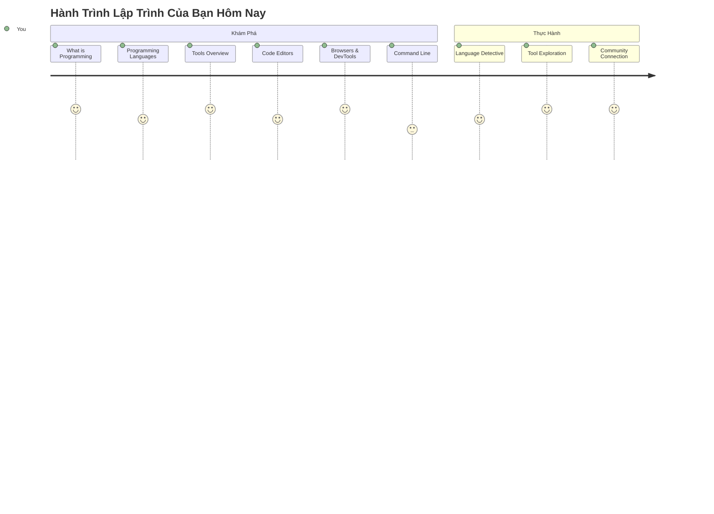
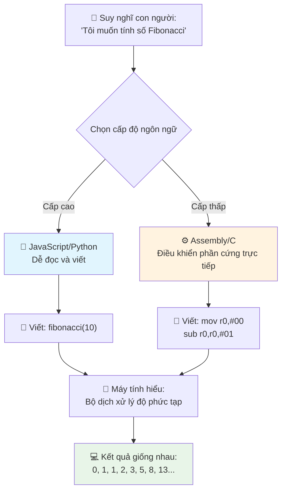
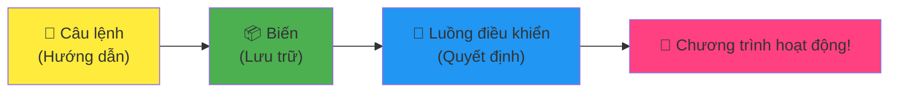
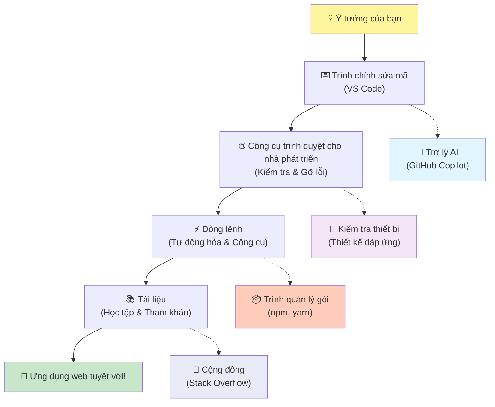

# Giới thiệu về Ngôn ngữ Lập trình và Công cụ Phát triển Hiện đại

Chào bạn, nhà phát triển tương lai! 👋 Mình có thể kể cho bạn điều gì đó làm mình ớn lạnh mỗi ngày không? Bạn sắp khám phá ra rằng lập trình không chỉ là về máy tính – mà là có những siêu năng lực thực sự để biến những ý tưởng điên rồ nhất của bạn thành hiện thực!

Bạn có biết cảm giác khi đang dùng ứng dụng yêu thích và mọi thứ cứ khớp hoàn hảo không? Khi bạn nhấn nút và điều gì đó thật kỳ diệu xảy ra khiến bạn phải thốt lên "wow, làm sao họ làm được vậy?" Vâng, chính người như bạn – có thể đang ngồi trong quán cà phê yêu thích lúc 2 giờ sáng với tách espresso thứ ba – đã viết đoạn mã tạo ra sự kỳ diệu đó. Và đây là điều sẽ làm bạn kinh ngạc: đến cuối bài học này, bạn không chỉ hiểu họ đã làm như thế nào, mà bạn còn háo hức muốn thử tự làm nữa!

Nghe này, mình hoàn toàn hiểu nếu lập trình bây giờ có vẻ đáng sợ với bạn. Khi mình mới bắt đầu, mình thật sự nghĩ rằng bạn cần phải là thiên tài toán học hoặc đã lập trình từ khi 5 tuổi. Nhưng đây là điều đã hoàn toàn thay đổi quan điểm của mình: lập trình chính xác như học cách trò chuyện trong một ngôn ngữ mới. Bạn bắt đầu với "xin chào" và "cảm ơn," rồi đến lúc đặt cà phê, và không lâu sau, bạn đang có những cuộc thảo luận triết lý sâu sắc! Ngoại trừ trường hợp này, bạn đang nói chuyện với máy tính, và thật lòng mà nói? Họ là những đối tác trò chuyện kiên nhẫn nhất bạn từng gặp – họ không bao giờ phán xét lỗi của bạn và luôn hào hứng thử lại!

Hôm nay, chúng ta sẽ khám phá những công cụ tuyệt vời giúp phát triển web hiện đại không chỉ có thể mà còn rất gây nghiện. Mình đang nói về chính những trình soạn thảo, trình duyệt, và quy trình làm việc mà các nhà phát triển ở Netflix, Spotify, và studio ứng dụng indie yêu thích của bạn dùng mỗi ngày. Và đây là phần làm bạn nhảy cẫng lên vui mừng: hầu hết các công cụ chuyên nghiệp, chuẩn công nghiệp này hoàn toàn miễn phí!


> Sketchnote bởi [Tomomi Imura](https://twitter.com/girlie_mac)


```mermaid
journey
    title Hành Trình Lập Trình Của Bạn Hôm Nay
    section Khám Phá
      What is Programming: 5: You
      Programming Languages: 4: You
      Tools Overview: 5: You
    section Khám Phá
      Code Editors: 4: You
      Browsers & DevTools: 5: You
      Command Line: 3: You
    section Thực Hành
      Language Detective: 4: You
      Tool Exploration: 5: You
      Community Connection: 5: You
```
## Hãy Xem Bạn Đã Biết Gì Rồi!

Trước khi chúng ta bước vào phần thú vị, mình tò mò – bạn đã biết gì về thế giới lập trình này rồi? Và nghe này, nếu bạn đang nhìn vào những câu hỏi này và nghĩ "Tôi thật sự chẳng biết gì cả," thì điều đó không chỉ ổn, mà còn là hoàn hảo! Điều đó có nghĩa bạn đang ở đúng nơi rồi đấy. Hãy xem bài kiểm tra nhỏ này như việc khởi động trước khi tập thể dục – chúng ta chỉ đang làm nóng các cơ não thôi!

[Tham gia bài kiểm tra trước bài học](https://ff-quizzes.netlify.app/web/)


## Cuộc Phiêu Lưu Mà Chúng Ta Sẽ Cùng Đi Qua

Được rồi, mình thật sự đầy háo hức về những gì chúng ta sẽ khám phá hôm nay! Thật sự, mình ước có thể nhìn thấy khuôn mặt bạn khi một số khái niệm bật sáng trong đầu bạn. Dưới đây là chuyến hành trình tuyệt vời mà chúng ta sẽ đi cùng nhau:

- **Lập trình thực sự là gì (và tại sao nó tuyệt vời nhất!)** – Chúng ta sẽ khám phá cách mà mã lệnh chính là phép thuật vô hình cung cấp năng lượng cho mọi thứ xung quanh bạn, từ cái chuông báo thức biết là thứ Hai đến thuật toán lựa chọn đề xuất Netflix hoàn hảo của bạn
- **Các ngôn ngữ lập trình và tính cách đặc biệt của chúng** – Hãy tưởng tượng bạn bước vào một bữa tiệc nơi mỗi người có những siêu năng lực và cách giải quyết vấn đề hoàn toàn khác nhau. Đó chính là thế giới ngôn ngữ lập trình, và bạn sẽ thích gặp gỡ họ!
- **Những viên gạch nền tảng tạo nên phép thuật số** – Hãy coi chúng như bộ LEGO sáng tạo tối thượng. Khi bạn hiểu cách các mảnh ghép này khớp với nhau, bạn sẽ nhận ra bạn có thể xây dựng bất cứ thứ gì trong tưởng tượng của bạn
- **Công cụ chuyên nghiệp giúp bạn cảm thấy như vừa được trao cho cây đũa thần** – Mình không nói quá đâu – những công cụ này thực sự sẽ làm bạn cảm thấy có siêu năng lực, và phần hay nhất? Chúng là những công cụ mà các chuyên gia sử dụng!

> 💡 **Một điều này nhé:** Đừng nghĩ đến việc cố gắng ghi nhớ tất cả hôm nay! Bây giờ, mình chỉ muốn bạn cảm nhận được tia lửa phấn khích về những gì có thể làm được. Các chi tiết sẽ tự nhiên lưu lại khi chúng ta cùng luyện tập – đó chính là cách học thực sự!

> Bạn có thể học bài này trên [Microsoft Learn](https://learn.microsoft.com/en-us/learn/modules/web-development-101/introduction-programming/?WT.mc_id=academic-77807-sagibbon)!

## Vậy Lập Trình Thật Ra *Là Gì*?

Được rồi, hãy cùng trả lời câu hỏi triệu đô: lập trình thật sự là gì?

Mình sẽ kể bạn một câu chuyện đã làm mình thay đổi hoàn toàn cách nghĩ về điều này. Tuần trước, mình cố giải thích cho mẹ mình cách sử dụng chiếc điều khiển TV thông minh mới. Mình bắt gặp mình nói những câu kiểu như "Nhấn nút đỏ, nhưng không phải nút đỏ lớn, mà là nút đỏ nhỏ bên trái... không, bên trái kia kìa... được rồi, giữ nút đó hai giây, không phải một, không phải ba..." Nghe quen không? 😅

Đó chính là lập trình! Đó là nghệ thuật đưa ra chỉ dẫn cực kỳ chi tiết, từng bước cho một thứ rất mạnh mẽ nhưng cần mọi thứ được nói rõ ràng hoàn hảo. Ngoại trừ không phải giải thích cho mẹ bạn (người có thể hỏi "nút đỏ nào?"), mà bạn đang giải thích cho máy tính (máy tính chỉ làm đúng những gì bạn nói, dù bạn nói chưa đúng ý).

Cái đã làm mình kinh ngạc khi mới học là: máy tính thực ra rất đơn giản ở cốt lõi. Chúng chỉ hiểu hai thứ – 1 và 0, tức là "có" và "không" hoặc "bật" và "tắt." Chỉ vậy thôi! Nhưng đây là điều kỳ diệu – chúng ta không cần nói bằng 1 và 0 như trong Ma Trận. Đó là khi **ngôn ngữ lập trình** cứu cánh. Chúng là như phiên dịch viên giỏi nhất thế giới, biến những suy nghĩ bình thường của con người thành ngôn ngữ máy tính.

Và đây là điều vẫn làm mình rùng mình mỗi sáng khi thức dậy: thật sự *mọi thứ* kỹ thuật số trong cuộc sống của bạn bắt đầu bởi ai đó giống bạn, có thể đang mặc đồ ngủ với tách cà phê, gõ mã trên laptop. Bộ lọc Instagram làm bạn trông hoàn hảo? Ai đó đã viết mã đó. Thuật toán gợi ý bài hát mới yêu thích của bạn? Một nhà phát triển đã xây dựng thuật toán đó. Ứng dụng giúp bạn chia tiền ăn tối với bạn bè? Vâng, ai đó đã nghĩ "điều này thật phiền, mình chắc có thể sửa được" rồi... họ đã làm!

Khi bạn học lập trình, bạn không chỉ học thêm một kỹ năng mới – bạn trở thành một phần của cộng đồng những người giải quyết vấn đề tuyệt vời này, những người dành cả ngày suy nghĩ, "Nếu mình có thể xây dựng một thứ làm cho ngày của ai đó tốt hơn một chút thì sao nhỉ?" Thật sự, có gì ngầu hơn thế?

✅ **Trò chơi thú vị:** Đây là điều cực kỳ thú vị để tìm hiểu khi bạn có thời gian rảnh – bạn có nghĩ ai là người lập trình máy tính đầu tiên trên thế giới không? Mình sẽ cho bạn một gợi ý: có thể không phải người bạn đang nghĩ! Câu chuyện về người này rất hấp dẫn và cho thấy lập trình luôn là về sáng tạo giải quyết vấn đề và tư duy khác biệt.

### 🧠 **Giờ Kiểm Tra: Bạn Cảm Thấy Thế Nào?**

**Dành chút thời gian suy nghĩ:**
- Ý tưởng "đưa hướng dẫn cho máy tính" có hợp lý với bạn không?
- Bạn có thể nghĩ ra một công việc hàng ngày bạn muốn tự động hóa bằng lập trình không?
- Có những câu hỏi nào đang nảy lên trong đầu bạn về lập trình?

> **Nhớ nhé:** Bình thường nếu một số khái niệm còn mơ hồ lúc này. Học lập trình như học một ngôn ngữ mới – cần thời gian để não bạn xây dựng các kết nối thần kinh. Bạn đang làm rất tốt rồi!

## Ngôn Ngữ Lập Trình Giống Như Những Hương Vị Phép Thuật Khác Nhau

Được rồi, điều này nghe có vẻ lạ nhưng hãy theo mình – ngôn ngữ lập trình giống như các thể loại nhạc khác nhau. Nghĩ mà xem: bạn có jazz mượt mà và ứng biến, nhạc rock mãnh liệt và trực tiếp, nhạc cổ điển thanh lịch và có cấu trúc, và hip-hop sáng tạo và biểu cảm. Mỗi thể loại có phong cách riêng, cộng đồng fan đam mê riêng, và mỗi loại phù hợp với tâm trạng và dịp khác nhau.

Ngôn ngữ lập trình cũng hoạt động y hệt vậy! Bạn sẽ không dùng cùng ngôn ngữ để tạo game di động vui nhộn như lúc xử lý khối dữ liệu khổng lồ về khí hậu, cũng giống như bạn không chơi nhạc death metal trong lớp yoga (thường là thế 😄).

Nhưng điều làm mình kinh ngạc mỗi lần nghĩ đến: những ngôn ngữ này giống như có một phiên dịch viên kiên nhẫn, tuyệt vời ngồi ngay bên cạnh bạn. Bạn có thể diễn đạt ý tưởng theo cách tự nhiên với bộ não con người, và họ xử lý tất cả công việc phức tạp đưa thành 1 và 0 mà máy tính thực sự hiểu. Giống như có một người bạn thông thạo cả "sáng tạo của con người" và "logic của máy tính" – và họ không bao giờ mệt, không cần nghỉ cà phê, và không bao giờ phán xét bạn hỏi lại cùng một câu hai lần!

### Các Ngôn Ngữ Lập Trình Phổ Biến và Ứng Dụng


```mermaid
mindmap
  root((Ngôn Ngữ Lập Trình))
    Web Development
      JavaScript
        Phép Thuật Frontend
        Trang Web Tương Tác
      TypeScript
        JavaScript + Kiểu Dữ Liệu
        Ứng Dụng Doanh Nghiệp
    Data & AI
      Python
        Khoa Học Dữ Liệu
        Học Máy
        Tự Động Hóa
      R
        Thống Kê
        Nghiên Cứu
    Mobile Apps
      Java
        Android
        Doanh Nghiệp
      Swift
        iOS
        Hệ Sinh Thái Apple
      Kotlin
        Android Hiện Đại
        Đa Nền Tảng
    Systems & Performance
      C++
        Trò Chơi
        Hiệu Năng Quan Trọng
      Rust
        An Toàn Bộ Nhớ
        Lập Trình Hệ Thống
      Go
        Dịch Vụ Đám Mây
        Backend Có Khả Năng Mở Rộng
```
| Ngôn ngữ | Tốt nhất cho | Tại sao phổ biến |
|----------|--------------|------------------|
| **JavaScript** | Phát triển web, giao diện người dùng | Chạy trên trình duyệt và cung cấp năng lượng cho các trang web tương tác |
| **Python** | Khoa học dữ liệu, tự động hóa, AI | Dễ đọc và học, có thư viện mạnh mẽ |
| **Java** | Ứng dụng doanh nghiệp, ứng dụng Android | Độc lập nền tảng, bền vững cho hệ thống lớn |
| **C#** | Ứng dụng Windows, phát triển game | Hỗ trợ mạnh mẽ từ hệ sinh thái Microsoft |
| **Go** | Dịch vụ đám mây, hệ thống backend | Nhanh, đơn giản, được thiết kế cho điện toán hiện đại |

### Ngôn ngữ Cấp Cao và Cấp Thấp

Được rồi, thực sự đây là khái niệm làm mình khá bối rối khi mới học, vậy mình sẽ chia sẻ phép ẩn dụ khiến mình hiểu ra – và mình hy vọng cũng giúp bạn!

Hãy tưởng tượng bạn đang du lịch một đất nước mà bạn không biết ngôn ngữ và bạn rất cần tìm phòng vệ sinh gần nhất (ai cũng từng trải qua chứ? 😅):

- **Lập trình cấp thấp** giống như học ngôn ngữ địa phương đến mức bạn có thể trò chuyện với bà bán hoa quả góc phố sử dụng các tham chiếu văn hóa, tiếng lóng địa phương, và những câu đùa mà chỉ người bản xứ mới hiểu. Rất ấn tượng và hiệu quả... nếu bạn thành thạo! Nhưng khá quá tải khi bạn chỉ muốn tìm nhà vệ sinh thôi.

- **Lập trình cấp cao** giống như có một người bạn địa phương tuyệt vời hiểu bạn. Bạn có thể nói "Tôi rất cần tìm nhà vệ sinh" bằng tiếng Anh đơn giản, và họ xử lý việc phiên dịch văn hóa và chỉ đường sao cho bộ não không phải bản địa của bạn cũng hiểu rõ.

Ở lập trình:
- **Ngôn ngữ cấp thấp** (như Assembly hoặc C) cho phép bạn trò chuyện cực kỳ chi tiết với phần cứng máy tính thực tế, nhưng bạn cần nghĩ như máy, điều này... nói chung là một sự chuyển đổi tư duy khá lớn!
- **Ngôn ngữ cấp cao** (như JavaScript, Python, hay C#) cho phép bạn suy nghĩ như con người trong khi chúng xử lý mọi "ngôn ngữ máy" phía sau. Hơn nữa, chúng có cộng đồng rất thân thiện với nhiều người nhớ được cảm giác mới học và thật lòng muốn giúp đỡ!

Bạn đoán mình sẽ đề xuất bạn bắt đầu với loại nào? 😉 Ngôn ngữ cấp cao như có bánh xe tập đi mà bạn không muốn tháo ra vì chúng khiến trải nghiệm thú vị hơn nhiều!


```mermaid
flowchart TB
    A["👤 Suy nghĩ con người:<br/>'Tôi muốn tính số Fibonacci'"] --> B{Chọn cấp độ ngôn ngữ}
    
    B -->|Cấp cao| C["🌟 JavaScript/Python<br/>Dễ đọc và viết"]
    B -->|Cấp thấp| D["⚙️ Assembly/C<br/>Điều khiển phần cứng trực tiếp"]
    
    C --> E["📝 Viết: fibonacci(10)"]
    D --> F["📝 Viết: mov r0,#00<br/>sub r0,r0,#01"]
    
    E --> G["🤖 Máy tính hiểu:<br/>Bộ dịch xử lý độ phức tạp"]
    F --> G
    
    G --> H["💻 Kết quả giống nhau:<br/>0, 1, 1, 2, 3, 5, 8, 13..."]
    
    style C fill:#e1f5fe
    style D fill:#fff3e0
    style H fill:#e8f5e8
```
### Để Mình Cho Bạn Xem Tại Sao Ngôn Ngữ Cấp Cao Thân Thiện Hơn Rất Nhiều

Được rồi, mình sắp cho bạn xem điều thể hiện hoàn hảo tại sao mình yêu ngôn ngữ cấp cao, nhưng trước tiên – mình cần bạn hứa một điều. Khi bạn thấy ví dụ mã đầu tiên, đừng hoảng sợ! Nó đúng là trông có vẻ đáng sợ. Đó chính là điểm mình muốn làm nổi bật!

Chúng ta sẽ xem cùng một tác vụ viết theo hai phong cách hoàn toàn khác nhau. Cả hai tạo ra cái gọi là dãy số Fibonacci – đây là mẫu toán học đẹp tuyệt, mỗi số là tổng của hai số trước: 0, 1, 1, 2, 3, 5, 8, 13... (Thú vị nhé: bạn sẽ thấy mẫu này ở khắp nơi trong thiên nhiên – vòng xoắn hạt hướng dương, mô hình quả thông, thậm chí cả cách các thiên hà hình thành!)

Sẵn sàng thấy sự khác biệt chưa? Cùng xem nào!

**Ngôn ngữ cấp cao (JavaScript) – Thân thiện với con người:**

```javascript
// Bước 1: Thiết lập cơ bản dãy Fibonacci
const fibonacciCount = 10;
let current = 0;
let next = 1;

console.log('Fibonacci sequence:');
```

**Mã này làm gì:**
- **Khai báo** một hằng số để xác định bao nhiêu số Fibonacci muốn tạo ra
- **Khởi tạo** hai biến để theo dõi số hiện tại và số tiếp theo trong dãy
- **Thiết lập** giá trị bắt đầu (0 và 1) định nghĩa mẫu Fibonacci
- **Hiển thị** tiêu đề để xác định kết quả đầu ra

```javascript
// Bước 2: Tạo chuỗi với vòng lặp
for (let i = 0; i < fibonacciCount; i++) {
  console.log(`Position ${i + 1}: ${current}`);
  
  // Tính số tiếp theo trong chuỗi
  const sum = current + next;
  current = next;
  next = sum;
}
```

**Phân tích những gì xảy ra:**
- **Lặp qua** từng vị trí trong dãy bằng vòng `for`
- **Hiển thị** mỗi số cùng chỉ số bằng cú pháp template literal
- **Tính toán** số Fibonacci tiếp theo bằng cách cộng giá trị hiện tại và tiếp theo
- **Cập nhật** biến theo dõi để chuyển sang vòng lặp kế tiếp

```javascript
// Bước 3: Phương pháp hàm hiện đại
const generateFibonacci = (count) => {
  const sequence = [0, 1];
  
  for (let i = 2; i < count; i++) {
    sequence[i] = sequence[i - 1] + sequence[i - 2];
  }
  
  return sequence;
};

// Ví dụ sử dụng
const fibSequence = generateFibonacci(10);
console.log(fibSequence);
```

**Trong đoạn trên, ta đã:**
- **Tạo** hàm dùng lại bằng cú pháp arrow function hiện đại
- **Xây dựng** mảng để lưu toàn bộ dãy thay vì hiển thị từng số
- **Dùng** chỉ số mảng để tính số mới từ các số trước đó
- **Trả về** toàn bộ dãy để sử dụng linh hoạt trong các phần khác của chương trình

**Ngôn ngữ cấp thấp (ARM Assembly) – Thân thiện với máy tính:**

```assembly
 area ascen,code,readonly
 entry
 code32
 adr r0,thumb+1
 bx r0
 code16
thumb
 mov r0,#00
 sub r0,r0,#01
 mov r1,#01
 mov r4,#10
 ldr r2,=0x40000000
back add r0,r1
 str r0,[r2]
 add r2,#04
 mov r3,r0
 mov r0,r1
 mov r1,r3
 sub r4,#01
 cmp r4,#00
 bne back
 end
```

Bạn để ý phiên bản JavaScript đọc gần như là các hướng dẫn bằng tiếng Anh, còn phiên bản Assembly dùng các lệnh bí ẩn điều khiển trực tiếp bộ xử lý máy tính. Cả hai đều hoàn thành cùng một nhiệm vụ, nhưng ngôn ngữ cấp cao dễ hiểu, viết và bảo trì hơn nhiều đối với con người.

**Điểm khác biệt chính bạn sẽ nhận thấy:**
- **Khả năng đọc hiểu**: JavaScript sử dụng các tên mô tả như `fibonacciCount` trong khi Assembly dùng các nhãn khó hiểu như `r0`, `r1`
- **Chú thích**: Ngôn ngữ cấp cao khuyến khích các chú thích giải thích giúp mã tự tài liệu hóa
- **Cấu trúc**: Luồng logic trong JavaScript khớp với cách con người suy nghĩ vấn đề theo từng bước
- **Bảo trì**: Việc cập nhật phiên bản JavaScript để đáp ứng các yêu cầu khác nhau là đơn giản và rõ ràng

✅ **Về dãy số Fibonacci**: Mẫu số tuyệt đẹp này (nơi mỗi số bằng tổng của hai số trước nó: 0, 1, 1, 2, 3, 5, 8...) xuất hiện khắp nơi trong thiên nhiên! Bạn sẽ thấy nó trong các vòng xoắn của hoa hướng dương, họa tiết quả thông, cách vỏ nautilus uốn cong, thậm chí trong cách các cành cây phát triển. Thật khó tin khi toán học và mã có thể giúp chúng ta hiểu và tái tạo các mẫu mà thiên nhiên sử dụng để tạo ra vẻ đẹp!

## Những Khối Xây Dựng Tạo Nên Phép Màu

Được rồi, giờ bạn đã thấy các ngôn ngữ lập trình trông như thế nào khi vận hành, hãy cùng phân tích những thành phần cơ bản tạo nên gần như mỗi chương trình từng được viết. Hãy nghĩ về chúng như những nguyên liệu cần thiết trong công thức yêu thích của bạn – khi bạn hiểu từng phần làm gì, bạn sẽ có thể đọc và viết mã trong hầu hết mọi ngôn ngữ!

Điều này giống như học ngữ pháp lập trình vậy. Nhớ hồi đi học bạn học về danh từ, động từ, và cách ghép câu à? Lập trình cũng có phiên bản ngữ pháp riêng của nó, và thật lòng mà nói, nó logic và dễ chịu hơn ngữ pháp tiếng Anh rất nhiều! 😄

### Mệnh Lệnh: Hướng Dẫn Từng Bước

Hãy bắt đầu với **mệnh lệnh** – chúng giống như những câu đơn lẻ trong cuộc trò chuyện với máy tính của bạn. Mỗi mệnh lệnh bảo máy tính làm một việc cụ thể, giống như việc chỉ đường: "Rẽ trái ở đây," "Dừng lại tại đèn đỏ," "Đỗ xe ở chỗ đó."

Điều tôi thích ở các mệnh lệnh là chúng thường rất dễ đọc. Nhìn này:

```javascript
// Các câu lệnh cơ bản thực hiện các hành động đơn lẻ
const userName = "Alex";                    
console.log("Hello, world!");              
const sum = 5 + 3;                         
```
  
**Mã này làm gì:**  
- **Khai báo** một biến hằng để lưu tên người dùng  
- **Hiển thị** một lời chào lên bảng điều khiển  
- **Tính toán** và lưu kết quả của một phép toán  

```javascript
// Các câu lệnh tương tác với các trang web
document.title = "My Awesome Website";      
document.body.style.backgroundColor = "lightblue";
```
  
**Từng bước diễn ra như sau:**  
- **Sửa đổi** tiêu đề trang xuất hiện trên tab trình duyệt  
- **Thay đổi** màu nền toàn bộ trang  

### Biến: Hệ Thống Bộ Nhớ Của Chương Trình Bạn

Okay, **biến** thật sự là một trong những khái niệm tôi thích nhất để dạy vì chúng rất giống những thứ bạn đã dùng hàng ngày!

Hãy nghĩ về danh bạ điện thoại. Bạn không nhớ số điện thoại của mọi người – thay vào đó, bạn lưu "Mẹ," "Bạn thân," hoặc "Quán Pizza giao hàng đến 2 giờ sáng" và để điện thoại ghi nhớ số thực. Biến cũng hoạt động y hệt vậy! Chúng giống những hộp có nhãn, nơi chương trình bạn có thể lưu trữ thông tin và truy xuất lại sau này bằng một cái tên rất dễ hiểu.

Điều thật sự tuyệt là: biến có thể thay đổi khi chương trình chạy (đó là lý do gọi là "biến" – thấy họ chơi chữ chưa?). Giống như bạn có thể cập nhật số quán pizza nếu tìm được chỗ ngon hơn, các biến cũng có thể được cập nhật khi chương trình học thêm thông tin mới hoặc khi tình huống thay đổi!

Để tôi cho bạn thấy điều này thật đơn giản thế nào:

```javascript
// Bước 1: Tạo các biến cơ bản
const siteName = "Weather Dashboard";        
let currentWeather = "sunny";               
let temperature = 75;                       
let isRaining = false;                      
```
  
**Hiểu các khái niệm này:**  
- **Lưu** các giá trị không đổi trong biến `const` (như tên trang)  
- **Dùng** `let` cho những giá trị có thể thay đổi trong chương trình  
- **Gán** các kiểu dữ liệu khác nhau: chuỗi (text), số, và boolean (đúng/sai)  
- **Chọn** tên biến mô tả dữ liệu một cách rõ ràng  

```javascript
// Bước 2: Làm việc với các đối tượng để nhóm dữ liệu có liên quan
const weatherData = {                       
  location: "San Francisco",
  humidity: 65,
  windSpeed: 12
};
```
  
**Ở ví dụ trên, chúng ta đã:**  
- **Tạo** một đối tượng để nhóm thông tin thời tiết liên quan  
- **Sắp xếp** nhiều dữ liệu dưới một tên biến duy nhất  
- **Dùng** cặp khóa-giá trị để gắn nhãn từng thông tin rõ ràng  

```javascript
// Bước 3: Sử dụng và cập nhật biến
console.log(`${siteName}: Today is ${currentWeather} and ${temperature}°F`);
console.log(`Wind speed: ${weatherData.windSpeed} mph`);

// Cập nhật các biến có thể thay đổi
currentWeather = "cloudy";                  
temperature = 68;                          
```
  
**Hiểu từng phần:**  
- **Hiển thị** thông tin dùng chuỗi mẫu kèm cú pháp `${}`  
- **Truy cập** thuộc tính của đối tượng bằng dấu chấm (`weatherData.windSpeed`)  
- **Cập nhật** các biến khai báo bằng `let` để phản ánh điều kiện thay đổi  
- **Kết hợp** nhiều biến để tạo ra các thông điệp có ý nghĩa  

```javascript
// Bước 4: Phá cấu trúc hiện đại để mã sạch hơn
const { location, humidity } = weatherData; 
console.log(`${location} humidity: ${humidity}%`);
```
  
**Cần biết:**  
- **Trích xuất** các thuộc tính cụ thể của đối tượng bằng phép gán phân rã  
- **Tạo** biến mới tự động cùng tên với các khóa trong đối tượng  
- **Đơn giản hóa** mã bằng cách tránh lặp lại cú pháp dấu chấm  

### Luồng Điều Khiển: Dạy Chương Trình Bạn Cách Nghĩ

Okay, đây là phần làm lập trình trở nên cực kỳ kinh ngạc! **Luồng điều khiển** về cơ bản là dạy chương trình làm thế nào để đưa ra các quyết định thông minh, giống như bạn làm từng ngày mà chẳng cần suy nghĩ nhiều.

Hãy tưởng tượng: sáng nay bạn có thể đã trải qua kiểu logic như "Nếu trời mưa, tôi sẽ mang ô. Nếu trời lạnh, tôi sẽ mặc áo khoác. Nếu tôi đi trễ, tôi sẽ bỏ bữa sáng và lấy cà phê trên đường." Bộ não bạn tự nhiên làm theo quy luật if-then này hàng chục lần mỗi ngày!

Chính điều này khiến các chương trình cảm thấy thông minh và sống động thay vì chỉ tuân theo kịch bản khô khan, máy móc. Chúng có thể nhìn vào một tình huống, đánh giá điều gì đang xảy ra, và phản ứng phù hợp. Giống như trao cho chương trình một bộ não để thích ứng và lựa chọn!

Muốn thấy nó vận hành tuyệt vời thế nào? Để tôi cho bạn xem:

```javascript
// Bước 1: Logic điều kiện cơ bản
const userAge = 17;

if (userAge >= 18) {
  console.log("You can vote!");
} else {
  const yearsToWait = 18 - userAge;
  console.log(`You'll be able to vote in ${yearsToWait} year(s).`);
}
```
  
**Mã này làm gì:**  
- **Kiểm tra** xem tuổi người dùng có đủ điều kiện bầu cử không  
- **Chạy** các đoạn mã khác nhau dựa vào kết quả điều kiện  
- **Tính toán** và hiển thị khoảng thời gian chờ đủ tuổi bầu cử nếu chưa đủ 18  
- **Cung cấp** phản hồi cụ thể, hữu ích cho từng trường hợp  

```javascript
// Bước 2: Nhiều điều kiện với toán tử logic
const userAge = 17;
const hasPermission = true;

if (userAge >= 18 && hasPermission) {
  console.log("Access granted: You can enter the venue.");
} else if (userAge >= 16) {
  console.log("You need parent permission to enter.");
} else {
  console.log("Sorry, you must be at least 16 years old.");
}
```
  
**Phân tích diễn biến:**  
- **Kết hợp** nhiều điều kiện với toán tử `&&` (và)  
- **Tạo** hệ thống điều kiện phân loại bằng `else if` cho nhiều tình huống  
- **Xử lý** tất cả các trường hợp với câu lệnh `else` cuối cùng  
- **Đưa ra** phản hồi rõ ràng, khả thi cho mỗi tình huống khác nhau  

```javascript
// Bước 3: Câu điều kiện ngắn gọn với toán tử tam phân
const votingStatus = userAge >= 18 ? "Can vote" : "Cannot vote yet";
console.log(`Status: ${votingStatus}`);
```
  
**Cần nhớ:**  
- **Dùng** toán tử ba ngôi (`? :`) cho các điều kiện có hai lựa chọn đơn giản  
- **Viết** điều kiện đầu tiên, theo sau là `?`, kết quả đúng, rồi `:`, kết quả sai  
- **Áp dụng** mẫu này khi cần gán giá trị dựa trên điều kiện  

```javascript
// Bước 4: Xử lý nhiều trường hợp cụ thể
const dayOfWeek = "Tuesday";

switch (dayOfWeek) {
  case "Monday":
  case "Tuesday":
  case "Wednesday":
  case "Thursday":
  case "Friday":
    console.log("It's a weekday - time to work!");
    break;
  case "Saturday":
  case "Sunday":
    console.log("It's the weekend - time to relax!");
    break;
  default:
    console.log("Invalid day of the week");
}
```
  
**Mã làm được:**  
- **So khớp** giá trị biến với nhiều trường hợp cụ thể  
- **Nhóm** các trường hợp tương đồng (ngày trong tuần so với cuối tuần)  
- **Thực hiện** đoạn mã tương ứng khi tìm thấy khớp  
- **Bao gồm** trường hợp `default` để xử lý giá trị bất ngờ  
- **Dùng** câu lệnh `break` để ngăn không thực hiện tiếp các trường hợp phía sau  

> 💡 **Minh họa thực tế**: Hãy nghĩ luồng điều khiển giống như bạn có một GPS cực kỳ kiên nhẫn chỉ đường. Nó có thể nói "Nếu trên đường Main đang kẹt xe, hãy đi cao tốc. Nếu cao tốc bị chặn do công trường, thử đi đường ngắm cảnh." Các chương trình dùng đúng kiểu logic có điều kiện này để phản ứng thông minh với các tình huống khác nhau và luôn mang lại trải nghiệm tốt nhất cho người dùng.

### 🎯 **Kiểm Tra Khái Niệm: Làm Chủ Các Khối Xây Dựng**

**Cùng xem bạn làm thế nào với kiến thức nền tảng:**  
- Bạn có thể giải thích sự khác biệt giữa biến và mệnh lệnh bằng lời của bạn?  
- Nghĩ về một tình huống thực tế bạn sẽ dùng lệnh if-then (như ví dụ bầu cử)  
- Điều gì về logic lập trình khiến bạn bất ngờ nhất?

**Tăng sự tự tin nhanh:**  

```mermaid
flowchart LR
    A["📝 Câu lệnh<br/>(Hướng dẫn)"] --> B["📦 Biến<br/>(Lưu trữ)"] --> C["🔀 Luồng điều khiển<br/>(Quyết định)"] --> D["🎉 Chương trình hoạt động!"]
    
    style A fill:#ffeb3b
    style B fill:#4caf50
    style C fill:#2196f3
    style D fill:#ff4081
```  
✅ **Điều tiếp theo**: Chúng ta sẽ có một chuyến phiêu lưu đầy thú vị khám phá sâu hơn các khái niệm này! Hiện giờ, hãy tập trung cảm nhận sự phấn khích về mọi khả năng tuyệt vời đang chờ phía trước. Kỹ năng và kỹ thuật cụ thể sẽ đi vào tiềm thức khi ta luyện tập cùng nhau – tôi đảm bảo đây sẽ vui hơn bạn tưởng rất nhiều!

## Công Cụ Chuyên Nghiệp

Được rồi, thành thật mà nói đây là phần khiến tôi cực kỳ hào hứng không thể kiềm chế! 🚀 Chúng ta sắp nói về những công cụ tuyệt vời sẽ làm bạn cảm giác như vừa được trao chìa khóa cho một chiếc phi thuyền số.

Bạn biết đầu bếp có những con dao cân bằng hoàn hảo như thể là phần nối dài của bàn tay họ không? Hay nhạc sĩ có cây đàn guitar mà chỉ cần chạm vào là như hát lên? Các nhà phát triển phần mềm có phiên bản công cụ kỳ diệu của riêng mình, và đây là điều sẽ làm bạn choáng ngợp – hầu hết đều hoàn toàn miễn phí!

Tôi gần như nhún nhảy trên ghế khi nghĩ tới việc chia sẻ với bạn bởi vì chúng đã cách mạng hóa hoàn toàn cách chúng ta xây dựng phần mềm. Chúng ta đang nói về các trợ lý viết mã dùng trí tuệ nhân tạo (tôi không đùa đâu!), môi trường đám mây nơi bạn có thể xây dựng toàn bộ ứng dụng từ bất cứ đâu có Wi-Fi, và các công cụ gỡ lỗi tinh vi như thể bạn có thể nhìn xuyên thấu các chương trình.

Và phần này khiến tôi run lên: đây không phải là "công cụ cho người mới" mà bạn sẽ sớm bỏ qua. Đây là những công cụ chuyên nghiệp y hệt như các nhà phát triển tại Google, Netflix, và studio ứng dụng độc lập mà bạn yêu thích đang dùng ngay lúc này. Bạn sẽ cảm thấy như một chuyên gia thực thụ khi sử dụng chúng!


```mermaid
graph TD
    A["💡 Ý tưởng của bạn"] --> B["⌨️ Trình chỉnh sửa mã<br/>(VS Code)"] 
    B --> C["🌐 Công cụ trình duyệt cho nhà phát triển<br/>(Kiểm tra & Gỡ lỗi)"]
    C --> D["⚡ Dòng lệnh<br/>(Tự động hóa & Công cụ)"]
    D --> E["📚 Tài liệu<br/>(Học tập & Tham khảo)"]
    E --> F["🚀 Ứng dụng web tuyệt vời!"]
    
    B -.-> G["🤖 Trợ lý AI<br/>(GitHub Copilot)"]
    C -.-> H["📱 Kiểm tra thiết bị<br/>(Thiết kế đáp ứng)"]
    D -.-> I["📦 Trình quản lý gói<br/>(npm, yarn)"]
    E -.-> J["👥 Cộng đồng<br/>(Stack Overflow)"]
    
    style A fill:#fff59d
    style F fill:#c8e6c9
    style G fill:#e1f5fe
    style H fill:#f3e5f5
    style I fill:#ffccbc
    style J fill:#e8eaf6
```  
### Trình Soạn Thảo Mã và IDE: Người Bạn Đời Kỹ Thuật Số Mới Của Bạn

Hãy nói về các trình soạn thảo mã – chúng sắp trở thành nơi yêu thích mới của bạn đấy! Hãy coi chúng như thánh địa lập trình cá nhân, nơi bạn sẽ dành phần lớn thời gian tạo và hoàn thiện tác phẩm số của mình.

Nhưng điều kỳ diệu của các trình soạn thảo hiện đại là: chúng không chỉ là những trình soạn thảo văn bản sang trọng. Chúng giống như một người hướng dẫn lập trình thông minh và nhiệt tình bên cạnh bạn 24/7. Chúng phát hiện lỗi đánh máy trước khi bạn nhận ra, gợi ý cải tiến khiến bạn trông như thiên tài, giúp bạn hiểu mọi dòng mã đang làm gì, và một số còn dự đoán bạn sẽ đánh gì tiếp theo và đề nghị hoàn thành ý tưởng!

Tôi nhớ lần đầu phát hiện tính năng tự động hoàn thành – tôi thực sự cảm thấy như đang sống trong tương lai. Bạn bắt đầu nhập, và trình soạn thảo bảo: "Này, bạn đang nghĩ tới hàm này mà làm đúng việc bạn cần đấy à?" Giống như có một người đọc suy nghĩ làm bạn lập trình vậy!

**Điều gì làm các trình soạn thảo này tuyệt vời đến thế?**

Các trình soạn thảo mã hiện đại cung cấp một loạt các tính năng ấn tượng nhằm tăng năng suất của bạn:

| Tính Năng | Công Dụng | Lợi Ích |
|---------|--------------|--------------|
| **Đánh dấu cú pháp** | Tô màu các phần khác nhau của mã | Giúp mã dễ đọc và phát hiện lỗi |
| **Tự động hoàn thành** | Gợi ý mã khi bạn gõ | Tăng tốc độ lập trình và giảm lỗi đánh máy |
| **Công cụ gỡ lỗi** | Giúp bạn tìm và sửa lỗi | Tiết kiệm hàng giờ khắc phục sự cố |
| **Tiện ích mở rộng** | Thêm các tính năng chuyên biệt | Tùy biến trình soạn thảo theo công nghệ bạn dùng |
| **Trợ lý AI** | Gợi ý mã và giải thích | Tăng tốc học tập và làm việc |

> 🎥 **Tài nguyên Video**: Muốn xem các công cụ này hoạt động thế nào? Xem ngay [video Tools of the Trade](https://youtube.com/watch?v=69WJeXGBdxg) để có cái nhìn tổng quan chi tiết.

#### Trình Soạn Thảo Gợi Ý Cho Phát Triển Web

**[Visual Studio Code](https://code.visualstudio.com/?WT.mc_id=academic-77807-sagibbon)** (Miễn phí)  
- Phổ biến nhất với các nhà phát triển web  
- Hệ sinh thái tiện ích mở rộng xuất sắc  
- Tích hợp terminal và Git sẵn  
- **Tiện ích mở rộng cần có**:  
  - [GitHub Copilot](https://marketplace.visualstudio.com/items?itemName=GitHub.copilot) - gợi ý mã dùng AI  
  - [Live Share](https://marketplace.visualstudio.com/items?itemName=MS-vsliveshare.vsliveshare) - cộng tác trực tiếp  
  - [Prettier](https://marketplace.visualstudio.com/items?itemName=esbenp.prettier-vscode) - định dạng mã tự động  
  - [Code Spell Checker](https://marketplace.visualstudio.com/items?itemName=streetsidesoftware.code-spell-checker) - phát hiện lỗi chính tả trong mã  

**[JetBrains WebStorm](https://www.jetbrains.com/webstorm/)** (Trả phí, miễn phí cho sinh viên)  
- Công cụ gỡ lỗi và kiểm thử nâng cao  
- Tự động hoàn thành mã thông minh  
- Kiểm soát phiên bản tích hợp  

**IDE Dựa Trên Đám Mây** (Giá khác nhau)  
- [GitHub Codespaces](https://github.com/features/codespaces) - VS Code đầy đủ trên trình duyệt  
- [Replit](https://replit.com/) - tuyệt vời để học và chia sẻ mã  
- [StackBlitz](https://stackblitz.com/) - phát triển web full-stack tức thì  

> 💡 **Mẹo Bắt Đầu**: Hãy bắt đầu với Visual Studio Code – nó miễn phí, được sử dụng rộng rãi trong ngành và có cộng đồng khổng lồ tạo ra các hướng dẫn và tiện ích mở rộng hữu ích.

### Trình Duyệt Web: Phòng Thí Nghiệm Phát Triển Bí Mật Của Bạn

Okay, hãy chuẩn bị để tâm trí bạn bị thổi bay hoàn toàn! Bạn biết là bạn đã dùng trình duyệt để lướt mạng xã hội và xem video, đúng không? Thì hóa ra chúng đã giấu một phòng thí nghiệm phát triển tuyệt vời ngay trong đó suốt thời gian qua, chỉ chờ bạn khám phá!

Mỗi lần bạn nhấp chuột phải lên trang web và chọn "Inspect Element" (Kiểm tra phần tử), bạn đang mở ra một thế giới công cụ dành cho nhà phát triển thật sự mạnh mẽ, thậm chí còn hơn cả phần mềm đắt tiền mà tôi từng trả hàng trăm đô la để mua. Giống như phát hiện ra căn bếp cũ kỹ của bạn đã giấu một phòng thí nghiệm đầu bếp chuyên nghiệp phía sau một cánh cửa bí mật vậy!
Lần đầu tiên ai đó chỉ cho tôi DevTools trình duyệt, tôi đã dành khoảng ba tiếng chỉ để nhấp chuột quanh và nói "CHỜ ĐÃ, NÓ CÒN LÀM ĐƯỢC VIỆC ĐÓ SAO?!" Bạn có thể chỉnh sửa bất kỳ trang web nào trong thời gian thực, xem chính xác mọi thứ tải nhanh đến mức nào, kiểm tra xem trang web của bạn trông như thế nào trên các thiết bị khác nhau, và thậm chí gỡ lỗi JavaScript như một chuyên gia thực thụ. Thật sự rất kinh ngạc!

**Đây là lý do tại sao trình duyệt là vũ khí bí mật của bạn:**

Khi bạn tạo một trang web hoặc ứng dụng web, bạn cần xem nó trông và hoạt động như thế nào trong thế giới thực. Trình duyệt không chỉ hiển thị tác phẩm của bạn mà còn cung cấp phản hồi chi tiết về hiệu suất, khả năng truy cập và các vấn đề tiềm ẩn.

#### Công Cụ Phát Triển Trình Duyệt (DevTools)

Các trình duyệt hiện đại bao gồm bộ công cụ phát triển toàn diện:

| Danh Mục Công Cụ | Công Việc Của Nó | Ví Dụ Sử Dụng |
|------------------|------------------|----------------|
| **Element Inspector** | Xem và chỉnh sửa HTML/CSS trong thời gian thực | Điều chỉnh kiểu dáng để thấy kết quả ngay lập tức |
| **Console** | Xem lỗi và thử nghiệm JavaScript | Gỡ lỗi và thử nghiệm mã |
| **Network Monitor** | Theo dõi cách các tài nguyên được tải | Tối ưu hiệu suất và thời gian tải |
| **Accessibility Checker** | Kiểm tra thiết kế bao gồm | Đảm bảo trang web hoạt động cho tất cả người dùng |
| **Device Simulator** | Xem trước trên các kích thước màn hình khác nhau | Kiểm tra thiết kế đáp ứng mà không cần nhiều thiết bị |

#### Trình Duyệt Được Khuyên Dùng Cho Phát Triển

- **[Chrome](https://developers.google.com/web/tools/chrome-devtools/)** - DevTools tiêu chuẩn ngành với tài liệu phong phú
- **[Firefox](https://developer.mozilla.org/docs/Tools)** - Công cụ CSS Grid và truy cập tuyệt vời
- **[Edge](https://docs.microsoft.com/microsoft-edge/devtools-guide-chromium/?WT.mc_id=academic-77807-sagibbon)** - Dựa trên Chromium với tài nguyên phát triển của Microsoft

> ⚠️ **Mẹo Kiểm Tra Quan Trọng**: Luôn kiểm tra trang web trên nhiều trình duyệt! Điều gì hoạt động hoàn hảo trên Chrome có thể trông khác trên Safari hoặc Firefox. Các nhà phát triển chuyên nghiệp luôn kiểm tra trên tất cả các trình duyệt chính để đảm bảo trải nghiệm người dùng nhất quán.


### Công Cụ Dòng Lệnh: Cánh Cửa Đến Siêu Năng Lực Nhà Phát Triển

Được rồi, chúng ta hãy thành thật một chút về dòng lệnh, bởi tôi muốn bạn nghe điều này từ người thật sự hiểu nó. Lần đầu tôi thấy nó – chỉ là một màn hình đen đáng sợ với dòng chữ nhấp nháy – tôi thực sự nghĩ, "Không đâu, tuyệt đối không! Nó trông giống như phim hacker thập niên 1980, và tôi chắc chắn không đủ thông minh để dùng!" 😅

Nhưng đây là điều tôi ước ai đó đã nói với tôi lúc ấy, và tôi đang nói với bạn ngay bây giờ: dòng lệnh không đáng sợ – nó thực sự giống như bạn đang nói chuyện trực tiếp với máy tính của mình. Hãy nghĩ nó như sự khác biệt giữa việc đặt đồ ăn qua một ứng dụng đẹp mắt với hình ảnh và menu (dễ dùng) so với bước vào nhà hàng yêu thích nơi đầu bếp biết chính xác bạn thích gì và có thể làm một món hoàn hảo chỉ bằng câu "hãy tạo điều bất ngờ cho tôi."

Dòng lệnh là nơi các nhà phát triển cảm thấy mình như những phù thủy thực thụ. Bạn gõ vài từ mang vẻ ma thuật (được rồi, thực chất chỉ là các lệnh, nhưng cảm giác như ma thuật!), nhấn enter, và BÙM – bạn đã tạo ra cấu trúc dự án, cài đặt công cụ mạnh mẽ từ khắp nơi trên thế giới, hoặc triển khai ứng dụng lên internet cho hàng triệu người xem. Khi bạn thử nếm cảm giác đó lần đầu, thực sự rất dễ gây nghiện!

**Tại sao dòng lệnh sẽ trở thành công cụ yêu thích của bạn:**

Mặc dù giao diện đồ họa rất hữu ích cho nhiều nhiệm vụ, dòng lệnh vượt trội về tự động hóa, chính xác và tốc độ. Nhiều công cụ phát triển hoạt động chủ yếu qua giao diện dòng lệnh, và học cách dùng hiệu quả chúng có thể cải thiện đáng kể năng suất của bạn.

```bash
# Bước 1: Tạo và chuyển đến thư mục dự án
mkdir my-awesome-website
cd my-awesome-website
```

**Đây là những gì đoạn mã này làm:**
- **Tạo** thư mục mới có tên "my-awesome-website" cho dự án của bạn
- **Chuyển đến** thư mục mới tạo để bắt đầu làm việc

```bash
# Bước 2: Khởi tạo dự án với package.json
npm init -y

# Cài đặt công cụ phát triển hiện đại
npm install --save-dev vite prettier eslint
npm install --save-dev @eslint/js
```

**Từng bước, đây là những gì đang diễn ra:**
- **Khởi tạo** một dự án Node.js mới với thiết lập mặc định bằng `npm init -y`
- **Cài đặt** Vite như một công cụ xây dựng hiện đại cho phát triển nhanh và xây dựng sản xuất
- **Thêm** Prettier để tự động định dạng mã và ESLint để kiểm tra chất lượng mã
- **Sử dụng** cờ `--save-dev` để đánh dấu chúng chỉ là phụ thuộc cho phát triển

```bash
# Bước 3: Tạo cấu trúc dự án và các tệp
mkdir src assets
echo '<!DOCTYPE html><html><head><title>My Site</title></head><body><h1>Hello World</h1></body></html>' > index.html

# Khởi động máy chủ phát triển
npx vite
```

**Trong phần trên, chúng ta đã:**
- **Tổ chức** dự án bằng cách tạo các thư mục riêng cho mã nguồn và tài nguyên
- **Tạo** một tệp HTML cơ bản với cấu trúc tài liệu đúng chuẩn
- **Khởi động** máy chủ phát triển Vite để tải lại trực tiếp và thay thế module nóng

#### Công Cụ Dòng Lệnh Thiết Yếu Cho Phát Triển Web

| Công Cụ | Mục Đích | Lý Do Bạn Cần Nó |
|---------|----------|------------------|
| **[Git](https://git-scm.com/)** | Quản lý phiên bản | Theo dõi thay đổi, hợp tác với người khác, sao lưu công việc |
| **[Node.js & npm](https://nodejs.org/)** | Môi trường chạy JavaScript & quản lý gói | Chạy JavaScript ngoài trình duyệt, cài công cụ phát triển hiện đại |
| **[Vite](https://vitejs.dev/)** | Công cụ xây dựng & máy chủ phát triển | Phát triển siêu nhanh với thay thế module nóng |
| **[ESLint](https://eslint.org/)** | Chất lượng mã | Tự động tìm và sửa lỗi trong JavaScript |
| **[Prettier](https://prettier.io/)** | Định dạng mã | Giữ mã đẹp, nhất quán và dễ đọc |

#### Lựa Chọn Theo Nền Tảng

**Windows:**
- **[Windows Terminal](https://docs.microsoft.com/windows/terminal/?WT.mc_id=academic-77807-sagibbon)** - Terminal hiện đại, đa tính năng
- **[PowerShell](https://docs.microsoft.com/powershell/?WT.mc_id=academic-77807-sagibbon)** 💻 - Môi trường lập trình mạnh mẽ
- **[Command Prompt](https://docs.microsoft.com/windows-server/administration/windows-commands/?WT.mc_id=academic-77807-sagibbon)** 💻 - Dòng lệnh truyền thống trên Windows

**macOS:**
- **[Terminal](https://support.apple.com/guide/terminal/)** 💻 - Ứng dụng terminal tích hợp sẵn
- **[iTerm2](https://iterm2.com/)** - Terminal nâng cao với nhiều tính năng

**Linux:**
- **[Bash](https://www.gnu.org/software/bash/)** 💻 - Shell tiêu chuẩn của Linux
- **[KDE Konsole](https://docs.kde.org/trunk5/en/konsole/konsole/index.html)** - Bộ giả lập terminal nâng cao

> 💻 = Đã cài sẵn trên hệ điều hành

> 🎯 **Lộ Trình Học Tập**: Bắt đầu với các lệnh cơ bản như `cd` (đổi thư mục), `ls` hoặc `dir` (liệt kê file), và `mkdir` (tạo thư mục). Thực hành với các lệnh quy trình làm việc hiện đại như `npm install`, `git status`, và `code .` (mở thư mục hiện tại trong VS Code). Khi bạn quen hơn, bạn sẽ tự nhiên học được nhiều lệnh nâng cao và kỹ thuật tự động hóa.


### Tài Liệu: Người Thầy Luôn Có Bên Bạn

Được rồi, để tôi chia sẻ một bí mật nhỏ sẽ khiến bạn cảm thấy dễ chịu hơn rất nhiều khi là người mới: ngay cả những nhà phát triển giàu kinh nghiệm nhất cũng dành phần lớn thời gian của họ để đọc tài liệu. Và điều đó không phải vì họ không biết họ đang làm gì – mà đó là dấu hiệu của sự khôn ngoan!

Hãy nghĩ tài liệu như việc bạn có quyền truy cập vào những giáo viên kiên nhẫn, hiểu biết nhất thế giới, luôn sẵn sàng 24/7. Bị kẹt vào một vấn đề lúc 2 giờ sáng? Tài liệu ở đó với vòng tay ảo ấm áp và câu trả lời bạn cần. Muốn học về một tính năng mới kì diệu mà mọi người đang nói tới? Tài liệu hỗ trợ bạn với ví dụ từng bước. Cố gắng hiểu tại sao một thứ lại hoạt động như thế? Bạn đoán đúng rồi – tài liệu sẵn sàng giải thích một cách khiến bạn “bừng tỉnh”!

Có điều đã hoàn toàn thay đổi cách nhìn của tôi: thế giới phát triển web thay đổi cực kỳ nhanh, và không ai (tôi nhấn mạnh, KHÔNG AI!) nhớ hết mọi thứ. Tôi đã thấy các nhà phát triển cao cấp với hơn 15 năm kinh nghiệm vẫn phải tra cứu cú pháp cơ bản, và bạn biết không? Điều đó không xấu hổ – đó là thông minh! Không phải về trí nhớ hoàn hảo; mà là biết nơi để tìm câu trả lời đáng tin cậy nhanh chóng và hiểu cách áp dụng chúng.

**Đây mới là nơi phép màu thực sự xảy ra:**

Các nhà phát triển chuyên nghiệp dành phần lớn thời gian của họ để đọc tài liệu – không phải vì họ không biết làm, mà vì môi trường phát triển web thay đổi liên tục, cần học tập liên tục để cập nhật. Tài liệu tuyệt vời giúp bạn hiểu không chỉ *cách* dùng mà còn *tại sao* và *khi nào* dùng.

#### Tài Nguyên Tài Liệu Thiết Yếu

**[Mozilla Developer Network (MDN)](https://developer.mozilla.org/docs/Web)**
- Tiêu chuẩn vàng cho tài liệu công nghệ web
- Hướng dẫn toàn diện cho HTML, CSS và JavaScript
- Bao gồm thông tin tương thích trình duyệt
- Có ví dụ thực tế và demo tương tác

**[Web.dev](https://web.dev)** (của Google)
- Thực hành phát triển web hiện đại nhất
- Hướng dẫn tối ưu hiệu suất
- Nguyên tắc truy cập và thiết kế bao gồm
- Nghiên cứu trường hợp từ dự án thực tế

**[Microsoft Developer Documentation](https://docs.microsoft.com/microsoft-edge/#microsoft-edge-for-developers)**
- Tài nguyên phát triển trình duyệt Edge
- Hướng dẫn Progressive Web App
- Góc nhìn phát triển đa nền tảng

**[Frontend Masters Learning Paths](https://frontendmasters.com/learn/)**
- Lộ trình học tập có cấu trúc
- Khóa học video từ chuyên gia ngành
- Bài tập mã hóa thực hành

> 📚 **Chiến Lược Học Tập**: Đừng cố ghi nhớ tài liệu – thay vào đó, học cách điều hướng hiệu quả. Đánh dấu các tham khảo thường dùng và tập sử dụng chức năng tìm kiếm để nhanh chóng tìm thông tin cụ thể.

### 🔧 **Kiểm Tra Thành Thạo Công Cụ: Điều Nào Gây Ấn Tượng Với Bạn?**

**Hãy dành chút thời gian suy nghĩ:**
- Công cụ nào bạn háo hức thử đầu tiên? (Không có đáp án sai đâu!)
- Dòng lệnh còn khiến bạn sợ hãi, hay bạn bắt đầu tò mò về nó?
- Bạn có thể tưởng tượng dùng DevTools trình duyệt để nhìn “đằng sau bức màn” của các trang web yêu thích?


```mermaid
pie title "Thời Gian Nhà Phát Triển Dành Cho Công Cụ"
    "Trình Soạn Thảo Mã" : 40
    "Kiểm Tra Trình Duyệt" : 25
    "Dòng Lệnh" : 15
    "Đọc Tài Liệu" : 15
    "Gỡ Lỗi" : 5
```
> **Một hiểu biết thú vị**: Hầu hết các nhà phát triển dành khoảng 40% thời gian trong trình soạn thảo mã, nhưng hãy chú ý mức độ thời gian dành cho việc kiểm thử, học hỏi, và giải quyết vấn đề. Lập trình không chỉ là viết mã – mà là tạo ra trải nghiệm!

✅ **Món ăn cho suy nghĩ**: Đây là một điều thú vị để suy ngẫm – bạn nghĩ công cụ để xây dựng trang web (phát triển) có thể khác công cụ để thiết kế giao diện (thiết kế) như thế nào? Nó giống như sự khác biệt giữa kiến trúc sư thiết kế một ngôi nhà đẹp và nhà thầu xây dựng nó. Cả hai đều quan trọng nhưng cần bộ công cụ khác nhau! Cách suy nghĩ này sẽ giúp bạn thấy tổng thể cách mà các trang web được tạo ra.

## Thử Thách GitHub Copilot Agent 🚀

Dùng chế độ Agent để hoàn thành thử thách sau:

**Mô tả:** Khám phá các tính năng của một trình soạn thảo mã hoặc IDE hiện đại và trình bày cách nó cải thiện quy trình làm việc của bạn như một nhà phát triển web.

**Yêu cầu:** Chọn một trình soạn thảo mã hoặc IDE (như Visual Studio Code, WebStorm, hoặc IDE trên đám mây). Liệt kê ba tính năng hoặc tiện ích mở rộng giúp bạn viết, gỡ lỗi, hoặc duy trì mã hiệu quả hơn. Với mỗi tính năng, cung cấp giải thích ngắn gọn về lợi ích của nó đối với quy trình làm việc của bạn.

---

## 🚀 Thử Thách

**Được rồi, thám tử, sẵn sàng cho vụ án đầu tiên chưa?**

Bây giờ bạn đã có nền tảng tuyệt vời này, tôi có một cuộc phiêu lưu sẽ giúp bạn thấy thế giới lập trình đa dạng và hấp dẫn đến mức nào. Và nghe này – đây không phải lúc viết mã đâu, nên đừng áp lực! Hãy xem bạn là một thám tử ngôn ngữ lập trình trong vụ án đầu tiên đầy thú vị!

**Nhiệm vụ của bạn, nếu bạn nhận nó:**
1. **Trở thành nhà thám hiểm ngôn ngữ**: Chọn ba ngôn ngữ lập trình từ các vũ trụ hoàn toàn khác nhau – có thể một ngôn ngữ xây dựng trang web, một ngôn ngữ tạo ứng dụng di động, và một ngôn ngữ phân tích dữ liệu cho nhà khoa học. Tìm ví dụ về cùng một nhiệm vụ đơn giản viết bằng từng ngôn ngữ. Tôi hứa bạn sẽ ngạc nhiên khi thấy sự khác biệt trong cách họ làm cùng một việc!

2. **Khám phá câu chuyện nguồn gốc**: Điều gì làm mỗi ngôn ngữ trở nên đặc biệt? Đây là điều thú vị – mỗi ngôn ngữ lập trình được tạo ra bởi ai đó nghĩ, "Bạn biết không? Phải có cách tốt hơn để giải quyết vấn đề cụ thể này." Bạn có thể tìm hiểu những vấn đề đó là gì? Một số câu chuyện rất hấp dẫn!

3. **Gặp gỡ cộng đồng**: Xem cộng đồng của từng ngôn ngữ ấm áp và nhiệt huyết thế nào. Có những cộng đồng triệu nhà phát triển chia sẻ kiến thức và giúp đỡ lẫn nhau, có những cộng đồng nhỏ hơn nhưng gắn kết và hỗ trợ tuyệt vời. Bạn sẽ thích xem phong cách cá tính khác biệt của từng cộng đồng!

4. **Lắng nghe trực giác**: Ngôn ngữ nào bạn thấy dễ tiếp cận nhất ngay lúc này? Đừng căng thẳng phải chọn "hoàn hảo" – chỉ cần nghe theo cảm nhận của bạn! Thật ra không có đáp án sai, và bạn luôn có thể khám phá các ngôn ngữ khác sau này.

**Công việc thám tử bổ sung**: Tìm hiểu xem những trang web hoặc ứng dụng lớn nào được xây dựng bằng mỗi ngôn ngữ. Tôi đảm bảo bạn sẽ ngạc nhiên khi biết Instagram, Netflix hoặc trò chơi di động mà bạn không thể ngừng chơi được làm bằng ngôn ngữ nào!

> 💡 **Nhớ nhé**: Bạn không cần trở thành chuyên gia trong những ngôn ngữ này hôm nay. Bạn chỉ đang làm quen với khu phố trước khi quyết định chọn nơi “định cư”. Hãy dành thời gian, tận hưởng, và để sự tò mò dẫn đường!

## Hãy Ăn Mừng Những Điều Bạn Khám Phá!

Wow, bạn đã hấp thụ rất nhiều thông tin tuyệt vời hôm nay! Tôi thực sự rất hào hứng xem bạn ghi nhớ được bao nhiêu trong hành trình tuyệt vời này. Và nhớ nhé – đây không phải bài kiểm tra phải làm hoàn hảo mọi thứ. Đây là buổi lễ ăn mừng tất cả những điều thú vị bạn học được về thế giới hấp dẫn mà bạn sắp bước vào!

[Tham gia bài kiểm tra sau bài học](https://ff-quizzes.netlify.app/web/)

## Ôn Tập & Học Tự Luận

**Hãy dành thời gian khám phá và vui vẻ với nó!**
Bạn đã khám phá rất nhiều điều hôm nay, và đó là điều mà bạn nên tự hào! Giờ đến phần thú vị nhất – khám phá những chủ đề đã khơi dậy sự tò mò của bạn. Hãy nhớ, đây không phải bài tập về nhà – mà là một cuộc phiêu lưu!

**Đi sâu hơn vào những gì làm bạn phấn khích:**

**Thực hành với các ngôn ngữ lập trình:**
- Ghé thăm trang web chính thức của 2-3 ngôn ngữ đã thu hút bạn. Mỗi ngôn ngữ đều có cá tính và câu chuyện riêng!
- Thử các sân chơi mã trực tuyến như [CodePen](https://codepen.io/), [JSFiddle](https://jsfiddle.net/), hoặc [Replit](https://replit.com/). Đừng ngại thử nghiệm – bạn không thể làm hỏng gì đâu!
- Đọc về nguồn gốc ra đời của ngôn ngữ yêu thích của bạn. Thật sự, một số câu chuyện nguồn gốc rất hấp dẫn và sẽ giúp bạn hiểu vì sao các ngôn ngữ lại hoạt động như vậy.

**Làm quen với công cụ mới:**
- Tải Visual Studio Code nếu bạn chưa có – nó miễn phí và bạn sẽ thích thôi!
- Dành vài phút duyệt qua chợ Extensions. Nó giống như một cửa hàng ứng dụng dành cho trình soạn thảo code của bạn đó!
- Mở Developer Tools trên trình duyệt và thử bấm vào vài thứ. Đừng lo nếu chưa hiểu hết – chỉ cần làm quen với những gì có ở đó.

**Tham gia cộng đồng:**
- Theo dõi một vài cộng đồng nhà phát triển trên [Dev.to](https://dev.to/), [Stack Overflow](https://stackoverflow.com/), hoặc [GitHub](https://github.com/). Cộng đồng lập trình rất thân thiện với người mới mà!
- Xem một vài video lập trình dành cho người mới trên YouTube. Có rất nhiều nhà sáng tạo tuyệt vời nhớ được cảm giác mới bắt đầu.
- Cân nhắc tham gia các buổi meetup địa phương hoặc cộng đồng trực tuyến. Tin tôi đi, các lập trình viên rất thích giúp đỡ người mới!

> 🎯 **Nghe này, đây là điều tôi muốn bạn nhớ**: Bạn không cần trở thành phù thủy lập trình chỉ sau một đêm! Hiện tại, bạn chỉ đang làm quen với thế giới tuyệt vời mà bạn sắp tham gia. Hãy bình tĩnh, tận hưởng hành trình, và nhớ rằng – mỗi lập trình viên tài giỏi mà bạn ngưỡng mộ cũng từng ngồi ngay chỗ bạn đang ngồi bây giờ, cảm thấy háo hức và có thể một chút choáng ngợp. Điều đó hoàn toàn bình thường, và chứng tỏ bạn đang đi đúng hướng!


## Assignment

[Reading the Docs](assignment.md)

> 💡 **Một chút gợi ý cho bài tập của bạn**: Tôi rất muốn thấy bạn khám phá những công cụ mà chúng ta chưa đề cập đến! Bỏ qua các trình soạn thảo, trình duyệt và công cụ dòng lệnh mà chúng ta đã nói – có cả một vũ trụ công cụ phát triển tuyệt vời đang chờ bạn khám phá. Hãy tìm những công cụ được duy trì tích cực và có cộng đồng sôi động, thân thiện (chúng thường có các hướng dẫn tuyệt vời và những người hỗ trợ tốt nhất khi bạn gặp khó khăn và cần một bàn tay giúp đỡ).

---

## 🚀 Timeline Hành Trình Lập Trình Của Bạn

### ⚡ **Những việc bạn có thể làm trong 5 phút tới**
- [ ] Đánh dấu trang 2-3 website ngôn ngữ lập trình thu hút bạn 
- [ ] Tải Visual Studio Code nếu bạn chưa có
- [ ] Mở DevTools trình duyệt (F12) và bấm thử trên bất kỳ trang web nào
- [ ] Tham gia một cộng đồng lập trình (Dev.to, Reddit r/webdev, hoặc Stack Overflow)

### ⏰ **Những việc bạn có thể hoàn thành trong giờ này**
- [ ] Hoàn thành quiz sau bài học và suy ngẫm về câu trả lời của bạn
- [ ] Cài đặt VS Code với tiện ích mở rộng GitHub Copilot
- [ ] Thử một ví dụ "Hello World" trên 2 ngôn ngữ lập trình khác nhau trực tuyến
- [ ] Xem video "Một ngày làm lập trình viên" trên YouTube
- [ ] Bắt đầu công việc thám tử ngôn ngữ lập trình của bạn (theo thử thách)

### 📅 **Cuộc phiêu lưu kéo dài một tuần của bạn**
- [ ] Hoàn thành bài tập và khám phá 3 công cụ phát triển mới
- [ ] Theo dõi 5 lập trình viên hoặc tài khoản lập trình trên mạng xã hội
- [ ] Thử xây dựng một thứ nhỏ trên CodePen hoặc Replit (thậm chí chỉ là "Hello, [Tên Bạn]!")
- [ ] Đọc một bài blog của lập trình viên về hành trình học lập trình của họ
- [ ] Tham gia một buổi meetup trực tuyến hoặc xem một bài nói chuyện về lập trình
- [ ] Bắt đầu học ngôn ngữ bạn chọn với các hướng dẫn trực tuyến

### 🗓️ **Biến đổi của bạn trong một tháng**
- [ ] Xây dựng dự án nhỏ đầu tiên (ngay cả một trang web đơn giản cũng được!)
- [ ] Đóng góp cho một dự án mã nguồn mở (bắt đầu với sửa lỗi tài liệu)
- [ ] Hướng dẫn ai đó mới bước vào hành trình lập trình
- [ ] Tạo trang web portfolio dành cho lập trình viên của bạn
- [ ] Kết nối với các cộng đồng lập trình viên địa phương hoặc nhóm học tập
- [ ] Bắt đầu lên kế hoạch cho cột mốc học tập tiếp theo

### 🎯 **Kiểm tra suy ngẫm cuối cùng**

**Trước khi tiếp tục, hãy dành chút thời gian ăn mừng:**
- Điều gì về lập trình đã làm bạn hào hứng hôm nay?
- Công cụ hoặc khái niệm nào bạn muốn khám phá đầu tiên?
- Bạn cảm thấy thế nào khi bắt đầu hành trình lập trình này?
- Câu hỏi nào bạn muốn hỏi một lập trình viên ngay lúc này?


```mermaid
journey
    title Hành Trình Xây Dựng Sự Tự Tin Của Bạn
    section Hôm Nay
      Curious: 3: You
      Overwhelmed: 4: You
      Excited: 5: You
    section Tuần Này
      Exploring: 4: You
      Learning: 5: You
      Connecting: 4: You
    section Tháng Sau
      Building: 5: You
      Confident: 5: You
      Helping Others: 5: You
```
> 🌟 **Hãy nhớ**: Mọi chuyên gia đều từng là người mới. Mọi lập trình viên cấp cao đều đã từng cảm thấy chính xác như bạn bây giờ – phấn khích, có thể hơi choáng ngợp, và chắc chắn tò mò về những điều có thể làm được. Bạn đang ở trong một cộng đồng tuyệt vời, và hành trình này sẽ rất tuyệt vời. Chào mừng bạn đến với thế giới kỳ diệu của lập trình! 🎉

---

<!-- CO-OP TRANSLATOR DISCLAIMER START -->
**Tuyên bố từ chối trách nhiệm**:  
Tài liệu này đã được dịch bằng dịch vụ dịch thuật AI [Co-op Translator](https://github.com/Azure/co-op-translator). Mặc dù chúng tôi nỗ lực đảm bảo độ chính xác, vui lòng lưu ý rằng bản dịch tự động có thể chứa lỗi hoặc không chính xác. Tài liệu gốc bằng ngôn ngữ mẹ đẻ nên được xem là nguồn thông tin chính xác và đáng tin cậy. Đối với các thông tin quan trọng, nên sử dụng dịch vụ dịch thuật chuyên nghiệp do con người thực hiện. Chúng tôi không chịu trách nhiệm về bất kỳ sự hiểu lầm hoặc diễn giải sai nào phát sinh từ việc sử dụng bản dịch này.
<!-- CO-OP TRANSLATOR DISCLAIMER END -->