<!--
CO_OP_TRANSLATOR_METADATA:
{
  "original_hash": "7f2c48e04754724123ea100a822765e5",
  "translation_date": "2025-11-06T11:16:29+00:00",
  "source_file": "1-getting-started-lessons/3-accessibility/README.md",
  "language_code": "vi"
}
-->
# Tạo Trang Web Dễ Tiếp Cận


> Sketchnote bởi [Tomomi Imura](https://twitter.com/girlie_mac)

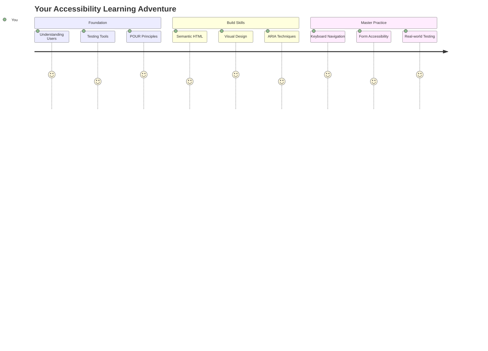

## Câu hỏi trước bài giảng
[Câu hỏi trước bài giảng](https://ff-quizzes.netlify.app/web/)

> Sức mạnh của Web nằm ở tính phổ quát của nó. Việc mọi người đều có thể truy cập, bất kể khuyết tật, là một khía cạnh thiết yếu.
>
> \- Sir Timothy Berners-Lee, Giám đốc W3C và người phát minh ra World Wide Web

Đây là điều có thể khiến bạn ngạc nhiên: khi bạn xây dựng các trang web dễ tiếp cận, bạn không chỉ giúp đỡ những người khuyết tật—mà thực sự bạn đang làm cho web trở nên tốt hơn cho tất cả mọi người!

Bạn có bao giờ để ý những đoạn đường dốc ở góc phố không? Ban đầu chúng được thiết kế cho xe lăn, nhưng giờ đây chúng giúp người đi xe đẩy, nhân viên giao hàng với xe đẩy, du khách với hành lý kéo, và cả người đi xe đạp nữa. Đó chính là cách thiết kế web dễ tiếp cận hoạt động—những giải pháp giúp một nhóm thường sẽ mang lại lợi ích cho tất cả mọi người. Thật tuyệt phải không?

Trong bài học này, chúng ta sẽ khám phá cách tạo ra các trang web thực sự hoạt động cho tất cả mọi người, bất kể họ duyệt web như thế nào. Bạn sẽ tìm hiểu các kỹ thuật thực tế đã được tích hợp trong các tiêu chuẩn web, thực hành với các công cụ kiểm tra, và thấy cách khả năng tiếp cận làm cho các trang web của bạn dễ sử dụng hơn cho tất cả người dùng.

Kết thúc bài học này, bạn sẽ tự tin để biến khả năng tiếp cận thành một phần tự nhiên trong quy trình phát triển của mình. Sẵn sàng khám phá cách những lựa chọn thiết kế chu đáo có thể mở rộng web cho hàng tỷ người dùng? Hãy bắt đầu nào!

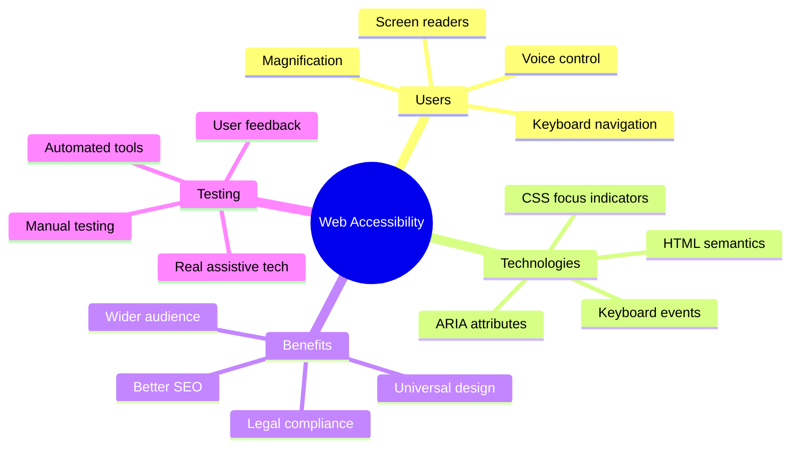

> Bạn có thể học bài này trên [Microsoft Learn](https://docs.microsoft.com/learn/modules/web-development-101/accessibility/?WT.mc_id=academic-77807-sagibbon)!

## Hiểu về Công nghệ Hỗ trợ

Trước khi chúng ta bắt đầu viết mã, hãy dành một chút thời gian để hiểu cách những người có khả năng khác nhau thực sự trải nghiệm web. Đây không chỉ là lý thuyết—hiểu các mô hình điều hướng thực tế này sẽ giúp bạn trở thành một nhà phát triển tốt hơn nhiều!

Công nghệ hỗ trợ là những công cụ tuyệt vời giúp người khuyết tật tương tác với các trang web theo những cách có thể khiến bạn ngạc nhiên. Một khi bạn hiểu cách các công nghệ này hoạt động, việc tạo ra trải nghiệm web dễ tiếp cận sẽ trở nên trực quan hơn nhiều. Nó giống như học cách nhìn mã của bạn qua con mắt của người khác.

### Trình đọc màn hình

[Trình đọc màn hình](https://en.wikipedia.org/wiki/Screen_reader) là những công nghệ khá tinh vi chuyển đổi văn bản kỹ thuật số thành âm thanh hoặc đầu ra chữ nổi. Mặc dù chúng chủ yếu được sử dụng bởi những người khiếm thị, nhưng chúng cũng rất hữu ích cho người dùng có các khuyết tật học tập như chứng khó đọc.

Tôi thích nghĩ về trình đọc màn hình như một người kể chuyện thông minh đang đọc sách cho bạn. Nó đọc nội dung thành tiếng theo thứ tự logic, thông báo các yếu tố tương tác như "nút" hoặc "liên kết," và cung cấp các phím tắt để di chuyển quanh trang. Nhưng đây là điều—trình đọc màn hình chỉ có thể hoạt động tốt nếu chúng ta xây dựng các trang web với cấu trúc đúng và nội dung có ý nghĩa. Đó là nơi bạn, với tư cách là nhà phát triển, đóng vai trò quan trọng!

**Các trình đọc màn hình phổ biến trên các nền tảng:**
- **Windows**: [NVDA](https://www.nvaccess.org/about-nvda/) (miễn phí và phổ biến nhất), [JAWS](https://webaim.org/articles/jaws/), [Narrator](https://support.microsoft.com/windows/complete-guide-to-narrator-e4397a0d-ef4f-b386-d8ae-c172f109bdb1/?WT.mc_id=academic-77807-sagibbon) (tích hợp sẵn)
- **macOS/iOS**: [VoiceOver](https://support.apple.com/guide/voiceover/welcome/10) (tích hợp sẵn và rất mạnh mẽ)
- **Android**: [TalkBack](https://support.google.com/accessibility/android/answer/6283677) (tích hợp sẵn)
- **Linux**: [Orca](https://wiki.gnome.org/Projects/Orca) (miễn phí và mã nguồn mở)

**Cách trình đọc màn hình điều hướng nội dung web:**

Trình đọc màn hình cung cấp nhiều phương pháp điều hướng giúp việc duyệt web hiệu quả hơn cho người dùng có kinh nghiệm:
- **Đọc tuần tự**: Đọc nội dung từ trên xuống dưới, giống như đọc một cuốn sách
- **Điều hướng theo điểm mốc**: Nhảy giữa các phần của trang (đầu trang, điều hướng, chính, chân trang)
- **Điều hướng theo tiêu đề**: Nhảy giữa các tiêu đề để hiểu cấu trúc trang
- **Danh sách liên kết**: Tạo danh sách tất cả các liên kết để truy cập nhanh
- **Điều khiển biểu mẫu**: Điều hướng trực tiếp giữa các trường nhập liệu và nút

> 💡 **Điều này khiến tôi rất ngạc nhiên**: 68% người dùng trình đọc màn hình chủ yếu điều hướng bằng tiêu đề ([Khảo sát WebAIM](https://webaim.org/projects/screenreadersurvey9/#finding)). Điều này có nghĩa là cấu trúc tiêu đề của bạn giống như một bản đồ cho người dùng—khi bạn làm đúng, bạn thực sự đang giúp mọi người tìm đường quanh nội dung của bạn nhanh hơn!

### Xây dựng quy trình kiểm tra của bạn

Đây là tin tốt—kiểm tra khả năng tiếp cận hiệu quả không cần phải quá phức tạp! Bạn sẽ muốn kết hợp các công cụ tự động (chúng rất tuyệt vời trong việc phát hiện các vấn đề rõ ràng) với một số kiểm tra thực tế. Đây là cách tiếp cận có hệ thống mà tôi thấy bắt được nhiều vấn đề nhất mà không tốn quá nhiều thời gian:

**Quy trình kiểm tra thủ công cơ bản:**

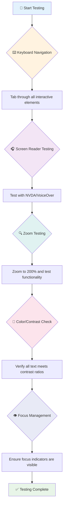

**Danh sách kiểm tra từng bước:**
1. **Điều hướng bằng bàn phím**: Chỉ sử dụng Tab, Shift+Tab, Enter, Space, và các phím mũi tên
2. **Kiểm tra trình đọc màn hình**: Bật NVDA, VoiceOver, hoặc Narrator và điều hướng với mắt nhắm
3. **Kiểm tra phóng to**: Kiểm tra ở mức phóng to 200% và 400%
4. **Xác minh độ tương phản màu sắc**: Kiểm tra tất cả văn bản và các thành phần giao diện người dùng
5. **Kiểm tra chỉ báo tiêu điểm**: Đảm bảo tất cả các yếu tố tương tác có trạng thái tiêu điểm rõ ràng

✅ **Bắt đầu với Lighthouse**: Mở DevTools của trình duyệt, chạy kiểm tra khả năng tiếp cận bằng Lighthouse, sau đó sử dụng kết quả để tập trung vào các khu vực kiểm tra thủ công.

### Công cụ phóng to và phóng đại

Bạn biết cách bạn đôi khi phóng to trên điện thoại khi văn bản quá nhỏ, hoặc nheo mắt nhìn màn hình laptop dưới ánh sáng mặt trời? Nhiều người dùng dựa vào các công cụ phóng đại để làm cho nội dung dễ đọc mỗi ngày. Điều này bao gồm những người có thị lực kém, người lớn tuổi, và bất kỳ ai từng cố đọc một trang web ngoài trời.

Công nghệ phóng to hiện đại đã phát triển vượt xa việc chỉ làm mọi thứ lớn hơn. Hiểu cách các công cụ này hoạt động sẽ giúp bạn tạo ra các thiết kế đáp ứng vẫn giữ được chức năng và hấp dẫn ở bất kỳ mức độ phóng đại nào.

**Khả năng phóng to của trình duyệt hiện đại:**
- **Phóng to trang**: Phóng to tất cả nội dung theo tỷ lệ (văn bản, hình ảnh, bố cục) - đây là phương pháp ưu tiên
- **Phóng to chỉ văn bản**: Tăng kích thước phông chữ trong khi giữ nguyên bố cục ban đầu
- **Phóng to bằng cách chụm tay**: Hỗ trợ cử chỉ trên thiết bị di động để phóng đại tạm thời
- **Hỗ trợ trình duyệt**: Tất cả các trình duyệt hiện đại hỗ trợ phóng to lên đến 500% mà không làm hỏng chức năng

**Phần mềm phóng đại chuyên dụng:**
- **Windows**: [Magnifier](https://support.microsoft.com/windows/use-magnifier-to-make-things-on-the-screen-easier-to-see-414948ba-8b1c-d3bd-8615-0e5e32204198) (tích hợp sẵn), [ZoomText](https://www.freedomscientific.com/training/zoomtext/getting-started/)
- **macOS/iOS**: [Zoom](https://www.apple.com/accessibility/mac/vision/) (tích hợp sẵn với các tính năng nâng cao)

> ⚠️ **Cân nhắc thiết kế**: WCAG yêu cầu nội dung vẫn phải hoạt động khi được phóng to đến 200%. Ở mức này, cuộn ngang nên được giảm thiểu, và tất cả các yếu tố tương tác vẫn phải dễ tiếp cận.

✅ **Kiểm tra thiết kế đáp ứng của bạn**: Phóng to trình duyệt của bạn lên 200% và 400%. Bố cục của bạn có thích ứng một cách mượt mà không? Bạn có thể truy cập tất cả các chức năng mà không cần cuộn quá nhiều không?

## Công cụ Kiểm Tra Khả Năng Tiếp Cận Hiện Đại

Bây giờ bạn đã hiểu cách mọi người điều hướng web với công nghệ hỗ trợ, hãy khám phá các công cụ giúp bạn xây dựng và kiểm tra các trang web dễ tiếp cận.

Hãy nghĩ như thế này: các công cụ tự động rất tốt trong việc phát hiện các vấn đề rõ ràng (như thiếu văn bản thay thế), trong khi kiểm tra thực tế giúp bạn đảm bảo trang web của mình dễ sử dụng trong thế giới thực. Kết hợp cả hai, bạn sẽ tự tin rằng các trang web của mình hoạt động cho tất cả mọi người.

### Kiểm tra độ tương phản màu sắc

Đây là tin tốt: độ tương phản màu sắc là một trong những vấn đề khả năng tiếp cận phổ biến nhất, nhưng cũng là một trong những vấn đề dễ khắc phục nhất. Độ tương phản tốt mang lại lợi ích cho tất cả mọi người—từ người dùng có thị lực kém đến những người cố đọc điện thoại của họ trên bãi biển.

**Yêu cầu độ tương phản của WCAG:**

| Loại văn bản | WCAG AA (Tối thiểu) | WCAG AAA (Nâng cao) |
|--------------|---------------------|---------------------|
| **Văn bản thường** (dưới 18pt) | Tỷ lệ tương phản 4.5:1 | Tỷ lệ tương phản 7:1 |
| **Văn bản lớn** (18pt+ hoặc 14pt+ đậm) | Tỷ lệ tương phản 3:1 | Tỷ lệ tương phản 4.5:1 |
| **Thành phần giao diện người dùng** (nút, viền biểu mẫu) | Tỷ lệ tương phản 3:1 | Tỷ lệ tương phản 3:1 |

**Công cụ kiểm tra cần thiết:**
- [Colour Contrast Analyser](https://www.tpgi.com/color-contrast-checker/) - Ứng dụng máy tính với công cụ chọn màu
- [WebAIM Contrast Checker](https://webaim.org/resources/contrastchecker/) - Công cụ trực tuyến với phản hồi tức thì
- [Stark](https://www.getstark.co/) - Plugin công cụ thiết kế cho Figma, Sketch, Adobe XD
- [Accessible Colors](https://accessible-colors.com/) - Tìm bảng màu dễ tiếp cận

✅ **Xây dựng bảng màu tốt hơn**: Bắt đầu với màu thương hiệu của bạn và sử dụng các công cụ kiểm tra độ tương phản để tạo các biến thể dễ tiếp cận. Ghi lại chúng như các token màu dễ tiếp cận trong hệ thống thiết kế của bạn.

### Kiểm tra khả năng tiếp cận toàn diện

Kiểm tra khả năng tiếp cận hiệu quả nhất là kết hợp nhiều phương pháp. Không có công cụ nào bắt được tất cả mọi thứ, vì vậy xây dựng một quy trình kiểm tra với các phương pháp khác nhau đảm bảo độ phủ toàn diện.

**Kiểm tra dựa trên trình duyệt (tích hợp trong DevTools):**
- **Chrome/Edge**: Kiểm tra khả năng tiếp cận bằng Lighthouse + bảng Accessibility
- **Firefox**: Accessibility Inspector với chế độ xem cây chi tiết
- **Safari**: Tab Audit trong Web Inspector với mô phỏng VoiceOver

**Tiện ích mở rộng kiểm tra chuyên nghiệp:**
- [axe DevTools](https://www.deque.com/axe/devtools/) - Công cụ kiểm tra tự động tiêu chuẩn ngành
- [WAVE](https://wave.webaim.org/extension/) - Phản hồi trực quan với đánh dấu lỗi
- [Accessibility Insights](https://accessibilityinsights.io/) - Bộ công cụ kiểm tra toàn diện của Microsoft

**Tích hợp dòng lệnh và CI/CD:**
- [axe-core](https://github.com/dequelabs/axe-core) - Thư viện JavaScript để kiểm tra tự động
- [Pa11y](https://pa11y.org/) - Công cụ kiểm tra khả năng tiếp cận dòng lệnh
- [Lighthouse CI](https://github.com/GoogleChrome/lighthouse-ci) - Chấm điểm khả năng tiếp cận tự động

> 🎯 **Mục tiêu kiểm tra**: Nhắm đến điểm số khả năng tiếp cận Lighthouse từ 95+ làm cơ sở. Hãy nhớ rằng, các công cụ tự động chỉ bắt được khoảng 30-40% vấn đề về khả năng tiếp cận—kiểm tra thủ công vẫn rất cần thiết!

### 🧠 **Kiểm tra kỹ năng: Sẵn sàng tìm vấn đề?**

**Hãy xem bạn cảm thấy thế nào về việc kiểm tra khả năng tiếp cận:**
- Phương pháp kiểm tra nào hiện tại có vẻ dễ tiếp cận nhất với bạn?
- Bạn có thể tưởng tượng việc sử dụng điều hướng chỉ bằng bàn phím trong một ngày không?
- Một rào cản về khả năng tiếp cận mà bạn từng gặp phải trên mạng là gì?

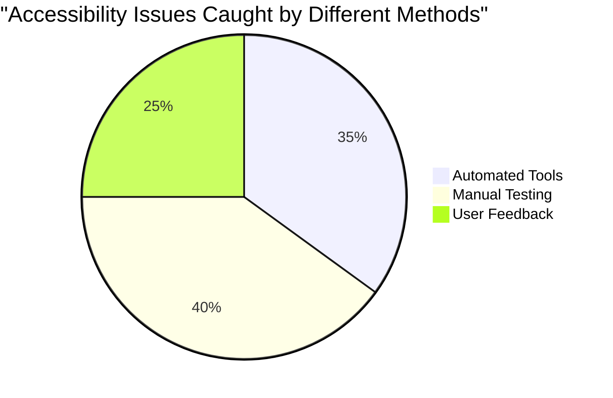

> **Tăng cường sự tự tin**: Các chuyên gia kiểm tra khả năng tiếp cận sử dụng chính xác sự kết hợp các phương pháp này. Bạn đang học các thực hành tiêu chuẩn ngành!

## Xây dựng Khả Năng Tiếp Cận Từ Đầu

Chìa khóa để thành công trong việc tạo ra khả năng tiếp cận là xây dựng nó vào nền tảng ngay từ ngày đầu tiên. Tôi biết rất dễ bị cám dỗ nghĩ rằng "Tôi sẽ thêm khả năng tiếp cận sau," nhưng điều đó giống như cố gắng thêm một đoạn đường dốc vào một ngôi nhà sau khi nó đã được xây dựng. Có thể? Có. Dễ dàng? Không thực sự.

Hãy nghĩ về khả năng tiếp cận như việc lập kế hoạch cho một ngôi nhà—sẽ dễ dàng hơn nhiều để bao gồm khả năng tiếp cận xe lăn trong kế hoạch kiến trúc ban đầu của bạn hơn là sửa đổi mọi thứ sau này.

### Nguyên tắc POUR: Nền tảng khả năng tiếp cận của bạn

Các Nguyên tắc Hướng dẫn Nội dung Web (WCAG) được xây dựng xung quanh bốn nguyên tắc cơ bản tạo thành POUR. Đừng lo—đây không phải là những khái niệm học thuật khô khan! Chúng thực sự là các hướng dẫn thực tế để tạo nội dung hoạt động cho tất cả mọi người.

Một khi bạn hiểu nguyên tắc POUR, việc đưa ra các quyết định về khả năng tiếp cận sẽ trở nên trực quan hơn nhiều. Nó giống như có một danh sách kiểm tra tinh thần hướng dẫn các lựa chọn thiết kế của bạn. Hãy cùng phân tích:

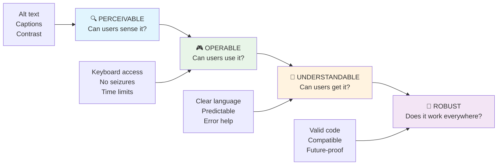

**🔍 Có thể nhận thức được**: Thông tin phải được trình bày theo cách người dùng có thể nhận thức thông qua các giác quan của họ

- Cung cấp các thay thế văn bản cho nội dung không phải văn bản (hình ảnh, video, âm thanh)
- Đảm bảo độ tương phản màu sắc đủ cho tất cả văn bản và các thành phần giao diện người dùng
- Cung cấp phụ đề và bản ghi cho nội dung đa phương tiện
- Thiết kế nội dung vẫn hoạt động khi được phóng to lên đến 200%
- Sử dụng nhiều đặc điểm cảm giác (không chỉ màu sắc) để truyền tải thông tin

**🎮 Có thể vận hành**: Tất cả các thành phần giao diện phải có thể vận hành thông qua các phương pháp nhập liệu có sẵn

- Làm cho tất cả chức năng có thể truy cập thông qua điều hướng bằng bàn phím
- Cung cấp cho người dùng đủ thời gian để đọc và tương tác với nội dung
- Tránh nội dung gây co giật hoặc rối loạn tiền đình
- Giúp người dùng điều hướng hiệu quả với cấu trúc rõ ràng và các điểm mốc
- Đảm bảo các yếu tố tương tác có kích thước mục tiêu đủ lớn (tối thiểu 44px)

**📖 Có thể hiểu được**: Thông tin và hoạt động giao diện phải rõ ràng và dễ hiểu

- Sử dụng ngôn ngữ rõ ràng, đơn giản phù hợp với đối tượng của bạn
- Đảm bảo nội dung xuất hiện và hoạt động theo cách có thể dự đoán và nhất quán
- Cung cấp hướng dẫn rõ ràng và thông báo lỗi cho đầu vào của người dùng
- Giúp người dùng hiểu và sửa lỗi trong biểu mẫu
- Tổ chức nội dung với thứ tự đọc logic và hệ thống phân cấp thông tin

**💪 Mạnh mẽ
- **Kiểm tra trên các trình duyệt, thiết bị và công cụ hỗ trợ khác nhau**
- **Cấu trúc nội dung sao cho nó hoạt động tốt ngay cả khi các tính năng nâng cao không được hỗ trợ**

### 🎯 **Kiểm tra nguyên tắc POUR: Làm cho nó hiệu quả**

**Suy ngẫm nhanh về nền tảng:**
- Bạn có thể nghĩ đến một tính năng trang web nào vi phạm từng nguyên tắc POUR không?
- Nguyên tắc nào cảm thấy tự nhiên nhất đối với bạn với tư cách là một nhà phát triển?
- Những nguyên tắc này có thể cải thiện thiết kế cho mọi người, không chỉ người dùng khuyết tật, như thế nào?

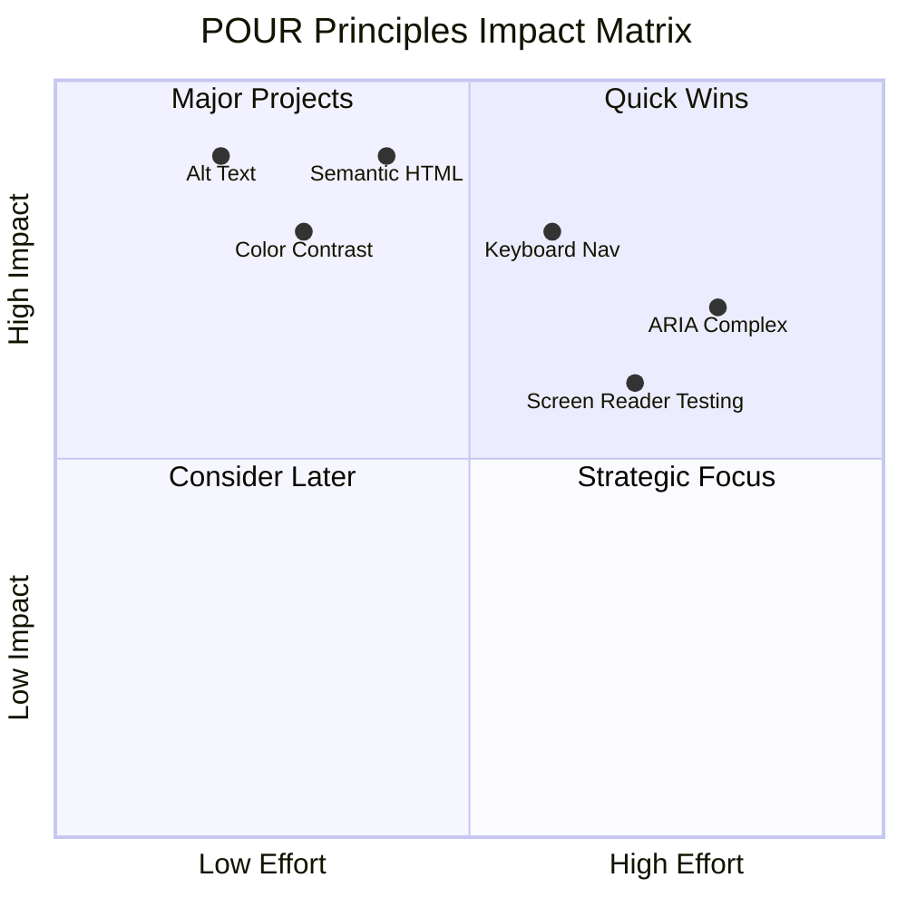

> **Nhớ rằng**: Bắt đầu với những cải tiến có tác động cao nhưng ít tốn công sức. HTML ngữ nghĩa và văn bản thay thế (alt text) mang lại lợi ích lớn nhất về khả năng truy cập với ít nỗ lực nhất!

## Tạo thiết kế hình ảnh dễ tiếp cận

Thiết kế hình ảnh tốt và khả năng truy cập luôn song hành. Khi bạn thiết kế với khả năng truy cập trong tâm trí, bạn thường phát hiện ra rằng những hạn chế này dẫn đến các giải pháp sạch sẽ, thanh lịch hơn, mang lại lợi ích cho tất cả người dùng.

Hãy cùng khám phá cách tạo ra các thiết kế hấp dẫn về mặt hình ảnh mà vẫn phù hợp với mọi người, bất kể khả năng thị giác của họ hay điều kiện mà họ đang xem nội dung của bạn.

### Chiến lược màu sắc và khả năng truy cập hình ảnh

Màu sắc rất mạnh mẽ trong việc truyền đạt thông tin, nhưng nó không bao giờ nên là cách duy nhất để bạn truyền tải thông tin quan trọng. Thiết kế vượt ra ngoài màu sắc tạo ra trải nghiệm mạnh mẽ hơn, bao gồm hơn và hoạt động trong nhiều tình huống hơn.

**Thiết kế cho sự khác biệt về thị giác màu sắc:**

Khoảng 8% nam giới và 0,5% phụ nữ có một dạng khác biệt về thị giác màu sắc (thường được gọi là "mù màu"). Các loại phổ biến nhất là:
- **Deuteranopia**: Khó phân biệt màu đỏ và xanh lá cây
- **Protanopia**: Màu đỏ xuất hiện mờ hơn
- **Tritanopia**: Khó phân biệt màu xanh dương và vàng (hiếm gặp)

**Chiến lược màu sắc bao gồm:**

```css
/* ❌ Bad: Using only color to indicate status */
.error { color: red; }
.success { color: green; }

/* ✅ Good: Color plus icons and context */
.error {
  color: #d32f2f;
  border-left: 4px solid #d32f2f;
}
.error::before {
  content: "⚠️";
  margin-right: 8px;
}

.success {
  color: #2e7d32;
  border-left: 4px solid #2e7d32;
}
.success::before {
  content: "✅";
  margin-right: 8px;
}
```

**Vượt qua yêu cầu cơ bản về độ tương phản:**
- Kiểm tra lựa chọn màu sắc của bạn với các trình mô phỏng mù màu
- Sử dụng mẫu, kết cấu hoặc hình dạng cùng với mã hóa màu sắc
- Đảm bảo trạng thái tương tác vẫn có thể phân biệt được mà không cần màu sắc
- Xem xét cách thiết kế của bạn trông trong chế độ độ tương phản cao

✅ **Kiểm tra khả năng truy cập màu sắc của bạn**: Sử dụng các công cụ như [Coblis](https://www.color-blindness.com/coblis-color-blindness-simulator/) để xem trang web của bạn xuất hiện như thế nào đối với người dùng có các loại thị giác màu sắc khác nhau.

### Chỉ báo tiêu điểm và thiết kế tương tác

Chỉ báo tiêu điểm là tương đương kỹ thuật số của con trỏ—chúng hiển thị cho người dùng bàn phím vị trí của họ trên trang. Chỉ báo tiêu điểm được thiết kế tốt nâng cao trải nghiệm cho mọi người bằng cách làm cho các tương tác trở nên rõ ràng và dễ dự đoán.

**Thực hành tốt nhất cho chỉ báo tiêu điểm hiện đại:**

```css
/* Enhanced focus styles that work across browsers */
button:focus-visible {
  outline: 2px solid #0066cc;
  outline-offset: 2px;
  box-shadow: 0 0 0 4px rgba(0, 102, 204, 0.25);
}

/* Remove focus outline for mouse users, preserve for keyboard users */
button:focus:not(:focus-visible) {
  outline: none;
}

/* Focus-within for complex components */
.card:focus-within {
  box-shadow: 0 0 0 3px rgba(74, 144, 164, 0.5);
  border-color: #4A90A4;
}

/* Ensure focus indicators meet contrast requirements */
.custom-focus:focus-visible {
  outline: 3px solid #ffffff;
  outline-offset: 2px;
  box-shadow: 0 0 0 6px #000000;
}
```

**Yêu cầu đối với chỉ báo tiêu điểm:**
- **Hiển thị rõ ràng**: Phải có tỷ lệ tương phản ít nhất 3:1 với các yếu tố xung quanh
- **Độ rộng**: Độ dày tối thiểu 2px xung quanh toàn bộ yếu tố
- **Duy trì**: Nên hiển thị rõ ràng cho đến khi tiêu điểm chuyển sang nơi khác
- **Phân biệt**: Phải khác biệt rõ ràng với các trạng thái UI khác

> 💡 **Mẹo thiết kế**: Chỉ báo tiêu điểm tuyệt vời thường sử dụng sự kết hợp giữa đường viền, bóng hộp và thay đổi màu sắc để đảm bảo hiển thị trên các nền và ngữ cảnh khác nhau.

✅ **Kiểm tra chỉ báo tiêu điểm**: Nhấn Tab qua trang web của bạn và ghi chú lại các yếu tố có chỉ báo tiêu điểm rõ ràng. Có yếu tố nào khó nhìn thấy hoặc hoàn toàn thiếu không?

### HTML ngữ nghĩa: Nền tảng của khả năng truy cập

HTML ngữ nghĩa giống như cung cấp cho các công nghệ hỗ trợ một hệ thống GPS cho trang web của bạn. Khi bạn sử dụng đúng các yếu tố HTML cho mục đích của chúng, bạn đang cung cấp cho trình đọc màn hình, bàn phím và các công cụ khác một bản đồ chi tiết để giúp người dùng điều hướng hiệu quả.

Đây là một phép so sánh thực sự khiến tôi hiểu rõ: HTML ngữ nghĩa là sự khác biệt giữa một thư viện được tổ chức tốt với các danh mục rõ ràng và biển báo hữu ích so với một nhà kho nơi sách bị rải rác ngẫu nhiên. Cả hai nơi đều có cùng sách, nhưng bạn muốn tìm kiếm thứ gì đó ở đâu? Chính xác!

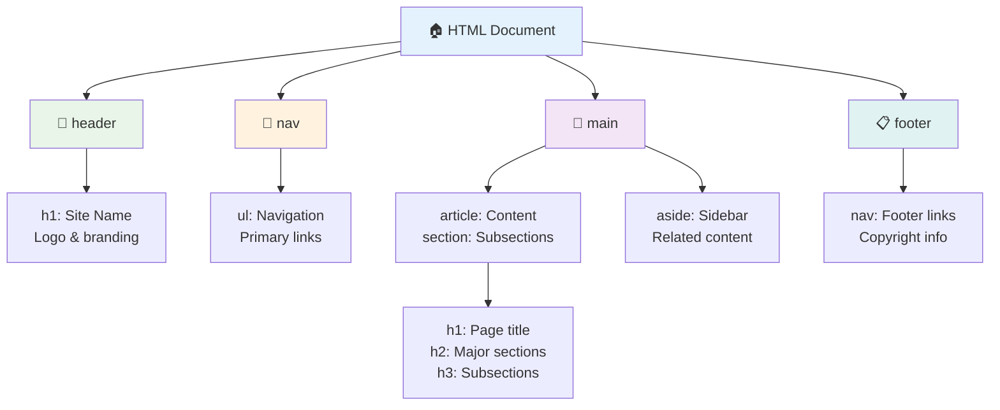

**Các khối xây dựng cấu trúc trang dễ truy cập:**

```html
<!-- Landmark elements provide page navigation structure -->
<header>
  <h1>Your Site Name</h1>
  <nav aria-label="Main navigation">
    <ul>
      <li><a href="/home">Home</a></li>
      <li><a href="/about">About</a></li>
      <li><a href="/services">Services</a></li>
    </ul>
  </nav>
</header>

<main>
  <article>
    <header>
      <h1>Article Title</h1>
      <p>Published on <time datetime="2024-10-14">October 14, 2024</time></p>
    </header>
    
    <section>
      <h2>First Section</h2>
      <p>Content that relates to this section...</p>
    </section>
    
    <section>
      <h2>Second Section</h2>
      <p>More related content...</p>
    </section>
  </article>
  
  <aside>
    <h2>Related Links</h2>
    <nav aria-label="Related articles">
      <ul>
        <li><a href="/related-1">First related article</a></li>
        <li><a href="/related-2">Second related article</a></li>
      </ul>
    </nav>
  </aside>
</main>

<footer>
  <p>&copy; 2024 Your Site Name. All rights reserved.</p>
  <nav aria-label="Footer links">
    <ul>
      <li><a href="/privacy">Privacy Policy</a></li>
      <li><a href="/contact">Contact Us</a></li>
    </ul>
  </nav>
</footer>
```

**Tại sao HTML ngữ nghĩa biến đổi khả năng truy cập:**

| Yếu tố ngữ nghĩa | Mục đích | Lợi ích cho trình đọc màn hình |
|------------------|---------|----------------------|
| `<header>` | Tiêu đề trang hoặc phần | "Banner landmark" - điều hướng nhanh đến đầu trang |
| `<nav>` | Liên kết điều hướng | "Navigation landmark" - danh sách các phần điều hướng |
| `<main>` | Nội dung chính của trang | "Main landmark" - bỏ qua trực tiếp đến nội dung |
| `<article>` | Nội dung tự chứa | Thông báo ranh giới bài viết |
| `<section>` | Nhóm nội dung theo chủ đề | Cung cấp cấu trúc nội dung |
| `<aside>` | Nội dung bên liên quan | "Complementary landmark" |
| `<footer>` | Chân trang hoặc phần | "Contentinfo landmark" |

**Siêu năng lực của trình đọc màn hình với HTML ngữ nghĩa:**
- **Điều hướng theo landmark**: Nhảy giữa các phần chính của trang ngay lập tức
- **Phác thảo tiêu đề**: Tạo bảng nội dung từ cấu trúc tiêu đề của bạn
- **Danh sách yếu tố**: Tạo danh sách tất cả các liên kết, nút hoặc điều khiển biểu mẫu
- **Nhận thức ngữ cảnh**: Hiểu mối quan hệ giữa các phần nội dung

> 🎯 **Kiểm tra nhanh**: Thử điều hướng trang web của bạn bằng trình đọc màn hình sử dụng phím tắt landmark (D cho landmark, H cho tiêu đề, K cho liên kết trong NVDA/JAWS). Điều hướng có hợp lý không?

### 🏗️ **Kiểm tra sự thành thạo HTML ngữ nghĩa: Xây dựng nền tảng vững chắc**

**Hãy đánh giá sự hiểu biết của bạn về ngữ nghĩa:**
- Bạn có thể xác định các landmark trên một trang web chỉ bằng cách nhìn vào HTML không?
- Bạn sẽ giải thích sự khác biệt giữa `<section>` và `<div>` cho một người bạn như thế nào?
- Điều đầu tiên bạn sẽ kiểm tra nếu một người dùng trình đọc màn hình báo cáo vấn đề điều hướng là gì?

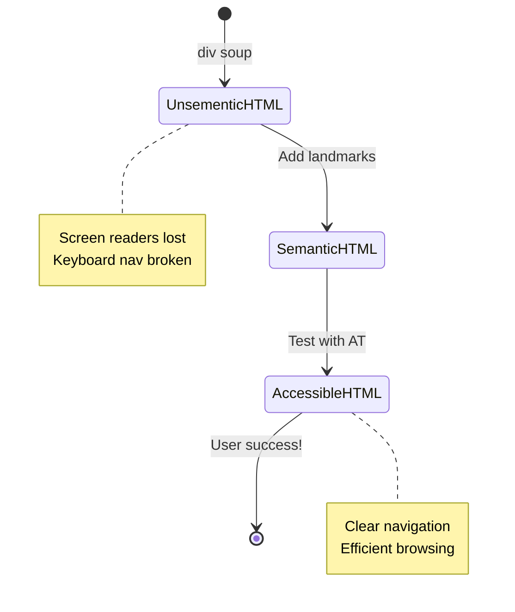

> **Thông tin chuyên sâu**: HTML ngữ nghĩa tốt tự động giải quyết khoảng 70% vấn đề về khả năng truy cập. Làm chủ nền tảng này và bạn đã đi được một chặng đường dài!

✅ **Kiểm tra cấu trúc ngữ nghĩa của bạn**: Sử dụng bảng Accessibility trong DevTools của trình duyệt để xem cây truy cập và đảm bảo đánh dấu của bạn tạo ra một cấu trúc hợp lý.

### Hệ thống tiêu đề: Tạo phác thảo nội dung hợp lý

Tiêu đề cực kỳ quan trọng đối với nội dung dễ truy cập—chúng giống như xương sống giữ mọi thứ lại với nhau. Người dùng trình đọc màn hình dựa rất nhiều vào tiêu đề để hiểu và điều hướng nội dung của bạn. Hãy nghĩ về nó như cung cấp một bảng nội dung cho trang của bạn.

**Đây là quy tắc vàng cho tiêu đề:**
Không bao giờ bỏ qua cấp độ. Luôn tiến triển hợp lý từ `<h1>` đến `<h2>` đến `<h3>`, và cứ thế. Nhớ lại việc tạo phác thảo ở trường học? Nguyên tắc hoàn toàn giống nhau—bạn sẽ không nhảy từ "I. Điểm chính" thẳng đến "C. Điểm phụ-phụ" mà không có "A. Điểm phụ" ở giữa, đúng không?

**Ví dụ về cấu trúc tiêu đề hoàn hảo:**

```html
<!-- ✅ Excellent: Logical, hierarchical progression -->
<main>
  <h1>Complete Guide to Web Accessibility</h1>
  
  <section>
    <h2>Understanding Screen Readers</h2>
    <p>Introduction to screen reader technology...</p>
    
    <h3>Popular Screen Reader Software</h3>
    <p>NVDA, JAWS, and VoiceOver comparison...</p>
    
    <h3>Testing with Screen Readers</h3>
    <p>Step-by-step testing instructions...</p>
  </section>
  
  <section>
    <h2>Color and Contrast Guidelines</h2>
    <p>Designing with sufficient contrast...</p>
    
    <h3>WCAG Contrast Requirements</h3>
    <p>Understanding the different contrast levels...</p>
    
    <h3>Testing Tools and Techniques</h3>
    <p>Tools for verifying contrast ratios...</p>
  </section>
</main>
```

```html
<!-- ❌ Problematic: Skipping levels, inconsistent structure -->
<h1>Page Title</h1>
<h3>Subsection</h3> <!-- Skipped h2 -->
<h2>This should come before h3</h2>
<h1>Another main heading?</h1> <!-- Multiple h1s -->
```

**Thực hành tốt nhất cho tiêu đề:**
- **Một `<h1>` mỗi trang**: Thường là tiêu đề chính của trang hoặc tiêu đề nội dung chính
- **Tiến triển hợp lý**: Không bao giờ bỏ qua cấp độ (h1 → h2 → h3, không phải h1 → h3)
- **Nội dung mô tả**: Làm cho tiêu đề có ý nghĩa khi được đọc ngoài ngữ cảnh
- **Phong cách hình ảnh với CSS**: Sử dụng CSS cho giao diện, cấp độ HTML cho cấu trúc

**Thống kê điều hướng trình đọc màn hình:**
- 68% người dùng trình đọc màn hình điều hướng bằng tiêu đề ([Khảo sát WebAIM](https://webaim.org/projects/screenreadersurvey9/#finding))
- Người dùng mong đợi tìm thấy một phác thảo tiêu đề hợp lý
- Tiêu đề cung cấp cách nhanh nhất để hiểu cấu trúc trang

> 💡 **Mẹo chuyên nghiệp**: Sử dụng tiện ích mở rộng trình duyệt như "HeadingsMap" để hình dung cấu trúc tiêu đề của bạn. Nó nên đọc như một bảng nội dung được tổ chức tốt.

✅ **Kiểm tra cấu trúc tiêu đề của bạn**: Sử dụng điều hướng tiêu đề của trình đọc màn hình (phím H trong NVDA) để nhảy qua các tiêu đề của bạn. Tiến trình có kể câu chuyện về nội dung của bạn một cách hợp lý không?

### Kỹ thuật nâng cao về khả năng truy cập hình ảnh

Ngoài những điều cơ bản về độ tương phản và màu sắc, có những kỹ thuật tinh vi giúp tạo ra trải nghiệm hình ảnh thực sự bao gồm. Những phương pháp này đảm bảo nội dung của bạn hoạt động trong các điều kiện xem khác nhau và công nghệ hỗ trợ.

**Chiến lược giao tiếp hình ảnh thiết yếu:**

- **Phản hồi đa phương thức**: Kết hợp tín hiệu hình ảnh, văn bản và đôi khi âm thanh
- **Tiết lộ tiến bộ**: Trình bày thông tin thành các phần dễ tiêu hóa
- **Mẫu tương tác nhất quán**: Sử dụng các quy ước UI quen thuộc
- **Kiểu chữ đáp ứng**: Tự động điều chỉnh kích thước văn bản trên các thiết bị
- **Trạng thái tải và lỗi**: Cung cấp phản hồi rõ ràng cho tất cả hành động của người dùng

**Tiện ích CSS để tăng cường khả năng truy cập:**

```css
/* Screen reader only text - visually hidden but accessible */
.sr-only {
  position: absolute;
  width: 1px;
  height: 1px;
  padding: 0;
  margin: -1px;
  overflow: hidden;
  clip: rect(0, 0, 0, 0);
  white-space: nowrap;
  border: 0;
}

/* Skip link for keyboard navigation */
.skip-link {
  position: absolute;
  top: -40px;
  left: 6px;
  background: #000000;
  color: #ffffff;
  padding: 8px 16px;
  text-decoration: none;
  border-radius: 4px;
  font-weight: bold;
  transition: top 0.3s ease;
  z-index: 1000;
}

.skip-link:focus {
  top: 6px;
}

/* Reduced motion respect */
@media (prefers-reduced-motion: reduce) {
  .skip-link {
    transition: none;
  }
  
  * {
    animation-duration: 0.01ms !important;
    animation-iteration-count: 1 !important;
    transition-duration: 0.01ms !important;
  }
}

/* High contrast mode support */
@media (prefers-contrast: high) {
  .button {
    border: 2px solid;
  }
}
```

> 🎯 **Mẫu khả năng truy cập**: "Liên kết bỏ qua" là điều cần thiết cho người dùng bàn phím. Nó nên là yếu tố có thể tập trung đầu tiên trên trang của bạn và nhảy trực tiếp đến khu vực nội dung chính.

✅ **Thực hiện bỏ qua điều hướng**: Thêm liên kết bỏ qua vào các trang của bạn và kiểm tra chúng bằng cách nhấn Tab ngay khi trang tải. Chúng nên xuất hiện và cho phép bạn nhảy đến nội dung chính.

## Tạo văn bản liên kết có ý nghĩa

Liên kết về cơ bản là các đường cao tốc của web, nhưng văn bản liên kết được viết kém giống như có các biển báo đường chỉ ghi "Nơi" thay vì "Trung tâm Chicago." Không hữu ích chút nào, đúng không?

Đây là điều khiến tôi ngạc nhiên khi lần đầu tiên biết đến: trình đọc màn hình có thể trích xuất tất cả các liên kết từ một trang và hiển thị chúng dưới dạng một danh sách lớn. Hãy tưởng tượng nếu ai đó đưa cho bạn một danh bạ của mọi liên kết trên trang của bạn. Mỗi liên kết có ý nghĩa riêng không? Đó là bài kiểm tra mà văn bản liên kết của bạn cần vượt qua!

### Hiểu các mẫu điều hướng liên kết

Trình đọc màn hình cung cấp các tính năng điều hướng liên kết mạnh mẽ dựa trên văn bản liên kết được viết tốt:

**Phương pháp điều hướng liên kết:**
- **Đọc tuần tự**: Các liên kết được đọc trong ngữ cảnh như một phần của luồng nội dung
- **Tạo danh sách liên kết**: Tất cả các liên kết trên trang được biên soạn thành một danh bạ có thể tìm kiếm
- **Điều hướng nhanh**: Nhảy giữa các liên kết bằng phím tắt (K trong NVDA)
- **Chức năng tìm kiếm**: Tìm liên kết cụ thể bằng cách nhập văn bản một phần

**Tại sao ngữ cảnh lại quan trọng:**
Khi người dùng trình đọc màn hình tạo danh sách liên kết, họ thấy điều gì đó như thế này:
- "Tải xuống báo cáo"
- "Tìm hiểu thêm"
- "Nhấp vào đây"
- "Chính sách bảo mật"
- "Nhấp vào đây"

Chỉ có hai trong số các liên kết này cung cấp thông tin hữu ích khi được đọc ngoài ngữ cảnh!

> 📊 **Tác động đến người dùng**: Người dùng trình đọc màn hình quét danh sách liên kết để hiểu nội dung trang nhanh chóng. Văn bản liên kết chung chung buộc họ phải quay lại ngữ cảnh của từng liên kết, làm chậm đáng kể trải nghiệm duyệt web của họ.

### Những lỗi phổ biến về văn bản liên kết cần tránh

Hiểu những gì không hiệu quả giúp bạn nhận ra và khắc phục các vấn đề về khả năng truy cập trong nội dung hiện có.

**❌ Văn bản liên kết chung chung không cung cấp ngữ cảnh:**

```html
<!-- Meaningless when read from a link list -->
<p>Our sustainability efforts are detailed in our recent report. 
   <a href="/sustainability-2024.pdf">Click here</a> to view it.</p>

<!-- Repeated generic text throughout the page -->
<div class="article-card">
  <h3>Web Accessibility Guide</h3>
  <p>Learn the fundamentals...</p>
  <a href="/accessibility-guide">Read more</a>
</div>
<div class="article-card">
  <h3>Color Contrast Tips</h3>
  <p>Improve your design...</p>
  <a href="/color-contrast">Read more</a>
</div>

<!-- URLs as link text (difficult for screen readers to announce) -->
<p>Visit https://www.w3.org/WAI/WCAG21/quickref/ for WCAG guidelines.</p>

<!-- Vague action words -->
<a href="/contact">Go</a> | <a href="/about">See</a> | <a href="/help">View</a>
```

**Tại sao các mẫu này thất bại:**
- **"Nhấp vào đây"** không nói gì về điểm đến
- **"Đọc thêm"** lặp lại nhiều lần gây nhầm lẫn
- **URL thô** khó để trình đọc màn hình phát âm rõ ràng
- **Từ đơn** như "Đi" hoặc "Xem" thiếu ngữ cảnh mô tả

### Viết văn bản liên kết xuất sắc

Văn bản liên kết mô tả rõ ràng mang lại lợi ích cho tất cả mọi người—người dùng có thể nhanh chóng quét liên kết, và người dùng trình đọc màn hình hiểu ngay điểm đến.

**✅ Ví dụ về văn bản liên kết rõ ràng, mô tả:**

```html
<!-- Descriptive text that explains the destination -->
<p>Our comprehensive <a href="/sustainability-2024.pdf">2024 sustainability report (PDF, 2.1MB)</a> details our environmental initiatives.</p>

<!-- Specific, unique link text for each card -->
<div class="article-card">
  <h3>Web Accessibility Guide</h3>
  <p>Learn the fundamentals of inclusive design...</p>
  <a href="/accessibility-guide">Read our complete web accessibility guide</a>
</div>
<div class="article-card">
  <h3>Color Contrast Tips</h3>
  <p>Improve your design with better color choices...</p>
  <a href="/color-contrast">Explore color contrast best practices</a>
</div>

<!-- Meaningful text instead of raw URLs -->
<p>The <a href="https://www.w3.org/WAI/WCAG21/quickref/">WCAG 2.1 Quick Reference guide</a> provides comprehensive accessibility guidelines.</p>

<!-- Descriptive action links -->
<a href="/contact">Contact our support team</a> | 
<a href="/about">About our company</a> | 
<a href="/help">Get help with your account</a>
```

**Thực hành tốt nhất cho văn bản liên kết:**
- **Cụ thể**: "Tải xuống báo cáo tài chính hàng quý" so với "Tải xuống"
- **Bao gồm loại tệp và kích thước**: "(PDF, 1.2MB)" cho các tệp có thể tải xuống
- **Đề cập nếu liên kết mở bên ngoài**: "(mở trong cửa sổ mới)" khi thích hợp
- **Sử dụng ngôn ngữ chủ động**: "Liên hệ với chúng tôi" so với "Trang liên hệ"
- **Giữ ngắn gọn**: Nhắm đến 2-8 từ nếu có thể

### Mẫu khả năng truy cập liên kết nâng cao

Đôi khi các hạn chế về thiết kế hình ảnh hoặc yêu cầu kỹ thuật cần các giải pháp đặc biệt. Dưới đây là các kỹ thuật tinh vi cho các tình huống thách thức phổ biến:

**Sử dụng ARIA để tăng cường ngữ cảnh:**

```html
<!-- When button text must be short but needs more context -->
<a href="/report.pdf" 
   aria-label="Download 2024 annual financial report, PDF format, 2.3MB">
  Download Report
</a>

<!-- When the full context comes from surrounding content -->
<h3 id="sustainability-heading">Sustainability Initiative</h3>
<p>Our efforts to reduce environmental impact...</p>
<a href="/sustainability-details" 
   aria-labelledby="sustainability-heading"
   aria-describedby="sustainability-summary">
  Learn more
</a>
<p id="sustainability-summary">Detailed breakdown of our 2024 environmental goals and achievements</p>
```

**Chỉ định loại tệp và điểm đến bên ngoài:**

```html
<!-- Method 1: Include information in visible link text -->
<a href="/annual-report.pdf">
  Download our 2024 annual report (PDF, 2.3MB)
</a>

<!-- Method 2: Use screen reader-only text for file details -->
<a href="/annual-report.pdf">
  Download our 2024 annual report
  <span class="sr-only">(PDF format, 2.3MB)</span>
</a>

<!-- Method 3: External link indication -->
<a href="https://example.com" 
   target="_blank" 
   aria-describedby="external-link-warning">
  Visit external resource
</a>
<span id="external-link-warning" class="sr-only">
  (opens in new window)
</span>

<!-- Method 4: Using CSS for visual indicators -->
<a href="https://example.com" class="external-link">
  External resource
</a>
```

```css
/* Visual indicator for external links */
.external-link::after {
  content: " ↗";
  font-size: 0.8em;
  color: #666;
}

/* Screen reader announcement for external links */
.external-link::before {
  content: "External link: ";
  position: absolute;
  left: -10000px;
  width: 1px;
  height: 1px;
  overflow: hidden;
}
```

> ⚠️ **Quan trọng**: Khi sử dụng `target="_blank"`, luôn thông báo cho người dùng rằng liên kết mở trong cửa sổ hoặc tab mới. Những thay đổi điều hướng bất ngờ có thể gây mất phương hướng.

✅ **Kiểm tra ngữ cảnh liên kết của bạn**: Sử dụng công cụ phát triển của trình duyệt để tạo danh sách tất cả các liên kết trên trang của bạn. Bạn có thể hiểu mục đích của từng liên kết mà không cần ngữ cảnh xung quanh không?

## ARIA: Tăng cường khả năng truy cập HTML

[Ứng dụng Internet phong phú dễ truy cập (ARIA)](https://developer.mozilla.org/docs/Web/Accessibility/ARIA) giống như có một bộ dịch thuật toàn cầu giữa các ứng dụng web phức tạp của bạn và các công nghệ hỗ trợ. Khi HTML không thể diễn đạt tất cả những gì các thành phần tương tác của bạn đang làm, ARIA sẽ bước vào để lấp đầy những khoảng trống đó.

Tôi thích nghĩ về ARIA như việc thêm các chú thích hữu ích vào HTML của bạn—giống như các chỉ dẫn sân khấu trong kịch bản giúp diễn viên hiểu vai trò và mối quan hệ của họ.

**Đây là quy tắc quan trọng nhất về ARIA**: Luôn sử dụng HTML ngữ nghĩa trước, sau đó thêm ARIA để tăng cường. Hãy nghĩ về ARIA như gia vị, không phải món chính. Nó nên làm rõ và tăng cường cấu trúc HTML của bạn, không bao giờ thay thế nó. Hãy làm đúng nền tảng trước!

### Triển khai ARIA một cách chiến lược

ARIA rất mạnh mẽ, nhưng đi kèm với sức mạnh là trách nhiệm. ARIA không chính xác có thể làm cho khả năng truy cập trở nên tồi tệ hơn là không có ARIA. Dưới đây là khi nào và cách sử dụng nó hiệu quả:

**✅ Sử dụng ARIA khi:**
- Tạo các tiện ích tương tác tùy chỉnh (accordion, tab, carousel)
- Xây dựng nội dung động thay
**Năm loại ARIA:**

1. **Roles**: Phần tử này là gì? (`button`, `tab`, `dialog`)
2. **Properties**: Các đặc điểm của nó là gì? (`aria-required`, `aria-haspopup`)
3. **States**: Tình trạng hiện tại của nó là gì? (`aria-expanded`, `aria-checked`)
4. **Landmarks**: Nó nằm ở đâu trong cấu trúc trang? (`banner`, `navigation`, `main`)
5. **Live regions**: Những thay đổi nên được thông báo như thế nào? (`aria-live`, `aria-atomic`)

### Các mẫu ARIA cần thiết cho ứng dụng web hiện đại

Những mẫu này giải quyết các thách thức phổ biến nhất về khả năng truy cập trong các ứng dụng web tương tác:

**Đặt tên và mô tả phần tử:**

```html
<!-- aria-label: Provides accessible name when visible text isn't sufficient -->
<button aria-label="Close newsletter subscription dialog">×</button>

<!-- aria-labelledby: References existing text as the accessible name -->
<section aria-labelledby="news-heading">
  <h2 id="news-heading">Latest News</h2>
  <!-- news content -->
</section>

<!-- aria-describedby: Links to additional descriptive text -->
<input type="password" 
       aria-describedby="pwd-requirements pwd-strength"
       required>
<div id="pwd-requirements">
  Password must contain at least 8 characters, including uppercase, lowercase, and numbers.
</div>
<div id="pwd-strength" aria-live="polite">
  <!-- Dynamic password strength indicator -->
</div>
```

**Live regions cho nội dung động:**

```html
<!-- Polite announcements (don't interrupt current speech) -->
<div aria-live="polite" id="status-updates">
  <!-- Status messages appear here -->
</div>

<!-- Assertive announcements (interrupt and announce immediately) -->
<div aria-live="assertive" id="urgent-alerts">
  <!-- Error messages and critical alerts -->
</div>

<!-- Loading states with live regions -->
<button id="submit-btn" aria-describedby="loading-status">
  Submit Application
</button>
<div id="loading-status" aria-live="polite" aria-atomic="true">
  <!-- "Processing your application..." appears here -->
</div>
```

**Ví dụ về widget tương tác (accordion):**

```html
<div class="accordion">
  <h3>
    <button aria-expanded="false" 
            aria-controls="panel-1" 
            id="accordion-trigger-1"
            class="accordion-trigger">
      Accessibility Guidelines
    </button>
  </h3>
  <div id="panel-1" 
       role="region"
       aria-labelledby="accordion-trigger-1" 
       hidden>
    <p>WCAG 2.1 provides comprehensive guidelines...</p>
  </div>
</div>
```

```javascript
// JavaScript to manage accordion state
function toggleAccordion(trigger) {
  const panel = document.getElementById(trigger.getAttribute('aria-controls'));
  const isExpanded = trigger.getAttribute('aria-expanded') === 'true';
  
  // Toggle states
  trigger.setAttribute('aria-expanded', !isExpanded);
  panel.hidden = isExpanded;
  
  // Announce change to screen readers
  const status = document.getElementById('status-updates');
  status.textContent = isExpanded ? 'Section collapsed' : 'Section expanded';
}
```

### Các thực hành tốt nhất khi triển khai ARIA

ARIA rất mạnh mẽ nhưng cần được triển khai cẩn thận. Tuân theo các hướng dẫn này sẽ giúp đảm bảo ARIA của bạn cải thiện thay vì làm giảm khả năng truy cập:

**🛡️ Nguyên tắc cốt lõi:**

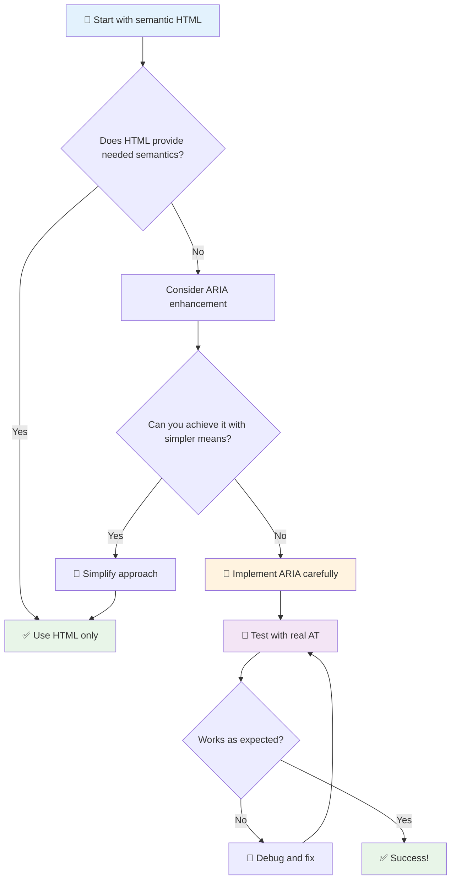

1. **Ưu tiên HTML ngữ nghĩa**: Luôn sử dụng `<button>` thay vì `<div role="button">`
2. **Không phá vỡ ngữ nghĩa**: Không bao giờ ghi đè ý nghĩa HTML hiện có (tránh `<h1 role="button">`)
3. **Duy trì khả năng truy cập bằng bàn phím**: Tất cả các phần tử ARIA tương tác phải hoàn toàn truy cập được bằng bàn phím
4. **Kiểm tra với người dùng thực tế**: Hỗ trợ ARIA thay đổi đáng kể giữa các công nghệ hỗ trợ
5. **Bắt đầu đơn giản**: Các triển khai ARIA phức tạp dễ gặp lỗi hơn

**🔍 Quy trình kiểm tra:**

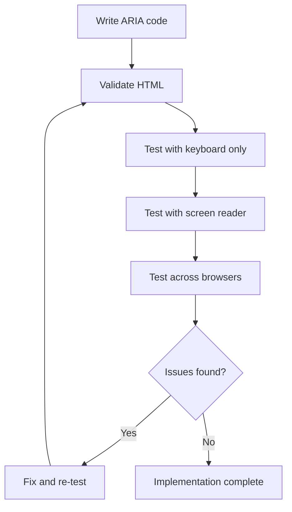

**🚫 Những lỗi phổ biến cần tránh với ARIA:**

- **Thông tin mâu thuẫn**: Không mâu thuẫn với ngữ nghĩa HTML
- **Quá nhiều nhãn**: Quá nhiều thông tin ARIA làm người dùng bị quá tải
- **ARIA tĩnh**: Quên cập nhật trạng thái ARIA khi nội dung thay đổi
- **Triển khai chưa được kiểm tra**: ARIA hoạt động trong lý thuyết nhưng thất bại trong thực tế
- **Thiếu hỗ trợ bàn phím**: Các vai trò ARIA không có tương tác bàn phím tương ứng

> 💡 **Nguồn kiểm tra**: Sử dụng các công cụ như [accessibility-checker](https://www.npmjs.com/package/accessibility-checker) để xác thực ARIA tự động, nhưng luôn kiểm tra với trình đọc màn hình thực tế để có trải nghiệm đầy đủ.

### 🎭 **Kiểm tra kỹ năng ARIA: Sẵn sàng cho các tương tác phức tạp?**

**Đánh giá sự tự tin của bạn với ARIA:**
- Khi nào bạn chọn ARIA thay vì HTML ngữ nghĩa? (Gợi ý: hầu như không bao giờ!)
- Bạn có thể giải thích tại sao `<div role="button">` thường tệ hơn `<button>` không?
- Điều quan trọng nhất cần nhớ về kiểm tra ARIA là gì?

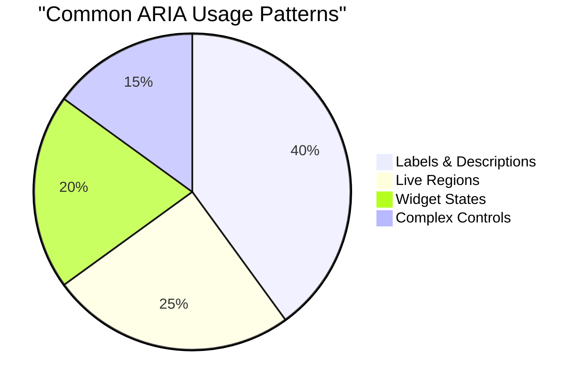

> **Thông tin chính**: Hầu hết việc sử dụng ARIA là để đặt tên và mô tả phần tử. Các mẫu widget phức tạp ít phổ biến hơn bạn nghĩ!

✅ **Học từ chuyên gia**: Nghiên cứu [ARIA Authoring Practices Guide](https://w3c.github.io/aria-practices/) để tìm hiểu các mẫu và triển khai đã được kiểm chứng cho các widget tương tác phức tạp.

## Làm cho hình ảnh và phương tiện trở nên truy cập được

Nội dung hình ảnh và âm thanh là phần quan trọng của trải nghiệm web hiện đại, nhưng chúng có thể tạo ra rào cản nếu không được triển khai một cách cẩn thận. Mục tiêu là đảm bảo rằng thông tin và tác động cảm xúc của phương tiện đến được với mọi người dùng. Khi bạn quen với việc này, nó sẽ trở thành thói quen.

Các loại phương tiện khác nhau cần các cách tiếp cận truy cập khác nhau. Nó giống như nấu ăn—bạn sẽ không xử lý một con cá tinh tế giống như cách bạn xử lý một miếng bít tết chắc chắn. Hiểu được những khác biệt này giúp bạn chọn giải pháp phù hợp cho từng tình huống.

### Chiến lược truy cập hình ảnh

Mỗi hình ảnh trên trang web của bạn đều có một mục đích. Hiểu được mục đích đó giúp bạn viết văn bản thay thế tốt hơn và tạo ra trải nghiệm bao gồm hơn.

**Bốn loại hình ảnh và chiến lược văn bản thay thế của chúng:**

**Hình ảnh thông tin** - truyền tải thông tin quan trọng:
```html

```

**Hình ảnh trang trí** - chỉ mang tính trực quan, không có giá trị thông tin:
```html

```

**Hình ảnh chức năng** - đóng vai trò như nút hoặc điều khiển:
```html
<button>
  
</button>
```

**Hình ảnh phức tạp** - biểu đồ, sơ đồ, đồ họa thông tin:
```html

<div id="chart-description">
  <p>Detailed description: Sales data shows a steady increase across all quarters...</p>
</div>
```

### Truy cập video và âm thanh

**Yêu cầu đối với video:**
- **Phụ đề**: Phiên bản văn bản của nội dung nói và hiệu ứng âm thanh
- **Mô tả âm thanh**: Tường thuật các yếu tố hình ảnh cho người dùng khiếm thị
- **Bản ghi**: Phiên bản văn bản đầy đủ của tất cả nội dung âm thanh và hình ảnh

```html
<video controls>
  <source src="video.mp4" type="video/mp4">
  <track kind="captions" src="captions.vtt" srclang="en" label="English">
  <track kind="descriptions" src="descriptions.vtt" srclang="en" label="Audio descriptions">
</video>
```

**Yêu cầu đối với âm thanh:**
- **Bản ghi**: Phiên bản văn bản của tất cả nội dung nói
- **Chỉ báo hình ảnh**: Đối với nội dung chỉ có âm thanh, cung cấp các dấu hiệu hình ảnh

### Kỹ thuật hình ảnh hiện đại

**Sử dụng CSS cho hình ảnh trang trí:**
```css
.hero-section {
  background-image: url('decorative-hero.jpg');
  /* Decorative images in CSS don't need alt text */
}
```

**Hình ảnh đáp ứng với khả năng truy cập:**
```html
<picture>
  <source media="(min-width: 800px)" srcset="large-chart.png">
  <source media="(min-width: 400px)" srcset="medium-chart.png">
  
</picture>
```

✅ **Kiểm tra truy cập hình ảnh**: Sử dụng trình đọc màn hình để điều hướng một trang có hình ảnh. Bạn có nhận đủ thông tin để hiểu nội dung không?

## Điều hướng bằng bàn phím và quản lý tiêu điểm

Nhiều người dùng điều hướng web hoàn toàn bằng bàn phím. Điều này bao gồm những người có khuyết tật vận động, người dùng chuyên nghiệp thấy bàn phím nhanh hơn chuột, và bất kỳ ai có chuột bị hỏng. Đảm bảo rằng trang web của bạn hoạt động tốt với đầu vào từ bàn phím là điều cần thiết và thường làm cho trang web của bạn hiệu quả hơn cho tất cả mọi người.

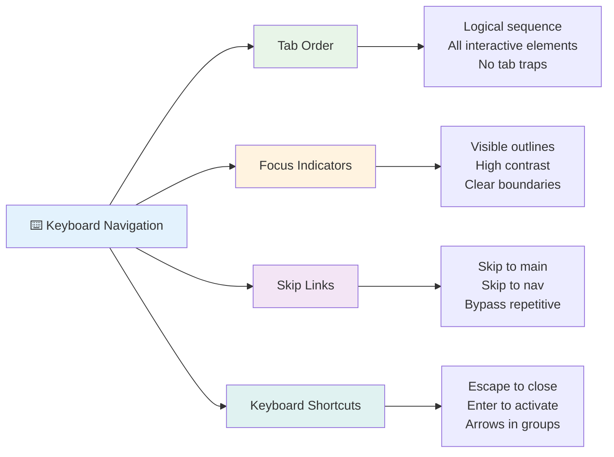

### Các mẫu điều hướng bàn phím cần thiết

**Tương tác bàn phím tiêu chuẩn:**
- **Tab**: Di chuyển tiêu điểm qua các phần tử tương tác
- **Shift + Tab**: Di chuyển tiêu điểm ngược lại
- **Enter**: Kích hoạt nút và liên kết
- **Space**: Kích hoạt nút, chọn hộp kiểm
- **Phím mũi tên**: Điều hướng trong nhóm thành phần (nút radio, menu)
- **Escape**: Đóng hộp thoại, menu thả xuống hoặc hủy thao tác

### Thực hành tốt nhất về quản lý tiêu điểm

**Chỉ báo tiêu điểm rõ ràng:**
```css
/* Ensure focus is always visible */
button:focus-visible {
  outline: 2px solid #4A90A4;
  outline-offset: 2px;
}

/* Custom focus styles for different components */
.card:focus-within {
  box-shadow: 0 0 0 3px rgba(74, 144, 164, 0.5);
}
```

**Liên kết bỏ qua để điều hướng hiệu quả:**
```html
<a href="#main-content" class="skip-link">Skip to main content</a>
<a href="#navigation" class="skip-link">Skip to navigation</a>

<nav id="navigation">
  <!-- navigation content -->
</nav>
<main id="main-content">
  <!-- main content -->
</main>
```

**Thứ tự tab hợp lý:**
```html
<!-- Use semantic HTML for natural tab order -->
<form>
  <label for="name">Name:</label>
  <input type="text" id="name" tabindex="0">
  
  <label for="email">Email:</label>
  <input type="email" id="email" tabindex="0">
  
  <button type="submit" tabindex="0">Submit</button>
</form>
```

### Bẫy tiêu điểm trong hộp thoại

Khi mở hộp thoại modal, tiêu điểm nên bị giới hạn trong hộp thoại:

```javascript
// Modern focus trap implementation
function trapFocus(element) {
  const focusableElements = element.querySelectorAll(
    'button, [href], input, select, textarea, [tabindex]:not([tabindex="-1"])'
  );
  
  const firstElement = focusableElements[0];
  const lastElement = focusableElements[focusableElements.length - 1];

  element.addEventListener('keydown', (e) => {
    if (e.key === 'Tab') {
      if (e.shiftKey && document.activeElement === firstElement) {
        e.preventDefault();
        lastElement.focus();
      } else if (!e.shiftKey && document.activeElement === lastElement) {
        e.preventDefault();
        firstElement.focus();
      }
    }
    
    if (e.key === 'Escape') {
      closeModal();
    }
  });
  
  // Focus first element when modal opens
  firstElement.focus();
}
```

✅ **Kiểm tra điều hướng bàn phím**: Thử điều hướng trang web của bạn chỉ bằng phím Tab. Bạn có thể truy cập tất cả các phần tử tương tác không? Thứ tự tiêu điểm có hợp lý không? Các chỉ báo tiêu điểm có rõ ràng không?

## Truy cập biểu mẫu

Biểu mẫu rất quan trọng cho sự tương tác của người dùng và cần được chú ý đặc biệt đến khả năng truy cập.

### Liên kết nhãn và điều khiển biểu mẫu

**Mỗi điều khiển biểu mẫu cần một nhãn:**
```html
<!-- Explicit labeling (preferred) -->
<label for="username">Username:</label>
<input type="text" id="username" name="username" required>

<!-- Implicit labeling -->
<label>
  Password:
  <input type="password" name="password" required>
</label>

<!-- Using aria-label when visual label isn't desired -->
<input type="search" aria-label="Search products" placeholder="Search...">
```

### Xử lý lỗi và xác thực

**Thông báo lỗi truy cập:**
```html
<label for="email">Email Address:</label>
<input type="email" id="email" name="email" 
       aria-describedby="email-error" 
       aria-invalid="true" required>
<div id="email-error" role="alert">
  Please enter a valid email address
</div>
```

**Thực hành tốt nhất về xác thực biểu mẫu:**
- Sử dụng `aria-invalid` để chỉ ra các trường không hợp lệ
- Cung cấp thông báo lỗi rõ ràng, cụ thể
- Sử dụng `role="alert"` để thông báo lỗi quan trọng
- Hiển thị lỗi cả ngay lập tức và khi gửi biểu mẫu

### Fieldsets và nhóm

**Nhóm các điều khiển biểu mẫu liên quan:**
```html
<fieldset>
  <legend>Shipping Address</legend>
  <label for="street">Street Address:</label>
  <input type="text" id="street" name="street">
  
  <label for="city">City:</label>
  <input type="text" id="city" name="city">
</fieldset>

<fieldset>
  <legend>Preferred Contact Method</legend>
  <input type="radio" id="contact-email" name="contact" value="email">
  <label for="contact-email">Email</label>
  
  <input type="radio" id="contact-phone" name="contact" value="phone">
  <label for="contact-phone">Phone</label>
</fieldset>
```

## Hành trình truy cập của bạn: Những điều cần nhớ

Chúc mừng bạn! Bạn vừa có được kiến thức nền tảng để tạo ra những trải nghiệm web thực sự bao gồm. Đây là điều rất thú vị! Khả năng truy cập web không chỉ là việc đánh dấu các hộp tuân thủ—nó là việc nhận ra các cách đa dạng mà mọi người tương tác với nội dung kỹ thuật số và thiết kế cho sự phức tạp tuyệt vời đó.

Bạn giờ đây là một phần của cộng đồng ngày càng lớn các nhà phát triển hiểu rằng thiết kế tuyệt vời là dành cho tất cả mọi người. Chào mừng bạn đến với câu lạc bộ!

**🎯 Bộ công cụ truy cập của bạn giờ đây bao gồm:**

| Nguyên tắc cốt lõi | Triển khai | Tác động |
|--------------------|------------|----------|
| **Nền tảng HTML ngữ nghĩa** | Sử dụng các phần tử HTML đúng mục đích của chúng | Trình đọc màn hình có thể điều hướng hiệu quả, bàn phím hoạt động tự động |
| **Thiết kế hình ảnh bao gồm** | Độ tương phản đủ, sử dụng màu sắc có ý nghĩa, chỉ báo tiêu điểm rõ ràng | Rõ ràng cho mọi người trong mọi điều kiện ánh sáng |
| **Nội dung mô tả** | Văn bản liên kết có ý nghĩa, văn bản thay thế, tiêu đề | Người dùng hiểu nội dung mà không cần ngữ cảnh hình ảnh |
| **Khả năng truy cập bằng bàn phím** | Thứ tự tab, phím tắt, quản lý tiêu điểm | Truy cập vận động và hiệu quả cho người dùng chuyên nghiệp |
| **Cải thiện ARIA** | Sử dụng chiến lược để lấp đầy khoảng trống ngữ nghĩa | Các ứng dụng phức tạp hoạt động với công nghệ hỗ trợ |
| **Kiểm tra toàn diện** | Công cụ tự động + xác minh thủ công + kiểm tra người dùng thực tế | Phát hiện vấn đề trước khi ảnh hưởng đến người dùng |

**🚀 Các bước tiếp theo của bạn:**

1. **Tích hợp truy cập vào quy trình làm việc của bạn**: Biến kiểm tra thành một phần tự nhiên trong quy trình phát triển của bạn
2. **Học hỏi từ người dùng thực tế**: Tìm kiếm phản hồi từ những người sử dụng công nghệ hỗ trợ
3. **Luôn cập nhật**: Kỹ thuật truy cập phát triển cùng với công nghệ và tiêu chuẩn mới
4. **Vận động cho sự bao gồm**: Chia sẻ kiến thức của bạn và biến truy cập thành ưu tiên của nhóm

> 💡 **Nhớ rằng**: Các ràng buộc về truy cập thường dẫn đến các giải pháp sáng tạo, thanh lịch mang lại lợi ích cho tất cả mọi người. Đường dốc, phụ đề và điều khiển bằng giọng nói đều bắt đầu là các tính năng truy cập và trở thành cải tiến phổ biến.

**Lợi ích kinh doanh rất rõ ràng**: Các trang web truy cập được tiếp cận nhiều người dùng hơn, xếp hạng tốt hơn trên công cụ tìm kiếm, có chi phí bảo trì thấp hơn và tránh được rủi ro pháp lý. Nhưng thành thật mà nói? Lý do thực sự để quan tâm đến truy cập sâu sắc hơn nhiều. Các trang web truy cập được thể hiện những giá trị tốt nhất của web—sự mở rộng, sự bao gồm, và ý tưởng rằng mọi người đều xứng đáng có quyền truy cập thông tin như nhau.

Bạn giờ đây đã sẵn sàng để xây dựng web bao gồm của tương lai. Mỗi trang web truy cập bạn tạo ra làm cho internet trở thành một nơi chào đón hơn cho tất cả mọi người. Điều đó thật tuyệt vời khi bạn nghĩ về nó!

## Tài nguyên bổ sung

Tiếp tục hành trình học hỏi về truy cập của bạn với những tài nguyên cần thiết này:

**📚 Tiêu chuẩn và hướng dẫn chính thức:**
- [WCAG 2.1 Guidelines](https://www.w3.org/WAI/WCAG21/quickref/) - Tiêu chuẩn truy cập chính thức với tham khảo nhanh
- [ARIA Authoring Practices Guide](https://w3c.github.io/aria-practices/) - Các mẫu toàn diện cho widget tương tác
- [WebAIM Guidelines](https://webaim.org/) - Hướng dẫn truy cập thực tế, thân thiện với người mới bắt đầu

**🛠️ Công cụ và tài nguyên kiểm tra:**
- [axe DevTools](https://www.deque.com/axe/devtools/) - Công cụ kiểm tra truy cập tiêu chuẩn ngành
- [A11y Project Checklist](https://www.a11yproject.com/checklist/) - Xác minh truy cập từng bước
- [Accessibility Insights](https://accessibilityinsights.io/) - Bộ kiểm tra toàn diện của Microsoft
- [Color Oracle](https://colororacle.org/) - Trình mô phỏng mù màu để kiểm tra thiết kế

**🎓 Học hỏi và cộng đồng:**
- [WebAIM Screen Reader Survey](https://webaim.org/projects/screenreadersurvey9/) - Sở thích và hành vi của người dùng thực tế
- [Inclusive Components](https://inclusive-components.design/) - Các mẫu thành phần truy cập hiện đại
- [A11y Coffee](https://a11y.coffee/) - Mẹo và thông tin truy cập nhanh
- [Web Accessibility Initiative (WAI)](https://www.w3.org/WAI/) - Tài nguyên truy cập toàn diện của W3C

**🎥 Học tập thực hành:**
- [Accessibility Developer Guide](https://www.accessibility-developer-guide.com/) - Hướng dẫn triển khai thực tế
- [Deque University](https://dequeuniversity.com/) - Các khóa học đào tạo truy cập chuyên nghiệp

## Thử thách GitHub Copilot Agent 🚀

Sử dụng chế độ Agent để hoàn thành thử thách sau:

**Mô tả:** Tạo một thành phần hộp thoại modal truy cập được, thể hiện quản lý tiêu điểm đúng cách, thuộc tính ARIA, và các mẫu điều hướng bàn phím.

**Yêu cầu:** Xây dựng một thành phần hộp thoại modal hoàn chỉnh với HTML, CSS, và JavaScript bao gồm: bẫy tiêu điểm đúng cách, phím ESC để đóng, nhấp bên ngoài để đóng, thuộc tính ARIA cho trình đọc màn hình, và chỉ báo tiêu điểm rõ ràng. Hộp thoại modal nên chứa một biểu mẫu với nhãn đúng cách và xử lý lỗi. Đảm bảo thành phần đáp ứng tiêu chuẩn WCAG 2.1 AA.


## 🚀 Thử thách

Hãy lấy HTML này và viết lại để truy cập được nhất có thể, dựa trên các chiến lược bạn đã học.

```html
<!DOCTYPE html>
<html lang="en">
  <head>
    <meta charset="UTF-8">
    <meta name="viewport" content="width=device-width, initial-scale=1.0">
    <title>Turtle Ipsum - The World's Premier Turtle Fan Club</title>
    <link href='../assets/style.css' rel='stylesheet' type='text/css'>
  </head>
  <body>
    <header class="site-header">
      <h1 class="site-title">Turtle Ipsum</h1>
      <p class="site-subtitle">The World's Premier Turtle Fan Club</p>
    </header>
    
    <nav class="main-nav" aria-label="Main navigation">
      <h2 class="nav-header">Resources</h2>
      <ul class="nav-list">
        <li><a href="https://www.youtube.com/watch?v=CMNry4PE93Y">"I like turtles" video</a></li>
        <li><a href="https://en.wikipedia.org/wiki/Turtle">Basic turtle information</a></li>
        <li><a href="https://en.wikipedia.org/wiki/Turtles_(chocolate)">Chocolate turtles candy</a></li>
      </ul>
    </nav>
    
    <main class="main-content">
      <article>
        <h1>Welcome to Turtle Ipsum</h1>
        <p class="intro">
          <a href="/about">Learn more about our turtle community</a> and discover fascinating facts about these amazing creatures.
        </p>
        <p class="article-text">
          Turtle ipsum dolor sit amet, consectetur adipiscing elit, sed do eiusmod tempor incididunt ut labore et dolore magna aliqua. Ut enim ad minim veniam, quis nostrud exercitation ullamco laboris nisi ut aliquip ex ea commodo consequat. Duis aute irure dolor in reprehenderit in voluptate velit esse cillum dolore eu fugiat nulla pariatur. Excepteur sint occaecat cupidatat non proident, sunt in culpa qui officia deserunt mollit anim id est laborum.
        </p>
      </article>
    </main>
    
    <footer class="footer">
      <section class="newsletter-signup">
        <h2>Stay Updated</h2>
        <button type="button" onclick="showNewsletterForm()">Sign up for turtle news</button>
      </section>
      
      <nav class="footer-nav" aria-label="Footer navigation">
        <h2>Site Pages</h2>
        <ul>
          <li><a href="../">Home</a></li>
          <li><a href="../semantic">Semantic HTML example</a></li>
        </ul>
      </nav>
      
      <p class="footer-copyright">&copy; 2024 Instrument. All rights reserved.</p>
    </footer>
  </body>
</html>
```

**Những cải tiến chính đã thực hiện:**
- Thêm cấu trúc HTML ngữ nghĩa đúng cách
- Sửa đổi thứ tự tiêu đề (chỉ một h1, tiến trình hợp lý)
- Thêm văn bản liên kết có ý nghĩa thay vì "click here"
- Bao gồm nhãn ARIA đúng cách cho điều hướng
- Thêm thuộc tính lang và các thẻ meta đúng cách
- Sử dụng phần tử button cho các phần tử tương tác
- Cấu trúc nội dung footer với các điểm mốc đúng cách

## Câu hỏi kiểm tra sau bài giảng
[Câu hỏi kiểm tra sau bài giảng](https://ff-quizzes.netlify.app/web/en/)

## Ôn tập & Tự học

Nhiều chính phủ có luật về yêu cầu truy cập. Hãy tìm hiểu về luật truy cập của quốc gia bạn. Những gì được bao phủ và những gì không? Một ví dụ là [trang web chính phủ này](https://accessibility.blog.gov.uk/).

## Bài tập

[Phân tích một trang web không truy cập được](assignment.md)

Credits: [Turtle Ipsum](https://github.com/Instrument/semantic-html-sample) by Instrument

---

## 🚀 Lộ trình làm chủ truy cập của bạn

### ⚡ **Những gì bạn có thể làm trong 5 phút tới**
- [ ] Cài đặt tiện ích axe DevTools trong trình duyệt của bạn
- [ ] Chạy kiểm tra truy cập Lighthouse trên trang web yêu thích của bạn
- [ ] Thử điều hướng bất kỳ trang web nào chỉ bằng phím Tab
- [ ] Kiểm tra trình đọc màn hình tích hợp sẵn của trình duyệt của bạn (Narrator/VoiceOver)

### 🎯 **Những gì bạn có thể hoàn thành trong giờ tới**
- [ ] Hoàn thành bài kiểm tra sau bài học và suy ngẫm về những hiểu biết truy cập
- [ ] Thực hành viết văn bản thay thế có ý nghĩa cho 10 hình ảnh khác nhau
- [ ] Kiểm tra cấu trúc tiêu đề của một trang web bằng tiện ích HeadingsMap
- [ ] Sửa các vấn đề truy cập được tìm thấy trong HTML thử thách
- [ ] Kiểm tra độ tương phản màu sắc trên dự án hiện tại của bạn bằng công cụ của WebAIM

### 📅 **Hành trình truy cập kéo dài một tuần của bạn**
- [ ] Hoàn thành bài tập phân tích một trang web không truy cập được
- [ ] Thiết lập môi trường phát triển của bạn với các công cụ kiểm tra truy cập
- [ ] Luyện tập điều hướng bằng bàn phím trên 5 trang web phức tạp khác nhau  
- [ ] Xây dựng một biểu mẫu đơn giản với nhãn đúng chuẩn, xử lý lỗi và ARIA  
- [ ] Tham gia một cộng đồng về khả năng tiếp cận (A11y Slack, diễn đàn WebAIM)  
- [ ] Xem người dùng thực tế có khuyết tật điều hướng trang web (YouTube có nhiều ví dụ tuyệt vời)  

### 🌟 **Biến đổi trong một tháng của bạn**  
- [ ] Tích hợp kiểm tra khả năng tiếp cận vào quy trình phát triển của bạn  
- [ ] Đóng góp cho một dự án mã nguồn mở bằng cách sửa các vấn đề về khả năng tiếp cận  
- [ ] Thực hiện kiểm tra khả năng sử dụng với người dùng công nghệ hỗ trợ  
- [ ] Xây dựng thư viện thành phần có khả năng tiếp cận cho nhóm của bạn  
- [ ] Vận động cho khả năng tiếp cận tại nơi làm việc hoặc cộng đồng của bạn  
- [ ] Hướng dẫn ai đó mới tìm hiểu về các khái niệm khả năng tiếp cận  

### 🏆 **Kiểm tra cuối cùng của nhà vô địch khả năng tiếp cận**  

**Hãy ăn mừng hành trình khả năng tiếp cận của bạn:**  
- Điều gì khiến bạn ngạc nhiên nhất về cách mọi người sử dụng web?  
- Nguyên tắc khả năng tiếp cận nào phù hợp nhất với phong cách phát triển của bạn?  
- Việc học về khả năng tiếp cận đã thay đổi góc nhìn của bạn về thiết kế như thế nào?  
- Cải tiến khả năng tiếp cận đầu tiên bạn muốn thực hiện trên một dự án thực tế là gì?  

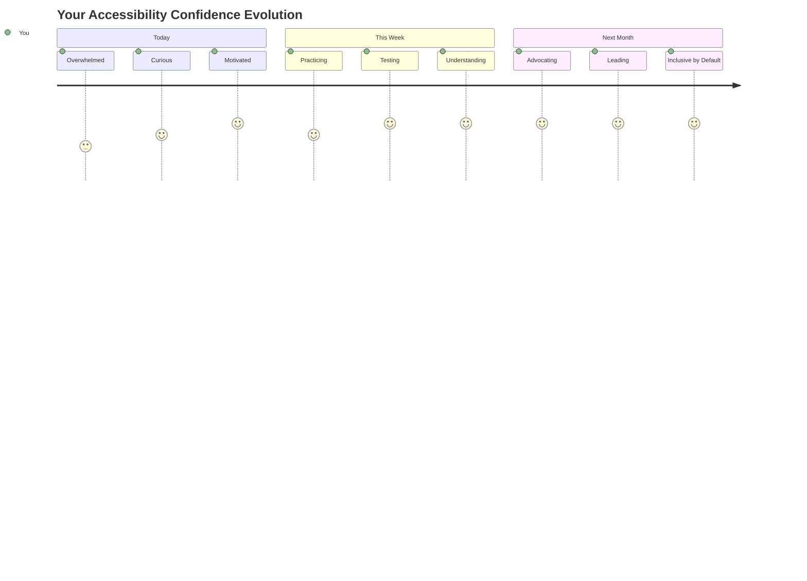
  
> 🌍 **Giờ đây bạn là một nhà vô địch về khả năng tiếp cận!** Bạn hiểu rằng trải nghiệm web tuyệt vời là dành cho tất cả mọi người, bất kể họ truy cập web như thế nào. Mỗi tính năng có khả năng tiếp cận mà bạn xây dựng đều làm cho internet trở nên bao quát hơn. Web cần những nhà phát triển như bạn, những người coi khả năng tiếp cận không phải là một rào cản, mà là một cơ hội để tạo ra trải nghiệm tốt hơn cho tất cả người dùng. Chào mừng bạn đến với phong trào này! 🎉  

---

**Tuyên bố miễn trừ trách nhiệm**:  
Tài liệu này đã được dịch bằng dịch vụ dịch thuật AI [Co-op Translator](https://github.com/Azure/co-op-translator). Mặc dù chúng tôi cố gắng đảm bảo độ chính xác, xin lưu ý rằng các bản dịch tự động có thể chứa lỗi hoặc không chính xác. Tài liệu gốc bằng ngôn ngữ bản địa nên được coi là nguồn thông tin chính thức. Đối với thông tin quan trọng, nên sử dụng dịch vụ dịch thuật chuyên nghiệp bởi con người. Chúng tôi không chịu trách nhiệm cho bất kỳ sự hiểu lầm hoặc diễn giải sai nào phát sinh từ việc sử dụng bản dịch này.