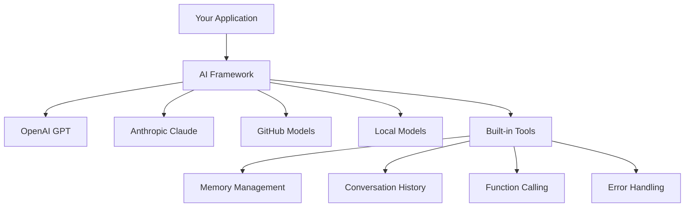
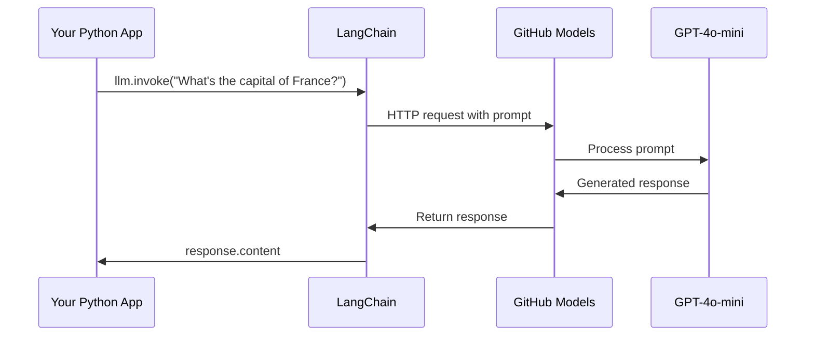
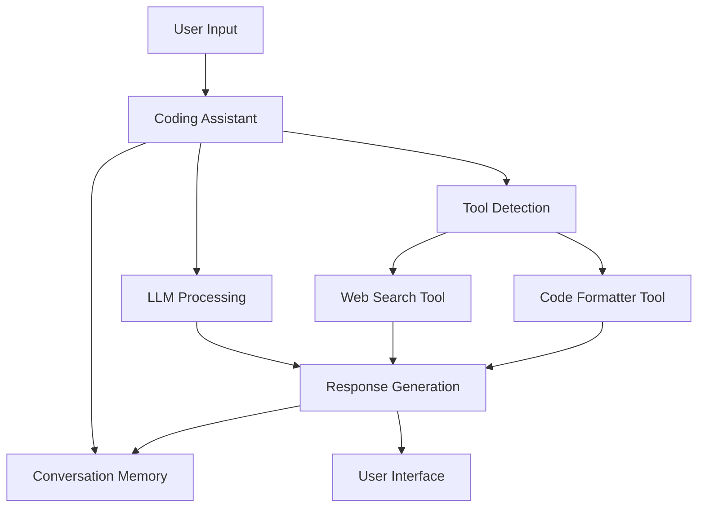
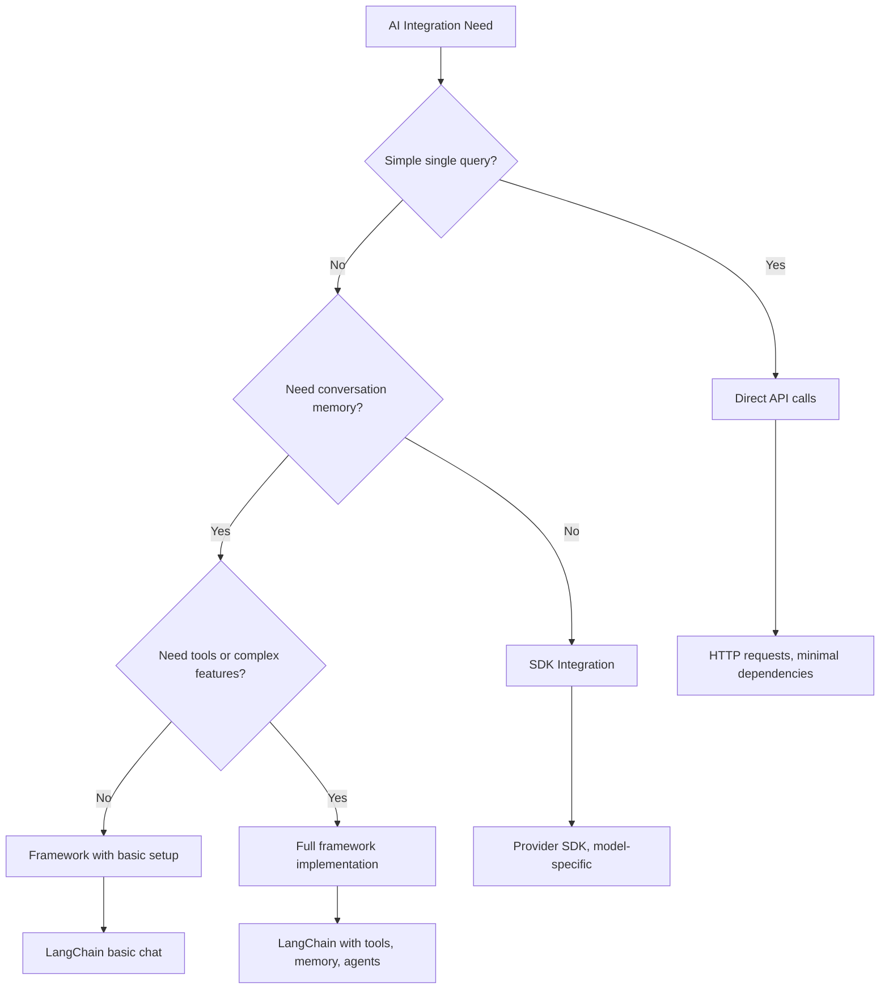

<!--
CO_OP_TRANSLATOR_METADATA:
{
  "original_hash": "e2c4ae5688e34b4b8b09d52aec56c79e",
  "translation_date": "2025-10-24T13:35:25+00:00",
  "source_file": "10-ai-framework-project/README.md",
  "language_code": "vi"
}
-->
# Khung AI

Bạn đã bao giờ cảm thấy choáng ngợp khi cố gắng xây dựng ứng dụng AI từ đầu chưa? Bạn không cô đơn đâu! Các khung AI giống như một con dao đa năng dành cho phát triển AI - chúng là những công cụ mạnh mẽ có thể giúp bạn tiết kiệm thời gian và công sức khi xây dựng các ứng dụng thông minh. Hãy nghĩ về một khung AI như một thư viện được tổ chức tốt: nó cung cấp các thành phần được xây dựng sẵn, API tiêu chuẩn hóa và các trừu tượng thông minh để bạn có thể tập trung vào việc giải quyết vấn đề thay vì vật lộn với các chi tiết triển khai.

Trong bài học này, chúng ta sẽ khám phá cách các khung như LangChain có thể biến những nhiệm vụ tích hợp AI phức tạp trước đây thành mã sạch và dễ đọc. Bạn sẽ tìm hiểu cách giải quyết các thách thức thực tế như theo dõi các cuộc trò chuyện, triển khai gọi công cụ và xử lý nhiều mô hình AI thông qua một giao diện thống nhất.

Khi hoàn thành, bạn sẽ biết khi nào nên sử dụng khung thay vì gọi API trực tiếp, cách sử dụng các trừu tượng của chúng một cách hiệu quả và cách xây dựng các ứng dụng AI sẵn sàng cho thực tế. Hãy cùng khám phá những gì khung AI có thể làm cho dự án của bạn.

## Tại sao chọn khung?

Bạn đã sẵn sàng xây dựng một ứng dụng AI - tuyệt vời! Nhưng đây là vấn đề: bạn có nhiều con đường khác nhau để đi, và mỗi con đường đều có ưu và nhược điểm riêng. Nó giống như việc chọn giữa đi bộ, đi xe đạp hoặc lái xe để đến một nơi nào đó - tất cả đều đưa bạn đến đích, nhưng trải nghiệm (và nỗ lực) sẽ hoàn toàn khác nhau.

Hãy phân tích ba cách chính mà bạn có thể tích hợp AI vào dự án của mình:

| Phương pháp | Ưu điểm | Phù hợp nhất cho | Cân nhắc |
|-------------|---------|------------------|----------|
| **Yêu cầu HTTP trực tiếp** | Kiểm soát hoàn toàn, không phụ thuộc | Các truy vấn đơn giản, học các nguyên tắc cơ bản | Mã dài dòng hơn, xử lý lỗi thủ công |
| **Tích hợp SDK** | Ít mã mẫu hơn, tối ưu hóa theo mô hình cụ thể | Ứng dụng một mô hình | Giới hạn ở các nhà cung cấp cụ thể |
| **Khung AI** | API thống nhất, trừu tượng tích hợp sẵn | Ứng dụng đa mô hình, quy trình phức tạp | Đường cong học tập, khả năng trừu tượng hóa quá mức |

### Lợi ích của khung trong thực tế



**Tại sao khung lại quan trọng:**
- **Thống nhất** nhiều nhà cung cấp AI dưới một giao diện
- **Xử lý** bộ nhớ cuộc trò chuyện tự động
- **Cung cấp** các công cụ sẵn sàng cho các nhiệm vụ phổ biến như embeddings và gọi hàm
- **Quản lý** xử lý lỗi và logic thử lại
- **Biến** quy trình phức tạp thành các lệnh gọi phương thức dễ đọc

> 💡 **Mẹo chuyên nghiệp**: Sử dụng khung khi chuyển đổi giữa các mô hình AI khác nhau hoặc xây dựng các tính năng phức tạp như agent, bộ nhớ hoặc gọi công cụ. Sử dụng API trực tiếp khi học các nguyên tắc cơ bản hoặc xây dựng các ứng dụng đơn giản, tập trung.

**Kết luận**: Giống như việc chọn giữa các công cụ chuyên dụng của một người thợ thủ công và một xưởng làm việc hoàn chỉnh, đó là việc chọn công cụ phù hợp với nhiệm vụ. Các khung vượt trội trong các ứng dụng phức tạp, giàu tính năng, trong khi API trực tiếp hoạt động tốt cho các trường hợp sử dụng đơn giản.

## Giới thiệu

Trong bài học này, chúng ta sẽ học cách:

- Sử dụng một khung AI phổ biến.
- Giải quyết các vấn đề phổ biến như cuộc trò chuyện, sử dụng công cụ, bộ nhớ và ngữ cảnh.
- Tận dụng điều này để xây dựng ứng dụng AI.

## Lời nhắc AI đầu tiên của bạn

Hãy bắt đầu với những điều cơ bản bằng cách tạo ứng dụng AI đầu tiên của bạn gửi một câu hỏi và nhận lại câu trả lời. Giống như Archimedes phát hiện ra nguyên lý dịch chuyển trong bồn tắm của mình, đôi khi những quan sát đơn giản nhất lại dẫn đến những hiểu biết mạnh mẽ nhất - và các khung giúp những hiểu biết này trở nên dễ tiếp cận.

### Cài đặt LangChain với GitHub Models

Chúng ta sẽ sử dụng LangChain để kết nối với GitHub Models, điều này khá tuyệt vì nó cung cấp cho bạn quyền truy cập miễn phí vào nhiều mô hình AI. Phần hay nhất? Bạn chỉ cần một vài tham số cấu hình đơn giản để bắt đầu:

```python
from langchain_openai import ChatOpenAI
import os

llm = ChatOpenAI(
    api_key=os.environ["GITHUB_TOKEN"],
    base_url="https://models.github.ai/inference",
    model="openai/gpt-4o-mini",
)

# Send a simple prompt
response = llm.invoke("What's the capital of France?")
print(response.content)
```

**Hãy phân tích những gì đang diễn ra ở đây:**
- **Tạo** một client LangChain bằng cách sử dụng lớp `ChatOpenAI` - đây là cổng kết nối của bạn với AI!
- **Cấu hình** kết nối với GitHub Models bằng token xác thực của bạn
- **Chỉ định** mô hình AI nào sẽ sử dụng (`gpt-4o-mini`) - hãy nghĩ về điều này như việc chọn trợ lý AI của bạn
- **Gửi** câu hỏi của bạn bằng phương thức `invoke()` - đây là nơi phép thuật xảy ra
- **Trích xuất** và hiển thị phản hồi - và voilà, bạn đang trò chuyện với AI!

> 🔧 **Lưu ý cài đặt**: Nếu bạn đang sử dụng GitHub Codespaces, bạn thật may mắn - `GITHUB_TOKEN` đã được thiết lập sẵn cho bạn! Làm việc cục bộ? Không sao, bạn chỉ cần tạo một token truy cập cá nhân với các quyền phù hợp.

**Kết quả mong đợi:**
```text
The capital of France is Paris.
```



## Xây dựng AI hội thoại

Ví dụ đầu tiên này minh họa những điều cơ bản, nhưng nó chỉ là một trao đổi đơn lẻ - bạn hỏi một câu hỏi, nhận được câu trả lời, và hết. Trong các ứng dụng thực tế, bạn muốn AI của mình nhớ những gì bạn đã thảo luận, giống như cách Watson và Holmes xây dựng các cuộc trò chuyện điều tra của họ theo thời gian.

Đây là nơi LangChain trở nên đặc biệt hữu ích. Nó cung cấp các loại tin nhắn khác nhau giúp cấu trúc các cuộc trò chuyện và cho phép bạn tạo tính cách cho AI của mình. Bạn sẽ xây dựng các trải nghiệm trò chuyện duy trì ngữ cảnh và tính cách.

### Hiểu các loại tin nhắn

Hãy nghĩ về các loại tin nhắn này như những "vai trò" khác nhau mà các bên tham gia đảm nhận trong một cuộc trò chuyện. LangChain sử dụng các lớp tin nhắn khác nhau để theo dõi ai đang nói gì:

| Loại tin nhắn | Mục đích | Trường hợp sử dụng ví dụ |
|---------------|----------|-------------------------|
| `SystemMessage` | Định nghĩa tính cách và hành vi của AI | "Bạn là một trợ lý lập trình hữu ích" |
| `HumanMessage` | Đại diện cho đầu vào của người dùng | "Giải thích cách hoạt động của hàm" |
| `AIMessage` | Lưu trữ phản hồi của AI | Các phản hồi trước đó của AI trong cuộc trò chuyện |

### Tạo cuộc trò chuyện đầu tiên của bạn

Hãy tạo một cuộc trò chuyện nơi AI của chúng ta đảm nhận một vai trò cụ thể. Chúng ta sẽ để nó hóa thân thành Captain Picard - một nhân vật nổi tiếng với sự khôn ngoan ngoại giao và khả năng lãnh đạo:

```python
messages = [
    SystemMessage(content="You are Captain Picard of the Starship Enterprise"),
    HumanMessage(content="Tell me about you"),
]
```

**Phân tích thiết lập cuộc trò chuyện này:**
- **Thiết lập** vai trò và tính cách của AI thông qua `SystemMessage`
- **Cung cấp** truy vấn ban đầu của người dùng qua `HumanMessage`
- **Tạo** nền tảng cho cuộc trò chuyện nhiều lượt

Mã đầy đủ cho ví dụ này trông như sau:

```python
from langchain_core.messages import HumanMessage, SystemMessage
from langchain_openai import ChatOpenAI
import os

llm = ChatOpenAI(
    api_key=os.environ["GITHUB_TOKEN"],
    base_url="https://models.github.ai/inference",
    model="openai/gpt-4o-mini",
)

messages = [
    SystemMessage(content="You are Captain Picard of the Starship Enterprise"),
    HumanMessage(content="Tell me about you"),
]


# works
response  = llm.invoke(messages)
print(response.content)
```

Bạn sẽ thấy kết quả tương tự như:

```text
I am Captain Jean-Luc Picard, the commanding officer of the USS Enterprise (NCC-1701-D), a starship in the United Federation of Planets. My primary mission is to explore new worlds, seek out new life and new civilizations, and boldly go where no one has gone before. 

I believe in the importance of diplomacy, reason, and the pursuit of knowledge. My crew is diverse and skilled, and we often face challenges that test our resolve, ethics, and ingenuity. Throughout my career, I have encountered numerous species, grappled with complex moral dilemmas, and have consistently sought peaceful solutions to conflicts.

I hold the ideals of the Federation close to my heart, believing in the importance of cooperation, understanding, and respect for all sentient beings. My experiences have shaped my leadership style, and I strive to be a thoughtful and just captain. How may I assist you further?
```

Để duy trì tính liên tục của cuộc trò chuyện (thay vì đặt lại ngữ cảnh mỗi lần), bạn cần tiếp tục thêm các phản hồi vào danh sách tin nhắn của mình. Giống như các truyền thống truyền miệng bảo tồn các câu chuyện qua nhiều thế hệ, cách tiếp cận này xây dựng bộ nhớ lâu dài:

```python
from langchain_core.messages import HumanMessage, SystemMessage
from langchain_openai import ChatOpenAI
import os

llm = ChatOpenAI(
    api_key=os.environ["GITHUB_TOKEN"],
    base_url="https://models.github.ai/inference",
    model="openai/gpt-4o-mini",
)

messages = [
    SystemMessage(content="You are Captain Picard of the Starship Enterprise"),
    HumanMessage(content="Tell me about you"),
]


# works
response  = llm.invoke(messages)

print(response.content)

print("---- Next ----")

messages.append(response)
messages.append(HumanMessage(content="Now that I know about you, I'm Chris, can I be in your crew?"))

response  = llm.invoke(messages)

print(response.content)

```

Khá thú vị, đúng không? Điều đang xảy ra ở đây là chúng ta gọi LLM hai lần - lần đầu tiên chỉ với hai tin nhắn ban đầu của chúng ta, nhưng sau đó lại với toàn bộ lịch sử cuộc trò chuyện. Nó giống như AI thực sự đang theo dõi cuộc trò chuyện của chúng ta!

Khi bạn chạy mã này, bạn sẽ nhận được phản hồi thứ hai nghe có vẻ như:

```text
Welcome aboard, Chris! It's always a pleasure to meet those who share a passion for exploration and discovery. While I cannot formally offer you a position on the Enterprise right now, I encourage you to pursue your aspirations. We are always in need of talented individuals with diverse skills and backgrounds. 

If you are interested in space exploration, consider education and training in the sciences, engineering, or diplomacy. The values of curiosity, resilience, and teamwork are crucial in Starfleet. Should you ever find yourself on a starship, remember to uphold the principles of the Federation: peace, understanding, and respect for all beings. Your journey can lead you to remarkable adventures, whether in the stars or on the ground. Engage!
```

Tôi sẽ coi đó là một câu trả lời có thể ;)

## Phản hồi theo luồng

Bạn có bao giờ để ý rằng ChatGPT dường như "gõ" các phản hồi của nó theo thời gian thực không? Đó là luồng đang hoạt động. Giống như việc xem một người viết thư pháp lành nghề làm việc - nhìn các ký tự xuất hiện từng nét thay vì hiện ra ngay lập tức - luồng làm cho tương tác trở nên tự nhiên hơn và cung cấp phản hồi ngay lập tức.

### Triển khai luồng với LangChain

```python
from langchain_openai import ChatOpenAI
import os

llm = ChatOpenAI(
    api_key=os.environ["GITHUB_TOKEN"],
    base_url="https://models.github.ai/inference",
    model="openai/gpt-4o-mini",
    streaming=True
)

# Stream the response
for chunk in llm.stream("Write a short story about a robot learning to code"):
    print(chunk.content, end="", flush=True)
```

**Tại sao luồng lại tuyệt vời:**
- **Hiển thị** nội dung khi nó đang được tạo - không còn chờ đợi khó xử!
- **Làm cho** người dùng cảm thấy như có điều gì đó đang diễn ra
- **Cảm giác** nhanh hơn, ngay cả khi thực tế không phải vậy
- **Cho phép** người dùng bắt đầu đọc trong khi AI vẫn đang "suy nghĩ"

> 💡 **Mẹo trải nghiệm người dùng**: Luồng thực sự tỏa sáng khi bạn xử lý các phản hồi dài như giải thích mã, viết sáng tạo hoặc hướng dẫn chi tiết. Người dùng của bạn sẽ thích việc thấy tiến trình thay vì nhìn chằm chằm vào màn hình trống!

## Mẫu lời nhắc

Mẫu lời nhắc hoạt động giống như các cấu trúc tu từ được sử dụng trong diễn thuyết cổ điển - hãy nghĩ về cách Cicero điều chỉnh các mẫu lời nói của mình cho các khán giả khác nhau trong khi vẫn duy trì khung thuyết phục giống nhau. Chúng cho phép bạn tạo các lời nhắc có thể tái sử dụng, nơi bạn có thể thay thế các phần thông tin khác nhau mà không cần viết lại mọi thứ từ đầu. Khi bạn thiết lập mẫu, bạn chỉ cần điền các biến với bất kỳ giá trị nào bạn cần.

### Tạo mẫu lời nhắc có thể tái sử dụng

```python
from langchain_core.prompts import ChatPromptTemplate

# Define a template for code explanations
template = ChatPromptTemplate.from_messages([
    ("system", "You are an expert programming instructor. Explain concepts clearly with examples."),
    ("human", "Explain {concept} in {language} with a practical example for {skill_level} developers")
])

# Use the template with different values
questions = [
    {"concept": "functions", "language": "JavaScript", "skill_level": "beginner"},
    {"concept": "classes", "language": "Python", "skill_level": "intermediate"},
    {"concept": "async/await", "language": "JavaScript", "skill_level": "advanced"}
]

for question in questions:
    prompt = template.format_messages(**question)
    response = llm.invoke(prompt)
    print(f"Topic: {question['concept']}\n{response.content}\n---\n")
```

**Tại sao bạn sẽ thích sử dụng mẫu:**
- **Giữ** các lời nhắc của bạn nhất quán trên toàn bộ ứng dụng
- **Không còn** nối chuỗi lộn xộn - chỉ cần các biến sạch, đơn giản
- **AI của bạn** hoạt động dự đoán được vì cấu trúc vẫn giữ nguyên
- **Cập nhật** dễ dàng - thay đổi mẫu một lần, và nó được sửa ở mọi nơi

## Đầu ra có cấu trúc

Bạn đã bao giờ cảm thấy khó chịu khi cố gắng phân tích các phản hồi AI trả về dưới dạng văn bản không có cấu trúc chưa? Đầu ra có cấu trúc giống như việc dạy AI tuân theo cách tiếp cận hệ thống mà Linnaeus đã sử dụng để phân loại sinh học - có tổ chức, dễ dự đoán và dễ làm việc. Bạn có thể yêu cầu JSON, các cấu trúc dữ liệu cụ thể hoặc bất kỳ định dạng nào bạn cần.

### Định nghĩa các sơ đồ đầu ra

```python
from langchain_core.prompts import ChatPromptTemplate
from langchain_core.output_parsers import JsonOutputParser
from pydantic import BaseModel, Field

class CodeReview(BaseModel):
    score: int = Field(description="Code quality score from 1-10")
    strengths: list[str] = Field(description="List of code strengths")
    improvements: list[str] = Field(description="List of suggested improvements")
    overall_feedback: str = Field(description="Summary feedback")

# Set up the parser
parser = JsonOutputParser(pydantic_object=CodeReview)

# Create prompt with format instructions
prompt = ChatPromptTemplate.from_messages([
    ("system", "You are a code reviewer. {format_instructions}"),
    ("human", "Review this code: {code}")
])

# Format the prompt with instructions
chain = prompt | llm | parser

# Get structured response
code_sample = """
def calculate_average(numbers):
    return sum(numbers) / len(numbers)
"""

result = chain.invoke({
    "code": code_sample,
    "format_instructions": parser.get_format_instructions()
})

print(f"Score: {result['score']}")
print(f"Strengths: {', '.join(result['strengths'])}")
```

**Tại sao đầu ra có cấu trúc là một bước ngoặt:**
- **Không còn** đoán định định dạng bạn sẽ nhận được - nó luôn nhất quán
- **Kết nối** trực tiếp vào cơ sở dữ liệu và API của bạn mà không cần làm thêm việc
- **Phát hiện** các phản hồi AI kỳ lạ trước khi chúng làm hỏng ứng dụng của bạn
- **Làm cho** mã của bạn sạch hơn vì bạn biết chính xác những gì bạn đang làm việc

## Gọi công cụ

Bây giờ chúng ta đến một trong những tính năng mạnh mẽ nhất: công cụ. Đây là cách bạn cung cấp cho AI của mình các khả năng thực tế ngoài cuộc trò chuyện. Giống như cách các hội nghề thời trung cổ phát triển các công cụ chuyên dụng cho các nghề cụ thể, bạn có thể trang bị cho AI của mình các công cụ tập trung. Bạn mô tả các công cụ có sẵn, và khi ai đó yêu cầu điều gì đó phù hợp, AI của bạn có thể thực hiện hành động.

### Sử dụng Python

Hãy thêm một số công cụ như sau:

```python
from typing_extensions import Annotated, TypedDict

class add(TypedDict):
    """Add two integers."""

    # Annotations must have the type and can optionally include a default value and description (in that order).
    a: Annotated[int, ..., "First integer"]
    b: Annotated[int, ..., "Second integer"]

tools = [add]

functions = {
    "add": lambda a, b: a + b
}
```

Vậy điều gì đang xảy ra ở đây? Chúng ta đang tạo một bản thiết kế cho một công cụ gọi là `add`. Bằng cách kế thừa từ `TypedDict` và sử dụng các kiểu `Annotated` cho `a` và `b`, chúng ta đang cung cấp cho LLM một hình ảnh rõ ràng về công cụ này làm gì và nó cần gì. Từ điển `functions` giống như hộp công cụ của chúng ta - nó cho mã biết chính xác phải làm gì khi AI quyết định sử dụng một công cụ cụ thể.

Hãy xem cách chúng ta gọi LLM với công cụ này tiếp theo:

```python
llm = ChatOpenAI(
    api_key=os.environ["GITHUB_TOKEN"],
    base_url="https://models.github.ai/inference",
    model="openai/gpt-4o-mini",
)

llm_with_tools = llm.bind_tools(tools)
```

Ở đây chúng ta gọi `bind_tools` với mảng `tools` của mình và do đó LLM `llm_with_tools` giờ đây đã biết về công cụ này.

Để sử dụng LLM mới này, chúng ta có thể gõ mã sau:

```python
query = "What is 3 + 12?"

res = llm_with_tools.invoke(query)
if(res.tool_calls):
    for tool in res.tool_calls:
        print("TOOL CALL: ", functions[tool["name"]](../../../10-ai-framework-project/**tool["args"]))
print("CONTENT: ",res.content)
```

Bây giờ khi chúng ta gọi `invoke` trên LLM mới này, có công cụ, chúng ta có thể thấy thuộc tính `tool_calls` được điền. Nếu có, bất kỳ công cụ nào được xác định đều có thuộc tính `name` và `args` xác định công cụ nào nên được gọi và với các tham số. Mã đầy đủ trông như sau:

```python
from langchain_core.messages import HumanMessage, SystemMessage
from langchain_openai import ChatOpenAI
import os
from typing_extensions import Annotated, TypedDict

class add(TypedDict):
    """Add two integers."""

    # Annotations must have the type and can optionally include a default value and description (in that order).
    a: Annotated[int, ..., "First integer"]
    b: Annotated[int, ..., "Second integer"]

tools = [add]

functions = {
    "add": lambda a, b: a + b
}

llm = ChatOpenAI(
    api_key=os.environ["GITHUB_TOKEN"],
    base_url="https://models.github.ai/inference",
    model="openai/gpt-4o-mini",
)

llm_with_tools = llm.bind_tools(tools)

query = "What is 3 + 12?"

res = llm_with_tools.invoke(query)
if(res.tool_calls):
    for tool in res.tool_calls:
        print("TOOL CALL: ", functions[tool["name"]](../../../10-ai-framework-project/**tool["args"]))
print("CONTENT: ",res.content)
```

Khi chạy mã này, bạn sẽ thấy đầu ra tương tự như:

```text
TOOL CALL:  15
CONTENT: 
```

AI đã kiểm tra "What is 3 + 12" và nhận ra đây là một nhiệm vụ cho công cụ `add`. Giống như cách một thủ thư lành nghề biết tham khảo nào cần sử dụng dựa trên loại câu hỏi được hỏi, nó đã đưa ra quyết định này từ tên công cụ, mô tả và các thông số trường. Kết quả 15 đến từ từ điển `functions` của chúng ta thực hiện công cụ:

```python
print("TOOL CALL: ", functions[tool["name"]](../../../10-ai-framework-project/**tool["args"]))
```

### Một công cụ thú vị hơn gọi API web

Việc cộng số minh họa khái niệm, nhưng các công cụ thực tế thường thực hiện các hoạt động phức tạp hơn, như gọi API web. Hãy mở rộng ví dụ của chúng ta để AI lấy nội dung từ internet - giống như cách các nhà điều hành điện báo từng kết nối các địa điểm xa xôi:

```python
class joke(TypedDict):
    """Tell a joke."""

    # Annotations must have the type and can optionally include a default value and description (in that order).
    category: Annotated[str, ..., "The joke category"]

def get_joke(category: str) -> str:
    response = requests.get(f"https://api.chucknorris.io/jokes/random?category={category}", headers={"Accept": "application/json"})
    if response.status_code == 200:
        return response.json().get("value", f"Here's a {category} joke!")
    return f"Here's a {category} joke!"

functions = {
    "add": lambda a, b: a + b,
    "joke": lambda category: get_joke(category)
}

query = "Tell me a joke about animals"

# the rest of the code is the same
```

Bây giờ nếu bạn chạy mã này, bạn sẽ nhận được phản hồi nói điều gì đó như:

```text
TOOL CALL:  Chuck Norris once rode a nine foot grizzly bear through an automatic car wash, instead of taking a shower.
CONTENT:  
```

Đây là mã đầy đủ:

```python
from langchain_openai import ChatOpenAI
import requests
import os
from typing_extensions import Annotated, TypedDict

class add(TypedDict):
    """Add two integers."""

    # Annotations must have the type and can optionally include a default value and description (in that order).
    a: Annotated[int, ..., "First integer"]
    b: Annotated[int, ..., "Second integer"]

class joke(TypedDict):
    """Tell a joke."""

    # Annotations must have the type and can optionally include a default value and description (in that order).
    category: Annotated[str, ..., "The joke category"]

tools = [add, joke]

def get_joke(category: str) -> str:
    response = requests.get(f"https://api.chucknorris.io/jokes/random?category={category}", headers={"Accept": "application/json"})
    if response.status_code == 200:
        return response.json().get("value", f"Here's a {category} joke!")
    return f"Here's a {category} joke!"

functions = {
    "add": lambda a, b: a + b,
    "joke": lambda category: get_joke(category)
}

llm = ChatOpenAI(
    api_key=os.environ["GITHUB_TOKEN"],
    base_url="https://models.github.ai/inference",
    model="openai/gpt-4o-mini",
)

llm_with_tools = llm.bind_tools(tools)

query = "Tell me a joke about animals"

res = llm_with_tools.invoke(query)
if(res.tool_calls):
    for tool in res.tool_calls:
        # print("TOOL CALL: ", tool)
        print("TOOL CALL: ", functions[tool["name"]](../../../10-ai-framework-project/**tool["args"]))
print("CONTENT: ",res.content)
```

## Embeddings và xử lý tài liệu

Embeddings là một trong những giải pháp tinh tế nhất trong AI hiện đại. Hãy tưởng tượng nếu bạn có thể lấy bất kỳ đoạn văn bản nào và chuyển đổi nó thành các tọa độ số nắm bắt ý nghĩa của nó. Đó chính xác là những gì embeddings làm - chúng biến văn bản thành các điểm trong không gian đa chiều, nơi các khái niệm tương tự tập trung lại với nhau. Nó giống như có một hệ tọa độ cho các ý tưởng, gợi nhớ đến cách Mendeleev tổ chức bảng tuần hoàn theo các thuộc tính nguyên tử.

### Tạo và sử dụng embeddings

```python
from langchain_openai import OpenAIEmbeddings
from langchain_community.vectorstores import FAISS
from langchain_community.document_loaders import TextLoader
from langchain.text_splitter import CharacterTextSplitter

# Initialize embeddings
embeddings = OpenAIEmbeddings(
    api_key=os.environ["GITHUB_TOKEN"],
    base_url="https://models.github.ai/inference",
    model="text-embedding-3-small"
)

# Load and split documents
loader = TextLoader("documentation.txt")
documents = loader.load()

text_splitter = CharacterTextSplitter(chunk_size=1000, chunk_overlap=0)
texts = text_splitter.split_documents(documents)

# Create vector store
vectorstore = FAISS.from_documents(texts, embeddings)

# Perform similarity search
query = "How do I handle user authentication?"
similar_docs = vectorstore.similarity_search(query, k=3)

for doc in similar_docs:
    print(f"Relevant content: {doc.page_content[:200]}...")
```

### Bộ tải tài liệu cho các định dạng khác nhau

```python
from langchain_community.document_loaders import (
    PyPDFLoader,
    CSVLoader,
    JSONLoader,
    WebBaseLoader
)

# Load different document types
pdf_loader = PyPDFLoader("manual.pdf")
csv_loader = CSVLoader("data.csv")
json_loader = JSONLoader("config.json")
web_loader = WebBaseLoader("https://example.com/docs")

# Process all documents
all_documents = []
for loader in [pdf_loader, csv_loader, json_loader, web_loader]:
    docs = loader.load()
    all_documents.extend(docs)
```

**Những gì bạn có thể làm với embeddings:**
- **Xây dựng** tìm kiếm thực sự hiểu bạn muốn gì, không chỉ khớp từ khóa
- **Tạo** AI có thể trả lời câu hỏi về tài liệu của bạn
- **Làm** hệ thống gợi ý đề xuất nội dung thực sự phù hợp
- **Tự động** tổ chức và phân loại nội dung của bạn

## Xây dựng ứng dụng AI hoàn chỉnh

Bây giờ chúng ta sẽ tích hợp tất cả những gì bạn đã học vào một ứng dụng toàn diện - một trợ lý lập trình có thể trả lời câu hỏi, sử dụng công cụ và duy trì bộ nhớ cuộc trò chuyện. Giống như cách máy in kết hợp các công nghệ hiện có (chữ in di động, mực, giấy và áp lực) thành một thứ gì đó mang tính cách mạng, chúng ta sẽ kết hợp các thành phần AI của mình thành một thứ gì đó thực tế và hữu ích.

### Ví dụ ứng dụng hoàn chỉnh

```python
from langchain_openai import ChatOpenAI, OpenAIEmbeddings
from langchain_core.prompts import ChatPromptTemplate
from langchain_core.messages import HumanMessage, SystemMessage, AIMessage
from langchain_community.vectorstores import FAISS
from typing_extensions import Annotated, TypedDict
import os
import requests

class CodingAssistant:
    def __init__(self):
        self.llm = ChatOpenAI(
            api_key=os.environ["GITHUB_TOKEN"],
            base_url="https://models.github.ai/inference",
            model="openai/gpt-4o-mini"
        )
        
        self.conversation_history = [
            SystemMessage(content="""You are an expert coding assistant. 
            Help users learn programming concepts, debug code, and write better software.
            Use tools when needed and maintain a helpful, encouraging tone.""")
        ]
        
        # Define tools
        self.setup_tools()
    
    def setup_tools(self):
        class web_search(TypedDict):
            """Search for programming documentation or examples."""
            query: Annotated[str, "Search query for programming help"]
        
        class code_formatter(TypedDict):
            """Format and validate code snippets."""
            code: Annotated[str, "Code to format"]
            language: Annotated[str, "Programming language"]
        
        self.tools = [web_search, code_formatter]
        self.llm_with_tools = self.llm.bind_tools(self.tools)
    
    def chat(self, user_input: str):
        # Add user message to conversation
        self.conversation_history.append(HumanMessage(content=user_input))
        
        # Get AI response
        response = self.llm_with_tools.invoke(self.conversation_history)
        
        # Handle tool calls if any
        if response.tool_calls:
            for tool_call in response.tool_calls:
                tool_result = self.execute_tool(tool_call)
                print(f"🔧 Tool used: {tool_call['name']}")
                print(f"📊 Result: {tool_result}")
        
        # Add AI response to conversation
        self.conversation_history.append(response)
        
        return response.content
    
    def execute_tool(self, tool_call):
        tool_name = tool_call['name']
        args = tool_call['args']
        
        if tool_name == 'web_search':
            return f"Found documentation for: {args['query']}"
        elif tool_name == 'code_formatter':
            return f"Formatted {args['language']} code: {args['code'][:50]}..."
        
        return "Tool execution completed"

# Usage example
assistant = CodingAssistant()

print("🤖 Coding Assistant Ready! Type 'quit' to exit.\n")

while True:
    user_input = input("You: ")
    if user_input.lower() == 'quit':
        break
    
    response = assistant.chat(user_input)
    print(f"🤖 Assistant: {response}\n")
```

**Kiến trúc ứng dụng:**



**Các tính năng chính chúng ta đã triển khai:**
- **Nhớ** toàn bộ cuộc trò chuyện của bạn để duy trì ngữ cảnh
- **Thực hiện hành động** thông qua gọi công cụ, không chỉ trò chuyện
- **Tuân theo** các mẫu tương tác có thể dự đoán
- **Quản lý** xử lý lỗi và quy trình phức tạp tự động

## Bài tập: Xây dựng trợ lý học tập AI của riêng bạn

**Mục tiêu**: Tạo một ứng dụng AI giúp sinh viên học các khái niệm lập trình bằng cách cung cấp giải thích, ví dụ mã và câu hỏi trắc nghiệm tương tác.

### Yêu cầu

**Các tính năng cốt lõi (Bắt buộc):**
1. **Giao diện hội thoại**: Triển khai hệ thống trò chuyện duy trì ngữ cảnh qua nhiều câu hỏi
2. **Công cụ giáo dục**: Tạo ít nhất hai công cụ hỗ trợ học tập:
   - Công cụ giải thích mã
   - Công cụ tạo câu hỏi trắc nghiệm về khái niệm
3. **Học tập cá nhân hóa**: Sử dụng tin nhắn hệ thống để điều chỉnh phản hồi theo các cấp độ kỹ năng khác nhau  
4. **Định dạng phản hồi**: Triển khai đầu ra có cấu trúc cho các câu hỏi trắc nghiệm  

### Các bước triển khai  

**Bước 1: Thiết lập môi trường của bạn**  
```bash
pip install langchain langchain-openai
```
  
**Bước 2: Chức năng trò chuyện cơ bản**  
- Tạo một lớp `StudyAssistant`  
- Triển khai bộ nhớ hội thoại  
- Thêm cấu hình tính cách để hỗ trợ giáo dục  

**Bước 3: Thêm công cụ giáo dục**  
- **Giải thích mã**: Phân tích mã thành các phần dễ hiểu  
- **Tạo câu hỏi trắc nghiệm**: Tạo câu hỏi về các khái niệm lập trình  
- **Theo dõi tiến độ**: Theo dõi các chủ đề đã học  

**Bước 4: Tính năng nâng cao (Tùy chọn)**  
- Triển khai phản hồi theo luồng để cải thiện trải nghiệm người dùng  
- Thêm chức năng tải tài liệu để tích hợp tài liệu khóa học  
- Tạo embeddings để truy xuất nội dung dựa trên độ tương đồng  

### Tiêu chí đánh giá  

| Tính năng | Xuất sắc (4) | Tốt (3) | Đạt yêu cầu (2) | Cần cải thiện (1) |  
|-----------|--------------|---------|-----------------|-------------------|  
| **Luồng hội thoại** | Phản hồi tự nhiên, nhận biết ngữ cảnh | Giữ ngữ cảnh tốt | Hội thoại cơ bản | Không có bộ nhớ giữa các lần trao đổi |  
| **Tích hợp công cụ** | Nhiều công cụ hữu ích hoạt động mượt mà | Triển khai đúng 2+ công cụ | 1-2 công cụ cơ bản | Công cụ không hoạt động |  
| **Chất lượng mã** | Sạch sẽ, tài liệu tốt, xử lý lỗi | Cấu trúc tốt, một số tài liệu | Chức năng cơ bản hoạt động | Cấu trúc kém, không xử lý lỗi |  
| **Giá trị giáo dục** | Thực sự hữu ích cho việc học, thích ứng | Hỗ trợ học tập tốt | Giải thích cơ bản | Lợi ích giáo dục hạn chế |  

### Cấu trúc mã mẫu  

```python
class StudyAssistant:
    def __init__(self, skill_level="beginner"):
        # Initialize LLM, tools, and conversation memory
        pass
    
    def explain_code(self, code, language):
        # Tool: Explain how code works
        pass
    
    def generate_quiz(self, topic, difficulty):
        # Tool: Create practice questions
        pass
    
    def chat(self, user_input):
        # Main conversation interface
        pass

# Example usage
assistant = StudyAssistant(skill_level="intermediate")
response = assistant.chat("Explain how Python functions work")
```
  
**Thử thách bổ sung:**  
- Thêm khả năng nhập/xuất giọng nói  
- Triển khai giao diện web bằng Streamlit hoặc Flask  
- Tạo cơ sở tri thức từ tài liệu khóa học bằng embeddings  
- Thêm theo dõi tiến độ và lộ trình học tập cá nhân hóa  

## Tóm tắt  

🎉 Bạn đã nắm vững các nguyên tắc cơ bản về phát triển khung AI và học cách xây dựng các ứng dụng AI phức tạp bằng LangChain. Giống như hoàn thành một chương trình học nghề toàn diện, bạn đã sở hữu một bộ công cụ kỹ năng đáng kể. Hãy cùng xem lại những gì bạn đã đạt được.  

### Những gì bạn đã học  

**Khái niệm cơ bản về khung:**  
- **Lợi ích của khung**: Hiểu khi nào nên chọn khung thay vì gọi API trực tiếp  
- **LangChain cơ bản**: Thiết lập và cấu hình kết nối mô hình AI  
- **Các loại tin nhắn**: Sử dụng `SystemMessage`, `HumanMessage`, và `AIMessage` cho hội thoại có cấu trúc  

**Tính năng nâng cao:**  
- **Gọi công cụ**: Tạo và tích hợp các công cụ tùy chỉnh để tăng cường khả năng AI  
- **Bộ nhớ hội thoại**: Duy trì ngữ cảnh qua nhiều lượt hội thoại  
- **Phản hồi theo luồng**: Triển khai phản hồi theo thời gian thực  
- **Mẫu nhắc**: Xây dựng các mẫu nhắc động, có thể tái sử dụng  
- **Đầu ra có cấu trúc**: Đảm bảo phản hồi AI nhất quán, có thể phân tích được  
- **Embeddings**: Tạo tìm kiếm ngữ nghĩa và khả năng xử lý tài liệu  

**Ứng dụng thực tế:**  
- **Xây dựng ứng dụng hoàn chỉnh**: Kết hợp nhiều tính năng thành các ứng dụng sẵn sàng sản xuất  
- **Xử lý lỗi**: Triển khai quản lý lỗi và xác thực mạnh mẽ  
- **Tích hợp công cụ**: Tạo các công cụ tùy chỉnh mở rộng khả năng AI  

### Những điểm chính  

> 🎯 **Nhớ rằng**: Các khung AI như LangChain về cơ bản là người bạn đồng hành giấu đi sự phức tạp, đầy đủ tính năng. Chúng rất phù hợp khi bạn cần bộ nhớ hội thoại, gọi công cụ, hoặc muốn làm việc với nhiều mô hình AI mà không bị quá tải.  

**Khung quyết định cho tích hợp AI:**  


  
### Bạn sẽ đi đâu từ đây?  

**Bắt đầu xây dựng ngay:**  
- Áp dụng các khái niệm này để tạo ra thứ gì đó khiến bạn hào hứng!  
- Thử nghiệm với các mô hình AI khác nhau thông qua LangChain - giống như có một sân chơi của các mô hình AI  
- Tạo các công cụ giải quyết các vấn đề thực tế bạn gặp phải trong công việc hoặc dự án  

**Sẵn sàng cho cấp độ tiếp theo?**  
- **AI Agents**: Xây dựng hệ thống AI có thể thực sự lập kế hoạch và thực hiện các nhiệm vụ phức tạp một cách độc lập  
- **RAG (Tạo nội dung tăng cường truy xuất)**: Kết hợp AI với cơ sở tri thức của bạn để tạo ứng dụng siêu mạnh  
- **AI đa phương tiện**: Làm việc với văn bản, hình ảnh, và âm thanh cùng lúc - khả năng là vô tận!  
- **Triển khai sản xuất**: Học cách mở rộng ứng dụng AI của bạn và giám sát chúng trong thế giới thực  

**Tham gia cộng đồng:**  
- Cộng đồng LangChain rất tuyệt vời để cập nhật và học hỏi các thực hành tốt nhất  
- GitHub Models cung cấp cho bạn quyền truy cập vào các khả năng AI tiên tiến - hoàn hảo để thử nghiệm  
- Tiếp tục thực hành với các trường hợp sử dụng khác nhau - mỗi dự án sẽ dạy bạn điều gì đó mới  

Giờ đây bạn đã có kiến thức để xây dựng các ứng dụng hội thoại thông minh giúp mọi người giải quyết các vấn đề thực tế. Giống như những nghệ nhân thời Phục hưng kết hợp tầm nhìn nghệ thuật với kỹ năng kỹ thuật, bạn giờ đây có thể kết hợp khả năng AI với ứng dụng thực tế. Câu hỏi là: bạn sẽ tạo ra điều gì? 🚀  

## Thử thách GitHub Copilot Agent 🚀  

Sử dụng chế độ Agent để hoàn thành thử thách sau:  

**Mô tả:** Xây dựng một trợ lý đánh giá mã AI tiên tiến kết hợp nhiều tính năng của LangChain bao gồm gọi công cụ, đầu ra có cấu trúc, và bộ nhớ hội thoại để cung cấp phản hồi toàn diện về các bài nộp mã.  

**Yêu cầu:** Tạo một lớp CodeReviewAssistant triển khai:  
1. Một công cụ phân tích độ phức tạp của mã và đề xuất cải tiến  
2. Một công cụ kiểm tra mã theo các thực hành tốt nhất  
3. Đầu ra có cấu trúc sử dụng mô hình Pydantic để định dạng đánh giá nhất quán  
4. Bộ nhớ hội thoại để theo dõi các phiên đánh giá  
5. Giao diện trò chuyện chính có thể xử lý các bài nộp mã và cung cấp phản hồi chi tiết, có thể hành động  

Trợ lý cần có khả năng đánh giá mã trong nhiều ngôn ngữ lập trình, duy trì ngữ cảnh qua nhiều bài nộp mã trong một phiên, và cung cấp cả điểm tổng quan lẫn các đề xuất cải tiến chi tiết.  

Tìm hiểu thêm về [chế độ agent](https://code.visualstudio.com/blogs/2025/02/24/introducing-copilot-agent-mode) tại đây.  

---

**Tuyên bố miễn trừ trách nhiệm**:  
Tài liệu này đã được dịch bằng dịch vụ dịch thuật AI [Co-op Translator](https://github.com/Azure/co-op-translator). Mặc dù chúng tôi cố gắng đảm bảo độ chính xác, xin lưu ý rằng các bản dịch tự động có thể chứa lỗi hoặc không chính xác. Tài liệu gốc bằng ngôn ngữ bản địa nên được coi là nguồn thông tin chính thức. Đối với thông tin quan trọng, nên sử dụng dịch vụ dịch thuật chuyên nghiệp bởi con người. Chúng tôi không chịu trách nhiệm cho bất kỳ sự hiểu lầm hoặc diễn giải sai nào phát sinh từ việc sử dụng bản dịch này.