<!--
CO_OP_TRANSLATOR_METADATA:
{
  "original_hash": "672b0bb6e8b431075f3bdb7130590d2d",
  "translation_date": "2025-11-06T11:11:18+00:00",
  "source_file": "2-js-basics/1-data-types/README.md",
  "language_code": "vi"
}
-->
# Cơ bản về JavaScript: Kiểu dữ liệu


> Sketchnote bởi [Tomomi Imura](https://twitter.com/girlie_mac)

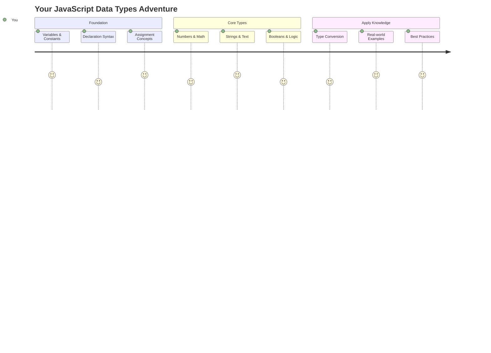

Kiểu dữ liệu là một trong những khái niệm cơ bản trong JavaScript mà bạn sẽ gặp trong mọi chương trình bạn viết. Hãy nghĩ về kiểu dữ liệu như hệ thống lưu trữ mà các thủ thư cổ đại ở Alexandria đã sử dụng – họ có những nơi cụ thể để lưu trữ các cuộn giấy chứa thơ ca, toán học và lịch sử. JavaScript tổ chức thông tin theo cách tương tự với các danh mục khác nhau cho các loại dữ liệu khác nhau.

Trong bài học này, chúng ta sẽ khám phá các kiểu dữ liệu cốt lõi làm cho JavaScript hoạt động. Bạn sẽ học cách xử lý số, văn bản, giá trị đúng/sai và hiểu tại sao việc chọn đúng kiểu dữ liệu lại quan trọng đối với chương trình của bạn. Những khái niệm này có thể trông trừu tượng lúc đầu, nhưng với thực hành, chúng sẽ trở nên quen thuộc.

Hiểu kiểu dữ liệu sẽ làm mọi thứ khác trong JavaScript trở nên rõ ràng hơn. Giống như các kiến trúc sư cần hiểu các vật liệu xây dựng khác nhau trước khi xây dựng một nhà thờ lớn, những nền tảng này sẽ hỗ trợ mọi thứ bạn xây dựng sau này.

## Quiz trước bài học
[Quiz trước bài học](https://ff-quizzes.netlify.app/web/)

Bài học này bao gồm những kiến thức cơ bản về JavaScript, ngôn ngữ mang lại tính tương tác trên web.

> Bạn có thể học bài này trên [Microsoft Learn](https://docs.microsoft.com/learn/modules/web-development-101-variables/?WT.mc_id=academic-77807-sagibbon)!

[](https://youtube.com/watch?v=JNIXfGiDWM8 "Biến trong JavaScript")

[](https://youtube.com/watch?v=AWfA95eLdq8 "Kiểu dữ liệu trong JavaScript")

> 🎥 Nhấp vào hình ảnh trên để xem video về biến và kiểu dữ liệu

Hãy bắt đầu với biến và các kiểu dữ liệu mà chúng chứa!

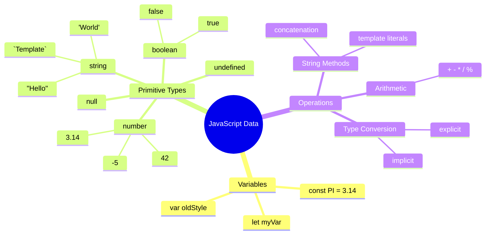

## Biến

Biến là những khối xây dựng cơ bản trong lập trình. Giống như những lọ được dán nhãn mà các nhà giả kim thời trung cổ sử dụng để lưu trữ các chất khác nhau, biến cho phép bạn lưu trữ thông tin và đặt cho nó một cái tên mô tả để bạn có thể tham chiếu sau này. Cần nhớ tuổi của ai đó? Lưu nó trong một biến gọi là `age`. Muốn theo dõi tên người dùng? Lưu nó trong một biến gọi là `userName`.

Chúng ta sẽ tập trung vào cách tiếp cận hiện đại để tạo biến trong JavaScript. Các kỹ thuật bạn học ở đây đại diện cho nhiều năm phát triển ngôn ngữ và các thực hành tốt nhất được cộng đồng lập trình phát triển.

Tạo và **khai báo** một biến có cú pháp sau **[keyword] [name]**. Nó bao gồm hai phần:

- **Từ khóa**. Sử dụng `let` cho các biến có thể thay đổi, hoặc `const` cho các giá trị không thay đổi.
- **Tên biến**, đây là tên mô tả mà bạn tự chọn.

✅ Từ khóa `let` được giới thiệu trong ES6 và cung cấp cho biến của bạn một cái gọi là _phạm vi khối_. Khuyến nghị rằng bạn nên sử dụng `let` hoặc `const` thay vì từ khóa cũ `var`. Chúng ta sẽ tìm hiểu sâu hơn về phạm vi khối trong các phần sau.

### Nhiệm vụ - làm việc với biến

1. **Khai báo một biến**. Hãy bắt đầu bằng cách tạo biến đầu tiên của chúng ta:

    ```javascript
    let myVariable;
    ```

   **Điều này đạt được:**
   - Điều này yêu cầu JavaScript tạo một vị trí lưu trữ gọi là `myVariable`
   - JavaScript phân bổ không gian trong bộ nhớ cho biến này
   - Biến hiện tại không có giá trị (undefined)

2. **Gán giá trị cho nó**. Bây giờ hãy đặt một cái gì đó vào biến của chúng ta:

    ```javascript
    myVariable = 123;
    ```

   **Cách hoạt động của việc gán giá trị:**
   - Toán tử `=` gán giá trị 123 cho biến của chúng ta
   - Biến hiện tại chứa giá trị này thay vì undefined
   - Bạn có thể tham chiếu giá trị này trong toàn bộ mã của mình bằng cách sử dụng `myVariable`

   > Lưu ý: việc sử dụng `=` trong bài học này có nghĩa là chúng ta sử dụng một "toán tử gán", được sử dụng để đặt giá trị cho một biến. Nó không biểu thị sự bằng nhau.

3. **Làm theo cách thông minh**. Thực ra, hãy kết hợp hai bước đó:

    ```javascript
    let myVariable = 123;
    ```

    **Cách tiếp cận này hiệu quả hơn:**
    - Bạn đang khai báo biến và gán giá trị trong một câu lệnh
    - Đây là thực hành tiêu chuẩn trong các nhà phát triển
    - Nó giảm độ dài mã trong khi vẫn duy trì sự rõ ràng

4. **Thay đổi ý định**. Điều gì xảy ra nếu chúng ta muốn lưu trữ một số khác?

   ```javascript
   myVariable = 321;
   ```

   **Hiểu về việc gán lại giá trị:**
   - Biến hiện tại chứa 321 thay vì 123
   - Giá trị trước đó bị thay thế – biến chỉ lưu trữ một giá trị tại một thời điểm
   - Tính có thể thay đổi này là đặc điểm chính của các biến được khai báo với `let`

   ✅ Thử ngay! Bạn có thể viết JavaScript trực tiếp trong trình duyệt của mình. Mở một cửa sổ trình duyệt và điều hướng đến Công cụ dành cho nhà phát triển. Trong bảng điều khiển, bạn sẽ thấy một lời nhắc; nhập `let myVariable = 123`, nhấn Enter, sau đó nhập `myVariable`. Điều gì xảy ra? Lưu ý, bạn sẽ học thêm về những khái niệm này trong các bài học tiếp theo.

### 🧠 **Kiểm tra sự thành thạo về biến: Làm quen**

**Hãy xem bạn cảm thấy thế nào về biến:**
- Bạn có thể giải thích sự khác biệt giữa khai báo và gán giá trị cho biến không?
- Điều gì xảy ra nếu bạn cố gắng sử dụng một biến trước khi khai báo nó?
- Khi nào bạn sẽ chọn `let` thay vì `const` cho một biến?

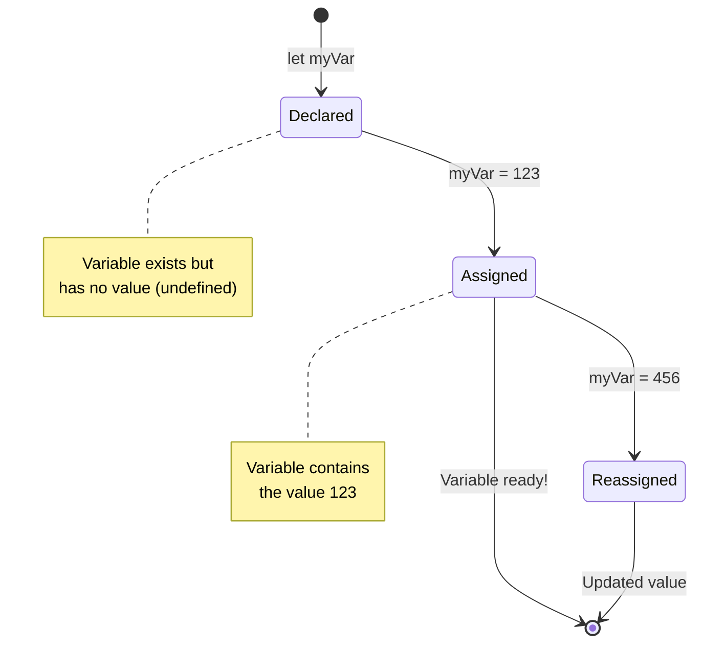

> **Mẹo nhanh**: Hãy nghĩ về biến như những hộp lưu trữ được dán nhãn. Bạn tạo hộp (`let`), đặt thứ gì đó vào đó (`=`), và sau đó có thể thay thế nội dung nếu cần!

## Hằng số

Đôi khi bạn cần lưu trữ thông tin không bao giờ thay đổi trong suốt quá trình thực thi chương trình. Hãy nghĩ về hằng số như các nguyên lý toán học mà Euclid đã thiết lập ở Hy Lạp cổ đại – một khi được chứng minh và ghi chép, chúng vẫn cố định cho tất cả các tham chiếu trong tương lai.

Hằng số hoạt động tương tự như biến, nhưng với một hạn chế quan trọng: một khi bạn gán giá trị cho chúng, giá trị đó không thể thay đổi. Tính bất biến này giúp ngăn chặn các thay đổi không mong muốn đối với các giá trị quan trọng trong chương trình của bạn.

Khai báo và khởi tạo một hằng số tuân theo các khái niệm giống như biến, ngoại trừ từ khóa `const`. Hằng số thường được khai báo với tất cả các chữ cái viết hoa.

```javascript
const MY_VARIABLE = 123;
```

**Đây là những gì mã này làm:**
- **Tạo** một hằng số tên là `MY_VARIABLE` với giá trị 123
- **Sử dụng** quy ước đặt tên viết hoa cho hằng số
- **Ngăn chặn** bất kỳ thay đổi nào trong tương lai đối với giá trị này

Hằng số có hai quy tắc chính:

- **Bạn phải gán giá trị ngay lập tức** – không được phép có hằng số trống!
- **Bạn không bao giờ có thể thay đổi giá trị đó** – JavaScript sẽ báo lỗi nếu bạn cố gắng. Hãy xem ý nghĩa của điều này:

   **Giá trị đơn giản** - Điều sau đây KHÔNG được phép:
   
      ```javascript
      const PI = 3;
      PI = 4; // không được phép
      ```

   **Những điều bạn cần nhớ:**
   - **Cố gắng** gán lại giá trị cho hằng số sẽ gây ra lỗi
   - **Bảo vệ** các giá trị quan trọng khỏi các thay đổi không mong muốn
   - **Đảm bảo** giá trị vẫn nhất quán trong toàn bộ chương trình của bạn
 
   **Tham chiếu đối tượng được bảo vệ** - Điều sau đây KHÔNG được phép:
   
      ```javascript
      const obj = { a: 3 };
      obj = { b: 5 } // không được phép
      ```

   **Hiểu những khái niệm này:**
   - **Ngăn chặn** thay thế toàn bộ đối tượng bằng một đối tượng mới
   - **Bảo vệ** tham chiếu đến đối tượng ban đầu
   - **Duy trì** danh tính của đối tượng trong bộ nhớ

    **Giá trị đối tượng không được bảo vệ** - Điều sau đây ĐƯỢC phép:
    
      ```javascript
      const obj = { a: 3 };
      obj.a = 5;  // được phép
      ```

      **Phân tích điều gì xảy ra ở đây:**
      - **Thay đổi** giá trị thuộc tính bên trong đối tượng
      - **Giữ nguyên** tham chiếu đối tượng
      - **Chứng minh** rằng nội dung đối tượng có thể thay đổi trong khi tham chiếu vẫn cố định

   > Lưu ý, một `const` có nghĩa là tham chiếu được bảo vệ khỏi việc gán lại. Giá trị không phải là _bất biến_ và có thể thay đổi, đặc biệt nếu nó là một cấu trúc phức tạp như một đối tượng.

## Kiểu dữ liệu

JavaScript tổ chức thông tin thành các danh mục khác nhau gọi là kiểu dữ liệu. Khái niệm này giống như cách các học giả cổ đại phân loại kiến thức – Aristotle phân biệt giữa các loại lý luận khác nhau, biết rằng các nguyên lý logic không thể áp dụng đồng nhất cho thơ ca, toán học và triết học tự nhiên.

Kiểu dữ liệu quan trọng vì các thao tác khác nhau hoạt động với các loại thông tin khác nhau. Giống như bạn không thể thực hiện phép toán trên tên của một người hoặc sắp xếp theo thứ tự bảng chữ cái một phương trình toán học, JavaScript yêu cầu kiểu dữ liệu phù hợp cho mỗi thao tác. Hiểu điều này giúp tránh lỗi và làm cho mã của bạn đáng tin cậy hơn.

Biến có thể lưu trữ nhiều loại giá trị khác nhau, như số và văn bản. Những loại giá trị khác nhau này được gọi là **kiểu dữ liệu**. Kiểu dữ liệu là một phần quan trọng của phát triển phần mềm vì nó giúp các nhà phát triển đưa ra quyết định về cách mã nên được viết và cách phần mềm nên chạy. Hơn nữa, một số kiểu dữ liệu có các tính năng độc đáo giúp biến đổi hoặc trích xuất thông tin bổ sung từ một giá trị.

✅ Kiểu dữ liệu cũng được gọi là các kiểu dữ liệu nguyên thủy của JavaScript, vì chúng là các kiểu dữ liệu cấp thấp nhất được cung cấp bởi ngôn ngữ. Có 7 kiểu dữ liệu nguyên thủy: string, number, bigint, boolean, undefined, null và symbol. Dành một phút để hình dung mỗi kiểu dữ liệu nguyên thủy này có thể đại diện cho điều gì. `zebra` là gì? Còn `0` thì sao? `true`?

### Số

Số là kiểu dữ liệu đơn giản nhất trong JavaScript. Cho dù bạn đang làm việc với số nguyên như 42, số thập phân như 3.14, hay số âm như -5, JavaScript xử lý chúng một cách đồng nhất.

Nhớ biến của chúng ta từ trước không? Số 123 mà chúng ta đã lưu thực ra là một kiểu dữ liệu số:

```javascript
let myVariable = 123;
```

**Đặc điểm chính:**
- JavaScript tự động nhận diện giá trị số
- Bạn có thể thực hiện các phép toán với các biến này
- Không cần khai báo kiểu rõ ràng

Biến có thể lưu trữ tất cả các loại số, bao gồm số thập phân hoặc số âm. Số cũng có thể được sử dụng với các toán tử số học, được đề cập trong [phần tiếp theo](../../../../2-js-basics/1-data-types).

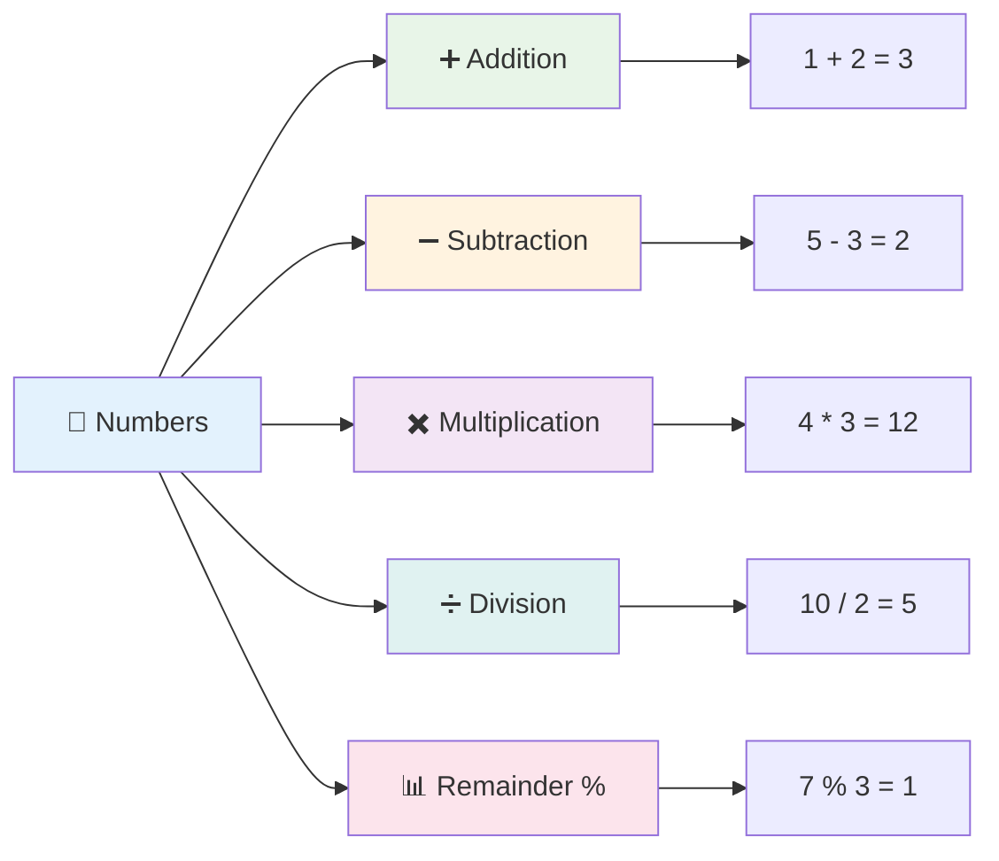

### Toán tử số học

Toán tử số học cho phép bạn thực hiện các phép tính toán học trong JavaScript. Các toán tử này tuân theo các nguyên lý mà các nhà toán học đã sử dụng trong nhiều thế kỷ – các ký hiệu giống như những ký hiệu xuất hiện trong các tác phẩm của các học giả như Al-Khwarizmi, người đã phát triển ký hiệu đại số.

Các toán tử hoạt động như bạn mong đợi từ toán học truyền thống: dấu cộng để cộng, dấu trừ để trừ, và tương tự.

Có một số loại toán tử để sử dụng khi thực hiện các chức năng số học, và một số được liệt kê dưới đây:

| Ký hiệu | Mô tả                                                                  | Ví dụ                           |
| ------ | ---------------------------------------------------------------------- | -------------------------------- |
| `+`    | **Cộng**: Tính tổng của hai số                                         | `1 + 2 //kết quả mong đợi là 3`   |
| `-`    | **Trừ**: Tính hiệu của hai số                                          | `1 - 2 //kết quả mong đợi là -1`  |
| `*`    | **Nhân**: Tính tích của hai số                                         | `1 * 2 //kết quả mong đợi là 2`   |
| `/`    | **Chia**: Tính thương của hai số                                       | `1 / 2 //kết quả mong đợi là 0.5` |
| `%`    | **Phần dư**: Tính phần dư từ phép chia của hai số                      | `1 % 2 //kết quả mong đợi là 1`   |

✅ Thử ngay! Thử một phép toán số học trong bảng điều khiển của trình duyệt của bạn. Kết quả có làm bạn ngạc nhiên không?

### 🧮 **Kiểm tra kỹ năng toán học: Tính toán tự tin**

**Kiểm tra sự hiểu biết về số học của bạn:**
- Sự khác biệt giữa `/` (chia) và `%` (phần dư) là gì?
- Bạn có thể dự đoán `10 % 3` bằng bao nhiêu không? (Gợi ý: không phải 3.33 đâu...)
- Tại sao toán tử phần dư lại hữu ích trong lập trình?

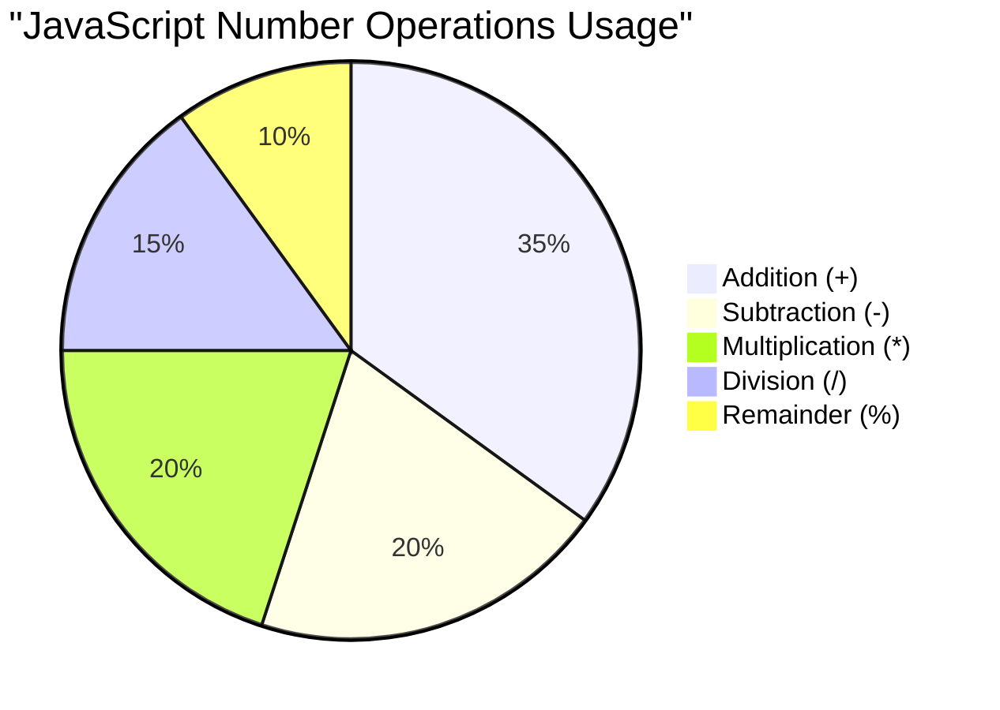

> **Thông tin thực tế**: Toán tử phần dư (%) rất hữu ích để kiểm tra xem số có phải là số chẵn/lẻ, tạo mẫu hoặc lặp qua các mảng!

### Chuỗi

Trong JavaScript, dữ liệu văn bản được biểu diễn dưới dạng chuỗi. Thuật ngữ "chuỗi" xuất phát từ khái niệm các ký tự được nối lại với nhau theo trình tự, giống như cách các nhà chép sách trong các tu viện thời trung cổ kết nối các chữ cái để tạo thành từ và câu trong bản thảo của họ.

Chuỗi là nền tảng của phát triển web. Mọi đoạn văn bản hiển thị trên một trang web – tên người dùng, nhãn nút, thông báo lỗi, nội dung – đều được xử lý dưới dạng dữ liệu chuỗi. Hiểu chuỗi là điều cần thiết để tạo giao diện người dùng chức năng.

Chuỗi là tập hợp các ký tự nằm giữa dấu nháy đơn hoặc nháy kép.

```javascript
'This is a string'
"This is also a string"
let myString = 'This is a string value stored in a variable';
```

**Hiểu những khái niệm này:**
- **Sử dụng** dấu nháy đơn `'` hoặc dấu nháy kép `"` để định nghĩa chuỗi
- **Lưu trữ** dữ liệu văn bản có thể bao gồm chữ cái, số và ký hiệu
- **Gán** giá trị chuỗi cho biến để sử dụng sau này
- **Yêu cầu** dấu nháy để phân biệt văn bản với tên biến

Hãy nhớ sử dụng dấu nháy khi viết chuỗi, nếu không JavaScript sẽ cho rằng đó là tên biến.

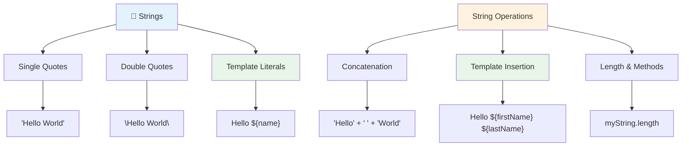

### Định dạng chuỗi

Việc thao tác chuỗi cho phép bạn kết hợp các phần tử văn bản, tích hợp biến và tạo nội dung động phản hồi trạng thái chương trình. Kỹ thuật này cho phép bạn xây dựng văn bản một cách lập trình. 

Thường bạn cần nối nhiều chuỗi lại với nhau – quá trình này được gọi là nối chuỗi.
Để **nối** hai hoặc nhiều chuỗi, hoặc ghép chúng lại với nhau, sử dụng toán tử `+`.

```javascript
let myString1 = "Hello";
let myString2 = "World";

myString1 + myString2 + "!"; //HelloWorld!
myString1 + " " + myString2 + "!"; //Hello World!
myString1 + ", " + myString2 + "!"; //Hello, World!
```

**Từng bước, đây là những gì đang diễn ra:**
- **Kết hợp** nhiều chuỗi bằng toán tử `+`
- **Ghép** các chuỗi trực tiếp với nhau mà không có khoảng trắng trong ví dụ đầu tiên
- **Thêm** ký tự khoảng trắng `" "` giữa các chuỗi để dễ đọc hơn
- **Chèn** dấu câu như dấu phẩy để tạo định dạng đúng

✅ Tại sao `1 + 1 = 2` trong JavaScript, nhưng `'1' + '1' = 11`? Hãy suy nghĩ về điều này. Còn `'1' + 1` thì sao?

**Template literals** là một cách khác để định dạng chuỗi, thay vì sử dụng dấu nháy, bạn sử dụng dấu backtick. Bất cứ thứ gì không phải văn bản thông thường phải được đặt trong các placeholder `${ }`. Điều này bao gồm bất kỳ biến nào có thể là chuỗi.

```javascript
let myString1 = "Hello";
let myString2 = "World";

`${myString1} ${myString2}!` //Hello World!
`${myString1}, ${myString2}!` //Hello, World!
```

**Hãy hiểu từng phần:**
- **Sử dụng** dấu backtick `` ` `` thay vì dấu nháy thông thường để tạo template literals
- **Nhúng** biến trực tiếp bằng cú pháp placeholder `${}`
- **Giữ nguyên** khoảng trắng và định dạng đúng như đã viết
- **Cung cấp** cách tạo chuỗi phức tạp với biến một cách rõ ràng hơn

Bạn có thể đạt được mục tiêu định dạng của mình bằng cả hai phương pháp, nhưng template literals sẽ giữ nguyên khoảng trắng và ngắt dòng.

✅ Khi nào bạn nên sử dụng template literal thay vì chuỗi thông thường?

### 🔤 **Kiểm tra kỹ năng chuỗi: Tự tin thao tác văn bản**

**Đánh giá kỹ năng chuỗi của bạn:**
- Bạn có thể giải thích tại sao `'1' + '1'` bằng `'11'` thay vì `2` không?
- Phương pháp nào bạn thấy dễ đọc hơn: nối chuỗi hay template literals?
- Điều gì xảy ra nếu bạn quên dấu nháy quanh một chuỗi?

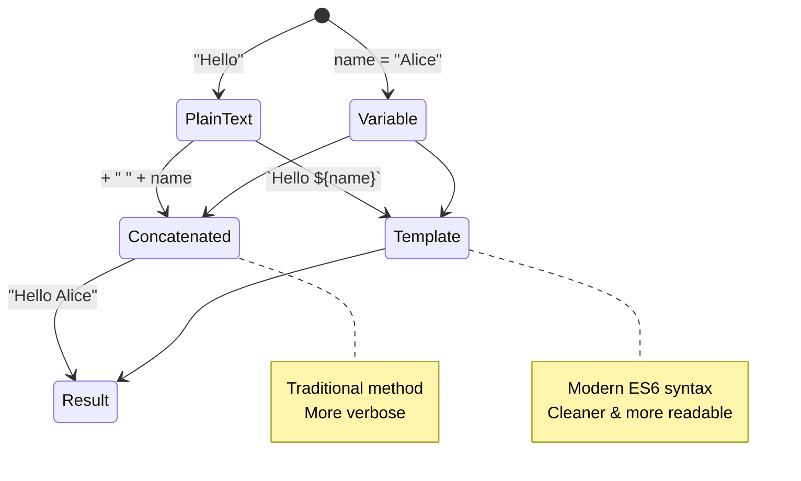

> **Mẹo chuyên nghiệp**: Template literals thường được ưu tiên cho việc xây dựng chuỗi phức tạp vì chúng dễ đọc hơn và xử lý chuỗi nhiều dòng một cách tuyệt vời!

### Booleans

Booleans đại diện cho dạng dữ liệu đơn giản nhất: chúng chỉ có thể chứa một trong hai giá trị – `true` hoặc `false`. Hệ thống logic nhị phân này bắt nguồn từ công trình của George Boole, một nhà toán học thế kỷ 19 đã phát triển đại số Boolean.

Mặc dù đơn giản, booleans rất quan trọng đối với logic chương trình. Chúng cho phép mã của bạn đưa ra quyết định dựa trên các điều kiện – liệu người dùng đã đăng nhập, nút đã được nhấn hay các tiêu chí nhất định đã được đáp ứng.

Booleans chỉ có thể có hai giá trị: `true` hoặc `false`. Booleans giúp đưa ra quyết định về dòng mã nào nên chạy khi các điều kiện nhất định được đáp ứng. Trong nhiều trường hợp, [toán tử](../../../../2-js-basics/1-data-types) hỗ trợ thiết lập giá trị của Boolean và bạn sẽ thường thấy và viết các biến được khởi tạo hoặc giá trị của chúng được cập nhật bằng một toán tử.

```javascript
let myTrueBool = true;
let myFalseBool = false;
```

**Trong ví dụ trên, chúng ta đã:**
- **Tạo** một biến lưu giá trị Boolean `true`
- **Minh họa** cách lưu giá trị Boolean `false`
- **Sử dụng** các từ khóa chính xác `true` và `false` (không cần dấu nháy)
- **Chuẩn bị** các biến này để sử dụng trong các câu lệnh điều kiện

✅ Một biến có thể được coi là 'truthy' nếu nó đánh giá là boolean `true`. Thú vị là, trong JavaScript, [tất cả các giá trị đều là truthy trừ khi được định nghĩa là falsy](https://developer.mozilla.org/docs/Glossary/Truthy).

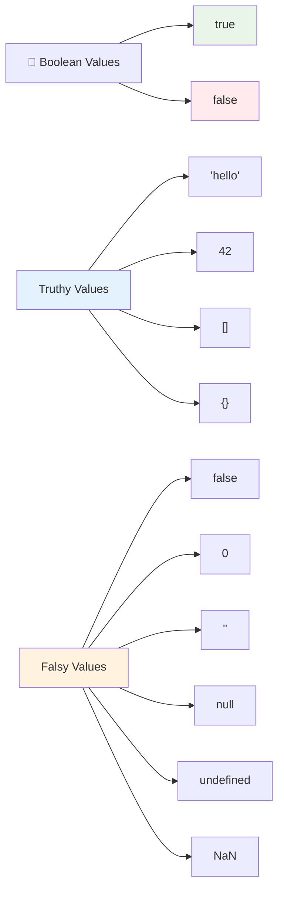

### 🎯 **Kiểm tra logic Boolean: Kỹ năng ra quyết định**

**Kiểm tra hiểu biết của bạn về boolean:**
- Tại sao bạn nghĩ JavaScript có giá trị "truthy" và "falsy" ngoài chỉ `true` và `false`?
- Bạn có thể dự đoán giá trị nào trong số này là falsy: `0`, `"0"`, `[]`, `"false"` không?
- Làm thế nào booleans có thể hữu ích trong việc kiểm soát luồng chương trình?

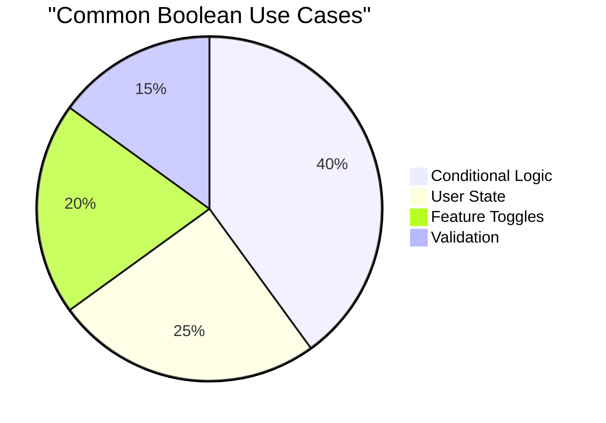

> **Nhớ rằng**: Trong JavaScript, chỉ có 6 giá trị là falsy: `false`, `0`, `""`, `null`, `undefined`, và `NaN`. Mọi thứ khác đều là truthy!

---

## 📊 **Tóm tắt công cụ kiểu dữ liệu của bạn**

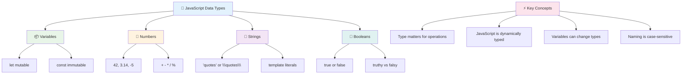

## Thử thách GitHub Copilot Agent 🚀

Sử dụng chế độ Agent để hoàn thành thử thách sau:

**Mô tả:** Tạo một trình quản lý thông tin cá nhân thể hiện tất cả các kiểu dữ liệu JavaScript bạn đã học trong bài học này đồng thời xử lý các tình huống dữ liệu thực tế.

**Yêu cầu:** Xây dựng một chương trình JavaScript tạo một đối tượng hồ sơ người dùng chứa: tên của một người (string), tuổi (number), trạng thái là sinh viên (boolean), các màu yêu thích dưới dạng mảng, và một đối tượng địa chỉ với các thuộc tính đường phố, thành phố, và mã bưu điện. Bao gồm các hàm để hiển thị thông tin hồ sơ và cập nhật từng trường riêng lẻ. Đảm bảo thể hiện nối chuỗi, template literals, các phép toán số học với tuổi, và logic boolean cho trạng thái sinh viên.

Tìm hiểu thêm về [chế độ agent](https://code.visualstudio.com/blogs/2025/02/24/introducing-copilot-agent-mode) tại đây.

## 🚀 Thử thách

JavaScript có một số hành vi có thể khiến các nhà phát triển bất ngờ. Đây là một ví dụ kinh điển để khám phá: thử gõ vào bảng điều khiển trình duyệt của bạn: `let age = 1; let Age = 2; age == Age` và quan sát kết quả. Nó trả về `false` – bạn có thể xác định tại sao không?

Điều này đại diện cho một trong nhiều hành vi JavaScript đáng hiểu. Hiểu rõ những điều kỳ quặc này sẽ giúp bạn viết mã đáng tin cậy hơn và gỡ lỗi hiệu quả hơn.

## Câu hỏi sau bài giảng
[Câu hỏi sau bài giảng](https://ff-quizzes.netlify.app)

## Ôn tập & Tự học

Xem qua [danh sách bài tập JavaScript này](https://css-tricks.com/snippets/javascript/) và thử một bài. Bạn đã học được gì?

## Bài tập

[Thực hành kiểu dữ liệu](assignment.md)

## 🚀 Lộ trình làm chủ kiểu dữ liệu JavaScript của bạn

### ⚡ **Những gì bạn có thể làm trong 5 phút tới**
- [ ] Mở bảng điều khiển trình duyệt của bạn và tạo 3 biến với các kiểu dữ liệu khác nhau
- [ ] Thử thách: `let age = 1; let Age = 2; age == Age` và tìm hiểu tại sao nó là false
- [ ] Thực hành nối chuỗi với tên của bạn và số yêu thích
- [ ] Kiểm tra điều gì xảy ra khi bạn cộng một số vào một chuỗi

### 🎯 **Những gì bạn có thể hoàn thành trong giờ này**
- [ ] Hoàn thành câu hỏi sau bài học và ôn lại các khái niệm khó hiểu
- [ ] Tạo một máy tính mini cộng, trừ, nhân, và chia hai số
- [ ] Xây dựng một trình định dạng tên đơn giản bằng template literals
- [ ] Khám phá sự khác biệt giữa toán tử so sánh `==` và `===`
- [ ] Thực hành chuyển đổi giữa các kiểu dữ liệu khác nhau

### 📅 **Nền tảng JavaScript của bạn trong tuần**
- [ ] Hoàn thành bài tập với sự tự tin và sáng tạo
- [ ] Tạo một đối tượng hồ sơ cá nhân sử dụng tất cả các kiểu dữ liệu đã học
- [ ] Thực hành với [bài tập JavaScript từ CSS-Tricks](https://css-tricks.com/snippets/javascript/)
- [ ] Xây dựng một trình xác thực biểu mẫu đơn giản bằng logic boolean
- [ ] Thử nghiệm với kiểu dữ liệu mảng và đối tượng (xem trước bài học tiếp theo)
- [ ] Tham gia cộng đồng JavaScript và đặt câu hỏi về kiểu dữ liệu

### 🌟 **Sự chuyển đổi của bạn trong tháng**
- [ ] Tích hợp kiến thức kiểu dữ liệu vào các dự án lập trình lớn hơn
- [ ] Hiểu khi nào và tại sao sử dụng từng kiểu dữ liệu trong ứng dụng thực tế
- [ ] Giúp những người mới bắt đầu hiểu các nguyên tắc cơ bản của JavaScript
- [ ] Xây dựng một ứng dụng nhỏ quản lý các loại dữ liệu người dùng khác nhau
- [ ] Khám phá các khái niệm kiểu dữ liệu nâng cao như ép kiểu và so sánh nghiêm ngặt
- [ ] Đóng góp cho các dự án JavaScript mã nguồn mở bằng cách cải thiện tài liệu

### 🧠 **Kiểm tra cuối cùng về làm chủ kiểu dữ liệu**

**Chúc mừng nền tảng JavaScript của bạn:**
- Kiểu dữ liệu nào khiến bạn ngạc nhiên nhất về hành vi của nó?
- Bạn cảm thấy thoải mái như thế nào khi giải thích biến so với hằng số cho một người bạn?
- Điều thú vị nhất bạn phát hiện về hệ thống kiểu của JavaScript là gì?
- Ứng dụng thực tế nào bạn có thể tưởng tượng xây dựng với những nguyên tắc cơ bản này?

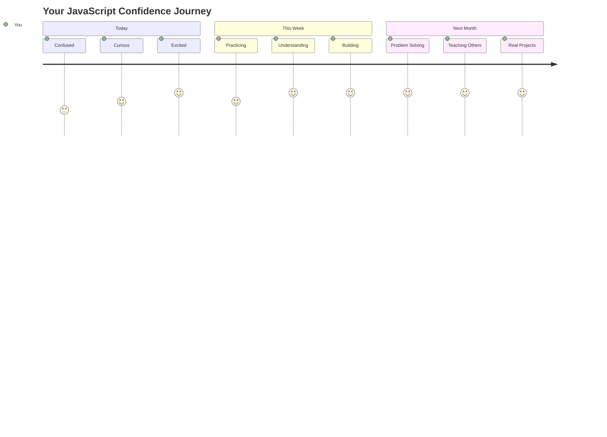

> 💡 **Bạn đã xây dựng nền tảng!** Hiểu kiểu dữ liệu giống như học bảng chữ cái trước khi viết câu chuyện. Mọi chương trình JavaScript bạn từng viết sẽ sử dụng những khái niệm cơ bản này. Giờ đây bạn đã có các khối xây dựng để tạo trang web tương tác, ứng dụng động, và giải quyết các vấn đề thực tế bằng mã. Chào mừng bạn đến với thế giới tuyệt vời của JavaScript! 🎉

---

**Tuyên bố miễn trừ trách nhiệm**:  
Tài liệu này đã được dịch bằng dịch vụ dịch thuật AI [Co-op Translator](https://github.com/Azure/co-op-translator). Mặc dù chúng tôi cố gắng đảm bảo độ chính xác, xin lưu ý rằng các bản dịch tự động có thể chứa lỗi hoặc không chính xác. Tài liệu gốc bằng ngôn ngữ bản địa nên được coi là nguồn thông tin chính thức. Đối với thông tin quan trọng, nên sử dụng dịch vụ dịch thuật chuyên nghiệp bởi con người. Chúng tôi không chịu trách nhiệm về bất kỳ sự hiểu lầm hoặc diễn giải sai nào phát sinh từ việc sử dụng bản dịch này.