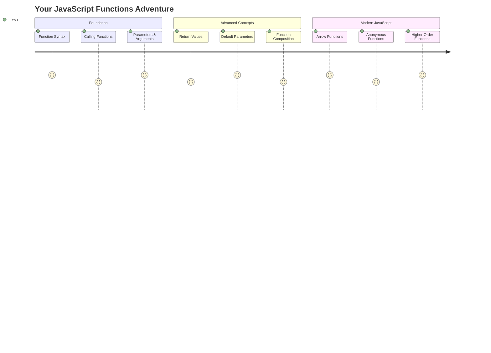
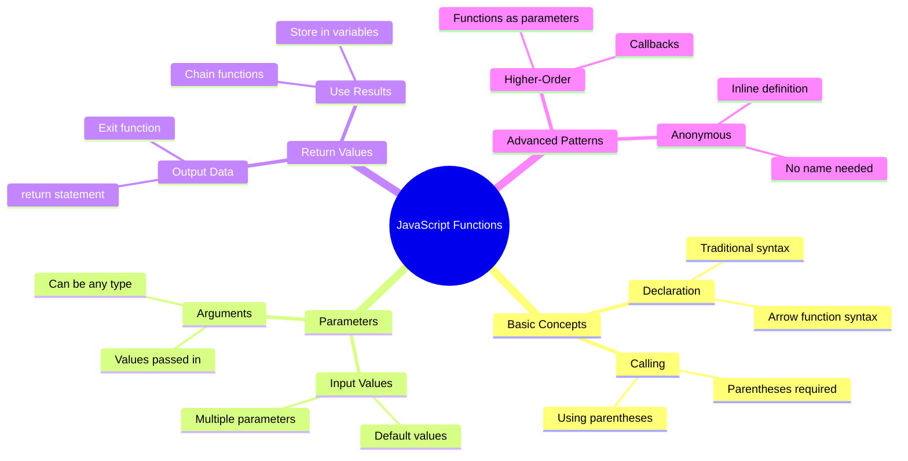
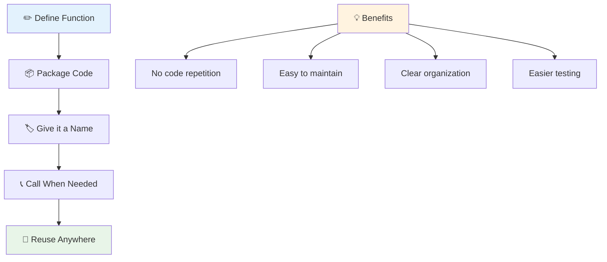
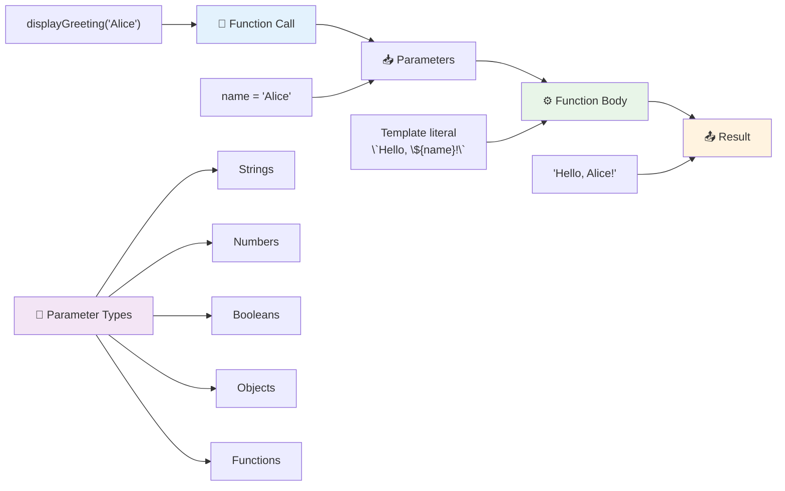
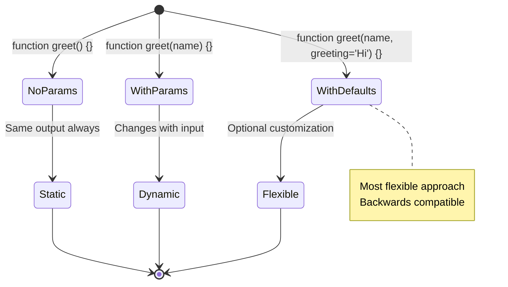
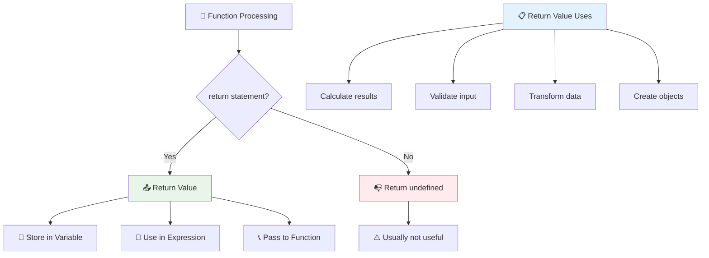
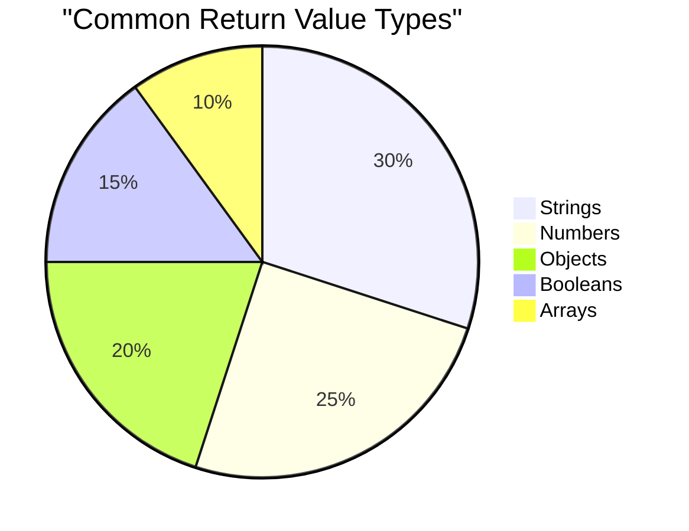
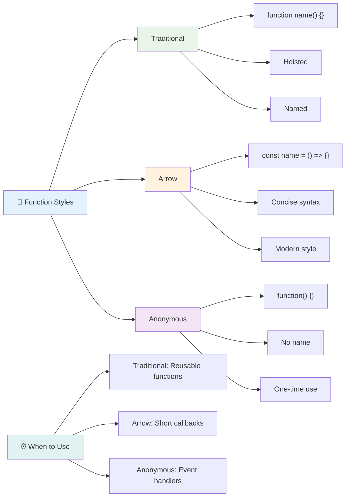
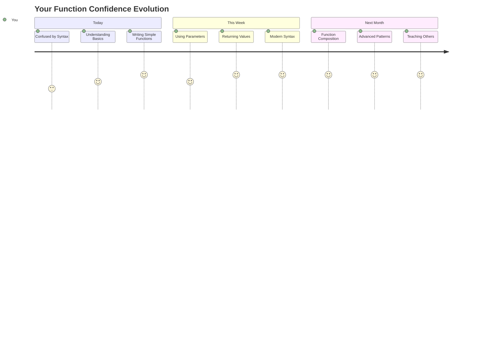

<!--
CO_OP_TRANSLATOR_METADATA:
{
  "original_hash": "71f7d7dafa1c7194d79ddac87f669ff9",
  "translation_date": "2025-11-06T11:12:08+00:00",
  "source_file": "2-js-basics/2-functions-methods/README.md",
  "language_code": "vi"
}
-->
# Cơ bản về JavaScript: Phương thức và Hàm


> Sketchnote bởi [Tomomi Imura](https://twitter.com/girlie_mac)



## Quiz trước bài học
[Quiz trước bài học](https://ff-quizzes.netlify.app)

Việc viết lại cùng một đoạn mã nhiều lần là một trong những điều gây khó chịu nhất trong lập trình. Hàm giải quyết vấn đề này bằng cách cho phép bạn đóng gói mã thành các khối có thể tái sử dụng. Hãy nghĩ về hàm như các bộ phận tiêu chuẩn hóa đã làm cho dây chuyền lắp ráp của Henry Ford trở nên cách mạng – một khi bạn tạo ra một thành phần đáng tin cậy, bạn có thể sử dụng nó ở bất cứ đâu mà không cần phải xây dựng lại từ đầu.

Hàm cho phép bạn gói gọn các đoạn mã để bạn có thể tái sử dụng chúng trong toàn bộ chương trình của mình. Thay vì sao chép và dán cùng một logic ở khắp nơi, bạn có thể tạo một hàm một lần và gọi nó bất cứ khi nào cần. Cách tiếp cận này giúp mã của bạn được tổ chức và việc cập nhật trở nên dễ dàng hơn.

Trong bài học này, bạn sẽ học cách tạo hàm của riêng mình, truyền thông tin vào chúng và nhận lại kết quả hữu ích. Bạn sẽ khám phá sự khác biệt giữa hàm và phương thức, học các cách tiếp cận cú pháp hiện đại, và thấy cách các hàm có thể hoạt động cùng nhau. Chúng ta sẽ xây dựng các khái niệm này từng bước.

[](https://youtube.com/watch?v=XgKsD6Zwvlc "Phương thức và Hàm")

> 🎥 Nhấp vào hình ảnh trên để xem video về phương thức và hàm.

> Bạn có thể học bài này trên [Microsoft Learn](https://docs.microsoft.com/learn/modules/web-development-101-functions/?WT.mc_id=academic-77807-sagibbon)!



## Hàm

Hàm là một khối mã độc lập thực hiện một nhiệm vụ cụ thể. Nó bao gồm logic mà bạn có thể thực thi bất cứ khi nào cần.

Thay vì viết lại cùng một đoạn mã nhiều lần trong chương trình của bạn, bạn có thể đóng gói nó trong một hàm và gọi hàm đó bất cứ khi nào bạn cần. Cách tiếp cận này giúp mã của bạn sạch sẽ và việc cập nhật trở nên dễ dàng hơn. Hãy nghĩ đến thách thức bảo trì nếu bạn cần thay đổi logic được rải rác ở 20 vị trí khác nhau trong mã của mình.

Việc đặt tên hàm một cách mô tả là rất quan trọng. Một hàm được đặt tên rõ ràng sẽ truyền đạt mục đích của nó một cách dễ hiểu – khi bạn thấy `cancelTimer()`, bạn ngay lập tức hiểu nó làm gì, giống như một nút được gắn nhãn rõ ràng cho bạn biết chính xác điều gì sẽ xảy ra khi bạn nhấp vào.

## Tạo và gọi một hàm

Hãy xem cách tạo một hàm. Cú pháp tuân theo một mẫu nhất quán:

```javascript
function nameOfFunction() { // function definition
 // function definition/body
}
```

Hãy phân tích:
- Từ khóa `function` cho JavaScript biết "Này, tôi đang tạo một hàm!"
- `nameOfFunction` là nơi bạn đặt tên mô tả cho hàm của mình
- Dấu ngoặc đơn `()` là nơi bạn có thể thêm tham số (chúng ta sẽ nói về điều này sớm)
- Dấu ngoặc nhọn `{}` chứa mã thực tế sẽ chạy khi bạn gọi hàm

Hãy tạo một hàm chào đơn giản để xem cách hoạt động:

```javascript
function displayGreeting() {
  console.log('Hello, world!');
}
```

Hàm này in "Hello, world!" ra console. Một khi bạn đã định nghĩa nó, bạn có thể sử dụng nó nhiều lần khi cần.

Để thực thi (hoặc "gọi") hàm của bạn, hãy viết tên của nó theo sau là dấu ngoặc đơn. JavaScript cho phép bạn định nghĩa hàm trước hoặc sau khi gọi nó – công cụ JavaScript sẽ xử lý thứ tự thực thi.

```javascript
// calling our function
displayGreeting();
```

Khi bạn chạy dòng này, nó thực thi tất cả mã bên trong hàm `displayGreeting` của bạn, hiển thị "Hello, world!" trong console của trình duyệt. Bạn có thể gọi hàm này nhiều lần.

### 🧠 **Kiểm tra kiến thức cơ bản về hàm: Xây dựng các hàm đầu tiên của bạn**

**Hãy xem bạn cảm thấy thế nào về các hàm cơ bản:**
- Bạn có thể giải thích tại sao chúng ta sử dụng dấu ngoặc nhọn `{}` trong định nghĩa hàm không?
- Điều gì xảy ra nếu bạn viết `displayGreeting` mà không có dấu ngoặc đơn?
- Tại sao bạn có thể muốn gọi cùng một hàm nhiều lần?



> **Lưu ý:** Bạn đã sử dụng **phương thức** trong suốt các bài học này. `console.log()` là một phương thức – về cơ bản là một hàm thuộc về đối tượng `console`. Sự khác biệt chính là phương thức được gắn với đối tượng, trong khi hàm đứng độc lập. Nhiều nhà phát triển sử dụng các thuật ngữ này thay thế nhau trong các cuộc trò chuyện thông thường.

### Các thực hành tốt nhất về hàm

Dưới đây là một vài mẹo giúp bạn viết các hàm tốt:

- Đặt tên hàm rõ ràng, mô tả – bạn sẽ cảm ơn chính mình trong tương lai!
- Sử dụng **camelCasing** cho tên nhiều từ (như `calculateTotal` thay vì `calculate_total`)
- Giữ mỗi hàm tập trung vào việc thực hiện một nhiệm vụ tốt

## Truyền thông tin vào một hàm

Hàm `displayGreeting` của chúng ta bị giới hạn – nó chỉ có thể hiển thị "Hello, world!" cho tất cả mọi người. Tham số cho phép chúng ta làm cho các hàm linh hoạt và hữu ích hơn.

**Tham số** hoạt động như các chỗ trống nơi bạn có thể chèn các giá trị khác nhau mỗi lần bạn sử dụng hàm. Bằng cách này, cùng một hàm có thể hoạt động với thông tin khác nhau trong mỗi lần gọi.

Bạn liệt kê các tham số bên trong dấu ngoặc đơn khi bạn định nghĩa hàm, tách các tham số bằng dấu phẩy:

```javascript
function name(param, param2, param3) {

}
```

Mỗi tham số hoạt động như một chỗ trống – khi ai đó gọi hàm của bạn, họ sẽ cung cấp các giá trị thực tế được chèn vào các vị trí này.

Hãy cập nhật hàm chào của chúng ta để chấp nhận tên của ai đó:

```javascript
function displayGreeting(name) {
  const message = `Hello, ${name}!`;
  console.log(message);
}
```

Lưu ý cách chúng ta sử dụng dấu backticks (`` ` ``) và `${}` để chèn tên trực tiếp vào thông điệp – đây được gọi là template literal, và nó là một cách rất tiện lợi để xây dựng chuỗi với các biến được trộn lẫn.

Bây giờ khi chúng ta gọi hàm, chúng ta có thể truyền vào bất kỳ tên nào:

```javascript
displayGreeting('Christopher');
// displays "Hello, Christopher!" when run
```

JavaScript lấy chuỗi `'Christopher'`, gán nó cho tham số `name`, và tạo thông điệp cá nhân hóa "Hello, Christopher!"



## Giá trị mặc định

Điều gì xảy ra nếu chúng ta muốn làm cho một số tham số tùy chọn? Đó là lúc giá trị mặc định trở nên hữu ích!

Giả sử chúng ta muốn mọi người có thể tùy chỉnh từ chào, nhưng nếu họ không chỉ định, chúng ta sẽ chỉ sử dụng "Hello" làm giá trị dự phòng. Bạn có thể thiết lập giá trị mặc định bằng cách sử dụng dấu bằng, giống như thiết lập một biến:

```javascript
function displayGreeting(name, salutation='Hello') {
  console.log(`${salutation}, ${name}`);
}
```

Ở đây, `name` vẫn là bắt buộc, nhưng `salutation` có giá trị dự phòng là `'Hello'` nếu không ai cung cấp một lời chào khác.

Bây giờ chúng ta có thể gọi hàm này theo hai cách khác nhau:

```javascript
displayGreeting('Christopher');
// displays "Hello, Christopher"

displayGreeting('Christopher', 'Hi');
// displays "Hi, Christopher"
```

Trong lần gọi đầu tiên, JavaScript sử dụng giá trị mặc định "Hello" vì chúng ta không chỉ định lời chào. Trong lần gọi thứ hai, nó sử dụng "Hi" tùy chỉnh của chúng ta. Sự linh hoạt này làm cho các hàm thích ứng với các tình huống khác nhau.

### 🎛️ **Kiểm tra sự thành thạo về tham số: Làm cho hàm linh hoạt**

**Kiểm tra sự hiểu biết của bạn về tham số:**
- Sự khác biệt giữa tham số và đối số là gì?
- Tại sao giá trị mặc định lại hữu ích trong lập trình thực tế?
- Bạn có thể dự đoán điều gì xảy ra nếu bạn truyền nhiều đối số hơn số tham số không?



> **Mẹo chuyên nghiệp**: Các tham số mặc định làm cho hàm của bạn thân thiện hơn với người dùng. Người dùng có thể bắt đầu nhanh chóng với các giá trị mặc định hợp lý, nhưng vẫn tùy chỉnh khi cần!

## Giá trị trả về

Các hàm của chúng ta cho đến nay chỉ hiển thị thông điệp ra console, nhưng điều gì xảy ra nếu bạn muốn một hàm tính toán điều gì đó và trả lại kết quả cho bạn?

Đó là lúc **giá trị trả về** xuất hiện. Thay vì chỉ hiển thị điều gì đó, một hàm có thể trả lại một giá trị mà bạn có thể lưu trữ trong một biến hoặc sử dụng ở các phần khác của mã.

Để gửi một giá trị trở lại, bạn sử dụng từ khóa `return` theo sau là bất cứ điều gì bạn muốn trả về:

```javascript
return myVariable;
```

Điều quan trọng: khi một hàm gặp câu lệnh `return`, nó ngay lập tức dừng chạy và gửi giá trị đó trở lại cho người gọi.

Hãy sửa đổi hàm chào của chúng ta để trả về thông điệp thay vì hiển thị nó:

```javascript
function createGreetingMessage(name) {
  const message = `Hello, ${name}`;
  return message;
}
```

Bây giờ thay vì hiển thị lời chào, hàm này tạo thông điệp và trả lại cho chúng ta.

Để sử dụng giá trị trả về, chúng ta có thể lưu trữ nó trong một biến giống như bất kỳ giá trị nào khác:

```javascript
const greetingMessage = createGreetingMessage('Christopher');
```

Bây giờ `greetingMessage` chứa "Hello, Christopher" và chúng ta có thể sử dụng nó ở bất cứ đâu trong mã của mình – để hiển thị trên trang web, đưa vào email, hoặc truyền cho một hàm khác.



### 🔄 **Kiểm tra giá trị trả về: Nhận kết quả trở lại**

**Đánh giá sự hiểu biết của bạn về giá trị trả về:**
- Điều gì xảy ra với mã sau câu lệnh `return` trong một hàm?
- Tại sao việc trả về giá trị thường tốt hơn chỉ hiển thị ra console?
- Một hàm có thể trả về các loại giá trị khác nhau (chuỗi, số, boolean) không?



> **Thông tin quan trọng**: Các hàm trả về giá trị linh hoạt hơn vì người gọi quyết định làm gì với kết quả. Điều này làm cho mã của bạn mô-đun hơn và có thể tái sử dụng!

## Hàm như tham số cho hàm khác

Hàm có thể được truyền làm tham số cho các hàm khác. Mặc dù khái niệm này ban đầu có vẻ phức tạp, nhưng nó là một tính năng mạnh mẽ cho phép các mẫu lập trình linh hoạt.

Mẫu này rất phổ biến khi bạn muốn nói "khi điều gì đó xảy ra, thực hiện điều này." Ví dụ, "khi bộ đếm thời gian kết thúc, chạy đoạn mã này" hoặc "khi người dùng nhấp vào nút, gọi hàm này."

Hãy xem `setTimeout`, một hàm tích hợp chờ một khoảng thời gian nhất định và sau đó chạy một đoạn mã. Chúng ta cần nói cho nó biết đoạn mã nào sẽ chạy – trường hợp sử dụng hoàn hảo để truyền một hàm!

Hãy thử đoạn mã này – sau 3 giây, bạn sẽ thấy một thông điệp:

```javascript
function displayDone() {
  console.log('3 seconds has elapsed');
}
// timer value is in milliseconds
setTimeout(displayDone, 3000);
```

Lưu ý cách chúng ta truyền `displayDone` (không có dấu ngoặc đơn) cho `setTimeout`. Chúng ta không tự gọi hàm – chúng ta đưa nó cho `setTimeout` và nói "gọi hàm này sau 3 giây."

### Hàm ẩn danh

Đôi khi bạn cần một hàm chỉ cho một việc và không muốn đặt tên cho nó. Hãy nghĩ về điều này – nếu bạn chỉ sử dụng một hàm một lần, tại sao lại làm rối mã của bạn với một cái tên thừa?

JavaScript cho phép bạn tạo **hàm ẩn danh** – các hàm không có tên mà bạn có thể định nghĩa ngay tại nơi bạn cần.

Dưới đây là cách chúng ta có thể viết lại ví dụ bộ đếm thời gian của mình bằng một hàm ẩn danh:

```javascript
setTimeout(function() {
  console.log('3 seconds has elapsed');
}, 3000);
```

Điều này đạt được cùng một kết quả, nhưng hàm được định nghĩa trực tiếp trong lệnh gọi `setTimeout`, loại bỏ nhu cầu khai báo hàm riêng biệt.

### Hàm mũi tên

JavaScript hiện đại có một cách viết hàm ngắn gọn hơn gọi là **hàm mũi tên**. Chúng sử dụng `=>` (trông giống như một mũi tên – hiểu chứ?) và rất phổ biến với các nhà phát triển.

Hàm mũi tên cho phép bạn bỏ qua từ khóa `function` và viết mã ngắn gọn hơn.

Dưới đây là ví dụ bộ đếm thời gian của chúng ta sử dụng hàm mũi tên:

```javascript
setTimeout(() => {
  console.log('3 seconds has elapsed');
}, 3000);
```

Dấu ngoặc đơn `()` là nơi các tham số sẽ đi vào (trống trong trường hợp này), sau đó là mũi tên `=>`, và cuối cùng là phần thân hàm trong dấu ngoặc nhọn. Điều này cung cấp cùng một chức năng với cú pháp ngắn gọn hơn.



### Khi nào sử dụng từng chiến lược

Khi nào bạn nên sử dụng từng cách tiếp cận? Một hướng dẫn thực tế: nếu bạn sẽ sử dụng hàm nhiều lần, hãy đặt tên cho nó và định nghĩa riêng. Nếu nó chỉ dành cho một mục đích cụ thể, hãy cân nhắc sử dụng hàm ẩn danh. Cả hàm mũi tên và cú pháp truyền thống đều là lựa chọn hợp lệ, mặc dù hàm mũi tên phổ biến trong các mã JavaScript hiện đại.

### 🎨 **Kiểm tra sự thành thạo về phong cách hàm: Chọn cú pháp phù hợp**

**Kiểm tra sự hiểu biết về cú pháp của bạn:**
- Khi nào bạn có thể thích hàm mũi tên hơn cú pháp hàm truyền thống?
- Lợi ích chính của hàm ẩn danh là gì?
- Bạn có thể nghĩ đến một tình huống mà hàm có tên tốt hơn hàm ẩn danh không?


> **Xu hướng hiện đại**: Hàm mũi tên đang trở thành lựa chọn mặc định cho nhiều nhà phát triển vì cú pháp ngắn gọn của chúng, nhưng các hàm truyền thống vẫn có chỗ đứng!

---

## 🚀 Thử thách

Bạn có thể diễn đạt trong một câu sự khác biệt giữa hàm và phương thức không? Hãy thử nhé!

## Thử thách GitHub Copilot Agent 🚀

Sử dụng chế độ Agent để hoàn thành thử thách sau:

**Mô tả:** Tạo một thư viện tiện ích các hàm toán học minh họa các khái niệm hàm khác nhau được đề cập trong bài học này, bao gồm tham số, giá trị mặc định, giá trị trả về, và hàm mũi tên.

**Yêu cầu:** Tạo một tệp JavaScript có tên `mathUtils.js` chứa các hàm sau:
1. Một hàm `add` nhận hai tham số và trả về tổng của chúng
2. Một hàm `multiply` với giá trị tham số mặc định (tham số thứ hai mặc định là 1)
3. Một hàm mũi tên `square` nhận một số và trả về bình phương của nó
4. Một hàm `calculate` chấp nhận một hàm khác làm tham số và hai số, sau đó áp dụng hàm đó cho các số
5. Minh họa việc gọi từng hàm với các trường hợp kiểm tra phù hợp

Tìm hiểu thêm về [chế độ agent](https://code.visualstudio.com/blogs/2025/02/24/introducing-copilot-agent-mode) tại đây.

## Quiz sau bài học
[Quiz sau bài học](https://ff-quizzes.netlify.app)

## Ôn tập & Tự học

Đáng để [tìm hiểu thêm về hàm mũi tên](https://developer.mozilla.org/docs/Web/JavaScript/Reference/Functions/Arrow_functions), vì chúng ngày càng được sử dụng trong các mã nguồn. Hãy thực hành viết một hàm, và sau đó viết lại nó bằng cú pháp này.

## Bài tập

[Thú vị với Hàm](assignment.md)

---

## 🧰 **Tóm tắt công cụ hàm JavaScript của bạn**

```mermaid
graph TD
    A["🎯 JavaScript Functions"] --> B["📋 Function Declaration"]
    A --> C["📥 Parameters"]
    A --> D["📤 Return Values"]
    A --> E["🎨 Modern Syntax"]
    
    B --> B1["function name() {}"]
    B --> B2["Descriptive naming"]
    B --> B3["Reusable code blocks"]
    
    C --> C1["Input data"]
    C --> C2["Default values"]
    C --> C3["Multiple parameters"]
    
    D --> D1["return statement"]
    D --> D2["Exit function"]
    D --> D3["Pass data back"]
    
    E --> E1["Arrow functions: () =>"]
    E --> E2["Anonymous functions"]
    E --> E3["Higher-order functions"]
    
    F["⚡ Key Benefits"] --> F1["Code reusability"]
    F --> F2["Better organization"]
    F --> F3["Easier testing"]
    F --> F4["Modular design"]
    
    style A fill:#e3f2fd
    style B fill:#e8f5e8
    style C fill:#fff3e0
    style D fill:#f3e5f5
    style E fill:#e0f2f1
    style F fill:#fce4ec
```



---

## 🚀 Lộ trình thành thạo hàm JavaScript của bạn

### ⚡ **Những gì bạn có thể làm trong 5 phút tới**
- [ ] Viết một hàm đơn giản trả về số yêu thích của bạn
- [ ] Tạo một hàm với hai tham số cộng chúng lại với nhau
- [ ] Thử chuyển đổi một hàm truyền thống sang cú pháp hàm mũi tên  
- [ ] Luyện tập thử thách: giải thích sự khác biệt giữa hàm và phương thức  

### 🎯 **Những gì bạn có thể hoàn thành trong giờ này**  
- [ ] Hoàn thành bài kiểm tra sau bài học và xem lại các khái niệm gây khó hiểu  
- [ ] Xây dựng thư viện tiện ích toán học từ thử thách GitHub Copilot  
- [ ] Tạo một hàm sử dụng một hàm khác làm tham số  
- [ ] Luyện tập viết hàm với các tham số mặc định  
- [ ] Thử nghiệm với template literals trong giá trị trả về của hàm  

### 📅 **Làm chủ hàm trong suốt tuần**  
- [ ] Hoàn thành bài tập "Vui cùng hàm" một cách sáng tạo  
- [ ] Tái cấu trúc một số đoạn mã lặp lại bạn đã viết thành các hàm có thể tái sử dụng  
- [ ] Xây dựng một máy tính nhỏ chỉ sử dụng hàm (không sử dụng biến toàn cục)  
- [ ] Luyện tập hàm mũi tên với các phương thức mảng như `map()` và `filter()`  
- [ ] Tạo một bộ sưu tập các hàm tiện ích cho các tác vụ thông thường  
- [ ] Nghiên cứu các hàm bậc cao và các khái niệm lập trình hàm  

### 🌟 **Biến đổi trong tháng của bạn**  
- [ ] Làm chủ các khái niệm hàm nâng cao như closures và phạm vi  
- [ ] Xây dựng một dự án sử dụng nhiều hàm kết hợp  
- [ ] Đóng góp cho mã nguồn mở bằng cách cải thiện tài liệu về hàm  
- [ ] Dạy người khác về hàm và các kiểu cú pháp khác nhau  
- [ ] Khám phá các mô hình lập trình hàm trong JavaScript  
- [ ] Tạo một thư viện cá nhân gồm các hàm có thể tái sử dụng cho các dự án tương lai  

### 🏆 **Kiểm tra cuối cùng: Nhà vô địch về hàm**

**Ăn mừng sự làm chủ về hàm của bạn:**  
- Hàm hữu ích nhất mà bạn đã tạo cho đến nay là gì?  
- Việc học về hàm đã thay đổi cách bạn suy nghĩ về tổ chức mã như thế nào?  
- Bạn thích cú pháp hàm nào hơn và tại sao?  
- Vấn đề thực tế nào bạn sẽ giải quyết bằng cách viết một hàm?  


  
> 🎉 **Bạn đã làm chủ một trong những khái niệm mạnh mẽ nhất của lập trình!** Hàm là những khối xây dựng của các chương trình lớn hơn. Mọi ứng dụng bạn từng xây dựng sẽ sử dụng hàm để tổ chức, tái sử dụng và cấu trúc mã. Giờ đây bạn đã hiểu cách đóng gói logic thành các thành phần có thể tái sử dụng, giúp bạn trở thành một lập trình viên hiệu quả và năng suất hơn. Chào mừng bạn đến với thế giới lập trình mô-đun! 🚀  

---

**Tuyên bố miễn trừ trách nhiệm**:  
Tài liệu này đã được dịch bằng dịch vụ dịch thuật AI [Co-op Translator](https://github.com/Azure/co-op-translator). Mặc dù chúng tôi cố gắng đảm bảo độ chính xác, xin lưu ý rằng các bản dịch tự động có thể chứa lỗi hoặc không chính xác. Tài liệu gốc bằng ngôn ngữ bản địa nên được coi là nguồn thông tin chính thức. Đối với thông tin quan trọng, nên sử dụng dịch vụ dịch thuật chuyên nghiệp bởi con người. Chúng tôi không chịu trách nhiệm cho bất kỳ sự hiểu lầm hoặc diễn giải sai nào phát sinh từ việc sử dụng bản dịch này.