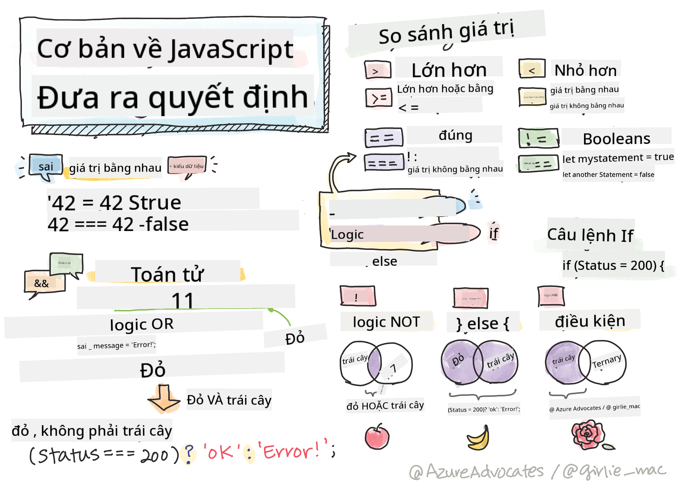

<!--
CO_OP_TRANSLATOR_METADATA:
{
  "original_hash": "888609c48329c280ca2477d2df40f2e5",
  "translation_date": "2025-08-27T22:47:35+00:00",
  "source_file": "2-js-basics/3-making-decisions/README.md",
  "language_code": "vi"
}
-->
# JavaScript Cơ Bản: Ra Quyết Định



> Sketchnote bởi [Tomomi Imura](https://twitter.com/girlie_mac)

## Quiz Trước Bài Giảng

[Quiz trước bài giảng](https://ff-quizzes.netlify.app/web/quiz/11)

Việc ra quyết định và kiểm soát thứ tự chạy của mã giúp mã của bạn có thể tái sử dụng và mạnh mẽ hơn. Phần này sẽ giới thiệu cú pháp để kiểm soát luồng dữ liệu trong JavaScript và tầm quan trọng của nó khi sử dụng với kiểu dữ liệu Boolean.

[](https://youtube.com/watch?v=SxTp8j-fMMY "Ra Quyết Định")

> 🎥 Nhấp vào hình ảnh trên để xem video về việc ra quyết định.

> Bạn có thể học bài này trên [Microsoft Learn](https://docs.microsoft.com/learn/modules/web-development-101-if-else/?WT.mc_id=academic-77807-sagibbon)!

## Tóm Tắt Ngắn Gọn Về Boolean

Boolean chỉ có thể có hai giá trị: `true` hoặc `false`. Boolean giúp đưa ra quyết định về dòng mã nào sẽ chạy khi các điều kiện nhất định được đáp ứng.

Đặt giá trị Boolean của bạn là true hoặc false như sau:

`let myTrueBool = true`  
`let myFalseBool = false`

✅ Boolean được đặt tên theo nhà toán học, triết gia và nhà logic học người Anh George Boole (1815–1864).

## Toán Tử So Sánh và Boolean

Toán tử được sử dụng để đánh giá các điều kiện bằng cách thực hiện so sánh, từ đó tạo ra giá trị Boolean. Dưới đây là danh sách các toán tử thường được sử dụng.

| Ký Hiệu | Mô Tả                                                                                                                                                       | Ví Dụ              |
| ------- | ----------------------------------------------------------------------------------------------------------------------------------------------------------- | ------------------ |
| `<`     | **Nhỏ hơn**: So sánh hai giá trị và trả về kiểu dữ liệu Boolean `true` nếu giá trị bên trái nhỏ hơn giá trị bên phải                                         | `5 < 6 // true`    |
| `<=`    | **Nhỏ hơn hoặc bằng**: So sánh hai giá trị và trả về kiểu dữ liệu Boolean `true` nếu giá trị bên trái nhỏ hơn hoặc bằng giá trị bên phải                     | `5 <= 6 // true`   |
| `>`     | **Lớn hơn**: So sánh hai giá trị và trả về kiểu dữ liệu Boolean `true` nếu giá trị bên trái lớn hơn giá trị bên phải                                         | `5 > 6 // false`   |
| `>=`    | **Lớn hơn hoặc bằng**: So sánh hai giá trị và trả về kiểu dữ liệu Boolean `true` nếu giá trị bên trái lớn hơn hoặc bằng giá trị bên phải                     | `5 >= 6 // false`  |
| `===`   | **Bằng nghiêm ngặt**: So sánh hai giá trị và trả về kiểu dữ liệu Boolean `true` nếu giá trị bên trái và bên phải bằng nhau VÀ cùng kiểu dữ liệu             | `5 === 6 // false` |
| `!==`   | **Không bằng**: So sánh hai giá trị và trả về giá trị Boolean ngược lại với kết quả của toán tử bằng nghiêm ngặt                                             | `5 !== 6 // true`  |

✅ Kiểm tra kiến thức của bạn bằng cách viết một số phép so sánh trong console của trình duyệt. Có dữ liệu nào trả về khiến bạn ngạc nhiên không?

## Câu Lệnh If

Câu lệnh if sẽ chạy mã nằm giữa các khối của nó nếu điều kiện là true.

```javascript
if (condition) {
  //Condition is true. Code in this block will run.
}
```

Các toán tử logic thường được sử dụng để tạo điều kiện.

```javascript
let currentMoney;
let laptopPrice;

if (currentMoney >= laptopPrice) {
  //Condition is true. Code in this block will run.
  console.log("Getting a new laptop!");
}
```

## Câu Lệnh If..Else

Câu lệnh `else` sẽ chạy mã nằm giữa các khối của nó khi điều kiện là false. Nó là tùy chọn khi sử dụng với câu lệnh `if`.

```javascript
let currentMoney;
let laptopPrice;

if (currentMoney >= laptopPrice) {
  //Condition is true. Code in this block will run.
  console.log("Getting a new laptop!");
} else {
  //Condition is false. Code in this block will run.
  console.log("Can't afford a new laptop, yet!");
}
```

✅ Kiểm tra sự hiểu biết của bạn về đoạn mã này và đoạn mã sau bằng cách chạy nó trong console của trình duyệt. Thay đổi giá trị của các biến currentMoney và laptopPrice để thay đổi kết quả `console.log()`.

## Câu Lệnh Switch

Câu lệnh `switch` được sử dụng để thực hiện các hành động khác nhau dựa trên các điều kiện khác nhau. Sử dụng câu lệnh `switch` để chọn một trong nhiều khối mã sẽ được thực thi.

```javascript
switch (expression) {
  case x:
    // code block
    break;
  case y:
    // code block
    break;
  default:
  // code block
}
```

```javascript
// program using switch statement
let a = 2;

switch (a) {
  case 1:
    a = "one";
    break;
  case 2:
    a = "two";
    break;
  default:
    a = "not found";
    break;
}
console.log(`The value is ${a}`);
```

✅ Kiểm tra sự hiểu biết của bạn về đoạn mã này và đoạn mã sau bằng cách chạy nó trong console của trình duyệt. Thay đổi giá trị của biến a để thay đổi kết quả `console.log()`.

## Toán Tử Logic và Boolean

Các quyết định có thể yêu cầu nhiều hơn một phép so sánh và có thể được kết nối với nhau bằng các toán tử logic để tạo ra giá trị Boolean.

| Ký Hiệu | Mô Tả                                                                                     | Ví Dụ                                                                  |
| ------- | ----------------------------------------------------------------------------------------- | ---------------------------------------------------------------------- |
| `&&`    | **Logic AND**: So sánh hai biểu thức Boolean. Trả về true **chỉ khi** cả hai bên đều true | `(5 > 6) && (5 < 6 ) //Một bên false, bên kia true. Trả về false`      |
| `\|\|`  | **Logic OR**: So sánh hai biểu thức Boolean. Trả về true nếu ít nhất một bên là true       | `(5 > 6) \|\| (5 < 6) //Một bên false, bên kia true. Trả về true`      |
| `!`     | **Logic NOT**: Trả về giá trị ngược lại của một biểu thức Boolean                         | `!(5 > 6) // 5 không lớn hơn 6, nhưng "!" sẽ trả về true`              |

## Điều Kiện và Quyết Định với Toán Tử Logic

Các toán tử logic có thể được sử dụng để tạo điều kiện trong câu lệnh if..else.

```javascript
let currentMoney;
let laptopPrice;
let laptopDiscountPrice = laptopPrice - laptopPrice * 0.2; //Laptop price at 20 percent off

if (currentMoney >= laptopPrice || currentMoney >= laptopDiscountPrice) {
  //Condition is true. Code in this block will run.
  console.log("Getting a new laptop!");
} else {
  //Condition is true. Code in this block will run.
  console.log("Can't afford a new laptop, yet!");
}
```

### Toán Tử Phủ Định

Bạn đã thấy cách sử dụng câu lệnh `if...else` để tạo logic điều kiện. Bất cứ điều gì đưa vào `if` cần phải đánh giá là true/false. Bằng cách sử dụng toán tử `!`, bạn có thể _phủ định_ biểu thức. Nó sẽ trông như sau:

```javascript
if (!condition) {
  // runs if condition is false
} else {
  // runs if condition is true
}
```

### Biểu Thức Ternary

`if...else` không phải là cách duy nhất để biểu diễn logic quyết định. Bạn cũng có thể sử dụng một thứ gọi là toán tử ternary. Cú pháp của nó trông như sau:

```javascript
let variable = condition ? <return this if true> : <return this if false>
```

Dưới đây là một ví dụ cụ thể hơn:

```javascript
let firstNumber = 20;
let secondNumber = 10;
let biggestNumber = firstNumber > secondNumber ? firstNumber : secondNumber;
```

✅ Dành một chút thời gian để đọc đoạn mã này vài lần. Bạn có hiểu cách các toán tử này hoạt động không?

Đoạn mã trên nói rằng:

- nếu `firstNumber` lớn hơn `secondNumber`
- thì gán `firstNumber` cho `biggestNumber`
- nếu không thì gán `secondNumber`.

Biểu thức ternary chỉ là một cách viết gọn của đoạn mã dưới đây:

```javascript
let biggestNumber;
if (firstNumber > secondNumber) {
  biggestNumber = firstNumber;
} else {
  biggestNumber = secondNumber;
}
```

---

## 🚀 Thử Thách

Tạo một chương trình được viết trước tiên với các toán tử logic, sau đó viết lại nó bằng biểu thức ternary. Bạn thích cú pháp nào hơn?

---

## Quiz Sau Bài Giảng

[Quiz sau bài giảng](https://ff-quizzes.netlify.app/web/quiz/12)

## Ôn Tập & Tự Học

Đọc thêm về nhiều toán tử có sẵn cho người dùng [trên MDN](https://developer.mozilla.org/docs/Web/JavaScript/Reference/Operators).

Xem qua công cụ tra cứu toán tử tuyệt vời của Josh Comeau [operator lookup](https://joshwcomeau.com/operator-lookup/)!

## Bài Tập

[Operators](assignment.md)

---

**Tuyên bố miễn trừ trách nhiệm**:  
Tài liệu này đã được dịch bằng dịch vụ dịch thuật AI [Co-op Translator](https://github.com/Azure/co-op-translator). Mặc dù chúng tôi cố gắng đảm bảo độ chính xác, xin lưu ý rằng các bản dịch tự động có thể chứa lỗi hoặc không chính xác. Tài liệu gốc bằng ngôn ngữ bản địa nên được coi là nguồn thông tin chính thức. Đối với các thông tin quan trọng, khuyến nghị sử dụng dịch vụ dịch thuật chuyên nghiệp bởi con người. Chúng tôi không chịu trách nhiệm cho bất kỳ sự hiểu lầm hoặc diễn giải sai nào phát sinh từ việc sử dụng bản dịch này.