# Cơ bản về JavaScript: Ra quyết định

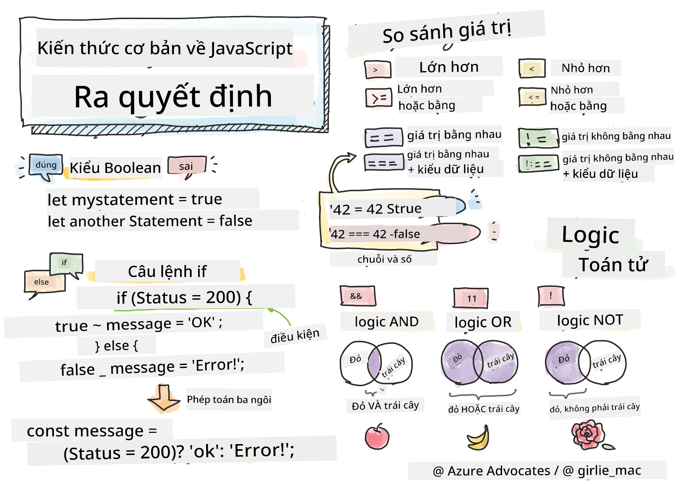

> Sketchnote bởi [Tomomi Imura](https://twitter.com/girlie_mac)

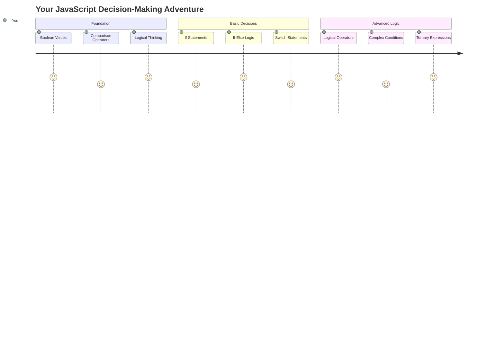

Bạn đã bao giờ tự hỏi làm thế nào các ứng dụng đưa ra quyết định thông minh chưa? Như cách hệ thống định vị chọn tuyến đường nhanh nhất, hoặc cách bộ điều nhiệt quyết định khi nào bật nhiệt? Đây là khái niệm cơ bản về việc ra quyết định trong lập trình.

Cũng giống như Máy phân tích của Charles Babbage được thiết kế để thực hiện các chuỗi hoạt động khác nhau dựa trên điều kiện, các chương trình JavaScript hiện đại cần đưa ra lựa chọn dựa trên các hoàn cảnh khác nhau. Khả năng phân nhánh và đưa ra quyết định này là điều biến đổi mã tĩnh thành các ứng dụng phản hồi và thông minh.

Trong bài học này, bạn sẽ học cách triển khai logic điều kiện trong chương trình của mình. Chúng ta sẽ khám phá các câu lệnh điều kiện, toán tử so sánh và biểu thức logic cho phép mã của bạn đánh giá tình huống và phản hồi phù hợp.

## Quiz trước bài học

[Quiz trước bài học](https://ff-quizzes.netlify.app/web/quiz/11)

Khả năng đưa ra quyết định và kiểm soát luồng chương trình là một khía cạnh cơ bản của lập trình. Phần này bao gồm cách kiểm soát đường dẫn thực thi của các chương trình JavaScript của bạn bằng các giá trị Boolean và logic điều kiện.

[](https://youtube.com/watch?v=SxTp8j-fMMY "Ra quyết định")

> 🎥 Nhấp vào hình ảnh trên để xem video về việc ra quyết định.

> Bạn có thể học bài này trên [Microsoft Learn](https://docs.microsoft.com/learn/modules/web-development-101-if-else/?WT.mc_id=academic-77807-sagibbon)!

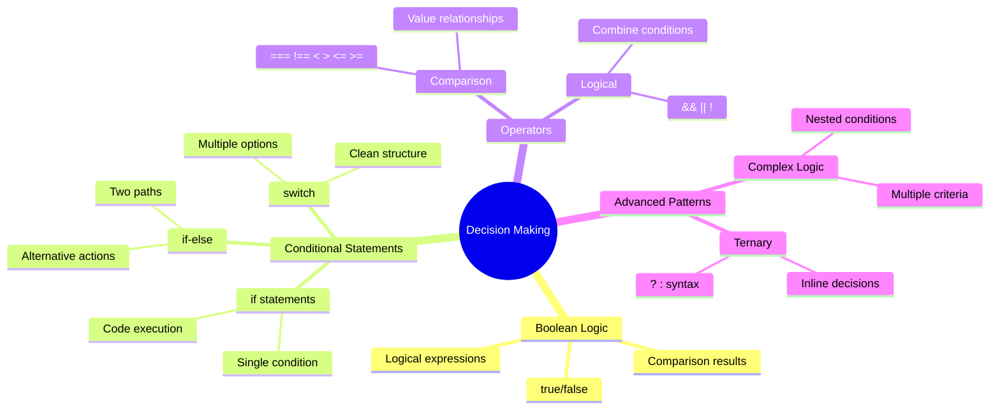

## Tóm tắt ngắn gọn về Booleans

Trước khi khám phá việc ra quyết định, hãy cùng ôn lại các giá trị Boolean từ bài học trước. Được đặt tên theo nhà toán học George Boole, các giá trị này đại diện cho trạng thái nhị phân – hoặc `true` hoặc `false`. Không có sự mơ hồ, không có trạng thái trung gian.

Những giá trị nhị phân này là nền tảng của tất cả logic tính toán. Mọi quyết định mà chương trình của bạn đưa ra cuối cùng đều giảm xuống thành một đánh giá Boolean.

Việc tạo các biến Boolean rất đơn giản:

```javascript
let myTrueBool = true;
let myFalseBool = false;
```

Điều này tạo ra hai biến với các giá trị Boolean rõ ràng.

✅ Booleans được đặt tên theo nhà toán học, triết gia và nhà logic học người Anh George Boole (1815–1864).

## Toán tử so sánh và Booleans

Trong thực tế, bạn hiếm khi đặt giá trị Boolean một cách thủ công. Thay vào đó, bạn sẽ tạo ra chúng bằng cách đánh giá các điều kiện: "Số này có lớn hơn số kia không?" hoặc "Các giá trị này có bằng nhau không?"

Các toán tử so sánh cho phép thực hiện các đánh giá này. Chúng so sánh các giá trị và trả về kết quả Boolean dựa trên mối quan hệ giữa các toán hạng.

| Ký hiệu | Mô tả                                                                                                                                                   | Ví dụ              |
| ------ | -------------------------------------------------------------------------------------------------------------------------------------------------------- | ------------------ |
| `<`    | **Nhỏ hơn**: So sánh hai giá trị và trả về kiểu dữ liệu Boolean `true` nếu giá trị ở bên trái nhỏ hơn giá trị ở bên phải                                  | `5 < 6 // true`    |
| `<=`   | **Nhỏ hơn hoặc bằng**: So sánh hai giá trị và trả về kiểu dữ liệu Boolean `true` nếu giá trị ở bên trái nhỏ hơn hoặc bằng giá trị ở bên phải              | `5 <= 6 // true`   |
| `>`    | **Lớn hơn**: So sánh hai giá trị và trả về kiểu dữ liệu Boolean `true` nếu giá trị ở bên trái lớn hơn giá trị ở bên phải                                 | `5 > 6 // false`   |
| `>=`   | **Lớn hơn hoặc bằng**: So sánh hai giá trị và trả về kiểu dữ liệu Boolean `true` nếu giá trị ở bên trái lớn hơn hoặc bằng giá trị ở bên phải             | `5 >= 6 // false`  |
| `===`  | **Bằng nhau nghiêm ngặt**: So sánh hai giá trị và trả về kiểu dữ liệu Boolean `true` nếu các giá trị ở bên phải và bên trái bằng nhau VÀ cùng kiểu dữ liệu | `5 === 6 // false` |
| `!==`  | **Không bằng nhau**: So sánh hai giá trị và trả về giá trị Boolean ngược lại với kết quả mà toán tử bằng nhau nghiêm ngặt sẽ trả về                      | `5 !== 6 // true`  |

✅ Kiểm tra kiến thức của bạn bằng cách viết một số so sánh trong bảng điều khiển của trình duyệt. Có dữ liệu nào trả về khiến bạn ngạc nhiên không?

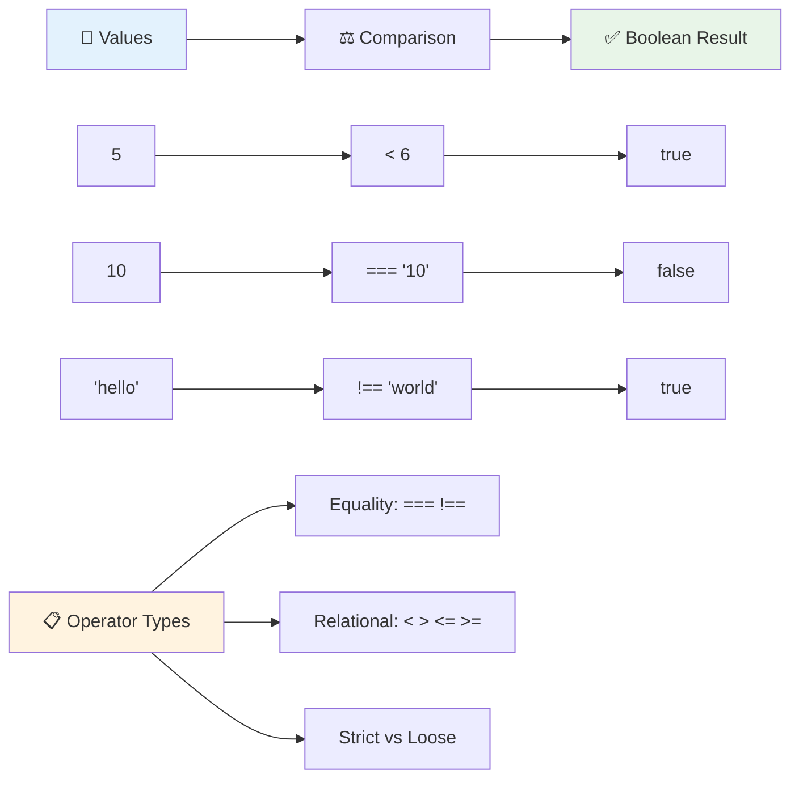

### 🧠 **Kiểm tra sự thành thạo về so sánh: Hiểu logic Boolean**

**Kiểm tra sự hiểu biết của bạn về so sánh:**
- Tại sao bạn nghĩ rằng `===` (bằng nhau nghiêm ngặt) thường được ưu tiên hơn `==` (bằng nhau không nghiêm ngặt)?
- Bạn có thể dự đoán `5 === '5'` trả về gì không? Còn `5 == '5'` thì sao?
- Sự khác biệt giữa `!==` và `!=` là gì?

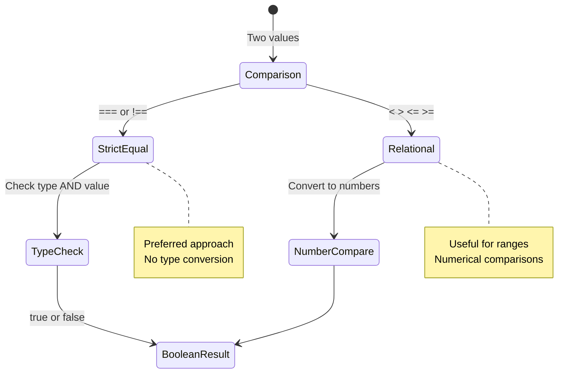

> **Mẹo chuyên nghiệp**: Luôn sử dụng `===` và `!==` để kiểm tra sự bằng nhau trừ khi bạn thực sự cần chuyển đổi kiểu. Điều này giúp tránh hành vi không mong muốn!

## Câu lệnh If

Câu lệnh `if` giống như việc đặt câu hỏi trong mã của bạn. "Nếu điều kiện này đúng, thì làm điều này." Đây có lẽ là công cụ quan trọng nhất bạn sẽ sử dụng để đưa ra quyết định trong JavaScript.

Cách hoạt động như sau:

```javascript
if (condition) {
  // Condition is true. Code in this block will run.
}
```

Điều kiện được đặt trong dấu ngoặc đơn, và nếu nó là `true`, JavaScript sẽ chạy mã bên trong dấu ngoặc nhọn. Nếu nó là `false`, JavaScript sẽ bỏ qua toàn bộ khối đó.

Bạn thường sử dụng các toán tử so sánh để tạo ra các điều kiện này. Hãy xem một ví dụ thực tế:

```javascript
let currentMoney = 1000;
let laptopPrice = 800;

if (currentMoney >= laptopPrice) {
  // Condition is true. Code in this block will run.
  console.log("Getting a new laptop!");
}
```

Vì `1000 >= 800` đánh giá là `true`, mã bên trong khối sẽ được thực thi, hiển thị "Getting a new laptop!" trong bảng điều khiển.

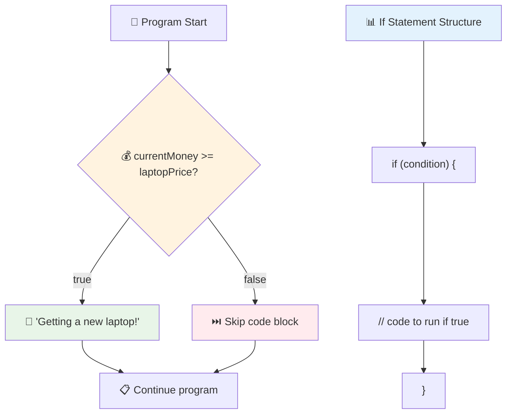

## Câu lệnh If..Else

Nhưng nếu bạn muốn chương trình của mình làm điều gì đó khác khi điều kiện là false thì sao? Đó là lúc `else` xuất hiện – nó giống như có một kế hoạch dự phòng.

Câu lệnh `else` cho bạn cách nói "nếu điều kiện này không đúng, hãy làm điều khác thay thế."

```javascript
let currentMoney = 500;
let laptopPrice = 800;

if (currentMoney >= laptopPrice) {
  // Condition is true. Code in this block will run.
  console.log("Getting a new laptop!");
} else {
  // Condition is false. Code in this block will run.
  console.log("Can't afford a new laptop, yet!");
}
```

Bây giờ vì `500 >= 800` là `false`, JavaScript sẽ bỏ qua khối đầu tiên và chạy khối `else` thay thế. Bạn sẽ thấy "Can't afford a new laptop, yet!" trong bảng điều khiển.

✅ Kiểm tra sự hiểu biết của bạn về mã này và mã sau bằng cách chạy nó trong bảng điều khiển trình duyệt. Thay đổi giá trị của các biến currentMoney và laptopPrice để thay đổi kết quả `console.log()`.

### 🎯 **Kiểm tra logic If-Else: Các đường dẫn phân nhánh**

**Đánh giá sự hiểu biết của bạn về logic điều kiện:**
- Điều gì xảy ra nếu `currentMoney` bằng chính xác `laptopPrice`?
- Bạn có thể nghĩ đến một tình huống thực tế nào mà logic if-else sẽ hữu ích không?
- Làm thế nào bạn có thể mở rộng điều này để xử lý nhiều mức giá khác nhau?

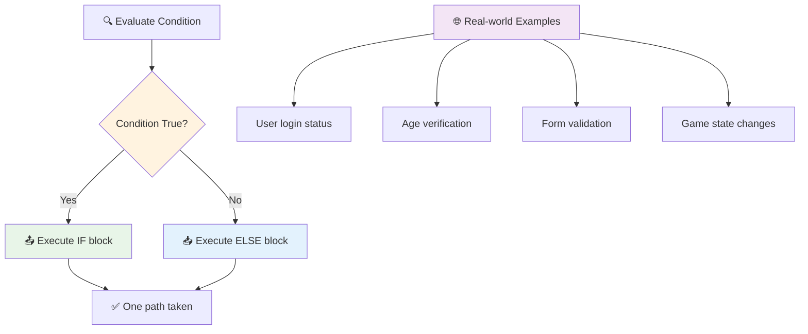

> **Thông tin quan trọng**: If-else đảm bảo chỉ có một đường dẫn được thực hiện. Điều này đảm bảo chương trình của bạn luôn có phản hồi cho bất kỳ điều kiện nào!

## Câu lệnh Switch

Đôi khi bạn cần so sánh một giá trị với nhiều tùy chọn. Mặc dù bạn có thể nối nhiều câu lệnh `if..else`, cách tiếp cận này trở nên khó quản lý. Câu lệnh `switch` cung cấp một cấu trúc gọn gàng hơn để xử lý nhiều giá trị riêng biệt.

Khái niệm này giống như các hệ thống chuyển mạch cơ học được sử dụng trong các tổng đài điện thoại đầu tiên – một giá trị đầu vào xác định đường dẫn thực thi cụ thể nào sẽ được theo.

```javascript
switch (expression) {
  case x:
    // code block
    break;
  case y:
    // code block
    break;
  default:
    // code block
}
```

Cách nó được cấu trúc:
- JavaScript đánh giá biểu thức một lần
- Nó tìm qua từng `case` để tìm một kết quả khớp
- Khi tìm thấy kết quả khớp, nó chạy khối mã đó
- `break` yêu cầu JavaScript dừng và thoát khỏi switch
- Nếu không có case nào khớp, nó chạy khối `default` (nếu bạn có)

```javascript
// Program using switch statement for day of week
let dayNumber = 2;
let dayName;

switch (dayNumber) {
  case 1:
    dayName = "Monday";
    break;
  case 2:
    dayName = "Tuesday";
    break;
  case 3:
    dayName = "Wednesday";
    break;
  default:
    dayName = "Unknown day";
    break;
}
console.log(`Today is ${dayName}`);
```

Trong ví dụ này, JavaScript thấy rằng `dayNumber` là `2`, tìm `case 2` khớp, đặt `dayName` thành "Tuesday", và sau đó thoát khỏi switch. Kết quả? "Today is Tuesday" được ghi vào bảng điều khiển.

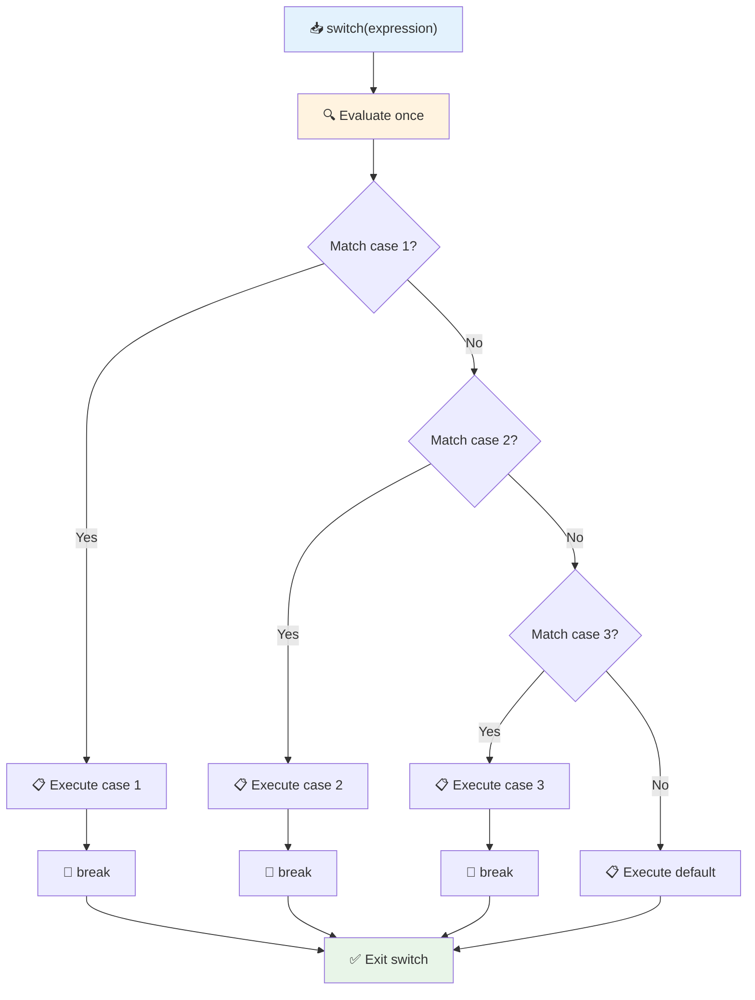

✅ Kiểm tra sự hiểu biết của bạn về mã này và mã sau bằng cách chạy nó trong bảng điều khiển trình duyệt. Thay đổi giá trị của biến a để thay đổi kết quả `console.log()`.

### 🔄 **Kiểm tra sự thành thạo Switch: Nhiều tùy chọn**

**Kiểm tra sự hiểu biết của bạn về switch:**
- Điều gì xảy ra nếu bạn quên một câu lệnh `break`?
- Khi nào bạn sẽ sử dụng `switch` thay vì nhiều câu lệnh if-else?
- Tại sao case `default` lại hữu ích ngay cả khi bạn nghĩ rằng bạn đã bao phủ tất cả các khả năng?

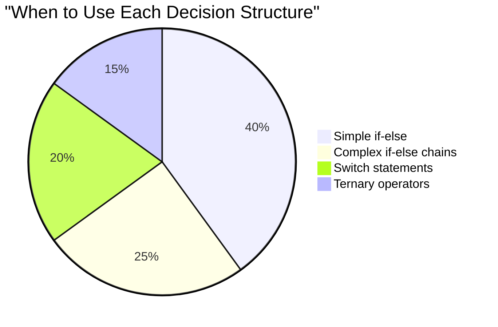

> **Thực hành tốt nhất**: Sử dụng `switch` khi so sánh một biến với nhiều giá trị cụ thể. Sử dụng `if-else` cho các kiểm tra phạm vi hoặc điều kiện phức tạp!

## Toán tử logic và Booleans

Các quyết định phức tạp thường yêu cầu đánh giá nhiều điều kiện cùng lúc. Cũng như đại số Boolean cho phép các nhà toán học kết hợp các biểu thức logic, lập trình cung cấp các toán tử logic để kết nối nhiều điều kiện Boolean.

Các toán tử này cho phép logic điều kiện phức tạp bằng cách kết hợp các đánh giá true/false đơn giản.

| Ký hiệu | Mô tả                                                                                     | Ví dụ                                                                 |
| ------ | ------------------------------------------------------------------------------------------ | --------------------------------------------------------------------- |
| `&&`   | **Logic AND**: So sánh hai biểu thức Boolean. Trả về true **chỉ khi** cả hai bên đều đúng | `(5 > 3) && (5 < 10) // Cả hai bên đều đúng. Trả về true` |
| `\|\|` | **Logic OR**: So sánh hai biểu thức Boolean. Trả về true nếu ít nhất một bên đúng         | `(5 > 10) \|\| (5 < 10) // Một bên sai, bên kia đúng. Trả về true` |
| `!`    | **Logic NOT**: Trả về giá trị ngược lại của một biểu thức Boolean                         | `!(5 > 10) // 5 không lớn hơn 10, nên "!" làm nó đúng`         |

Các toán tử này cho phép bạn kết hợp các điều kiện theo cách hữu ích:
- AND (`&&`) nghĩa là cả hai điều kiện phải đúng
- OR (`||`) nghĩa là ít nhất một điều kiện phải đúng  
- NOT (`!`) đảo ngược true thành false (và ngược lại)

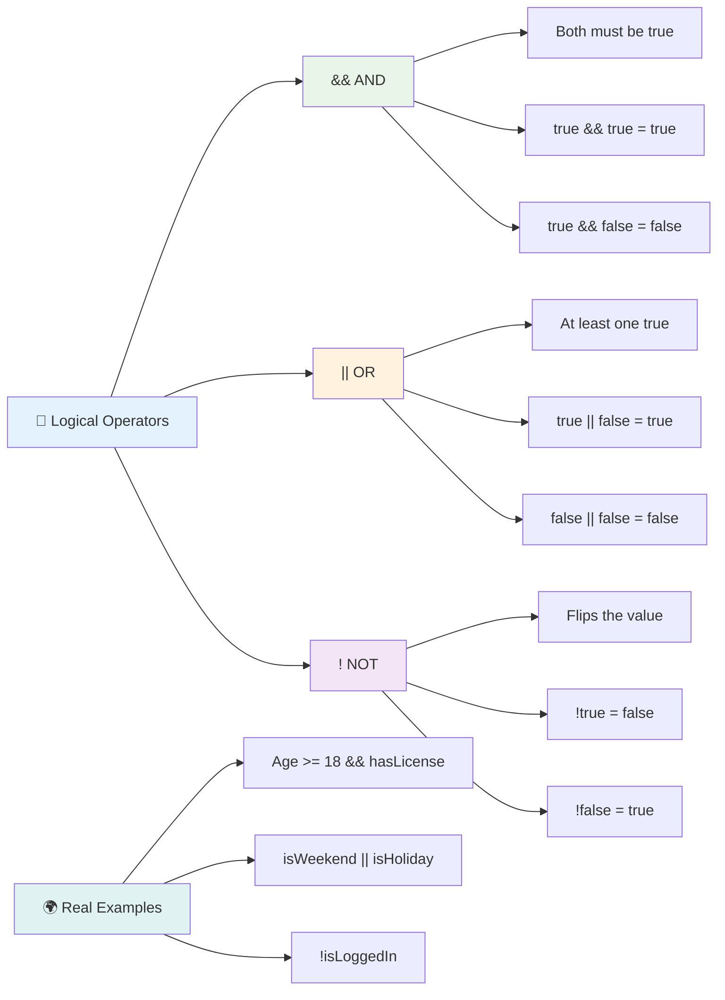

## Điều kiện và quyết định với toán tử logic

Hãy xem các toán tử logic này hoạt động trong một ví dụ thực tế hơn:

```javascript
let currentMoney = 600;
let laptopPrice = 800;
let laptopDiscountPrice = laptopPrice - (laptopPrice * 0.2); // Laptop price at 20 percent off

if (currentMoney >= laptopPrice || currentMoney >= laptopDiscountPrice) {
  // Condition is true. Code in this block will run.
  console.log("Getting a new laptop!");
} else {
  // Condition is false. Code in this block will run.
  console.log("Can't afford a new laptop, yet!");
}
```

Trong ví dụ này: chúng ta tính giá giảm 20% (640), sau đó đánh giá liệu số tiền có sẵn của chúng ta có đủ để chi trả giá đầy đủ HOẶC giá giảm hay không. Vì 600 đáp ứng ngưỡng giá giảm là 640, điều kiện đánh giá là true.

### 🧮 **Kiểm tra toán tử logic: Kết hợp điều kiện**

**Kiểm tra sự hiểu biết của bạn về toán tử logic:**
- Trong biểu thức `A && B`, điều gì xảy ra nếu A là false? B có được đánh giá không?
- Bạn có thể nghĩ đến một tình huống mà bạn cần cả ba toán tử (&&, ||, !) cùng nhau không?
- Sự khác biệt giữa `!user.isActive` và `user.isActive !== true` là gì?

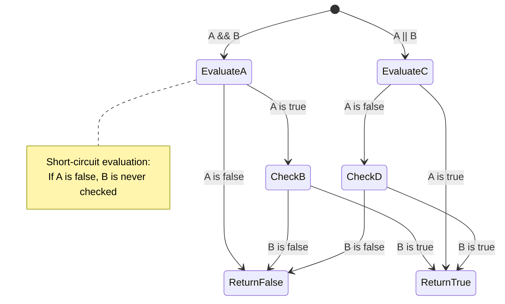

> **Mẹo hiệu suất**: JavaScript sử dụng "đánh giá ngắn mạch" - trong `A && B`, nếu A là false, B thậm chí không được đánh giá. Hãy tận dụng điều này!

### Toán tử phủ định

Đôi khi dễ dàng hơn để nghĩ về khi điều gì đó KHÔNG đúng. Như thay vì hỏi "Người dùng đã đăng nhập chưa?", bạn có thể muốn hỏi "Người dùng CHƯA đăng nhập?" Dấu chấm than (`!`) đảo ngược logic cho bạn.

```javascript
if (!condition) {
  // runs if condition is false
} else {
  // runs if condition is true
}
```

Toán tử `!` giống như nói "ngược lại với..." – nếu điều gì đó là `true`, `!` làm nó thành `false`, và ngược lại.

### Biểu thức Ternary

Đối với các phép gán điều kiện đơn giản, JavaScript cung cấp **toán tử ternary**. Cú pháp ngắn gọn này cho phép bạn viết một biểu thức điều kiện trong một dòng, hữu ích khi bạn cần gán một trong hai giá trị dựa trên một điều kiện.

```javascript
let variable = condition ? returnThisIfTrue : returnThisIfFalse;
```

Nó đọc như một câu hỏi: "Điều kiện này có đúng không? Nếu đúng, sử dụng giá trị này. Nếu không, sử dụng giá trị kia."

Dưới đây là một ví dụ cụ thể hơn:

```javascript
let firstNumber = 20;
let secondNumber = 10;
let biggestNumber = firstNumber > secondNumber ? firstNumber : secondNumber;
```

✅ Dành một phút để đọc mã này vài lần. Bạn có hiểu cách các toán tử này hoạt động không?

Đây là điều mà dòng này đang nói: "Số `firstNumber` có lớn hơn `secondNumber` không? Nếu đúng, đặt `firstNumber` vào `biggestNumber`. Nếu không, đặt `secondNumber` vào `biggestNumber`."

Toán tử ternary chỉ là cách viết ngắn gọn hơn của câu lệnh `if..else` truyền thống:

```javascript
let biggestNumber;
if (firstNumber > secondNumber) {
  biggestNumber = firstNumber;
} else {
  biggestNumber = secondNumber;
}
```

Cả hai cách đều cho ra kết quả giống nhau. Toán tử ternary mang lại sự ngắn gọn, trong khi cấu trúc if-else truyền thống có thể dễ đọc hơn đối với các điều kiện phức tạp.

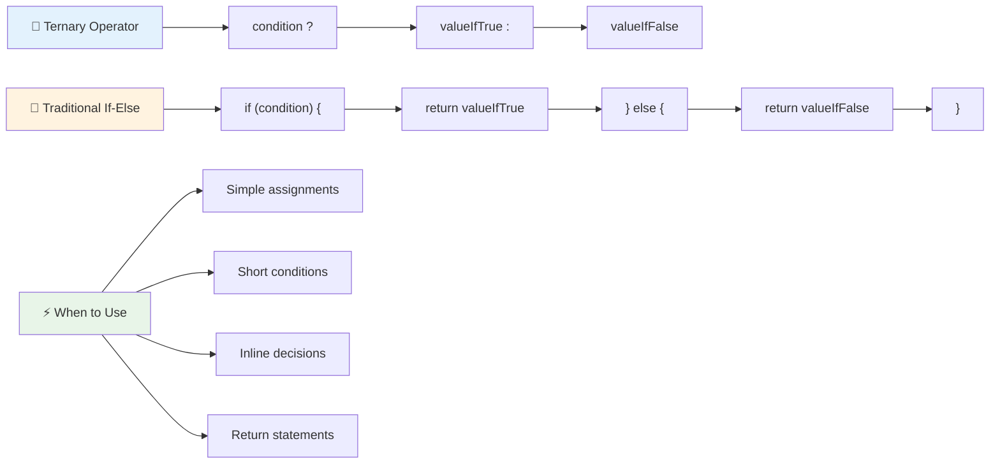

---


## 🚀 Thử thách

Tạo một chương trình được viết trước tiên với các toán tử logic, sau đó viết lại nó bằng biểu thức ternary. Bạn thích cú pháp nào hơn?

---

## Thử thách GitHub Copilot Agent 🚀

Sử dụng chế độ Agent để hoàn thành thử thách sau:

**Mô tả:** Tạo một máy tính điểm toàn diện thể hiện nhiều khái niệm ra quyết định từ bài học này, bao gồm các câu lệnh if-else, switch, toán tử logic và biểu thức ternary.

**Yêu cầu:** Viết một chương trình JavaScript nhận điểm số của học sinh (0-100) và xác định điểm chữ của họ dựa trên các tiêu chí sau:
- A: 90-100
- B: 80-89  
- C: 70-79
- D: 60-69
- F: Dưới 60

Yêu cầu:
1. Sử dụng câu lệnh if-else để xác định điểm chữ
2. Sử dụng các toán tử logic để kiểm tra xem học sinh có đạt (điểm >= 60) VÀ có danh hiệu xuất sắc (điểm >= 90)
3. Sử dụng câu lệnh switch để cung cấp phản hồi cụ thể cho từng loại điểm chữ
4. Sử dụng toán tử ternary để xác định xem học sinh có đủ điều kiện tham gia khóa học tiếp theo (điểm >= 70)
5. Bao gồm kiểm tra đầu vào để đảm bảo điểm nằm trong khoảng từ 0 đến 100

Kiểm tra chương trình của bạn với nhiều điểm số khác nhau, bao gồm các trường hợp biên như 59, 60, 89, 90 và các đầu vào không hợp lệ.

Tìm hiểu thêm về [chế độ agent](https://code.visualstudio.com/blogs/2025/02/24/introducing-copilot-agent-mode) tại đây.


## Câu hỏi sau bài giảng

[Câu hỏi sau bài giảng](https://ff-quizzes.netlify.app/web/quiz/12)

## Ôn tập & Tự học

Đọc thêm về các toán tử có sẵn cho người dùng [trên MDN](https://developer.mozilla.org/docs/Web/JavaScript/Reference/Operators).

Xem qua công cụ tra cứu toán tử tuyệt vời của Josh Comeau [operator lookup](https://joshwcomeau.com/operator-lookup/)!

## Bài tập

[Toán tử](assignment.md)

---

## 🧠 **Tóm tắt Bộ Công Cụ Ra Quyết Định của Bạn**

```mermaid
graph TD
    A["🎯 JavaScript Decisions"] --> B["🔍 Boolean Logic"]
    A --> C["📊 Conditional Statements"]
    A --> D["🔗 Logical Operators"]
    A --> E["⚡ Advanced Patterns"]
    
    B --> B1["true/false values"]
    B --> B2["Comparison operators"]
    B --> B3["Truthiness concepts"]
    
    C --> C1["if statements"]
    C --> C2["if-else chains"]
    C --> C3["switch statements"]
    
    D --> D1["&& (AND)"]
    D --> D2["|| (OR)"]
    D --> D3["! (NOT)"]
    
    E --> E1["Ternary operator"]
    E --> E2["Short-circuit evaluation"]
    E --> E3["Complex conditions"]
    
    F["💡 Key Principles"] --> F1["Clear readable conditions"]
    F --> F2["Consistent comparison style"]
    F --> F3["Proper operator precedence"]
    F --> F4["Efficient evaluation order"]
    
    style A fill:#e3f2fd
    style B fill:#e8f5e8
    style C fill:#fff3e0
    style D fill:#f3e5f5
    style E fill:#e0f2f1
    style F fill:#fce4ec
```

---

## 🚀 Lộ trình làm chủ ra quyết định trong JavaScript của bạn

### ⚡ **Những gì bạn có thể làm trong 5 phút tới**
- [ ] Thực hành các toán tử so sánh trong console trình duyệt của bạn
- [ ] Viết một câu lệnh if-else đơn giản để kiểm tra tuổi của bạn
- [ ] Thử thách: viết lại một câu lệnh if-else bằng toán tử ternary
- [ ] Kiểm tra điều gì xảy ra với các giá trị "truthy" và "falsy" khác nhau

### 🎯 **Những gì bạn có thể hoàn thành trong giờ này**
- [ ] Hoàn thành bài kiểm tra sau bài học và xem lại các khái niệm gây nhầm lẫn
- [ ] Xây dựng máy tính điểm toàn diện từ thử thách GitHub Copilot
- [ ] Tạo một cây quyết định đơn giản cho một tình huống thực tế (như chọn trang phục)
- [ ] Thực hành kết hợp nhiều điều kiện với các toán tử logic
- [ ] Thử nghiệm với các câu lệnh switch cho các trường hợp sử dụng khác nhau

### 📅 **Làm chủ logic trong một tuần**
- [ ] Hoàn thành bài tập về toán tử với các ví dụ sáng tạo
- [ ] Xây dựng một ứng dụng quiz nhỏ sử dụng các cấu trúc điều kiện khác nhau
- [ ] Tạo một trình kiểm tra biểu mẫu để kiểm tra nhiều điều kiện đầu vào
- [ ] Thực hành các bài tập tra cứu toán tử của Josh Comeau [operator lookup](https://joshwcomeau.com/operator-lookup/)
- [ ] Tái cấu trúc mã hiện có để sử dụng các cấu trúc điều kiện phù hợp hơn
- [ ] Nghiên cứu đánh giá ngắn mạch và các tác động đến hiệu suất

### 🌟 **Biến đổi trong một tháng**
- [ ] Làm chủ các điều kiện lồng phức tạp và duy trì khả năng đọc mã
- [ ] Xây dựng một ứng dụng với logic ra quyết định tinh vi
- [ ] Đóng góp cho mã nguồn mở bằng cách cải thiện logic điều kiện trong các dự án hiện có
- [ ] Dạy người khác về các cấu trúc điều kiện khác nhau và khi nào nên sử dụng từng loại
- [ ] Khám phá các phương pháp lập trình hàm cho logic điều kiện
- [ ] Tạo một hướng dẫn tham khảo cá nhân về các thực hành tốt nhất cho điều kiện

### 🏆 **Kiểm tra cuối cùng về làm chủ ra quyết định**

**Ăn mừng sự làm chủ tư duy logic của bạn:**
- Logic quyết định phức tạp nhất mà bạn đã triển khai thành công là gì?
- Cấu trúc điều kiện nào cảm thấy tự nhiên nhất với bạn và tại sao?
- Việc học về các toán tử logic đã thay đổi cách tiếp cận giải quyết vấn đề của bạn như thế nào?
- Ứng dụng thực tế nào sẽ được hưởng lợi từ logic ra quyết định tinh vi?

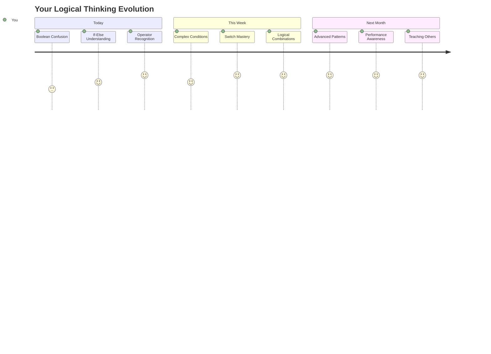

> 🧠 **Bạn đã làm chủ nghệ thuật ra quyết định kỹ thuật số!** Mọi ứng dụng tương tác đều dựa vào logic điều kiện để phản hồi thông minh với hành động của người dùng và các điều kiện thay đổi. Giờ đây, bạn hiểu cách làm cho chương trình của mình suy nghĩ, đánh giá và chọn phản hồi phù hợp. Nền tảng logic này sẽ cung cấp sức mạnh cho mọi ứng dụng động mà bạn xây dựng! 🎉

---

**Tuyên bố miễn trừ trách nhiệm**:  
Tài liệu này đã được dịch bằng dịch vụ dịch thuật AI [Co-op Translator](https://github.com/Azure/co-op-translator). Mặc dù chúng tôi cố gắng đảm bảo độ chính xác, xin lưu ý rằng các bản dịch tự động có thể chứa lỗi hoặc không chính xác. Tài liệu gốc bằng ngôn ngữ bản địa nên được coi là nguồn thông tin chính thức. Đối với thông tin quan trọng, nên sử dụng dịch vụ dịch thuật chuyên nghiệp bởi con người. Chúng tôi không chịu trách nhiệm cho bất kỳ sự hiểu lầm hoặc diễn giải sai nào phát sinh từ việc sử dụng bản dịch này.