<!--
CO_OP_TRANSLATOR_METADATA:
{
  "original_hash": "1710a50a519a6e4a1b40a5638783018d",
  "translation_date": "2025-11-06T11:12:41+00:00",
  "source_file": "2-js-basics/4-arrays-loops/README.md",
  "language_code": "vi"
}
-->
# Cơ bản về JavaScript: Mảng và Vòng lặp


> Sketchnote bởi [Tomomi Imura](https://twitter.com/girlie_mac)

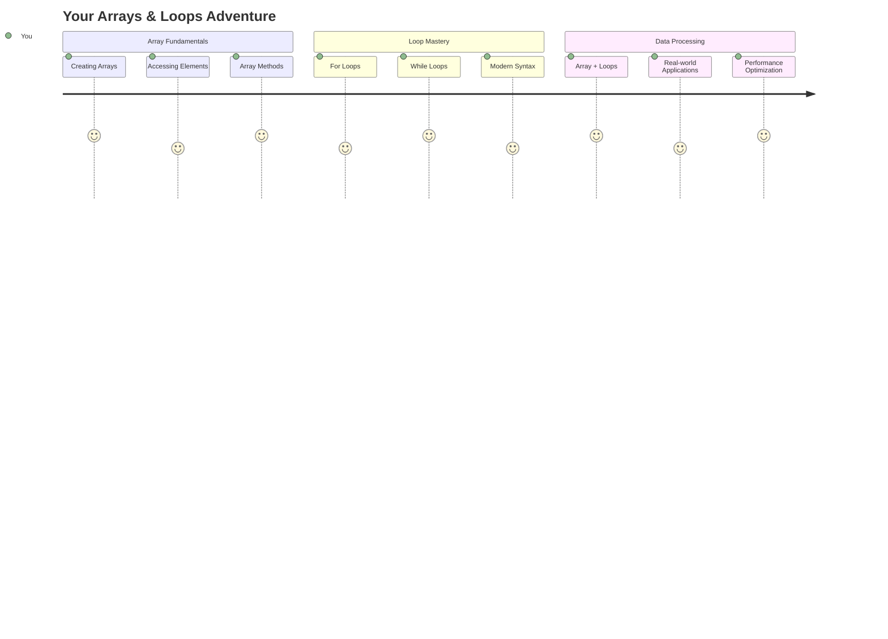

## Quiz trước bài học
[Quiz trước bài học](https://ff-quizzes.netlify.app/web/quiz/13)

Bạn đã bao giờ tự hỏi làm thế nào các trang web theo dõi các mặt hàng trong giỏ hàng hoặc hiển thị danh sách bạn bè của bạn chưa? Đó chính là lúc mảng và vòng lặp xuất hiện. Mảng giống như những chiếc hộp kỹ thuật số chứa nhiều thông tin, trong khi vòng lặp giúp bạn xử lý tất cả dữ liệu đó một cách hiệu quả mà không cần viết mã lặp đi lặp lại.

Hai khái niệm này cùng nhau tạo nền tảng cho việc xử lý thông tin trong chương trình của bạn. Bạn sẽ học cách chuyển từ việc viết từng bước một cách thủ công sang tạo mã thông minh, hiệu quả có thể xử lý hàng trăm hoặc thậm chí hàng nghìn mục một cách nhanh chóng.

Kết thúc bài học này, bạn sẽ hiểu cách thực hiện các nhiệm vụ dữ liệu phức tạp chỉ với vài dòng mã. Hãy cùng khám phá những khái niệm lập trình thiết yếu này.

[](https://youtube.com/watch?v=1U4qTyq02Xw "Mảng")

[](https://www.youtube.com/watch?v=Eeh7pxtTZ3k "Vòng lặp")

> 🎥 Nhấp vào hình ảnh trên để xem video về mảng và vòng lặp.

> Bạn có thể học bài này trên [Microsoft Learn](https://docs.microsoft.com/learn/modules/web-development-101-arrays/?WT.mc_id=academic-77807-sagibbon)!

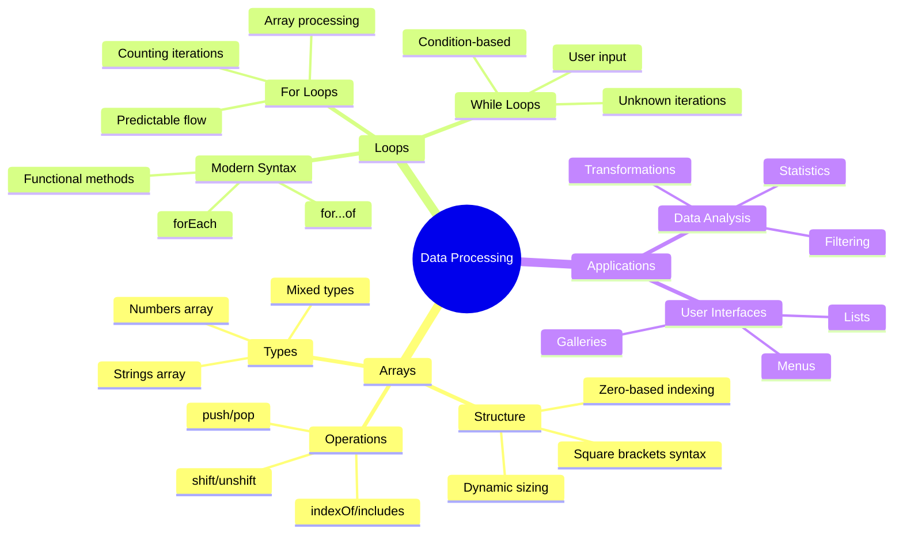

## Mảng

Hãy nghĩ về mảng như một tủ hồ sơ kỹ thuật số - thay vì lưu trữ một tài liệu mỗi ngăn, bạn có thể tổ chức nhiều mục liên quan trong một hộp chứa có cấu trúc. Trong thuật ngữ lập trình, mảng cho phép bạn lưu trữ nhiều thông tin trong một gói được tổ chức.

Dù bạn đang xây dựng một thư viện ảnh, quản lý danh sách việc cần làm, hay theo dõi điểm cao trong một trò chơi, mảng cung cấp nền tảng cho việc tổ chức dữ liệu. Hãy xem cách chúng hoạt động.

✅ Mảng có mặt khắp nơi! Bạn có thể nghĩ ra một ví dụ thực tế về mảng, chẳng hạn như một mảng pin mặt trời không?

### Tạo mảng

Tạo một mảng rất đơn giản - chỉ cần sử dụng dấu ngoặc vuông!

```javascript
// Empty array - like an empty shopping cart waiting for items
const myArray = [];
```

**Điều gì đang xảy ra ở đây?**
Bạn vừa tạo một hộp chứa rỗng bằng cách sử dụng dấu ngoặc vuông `[]`. Hãy nghĩ về nó như một kệ sách trống - nó sẵn sàng chứa bất kỳ cuốn sách nào bạn muốn tổ chức ở đó.

Bạn cũng có thể điền giá trị ban đầu vào mảng ngay từ đầu:

```javascript
// Your ice cream shop's flavor menu
const iceCreamFlavors = ["Chocolate", "Strawberry", "Vanilla", "Pistachio", "Rocky Road"];

// A user's profile info (mixing different types of data)
const userData = ["John", 25, true, "developer"];

// Test scores for your favorite class
const scores = [95, 87, 92, 78, 85];
```

**Những điều thú vị cần chú ý:**
- Bạn có thể lưu trữ văn bản, số, hoặc thậm chí giá trị đúng/sai trong cùng một mảng
- Chỉ cần tách từng mục bằng dấu phẩy - thật dễ dàng!
- Mảng rất lý tưởng để giữ thông tin liên quan cùng nhau

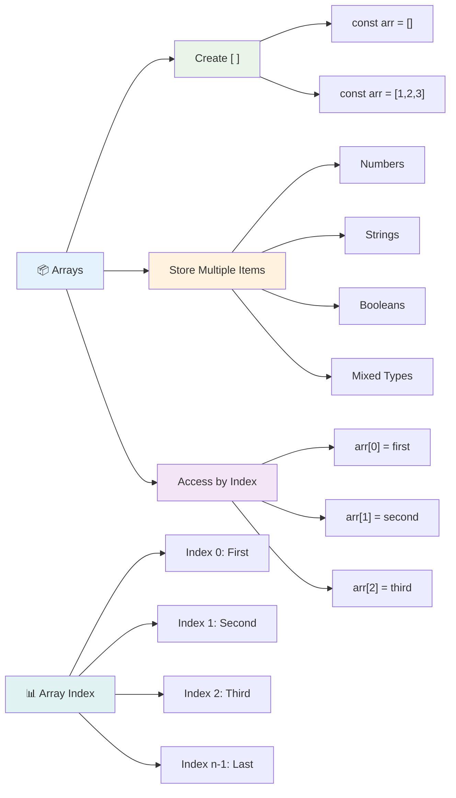

### Chỉ số mảng

Đây là điều có thể ban đầu sẽ hơi lạ: mảng đánh số các mục của chúng bắt đầu từ 0, không phải 1. Cách đánh số từ 0 này bắt nguồn từ cách bộ nhớ máy tính hoạt động - nó đã trở thành một quy ước lập trình từ những ngày đầu của các ngôn ngữ như C. Mỗi vị trí trong mảng có một số địa chỉ riêng gọi là **chỉ số**.

| Chỉ số | Giá trị | Mô tả |
|-------|-------|-------------|
| 0 | "Chocolate" | Phần tử đầu tiên |
| 1 | "Strawberry" | Phần tử thứ hai |
| 2 | "Vanilla" | Phần tử thứ ba |
| 3 | "Pistachio" | Phần tử thứ tư |
| 4 | "Rocky Road" | Phần tử thứ năm |

✅ Có làm bạn ngạc nhiên khi mảng bắt đầu từ chỉ số 0 không? Trong một số ngôn ngữ lập trình, chỉ số bắt đầu từ 1. Có một lịch sử thú vị về điều này, bạn có thể [đọc trên Wikipedia](https://en.wikipedia.org/wiki/Zero-based_numbering).

**Truy cập các phần tử mảng:**

```javascript
const iceCreamFlavors = ["Chocolate", "Strawberry", "Vanilla", "Pistachio", "Rocky Road"];

// Access individual elements using bracket notation
console.log(iceCreamFlavors[0]); // "Chocolate" - first element
console.log(iceCreamFlavors[2]); // "Vanilla" - third element
console.log(iceCreamFlavors[4]); // "Rocky Road" - last element
```

**Phân tích điều gì xảy ra ở đây:**
- **Sử dụng** ký hiệu ngoặc vuông với số chỉ số để truy cập các phần tử
- **Trả về** giá trị được lưu trữ tại vị trí cụ thể trong mảng
- **Bắt đầu** đếm từ 0, làm cho phần tử đầu tiên có chỉ số 0

**Thay đổi các phần tử mảng:**

```javascript
// Change an existing value
iceCreamFlavors[4] = "Butter Pecan";
console.log(iceCreamFlavors[4]); // "Butter Pecan"

// Add a new element at the end
iceCreamFlavors[5] = "Cookie Dough";
console.log(iceCreamFlavors[5]); // "Cookie Dough"
```

**Trong ví dụ trên, chúng ta đã:**
- **Thay đổi** phần tử tại chỉ số 4 từ "Rocky Road" thành "Butter Pecan"
- **Thêm** một phần tử mới "Cookie Dough" tại chỉ số 5
- **Tự động mở rộng** độ dài mảng khi thêm vượt quá giới hạn hiện tại

### Độ dài mảng và các phương thức phổ biến

Mảng đi kèm với các thuộc tính và phương thức tích hợp giúp làm việc với dữ liệu dễ dàng hơn.

**Tìm độ dài mảng:**

```javascript
const iceCreamFlavors = ["Chocolate", "Strawberry", "Vanilla", "Pistachio", "Rocky Road"];
console.log(iceCreamFlavors.length); // 5

// Length updates automatically as array changes
iceCreamFlavors.push("Mint Chip");
console.log(iceCreamFlavors.length); // 6
```

**Những điểm chính cần nhớ:**
- **Trả về** tổng số phần tử trong mảng
- **Cập nhật** tự động khi các phần tử được thêm hoặc xóa
- **Cung cấp** số đếm động hữu ích cho vòng lặp và xác thực

**Các phương thức mảng thiết yếu:**

```javascript
const fruits = ["apple", "banana", "orange"];

// Add elements
fruits.push("grape");           // Adds to end: ["apple", "banana", "orange", "grape"]
fruits.unshift("strawberry");   // Adds to beginning: ["strawberry", "apple", "banana", "orange", "grape"]

// Remove elements
const lastFruit = fruits.pop();        // Removes and returns "grape"
const firstFruit = fruits.shift();     // Removes and returns "strawberry"

// Find elements
const index = fruits.indexOf("banana"); // Returns 1 (position of "banana")
const hasApple = fruits.includes("apple"); // Returns true
```

**Hiểu các phương thức này:**
- **Thêm** phần tử với `push()` (cuối) và `unshift()` (đầu)
- **Xóa** phần tử với `pop()` (cuối) và `shift()` (đầu)
- **Tìm** phần tử với `indexOf()` và kiểm tra sự tồn tại với `includes()`
- **Trả về** các giá trị hữu ích như phần tử đã xóa hoặc vị trí chỉ số

✅ Thử tự mình! Sử dụng bảng điều khiển trình duyệt để tạo và thao tác một mảng do bạn tự tạo.

### 🧠 **Kiểm tra kiến thức cơ bản về mảng: Tổ chức dữ liệu của bạn**

**Kiểm tra hiểu biết về mảng:**
- Tại sao bạn nghĩ mảng bắt đầu đếm từ 0 thay vì 1?
- Điều gì xảy ra nếu bạn cố gắng truy cập một chỉ số không tồn tại (như `arr[100]` trong một mảng có 5 phần tử)?
- Bạn có thể nghĩ ra ba tình huống thực tế mà mảng sẽ hữu ích không?

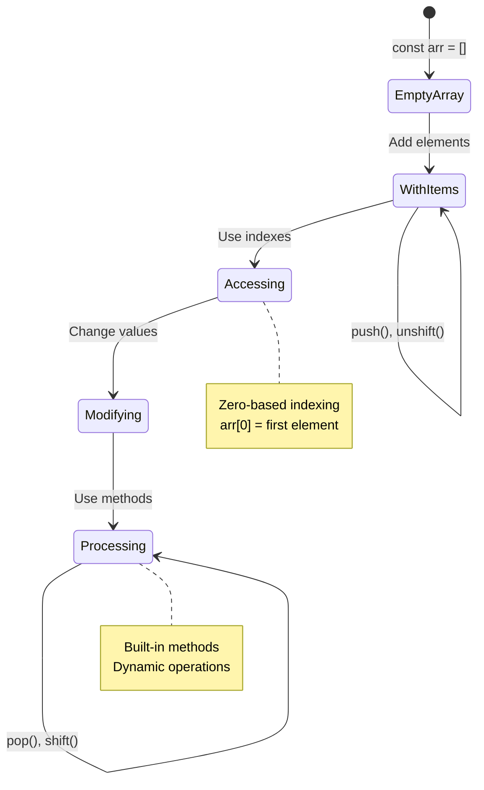

> **Thông tin thực tế**: Mảng có mặt khắp nơi trong lập trình! Dòng tin trên mạng xã hội, giỏ hàng, thư viện ảnh, danh sách bài hát - tất cả đều là mảng phía sau!

## Vòng lặp

Hãy nghĩ về hình phạt nổi tiếng trong các tiểu thuyết của Charles Dickens, nơi học sinh phải viết đi viết lại một câu trên bảng. Hãy tưởng tượng nếu bạn có thể chỉ cần yêu cầu ai đó "viết câu này 100 lần" và nó được thực hiện tự động. Đó chính xác là những gì vòng lặp làm cho mã của bạn.

Vòng lặp giống như có một trợ lý không biết mệt mỏi, có thể lặp lại các nhiệm vụ mà không mắc lỗi. Dù bạn cần kiểm tra từng mục trong giỏ hàng hay hiển thị tất cả ảnh trong một album, vòng lặp xử lý sự lặp lại một cách hiệu quả.

JavaScript cung cấp nhiều loại vòng lặp để bạn lựa chọn. Hãy cùng xem xét từng loại và hiểu khi nào nên sử dụng chúng.

```mermaid
flowchart TD
    A["🔄 Loop Types"] --> B["For Loop"]
    A --> C["While Loop"]
    A --> D["For...of Loop"]
    A --> E["forEach Method"]
    
    B --> B1["Known iterations"]
    B --> B2["Counter-based"]
    B --> B3["for(init; condition; increment)"]
    
    C --> C1["Unknown iterations"]
    C --> C2["Condition-based"]
    C --> C3["while(condition)"]
    
    D --> D1["Modern ES6+"]
    D --> D2["Array iteration"]
    D --> D3["for(item of array)"]
    
    E --> E1["Functional style"]
    E --> E2["Array method"]
    E --> E3["array.forEach(callback)"]
    
    F["⏰ When to Use"] --> F1["For: Counting, indexes"]
    F --> F2["While: User input, searching"]
    F --> F3["For...of: Simple iteration"]
    F --> F4["forEach: Functional programming"]
    
    style A fill:#e3f2fd
    style B fill:#e8f5e8
    style C fill:#fff3e0
    style D fill:#f3e5f5
    style E fill:#e0f2f1
    style F fill:#fce4ec
```

### Vòng lặp For

Vòng lặp `for` giống như đặt một bộ hẹn giờ - bạn biết chính xác số lần bạn muốn điều gì đó xảy ra. Nó rất có tổ chức và dễ dự đoán, điều này làm cho nó trở nên hoàn hảo khi bạn làm việc với mảng hoặc cần đếm số lượng.

**Cấu trúc vòng lặp For:**

| Thành phần | Mục đích | Ví dụ |
|-----------|---------|----------|
| **Khởi tạo** | Đặt điểm bắt đầu | `let i = 0` |
| **Điều kiện** | Khi nào tiếp tục | `i < 10` |
| **Tăng** | Cách cập nhật | `i++` |

```javascript
// Counting from 0 to 9
for (let i = 0; i < 10; i++) {
  console.log(`Count: ${i}`);
}

// More practical example: processing scores
const testScores = [85, 92, 78, 96, 88];
for (let i = 0; i < testScores.length; i++) {
  console.log(`Student ${i + 1}: ${testScores[i]}%`);
}
```

**Từng bước, đây là điều gì đang xảy ra:**
- **Khởi tạo** biến đếm `i` thành 0 lúc bắt đầu
- **Kiểm tra** điều kiện `i < 10` trước mỗi lần lặp
- **Thực thi** khối mã khi điều kiện đúng
- **Tăng** `i` thêm 1 sau mỗi lần lặp với `i++`
- **Dừng** khi điều kiện trở thành sai (khi `i` đạt đến 10)

✅ Chạy đoạn mã này trong bảng điều khiển trình duyệt. Điều gì xảy ra khi bạn thực hiện các thay đổi nhỏ đối với biến đếm, điều kiện, hoặc biểu thức lặp? Bạn có thể làm cho nó chạy ngược lại, tạo một đếm ngược không?

### 🗓️ **Kiểm tra sự thành thạo vòng lặp For: Lặp lại có kiểm soát**

**Đánh giá hiểu biết về vòng lặp For:**
- Ba phần của vòng lặp For là gì, và mỗi phần làm gì?
- Làm thế nào để bạn lặp qua một mảng ngược lại?
- Điều gì xảy ra nếu bạn quên phần tăng (`i++`)?

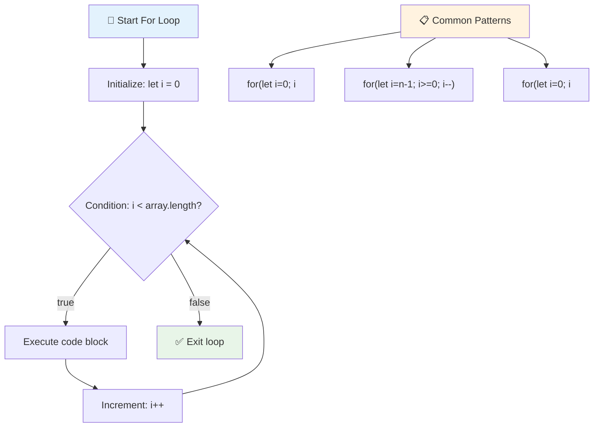

> **Sự khôn ngoan về vòng lặp**: Vòng lặp For rất phù hợp khi bạn biết chính xác số lần bạn cần lặp lại điều gì đó. Đây là lựa chọn phổ biến nhất để xử lý mảng!

### Vòng lặp While

Vòng lặp `while` giống như nói "tiếp tục làm điều này cho đến khi..." - bạn có thể không biết chính xác số lần nó sẽ chạy, nhưng bạn biết khi nào nên dừng. Nó rất phù hợp cho những việc như yêu cầu người dùng nhập liệu cho đến khi họ cung cấp đúng thông tin, hoặc tìm kiếm dữ liệu cho đến khi bạn tìm thấy điều bạn cần.

**Đặc điểm của vòng lặp While:**
- **Tiếp tục** thực thi miễn là điều kiện đúng
- **Yêu cầu** quản lý thủ công các biến đếm
- **Kiểm tra** điều kiện trước mỗi lần lặp
- **Có nguy cơ** vòng lặp vô hạn nếu điều kiện không bao giờ trở thành sai

```javascript
// Basic counting example
let i = 0;
while (i < 10) {
  console.log(`While count: ${i}`);
  i++; // Don't forget to increment!
}

// More practical example: processing user input
let userInput = "";
let attempts = 0;
const maxAttempts = 3;

while (userInput !== "quit" && attempts < maxAttempts) {
  userInput = prompt(`Enter 'quit' to exit (attempt ${attempts + 1}):`);
  attempts++;
}

if (attempts >= maxAttempts) {
  console.log("Maximum attempts reached!");
}
```

**Hiểu các ví dụ này:**
- **Quản lý** biến đếm `i` thủ công bên trong thân vòng lặp
- **Tăng** biến đếm để tránh vòng lặp vô hạn
- **Thể hiện** trường hợp sử dụng thực tế với đầu vào người dùng và giới hạn số lần thử
- **Bao gồm** cơ chế an toàn để tránh thực thi vô tận

### ♾️ **Kiểm tra sự khôn ngoan về vòng lặp While: Lặp lại dựa trên điều kiện**

**Kiểm tra hiểu biết về vòng lặp While:**
- Nguy cơ chính khi sử dụng vòng lặp While là gì?
- Khi nào bạn sẽ chọn vòng lặp While thay vì vòng lặp For?
- Làm thế nào để bạn tránh vòng lặp vô hạn?

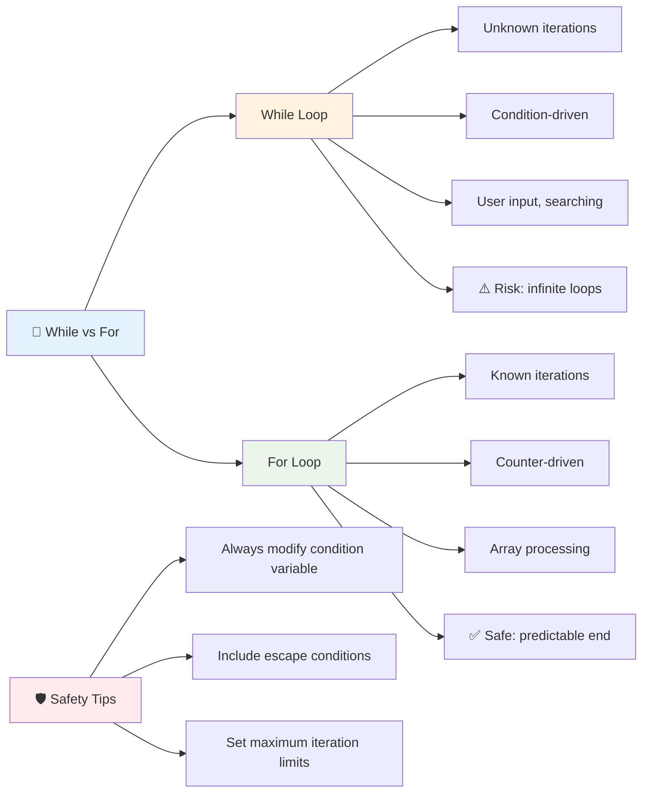

> **An toàn là trên hết**: Vòng lặp While rất mạnh mẽ nhưng yêu cầu quản lý điều kiện cẩn thận. Luôn đảm bảo điều kiện vòng lặp của bạn cuối cùng sẽ trở thành sai!

### Các lựa chọn thay thế vòng lặp hiện đại

JavaScript cung cấp cú pháp vòng lặp hiện đại có thể làm cho mã của bạn dễ đọc hơn và ít lỗi hơn.

**Vòng lặp For...of (ES6+):**

```javascript
const colors = ["red", "green", "blue", "yellow"];

// Modern approach - cleaner and safer
for (const color of colors) {
  console.log(`Color: ${color}`);
}

// Compare with traditional for loop
for (let i = 0; i < colors.length; i++) {
  console.log(`Color: ${colors[i]}`);
}
```

**Ưu điểm chính của For...of:**
- **Loại bỏ** việc quản lý chỉ số và các lỗi tiềm ẩn
- **Cung cấp** quyền truy cập trực tiếp vào các phần tử mảng
- **Cải thiện** khả năng đọc mã và giảm độ phức tạp cú pháp

**Phương thức forEach:**

```javascript
const prices = [9.99, 15.50, 22.75, 8.25];

// Using forEach for functional programming style
prices.forEach((price, index) => {
  console.log(`Item ${index + 1}: $${price.toFixed(2)}`);
});

// forEach with arrow functions for simple operations
prices.forEach(price => console.log(`Price: $${price}`));
```

**Những điều bạn cần biết về forEach:**
- **Thực thi** một hàm cho mỗi phần tử mảng
- **Cung cấp** cả giá trị phần tử và chỉ số làm tham số
- **Không thể** dừng sớm (khác với vòng lặp truyền thống)
- **Trả về** undefined (không tạo mảng mới)

✅ Tại sao bạn chọn vòng lặp For thay vì vòng lặp While? 17K người xem đã có cùng câu hỏi trên StackOverflow, và một số ý kiến [có thể thú vị với bạn](https://stackoverflow.com/questions/39969145/while-loops-vs-for-loops-in-javascript).

### 🎨 **Kiểm tra cú pháp vòng lặp hiện đại: Áp dụng ES6+**

**Đánh giá hiểu biết về JavaScript hiện đại:**
- Những ưu điểm của `for...of` so với vòng lặp For truyền thống là gì?
- Khi nào bạn vẫn thích vòng lặp For truyền thống?
- Sự khác biệt giữa `forEach` và `map` là gì?

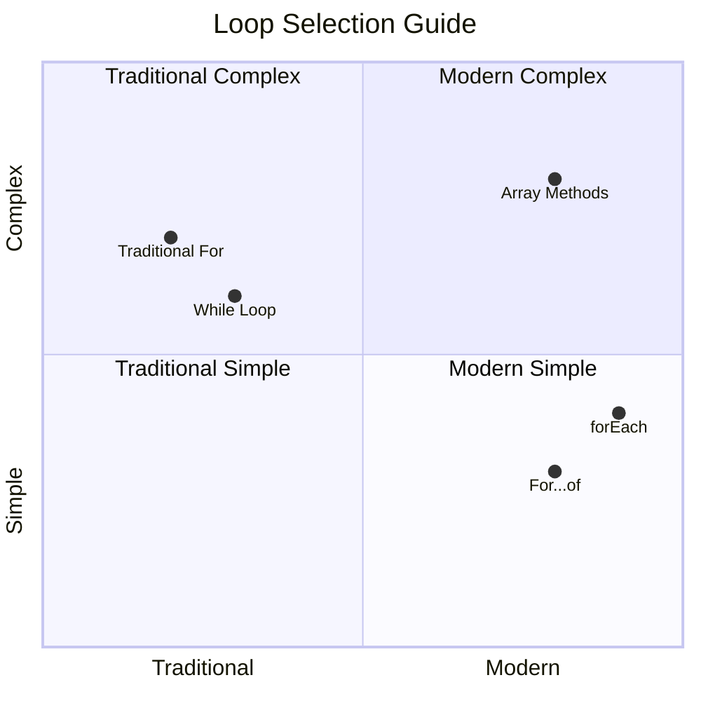

> **Xu hướng hiện đại**: Cú pháp ES6+ như `for...of` và `forEach` đang trở thành cách tiếp cận ưu tiên để lặp qua mảng vì nó sạch sẽ và ít lỗi hơn!

## Vòng lặp và Mảng

Kết hợp mảng với vòng lặp tạo ra khả năng xử lý dữ liệu mạnh mẽ. Sự kết hợp này là nền tảng cho nhiều nhiệm vụ lập trình, từ hiển thị danh sách đến tính toán thống kê.

**Xử lý mảng truyền thống:**

```javascript
const iceCreamFlavors = ["Chocolate", "Strawberry", "Vanilla", "Pistachio", "Rocky Road"];

// Classic for loop approach
for (let i = 0; i < iceCreamFlavors.length; i++) {
  console.log(`Flavor ${i + 1}: ${iceCreamFlavors[i]}`);
}

// Modern for...of approach
for (const flavor of iceCreamFlavors) {
  console.log(`Available flavor: ${flavor}`);
}
```

**Hãy hiểu từng cách tiếp cận:**
- **Sử dụng** thuộc tính độ dài mảng để xác định giới hạn vòng lặp
- **Truy cập** các phần tử theo chỉ số trong vòng lặp For truyền thống
- **Cung cấp** quyền truy cập trực tiếp vào phần tử trong vòng lặp For...of
- **Xử lý** từng phần tử mảng chính xác một lần

**Ví dụ xử lý dữ liệu thực tế:**

```javascript
const studentGrades = [85, 92, 78, 96, 88, 73, 89];
let total = 0;
let highestGrade = studentGrades[0];
let lowestGrade = studentGrades[0];

// Process all grades with a single loop
for (let i = 0; i < studentGrades.length; i++) {
  const grade = studentGrades[i];
  total += grade;
  
  if (grade > highestGrade) {
    highestGrade = grade;
  }
  
  if (grade < lowestGrade) {
    lowestGrade = grade;
  }
}

const average = total / studentGrades.length;
console.log(`Average: ${average.toFixed(1)}`);
console.log(`Highest: ${highestGrade}`);
console.log(`Lowest: ${lowestGrade}`);
```

**Đây là cách mã này hoạt động:**
- **Khởi tạo** các biến theo dõi cho tổng và giá trị cực đại
- **Xử lý** từng điểm số với một vòng lặp hiệu quả duy nhất
- **Tích lũy** tổng để tính trung bình
- **Theo dõi** giá trị cao nhất và thấp nhất trong quá trình lặp
- **Tính toán** thống kê cuối cùng sau khi hoàn thành vòng lặp

✅ Thử nghiệm lặp qua một mảng do bạn tự tạo trong bảng điều khiển trình duyệt.

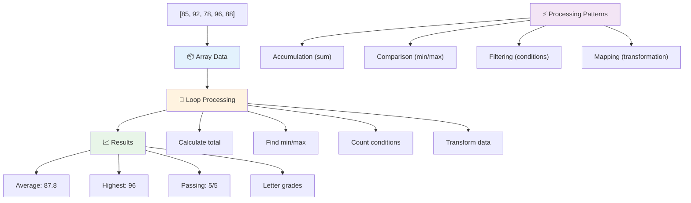

---

## Thử thách GitHub Copilot Agent 🚀

Sử dụng chế độ Agent để hoàn thành thử thách sau:

**Mô tả:** Xây dựng một hàm xử lý dữ liệu toàn diện kết hợp mảng và vòng lặp để phân tích một tập dữ liệu và tạo ra những thông tin chi tiết có ý nghĩa.

**Yêu cầu:** Tạo một hàm có tên `analyzeGrades` nhận một mảng các đối tượng điểm số học sinh (mỗi đối tượng chứa thuộc tính tên và điểm số) và trả về một đối tượng với các thống kê bao gồm điểm cao nhất, điểm thấp nhất, điểm trung bình, số lượng học sinh đạt (điểm >= 70), và một mảng tên học sinh có điểm trên trung bình. Sử dụng ít nhất hai loại vòng lặp khác nhau trong giải pháp của bạn.

Tìm hiểu thêm về [chế độ agent](https://code.visualstudio.com/blogs/2025/02/24/introducing-copilot-agent-mode) tại đây.

## 🚀 Thử thách
JavaScript cung cấp một số phương thức mảng hiện đại có thể thay thế các vòng lặp truyền thống cho các nhiệm vụ cụ thể. Khám phá [forEach](https://developer.mozilla.org/docs/Web/JavaScript/Reference/Global_Objects/Array/forEach), [for-of](https://developer.mozilla.org/docs/Web/JavaScript/Reference/Statements/for...of), [map](https://developer.mozilla.org/docs/Web/JavaScript/Reference/Global_Objects/Array/map), [filter](https://developer.mozilla.org/docs/Web/JavaScript/Reference/Global_Objects/Array/filter), và [reduce](https://developer.mozilla.org/docs/Web/JavaScript/Reference/Global_Objects/Array/reduce).

**Thử thách của bạn:** Viết lại ví dụ về điểm số học sinh bằng cách sử dụng ít nhất ba phương thức mảng khác nhau. Hãy chú ý xem mã trở nên sạch sẽ và dễ đọc hơn bao nhiêu với cú pháp JavaScript hiện đại.

## Câu hỏi sau bài học
[Câu hỏi sau bài học](https://ff-quizzes.netlify.app/web/quiz/14)

## Ôn tập & Tự học

Các mảng trong JavaScript có nhiều phương thức đi kèm, rất hữu ích cho việc xử lý dữ liệu. [Tìm hiểu về các phương thức này](https://developer.mozilla.org/docs/Web/JavaScript/Reference/Global_Objects/Array) và thử một số phương thức (như push, pop, slice và splice) trên một mảng do bạn tạo ra.

## Bài tập

[Loop an Array](assignment.md)

---

## 📊 **Tóm tắt công cụ Mảng & Vòng lặp của bạn**

```mermaid
graph TD
    A["🎯 Arrays & Loops Mastery"] --> B["📦 Array Fundamentals"]
    A --> C["🔄 Loop Types"]
    A --> D["🔗 Data Processing"]
    A --> E["🎨 Modern Techniques"]
    
    B --> B1["Creation: [ ]"]
    B --> B2["Indexing: arr[0]"]
    B --> B3["Methods: push, pop"]
    B --> B4["Properties: length"]
    
    C --> C1["For: Known iterations"]
    C --> C2["While: Condition-based"]
    C --> C3["For...of: Direct access"]
    C --> C4["forEach: Functional"]
    
    D --> D1["Statistics calculation"]
    D --> D2["Data transformation"]
    D --> D3["Filtering & searching"]
    D --> D4["Real-time processing"]
    
    E --> E1["Arrow functions"]
    E --> E2["Method chaining"]
    E --> E3["Destructuring"]
    E --> E4["Template literals"]
    
    F["💡 Key Benefits"] --> F1["Efficient data handling"]
    F --> F2["Reduced code repetition"]
    F --> F3["Scalable solutions"]
    F --> F4["Cleaner syntax"]
    
    style A fill:#e3f2fd
    style B fill:#e8f5e8
    style C fill:#fff3e0
    style D fill:#f3e5f5
    style E fill:#e0f2f1
    style F fill:#fce4ec
```

---

## 🚀 Lộ trình làm chủ Mảng & Vòng lặp của bạn

### ⚡ **Những việc bạn có thể làm trong 5 phút tới**
- [ ] Tạo một mảng các bộ phim yêu thích của bạn và truy cập các phần tử cụ thể
- [ ] Viết một vòng lặp for đếm từ 1 đến 10
- [ ] Thử thách phương thức mảng hiện đại từ bài học
- [ ] Thực hành chỉ số mảng trong bảng điều khiển trình duyệt của bạn

### 🎯 **Những gì bạn có thể hoàn thành trong giờ tới**
- [ ] Hoàn thành câu hỏi sau bài học và ôn lại các khái niệm khó
- [ ] Xây dựng trình phân tích điểm toàn diện từ thử thách GitHub Copilot
- [ ] Tạo một giỏ hàng đơn giản để thêm và xóa các mặt hàng
- [ ] Thực hành chuyển đổi giữa các loại vòng lặp khác nhau
- [ ] Thử nghiệm với các phương thức mảng như `push`, `pop`, `slice`, và `splice`

### 📅 **Hành trình xử lý dữ liệu trong tuần của bạn**
- [ ] Hoàn thành bài tập "Loop an Array" với các cải tiến sáng tạo
- [ ] Xây dựng ứng dụng danh sách việc cần làm bằng cách sử dụng mảng và vòng lặp
- [ ] Tạo một máy tính thống kê đơn giản cho dữ liệu số
- [ ] Thực hành với [phương thức mảng MDN](https://developer.mozilla.org/docs/Web/JavaScript/Reference/Global_Objects/Array)
- [ ] Xây dựng giao diện thư viện ảnh hoặc danh sách phát nhạc
- [ ] Khám phá lập trình hàm với `map`, `filter`, và `reduce`

### 🌟 **Biến đổi trong tháng của bạn**
- [ ] Làm chủ các thao tác mảng nâng cao và tối ưu hóa hiệu suất
- [ ] Xây dựng bảng điều khiển trực quan hóa dữ liệu hoàn chỉnh
- [ ] Đóng góp cho các dự án mã nguồn mở liên quan đến xử lý dữ liệu
- [ ] Dạy người khác về mảng và vòng lặp với các ví dụ thực tế
- [ ] Tạo thư viện cá nhân gồm các hàm xử lý dữ liệu có thể tái sử dụng
- [ ] Khám phá các thuật toán và cấu trúc dữ liệu dựa trên mảng

### 🏆 **Kiểm tra cuối cùng về làm chủ xử lý dữ liệu**

**Ăn mừng sự làm chủ mảng và vòng lặp của bạn:**
- Phép toán mảng nào hữu ích nhất mà bạn đã học được cho các ứng dụng thực tế?
- Loại vòng lặp nào khiến bạn cảm thấy tự nhiên nhất và tại sao?
- Hiểu về mảng và vòng lặp đã thay đổi cách bạn tổ chức dữ liệu như thế nào?
- Nhiệm vụ xử lý dữ liệu phức tạp nào bạn muốn giải quyết tiếp theo?

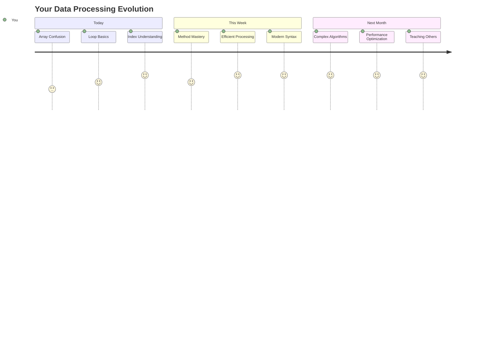

> 📦 **Bạn đã mở khóa sức mạnh của tổ chức và xử lý dữ liệu!** Mảng và vòng lặp là nền tảng của hầu hết mọi ứng dụng bạn sẽ xây dựng. Từ danh sách đơn giản đến phân tích dữ liệu phức tạp, giờ đây bạn đã có công cụ để xử lý thông tin một cách hiệu quả và tinh tế. Mọi trang web động, ứng dụng di động, và ứng dụng dựa trên dữ liệu đều dựa vào những khái niệm cơ bản này. Chào mừng bạn đến với thế giới xử lý dữ liệu quy mô lớn! 🎉

---

**Tuyên bố miễn trừ trách nhiệm**:  
Tài liệu này đã được dịch bằng dịch vụ dịch thuật AI [Co-op Translator](https://github.com/Azure/co-op-translator). Mặc dù chúng tôi cố gắng đảm bảo độ chính xác, xin lưu ý rằng các bản dịch tự động có thể chứa lỗi hoặc không chính xác. Tài liệu gốc bằng ngôn ngữ bản địa nên được coi là nguồn thông tin chính thức. Đối với các thông tin quan trọng, nên sử dụng dịch vụ dịch thuật chuyên nghiệp bởi con người. Chúng tôi không chịu trách nhiệm về bất kỳ sự hiểu lầm hoặc diễn giải sai nào phát sinh từ việc sử dụng bản dịch này.