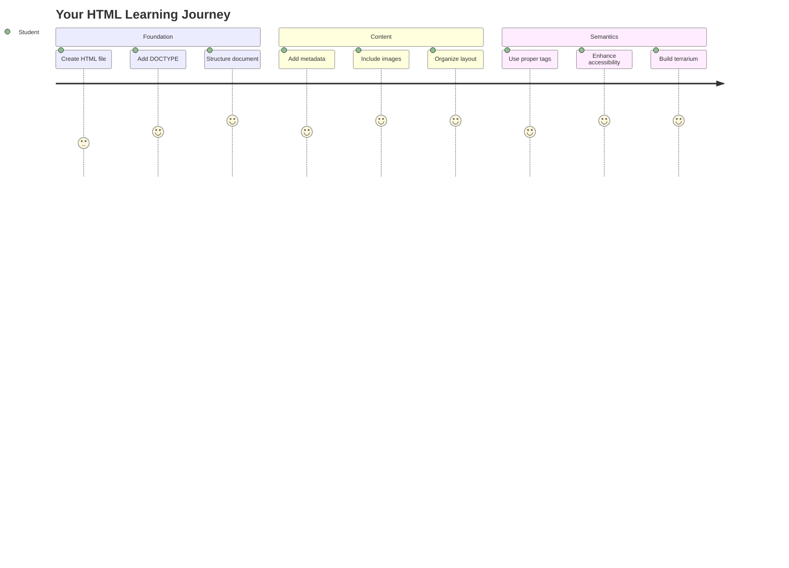
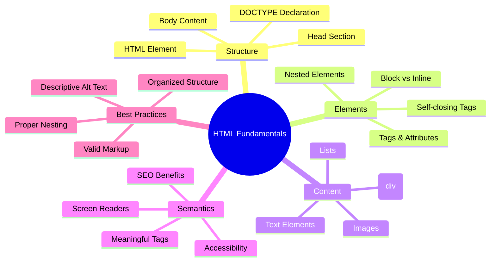
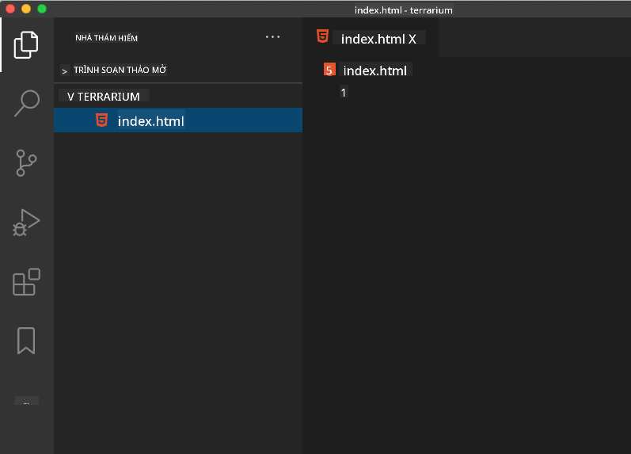
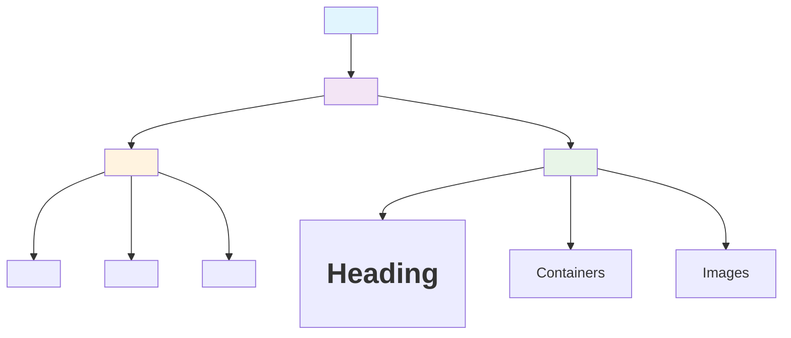
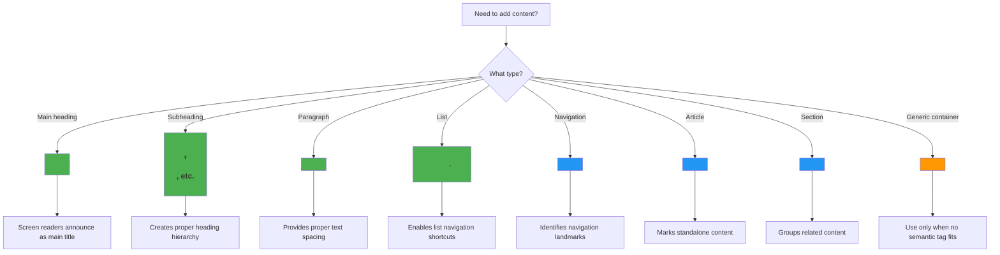
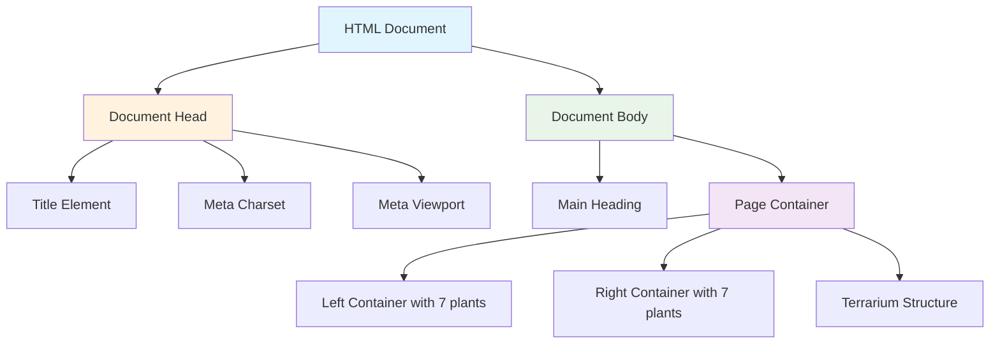
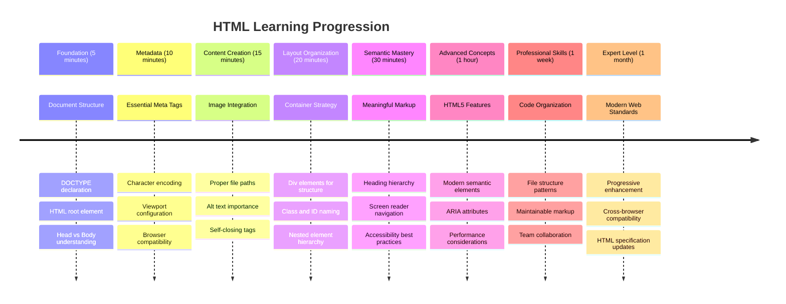

<!--
CO_OP_TRANSLATOR_METADATA:
{
  "original_hash": "3fcfa99c4897e051b558b5eaf1e8cc74",
  "translation_date": "2025-11-06T11:24:45+00:00",
  "source_file": "3-terrarium/1-intro-to-html/README.md",
  "language_code": "vi"
}
-->
# Dự án Terrarium Phần 1: Giới thiệu về HTML




> Sketchnote bởi [Tomomi Imura](https://twitter.com/girlie_mac)

HTML, hay HyperText Markup Language, là nền tảng của mọi trang web mà bạn từng truy cập. Hãy nghĩ về HTML như bộ khung xương cung cấp cấu trúc cho các trang web – nó xác định nơi nội dung sẽ xuất hiện, cách tổ chức và ý nghĩa của từng phần. Trong khi CSS sẽ "trang trí" HTML của bạn với màu sắc và bố cục, và JavaScript sẽ làm cho nó sống động với tính tương tác, HTML cung cấp cấu trúc cơ bản làm nền tảng cho mọi thứ khác.

Trong bài học này, bạn sẽ tạo cấu trúc HTML cho giao diện terrarium ảo. Dự án thực hành này sẽ giúp bạn học các khái niệm cơ bản về HTML trong khi xây dựng một thứ gì đó hấp dẫn về mặt hình ảnh. Bạn sẽ học cách tổ chức nội dung bằng các phần tử ngữ nghĩa, làm việc với hình ảnh và tạo nền tảng cho một ứng dụng web tương tác.

Kết thúc bài học này, bạn sẽ có một trang HTML hoạt động hiển thị hình ảnh cây cối trong các cột được tổ chức, sẵn sàng để được tạo kiểu trong bài học tiếp theo. Đừng lo nếu nó trông đơn giản lúc đầu – đó chính là điều HTML nên làm trước khi CSS thêm vào sự hoàn thiện về mặt hình ảnh.



## Quiz Trước Bài Giảng

[Quiz trước bài giảng](https://ff-quizzes.netlify.app/web/quiz/15)

> 📺 **Xem và Học**: Xem video tổng quan hữu ích này
> 
> [](https://www.youtube.com/watch?v=1TvxJKBzhyQ)

## Thiết Lập Dự Án Của Bạn

Trước khi đi sâu vào mã HTML, hãy thiết lập một không gian làm việc phù hợp cho dự án terrarium của bạn. Tạo một cấu trúc tệp được tổ chức từ đầu là một thói quen quan trọng sẽ giúp bạn trong suốt hành trình phát triển web.

### Nhiệm vụ: Tạo Cấu Trúc Dự Án Của Bạn

Bạn sẽ tạo một thư mục dành riêng cho dự án terrarium và thêm tệp HTML đầu tiên của mình. Dưới đây là hai cách bạn có thể sử dụng:

**Cách 1: Sử dụng Visual Studio Code**
1. Mở Visual Studio Code
2. Nhấp vào "File" → "Open Folder" hoặc sử dụng `Ctrl+K, Ctrl+O` (Windows/Linux) hoặc `Cmd+K, Cmd+O` (Mac)
3. Tạo một thư mục mới tên là `terrarium` và chọn nó
4. Trong bảng Explorer, nhấp vào biểu tượng "New File"
5. Đặt tên tệp của bạn là `index.html`



**Cách 2: Sử dụng Lệnh Terminal**
```bash
mkdir terrarium
cd terrarium
touch index.html
code index.html
```

**Những gì các lệnh này thực hiện:**
- **Tạo** một thư mục mới tên là `terrarium` cho dự án của bạn
- **Đi vào** thư mục terrarium 
- **Tạo** một tệp `index.html` trống
- **Mở** tệp trong Visual Studio Code để chỉnh sửa

> 💡 **Mẹo Chuyên Nghiệp**: Tên tệp `index.html` rất đặc biệt trong phát triển web. Khi ai đó truy cập một trang web, trình duyệt tự động tìm kiếm `index.html` làm trang mặc định để hiển thị. Điều này có nghĩa là một URL như `https://mysite.com/projects/` sẽ tự động phục vụ tệp `index.html` từ thư mục `projects` mà không cần chỉ định tên tệp trong URL.

## Hiểu Cấu Trúc Tài Liệu HTML

Mỗi tài liệu HTML tuân theo một cấu trúc cụ thể mà trình duyệt cần để hiểu và hiển thị chính xác. Hãy nghĩ về cấu trúc này như một lá thư chính thức – nó có các phần tử bắt buộc theo một thứ tự cụ thể giúp người nhận (trong trường hợp này là trình duyệt) xử lý nội dung đúng cách.



Hãy bắt đầu bằng cách thêm nền tảng cần thiết mà mọi tài liệu HTML cần có.

### Khai Báo DOCTYPE và Phần Tử Gốc

Hai dòng đầu tiên của bất kỳ tệp HTML nào đóng vai trò như "giới thiệu" của tài liệu với trình duyệt:

```html
<!DOCTYPE html>
<html></html>
```

**Hiểu những gì mã này làm:**
- **Khai báo** loại tài liệu là HTML5 bằng `<!DOCTYPE html>`
- **Tạo** phần tử gốc `<html>` sẽ chứa tất cả nội dung trang
- **Thiết lập** các tiêu chuẩn web hiện đại để trình duyệt hiển thị đúng cách
- **Đảm bảo** hiển thị nhất quán trên các trình duyệt và thiết bị khác nhau

> 💡 **Mẹo VS Code**: Di chuột qua bất kỳ thẻ HTML nào trong VS Code để xem thông tin hữu ích từ MDN Web Docs, bao gồm các ví dụ sử dụng và chi tiết tương thích trình duyệt.

> 📚 **Tìm Hiểu Thêm**: Khai báo DOCTYPE ngăn trình duyệt vào chế độ "quirks mode", được sử dụng để hỗ trợ các trang web rất cũ. Phát triển web hiện đại sử dụng khai báo đơn giản `<!DOCTYPE html>` để đảm bảo [hiển thị tuân thủ tiêu chuẩn](https://developer.mozilla.org/docs/Web/HTML/Quirks_Mode_and_Standards_Mode).

### 🔄 **Kiểm Tra Sư Phạm**
**Dừng Lại và Suy Ngẫm**: Trước khi tiếp tục, hãy đảm bảo bạn hiểu:
- ✅ Tại sao mọi tài liệu HTML cần khai báo DOCTYPE
- ✅ Phần tử gốc `<html>` chứa gì
- ✅ Cách cấu trúc này giúp trình duyệt hiển thị trang đúng cách

**Kiểm Tra Nhanh**: Bạn có thể giải thích bằng lời của mình "hiển thị tuân thủ tiêu chuẩn" nghĩa là gì không?

## Thêm Metadata Cần Thiết Cho Tài Liệu

Phần `<head>` của tài liệu HTML chứa thông tin quan trọng mà trình duyệt và công cụ tìm kiếm cần, nhưng khách truy cập không thấy trực tiếp trên trang. Hãy nghĩ về nó như thông tin "hậu trường" giúp trang web của bạn hoạt động đúng cách và hiển thị chính xác trên các thiết bị và nền tảng khác nhau.

Metadata này cho trình duyệt biết cách hiển thị trang của bạn, mã hóa ký tự nào cần sử dụng và cách xử lý các kích thước màn hình khác nhau – tất cả đều cần thiết để tạo các trang web chuyên nghiệp, dễ truy cập.

### Nhiệm vụ: Thêm Phần Đầu Tài Liệu

Chèn phần `<head>` này giữa các thẻ `<html>` mở và đóng của bạn:

```html
<head>
	<title>Welcome to my Virtual Terrarium</title>
	<meta charset="utf-8" />
	<meta http-equiv="X-UA-Compatible" content="IE=edge" />
	<meta name="viewport" content="width=device-width, initial-scale=1" />
</head>
```

**Phân tích những gì mỗi phần tử thực hiện:**
- **Đặt** tiêu đề trang xuất hiện trong tab trình duyệt và kết quả tìm kiếm
- **Chỉ định** mã hóa ký tự UTF-8 để hiển thị văn bản đúng cách trên toàn thế giới
- **Đảm bảo** tương thích với các phiên bản hiện đại của Internet Explorer
- **Cấu hình** thiết kế đáp ứng bằng cách đặt viewport khớp với chiều rộng thiết bị
- **Kiểm soát** mức độ thu phóng ban đầu để hiển thị nội dung ở kích thước tự nhiên

> 🤔 **Suy Nghĩ Về Điều Này**: Điều gì sẽ xảy ra nếu bạn đặt thẻ meta viewport như thế này: `<meta name="viewport" content="width=600">`? Điều này sẽ buộc trang luôn rộng 600 pixel, phá vỡ thiết kế đáp ứng! Tìm hiểu thêm về [cấu hình viewport đúng cách](https://developer.mozilla.org/docs/Web/HTML/Viewport_meta_tag).

## Xây Dựng Phần Thân Tài Liệu

Phần tử `<body>` chứa tất cả nội dung hiển thị của trang web – mọi thứ người dùng sẽ thấy và tương tác. Trong khi phần `<head>` cung cấp hướng dẫn cho trình duyệt, phần `<body>` chứa nội dung thực tế: văn bản, hình ảnh, nút và các phần tử khác tạo giao diện người dùng của bạn.

Hãy thêm cấu trúc phần thân và hiểu cách các thẻ HTML hoạt động cùng nhau để tạo nội dung có ý nghĩa.

### Hiểu Cấu Trúc Thẻ HTML

HTML sử dụng các thẻ cặp để xác định phần tử. Hầu hết các thẻ có thẻ mở như `<p>` và thẻ đóng như `</p>`, với nội dung ở giữa: `<p>Hello, world!</p>`. Điều này tạo ra một phần tử đoạn văn chứa văn bản "Hello, world!".

### Nhiệm vụ: Thêm Phần Tử Thân

Cập nhật tệp HTML của bạn để bao gồm phần tử `<body>`:

```html
<!DOCTYPE html>
<html>
	<head>
		<title>Welcome to my Virtual Terrarium</title>
		<meta charset="utf-8" />
		<meta http-equiv="X-UA-Compatible" content="IE=edge" />
		<meta name="viewport" content="width=device-width, initial-scale=1" />
	</head>
	<body></body>
</html>
```

**Đây là những gì cấu trúc hoàn chỉnh này cung cấp:**
- **Thiết lập** khung tài liệu HTML5 cơ bản
- **Bao gồm** metadata cần thiết để trình duyệt hiển thị đúng cách
- **Tạo** một phần thân trống sẵn sàng cho nội dung hiển thị của bạn
- **Tuân theo** các thực hành tốt nhất trong phát triển web hiện đại

Bây giờ bạn đã sẵn sàng thêm các phần tử hiển thị của terrarium. Chúng ta sẽ sử dụng các phần tử `<div>` làm container để tổ chức các phần nội dung khác nhau và các phần tử `` để hiển thị hình ảnh cây cối.

### Làm Việc Với Hình Ảnh và Container Bố Cục

Hình ảnh đặc biệt trong HTML vì chúng sử dụng thẻ "tự đóng". Không giống như các phần tử như `<p></p>` bao quanh nội dung, thẻ `` chứa tất cả thông tin cần thiết trong chính thẻ đó bằng các thuộc tính như `src` cho đường dẫn tệp hình ảnh và `alt` cho khả năng truy cập.

Trước khi thêm hình ảnh vào HTML của bạn, bạn cần tổ chức tệp dự án đúng cách bằng cách tạo một thư mục hình ảnh và thêm đồ họa cây cối.

**Đầu tiên, thiết lập hình ảnh của bạn:**
1. Tạo một thư mục tên là `images` bên trong thư mục dự án terrarium của bạn
2. Tải xuống hình ảnh cây cối từ [thư mục giải pháp](../../../../3-terrarium/solution/images) (tổng cộng 14 hình ảnh cây)
3. Sao chép tất cả hình ảnh cây vào thư mục `images` mới của bạn

### Nhiệm vụ: Tạo Bố Cục Hiển Thị Cây

Bây giờ hãy thêm hình ảnh cây được tổ chức trong hai cột giữa các thẻ `<body></body>` của bạn:

```html
<div id="page">
	<div id="left-container" class="container">
		<div class="plant-holder">
			
		</div>
		<div class="plant-holder">
			
		</div>
		<div class="plant-holder">
			
		</div>
		<div class="plant-holder">
			
		</div>
		<div class="plant-holder">
			
		</div>
		<div class="plant-holder">
			
		</div>
		<div class="plant-holder">
			
		</div>
	</div>
	<div id="right-container" class="container">
		<div class="plant-holder">
			
		</div>
		<div class="plant-holder">
			
		</div>
		<div class="plant-holder">
			
		</div>
		<div class="plant-holder">
			
		</div>
		<div class="plant-holder">
			
		</div>
		<div class="plant-holder">
			
		</div>
		<div class="plant-holder">
			
		</div>
	</div>
</div>
```

**Từng bước, đây là những gì đang xảy ra trong mã này:**
- **Tạo** một container trang chính với `id="page"` để chứa tất cả nội dung
- **Thiết lập** hai container cột: `left-container` và `right-container`
- **Tổ chức** 7 cây trong cột bên trái và 7 cây trong cột bên phải
- **Bao quanh** mỗi hình ảnh cây trong một div `plant-holder` để định vị riêng lẻ
- **Áp dụng** tên lớp nhất quán để tạo kiểu CSS trong bài học tiếp theo
- **Gán** ID duy nhất cho mỗi hình ảnh cây để tương tác JavaScript sau này
- **Bao gồm** đường dẫn tệp đúng chỉ đến thư mục hình ảnh

> 🤔 **Cân Nhắc Điều Này**: Lưu ý rằng tất cả hình ảnh hiện có cùng văn bản alt "plant". Điều này không lý tưởng cho khả năng truy cập. Người dùng trình đọc màn hình sẽ nghe "plant" lặp lại 14 lần mà không biết cây cụ thể nào mỗi hình ảnh hiển thị. Bạn có thể nghĩ ra văn bản alt tốt hơn, mô tả hơn cho mỗi hình ảnh không?

> 📝 **Các Loại Phần Tử HTML**: Các phần tử `<div>` là "cấp khối" và chiếm toàn bộ chiều rộng, trong khi các phần tử `<span>` là "cấp dòng" và chỉ chiếm chiều rộng cần thiết. Bạn nghĩ điều gì sẽ xảy ra nếu bạn thay đổi tất cả các thẻ `<div>` này thành thẻ `<span>`?

### 🔄 **Kiểm Tra Sư Phạm**
**Hiểu Cấu Trúc**: Dành một chút thời gian để xem lại cấu trúc HTML của bạn:
- ✅ Bạn có thể xác định các container chính trong bố cục của mình không?
- ✅ Bạn có hiểu tại sao mỗi hình ảnh có một ID duy nhất không?
- ✅ Bạn sẽ mô tả mục đích của các div `plant-holder` như thế nào?

**Kiểm Tra Hình Ảnh**: Mở tệp HTML của bạn trong trình duyệt. Bạn nên thấy:
- Danh sách cơ bản các hình ảnh cây
- Hình ảnh được tổ chức trong hai cột
- Bố cục đơn giản, chưa được tạo kiểu

**Nhớ Rằng**: Giao diện đơn giản này chính là điều HTML nên trông như trước khi tạo kiểu CSS!

Với mã này được thêm vào, các cây sẽ xuất hiện trên màn hình, mặc dù chúng chưa được hoàn thiện – đó là nhiệm vụ của CSS trong bài học tiếp theo! Hiện tại, bạn đã có một nền tảng HTML vững chắc tổ chức nội dung của bạn đúng cách và tuân theo các thực hành tốt nhất về khả năng truy cập.

## Sử Dụng HTML Ngữ Nghĩa Để Tăng Khả Năng Truy Cập

HTML ngữ nghĩa nghĩa là chọn các phần tử HTML dựa trên ý nghĩa và mục đích của chúng, không chỉ dựa trên giao diện. Khi bạn sử dụng đánh dấu ngữ nghĩa, bạn đang truyền đạt cấu trúc và ý nghĩa của nội dung của bạn cho trình duyệt, công cụ tìm kiếm và các công nghệ hỗ trợ như trình đọc màn hình.



Cách tiếp cận này làm cho các trang web của bạn dễ truy cập hơn đối với người dùng khuyết tật và giúp công cụ tìm kiếm hiểu rõ hơn về nội dung của bạn. Đây là một nguyên tắc cơ bản của phát triển web hiện đại tạo ra trải nghiệm tốt hơn cho mọi người.

### Thêm Tiêu Đề Trang Ngữ Nghĩa

Hãy thêm một tiêu đề phù hợp cho trang terrarium của bạn. Chèn dòng này ngay sau thẻ `<body>` mở:

```html
<h1>My Terrarium</h1>
```

**Tại sao đánh dấu ngữ nghĩa quan trọng:**
- **Giúp** trình đọc màn hình điều hướng và hiểu cấu trúc trang
- **Cải thiện** tối ưu hóa công cụ tìm kiếm (SEO) bằng cách làm rõ thứ bậc nội dung
- **Tăng cường** khả năng truy cập cho người dùng có khiếm khuyết thị giác hoặc khác biệt nhận thức
- **Tạo** trải nghiệm người dùng tốt hơn trên tất cả các thiết bị và nền tảng
- **Tuân theo** các tiêu chuẩn web và thực hành tốt nhất cho phát triển chuyên nghiệp

**Ví dụ về lựa chọn ngữ nghĩa và không ngữ nghĩa:**

| Mục đích | ✅ Lựa Chọn Ngữ Nghĩa | ❌ Lựa Chọn Không Ngữ Nghĩa |
|---------|-------------------|------------------------|
| Tiêu đề chính | `<h1>Tiêu đề</h1>` | `<div class="big-text">Tiêu đề</div>` |
| Điều hướng | `<nav><ul><li></li></ul></nav>` | `<div class="menu"><div></div></div>` |
| Nút | `<button>Nhấn vào tôi</button>` | `<span onclick="...">Nhấn vào tôi</span>` |
| Nội dung bài viết | `<article><p></p></article>` | `<div class="content"><div></div></div>` |

> 🎥 **Xem Thực Tế**: Xem [cách trình đọc màn hình tương tác với các trang web](https://www.youtube.com/watch?v=OUDV1gqs9GA) để hiểu tại sao đánh dấu ngữ nghĩa rất quan trọng đối với khả năng truy cập. Lưu ý cách cấu trúc HTML đúng giúp người dùng điều hướng hiệu quả.

## Tạo Container Terrarium

Bây giờ hãy thêm cấu trúc HTML cho terrarium – container kính nơi cây sẽ được đặt. Phần này minh họa một khái niệm quan trọng: HTML cung cấp cấu trúc, nhưng nếu không có tạo kiểu CSS, các phần tử này sẽ chưa hiển thị rõ ràng.

Đánh dấu terrarium sử dụng tên lớp mô tả sẽ làm cho việc tạo kiểu CSS trực quan và dễ duy trì trong bài học tiếp theo.

### Nhiệm vụ: Thêm Cấu Trúc Terrarium

Chèn đoạn mã này phía trên thẻ `</div>` cuối cùng (trước thẻ đóng của container trang):

```html
<div id="terrarium">
	<div class="jar-top"></div>
	<div class="jar-walls">
		<div class="jar-glossy-long"></div>
		<div class="jar-glossy-short"></div>
	</div>
	<div class="dirt"></div>
	<div class="jar-bottom"></div>
</div>
```

**Hiểu cấu trúc terrarium này:**
- **Tạo** một container terrarium chính với ID duy nhất để tạo kiểu
- **Xác định** các phần tử riêng biệt cho từng thành phần hình ảnh (phần trên, tường, đất, đáy)
- **Bao gồm** các phần tử lồng nhau để tạo hiệu ứng phản chiếu kính (các phần tử bóng)
- **Sử dụng** tên lớp mô tả rõ ràng mục đích của từng phần tử
- **Chuẩn bị** cấu trúc cho việc tạo kiểu CSS để tạo ra hình ảnh terrarium bằng kính

> 🤔 **Có nhận ra điều gì không?**: Mặc dù bạn đã thêm đoạn mã này, bạn vẫn không thấy gì mới trên trang! Điều này minh họa hoàn hảo cách HTML cung cấp cấu trúc trong khi CSS tạo ra hình ảnh. Các phần tử `<div>` này tồn tại nhưng chưa có kiểu dáng hình ảnh – điều này sẽ được thực hiện trong bài học tiếp theo!



### 🔄 **Kiểm tra sư phạm**
**Thành thạo cấu trúc HTML**: Trước khi tiếp tục, hãy đảm bảo bạn có thể:
- ✅ Giải thích sự khác biệt giữa cấu trúc HTML và hình ảnh hiển thị
- ✅ Nhận diện các phần tử HTML có ý nghĩa và không có ý nghĩa
- ✅ Mô tả cách đánh dấu đúng giúp cải thiện khả năng truy cập
- ✅ Nhận biết cấu trúc cây tài liệu hoàn chỉnh

**Kiểm tra sự hiểu biết của bạn**: Hãy thử mở tệp HTML của bạn trong trình duyệt với JavaScript bị vô hiệu hóa và CSS bị loại bỏ. Điều này sẽ hiển thị cấu trúc ngữ nghĩa thuần túy mà bạn đã tạo!

---

## Thử thách GitHub Copilot Agent

Sử dụng chế độ Agent để hoàn thành thử thách sau:

**Mô tả:** Tạo một cấu trúc HTML ngữ nghĩa cho phần hướng dẫn chăm sóc cây trồng có thể được thêm vào dự án terrarium.

**Yêu cầu:** Tạo một phần HTML ngữ nghĩa bao gồm tiêu đề chính "Hướng dẫn chăm sóc cây trồng", ba phần phụ với tiêu đề "Tưới nước", "Yêu cầu ánh sáng", và "Chăm sóc đất", mỗi phần chứa một đoạn văn thông tin về chăm sóc cây trồng. Sử dụng các thẻ HTML ngữ nghĩa phù hợp như `<section>`, `<h2>`, `<h3>`, và `<p>` để cấu trúc nội dung một cách hợp lý.

Tìm hiểu thêm về [chế độ agent](https://code.visualstudio.com/blogs/2025/02/24/introducing-copilot-agent-mode) tại đây.

## Thử thách khám phá lịch sử HTML

**Tìm hiểu về sự phát triển của web**

HTML đã phát triển đáng kể kể từ khi Tim Berners-Lee tạo ra trình duyệt web đầu tiên tại CERN vào năm 1990. Một số thẻ cũ như `<marquee>` hiện đã bị loại bỏ vì chúng không phù hợp với các tiêu chuẩn truy cập hiện đại và nguyên tắc thiết kế đáp ứng.

**Thử nghiệm này:**
1. Tạm thời bao bọc tiêu đề `<h1>` của bạn trong thẻ `<marquee>`: `<marquee><h1>Terrarium của tôi</h1></marquee>`
2. Mở trang của bạn trong trình duyệt và quan sát hiệu ứng cuộn
3. Xem xét lý do tại sao thẻ này bị loại bỏ (gợi ý: nghĩ về trải nghiệm người dùng và khả năng truy cập)
4. Loại bỏ thẻ `<marquee>` và quay lại đánh dấu ngữ nghĩa

**Câu hỏi phản ánh:**
- Tiêu đề cuộn có thể ảnh hưởng như thế nào đến người dùng bị suy giảm thị lực hoặc nhạy cảm với chuyển động?
- Những kỹ thuật CSS hiện đại nào có thể đạt được hiệu ứng hình ảnh tương tự một cách dễ truy cập hơn?
- Tại sao việc sử dụng các tiêu chuẩn web hiện tại thay vì các phần tử đã bị loại bỏ lại quan trọng?

Khám phá thêm về [các phần tử HTML lỗi thời và bị loại bỏ](https://developer.mozilla.org/docs/Web/HTML/Element#Obsolete_and_deprecated_elements) để hiểu cách các tiêu chuẩn web phát triển nhằm cải thiện trải nghiệm người dùng.

## Bài kiểm tra sau bài giảng

[Bài kiểm tra sau bài giảng](https://ff-quizzes.netlify.app/web/quiz/16)

## Ôn tập & Tự học

**Nâng cao kiến thức HTML của bạn**

HTML đã là nền tảng của web trong hơn 30 năm, phát triển từ một ngôn ngữ đánh dấu tài liệu đơn giản thành một nền tảng tinh vi để xây dựng các ứng dụng tương tác. Hiểu được sự phát triển này giúp bạn đánh giá cao các tiêu chuẩn web hiện đại và đưa ra các quyết định phát triển tốt hơn.

**Lộ trình học tập được đề xuất:**

1. **Lịch sử và sự phát triển của HTML**
   - Nghiên cứu dòng thời gian từ HTML 1.0 đến HTML5
   - Khám phá lý do tại sao một số thẻ bị loại bỏ (khả năng truy cập, thân thiện với thiết bị di động, dễ bảo trì)
   - Tìm hiểu các tính năng HTML mới nổi và các đề xuất

2. **Khám phá sâu về HTML ngữ nghĩa**
   - Nghiên cứu danh sách đầy đủ các [phần tử HTML5 ngữ nghĩa](https://developer.mozilla.org/docs/Web/HTML/Element)
   - Thực hành nhận diện khi nào sử dụng `<article>`, `<section>`, `<aside>`, và `<main>`
   - Tìm hiểu về các thuộc tính ARIA để tăng cường khả năng truy cập

3. **Phát triển web hiện đại**
   - Khám phá [xây dựng các trang web đáp ứng](https://docs.microsoft.com/learn/modules/build-simple-website/?WT.mc_id=academic-77807-sagibbon) trên Microsoft Learn
   - Hiểu cách HTML tích hợp với CSS và JavaScript
   - Tìm hiểu về hiệu suất web và các phương pháp SEO tốt nhất

**Câu hỏi phản ánh:**
- Bạn đã khám phá được những thẻ HTML nào bị loại bỏ và tại sao chúng bị loại bỏ?
- Những tính năng HTML mới nào đang được đề xuất cho các phiên bản tương lai?
- HTML ngữ nghĩa đóng góp như thế nào vào khả năng truy cập web và SEO?

### ⚡ **Những việc bạn có thể làm trong 5 phút tới**
- [ ] Mở DevTools (F12) và kiểm tra cấu trúc HTML của trang web yêu thích của bạn
- [ ] Tạo một tệp HTML đơn giản với các thẻ cơ bản: `<h1>`, `<p>`, và ``
- [ ] Xác thực HTML của bạn bằng công cụ W3C HTML Validator trực tuyến
- [ ] Thử thêm một bình luận vào HTML của bạn bằng `<!-- bình luận -->`

### 🎯 **Những gì bạn có thể hoàn thành trong giờ tới**
- [ ] Hoàn thành bài kiểm tra sau bài học và ôn tập các khái niệm HTML ngữ nghĩa
- [ ] Xây dựng một trang web đơn giản về bản thân bạn sử dụng cấu trúc HTML đúng
- [ ] Thử nghiệm với các cấp độ tiêu đề khác nhau và các thẻ định dạng văn bản
- [ ] Thêm hình ảnh và liên kết để thực hành tích hợp đa phương tiện
- [ ] Nghiên cứu các tính năng HTML5 mà bạn chưa thử

### 📅 **Hành trình HTML trong tuần của bạn**
- [ ] Hoàn thành bài tập dự án terrarium với đánh dấu ngữ nghĩa
- [ ] Tạo một trang web có khả năng truy cập sử dụng nhãn và vai trò ARIA
- [ ] Thực hành tạo biểu mẫu với các loại đầu vào khác nhau
- [ ] Khám phá các API HTML5 như localStorage hoặc geolocation
- [ ] Nghiên cứu các mẫu HTML đáp ứng và thiết kế ưu tiên di động
- [ ] Xem lại mã HTML của các nhà phát triển khác để học hỏi các phương pháp tốt nhất

### 🌟 **Nền tảng web của bạn trong tháng**
- [ ] Xây dựng một trang web danh mục đầu tư thể hiện sự thành thạo HTML của bạn
- [ ] Học cách tạo mẫu HTML với một framework như Handlebars
- [ ] Đóng góp cho các dự án mã nguồn mở bằng cách cải thiện tài liệu HTML
- [ ] Thành thạo các khái niệm HTML nâng cao như phần tử tùy chỉnh
- [ ] Tích hợp HTML với các framework CSS và thư viện JavaScript
- [ ] Hướng dẫn người khác học các nguyên tắc cơ bản của HTML

## 🎯 Lộ trình thành thạo HTML của bạn



### 🛠️ Tóm tắt bộ công cụ HTML của bạn

Sau khi hoàn thành bài học này, bạn đã có:
- **Cấu trúc tài liệu**: Nền tảng HTML5 hoàn chỉnh với DOCTYPE đúng
- **Đánh dấu ngữ nghĩa**: Các thẻ có ý nghĩa giúp tăng cường khả năng truy cập và SEO
- **Tích hợp hình ảnh**: Thực hành tổ chức tệp và văn bản thay thế đúng cách
- **Các container bố cục**: Sử dụng chiến lược các div với tên lớp mô tả
- **Nhận thức về khả năng truy cập**: Hiểu cách điều hướng bằng trình đọc màn hình
- **Tiêu chuẩn hiện đại**: Các thực hành HTML5 hiện tại và kiến thức về thẻ bị loại bỏ
- **Nền tảng dự án**: Cơ sở vững chắc cho việc tạo kiểu CSS và tương tác JavaScript

**Bước tiếp theo**: Cấu trúc HTML của bạn đã sẵn sàng cho việc tạo kiểu CSS! Nền tảng ngữ nghĩa bạn đã xây dựng sẽ giúp bài học tiếp theo dễ hiểu hơn.

## Bài tập

[Thực hành HTML của bạn: Xây dựng mô hình blog](assignment.md)

---

**Tuyên bố miễn trừ trách nhiệm**:  
Tài liệu này đã được dịch bằng dịch vụ dịch thuật AI [Co-op Translator](https://github.com/Azure/co-op-translator). Mặc dù chúng tôi cố gắng đảm bảo độ chính xác, xin lưu ý rằng các bản dịch tự động có thể chứa lỗi hoặc không chính xác. Tài liệu gốc bằng ngôn ngữ bản địa nên được coi là nguồn thông tin chính thức. Đối với thông tin quan trọng, nên sử dụng dịch vụ dịch thuật chuyên nghiệp bởi con người. Chúng tôi không chịu trách nhiệm cho bất kỳ sự hiểu lầm hoặc diễn giải sai nào phát sinh từ việc sử dụng bản dịch này.