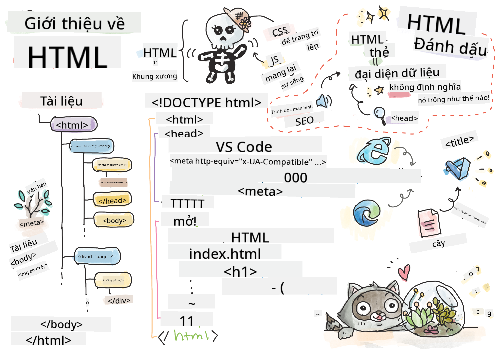

<!--
CO_OP_TRANSLATOR_METADATA:
{
  "original_hash": "89f7f9f800ce7c9f149e98baaae8491a",
  "translation_date": "2025-08-29T08:57:06+00:00",
  "source_file": "3-terrarium/1-intro-to-html/README.md",
  "language_code": "vi"
}
-->
# Dự án Terrarium Phần 1: Giới thiệu về HTML


> Sketchnote bởi [Tomomi Imura](https://twitter.com/girlie_mac)

## Câu hỏi trước bài giảng

[Câu hỏi trước bài giảng](https://ff-quizzes.netlify.app/web/quiz/15)

> Xem video

> 
> [](https://www.youtube.com/watch?v=1TvxJKBzhyQ)

### Giới thiệu

HTML, hay HyperText Markup Language, là 'bộ khung' của web. Nếu CSS 'trang trí' cho HTML và JavaScript mang lại sự sống, thì HTML chính là cơ thể của ứng dụng web. Cú pháp của HTML thậm chí còn phản ánh ý tưởng này, vì nó bao gồm các thẻ "head", "body", và "footer".

Trong bài học này, chúng ta sẽ sử dụng HTML để tạo bố cục 'bộ khung' cho giao diện terrarium ảo của mình. Nó sẽ có một tiêu đề và ba cột: một cột bên trái và một cột bên phải nơi các cây có thể kéo thả, và một khu vực trung tâm sẽ là terrarium trông giống như kính. Đến cuối bài học này, bạn sẽ có thể nhìn thấy các cây trong các cột, nhưng giao diện sẽ trông hơi kỳ lạ; đừng lo, trong phần tiếp theo bạn sẽ thêm các kiểu CSS để làm cho giao diện trông đẹp hơn.

### Nhiệm vụ

Trên máy tính của bạn, tạo một thư mục có tên 'terrarium' và bên trong nó, một tệp có tên 'index.html'. Bạn có thể làm điều này trong Visual Studio Code sau khi tạo thư mục terrarium bằng cách mở một cửa sổ VS Code mới, nhấp vào 'open folder', và điều hướng đến thư mục mới của bạn. Nhấp vào nút 'file' nhỏ trong bảng Explorer và tạo tệp mới:


Hoặc

Sử dụng các lệnh này trên git bash:
* `mkdir terrarium`
* `cd terrarium`
* `touch index.html`
* `code index.html` hoặc `nano index.html`

> Các tệp index.html cho trình duyệt biết rằng đây là tệp mặc định trong một thư mục; các URL như `https://anysite.com/test` có thể được xây dựng bằng cấu trúc thư mục bao gồm một thư mục có tên `test` với `index.html` bên trong; `index.html` không cần phải hiển thị trong URL.

---

## DocType và thẻ html

Dòng đầu tiên của một tệp HTML là doctype của nó. Điều này hơi bất ngờ khi bạn cần có dòng này ở đầu tệp, nhưng nó cho các trình duyệt cũ biết rằng trình duyệt cần hiển thị trang theo chế độ tiêu chuẩn, tuân theo đặc tả HTML hiện tại.

> Mẹo: trong VS Code, bạn có thể di chuột qua một thẻ và nhận thông tin về cách sử dụng nó từ các hướng dẫn tham khảo của MDN.

Dòng thứ hai nên là thẻ mở `<html>`, ngay sau đó là thẻ đóng `</html>`. Các thẻ này là các phần tử gốc của giao diện của bạn.

### Nhiệm vụ

Thêm các dòng này ở đầu tệp `index.html` của bạn:

```HTML
<!DOCTYPE html>
<html></html>
```

✅ Có một vài chế độ khác nhau có thể được xác định bằng cách thiết lập DocType với một chuỗi truy vấn: [Quirks Mode và Standards Mode](https://developer.mozilla.org/docs/Web/HTML/Quirks_Mode_and_Standards_Mode). Các chế độ này từng hỗ trợ các trình duyệt rất cũ mà hiện nay không thường được sử dụng (Netscape Navigator 4 và Internet Explorer 5). Bạn có thể sử dụng khai báo doctype tiêu chuẩn.

---

## 'head' của tài liệu

Khu vực 'head' của tài liệu HTML bao gồm thông tin quan trọng về trang web của bạn, còn được gọi là [metadata](https://developer.mozilla.org/docs/Web/HTML/Element/meta). Trong trường hợp của chúng ta, chúng ta sẽ nói với máy chủ web nơi trang này sẽ được gửi để hiển thị, bốn điều sau:

-   tiêu đề của trang
-   metadata của trang bao gồm:
    -   'character set', cho biết mã hóa ký tự nào được sử dụng trong trang
    -   thông tin trình duyệt, bao gồm `x-ua-compatible` chỉ ra rằng trình duyệt IE=edge được hỗ trợ
    -   thông tin về cách viewport nên hoạt động khi nó được tải. Thiết lập viewport có scale ban đầu là 1 kiểm soát mức độ zoom khi trang được tải lần đầu.

### Nhiệm vụ

Thêm một khối 'head' vào tài liệu của bạn giữa thẻ mở và thẻ đóng `<html>`.

```html
<head>
	<title>Welcome to my Virtual Terrarium</title>
	<meta charset="utf-8" />
	<meta http-equiv="X-UA-Compatible" content="IE=edge" />
	<meta name="viewport" content="width=device-width, initial-scale=1" />
</head>
```

✅ Điều gì sẽ xảy ra nếu bạn thiết lập thẻ meta viewport như thế này: `<meta name="viewport" content="width=600">`? Đọc thêm về [viewport](https://developer.mozilla.org/docs/Web/HTML/Viewport_meta_tag).

---

## `body` của tài liệu

### Thẻ HTML

Trong HTML, bạn thêm các thẻ vào tệp .html của mình để tạo các phần tử của trang web. Mỗi thẻ thường có thẻ mở và thẻ đóng, như thế này: `<p>hello</p>` để chỉ ra một đoạn văn. Tạo phần body của giao diện của bạn bằng cách thêm một cặp thẻ `<body>` bên trong cặp thẻ `<html>`; đánh dấu của bạn bây giờ trông như thế này:

### Nhiệm vụ

```html
<!DOCTYPE html>
<html>
	<head>
		<title>Welcome to my Virtual Terrarium</title>
		<meta charset="utf-8" />
		<meta http-equiv="X-UA-Compatible" content="IE=edge" />
		<meta name="viewport" content="width=device-width, initial-scale=1" />
	</head>
	<body></body>
</html>
```

Bây giờ, bạn có thể bắt đầu xây dựng trang của mình. Thông thường, bạn sử dụng các thẻ `<div>` để tạo các phần tử riêng biệt trong một trang. Chúng ta sẽ tạo một loạt các phần tử `<div>` chứa hình ảnh.

### Hình ảnh

Một thẻ html không cần thẻ đóng là thẻ ``, vì nó có một phần tử `src` chứa tất cả thông tin mà trang cần để hiển thị mục.

Tạo một thư mục trong ứng dụng của bạn có tên `images` và trong đó, thêm tất cả các hình ảnh trong [thư mục mã nguồn](../../../../3-terrarium/solution/images); (có 14 hình ảnh của cây).

### Nhiệm vụ

Thêm các hình ảnh cây đó vào hai cột giữa các thẻ `<body></body>`:

```html
<div id="page">
	<div id="left-container" class="container">
		<div class="plant-holder">
			
		</div>
		<div class="plant-holder">
			
		</div>
		<div class="plant-holder">
			
		</div>
		<div class="plant-holder">
			
		</div>
		<div class="plant-holder">
			
		</div>
		<div class="plant-holder">
			
		</div>
		<div class="plant-holder">
			
		</div>
	</div>
	<div id="right-container" class="container">
		<div class="plant-holder">
			
		</div>
		<div class="plant-holder">
			
		</div>
		<div class="plant-holder">
			
		</div>
		<div class="plant-holder">
			
		</div>
		<div class="plant-holder">
			
		</div>
		<div class="plant-holder">
			
		</div>
		<div class="plant-holder">
			
		</div>
	</div>
</div>
```

> Lưu ý: Spans vs. Divs. Divs được coi là các phần tử 'block', và Spans là 'inline'. Điều gì sẽ xảy ra nếu bạn chuyển đổi các divs này thành spans?

Với đánh dấu này, các cây bây giờ xuất hiện trên màn hình. Nó trông khá tệ, vì chúng chưa được định kiểu bằng CSS, và chúng ta sẽ làm điều đó trong bài học tiếp theo.

Mỗi hình ảnh có văn bản thay thế sẽ xuất hiện ngay cả khi bạn không thể nhìn thấy hoặc hiển thị hình ảnh. Đây là một thuộc tính quan trọng cần bao gồm để đảm bảo khả năng truy cập. Tìm hiểu thêm về khả năng truy cập trong các bài học sau; hiện tại, hãy nhớ rằng thuộc tính alt cung cấp thông tin thay thế cho một hình ảnh nếu người dùng vì lý do nào đó không thể xem nó (do kết nối chậm, lỗi trong thuộc tính src, hoặc nếu người dùng sử dụng trình đọc màn hình).

✅ Bạn có nhận thấy rằng mỗi hình ảnh có cùng thẻ alt không? Điều này có phải là thực hành tốt không? Tại sao hoặc tại sao không? Bạn có thể cải thiện mã này không?

---

## Đánh dấu ngữ nghĩa

Nói chung, việc sử dụng 'ngữ nghĩa' có ý nghĩa khi viết HTML là điều được ưu tiên. Điều đó có nghĩa là gì? Nó có nghĩa là bạn sử dụng các thẻ HTML để đại diện cho loại dữ liệu hoặc tương tác mà chúng được thiết kế cho. Ví dụ, văn bản tiêu đề chính trên một trang nên sử dụng thẻ `<h1>`.

Thêm dòng sau ngay bên dưới thẻ mở `<body>` của bạn:

```html
<h1>My Terrarium</h1>
```

Sử dụng đánh dấu ngữ nghĩa như việc có tiêu đề là `<h1>` và danh sách không được sắp xếp được hiển thị dưới dạng `<ul>` giúp trình đọc màn hình điều hướng qua một trang. Nói chung, các nút nên được viết dưới dạng `<button>` và danh sách nên là `<li>`. Mặc dù _có thể_ sử dụng các phần tử `<span>` được định kiểu đặc biệt với các trình xử lý click để giả lập nút, nhưng tốt hơn cho người dùng khuyết tật là sử dụng công nghệ để xác định vị trí của một nút trên trang và tương tác với nó, nếu phần tử xuất hiện dưới dạng nút. Vì lý do này, hãy cố gắng sử dụng đánh dấu ngữ nghĩa càng nhiều càng tốt.

✅ Xem trình đọc màn hình và [cách nó tương tác với một trang web](https://www.youtube.com/watch?v=OUDV1gqs9GA). Bạn có thấy tại sao việc không sử dụng đánh dấu ngữ nghĩa có thể làm người dùng khó chịu không?

## Terrarium

Phần cuối cùng của giao diện này liên quan đến việc tạo đánh dấu sẽ được định kiểu để tạo một terrarium.

### Nhiệm vụ:

Thêm đánh dấu này phía trên thẻ `</div>` cuối cùng:

```html
<div id="terrarium">
	<div class="jar-top"></div>
	<div class="jar-walls">
		<div class="jar-glossy-long"></div>
		<div class="jar-glossy-short"></div>
	</div>
	<div class="dirt"></div>
	<div class="jar-bottom"></div>
</div>
```

✅ Mặc dù bạn đã thêm đánh dấu này vào màn hình, bạn không thấy gì được hiển thị. Tại sao?

---

## 🚀Thử thách

Có một số thẻ 'cũ' trong HTML vẫn thú vị để thử nghiệm, mặc dù bạn không nên sử dụng các thẻ đã bị loại bỏ như [các thẻ này](https://developer.mozilla.org/docs/Web/HTML/Element#Obsolete_and_deprecated_elements) trong đánh dấu của mình. Tuy nhiên, bạn có thể sử dụng thẻ `<marquee>` cũ để làm cho tiêu đề h1 cuộn ngang không? (nếu bạn làm, đừng quên xóa nó sau đó)

## Câu hỏi sau bài giảng

[Câu hỏi sau bài giảng](https://ff-quizzes.netlify.app/web/quiz/16)

## Ôn tập & Tự học

HTML là hệ thống xây dựng 'đã được thử nghiệm và chứng minh' giúp xây dựng web thành những gì nó là ngày nay. Tìm hiểu một chút về lịch sử của nó bằng cách nghiên cứu một số thẻ cũ và mới. Bạn có thể tìm ra lý do tại sao một số thẻ bị loại bỏ và một số được thêm vào không? Những thẻ nào có thể được giới thiệu trong tương lai?

Tìm hiểu thêm về việc xây dựng các trang web cho web và thiết bị di động tại [Microsoft Learn](https://docs.microsoft.com/learn/modules/build-simple-website/?WT.mc_id=academic-77807-sagibbon).

## Bài tập

[Luyện tập HTML của bạn: Tạo một mô hình blog](assignment.md)

---

**Tuyên bố miễn trừ trách nhiệm**:  
Tài liệu này đã được dịch bằng dịch vụ dịch thuật AI [Co-op Translator](https://github.com/Azure/co-op-translator). Mặc dù chúng tôi cố gắng đảm bảo độ chính xác, xin lưu ý rằng các bản dịch tự động có thể chứa lỗi hoặc không chính xác. Tài liệu gốc bằng ngôn ngữ bản địa nên được coi là nguồn thông tin chính thức. Đối với các thông tin quan trọng, khuyến nghị sử dụng dịch vụ dịch thuật chuyên nghiệp bởi con người. Chúng tôi không chịu trách nhiệm cho bất kỳ sự hiểu lầm hoặc diễn giải sai nào phát sinh từ việc sử dụng bản dịch này.