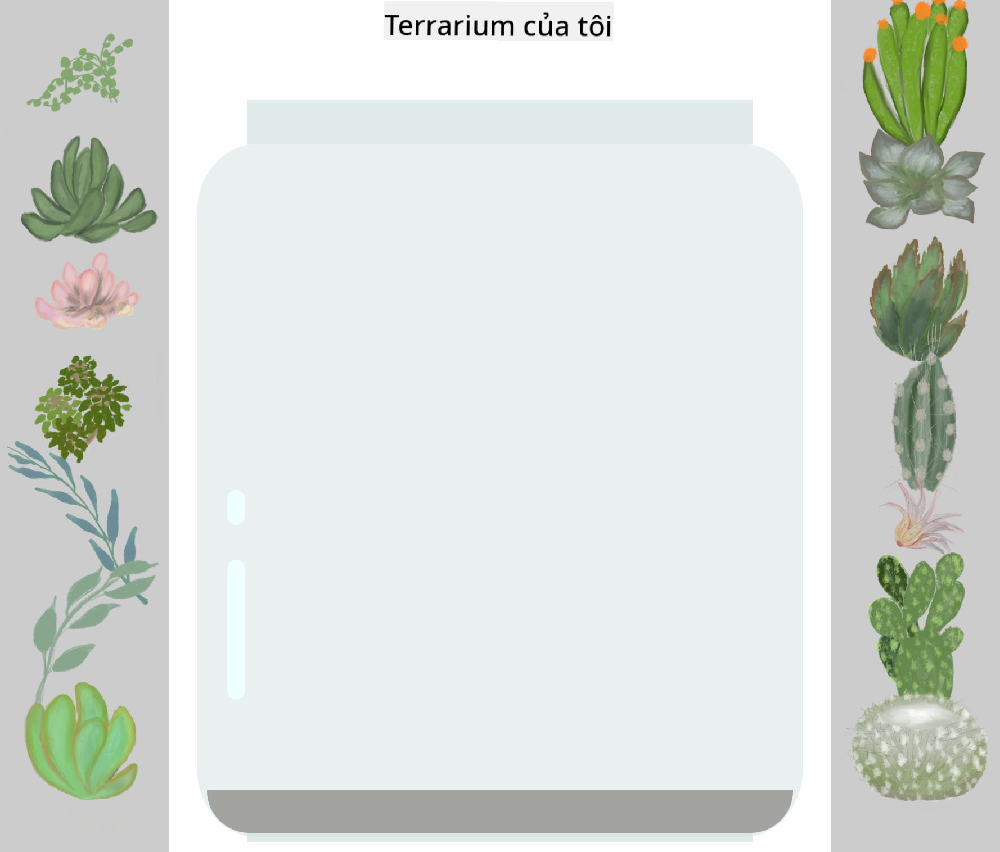

<!--
CO_OP_TRANSLATOR_METADATA:
{
  "original_hash": "92c4431eac70670b0450b02c1d11279a",
  "translation_date": "2025-10-24T13:40:21+00:00",
  "source_file": "3-terrarium/2-intro-to-css/README.md",
  "language_code": "vi"
}
-->
# Dự án Terrarium Phần 2: Giới thiệu về CSS


> Sketchnote bởi [Tomomi Imura](https://twitter.com/girlie_mac)

Bạn còn nhớ terrarium HTML của mình trông khá cơ bản không? CSS chính là nơi chúng ta biến cấu trúc đơn giản đó thành một thứ hấp dẫn về mặt thị giác.

Nếu HTML giống như việc xây dựng khung của một ngôi nhà, thì CSS là tất cả những gì làm cho ngôi nhà trở nên ấm cúng - màu sơn, cách sắp xếp nội thất, ánh sáng, và cách các phòng kết nối với nhau. Hãy nghĩ đến việc Cung điện Versailles bắt đầu chỉ là một nhà săn đơn giản, nhưng sự chú ý cẩn thận đến trang trí và bố cục đã biến nó thành một trong những công trình tráng lệ nhất thế giới.

Hôm nay, chúng ta sẽ biến terrarium của bạn từ chức năng thành hoàn thiện. Bạn sẽ học cách định vị các phần tử một cách chính xác, tạo bố cục phản hồi với các kích thước màn hình khác nhau, và tạo sự hấp dẫn thị giác khiến các trang web trở nên thú vị.

Kết thúc bài học này, bạn sẽ thấy cách CSS chiến lược có thể cải thiện đáng kể dự án của bạn. Hãy thêm phong cách cho terrarium của bạn.

## Câu hỏi trước bài giảng

[Câu hỏi trước bài giảng](https://ff-quizzes.netlify.app/web/quiz/17)

## Bắt đầu với CSS

CSS thường được nghĩ đến như chỉ để "làm mọi thứ đẹp hơn," nhưng nó phục vụ một mục đích rộng hơn nhiều. CSS giống như việc làm đạo diễn của một bộ phim - bạn không chỉ kiểm soát cách mọi thứ trông như thế nào, mà còn cách chúng di chuyển, phản hồi tương tác, và thích nghi với các tình huống khác nhau.

CSS hiện đại rất mạnh mẽ. Bạn có thể viết mã tự động điều chỉnh bố cục cho điện thoại, máy tính bảng, và máy tính để bàn. Bạn có thể tạo các hoạt ảnh mượt mà hướng sự chú ý của người dùng đến nơi cần thiết. Kết quả có thể rất ấn tượng khi mọi thứ hoạt động cùng nhau.

> 💡 **Mẹo chuyên nghiệp**: CSS liên tục phát triển với các tính năng và khả năng mới. Luôn kiểm tra [CanIUse.com](https://caniuse.com) để xác minh hỗ trợ trình duyệt cho các tính năng CSS mới trước khi sử dụng chúng trong các dự án sản xuất.

**Những gì chúng ta sẽ đạt được trong bài học này:**
- **Tạo** thiết kế trực quan hoàn chỉnh cho terrarium của bạn bằng các kỹ thuật CSS hiện đại
- **Khám phá** các khái niệm cơ bản như cascade, kế thừa, và các bộ chọn CSS
- **Triển khai** các chiến lược định vị và bố cục phản hồi
- **Xây dựng** container terrarium bằng các hình dạng và phong cách CSS

### Điều kiện tiên quyết

Bạn nên hoàn thành cấu trúc HTML cho terrarium của mình từ bài học trước và chuẩn bị để thêm phong cách.

> 📺 **Tài nguyên video**: Xem video hướng dẫn hữu ích này
>
> [](https://www.youtube.com/watch?v=6yIdOIV9p1I)

### Thiết lập tệp CSS của bạn

Trước khi chúng ta bắt đầu thêm phong cách, chúng ta cần kết nối CSS với HTML. Kết nối này cho trình duyệt biết nơi tìm các hướng dẫn phong cách cho terrarium của chúng ta.

Trong thư mục terrarium của bạn, tạo một tệp mới có tên `style.css`, sau đó liên kết nó trong phần `<head>` của tài liệu HTML:

```html
<link rel="stylesheet" href="./style.css" />
```

**Đây là những gì mã này làm:**
- **Tạo** kết nối giữa tệp HTML và CSS của bạn
- **Thông báo** cho trình duyệt tải và áp dụng các phong cách từ `style.css`
- **Sử dụng** thuộc tính `rel="stylesheet"` để chỉ định đây là tệp CSS
- **Tham chiếu** đường dẫn tệp với `href="./style.css"`

## Hiểu về Cascade trong CSS

Bạn đã bao giờ tự hỏi tại sao CSS được gọi là "Cascading" Style Sheets chưa? Các phong cách cascade xuống như một thác nước, và đôi khi chúng xung đột với nhau.

Hãy nghĩ đến cách cấu trúc chỉ huy quân sự hoạt động - một lệnh chung có thể nói "tất cả binh lính mặc màu xanh lá cây," nhưng một lệnh cụ thể cho đơn vị của bạn có thể nói "mặc đồng phục xanh dương cho buổi lễ." Lệnh cụ thể hơn sẽ được ưu tiên. CSS tuân theo logic tương tự, và hiểu được thứ tự này giúp việc gỡ lỗi trở nên dễ dàng hơn nhiều.

### Thử nghiệm với ưu tiên Cascade

Hãy xem cascade hoạt động bằng cách tạo một xung đột phong cách. Đầu tiên, thêm một phong cách inline vào thẻ `<h1>` của bạn:

```html
<h1 style="color: red">My Terrarium</h1>
```

**Những gì mã này làm:**
- **Áp dụng** màu đỏ trực tiếp cho phần tử `<h1>` bằng cách sử dụng phong cách inline
- **Sử dụng** thuộc tính `style` để nhúng CSS trực tiếp vào HTML
- **Tạo** quy tắc phong cách có ưu tiên cao nhất cho phần tử cụ thể này

Tiếp theo, thêm quy tắc này vào tệp `style.css` của bạn:

```css
h1 {
  color: blue;
}
```

**Trong đoạn trên, chúng ta đã:**
- **Định nghĩa** một quy tắc CSS nhắm đến tất cả các phần tử `<h1>`
- **Đặt** màu văn bản thành màu xanh dương bằng cách sử dụng stylesheet bên ngoài
- **Tạo** quy tắc có ưu tiên thấp hơn so với phong cách inline

✅ **Kiểm tra kiến thức**: Màu nào hiển thị trong ứng dụng web của bạn? Tại sao màu đó lại thắng? Bạn có thể nghĩ đến các tình huống mà bạn muốn ghi đè phong cách không?

> 💡 **Thứ tự ưu tiên CSS (từ cao đến thấp):**
> 1. **Phong cách inline** (thuộc tính style)
> 2. **IDs** (#myId)
> 3. **Classes** (.myClass) và thuộc tính
> 4. **Bộ chọn phần tử** (h1, div, p)
> 5. **Mặc định của trình duyệt**

## Kế thừa CSS trong thực tế

Kế thừa CSS hoạt động giống như di truyền học - các phần tử kế thừa một số thuộc tính từ các phần tử cha của chúng. Nếu bạn đặt font family trên phần tử body, tất cả văn bản bên trong sẽ tự động sử dụng cùng font đó. Nó giống như cách đặc điểm hàm đặc trưng của gia đình Habsburg xuất hiện qua các thế hệ mà không cần được chỉ định cho từng cá nhân.

Tuy nhiên, không phải mọi thứ đều được kế thừa. Các phong cách văn bản như font và màu sắc được kế thừa, nhưng các thuộc tính bố cục như margin và border thì không. Giống như trẻ em có thể kế thừa các đặc điểm vật lý nhưng không phải lựa chọn thời trang của cha mẹ.

### Quan sát kế thừa font

Hãy xem kế thừa hoạt động bằng cách đặt font family trên phần tử `<body>`:

```css
body {
  font-family: 'Segoe UI', Tahoma, Geneva, Verdana, sans-serif;
}
```

**Phân tích những gì xảy ra ở đây:**
- **Đặt** font family cho toàn bộ trang bằng cách nhắm đến phần tử `<body>`
- **Sử dụng** một stack font với các tùy chọn dự phòng để tăng khả năng tương thích trình duyệt
- **Áp dụng** các font hệ thống hiện đại trông đẹp trên các hệ điều hành khác nhau
- **Đảm bảo** tất cả các phần tử con kế thừa font này trừ khi bị ghi đè cụ thể

Mở công cụ phát triển của trình duyệt (F12), điều hướng đến tab Elements, và kiểm tra phần tử `<h1>` của bạn. Bạn sẽ thấy rằng nó kế thừa font family từ body:


✅ **Thời gian thử nghiệm**: Hãy thử đặt các thuộc tính có thể kế thừa khác trên `<body>` như `color`, `line-height`, hoặc `text-align`. Điều gì xảy ra với tiêu đề và các phần tử khác?

> 📝 **Các thuộc tính có thể kế thừa bao gồm**: `color`, `font-family`, `font-size`, `line-height`, `text-align`, `visibility`
>
> **Các thuộc tính không thể kế thừa bao gồm**: `margin`, `padding`, `border`, `width`, `height`, `position`

## Làm chủ các bộ chọn CSS

Các bộ chọn CSS là cách bạn nhắm đến các phần tử cụ thể để thêm phong cách. Chúng hoạt động giống như việc đưa ra chỉ dẫn chính xác - thay vì nói "ngôi nhà," bạn có thể nói "ngôi nhà màu xanh với cửa đỏ trên phố Maple."

CSS cung cấp các cách khác nhau để cụ thể hóa, và việc chọn đúng bộ chọn giống như chọn công cụ phù hợp cho nhiệm vụ. Đôi khi bạn cần thêm phong cách cho mọi cánh cửa trong khu phố, và đôi khi chỉ một cánh cửa cụ thể.

### Bộ chọn phần tử (Tags)

Bộ chọn phần tử nhắm đến các phần tử HTML theo tên thẻ của chúng. Chúng rất phù hợp để đặt các phong cách cơ bản áp dụng rộng rãi trên trang của bạn:

```css
body {
  font-family: 'Segoe UI', Tahoma, Geneva, Verdana, sans-serif;
  margin: 0;
  padding: 0;
}

h1 {
  color: #3a241d;
  text-align: center;
  font-size: 2.5rem;
  margin-bottom: 1rem;
}
```

**Hiểu các phong cách này:**
- **Đặt** kiểu chữ nhất quán trên toàn bộ trang với bộ chọn `body`
- **Loại bỏ** margin và padding mặc định của trình duyệt để kiểm soát tốt hơn
- **Thêm phong cách** cho tất cả các phần tử tiêu đề với màu sắc, căn chỉnh, và khoảng cách
- **Sử dụng** đơn vị `rem` để kích thước font có thể mở rộng và dễ tiếp cận

Trong khi các bộ chọn phần tử hoạt động tốt cho việc thêm phong cách chung, bạn sẽ cần các bộ chọn cụ thể hơn để thêm phong cách cho các thành phần riêng lẻ như các cây trong terrarium của bạn.

### Bộ chọn ID cho các phần tử duy nhất

Bộ chọn ID sử dụng ký hiệu `#` và nhắm đến các phần tử với thuộc tính `id` cụ thể. Vì ID phải là duy nhất trên một trang, chúng rất phù hợp để thêm phong cách cho các phần tử đặc biệt, riêng biệt như các container cây bên trái và bên phải của terrarium.

Hãy tạo phong cách cho các container bên của terrarium nơi các cây sẽ được đặt:

```css
#left-container {
  background-color: #f5f5f5;
  width: 15%;
  left: 0;
  top: 0;
  position: absolute;
  height: 100vh;
  padding: 1rem;
  box-sizing: border-box;
}

#right-container {
  background-color: #f5f5f5;
  width: 15%;
  right: 0;
  top: 0;
  position: absolute;
  height: 100vh;
  padding: 1rem;
  box-sizing: border-box;
}
```

**Đây là những gì mã này thực hiện:**
- **Định vị** các container ở các cạnh trái và phải bằng cách sử dụng định vị `absolute`
- **Sử dụng** đơn vị `vh` (viewport height) để chiều cao phản hồi với kích thước màn hình
- **Áp dụng** `box-sizing: border-box` để padding được tính vào tổng chiều rộng
- **Loại bỏ** các đơn vị `px` không cần thiết từ các giá trị bằng không để mã sạch hơn
- **Đặt** màu nền nhẹ nhàng hơn màu xám đậm để dễ nhìn hơn

✅ **Thử thách chất lượng mã**: Lưu ý cách CSS này vi phạm nguyên tắc DRY (Don't Repeat Yourself). Bạn có thể tái cấu trúc nó bằng cách sử dụng cả ID và class không?

**Cách tiếp cận cải tiến:**
```html
<div id="left-container" class="container"></div>
<div id="right-container" class="container"></div>
```

```css
.container {
  background-color: #f5f5f5;
  width: 15%;
  top: 0;
  position: absolute;
  height: 100vh;
  padding: 1rem;
  box-sizing: border-box;
}

#left-container {
  left: 0;
}

#right-container {
  right: 0;
}
```

### Bộ chọn Class cho phong cách tái sử dụng

Bộ chọn Class sử dụng ký hiệu `.` và rất phù hợp khi bạn muốn áp dụng cùng một phong cách cho nhiều phần tử. Không giống như ID, các class có thể được tái sử dụng trong toàn bộ HTML của bạn, làm cho chúng lý tưởng cho các mẫu phong cách nhất quán.

Trong terrarium của chúng ta, mỗi cây cần phong cách tương tự nhưng cũng cần định vị riêng biệt. Chúng ta sẽ sử dụng kết hợp các class cho phong cách chung và ID cho định vị riêng biệt.

**Đây là cấu trúc HTML cho mỗi cây:**
```html
<div class="plant-holder">
  
</div>
```

**Các yếu tố chính được giải thích:**
- **Sử dụng** `class="plant-holder"` để phong cách container nhất quán cho tất cả các cây
- **Áp dụng** `class="plant"` cho phong cách và hành vi hình ảnh chung
- **Bao gồm** `id="plant1"` duy nhất cho định vị riêng biệt và tương tác JavaScript
- **Cung cấp** văn bản thay thế mô tả để hỗ trợ người dùng sử dụng trình đọc màn hình

Bây giờ thêm các phong cách này vào tệp `style.css` của bạn:

```css
.plant-holder {
  position: relative;
  height: 13%;
  left: -0.6rem;
}

.plant {
  position: absolute;
  max-width: 150%;
  max-height: 150%;
  z-index: 2;
  transition: transform 0.3s ease;
}

.plant:hover {
  transform: scale(1.05);
}
```

**Phân tích các phong cách này:**
- **Tạo** định vị tương đối cho container cây để thiết lập ngữ cảnh định vị
- **Đặt** mỗi container cây có chiều cao 13%, đảm bảo tất cả các cây vừa vặn theo chiều dọc mà không cần cuộn
- **Dịch chuyển** các container hơi sang trái để cây được căn giữa tốt hơn trong các container của chúng
- **Cho phép** các cây mở rộng phản hồi với các thuộc tính `max-width` và `max-height`
- **Sử dụng** `z-index` để xếp lớp các cây trên các phần tử khác trong terrarium
- **Thêm** hiệu ứng hover nhẹ nhàng với các chuyển đổi CSS để tương tác người dùng tốt hơn

✅ **Tư duy phản biện**: Tại sao chúng ta cần cả bộ chọn `.plant-holder` và `.plant`? Điều gì sẽ xảy ra nếu chúng ta cố gắng chỉ sử dụng một bộ chọn?

> 💡 **Mẫu thiết kế**: Container (`.plant-holder`) kiểm soát bố cục và định vị, trong khi nội dung (`.plant`) kiểm soát diện mạo và khả năng mở rộng. Sự tách biệt này làm cho mã dễ bảo trì và linh hoạt hơn.

## Hiểu về định vị CSS

Định vị CSS giống như việc làm đạo diễn sân khấu cho một vở kịch - bạn chỉ đạo nơi mỗi diễn viên đứng và cách họ di chuyển trên sân khấu. Một số diễn viên tuân theo đội hình tiêu chuẩn, trong khi những người khác cần định vị cụ thể để tạo hiệu ứng kịch tính.

Khi bạn hiểu định vị, nhiều thách thức bố cục trở nên dễ quản lý. Cần một thanh điều hướng luôn ở trên cùng khi người dùng cuộn? Định vị xử lý điều đó. Muốn một tooltip xuất hiện tại một vị trí cụ thể? Đó cũng là định vị.

### Năm giá trị định vị

| Giá trị định vị | Hành vi | Trường hợp sử dụng |
|----------------|----------|--------------------|
| `static` | Dòng chảy mặc định, bỏ qua top/left/right/bottom | Bố cục tài liệu bình thường |
| `relative` | Định vị tương đối với vị trí bình thường của nó | Điều chỉnh nhỏ, tạo ngữ cảnh định vị |
| `absolute` | Định vị tương đối với tổ tiên được định vị gần nhất | Đặt chính xác, lớp phủ |
| `fixed` | Định vị tương đối với viewport | Thanh điều hướng, phần tử nổi |
| `sticky` | Chuyển đổi giữa relative và fixed dựa trên cuộn | Tiêu đề dính khi cuộn |

### Định vị trong Terrarium của chúng ta

Terrarium của chúng ta sử dụng kết hợp chiến lược các loại định vị để tạo bố cục mong muốn:

```css
/* Container positioning */
.container {
  position: absolute; /* Removes from normal flow */
  /* ... other styles ... */
}

/* Plant holder positioning */
.plant-holder {
  position: relative; /* Creates positioning context */
  /* ... other styles ... */
}

/* Plant positioning */
.plant {
  position: absolute; /* Allows precise placement within holder */
  /* ... other styles ... */
}
```

**Hiểu chiến lược định vị:**
- **Các container tuyệt đối** được loại bỏ khỏi dòng chảy tài liệu bình thường và ghim vào các cạnh màn hình
- **Các container cây tương đối** tạo ngữ cảnh định vị trong khi vẫn ở trong dòng chảy tài liệu
- **Các cây tuyệt đối** có thể được định vị chính xác trong các container tương đối của chúng
- **Sự kết hợp này** cho phép các cây xếp chồng theo chiều dọc trong khi có thể định vị riêng biệt

> 🎯 **Tại sao điều này quan trọng**: Các phần tử `plant` cần định vị tuyệt đối để có thể kéo thả trong bài học tiếp theo. Định vị tuyệt đối loại bỏ chúng khỏi dòng chảy bố cục bình thường, làm cho tương tác kéo thả trở nên khả thi.

✅ **Thời gian thử nghiệm**: Hãy thử thay đổi các giá trị định vị và quan sát kết quả:
- Điều gì xảy ra nếu bạn thay đổi `.container` từ `absolute` thành `relative`?
- Bố cục thay đổi như thế nào nếu `.plant-holder` sử dụng `absolute` thay vì `relative`?
- Điều gì xảy ra khi bạn chuyển `.plant` sang định vị `relative`?

## Xây dựng Terrarium với CSS

Bây giờ chúng ta sẽ xây dựng một lọ thủy tinh chỉ bằng CSS - không cần hình ảnh hay phần mềm đồ họa.

Tạo hiệu ứng thủy tinh thực tế, bóng, và hiệu ứng chiều sâu bằng cách sử dụng định vị và độ trong suốt thể hiện khả năng thị giác của CSS. Kỹ thuật này phản ánh cách các kiến trúc sư trong phong trào Bauhaus sử dụng các hình dạng hình học đơn giản để tạo ra các cấu trúc phức tạp, đẹp mắt. Khi bạn hiểu các nguyên tắc này, bạn sẽ nhận ra các kỹ thuật CSS đằng sau nhiều thiết kế web. 

### Tạo các thành phần lọ thủy tinh
Hãy xây dựng lọ terrarium từng phần một. Mỗi phần sử dụng định vị tuyệt đối và kích thước dựa trên phần trăm để thiết kế đáp ứng:

```css
.jar-walls {
  height: 80%;
  width: 60%;
  background: #d1e1df;
  border-radius: 1rem;
  position: absolute;
  bottom: 0.5%;
  left: 20%;
  opacity: 0.5;
  z-index: 1;
  box-shadow: inset 0 0 2rem rgba(0, 0, 0, 0.1);
}

.jar-top {
  width: 50%;
  height: 5%;
  background: #d1e1df;
  position: absolute;
  bottom: 80.5%;
  left: 25%;
  opacity: 0.7;
  z-index: 1;
  border-radius: 0.5rem 0.5rem 0 0;
}

.jar-bottom {
  width: 50%;
  height: 1%;
  background: #d1e1df;
  position: absolute;
  bottom: 0;
  left: 25%;
  opacity: 0.7;
  border-radius: 0 0 0.5rem 0.5rem;
}

.dirt {
  width: 60%;
  height: 5%;
  background: #3a241d;
  position: absolute;
  border-radius: 0 0 1rem 1rem;
  bottom: 1%;
  left: 20%;
  opacity: 0.7;
  z-index: -1;
}
```

**Hiểu về cách xây dựng terrarium:**
- **Sử dụng** kích thước dựa trên phần trăm để mở rộng đáp ứng trên mọi kích thước màn hình
- **Định vị** các phần tử tuyệt đối để xếp chồng và căn chỉnh chính xác
- **Áp dụng** các giá trị độ mờ khác nhau để tạo hiệu ứng trong suốt của kính
- **Thực hiện** phân lớp `z-index` để cây trông như nằm bên trong lọ
- **Thêm** hiệu ứng bóng mờ nhẹ và bo góc tinh tế để tạo vẻ ngoài chân thực hơn

### Thiết kế đáp ứng với kích thước phần trăm

Hãy chú ý cách tất cả các kích thước sử dụng phần trăm thay vì giá trị pixel cố định:

**Tại sao điều này quan trọng:**
- **Đảm bảo** terrarium mở rộng tỷ lệ trên bất kỳ kích thước màn hình nào
- **Duy trì** mối quan hệ trực quan giữa các thành phần của lọ
- **Cung cấp** trải nghiệm nhất quán từ điện thoại di động đến màn hình máy tính lớn
- **Cho phép** thiết kế thích ứng mà không làm hỏng bố cục trực quan

### Đơn vị CSS trong thực tế

Chúng ta đang sử dụng đơn vị `rem` cho bo góc, đơn vị này mở rộng theo kích thước font gốc. Điều này tạo ra các thiết kế dễ tiếp cận hơn, tôn trọng sở thích font của người dùng. Tìm hiểu thêm về [đơn vị tương đối trong CSS](https://www.w3.org/TR/css-values-3/#font-relative-lengths) trong tài liệu chính thức.

✅ **Thử nghiệm trực quan**: Hãy thử thay đổi các giá trị này và quan sát hiệu ứng:
- Thay đổi độ mờ của lọ từ 0.5 thành 0.8 – điều này ảnh hưởng thế nào đến vẻ ngoài của kính?
- Điều chỉnh màu đất từ `#3a241d` thành `#8B4513` – tác động trực quan là gì?
- Thay đổi `z-index` của đất thành 2 – điều gì xảy ra với lớp phân tầng?

---

## Thử thách GitHub Copilot Agent 🚀

Sử dụng chế độ Agent để hoàn thành thử thách sau:

**Mô tả:** Tạo một hoạt ảnh CSS làm cho cây trong terrarium nhẹ nhàng đung đưa qua lại, mô phỏng hiệu ứng gió tự nhiên. Điều này sẽ giúp bạn thực hành hoạt ảnh CSS, biến đổi và keyframes, đồng thời tăng tính hấp dẫn trực quan của terrarium.

**Yêu cầu:** Thêm hoạt ảnh keyframe CSS để làm cho cây trong terrarium đung đưa nhẹ nhàng từ bên này sang bên kia. Tạo một hoạt ảnh đung đưa xoay nhẹ mỗi cây (2-3 độ) sang trái và phải với thời gian 3-4 giây, và áp dụng nó cho lớp `.plant`. Đảm bảo hoạt ảnh lặp lại vô hạn và có hàm easing để chuyển động tự nhiên.

Tìm hiểu thêm về [chế độ agent](https://code.visualstudio.com/blogs/2025/02/24/introducing-copilot-agent-mode) tại đây.

## 🚀 Thử thách: Thêm hiệu ứng phản chiếu kính

Sẵn sàng nâng cấp terrarium của bạn với hiệu ứng phản chiếu kính chân thực? Kỹ thuật này sẽ thêm chiều sâu và tính chân thực cho thiết kế.

Bạn sẽ tạo các điểm nhấn nhẹ nhàng mô phỏng cách ánh sáng phản chiếu trên bề mặt kính. Cách tiếp cận này tương tự như cách các họa sĩ thời Phục hưng như Jan van Eyck sử dụng ánh sáng và phản chiếu để làm cho kính vẽ trông có chiều sâu ba chiều. Đây là mục tiêu của bạn:



**Thử thách của bạn:**
- **Tạo** các hình oval màu trắng hoặc sáng để làm hiệu ứng phản chiếu kính
- **Đặt** chúng một cách chiến lược ở phía bên trái của lọ
- **Áp dụng** độ mờ và hiệu ứng làm mờ phù hợp để tạo phản chiếu ánh sáng chân thực
- **Sử dụng** `border-radius` để tạo các hình dạng bong bóng tự nhiên
- **Thử nghiệm** với gradient hoặc bóng mờ để tăng tính chân thực

## Câu hỏi sau bài giảng

[Câu hỏi sau bài giảng](https://ff-quizzes.netlify.app/web/quiz/18)

## Mở rộng kiến thức CSS của bạn

CSS có thể cảm thấy phức tạp lúc đầu, nhưng việc hiểu các khái niệm cốt lõi này sẽ cung cấp nền tảng vững chắc cho các kỹ thuật nâng cao hơn.

**Các lĩnh vực học CSS tiếp theo của bạn:**
- **Flexbox** - đơn giản hóa việc căn chỉnh và phân phối các phần tử
- **CSS Grid** - cung cấp công cụ mạnh mẽ để tạo bố cục phức tạp
- **CSS Variables** - giảm sự lặp lại và cải thiện khả năng duy trì
- **Thiết kế đáp ứng** - đảm bảo trang web hoạt động tốt trên các kích thước màn hình khác nhau

### Tài nguyên học tập tương tác

Thực hành các khái niệm này với các trò chơi thú vị, tương tác:
- 🐸 [Flexbox Froggy](https://flexboxfroggy.com/) - Làm chủ Flexbox qua các thử thách thú vị
- 🌱 [Grid Garden](https://codepip.com/games/grid-garden/) - Học CSS Grid bằng cách trồng cà rốt ảo
- 🎯 [CSS Battle](https://cssbattle.dev/) - Kiểm tra kỹ năng CSS của bạn với các thử thách mã hóa

### Học thêm

Để nắm vững các kiến thức cơ bản về CSS, hãy hoàn thành module Microsoft Learn này: [Style your HTML app with CSS](https://docs.microsoft.com/learn/modules/build-simple-website/4-css-basics/?WT.mc_id=academic-77807-sagibbon)

## Bài tập

[CSS Refactoring](assignment.md)

---

**Tuyên bố miễn trừ trách nhiệm**:  
Tài liệu này đã được dịch bằng dịch vụ dịch thuật AI [Co-op Translator](https://github.com/Azure/co-op-translator). Mặc dù chúng tôi cố gắng đảm bảo độ chính xác, xin lưu ý rằng các bản dịch tự động có thể chứa lỗi hoặc không chính xác. Tài liệu gốc bằng ngôn ngữ bản địa nên được coi là nguồn thông tin chính thức. Đối với thông tin quan trọng, nên sử dụng dịch vụ dịch thuật chuyên nghiệp bởi con người. Chúng tôi không chịu trách nhiệm cho bất kỳ sự hiểu lầm hoặc diễn giải sai nào phát sinh từ việc sử dụng bản dịch này.