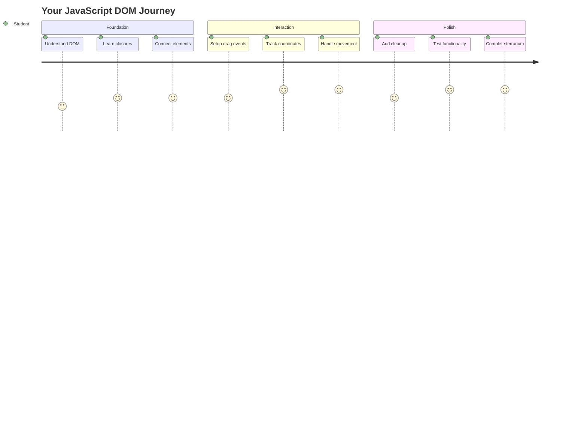
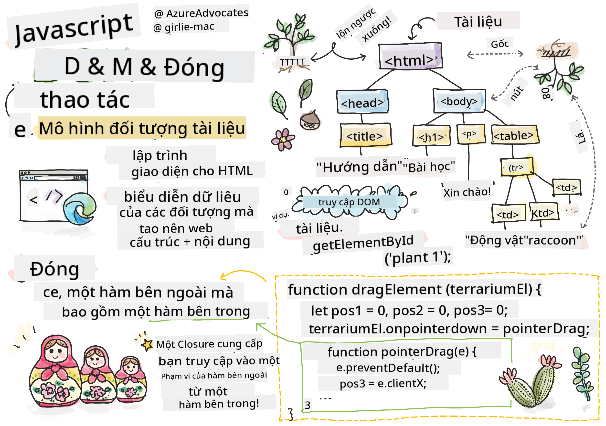
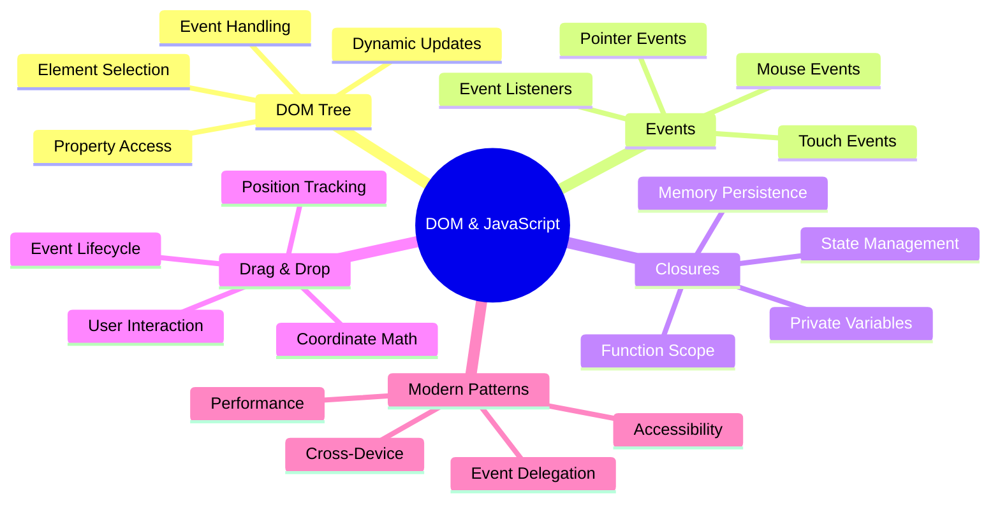
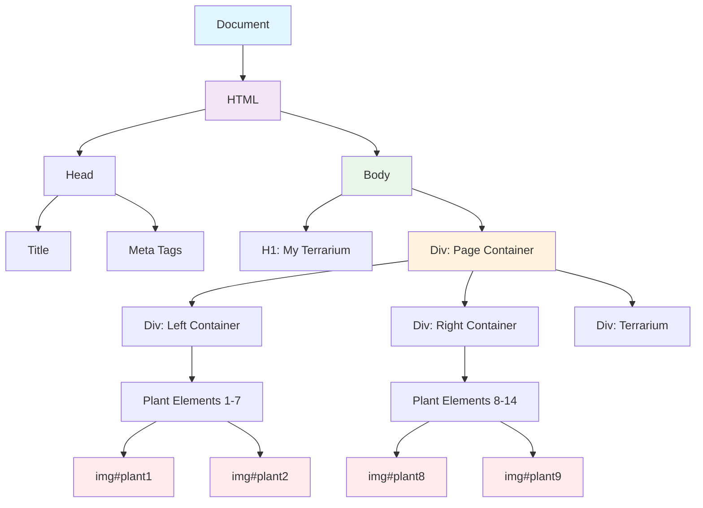
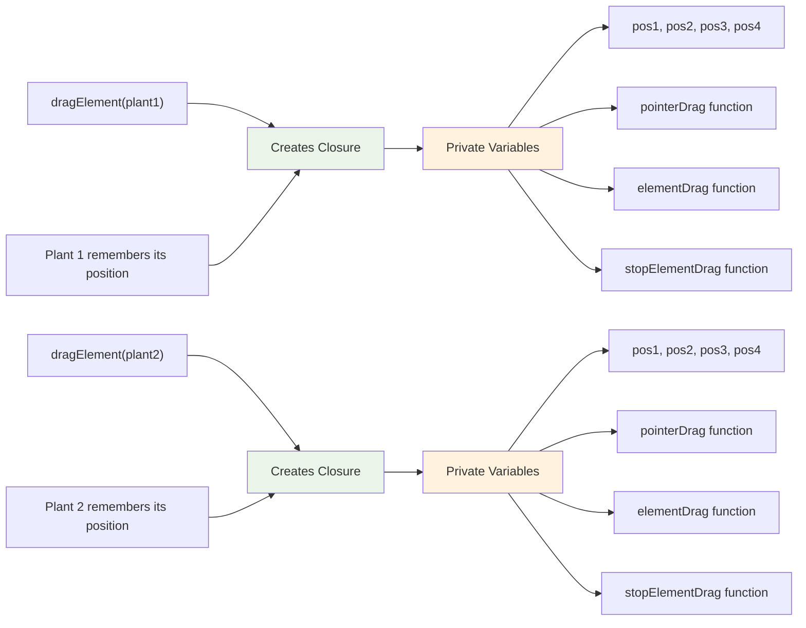
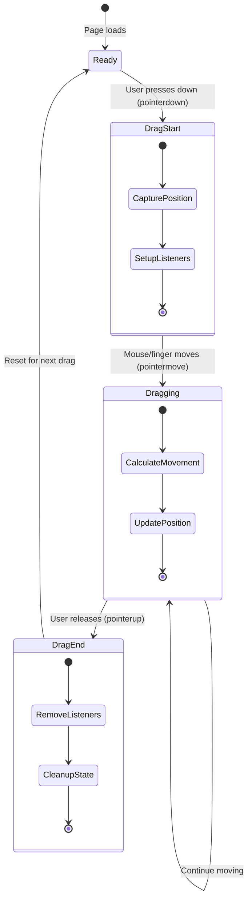
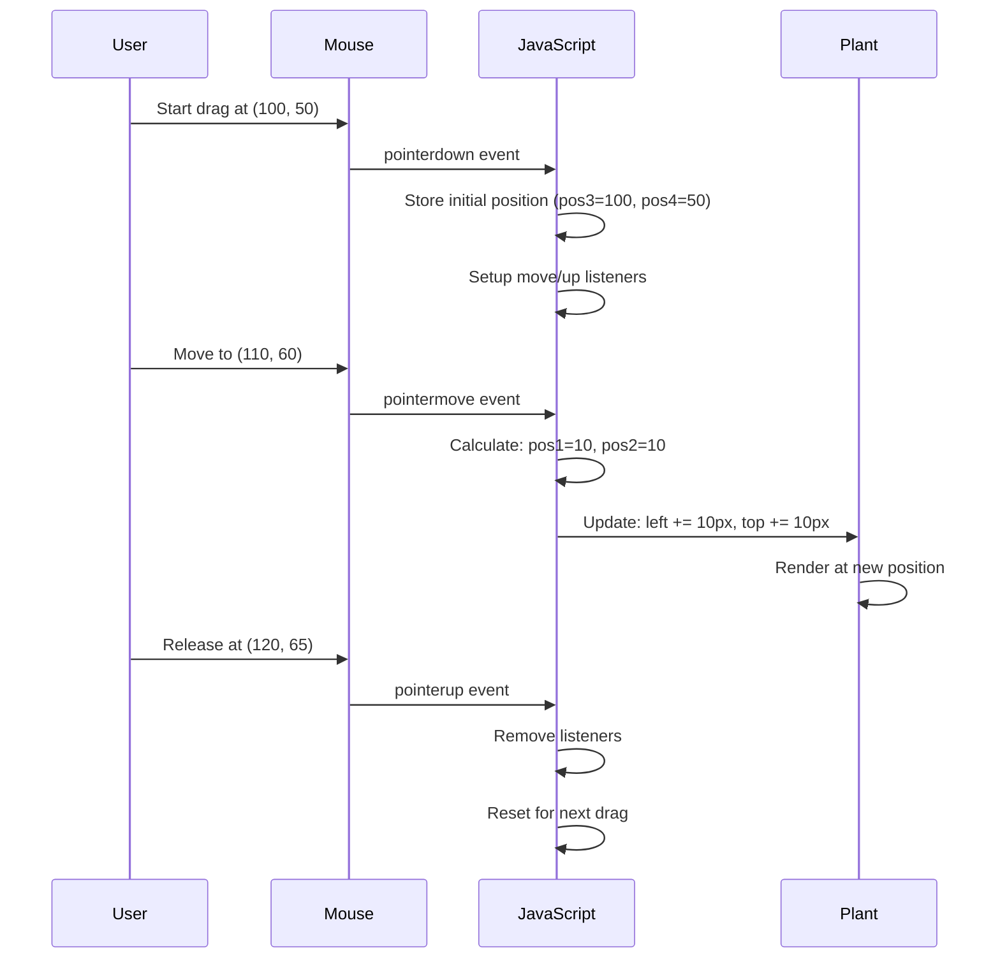
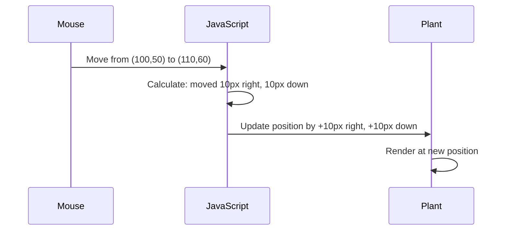
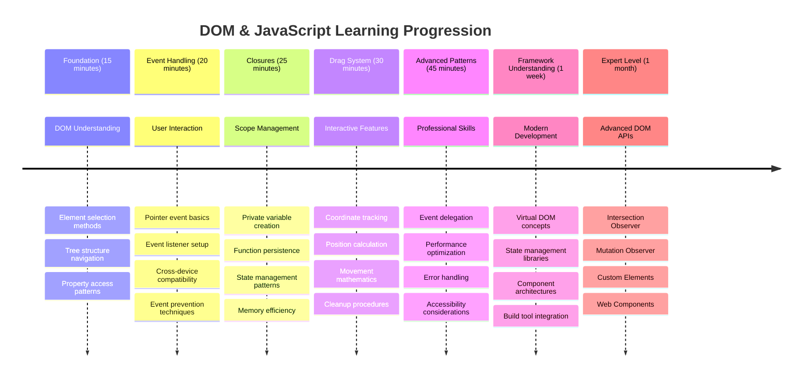

<!--
CO_OP_TRANSLATOR_METADATA:
{
  "original_hash": "973e48ad87d67bf5bb819746c9f8e302",
  "translation_date": "2025-11-06T11:22:47+00:00",
  "source_file": "3-terrarium/3-intro-to-DOM-and-closures/README.md",
  "language_code": "vi"
}
-->
# Dự án Terrarium Phần 3: Tương tác DOM và Closures trong JavaScript




> Sketchnote bởi [Tomomi Imura](https://twitter.com/girlie_mac)

Chào mừng bạn đến với một trong những khía cạnh thú vị nhất của phát triển web - làm cho mọi thứ trở nên tương tác! Mô hình Đối tượng Tài liệu (DOM) giống như một cây cầu giữa HTML và JavaScript của bạn, và hôm nay chúng ta sẽ sử dụng nó để làm cho terrarium của bạn sống động. Khi Tim Berners-Lee tạo ra trình duyệt web đầu tiên, ông đã hình dung một web nơi các tài liệu có thể động và tương tác - DOM làm cho tầm nhìn đó trở thành hiện thực.

Chúng ta cũng sẽ khám phá closures trong JavaScript, điều này có thể nghe có vẻ khó hiểu lúc đầu. Hãy nghĩ về closures như việc tạo ra "túi nhớ" nơi các hàm của bạn có thể nhớ thông tin quan trọng. Nó giống như mỗi cây trong terrarium của bạn có một bản ghi dữ liệu riêng để theo dõi vị trí của nó. Đến cuối bài học này, bạn sẽ hiểu được chúng tự nhiên và hữu ích như thế nào.

Đây là những gì chúng ta sẽ xây dựng: một terrarium nơi người dùng có thể kéo và thả cây bất cứ nơi nào họ muốn. Bạn sẽ học các kỹ thuật thao tác DOM cung cấp năng lượng cho mọi thứ từ tải tệp kéo-thả đến các trò chơi tương tác. Hãy làm cho terrarium của bạn sống động.



## Quiz Trước Bài Giảng

[Quiz trước bài giảng](https://ff-quizzes.netlify.app/web/quiz/19)

## Hiểu về DOM: Cánh cửa dẫn đến các trang web tương tác

Mô hình Đối tượng Tài liệu (DOM) là cách JavaScript giao tiếp với các phần tử HTML của bạn. Khi trình duyệt của bạn tải một trang HTML, nó tạo ra một biểu diễn có cấu trúc của trang đó trong bộ nhớ - đó là DOM. Hãy nghĩ về nó như một cây gia đình nơi mỗi phần tử HTML là một thành viên gia đình mà JavaScript có thể truy cập, sửa đổi hoặc sắp xếp lại.

Thao tác DOM biến các trang tĩnh thành các trang web tương tác. Mỗi lần bạn thấy một nút thay đổi màu khi di chuột, nội dung được cập nhật mà không cần tải lại trang, hoặc các phần tử bạn có thể kéo xung quanh, đó là thao tác DOM đang hoạt động.




> Một biểu diễn của DOM và mã HTML tham chiếu nó. Từ [Olfa Nasraoui](https://www.researchgate.net/publication/221417012_Profile-Based_Focused_Crawler_for_Social_Media-Sharing_Websites)

**Điều gì làm cho DOM mạnh mẽ:**
- **Cung cấp** cách có cấu trúc để truy cập bất kỳ phần tử nào trên trang của bạn
- **Cho phép** cập nhật nội dung động mà không cần tải lại trang
- **Phản hồi** theo thời gian thực với các tương tác của người dùng như nhấp chuột và kéo thả
- **Tạo** nền tảng cho các ứng dụng web tương tác hiện đại

## Closures trong JavaScript: Tạo mã tổ chức, mạnh mẽ

Một [closure trong JavaScript](https://developer.mozilla.org/docs/Web/JavaScript/Closures) giống như việc cung cấp cho một hàm không gian làm việc riêng với bộ nhớ liên tục. Hãy xem xét cách các loài chim của Darwin trên quần đảo Galápagos phát triển các mỏ chuyên biệt dựa trên môi trường cụ thể của chúng - closures hoạt động tương tự, tạo ra các hàm chuyên biệt "nhớ" ngữ cảnh cụ thể của chúng ngay cả sau khi hàm cha đã hoàn thành.

Trong terrarium của chúng ta, closures giúp mỗi cây nhớ vị trí của nó một cách độc lập. Mẫu này xuất hiện xuyên suốt trong phát triển JavaScript chuyên nghiệp, làm cho nó trở thành một khái niệm có giá trị để hiểu.



> 💡 **Hiểu về Closures**: Closures là một chủ đề quan trọng trong JavaScript, và nhiều nhà phát triển sử dụng chúng trong nhiều năm trước khi hiểu đầy đủ tất cả các khía cạnh lý thuyết. Hôm nay, chúng ta tập trung vào ứng dụng thực tế - bạn sẽ thấy closures xuất hiện tự nhiên khi chúng ta xây dựng các tính năng tương tác. Hiểu biết sẽ phát triển khi bạn thấy cách chúng giải quyết các vấn đề thực tế.


> Một biểu diễn của DOM và mã HTML tham chiếu nó. Từ [Olfa Nasraoui](https://www.researchgate.net/publication/221417012_Profile-Based_Focused_Crawler_for_Social_Media-Sharing_Websites)

Trong bài học này, chúng ta sẽ hoàn thành dự án terrarium tương tác bằng cách tạo JavaScript cho phép người dùng thao tác các cây trên trang.

## Trước Khi Bắt Đầu: Chuẩn Bị Thành Công

Bạn sẽ cần các tệp HTML và CSS từ các bài học terrarium trước - chúng ta sắp làm cho thiết kế tĩnh đó trở nên tương tác. Nếu bạn mới tham gia, hoàn thành các bài học đó trước sẽ cung cấp ngữ cảnh quan trọng.

Đây là những gì chúng ta sẽ xây dựng:
- **Kéo-thả mượt mà** cho tất cả các cây trong terrarium
- **Theo dõi tọa độ** để cây nhớ vị trí của chúng
- **Giao diện tương tác hoàn chỉnh** sử dụng JavaScript thuần
- **Mã sạch, tổ chức** sử dụng mẫu closures

## Thiết Lập Tệp JavaScript của Bạn

Hãy tạo tệp JavaScript sẽ làm cho terrarium của bạn tương tác.

**Bước 1: Tạo tệp script của bạn**

Trong thư mục terrarium của bạn, tạo một tệp mới có tên `script.js`.

**Bước 2: Liên kết JavaScript với HTML của bạn**

Thêm thẻ script này vào phần `<head>` của tệp `index.html` của bạn:

```html
<script src="./script.js" defer></script>
```

**Tại sao thuộc tính `defer` lại quan trọng:**
- **Đảm bảo** JavaScript của bạn chờ đến khi tất cả HTML được tải
- **Ngăn chặn** lỗi khi JavaScript tìm kiếm các phần tử chưa sẵn sàng
- **Đảm bảo** tất cả các phần tử cây của bạn có sẵn để tương tác
- **Cung cấp** hiệu suất tốt hơn so với việc đặt script ở cuối trang

> ⚠️ **Lưu ý Quan Trọng**: Thuộc tính `defer` ngăn chặn các vấn đề về thời gian phổ biến. Nếu không có nó, JavaScript có thể cố gắng truy cập các phần tử HTML trước khi chúng được tải, gây ra lỗi.

---

## Kết Nối JavaScript với Các Phần Tử HTML của Bạn

Trước khi chúng ta có thể làm cho các phần tử có thể kéo, JavaScript cần định vị chúng trong DOM. Hãy nghĩ về điều này như một hệ thống lập danh mục thư viện - một khi bạn có số danh mục, bạn có thể tìm chính xác cuốn sách bạn cần và truy cập tất cả nội dung của nó.

Chúng ta sẽ sử dụng phương thức `document.getElementById()` để thực hiện các kết nối này. Nó giống như có một hệ thống lưu trữ chính xác - bạn cung cấp một ID, và nó định vị chính xác phần tử bạn cần trong HTML của bạn.

### Kích Hoạt Chức Năng Kéo Cho Tất Cả Các Cây

Thêm mã này vào tệp `script.js` của bạn:

```javascript
// Enable drag functionality for all 14 plants
dragElement(document.getElementById('plant1'));
dragElement(document.getElementById('plant2'));
dragElement(document.getElementById('plant3'));
dragElement(document.getElementById('plant4'));
dragElement(document.getElementById('plant5'));
dragElement(document.getElementById('plant6'));
dragElement(document.getElementById('plant7'));
dragElement(document.getElementById('plant8'));
dragElement(document.getElementById('plant9'));
dragElement(document.getElementById('plant10'));
dragElement(document.getElementById('plant11'));
dragElement(document.getElementById('plant12'));
dragElement(document.getElementById('plant13'));
dragElement(document.getElementById('plant14'));
```

**Đây là những gì mã này thực hiện:**
- **Định vị** mỗi phần tử cây trong DOM bằng ID duy nhất của nó
- **Lấy** tham chiếu JavaScript đến mỗi phần tử HTML
- **Truyền** mỗi phần tử vào hàm `dragElement` (chúng ta sẽ tạo tiếp theo)
- **Chuẩn bị** mọi cây cho tương tác kéo-thả
- **Kết nối** cấu trúc HTML của bạn với chức năng JavaScript

> 🎯 **Tại Sao Sử Dụng ID Thay Vì Class?** ID cung cấp các định danh duy nhất cho các phần tử cụ thể, trong khi các class CSS được thiết kế để tạo kiểu cho nhóm các phần tử. Khi JavaScript cần thao tác các phần tử riêng lẻ, ID cung cấp độ chính xác và hiệu suất mà chúng ta cần.

> 💡 **Mẹo Chuyên Nghiệp**: Lưu ý cách chúng ta gọi `dragElement()` cho từng cây riêng lẻ. Cách tiếp cận này đảm bảo rằng mỗi cây có hành vi kéo độc lập của riêng nó, điều này rất cần thiết cho tương tác người dùng mượt mà.

### 🔄 **Kiểm Tra Sư Phạm**
**Hiểu Kết Nối DOM**: Trước khi chuyển sang chức năng kéo, hãy xác minh bạn có thể:
- ✅ Giải thích cách `document.getElementById()` định vị các phần tử HTML
- ✅ Hiểu tại sao chúng ta sử dụng ID duy nhất cho mỗi cây
- ✅ Mô tả mục đích của thuộc tính `defer` trong thẻ script
- ✅ Nhận ra cách JavaScript và HTML kết nối thông qua DOM

**Tự Kiểm Tra Nhanh**: Điều gì sẽ xảy ra nếu hai phần tử có cùng ID? Tại sao `getElementById()` chỉ trả về một phần tử?
*Trả lời: ID nên là duy nhất; nếu bị trùng lặp, chỉ phần tử đầu tiên được trả về*

---

## Xây Dựng Closure dragElement

Bây giờ chúng ta sẽ tạo phần cốt lõi của chức năng kéo: một closure quản lý hành vi kéo cho mỗi cây. Closure này sẽ chứa nhiều hàm bên trong làm việc cùng nhau để theo dõi chuyển động chuột và cập nhật vị trí phần tử.

Closures rất phù hợp cho nhiệm vụ này vì chúng cho phép chúng ta tạo các biến "riêng tư" tồn tại giữa các lần gọi hàm, cung cấp cho mỗi cây hệ thống theo dõi tọa độ độc lập của riêng nó.

### Hiểu Closures với Một Ví Dụ Đơn Giản

Hãy để tôi minh họa closures với một ví dụ đơn giản để làm rõ khái niệm:

```javascript
function createCounter() {
    let count = 0; // This is like a private variable
    
    function increment() {
        count++; // The inner function remembers the outer variable
        return count;
    }
    
    return increment; // We're giving back the inner function
}

const myCounter = createCounter();
console.log(myCounter()); // 1
console.log(myCounter()); // 2
```

**Đây là những gì đang xảy ra trong mẫu closure này:**
- **Tạo** một biến `count` riêng tư chỉ tồn tại trong closure này
- **Hàm bên trong** có thể truy cập và sửa đổi biến bên ngoài đó (cơ chế closure)
- **Khi chúng ta trả về** hàm bên trong, nó duy trì kết nối với dữ liệu riêng tư đó
- **Ngay cả sau khi** `createCounter()` hoàn thành thực thi, `count` vẫn tồn tại và nhớ giá trị của nó

### Tại Sao Closures Hoàn Hảo Cho Chức Năng Kéo

Đối với terrarium của chúng ta, mỗi cây cần nhớ tọa độ vị trí hiện tại của nó. Closures cung cấp giải pháp hoàn hảo:

**Lợi ích chính cho dự án của chúng ta:**
- **Duy trì** các biến vị trí riêng tư cho mỗi cây một cách độc lập
- **Bảo tồn** dữ liệu tọa độ giữa các sự kiện kéo
- **Ngăn chặn** xung đột biến giữa các phần tử có thể kéo khác nhau
- **Tạo** cấu trúc mã sạch, tổ chức

> 🎯 **Mục Tiêu Học Tập**: Bạn không cần phải nắm vững mọi khía cạnh của closures ngay bây giờ. Tập trung vào việc thấy cách chúng giúp chúng ta tổ chức mã và duy trì trạng thái cho chức năng kéo.



### Tạo Hàm dragElement

Bây giờ hãy xây dựng hàm chính sẽ xử lý toàn bộ logic kéo. Thêm hàm này bên dưới các khai báo phần tử cây của bạn:

```javascript
function dragElement(terrariumElement) {
    // Initialize position tracking variables
    let pos1 = 0,  // Previous mouse X position
        pos2 = 0,  // Previous mouse Y position  
        pos3 = 0,  // Current mouse X position
        pos4 = 0;  // Current mouse Y position
    
    // Set up the initial drag event listener
    terrariumElement.onpointerdown = pointerDrag;
}
```

**Hiểu hệ thống theo dõi vị trí:**
- **`pos1` và `pos2`**: Lưu trữ sự khác biệt giữa vị trí chuột cũ và mới
- **`pos3` và `pos4`**: Theo dõi tọa độ chuột hiện tại
- **`terrariumElement`**: Phần tử cây cụ thể mà chúng ta đang làm cho có thể kéo
- **`onpointerdown`**: Sự kiện kích hoạt khi người dùng bắt đầu kéo

**Đây là cách mẫu closure hoạt động:**
- **Tạo** các biến vị trí riêng tư cho mỗi phần tử cây
- **Duy trì** các biến này trong suốt vòng đời kéo
- **Đảm bảo** mỗi cây theo dõi tọa độ của riêng nó một cách độc lập
- **Cung cấp** giao diện sạch thông qua hàm `dragElement`

### Tại Sao Sử Dụng Sự Kiện Pointer?

Bạn có thể thắc mắc tại sao chúng ta sử dụng `onpointerdown` thay vì sự kiện quen thuộc hơn `onclick`. Đây là lý do:

| Loại Sự Kiện | Tốt Nhất Cho | Hạn Chế |
|--------------|--------------|---------|
| `onclick` | Nhấp chuột đơn giản | Không thể xử lý kéo (chỉ nhấp và thả) |
| `onpointerdown` | Cả chuột và cảm ứng | Mới hơn, nhưng hiện nay được hỗ trợ tốt |
| `onmousedown` | Chỉ chuột trên máy tính | Bỏ qua người dùng di động |

**Tại sao sự kiện pointer hoàn hảo cho những gì chúng ta đang xây dựng:**
- **Hoạt động tốt** dù ai đó sử dụng chuột, ngón tay, hay thậm chí bút stylus
- **Cảm giác giống nhau** trên laptop, máy tính bảng, hay điện thoại
- **Xử lý** chuyển động kéo thực tế (không chỉ nhấp và xong)
- **Tạo** trải nghiệm mượt mà mà người dùng mong đợi từ các ứng dụng web hiện đại

> 💡 **Tương Lai**: Sự kiện pointer là cách hiện đại để xử lý tương tác người dùng. Thay vì viết mã riêng cho chuột và cảm ứng, bạn có cả hai miễn phí. Thật tuyệt, phải không?

### 🔄 **Kiểm Tra Sư Phạm**
**Hiểu Xử Lý Sự Kiện**: Tạm dừng để xác nhận bạn hiểu về sự kiện:
- ✅ Tại sao chúng ta sử dụng sự kiện pointer thay vì sự kiện chuột?
- ✅ Làm thế nào các biến closure tồn tại giữa các lần gọi hàm?
- ✅ Vai trò của `preventDefault()` trong việc kéo mượt mà là gì?
- ✅ Tại sao chúng ta gắn các listener vào tài liệu thay vì các phần tử riêng lẻ?

**Kết Nối Thực Tế**: Hãy nghĩ về các giao diện kéo-thả bạn sử dụng hàng ngày:
- **Tải tệp**: Kéo tệp vào cửa sổ trình duyệt
- **Bảng Kanban**: Di chuyển nhiệm vụ giữa các cột
- **Bộ sưu tập hình ảnh**: Sắp xếp lại thứ tự ảnh
- **Giao diện di động**: Vuốt và kéo trên màn hình cảm ứng

---

## Hàm pointerDrag: Bắt Đầu Một Lần Kéo

Khi người dùng nhấn xuống một cây (dù bằng nhấp chuột hay cảm ứng), hàm `pointerDrag` sẽ hoạt động. Hàm này ghi lại tọa độ ban đầu và thiết lập hệ thống kéo.

Thêm hàm này vào bên trong closure `dragElement`, ngay sau dòng `terrariumElement.onpointerdown = pointerDrag;`:

```javascript
function pointerDrag(e) {
    // Prevent default browser behavior (like text selection)
    e.preventDefault();
    
    // Capture the initial mouse/touch position
    pos3 = e.clientX;  // X coordinate where drag started
    pos4 = e.clientY;  // Y coordinate where drag started
    
    // Set up event listeners for the dragging process
    document.onpointermove = elementDrag;
    document.onpointerup = stopElementDrag;
}
```

**Từng bước, đây là những gì đang xảy ra:**
- **Ngăn chặn** các hành vi mặc định của trình duyệt có thể gây cản trở việc kéo
- **Ghi lại** tọa độ chính xác nơi người dùng bắt đầu thao tác kéo
- **Thiết lập** các listener sự kiện cho chuyển động kéo đang diễn ra
- **Chuẩn bị** hệ thống để theo dõi chuyển động chuột/ngón tay trên toàn bộ tài liệu

### Hiểu Về Ngăn Chặn Sự Kiện

Dòng `e.preventDefault()` rất quan trọng để kéo mượt mà:

**Nếu không ngăn chặn, trình duyệt có thể:**
- **Chọn** văn bản khi kéo qua trang
- **Kích hoạt** menu ngữ cảnh khi nhấp chuột phải kéo
- **Can thiệp** vào hành vi kéo tùy chỉnh của chúng ta
- **Tạo** các hiện tượng hình ảnh trong quá trình kéo

> 🔍 **Thử Nghiệm**: Sau khi hoàn thành bài học này, hãy thử loại bỏ `e.preventDefault()` và xem nó ảnh hưởng như thế nào đến trải nghiệm kéo. Bạn sẽ nhanh chóng hiểu tại sao dòng này là cần thiết!

### Hệ Thống Theo Dõi Tọa Độ

Các thuộc tính `e.clientX` và `e.clientY` cung cấp cho chúng ta tọa độ chuột/cảm ứng chính xác:

| Thuộc Tính | Đo Lường Gì | Trường Hợp Sử Dụng |
|------------|-------------|--------------------|
| `clientX` | Vị trí ngang so với khung nhìn | Theo dõi chuyển động trái-phải |
| `clientY` | Vị trí dọc so với khung nhìn | Theo dõi chuyển động lên-xuống |
**Hiểu về các tọa độ này:**
- **Cung cấp** thông tin định vị chính xác từng pixel
- **Cập nhật** theo thời gian thực khi người dùng di chuyển con trỏ
- **Giữ nguyên** trên các kích thước màn hình và mức độ phóng to khác nhau
- **Cho phép** tương tác kéo mượt mà và linh hoạt

### Thiết lập các trình nghe sự kiện cấp tài liệu

Lưu ý cách chúng ta gắn các sự kiện di chuyển và dừng vào toàn bộ `document`, không chỉ vào phần tử cây:

```javascript
document.onpointermove = elementDrag;
document.onpointerup = stopElementDrag;
```

**Tại sao gắn vào tài liệu:**
- **Tiếp tục** theo dõi ngay cả khi chuột rời khỏi phần tử cây
- **Ngăn chặn** gián đoạn kéo nếu người dùng di chuyển nhanh
- **Cung cấp** trải nghiệm kéo mượt mà trên toàn màn hình
- **Xử lý** các trường hợp ngoại lệ khi con trỏ di chuyển ra ngoài cửa sổ trình duyệt

> ⚡ **Lưu ý về hiệu suất**: Chúng ta sẽ dọn dẹp các trình nghe sự kiện cấp tài liệu này khi dừng kéo để tránh rò rỉ bộ nhớ và các vấn đề về hiệu suất.

## Hoàn thiện hệ thống kéo: Di chuyển và dọn dẹp

Bây giờ chúng ta sẽ thêm hai hàm còn lại để xử lý việc di chuyển thực tế và dọn dẹp khi dừng kéo. Các hàm này phối hợp với nhau để tạo ra chuyển động cây mượt mà và linh hoạt trong terrarium của bạn.

### Hàm elementDrag: Theo dõi chuyển động

Thêm hàm `elementDrag` ngay sau dấu ngoặc nhọn đóng của `pointerDrag`:

```javascript
function elementDrag(e) {
    // Calculate the distance moved since the last event
    pos1 = pos3 - e.clientX;  // Horizontal distance moved
    pos2 = pos4 - e.clientY;  // Vertical distance moved
    
    // Update the current position tracking
    pos3 = e.clientX;  // New current X position
    pos4 = e.clientY;  // New current Y position
    
    // Apply the movement to the element's position
    terrariumElement.style.top = (terrariumElement.offsetTop - pos2) + 'px';
    terrariumElement.style.left = (terrariumElement.offsetLeft - pos1) + 'px';
}
```

**Hiểu về toán học tọa độ:**
- **`pos1` và `pos2`**: Tính toán khoảng cách chuột đã di chuyển kể từ lần cập nhật cuối
- **`pos3` và `pos4`**: Lưu vị trí chuột hiện tại cho lần tính toán tiếp theo
- **`offsetTop` và `offsetLeft`**: Lấy vị trí hiện tại của phần tử trên trang
- **Logic trừ**: Di chuyển phần tử theo cùng khoảng cách mà chuột đã di chuyển



**Phân tích cách tính toán chuyển động:**
1. **Đo lường** sự khác biệt giữa vị trí chuột cũ và mới
2. **Tính toán** khoảng cách cần di chuyển phần tử dựa trên chuyển động của chuột
3. **Cập nhật** các thuộc tính vị trí CSS của phần tử theo thời gian thực
4. **Lưu trữ** vị trí mới làm cơ sở cho lần tính toán chuyển động tiếp theo

### Minh họa trực quan về toán học



### Hàm stopElementDrag: Dọn dẹp

Thêm hàm dọn dẹp sau dấu ngoặc nhọn đóng của `elementDrag`:

```javascript
function stopElementDrag() {
    // Remove the document-level event listeners
    document.onpointerup = null;
    document.onpointermove = null;
}
```

**Tại sao việc dọn dẹp là cần thiết:**
- **Ngăn chặn** rò rỉ bộ nhớ từ các trình nghe sự kiện còn sót lại
- **Dừng** hành vi kéo khi người dùng thả cây
- **Cho phép** các phần tử khác được kéo độc lập
- **Đặt lại** hệ thống cho lần thao tác kéo tiếp theo

**Điều gì xảy ra nếu không dọn dẹp:**
- Các trình nghe sự kiện tiếp tục chạy ngay cả sau khi dừng kéo
- Hiệu suất giảm khi các trình nghe không sử dụng tích tụ
- Hành vi không mong muốn khi tương tác với các phần tử khác
- Tài nguyên trình duyệt bị lãng phí vào việc xử lý sự kiện không cần thiết

### Hiểu về các thuộc tính vị trí CSS

Hệ thống kéo của chúng ta thao tác hai thuộc tính CSS chính:

| Thuộc tính | Điều khiển gì | Cách chúng ta sử dụng |
|------------|---------------|-----------------------|
| `top` | Khoảng cách từ cạnh trên | Định vị theo chiều dọc khi kéo |
| `left` | Khoảng cách từ cạnh trái | Định vị theo chiều ngang khi kéo |

**Những hiểu biết quan trọng về các thuộc tính offset:**
- **`offsetTop`**: Khoảng cách hiện tại từ cạnh trên của phần tử cha được định vị
- **`offsetLeft`**: Khoảng cách hiện tại từ cạnh trái của phần tử cha được định vị
- **Ngữ cảnh định vị**: Các giá trị này tương đối với tổ tiên được định vị gần nhất
- **Cập nhật theo thời gian thực**: Thay đổi ngay lập tức khi chúng ta chỉnh sửa các thuộc tính CSS

> 🎯 **Triết lý thiết kế**: Hệ thống kéo này được thiết kế linh hoạt – không có "vùng thả" hay giới hạn. Người dùng có thể đặt cây ở bất kỳ đâu, mang lại sự kiểm soát sáng tạo hoàn toàn cho thiết kế terrarium của họ.

## Kết hợp tất cả: Hệ thống kéo hoàn chỉnh của bạn

Chúc mừng! Bạn vừa xây dựng một hệ thống kéo-thả tinh vi bằng JavaScript thuần túy. Hàm `dragElement` hoàn chỉnh của bạn hiện chứa một closure mạnh mẽ quản lý:

**Những gì closure của bạn đạt được:**
- **Duy trì** các biến vị trí riêng tư cho từng cây một cách độc lập
- **Xử lý** toàn bộ vòng đời kéo từ đầu đến cuối
- **Cung cấp** chuyển động mượt mà, linh hoạt trên toàn màn hình
- **Dọn dẹp** tài nguyên đúng cách để ngăn chặn rò rỉ bộ nhớ
- **Tạo** giao diện trực quan, sáng tạo cho thiết kế terrarium

### Kiểm tra terrarium tương tác của bạn

Bây giờ hãy kiểm tra terrarium tương tác của bạn! Mở tệp `index.html` trong trình duyệt web và thử chức năng:

1. **Nhấp và giữ** bất kỳ cây nào để bắt đầu kéo
2. **Di chuyển chuột hoặc ngón tay** và xem cây di chuyển mượt mà theo
3. **Thả** để đặt cây vào vị trí mới
4. **Thử nghiệm** với các cách sắp xếp khác nhau để khám phá giao diện

🥇 **Thành tựu**: Bạn đã tạo một ứng dụng web tương tác hoàn chỉnh sử dụng các khái niệm cốt lõi mà các nhà phát triển chuyên nghiệp sử dụng hàng ngày. Chức năng kéo-thả này sử dụng các nguyên tắc tương tự như tải tệp lên, bảng kanban, và nhiều giao diện tương tác khác.

### 🔄 **Kiểm tra sư phạm**
**Hiểu hệ thống hoàn chỉnh**: Xác minh sự thành thạo của bạn về toàn bộ hệ thống kéo:
- ✅ Closure duy trì trạng thái độc lập cho từng cây như thế nào?
- ✅ Tại sao toán học tính toán tọa độ lại cần thiết cho chuyển động mượt mà?
- ✅ Điều gì sẽ xảy ra nếu chúng ta quên dọn dẹp các trình nghe sự kiện?
- ✅ Mô hình này mở rộng ra các tương tác phức tạp hơn như thế nào?

**Phản ánh chất lượng mã**: Xem lại giải pháp hoàn chỉnh của bạn:
- **Thiết kế module**: Mỗi cây có một instance closure riêng
- **Hiệu quả sự kiện**: Thiết lập và dọn dẹp trình nghe đúng cách
- **Hỗ trợ đa thiết bị**: Hoạt động trên máy tính và di động
- **Ý thức về hiệu suất**: Không có rò rỉ bộ nhớ hay tính toán dư thừa


---

## Thử thách GitHub Copilot Agent 🚀

Sử dụng chế độ Agent để hoàn thành thử thách sau:

**Mô tả:** Nâng cấp dự án terrarium bằng cách thêm chức năng đặt lại, đưa tất cả cây về vị trí ban đầu với các hiệu ứng chuyển động mượt mà.

**Yêu cầu:** Tạo một nút đặt lại, khi nhấp vào, sẽ chuyển động tất cả cây về vị trí ban đầu ở thanh bên bằng cách sử dụng các chuyển đổi CSS. Hàm này nên lưu trữ các vị trí ban đầu khi trang tải và chuyển động mượt mà cây về các vị trí đó trong 1 giây khi nút đặt lại được nhấn.

Tìm hiểu thêm về [chế độ agent](https://code.visualstudio.com/blogs/2025/02/24/introducing-copilot-agent-mode) tại đây.

## 🚀 Thử thách bổ sung: Mở rộng kỹ năng của bạn

Sẵn sàng đưa terrarium của bạn lên một tầm cao mới? Hãy thử triển khai các cải tiến sau:

**Mở rộng sáng tạo:**
- **Nhấp đúp** vào cây để đưa nó lên phía trước (thao tác z-index)
- **Thêm phản hồi trực quan** như ánh sáng nhẹ khi di chuột qua cây
- **Triển khai giới hạn** để ngăn cây bị kéo ra ngoài terrarium
- **Tạo chức năng lưu** ghi nhớ vị trí cây bằng localStorage
- **Thêm hiệu ứng âm thanh** khi nhấc và đặt cây

> 💡 **Cơ hội học tập**: Mỗi thử thách này sẽ dạy bạn các khía cạnh mới về thao tác DOM, xử lý sự kiện, và thiết kế trải nghiệm người dùng.

## Bài kiểm tra sau bài giảng

[Bài kiểm tra sau bài giảng](https://ff-quizzes.netlify.app/web/quiz/20)

## Ôn tập & Tự học: Đào sâu hiểu biết của bạn

Bạn đã nắm vững các nguyên tắc cơ bản về thao tác DOM và closures, nhưng luôn có nhiều điều để khám phá! Dưới đây là một số con đường để mở rộng kiến thức và kỹ năng của bạn.

### Các cách tiếp cận kéo-thả thay thế

Chúng ta đã sử dụng sự kiện con trỏ để có tính linh hoạt tối đa, nhưng phát triển web cung cấp nhiều cách tiếp cận khác:

| Cách tiếp cận | Tốt nhất cho | Giá trị học tập |
|---------------|--------------|-----------------|
| [API Kéo và Thả HTML](https://developer.mozilla.org/docs/Web/API/HTML_Drag_and_Drop_API) | Tải tệp lên, vùng kéo chính thức | Hiểu khả năng trình duyệt gốc |
| [Sự kiện cảm ứng](https://developer.mozilla.org/docs/Web/API/Touch_events) | Tương tác cụ thể trên di động | Mẫu phát triển ưu tiên di động |
| Thuộc tính CSS `transform` | Hiệu ứng chuyển động mượt mà | Kỹ thuật tối ưu hóa hiệu suất |

### Các chủ đề thao tác DOM nâng cao

**Các bước tiếp theo trong hành trình học tập của bạn:**
- **Ủy quyền sự kiện**: Xử lý sự kiện hiệu quả cho nhiều phần tử
- **Intersection Observer**: Phát hiện khi các phần tử vào/rời khỏi khung nhìn
- **Mutation Observer**: Theo dõi các thay đổi trong cấu trúc DOM
- **Web Components**: Tạo các phần tử UI tái sử dụng, được đóng gói
- **Khái niệm Virtual DOM**: Hiểu cách các framework tối ưu hóa cập nhật DOM

### Tài nguyên thiết yếu để tiếp tục học tập

**Tài liệu kỹ thuật:**
- [Hướng dẫn sự kiện con trỏ MDN](https://developer.mozilla.org/docs/Web/API/Pointer_events) - Tham khảo toàn diện về sự kiện con trỏ
- [Đặc tả sự kiện con trỏ W3C](https://www.w3.org/TR/pointerevents1/) - Tài liệu tiêu chuẩn chính thức
- [Khám phá sâu về closures JavaScript](https://developer.mozilla.org/docs/Web/JavaScript/Closures) - Mẫu closure nâng cao

**Tương thích trình duyệt:**
- [CanIUse.com](https://caniuse.com/) - Kiểm tra hỗ trợ tính năng trên các trình duyệt
- [Dữ liệu tương thích trình duyệt MDN](https://github.com/mdn/browser-compat-data) - Thông tin chi tiết về tương thích

**Cơ hội thực hành:**
- **Xây dựng** một trò chơi ghép hình sử dụng cơ chế kéo tương tự
- **Tạo** một bảng kanban với quản lý nhiệm vụ kéo-thả
- **Thiết kế** một thư viện ảnh với cách sắp xếp ảnh có thể kéo
- **Thử nghiệm** với các cử chỉ cảm ứng cho giao diện di động

> 🎯 **Chiến lược học tập**: Cách tốt nhất để củng cố các khái niệm này là thông qua thực hành. Hãy thử xây dựng các biến thể của giao diện kéo-thả – mỗi dự án sẽ dạy bạn điều gì đó mới về tương tác người dùng và thao tác DOM.

### ⚡ **Những gì bạn có thể làm trong 5 phút tới**
- [ ] Mở DevTools trình duyệt và nhập `document.querySelector('body')` vào bảng điều khiển
- [ ] Thử thay đổi văn bản của một trang web bằng `innerHTML` hoặc `textContent`
- [ ] Thêm trình nghe sự kiện nhấp chuột vào bất kỳ nút hoặc liên kết nào trên trang web
- [ ] Kiểm tra cấu trúc cây DOM bằng bảng Elements

### 🎯 **Những gì bạn có thể hoàn thành trong giờ tới**
- [ ] Hoàn thành bài kiểm tra sau bài học và ôn lại các khái niệm thao tác DOM
- [ ] Tạo một trang web tương tác phản hồi với các lần nhấp của người dùng
- [ ] Thực hành xử lý sự kiện với các loại sự kiện khác nhau (nhấp chuột, di chuột, nhấn phím)
- [ ] Xây dựng một danh sách việc cần làm đơn giản hoặc bộ đếm sử dụng thao tác DOM
- [ ] Khám phá mối quan hệ giữa các phần tử HTML và các đối tượng JavaScript

### 📅 **Hành trình JavaScript của bạn trong tuần**
- [ ] Hoàn thành dự án terrarium tương tác với chức năng kéo-thả
- [ ] Thành thạo ủy quyền sự kiện để xử lý sự kiện hiệu quả
- [ ] Tìm hiểu về vòng lặp sự kiện và JavaScript bất đồng bộ
- [ ] Thực hành closures bằng cách xây dựng các module với trạng thái riêng tư
- [ ] Khám phá các API DOM hiện đại như Intersection Observer
- [ ] Xây dựng các thành phần tương tác mà không sử dụng framework

### 🌟 **Sự thành thạo JavaScript của bạn trong tháng**
- [ ] Tạo một ứng dụng trang đơn phức tạp sử dụng JavaScript thuần túy
- [ ] Học một framework hiện đại (React, Vue, hoặc Angular) và so sánh với DOM thuần túy
- [ ] Đóng góp vào các dự án JavaScript mã nguồn mở
- [ ] Thành thạo các khái niệm nâng cao như web components và các phần tử tùy chỉnh
- [ ] Xây dựng các ứng dụng web hiệu suất cao với các mẫu DOM tối ưu
- [ ] Dạy người khác về thao tác DOM và các nguyên tắc cơ bản của JavaScript

## 🎯 Lộ trình thành thạo DOM JavaScript của bạn



### 🛠️ Tóm tắt bộ công cụ JavaScript của bạn

Sau khi hoàn thành bài học này, bạn đã có:
- **Thành thạo DOM**: Lựa chọn phần tử, thao tác thuộc tính, và điều hướng cây
- **Chuyên môn sự kiện**: Xử lý tương tác đa thiết bị với sự kiện con trỏ
- **Hiểu về closures**: Quản lý trạng thái riêng tư và duy trì hàm
- **Hệ thống tương tác**: Triển khai hoàn chỉnh chức năng kéo-thả từ đầu
- **Ý thức về hiệu suất**: Dọn dẹp sự kiện đúng cách và quản lý bộ nhớ
- **Mẫu hiện đại**: Kỹ thuật tổ chức mã được sử dụng trong phát triển chuyên nghiệp
- **Trải nghiệm người dùng**: Tạo giao diện trực quan, linh hoạt

**Kỹ năng chuyên nghiệp đạt được**: Bạn đã xây dựng các tính năng sử dụng cùng kỹ thuật như:
- **Bảng Trello/Kanban**: Kéo thả thẻ giữa các cột
- **Hệ thống tải tệp lên**: Xử lý kéo-thả tệp
- **Thư viện ảnh**: Giao diện sắp xếp ảnh
- **Ứng dụng di động**: Mẫu tương tác dựa trên cảm ứng

**Cấp độ tiếp theo**: Bạn đã sẵn sàng khám phá các framework hiện đại như React, Vue, hoặc Angular, xây dựng dựa trên các khái niệm thao tác DOM cơ bản này!

## Bài tập

[Làm việc thêm với DOM](assignment.md)

---

**Tuyên bố miễn trừ trách nhiệm**:  
Tài liệu này đã được dịch bằng dịch vụ dịch thuật AI [Co-op Translator](https://github.com/Azure/co-op-translator). Mặc dù chúng tôi cố gắng đảm bảo độ chính xác, xin lưu ý rằng các bản dịch tự động có thể chứa lỗi hoặc không chính xác. Tài liệu gốc bằng ngôn ngữ bản địa nên được coi là nguồn thông tin chính thức. Đối với thông tin quan trọng, nên sử dụng dịch vụ dịch thuật chuyên nghiệp của con người. Chúng tôi không chịu trách nhiệm cho bất kỳ sự hiểu lầm hoặc diễn giải sai nào phát sinh từ việc sử dụng bản dịch này.