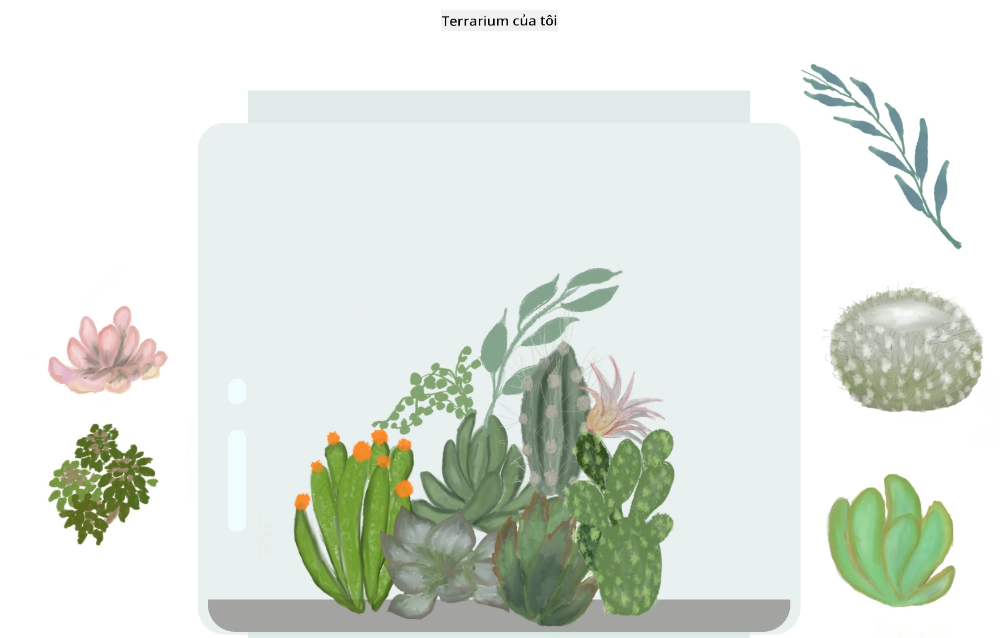

<!--
CO_OP_TRANSLATOR_METADATA:
{
  "original_hash": "6329fbe8bd936068debd78cca6f09c0a",
  "translation_date": "2025-08-27T22:58:22+00:00",
  "source_file": "3-terrarium/solution/README.md",
  "language_code": "vi"
}
-->
# Terrarium của tôi: Một dự án học về HTML, CSS và thao tác DOM bằng JavaScript 🌵🌱

Một bài tập nhỏ về kéo và thả. Với một chút HTML, JS và CSS, bạn có thể tạo giao diện web, định kiểu và thêm tương tác.

## Tín dụng

Được viết với ♥️ bởi [Jen Looper](https://www.twitter.com/jenlooper)

Terrarium được tạo bằng CSS lấy cảm hứng từ lọ thủy tinh của Jakub Mandra trên [codepen](https://codepen.io/Rotarepmi/pen/rjpNZY).

Tác phẩm nghệ thuật được vẽ tay bởi [Jen Looper](http://jenlooper.com) sử dụng Procreate.

## Triển khai Terrarium của bạn

Bạn có thể triển khai hoặc xuất bản terrarium của mình lên web bằng Azure Static Web Apps.

1. Fork repo này

2. Nhấn vào nút này

3. Làm theo hướng dẫn trong wizard để tạo ứng dụng của bạn. Đảm bảo bạn đặt thư mục gốc của ứng dụng là `/solution` hoặc thư mục gốc của mã nguồn. Ứng dụng này không có API, vì vậy bạn không cần lo lắng về việc thêm API. Một thư mục .github sẽ được tạo trong repo đã fork của bạn, giúp dịch vụ xây dựng của Azure Static Web Apps xây dựng và xuất bản ứng dụng của bạn lên một URL mới.

---

**Tuyên bố miễn trừ trách nhiệm**:  
Tài liệu này đã được dịch bằng dịch vụ dịch thuật AI [Co-op Translator](https://github.com/Azure/co-op-translator). Mặc dù chúng tôi cố gắng đảm bảo độ chính xác, xin lưu ý rằng các bản dịch tự động có thể chứa lỗi hoặc không chính xác. Tài liệu gốc bằng ngôn ngữ bản địa nên được coi là nguồn thông tin chính thức. Đối với các thông tin quan trọng, khuyến nghị sử dụng dịch vụ dịch thuật chuyên nghiệp bởi con người. Chúng tôi không chịu trách nhiệm cho bất kỳ sự hiểu lầm hoặc diễn giải sai nào phát sinh từ việc sử dụng bản dịch này.