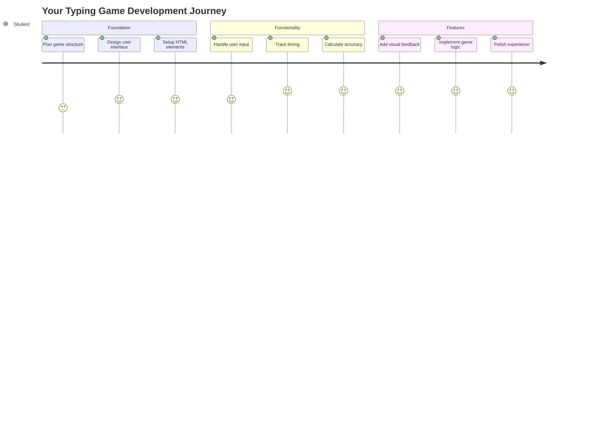
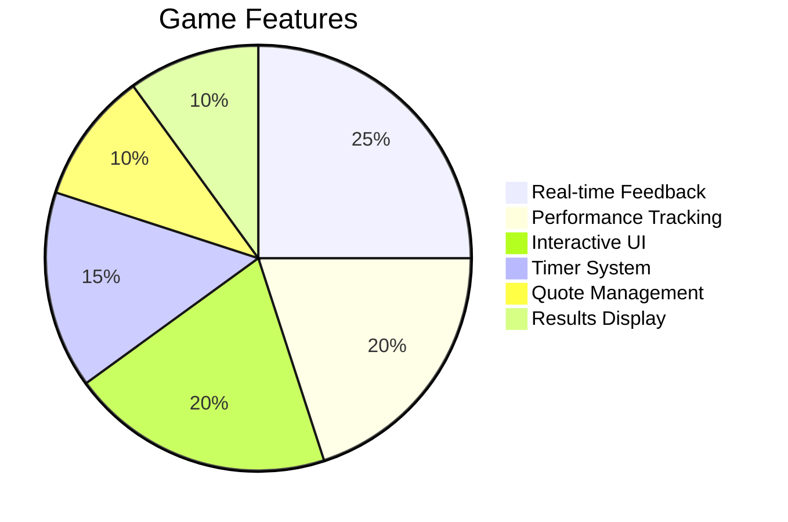
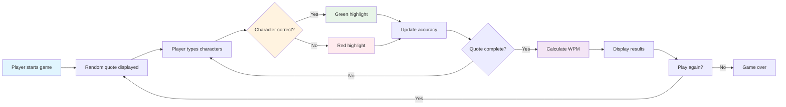
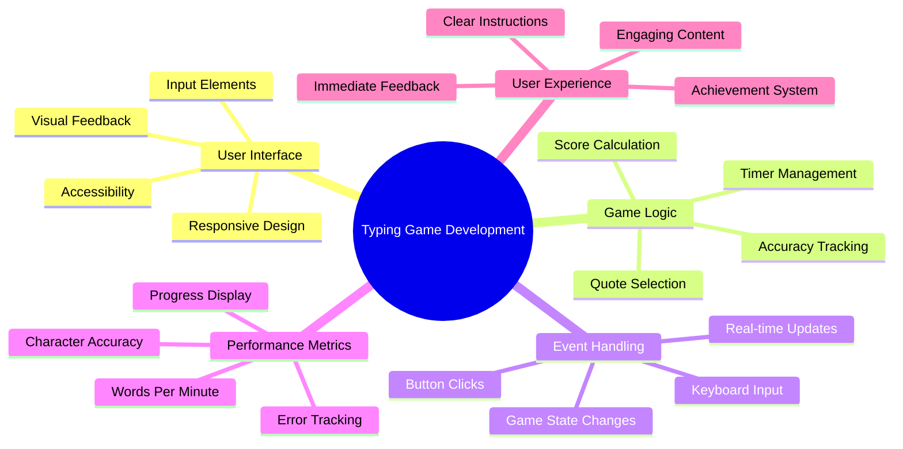
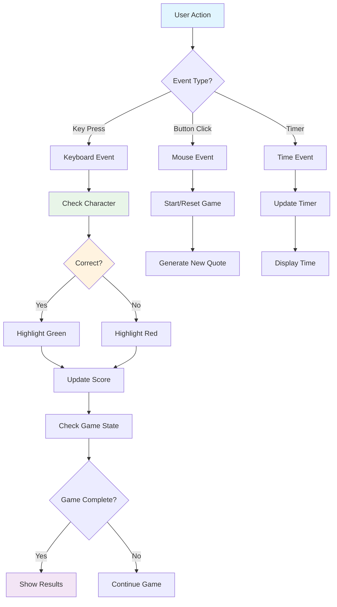
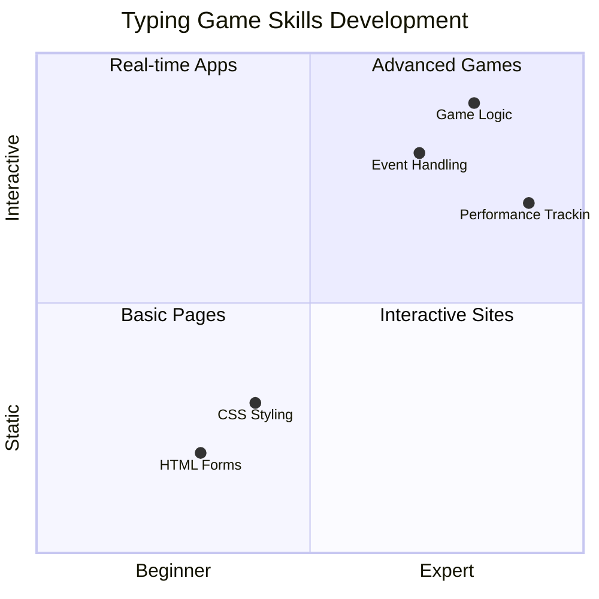
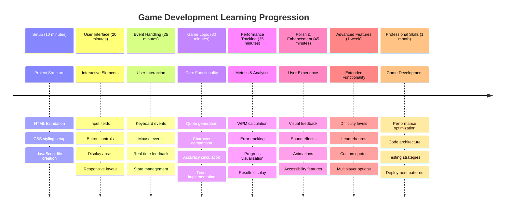

<!--
CO_OP_TRANSLATOR_METADATA:
{
  "original_hash": "efa2ab875b8bb5a7883816506da6b6d2",
  "translation_date": "2025-11-06T11:29:56+00:00",
  "source_file": "4-typing-game/README.md",
  "language_code": "vi"
}
-->
# Lập trình hướng sự kiện - Xây dựng trò chơi đánh máy

## Giới thiệu

Đây là điều mà mọi lập trình viên đều biết nhưng hiếm khi nhắc đến: đánh máy nhanh là một siêu năng lực! 🚀 Hãy nghĩ mà xem - càng nhanh chuyển ý tưởng từ đầu óc vào trình soạn thảo mã, bạn càng có thể sáng tạo không ngừng. Nó giống như có một đường dẫn trực tiếp giữa suy nghĩ và màn hình.

Muốn biết cách tốt nhất để nâng cao kỹ năng này? Đúng vậy - chúng ta sẽ xây dựng một trò chơi!

> Hãy cùng tạo một trò chơi đánh máy tuyệt vời!

Sẵn sàng áp dụng tất cả kỹ năng JavaScript, HTML và CSS mà bạn đã học chưa? Chúng ta sẽ xây dựng một trò chơi đánh máy, nơi bạn sẽ thử thách bản thân với những câu trích dẫn ngẫu nhiên từ thám tử huyền thoại [Sherlock Holmes](https://en.wikipedia.org/wiki/Sherlock_Holmes). Trò chơi sẽ theo dõi tốc độ và độ chính xác của bạn - và tin tôi đi, nó gây nghiện hơn bạn tưởng!

## Những điều bạn cần biết

Trước khi bắt đầu, hãy đảm bảo bạn đã quen thuộc với những khái niệm này (đừng lo nếu cần ôn lại nhanh - ai cũng từng như vậy!):

- Tạo trường nhập liệu và nút điều khiển
- CSS và thiết lập kiểu dáng bằng các lớp  
- Các kiến thức cơ bản về JavaScript
  - Tạo mảng
  - Tạo số ngẫu nhiên
  - Lấy thời gian hiện tại

Nếu cảm thấy hơi mơ hồ, không sao cả! Đôi khi cách tốt nhất để củng cố kiến thức là bắt tay vào dự án và tìm hiểu trong quá trình làm.

### 🔄 **Kiểm tra kiến thức**
**Đánh giá nền tảng**: Trước khi bắt đầu phát triển, hãy đảm bảo bạn hiểu:
- ✅ Cách hoạt động của các biểu mẫu HTML và phần tử nhập liệu
- ✅ Các lớp CSS và cách tạo kiểu động
- ✅ Các trình lắng nghe và xử lý sự kiện trong JavaScript
- ✅ Thao tác mảng và chọn ngẫu nhiên
- ✅ Đo lường thời gian và tính toán

**Kiểm tra nhanh bản thân**: Bạn có thể giải thích cách các khái niệm này hoạt động cùng nhau trong một trò chơi tương tác không?
- **Sự kiện** được kích hoạt khi người dùng tương tác với các phần tử
- **Trình xử lý** xử lý các sự kiện và cập nhật trạng thái trò chơi
- **CSS** cung cấp phản hồi trực quan cho hành động của người dùng
- **Thời gian** cho phép đo lường hiệu suất và tiến trình trò chơi

## Hãy cùng xây dựng nào!

[Hướng dẫn tạo trò chơi đánh máy bằng lập trình hướng sự kiện](./typing-game/README.md)

### ⚡ **Những việc bạn có thể làm trong 5 phút tới**
- [ ] Mở bảng điều khiển trình duyệt và thử lắng nghe sự kiện bàn phím với `addEventListener`
- [ ] Tạo một trang HTML đơn giản với trường nhập liệu và kiểm tra việc phát hiện đánh máy
- [ ] Luyện tập thao tác chuỗi bằng cách so sánh văn bản đã nhập với văn bản mục tiêu
- [ ] Thử nghiệm với `setTimeout` để hiểu các hàm thời gian

### 🎯 **Những việc bạn có thể hoàn thành trong giờ tới**
- [ ] Hoàn thành bài kiểm tra sau bài học và hiểu lập trình hướng sự kiện
- [ ] Xây dựng phiên bản cơ bản của trò chơi đánh máy với xác thực từ
- [ ] Thêm phản hồi trực quan cho việc đánh máy đúng và sai
- [ ] Triển khai hệ thống điểm đơn giản dựa trên tốc độ và độ chính xác
- [ ] Tạo kiểu cho trò chơi bằng CSS để làm cho nó hấp dẫn hơn

### 📅 **Phát triển trò chơi trong tuần**
- [ ] Hoàn thành trò chơi đánh máy đầy đủ với tất cả tính năng và hoàn thiện
- [ ] Thêm các cấp độ khó với độ phức tạp từ khác nhau
- [ ] Triển khai theo dõi thống kê người dùng (WPM, độ chính xác theo thời gian)
- [ ] Tạo hiệu ứng âm thanh và hoạt ảnh để cải thiện trải nghiệm người dùng
- [ ] Làm cho trò chơi tương thích với thiết bị di động
- [ ] Chia sẻ trò chơi trực tuyến và thu thập phản hồi từ người dùng

### 🌟 **Phát triển tương tác trong tháng**
- [ ] Xây dựng nhiều trò chơi khám phá các mẫu tương tác khác nhau
- [ ] Tìm hiểu về vòng lặp trò chơi, quản lý trạng thái và tối ưu hóa hiệu suất
- [ ] Đóng góp vào các dự án phát triển trò chơi mã nguồn mở
- [ ] Làm chủ các khái niệm thời gian nâng cao và hoạt ảnh mượt mà
- [ ] Tạo danh mục đầu tư với các ứng dụng tương tác khác nhau
- [ ] Hướng dẫn những người khác quan tâm đến phát triển trò chơi và tương tác người dùng

## 🎯 Lộ trình làm chủ trò chơi đánh máy của bạn

### 🛠️ Tóm tắt bộ công cụ phát triển trò chơi của bạn

Sau khi hoàn thành dự án này, bạn sẽ làm chủ:
- **Lập trình hướng sự kiện**: Giao diện người dùng phản hồi theo đầu vào
- **Phản hồi thời gian thực**: Cập nhật trực quan và hiệu suất ngay lập tức
- **Đo lường hiệu suất**: Hệ thống tính thời gian và điểm chính xác
- **Quản lý trạng thái trò chơi**: Kiểm soát luồng ứng dụng và trải nghiệm người dùng
- **Thiết kế tương tác**: Tạo trải nghiệm người dùng hấp dẫn, gây nghiện
- **Web API hiện đại**: Sử dụng khả năng trình duyệt để tạo tương tác phong phú
- **Mẫu thiết kế tiếp cận**: Thiết kế bao gồm cho tất cả người dùng

**Ứng dụng thực tế**: Những kỹ năng này áp dụng trực tiếp vào:
- **Ứng dụng web**: Bất kỳ giao diện tương tác hoặc bảng điều khiển nào
- **Phần mềm giáo dục**: Nền tảng học tập và công cụ đánh giá kỹ năng
- **Công cụ năng suất**: Trình soạn thảo văn bản, IDE và phần mềm cộng tác
- **Ngành công nghiệp trò chơi**: Trò chơi trên trình duyệt và giải trí tương tác
- **Phát triển di động**: Giao diện dựa trên cảm ứng và xử lý cử chỉ

**Cấp độ tiếp theo**: Bạn đã sẵn sàng khám phá các framework trò chơi nâng cao, hệ thống nhiều người chơi thời gian thực hoặc các ứng dụng tương tác phức tạp!

## Ghi công

Viết với ♥️ bởi [Christopher Harrison](http://www.twitter.com/geektrainer)

---

**Tuyên bố miễn trừ trách nhiệm**:  
Tài liệu này đã được dịch bằng dịch vụ dịch thuật AI [Co-op Translator](https://github.com/Azure/co-op-translator). Mặc dù chúng tôi cố gắng đảm bảo độ chính xác, xin lưu ý rằng các bản dịch tự động có thể chứa lỗi hoặc không chính xác. Tài liệu gốc bằng ngôn ngữ bản địa nên được coi là nguồn thông tin chính thức. Đối với thông tin quan trọng, nên sử dụng dịch vụ dịch thuật chuyên nghiệp bởi con người. Chúng tôi không chịu trách nhiệm cho bất kỳ sự hiểu lầm hoặc diễn giải sai nào phát sinh từ việc sử dụng bản dịch này.