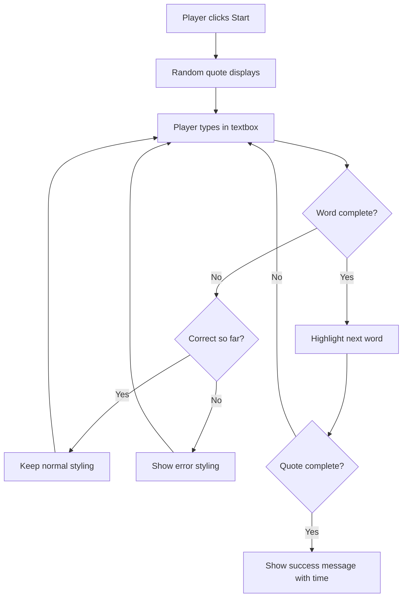
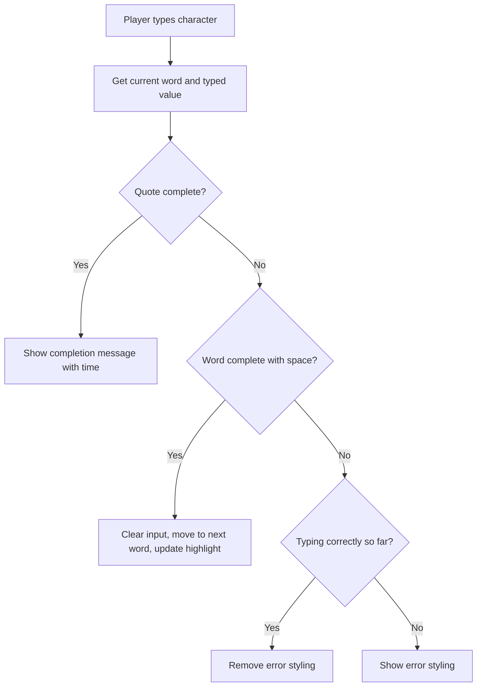

<!--
CO_OP_TRANSLATOR_METADATA:
{
  "original_hash": "e6b75e5b8caae906473a8a09d77b7121",
  "translation_date": "2025-10-24T13:47:56+00:00",
  "source_file": "4-typing-game/typing-game/README.md",
  "language_code": "vi"
}
-->
# Tạo một trò chơi sử dụng sự kiện

Bạn đã bao giờ tự hỏi làm thế nào các trang web biết khi bạn nhấp vào một nút hoặc nhập vào một hộp văn bản chưa? Đó chính là sự kỳ diệu của lập trình dựa trên sự kiện! Cách tốt nhất để học kỹ năng quan trọng này là xây dựng một thứ gì đó hữu ích - một trò chơi đo tốc độ gõ phím phản ứng với từng lần nhấn phím của bạn.

Bạn sẽ trực tiếp thấy cách các trình duyệt web "giao tiếp" với mã JavaScript của bạn. Mỗi lần bạn nhấp chuột, gõ phím hoặc di chuyển chuột, trình duyệt sẽ gửi những thông điệp nhỏ (chúng tôi gọi chúng là sự kiện) đến mã của bạn, và bạn sẽ quyết định cách phản hồi!

Khi chúng ta hoàn thành, bạn sẽ tạo ra một trò chơi gõ phím thực sự theo dõi tốc độ và độ chính xác của bạn. Quan trọng hơn, bạn sẽ hiểu các khái niệm cơ bản làm nền tảng cho mọi trang web tương tác mà bạn từng sử dụng. Hãy bắt đầu nào!

## Câu hỏi trước bài học

[Quiz trước bài học](https://ff-quizzes.netlify.app/web/quiz/21)

## Lập trình dựa trên sự kiện

Hãy nghĩ về ứng dụng hoặc trang web yêu thích của bạn - điều gì khiến nó cảm thấy sống động và phản hồi nhanh? Tất cả là nhờ cách nó phản ứng với những gì bạn làm! Mỗi lần chạm, nhấp chuột, vuốt hoặc nhấn phím tạo ra cái mà chúng tôi gọi là "sự kiện," và đó là nơi mà sự kỳ diệu thực sự của phát triển web diễn ra.

Điều làm cho lập trình web trở nên thú vị là: chúng ta không bao giờ biết khi nào ai đó sẽ nhấp vào nút đó hoặc bắt đầu nhập vào một hộp văn bản. Họ có thể nhấp ngay lập tức, chờ năm phút, hoặc có thể không bao giờ nhấp! Sự không thể đoán trước này có nghĩa là chúng ta cần suy nghĩ khác về cách viết mã.

Thay vì viết mã chạy từ trên xuống dưới như một công thức, chúng ta viết mã ngồi chờ đợi điều gì đó xảy ra. Nó giống như cách các nhân viên điện báo vào thế kỷ 19 ngồi bên máy của họ, sẵn sàng phản hồi ngay khi một thông điệp được gửi qua dây.

Vậy chính xác thì "sự kiện" là gì? Đơn giản mà nói, đó là một điều gì đó xảy ra! Khi bạn nhấp vào một nút - đó là một sự kiện. Khi bạn gõ một chữ cái - đó là một sự kiện. Khi bạn di chuyển chuột - đó là một sự kiện khác.

Lập trình dựa trên sự kiện cho phép chúng ta thiết lập mã để lắng nghe và phản hồi. Chúng ta tạo ra các hàm đặc biệt gọi là **event listeners** (trình lắng nghe sự kiện) chờ đợi một cách kiên nhẫn cho những điều cụ thể xảy ra, sau đó hành động ngay khi chúng xảy ra.

Hãy nghĩ về event listeners như có một chuông cửa cho mã của bạn. Bạn thiết lập chuông cửa (`addEventListener()`), nói cho nó biết âm thanh nào cần lắng nghe (như 'click' hoặc 'keypress'), và sau đó chỉ định điều gì sẽ xảy ra khi ai đó bấm chuông (hàm tùy chỉnh của bạn).

**Cách hoạt động của event listeners:**
- **Lắng nghe** các hành động cụ thể của người dùng như nhấp chuột, gõ phím, hoặc di chuyển chuột
- **Thực thi** mã tùy chỉnh của bạn khi sự kiện được chỉ định xảy ra
- **Phản hồi** ngay lập tức với các tương tác của người dùng, tạo ra trải nghiệm liền mạch
- **Xử lý** nhiều sự kiện trên cùng một phần tử bằng các trình lắng nghe khác nhau

> **NOTE:** Đáng chú ý là có nhiều cách để tạo event listeners. Bạn có thể sử dụng hàm ẩn danh hoặc tạo hàm có tên. Bạn có thể sử dụng các phím tắt khác nhau, như thiết lập thuộc tính `click`, hoặc sử dụng `addEventListener()`. Trong bài tập của chúng ta, chúng ta sẽ tập trung vào `addEventListener()` và hàm ẩn danh, vì đây có lẽ là kỹ thuật phổ biến nhất mà các nhà phát triển web sử dụng. Nó cũng là cách linh hoạt nhất, vì `addEventListener()` hoạt động cho tất cả các sự kiện, và tên sự kiện có thể được cung cấp dưới dạng tham số.

### Các sự kiện phổ biến

Mặc dù các trình duyệt web cung cấp hàng chục sự kiện khác nhau mà bạn có thể lắng nghe, hầu hết các ứng dụng tương tác chỉ dựa vào một số sự kiện cơ bản. Hiểu các sự kiện cốt lõi này sẽ giúp bạn xây dựng các tương tác người dùng phức tạp.

Có [hàng chục sự kiện](https://developer.mozilla.org/docs/Web/Events) mà bạn có thể lắng nghe khi tạo ứng dụng. Về cơ bản, bất cứ điều gì người dùng làm trên trang đều tạo ra một sự kiện, điều này mang lại cho bạn rất nhiều quyền lực để đảm bảo họ có trải nghiệm như mong muốn. May mắn thay, bạn thường chỉ cần một số ít sự kiện. Dưới đây là một vài sự kiện phổ biến (bao gồm hai sự kiện chúng ta sẽ sử dụng khi tạo trò chơi):

| Sự kiện | Mô tả | Các trường hợp sử dụng phổ biến |
|---------|-------|-------------------------------|
| `click` | Người dùng nhấp vào một thứ gì đó | Nút, liên kết, phần tử tương tác |
| `contextmenu` | Người dùng nhấp chuột phải | Menu chuột phải tùy chỉnh |
| `select` | Người dùng chọn một đoạn văn bản | Chỉnh sửa văn bản, thao tác sao chép |
| `input` | Người dùng nhập văn bản | Xác thực biểu mẫu, tìm kiếm thời gian thực |

**Hiểu các loại sự kiện này:**
- **Kích hoạt** khi người dùng tương tác với các phần tử cụ thể trên trang của bạn
- **Cung cấp** thông tin chi tiết về hành động của người dùng thông qua các đối tượng sự kiện
- **Cho phép** bạn tạo các ứng dụng web tương tác, phản hồi nhanh
- **Hoạt động** nhất quán trên các trình duyệt và thiết bị khác nhau

## Tạo trò chơi

Bây giờ bạn đã hiểu cách hoạt động của sự kiện, hãy áp dụng kiến thức đó vào thực tế bằng cách xây dựng một thứ gì đó hữu ích. Chúng ta sẽ tạo một trò chơi đo tốc độ gõ phím để minh họa cách xử lý sự kiện đồng thời giúp bạn phát triển một kỹ năng quan trọng của nhà phát triển.

Chúng ta sẽ tạo một trò chơi để khám phá cách sự kiện hoạt động trong JavaScript. Trò chơi của chúng ta sẽ kiểm tra kỹ năng gõ phím của người chơi, một trong những kỹ năng bị đánh giá thấp nhưng rất quan trọng mà mọi nhà phát triển nên có. Một sự thật thú vị: bố cục bàn phím QWERTY mà chúng ta sử dụng ngày nay thực sự được thiết kế vào những năm 1870 cho máy đánh chữ - và kỹ năng gõ phím tốt vẫn có giá trị như vậy đối với các lập trình viên ngày nay! Quy trình chung của trò chơi sẽ như sau:



**Cách trò chơi của chúng ta hoạt động:**
- **Bắt đầu** khi người chơi nhấp vào nút bắt đầu và hiển thị một câu ngẫu nhiên
- **Theo dõi** tiến trình gõ phím của người chơi từng từ một trong thời gian thực
- **Làm nổi bật** từ hiện tại để hướng dẫn sự tập trung của người chơi
- **Cung cấp** phản hồi trực quan ngay lập tức cho các lỗi gõ phím
- **Tính toán** và hiển thị tổng thời gian khi hoàn thành câu

Hãy cùng xây dựng trò chơi và tìm hiểu về sự kiện!

### Cấu trúc tệp

Trước khi bắt đầu viết mã, hãy tổ chức mọi thứ! Có một cấu trúc tệp sạch sẽ từ đầu sẽ giúp bạn tránh đau đầu sau này và làm cho dự án của bạn chuyên nghiệp hơn. 😊

Chúng ta sẽ giữ mọi thứ đơn giản với chỉ ba tệp: `index.html` cho cấu trúc trang, `script.js` cho tất cả logic trò chơi, và `style.css` để làm cho mọi thứ trông đẹp mắt. Đây là bộ ba cổ điển làm nền tảng cho hầu hết các trang web!

**Tạo một thư mục mới cho công việc của bạn bằng cách mở cửa sổ console hoặc terminal và thực hiện lệnh sau:**

```bash
# Linux or macOS
mkdir typing-game && cd typing-game

# Windows
md typing-game && cd typing-game
```

**Những gì các lệnh này thực hiện:**
- **Tạo** một thư mục mới có tên `typing-game` cho các tệp dự án của bạn
- **Chuyển đến** thư mục vừa tạo một cách tự động
- **Thiết lập** một không gian làm việc sạch sẽ cho việc phát triển trò chơi của bạn

**Mở Visual Studio Code:**

```bash
code .
```

**Lệnh này:**
- **Khởi chạy** Visual Studio Code trong thư mục hiện tại
- **Mở** thư mục dự án của bạn trong trình chỉnh sửa
- **Cung cấp** quyền truy cập vào tất cả các công cụ phát triển bạn cần

**Thêm ba tệp vào thư mục trong Visual Studio Code với các tên sau:**
- `index.html` - Chứa cấu trúc và nội dung của trò chơi
- `script.js` - Xử lý tất cả logic trò chơi và các trình lắng nghe sự kiện
- `style.css` - Định nghĩa giao diện và phong cách trực quan

## Tạo giao diện người dùng

Bây giờ hãy xây dựng sân khấu nơi tất cả hành động của trò chơi sẽ diễn ra! Hãy nghĩ về điều này như thiết kế bảng điều khiển cho một tàu vũ trụ - chúng ta cần đảm bảo mọi thứ mà người chơi cần đều nằm đúng chỗ họ mong đợi.

Hãy tìm hiểu xem trò chơi của chúng ta thực sự cần gì. Nếu bạn đang chơi một trò chơi gõ phím, bạn muốn thấy gì trên màn hình? Đây là những gì chúng ta sẽ cần:

| Phần tử giao diện | Mục đích | Phần tử HTML |
|-------------------|----------|--------------|
| Hiển thị câu | Hiển thị văn bản cần gõ | `<p>` với `id="quote"` |
| Khu vực thông báo | Hiển thị trạng thái và thông báo thành công | `<p>` với `id="message"` |
| Nhập văn bản | Nơi người chơi gõ câu | `<input>` với `id="typed-value"` |
| Nút bắt đầu | Bắt đầu trò chơi | `<button>` với `id="start"` |

**Hiểu cấu trúc giao diện:**
- **Tổ chức** nội dung một cách logic từ trên xuống dưới
- **Gán** ID duy nhất cho các phần tử để nhắm mục tiêu bằng JavaScript
- **Cung cấp** thứ tự hiển thị rõ ràng để cải thiện trải nghiệm người dùng
- **Bao gồm** các phần tử HTML ngữ nghĩa để tăng khả năng truy cập

Mỗi phần tử đó sẽ cần ID để chúng ta có thể làm việc với chúng trong JavaScript. Chúng ta cũng sẽ thêm tham chiếu đến các tệp CSS và JavaScript mà chúng ta sẽ tạo.

Tạo một tệp mới có tên `index.html`. Thêm HTML sau:

```html
<!-- inside index.html -->
<html>
<head>
  <title>Typing game</title>
  <link rel="stylesheet" href="style.css">
</head>
<body>
  <h1>Typing game!</h1>
  <p>Practice your typing skills with a quote from Sherlock Holmes. Click **start** to begin!</p>
  <p id="quote"></p> <!-- This will display our quote -->
  <p id="message"></p> <!-- This will display any status messages -->
  <div>
    <input type="text" aria-label="current word" id="typed-value" /> <!-- The textbox for typing -->
    <button type="button" id="start">Start</button> <!-- To start the game -->
  </div>
  <script src="script.js"></script>
</body>
</html>
```

**Phân tích những gì cấu trúc HTML này thực hiện:**
- **Liên kết** tệp CSS trong `<head>` để tạo kiểu dáng
- **Tạo** tiêu đề rõ ràng và hướng dẫn cho người dùng
- **Thiết lập** các đoạn văn placeholder với ID cụ thể cho nội dung động
- **Bao gồm** một trường nhập với các thuộc tính truy cập
- **Cung cấp** một nút bắt đầu để kích hoạt trò chơi
- **Tải** tệp JavaScript ở cuối để tối ưu hóa hiệu suất

### Khởi chạy ứng dụng

Kiểm tra ứng dụng của bạn thường xuyên trong quá trình phát triển giúp bạn phát hiện vấn đề sớm và thấy tiến trình của mình trong thời gian thực. Live Server là một công cụ vô giá tự động làm mới trình duyệt của bạn mỗi khi bạn lưu thay đổi, giúp phát triển hiệu quả hơn.

Luôn tốt nhất để phát triển từng bước để xem mọi thứ trông như thế nào. Hãy khởi chạy ứng dụng của chúng ta. Có một tiện ích mở rộng tuyệt vời cho Visual Studio Code gọi là [Live Server](https://marketplace.visualstudio.com/items?itemName=ritwickdey.LiveServer&WT.mc_id=academic-77807-sagibbon) sẽ vừa lưu trữ ứng dụng của bạn cục bộ vừa làm mới trình duyệt mỗi khi bạn lưu.

**Cài đặt [Live Server](https://marketplace.visualstudio.com/items?itemName=ritwickdey.LiveServer&WT.mc_id=academic-77807-sagibbon) bằng cách làm theo liên kết và nhấp vào Install:**

**Những gì xảy ra trong quá trình cài đặt:**
- **Nhắc nhở** trình duyệt của bạn mở Visual Studio Code
- **Hướng dẫn** bạn qua quá trình cài đặt tiện ích mở rộng
- **Có thể yêu cầu** khởi động lại Visual Studio Code để hoàn tất thiết lập

**Sau khi cài đặt, trong Visual Studio Code, nhấp Ctrl-Shift-P (hoặc Cmd-Shift-P) để mở bảng lệnh:**

**Hiểu bảng lệnh:**
- **Cung cấp** quyền truy cập nhanh vào tất cả các lệnh của VS Code
- **Tìm kiếm** lệnh khi bạn nhập
- **Cung cấp** phím tắt để phát triển nhanh hơn

**Nhập "Live Server: Open with Live Server":**

**Live Server làm gì:**
- **Khởi động** một máy chủ phát triển cục bộ cho dự án của bạn
- **Tự động** làm mới trình duyệt khi bạn lưu tệp
- **Phục vụ** các tệp của bạn từ một URL cục bộ (thường là `localhost:5500`)

**Mở trình duyệt và điều hướng đến `https://localhost:5500`:**

Bây giờ bạn sẽ thấy trang mà bạn đã tạo! Hãy thêm một số chức năng.

## Thêm CSS

Bây giờ hãy làm cho mọi thứ trông đẹp mắt! Phản hồi trực quan đã rất quan trọng đối với giao diện người dùng từ những ngày đầu của máy tính. Vào những năm 1980, các nhà nghiên cứu đã phát hiện ra rằng phản hồi trực quan ngay lập tức cải thiện đáng kể hiệu suất của người dùng và giảm lỗi. Đó chính xác là những gì chúng ta sẽ tạo ra.

Trò chơi của chúng ta cần phải rõ ràng về những gì đang diễn ra. Người chơi nên biết ngay lập tức từ nào họ cần gõ, và nếu họ mắc lỗi, họ nên thấy điều đó ngay lập tức. Hãy tạo một số kiểu dáng đơn giản nhưng hiệu quả:

Tạo một tệp mới có tên `style.css` và thêm cú pháp sau.

```css
/* inside style.css */
.highlight {
  background-color: yellow;
}

.error {
  background-color: lightcoral;
  border: red;
}
```

**Hiểu các lớp CSS này:**
- **Làm nổi bật** từ hiện tại với nền màu vàng để hướng dẫn trực quan rõ ràng
- **Báo hiệu** lỗi gõ phím với màu nền hồng nhạt
- **Cung cấp** phản hồi ngay lập tức mà không làm gián đoạn quá trình gõ của người dùng
- **Sử dụng** màu tương phản để tăng khả năng truy cập và giao tiếp trực quan rõ ràng

✅ Khi nói đến CSS, bạn có thể bố trí trang của mình theo cách bạn muốn. Dành một chút thời gian và làm cho trang trông hấp dẫn hơn:

- Chọn một phông chữ khác
- Tô màu tiêu đề
- Thay đổi kích thước các phần tử

## JavaScript

Đây là nơi mọi thứ trở nên thú vị! 🎉 Chúng ta đã có cấu trúc HTML và kiểu dáng CSS, nhưng hiện tại trò chơi của chúng ta giống như một chiếc xe đẹp mà không có động cơ. JavaScript sẽ là động cơ đó - nó làm cho mọi thứ thực sự hoạt động và phản hồi với những gì người chơi làm.

Đây là nơi bạn sẽ thấy sự sáng tạo của mình sống động. Chúng ta sẽ giải quyết từng bước để không cảm thấy quá tải:

| Bước | Mục đích | Những gì bạn sẽ học |
|------|----------|---------------------|
| [Tạo các hằng số](../../../../4-typing-game/typing-game) | Thiết lập các câu và tham chiếu DOM | Quản lý biến và chọn DOM |
| [Trình lắng nghe sự kiện để bắt đầu trò chơi](../../../../4-typing-game/typing-game) | Xử lý khởi tạo trò chơi | Xử lý sự kiện và cập nhật giao diện |
| [Trình lắng nghe sự kiện để gõ phím](../../../../4-typing-game/typing-game) | Xử lý đầu vào của người dùng trong thời gian thực | Xác thực đầu vào và phản hồi động |

**Cách tiếp cận có cấu trúc này giúp bạn:**
- **Tổ chức** mã của bạn thành các phần logic, dễ quản lý
- **Xây dựng** chức năng từng bước để dễ dàng gỡ lỗi
- **Hiểu** cách các phần khác nhau của ứng dụng hoạt động cùng nhau
- **Tạo** các mẫu có thể tái sử dụng cho các dự án tương lai

Nhưng trước tiên, tạo một tệp mới có tên `script.js`.

### Thêm các hằng số

Trước khi chúng ta đi vào hành động, hãy tập hợp tất cả các tài nguyên của mình! Giống như cách trung tâm điều khiển NASA thiết lập tất cả hệ thống giám sát trước khi phóng, sẽ dễ dàng hơn nhiều khi bạn có mọi thứ chuẩn bị sẵn sàng. Điều này giúp chúng ta không phải tìm kiếm xung quanh sau này và giúp tránh lỗi chính tả.

Đây là những gì chúng ta cần thiết lập trước:

| Loại dữ liệu | Mục đích | Ví dụ |
|-------------|----------|-------|
| Mảng câu trích dẫn | Lưu tất cả các câu trích dẫn có thể có cho trò chơi | `['Câu trích dẫn 1', 'Câu trích dẫn 2', ...]` |
| Mảng từ | Tách câu trích dẫn hiện tại thành các từ riêng lẻ | `['Khi', 'bạn', 'có', ...]` |
| Chỉ số từ | Theo dõi từ mà người chơi đang gõ | `0, 1, 2, 3...` |
| Thời gian bắt đầu | Tính thời gian đã trôi qua để tính điểm | `Date.now()` |

**Chúng ta cũng cần tham chiếu đến các phần tử giao diện người dùng:**
| Phần tử | ID | Mục đích |
|---------|----|---------|
| Ô nhập văn bản | `typed-value` | Nơi người chơi gõ |
| Hiển thị câu trích dẫn | `quote` | Hiển thị câu trích dẫn để gõ |
| Khu vực thông báo | `message` | Hiển thị cập nhật trạng thái |

```javascript
// inside script.js
// all of our quotes
const quotes = [
    'When you have eliminated the impossible, whatever remains, however improbable, must be the truth.',
    'There is nothing more deceptive than an obvious fact.',
    'I ought to know by this time that when a fact appears to be opposed to a long train of deductions it invariably proves to be capable of bearing some other interpretation.',
    'I never make exceptions. An exception disproves the rule.',
    'What one man can invent another can discover.',
    'Nothing clears up a case so much as stating it to another person.',
    'Education never ends, Watson. It is a series of lessons, with the greatest for the last.',
];
// store the list of words and the index of the word the player is currently typing
let words = [];
let wordIndex = 0;
// the starting time
let startTime = Date.now();
// page elements
const quoteElement = document.getElementById('quote');
const messageElement = document.getElementById('message');
const typedValueElement = document.getElementById('typed-value');
```

**Phân tích những gì đoạn mã thiết lập này thực hiện:**
- **Lưu trữ** một mảng các câu trích dẫn của Sherlock Holmes bằng `const` vì các câu trích dẫn sẽ không thay đổi
- **Khởi tạo** các biến theo dõi bằng `let` vì các giá trị này sẽ cập nhật trong quá trình chơi
- **Lấy** tham chiếu đến các phần tử DOM bằng `document.getElementById()` để truy cập hiệu quả
- **Thiết lập** nền tảng cho tất cả chức năng trò chơi với các tên biến rõ ràng, mô tả
- **Tổ chức** dữ liệu và các phần tử liên quan một cách hợp lý để dễ dàng bảo trì mã

✅ Hãy thêm nhiều câu trích dẫn hơn vào trò chơi của bạn

> 💡 **Mẹo chuyên nghiệp**: Chúng ta có thể lấy các phần tử bất cứ khi nào trong mã bằng cách sử dụng `document.getElementById()`. Vì chúng ta sẽ thường xuyên tham chiếu đến các phần tử này, việc sử dụng các hằng số sẽ giúp tránh lỗi chính tả với các chuỗi ký tự. Các framework như [Vue.js](https://vuejs.org/) hoặc [React](https://reactjs.org/) có thể giúp bạn quản lý mã tập trung tốt hơn.
>
**Tại sao cách tiếp cận này hoạt động hiệu quả:**
- **Ngăn ngừa** lỗi chính tả khi tham chiếu các phần tử nhiều lần
- **Cải thiện** khả năng đọc mã với các tên hằng số mô tả
- **Hỗ trợ** tốt hơn từ IDE với tính năng tự động hoàn thành và kiểm tra lỗi
- **Dễ dàng** hơn trong việc tái cấu trúc nếu ID của phần tử thay đổi sau này

Hãy dành một phút để xem video về việc sử dụng `const`, `let` và `var`

[](https://youtube.com/watch?v=JNIXfGiDWM8 "Các loại biến")

> 🎥 Nhấp vào hình ảnh trên để xem video về các loại biến.

### Thêm logic bắt đầu

Đây là lúc mọi thứ bắt đầu hoạt động! 🚀 Bạn sắp viết trình lắng nghe sự kiện đầu tiên của mình, và có điều gì đó rất thú vị khi thấy mã của bạn phản hồi lại một lần nhấp chuột.

Hãy nghĩ về điều này: ở đâu đó, một người chơi sẽ nhấp vào nút "Bắt đầu", và mã của bạn cần sẵn sàng cho họ. Chúng ta không biết khi nào họ sẽ nhấp - có thể ngay lập tức, có thể sau khi họ đi lấy cà phê - nhưng khi họ làm, trò chơi của bạn sẽ hoạt động.

Khi người dùng nhấp vào `start`, chúng ta cần chọn một câu trích dẫn, thiết lập giao diện người dùng, và thiết lập theo dõi cho từ hiện tại và thời gian. Dưới đây là đoạn mã JavaScript bạn cần thêm; chúng ta sẽ thảo luận ngay sau khối mã.

```javascript
// at the end of script.js
document.getElementById('start').addEventListener('click', () => {
  // get a quote
  const quoteIndex = Math.floor(Math.random() * quotes.length);
  const quote = quotes[quoteIndex];
  // Put the quote into an array of words
  words = quote.split(' ');
  // reset the word index for tracking
  wordIndex = 0;

  // UI updates
  // Create an array of span elements so we can set a class
  const spanWords = words.map(function(word) { return `<span>${word} </span>`});
  // Convert into string and set as innerHTML on quote display
  quoteElement.innerHTML = spanWords.join('');
  // Highlight the first word
  quoteElement.childNodes[0].className = 'highlight';
  // Clear any prior messages
  messageElement.innerText = '';

  // Setup the textbox
  // Clear the textbox
  typedValueElement.value = '';
  // set focus
  typedValueElement.focus();
  // set the event handler

  // Start the timer
  startTime = new Date().getTime();
});
```

**Hãy phân tích đoạn mã thành các phần logic:**

**📊 Thiết lập theo dõi từ:**
- **Chọn** một câu trích dẫn ngẫu nhiên bằng `Math.floor()` và `Math.random()` để tạo sự đa dạng
- **Chuyển đổi** câu trích dẫn thành một mảng các từ riêng lẻ bằng `split(' ')`
- **Đặt lại** `wordIndex` về 0 vì người chơi bắt đầu với từ đầu tiên
- **Chuẩn bị** trạng thái trò chơi cho một vòng mới

**🎨 Thiết lập và hiển thị giao diện người dùng:**
- **Tạo** một mảng các phần tử `<span>`, bao quanh mỗi từ để tạo kiểu riêng lẻ
- **Kết hợp** các phần tử span thành một chuỗi duy nhất để cập nhật DOM hiệu quả
- **Làm nổi bật** từ đầu tiên bằng cách thêm lớp CSS `highlight`
- **Xóa** bất kỳ thông báo trò chơi trước đó để cung cấp một giao diện sạch sẽ

**⌨️ Chuẩn bị ô nhập văn bản:**
- **Xóa** bất kỳ văn bản hiện có trong ô nhập
- **Đặt tiêu điểm** vào ô nhập để người chơi có thể bắt đầu gõ ngay lập tức
- **Chuẩn bị** khu vực nhập liệu cho phiên chơi mới

**⏱️ Khởi tạo bộ đếm thời gian:**
- **Lấy** dấu thời gian hiện tại bằng `new Date().getTime()`
- **Cho phép** tính toán chính xác tốc độ gõ và thời gian hoàn thành
- **Bắt đầu** theo dõi hiệu suất cho phiên chơi

### Thêm logic gõ

Đây là phần cốt lõi của trò chơi! Đừng lo nếu ban đầu bạn thấy hơi nhiều - chúng ta sẽ đi qua từng phần, và cuối cùng bạn sẽ thấy mọi thứ rất logic.

Những gì chúng ta đang xây dựng ở đây khá phức tạp: mỗi lần ai đó gõ một chữ cái, mã của chúng ta sẽ kiểm tra những gì họ đã gõ, đưa ra phản hồi, và quyết định điều gì sẽ xảy ra tiếp theo. Nó giống như cách các trình xử lý văn bản đầu tiên như WordStar vào những năm 1970 cung cấp phản hồi thời gian thực cho người gõ.

```javascript
// at the end of script.js
typedValueElement.addEventListener('input', () => {
  // Get the current word
  const currentWord = words[wordIndex];
  // get the current value
  const typedValue = typedValueElement.value;

  if (typedValue === currentWord && wordIndex === words.length - 1) {
    // end of sentence
    // Display success
    const elapsedTime = new Date().getTime() - startTime;
    const message = `CONGRATULATIONS! You finished in ${elapsedTime / 1000} seconds.`;
    messageElement.innerText = message;
  } else if (typedValue.endsWith(' ') && typedValue.trim() === currentWord) {
    // end of word
    // clear the typedValueElement for the new word
    typedValueElement.value = '';
    // move to the next word
    wordIndex++;
    // reset the class name for all elements in quote
    for (const wordElement of quoteElement.childNodes) {
      wordElement.className = '';
    }
    // highlight the new word
    quoteElement.childNodes[wordIndex].className = 'highlight';
  } else if (currentWord.startsWith(typedValue)) {
    // currently correct
    // highlight the next word
    typedValueElement.className = '';
  } else {
    // error state
    typedValueElement.className = 'error';
  }
});
```

**Hiểu luồng logic gõ:**

Hàm này sử dụng cách tiếp cận dạng thác nước, kiểm tra các điều kiện từ cụ thể nhất đến chung nhất. Hãy phân tích từng kịch bản:



**🏁 Hoàn thành câu trích dẫn (Kịch bản 1):**
- **Kiểm tra** nếu giá trị đã gõ khớp với từ hiện tại VÀ chúng ta đang ở từ cuối cùng
- **Tính toán** thời gian đã trôi qua bằng cách trừ thời gian bắt đầu từ thời gian hiện tại
- **Chuyển đổi** mili giây thành giây bằng cách chia cho 1,000
- **Hiển thị** thông báo chúc mừng với thời gian hoàn thành

**✅ Hoàn thành từ (Kịch bản 2):**
- **Phát hiện** hoàn thành từ khi đầu vào kết thúc bằng dấu cách
- **Xác thực** rằng đầu vào đã cắt khớp chính xác với từ hiện tại
- **Xóa** ô nhập liệu để chuẩn bị cho từ tiếp theo
- **Chuyển sang** từ tiếp theo bằng cách tăng `wordIndex`
- **Cập nhật** làm nổi bật trực quan bằng cách xóa tất cả các lớp và làm nổi bật từ mới

**📝 Đang gõ (Kịch bản 3):**
- **Xác minh** rằng từ hiện tại bắt đầu với những gì đã được gõ cho đến nay
- **Xóa** bất kỳ kiểu lỗi nào để hiển thị đầu vào là đúng
- **Cho phép** tiếp tục gõ mà không bị gián đoạn

**❌ Trạng thái lỗi (Kịch bản 4):**
- **Kích hoạt** khi văn bản đã gõ không khớp với phần đầu của từ mong đợi
- **Áp dụng** lớp CSS lỗi để cung cấp phản hồi trực quan ngay lập tức
- **Giúp** người chơi nhanh chóng xác định và sửa lỗi

## Kiểm tra ứng dụng của bạn

Hãy nhìn xem bạn đã làm được gì! 🎉 Bạn vừa xây dựng một trò chơi gõ thực sự, hoạt động từ đầu bằng cách sử dụng lập trình dựa trên sự kiện. Hãy dành một chút thời gian để tự hào về điều đó - đây không phải là điều nhỏ bé!

Bây giờ là giai đoạn kiểm tra! Nó sẽ hoạt động như mong đợi chứ? Chúng ta có bỏ sót điều gì không? Đây là điều: nếu có điều gì đó không hoạt động hoàn hảo ngay lập tức, điều đó hoàn toàn bình thường. Ngay cả các nhà phát triển có kinh nghiệm cũng thường xuyên tìm thấy lỗi trong mã của họ. Đó là một phần của quá trình phát triển!

Nhấp vào `start`, và bắt đầu gõ! Nó sẽ trông giống như hoạt ảnh chúng ta đã thấy trước đó.


**Những gì cần kiểm tra trong ứng dụng của bạn:**
- **Xác minh** rằng nhấp vào Start hiển thị một câu trích dẫn ngẫu nhiên
- **Xác nhận** rằng việc gõ làm nổi bật từ hiện tại đúng cách
- **Kiểm tra** rằng kiểu lỗi xuất hiện khi gõ sai
- **Đảm bảo** rằng hoàn thành từ làm nổi bật đúng từ tiếp theo
- **Kiểm tra** rằng hoàn thành câu trích dẫn hiển thị thông báo hoàn thành với thời gian

**Mẹo gỡ lỗi phổ biến:**
- **Kiểm tra** bảng điều khiển trình duyệt (F12) để tìm lỗi JavaScript
- **Xác minh** rằng tất cả tên tệp khớp chính xác (phân biệt chữ hoa chữ thường)
- **Đảm bảo** Live Server đang chạy và làm mới đúng cách
- **Kiểm tra** các câu trích dẫn khác nhau để xác minh việc chọn ngẫu nhiên hoạt động

---

## Thử thách GitHub Copilot Agent 🎮

Sử dụng chế độ Agent để hoàn thành thử thách sau:

**Mô tả:** Mở rộng trò chơi gõ bằng cách triển khai hệ thống điều chỉnh độ khó dựa trên hiệu suất của người chơi. Thử thách này sẽ giúp bạn thực hành xử lý sự kiện nâng cao, phân tích dữ liệu, và cập nhật giao diện người dùng động.

**Yêu cầu:** Tạo hệ thống điều chỉnh độ khó cho trò chơi gõ:
1. Theo dõi tốc độ gõ của người chơi (số từ mỗi phút) và phần trăm độ chính xác
2. Tự động điều chỉnh theo ba mức độ khó: Dễ (các câu trích dẫn đơn giản), Trung bình (các câu trích dẫn hiện tại), Khó (các câu trích dẫn phức tạp với dấu câu)
3. Hiển thị mức độ khó hiện tại và thống kê của người chơi trên giao diện người dùng
4. Triển khai bộ đếm chuỗi liên tiếp tăng độ khó sau 3 lần chơi tốt liên tiếp
5. Thêm phản hồi trực quan (màu sắc, hoạt ảnh) để chỉ ra sự thay đổi độ khó

Thêm các phần tử HTML cần thiết, kiểu CSS, và các hàm JavaScript để triển khai tính năng này. Bao gồm xử lý lỗi đúng cách và đảm bảo trò chơi vẫn dễ tiếp cận với các nhãn ARIA phù hợp.

Tìm hiểu thêm về [chế độ agent](https://code.visualstudio.com/blogs/2025/02/24/introducing-copilot-agent-mode) tại đây.

## 🚀 Thử thách

Sẵn sàng nâng cấp trò chơi gõ của bạn lên một cấp độ mới? Hãy thử triển khai các tính năng nâng cao này để hiểu sâu hơn về xử lý sự kiện và thao tác DOM:

**Thêm nhiều chức năng hơn:**

| Tính năng | Mô tả | Kỹ năng bạn sẽ thực hành |
|-----------|-------|--------------------------|
| **Kiểm soát đầu vào** | Vô hiệu hóa trình lắng nghe sự kiện `input` khi hoàn thành, và kích hoạt lại khi nút được nhấp | Quản lý sự kiện và kiểm soát trạng thái |
| **Quản lý trạng thái giao diện người dùng** | Vô hiệu hóa ô nhập liệu khi người chơi hoàn thành câu trích dẫn | Thao tác thuộc tính DOM |
| **Hộp thoại Modal** | Hiển thị hộp thoại modal với thông báo thành công | Mẫu giao diện nâng cao và khả năng tiếp cận |
| **Hệ thống điểm cao** | Lưu điểm cao bằng `localStorage` | API lưu trữ trình duyệt và duy trì dữ liệu |

**Mẹo triển khai:**
- **Nghiên cứu** `localStorage.setItem()` và `localStorage.getItem()` để lưu trữ dữ liệu lâu dài
- **Thực hành** thêm và xóa trình lắng nghe sự kiện một cách động
- **Khám phá** các phần tử hộp thoại HTML hoặc mẫu modal CSS
- **Cân nhắc** khả năng tiếp cận khi vô hiệu hóa và kích hoạt các điều khiển biểu mẫu

## Câu hỏi kiểm tra sau bài giảng

[Câu hỏi kiểm tra sau bài giảng](https://ff-quizzes.netlify.app/web/quiz/22)

## Ôn tập & Tự học

Đọc thêm về [tất cả các sự kiện có sẵn](https://developer.mozilla.org/docs/Web/Events) cho nhà phát triển thông qua trình duyệt web, và cân nhắc các tình huống mà bạn sẽ sử dụng từng sự kiện.

## Bài tập

[Tạo một trò chơi bàn phím mới](assignment.md)

---

**Tuyên bố miễn trừ trách nhiệm**:  
Tài liệu này đã được dịch bằng dịch vụ dịch thuật AI [Co-op Translator](https://github.com/Azure/co-op-translator). Mặc dù chúng tôi cố gắng đảm bảo độ chính xác, xin lưu ý rằng các bản dịch tự động có thể chứa lỗi hoặc không chính xác. Tài liệu gốc bằng ngôn ngữ bản địa nên được coi là nguồn thông tin chính thức. Đối với thông tin quan trọng, chúng tôi khuyến nghị sử dụng dịch vụ dịch thuật chuyên nghiệp từ con người. Chúng tôi không chịu trách nhiệm cho bất kỳ sự hiểu lầm hoặc diễn giải sai nào phát sinh từ việc sử dụng bản dịch này.