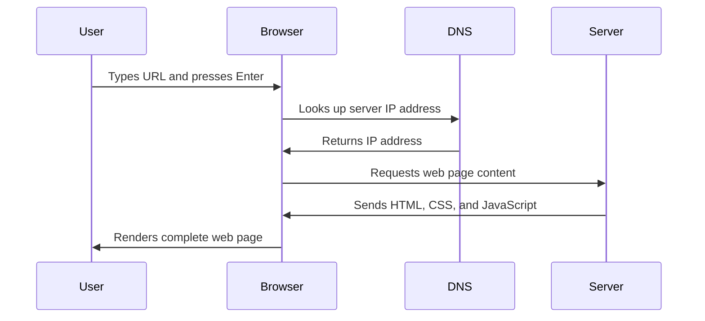

<!--
CO_OP_TRANSLATOR_METADATA:
{
  "original_hash": "33a875c522f237a2026e4653240dfc07",
  "translation_date": "2025-10-24T13:54:31+00:00",
  "source_file": "5-browser-extension/1-about-browsers/README.md",
  "language_code": "vi"
}
-->
# Dự án Tiện ích Mở rộng Trình duyệt Phần 1: Tất cả về Trình duyệt


> Hình vẽ minh họa bởi [Wassim Chegham](https://dev.to/wassimchegham/ever-wondered-what-happens-when-you-type-in-a-url-in-an-address-bar-in-a-browser-3dob)

## Câu hỏi trước bài giảng

[Câu hỏi trước bài giảng](https://ff-quizzes.netlify.app/web/quiz/23)

### Giới thiệu

Tiện ích mở rộng trình duyệt là những ứng dụng nhỏ giúp cải thiện trải nghiệm duyệt web của bạn. Giống như tầm nhìn ban đầu của Tim Berners-Lee về một web tương tác, các tiện ích mở rộng mở rộng khả năng của trình duyệt vượt ra ngoài việc chỉ xem tài liệu. Từ các trình quản lý mật khẩu giúp bảo vệ tài khoản của bạn đến các công cụ chọn màu giúp nhà thiết kế tìm được màu sắc hoàn hảo, tiện ích mở rộng giải quyết các thách thức duyệt web hàng ngày.

Trước khi chúng ta xây dựng tiện ích mở rộng đầu tiên của bạn, hãy tìm hiểu cách trình duyệt hoạt động. Giống như Alexander Graham Bell cần hiểu cách truyền âm thanh trước khi phát minh ra điện thoại, việc hiểu các nguyên lý cơ bản của trình duyệt sẽ giúp bạn tạo ra các tiện ích mở rộng tích hợp mượt mà với hệ thống trình duyệt hiện có.

Kết thúc bài học này, bạn sẽ hiểu về kiến trúc trình duyệt và bắt đầu xây dựng tiện ích mở rộng đầu tiên của mình.

## Hiểu về Trình duyệt Web

Trình duyệt web về cơ bản là một trình thông dịch tài liệu phức tạp. Khi bạn nhập "google.com" vào thanh địa chỉ, trình duyệt thực hiện một loạt các thao tác phức tạp - yêu cầu nội dung từ các máy chủ trên toàn thế giới, sau đó phân tích và hiển thị mã thành các trang web tương tác mà bạn thấy.

Quá trình này giống như cách trình duyệt web đầu tiên, WorldWideWeb, được thiết kế bởi Tim Berners-Lee vào năm 1990 để làm cho các tài liệu liên kết dễ dàng truy cập cho mọi người.

✅ **Một chút lịch sử**: Trình duyệt đầu tiên được gọi là 'WorldWideWeb' và được tạo ra bởi Sir Timothy Berners-Lee vào năm 1990.


> Một số trình duyệt đầu tiên, qua [Karen McGrane](https://www.slideshare.net/KMcGrane/week-4-ixd-history-personal-computing)

### Cách Trình duyệt Xử lý Nội dung Web

Quá trình từ việc nhập một URL đến việc hiển thị một trang web bao gồm nhiều bước phối hợp diễn ra trong vài giây:



**Quá trình này đạt được những gì:**
- **Dịch** URL dễ đọc thành địa chỉ IP của máy chủ thông qua tra cứu DNS
- **Thiết lập** kết nối an toàn với máy chủ web bằng các giao thức HTTP hoặc HTTPS
- **Yêu cầu** nội dung trang web cụ thể từ máy chủ
- **Nhận** mã HTML, CSS và JavaScript từ máy chủ
- **Hiển thị** tất cả nội dung thành trang web tương tác mà bạn thấy

### Các Tính năng Cốt lõi của Trình duyệt

Trình duyệt hiện đại cung cấp nhiều tính năng mà các nhà phát triển tiện ích mở rộng có thể tận dụng:

| Tính năng | Mục đích | Cơ hội cho Tiện ích Mở rộng |
|-----------|----------|----------------------------|
| **Rendering Engine** | Hiển thị HTML, CSS và JavaScript | Thay đổi nội dung, chèn kiểu dáng |
| **JavaScript Engine** | Thực thi mã JavaScript | Tập lệnh tùy chỉnh, tương tác API |
| **Local Storage** | Lưu dữ liệu cục bộ | Tùy chọn người dùng, dữ liệu được lưu trữ |
| **Network Stack** | Xử lý yêu cầu web | Giám sát yêu cầu, phân tích dữ liệu |
| **Security Model** | Bảo vệ người dùng khỏi nội dung độc hại | Lọc nội dung, cải thiện bảo mật |

**Hiểu các tính năng này giúp bạn:**
- **Xác định** nơi tiện ích mở rộng của bạn có thể mang lại giá trị nhất
- **Chọn** các API trình duyệt phù hợp cho chức năng của tiện ích mở rộng
- **Thiết kế** tiện ích mở rộng hoạt động hiệu quả với hệ thống trình duyệt
- **Đảm bảo** tiện ích mở rộng của bạn tuân theo các nguyên tắc bảo mật của trình duyệt

### Cân nhắc Phát triển Tiện ích Mở rộng Đa Trình duyệt

Các trình duyệt khác nhau thực hiện các tiêu chuẩn với những biến thể nhỏ, giống như cách các ngôn ngữ lập trình khác nhau có thể xử lý cùng một thuật toán theo cách khác nhau. Chrome, Firefox và Safari đều có những đặc điểm riêng mà các nhà phát triển cần cân nhắc khi phát triển tiện ích mở rộng.

> 💡 **Mẹo chuyên nghiệp**: Sử dụng [caniuse.com](https://www.caniuse.com) để kiểm tra công nghệ web nào được hỗ trợ trên các trình duyệt khác nhau. Điều này rất hữu ích khi lên kế hoạch cho các tính năng của tiện ích mở rộng!

**Những cân nhắc chính khi phát triển tiện ích mở rộng:**
- **Kiểm tra** tiện ích mở rộng của bạn trên các trình duyệt Chrome, Firefox và Edge
- **Thích nghi** với các API tiện ích mở rộng và định dạng manifest khác nhau của trình duyệt
- **Xử lý** các đặc điểm hiệu suất và giới hạn khác nhau
- **Cung cấp** các phương án thay thế cho các tính năng cụ thể của trình duyệt có thể không khả dụng

✅ **Thông tin Phân tích**: Bạn có thể xác định trình duyệt nào người dùng của bạn ưa thích bằng cách cài đặt các gói phân tích trong các dự án phát triển web của mình. Dữ liệu này giúp bạn ưu tiên hỗ trợ trình duyệt nào trước.

## Hiểu về Tiện ích Mở rộng Trình duyệt

Tiện ích mở rộng trình duyệt giải quyết các thách thức duyệt web phổ biến bằng cách thêm chức năng trực tiếp vào giao diện trình duyệt. Thay vì yêu cầu các ứng dụng riêng biệt hoặc quy trình phức tạp, tiện ích mở rộng cung cấp quyền truy cập ngay lập tức vào các công cụ và tính năng.

Khái niệm này giống như cách các nhà tiên phong máy tính như Douglas Engelbart hình dung việc tăng cường khả năng của con người bằng công nghệ - các tiện ích mở rộng tăng cường chức năng cơ bản của trình duyệt.

**Các loại tiện ích mở rộng phổ biến và lợi ích của chúng:**
- **Công cụ Năng suất**: Trình quản lý công việc, ứng dụng ghi chú và công cụ theo dõi thời gian giúp bạn tổ chức tốt hơn
- **Cải thiện Bảo mật**: Trình quản lý mật khẩu, trình chặn quảng cáo và công cụ bảo mật bảo vệ dữ liệu của bạn
- **Công cụ cho Nhà phát triển**: Trình định dạng mã, công cụ chọn màu và tiện ích gỡ lỗi giúp đơn giản hóa việc phát triển
- **Cải thiện Nội dung**: Chế độ đọc, trình tải xuống video và công cụ chụp màn hình cải thiện trải nghiệm web của bạn

✅ **Câu hỏi Suy ngẫm**: Tiện ích mở rộng trình duyệt yêu thích của bạn là gì? Chúng thực hiện những nhiệm vụ cụ thể nào và cải thiện trải nghiệm duyệt web của bạn ra sao?

## Cài đặt và Quản lý Tiện ích Mở rộng

Hiểu quy trình cài đặt tiện ích mở rộng giúp bạn dự đoán trải nghiệm người dùng khi mọi người cài đặt tiện ích mở rộng của bạn. Quy trình cài đặt được chuẩn hóa trên các trình duyệt hiện đại, với những biến thể nhỏ trong thiết kế giao diện.


> **Quan trọng**: Đảm bảo bật chế độ nhà phát triển và cho phép tiện ích mở rộng từ các cửa hàng khác khi thử nghiệm tiện ích mở rộng của riêng bạn.

### Quy trình Cài đặt Tiện ích Mở rộng khi Phát triển

Khi bạn đang phát triển và thử nghiệm tiện ích mở rộng của mình, hãy làm theo quy trình sau:

```bash
# Step 1: Build your extension
npm run build
```

**Lệnh này đạt được những gì:**
- **Biên dịch** mã nguồn của bạn thành các tệp sẵn sàng cho trình duyệt
- **Đóng gói** các mô-đun JavaScript thành các gói tối ưu
- **Tạo** các tệp tiện ích mở rộng cuối cùng trong thư mục `/dist`
- **Chuẩn bị** tiện ích mở rộng của bạn để cài đặt và thử nghiệm

**Bước 2: Điều hướng đến Tiện ích Mở rộng của Trình duyệt**
1. **Mở** trang quản lý tiện ích mở rộng của trình duyệt của bạn
2. **Nhấp** vào nút "Cài đặt và hơn thế nữa" (biểu tượng `...`) ở góc trên bên phải
3. **Chọn** "Tiện ích mở rộng" từ menu thả xuống

**Bước 3: Tải Tiện ích Mở rộng của Bạn**
- **Đối với cài đặt mới**: Chọn `load unpacked` và chọn thư mục `/dist` của bạn
- **Đối với cập nhật**: Nhấp vào `reload` bên cạnh tiện ích mở rộng đã cài đặt của bạn
- **Đối với thử nghiệm**: Bật "Chế độ nhà phát triển" để truy cập các tính năng gỡ lỗi bổ sung

### Cài đặt Tiện ích Mở rộng Sản phẩm

> ✅ **Lưu ý**: Các hướng dẫn phát triển này dành riêng cho các tiện ích mở rộng bạn tự xây dựng. Để cài đặt các tiện ích mở rộng đã được xuất bản, hãy truy cập các cửa hàng tiện ích mở rộng trình duyệt chính thức như [Microsoft Edge Add-ons store](https://microsoftedge.microsoft.com/addons/Microsoft-Edge-Extensions-Home).

**Hiểu sự khác biệt:**
- **Cài đặt phát triển** cho phép bạn thử nghiệm các tiện ích mở rộng chưa được xuất bản trong quá trình phát triển
- **Cài đặt từ cửa hàng** cung cấp các tiện ích mở rộng đã được kiểm duyệt, xuất bản với các bản cập nhật tự động
- **Sideloading** cho phép cài đặt các tiện ích mở rộng từ bên ngoài các cửa hàng chính thức (yêu cầu chế độ nhà phát triển)

## Xây dựng Tiện ích Mở rộng Dấu chân Carbon của Bạn

Chúng ta sẽ tạo một tiện ích mở rộng trình duyệt hiển thị dấu chân carbon của việc sử dụng năng lượng trong khu vực của bạn. Dự án này minh họa các khái niệm phát triển tiện ích mở rộng cơ bản đồng thời tạo ra một công cụ thực tế để nâng cao nhận thức về môi trường.

Cách tiếp cận này tuân theo nguyên tắc "học bằng cách làm" đã được chứng minh là hiệu quả từ các lý thuyết giáo dục của John Dewey - kết hợp kỹ năng kỹ thuật với các ứng dụng thực tế có ý nghĩa.

### Yêu cầu Dự án

Trước khi bắt đầu phát triển, hãy thu thập các tài nguyên và phụ thuộc cần thiết:

**Yêu cầu Truy cập API:**
- **[CO2 Signal API key](https://www.co2signal.com/)**: Nhập địa chỉ email của bạn để nhận khóa API miễn phí
- **[Mã vùng](http://api.electricitymap.org/v3/zones)**: Tìm mã vùng của bạn bằng [Electricity Map](https://www.electricitymap.org/map) (ví dụ, Boston sử dụng 'US-NEISO')

**Công cụ Phát triển:**
- **[Node.js và NPM](https://www.npmjs.com)**: Công cụ quản lý gói để cài đặt các phụ thuộc của dự án
- **[Mã khởi đầu](../../../../5-browser-extension/start)**: Tải xuống thư mục `start` để bắt đầu phát triển

✅ **Tìm hiểu thêm**: Nâng cao kỹ năng quản lý gói của bạn với [mô-đun học toàn diện này](https://docs.microsoft.com/learn/modules/create-nodejs-project-dependencies/?WT.mc_id=academic-77807-sagibbon)

### Hiểu về Cấu trúc Dự án

Hiểu cấu trúc dự án giúp tổ chức công việc phát triển một cách hiệu quả. Giống như cách Thư viện Alexandria được tổ chức để dễ dàng truy xuất kiến thức, một cơ sở mã được cấu trúc tốt giúp việc phát triển trở nên hiệu quả hơn:

```
project-root/
├── dist/                    # Built extension files
│   ├── manifest.json        # Extension configuration
│   ├── index.html           # User interface markup
│   ├── background.js        # Background script functionality
│   └── main.js              # Compiled JavaScript bundle
└── src/                     # Source development files
    └── index.js             # Your main JavaScript code
```

**Phân tích những gì mỗi tệp đạt được:**
- **`manifest.json`**: **Xác định** siêu dữ liệu tiện ích mở rộng, quyền và điểm vào
- **`index.html`**: **Tạo** giao diện người dùng xuất hiện khi người dùng nhấp vào tiện ích mở rộng
- **`background.js`**: **Xử lý** các tác vụ nền và trình lắng nghe sự kiện của trình duyệt
- **`main.js`**: **Chứa** mã JavaScript cuối cùng sau quá trình biên dịch
- **`src/index.js`**: **Lưu trữ** mã phát triển chính của bạn được biên dịch thành `main.js`

> 💡 **Mẹo Tổ chức**: Lưu trữ khóa API và mã vùng của bạn trong một ghi chú bảo mật để dễ dàng tham khảo trong quá trình phát triển. Bạn sẽ cần các giá trị này để kiểm tra chức năng của tiện ích mở rộng.

✅ **Lưu ý Bảo mật**: Không bao giờ cam kết khóa API hoặc thông tin đăng nhập nhạy cảm vào kho mã của bạn. Chúng tôi sẽ chỉ cho bạn cách xử lý chúng một cách an toàn trong các bước tiếp theo.

## Tạo Giao diện Tiện ích Mở rộng

Bây giờ chúng ta sẽ xây dựng các thành phần giao diện người dùng. Tiện ích mở rộng sử dụng cách tiếp cận hai màn hình: màn hình cấu hình cho thiết lập ban đầu và màn hình kết quả để hiển thị dữ liệu.

Điều này tuân theo nguyên tắc tiết lộ dần dần được sử dụng trong thiết kế giao diện từ những ngày đầu của máy tính - hiển thị thông tin và tùy chọn theo trình tự logic để tránh làm người dùng bị quá tải.

### Tổng quan về Giao diện Tiện ích Mở rộng

**Màn hình Cài đặt** - Cấu hình người dùng lần đầu:


**Màn hình Kết quả** - Hiển thị dữ liệu dấu chân carbon:


### Xây dựng Biểu mẫu Cấu hình

Biểu mẫu cài đặt thu thập dữ liệu cấu hình người dùng trong lần sử dụng đầu tiên. Sau khi được cấu hình, thông tin này sẽ được lưu trữ trong bộ nhớ trình duyệt cho các phiên sau.

Trong tệp `/dist/index.html`, thêm cấu trúc biểu mẫu này:

```html
<form class="form-data" autocomplete="on">
    <div>
        <h2>New? Add your Information</h2>
    </div>
    <div>
        <label for="region">Region Name</label>
        <input type="text" id="region" required class="region-name" />
    </div>
    <div>
        <label for="api">Your API Key from tmrow</label>
        <input type="text" id="api" required class="api-key" />
    </div>
    <button class="search-btn">Submit</button>
</form>
```

**Biểu mẫu này đạt được những gì:**
- **Tạo** cấu trúc biểu mẫu ngữ nghĩa với các nhãn và liên kết đầu vào phù hợp
- **Kích hoạt** chức năng tự động hoàn thành của trình duyệt để cải thiện trải nghiệm người dùng
- **Yêu cầu** cả hai trường phải được điền trước khi gửi bằng thuộc tính `required`
- **Tổ chức** các trường nhập liệu với tên lớp mô tả để dễ dàng tạo kiểu và nhắm mục tiêu bằng JavaScript
- **Cung cấp** hướng dẫn rõ ràng cho người dùng đang thiết lập tiện ích mở rộng lần đầu tiên

### Xây dựng Hiển thị Kết quả

Tiếp theo, tạo khu vực hiển thị kết quả sẽ hiển thị dữ liệu dấu chân carbon. Thêm HTML này bên dưới biểu mẫu:

```html
<div class="result">
    <div class="loading">loading...</div>
    <div class="errors"></div>
    <div class="data"></div>
    <div class="result-container">
        <p><strong>Region: </strong><span class="my-region"></span></p>
        <p><strong>Carbon Usage: </strong><span class="carbon-usage"></span></p>
        <p><strong>Fossil Fuel Percentage: </strong><span class="fossil-fuel"></span></p>
    </div>
    <button class="clear-btn">Change region</button>
</div>
```

**Phân tích những gì cấu trúc này cung cấp:**
- **`loading`**: **Hiển thị** thông báo tải trong khi dữ liệu API đang được lấy
- **`errors`**: **Hiển thị** thông báo lỗi nếu các cuộc gọi API thất bại hoặc dữ liệu không hợp lệ
- **`data`**: **Lưu trữ** dữ liệu thô để gỡ lỗi trong quá trình phát triển
- **`result-container`**: **Trình bày** thông tin dấu chân carbon được định dạng cho người dùng
- **`clear-btn`**: **Cho phép** người dùng thay đổi vùng và cấu hình lại tiện ích mở rộng

### Thiết lập Quy trình Biên dịch

Bây giờ hãy cài đặt các phụ thuộc của dự án và thử nghiệm quy trình biên dịch:

```bash
npm install
```

**Quy trình cài đặt này đạt được những gì:**
- **Tải xuống** Webpack và các phụ thuộc phát triển khác được chỉ định trong `package.json`
- **Cấu hình** chuỗi công cụ biên dịch để biên dịch JavaScript hiện đại
- **Chuẩn bị** môi trường phát triển để xây dựng và thử nghiệm tiện ích mở rộng
- **Kích hoạt** các tính năng đóng gói mã, tối ưu hóa và tương thích đa trình duyệt

> 💡 **Thông tin Quy trình Biên dịch**: Webpack đóng gói mã nguồn của bạn từ `/src/index.js` thành `/dist/main.js`. Quá trình này tối ưu hóa mã của bạn cho sản xuất và đảm bảo tính tương thích với trình duyệt.

### Kiểm tra Tiến độ của Bạn

Tại thời điểm này, bạn có thể kiểm tra tiện ích mở rộng của mình:

1. **Chạy** lệnh biên dịch để biên dịch mã của bạn
2. **Tải** tiện ích mở rộng vào trình duyệt của bạn bằng chế độ nhà phát triển
3. **Xác minh** rằng biểu mẫu hiển thị chính xác và
**Mô tả:** Nâng cấp tiện ích mở rộng trình duyệt bằng cách thêm tính năng xác thực biểu mẫu và phản hồi người dùng để cải thiện trải nghiệm khi nhập khóa API và mã vùng.

**Yêu cầu:** Tạo các hàm xác thực JavaScript để kiểm tra xem trường khóa API có chứa ít nhất 20 ký tự hay không và mã vùng có tuân theo định dạng đúng (như 'US-NEISO'). Thêm phản hồi trực quan bằng cách thay đổi màu viền của ô nhập thành màu xanh lá cây cho các ô hợp lệ và màu đỏ cho các ô không hợp lệ. Ngoài ra, thêm tính năng bật/tắt để hiển thị/ẩn khóa API nhằm đảm bảo bảo mật.

Tìm hiểu thêm về [chế độ agent](https://code.visualstudio.com/blogs/2025/02/24/introducing-copilot-agent-mode) tại đây.

## 🚀 Thử thách

Hãy xem qua một cửa hàng tiện ích mở rộng trình duyệt và cài đặt một tiện ích vào trình duyệt của bạn. Bạn có thể kiểm tra các tệp của nó theo những cách thú vị. Bạn phát hiện ra điều gì?

## Câu hỏi sau bài giảng

[Câu hỏi sau bài giảng](https://ff-quizzes.netlify.app/web/quiz/24)

## Ôn tập & Tự học

Trong bài học này, bạn đã tìm hiểu một chút về lịch sử của trình duyệt web; hãy tận dụng cơ hội này để tìm hiểu về cách các nhà phát minh của World Wide Web hình dung về việc sử dụng nó bằng cách đọc thêm về lịch sử của nó. Một số trang web hữu ích bao gồm:

[Lịch sử trình duyệt web](https://www.mozilla.org/firefox/browsers/browser-history/)

[Lịch sử của Web](https://webfoundation.org/about/vision/history-of-the-web/)

[Một cuộc phỏng vấn với Tim Berners-Lee](https://www.theguardian.com/technology/2019/mar/12/tim-berners-lee-on-30-years-of-the-web-if-we-dream-a-little-we-can-get-the-web-we-want)

## Bài tập 

[Thay đổi giao diện tiện ích của bạn](assignment.md)

---

**Tuyên bố miễn trừ trách nhiệm**:  
Tài liệu này đã được dịch bằng dịch vụ dịch thuật AI [Co-op Translator](https://github.com/Azure/co-op-translator). Mặc dù chúng tôi cố gắng đảm bảo độ chính xác, xin lưu ý rằng các bản dịch tự động có thể chứa lỗi hoặc không chính xác. Tài liệu gốc bằng ngôn ngữ bản địa nên được coi là nguồn thông tin chính thức. Đối với thông tin quan trọng, nên sử dụng dịch vụ dịch thuật chuyên nghiệp bởi con người. Chúng tôi không chịu trách nhiệm cho bất kỳ sự hiểu lầm hoặc diễn giải sai nào phát sinh từ việc sử dụng bản dịch này.