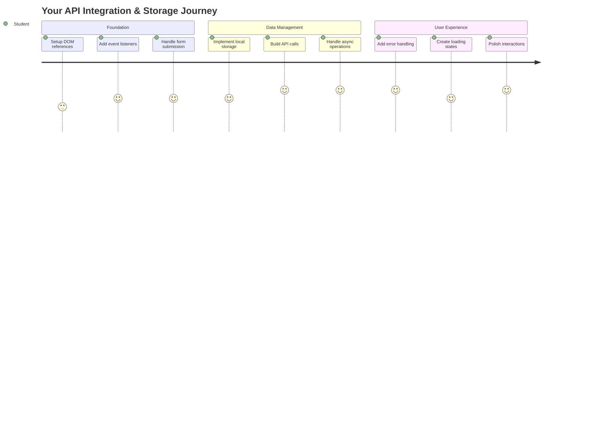
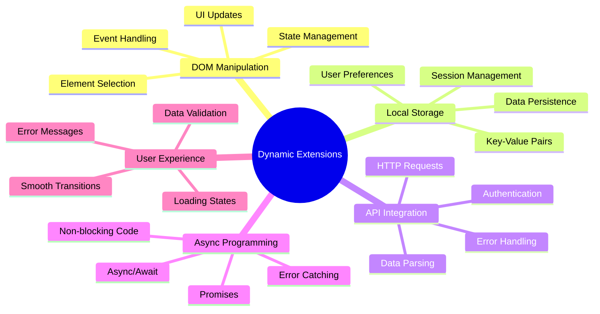
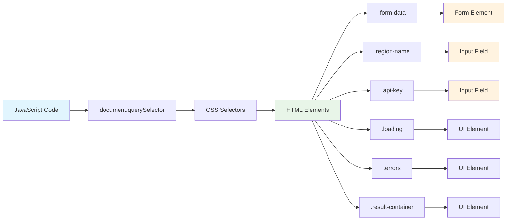
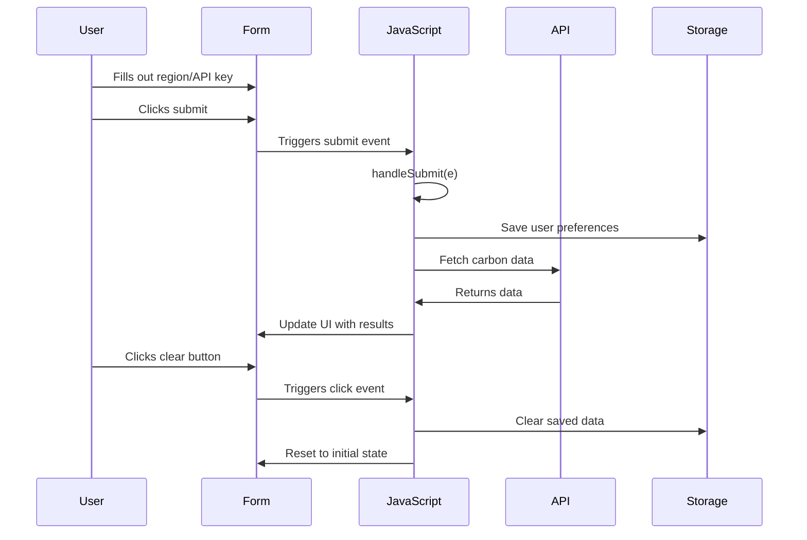
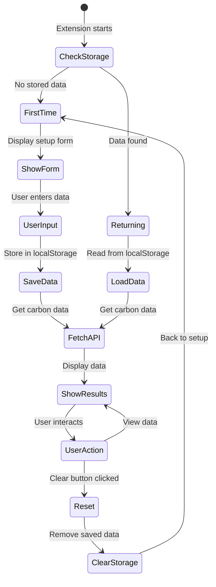
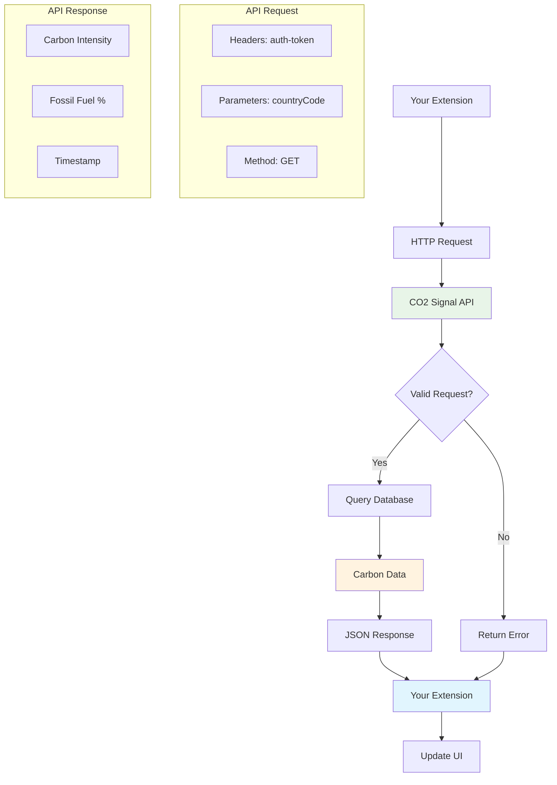
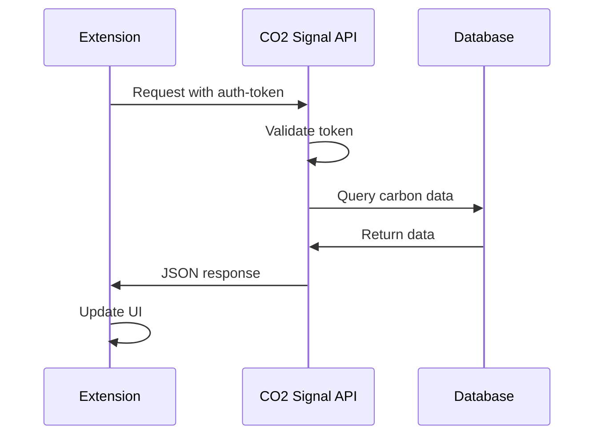
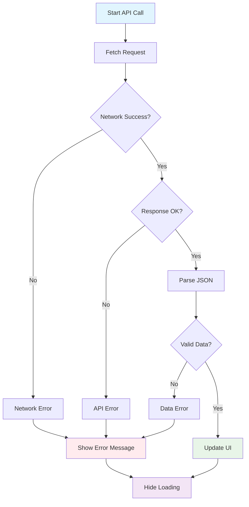
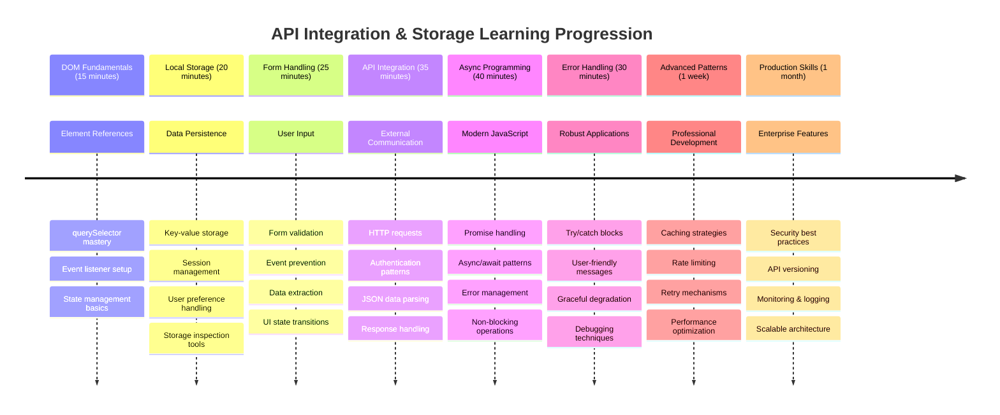

<!--
CO_OP_TRANSLATOR_METADATA:
{
  "original_hash": "2b6203a48c48d8234e0948353b47d84e",
  "translation_date": "2025-11-06T11:36:55+00:00",
  "source_file": "5-browser-extension/2-forms-browsers-local-storage/README.md",
  "language_code": "vi"
}
-->
# Dự án Tiện ích Trình duyệt Phần 2: Gọi API, sử dụng Bộ nhớ Cục bộ



## Câu hỏi trước bài học

[Câu hỏi trước bài học](https://ff-quizzes.netlify.app/web/quiz/25)

## Giới thiệu

Bạn còn nhớ tiện ích trình duyệt mà bạn đã bắt đầu xây dựng không? Hiện tại bạn đã có một biểu mẫu trông đẹp mắt, nhưng nó vẫn chỉ là tĩnh. Hôm nay chúng ta sẽ làm cho nó sống động bằng cách kết nối với dữ liệu thực và cung cấp khả năng ghi nhớ.

Hãy nghĩ về các máy tính điều khiển nhiệm vụ Apollo - chúng không chỉ hiển thị thông tin cố định. Chúng liên tục giao tiếp với tàu vũ trụ, cập nhật dữ liệu từ xa và ghi nhớ các thông số quan trọng của nhiệm vụ. Đó là loại hành vi động mà chúng ta sẽ xây dựng hôm nay. Tiện ích của bạn sẽ truy cập internet, lấy dữ liệu môi trường thực và ghi nhớ cài đặt của bạn cho lần sử dụng tiếp theo.

Việc tích hợp API có thể nghe có vẻ phức tạp, nhưng thực chất chỉ là dạy mã của bạn cách giao tiếp với các dịch vụ khác. Cho dù bạn đang lấy dữ liệu thời tiết, nguồn cấp dữ liệu mạng xã hội hay thông tin về dấu chân carbon như chúng ta sẽ làm hôm nay, tất cả đều xoay quanh việc thiết lập các kết nối kỹ thuật số này. Chúng ta cũng sẽ khám phá cách trình duyệt có thể lưu trữ thông tin - tương tự như cách các thư viện sử dụng danh mục thẻ để ghi nhớ vị trí của sách.

Kết thúc bài học này, bạn sẽ có một tiện ích trình duyệt có thể lấy dữ liệu thực, lưu trữ tùy chọn của người dùng và cung cấp trải nghiệm mượt mà. Hãy bắt đầu nào!



✅ Làm theo các đoạn mã được đánh số trong các tệp tương ứng để biết nơi đặt mã của bạn

## Thiết lập các phần tử để thao tác trong tiện ích

Trước khi JavaScript của bạn có thể thao tác giao diện, nó cần tham chiếu đến các phần tử HTML cụ thể. Hãy nghĩ về nó như một kính thiên văn cần được hướng vào các ngôi sao cụ thể - trước khi Galileo có thể nghiên cứu các mặt trăng của sao Mộc, ông phải định vị và tập trung vào chính sao Mộc.

Trong tệp `index.js` của bạn, chúng ta sẽ tạo các biến `const` để lưu trữ tham chiếu đến từng phần tử biểu mẫu quan trọng. Điều này tương tự như cách các nhà khoa học gắn nhãn thiết bị của họ - thay vì tìm kiếm toàn bộ phòng thí nghiệm mỗi lần, họ có thể truy cập trực tiếp vào những gì họ cần.



```javascript
// form fields
const form = document.querySelector('.form-data');
const region = document.querySelector('.region-name');
const apiKey = document.querySelector('.api-key');

// results
const errors = document.querySelector('.errors');
const loading = document.querySelector('.loading');
const results = document.querySelector('.result-container');
const usage = document.querySelector('.carbon-usage');
const fossilfuel = document.querySelector('.fossil-fuel');
const myregion = document.querySelector('.my-region');
const clearBtn = document.querySelector('.clear-btn');
```

**Đây là những gì đoạn mã này làm:**
- **Lưu trữ** các phần tử biểu mẫu bằng cách sử dụng `document.querySelector()` với các bộ chọn lớp CSS
- **Tạo** các tham chiếu đến các trường nhập liệu cho tên khu vực và khóa API
- **Thiết lập** kết nối với các phần tử hiển thị kết quả cho dữ liệu sử dụng carbon
- **Cài đặt** quyền truy cập vào các phần tử giao diện người dùng như chỉ báo tải và thông báo lỗi
- **Lưu trữ** mỗi tham chiếu phần tử trong một biến `const` để dễ dàng tái sử dụng trong mã của bạn

## Thêm các trình lắng nghe sự kiện

Bây giờ chúng ta sẽ làm cho tiện ích của bạn phản hồi các hành động của người dùng. Các trình lắng nghe sự kiện là cách mã của bạn theo dõi các tương tác của người dùng. Hãy nghĩ về chúng như các nhân viên trực tổng đài trong các trao đổi điện thoại đầu tiên - họ lắng nghe các cuộc gọi đến và kết nối các mạch đúng khi ai đó muốn thực hiện một kết nối.



```javascript
form.addEventListener('submit', (e) => handleSubmit(e));
clearBtn.addEventListener('click', (e) => reset(e));
init();
```

**Hiểu các khái niệm này:**
- **Gắn** một trình lắng nghe gửi đến biểu mẫu kích hoạt khi người dùng nhấn Enter hoặc nhấp vào gửi
- **Kết nối** một trình lắng nghe nhấp chuột vào nút xóa để đặt lại biểu mẫu
- **Truyền** đối tượng sự kiện `(e)` đến các hàm xử lý để kiểm soát thêm
- **Gọi** hàm `init()` ngay lập tức để thiết lập trạng thái ban đầu của tiện ích

✅ Lưu ý cú pháp hàm mũi tên rút gọn được sử dụng ở đây. Cách tiếp cận JavaScript hiện đại này gọn gàng hơn so với các biểu thức hàm truyền thống, nhưng cả hai đều hoạt động tốt như nhau!

### 🔄 **Kiểm tra sư phạm**
**Hiểu xử lý sự kiện**: Trước khi chuyển sang khởi tạo, hãy đảm bảo bạn có thể:
- ✅ Giải thích cách `addEventListener` kết nối các hành động của người dùng với các hàm JavaScript
- ✅ Hiểu tại sao chúng ta truyền đối tượng sự kiện `(e)` đến các hàm xử lý
- ✅ Nhận biết sự khác biệt giữa các sự kiện `submit` và `click`
- ✅ Mô tả khi nào hàm `init()` chạy và tại sao

**Kiểm tra nhanh bản thân**: Điều gì sẽ xảy ra nếu bạn quên `e.preventDefault()` trong một lần gửi biểu mẫu?
*Trả lời: Trang sẽ tải lại, mất tất cả trạng thái JavaScript và làm gián đoạn trải nghiệm người dùng*

## Xây dựng các hàm khởi tạo và đặt lại

Hãy tạo logic khởi tạo cho tiện ích của bạn. Hàm `init()` giống như hệ thống điều hướng của một con tàu kiểm tra các thiết bị của nó - nó xác định trạng thái hiện tại và điều chỉnh giao diện cho phù hợp. Nó kiểm tra xem ai đó đã sử dụng tiện ích của bạn trước đây chưa và tải các cài đặt trước của họ.

Hàm `reset()` cung cấp cho người dùng một khởi đầu mới - tương tự như cách các nhà khoa học đặt lại thiết bị của họ giữa các thí nghiệm để đảm bảo dữ liệu sạch.

```javascript
function init() {
	// Check if user has previously saved API credentials
	const storedApiKey = localStorage.getItem('apiKey');
	const storedRegion = localStorage.getItem('regionName');

	// Set extension icon to generic green (placeholder for future lesson)
	// TODO: Implement icon update in next lesson

	if (storedApiKey === null || storedRegion === null) {
		// First-time user: show the setup form
		form.style.display = 'block';
		results.style.display = 'none';
		loading.style.display = 'none';
		clearBtn.style.display = 'none';
		errors.textContent = '';
	} else {
		// Returning user: load their saved data automatically
		displayCarbonUsage(storedApiKey, storedRegion);
		results.style.display = 'none';
		form.style.display = 'none';
		clearBtn.style.display = 'block';
	}
}

function reset(e) {
	e.preventDefault();
	// Clear stored region to allow user to choose a new location
	localStorage.removeItem('regionName');
	// Restart the initialization process
	init();
}
```

**Phân tích những gì xảy ra ở đây:**
- **Lấy** khóa API và khu vực được lưu trữ từ bộ nhớ cục bộ của trình duyệt
- **Kiểm tra** xem đây có phải là người dùng lần đầu (không có thông tin đăng nhập được lưu trữ) hay người dùng quay lại
- **Hiển thị** biểu mẫu thiết lập cho người dùng mới và ẩn các phần tử giao diện khác
- **Tải** dữ liệu đã lưu tự động cho người dùng quay lại và hiển thị tùy chọn đặt lại
- **Quản lý** trạng thái giao diện người dùng dựa trên dữ liệu có sẵn

**Các khái niệm chính về Bộ nhớ Cục bộ:**
- **Lưu trữ** dữ liệu giữa các phiên trình duyệt (khác với bộ nhớ phiên)
- **Lưu trữ** dữ liệu dưới dạng cặp khóa-giá trị bằng cách sử dụng `getItem()` và `setItem()`
- **Trả về** `null` khi không có dữ liệu tồn tại cho một khóa nhất định
- **Cung cấp** cách đơn giản để ghi nhớ tùy chọn và cài đặt của người dùng

> 💡 **Hiểu Bộ nhớ Trình duyệt**: [LocalStorage](https://developer.mozilla.org/docs/Web/API/Window/localStorage) giống như việc cung cấp cho tiện ích của bạn bộ nhớ lâu dài. Hãy xem xét cách Thư viện Alexandria cổ đại lưu trữ các cuộn giấy - thông tin vẫn có sẵn ngay cả khi các học giả rời đi và quay lại.
>
> **Đặc điểm chính:**
> - **Lưu trữ** dữ liệu ngay cả sau khi bạn đóng trình duyệt
> - **Tồn tại** sau khi khởi động lại máy tính và trình duyệt bị treo
> - **Cung cấp** không gian lưu trữ đáng kể cho tùy chọn của người dùng
> - **Truy cập** ngay lập tức mà không có độ trễ mạng

> **Lưu ý quan trọng**: Tiện ích trình duyệt của bạn có bộ nhớ cục bộ riêng biệt, tách biệt với các trang web thông thường. Điều này cung cấp bảo mật và ngăn chặn xung đột với các trang web khác.

Bạn có thể xem dữ liệu đã lưu của mình bằng cách mở Công cụ dành cho nhà phát triển của trình duyệt (F12), điều hướng đến tab **Application**, và mở rộng phần **Local Storage**.




> ⚠️ **Cân nhắc về bảo mật**: Trong các ứng dụng sản xuất, việc lưu trữ khóa API trong LocalStorage gây rủi ro bảo mật vì JavaScript có thể truy cập dữ liệu này. Đối với mục đích học tập, cách tiếp cận này hoạt động tốt, nhưng các ứng dụng thực tế nên sử dụng lưu trữ phía máy chủ an toàn cho thông tin đăng nhập nhạy cảm.

## Xử lý gửi biểu mẫu

Bây giờ chúng ta sẽ xử lý những gì xảy ra khi ai đó gửi biểu mẫu của bạn. Theo mặc định, trình duyệt tải lại trang khi biểu mẫu được gửi, nhưng chúng ta sẽ chặn hành vi này để tạo trải nghiệm mượt mà hơn.

Cách tiếp cận này giống như cách điều khiển nhiệm vụ xử lý giao tiếp với tàu vũ trụ - thay vì đặt lại toàn bộ hệ thống cho mỗi lần truyền, họ duy trì hoạt động liên tục trong khi xử lý thông tin mới.

Tạo một hàm để lưu trữ sự kiện gửi biểu mẫu và trích xuất đầu vào của người dùng:

```javascript
function handleSubmit(e) {
	e.preventDefault();
	setUpUser(apiKey.value, region.value);
}
```

**Trong đoạn mã trên, chúng ta đã:**
- **Ngăn chặn** hành vi gửi biểu mẫu mặc định sẽ làm mới trang
- **Trích xuất** giá trị đầu vào của người dùng từ các trường khóa API và khu vực
- **Truyền** dữ liệu biểu mẫu đến hàm `setUpUser()` để xử lý
- **Duy trì** hành vi ứng dụng một trang bằng cách tránh tải lại trang

✅ Hãy nhớ rằng các trường biểu mẫu HTML của bạn bao gồm thuộc tính `required`, vì vậy trình duyệt tự động xác thực rằng người dùng cung cấp cả khóa API và khu vực trước khi hàm này chạy.

## Thiết lập tùy chọn người dùng

Hàm `setUpUser` chịu trách nhiệm lưu thông tin đăng nhập của người dùng và bắt đầu cuộc gọi API đầu tiên. Điều này tạo ra một sự chuyển đổi mượt mà từ thiết lập sang hiển thị kết quả.

```javascript
function setUpUser(apiKey, regionName) {
	// Save user credentials for future sessions
	localStorage.setItem('apiKey', apiKey);
	localStorage.setItem('regionName', regionName);
	
	// Update UI to show loading state
	loading.style.display = 'block';
	errors.textContent = '';
	clearBtn.style.display = 'block';
	
	// Fetch carbon usage data with user's credentials
	displayCarbonUsage(apiKey, regionName);
}
```

**Từng bước, đây là những gì xảy ra:**
- **Lưu** khóa API và tên khu vực vào bộ nhớ cục bộ để sử dụng trong tương lai
- **Hiển thị** chỉ báo tải để thông báo cho người dùng rằng dữ liệu đang được lấy
- **Xóa** bất kỳ thông báo lỗi nào trước đó khỏi màn hình
- **Hiển thị** nút xóa để người dùng đặt lại cài đặt sau này
- **Khởi động** cuộc gọi API để lấy dữ liệu sử dụng carbon thực

Hàm này tạo ra trải nghiệm người dùng liền mạch bằng cách quản lý cả lưu trữ dữ liệu và cập nhật giao diện người dùng trong một hành động phối hợp.

## Hiển thị dữ liệu sử dụng carbon

Bây giờ chúng ta sẽ kết nối tiện ích của bạn với các nguồn dữ liệu bên ngoài thông qua API. Điều này biến tiện ích của bạn từ một công cụ độc lập thành một thứ có thể truy cập thông tin thời gian thực từ khắp nơi trên internet.

**Hiểu API**

[API](https://www.webopedia.com/TERM/A/API.html) là cách các ứng dụng khác nhau giao tiếp với nhau. Hãy nghĩ về chúng như hệ thống điện báo kết nối các thành phố xa xôi vào thế kỷ 19 - các nhân viên sẽ gửi yêu cầu đến các trạm xa và nhận phản hồi với thông tin yêu cầu. Mỗi lần bạn kiểm tra mạng xã hội, hỏi trợ lý giọng nói một câu hỏi, hoặc sử dụng ứng dụng giao hàng, API đang tạo điều kiện cho các trao đổi dữ liệu này.



**Các khái niệm chính về REST API:**
- **REST** là viết tắt của 'Representational State Transfer'
- **Sử dụng** các phương thức HTTP tiêu chuẩn (GET, POST, PUT, DELETE) để tương tác với dữ liệu
- **Trả về** dữ liệu theo định dạng dự đoán, thường là JSON
- **Cung cấp** các điểm cuối URL nhất quán cho các loại yêu cầu khác nhau

✅ [API CO2 Signal](https://www.co2signal.com/) mà chúng ta sẽ sử dụng cung cấp dữ liệu cường độ carbon thời gian thực từ các lưới điện trên toàn thế giới. Điều này giúp người dùng hiểu tác động môi trường của việc sử dụng điện của họ!

> 💡 **Hiểu JavaScript không đồng bộ**: Từ khóa [`async`](https://developer.mozilla.org/docs/Web/JavaScript/Reference/Statements/async_function) cho phép mã của bạn xử lý nhiều hoạt động đồng thời. Khi bạn yêu cầu dữ liệu từ máy chủ, bạn không muốn toàn bộ tiện ích của mình bị đóng băng - điều đó giống như kiểm soát không lưu dừng tất cả các hoạt động trong khi chờ một máy bay phản hồi.
>
> **Lợi ích chính:**
> - **Duy trì** sự phản hồi của tiện ích trong khi dữ liệu đang tải
> - **Cho phép** mã khác tiếp tục thực thi trong khi yêu cầu mạng
> - **Cải thiện** khả năng đọc mã so với các mẫu callback truyền thống
> - **Cho phép** xử lý lỗi một cách duyên dáng cho các vấn đề mạng

Đây là một video nhanh về `async`:

[](https://youtube.com/watch?v=YwmlRkrxvkk "Async và Await để quản lý promises")

> 🎥 Nhấp vào hình ảnh trên để xem video về async/await.

### 🔄 **Kiểm tra sư phạm**
**Hiểu lập trình không đồng bộ**: Trước khi đi sâu vào hàm API, hãy xác minh rằng bạn hiểu:
- ✅ Tại sao chúng ta sử dụng `async/await` thay vì chặn toàn bộ tiện ích
- ✅ Cách các khối `try/catch` xử lý lỗi mạng một cách duyên dáng
- ✅ Sự khác biệt giữa các hoạt động đồng bộ và không đồng bộ
- ✅ Tại sao các cuộc gọi API có thể thất bại và cách xử lý những thất bại đó

**Kết nối thực tế**: Hãy xem xét các ví dụ không đồng bộ hàng ngày này:
- **Đặt đồ ăn**: Bạn không chờ ở bếp - bạn nhận hóa đơn và tiếp tục các hoạt động khác
- **Gửi email**: Ứng dụng email của bạn không bị đóng băng khi gửi - bạn có thể soạn thêm email
- **Tải trang web**: Hình ảnh tải dần trong khi bạn đã có thể đọc văn bản

**Luồng xác thực API**:


Tạo hàm để lấy và hiển thị dữ liệu sử dụng carbon:

```javascript
// Modern fetch API approach (no external dependencies needed)
async function displayCarbonUsage(apiKey, region) {
	try {
		// Fetch carbon intensity data from CO2 Signal API
		const response = await fetch('https://api.co2signal.com/v1/latest', {
			method: 'GET',
			headers: {
				'auth-token': apiKey,
				'Content-Type': 'application/json'
			},
			// Add query parameters for the specific region
			...new URLSearchParams({ countryCode: region }) && {
				url: `https://api.co2signal.com/v1/latest?countryCode=${region}`
			}
		});

		// Check if the API request was successful
		if (!response.ok) {
			throw new Error(`API request failed: ${response.status}`);
		}

		const data = await response.json();
		const carbonData = data.data;

		// Calculate rounded carbon intensity value
		const carbonIntensity = Math.round(carbonData.carbonIntensity);

		// Update the user interface with fetched data
		loading.style.display = 'none';
		form.style.display = 'none';
		myregion.textContent = region.toUpperCase();
		usage.textContent = `${carbonIntensity} grams (grams CO₂ emitted per kilowatt hour)`;
		fossilfuel.textContent = `${carbonData.fossilFuelPercentage.toFixed(2)}% (percentage of fossil fuels used to generate electricity)`;
		results.style.display = 'block';

		// TODO: calculateColor(carbonIntensity) - implement in next lesson

	} catch (error) {
		console.error('Error fetching carbon data:', error);
		
		// Show user-friendly error message
		loading.style.display = 'none';
		results.style.display = 'none';
		errors.textContent = 'Sorry, we couldn\'t fetch data for that region. Please check your API key and region code.';
	}
}
```

**Phân tích những gì xảy ra ở đây:**
- **Sử dụng** API `fetch()` hiện đại thay vì các thư viện bên ngoài như Axios để có mã sạch hơn, không phụ thuộc
- **Thực hiện** kiểm tra lỗi đúng cách với `response.ok` để bắt lỗi API sớm
- **Xử lý** các hoạt động không đồng bộ với `async/await` để có luồng mã dễ đọc hơn
- **Xác thực** với API CO2 Signal bằng cách sử dụng tiêu đề `auth-token`
- **Phân tích** dữ liệu phản hồi JSON và trích xuất thông tin cường độ carbon
- **Cập nhật** nhiều phần tử giao diện người dùng với dữ liệu môi trường được định dạng
- **Cung cấp** thông báo lỗi thân thiện với người dùng khi các cuộc gọi API thất bại

**Các khái niệm JavaScript hiện đại được minh họa:**
- **Biểu mẫu mẫu** với cú pháp `${}` để định dạng chuỗi sạch
- **Xử lý lỗi** với các khối try/catch để có ứng dụng mạnh mẽ
- **Mẫu async/await** để xử lý yêu cầu mạng một cách duyên dáng
- **Phân rã đối tượng** để trích xuất dữ liệu cụ thể từ phản hồi API
- **Chuỗi phương thức** cho nhiều thao tác DOM

✅ Hàm này minh họa một số khái niệm phát triển web quan trọng - giao tiếp với máy chủ bên ngoài, xử lý xác thực, xử lý dữ liệu, cập nhật giao diện, và quản lý lỗi một cách duyên dáng. Đây là những kỹ năng cơ bản mà các nhà phát triển chuyên nghiệp sử dụng thường xuyên.



### 🔄 **Kiểm tra sư phạm**
**Hiểu hệ thống hoàn chỉnh**: Xác minh sự thành thạo của bạn về toàn bộ luồng:
- ✅ Cách các tham chiếu DOM cho phép JavaScript kiểm soát giao diện
- ✅ Tại sao bộ nhớ cục bộ tạo ra sự lưu trữ giữa các phiên trình duyệt
- ✅ Cách async/await thực hiện các cuộc gọi API mà không làm đóng băng tiện ích
- ✅ Điều gì xảy ra khi các cuộc gọi API thất bại và cách xử lý lỗi
- ✅ Tại sao trải nghiệm người dùng bao gồm trạng thái tải và thông báo lỗi

🎉 **Những gì bạn đã hoàn thành:** Bạn đã tạo một tiện ích trình duyệt:
- **Kết nối** với internet và lấy dữ liệu môi trường thực
- **Lưu trữ** cài đặt của người dùng giữa các phiên
- **Xử lý** lỗi một cách duyên dáng thay vì bị treo
- **Cung cấp** trải nghiệm người dùng mượt mà, chuyên nghiệp

Kiểm tra công việc của bạn bằng cách chạy `npm run build` và làm mới tiện ích của bạn trong trình duyệt. Bây giờ bạn đã có một công cụ theo dõi dấu chân carbon hoạt động. Bài học tiếp theo sẽ thêm chức năng biểu tượng động để hoàn thiện tiện ích.

---

## Thử thách GitHub Copilot Agent 🚀

Sử dụng chế độ Agent để hoàn
**Mô tả:** Nâng cấp tiện ích mở rộng trình duyệt bằng cách cải thiện xử lý lỗi và các tính năng trải nghiệm người dùng. Thử thách này sẽ giúp bạn thực hành làm việc với API, lưu trữ cục bộ và thao tác DOM bằng các mẫu JavaScript hiện đại.

**Yêu cầu:** Tạo phiên bản nâng cao của hàm displayCarbonUsage bao gồm: 1) Cơ chế thử lại cho các lần gọi API thất bại với chiến lược backoff theo cấp số nhân, 2) Xác thực đầu vào cho mã vùng trước khi thực hiện gọi API, 3) Hoạt ảnh tải với các chỉ báo tiến trình, 4) Bộ nhớ đệm các phản hồi API trong localStorage với dấu thời gian hết hạn (bộ nhớ đệm trong 30 phút), và 5) Tính năng hiển thị dữ liệu lịch sử từ các lần gọi API trước đó. Ngoài ra, thêm các chú thích JSDoc theo kiểu TypeScript để tài liệu hóa tất cả các tham số hàm và kiểu trả về.

Tìm hiểu thêm về [agent mode](https://code.visualstudio.com/blogs/2025/02/24/introducing-copilot-agent-mode) tại đây.

## 🚀 Thử thách

Mở rộng hiểu biết của bạn về API bằng cách khám phá sự phong phú của các API trình duyệt có sẵn cho phát triển web. Chọn một trong các API trình duyệt này và xây dựng một bản demo nhỏ:

- [Geolocation API](https://developer.mozilla.org/docs/Web/API/Geolocation_API) - Lấy vị trí hiện tại của người dùng
- [Notification API](https://developer.mozilla.org/docs/Web/API/Notifications_API) - Gửi thông báo trên máy tính
- [HTML Drag and Drop API](https://developer.mozilla.org/docs/Web/API/HTML_Drag_and_Drop_API) - Tạo giao diện kéo thả tương tác
- [Web Storage API](https://developer.mozilla.org/docs/Web/API/Web_Storage_API) - Kỹ thuật lưu trữ cục bộ nâng cao
- [Fetch API](https://developer.mozilla.org/docs/Web/API/Fetch_API) - Thay thế hiện đại cho XMLHttpRequest

**Các câu hỏi nghiên cứu cần xem xét:**
- API này giải quyết những vấn đề thực tế nào?
- API xử lý lỗi và các trường hợp ngoại lệ như thế nào?
- Những cân nhắc về bảo mật nào tồn tại khi sử dụng API này?
- API này được hỗ trợ rộng rãi như thế nào trên các trình duyệt khác nhau?

Sau khi nghiên cứu, xác định những đặc điểm nào làm cho một API thân thiện với nhà phát triển và đáng tin cậy.

## Câu hỏi kiểm tra sau bài học

[Câu hỏi kiểm tra sau bài học](https://ff-quizzes.netlify.app/web/quiz/26)

## Ôn tập & Tự học

Bạn đã học về LocalStorage và API trong bài học này, cả hai đều rất hữu ích cho nhà phát triển web chuyên nghiệp. Bạn có thể nghĩ về cách hai điều này hoạt động cùng nhau không? Hãy nghĩ về cách bạn sẽ thiết kế một trang web lưu trữ các mục để sử dụng bởi một API.

### ⚡ **Những việc bạn có thể làm trong 5 phút tới**
- [ ] Mở tab Ứng dụng trong DevTools và khám phá localStorage trên bất kỳ trang web nào
- [ ] Tạo một biểu mẫu HTML đơn giản và kiểm tra xác thực biểu mẫu trong trình duyệt
- [ ] Thử lưu trữ và truy xuất dữ liệu bằng localStorage trong bảng điều khiển trình duyệt
- [ ] Kiểm tra dữ liệu biểu mẫu được gửi bằng cách sử dụng tab Mạng

### 🎯 **Những việc bạn có thể hoàn thành trong giờ tới**
- [ ] Hoàn thành bài kiểm tra sau bài học và hiểu các khái niệm xử lý biểu mẫu
- [ ] Xây dựng một biểu mẫu tiện ích mở rộng trình duyệt lưu cài đặt người dùng
- [ ] Triển khai xác thực biểu mẫu phía máy khách với các thông báo lỗi hữu ích
- [ ] Thực hành sử dụng API chrome.storage để lưu trữ dữ liệu tiện ích mở rộng
- [ ] Tạo giao diện người dùng phản hồi với các cài đặt đã lưu của người dùng

### 📅 **Xây dựng tiện ích mở rộng trong tuần**
- [ ] Hoàn thành một tiện ích mở rộng trình duyệt đầy đủ chức năng với tính năng biểu mẫu
- [ ] Làm chủ các tùy chọn lưu trữ khác nhau: local, sync, và session storage
- [ ] Triển khai các tính năng biểu mẫu nâng cao như tự động hoàn thành và xác thực
- [ ] Thêm chức năng nhập/xuất dữ liệu người dùng
- [ ] Kiểm tra tiện ích mở rộng của bạn kỹ lưỡng trên các trình duyệt khác nhau
- [ ] Tinh chỉnh trải nghiệm người dùng và xử lý lỗi của tiện ích mở rộng

### 🌟 **Làm chủ Web API trong tháng**
- [ ] Xây dựng các ứng dụng phức tạp sử dụng nhiều API lưu trữ trình duyệt
- [ ] Tìm hiểu về các mẫu phát triển ưu tiên ngoại tuyến
- [ ] Đóng góp cho các dự án mã nguồn mở liên quan đến lưu trữ dữ liệu
- [ ] Làm chủ phát triển tập trung vào quyền riêng tư và tuân thủ GDPR
- [ ] Tạo thư viện tái sử dụng cho xử lý biểu mẫu và quản lý dữ liệu
- [ ] Chia sẻ kiến thức về Web API và phát triển tiện ích mở rộng

## 🎯 Lộ trình làm chủ phát triển tiện ích mở rộng của bạn



### 🛠️ Tóm tắt bộ công cụ phát triển Full-Stack của bạn

Sau khi hoàn thành bài học này, bạn đã có:
- **Làm chủ DOM**: Nhắm mục tiêu và thao tác chính xác các phần tử
- **Chuyên gia lưu trữ**: Quản lý dữ liệu bền vững với localStorage
- **Tích hợp API**: Lấy dữ liệu thời gian thực và xác thực
- **Lập trình bất đồng bộ**: Các hoạt động không chặn với JavaScript hiện đại
- **Xử lý lỗi**: Ứng dụng mạnh mẽ xử lý lỗi một cách duyên dáng
- **Trải nghiệm người dùng**: Trạng thái tải, xác thực, và tương tác mượt mà
- **Mẫu hiện đại**: fetch API, async/await, và các tính năng ES6+

**Kỹ năng chuyên nghiệp đạt được**: Bạn đã triển khai các mẫu được sử dụng trong:
- **Ứng dụng web**: Ứng dụng một trang với các nguồn dữ liệu bên ngoài
- **Phát triển di động**: Ứng dụng dựa trên API với khả năng ngoại tuyến
- **Phần mềm máy tính**: Ứng dụng Electron với lưu trữ bền vững
- **Hệ thống doanh nghiệp**: Xác thực, bộ nhớ đệm, và xử lý lỗi
- **Framework hiện đại**: Các mẫu quản lý dữ liệu React/Vue/Angular

**Cấp độ tiếp theo**: Bạn đã sẵn sàng khám phá các chủ đề nâng cao như chiến lược bộ nhớ đệm, kết nối WebSocket thời gian thực, hoặc quản lý trạng thái phức tạp!

## Bài tập

[Adopt an API](assignment.md)

---

**Tuyên bố miễn trừ trách nhiệm**:  
Tài liệu này đã được dịch bằng dịch vụ dịch thuật AI [Co-op Translator](https://github.com/Azure/co-op-translator). Mặc dù chúng tôi cố gắng đảm bảo độ chính xác, xin lưu ý rằng các bản dịch tự động có thể chứa lỗi hoặc không chính xác. Tài liệu gốc bằng ngôn ngữ bản địa nên được coi là nguồn thông tin chính xác nhất. Đối với thông tin quan trọng, chúng tôi khuyến nghị sử dụng dịch vụ dịch thuật chuyên nghiệp từ con người. Chúng tôi không chịu trách nhiệm cho bất kỳ sự hiểu lầm hoặc diễn giải sai nào phát sinh từ việc sử dụng bản dịch này.