# Dự án Tiện ích Trình duyệt Phần 3: Tìm hiểu về Nhiệm vụ Nền và Hiệu suất

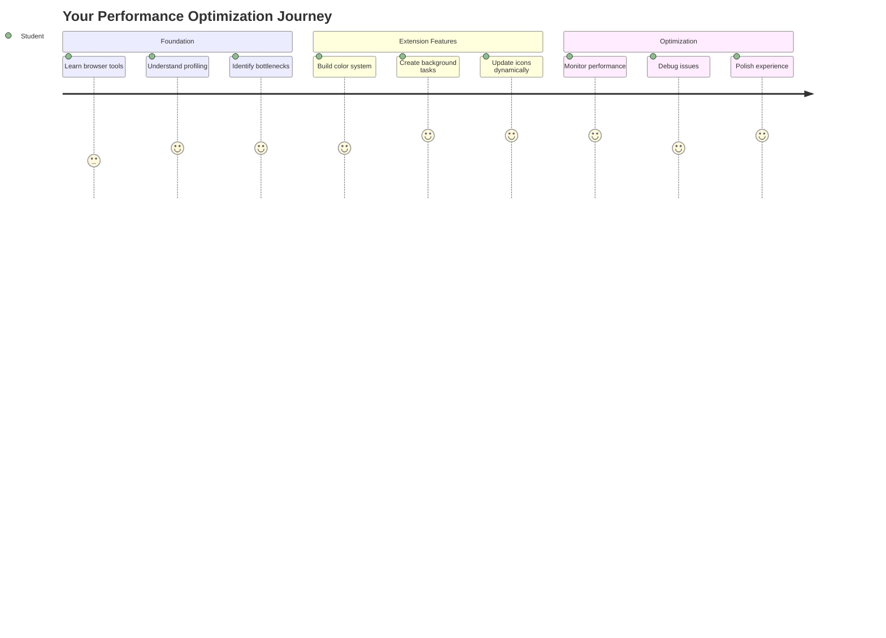

Bạn có bao giờ thắc mắc tại sao một số tiện ích trình duyệt lại hoạt động nhanh nhạy và phản hồi tốt, trong khi những tiện ích khác lại chậm chạp? Bí quyết nằm ở những gì đang diễn ra phía sau. Trong khi người dùng nhấp chuột xung quanh giao diện tiện ích của bạn, có cả một thế giới các quy trình nền đang âm thầm quản lý việc lấy dữ liệu, cập nhật biểu tượng và tài nguyên hệ thống.

Đây là bài học cuối cùng trong loạt bài về tiện ích trình duyệt, và chúng ta sẽ làm cho công cụ theo dõi dấu chân carbon của bạn hoạt động mượt mà. Bạn sẽ thêm các cập nhật biểu tượng động và học cách phát hiện các vấn đề về hiệu suất trước khi chúng trở thành vấn đề lớn. Nó giống như việc điều chỉnh một chiếc xe đua - những tối ưu hóa nhỏ có thể tạo ra sự khác biệt lớn trong cách mọi thứ hoạt động.

Khi hoàn thành, bạn sẽ có một tiện ích được hoàn thiện và hiểu rõ các nguyên tắc hiệu suất giúp phân biệt giữa ứng dụng web tốt và ứng dụng web tuyệt vời. Hãy cùng khám phá thế giới tối ưu hóa trình duyệt.

## Câu hỏi trước bài học

[Quiz trước bài học](https://ff-quizzes.netlify.app/web/quiz/27)

### Giới thiệu

Trong các bài học trước, bạn đã xây dựng một biểu mẫu, kết nối nó với API, và xử lý việc lấy dữ liệu không đồng bộ. Tiện ích của bạn đang dần hình thành một cách tốt đẹp.

Bây giờ chúng ta cần thêm những chi tiết cuối cùng - như làm cho biểu tượng tiện ích thay đổi màu sắc dựa trên dữ liệu carbon. Điều này làm tôi nhớ đến cách NASA phải tối ưu hóa mọi hệ thống trên tàu vũ trụ Apollo. Họ không thể lãng phí bất kỳ chu kỳ hay bộ nhớ nào vì hiệu suất quyết định đến sự sống còn. Mặc dù tiện ích trình duyệt của chúng ta không quan trọng đến mức đó, nhưng các nguyên tắc tương tự vẫn áp dụng - mã hiệu quả tạo ra trải nghiệm người dùng tốt hơn.

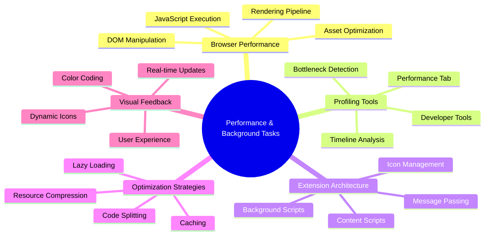

## Những điều cơ bản về hiệu suất web

Khi mã của bạn chạy hiệu quả, mọi người thực sự *cảm nhận* được sự khác biệt. Bạn biết khoảnh khắc khi một trang tải ngay lập tức hoặc một hoạt ảnh chạy mượt mà? Đó là hiệu suất tốt đang hoạt động.

Hiệu suất không chỉ là về tốc độ - nó là về việc tạo ra trải nghiệm web tự nhiên thay vì cồng kềnh và gây khó chịu. Vào những ngày đầu của máy tính, Grace Hopper nổi tiếng giữ một nanosecond (một đoạn dây dài khoảng một foot) trên bàn làm việc để minh họa khoảng cách ánh sáng đi được trong một phần tỷ giây. Đó là cách bà giải thích tại sao mỗi microsecond đều quan trọng trong tính toán. Hãy khám phá các công cụ điều tra giúp bạn tìm ra điều gì đang làm chậm mọi thứ.

> "Hiệu suất trang web là về hai điều: tốc độ tải trang và tốc độ chạy mã trên đó." -- [Zack Grossbart](https://www.smashingmagazine.com/2012/06/javascript-profiling-chrome-developer-tools/)

Chủ đề về cách làm cho trang web của bạn nhanh chóng trên mọi loại thiết bị, cho mọi loại người dùng, trong mọi tình huống, không ngạc nhiên là rất rộng lớn. Dưới đây là một số điểm cần lưu ý khi bạn xây dựng một dự án web tiêu chuẩn hoặc tiện ích trình duyệt.

Bước đầu tiên trong việc tối ưu hóa trang web của bạn là hiểu những gì thực sự đang diễn ra bên trong. May mắn thay, trình duyệt của bạn đi kèm với các công cụ điều tra mạnh mẽ được tích hợp sẵn.

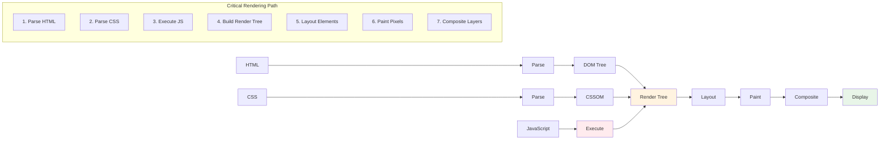

Để mở Developer Tools trong Edge, nhấp vào ba dấu chấm ở góc trên bên phải, sau đó đi đến More Tools > Developer Tools. Hoặc sử dụng phím tắt: `Ctrl` + `Shift` + `I` trên Windows hoặc `Option` + `Command` + `I` trên Mac. Khi đã ở đó, nhấp vào tab Performance - đây là nơi bạn sẽ thực hiện điều tra.

**Bộ công cụ điều tra hiệu suất của bạn:**
- **Mở** Developer Tools (bạn sẽ sử dụng chúng liên tục như một nhà phát triển!)
- **Đi đến** tab Performance - nghĩ về nó như máy theo dõi sức khỏe của ứng dụng web của bạn
- **Nhấn** nút Record và xem trang của bạn hoạt động
- **Nghiên cứu** kết quả để phát hiện điều gì đang làm chậm mọi thứ

Hãy thử điều này. Mở một trang web (Microsoft.com hoạt động tốt cho việc này) và nhấp vào nút 'Record'. Bây giờ làm mới trang và xem profiler ghi lại mọi thứ xảy ra. Khi bạn dừng ghi, bạn sẽ thấy một phân tích chi tiết về cách trình duyệt 'scripts', 'renders', và 'paints' trang web. Nó làm tôi nhớ đến cách trung tâm điều khiển giám sát mọi hệ thống trong một lần phóng tên lửa - bạn nhận được dữ liệu thời gian thực về chính xác những gì đang xảy ra và khi nào.

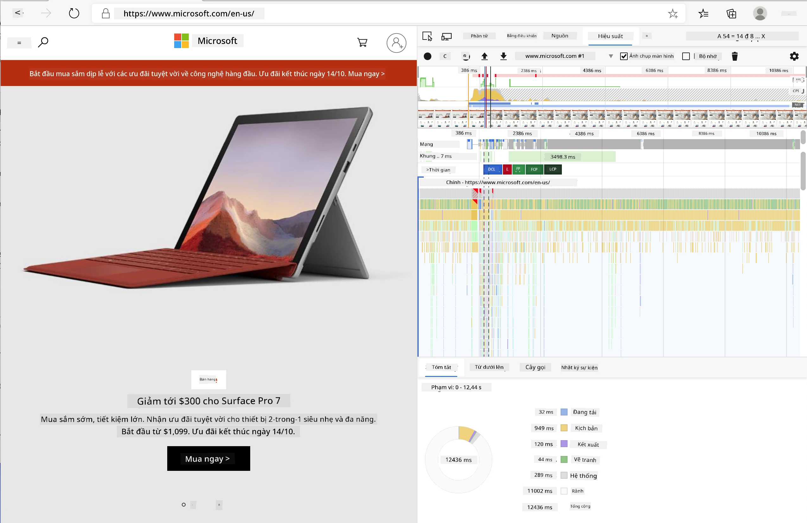

✅ [Tài liệu Microsoft](https://docs.microsoft.com/microsoft-edge/devtools-guide/performance/?WT.mc_id=academic-77807-sagibbon) có rất nhiều chi tiết nếu bạn muốn tìm hiểu sâu hơn

> Mẹo chuyên nghiệp: Xóa bộ nhớ cache của trình duyệt trước khi kiểm tra để xem trang web của bạn hoạt động như thế nào đối với khách truy cập lần đầu - thường rất khác so với những lần truy cập lại!

Chọn các phần của dòng thời gian profile để phóng to các sự kiện xảy ra trong khi trang của bạn tải.

Lấy một ảnh chụp nhanh về hiệu suất trang của bạn bằng cách chọn một phần của dòng thời gian profile và nhìn vào bảng tóm tắt:

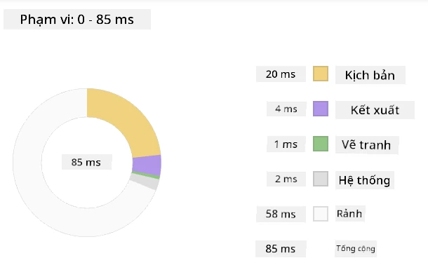

Kiểm tra bảng Event Log để xem liệu có sự kiện nào mất hơn 15 ms:

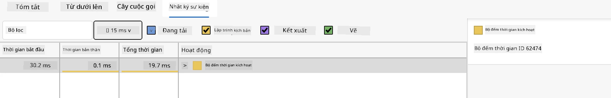

✅ Làm quen với profiler của bạn! Mở công cụ dành cho nhà phát triển trên trang này và xem liệu có bất kỳ nút thắt nào không. Tài nguyên nào tải chậm nhất? Nhanh nhất?

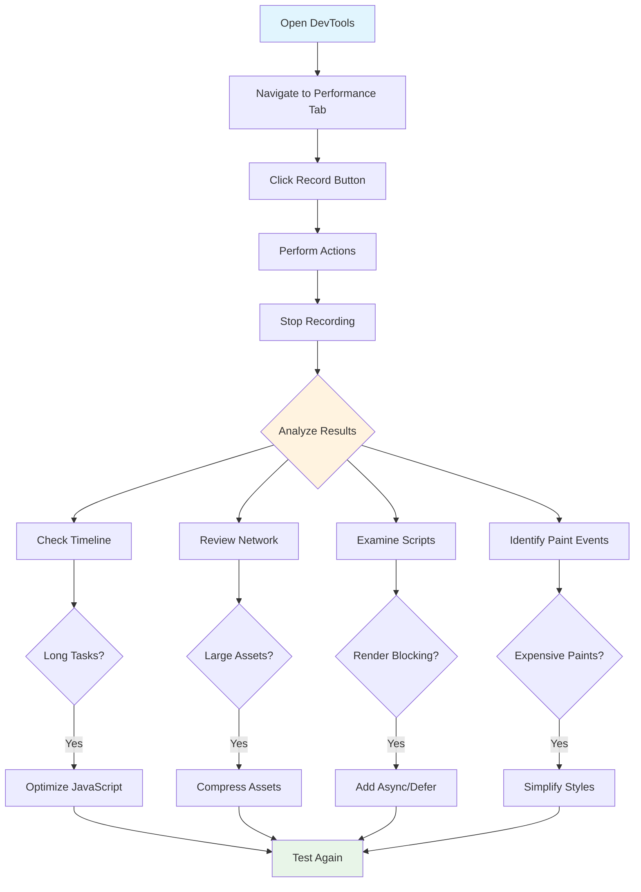

## Những điều cần tìm khi sử dụng profiler

Chạy profiler chỉ là bước đầu tiên - kỹ năng thực sự là biết những biểu đồ đầy màu sắc đó thực sự đang nói gì với bạn. Đừng lo, bạn sẽ quen với việc đọc chúng. Các nhà phát triển có kinh nghiệm đã học cách phát hiện các dấu hiệu cảnh báo trước khi chúng trở thành vấn đề lớn.

Hãy nói về những kẻ gây rắc rối thường gặp - những vấn đề về hiệu suất thường lẻn vào các dự án web. Giống như cách Marie Curie phải cẩn thận theo dõi mức độ phóng xạ trong phòng thí nghiệm của mình, chúng ta cần theo dõi một số mẫu nhất định cho thấy vấn đề đang hình thành. Phát hiện sớm sẽ giúp bạn (và người dùng của bạn) tránh được nhiều sự khó chịu.

**Kích thước tài nguyên**: Các trang web ngày càng trở nên "nặng" hơn qua các năm, và phần lớn trọng lượng thêm đó đến từ hình ảnh. Nó giống như chúng ta đang nhồi nhét ngày càng nhiều vào vali kỹ thuật số của mình.

✅ Xem [Internet Archive](https://httparchive.org/reports/page-weight) để thấy kích thước trang đã tăng lên như thế nào theo thời gian - rất đáng để khám phá.

**Cách giữ tài nguyên của bạn được tối ưu hóa:**
- **Nén** hình ảnh! Các định dạng hiện đại như WebP có thể giảm kích thước tệp đáng kể
- **Cung cấp** kích thước hình ảnh phù hợp cho từng thiết bị - không cần gửi hình ảnh lớn cho điện thoại
- **Giảm thiểu** CSS và JavaScript - từng byte đều quan trọng
- **Sử dụng** lazy loading để hình ảnh chỉ tải xuống khi người dùng thực sự cuộn đến chúng

**DOM traversals**: Trình duyệt phải xây dựng Mô hình Đối tượng Tài liệu (DOM) dựa trên mã bạn viết, vì vậy để có hiệu suất trang tốt, hãy giữ các thẻ của bạn ở mức tối thiểu, chỉ sử dụng và định kiểu những gì trang cần. Đến điểm này, CSS dư thừa liên quan đến một trang có thể được tối ưu hóa; các kiểu chỉ cần sử dụng trên một trang không cần phải được bao gồm trong tệp style chính, ví dụ.

**Chiến lược chính để tối ưu hóa DOM:**
- **Giảm thiểu** số lượng phần tử HTML và mức độ lồng ghép
- **Loại bỏ** các quy tắc CSS không sử dụng và hợp nhất các tệp stylesheet một cách hiệu quả
- **Tổ chức** CSS để chỉ tải những gì cần thiết cho mỗi trang
- **Cấu trúc** HTML một cách có ý nghĩa để trình duyệt phân tích tốt hơn

**JavaScript**: Mỗi nhà phát triển JavaScript nên chú ý đến các script 'render-blocking' phải được tải trước khi phần còn lại của DOM có thể được duyệt và vẽ lên trình duyệt. Hãy cân nhắc sử dụng `defer` với các script nội tuyến của bạn (như đã làm trong module Terrarium).

**Kỹ thuật tối ưu hóa JavaScript hiện đại:**
- **Sử dụng** thuộc tính `defer` để tải script sau khi phân tích DOM
- **Thực hiện** code splitting để chỉ tải JavaScript cần thiết
- **Áp dụng** lazy loading cho các chức năng không quan trọng
- **Giảm thiểu** việc sử dụng các thư viện và framework nặng khi có thể

✅ Thử một số trang web trên [Trang kiểm tra tốc độ trang web](https://www.webpagetest.org/) để tìm hiểu thêm về các kiểm tra phổ biến được thực hiện để xác định hiệu suất trang web.

### 🔄 **Kiểm tra sư phạm**
**Hiểu biết về hiệu suất**: Trước khi xây dựng các tính năng tiện ích, hãy đảm bảo bạn có thể:
- ✅ Giải thích đường dẫn render quan trọng từ HTML đến pixel
- ✅ Xác định các nút thắt hiệu suất phổ biến trong ứng dụng web
- ✅ Sử dụng công cụ dành cho nhà phát triển trình duyệt để profile hiệu suất trang
- ✅ Hiểu cách kích thước tài nguyên và độ phức tạp của DOM ảnh hưởng đến tốc độ

**Kiểm tra nhanh bản thân**: Điều gì xảy ra khi bạn có JavaScript render-blocking?
*Trả lời: Trình duyệt phải tải xuống và thực thi script trước khi có thể tiếp tục phân tích HTML và render trang*

**Tác động hiệu suất thực tế**:
- **Độ trễ 100ms**: Người dùng nhận thấy sự chậm trễ
- **Độ trễ 1 giây**: Người dùng bắt đầu mất tập trung
- **Độ trễ 3+ giây**: 40% người dùng bỏ trang
- **Mạng di động**: Hiệu suất càng quan trọng hơn

Bây giờ bạn đã có ý tưởng về cách trình duyệt render các tài nguyên bạn gửi đến nó, hãy xem những điều cuối cùng bạn cần làm để hoàn thành tiện ích của mình:

### Tạo một hàm để tính toán màu sắc

Bây giờ chúng ta sẽ tạo một hàm chuyển dữ liệu số thành màu sắc có ý nghĩa. Hãy nghĩ về nó như một hệ thống đèn giao thông - màu xanh lá cây cho năng lượng sạch, màu đỏ cho cường độ carbon cao.

Hàm này sẽ lấy dữ liệu CO2 từ API của chúng ta và xác định màu sắc nào tốt nhất đại diện cho tác động môi trường. Nó giống như cách các nhà khoa học sử dụng mã màu trong bản đồ nhiệt để hình dung các mẫu dữ liệu phức tạp - từ nhiệt độ đại dương đến sự hình thành sao. Hãy thêm điều này vào `/src/index.js`, ngay sau các biến `const` mà chúng ta đã thiết lập trước đó:

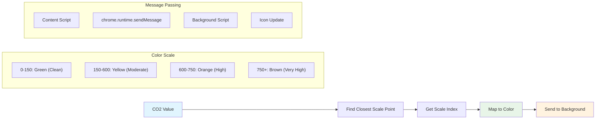

```javascript
function calculateColor(value) {
	// Define CO2 intensity scale (grams per kWh)
	const co2Scale = [0, 150, 600, 750, 800];
	// Corresponding colors from green (clean) to dark brown (high carbon)
	const colors = ['#2AA364', '#F5EB4D', '#9E4229', '#381D02', '#381D02'];

	// Find the closest scale value to our input
	const closestNum = co2Scale.sort((a, b) => {
		return Math.abs(a - value) - Math.abs(b - value);
	})[0];
	
	console.log(`${value} is closest to ${closestNum}`);
	
	// Find the index for color mapping
	const num = (element) => element > closestNum;
	const scaleIndex = co2Scale.findIndex(num);

	const closestColor = colors[scaleIndex];
	console.log(scaleIndex, closestColor);

	// Send color update message to background script
	chrome.runtime.sendMessage({ action: 'updateIcon', value: { color: closestColor } });
}
```

**Hãy phân tích hàm nhỏ thông minh này:**
- **Thiết lập** hai mảng - một cho mức CO2, một cho màu sắc (xanh lá cây = sạch, nâu = bẩn!)
- **Tìm** kết quả gần nhất với giá trị CO2 thực tế của chúng ta bằng cách sử dụng một số sắp xếp mảng thông minh
- **Lấy** màu sắc phù hợp bằng phương pháp findIndex()
- **Gửi** một thông điệp đến script nền của Chrome với màu sắc đã chọn
- **Sử dụng** template literals (những dấu backtick) để định dạng chuỗi gọn gàng hơn
- **Giữ** mọi thứ được tổ chức với các khai báo const

API `chrome.runtime` [API](https://developer.chrome.com/extensions/runtime) giống như hệ thần kinh của tiện ích của bạn - nó xử lý tất cả các giao tiếp và nhiệm vụ phía sau:

> "Sử dụng API chrome.runtime để truy xuất trang nền, trả về chi tiết về manifest, và lắng nghe cũng như phản hồi các sự kiện trong vòng đời ứng dụng hoặc tiện ích. Bạn cũng có thể sử dụng API này để chuyển đổi đường dẫn tương đối của URL thành URL đầy đủ."

**Tại sao API Chrome Runtime lại hữu ích:**
- **Cho phép** các phần khác nhau của tiện ích của bạn giao tiếp với nhau
- **Xử lý** công việc nền mà không làm đóng băng giao diện người dùng
- **Quản lý** các sự kiện vòng đời của tiện ích của bạn
- **Làm cho** việc truyền thông điệp giữa các script trở nên dễ dàng

✅ Nếu bạn đang phát triển tiện ích trình duyệt này cho Edge, có thể bạn sẽ ngạc nhiên khi thấy rằng bạn đang sử dụng API chrome. Các phiên bản trình duyệt Edge mới hơn chạy trên engine trình duyệt Chromium, vì vậy bạn có thể tận dụng các công cụ này.

```mermaid
architecture-beta
    group browser(logos:chrome)[Browser]
    
    service popup(logos:html5)[Popup UI] in browser
    service content(logos:javascript)[Content Script] in browser
    service background(database)[Background Script] in browser
    service api(logos:api)[External API] in browser
    
    popup:R -- L:content
    content:R -- L:background
    background:T -- B:api
    content:T -- B:api
    
    junction junctionCenter in browser
    popup:R -- L:junctionCenter
    junctionCenter:R -- L:background
```

> **Mẹo chuyên nghiệp**: Nếu bạn muốn profile một tiện ích trình duyệt, hãy mở công cụ dành cho nhà phát triển từ chính tiện ích đó, vì nó là một phiên bản trình duyệt riêng biệt. Điều này cung cấp cho bạn các số liệu hiệu suất cụ thể của tiện ích.

### Đặt màu biểu tượng mặc định

Trước khi chúng ta bắt đầu lấy dữ liệu thực, hãy cung cấp cho tiện ích của chúng ta một điểm khởi đầu. Không ai thích nhìn vào một biểu tượng trống hoặc trông như bị lỗi. Chúng ta sẽ bắt đầu với màu xanh lá cây để người dùng biết tiện ích đang hoạt động ngay từ lúc họ cài đặt.

Trong hàm `init()` của bạn, hãy thiết lập màu biểu tượng xanh lá cây mặc định:

```javascript
chrome.runtime.sendMessage({
	action: 'updateIcon',
	value: {
		color: 'green',
	},
});
```

**Những gì khởi tạo này đạt được:**
- **Đặt** màu xanh lá cây trung tính làm trạng thái mặc định
- **Cung cấp** phản hồi trực quan ngay lập tức khi tiện ích tải
- **Thiết lập** mô hình giao tiếp với script nền
- **Đảm bảo** người dùng thấy một tiện ích hoạt động trước khi dữ liệu tải

### Gọi hàm, thực thi lệnh gọi

Bây giờ hãy kết nối mọi thứ lại với nhau để khi dữ liệu CO2 mới được cập nhật, biểu tượng của bạn tự động cập nhật với màu sắc phù hợp. Nó giống như kết nối mạch cuối cùng trong một thiết bị điện tử - đột nhiên tất cả các thành phần riêng lẻ hoạt động như một hệ thống.

Thêm dòng này ngay sau khi bạn lấy dữ liệu CO2 từ API:

```javascript
// After retrieving CO2 data from the API
// let CO2 = data.data[0].intensity.actual;
calculateColor(CO2);
```

**Sự tích hợp này đạt được:**
- **Kết nối** luồng dữ liệu API với hệ thống chỉ báo trực quan
- **Kích hoạt** cập nhật biểu tượng tự động khi dữ liệu mới đến
- **Đảm bảo** phản hồi trực quan theo thời gian thực dựa trên cường độ carbon hiện tại
- **Duy trì** sự phân tách giữa việc lấy dữ liệu và logic hiển thị

Và cuối cùng, trong `/dist/background.js`, thêm trình lắng nghe cho các cuộc gọi hành động nền này:

```javascript
// Listen for messages from the content script
chrome.runtime.onMessage.addListener(function (msg, sender, sendResponse) {
	if (msg.action === 'updateIcon') {
		chrome.action.setIcon({ imageData: drawIcon(msg.value) });
	}
});

// Draw dynamic icon using Canvas API
// Borrowed from energy lollipop extension - nice feature!
function drawIcon(value) {
	// Create an offscreen canvas for better performance
	const canvas = new OffscreenCanvas(200, 200);
	const context = canvas.getContext('2d');

	// Draw a colored circle representing carbon intensity
	context.beginPath();
	context.fillStyle = value.color;
	context.arc(100, 100, 50, 0, 2 * Math.PI);
	context.fill();

	// Return the image data for the browser icon
	return context.getImageData(50, 50, 100, 100);
}
```

**Đây là những gì script nền này làm:**
- **Lắng nghe** các thông điệp từ script chính của bạn (như một lễ tân nhận cuộc gọi)
- **Xử lý** các yêu cầu 'updateIcon' để thay đổi biểu tượng thanh công cụ của bạn
- **Tạo** các biểu tượng mới ngay lập tức bằng cách sử dụng Canvas API
- **Vẽ** một vòng tròn màu đơn giản hiển thị cường độ carbon hiện tại
- **Cập nhật** thanh công cụ trình duyệt của bạn với biểu tượng mới
- **Sử dụng** OffscreenCanvas để có hiệu suất mượt mà (không làm đóng băng giao diện người dùng)

✅ Bạn sẽ tìm hiểu thêm về Canvas API trong [bài học Trò chơi Không gian](../../6-space-game/2-drawing-to-canvas/README.md).

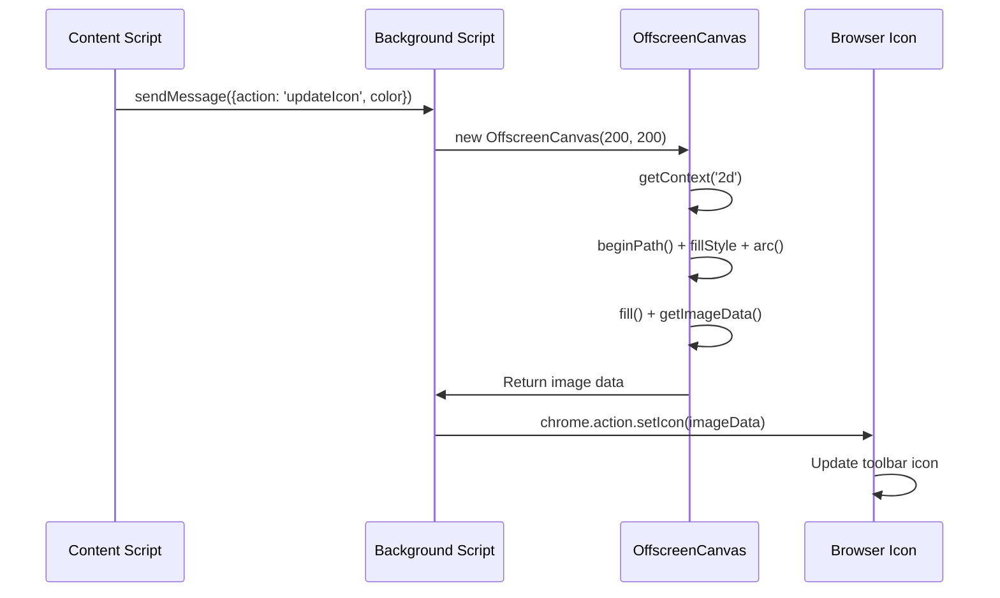

### 🔄 **Kiểm tra sư phạm**
**Hiểu biết hoàn chỉnh về tiện ích**: Xác minh sự thành thạo của bạn về toàn bộ hệ thống:
- ✅ Làm thế nào để truyền thông điệp giữa các script tiện ích khác nhau?
- ✅ Tại sao chúng ta sử dụng OffscreenCanvas thay vì Canvas thông thường để cải thiện hiệu suất?
- ✅ Vai trò của Chrome Runtime API trong kiến trúc tiện ích mở rộng là gì?
- ✅ Thuật toán tính toán màu sắc ánh xạ dữ liệu thành phản hồi trực quan như thế nào?

**Cân nhắc về hiệu suất**: Tiện ích mở rộng của bạn hiện thể hiện:
- **Giao tiếp hiệu quả**: Liên lạc rõ ràng giữa các ngữ cảnh script
- **Tối ưu hóa hiển thị**: OffscreenCanvas ngăn chặn việc chặn giao diện người dùng
- **Cập nhật theo thời gian thực**: Biểu tượng thay đổi động dựa trên dữ liệu trực tiếp
- **Quản lý bộ nhớ**: Dọn dẹp và xử lý tài nguyên đúng cách

**Đã đến lúc kiểm tra tiện ích mở rộng của bạn:**
- **Xây dựng** mọi thứ với `npm run build`
- **Tải lại** tiện ích mở rộng của bạn trong trình duyệt (đừng quên bước này)
- **Mở** tiện ích mở rộng của bạn và xem biểu tượng thay đổi màu sắc
- **Kiểm tra** cách nó phản hồi với dữ liệu carbon thực tế từ khắp nơi trên thế giới

Giờ đây, bạn sẽ biết ngay liệu có phải thời điểm tốt để giặt đồ hay nên chờ đợi năng lượng sạch hơn. Bạn vừa xây dựng một thứ thực sự hữu ích và học được về hiệu suất trình duyệt trong quá trình này.

## Thử thách GitHub Copilot Agent 🚀

Sử dụng chế độ Agent để hoàn thành thử thách sau:

**Mô tả:** Nâng cao khả năng giám sát hiệu suất của tiện ích mở rộng trình duyệt bằng cách thêm tính năng theo dõi và hiển thị thời gian tải cho các thành phần khác nhau của tiện ích mở rộng.

**Yêu cầu:** Tạo một hệ thống giám sát hiệu suất cho tiện ích mở rộng trình duyệt, đo lường và ghi lại thời gian lấy dữ liệu CO2 từ API, tính toán màu sắc, và cập nhật biểu tượng. Thêm một hàm gọi là `performanceTracker` sử dụng Performance API để đo các hoạt động này và hiển thị kết quả trong console trình duyệt với dấu thời gian và các thông số thời gian.

Tìm hiểu thêm về [chế độ agent](https://code.visualstudio.com/blogs/2025/02/24/introducing-copilot-agent-mode) tại đây.

## 🚀 Thử thách

Đây là một nhiệm vụ thám tử thú vị: chọn một vài trang web mã nguồn mở đã tồn tại nhiều năm (như Wikipedia, GitHub, hoặc Stack Overflow) và tìm hiểu lịch sử commit của chúng. Bạn có thể phát hiện nơi họ đã cải thiện hiệu suất không? Những vấn đề nào thường xuyên xuất hiện?

**Cách tiếp cận điều tra của bạn:**
- **Tìm kiếm** các thông điệp commit với từ khóa như "tối ưu hóa," "hiệu suất," hoặc "nhanh hơn"
- **Quan sát** các mẫu - họ có thường xuyên sửa cùng loại vấn đề không?
- **Xác định** các nguyên nhân phổ biến làm chậm trang web
- **Chia sẻ** những gì bạn khám phá - các nhà phát triển khác học hỏi từ các ví dụ thực tế

## Câu hỏi sau bài giảng

[Câu hỏi sau bài giảng](https://ff-quizzes.netlify.app/web/quiz/28)

## Ôn tập & Tự học

Hãy cân nhắc đăng ký một [bản tin về hiệu suất](https://perf.email/)

Khám phá một số cách mà trình duyệt đánh giá hiệu suất web bằng cách xem qua các tab hiệu suất trong công cụ web của chúng. Bạn có tìm thấy sự khác biệt lớn nào không?

### ⚡ **Những việc bạn có thể làm trong 5 phút tới**
- [ ] Mở Trình quản lý tác vụ của trình duyệt (Shift+Esc trong Chrome) để xem mức sử dụng tài nguyên của tiện ích mở rộng
- [ ] Sử dụng tab Hiệu suất của DevTools để ghi lại và phân tích hiệu suất trang web
- [ ] Kiểm tra trang Tiện ích mở rộng của trình duyệt để xem tiện ích nào ảnh hưởng đến thời gian khởi động
- [ ] Thử tạm thời vô hiệu hóa các tiện ích mở rộng để xem sự khác biệt về hiệu suất

### 🎯 **Những gì bạn có thể hoàn thành trong giờ tới**
- [ ] Hoàn thành bài kiểm tra sau bài học và hiểu các khái niệm về hiệu suất
- [ ] Triển khai một script nền cho tiện ích mở rộng trình duyệt của bạn
- [ ] Học cách sử dụng browser.alarms cho các tác vụ nền hiệu quả
- [ ] Thực hành truyền thông điệp giữa các script nội dung và script nền
- [ ] Đo lường và tối ưu hóa mức sử dụng tài nguyên của tiện ích mở rộng của bạn

### 📅 **Hành trình hiệu suất kéo dài một tuần của bạn**
- [ ] Hoàn thành một tiện ích mở rộng trình duyệt hiệu suất cao với chức năng nền
- [ ] Làm chủ service workers và kiến trúc tiện ích mở rộng hiện đại
- [ ] Triển khai các chiến lược đồng bộ hóa và lưu trữ dữ liệu hiệu quả
- [ ] Học các kỹ thuật gỡ lỗi nâng cao cho hiệu suất tiện ích mở rộng
- [ ] Tối ưu hóa tiện ích mở rộng của bạn cả về chức năng lẫn hiệu quả tài nguyên
- [ ] Tạo các bài kiểm tra toàn diện cho các kịch bản hiệu suất tiện ích mở rộng

### 🌟 **Sự thành thạo tối ưu hóa kéo dài một tháng của bạn**
- [ ] Xây dựng các tiện ích mở rộng trình duyệt cấp doanh nghiệp với hiệu suất tối ưu
- [ ] Tìm hiểu về Web Workers, Service Workers, và hiệu suất web hiện đại
- [ ] Đóng góp cho các dự án mã nguồn mở tập trung vào tối ưu hóa hiệu suất
- [ ] Làm chủ các nội bộ trình duyệt và kỹ thuật gỡ lỗi nâng cao
- [ ] Tạo các công cụ giám sát hiệu suất và hướng dẫn thực hành tốt nhất
- [ ] Trở thành chuyên gia hiệu suất giúp tối ưu hóa các ứng dụng web

## 🎯 Lộ trình thành thạo tiện ích mở rộng trình duyệt của bạn

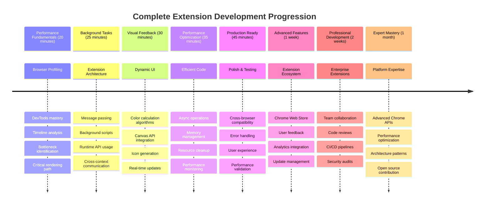

### 🛠️ Bộ công cụ phát triển tiện ích mở rộng hoàn chỉnh của bạn

Sau khi hoàn thành bộ ba này, bạn đã làm chủ:
- **Kiến trúc trình duyệt**: Hiểu sâu về cách tiện ích mở rộng tích hợp với hệ thống trình duyệt
- **Phân tích hiệu suất**: Khả năng xác định và sửa các điểm nghẽn bằng công cụ dành cho nhà phát triển
- **Lập trình bất đồng bộ**: Các mẫu JavaScript hiện đại cho các hoạt động không chặn
- **Tích hợp API**: Lấy dữ liệu bên ngoài với xác thực và xử lý lỗi
- **Thiết kế trực quan**: Cập nhật giao diện người dùng động và tạo đồ họa dựa trên Canvas
- **Truyền thông điệp**: Giao tiếp giữa các script trong kiến trúc tiện ích mở rộng
- **Trải nghiệm người dùng**: Trạng thái tải, xử lý lỗi, và tương tác trực quan
- **Kỹ năng sản xuất**: Kiểm tra, gỡ lỗi, và tối ưu hóa để triển khai thực tế

**Ứng dụng thực tế**: Kỹ năng phát triển tiện ích mở rộng của bạn áp dụng trực tiếp vào:
- **Ứng dụng web tiến bộ**: Kiến trúc và mẫu hiệu suất tương tự
- **Ứng dụng desktop Electron**: Ứng dụng đa nền tảng sử dụng công nghệ web
- **Ứng dụng di động lai**: Phát triển Cordova/PhoneGap sử dụng API web
- **Ứng dụng web doanh nghiệp**: Công cụ bảng điều khiển phức tạp và năng suất
- **Tiện ích mở rộng Chrome DevTools**: Công cụ dành cho nhà phát triển và gỡ lỗi nâng cao
- **Tích hợp API web**: Bất kỳ ứng dụng nào giao tiếp với dịch vụ bên ngoài

**Tác động chuyên nghiệp**: Giờ đây bạn có thể:
- **Xây dựng** tiện ích mở rộng trình duyệt sẵn sàng sản xuất từ ý tưởng đến triển khai
- **Tối ưu hóa** hiệu suất ứng dụng web bằng cách sử dụng các công cụ phân tích tiêu chuẩn ngành
- **Kiến trúc** hệ thống có khả năng mở rộng với sự phân tách hợp lý
- **Gỡ lỗi** các hoạt động bất đồng bộ phức tạp và giao tiếp giữa các ngữ cảnh
- **Đóng góp** cho các dự án tiện ích mở rộng mã nguồn mở và tiêu chuẩn trình duyệt

**Cơ hội cấp độ tiếp theo**:
- **Nhà phát triển Chrome Web Store**: Xuất bản tiện ích mở rộng cho hàng triệu người dùng
- **Kỹ sư hiệu suất web**: Chuyên về tối ưu hóa và trải nghiệm người dùng
- **Nhà phát triển nền tảng trình duyệt**: Đóng góp vào phát triển engine trình duyệt
- **Người tạo khung tiện ích mở rộng**: Xây dựng công cụ giúp các nhà phát triển khác
- **Quan hệ nhà phát triển**: Chia sẻ kiến thức thông qua giảng dạy và tạo nội dung

🌟 **Thành tựu đã đạt được**: Bạn đã xây dựng một tiện ích mở rộng trình duyệt hoàn chỉnh, chức năng, thể hiện các thực hành phát triển chuyên nghiệp và tiêu chuẩn web hiện đại!

## Bài tập

[Phân tích một trang web về hiệu suất](assignment.md)

---

**Tuyên bố miễn trừ trách nhiệm**:  
Tài liệu này đã được dịch bằng dịch vụ dịch thuật AI [Co-op Translator](https://github.com/Azure/co-op-translator). Mặc dù chúng tôi cố gắng đảm bảo độ chính xác, xin lưu ý rằng các bản dịch tự động có thể chứa lỗi hoặc không chính xác. Tài liệu gốc bằng ngôn ngữ bản địa nên được coi là nguồn thông tin chính xác nhất. Đối với thông tin quan trọng, khuyến nghị sử dụng dịch vụ dịch thuật chuyên nghiệp bởi con người. Chúng tôi không chịu trách nhiệm cho bất kỳ sự hiểu lầm hoặc diễn giải sai nào phát sinh từ việc sử dụng bản dịch này.