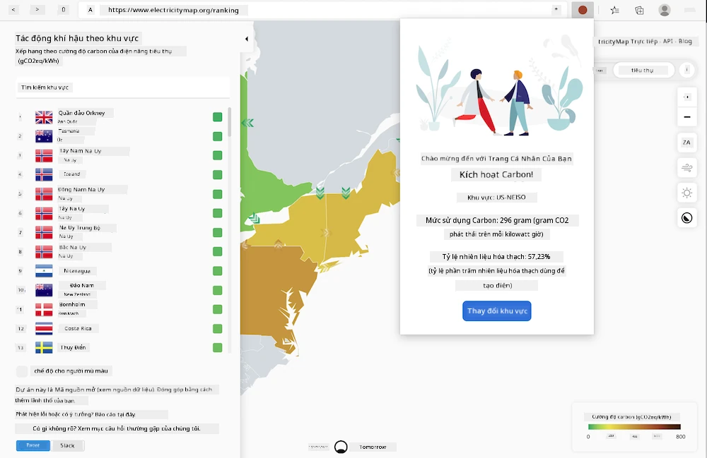

<!--
CO_OP_TRANSLATOR_METADATA:
{
  "original_hash": "b121a279a6ab39878491f3e572673515",
  "translation_date": "2025-08-27T22:15:53+00:00",
  "source_file": "5-browser-extension/README.md",
  "language_code": "vi"
}
-->
# Xây dựng tiện ích mở rộng trình duyệt

Xây dựng tiện ích mở rộng trình duyệt là một cách thú vị và hấp dẫn để suy nghĩ về hiệu suất của ứng dụng của bạn trong khi tạo một loại tài sản web khác biệt. Module này bao gồm các bài học về cách trình duyệt hoạt động, cách triển khai tiện ích mở rộng trình duyệt, cách xây dựng một biểu mẫu, gọi API, sử dụng bộ nhớ cục bộ, cũng như cách đánh giá hiệu suất của trang web và cải thiện nó.

Bạn sẽ xây dựng một tiện ích mở rộng trình duyệt hoạt động trên Edge, Chrome và Firefox. Tiện ích này, giống như một trang web nhỏ được thiết kế cho một nhiệm vụ rất cụ thể, kiểm tra [C02 Signal API](https://www.co2signal.com) để biết mức sử dụng điện và cường độ carbon của một khu vực nhất định, và trả về kết quả về dấu chân carbon của khu vực đó.

Tiện ích này có thể được người dùng gọi bất kỳ lúc nào sau khi nhập khóa API và mã khu vực vào biểu mẫu để xác định mức sử dụng điện tại địa phương, từ đó cung cấp dữ liệu có thể ảnh hưởng đến quyết định sử dụng điện của người dùng. Ví dụ, có thể sẽ tốt hơn nếu trì hoãn việc sử dụng máy sấy quần áo (một hoạt động tiêu thụ nhiều carbon) trong thời gian mức sử dụng điện cao tại khu vực của bạn.

### Các chủ đề

1. [Về trình duyệt](1-about-browsers/README.md)
2. [Biểu mẫu và bộ nhớ cục bộ](2-forms-browsers-local-storage/README.md)
3. [Nhiệm vụ nền và hiệu suất](3-background-tasks-and-performance/README.md)

### Ghi nhận

## Ghi nhận

Ý tưởng cho trình kích hoạt carbon web này được đề xuất bởi Asim Hussain, trưởng nhóm tại Microsoft của nhóm Green Cloud Advocacy và tác giả của [Green Principles](https://principles.green/). Ban đầu, đây là một [dự án trang web](https://github.com/jlooper/green).

Cấu trúc của tiện ích mở rộng trình duyệt được lấy cảm hứng từ [tiện ích mở rộng COVID của Adebola Adeniran](https://github.com/onedebos/covtension).

Ý tưởng đằng sau hệ thống biểu tượng 'dot' được gợi ý bởi cấu trúc biểu tượng của tiện ích mở rộng trình duyệt [Energy Lollipop](https://energylollipop.com/) dành cho lượng khí thải tại California.

Các bài học này được viết với ♥️ bởi [Jen Looper](https://www.twitter.com/jenlooper)

---

**Tuyên bố miễn trừ trách nhiệm**:  
Tài liệu này đã được dịch bằng dịch vụ dịch thuật AI [Co-op Translator](https://github.com/Azure/co-op-translator). Mặc dù chúng tôi cố gắng đảm bảo độ chính xác, xin lưu ý rằng các bản dịch tự động có thể chứa lỗi hoặc không chính xác. Tài liệu gốc bằng ngôn ngữ bản địa nên được coi là nguồn thông tin chính thức. Đối với các thông tin quan trọng, nên sử dụng dịch vụ dịch thuật chuyên nghiệp từ con người. Chúng tôi không chịu trách nhiệm cho bất kỳ sự hiểu lầm hoặc diễn giải sai nào phát sinh từ việc sử dụng bản dịch này.