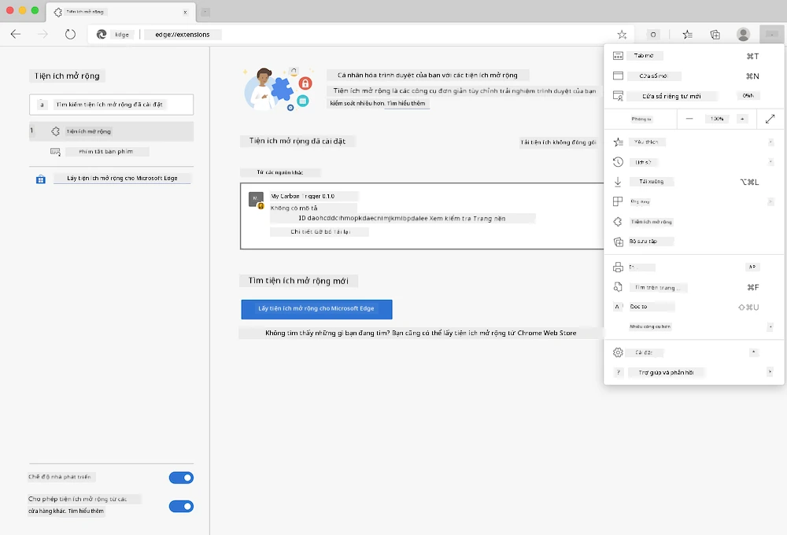

# Tiện Ích Mở Rộng Trình Duyệt Carbon Trigger: Mã Hoàn Chỉnh

Sử dụng API CO2 Signal của tmrow để theo dõi mức tiêu thụ điện năng, xây dựng tiện ích mở rộng trình duyệt để bạn có thể nhận được cảnh báo trong trình duyệt về mức độ tiêu thụ điện năng của khu vực bạn. Việc sử dụng tiện ích này sẽ giúp bạn cân nhắc các hoạt động của mình dựa trên thông tin này.


## Bắt Đầu Từ Đây

Bạn cần cài đặt [npm](https://npmjs.com). Tải xuống bản sao mã này vào một thư mục trên máy tính của bạn.

Cài đặt tất cả các gói cần thiết:

```
npm install
```

Xây dựng tiện ích mở rộng bằng webpack:

```
npm run build
```

Để cài đặt trên Edge, sử dụng menu 'ba chấm' ở góc trên bên phải của trình duyệt để tìm bảng Tiện Ích Mở Rộng. Từ đó, chọn 'Load Unpacked' để tải tiện ích mở rộng mới. Mở thư mục 'dist' theo yêu cầu và tiện ích mở rộng sẽ được tải. Để sử dụng, bạn cần một khóa API cho API CO2 Signal ([lấy một khóa qua email tại đây](https://www.co2signal.com/) - nhập email của bạn vào ô trên trang này) và [mã khu vực của bạn](http://api.electricitymap.org/v3/zones) tương ứng với [Bản Đồ Điện](https://www.electricitymap.org/map) (ở Boston, ví dụ, tôi sử dụng 'US-NEISO').



Sau khi khóa API và khu vực được nhập vào giao diện tiện ích mở rộng, điểm màu trên thanh tiện ích mở rộng của trình duyệt sẽ thay đổi để phản ánh mức tiêu thụ năng lượng của khu vực bạn và cung cấp cho bạn gợi ý về các hoạt động phù hợp với mức tiêu thụ đó. Ý tưởng về hệ thống 'điểm màu' này được lấy cảm hứng từ [tiện ích mở rộng trình duyệt Lollipop Năng Lượng](https://energylollipop.com/) dành cho khu vực California.

---

**Tuyên bố miễn trừ trách nhiệm**:  
Tài liệu này đã được dịch bằng dịch vụ dịch thuật AI [Co-op Translator](https://github.com/Azure/co-op-translator). Mặc dù chúng tôi cố gắng đảm bảo độ chính xác, xin lưu ý rằng các bản dịch tự động có thể chứa lỗi hoặc không chính xác. Tài liệu gốc bằng ngôn ngữ bản địa nên được coi là nguồn thông tin chính thức. Đối với các thông tin quan trọng, khuyến nghị sử dụng dịch vụ dịch thuật chuyên nghiệp bởi con người. Chúng tôi không chịu trách nhiệm cho bất kỳ sự hiểu lầm hoặc diễn giải sai nào phát sinh từ việc sử dụng bản dịch này.