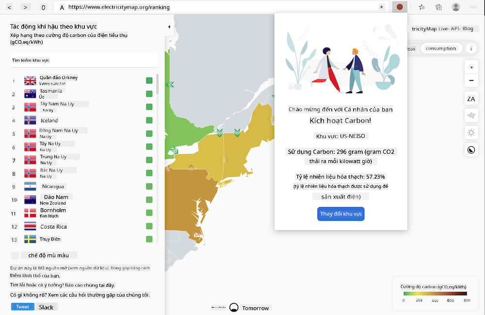

<!--
CO_OP_TRANSLATOR_METADATA:
{
  "original_hash": "26fd39046d264ba185dcb086d3a8cf3e",
  "translation_date": "2025-08-27T22:22:57+00:00",
  "source_file": "5-browser-extension/start/README.md",
  "language_code": "vi"
}
-->
# Tiện ích mở rộng Carbon Trigger: Mã khởi đầu

Sử dụng API C02 Signal của tmrow để theo dõi mức tiêu thụ điện, bạn sẽ xây dựng một tiện ích mở rộng trình duyệt để có thể nhận được nhắc nhở ngay trong trình duyệt về mức độ tiêu thụ điện năng của khu vực bạn. Việc sử dụng tiện ích này một cách linh hoạt sẽ giúp bạn đưa ra quyết định về các hoạt động của mình dựa trên thông tin này.



## Bắt đầu

Bạn cần cài đặt [npm](https://npmjs.com). Tải một bản sao của mã này về một thư mục trên máy tính của bạn.

Cài đặt tất cả các gói cần thiết:

```
npm install
```

Xây dựng tiện ích mở rộng bằng webpack:

```
npm run build
```

Để cài đặt trên Edge, sử dụng menu 'ba chấm' ở góc trên bên phải của trình duyệt để tìm bảng điều khiển Tiện ích mở rộng. Từ đó, chọn 'Tải không đóng gói' để tải một tiện ích mới. Mở thư mục 'dist' khi được nhắc và tiện ích sẽ được tải. Để sử dụng, bạn cần một API key cho API của CO2 Signal ([lấy tại đây qua email](https://www.co2signal.com/) - nhập email của bạn vào ô trên trang này) và [mã khu vực của bạn](http://api.electricitymap.org/v3/zones) tương ứng với [Electricity Map](https://www.electricitymap.org/map) (ví dụ, ở Boston, tôi sử dụng 'US-NEISO').


Khi API key và mã khu vực được nhập vào giao diện tiện ích, chấm màu trong thanh tiện ích trình duyệt sẽ thay đổi để phản ánh mức tiêu thụ năng lượng của khu vực bạn và cung cấp cho bạn gợi ý về các hoạt động tiêu tốn năng lượng phù hợp. Ý tưởng đằng sau hệ thống 'chấm' này được lấy cảm hứng từ tiện ích mở rộng [Energy Lollipop](https://energylollipop.com/) dành cho lượng khí thải ở California.

---

**Tuyên bố miễn trừ trách nhiệm**:  
Tài liệu này đã được dịch bằng dịch vụ dịch thuật AI [Co-op Translator](https://github.com/Azure/co-op-translator). Mặc dù chúng tôi cố gắng đảm bảo độ chính xác, xin lưu ý rằng các bản dịch tự động có thể chứa lỗi hoặc không chính xác. Tài liệu gốc bằng ngôn ngữ bản địa nên được coi là nguồn thông tin chính thức. Đối với các thông tin quan trọng, nên sử dụng dịch vụ dịch thuật chuyên nghiệp từ con người. Chúng tôi không chịu trách nhiệm cho bất kỳ sự hiểu lầm hoặc diễn giải sai nào phát sinh từ việc sử dụng bản dịch này.