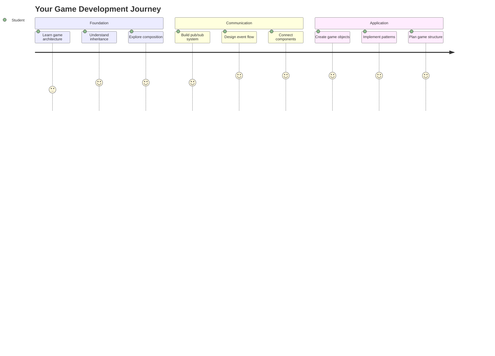
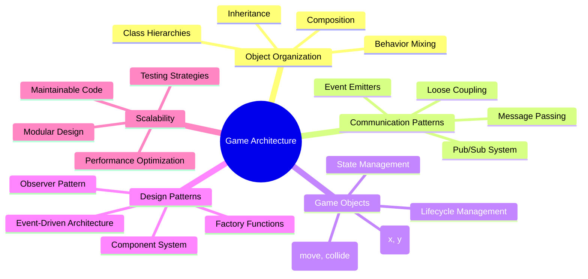
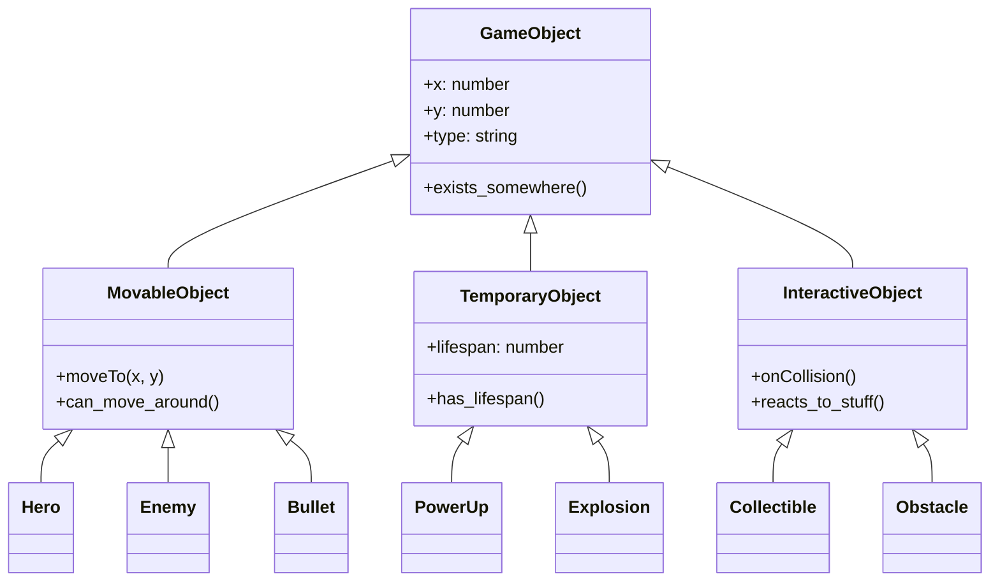
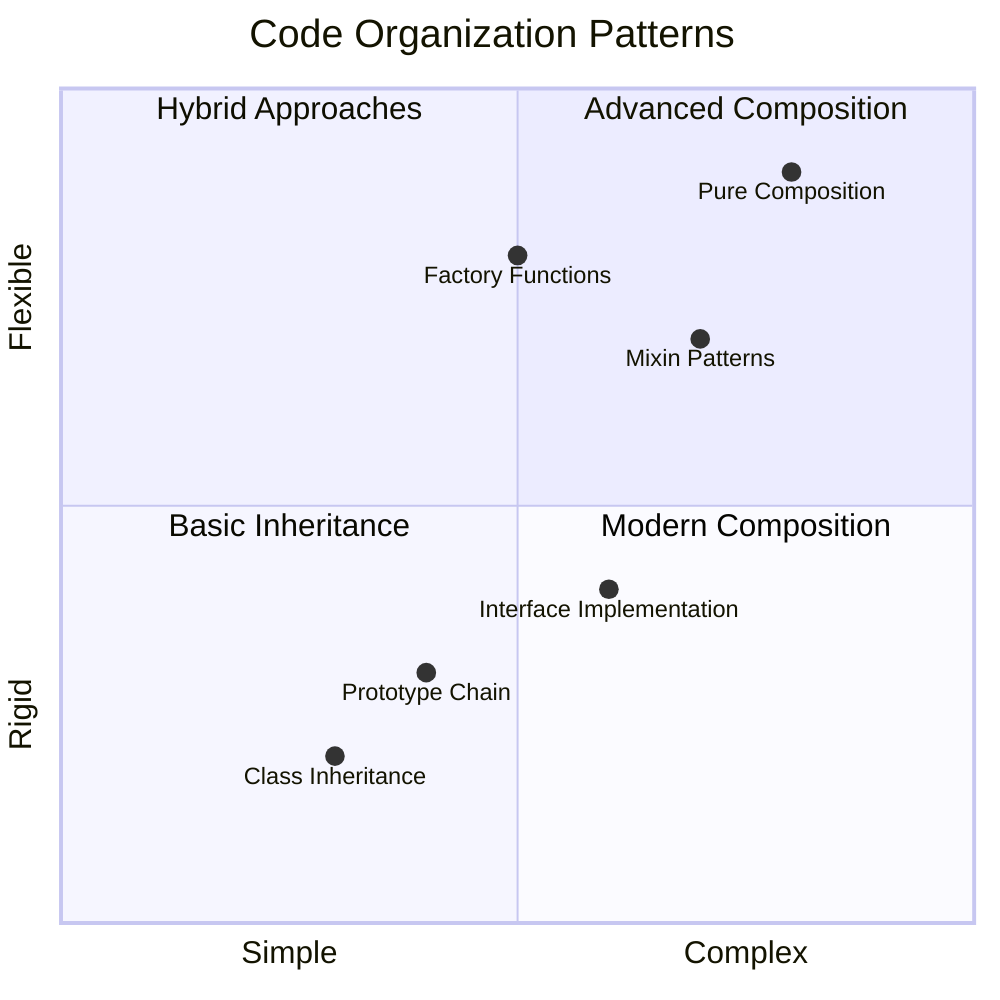
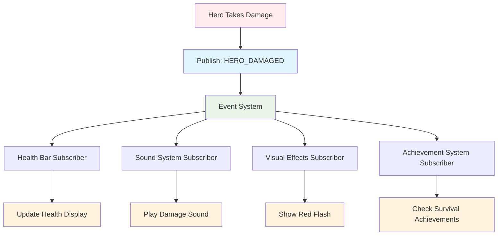
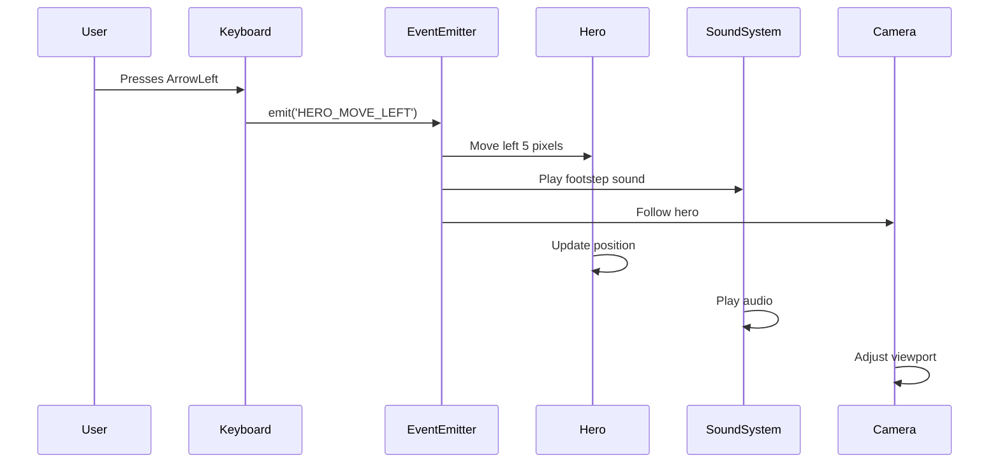
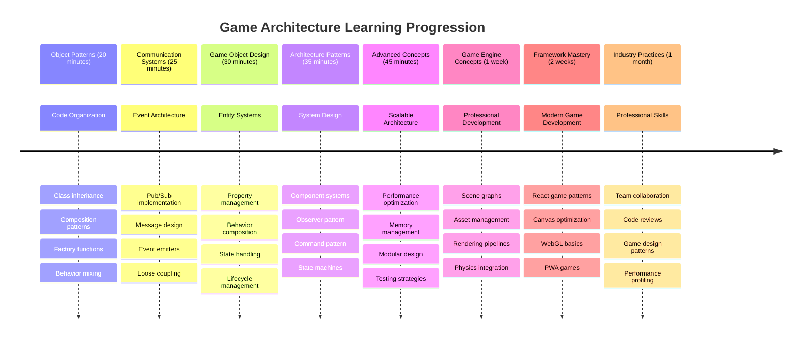

# Xây dựng trò chơi không gian Phần 1: Giới thiệu




Giống như trung tâm điều khiển của NASA phối hợp nhiều hệ thống trong một lần phóng tàu vũ trụ, chúng ta sẽ xây dựng một trò chơi không gian để minh họa cách các phần khác nhau của một chương trình có thể hoạt động cùng nhau một cách mượt mà. Trong khi tạo ra một trò chơi mà bạn thực sự có thể chơi, bạn sẽ học được các khái niệm lập trình cơ bản áp dụng cho bất kỳ dự án phần mềm nào.

Chúng ta sẽ khám phá hai cách tiếp cận cơ bản để tổ chức mã: kế thừa và thành phần. Đây không chỉ là các khái niệm học thuật – chúng là các mẫu thiết kế được sử dụng trong mọi thứ từ trò chơi điện tử đến hệ thống ngân hàng. Chúng ta cũng sẽ triển khai một hệ thống giao tiếp gọi là pub/sub hoạt động giống như mạng lưới giao tiếp được sử dụng trong tàu vũ trụ, cho phép các thành phần khác nhau chia sẻ thông tin mà không tạo ra sự phụ thuộc.

Kết thúc loạt bài này, bạn sẽ hiểu cách xây dựng các ứng dụng có thể mở rộng và phát triển – dù bạn đang phát triển trò chơi, ứng dụng web hay bất kỳ hệ thống phần mềm nào khác.



## Quiz trước bài giảng

[Quiz trước bài giảng](https://ff-quizzes.netlify.app/web/quiz/29)

## Kế thừa và Thành phần trong Phát triển Trò chơi

Khi các dự án trở nên phức tạp hơn, việc tổ chức mã trở nên rất quan trọng. Những gì bắt đầu là một đoạn mã đơn giản có thể trở nên khó duy trì nếu không có cấu trúc phù hợp – giống như cách các nhiệm vụ Apollo yêu cầu sự phối hợp cẩn thận giữa hàng ngàn thành phần.

Chúng ta sẽ khám phá hai cách tiếp cận cơ bản để tổ chức mã: kế thừa và thành phần. Mỗi cách có những lợi ích riêng biệt, và việc hiểu cả hai giúp bạn chọn cách tiếp cận phù hợp cho từng tình huống. Chúng ta sẽ minh họa các khái niệm này thông qua trò chơi không gian, nơi các anh hùng, kẻ thù, vật phẩm tăng cường sức mạnh và các đối tượng khác phải tương tác hiệu quả.

✅ Một trong những cuốn sách lập trình nổi tiếng nhất từng được viết liên quan đến [mẫu thiết kế](https://en.wikipedia.org/wiki/Design_Patterns).

Trong bất kỳ trò chơi nào, bạn có các `đối tượng trò chơi` – các yếu tố tương tác tạo nên thế giới trò chơi của bạn. Anh hùng, kẻ thù, vật phẩm tăng cường sức mạnh và hiệu ứng hình ảnh đều là các đối tượng trò chơi. Mỗi đối tượng tồn tại tại các tọa độ màn hình cụ thể sử dụng các giá trị `x` và `y`, tương tự như việc vẽ các điểm trên mặt phẳng tọa độ.

Mặc dù có sự khác biệt về hình ảnh, các đối tượng này thường chia sẻ các hành vi cơ bản:

- **Chúng tồn tại ở đâu đó** – Mỗi đối tượng có tọa độ x và y để trò chơi biết nơi vẽ nó
- **Nhiều đối tượng có thể di chuyển** – Anh hùng chạy, kẻ thù đuổi theo, đạn bay qua màn hình
- **Chúng có vòng đời** – Một số tồn tại mãi mãi, những đối tượng khác (như vụ nổ) xuất hiện ngắn ngủi rồi biến mất
- **Chúng phản ứng với các sự kiện** – Khi các đối tượng va chạm, vật phẩm tăng cường sức mạnh được thu thập, thanh máu được cập nhật

✅ Hãy nghĩ về một trò chơi như Pac-Man. Bạn có thể xác định bốn loại đối tượng được liệt kê ở trên trong trò chơi này không?



### Thể hiện Hành vi Qua Mã

Bây giờ bạn đã hiểu các hành vi chung mà các đối tượng trò chơi chia sẻ, hãy khám phá cách triển khai các hành vi này trong JavaScript. Bạn có thể thể hiện hành vi của đối tượng thông qua các phương thức gắn với các lớp hoặc các đối tượng riêng lẻ, và có một số cách tiếp cận để lựa chọn.

**Cách Tiếp cận Dựa trên Lớp**

Các lớp và kế thừa cung cấp một cách tiếp cận có cấu trúc để tổ chức các đối tượng trò chơi. Giống như hệ thống phân loại sinh học được phát triển bởi Carl Linnaeus, bạn bắt đầu với một lớp cơ bản chứa các thuộc tính chung, sau đó tạo các lớp chuyên biệt kế thừa các yếu tố cơ bản này trong khi thêm các khả năng cụ thể.

✅ Kế thừa là một khái niệm quan trọng cần hiểu. Tìm hiểu thêm trong [bài viết của MDN về kế thừa](https://developer.mozilla.org/docs/Web/JavaScript/Inheritance_and_the_prototype_chain).

Dưới đây là cách bạn có thể triển khai các đối tượng trò chơi bằng cách sử dụng các lớp và kế thừa:

```javascript
// Step 1: Create the base GameObject class
class GameObject {
  constructor(x, y, type) {
    this.x = x;
    this.y = y;
    this.type = type;
  }
}
```

**Hãy phân tích từng bước:**
- Chúng ta đang tạo một mẫu cơ bản mà mọi đối tượng trò chơi có thể sử dụng
- Constructor lưu vị trí của đối tượng (`x`, `y`) và loại đối tượng
- Đây trở thành nền tảng mà tất cả các đối tượng trò chơi của bạn sẽ xây dựng trên đó

```javascript
// Step 2: Add movement capability through inheritance
class Movable extends GameObject {
  constructor(x, y, type) {
    super(x, y, type); // Call parent constructor
  }

  // Add the ability to move to a new position
  moveTo(x, y) {
    this.x = x;
    this.y = y;
  }
}
```

**Trong đoạn mã trên, chúng ta đã:**
- **Mở rộng** lớp GameObject để thêm chức năng di chuyển
- **Gọi** constructor của lớp cha bằng `super()` để khởi tạo các thuộc tính kế thừa
- **Thêm** phương thức `moveTo()` để cập nhật vị trí của đối tượng

```javascript
// Step 3: Create specific game object types
class Hero extends Movable {
  constructor(x, y) {
    super(x, y, 'Hero'); // Set type automatically
  }
}

class Tree extends GameObject {
  constructor(x, y) {
    super(x, y, 'Tree'); // Trees don't need movement
  }
}

// Step 4: Use your game objects
const hero = new Hero(0, 0);
hero.moveTo(5, 5); // Hero can move!

const tree = new Tree(10, 15);
// tree.moveTo() would cause an error - trees can't move
```

**Hiểu các khái niệm này:**
- **Tạo** các loại đối tượng chuyên biệt kế thừa các hành vi phù hợp
- **Minh họa** cách kế thừa cho phép chọn lọc các tính năng
- **Cho thấy** rằng anh hùng có thể di chuyển trong khi cây cối vẫn đứng yên
- **Minh họa** cách hệ thống phân cấp lớp ngăn chặn các hành động không phù hợp

✅ Dành vài phút để hình dung lại một anh hùng Pac-Man (Inky, Pinky hoặc Blinky, chẳng hạn) và cách nó sẽ được viết trong JavaScript.

**Cách Tiếp cận Thành phần**

Thành phần tuân theo triết lý thiết kế mô-đun, tương tự như cách các kỹ sư thiết kế tàu vũ trụ với các thành phần có thể thay thế. Thay vì kế thừa từ một lớp cha, bạn kết hợp các hành vi cụ thể để tạo ra các đối tượng với chính xác các chức năng mà chúng cần. Cách tiếp cận này mang lại sự linh hoạt mà không bị ràng buộc bởi các hệ thống phân cấp cứng nhắc.

```javascript
// Step 1: Create base behavior objects
const gameObject = {
  x: 0,
  y: 0,
  type: ''
};

const movable = {
  moveTo(x, y) {
    this.x = x;
    this.y = y;
  }
};
```

**Đoạn mã này làm gì:**
- **Định nghĩa** một đối tượng cơ bản `gameObject` với các thuộc tính vị trí và loại
- **Tạo** một đối tượng hành vi `movable` riêng biệt với chức năng di chuyển
- **Tách biệt** các mối quan tâm bằng cách giữ dữ liệu vị trí và logic di chuyển độc lập

```javascript
// Step 2: Compose objects by combining behaviors
const movableObject = { ...gameObject, ...movable };

// Step 3: Create factory functions for different object types
function createHero(x, y) {
  return {
    ...movableObject,
    x,
    y,
    type: 'Hero'
  };
}

function createStatic(x, y, type) {
  return {
    ...gameObject,
    x,
    y,
    type
  };
}
```

**Trong đoạn mã trên, chúng ta đã:**
- **Kết hợp** các thuộc tính đối tượng cơ bản với hành vi di chuyển bằng cú pháp spread
- **Tạo** các hàm nhà máy trả về các đối tượng tùy chỉnh
- **Cho phép** tạo đối tượng linh hoạt mà không cần hệ thống phân cấp lớp cứng nhắc
- **Cho phép** các đối tượng có chính xác các hành vi mà chúng cần

```javascript
// Step 4: Create and use your composed objects
const hero = createHero(10, 10);
hero.moveTo(5, 5); // Works perfectly!

const tree = createStatic(0, 0, 'Tree');
// tree.moveTo() is undefined - no movement behavior was composed
```

**Những điểm chính cần nhớ:**
- **Kết hợp** các đối tượng bằng cách trộn các hành vi thay vì kế thừa chúng
- **Cung cấp** sự linh hoạt hơn so với các hệ thống phân cấp kế thừa cứng nhắc
- **Cho phép** các đối tượng có chính xác các tính năng mà chúng cần
- **Sử dụng** cú pháp spread hiện đại của JavaScript để kết hợp đối tượng một cách sạch sẽ
```

**Which Pattern Should You Choose?**

**Which Pattern Should You Choose?**



> 💡 **Mẹo chuyên nghiệp**: Cả hai mẫu đều có vị trí của chúng trong phát triển JavaScript hiện đại. Các lớp hoạt động tốt cho các hệ thống phân cấp rõ ràng, trong khi thành phần tỏa sáng khi bạn cần sự linh hoạt tối đa.
> 
**Khi nào sử dụng mỗi cách tiếp cận:**
- **Chọn** kế thừa khi bạn có các mối quan hệ "là một" rõ ràng (một Anh hùng *là một* đối tượng có thể di chuyển)
- **Chọn** thành phần khi bạn cần các mối quan hệ "có một" (một Anh hùng *có* khả năng di chuyển)
- **Xem xét** sở thích của nhóm và yêu cầu dự án
- **Nhớ rằng** bạn có thể kết hợp cả hai cách tiếp cận trong cùng một ứng dụng

### 🔄 **Kiểm tra Sư phạm**
**Hiểu Tổ chức Đối tượng**: Trước khi chuyển sang các mẫu giao tiếp, hãy đảm bảo bạn có thể:
- ✅ Giải thích sự khác biệt giữa kế thừa và thành phần
- ✅ Xác định khi nào sử dụng các lớp so với các hàm nhà máy
- ✅ Hiểu cách từ khóa `super()` hoạt động trong kế thừa
- ✅ Nhận ra lợi ích của mỗi cách tiếp cận đối với phát triển trò chơi

**Tự kiểm tra nhanh**: Làm thế nào bạn sẽ tạo một Kẻ thù Bay có thể vừa di chuyển vừa bay?
- **Cách tiếp cận kế thừa**: `class FlyingEnemy extends Movable`
- **Cách tiếp cận thành phần**: `{ ...movable, ...flyable, ...gameObject }`

**Kết nối Thực tế**: Các mẫu này xuất hiện ở khắp mọi nơi:
- **React Components**: Props (thành phần) so với kế thừa lớp
- **Game Engines**: Hệ thống thành phần thực thể sử dụng thành phần
- **Ứng dụng Di động**: Các framework UI thường sử dụng hệ thống phân cấp kế thừa

## Mẫu Giao tiếp: Hệ thống Pub/Sub

Khi các ứng dụng trở nên phức tạp, việc quản lý giao tiếp giữa các thành phần trở nên khó khăn. Mẫu publish-subscribe (pub/sub) giải quyết vấn đề này bằng cách sử dụng các nguyên tắc tương tự như phát sóng radio – một máy phát có thể tiếp cận nhiều máy thu mà không cần biết ai đang lắng nghe.

Hãy xem điều gì xảy ra khi một anh hùng bị thương: thanh máu được cập nhật, hiệu ứng âm thanh phát ra, phản hồi hình ảnh xuất hiện. Thay vì kết nối trực tiếp đối tượng anh hùng với các hệ thống này, pub/sub cho phép anh hùng phát đi một thông báo "đã bị thương". Bất kỳ hệ thống nào cần phản ứng đều có thể đăng ký loại thông báo này và phản ứng tương ứng.

✅ **Pub/Sub** là viết tắt của 'publish-subscribe'



### Hiểu Kiến trúc Pub/Sub

Mẫu pub/sub giữ cho các phần khác nhau của ứng dụng của bạn không bị ràng buộc chặt chẽ, nghĩa là chúng có thể hoạt động cùng nhau mà không phụ thuộc trực tiếp vào nhau. Sự tách biệt này làm cho mã của bạn dễ bảo trì, kiểm tra và linh hoạt hơn với các thay đổi.

**Các thành phần chính trong pub/sub:**
- **Thông điệp** – Các nhãn văn bản đơn giản như `'PLAYER_SCORED'` mô tả điều gì đã xảy ra (cộng với bất kỳ thông tin bổ sung nào)
- **Nhà xuất bản** – Các đối tượng thông báo "Có điều gì đó đã xảy ra!" cho bất kỳ ai đang lắng nghe
- **Người đăng ký** – Các đối tượng nói "Tôi quan tâm đến sự kiện đó" và phản ứng khi nó xảy ra
- **Hệ thống sự kiện** – Người trung gian đảm bảo thông điệp đến đúng người nghe

### Xây dựng Hệ thống Sự kiện

Hãy tạo một hệ thống sự kiện đơn giản nhưng mạnh mẽ để minh họa các khái niệm này:

```javascript
// Step 1: Create the EventEmitter class
class EventEmitter {
  constructor() {
    this.listeners = {}; // Store all event listeners
  }
  
  // Register a listener for a specific message type
  on(message, listener) {
    if (!this.listeners[message]) {
      this.listeners[message] = [];
    }
    this.listeners[message].push(listener);
  }
  
  // Send a message to all registered listeners
  emit(message, payload = null) {
    if (this.listeners[message]) {
      this.listeners[message].forEach(listener => {
        listener(message, payload);
      });
    }
  }
}
```

**Phân tích những gì xảy ra ở đây:**
- **Tạo** một hệ thống quản lý sự kiện trung tâm bằng cách sử dụng một lớp đơn giản
- **Lưu trữ** các người nghe trong một đối tượng được tổ chức theo loại thông điệp
- **Đăng ký** các người nghe mới bằng phương thức `on()`
- **Phát đi** thông điệp đến tất cả các người nghe quan tâm bằng phương thức `emit()`
- **Hỗ trợ** các payload dữ liệu tùy chọn để truyền thông tin liên quan

### Kết hợp Tất cả: Một Ví dụ Thực tế

Được rồi, hãy xem điều này hoạt động như thế nào! Chúng ta sẽ xây dựng một hệ thống di chuyển đơn giản để cho thấy pub/sub có thể sạch sẽ và linh hoạt như thế nào:

```javascript
// Step 1: Define your message types
const Messages = {
  HERO_MOVE_LEFT: 'HERO_MOVE_LEFT',
  HERO_MOVE_RIGHT: 'HERO_MOVE_RIGHT',
  ENEMY_SPOTTED: 'ENEMY_SPOTTED'
};

// Step 2: Create your event system and game objects
const eventEmitter = new EventEmitter();
const hero = createHero(0, 0);
```

**Đoạn mã này làm gì:**
- **Định nghĩa** một đối tượng hằng số để tránh lỗi chính tả trong tên thông điệp
- **Tạo** một instance của event emitter để xử lý tất cả giao tiếp
- **Khởi tạo** một đối tượng anh hùng tại vị trí bắt đầu

```javascript
// Step 3: Set up event listeners (subscribers)
eventEmitter.on(Messages.HERO_MOVE_LEFT, () => {
  hero.moveTo(hero.x - 5, hero.y);
  console.log(`Hero moved to position: ${hero.x}, ${hero.y}`);
});

eventEmitter.on(Messages.HERO_MOVE_RIGHT, () => {
  hero.moveTo(hero.x + 5, hero.y);
  console.log(`Hero moved to position: ${hero.x}, ${hero.y}`);
});
```

**Trong đoạn mã trên, chúng ta đã:**
- **Đăng ký** các người nghe sự kiện phản ứng với các thông điệp di chuyển
- **Cập nhật** vị trí của anh hùng dựa trên hướng di chuyển
- **Thêm** ghi nhật ký console để theo dõi các thay đổi vị trí của anh hùng
- **Tách biệt** logic di chuyển khỏi xử lý đầu vào

```javascript
// Step 4: Connect keyboard input to events (publishers)
window.addEventListener('keydown', (event) => {
  switch(event.key) {
    case 'ArrowLeft':
      eventEmitter.emit(Messages.HERO_MOVE_LEFT);
      break;
    case 'ArrowRight':
      eventEmitter.emit(Messages.HERO_MOVE_RIGHT);
      break;
  }
});
```

**Hiểu các khái niệm này:**
- **Kết nối** đầu vào từ bàn phím với các sự kiện trò chơi mà không bị ràng buộc chặt chẽ
- **Cho phép** hệ thống đầu vào giao tiếp với các đối tượng trò chơi một cách gián tiếp
- **Cho phép** nhiều hệ thống phản ứng với cùng một sự kiện bàn phím
- **Làm cho** việc thay đổi các phím hoặc thêm các phương pháp đầu vào mới trở nên dễ dàng



> 💡 **Mẹo chuyên nghiệp**: Vẻ đẹp của mẫu này là sự linh hoạt! Bạn có thể dễ dàng thêm hiệu ứng âm thanh, rung màn hình hoặc hiệu ứng hạt bằng cách chỉ cần thêm nhiều người nghe sự kiện – không cần sửa đổi mã đầu vào hoặc di chuyển hiện có.
> 
**Tại sao bạn sẽ yêu thích cách tiếp cận này:**
- Việc thêm các tính năng mới trở nên cực kỳ dễ dàng – chỉ cần lắng nghe các sự kiện bạn quan tâm
- Nhiều thứ có thể phản ứng với cùng một sự kiện mà không gây xung đột
- Việc kiểm tra trở nên đơn giản hơn nhiều vì mỗi phần hoạt động độc lập
- Khi có sự cố, bạn biết chính xác nơi cần kiểm tra

### Tại sao Pub/Sub mở rộng hiệu quả

Mẫu pub/sub duy trì sự đơn giản khi các ứng dụng trở nên phức tạp hơn. Dù là quản lý hàng chục kẻ thù, cập nhật UI động hay hệ thống âm thanh, mẫu này xử lý quy mô tăng lên mà không cần thay đổi kiến trúc. Các tính năng mới tích hợp vào hệ thống sự kiện hiện có mà không ảnh hưởng đến chức năng đã được thiết lập.

> ⚠️ **Lỗi thường gặp**: Đừng tạo quá nhiều loại thông điệp cụ thể ngay từ đầu. Bắt đầu với các danh mục rộng và tinh chỉnh chúng khi nhu cầu của trò chơi trở nên rõ ràng hơn.
> 
**Các thực hành tốt nhất cần tuân theo:**
- **Nhóm** các thông điệp liên quan thành các danh mục logic
- **Sử dụng** tên mô tả rõ ràng điều gì đã xảy ra
- **Giữ** payload thông điệp đơn giản và tập trung
- **Tài liệu hóa** các loại thông điệp của bạn để hợp tác nhóm

### 🔄 **Kiểm tra Sư phạm**
**Hiểu Kiến trúc Dựa trên Sự kiện**: Xác minh sự hiểu biết của bạn về hệ thống hoàn chỉnh:
- ✅ Làm thế nào mẫu pub/sub ngăn chặn sự ràng buộc chặt chẽ giữa các thành phần?
- ✅ Tại sao việc thêm các tính năng mới dễ dàng hơn với kiến trúc dựa trên sự kiện?
- ✅ Vai trò của EventEmitter trong luồng giao tiếp là gì?
- ✅ Làm thế nào các hằng số thông điệp ngăn chặn lỗi và cải thiện khả năng bảo trì?

**Thử thách Thiết kế**: Làm thế nào bạn sẽ xử lý các kịch bản trò chơi này với pub/sub?
1. **Kẻ thù chết**: Cập nhật điểm số, phát âm thanh, sinh vật phẩm tăng cường sức mạnh, xóa khỏi màn hình
2. **Hoàn thành cấp độ**: Dừng nhạc, hiển thị UI, lưu tiến trình, tải cấp độ tiếp theo
3. **Thu thập vật phẩm tăng cường sức mạnh**: Tăng cường khả năng, cập nhật UI, phát hiệu ứng, bắt đầu bộ đếm thời gian

**Kết nối Chuyên nghiệp**: Mẫu này xuất hiện trong:
- **Frontend Frameworks**: Hệ thống sự kiện React/Vue
- **Backend Services**: Giao tiếp microservice
- **Game Engines**: Hệ thống sự kiện của Unity
- **Phát triển Di động**: Hệ thống thông báo iOS/Android

---

## Thử thách GitHub Copilot Agent 🚀

Sử dụng chế độ Agent để hoàn thành thử thách sau:

**Mô tả:** Tạo một hệ thống đối tượng trò chơi đơn giản sử dụng cả kế thừa và mẫu pub/sub. Bạn sẽ triển khai một trò chơi cơ bản nơi các đối tượng khác nhau có thể giao tiếp thông qua các sự kiện mà không biết trực tiếp về nhau.

**Yêu cầu:** Tạo một hệ thống trò chơi JavaScript với các
Hãy xem xét cách mô hình pub-sub có thể cải thiện kiến trúc trò chơi. Xác định những thành phần nào nên phát ra sự kiện và cách hệ thống nên phản hồi. Thiết kế một ý tưởng trò chơi và lập bản đồ các mô hình giao tiếp giữa các thành phần của nó.

## Câu hỏi kiểm tra sau bài giảng

[Bài kiểm tra sau bài giảng](https://ff-quizzes.netlify.app/web/quiz/30)

## Ôn tập & Tự học

Tìm hiểu thêm về Pub/Sub bằng cách [đọc về nó](https://docs.microsoft.com/azure/architecture/patterns/publisher-subscriber/?WT.mc_id=academic-77807-sagibbon).

### ⚡ **Những gì bạn có thể làm trong 5 phút tới**
- [ ] Mở bất kỳ trò chơi HTML5 nào trực tuyến và kiểm tra mã của nó bằng DevTools
- [ ] Tạo một phần tử Canvas HTML5 đơn giản và vẽ một hình cơ bản
- [ ] Thử sử dụng `setInterval` để tạo một vòng lặp hoạt hình đơn giản
- [ ] Khám phá tài liệu API Canvas và thử một phương pháp vẽ

### 🎯 **Những gì bạn có thể hoàn thành trong giờ này**
- [ ] Hoàn thành bài kiểm tra sau bài học và hiểu các khái niệm phát triển trò chơi
- [ ] Thiết lập cấu trúc dự án trò chơi của bạn với các tệp HTML, CSS và JavaScript
- [ ] Tạo một vòng lặp trò chơi cơ bản cập nhật và hiển thị liên tục
- [ ] Vẽ các sprite trò chơi đầu tiên của bạn trên canvas
- [ ] Triển khai tải tài nguyên cơ bản cho hình ảnh và âm thanh

### 📅 **Tạo trò chơi trong một tuần**
- [ ] Hoàn thành trò chơi không gian đầy đủ với tất cả các tính năng đã lên kế hoạch
- [ ] Thêm đồ họa mượt mà, hiệu ứng âm thanh và hoạt hình trơn tru
- [ ] Triển khai các trạng thái trò chơi (màn hình bắt đầu, chơi game, kết thúc trò chơi)
- [ ] Tạo hệ thống tính điểm và theo dõi tiến trình của người chơi
- [ ] Làm cho trò chơi của bạn tương thích và dễ sử dụng trên nhiều thiết bị
- [ ] Chia sẻ trò chơi của bạn trực tuyến và thu thập phản hồi từ người chơi

### 🌟 **Phát triển trò chơi trong một tháng**
- [ ] Xây dựng nhiều trò chơi khám phá các thể loại và cơ chế khác nhau
- [ ] Học một framework phát triển trò chơi như Phaser hoặc Three.js
- [ ] Đóng góp vào các dự án phát triển trò chơi mã nguồn mở
- [ ] Thành thạo các mô hình lập trình trò chơi nâng cao và tối ưu hóa
- [ ] Tạo một danh mục đầu tư thể hiện kỹ năng phát triển trò chơi của bạn
- [ ] Hướng dẫn những người khác quan tâm đến phát triển trò chơi và truyền thông tương tác

## 🎯 Lộ trình thành thạo phát triển trò chơi của bạn



### 🛠️ Tóm tắt bộ công cụ kiến trúc trò chơi của bạn

Sau khi hoàn thành bài học này, bạn đã có:
- **Thành thạo mô hình thiết kế**: Hiểu được sự đánh đổi giữa kế thừa và thành phần
- **Kiến trúc hướng sự kiện**: Triển khai pub/sub để giao tiếp mở rộng
- **Thiết kế hướng đối tượng**: Hệ thống phân cấp lớp và thành phần hành vi
- **JavaScript hiện đại**: Hàm factory, cú pháp spread và các mô hình ES6+
- **Kiến trúc mở rộng**: Nguyên tắc thiết kế module và giảm sự phụ thuộc
- **Nền tảng phát triển trò chơi**: Hệ thống thực thể và mô hình thành phần
- **Mô hình chuyên nghiệp**: Các phương pháp tổ chức mã theo tiêu chuẩn ngành

**Ứng dụng thực tế**: Các mô hình này áp dụng trực tiếp vào:
- **Framework Frontend**: Kiến trúc thành phần và quản lý trạng thái của React/Vue
- **Dịch vụ Backend**: Giao tiếp microservice và hệ thống hướng sự kiện
- **Phát triển di động**: Kiến trúc ứng dụng iOS/Android và hệ thống thông báo
- **Công cụ trò chơi**: Unity, Unreal và phát triển trò chơi trên web
- **Phần mềm doanh nghiệp**: Ghi nhận sự kiện và thiết kế hệ thống phân tán
- **Thiết kế API**: Dịch vụ RESTful và giao tiếp thời gian thực

**Kỹ năng chuyên nghiệp đạt được**: Bạn có thể:
- **Thiết kế** kiến trúc phần mềm mở rộng bằng các mô hình đã được chứng minh
- **Triển khai** hệ thống hướng sự kiện xử lý các tương tác phức tạp
- **Lựa chọn** chiến lược tổ chức mã phù hợp cho các tình huống khác nhau
- **Gỡ lỗi** và duy trì các hệ thống giảm sự phụ thuộc một cách hiệu quả
- **Truyền đạt** các quyết định kỹ thuật bằng thuật ngữ tiêu chuẩn ngành

**Cấp độ tiếp theo**: Bạn đã sẵn sàng triển khai các mô hình này vào một trò chơi thực tế, khám phá các chủ đề phát triển trò chơi nâng cao, hoặc áp dụng các khái niệm kiến trúc này vào ứng dụng web!

🌟 **Thành tựu mở khóa**: Bạn đã thành thạo các mô hình kiến trúc phần mềm cơ bản, cung cấp sức mạnh từ các trò chơi đơn giản đến các hệ thống doanh nghiệp phức tạp!

## Bài tập

[Phác thảo một trò chơi](assignment.md)

---

**Tuyên bố miễn trừ trách nhiệm**:  
Tài liệu này đã được dịch bằng dịch vụ dịch thuật AI [Co-op Translator](https://github.com/Azure/co-op-translator). Mặc dù chúng tôi cố gắng đảm bảo độ chính xác, xin lưu ý rằng các bản dịch tự động có thể chứa lỗi hoặc không chính xác. Tài liệu gốc bằng ngôn ngữ bản địa nên được coi là nguồn thông tin chính thức. Đối với thông tin quan trọng, nên sử dụng dịch vụ dịch thuật chuyên nghiệp bởi con người. Chúng tôi không chịu trách nhiệm cho bất kỳ sự hiểu lầm hoặc diễn giải sai nào phát sinh từ việc sử dụng bản dịch này.