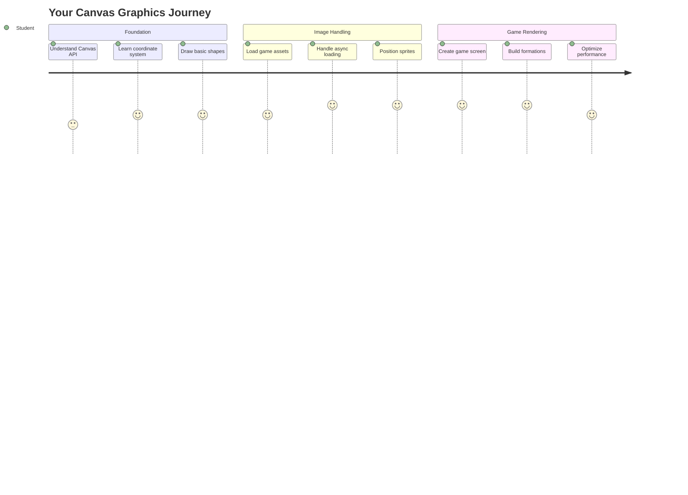
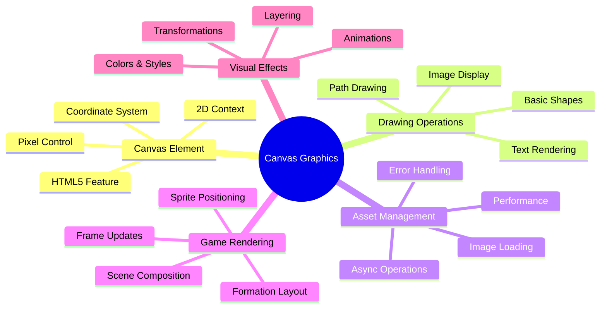
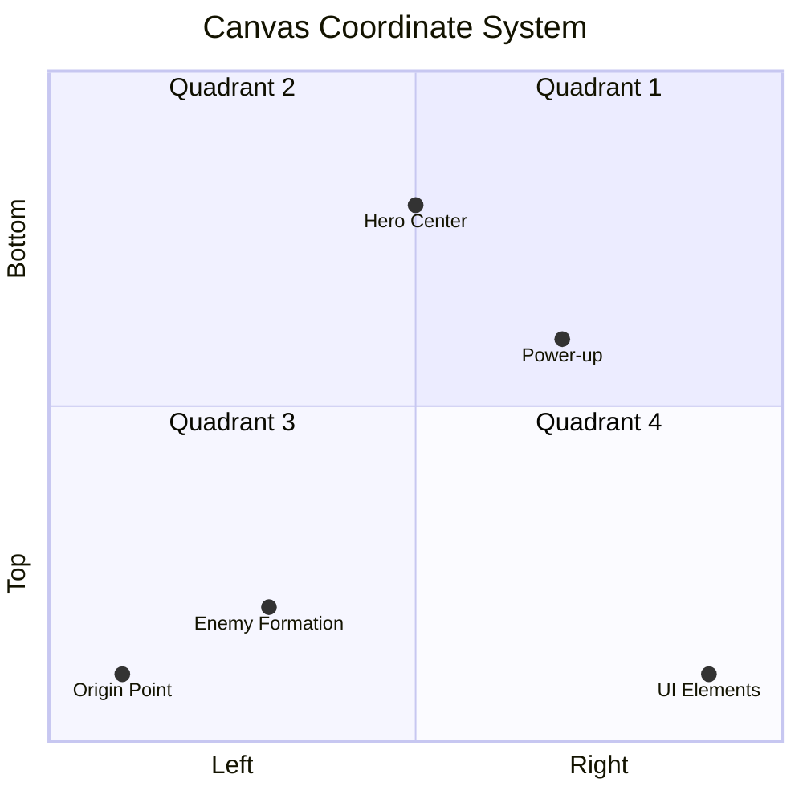
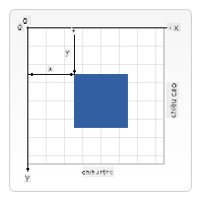
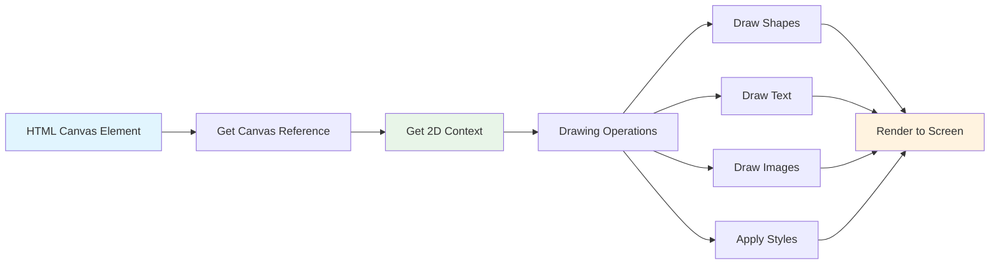
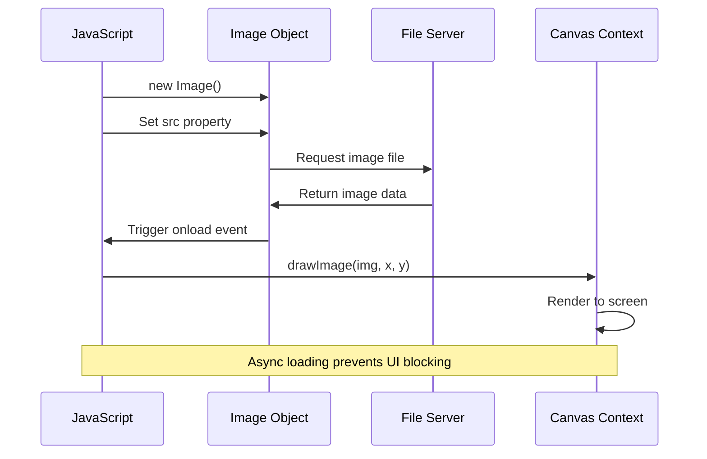
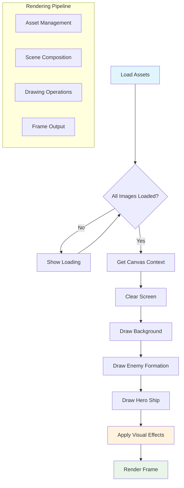
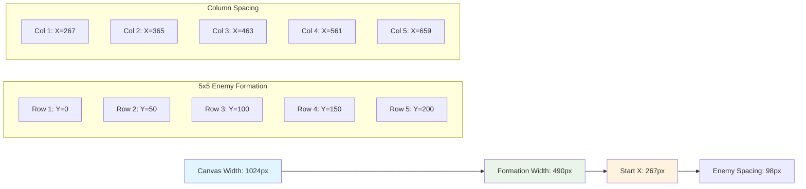
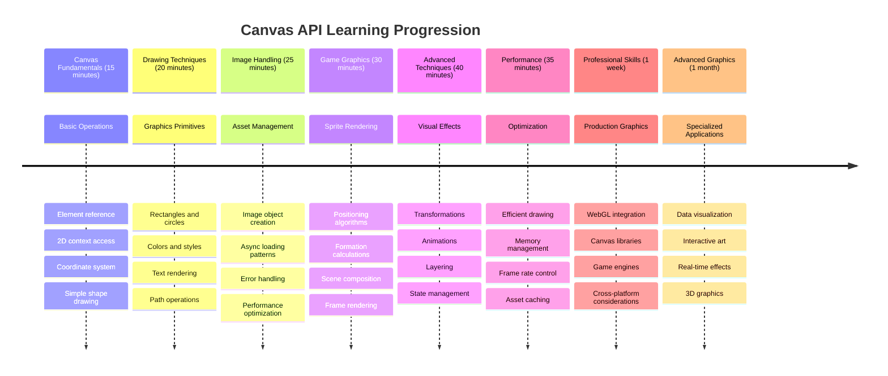

<!--
CO_OP_TRANSLATOR_METADATA:
{
  "original_hash": "7994743c5b21fdcceb36307916ef249a",
  "translation_date": "2025-11-06T11:32:09+00:00",
  "source_file": "6-space-game/2-drawing-to-canvas/README.md",
  "language_code": "vi"
}
-->
# Xây dựng trò chơi không gian Phần 2: Vẽ nhân vật chính và quái vật lên Canvas



Canvas API là một trong những tính năng mạnh mẽ nhất của phát triển web để tạo đồ họa động, tương tác ngay trong trình duyệt của bạn. Trong bài học này, chúng ta sẽ biến phần tử HTML `<canvas>` trống thành một thế giới trò chơi đầy nhân vật chính và quái vật. Hãy nghĩ về canvas như bảng vẽ kỹ thuật số của bạn, nơi mã hóa trở thành hình ảnh.

Chúng ta sẽ tiếp tục từ những gì bạn đã học trong bài trước, và bây giờ sẽ đi sâu vào các khía cạnh hình ảnh. Bạn sẽ học cách tải và hiển thị các sprite trò chơi, định vị các phần tử một cách chính xác, và tạo nền tảng hình ảnh cho trò chơi không gian của mình. Điều này kết nối giữa các trang web tĩnh và trải nghiệm tương tác, động.

Kết thúc bài học này, bạn sẽ có một cảnh trò chơi hoàn chỉnh với tàu của nhân vật chính được định vị chính xác và đội hình kẻ thù sẵn sàng chiến đấu. Bạn sẽ hiểu cách các trò chơi hiện đại hiển thị đồ họa trong trình duyệt và có kỹ năng để tạo ra trải nghiệm hình ảnh tương tác của riêng mình. Hãy khám phá đồ họa canvas và mang trò chơi không gian của bạn vào cuộc sống!



## Câu hỏi trước bài học

[Quiz trước bài học](https://ff-quizzes.netlify.app/web/quiz/31)

## Canvas

Vậy chính xác thì phần tử `<canvas>` là gì? Đây là giải pháp của HTML5 để tạo đồ họa và hoạt hình động trong trình duyệt web. Không giống như hình ảnh hoặc video thông thường vốn tĩnh, canvas cho phép bạn kiểm soát từng pixel trên màn hình. Điều này làm cho nó trở nên hoàn hảo cho trò chơi, trực quan hóa dữ liệu, và nghệ thuật tương tác. Hãy nghĩ về nó như một bề mặt vẽ có thể lập trình, nơi JavaScript trở thành cọ vẽ của bạn.

Theo mặc định, một phần tử canvas trông giống như một hình chữ nhật trong suốt, trống trên trang của bạn. Nhưng đó chính là nơi tiềm năng nằm! Sức mạnh thực sự của nó xuất hiện khi bạn sử dụng JavaScript để vẽ hình dạng, tải hình ảnh, tạo hoạt hình, và làm cho mọi thứ phản hồi với tương tác của người dùng. Điều này tương tự như cách các nhà tiên phong đồ họa máy tính tại Bell Labs vào những năm 1960 phải lập trình từng pixel để tạo ra các hoạt hình kỹ thuật số đầu tiên.

✅ Đọc [thêm về Canvas API](https://developer.mozilla.org/docs/Web/API/Canvas_API) trên MDN.

Dưới đây là cách nó thường được khai báo, như một phần của phần thân trang:

```html
<canvas id="myCanvas" width="200" height="100"></canvas>
```

**Đây là những gì đoạn mã này làm:**
- **Đặt** thuộc tính `id` để bạn có thể tham chiếu phần tử canvas cụ thể này trong JavaScript
- **Xác định** chiều rộng bằng pixel để kiểm soát kích thước ngang của canvas
- **Thiết lập** chiều cao bằng pixel để xác định kích thước dọc của canvas

## Vẽ hình học đơn giản

Bây giờ bạn đã biết phần tử canvas là gì, hãy khám phá cách thực sự vẽ trên nó! Canvas sử dụng hệ tọa độ có thể quen thuộc từ lớp toán, nhưng có một điểm khác biệt quan trọng cụ thể đối với đồ họa máy tính.

Canvas sử dụng hệ tọa độ Cartesian với trục x (ngang) và trục y (dọc) để định vị mọi thứ bạn vẽ. Nhưng đây là điểm khác biệt chính: không giống như hệ tọa độ trong lớp toán, điểm gốc `(0,0)` bắt đầu ở góc trên bên trái, với giá trị x tăng khi bạn di chuyển sang phải và giá trị y tăng khi bạn di chuyển xuống dưới. Cách tiếp cận này bắt nguồn từ các màn hình máy tính đầu tiên, nơi các tia điện tử quét từ trên xuống dưới, làm cho góc trên bên trái trở thành điểm bắt đầu tự nhiên.




> Hình ảnh từ [MDN](https://developer.mozilla.org/docs/Web/API/Canvas_API/Tutorial/Drawing_shapes)

Để vẽ trên phần tử canvas, bạn sẽ làm theo quy trình ba bước giống nhau, tạo nền tảng cho tất cả đồ họa canvas. Một khi bạn làm điều này vài lần, nó sẽ trở thành bản năng:



1. **Lấy tham chiếu** đến phần tử Canvas của bạn từ DOM (giống như bất kỳ phần tử HTML nào khác)
2. **Lấy ngữ cảnh kết xuất 2D** – đây là nơi cung cấp tất cả các phương pháp vẽ
3. **Bắt đầu vẽ!** Sử dụng các phương pháp tích hợp của ngữ cảnh để tạo đồ họa của bạn

Dưới đây là cách điều này trông trong mã:

```javascript
// Step 1: Get the canvas element
const canvas = document.getElementById("myCanvas");

// Step 2: Get the 2D rendering context
const ctx = canvas.getContext("2d");

// Step 3: Set fill color and draw a rectangle
ctx.fillStyle = 'red';
ctx.fillRect(0, 0, 200, 200); // x, y, width, height
```

**Hãy phân tích từng bước:**
- Chúng ta **lấy** phần tử canvas của mình bằng ID và lưu nó vào một biến
- Chúng ta **lấy** ngữ cảnh kết xuất 2D – đây là bộ công cụ đầy đủ các phương pháp vẽ
- Chúng ta **bảo** canvas rằng chúng ta muốn tô màu đỏ bằng thuộc tính `fillStyle`
- Chúng ta **vẽ** một hình chữ nhật bắt đầu từ góc trên bên trái (0,0) với chiều rộng và chiều cao 200 pixel

✅ Canvas API chủ yếu tập trung vào các hình dạng 2D, nhưng bạn cũng có thể vẽ các phần tử 3D lên trang web; để làm điều này, bạn có thể sử dụng [WebGL API](https://developer.mozilla.org/docs/Web/API/WebGL_API).

Bạn có thể vẽ nhiều thứ với Canvas API như:

- **Hình dạng hình học**, chúng ta đã chỉ cách vẽ một hình chữ nhật, nhưng còn nhiều thứ khác bạn có thể vẽ.
- **Văn bản**, bạn có thể vẽ văn bản với bất kỳ phông chữ và màu sắc nào bạn muốn.
- **Hình ảnh**, bạn có thể vẽ hình ảnh dựa trên một tài sản hình ảnh như .jpg hoặc .png chẳng hạn.

✅ Thử ngay! Bạn đã biết cách vẽ một hình chữ nhật, bạn có thể vẽ một hình tròn lên trang không? Hãy xem một số bản vẽ Canvas thú vị trên CodePen. Đây là một [ví dụ đặc biệt ấn tượng](https://codepen.io/dissimulate/pen/KrAwx).

### 🔄 **Kiểm tra sư phạm**
**Hiểu biết cơ bản về Canvas**: Trước khi chuyển sang tải hình ảnh, hãy đảm bảo bạn có thể:
- ✅ Giải thích cách hệ tọa độ canvas khác với hệ tọa độ toán học
- ✅ Hiểu quy trình ba bước cho các thao tác vẽ canvas
- ✅ Xác định những gì ngữ cảnh kết xuất 2D cung cấp
- ✅ Mô tả cách `fillStyle` và `fillRect` hoạt động cùng nhau

**Tự kiểm tra nhanh**: Làm thế nào để bạn vẽ một hình tròn màu xanh tại vị trí (100, 50) với bán kính 25?
```javascript
ctx.fillStyle = 'blue';
ctx.beginPath();
ctx.arc(100, 50, 25, 0, 2 * Math.PI);
ctx.fill();
```

**Các phương pháp vẽ Canvas bạn đã biết**:
- **fillRect()**: Vẽ hình chữ nhật được tô màu
- **fillStyle**: Đặt màu sắc và mẫu
- **beginPath()**: Bắt đầu các đường vẽ mới
- **arc()**: Tạo hình tròn và đường cong

## Tải và vẽ một tài sản hình ảnh

Vẽ các hình dạng cơ bản rất hữu ích để bắt đầu, nhưng hầu hết các trò chơi cần hình ảnh thực tế! Các sprite, nền, và kết cấu là những gì mang lại sự hấp dẫn hình ảnh cho trò chơi. Tải và hiển thị hình ảnh trên canvas hoạt động khác với vẽ hình dạng hình học, nhưng rất dễ hiểu một khi bạn nắm được quy trình.

Chúng ta cần tạo một đối tượng `Image`, tải tệp hình ảnh của mình (điều này xảy ra không đồng bộ, nghĩa là "trong nền"), và sau đó vẽ nó lên canvas khi nó sẵn sàng. Cách tiếp cận này đảm bảo hình ảnh của bạn hiển thị đúng cách mà không làm chậm ứng dụng của bạn trong khi chúng tải.



### Tải hình ảnh cơ bản

```javascript
const img = new Image();
img.src = 'path/to/my/image.png';
img.onload = () => {
  // Image loaded and ready to be used
  console.log('Image loaded successfully!');
};
```

**Đây là những gì đang xảy ra trong đoạn mã này:**
- Chúng ta **tạo** một đối tượng Image mới để chứa sprite hoặc kết cấu của mình
- Chúng ta **bảo** nó tải tệp hình ảnh nào bằng cách đặt đường dẫn nguồn
- Chúng ta **lắng nghe** sự kiện tải để biết chính xác khi nào hình ảnh sẵn sàng sử dụng

### Cách tốt hơn để tải hình ảnh

Dưới đây là cách xử lý tải hình ảnh mạnh mẽ hơn mà các nhà phát triển chuyên nghiệp thường sử dụng. Chúng ta sẽ gói việc tải hình ảnh trong một hàm dựa trên Promise – cách tiếp cận này, được phổ biến khi JavaScript Promises trở thành tiêu chuẩn trong ES6, giúp mã của bạn có tổ chức hơn và xử lý lỗi một cách hiệu quả:

```javascript
function loadAsset(path) {
  return new Promise((resolve, reject) => {
    const img = new Image();
    img.src = path;
    img.onload = () => {
      resolve(img);
    };
    img.onerror = () => {
      reject(new Error(`Failed to load image: ${path}`));
    };
  });
}

// Modern usage with async/await
async function initializeGame() {
  try {
    const heroImg = await loadAsset('hero.png');
    const monsterImg = await loadAsset('monster.png');
    // Images are now ready to use
  } catch (error) {
    console.error('Failed to load game assets:', error);
  }
}
```

**Những gì chúng ta đã làm ở đây:**
- **Gói** toàn bộ logic tải hình ảnh trong một Promise để chúng ta có thể xử lý tốt hơn
- **Thêm** xử lý lỗi thực sự thông báo cho chúng ta khi có điều gì đó sai
- **Sử dụng** cú pháp async/await hiện đại vì nó rất dễ đọc
- **Bao gồm** các khối try/catch để xử lý bất kỳ trục trặc nào khi tải

Khi hình ảnh của bạn đã được tải, việc vẽ chúng lên canvas thực sự khá đơn giản:

```javascript
async function renderGameScreen() {
  try {
    // Load game assets
    const heroImg = await loadAsset('hero.png');
    const monsterImg = await loadAsset('monster.png');

    // Get canvas and context
    const canvas = document.getElementById("myCanvas");
    const ctx = canvas.getContext("2d");

    // Draw images to specific positions
    ctx.drawImage(heroImg, canvas.width / 2, canvas.height / 2);
    ctx.drawImage(monsterImg, 0, 0);
  } catch (error) {
    console.error('Failed to render game screen:', error);
  }
}
```

**Hãy phân tích từng bước:**
- Chúng ta **tải** cả hình ảnh nhân vật chính và quái vật trong nền bằng await
- Chúng ta **lấy** phần tử canvas của mình và lấy ngữ cảnh kết xuất 2D cần thiết
- Chúng ta **định vị** hình ảnh nhân vật chính ngay giữa bằng một số phép toán tọa độ nhanh
- Chúng ta **đặt** hình ảnh quái vật ở góc trên bên trái để bắt đầu đội hình kẻ thù
- Chúng ta **bắt** bất kỳ lỗi nào có thể xảy ra trong quá trình tải hoặc kết xuất



## Bây giờ là lúc bắt đầu xây dựng trò chơi của bạn

Bây giờ chúng ta sẽ kết hợp mọi thứ lại để tạo nền tảng hình ảnh cho trò chơi không gian của bạn. Bạn đã hiểu rõ về các nguyên tắc cơ bản của canvas và kỹ thuật tải hình ảnh, vì vậy phần thực hành này sẽ hướng dẫn bạn xây dựng một màn hình trò chơi hoàn chỉnh với các sprite được định vị chính xác.

### Những gì cần xây dựng

Bạn sẽ xây dựng một trang web với một phần tử Canvas. Nó sẽ hiển thị một màn hình đen `1024*768`. Chúng tôi đã cung cấp cho bạn hai hình ảnh:

- Tàu nhân vật chính

   

- 5*5 quái vật

   

### Các bước được khuyến nghị để bắt đầu phát triển

Tìm các tệp khởi đầu đã được tạo cho bạn trong thư mục con `your-work`. Cấu trúc dự án của bạn nên bao gồm:

```bash
your-work/
├── assets/
│   ├── enemyShip.png
│   └── player.png
├── index.html
├── app.js
└── package.json
```

**Đây là những gì bạn đang làm việc với:**
- **Các sprite trò chơi** nằm trong thư mục `assets/` để mọi thứ được tổ chức
- **Tệp HTML chính của bạn** thiết lập phần tử canvas và chuẩn bị mọi thứ
- **Một tệp JavaScript** nơi bạn sẽ viết tất cả phép thuật kết xuất trò chơi của mình
- **Một package.json** thiết lập một máy chủ phát triển để bạn có thể kiểm tra cục bộ

Mở thư mục này trong Visual Studio Code để bắt đầu phát triển. Bạn sẽ cần một môi trường phát triển cục bộ với Visual Studio Code, NPM, và Node.js được cài đặt. Nếu bạn chưa thiết lập `npm` trên máy tính của mình, [đây là cách cài đặt nó](https://www.npmjs.com/get-npm).

Khởi động máy chủ phát triển của bạn bằng cách điều hướng đến thư mục `your-work`:

```bash
cd your-work
npm start
```

**Lệnh này làm một số điều khá thú vị:**
- **Khởi động** một máy chủ cục bộ tại `http://localhost:5000` để bạn có thể kiểm tra trò chơi của mình
- **Phục vụ** tất cả các tệp của bạn đúng cách để trình duyệt của bạn có thể tải chúng chính xác
- **Theo dõi** các tệp của bạn để thay đổi để bạn có thể phát triển một cách mượt mà
- **Cung cấp cho bạn** một môi trường phát triển chuyên nghiệp để kiểm tra mọi thứ

> 💡 **Lưu ý**: Ban đầu trình duyệt của bạn sẽ hiển thị một trang trống – điều đó là bình thường! Khi bạn thêm mã, hãy làm mới trình duyệt để xem các thay đổi của bạn. Cách tiếp cận phát triển lặp lại này tương tự như cách NASA xây dựng máy tính hướng dẫn Apollo – kiểm tra từng thành phần trước khi tích hợp nó vào hệ thống lớn hơn.

### Thêm mã

Thêm mã cần thiết vào `your-work/app.js` để hoàn thành các nhiệm vụ sau:

1. **Vẽ một canvas với nền đen**
   > 💡 **Cách thực hiện**: Tìm TODO trong `/app.js` và thêm chỉ hai dòng. Đặt `ctx.fillStyle` thành màu đen, sau đó sử dụng `ctx.fillRect()` bắt đầu từ (0,0) với kích thước canvas của bạn. Dễ dàng!

2. **Tải kết cấu trò chơi**
   > 💡 **Cách thực hiện**: Sử dụng `await loadAsset()` để tải hình ảnh nhân vật chính và kẻ thù của bạn. Lưu chúng vào các biến để bạn có thể sử dụng sau. Hãy nhớ – chúng sẽ không hiển thị cho đến khi bạn thực sự vẽ chúng!

3. **Vẽ tàu nhân vật chính ở vị trí trung tâm dưới cùng**
   > 💡 **Cách thực hiện**: Sử dụng `ctx.drawImage()` để định vị nhân vật chính của bạn. Đối với tọa độ x, hãy thử `canvas.width / 2 - 45` để đặt nó ở giữa, và đối với tọa độ y, sử dụng `canvas.height - canvas.height / 4` để đặt nó ở khu vực dưới cùng.

4. **Vẽ đội hình 5×5 tàu quái vật**
   > 💡 **Cách thực hiện**: Tìm hàm `createEnemies` và thiết lập một vòng lặp lồng nhau. Bạn sẽ cần thực hiện một số phép toán để tạo khoảng cách và định vị, nhưng đừng lo – tôi sẽ chỉ cho bạn chính xác cách làm!

Đầu tiên, thiết lập các hằng số để bố trí đội hình kẻ thù hợp lý:

```javascript
const ENEMY_TOTAL = 5;
const ENEMY_SPACING = 98;
const FORMATION_WIDTH = ENEMY_TOTAL * ENEMY_SPACING;
const START_X = (canvas.width - FORMATION_WIDTH) / 2;
const STOP_X = START_X + FORMATION_WIDTH;
```

**Hãy phân tích những gì các hằng số này làm:**
- Chúng ta **đặt** 5 kẻ thù mỗi hàng và cột (một lưới 5×5 đẹp mắt)
- Chúng ta **xác định** khoảng cách giữa các kẻ thù để chúng không bị chật chội
- Chúng ta **tính toán** chiều rộng của toàn bộ đội hình
- Chúng ta **xác định** nơi bắt đầu và kết thúc để đội hình trông cân đối



Sau đó, tạo các vòng lặp lồng nhau để vẽ đội hình kẻ thù:

```javascript
for (let x = START_X; x < STOP_X; x += ENEMY_SPACING) {
  for (let y = 0; y < 50 * 5; y += 50) {
    ctx.drawImage(enemyImg, x, y);
  }
}
```

**Đây là những gì vòng lặp lồng nhau này làm:**
- Vòng lặp bên ngoài **di chuyển** từ trái sang phải qua đội hình của chúng ta
- Vòng lặp bên trong **đi** từ trên xuống dưới để tạo các hàng gọn gàng
- Chúng ta **vẽ** mỗi sprite kẻ thù tại tọa độ x,y chính xác mà chúng ta đã tính toán
- Mọi thứ được **cách đều** để trông chuyên nghiệp và có tổ chức

### 🔄 **Kiểm tra sư phạm**
**Thành thạo kết xuất trò chơi**: Xác minh sự hiểu biết của bạn về hệ thống kết xuất hoàn chỉnh:
- ✅ Làm thế nào việc tải hình ảnh không đồng bộ ngăn chặn việc chặn giao diện người dùng khi khởi động trò chơi?
- ✅ Tại sao chúng ta tính toán vị trí đội hình kẻ thù bằng các hằng số thay vì mã hóa cứng?
- ✅ Vai trò của ngữ cảnh kết xuất 2D trong các thao tác vẽ là gì?
- ✅ Làm thế nào các vòng lặp lồng nhau tạo ra các đội hình sprite có tổ chức?

**Cân nhắc về hiệu suất**: Trò chơi của bạn bây giờ thể hiện:
- **Tải tài sản hiệu quả**: Quản lý hình ảnh dựa trên Promise
- **Kết xuất có tổ chức**: Các thao tác vẽ có cấu trúc
- **Định vị toán học**: Đặt sprite được tính toán
- **Xử lý lỗi**: Quản lý lỗi một cách hiệu quả

**Khái niệm lập trình hình ảnh**: Bạn đã học:
- **Hệ tọa độ**: Chuyển đổi toán học sang vị trí trên màn hình  
- **Quản lý sprite**: Tải và hiển thị đồ họa trò chơi  
- **Thuật toán tạo hình**: Mẫu toán học cho bố cục tổ chức  
- **Hoạt động bất đồng bộ**: JavaScript hiện đại cho trải nghiệm người dùng mượt mà  

## Kết quả  

Kết quả hoàn chỉnh sẽ trông như sau:  

  

## Giải pháp  

Hãy thử tự giải quyết trước, nhưng nếu bạn gặp khó khăn, hãy xem [giải pháp](../../../../6-space-game/2-drawing-to-canvas/solution/app.js)  

---

## Thử thách GitHub Copilot Agent 🚀  

Sử dụng chế độ Agent để hoàn thành thử thách sau:  

**Mô tả:** Nâng cấp canvas trò chơi không gian của bạn bằng cách thêm hiệu ứng hình ảnh và các yếu tố tương tác sử dụng các kỹ thuật Canvas API mà bạn đã học.  

**Yêu cầu:** Tạo một tệp mới có tên `enhanced-canvas.html` với một canvas hiển thị các ngôi sao động trong nền, thanh sức khỏe nhấp nháy cho tàu anh hùng, và các tàu địch di chuyển chậm xuống. Bao gồm mã JavaScript vẽ các ngôi sao lấp lánh bằng vị trí và độ mờ ngẫu nhiên, triển khai thanh sức khỏe thay đổi màu sắc dựa trên mức sức khỏe (xanh > vàng > đỏ), và tạo hiệu ứng các tàu địch di chuyển xuống màn hình với tốc độ khác nhau.  

Tìm hiểu thêm về [chế độ agent](https://code.visualstudio.com/blogs/2025/02/24/introducing-copilot-agent-mode) tại đây.  

## 🚀 Thử thách  

Bạn đã học về vẽ với Canvas API tập trung vào 2D; hãy xem [WebGL API](https://developer.mozilla.org/docs/Web/API/WebGL_API), và thử vẽ một đối tượng 3D.  

## Câu hỏi sau bài giảng  

[Câu hỏi sau bài giảng](https://ff-quizzes.netlify.app/web/quiz/32)  

## Ôn tập & Tự học  

Tìm hiểu thêm về Canvas API bằng cách [đọc về nó](https://developer.mozilla.org/docs/Web/API/Canvas_API).  

### ⚡ **Những gì bạn có thể làm trong 5 phút tới**  
- [ ] Mở console trình duyệt và tạo một phần tử canvas với `document.createElement('canvas')`  
- [ ] Thử vẽ một hình chữ nhật bằng `fillRect()` trên ngữ cảnh canvas  
- [ ] Thử nghiệm với các màu sắc khác nhau bằng thuộc tính `fillStyle`  
- [ ] Vẽ một hình tròn đơn giản bằng phương thức `arc()`  

### 🎯 **Những gì bạn có thể hoàn thành trong giờ này**  
- [ ] Hoàn thành câu hỏi sau bài học và hiểu các nguyên tắc cơ bản của canvas  
- [ ] Tạo một ứng dụng vẽ canvas với nhiều hình dạng và màu sắc  
- [ ] Triển khai tải hình ảnh và hiển thị sprite cho trò chơi của bạn  
- [ ] Xây dựng một hoạt cảnh đơn giản di chuyển các đối tượng trên canvas  
- [ ] Thực hành các phép biến đổi canvas như phóng to, xoay, và dịch chuyển  

### 📅 **Hành trình Canvas của bạn trong tuần**  
- [ ] Hoàn thành trò chơi không gian với đồ họa được cải thiện và hoạt ảnh sprite  
- [ ] Làm chủ các kỹ thuật canvas nâng cao như gradient, mẫu, và kết hợp  
- [ ] Tạo các hình ảnh tương tác sử dụng canvas để biểu diễn dữ liệu  
- [ ] Tìm hiểu các kỹ thuật tối ưu hóa canvas để có hiệu suất mượt mà  
- [ ] Xây dựng một ứng dụng vẽ hoặc tô màu với các công cụ khác nhau  
- [ ] Khám phá các mẫu mã sáng tạo và nghệ thuật tạo sinh với canvas  

### 🌟 **Sự thành thạo đồ họa của bạn trong tháng**  
- [ ] Xây dựng các ứng dụng hình ảnh phức tạp sử dụng Canvas 2D và WebGL  
- [ ] Tìm hiểu các khái niệm lập trình đồ họa và cơ bản về shader  
- [ ] Đóng góp cho các thư viện đồ họa mã nguồn mở và công cụ biểu diễn dữ liệu  
- [ ] Làm chủ tối ưu hóa hiệu suất cho các ứng dụng đồ họa chuyên sâu  
- [ ] Tạo nội dung giáo dục về lập trình canvas và đồ họa máy tính  
- [ ] Trở thành chuyên gia lập trình đồ họa giúp người khác tạo ra trải nghiệm hình ảnh  

## 🎯 Lộ trình thành thạo đồ họa Canvas của bạn  


  
### 🛠️ Tóm tắt bộ công cụ đồ họa Canvas của bạn  

Sau khi hoàn thành bài học này, bạn đã có:  
- **Thành thạo Canvas API**: Hiểu hoàn toàn về lập trình đồ họa 2D  
- **Toán học tọa độ**: Định vị chính xác và thuật toán bố cục  
- **Quản lý tài sản**: Tải hình ảnh chuyên nghiệp và xử lý lỗi  
- **Quy trình kết xuất**: Cách tiếp cận có cấu trúc để tạo cảnh  
- **Đồ họa trò chơi**: Định vị sprite và tính toán tạo hình  
- **Lập trình bất đồng bộ**: Mẫu JavaScript hiện đại cho hiệu suất mượt mà  
- **Lập trình hình ảnh**: Chuyển đổi các khái niệm toán học thành đồ họa trên màn hình  

**Ứng dụng thực tế**: Kỹ năng Canvas của bạn áp dụng trực tiếp vào:  
- **Biểu diễn dữ liệu**: Biểu đồ, đồ thị, và bảng điều khiển tương tác  
- **Phát triển trò chơi**: Trò chơi 2D, mô phỏng, và trải nghiệm tương tác  
- **Nghệ thuật số**: Mã sáng tạo và dự án nghệ thuật tạo sinh  
- **Thiết kế UI/UX**: Đồ họa tùy chỉnh và các yếu tố tương tác  
- **Phần mềm giáo dục**: Công cụ học tập trực quan và mô phỏng  
- **Ứng dụng web**: Đồ họa động và biểu diễn thời gian thực  

**Kỹ năng chuyên nghiệp đạt được**: Bây giờ bạn có thể:  
- **Xây dựng** giải pháp đồ họa tùy chỉnh mà không cần thư viện bên ngoài  
- **Tối ưu hóa** hiệu suất kết xuất cho trải nghiệm người dùng mượt mà  
- **Gỡ lỗi** các vấn đề hình ảnh phức tạp bằng công cụ phát triển trình duyệt  
- **Thiết kế** hệ thống đồ họa có thể mở rộng sử dụng các nguyên tắc toán học  
- **Tích hợp** đồ họa Canvas với các framework ứng dụng web hiện đại  

**Phương thức Canvas API bạn đã làm chủ**:  
- **Quản lý phần tử**: getElementById, getContext  
- **Hoạt động vẽ**: fillRect, drawImage, fillStyle  
- **Tải tài sản**: Đối tượng hình ảnh, mẫu Promise  
- **Định vị toán học**: Tính toán tọa độ, thuật toán tạo hình  

**Cấp độ tiếp theo**: Bạn đã sẵn sàng để thêm hoạt ảnh, tương tác người dùng, phát hiện va chạm, hoặc khám phá WebGL cho đồ họa 3D!  

🌟 **Thành tựu mở khóa**: Bạn đã xây dựng một hệ thống kết xuất trò chơi hoàn chỉnh sử dụng các kỹ thuật cơ bản của Canvas API!  

## Bài tập  

[Khám phá Canvas API](assignment.md)  

---

**Tuyên bố miễn trừ trách nhiệm**:  
Tài liệu này đã được dịch bằng dịch vụ dịch thuật AI [Co-op Translator](https://github.com/Azure/co-op-translator). Mặc dù chúng tôi cố gắng đảm bảo độ chính xác, xin lưu ý rằng các bản dịch tự động có thể chứa lỗi hoặc không chính xác. Tài liệu gốc bằng ngôn ngữ bản địa nên được coi là nguồn thông tin chính thức. Đối với thông tin quan trọng, nên sử dụng dịch vụ dịch thuật chuyên nghiệp bởi con người. Chúng tôi không chịu trách nhiệm cho bất kỳ sự hiểu lầm hoặc diễn giải sai nào phát sinh từ việc sử dụng bản dịch này.