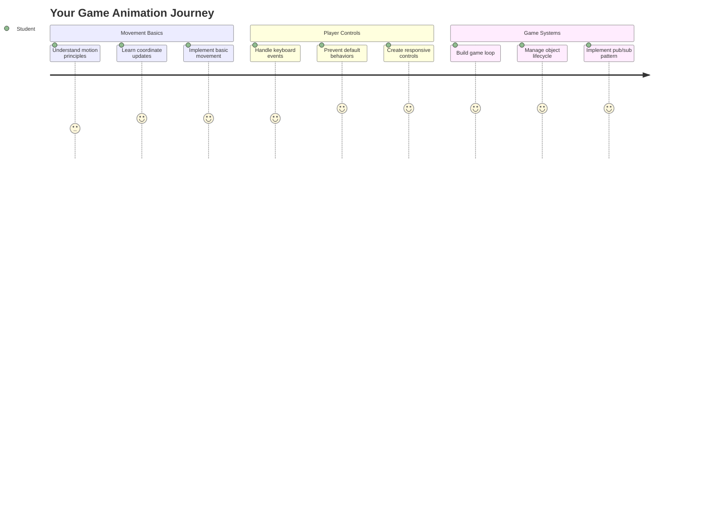
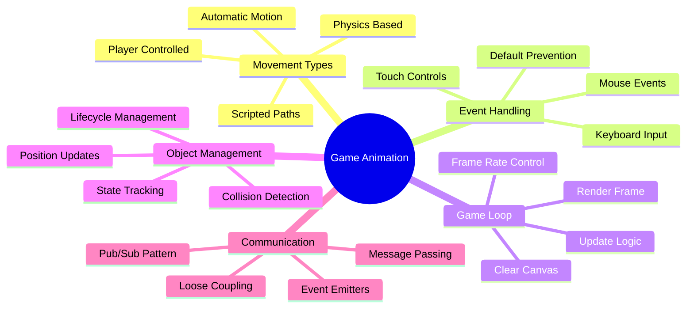
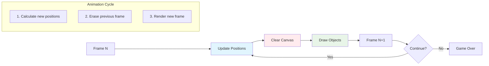
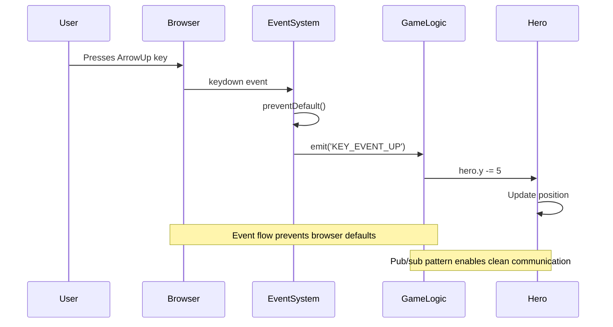
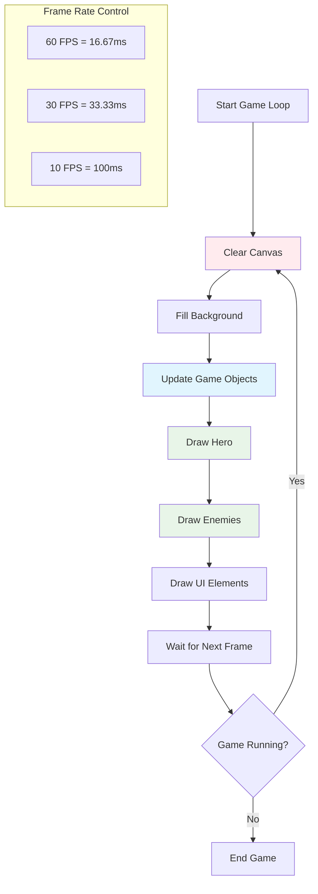
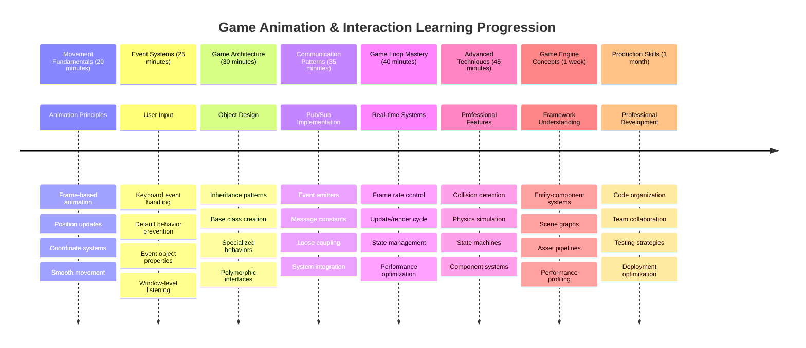

# Xây dựng trò chơi không gian Phần 3: Thêm chuyển động



Hãy nghĩ về những trò chơi yêu thích của bạn – điều làm chúng hấp dẫn không chỉ là đồ họa đẹp mắt, mà còn là cách mọi thứ di chuyển và phản hồi theo hành động của bạn. Hiện tại, trò chơi không gian của bạn giống như một bức tranh đẹp, nhưng chúng ta sắp thêm chuyển động để làm nó sống động hơn.

Khi các kỹ sư của NASA lập trình máy tính hướng dẫn cho các nhiệm vụ Apollo, họ đã đối mặt với một thách thức tương tự: làm thế nào để tàu vũ trụ phản hồi theo điều khiển của phi công trong khi vẫn tự động duy trì các điều chỉnh hướng đi? Những nguyên tắc chúng ta sẽ học hôm nay phản ánh những khái niệm tương tự – quản lý chuyển động do người chơi điều khiển cùng với các hành vi hệ thống tự động.

Trong bài học này, bạn sẽ học cách làm cho tàu vũ trụ lướt qua màn hình, phản hồi theo lệnh của người chơi, và tạo ra các mẫu chuyển động mượt mà. Chúng ta sẽ chia nhỏ mọi thứ thành các khái niệm dễ hiểu và xây dựng chúng một cách tự nhiên.

Kết thúc bài học, người chơi sẽ có thể điều khiển tàu anh hùng bay quanh màn hình trong khi các tàu địch tuần tra phía trên. Quan trọng hơn, bạn sẽ hiểu được các nguyên tắc cốt lõi vận hành hệ thống chuyển động trong trò chơi.



## Quiz trước bài học

[Quiz trước bài học](https://ff-quizzes.netlify.app/web/quiz/33)

## Hiểu về chuyển động trong trò chơi

Trò chơi trở nên sống động khi mọi thứ bắt đầu di chuyển, và có hai cách cơ bản để điều này xảy ra:

- **Chuyển động do người chơi điều khiển**: Khi bạn nhấn một phím hoặc click chuột, một thứ gì đó di chuyển. Đây là sự kết nối trực tiếp giữa bạn và thế giới trò chơi.
- **Chuyển động tự động**: Khi trò chơi tự quyết định di chuyển các đối tượng – như những tàu địch cần tuần tra màn hình dù bạn có làm gì hay không.

Làm cho các đối tượng di chuyển trên màn hình máy tính đơn giản hơn bạn nghĩ. Nhớ những tọa độ x và y từ lớp toán không? Đó chính xác là những gì chúng ta đang làm việc ở đây. Khi Galileo theo dõi các mặt trăng của sao Mộc vào năm 1610, ông về cơ bản cũng đang làm điều tương tự – vẽ các vị trí theo thời gian để hiểu các mẫu chuyển động.

Di chuyển các đối tượng trên màn hình giống như tạo một cuốn sách hoạt hình – bạn cần làm theo ba bước đơn giản sau:



1. **Cập nhật vị trí** – Thay đổi nơi đối tượng của bạn nên ở (có thể di chuyển nó 5 pixel sang phải)
2. **Xóa khung hình cũ** – Làm sạch màn hình để không thấy các vệt mờ
3. **Vẽ khung hình mới** – Đặt đối tượng của bạn vào vị trí mới

Làm điều này đủ nhanh, và bùm! Bạn có chuyển động mượt mà khiến người chơi cảm thấy tự nhiên.

Đây là cách nó có thể trông như trong mã:

```javascript
// Set the hero's location
hero.x += 5;
// Clear the rectangle that hosts the hero
ctx.clearRect(0, 0, canvas.width, canvas.height);
// Redraw the game background and hero
ctx.fillRect(0, 0, canvas.width, canvas.height);
ctx.fillStyle = "black";
ctx.drawImage(heroImg, hero.x, hero.y);
```

**Mã này làm gì:**
- **Cập nhật** tọa độ x của tàu anh hùng thêm 5 pixel để di chuyển theo chiều ngang
- **Xóa** toàn bộ khu vực canvas để loại bỏ khung hình trước đó
- **Lấp đầy** canvas bằng màu nền đen
- **Vẽ lại** hình ảnh tàu anh hùng tại vị trí mới

✅ Bạn có thể nghĩ ra lý do tại sao việc vẽ lại tàu anh hùng nhiều khung hình mỗi giây có thể gây ra chi phí hiệu suất không? Đọc về [các giải pháp thay thế cho mẫu này](https://developer.mozilla.org/en-US/docs/Web/API/Canvas_API/Tutorial/Optimizing_canvas).

## Xử lý sự kiện bàn phím

Đây là nơi chúng ta kết nối đầu vào của người chơi với hành động trong trò chơi. Khi ai đó nhấn phím cách để bắn tia laser hoặc nhấn phím mũi tên để né tránh một tiểu hành tinh, trò chơi của bạn cần phát hiện và phản hồi đầu vào đó.

Các sự kiện bàn phím xảy ra ở cấp độ cửa sổ, nghĩa là toàn bộ cửa sổ trình duyệt của bạn đang lắng nghe các lần nhấn phím đó. Các lần click chuột, mặt khác, có thể được gắn với các phần tử cụ thể (như click vào một nút). Đối với trò chơi không gian của chúng ta, chúng ta sẽ tập trung vào điều khiển bàn phím vì đó là điều mang lại cảm giác arcade cổ điển cho người chơi.

Điều này làm tôi nhớ đến cách các nhà điều hành điện báo vào thế kỷ 19 phải dịch đầu vào mã Morse thành các thông điệp có ý nghĩa – chúng ta đang làm điều tương tự, dịch các lần nhấn phím thành lệnh trò chơi.

Để xử lý một sự kiện, bạn cần sử dụng phương thức `addEventListener()` của cửa sổ và cung cấp cho nó hai tham số đầu vào. Tham số đầu tiên là tên của sự kiện, ví dụ `keyup`. Tham số thứ hai là hàm sẽ được gọi khi sự kiện xảy ra.

Đây là một ví dụ:

```javascript
window.addEventListener('keyup', (evt) => {
  // evt.key = string representation of the key
  if (evt.key === 'ArrowUp') {
    // do something
  }
});
```

**Phân tích những gì xảy ra ở đây:**
- **Lắng nghe** các sự kiện bàn phím trên toàn bộ cửa sổ
- **Thu thập** đối tượng sự kiện chứa thông tin về phím nào đã được nhấn
- **Kiểm tra** nếu phím nhấn khớp với một phím cụ thể (trong trường hợp này là mũi tên lên)
- **Thực thi** mã khi điều kiện được đáp ứng

Đối với các sự kiện phím, có hai thuộc tính trên đối tượng sự kiện mà bạn có thể sử dụng để xem phím nào đã được nhấn:

- `key` - đây là biểu diễn dạng chuỗi của phím nhấn, ví dụ `'ArrowUp'`
- `keyCode` - đây là biểu diễn dạng số, ví dụ `37`, tương ứng với `ArrowLeft`

✅ Việc thao tác sự kiện phím rất hữu ích ngoài phát triển trò chơi. Bạn có thể nghĩ ra những ứng dụng nào khác cho kỹ thuật này?



### Các phím đặc biệt: lưu ý!

Một số phím có hành vi tích hợp của trình duyệt có thể gây cản trở trò chơi của bạn. Các phím mũi tên cuộn trang và phím cách nhảy xuống – những hành vi bạn không muốn khi ai đó đang cố điều khiển tàu vũ trụ của họ.

Chúng ta có thể ngăn chặn những hành vi mặc định này và để trò chơi xử lý đầu vào thay thế. Điều này tương tự như cách các lập trình viên máy tính thời kỳ đầu phải ghi đè các ngắt hệ thống để tạo ra các hành vi tùy chỉnh – chúng ta chỉ đang làm điều đó ở cấp độ trình duyệt. Đây là cách:

```javascript
const onKeyDown = function (e) {
  console.log(e.keyCode);
  switch (e.keyCode) {
    case 37:
    case 39:
    case 38:
    case 40: // Arrow keys
    case 32:
      e.preventDefault();
      break; // Space
    default:
      break; // do not block other keys
  }
};

window.addEventListener('keydown', onKeyDown);
```

**Hiểu mã ngăn chặn này:**
- **Kiểm tra** các mã phím cụ thể có thể gây ra hành vi không mong muốn của trình duyệt
- **Ngăn chặn** hành động mặc định của trình duyệt đối với các phím mũi tên và phím cách
- **Cho phép** các phím khác hoạt động bình thường
- **Sử dụng** `e.preventDefault()` để dừng hành vi tích hợp của trình duyệt

### 🔄 **Kiểm tra sư phạm**
**Hiểu về xử lý sự kiện**: Trước khi chuyển sang chuyển động tự động, hãy đảm bảo bạn có thể:
- ✅ Giải thích sự khác biệt giữa các sự kiện `keydown` và `keyup`
- ✅ Hiểu tại sao chúng ta ngăn chặn các hành vi mặc định của trình duyệt
- ✅ Mô tả cách các trình lắng nghe sự kiện kết nối đầu vào của người dùng với logic trò chơi
- ✅ Xác định các phím nào có thể gây cản trở điều khiển trò chơi

**Kiểm tra nhanh bản thân**: Điều gì sẽ xảy ra nếu bạn không ngăn chặn hành vi mặc định cho các phím mũi tên?
*Trả lời: Trình duyệt sẽ cuộn trang, gây cản trở chuyển động trong trò chơi*

**Kiến trúc hệ thống sự kiện**: Bây giờ bạn đã hiểu:
- **Lắng nghe cấp độ cửa sổ**: Thu thập sự kiện ở cấp độ trình duyệt
- **Thuộc tính đối tượng sự kiện**: Chuỗi `key` so với số `keyCode`
- **Ngăn chặn mặc định**: Dừng các hành vi không mong muốn của trình duyệt
- **Logic điều kiện**: Phản hồi các tổ hợp phím cụ thể

## Chuyển động do trò chơi tạo ra

Bây giờ hãy nói về các đối tượng di chuyển mà không cần đầu vào của người chơi. Hãy nghĩ về các tàu địch lướt qua màn hình, các viên đạn bay theo đường thẳng, hoặc các đám mây trôi trong nền. Chuyển động tự động này làm cho thế giới trò chơi của bạn cảm giác sống động ngay cả khi không ai chạm vào điều khiển.

Chúng ta sử dụng các bộ hẹn giờ tích hợp của JavaScript để cập nhật vị trí theo các khoảng thời gian đều đặn. Khái niệm này tương tự như cách đồng hồ quả lắc hoạt động – một cơ chế đều đặn kích hoạt các hành động theo thời gian. Đây là cách đơn giản nó có thể trông như:

```javascript
const id = setInterval(() => {
  // Move the enemy on the y axis
  enemy.y += 10;
}, 100);
```

**Mã chuyển động này làm gì:**
- **Tạo** một bộ hẹn giờ chạy mỗi 100 mili giây
- **Cập nhật** tọa độ y của tàu địch thêm 10 pixel mỗi lần
- **Lưu trữ** ID khoảng thời gian để chúng ta có thể dừng nó sau này nếu cần
- **Di chuyển** tàu địch xuống dưới màn hình một cách tự động

## Vòng lặp trò chơi

Đây là khái niệm kết nối mọi thứ lại với nhau – vòng lặp trò chơi. Nếu trò chơi của bạn là một bộ phim, vòng lặp trò chơi sẽ là máy chiếu phim, hiển thị khung hình này đến khung hình khác nhanh đến mức mọi thứ dường như di chuyển mượt mà.

Mỗi trò chơi đều có một vòng lặp như thế này chạy phía sau. Đó là một hàm cập nhật tất cả các đối tượng trò chơi, vẽ lại màn hình, và lặp lại quá trình này liên tục. Điều này theo dõi tàu anh hùng của bạn, tất cả các tàu địch, bất kỳ tia laser nào bay xung quanh – toàn bộ trạng thái trò chơi.

Khái niệm này làm tôi nhớ đến cách các nhà làm phim hoạt hình thời kỳ đầu như Walt Disney phải vẽ lại các nhân vật từng khung hình để tạo ra ảo giác chuyển động. Chúng ta đang làm điều tương tự, chỉ là với mã thay vì bút chì.

Đây là cách một vòng lặp trò chơi thường trông như, được biểu diễn bằng mã:



```javascript
const gameLoopId = setInterval(() => {
  function gameLoop() {
    ctx.clearRect(0, 0, canvas.width, canvas.height);
    ctx.fillStyle = "black";
    ctx.fillRect(0, 0, canvas.width, canvas.height);
    drawHero();
    drawEnemies();
    drawStaticObjects();
  }
  gameLoop();
}, 200);
```

**Hiểu cấu trúc vòng lặp trò chơi:**
- **Xóa** toàn bộ canvas để loại bỏ khung hình trước đó
- **Lấp đầy** nền bằng một màu đồng nhất
- **Vẽ** tất cả các đối tượng trò chơi tại vị trí hiện tại của chúng
- **Lặp lại** quá trình này mỗi 200 mili giây để tạo ra hoạt hình mượt mà
- **Quản lý** tốc độ khung hình bằng cách kiểm soát thời gian khoảng cách

## Tiếp tục trò chơi không gian

Bây giờ chúng ta sẽ thêm chuyển động vào cảnh tĩnh bạn đã xây dựng trước đó. Chúng ta sẽ biến nó từ một ảnh chụp màn hình thành một trải nghiệm tương tác. Chúng ta sẽ làm từng bước để đảm bảo mỗi phần xây dựng dựa trên phần trước.

Lấy mã từ nơi chúng ta đã dừng lại trong bài học trước (hoặc bắt đầu với mã trong thư mục [Phần II - khởi đầu](../../../../6-space-game/3-moving-elements-around/your-work) nếu bạn cần bắt đầu lại).

**Đây là những gì chúng ta sẽ xây dựng hôm nay:**
- **Điều khiển anh hùng**: Các phím mũi tên sẽ điều khiển tàu vũ trụ của bạn quanh màn hình
- **Chuyển động của địch**: Những tàu ngoài hành tinh sẽ bắt đầu tiến công

Hãy bắt đầu triển khai các tính năng này.

## Các bước được khuyến nghị

Tìm các tệp đã được tạo cho bạn trong thư mục con `your-work`. Nó nên chứa các tệp sau:

```bash
-| assets
  -| enemyShip.png
  -| player.png
-| index.html
-| app.js
-| package.json
```

Bạn bắt đầu dự án của mình trong thư mục `your-work` bằng cách gõ:

```bash
cd your-work
npm start
```

**Lệnh này làm gì:**
- **Điều hướng** đến thư mục dự án của bạn
- **Khởi động** một HTTP Server tại địa chỉ `http://localhost:5000`
- **Phục vụ** các tệp trò chơi của bạn để bạn có thể kiểm tra chúng trong trình duyệt

Lệnh trên sẽ khởi động một HTTP Server tại địa chỉ `http://localhost:5000`. Mở trình duyệt và nhập địa chỉ đó, ngay bây giờ nó sẽ hiển thị tàu anh hùng và tất cả các tàu địch; chưa có gì di chuyển - nhưng sẽ sớm thôi!

### Thêm mã

1. **Thêm các đối tượng chuyên dụng** cho `hero`, `enemy` và `game object`, chúng nên có các thuộc tính `x` và `y`. (Nhớ phần về [Kế thừa hoặc thành phần](../README.md)).

   *GỢI Ý* `game object` nên là đối tượng có `x` và `y` và khả năng tự vẽ lên canvas.

   > **Mẹo**: Bắt đầu bằng cách thêm một lớp `GameObject` mới với constructor được định nghĩa như dưới đây, và sau đó vẽ nó lên canvas:

    ```javascript
    class GameObject {
      constructor(x, y) {
        this.x = x;
        this.y = y;
        this.dead = false;
        this.type = "";
        this.width = 0;
        this.height = 0;
        this.img = undefined;
      }
    
      draw(ctx) {
        ctx.drawImage(this.img, this.x, this.y, this.width, this.height);
      }
    }
    ```

    **Hiểu lớp cơ bản này:**
    - **Định nghĩa** các thuộc tính chung mà tất cả các đối tượng trò chơi chia sẻ (vị trí, kích thước, hình ảnh)
    - **Bao gồm** một cờ `dead` để theo dõi liệu đối tượng có nên bị loại bỏ hay không
    - **Cung cấp** một phương thức `draw()` để hiển thị đối tượng trên canvas
    - **Đặt** các giá trị mặc định cho tất cả các thuộc tính mà các lớp con có thể ghi đè

    ```mermaid
    classDiagram
        class GameObject {
            +x: number
            +y: number
            +dead: boolean
            +type: string
            +width: number
            +height: number
            +img: Image
            +draw(ctx)
        }
        
        class Hero {
            +speed: number
            +type: "Hero"
            +width: 98
            +height: 75
        }
        
        class Enemy {
            +type: "Enemy"
            +width: 98
            +height: 50
            +setInterval()
        }
        
        GameObject <|-- Hero
        GameObject <|-- Enemy
        
        class EventEmitter {
            +listeners: object
            +on(message, listener)
            +emit(message, payload)
        }
    ```

    Bây giờ, mở rộng `GameObject` để tạo `Hero` và `Enemy`:
    
    ```javascript
    class Hero extends GameObject {
      constructor(x, y) {
        super(x, y);
        this.width = 98;
        this.height = 75;
        this.type = "Hero";
        this.speed = 5;
      }
    }
    ```

    ```javascript
    class Enemy extends GameObject {
      constructor(x, y) {
        super(x, y);
        this.width = 98;
        this.height = 50;
        this.type = "Enemy";
        const id = setInterval(() => {
          if (this.y < canvas.height - this.height) {
            this.y += 5;
          } else {
            console.log('Stopped at', this.y);
            clearInterval(id);
          }
        }, 300);
      }
    }
    ```

    **Các khái niệm chính trong các lớp này:**
    - **Kế thừa** từ `GameObject` bằng cách sử dụng từ khóa `extends`
    - **Gọi** constructor của lớp cha với `super(x, y)`
    - **Đặt** các kích thước và thuộc tính cụ thể cho từng loại đối tượng
    - **Triển khai** chuyển động tự động cho các tàu địch bằng cách sử dụng `setInterval()`

2. **Thêm các trình xử lý sự kiện phím** để xử lý điều hướng phím (di chuyển tàu anh hùng lên/xuống trái/phải)

   *NHỚ* đây là hệ tọa độ Cartesian, góc trên bên trái là `0,0`. Cũng nhớ thêm mã để dừng *hành vi mặc định*

   > **Mẹo**: Tạo hàm `onKeyDown` của bạn và gắn nó vào cửa sổ:

   ```javascript
   const onKeyDown = function (e) {
     console.log(e.keyCode);
     // Add the code from the lesson above to stop default behavior
     switch (e.keyCode) {
       case 37:
       case 39:
       case 38:
       case 40: // Arrow keys
       case 32:
         e.preventDefault();
         break; // Space
       default:
         break; // do not block other keys
     }
   };

   window.addEventListener("keydown", onKeyDown);
   ```
    
   **Trình xử lý sự kiện này làm gì:**
   - **Lắng nghe** các sự kiện nhấn phím trên toàn bộ cửa sổ
   - **Ghi lại** mã phím để giúp bạn gỡ lỗi các phím đang được nhấn
   - **Ngăn chặn** hành vi mặc định của trình duyệt đối với các phím mũi tên và phím cách
   - **Cho phép** các phím khác hoạt động bình thường
   
   Kiểm tra bảng điều khiển trình duyệt của bạn tại thời điểm này, và xem các lần nhấn phím được ghi lại.

3. **Triển khai** [Mẫu Pub-Sub](../README.md), điều này sẽ giữ mã của bạn sạch sẽ khi bạn tiếp tục các phần còn lại.

   Mẫu Publish-Subscribe giúp tổ chức mã của bạn bằng cách tách biệt việc phát hiện sự kiện khỏi xử lý sự kiện. Điều này làm cho mã của bạn dễ bảo trì và dễ mở rộng hơn.

   Để thực hiện phần cuối này, bạn có thể:

   1. **Thêm một trình lắng nghe sự kiện** trên cửa sổ:

       ```javascript
       window.addEventListener("keyup", (evt) => {
         if (evt.key === "ArrowUp") {
           eventEmitter.emit(Messages.KEY_EVENT_UP);
         } else if (evt.key === "ArrowDown") {
           eventEmitter.emit(Messages.KEY_EVENT_DOWN);
         } else if (evt.key === "ArrowLeft") {
           eventEmitter.emit(Messages.KEY_EVENT_LEFT);
         } else if (evt.key === "ArrowRight") {
           eventEmitter.emit(Messages.KEY_EVENT_RIGHT);
         }
       });
       ```

   **Hệ thống sự kiện này làm gì:**
   - **Phát hiện** đầu vào bàn phím và chuyển đổi nó thành các sự kiện trò chơi tùy chỉnh
   - **Tách biệt** việc phát hiện đầu vào khỏi logic trò chơi
   - **Làm cho** việc thay đổi điều khiển sau này dễ dàng mà không ảnh hưởng đến mã trò chơi
   - **Cho phép** nhiều hệ thống phản hồi cùng một đầu vào

   ```mermaid
   flowchart TD
       A["Keyboard Input"] --> B["Window Event Listener"]
       B --> C["Event Emitter"]
       C --> D["KEY_EVENT_UP"]
       C --> E["KEY_EVENT_DOWN"]
       C --> F["KEY_EVENT_LEFT"]
       C --> G["KEY_EVENT_RIGHT"]
       
       D --> H["Hero Movement"]
       D --> I["Sound System"]
       D --> J["Visual Effects"]
       
       E --> H
       F --> H
       G --> H
       
       style A fill:#e1f5fe
       style C fill:#e8f5e8
       style H fill:#fff3e0
   ```

   2. **Tạo một lớp EventEmitter** để phát hành và đăng ký các thông báo:

       ```javascript
       class EventEmitter {
         constructor() {
           this.listeners = {};
         }
       
         on(message, listener) {
           if (!this.listeners[message]) {
             this.listeners[message] = [];
           }
           this.listeners[message].push(listener);
         }
       
   3. **Thêm các hằng số** và thiết lập EventEmitter:

       ```javascript
       const Messages = {
         KEY_EVENT_UP: "KEY_EVENT_UP",
         KEY_EVENT_DOWN: "KEY_EVENT_DOWN",
         KEY_EVENT_LEFT: "KEY_EVENT_LEFT",
         KEY_EVENT_RIGHT: "KEY_EVENT_RIGHT",
       };
       
       let heroImg, 
           enemyImg, 
           laserImg,
           canvas, ctx, 
           gameObjects = [], 
           hero, 
           eventEmitter = new EventEmitter();
       ```

   **Hiểu thiết lập này:**
   - **Định nghĩa** các hằng số thông báo để tránh lỗi chính tả và dễ dàng tái cấu trúc
   - **Khai báo** các biến cho hình ảnh, ngữ cảnh canvas, và trạng thái trò chơi
   - **Tạo** một EventEmitter toàn cục cho hệ thống pub-sub
   - **Khởi tạo** một mảng để chứa tất cả các đối tượng trong trò chơi

   4. **Khởi động trò chơi**

       ```javascript
       function initGame() {
         gameObjects = [];
         createEnemies();
         createHero();
       
         eventEmitter.on(Messages.KEY_EVENT_UP, () => {
           hero.y -= 5;
         });
       
         eventEmitter.on(Messages.KEY_EVENT_DOWN, () => {
           hero.y += 5;
         });
       
         eventEmitter.on(Messages.KEY_EVENT_LEFT, () => {
           hero.x -= 5;
         });
       
4. **Thiết lập vòng lặp trò chơi**

   Tái cấu trúc hàm `window.onload` để khởi động trò chơi và thiết lập vòng lặp trò chơi với khoảng thời gian hợp lý. Bạn cũng sẽ thêm tia laser:

    ```javascript
    window.onload = async () => {
      canvas = document.getElementById("canvas");
      ctx = canvas.getContext("2d");
      heroImg = await loadTexture("assets/player.png");
      enemyImg = await loadTexture("assets/enemyShip.png");
      laserImg = await loadTexture("assets/laserRed.png");
    
      initGame();
      const gameLoopId = setInterval(() => {
        ctx.clearRect(0, 0, canvas.width, canvas.height);
        ctx.fillStyle = "black";
        ctx.fillRect(0, 0, canvas.width, canvas.height);
        drawGameObjects(ctx);
      }, 100);
    };
    ```

   **Hiểu về thiết lập trò chơi:**
   - **Chờ** trang tải hoàn toàn trước khi bắt đầu
   - **Lấy** phần tử canvas và ngữ cảnh render 2D của nó
   - **Tải** tất cả các tài nguyên hình ảnh một cách không đồng bộ bằng `await`
   - **Bắt đầu** vòng lặp trò chơi chạy với khoảng thời gian 100ms (10 FPS)
   - **Xóa** và vẽ lại toàn bộ màn hình mỗi khung hình

5. **Thêm mã** để di chuyển kẻ thù theo một khoảng thời gian nhất định

    Tái cấu trúc hàm `createEnemies()` để tạo kẻ thù và thêm chúng vào lớp gameObjects mới:

    ```javascript
    function createEnemies() {
      const MONSTER_TOTAL = 5;
      const MONSTER_WIDTH = MONSTER_TOTAL * 98;
      const START_X = (canvas.width - MONSTER_WIDTH) / 2;
      const STOP_X = START_X + MONSTER_WIDTH;
    
      for (let x = START_X; x < STOP_X; x += 98) {
        for (let y = 0; y < 50 * 5; y += 50) {
          const enemy = new Enemy(x, y);
          enemy.img = enemyImg;
          gameObjects.push(enemy);
        }
      }
    }
    ```

    **Chức năng của việc tạo kẻ thù:**
    - **Tính toán** vị trí để đặt kẻ thù ở giữa màn hình
    - **Tạo** một lưới kẻ thù bằng cách sử dụng vòng lặp lồng nhau
    - **Gán** hình ảnh kẻ thù cho từng đối tượng kẻ thù
    - **Thêm** từng kẻ thù vào mảng đối tượng trò chơi toàn cục
    
    và thêm một hàm `createHero()` để thực hiện quy trình tương tự cho nhân vật chính.
    
    ```javascript
    function createHero() {
      hero = new Hero(
        canvas.width / 2 - 45,
        canvas.height - canvas.height / 4
      );
      hero.img = heroImg;
      gameObjects.push(hero);
    }
    ```

    **Chức năng của việc tạo nhân vật chính:**
    - **Đặt vị trí** nhân vật chính ở giữa phía dưới màn hình
    - **Gán** hình ảnh nhân vật chính cho đối tượng nhân vật chính
    - **Thêm** nhân vật chính vào mảng đối tượng trò chơi để hiển thị

    và cuối cùng, thêm một hàm `drawGameObjects()` để bắt đầu vẽ:

    ```javascript
    function drawGameObjects(ctx) {
      gameObjects.forEach(go => go.draw(ctx));
    }
    ```

    **Hiểu về hàm vẽ:**
    - **Duyệt qua** tất cả các đối tượng trò chơi trong mảng
    - **Gọi** phương thức `draw()` trên từng đối tượng
    - **Truyền** ngữ cảnh canvas để các đối tượng có thể tự hiển thị

    ### 🔄 **Kiểm tra sư phạm**
    **Hiểu toàn diện hệ thống trò chơi**: Xác minh sự thành thạo của bạn về toàn bộ kiến trúc:
    - ✅ Làm thế nào kế thừa cho phép Hero và Enemy chia sẻ các thuộc tính chung của GameObject?
    - ✅ Tại sao mô hình pub/sub làm cho mã của bạn dễ bảo trì hơn?
    - ✅ Vai trò của vòng lặp trò chơi trong việc tạo ra hoạt ảnh mượt mà là gì?
    - ✅ Làm thế nào các trình lắng nghe sự kiện kết nối đầu vào của người dùng với hành vi của đối tượng trò chơi?

    **Tích hợp hệ thống**: Trò chơi của bạn hiện thể hiện:
    - **Thiết kế hướng đối tượng**: Các lớp cơ sở với kế thừa chuyên biệt
    - **Kiến trúc hướng sự kiện**: Mô hình pub/sub để giảm sự phụ thuộc
    - **Khung hoạt ảnh**: Vòng lặp trò chơi với các cập nhật khung hình nhất quán
    - **Xử lý đầu vào**: Sự kiện bàn phím với ngăn chặn mặc định
    - **Quản lý tài nguyên**: Tải hình ảnh và hiển thị sprite

    **Mẫu chuyên nghiệp**: Bạn đã triển khai:
    - **Phân tách trách nhiệm**: Đầu vào, logic và hiển thị được tách biệt
    - **Đa hình**: Tất cả các đối tượng trò chơi chia sẻ giao diện vẽ chung
    - **Truyền thông điệp**: Giao tiếp sạch giữa các thành phần
    - **Quản lý tài nguyên**: Xử lý sprite và hoạt ảnh hiệu quả

    Kẻ thù của bạn sẽ bắt đầu tiến về phía tàu vũ trụ của nhân vật chính!
      }
    }
    ```
    
    and add a `createHero()` function to do a similar process for the hero.
    
    ```javascript
    function createHero() {
      hero = new Hero(
        canvas.width / 2 - 45,
        canvas.height - canvas.height / 4
      );
      hero.img = heroImg;
      gameObjects.push(hero);
    }
    ```

    và cuối cùng, thêm một hàm `drawGameObjects()` để bắt đầu vẽ:

    ```javascript
    function drawGameObjects(ctx) {
      gameObjects.forEach(go => go.draw(ctx));
    }
    ```

    Kẻ thù của bạn sẽ bắt đầu tiến về phía tàu vũ trụ của nhân vật chính!

---

## Thử thách GitHub Copilot Agent 🚀

Đây là một thử thách sẽ cải thiện độ mượt mà của trò chơi: thêm giới hạn màn hình và điều khiển mượt mà. Hiện tại, nhân vật chính của bạn có thể bay ra khỏi màn hình, và chuyển động có thể cảm thấy giật.

**Nhiệm vụ của bạn:** Làm cho tàu vũ trụ của bạn cảm thấy thực tế hơn bằng cách triển khai giới hạn màn hình và chuyển động mượt mà. Điều này tương tự như cách hệ thống điều khiển bay của NASA ngăn tàu vũ trụ vượt quá các thông số hoạt động an toàn.

**Những gì cần xây dựng:** Tạo một hệ thống giữ tàu vũ trụ của nhân vật chính trên màn hình, và làm cho điều khiển cảm thấy mượt mà. Khi người chơi giữ phím mũi tên, tàu nên lướt liên tục thay vì di chuyển theo từng bước. Hãy cân nhắc thêm phản hồi hình ảnh khi tàu đạt đến giới hạn màn hình – có thể là một hiệu ứng nhẹ để chỉ ra rìa khu vực chơi.

Tìm hiểu thêm về [agent mode](https://code.visualstudio.com/blogs/2025/02/24/introducing-copilot-agent-mode) tại đây.

## 🚀 Thử thách

Tổ chức mã trở nên ngày càng quan trọng khi dự án phát triển. Bạn có thể đã nhận thấy tệp của mình trở nên đông đúc với các hàm, biến và lớp trộn lẫn với nhau. Điều này làm tôi nhớ đến cách các kỹ sư tổ chức mã của nhiệm vụ Apollo phải tạo ra các hệ thống rõ ràng, dễ bảo trì để nhiều nhóm có thể làm việc cùng lúc.

**Nhiệm vụ của bạn:**
Hãy suy nghĩ như một kiến trúc sư phần mềm. Làm thế nào bạn sẽ tổ chức mã của mình để sáu tháng sau, bạn (hoặc đồng đội) có thể hiểu được những gì đang diễn ra? Ngay cả khi mọi thứ vẫn nằm trong một tệp, bạn có thể tạo tổ chức tốt hơn:

- **Nhóm các hàm liên quan** với các tiêu đề bình luận rõ ràng
- **Phân tách trách nhiệm** - giữ logic trò chơi tách biệt khỏi hiển thị
- **Sử dụng quy ước đặt tên** nhất quán cho biến và hàm
- **Tạo module** hoặc namespace để tổ chức các khía cạnh khác nhau của trò chơi
- **Thêm tài liệu** giải thích mục đích của mỗi phần chính

**Câu hỏi phản ánh:**
- Phần nào trong mã của bạn khó hiểu nhất khi bạn quay lại?
- Làm thế nào bạn có thể tổ chức mã để dễ dàng cho người khác đóng góp?
- Điều gì sẽ xảy ra nếu bạn muốn thêm các tính năng mới như vật phẩm tăng sức mạnh hoặc các loại kẻ thù khác nhau?

## Bài kiểm tra sau bài giảng

[Bài kiểm tra sau bài giảng](https://ff-quizzes.netlify.app/web/quiz/34)

## Ôn tập & Tự học

Chúng ta đã xây dựng mọi thứ từ đầu, điều này rất tuyệt để học, nhưng đây là một bí mật nhỏ – có một số framework JavaScript tuyệt vời ngoài kia có thể xử lý rất nhiều công việc nặng nhọc cho bạn. Khi bạn cảm thấy thoải mái với các nguyên tắc cơ bản chúng ta đã đề cập, hãy [khám phá những gì có sẵn](https://github.com/collections/javascript-game-engines).

Hãy nghĩ về các framework như có một hộp công cụ đầy đủ thay vì tự làm từng công cụ. Chúng có thể giải quyết nhiều thách thức tổ chức mã mà chúng ta đã nói, cộng với cung cấp các tính năng mà bạn sẽ mất hàng tuần để tự xây dựng.

**Những điều đáng khám phá:**
- Cách các engine trò chơi tổ chức mã – bạn sẽ ngạc nhiên với các mẫu thông minh mà chúng sử dụng
- Các mẹo hiệu suất để làm cho trò chơi canvas chạy mượt mà như bơ  
- Các tính năng JavaScript hiện đại có thể làm cho mã của bạn sạch hơn và dễ bảo trì hơn
- Các cách tiếp cận khác nhau để quản lý các đối tượng trò chơi và mối quan hệ của chúng

## 🎯 Lộ trình làm chủ hoạt ảnh trò chơi của bạn



### 🛠️ Tóm tắt bộ công cụ phát triển trò chơi của bạn

Sau khi hoàn thành bài học này, bạn đã làm chủ:
- **Nguyên tắc hoạt ảnh**: Chuyển động dựa trên khung hình và chuyển đổi mượt mà
- **Lập trình hướng sự kiện**: Xử lý đầu vào bàn phím với quản lý sự kiện đúng cách
- **Thiết kế hướng đối tượng**: Hệ thống kế thừa và giao diện đa hình
- **Mẫu giao tiếp**: Kiến trúc pub/sub để mã dễ bảo trì
- **Kiến trúc vòng lặp trò chơi**: Cập nhật và hiển thị theo thời gian thực
- **Hệ thống đầu vào**: Ánh xạ điều khiển người dùng với ngăn chặn hành vi mặc định
- **Quản lý tài nguyên**: Tải sprite và kỹ thuật hiển thị hiệu quả

### ⚡ **Những gì bạn có thể làm trong 5 phút tới**
- [ ] Mở console trình duyệt và thử `addEventListener('keydown', console.log)` để xem các sự kiện bàn phím
- [ ] Tạo một phần tử div đơn giản và di chuyển nó bằng các phím mũi tên
- [ ] Thử nghiệm với `setInterval` để tạo chuyển động liên tục
- [ ] Thử ngăn chặn hành vi mặc định với `event.preventDefault()`

### 🎯 **Những gì bạn có thể hoàn thành trong giờ tới**
- [ ] Hoàn thành bài kiểm tra sau bài học và hiểu lập trình hướng sự kiện
- [ ] Xây dựng tàu vũ trụ nhân vật chính di chuyển với đầy đủ điều khiển bàn phím
- [ ] Triển khai các mẫu chuyển động mượt mà cho kẻ thù
- [ ] Thêm giới hạn để ngăn các đối tượng trò chơi rời khỏi màn hình
- [ ] Tạo phát hiện va chạm cơ bản giữa các đối tượng trò chơi

### 📅 **Hành trình hoạt ảnh của bạn trong tuần**
- [ ] Hoàn thành trò chơi không gian đầy đủ với chuyển động và tương tác được tinh chỉnh
- [ ] Thêm các mẫu chuyển động nâng cao như đường cong, gia tốc và vật lý
- [ ] Triển khai các chuyển đổi mượt mà và các hàm easing
- [ ] Tạo hiệu ứng hạt và hệ thống phản hồi hình ảnh
- [ ] Tối ưu hóa hiệu suất trò chơi để chơi mượt mà 60fps
- [ ] Thêm điều khiển cảm ứng di động và thiết kế đáp ứng

### 🌟 **Phát triển tương tác của bạn trong tháng**
- [ ] Xây dựng các ứng dụng tương tác phức tạp với hệ thống hoạt ảnh nâng cao
- [ ] Học các thư viện hoạt ảnh như GSAP hoặc tạo engine hoạt ảnh của riêng bạn
- [ ] Đóng góp cho các dự án phát triển trò chơi và hoạt ảnh mã nguồn mở
- [ ] Làm chủ tối ưu hóa hiệu suất cho các ứng dụng đồ họa chuyên sâu
- [ ] Tạo nội dung giáo dục về phát triển trò chơi và hoạt ảnh
- [ ] Xây dựng một danh mục đầu tư thể hiện kỹ năng lập trình tương tác nâng cao

**Ứng dụng thực tế**: Kỹ năng hoạt ảnh trò chơi của bạn áp dụng trực tiếp vào:
- **Ứng dụng web tương tác**: Bảng điều khiển động và giao diện thời gian thực
- **Trực quan hóa dữ liệu**: Biểu đồ hoạt ảnh và đồ họa tương tác
- **Phần mềm giáo dục**: Mô phỏng tương tác và công cụ học tập
- **Phát triển di động**: Trò chơi dựa trên cảm ứng và xử lý cử chỉ
- **Ứng dụng máy tính để bàn**: Ứng dụng Electron với hoạt ảnh mượt mà
- **Hoạt ảnh web**: Thư viện CSS và JavaScript hoạt ảnh

**Kỹ năng chuyên nghiệp đạt được**: Bạn có thể:
- **Kiến trúc** hệ thống hướng sự kiện mở rộng với độ phức tạp
- **Triển khai** hoạt ảnh mượt mà bằng cách sử dụng các nguyên tắc toán học
- **Gỡ lỗi** hệ thống tương tác phức tạp bằng công cụ phát triển trình duyệt
- **Tối ưu hóa** hiệu suất trò chơi cho các thiết bị và trình duyệt khác nhau
- **Thiết kế** cấu trúc mã dễ bảo trì bằng các mẫu đã được chứng minh

**Khái niệm phát triển trò chơi đã làm chủ**:
- **Quản lý tốc độ khung hình**: Hiểu FPS và điều khiển thời gian
- **Xử lý đầu vào**: Hệ thống bàn phím và sự kiện đa nền tảng
- **Vòng đời đối tượng**: Các mẫu tạo, cập nhật và hủy
- **Đồng bộ hóa trạng thái**: Giữ trạng thái trò chơi nhất quán qua các khung hình
- **Kiến trúc sự kiện**: Giao tiếp tách biệt giữa các hệ thống trò chơi

**Cấp độ tiếp theo**: Bạn đã sẵn sàng để thêm phát hiện va chạm, hệ thống điểm số, hiệu ứng âm thanh, hoặc khám phá các framework trò chơi hiện đại như Phaser hoặc Three.js!

🌟 **Thành tựu mở khóa**: Bạn đã xây dựng một hệ thống trò chơi tương tác hoàn chỉnh với các mẫu kiến trúc chuyên nghiệp!

## Bài tập

[Comment mã của bạn](assignment.md)

---

**Tuyên bố miễn trừ trách nhiệm**:  
Tài liệu này đã được dịch bằng dịch vụ dịch thuật AI [Co-op Translator](https://github.com/Azure/co-op-translator). Mặc dù chúng tôi cố gắng đảm bảo độ chính xác, xin lưu ý rằng các bản dịch tự động có thể chứa lỗi hoặc không chính xác. Tài liệu gốc bằng ngôn ngữ bản địa nên được coi là nguồn thông tin chính thức. Đối với thông tin quan trọng, nên sử dụng dịch vụ dịch thuật chuyên nghiệp bởi con người. Chúng tôi không chịu trách nhiệm cho bất kỳ sự hiểu lầm hoặc diễn giải sai nào phát sinh từ việc sử dụng bản dịch này.