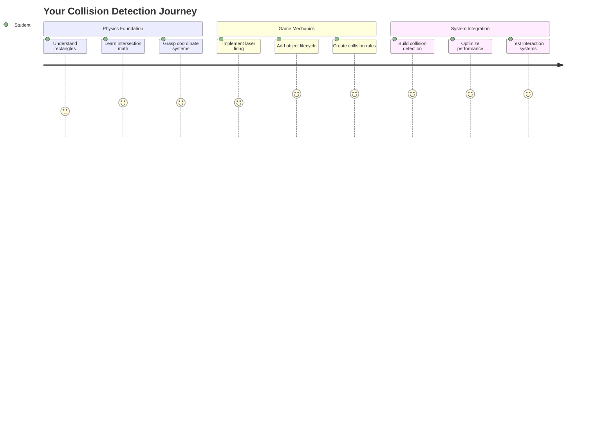
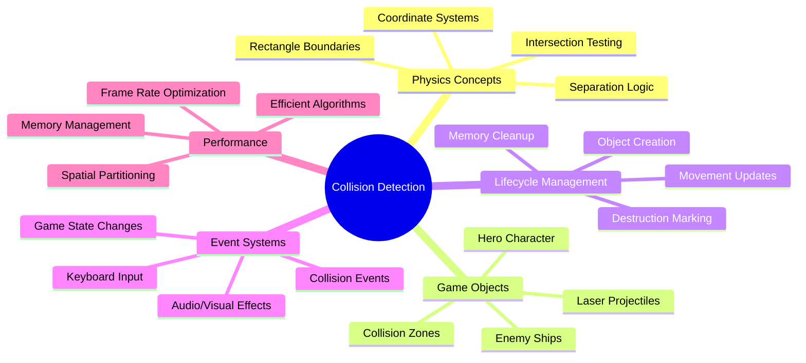
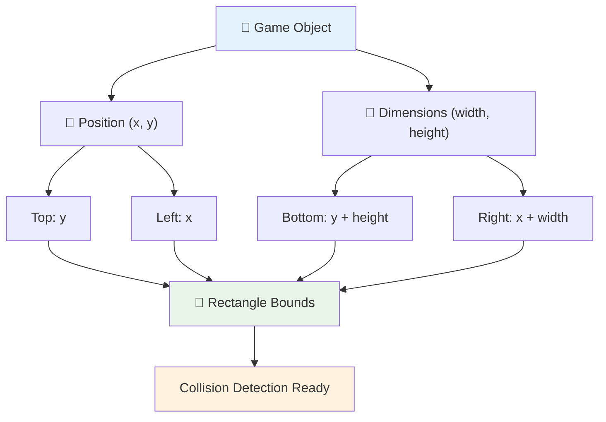
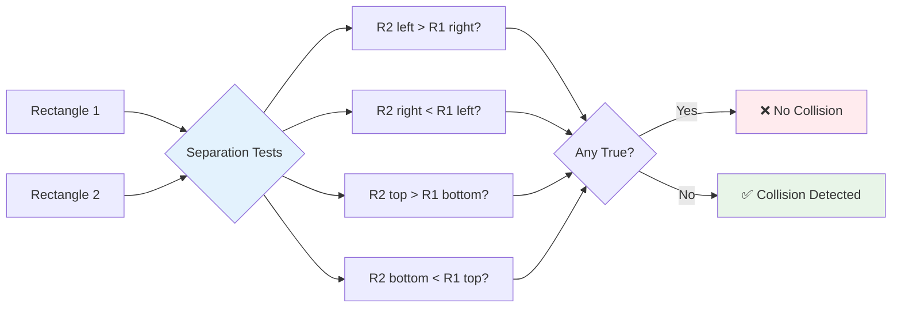
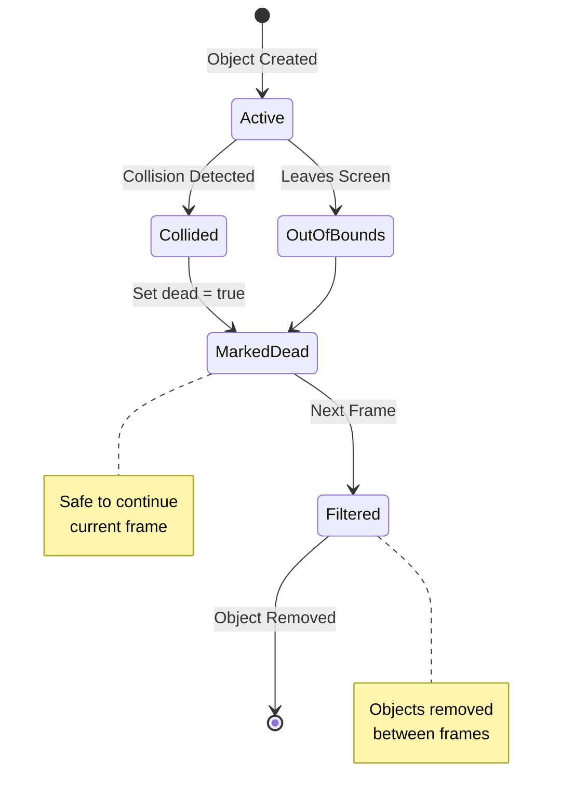
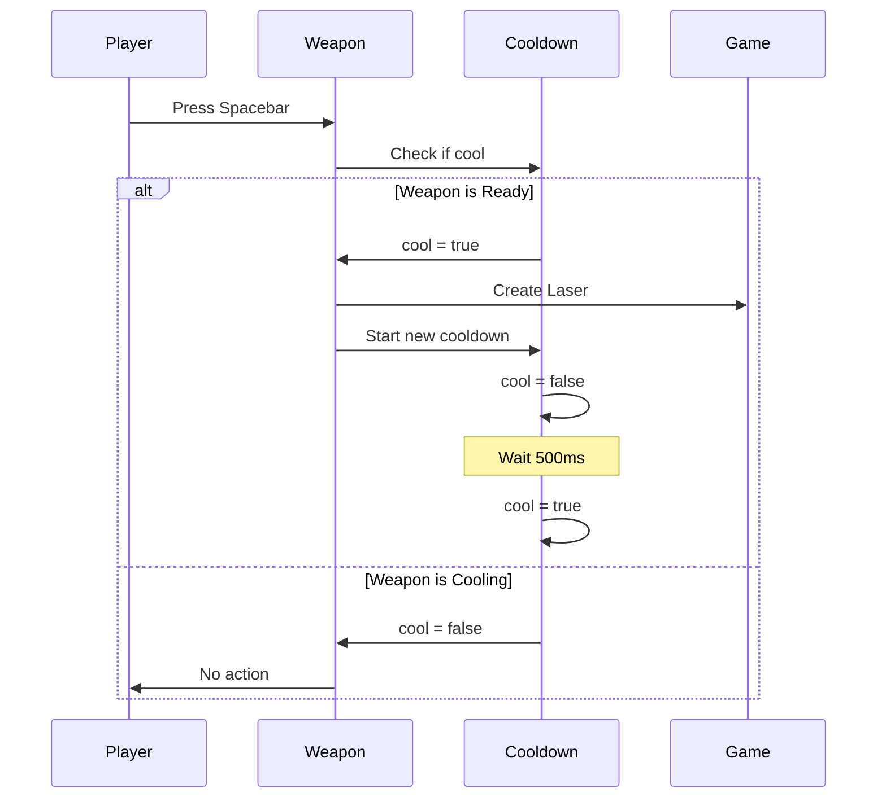
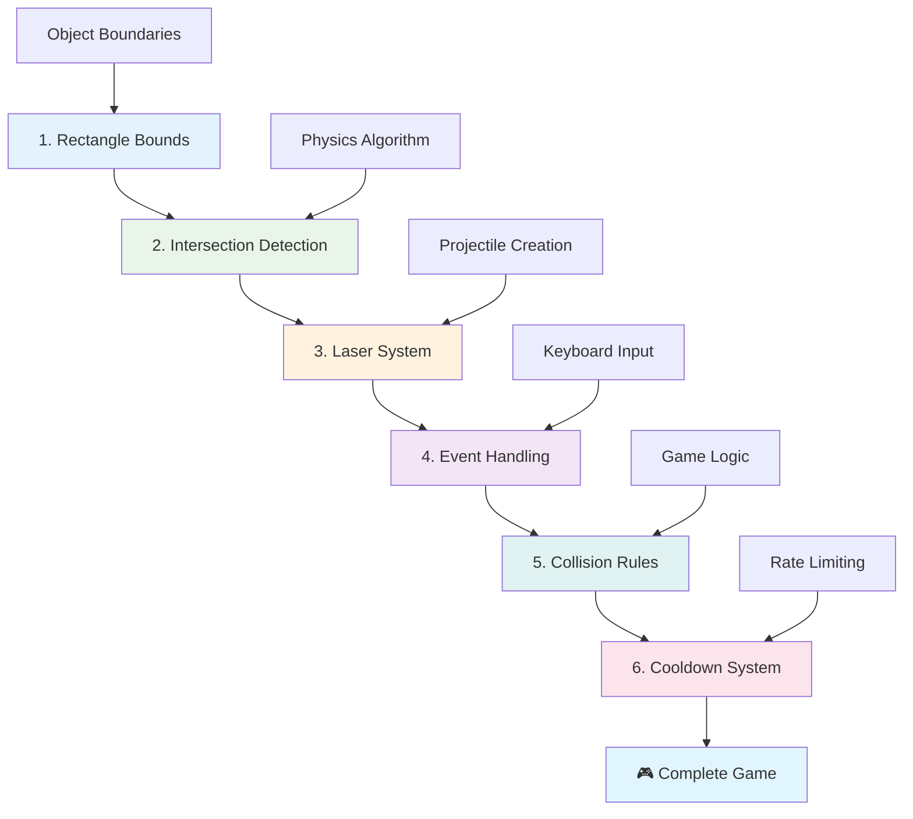
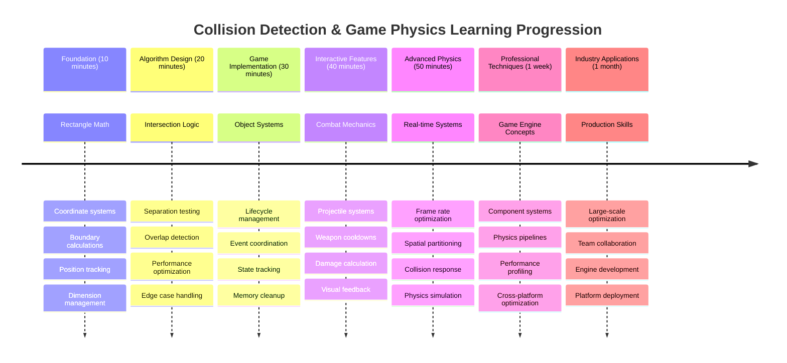

<!--
CO_OP_TRANSLATOR_METADATA:
{
  "original_hash": "039b4d8ce65f5edd82cf48d9c3e6728c",
  "translation_date": "2025-11-06T11:33:40+00:00",
  "source_file": "6-space-game/4-collision-detection/README.md",
  "language_code": "vi"
}
-->
# Xây dựng trò chơi không gian Phần 4: Thêm tia laser và phát hiện va chạm



## Câu hỏi trước bài học

[Câu hỏi trước bài học](https://ff-quizzes.netlify.app/web/quiz/35)

Hãy nghĩ về khoảnh khắc trong Star Wars khi ngư lôi proton của Luke bắn trúng cổng xả của Death Star. Việc phát hiện va chạm chính xác đó đã thay đổi số phận của cả thiên hà! Trong trò chơi, phát hiện va chạm hoạt động tương tự - nó xác định khi nào các đối tượng tương tác và điều gì sẽ xảy ra tiếp theo.

Trong bài học này, bạn sẽ thêm vũ khí laser vào trò chơi không gian của mình và triển khai phát hiện va chạm. Giống như các nhà hoạch định nhiệm vụ của NASA tính toán quỹ đạo tàu vũ trụ để tránh mảnh vỡ, bạn sẽ học cách phát hiện khi các đối tượng trong trò chơi giao nhau. Chúng ta sẽ chia nhỏ thành các bước dễ quản lý để xây dựng dần dần.

Kết thúc bài học, bạn sẽ có một hệ thống chiến đấu hoạt động, nơi tia laser tiêu diệt kẻ thù và va chạm kích hoạt các sự kiện trong trò chơi. Những nguyên tắc phát hiện va chạm này cũng được sử dụng trong mọi thứ từ mô phỏng vật lý đến giao diện web tương tác.



✅ Tìm hiểu một chút về trò chơi máy tính đầu tiên từng được viết. Chức năng của nó là gì?

## Phát hiện va chạm

Phát hiện va chạm hoạt động giống như các cảm biến gần của module Apollo - nó liên tục kiểm tra khoảng cách và kích hoạt cảnh báo khi các đối tượng đến quá gần. Trong trò chơi, hệ thống này xác định khi nào các đối tượng tương tác và điều gì nên xảy ra tiếp theo.

Phương pháp chúng ta sẽ sử dụng coi mỗi đối tượng trong trò chơi như một hình chữ nhật, tương tự như cách các hệ thống kiểm soát không lưu sử dụng các hình dạng hình học đơn giản để theo dõi máy bay. Phương pháp hình chữ nhật này có vẻ cơ bản, nhưng nó hiệu quả về mặt tính toán và hoạt động tốt cho hầu hết các tình huống trong trò chơi.

### Đại diện hình chữ nhật

Mỗi đối tượng trong trò chơi cần có các giới hạn tọa độ, giống như cách tàu thăm dò Mars Pathfinder lập bản đồ vị trí của nó trên bề mặt sao Hỏa. Đây là cách chúng ta định nghĩa các tọa độ giới hạn này:



```javascript
rectFromGameObject() {
  return {
    top: this.y,
    left: this.x,
    bottom: this.y + this.height,
    right: this.x + this.width
  }
}
```

**Hãy phân tích điều này:**
- **Cạnh trên**: Đó là nơi đối tượng của bạn bắt đầu theo chiều dọc (vị trí y của nó)
- **Cạnh trái**: Nơi nó bắt đầu theo chiều ngang (vị trí x của nó)
- **Cạnh dưới**: Cộng chiều cao vào vị trí y - bây giờ bạn biết nơi nó kết thúc!
- **Cạnh phải**: Cộng chiều rộng vào vị trí x - và bạn đã có giới hạn hoàn chỉnh

### Thuật toán giao nhau

Phát hiện giao nhau giữa các hình chữ nhật sử dụng logic tương tự như cách Kính viễn vọng không gian Hubble xác định liệu các đối tượng thiên thể có chồng chéo trong trường nhìn của nó hay không. Thuật toán kiểm tra sự tách biệt:



```javascript
function intersectRect(r1, r2) {
  return !(r2.left > r1.right ||
    r2.right < r1.left ||
    r2.top > r1.bottom ||
    r2.bottom < r1.top);
}
```

**Kiểm tra sự tách biệt hoạt động giống như hệ thống radar:**
- Hình chữ nhật 2 hoàn toàn nằm bên phải hình chữ nhật 1?
- Hình chữ nhật 2 hoàn toàn nằm bên trái hình chữ nhật 1?
- Hình chữ nhật 2 hoàn toàn nằm dưới hình chữ nhật 1?
- Hình chữ nhật 2 hoàn toàn nằm trên hình chữ nhật 1?

Nếu không có điều kiện nào trong số này đúng, các hình chữ nhật phải chồng chéo. Phương pháp này giống như cách các nhà điều hành radar xác định liệu hai máy bay có ở khoảng cách an toàn hay không.

## Quản lý vòng đời đối tượng

Khi tia laser bắn trúng kẻ thù, cả hai đối tượng cần được loại bỏ khỏi trò chơi. Tuy nhiên, xóa đối tượng giữa vòng lặp có thể gây ra lỗi - một bài học được rút ra từ các hệ thống máy tính ban đầu như Máy tính Hướng dẫn Apollo. Thay vào đó, chúng ta sử dụng phương pháp "đánh dấu để xóa" để loại bỏ đối tượng một cách an toàn giữa các khung hình.



Đây là cách chúng ta đánh dấu một đối tượng để xóa:

```javascript
// Mark object for removal
enemy.dead = true;
```

**Tại sao phương pháp này hoạt động:**
- Chúng ta đánh dấu đối tượng là "đã chết" nhưng không xóa ngay lập tức
- Điều này cho phép khung hình hiện tại của trò chơi hoàn thành một cách an toàn
- Không có lỗi do cố gắng sử dụng thứ gì đó đã bị xóa!

Sau đó lọc ra các đối tượng đã được đánh dấu trước chu kỳ render tiếp theo:

```javascript
gameObjects = gameObjects.filter(go => !go.dead);
```

**Việc lọc này làm gì:**
- Tạo danh sách mới chỉ với các đối tượng "còn sống"
- Loại bỏ bất cứ thứ gì đã được đánh dấu là chết
- Giữ cho trò chơi của bạn chạy mượt mà
- Ngăn chặn việc tích lũy các đối tượng bị phá hủy gây lãng phí bộ nhớ

## Triển khai cơ chế laser

Các tia laser trong trò chơi hoạt động theo nguyên tắc giống như ngư lôi photon trong Star Trek - chúng là các đối tượng riêng biệt di chuyển theo đường thẳng cho đến khi va chạm với thứ gì đó. Mỗi lần nhấn phím cách sẽ tạo ra một đối tượng laser mới di chuyển trên màn hình.

Để làm điều này, chúng ta cần phối hợp một vài phần khác nhau:

**Các thành phần chính cần triển khai:**
- **Tạo** các đối tượng laser xuất hiện từ vị trí của nhân vật chính
- **Xử lý** đầu vào từ bàn phím để kích hoạt việc tạo laser
- **Quản lý** chuyển động và vòng đời của laser
- **Triển khai** hình ảnh đại diện cho các tia laser

## Triển khai kiểm soát tốc độ bắn

Tốc độ bắn không giới hạn sẽ làm quá tải công cụ trò chơi và khiến trò chơi trở nên quá dễ dàng. Các hệ thống vũ khí thực tế cũng đối mặt với những hạn chế tương tự - ngay cả các tia phaser của USS Enterprise cũng cần thời gian để nạp lại giữa các lần bắn.

Chúng ta sẽ triển khai một hệ thống làm mát ngăn chặn việc bắn liên tục trong khi vẫn duy trì điều khiển nhạy:



```javascript
class Cooldown {
  constructor(time) {
    this.cool = false;
    setTimeout(() => {
      this.cool = true;
    }, time);
  }
}

class Weapon {
  constructor() {
    this.cooldown = null;
  }
  
  fire() {
    if (!this.cooldown || this.cooldown.cool) {
      // Create laser projectile
      this.cooldown = new Cooldown(500);
    } else {
      // Weapon is still cooling down
    }
  }
}
```

**Cách hệ thống làm mát hoạt động:**
- Khi được tạo, vũ khí bắt đầu "nóng" (chưa thể bắn)
- Sau khoảng thời gian chờ, nó trở thành "mát" (sẵn sàng bắn)
- Trước khi bắn, chúng ta kiểm tra: "Vũ khí đã mát chưa?"
- Điều này ngăn chặn việc nhấn phím liên tục trong khi vẫn giữ điều khiển nhạy

✅ Tham khảo bài học 1 trong loạt bài trò chơi không gian để nhớ lại về hệ thống làm mát.

## Xây dựng hệ thống phát hiện va chạm

Bạn sẽ mở rộng mã trò chơi không gian hiện có của mình để tạo hệ thống phát hiện va chạm. Giống như hệ thống tránh va chạm tự động của Trạm Vũ trụ Quốc tế, trò chơi của bạn sẽ liên tục theo dõi vị trí các đối tượng và phản hồi khi có giao nhau.

Bắt đầu từ mã bài học trước, bạn sẽ thêm phát hiện va chạm với các quy tắc cụ thể điều chỉnh tương tác đối tượng.

> 💡 **Mẹo chuyên nghiệp**: Sprite laser đã được bao gồm trong thư mục tài nguyên của bạn và được tham chiếu trong mã, sẵn sàng để triển khai.

### Các quy tắc va chạm cần triển khai

**Cơ chế trò chơi cần thêm:**
1. **Laser bắn trúng kẻ thù**: Đối tượng kẻ thù bị phá hủy khi bị tia laser bắn trúng
2. **Laser chạm vào ranh giới màn hình**: Laser bị loại bỏ khi đạt đến cạnh trên của màn hình
3. **Kẻ thù và nhân vật chính va chạm**: Cả hai đối tượng bị phá hủy khi giao nhau
4. **Kẻ thù đạt đến đáy màn hình**: Điều kiện kết thúc trò chơi khi kẻ thù chạm đáy màn hình

### 🔄 **Kiểm tra sư phạm**
**Nền tảng phát hiện va chạm**: Trước khi triển khai, hãy đảm bảo bạn hiểu:
- ✅ Cách các giới hạn hình chữ nhật xác định vùng va chạm
- ✅ Tại sao kiểm tra sự tách biệt hiệu quả hơn tính toán giao nhau
- ✅ Tầm quan trọng của quản lý vòng đời đối tượng trong vòng lặp trò chơi
- ✅ Cách các hệ thống dựa trên sự kiện phối hợp phản hồi va chạm

**Kiểm tra nhanh bản thân**: Điều gì sẽ xảy ra nếu bạn xóa đối tượng ngay lập tức thay vì đánh dấu chúng?
*Trả lời: Xóa giữa vòng lặp có thể gây lỗi hoặc bỏ qua các đối tượng trong quá trình lặp*

**Hiểu biết về vật lý**: Bạn đã nắm được:
- **Hệ tọa độ**: Cách vị trí và kích thước tạo ra các giới hạn
- **Logic giao nhau**: Nguyên tắc toán học đằng sau phát hiện va chạm
- **Tối ưu hóa hiệu suất**: Tại sao các thuật toán hiệu quả lại quan trọng trong hệ thống thời gian thực
- **Quản lý bộ nhớ**: Các mẫu vòng đời đối tượng an toàn để đảm bảo ổn định

## Thiết lập môi trường phát triển của bạn

Tin tốt - chúng tôi đã thiết lập hầu hết các nền tảng cho bạn! Tất cả tài nguyên trò chơi và cấu trúc cơ bản của bạn đang chờ trong thư mục `your-work`, sẵn sàng để bạn thêm các tính năng va chạm thú vị.

### Cấu trúc dự án

```bash
-| assets
  -| enemyShip.png
  -| player.png
  -| laserRed.png
-| index.html
-| app.js
-| package.json
```

**Hiểu cấu trúc tệp:**
- **Chứa** tất cả hình ảnh sprite cần thiết cho các đối tượng trò chơi
- **Bao gồm** tài liệu HTML chính và tệp ứng dụng JavaScript
- **Cung cấp** cấu hình gói cho máy chủ phát triển cục bộ

### Khởi động máy chủ phát triển

Điều hướng đến thư mục dự án của bạn và khởi động máy chủ cục bộ:

```bash
cd your-work
npm start
```

**Chuỗi lệnh này:**
- **Chuyển** thư mục sang thư mục dự án làm việc của bạn
- **Khởi động** máy chủ HTTP cục bộ tại `http://localhost:5000`
- **Phục vụ** các tệp trò chơi của bạn để thử nghiệm và phát triển
- **Kích hoạt** phát triển trực tiếp với tính năng tải lại tự động

Mở trình duyệt của bạn và điều hướng đến `http://localhost:5000` để xem trạng thái trò chơi hiện tại của bạn với nhân vật chính và kẻ thù được hiển thị trên màn hình.

### Triển khai từng bước

Giống như cách tiếp cận có hệ thống NASA đã sử dụng để lập trình tàu vũ trụ Voyager, chúng ta sẽ triển khai phát hiện va chạm một cách có phương pháp, xây dựng từng thành phần từng bước.



#### 1. Thêm giới hạn va chạm hình chữ nhật

Đầu tiên, hãy dạy các đối tượng trò chơi của chúng ta cách mô tả giới hạn của chúng. Thêm phương thức này vào lớp `GameObject` của bạn:

```javascript
rectFromGameObject() {
    return {
      top: this.y,
      left: this.x,
      bottom: this.y + this.height,
      right: this.x + this.width,
    };
  }
```

**Phương thức này thực hiện:**
- **Tạo** một đối tượng hình chữ nhật với các tọa độ giới hạn chính xác
- **Tính toán** cạnh dưới và cạnh phải bằng cách sử dụng vị trí cộng kích thước
- **Trả về** một đối tượng sẵn sàng cho các thuật toán phát hiện va chạm
- **Cung cấp** giao diện chuẩn hóa cho tất cả các đối tượng trò chơi

#### 2. Triển khai phát hiện giao nhau

Bây giờ hãy tạo "thám tử va chạm" của chúng ta - một hàm có thể xác định khi nào hai hình chữ nhật chồng chéo:

```javascript
function intersectRect(r1, r2) {
  return !(
    r2.left > r1.right ||
    r2.right < r1.left ||
    r2.top > r1.bottom ||
    r2.bottom < r1.top
  );
}
```

**Thuật toán này hoạt động bằng cách:**
- **Kiểm tra** bốn điều kiện tách biệt giữa các hình chữ nhật
- **Trả về** `false` nếu bất kỳ điều kiện tách biệt nào đúng
- **Chỉ ra** va chạm khi không có sự tách biệt
- **Sử dụng** logic phủ định để kiểm tra giao nhau hiệu quả

#### 3. Triển khai hệ thống bắn laser

Đây là lúc mọi thứ trở nên thú vị! Hãy thiết lập hệ thống bắn laser.

##### Hằng số thông báo

Đầu tiên, hãy định nghĩa một số loại thông báo để các phần khác nhau của trò chơi có thể giao tiếp với nhau:

```javascript
KEY_EVENT_SPACE: "KEY_EVENT_SPACE",
COLLISION_ENEMY_LASER: "COLLISION_ENEMY_LASER",
COLLISION_ENEMY_HERO: "COLLISION_ENEMY_HERO",
```

**Các hằng số này cung cấp:**
- **Chuẩn hóa** tên sự kiện trong toàn bộ ứng dụng
- **Kích hoạt** giao tiếp nhất quán giữa các hệ thống trò chơi
- **Ngăn chặn** lỗi chính tả trong việc đăng ký trình xử lý sự kiện

##### Xử lý đầu vào từ bàn phím

Thêm phát hiện phím cách vào trình lắng nghe sự kiện phím của bạn:

```javascript
} else if(evt.keyCode === 32) {
  eventEmitter.emit(Messages.KEY_EVENT_SPACE);
}
```

**Trình xử lý đầu vào này:**
- **Phát hiện** nhấn phím cách bằng cách sử dụng keyCode 32
- **Phát ra** thông báo sự kiện chuẩn hóa
- **Kích hoạt** logic bắn tách biệt

##### Thiết lập trình lắng nghe sự kiện

Đăng ký hành vi bắn trong hàm `initGame()` của bạn:

```javascript
eventEmitter.on(Messages.KEY_EVENT_SPACE, () => {
 if (hero.canFire()) {
   hero.fire();
 }
});
```

**Trình lắng nghe sự kiện này:**
- **Phản hồi** các sự kiện phím cách
- **Kiểm tra** trạng thái làm mát của hệ thống bắn
- **Kích hoạt** việc tạo laser khi được phép

Thêm xử lý va chạm cho tương tác laser-kẻ thù:

```javascript
eventEmitter.on(Messages.COLLISION_ENEMY_LASER, (_, { first, second }) => {
  first.dead = true;
  second.dead = true;
});
```

**Trình xử lý va chạm này:**
- **Nhận** dữ liệu sự kiện va chạm với cả hai đối tượng
- **Đánh dấu** cả hai đối tượng để xóa
- **Đảm bảo** dọn dẹp đúng cách sau va chạm

#### 4. Tạo lớp Laser

Triển khai một tia laser di chuyển lên trên và quản lý vòng đời của chính nó:

```javascript
class Laser extends GameObject {
  constructor(x, y) {
    super(x, y);
    this.width = 9;
    this.height = 33;
    this.type = 'Laser';
    this.img = laserImg;
    
    let id = setInterval(() => {
      if (this.y > 0) {
        this.y -= 15;
      } else {
        this.dead = true;
        clearInterval(id);
      }
    }, 100);
  }
}
```

**Triển khai lớp này:**
- **Mở rộng** GameObject để kế thừa chức năng cơ bản
- **Đặt** kích thước phù hợp cho sprite laser
- **Tạo** chuyển động lên tự động bằng cách sử dụng `setInterval()`
- **Xử lý** tự hủy khi đạt đến cạnh trên màn hình
- **Quản lý** thời gian hoạt hình và dọn dẹp của chính nó

#### 5. Triển khai hệ thống phát hiện va chạm

Tạo một hàm phát hiện va chạm toàn diện:

```javascript
function updateGameObjects() {
  const enemies = gameObjects.filter(go => go.type === 'Enemy');
  const lasers = gameObjects.filter(go => go.type === "Laser");
  
  // Test laser-enemy collisions
  lasers.forEach((laser) => {
    enemies.forEach((enemy) => {
      if (intersectRect(laser.rectFromGameObject(), enemy.rectFromGameObject())) {
        eventEmitter.emit(Messages.COLLISION_ENEMY_LASER, {
          first: laser,
          second: enemy,
        });
      }
    });
  });

  // Remove destroyed objects
  gameObjects = gameObjects.filter(go => !go.dead);
}
```

**Hệ thống va chạm này:**
- **Lọc** các đối tượng trò chơi theo loại để kiểm tra hiệu quả
- **Kiểm tra** từng laser với từng kẻ thù để tìm giao nhau
- **Phát ra** sự kiện va chạm khi phát hiện giao nhau
- **Dọn dẹp** các đối tượng bị phá hủy sau khi xử lý va chạm

> ⚠️ **Quan trọng**: Thêm `updateGameObjects()` vào vòng lặp trò chơi chính của bạn trong `window.onload` để kích hoạt phát hiện va chạm.

#### 6. Thêm hệ thống làm mát vào lớp Hero

Nâng cấp lớp Hero với cơ chế bắn và giới hạn tốc độ:

```javascript
class Hero extends GameObject {
  constructor(x, y) {
    super(x, y);
    this.width = 99;
    this.height = 75;
    this.type = "Hero";
    this.speed = { x: 0, y: 0 };
    this.cooldown = 0;
  }
  
  fire() {
    gameObjects.push(new Laser(this.x + 45, this.y - 10));
    this.cooldown = 500;

    let id = setInterval(() => {
      if (this.cooldown > 0) {
        this.cooldown -= 100;
      } else {
        clearInterval(id);
      }
    }, 200);
  }
  
  canFire() {
    return this.cooldown === 0;
  }
}
```

**Hiểu lớp Hero được nâng cấp:**
- **Khởi tạo** bộ đếm thời gian làm mát ở mức 0 (sẵn sàng bắn)
- **Tạo** các đối tượng laser được định vị phía trên tàu của nhân vật chính
- **Đặt** khoảng thời gian làm mát để ngăn chặn việc bắn liên tục
- **Giảm** bộ đếm thời gian làm mát bằng các cập nhật dựa trên khoảng thời gian
- **Cung cấp** kiểm tra trạng thái bắn thông qua phương thức `canFire()`

### 🔄 **Kiểm tra sư phạm**
**Hiểu hệ thống hoàn chỉnh**: Xác minh sự thành thạo của bạn về hệ thống va chạm:
- ✅ Làm thế nào các giới hạn hình chữ nhật cho phép phát hiện va chạm hiệu quả?
- ✅ Tại sao quản lý vòng đời đối tượng lại quan trọng đối với sự ổn định của trò chơi?
- ✅ Hệ thống làm mát ngăn chặn các vấn đề về hiệu suất như thế nào?
- ✅ Kiến trúc dựa trên sự kiện đóng vai trò gì trong xử lý va chạm?

**Tích hợp hệ thống**: Phát hiện va chạm của bạn thể hiện:
- **Độ chính xác toán học**: Các thuật toán giao nhau hình chữ nhật
- **Tối ưu hóa hiệu suất**: Các mẫu kiểm tra va chạm hiệu quả
- **Quản lý bộ nhớ**: Tạo và phá hủy đối tượng an toàn
- **Phối hợp sự kiện**: Giao tiếp hệ thống tách biệt
- **Xử lý thời gian thực**: Các chu kỳ cập nhật dựa trên khung hình

**Mẫu chuyên nghiệp**: Bạn đã triển khai:
- **Phân tách mối quan tâm**: Vật lý, render, và đầu vào được tách biệt
- **Thiết kế hướng đối tượng**: Kế thừa và đa hình
- **Quản lý trạng thái**: Theo dõi vòng đời đối tượng và trạng thái trò chơi
- **Tối ưu hóa hiệu suất**: Các thuật toán hiệu quả cho sử dụng thời gian thực

### Kiểm tra triển khai của bạn

Trò chơi không gian của bạn hiện có
- [ ] Thêm các câu lệnh `console.log` để theo dõi sự kiện va chạm trong thời gian thực

### 🎯 **Những gì bạn có thể hoàn thành trong giờ này**
- [ ] Hoàn thành bài kiểm tra sau bài học và hiểu các thuật toán phát hiện va chạm
- [ ] Thêm hiệu ứng hình ảnh như vụ nổ khi xảy ra va chạm
- [ ] Triển khai các loại đạn khác nhau với các thuộc tính đa dạng
- [ ] Tạo các vật phẩm tăng cường giúp cải thiện khả năng của người chơi tạm thời
- [ ] Thêm hiệu ứng âm thanh để làm cho va chạm trở nên hấp dẫn hơn

### 📅 **Lập trình vật lý trong tuần của bạn**
- [ ] Hoàn thành trò chơi không gian với hệ thống va chạm được tinh chỉnh
- [ ] Triển khai các hình dạng va chạm nâng cao ngoài hình chữ nhật (hình tròn, đa giác)
- [ ] Thêm hệ thống hạt để tạo hiệu ứng vụ nổ chân thực
- [ ] Tạo hành vi phức tạp cho kẻ thù với khả năng tránh va chạm
- [ ] Tối ưu hóa phát hiện va chạm để cải thiện hiệu suất với nhiều đối tượng
- [ ] Thêm mô phỏng vật lý như động lượng và chuyển động thực tế

### 🌟 **Làm chủ vật lý trò chơi trong tháng của bạn**
- [ ] Xây dựng trò chơi với các công cụ vật lý nâng cao và mô phỏng thực tế
- [ ] Học phát hiện va chạm 3D và các thuật toán phân vùng không gian
- [ ] Đóng góp cho các thư viện vật lý mã nguồn mở và các công cụ trò chơi
- [ ] Làm chủ tối ưu hóa hiệu suất cho các ứng dụng đồ họa chuyên sâu
- [ ] Tạo nội dung giáo dục về vật lý trò chơi và phát hiện va chạm
- [ ] Xây dựng danh mục công việc thể hiện kỹ năng lập trình vật lý nâng cao

## 🎯 Lộ trình làm chủ phát hiện va chạm của bạn



### 🛠️ Tóm tắt bộ công cụ vật lý trò chơi của bạn

Sau khi hoàn thành bài học này, bạn đã làm chủ:
- **Toán học va chạm**: Các thuật toán giao nhau hình chữ nhật và hệ tọa độ
- **Tối ưu hóa hiệu suất**: Phát hiện va chạm hiệu quả cho các ứng dụng thời gian thực
- **Quản lý vòng đời đối tượng**: Các mẫu tạo, cập nhật và hủy an toàn
- **Kiến trúc dựa trên sự kiện**: Hệ thống tách biệt cho phản hồi va chạm
- **Tích hợp vòng lặp trò chơi**: Cập nhật vật lý dựa trên khung hình và phối hợp hiển thị
- **Hệ thống nhập liệu**: Điều khiển phản hồi với giới hạn tốc độ và phản hồi
- **Quản lý bộ nhớ**: Chiến lược gom nhóm đối tượng và dọn dẹp hiệu quả

**Ứng dụng thực tế**: Kỹ năng phát hiện va chạm của bạn áp dụng trực tiếp vào:
- **Mô phỏng tương tác**: Mô hình khoa học và công cụ giáo dục
- **Thiết kế giao diện người dùng**: Tương tác kéo thả và phát hiện chạm
- **Trực quan hóa dữ liệu**: Biểu đồ tương tác và các phần tử có thể nhấp
- **Phát triển di động**: Nhận diện cử chỉ chạm và xử lý va chạm
- **Lập trình robot**: Lập kế hoạch đường đi và tránh chướng ngại vật
- **Đồ họa máy tính**: Dò tia và các thuật toán không gian

**Kỹ năng chuyên nghiệp đạt được**: Bạn có thể:
- **Thiết kế** các thuật toán hiệu quả cho phát hiện va chạm thời gian thực
- **Triển khai** các hệ thống vật lý có thể mở rộng với độ phức tạp của đối tượng
- **Gỡ lỗi** các hệ thống tương tác phức tạp bằng các nguyên tắc toán học
- **Tối ưu hóa** hiệu suất cho các phần cứng và trình duyệt khác nhau
- **Kiến trúc** các hệ thống trò chơi có thể duy trì bằng các mẫu thiết kế đã được chứng minh

**Khái niệm phát triển trò chơi đã làm chủ**:
- **Mô phỏng vật lý**: Phát hiện và phản hồi va chạm thời gian thực
- **Kỹ thuật hiệu suất**: Các thuật toán tối ưu cho ứng dụng tương tác
- **Hệ thống sự kiện**: Giao tiếp tách biệt giữa các thành phần trò chơi
- **Quản lý đối tượng**: Các mẫu vòng đời hiệu quả cho nội dung động
- **Xử lý nhập liệu**: Điều khiển phản hồi với phản hồi phù hợp

**Cấp độ tiếp theo**: Bạn đã sẵn sàng khám phá các công cụ vật lý nâng cao như Matter.js, triển khai phát hiện va chạm 3D, hoặc xây dựng các hệ thống hạt phức tạp!

🌟 **Thành tựu mở khóa**: Bạn đã xây dựng một hệ thống tương tác dựa trên vật lý hoàn chỉnh với phát hiện va chạm cấp độ chuyên nghiệp!

## Thử thách GitHub Copilot Agent 🚀

Sử dụng chế độ Agent để hoàn thành thử thách sau:

**Mô tả:** Nâng cấp hệ thống phát hiện va chạm bằng cách triển khai các vật phẩm tăng cường xuất hiện ngẫu nhiên và cung cấp khả năng tạm thời khi được thu thập bởi tàu anh hùng.

**Yêu cầu:** Tạo một lớp PowerUp mở rộng từ GameObject và triển khai phát hiện va chạm giữa tàu anh hùng và các vật phẩm tăng cường. Thêm ít nhất hai loại vật phẩm tăng cường: một loại tăng tốc độ bắn (giảm thời gian chờ) và một loại tạo lá chắn tạm thời. Bao gồm logic xuất hiện tạo vật phẩm tăng cường tại các khoảng thời gian và vị trí ngẫu nhiên.

---

## 🚀 Thử thách

Thêm một vụ nổ! Xem các tài sản trò chơi trong [kho Space Art](../../../../6-space-game/solution/spaceArt/readme.txt) và thử thêm một vụ nổ khi tia laser bắn trúng người ngoài hành tinh.

## Bài kiểm tra sau bài học

[Bài kiểm tra sau bài học](https://ff-quizzes.netlify.app/web/quiz/36)

## Ôn tập & Tự học

Thử nghiệm với các khoảng thời gian trong trò chơi của bạn cho đến nay. Điều gì xảy ra khi bạn thay đổi chúng? Đọc thêm về [sự kiện thời gian JavaScript](https://www.freecodecamp.org/news/javascript-timing-events-settimeout-and-setinterval/).

## Bài tập

[Khám phá va chạm](assignment.md)

---

**Tuyên bố miễn trừ trách nhiệm**:  
Tài liệu này đã được dịch bằng dịch vụ dịch thuật AI [Co-op Translator](https://github.com/Azure/co-op-translator). Mặc dù chúng tôi cố gắng đảm bảo độ chính xác, xin lưu ý rằng các bản dịch tự động có thể chứa lỗi hoặc không chính xác. Tài liệu gốc bằng ngôn ngữ bản địa nên được coi là nguồn thông tin chính thức. Đối với thông tin quan trọng, nên sử dụng dịch vụ dịch thuật chuyên nghiệp bởi con người. Chúng tôi không chịu trách nhiệm cho bất kỳ sự hiểu lầm hoặc diễn giải sai nào phát sinh từ việc sử dụng bản dịch này.