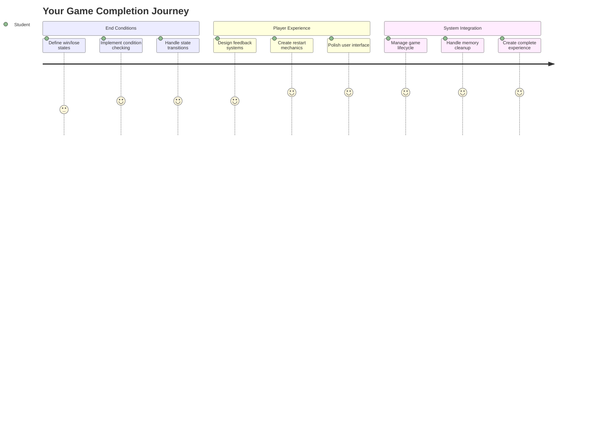
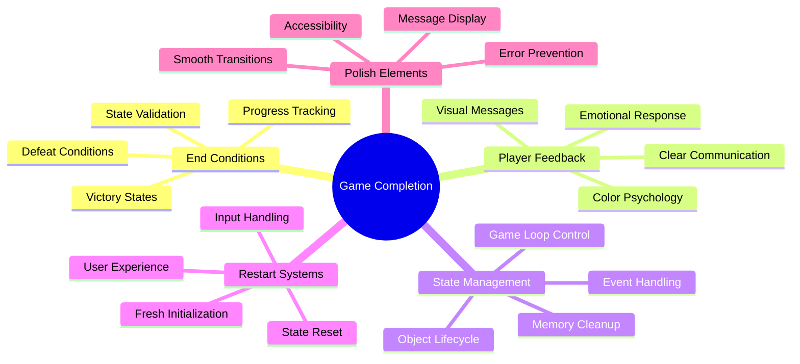
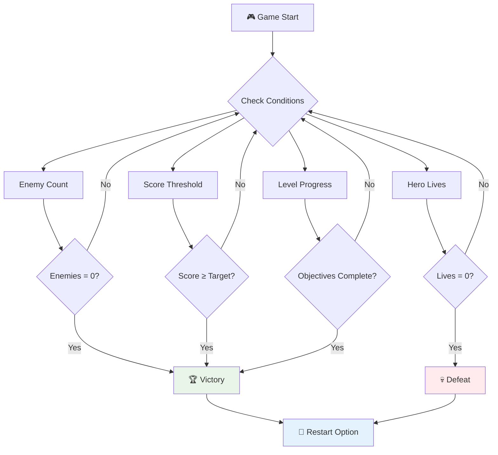
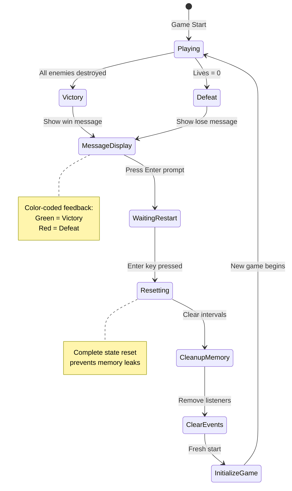
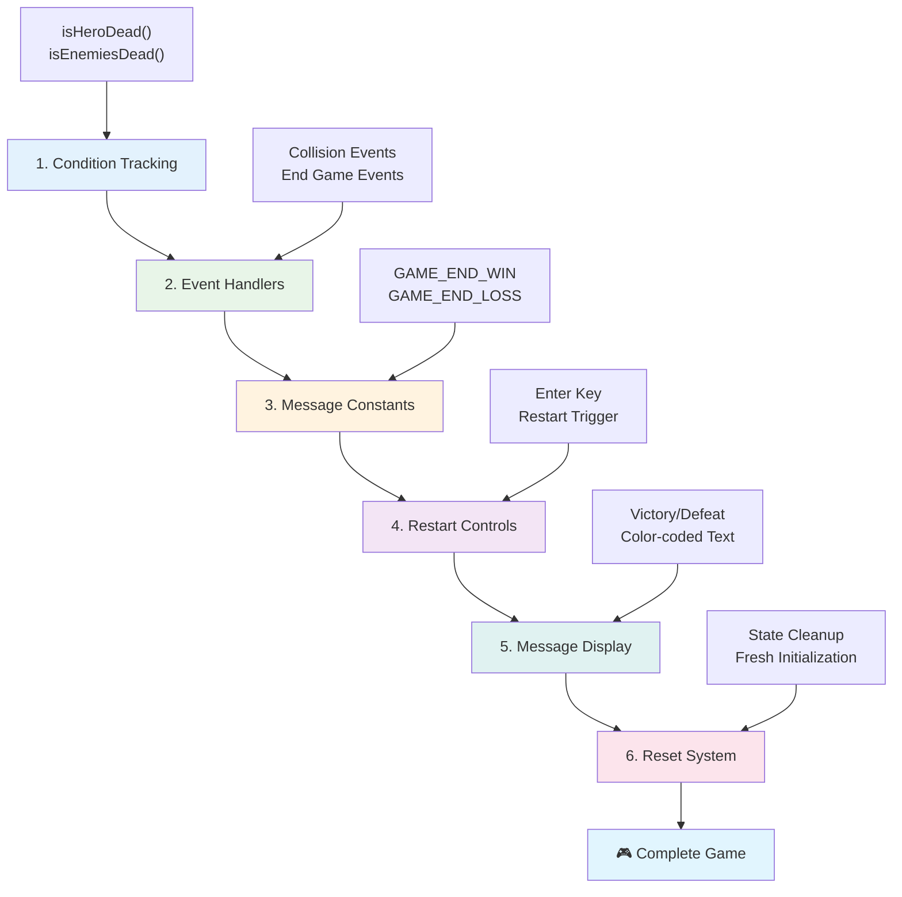
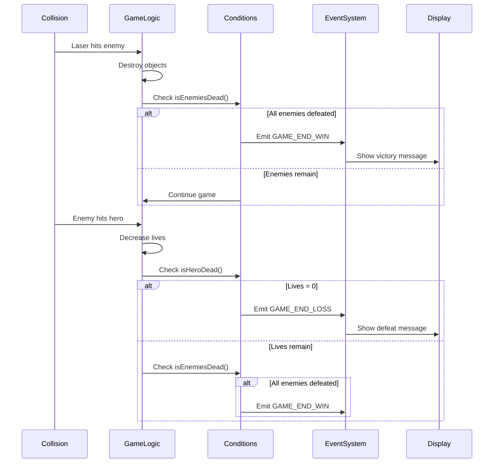
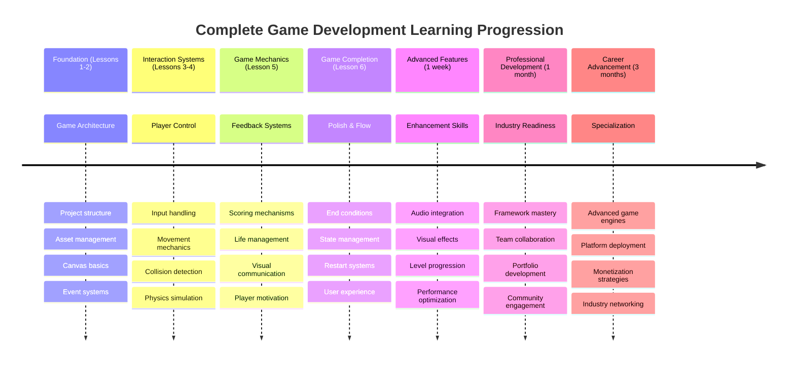

<!--
CO_OP_TRANSLATOR_METADATA:
{
  "original_hash": "a4b78043f4d64bf3ee24e0689b8b391d",
  "translation_date": "2025-11-06T11:32:56+00:00",
  "source_file": "6-space-game/6-end-condition/README.md",
  "language_code": "vi"
}
-->
# Xây dựng trò chơi không gian Phần 6: Kết thúc và Khởi động lại



Mỗi trò chơi tuyệt vời đều cần có điều kiện kết thúc rõ ràng và cơ chế khởi động lại mượt mà. Bạn đã xây dựng một trò chơi không gian ấn tượng với di chuyển, chiến đấu và tính điểm - giờ là lúc thêm những mảnh ghép cuối cùng để làm cho nó hoàn thiện.

Hiện tại, trò chơi của bạn chạy vô tận, giống như các tàu thăm dò Voyager mà NASA phóng vào năm 1977 - vẫn đang du hành trong không gian sau nhiều thập kỷ. Mặc dù điều đó phù hợp với việc khám phá không gian, nhưng trò chơi cần có điểm kết thúc xác định để tạo ra trải nghiệm thỏa mãn.

Hôm nay, chúng ta sẽ triển khai các điều kiện thắng/thua và hệ thống khởi động lại. Sau bài học này, bạn sẽ có một trò chơi hoàn chỉnh mà người chơi có thể hoàn thành và chơi lại, giống như các trò chơi arcade cổ điển đã định hình ngành công nghiệp này.



## Câu hỏi trước bài học

[Quiz trước bài học](https://ff-quizzes.netlify.app/web/quiz/39)

## Hiểu về điều kiện kết thúc trò chơi

Khi nào trò chơi của bạn nên kết thúc? Câu hỏi cơ bản này đã định hình thiết kế trò chơi từ thời kỳ arcade đầu tiên. Pac-Man kết thúc khi bạn bị ma bắt hoặc ăn hết các chấm, trong khi Space Invaders kết thúc khi người ngoài hành tinh chạm đáy hoặc bạn tiêu diệt hết chúng.

Là người tạo ra trò chơi, bạn sẽ định nghĩa các điều kiện thắng và thua. Đối với trò chơi không gian của chúng ta, đây là những cách tiếp cận đã được chứng minh để tạo ra lối chơi hấp dẫn:



- **`N` tàu địch đã bị tiêu diệt**: Đây là cách khá phổ biến nếu bạn chia trò chơi thành các cấp độ khác nhau, bạn cần tiêu diệt `N` tàu địch để hoàn thành một cấp độ.
- **Tàu của bạn bị phá hủy**: Có những trò chơi mà bạn sẽ thua nếu tàu của bạn bị phá hủy. Một cách tiếp cận phổ biến khác là khái niệm về số mạng sống. Mỗi lần tàu của bạn bị phá hủy, nó sẽ trừ đi một mạng sống. Khi tất cả các mạng sống bị mất, bạn sẽ thua trò chơi.
- **Bạn đã thu thập được `N` điểm**: Một điều kiện kết thúc phổ biến khác là bạn thu thập điểm. Cách bạn nhận điểm là tùy thuộc vào bạn, nhưng thường thì điểm được gán cho các hoạt động như tiêu diệt tàu địch hoặc thu thập các vật phẩm mà chúng rơi ra khi bị phá hủy.
- **Hoàn thành một cấp độ**: Điều này có thể bao gồm nhiều điều kiện như tiêu diệt `X` tàu địch, thu thập `Y` điểm hoặc có thể là thu thập một vật phẩm cụ thể.

## Triển khai chức năng khởi động lại trò chơi

Những trò chơi hay khuyến khích khả năng chơi lại thông qua cơ chế khởi động lại mượt mà. Khi người chơi hoàn thành trò chơi (hoặc gặp thất bại), họ thường muốn thử lại ngay lập tức - có thể để vượt qua điểm số hoặc cải thiện hiệu suất.



Tetris là ví dụ hoàn hảo: khi các khối của bạn chạm đỉnh, bạn có thể bắt đầu một trò chơi mới ngay lập tức mà không cần điều hướng qua các menu phức tạp. Chúng ta sẽ xây dựng một hệ thống khởi động lại tương tự, giúp trạng thái trò chơi được đặt lại sạch sẽ và đưa người chơi trở lại hành động nhanh chóng.

✅ **Suy ngẫm**: Hãy nghĩ về các trò chơi bạn đã chơi. Trong điều kiện nào chúng kết thúc, và bạn được nhắc nhở khởi động lại như thế nào? Điều gì làm cho trải nghiệm khởi động lại trở nên mượt mà thay vì gây khó chịu?

## Những gì bạn sẽ xây dựng

Bạn sẽ triển khai các tính năng cuối cùng để biến dự án của mình thành một trải nghiệm trò chơi hoàn chỉnh. Những yếu tố này phân biệt các trò chơi được hoàn thiện với các nguyên mẫu cơ bản.

**Hôm nay chúng ta sẽ thêm:**

1. **Điều kiện chiến thắng**: Tiêu diệt tất cả kẻ thù và nhận được màn ăn mừng xứng đáng!
2. **Điều kiện thất bại**: Hết mạng sống và đối mặt với màn hình thất bại
3. **Cơ chế khởi động lại**: Nhấn Enter để chơi lại ngay - vì một trò chơi không bao giờ là đủ
4. **Quản lý trạng thái**: Mỗi lần đều bắt đầu lại từ đầu - không còn kẻ thù sót lại hay lỗi kỳ lạ từ trò chơi trước

## Bắt đầu

Hãy chuẩn bị môi trường phát triển của bạn. Bạn nên có tất cả các tệp trò chơi không gian từ các bài học trước.

**Dự án của bạn nên trông giống như thế này:**

```bash
-| assets
  -| enemyShip.png
  -| player.png
  -| laserRed.png
  -| life.png
-| index.html
-| app.js
-| package.json
```

**Khởi động máy chủ phát triển của bạn:**

```bash
cd your-work
npm start
```

**Lệnh này:**
- Chạy một máy chủ cục bộ trên `http://localhost:5000`
- Phục vụ các tệp của bạn một cách chính xác
- Tự động làm mới khi bạn thực hiện thay đổi

Mở `http://localhost:5000` trong trình duyệt của bạn và xác nhận trò chơi của bạn đang chạy. Bạn nên có thể di chuyển, bắn và tương tác với kẻ thù. Khi đã xác nhận, chúng ta có thể tiếp tục triển khai.

> 💡 **Mẹo chuyên nghiệp**: Để tránh cảnh báo trong Visual Studio Code, khai báo `gameLoopId` ở đầu tệp của bạn dưới dạng `let gameLoopId;` thay vì khai báo nó bên trong hàm `window.onload`. Điều này tuân theo các thực tiễn tốt nhất về khai báo biến trong JavaScript hiện đại.



## Các bước triển khai

### Bước 1: Tạo các hàm theo dõi điều kiện kết thúc

Chúng ta cần các hàm để giám sát khi nào trò chơi nên kết thúc. Giống như các cảm biến trên Trạm Vũ trụ Quốc tế liên tục giám sát các hệ thống quan trọng, các hàm này sẽ liên tục kiểm tra trạng thái trò chơi.

```javascript
function isHeroDead() {
  return hero.life <= 0;
}

function isEnemiesDead() {
  const enemies = gameObjects.filter((go) => go.type === "Enemy" && !go.dead);
  return enemies.length === 0;
}
```

**Đây là những gì đang diễn ra bên trong:**
- **Kiểm tra** nếu tàu của bạn hết mạng sống (đáng tiếc!)
- **Đếm** số lượng kẻ thù còn sống và hoạt động
- **Trả về** `true` khi chiến trường không còn kẻ thù
- **Sử dụng** logic đơn giản true/false để giữ mọi thứ dễ hiểu
- **Lọc** qua tất cả các đối tượng trò chơi để tìm những kẻ sống sót

### Bước 2: Cập nhật các trình xử lý sự kiện cho điều kiện kết thúc

Bây giờ chúng ta sẽ kết nối các kiểm tra điều kiện này với hệ thống sự kiện của trò chơi. Mỗi khi xảy ra va chạm, trò chơi sẽ đánh giá liệu nó có kích hoạt điều kiện kết thúc hay không. Điều này tạo ra phản hồi ngay lập tức cho các sự kiện quan trọng trong trò chơi.



```javascript
eventEmitter.on(Messages.COLLISION_ENEMY_LASER, (_, { first, second }) => {
    first.dead = true;
    second.dead = true;
    hero.incrementPoints();

    if (isEnemiesDead()) {
      eventEmitter.emit(Messages.GAME_END_WIN);
    }
});

eventEmitter.on(Messages.COLLISION_ENEMY_HERO, (_, { enemy }) => {
    enemy.dead = true;
    hero.decrementLife();
    if (isHeroDead())  {
      eventEmitter.emit(Messages.GAME_END_LOSS);
      return; // loss before victory
    }
    if (isEnemiesDead()) {
      eventEmitter.emit(Messages.GAME_END_WIN);
    }
});

eventEmitter.on(Messages.GAME_END_WIN, () => {
    endGame(true);
});
  
eventEmitter.on(Messages.GAME_END_LOSS, () => {
  endGame(false);
});
```

**Điều gì đang diễn ra ở đây:**
- **Laser bắn trúng kẻ thù**: Cả hai biến mất, bạn nhận được điểm, và chúng ta kiểm tra xem bạn đã thắng chưa
- **Kẻ thù va vào bạn**: Bạn mất một mạng sống, và chúng ta kiểm tra xem bạn còn sống không
- **Thứ tự thông minh**: Chúng ta kiểm tra thất bại trước (không ai muốn vừa thắng vừa thua cùng lúc!)
- **Phản ứng tức thì**: Ngay khi có điều gì quan trọng xảy ra, trò chơi sẽ nhận biết

### Bước 3: Thêm các hằng số thông báo mới

Bạn sẽ cần thêm các loại thông báo mới vào đối tượng hằng số `Messages`. Các hằng số này giúp duy trì tính nhất quán và ngăn ngừa lỗi chính tả trong hệ thống sự kiện của bạn.

```javascript
GAME_END_LOSS: "GAME_END_LOSS",
GAME_END_WIN: "GAME_END_WIN",
```

**Trong đoạn trên, chúng ta đã:**
- **Thêm** các hằng số cho các sự kiện kết thúc trò chơi để duy trì tính nhất quán
- **Sử dụng** các tên mô tả rõ ràng mục đích của sự kiện
- **Tuân theo** quy ước đặt tên hiện có cho các loại thông báo

### Bước 4: Triển khai điều khiển khởi động lại

Bây giờ bạn sẽ thêm điều khiển bàn phím cho phép người chơi khởi động lại trò chơi. Phím Enter là lựa chọn tự nhiên vì nó thường được liên kết với việc xác nhận hành động và bắt đầu trò chơi mới.

**Thêm phát hiện phím Enter vào trình lắng nghe sự kiện keydown hiện có của bạn:**

```javascript
else if(evt.key === "Enter") {
   eventEmitter.emit(Messages.KEY_EVENT_ENTER);
}
```

**Thêm hằng số thông báo mới:**

```javascript
KEY_EVENT_ENTER: "KEY_EVENT_ENTER",
```

**Những điều bạn cần biết:**
- **Mở rộng** hệ thống xử lý sự kiện bàn phím hiện có của bạn
- **Sử dụng** phím Enter làm kích hoạt khởi động lại để mang lại trải nghiệm người dùng trực quan
- **Phát ra** một sự kiện tùy chỉnh mà các phần khác của trò chơi có thể lắng nghe
- **Duy trì** cùng một mẫu như các điều khiển bàn phím khác của bạn

### Bước 5: Tạo hệ thống hiển thị thông báo

Trò chơi của bạn cần truyền đạt kết quả rõ ràng đến người chơi. Chúng ta sẽ tạo một hệ thống thông báo hiển thị trạng thái chiến thắng và thất bại bằng văn bản mã màu, tương tự như giao diện terminal của các hệ thống máy tính đầu tiên, nơi màu xanh lá cây biểu thị thành công và màu đỏ báo hiệu lỗi.

**Tạo hàm `displayMessage()`:**

```javascript
function displayMessage(message, color = "red") {
  ctx.font = "30px Arial";
  ctx.fillStyle = color;
  ctx.textAlign = "center";
  ctx.fillText(message, canvas.width / 2, canvas.height / 2);
}
```

**Từng bước, đây là những gì đang diễn ra:**
- **Đặt** kích thước và kiểu chữ để văn bản rõ ràng, dễ đọc
- **Áp dụng** tham số màu với "red" làm mặc định cho cảnh báo
- **Căn giữa** văn bản theo chiều ngang và dọc trên canvas
- **Sử dụng** các tham số mặc định hiện đại của JavaScript để tùy chọn màu linh hoạt
- **Tận dụng** ngữ cảnh 2D của canvas để hiển thị văn bản trực tiếp

**Tạo hàm `endGame()`:**

```javascript
function endGame(win) {
  clearInterval(gameLoopId);

  // Set a delay to ensure any pending renders complete
  setTimeout(() => {
    ctx.clearRect(0, 0, canvas.width, canvas.height);
    ctx.fillStyle = "black";
    ctx.fillRect(0, 0, canvas.width, canvas.height);
    if (win) {
      displayMessage(
        "Victory!!! Pew Pew... - Press [Enter] to start a new game Captain Pew Pew",
        "green"
      );
    } else {
      displayMessage(
        "You died !!! Press [Enter] to start a new game Captain Pew Pew"
      );
    }
  }, 200)  
}
```

**Hàm này làm gì:**
- **Đóng băng** mọi thứ tại chỗ - không còn tàu hay laser di chuyển
- **Tạm dừng** một chút (200ms) để khung hình cuối cùng hoàn thành vẽ
- **Xóa** màn hình và tô màu đen để tạo hiệu ứng kịch tính
- **Hiển thị** các thông báo khác nhau cho người thắng và người thua
- **Mã màu** tin tức - xanh lá cây cho tốt, đỏ cho... không tốt lắm
- **Thông báo** cho người chơi cách quay lại trò chơi

### 🔄 **Kiểm tra sư phạm**
**Quản lý trạng thái trò chơi**: Trước khi triển khai chức năng đặt lại, hãy đảm bảo bạn hiểu:
- ✅ Làm thế nào các điều kiện kết thúc tạo ra mục tiêu chơi rõ ràng
- ✅ Tại sao phản hồi trực quan là cần thiết để người chơi hiểu
- ✅ Tầm quan trọng của việc dọn dẹp đúng cách trong việc ngăn ngừa rò rỉ bộ nhớ
- ✅ Cách kiến trúc dựa trên sự kiện cho phép chuyển đổi trạng thái sạch sẽ

**Kiểm tra nhanh bản thân**: Điều gì sẽ xảy ra nếu bạn không xóa các trình lắng nghe sự kiện trong quá trình đặt lại?
*Trả lời: Rò rỉ bộ nhớ và các trình xử lý sự kiện trùng lặp gây ra hành vi không thể đoán trước*

**Nguyên tắc thiết kế trò chơi**: Bạn đang triển khai:
- **Mục tiêu rõ ràng**: Người chơi biết chính xác điều gì định nghĩa thành công và thất bại
- **Phản hồi tức thì**: Các thay đổi trạng thái trò chơi được truyền đạt ngay lập tức
- **Kiểm soát của người dùng**: Người chơi có thể khởi động lại khi họ sẵn sàng
- **Độ tin cậy của hệ thống**: Dọn dẹp đúng cách ngăn ngừa lỗi và vấn đề hiệu suất

### Bước 6: Triển khai chức năng đặt lại trò chơi

Hệ thống đặt lại cần hoàn toàn dọn dẹp trạng thái trò chơi hiện tại và khởi tạo một phiên trò chơi mới. Điều này đảm bảo người chơi có một khởi đầu sạch sẽ mà không có dữ liệu sót lại từ trò chơi trước.

**Tạo hàm `resetGame()`:**

```javascript
function resetGame() {
  if (gameLoopId) {
    clearInterval(gameLoopId);
    eventEmitter.clear();
    initGame();
    gameLoopId = setInterval(() => {
      ctx.clearRect(0, 0, canvas.width, canvas.height);
      ctx.fillStyle = "black";
      ctx.fillRect(0, 0, canvas.width, canvas.height);
      drawPoints();
      drawLife();
      updateGameObjects();
      drawGameObjects(ctx);
    }, 100);
  }
}
```

**Hãy hiểu từng phần:**
- **Kiểm tra** nếu một vòng lặp trò chơi hiện đang chạy trước khi đặt lại
- **Xóa** vòng lặp trò chơi hiện tại để dừng tất cả hoạt động trò chơi hiện tại
- **Loại bỏ** tất cả các trình lắng nghe sự kiện để ngăn ngừa rò rỉ bộ nhớ
- **Khởi tạo lại** trạng thái trò chơi với các đối tượng và biến mới
- **Bắt đầu** một vòng lặp trò chơi mới với tất cả các chức năng trò chơi cần thiết
- **Duy trì** cùng khoảng thời gian 100ms để đảm bảo hiệu suất trò chơi nhất quán

**Thêm trình xử lý sự kiện phím Enter vào hàm `initGame()`:**

```javascript
eventEmitter.on(Messages.KEY_EVENT_ENTER, () => {
  resetGame();
});
```

**Thêm phương thức `clear()` vào lớp EventEmitter của bạn:**

```javascript
clear() {
  this.listeners = {};
}
```

**Những điểm chính cần nhớ:**
- **Kết nối** việc nhấn phím Enter với chức năng đặt lại trò chơi
- **Đăng ký** trình lắng nghe sự kiện này trong quá trình khởi tạo trò chơi
- **Cung cấp** cách sạch sẽ để loại bỏ tất cả các trình lắng nghe sự kiện khi đặt lại
- **Ngăn ngừa** rò rỉ bộ nhớ bằng cách xóa các trình xử lý sự kiện giữa các trò chơi
- **Đặt lại** đối tượng listeners về trạng thái trống để khởi tạo mới

## Chúc mừng! 🎉

👽 💥 🚀 Bạn đã xây dựng thành công một trò chơi hoàn chỉnh từ đầu. Giống như các lập trình viên đã tạo ra những trò chơi video đầu tiên vào những năm 1970, bạn đã biến các dòng mã thành một trải nghiệm tương tác với cơ chế trò chơi và phản hồi người dùng đúng cách. 🚀 💥 👽

**Bạn đã đạt được:**
- **Triển khai** các điều kiện thắng và thua hoàn chỉnh với phản hồi người dùng
- **Tạo** hệ thống khởi động lại mượt mà cho lối chơi liên tục
- **Thiết kế** giao tiếp trực quan rõ ràng cho trạng thái trò chơi
- **Quản lý** các chuyển đổi trạng thái trò chơi phức tạp và dọn dẹp
- **Lắp ráp** tất cả các thành phần thành một trò chơi có thể chơi được

### 🔄 **Kiểm tra sư phạm**
**Hệ thống phát triển trò chơi hoàn chỉnh**: Ăn mừng sự thành thạo của bạn trong toàn bộ chu trình phát triển trò chơi:
- ✅ Làm thế nào các điều kiện kết thúc tạo ra trải nghiệm người chơi thỏa mãn?
- ✅ Tại sao quản lý trạng thái đúng cách là rất quan trọng đối với sự ổn định của trò chơi?
- ✅ Làm thế nào phản hồi trực quan nâng cao sự hiểu biết của người chơi?
- ✅ Vai trò của hệ thống khởi động lại trong việc giữ chân người chơi là gì?

**Sự thành thạo hệ thống**: Trò chơi hoàn chỉnh của bạn thể hiện:
- **Phát triển trò chơi toàn diện**: Từ đồ họa đến đầu vào đến quản lý trạng thái
- **Kiến trúc chuyên nghiệp**: Hệ thống dựa trên sự kiện với dọn dẹp đúng cách
- **Thiết kế trải nghiệm người dùng**: Phản hồi rõ ràng và điều khiển trực quan
- **Tối ưu hóa hiệu suất**: Kết xuất hiệu quả và quản lý bộ nhớ
- **Hoàn thiện và đầy đủ**: Tất cả các chi tiết làm cho trò chơi cảm giác hoàn chỉnh

**Kỹ năng sẵn sàng cho ngành**: Bạn đã triển khai:
- **Kiến trúc vòng lặp trò chơi**: Hệ thống thời gian thực với hiệu suất nhất quán
- **Lập trình dựa trên sự kiện**: Hệ thống tách biệt có khả năng mở rộng hiệu quả
- **Quản lý trạng thái**: Xử lý dữ liệu phức tạp và quản lý vòng đời
- **Thiết kế giao diện người dùng**: Giao tiếp rõ ràng và điều khiển phản hồi
- **Kiểm tra và gỡ lỗi**: Phát triển lặp lại và giải quyết vấn đề

### ⚡ **Những gì bạn có thể làm trong 5 phút tới**
- [ ] Chơi trò chơi hoàn chỉnh của bạn và kiểm tra tất cả các điều kiện thắng và thua
- [ ] Thử nghiệm với các tham số điều kiện kết thúc khác nhau
- [ ] Thử thêm các câu lệnh console.log để theo dõi thay đổi trạng thái trò chơi
- [ ] Chia sẻ trò chơi của bạn với bạn bè và thu thập phản hồi

### 🎯 **Những gì bạn có thể hoàn thành trong giờ tới**
- [ ] Hoàn thành quiz sau bài học và suy ngẫm về hành trình phát triển trò chơi của bạn
- [ ] Thêm hiệu ứng âm thanh cho trạng thái thắng và thua
- [ ] Triển khai các điều kiện kết thúc bổ sung như giới hạn thời gian hoặc mục tiêu thưởng
- [ ] Tạo các cấp độ khó khác nhau với số lượng kẻ thù thay đổi
- [ ] Hoàn thiện trình bày trực quan với phông chữ và màu sắc tốt hơn

### 📅 **Sự thành thạo phát triển trò chơi
### 🌟 **Sự Nghiệp Phát Triển Game Trong Một Tháng**
- [ ] Xây dựng nhiều trò chơi hoàn chỉnh, khám phá các thể loại và cơ chế khác nhau
- [ ] Học các framework phát triển game nâng cao như Phaser hoặc Three.js
- [ ] Đóng góp vào các dự án phát triển game mã nguồn mở
- [ ] Nghiên cứu nguyên tắc thiết kế game và tâm lý người chơi
- [ ] Tạo một portfolio thể hiện kỹ năng phát triển game của bạn
- [ ] Kết nối với cộng đồng phát triển game và tiếp tục học hỏi

## 🎯 Lộ Trình Thành Thạo Phát Triển Game Hoàn Chỉnh



### 🛠️ Tóm Tắt Bộ Công Cụ Phát Triển Game Hoàn Chỉnh

Sau khi hoàn thành toàn bộ series game không gian này, bạn đã nắm vững:
- **Kiến trúc Game**: Hệ thống dựa trên sự kiện, vòng lặp game, và quản lý trạng thái
- **Lập trình Đồ họa**: Canvas API, render sprite, và hiệu ứng hình ảnh
- **Hệ thống Nhập liệu**: Xử lý bàn phím, phát hiện va chạm, và điều khiển phản hồi
- **Thiết kế Game**: Phản hồi người chơi, hệ thống tiến trình, và cơ chế thu hút
- **Tối ưu hóa Hiệu suất**: Render hiệu quả, quản lý bộ nhớ, và kiểm soát tốc độ khung hình
- **Trải nghiệm Người dùng**: Giao tiếp rõ ràng, điều khiển trực quan, và chi tiết hoàn thiện
- **Mẫu Chuyên nghiệp**: Code sạch, kỹ thuật debug, và tổ chức dự án

**Ứng dụng Thực tế**: Kỹ năng phát triển game của bạn áp dụng trực tiếp vào:
- **Ứng dụng Web Tương tác**: Giao diện động và hệ thống thời gian thực
- **Trực quan hóa Dữ liệu**: Biểu đồ động và đồ họa tương tác
- **Công nghệ Giáo dục**: Gamification và trải nghiệm học tập hấp dẫn
- **Phát triển Di động**: Tương tác dựa trên cảm ứng và tối ưu hóa hiệu suất
- **Phần mềm Mô phỏng**: Động cơ vật lý và mô hình thời gian thực
- **Ngành Sáng tạo**: Nghệ thuật tương tác, giải trí, và trải nghiệm kỹ thuật số

**Kỹ năng Chuyên nghiệp Đạt được**: Giờ đây bạn có thể:
- **Kiến trúc** hệ thống tương tác phức tạp từ đầu
- **Debug** ứng dụng thời gian thực bằng cách tiếp cận có hệ thống
- **Tối ưu hóa** hiệu suất để mang lại trải nghiệm người dùng mượt mà
- **Thiết kế** giao diện người dùng hấp dẫn và mẫu tương tác
- **Hợp tác** hiệu quả trong các dự án kỹ thuật với tổ chức code hợp lý

**Khái niệm Phát triển Game Đã Nắm vững**:
- **Hệ thống Thời gian thực**: Vòng lặp game, quản lý tốc độ khung hình, và hiệu suất
- **Kiến trúc Dựa trên Sự kiện**: Hệ thống tách biệt và truyền thông điệp
- **Quản lý Trạng thái**: Xử lý dữ liệu phức tạp và quản lý vòng đời
- **Lập trình Giao diện Người dùng**: Đồ họa Canvas và thiết kế đáp ứng
- **Lý thuyết Thiết kế Game**: Tâm lý người chơi và cơ chế thu hút

**Cấp độ Tiếp theo**: Bạn đã sẵn sàng khám phá các framework game nâng cao, đồ họa 3D, hệ thống nhiều người chơi, hoặc chuyển sang các vai trò phát triển game chuyên nghiệp!

🌟 **Thành tựu Đã Đạt được**: Bạn đã hoàn thành hành trình phát triển game đầy đủ và xây dựng một trải nghiệm tương tác chất lượng chuyên nghiệp từ đầu!

**Chào mừng bạn đến với cộng đồng phát triển game!** 🎮✨

## Thử thách GitHub Copilot Agent 🚀

Sử dụng chế độ Agent để hoàn thành thử thách sau:

**Mô tả:** Nâng cấp game không gian bằng cách triển khai hệ thống tiến trình cấp độ với độ khó tăng dần và các tính năng thưởng.

**Yêu cầu:** Tạo hệ thống game không gian nhiều cấp độ, trong đó mỗi cấp độ có nhiều tàu địch hơn với tốc độ và sức khỏe tăng lên. Thêm hệ số nhân điểm số tăng theo từng cấp độ, và triển khai các vật phẩm hỗ trợ (như bắn nhanh hoặc khiên) xuất hiện ngẫu nhiên khi tiêu diệt địch. Bao gồm phần thưởng hoàn thành cấp độ và hiển thị cấp độ hiện tại trên màn hình cùng với điểm số và số mạng hiện có.

Tìm hiểu thêm về [chế độ agent](https://code.visualstudio.com/blogs/2025/02/24/introducing-copilot-agent-mode) tại đây.

## 🚀 Thử thách Nâng cấp Tùy chọn

**Thêm Âm thanh vào Game của Bạn**: Nâng cao trải nghiệm chơi game bằng cách triển khai hiệu ứng âm thanh! Hãy cân nhắc thêm âm thanh cho:

- **Bắn laser** khi người chơi bắn
- **Tiêu diệt địch** khi tàu bị trúng
- **Thiệt hại của nhân vật chính** khi người chơi bị trúng đạn
- **Nhạc chiến thắng** khi game được hoàn thành
- **Âm thanh thất bại** khi game bị thua

**Ví dụ triển khai âm thanh:**

```javascript
// Create audio objects
const laserSound = new Audio('assets/laser.wav');
const explosionSound = new Audio('assets/explosion.wav');

// Play sounds during game events
function playLaserSound() {
  laserSound.currentTime = 0; // Reset to beginning
  laserSound.play();
}
```

**Những điều bạn cần biết:**
- **Tạo** đối tượng Audio cho các hiệu ứng âm thanh khác nhau
- **Đặt lại** `currentTime` để cho phép hiệu ứng âm thanh bắn nhanh
- **Xử lý** chính sách tự động phát của trình duyệt bằng cách kích hoạt âm thanh từ các tương tác của người dùng
- **Quản lý** âm lượng và thời gian âm thanh để mang lại trải nghiệm game tốt hơn

> 💡 **Tài liệu Học tập**: Khám phá [audio sandbox](https://www.w3schools.com/jsref/tryit.asp?filename=tryjsref_audio_play) này để tìm hiểu thêm về cách triển khai âm thanh trong game JavaScript.

## Quiz Sau Bài Giảng

[Quiz sau bài giảng](https://ff-quizzes.netlify.app/web/quiz/40)

## Ôn tập & Tự học

Bài tập của bạn là tạo một mẫu game mới, vì vậy hãy khám phá một số trò chơi thú vị ngoài kia để xem bạn có thể xây dựng loại game nào.

## Bài tập

[Xây dựng Mẫu Game](assignment.md)

---

**Tuyên bố miễn trừ trách nhiệm**:  
Tài liệu này đã được dịch bằng dịch vụ dịch thuật AI [Co-op Translator](https://github.com/Azure/co-op-translator). Mặc dù chúng tôi cố gắng đảm bảo độ chính xác, xin lưu ý rằng các bản dịch tự động có thể chứa lỗi hoặc không chính xác. Tài liệu gốc bằng ngôn ngữ bản địa nên được coi là nguồn thông tin chính thức. Đối với thông tin quan trọng, nên sử dụng dịch vụ dịch thuật chuyên nghiệp bởi con người. Chúng tôi không chịu trách nhiệm về bất kỳ sự hiểu lầm hoặc diễn giải sai nào phát sinh từ việc sử dụng bản dịch này.