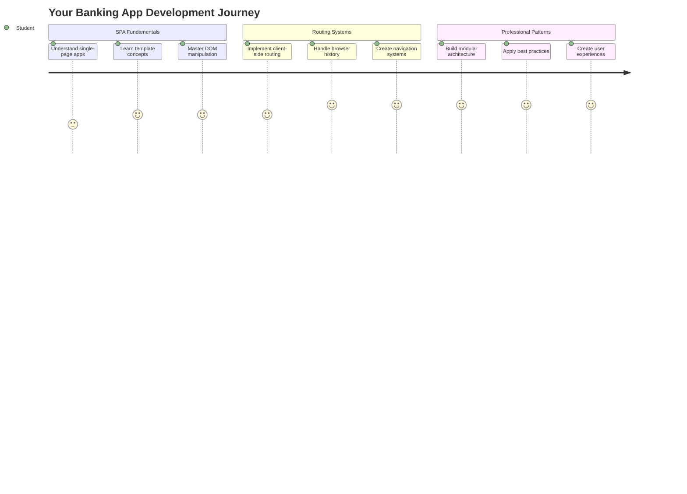
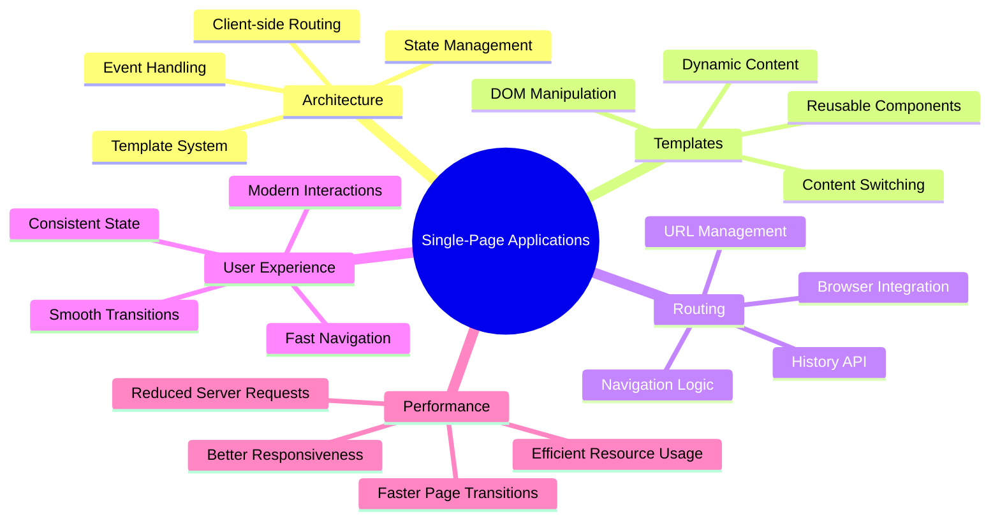
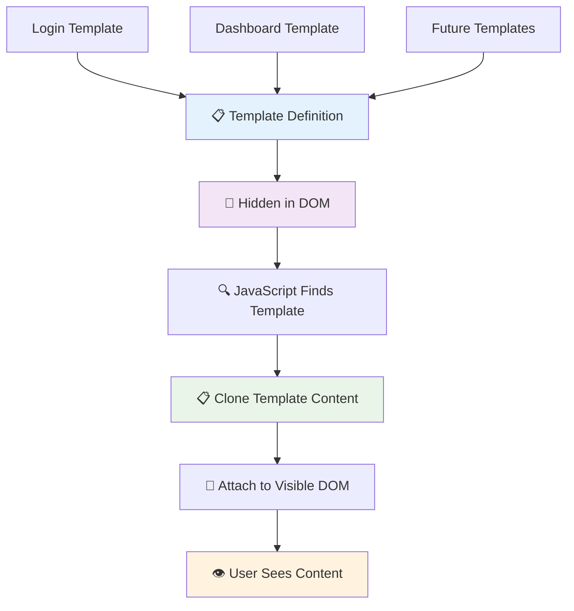
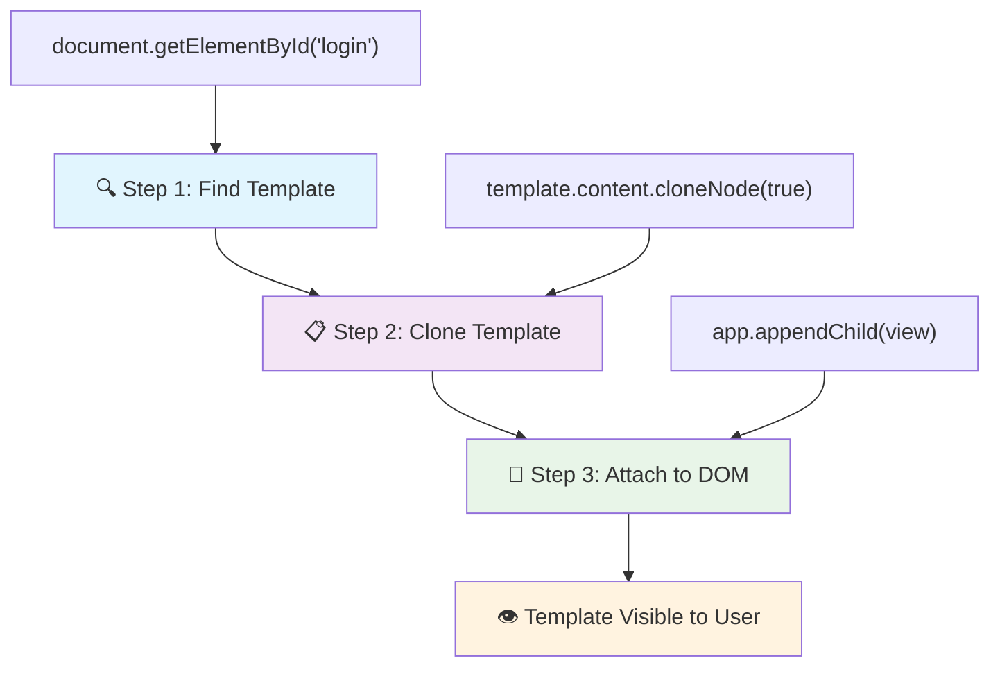
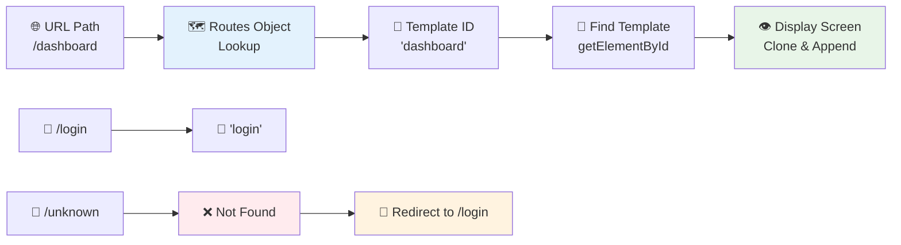
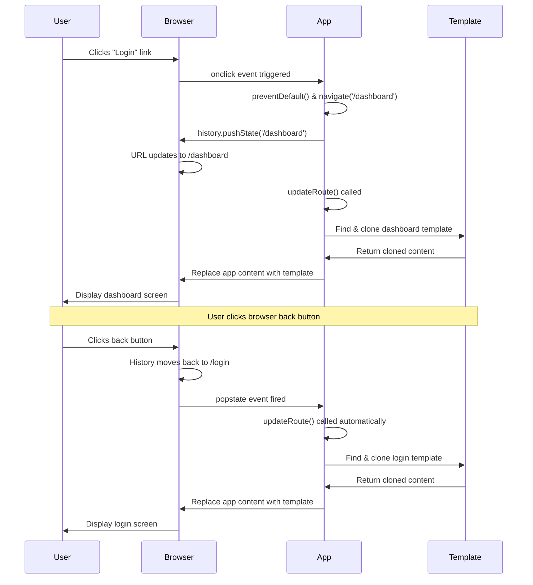
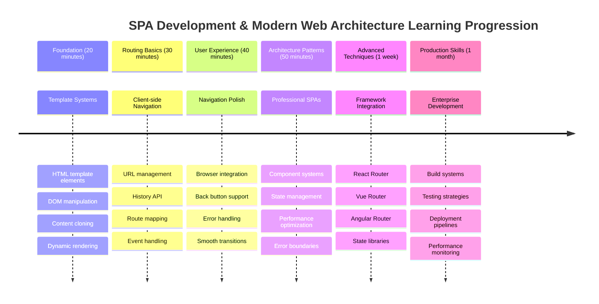

<!--
CO_OP_TRANSLATOR_METADATA:
{
  "original_hash": "351678bece18f07d9daa987a881fb062",
  "translation_date": "2025-11-06T11:27:50+00:00",
  "source_file": "7-bank-project/1-template-route/README.md",
  "language_code": "vi"
}
-->
# Xây dựng ứng dụng ngân hàng Phần 1: Mẫu HTML và định tuyến trong ứng dụng web



Khi máy tính hướng dẫn Apollo 11 điều hướng lên mặt trăng vào năm 1969, nó phải chuyển đổi giữa các chương trình khác nhau mà không cần khởi động lại toàn bộ hệ thống. Các ứng dụng web hiện đại hoạt động tương tự – chúng thay đổi những gì bạn thấy mà không tải lại mọi thứ từ đầu. Điều này tạo ra trải nghiệm mượt mà, nhạy bén mà người dùng mong đợi ngày nay.

Không giống như các trang web truyền thống tải lại toàn bộ trang cho mỗi tương tác, các ứng dụng web hiện đại chỉ cập nhật các phần cần thay đổi. Cách tiếp cận này, giống như cách trung tâm điều khiển chuyển đổi giữa các màn hình khác nhau trong khi duy trì liên lạc liên tục, tạo ra trải nghiệm mượt mà mà chúng ta mong đợi.

Đây là những điểm khác biệt nổi bật:

| Ứng dụng nhiều trang truyền thống | Ứng dụng một trang hiện đại |
|----------------------------------|-----------------------------|
| **Điều hướng** | Tải lại toàn bộ trang cho mỗi màn hình | Chuyển đổi nội dung tức thì |
| **Hiệu suất** | Chậm hơn do tải toàn bộ HTML | Nhanh hơn với các cập nhật từng phần |
| **Trải nghiệm người dùng** | Nhấp nháy trang gây khó chịu | Chuyển đổi mượt mà như ứng dụng |
| **Chia sẻ dữ liệu** | Khó khăn giữa các trang | Quản lý trạng thái dễ dàng |
| **Phát triển** | Nhiều tệp HTML cần duy trì | Một tệp HTML với các mẫu động |

**Hiểu sự tiến hóa:**
- **Ứng dụng truyền thống** yêu cầu yêu cầu máy chủ cho mỗi hành động điều hướng
- **SPA hiện đại** tải một lần và cập nhật nội dung động bằng JavaScript
- **Kỳ vọng của người dùng** hiện nay ưu tiên tương tác tức thì, liền mạch
- **Lợi ích hiệu suất** bao gồm giảm băng thông và phản hồi nhanh hơn

Trong bài học này, chúng ta sẽ xây dựng một ứng dụng ngân hàng với nhiều màn hình kết nối liền mạch. Giống như cách các nhà khoa học sử dụng các công cụ mô-đun có thể được cấu hình lại cho các thí nghiệm khác nhau, chúng ta sẽ sử dụng các mẫu HTML làm thành phần tái sử dụng có thể hiển thị khi cần.

Bạn sẽ làm việc với các mẫu HTML (bản thiết kế tái sử dụng cho các màn hình khác nhau), định tuyến JavaScript (hệ thống chuyển đổi giữa các màn hình), và API lịch sử của trình duyệt (giúp nút quay lại hoạt động như mong đợi). Đây là những kỹ thuật cơ bản được sử dụng bởi các framework như React, Vue, và Angular.

Kết thúc bài học, bạn sẽ có một ứng dụng ngân hàng hoạt động, minh họa các nguyên tắc chuyên nghiệp của ứng dụng một trang.



## Câu hỏi trước bài học

[Quiz trước bài học](https://ff-quizzes.netlify.app/web/quiz/41)

### Những gì bạn cần

Chúng ta sẽ cần một máy chủ web cục bộ để kiểm tra ứng dụng ngân hàng – đừng lo, nó dễ hơn bạn nghĩ! Nếu bạn chưa có máy chủ nào, chỉ cần cài đặt [Node.js](https://nodejs.org) và chạy `npx lite-server` từ thư mục dự án của bạn. Lệnh tiện lợi này sẽ khởi động một máy chủ cục bộ và tự động mở ứng dụng của bạn trong trình duyệt.

### Chuẩn bị

Trên máy tính của bạn, tạo một thư mục tên là `bank` với một tệp tên là `index.html` bên trong. Chúng ta sẽ bắt đầu từ [mã mẫu HTML](https://en.wikipedia.org/wiki/Boilerplate_code):

```html
<!DOCTYPE html>
<html lang="en">
  <head>
    <meta charset="UTF-8">
    <meta name="viewport" content="width=device-width, initial-scale=1.0">
    <title>Bank App</title>
  </head>
  <body>
    <!-- This is where you'll work -->
  </body>
</html>
```

**Mã mẫu này cung cấp:**
- **Thiết lập** cấu trúc tài liệu HTML5 với khai báo DOCTYPE đúng
- **Cấu hình** mã hóa ký tự là UTF-8 để hỗ trợ văn bản quốc tế
- **Kích hoạt** thiết kế đáp ứng với thẻ meta viewport cho khả năng tương thích di động
- **Đặt** tiêu đề mô tả xuất hiện trên tab trình duyệt
- **Tạo** phần thân sạch sẽ nơi chúng ta sẽ xây dựng ứng dụng

> 📁 **Xem trước cấu trúc dự án**
> 
> **Kết thúc bài học, dự án của bạn sẽ bao gồm:**
> ```
> bank/
> ├── index.html      <!-- Main HTML with templates -->
> ├── app.js          <!-- Routing and navigation logic -->
> └── style.css       <!-- (Optional for future lessons) -->
> ```
> 
> **Chức năng của các tệp:**
> - **index.html**: Chứa tất cả các mẫu và cung cấp cấu trúc ứng dụng
> - **app.js**: Xử lý định tuyến, điều hướng, và quản lý mẫu
> - **Templates**: Định nghĩa giao diện cho đăng nhập, bảng điều khiển, và các màn hình khác

---

## Mẫu HTML

Mẫu giải quyết một vấn đề cơ bản trong phát triển web. Khi Gutenberg phát minh ra máy in chữ rời vào những năm 1440, ông nhận ra rằng thay vì khắc toàn bộ trang, ông có thể tạo các khối chữ tái sử dụng và sắp xếp chúng khi cần. Mẫu HTML hoạt động theo nguyên tắc tương tự – thay vì tạo các tệp HTML riêng biệt cho mỗi màn hình, bạn định nghĩa các cấu trúc tái sử dụng có thể hiển thị khi cần.



Hãy nghĩ về mẫu như bản thiết kế cho các phần khác nhau của ứng dụng. Giống như một kiến trúc sư tạo một bản thiết kế và sử dụng nó nhiều lần thay vì vẽ lại các phòng giống hệt nhau, chúng ta tạo mẫu một lần và sử dụng chúng khi cần. Trình duyệt giữ các mẫu này ẩn cho đến khi JavaScript kích hoạt chúng.

Nếu bạn muốn tạo nhiều màn hình cho một trang web, một giải pháp là tạo một tệp HTML cho mỗi màn hình bạn muốn hiển thị. Tuy nhiên, giải pháp này đi kèm với một số bất tiện:

- Bạn phải tải lại toàn bộ HTML khi chuyển đổi màn hình, điều này có thể chậm.
- Khó chia sẻ dữ liệu giữa các màn hình khác nhau.

Một cách tiếp cận khác là chỉ có một tệp HTML, và định nghĩa nhiều [mẫu HTML](https://developer.mozilla.org/docs/Web/HTML/Element/template) bằng cách sử dụng thẻ `<template>`. Một mẫu là một khối HTML tái sử dụng không được hiển thị bởi trình duyệt, và cần được khởi tạo tại thời gian chạy bằng JavaScript.

### Hãy xây dựng nó

Chúng ta sẽ tạo một ứng dụng ngân hàng với hai màn hình chính: trang đăng nhập và bảng điều khiển. Đầu tiên, hãy thêm một phần tử giữ chỗ vào phần thân HTML – đây là nơi tất cả các màn hình khác nhau của chúng ta sẽ xuất hiện:

```html
<div id="app">Loading...</div>
```

**Hiểu phần tử giữ chỗ này:**
- **Tạo** một container với ID "app" nơi tất cả các màn hình sẽ được hiển thị
- **Hiển thị** thông báo tải cho đến khi JavaScript khởi tạo màn hình đầu tiên
- **Cung cấp** một điểm gắn kết duy nhất cho nội dung động của chúng ta
- **Cho phép** dễ dàng nhắm mục tiêu từ JavaScript bằng `document.getElementById()`

> 💡 **Mẹo chuyên nghiệp**: Vì nội dung của phần tử này sẽ được thay thế, chúng ta có thể đặt một thông báo hoặc chỉ báo tải sẽ được hiển thị trong khi ứng dụng đang tải.

Tiếp theo, hãy thêm mẫu HTML cho trang đăng nhập bên dưới. Hiện tại, chúng ta chỉ đặt một tiêu đề và một phần chứa liên kết mà chúng ta sẽ sử dụng để thực hiện điều hướng.

```html
<template id="login">
  <h1>Bank App</h1>
  <section>
    <a href="/dashboard">Login</a>
  </section>
</template>
```

**Phân tích mẫu đăng nhập này:**
- **Định nghĩa** một mẫu với định danh duy nhất "login" để JavaScript nhắm mục tiêu
- **Bao gồm** một tiêu đề chính thiết lập thương hiệu của ứng dụng
- **Chứa** một phần tử `<section>` có ý nghĩa để nhóm nội dung liên quan
- **Cung cấp** một liên kết điều hướng sẽ dẫn người dùng đến bảng điều khiển

Sau đó, chúng ta sẽ thêm một mẫu HTML khác cho trang bảng điều khiển. Trang này sẽ chứa các phần khác nhau:

- Một tiêu đề với tiêu đề và liên kết đăng xuất
- Số dư hiện tại của tài khoản ngân hàng
- Danh sách các giao dịch, hiển thị trong một bảng

```html
<template id="dashboard">
  <header>
    <h1>Bank App</h1>
    <a href="/login">Logout</a>
  </header>
  <section>
    Balance: 100$
  </section>
  <section>
    <h2>Transactions</h2>
    <table>
      <thead>
        <tr>
          <th>Date</th>
          <th>Object</th>
          <th>Amount</th>
        </tr>
      </thead>
      <tbody></tbody>
    </table>
  </section>
</template>
```

**Hãy hiểu từng phần của bảng điều khiển này:**
- **Cấu trúc** trang với phần tử `<header>` có ý nghĩa chứa điều hướng
- **Hiển thị** tiêu đề ứng dụng nhất quán trên các màn hình để tạo thương hiệu
- **Cung cấp** liên kết đăng xuất dẫn trở lại màn hình đăng nhập
- **Hiển thị** số dư tài khoản hiện tại trong một phần chuyên dụng
- **Tổ chức** dữ liệu giao dịch bằng cách sử dụng bảng HTML được cấu trúc đúng
- **Định nghĩa** tiêu đề bảng cho các cột Ngày, Đối tượng, và Số tiền
- **Để trống** phần thân bảng để chèn nội dung động sau này

> 💡 **Mẹo chuyên nghiệp**: Khi tạo mẫu HTML, nếu bạn muốn xem nó sẽ trông như thế nào, bạn có thể bình luận các dòng `<template>` và `</template>` bằng cách bao quanh chúng với `<!-- -->`.

### 🔄 **Kiểm tra sư phạm**
**Hiểu hệ thống mẫu**: Trước khi triển khai JavaScript, hãy đảm bảo bạn hiểu:
- ✅ Mẫu khác với các phần tử HTML thông thường như thế nào
- ✅ Tại sao mẫu vẫn ẩn cho đến khi được JavaScript kích hoạt
- ✅ Tầm quan trọng của cấu trúc HTML có ý nghĩa trong mẫu
- ✅ Cách mẫu cho phép các thành phần giao diện tái sử dụng

**Tự kiểm tra nhanh**: Điều gì xảy ra nếu bạn loại bỏ các thẻ `<template>` khỏi HTML của mình?
*Trả lời: Nội dung sẽ hiển thị ngay lập tức và mất chức năng mẫu*

**Lợi ích kiến trúc**: Mẫu cung cấp:
- **Tái sử dụng**: Một định nghĩa, nhiều phiên bản
- **Hiệu suất**: Không phân tích HTML dư thừa
- **Dễ bảo trì**: Cấu trúc giao diện tập trung
- **Linh hoạt**: Chuyển đổi nội dung động

✅ Tại sao bạn nghĩ chúng ta sử dụng thuộc tính `id` trên các mẫu? Có thể sử dụng thứ khác như lớp không?

## Đưa mẫu vào hoạt động với JavaScript

Bây giờ chúng ta cần làm cho các mẫu hoạt động. Giống như cách máy in 3D lấy bản thiết kế kỹ thuật số và tạo ra một đối tượng vật lý, JavaScript lấy các mẫu ẩn của chúng ta và tạo ra các phần tử tương tác, có thể nhìn thấy mà người dùng có thể thấy và sử dụng.

Quy trình này tuân theo ba bước nhất quán tạo nền tảng cho phát triển web hiện đại. Một khi bạn hiểu mô hình này, bạn sẽ nhận ra nó trong nhiều framework và thư viện.

Nếu bạn thử tệp HTML hiện tại của mình trong trình duyệt, bạn sẽ thấy rằng nó bị kẹt hiển thị `Loading...`. Đó là vì chúng ta cần thêm một số mã JavaScript để khởi tạo và hiển thị các mẫu HTML.

Khởi tạo một mẫu thường được thực hiện trong 3 bước:

1. Lấy phần tử mẫu trong DOM, ví dụ sử dụng [`document.getElementById`](https://developer.mozilla.org/docs/Web/API/Document/getElementById).
2. Sao chép phần tử mẫu, sử dụng [`cloneNode`](https://developer.mozilla.org/docs/Web/API/Node/cloneNode).
3. Gắn nó vào DOM dưới một phần tử có thể nhìn thấy, ví dụ sử dụng [`appendChild`](https://developer.mozilla.org/docs/Web/API/Node/appendChild).



**Phân tích trực quan quy trình:**
- **Bước 1** xác định mẫu ẩn trong cấu trúc DOM
- **Bước 2** tạo một bản sao làm việc có thể được sửa đổi an toàn
- **Bước 3** chèn bản sao vào khu vực trang có thể nhìn thấy
- **Kết quả** là một màn hình chức năng mà người dùng có thể tương tác

✅ Tại sao chúng ta cần sao chép mẫu trước khi gắn nó vào DOM? Bạn nghĩ điều gì sẽ xảy ra nếu chúng ta bỏ qua bước này?

### Nhiệm vụ

Tạo một tệp mới tên là `app.js` trong thư mục dự án của bạn và nhập tệp đó vào phần `<head>` của HTML:

```html
<script src="app.js" defer></script>
```

**Hiểu việc nhập script này:**
- **Liên kết** tệp JavaScript với tài liệu HTML của chúng ta
- **Sử dụng** thuộc tính `defer` để đảm bảo script chạy sau khi phân tích HTML hoàn tất
- **Cho phép** truy cập tất cả các phần tử DOM vì chúng đã được tải đầy đủ trước khi thực thi script
- **Tuân theo** các thực hành tốt nhất hiện đại về tải script và hiệu suất

Bây giờ trong `app.js`, chúng ta sẽ tạo một hàm mới tên là `updateRoute`:

```js
function updateRoute(templateId) {
  const template = document.getElementById(templateId);
  const view = template.content.cloneNode(true);
  const app = document.getElementById('app');
  app.innerHTML = '';
  app.appendChild(view);
}
```

**Từng bước, đây là những gì đang xảy ra:**
- **Xác định** phần tử mẫu bằng cách sử dụng ID duy nhất của nó
- **Tạo** một bản sao sâu của nội dung mẫu bằng `cloneNode(true)`
- **Tìm** container ứng dụng nơi nội dung sẽ được hiển thị
- **Xóa** bất kỳ nội dung hiện có nào từ container ứng dụng
- **Chèn** nội dung mẫu đã sao chép vào DOM có thể nhìn thấy

Bây giờ gọi hàm này với một trong các mẫu và xem kết quả.

```js
updateRoute('login');
```

**Hàm gọi này thực hiện:**
- **Kích hoạt** mẫu đăng nhập bằng cách truyền ID của nó làm tham số
- **Minh họa** cách chuyển đổi chương trình giữa các màn hình ứng dụng khác nhau
- **Hiển thị** màn hình đăng nhập thay cho thông báo "Loading..."

✅ Mục đích của đoạn mã này `app.innerHTML = '';` là gì? Điều gì xảy ra nếu không có nó?

## Tạo định tuyến

Định tuyến về cơ bản là kết nối URL với nội dung phù hợp. Hãy tưởng tượng cách các nhà điều hành điện thoại thời kỳ đầu sử dụng bảng chuyển mạch để kết nối cuộc gọi – họ sẽ nhận yêu cầu đến và định tuyến nó đến đích chính xác. Định tuyến web hoạt động tương tự, nhận yêu cầu URL và xác định nội dung nào cần hiển thị.



Truyền thống, các máy chủ web xử lý điều này bằng cách phục vụ các tệp HTML khác nhau cho các URL khác nhau. Vì chúng ta đang xây dựng một ứng dụng một trang, chúng ta cần tự xử lý định tuyến này bằng JavaScript. Cách tiếp cận này mang lại cho chúng ta nhiều quyền kiểm soát hơn về trải nghiệm người dùng và hiệu suất.


**Hiểu luồng định tuyến:**
- **Thay đổi URL** kích hoạt tra cứu trong cấu hình định tuyến của chúng ta
- **Định tuyến hợp lệ** ánh xạ đến các ID mẫu cụ thể để hiển thị
- **Định tuyến không hợp lệ** kích hoạt hành vi dự phòng để ngăn trạng thái bị hỏng
- **Hiển thị mẫu** tuân theo quy trình ba bước mà chúng ta đã học trước đó

Khi nói về một ứng dụng web, chúng ta gọi *Định tuyến* là ý định ánh xạ **URL** đến các màn hình cụ thể cần hiển thị. Trên một trang web với nhiều tệp HTML, điều này được thực hiện tự động vì đường dẫn tệp được phản ánh trên URL. Ví dụ, với các tệp này trong thư mục dự án của bạn:

```
mywebsite/index.html
mywebsite/login.html
mywebsite/admin/index.html
```

Nếu bạn tạo một máy chủ web với `mywebsite` làm gốc, ánh xạ URL sẽ là:

```
https://site.com            --> mywebsite/index.html
https://site.com/login.html --> mywebsite/login.html
https://site.com/admin/     --> mywebsite/admin/index.html
```

Tuy nhiên, đối với ứng dụng web của chúng ta, chúng ta đang sử dụng một tệp HTML duy nhất chứa tất cả các màn hình nên hành vi mặc định này sẽ không giúp ích. Chúng ta phải tạo ánh xạ này thủ công và thực hiện cập nhật mẫu hiển thị bằng JavaScript.

### Nhiệm vụ

Chúng ta sẽ sử dụng một đối tượng đơn giản để triển khai một [map](https://en.wikipedia.org/wiki/Associative_array) giữa các đường dẫn URL và các mẫu của chúng ta. Thêm đối tượng này ở đầu tệp `app.js` của bạn.

```js
const routes = {
  '/login': { templateId: 'login' },
  '/dashboard': { templateId: 'dashboard' },
};
```

**Hiểu cấu hình định tuyến này:**
- **Định nghĩa** ánh xạ giữa các đường dẫn URL và định danh mẫu
- **Sử dụng** cú pháp đối tượng nơi các khóa là đường dẫn URL và giá trị chứa thông tin mẫu
- **Cho phép** tra cứu dễ dàng mẫu nào cần hiển thị cho bất kỳ URL nào
- **Cung cấp** cấu trúc có thể mở rộng để thêm các định tuyến mới trong tương lai
Bây giờ hãy chỉnh sửa một chút hàm `updateRoute`. Thay vì truyền trực tiếp `templateId` làm tham số, chúng ta muốn lấy nó bằng cách trước tiên xem URL hiện tại, sau đó sử dụng bản đồ của chúng ta để lấy giá trị ID mẫu tương ứng. Chúng ta có thể sử dụng [`window.location.pathname`](https://developer.mozilla.org/docs/Web/API/Location/pathname) để chỉ lấy phần đường dẫn từ URL.

```js
function updateRoute() {
  const path = window.location.pathname;
  const route = routes[path];

  const template = document.getElementById(route.templateId);
  const view = template.content.cloneNode(true);
  const app = document.getElementById('app');
  app.innerHTML = '';
  app.appendChild(view);
}
```

**Phân tích những gì xảy ra ở đây:**
- **Trích xuất** đường dẫn hiện tại từ URL của trình duyệt bằng `window.location.pathname`
- **Tra cứu** cấu hình tuyến đường tương ứng trong đối tượng routes của chúng ta
- **Lấy** ID mẫu từ cấu hình tuyến đường
- **Thực hiện** quy trình hiển thị mẫu giống như trước
- **Tạo** hệ thống động phản hồi với các thay đổi URL

Ở đây chúng ta đã ánh xạ các tuyến đường đã khai báo với mẫu tương ứng. Bạn có thể thử xem nó hoạt động chính xác bằng cách thay đổi URL thủ công trong trình duyệt của mình.

✅ Điều gì xảy ra nếu bạn nhập một đường dẫn không xác định vào URL? Làm thế nào chúng ta có thể giải quyết điều này?

## Thêm Điều Hướng

Với việc định tuyến đã được thiết lập, người dùng cần một cách để điều hướng qua ứng dụng. Các trang web truyền thống tải lại toàn bộ trang khi nhấp vào liên kết, nhưng chúng ta muốn cập nhật cả URL và nội dung mà không cần tải lại trang. Điều này tạo ra trải nghiệm mượt mà giống như cách các ứng dụng trên máy tính chuyển đổi giữa các chế độ xem khác nhau.

Chúng ta cần phối hợp hai điều: cập nhật URL của trình duyệt để người dùng có thể đánh dấu trang và chia sẻ liên kết, và hiển thị nội dung phù hợp. Khi được triển khai đúng cách, điều này tạo ra trải nghiệm điều hướng liền mạch mà người dùng mong đợi từ các ứng dụng hiện đại.



### 🔄 **Kiểm tra Sư phạm**
**Kiến trúc Ứng dụng Một Trang**: Xác minh sự hiểu biết của bạn về hệ thống hoàn chỉnh:
- ✅ Điều hướng phía client khác với điều hướng phía server như thế nào?
- ✅ Tại sao History API lại cần thiết cho điều hướng SPA đúng cách?
- ✅ Các mẫu cho phép nội dung động mà không cần tải lại trang như thế nào?
- ✅ Vai trò của xử lý sự kiện trong việc chặn điều hướng là gì?

**Tích hợp Hệ thống**: SPA của bạn thể hiện:
- **Quản lý Mẫu**: Các thành phần giao diện người dùng có thể tái sử dụng với nội dung động
- **Định tuyến phía client**: Quản lý URL mà không cần yêu cầu từ server
- **Kiến trúc Dựa trên Sự kiện**: Điều hướng phản hồi và tương tác người dùng
- **Tích hợp Trình duyệt**: Hỗ trợ nút quay lại/tiến tới đúng cách
- **Tối ưu hóa Hiệu suất**: Chuyển đổi nhanh và giảm tải server

**Mẫu Chuyên nghiệp**: Bạn đã triển khai:
- **Tách Mô hình-Giao diện**: Các mẫu tách biệt khỏi logic ứng dụng
- **Quản lý Trạng thái**: Trạng thái URL đồng bộ với nội dung hiển thị
- **Cải tiến Tiến bộ**: JavaScript nâng cao chức năng HTML cơ bản
- **Trải nghiệm Người dùng**: Điều hướng mượt mà, giống như ứng dụng mà không cần tải lại trang

> � **Thông tin Kiến trúc**: Các Thành phần Hệ thống Điều Hướng
>
> **Những gì bạn đang xây dựng:**
> - **🔄 Quản lý URL**: Cập nhật thanh địa chỉ trình duyệt mà không cần tải lại trang
> - **📋 Hệ thống Mẫu**: Thay đổi nội dung động dựa trên tuyến đường hiện tại  
> - **📚 Tích hợp Lịch sử**: Duy trì chức năng nút quay lại/tiến tới của trình duyệt
> - **🛡️ Xử lý Lỗi**: Các phương án dự phòng hợp lý cho các tuyến đường không hợp lệ hoặc bị thiếu
>
> **Cách các thành phần hoạt động cùng nhau:**
> - **Lắng nghe** các sự kiện điều hướng (nhấp chuột, thay đổi lịch sử)
> - **Cập nhật** URL bằng cách sử dụng History API
> - **Hiển thị** mẫu phù hợp cho tuyến đường mới
> - **Duy trì** trải nghiệm người dùng liền mạch xuyên suốt

Bước tiếp theo cho ứng dụng của chúng ta là thêm khả năng điều hướng giữa các trang mà không cần phải thay đổi URL thủ công. Điều này bao gồm hai điều:

  1. Cập nhật URL hiện tại
  2. Cập nhật mẫu hiển thị dựa trên URL mới

Chúng ta đã xử lý phần thứ hai với hàm `updateRoute`, vì vậy chúng ta cần tìm cách cập nhật URL hiện tại.

Chúng ta sẽ phải sử dụng JavaScript và cụ thể hơn là [`history.pushState`](https://developer.mozilla.org/docs/Web/API/History/pushState) cho phép cập nhật URL và tạo một mục mới trong lịch sử duyệt web, mà không cần tải lại HTML.

> ⚠️ **Lưu ý Quan trọng**: Mặc dù thẻ HTML anchor [`<a href>`](https://developer.mozilla.org/docs/Web/HTML/Element/a) có thể được sử dụng riêng để tạo liên kết đến các URL khác nhau, nhưng nó sẽ khiến trình duyệt tải lại HTML theo mặc định. Cần ngăn chặn hành vi này khi xử lý định tuyến bằng JavaScript tùy chỉnh, sử dụng hàm preventDefault() trên sự kiện nhấp chuột.

### Nhiệm vụ

Hãy tạo một hàm mới mà chúng ta có thể sử dụng để điều hướng trong ứng dụng của mình:

```js
function navigate(path) {
  window.history.pushState({}, path, path);
  updateRoute();
}
```

**Hiểu hàm điều hướng này:**
- **Cập nhật** URL của trình duyệt đến đường dẫn mới bằng `history.pushState`
- **Thêm** một mục mới vào ngăn xếp lịch sử của trình duyệt để hỗ trợ nút quay lại/tiến tới
- **Kích hoạt** hàm `updateRoute()` để hiển thị mẫu tương ứng
- **Duy trì** trải nghiệm ứng dụng một trang mà không cần tải lại trang

Phương pháp này trước tiên cập nhật URL hiện tại dựa trên đường dẫn được cung cấp, sau đó cập nhật mẫu. Thuộc tính `window.location.origin` trả về gốc URL, cho phép chúng ta tái tạo một URL đầy đủ từ một đường dẫn được cung cấp.

Bây giờ chúng ta đã có hàm này, chúng ta có thể giải quyết vấn đề nếu một đường dẫn không khớp với bất kỳ tuyến đường nào đã được định nghĩa. Chúng ta sẽ sửa đổi hàm `updateRoute` bằng cách thêm một phương án dự phòng vào một trong các tuyến đường hiện có nếu không tìm thấy kết quả khớp.

```js
function updateRoute() {
  const path = window.location.pathname;
  const route = routes[path];

  if (!route) {
    return navigate('/login');
  }

  const template = document.getElementById(route.templateId);
  const view = template.content.cloneNode(true);
  const app = document.getElementById('app');
  app.innerHTML = '';
  app.appendChild(view);
}
```

**Những điểm chính cần nhớ:**
- **Kiểm tra** xem một tuyến đường có tồn tại cho đường dẫn hiện tại hay không
- **Chuyển hướng** đến trang đăng nhập khi truy cập một tuyến đường không hợp lệ
- **Cung cấp** cơ chế dự phòng ngăn chặn điều hướng bị hỏng
- **Đảm bảo** người dùng luôn thấy một màn hình hợp lệ, ngay cả với URL không chính xác

Nếu không tìm thấy tuyến đường, chúng ta sẽ chuyển hướng đến trang `login`.

Bây giờ hãy tạo một hàm để lấy URL khi một liên kết được nhấp vào, và để ngăn hành vi mặc định của trình duyệt:

```js
function onLinkClick(event) {
  event.preventDefault();
  navigate(event.target.href);
}
```

**Phân tích trình xử lý nhấp chuột này:**
- **Ngăn chặn** hành vi mặc định của trình duyệt đối với liên kết bằng `preventDefault()`
- **Trích xuất** URL đích từ phần tử liên kết được nhấp vào
- **Gọi** hàm điều hướng tùy chỉnh của chúng ta thay vì tải lại trang
- **Duy trì** trải nghiệm ứng dụng một trang mượt mà

```html
<a href="/dashboard" onclick="onLinkClick(event)">Login</a>
...
<a href="/login" onclick="onLinkClick(event)">Logout</a>
```

**Những gì liên kết onclick này đạt được:**
- **Kết nối** mỗi liên kết với hệ thống điều hướng tùy chỉnh của chúng ta
- **Truyền** sự kiện nhấp chuột đến hàm `onLinkClick` của chúng ta để xử lý
- **Cho phép** điều hướng mượt mà mà không cần tải lại trang
- **Duy trì** cấu trúc URL đúng mà người dùng có thể đánh dấu hoặc chia sẻ

Thuộc tính [`onclick`](https://developer.mozilla.org/docs/Web/API/GlobalEventHandlers/onclick) liên kết sự kiện `click` với mã JavaScript, ở đây là lời gọi đến hàm `navigate()`.

Hãy thử nhấp vào các liên kết này, bạn bây giờ sẽ có thể điều hướng giữa các màn hình khác nhau của ứng dụng của mình.

✅ Phương thức `history.pushState` là một phần của tiêu chuẩn HTML5 và được triển khai trong [tất cả các trình duyệt hiện đại](https://caniuse.com/?search=pushState). Nếu bạn đang xây dựng một ứng dụng web cho các trình duyệt cũ, có một mẹo bạn có thể sử dụng thay thế API này: sử dụng một [hash (`#`)](https://en.wikipedia.org/wiki/URI_fragment) trước đường dẫn, bạn có thể triển khai định tuyến hoạt động với điều hướng liên kết thông thường và không tải lại trang, vì mục đích của nó là tạo liên kết nội bộ trong một trang.

## Làm cho Nút Quay Lại và Tiến Tới Hoạt Động

Các nút quay lại và tiến tới là nền tảng của việc duyệt web, giống như cách các nhà điều khiển nhiệm vụ NASA có thể xem lại các trạng thái hệ thống trước đó trong các nhiệm vụ không gian. Người dùng mong đợi các nút này hoạt động, và khi chúng không hoạt động, nó phá vỡ trải nghiệm duyệt web mong đợi.

Ứng dụng một trang của chúng ta cần cấu hình bổ sung để hỗ trợ điều này. Trình duyệt duy trì một ngăn xếp lịch sử (mà chúng ta đã thêm vào với `history.pushState`), nhưng khi người dùng điều hướng qua lịch sử này, ứng dụng của chúng ta cần phản hồi bằng cách cập nhật nội dung hiển thị tương ứng.


**Các điểm tương tác chính:**
- **Hành động của người dùng** kích hoạt điều hướng thông qua nhấp chuột hoặc nút trình duyệt
- **Ứng dụng chặn** các lần nhấp liên kết để ngăn tải lại trang
- **History API** quản lý các thay đổi URL và ngăn xếp lịch sử trình duyệt
- **Các mẫu** cung cấp cấu trúc nội dung cho mỗi màn hình
- **Trình lắng nghe sự kiện** đảm bảo ứng dụng phản hồi tất cả các loại điều hướng

Sử dụng `history.pushState` tạo các mục mới trong lịch sử điều hướng của trình duyệt. Bạn có thể kiểm tra điều đó bằng cách giữ *nút quay lại* của trình duyệt, nó sẽ hiển thị như sau:


Nếu bạn thử nhấp vào nút quay lại vài lần, bạn sẽ thấy rằng URL hiện tại thay đổi và lịch sử được cập nhật, nhưng cùng một mẫu vẫn được hiển thị.

Đó là vì ứng dụng không biết rằng chúng ta cần gọi `updateRoute()` mỗi khi lịch sử thay đổi. Nếu bạn xem tài liệu [`history.pushState`](https://developer.mozilla.org/docs/Web/API/History/pushState), bạn có thể thấy rằng nếu trạng thái thay đổi - nghĩa là chúng ta đã chuyển đến một URL khác - sự kiện [`popstate`](https://developer.mozilla.org/docs/Web/API/Window/popstate_event) sẽ được kích hoạt. Chúng ta sẽ sử dụng điều đó để khắc phục vấn đề này.

### Nhiệm vụ

Để đảm bảo mẫu hiển thị được cập nhật khi lịch sử trình duyệt thay đổi, chúng ta sẽ gắn một hàm mới gọi `updateRoute()`. Chúng ta sẽ làm điều đó ở cuối tệp `app.js` của mình:

```js
window.onpopstate = () => updateRoute();
updateRoute();
```

**Hiểu tích hợp lịch sử này:**
- **Lắng nghe** các sự kiện `popstate` xảy ra khi người dùng điều hướng bằng các nút trình duyệt
- **Sử dụng** hàm mũi tên để cú pháp trình xử lý sự kiện ngắn gọn
- **Gọi** `updateRoute()` tự động bất cứ khi nào trạng thái lịch sử thay đổi
- **Khởi tạo** ứng dụng bằng cách gọi `updateRoute()` khi trang tải lần đầu
- **Đảm bảo** mẫu chính xác hiển thị bất kể cách người dùng điều hướng

> 💡 **Mẹo Chuyên Nghiệp**: Chúng ta đã sử dụng một [hàm mũi tên](https://developer.mozilla.org/docs/Web/JavaScript/Reference/Functions/Arrow_functions) ở đây để khai báo trình xử lý sự kiện `popstate` của chúng ta cho ngắn gọn, nhưng một hàm thông thường cũng sẽ hoạt động tương tự.

Dưới đây là video ôn tập về hàm mũi tên:

[](https://youtube.com/watch?v=OP6eEbOj2sc "Hàm Mũi Tên")

> 🎥 Nhấp vào hình ảnh trên để xem video về hàm mũi tên.

Bây giờ hãy thử sử dụng các nút quay lại và tiến tới của trình duyệt của bạn, và kiểm tra rằng tuyến đường hiển thị được cập nhật chính xác lần này.

### ⚡ **Những gì bạn có thể làm trong 5 phút tới**
- [ ] Kiểm tra điều hướng ứng dụng ngân hàng của bạn bằng các nút quay lại/tiến tới của trình duyệt
- [ ] Thử nhập thủ công các URL khác nhau vào thanh địa chỉ để kiểm tra định tuyến
- [ ] Mở DevTools của trình duyệt và kiểm tra cách các mẫu được nhân bản vào DOM
- [ ] Thử nghiệm thêm các câu lệnh console.log để theo dõi luồng định tuyến

### 🎯 **Những gì bạn có thể hoàn thành trong giờ tới**
- [ ] Hoàn thành bài kiểm tra sau bài học và hiểu các khái niệm kiến trúc SPA
- [ ] Thêm kiểu dáng CSS để làm cho các mẫu ứng dụng ngân hàng của bạn trông chuyên nghiệp
- [ ] Triển khai thử thách trang lỗi 404 với xử lý lỗi đúng cách
- [ ] Tạo thử thách trang credits với chức năng định tuyến bổ sung
- [ ] Thêm trạng thái tải và chuyển đổi giữa các mẫu

### 📅 **Hành trình Phát triển SPA của bạn trong một tuần**
- [ ] Hoàn thành toàn bộ ứng dụng ngân hàng với biểu mẫu, quản lý dữ liệu và lưu trữ
- [ ] Thêm các tính năng định tuyến nâng cao như tham số tuyến đường và tuyến đường lồng nhau
- [ ] Triển khai các bảo vệ điều hướng và định tuyến dựa trên xác thực
- [ ] Tạo các thành phần mẫu có thể tái sử dụng và thư viện thành phần
- [ ] Thêm hoạt ảnh và chuyển đổi để trải nghiệm người dùng mượt mà hơn
- [ ] Triển khai SPA của bạn lên nền tảng lưu trữ và cấu hình định tuyến đúng cách

### 🌟 **Sự thành thạo Kiến trúc Frontend của bạn trong một tháng**
- [ ] Xây dựng các SPA phức tạp bằng các framework hiện đại như React, Vue hoặc Angular
- [ ] Học các mẫu quản lý trạng thái nâng cao và thư viện
- [ ] Thành thạo các công cụ xây dựng và quy trình phát triển cho SPA
- [ ] Triển khai các tính năng Progressive Web App và chức năng ngoại tuyến
- [ ] Nghiên cứu các kỹ thuật tối ưu hóa hiệu suất cho các SPA quy mô lớn
- [ ] Đóng góp cho các dự án SPA mã nguồn mở và chia sẻ kiến thức của bạn

## 🎯 Dòng thời gian Thành thạo Ứng dụng Một Trang của bạn



### 🛠️ Tóm tắt Bộ Công Cụ Phát Triển SPA của bạn

Sau khi hoàn thành bài học này, bạn đã thành thạo:
- **Kiến trúc Mẫu**: Các thành phần HTML có thể tái sử dụng với hiển thị nội dung động
- **Định tuyến phía Client**: Quản lý URL và điều hướng mà không cần tải lại trang
- **Tích hợp Trình duyệt**: Sử dụng History API và hỗ trợ nút quay lại/tiến tới
- **Hệ thống Dựa trên Sự kiện**: Xử lý điều hướng và quản lý tương tác người dùng
- **Thao tác DOM**: Nhân bản mẫu, chuyển đổi nội dung và quản lý phần tử
- **Xử lý Lỗi**: Các phương án dự phòng hợp lý cho các tuyến đường không hợp lệ và nội dung bị thiếu
- **Mẫu Hiệu suất**: Chiến lược tải và hiển thị nội dung hiệu quả

**Ứng dụng Thực tế**: Kỹ năng phát triển SPA của bạn áp dụng trực tiếp vào:
- **Ứng dụng Web Hiện Đại**: Phát triển với React, Vue, Angular và các framework khác
- **Ứng dụng Web Tiến Bộ**: Các ứng dụng có khả năng hoạt động ngoại tuyến với trải nghiệm giống như ứng dụng
- **Bảng Điều Khiển Doanh Nghiệp**: Các ứng dụng kinh doanh phức tạp với nhiều chế độ xem
- **Nền Tảng Thương Mại Điện Tử**: Danh mục sản phẩm, giỏ hàng và quy trình thanh toán
- **Quản Lý Nội Dung**: Tạo và chỉnh sửa nội dung động
- **Phát Triển Di Động**: Các ứng dụng lai sử dụng công nghệ web

**Kỹ Năng Chuyên Nghiệp Đạt Được**: Bạn bây giờ có thể:
- **Kiến trúc** ứng dụng một trang với sự phân tách hợp lý giữa các thành phần
- **Triển khai** hệ thống định tuyến phía client phù hợp với độ phức tạp của ứng dụng
- **Gỡ lỗi** các luồng điều hướng phức tạp bằng công cụ phát triển của trình duyệt
- **Tối ưu hóa** hiệu suất ứng dụng thông qua quản lý mẫu hiệu quả
- **Thiết kế** trải nghiệm người dùng mượt mà và phản hồi nhanh như ứng dụng gốc

**Các khái niệm phát triển Frontend đã nắm vững**:
- **Kiến trúc thành phần**: Mẫu giao diện người dùng tái sử dụng và hệ thống mẫu
- **Đồng bộ hóa trạng thái**: Quản lý trạng thái URL và lịch sử trình duyệt
- **Lập trình hướng sự kiện**: Xử lý tương tác người dùng và điều hướng
- **Tối ưu hóa hiệu suất**: Thao tác DOM hiệu quả và tải nội dung nhanh
- **Thiết kế trải nghiệm người dùng**: Chuyển đổi mượt mà và điều hướng trực quan

**Cấp độ tiếp theo**: Bạn đã sẵn sàng khám phá các framework frontend hiện đại, quản lý trạng thái nâng cao, hoặc xây dựng các ứng dụng doanh nghiệp phức tạp!

🌟 **Thành tựu đạt được**: Bạn đã xây dựng nền tảng ứng dụng một trang chuyên nghiệp với các mẫu kiến trúc web hiện đại!

---

## Thử thách GitHub Copilot Agent 🚀

Sử dụng chế độ Agent để hoàn thành thử thách sau:

**Mô tả:** Nâng cấp ứng dụng ngân hàng bằng cách triển khai xử lý lỗi và mẫu trang 404 cho các đường dẫn không hợp lệ, cải thiện trải nghiệm người dùng khi điều hướng đến các trang không tồn tại.

**Yêu cầu:** Tạo một mẫu HTML mới với id "not-found" hiển thị trang lỗi 404 thân thiện với người dùng cùng với kiểu dáng. Sau đó, chỉnh sửa logic định tuyến JavaScript để hiển thị mẫu này khi người dùng điều hướng đến các URL không hợp lệ, và thêm nút "Go Home" để quay lại trang đăng nhập.

Tìm hiểu thêm về [chế độ agent](https://code.visualstudio.com/blogs/2025/02/24/introducing-copilot-agent-mode) tại đây.

## 🚀 Thử thách

Thêm một mẫu và đường dẫn mới cho trang thứ ba hiển thị thông tin credits của ứng dụng này.

**Mục tiêu thử thách:**
- **Tạo** một mẫu HTML mới với cấu trúc nội dung phù hợp
- **Thêm** đường dẫn mới vào đối tượng cấu hình định tuyến của bạn
- **Bao gồm** các liên kết điều hướng đến và từ trang credits
- **Kiểm tra** rằng tất cả điều hướng hoạt động chính xác với lịch sử trình duyệt

## Câu hỏi sau bài giảng

[Câu hỏi sau bài giảng](https://ff-quizzes.netlify.app/web/quiz/42)

## Ôn tập & Tự học

Định tuyến là một trong những phần khá phức tạp của phát triển web, đặc biệt khi web chuyển từ hành vi làm mới trang sang làm mới trang trong ứng dụng một trang. Đọc thêm về [cách dịch vụ Azure Static Web App](https://docs.microsoft.com/azure/static-web-apps/routes/?WT.mc_id=academic-77807-sagibbon) xử lý định tuyến. Bạn có thể giải thích tại sao một số quyết định được mô tả trong tài liệu đó là cần thiết không?

**Tài liệu học thêm:**
- **Khám phá** cách các framework phổ biến như React Router và Vue Router triển khai định tuyến phía client
- **Nghiên cứu** sự khác biệt giữa định tuyến dựa trên hash và định tuyến API lịch sử
- **Tìm hiểu** về render phía server (SSR) và cách nó ảnh hưởng đến chiến lược định tuyến
- **Điều tra** cách các ứng dụng web tiến bộ (PWAs) xử lý định tuyến và điều hướng

## Bài tập

[Cải thiện định tuyến](assignment.md)

---

**Tuyên bố miễn trừ trách nhiệm**:  
Tài liệu này đã được dịch bằng dịch vụ dịch thuật AI [Co-op Translator](https://github.com/Azure/co-op-translator). Mặc dù chúng tôi cố gắng đảm bảo độ chính xác, xin lưu ý rằng các bản dịch tự động có thể chứa lỗi hoặc không chính xác. Tài liệu gốc bằng ngôn ngữ bản địa nên được coi là nguồn thông tin chính thức. Đối với thông tin quan trọng, nên sử dụng dịch vụ dịch thuật chuyên nghiệp bởi con người. Chúng tôi không chịu trách nhiệm cho bất kỳ sự hiểu lầm hoặc diễn giải sai nào phát sinh từ việc sử dụng bản dịch này.